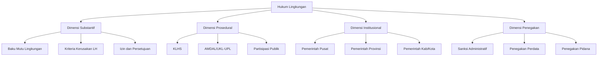
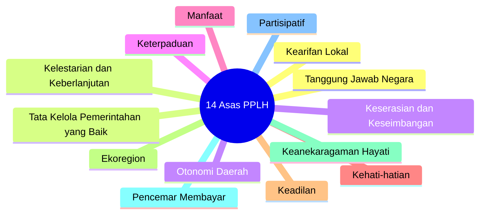
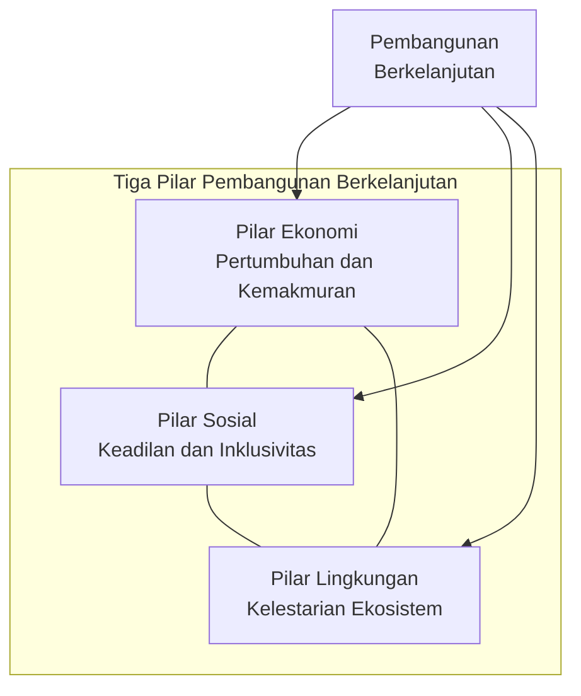

---
title: "Konsep Dasar dan Prinsip Hukum Lingkungan"
description: "Bab pertama buku ajar Hukum Lingkungan yang membahas definisi, dasar konstitusional, 14 asas PPLH, prinsip pembangunan berkelanjutan, pencemar membayar, kehati-hatian, tanggung jawab mutlak, serta hak dan kewajiban para pihak dalam perlindungan lingkungan hidup di Indonesia."
date: 2026-04-09
tags:
  - hukum-lingkungan
  - konsep-dasar
  - prinsip
  - sustainable-development
  - polluter-pays
  - precautionary
  - strict-liability
  - UU-32-2009
  - konstitusi
aliases:
  - Konsep Dasar Hukum Lingkungan
  - Prinsip PPLH
publish: true
---

# Konsep Dasar dan Prinsip Hukum Lingkungan

**Navigasi:**
- [[README|↑ Index]]
- [[02_Perubahan_Iklim|Perubahan Iklim →]]

---

## Tujuan Pembelajaran

Setelah mempelajari bab ini, mahasiswa diharapkan mampu:

1. Mendefinisikan hukum lingkungan secara komprehensif dan membedakannya dari hukum sumber daya alam
2. Menjelaskan dasar konstitusional perlindungan lingkungan hidup dalam UUD 1945
3. Menguraikan dan menganalisis keempat belas asas perlindungan dan pengelolaan lingkungan hidup menurut UU 32/2009
4. Menerapkan prinsip pembangunan berkelanjutan, pencemar membayar, kehati-hatian, dan tanggung jawab mutlak dalam analisis kasus
5. Mengidentifikasi *rights holders* dan *duty bearers* dalam sistem hukum lingkungan Indonesia
6. Mengevaluasi perubahan signifikan yang dibawa oleh UU Cipta Kerja terhadap rezim hukum lingkungan
7. Menganalisis studi kasus penerapan prinsip-prinsip hukum lingkungan di Indonesia

---

## 1. Definisi dan Ruang Lingkup Hukum Lingkungan

### 1.1 Pengertian Normatif Menurut Peraturan Perundang-undangan

Undang-Undang Nomor 32 Tahun 2009 tentang Perlindungan dan Pengelolaan Lingkungan Hidup (UU PPLH) memberikan definisi normatif yang menjadi titik tolak pembahasan hukum lingkungan Indonesia. Pasal 1 angka 1 mendefinisikan lingkungan hidup sebagai berikut:

> "Lingkungan hidup adalah kesatuan ruang dengan semua benda, daya, keadaan, dan makhluk hidup, termasuk manusia dan perilakunya, yang mempengaruhi alam itu sendiri, kelangsungan perikehidupan, dan kesejahteraan manusia serta makhluk hidup lain."

Definisi ini bersifat holistik karena mencakup tidak hanya komponen fisik dan biologis, melainkan juga manusia beserta perilakunya. Pendekatan ini mencerminkan paradigma ekosentris yang mengakui keterkaitan antara manusia dan lingkungan sebagai satu kesatuan yang tidak dapat dipisahkan.

Selanjutnya, Pasal 1 angka 2 mendefinisikan **perlindungan dan pengelolaan lingkungan hidup** (PPLH):

> "Perlindungan dan pengelolaan lingkungan hidup adalah upaya sistematis dan terpadu yang dilakukan untuk melestarikan fungsi lingkungan hidup dan mencegah terjadinya pencemaran dan/atau kerusakan lingkungan hidup yang meliputi perencanaan, pemanfaatan, pengendalian, pemeliharaan, pengawasan, dan penegakan hukum."

Dari definisi tersebut dapat diidentifikasi enam elemen PPLH yang membentuk satu rangkaian pengelolaan terpadu: perencanaan, pemanfaatan, pengendalian, pemeliharaan, pengawasan, dan penegakan hukum. Keenam elemen ini bersifat sekuensial sekaligus saling melengkapi.

Pasal 1 angka 3 turut mendefinisikan **pembangunan berkelanjutan** sebagai:

> "Pembangunan berkelanjutan adalah upaya sadar dan terencana yang memadukan aspek lingkungan hidup, sosial, dan ekonomi ke dalam strategi pembangunan untuk menjamin keutuhan lingkungan hidup serta keselamatan, kemampuan, kesejahteraan, dan mutu hidup generasi masa kini dan generasi masa depan."

### 1.2 Pengertian Menurut Perspektif Akademis

Para ahli hukum lingkungan Indonesia telah memberikan berbagai definisi yang saling melengkapi. **Koesnadi Hardjasoemantri**, salah satu perintis hukum lingkungan Indonesia, mendefinisikan hukum lingkungan sebagai hukum yang mengatur tatanan lingkungan hidup dan mencakup dua aspek utama: hukum lingkungan modern yang berorientasi pada perlindungan lingkungan (*milieubeschermingsrecht*) dan hukum lingkungan klasik yang berorientasi pada penggunaan lingkungan (*milieugebruiksrecht*).

**Takdir Rahmadi** mengartikan hukum lingkungan sebagai sekumpulan ketentuan dan prinsip hukum yang bertujuan melindungi dan melestarikan lingkungan hidup, mencegah terjadinya pencemaran dan kerusakan lingkungan, serta mengendalikan pemanfaatan sumber daya alam secara bijaksana. Sementara itu, **Siti Sundari Rangkuti** menekankan bahwa hukum lingkungan merupakan bidang hukum yang bersifat *interdisipliner* karena bersentuhan dengan berbagai cabang ilmu hukum seperti hukum administrasi negara, hukum perdata, hukum pidana, dan hukum internasional.

Dalam konteks internasional, **Philippe Sands dan Jacqueline Peel** mendefinisikan hukum lingkungan internasional sebagai keseluruhan norma hukum yang mengatur perilaku negara dan aktor internasional lainnya dalam hubungannya dengan pencegahan, pengurangan, dan pengendalian kerusakan lingkungan, serta alokasi dan konservasi sumber daya alam.

Dari berbagai definisi akademis tersebut, dapat diidentifikasi beberapa karakteristik kunci hukum lingkungan: pertama, sifatnya yang **interdisipliner** karena bersinggungan dengan berbagai cabang hukum; kedua, orientasinya yang **preventif** karena lebih mengutamakan pencegahan daripada penanganan setelah terjadi kerusakan; ketiga, **dinamis** karena terus berkembang mengikuti perkembangan ilmu pengetahuan, teknologi, dan kesadaran lingkungan; serta keempat, **lintas batas** karena persoalan lingkungan tidak mengenal batas administrasi maupun batas negara. Pemahaman terhadap karakteristik ini penting untuk menyadari bahwa hukum lingkungan tidak dapat dipahami secara sempit dalam kerangka satu disiplin hukum saja, melainkan memerlukan pendekatan yang holistik dan integratif.

### 1.3 Ruang Lingkup Hukum Lingkungan

Hukum lingkungan memiliki cakupan yang luas dan dapat dipahami melalui empat dimensi berikut:

| Dimensi | Cakupan | Contoh Instrumen |
|---------|---------|------------------|
| **Substantif** | Norma perlindungan lingkungan, standar baku mutu, perizinan | Baku mutu air, baku mutu udara, baku mutu air laut |
| **Prosedural** | Mekanisme dan tahapan pengelolaan lingkungan | AMDAL, KLHS, partisipasi publik, konsultasi |
| **Institusional** | Struktur kelembagaan dan pembagian kewenangan | Kementerian LHK, Dinas LH Provinsi/Kab/Kota |
| **Penegakan** | Mekanisme sanksi dan pemulihan | Sanksi administratif, gugatan perdata, pidana |

### 1.4 Hukum Lingkungan dan Hukum Sumber Daya Alam

Penting untuk membedakan hukum lingkungan dari hukum sumber daya alam (SDA), meskipun keduanya saling berkaitan. Perbedaan mendasar terletak pada orientasi dan pendekatan yang digunakan:

| Aspek | Hukum Lingkungan | Hukum Sumber Daya Alam |
|-------|------------------|------------------------|
| **Fokus utama** | Perlindungan fungsi lingkungan hidup | Pemanfaatan dan pengelolaan SDA |
| **Orientasi** | Konservasi dan keberlanjutan | Ekonomi dan pembangunan |
| **Pendekatan** | Holistik dan berbasis ekosistem | Sektoral (kehutanan, pertambangan, perikanan) |
| **Paradigma** | Ekosentris | Antroposentris-utilitarian |
| **Contoh UU** | UU 32/2009 tentang PPLH | UU Kehutanan, UU Minerba, UU Perikanan |
| **Objek pengaturan** | Lingkungan sebagai kesatuan ekosistem | SDA sebagai komoditas ekonomi |

Meskipun demikian, dalam perkembangannya kedua bidang hukum ini semakin konvergen. UU 32/2009 sendiri menggunakan istilah "perlindungan dan pengelolaan" yang menunjukkan integrasi antara aspek konservasi dan pemanfaatan. Pemanfaatan sumber daya alam yang tidak memperhatikan daya dukung dan daya tampung lingkungan akan menimbulkan pencemaran dan kerusakan lingkungan, sehingga pendekatan holistik menjadi keniscayaan.

### 1.5 Pendekatan Ekosentris dan Antroposentris

Perdebatan antara pendekatan **ekosentris** dan **antroposentris** mewarnai perkembangan hukum lingkungan secara global dan di Indonesia. Pendekatan antroposentris memandang lingkungan hidup sebagai objek yang dikelola untuk kepentingan manusia, sedangkan pendekatan ekosentris mengakui nilai intrinsik alam dan makhluk hidup lainnya terlepas dari manfaatnya bagi manusia.

UU 32/2009 mencerminkan perpaduan kedua pendekatan tersebut. Di satu sisi, definisi lingkungan hidup dalam Pasal 1 angka 1 yang menyebut "kesejahteraan manusia" menunjukkan unsur antroposentris. Di sisi lain, frasa "serta makhluk hidup lain" dan pengakuan terhadap nilai keanekaragaman hayati (Pasal 2 huruf i) mengindikasikan adopsi elemen ekosentris. Dalam perkembangan terkini, gerakan *rights of nature* yang mengakui hak hukum bagi alam (seperti yang telah diterapkan di Ekuador, Bolivia, dan Selandia Baru) menjadi wacana yang semakin relevan bagi pengembangan hukum lingkungan Indonesia, khususnya terkait perlindungan ekosistem kritis seperti hutan tropis dan terumbu karang.

### 1.6 Sejarah Perkembangan Hukum Lingkungan Indonesia

Hukum lingkungan Indonesia telah mengalami evolusi signifikan yang dapat ditelusuri melalui tiga generasi undang-undang pokok lingkungan hidup, yang kemudian diubah oleh UU Cipta Kerja:

**Generasi Pertama: UU Nomor 4 Tahun 1982 (UULH)**
Undang-Undang tentang Ketentuan-Ketentuan Pokok Pengelolaan Lingkungan Hidup ini merupakan *umbrella act* pertama yang meletakkan dasar hukum pengelolaan lingkungan hidup di Indonesia. UU ini lahir sebagai respons terhadap Konferensi Stockholm 1972 tentang Lingkungan Hidup Manusia dan persiapan Indonesia menjelang Repelita III yang menggalakkan industrialisasi. UU 4/1982 hanya terdiri dari 24 pasal dan bersifat umum serta deklaratif, namun memiliki arti penting sebagai fondasi awal pembangunan hukum lingkungan nasional. UU ini memperkenalkan konsep lingkungan hidup sebagai karunia Tuhan Yang Maha Esa dan menetapkan asas pelestarian kemampuan lingkungan yang serasi dan seimbang.

**Generasi Kedua: UU Nomor 23 Tahun 1997 (UUPLH)**
Undang-Undang tentang Pengelolaan Lingkungan Hidup ini menggantikan UU 4/1982 dengan memberikan pengaturan yang lebih komprehensif dan operasional. UU 23/1997 terdiri dari 52 pasal dan memperkenalkan sejumlah instrumen hukum baru: konsep AMDAL yang lebih tegas dan terstruktur, mekanisme penyelesaian sengketa lingkungan melalui jalur pengadilan (*litigasi*) dan di luar pengadilan (*alternatif penyelesaian sengketa*), ketentuan pidana lingkungan yang lebih rinci dengan ancaman sanksi yang lebih berat, serta konsep tanggung jawab mutlak (*strict liability*) yang untuk pertama kalinya diakui secara eksplisit. Meskipun demikian, dalam implementasinya UU 23/1997 masih menghadapi berbagai kelemahan, antara lain lemahnya penegakan hukum, tumpang tindih kewenangan antar-kementerian, serta belum terintegrasinya isu-isu kontemporer seperti perubahan iklim, keanekaragaman hayati, dan perdagangan karbon.

**Generasi Ketiga: UU Nomor 32 Tahun 2009 (UU PPLH)**
UU PPLH merupakan penyempurnaan paling komprehensif dengan 127 pasal yang jauh melampaui pendahulunya baik dari segi kuantitas maupun kualitas pengaturan. UU ini lahir dari proses legislasi yang panjang dan partisipatif, melibatkan masukan dari akademisi, organisasi masyarakat sipil, pelaku usaha, dan pemerintah daerah.

Terobosan utama UU 32/2009 meliputi: pertama, penetapan empat belas asas PPLH yang komprehensif; kedua, pengenalan instrumen KLHS sebagai instrumen pencegahan strategis pada level kebijakan; ketiga, penguatan mekanisme AMDAL termasuk keterlibatan masyarakat; keempat, pengaturan instrumen ekonomi lingkungan yang lebih rinci; kelima, penegasan tanggung jawab mutlak (*strict liability*) untuk kegiatan terkait B3; keenam, penguatan hak gugat organisasi lingkungan hidup dan hak gugat pemerintah; ketujuh, kriminalisasi perbuatan korporasi melalui ketentuan pidana yang lebih tegas dan bervariasi; kedelapan, pengakuan eksplisit terhadap hak atas lingkungan hidup yang baik dan sehat sebagai turunan dari hak konstitusional; dan kesembilan, integrasi isu perubahan iklim dan perlindungan lapisan ozon ke dalam kerangka hukum nasional. UU ini juga memperkenalkan konsep paksaan pemerintah (*bestuursdwang*) sebagai instrumen penegakan hukum administratif yang lebih efektif.

**Perubahan oleh UU Cipta Kerja (UU 6/2023)**
UU Nomor 6 Tahun 2023 tentang Penetapan Perppu Nomor 2 Tahun 2022 tentang Cipta Kerja menjadi Undang-Undang telah mengubah sejumlah ketentuan penting dalam UU 32/2009. Perubahan ini menjadi topik pembahasan tersendiri dalam Bagian 9 bab ini.

---

## 2. Dasar Konstitusional Hukum Lingkungan

### 2.1 Pasal 28H ayat (1) UUD 1945

Dasar konstitusional utama hukum lingkungan Indonesia terdapat dalam Bab XA tentang Hak Asasi Manusia. Pasal 28H ayat (1) UUD 1945 menegaskan:

> "Setiap orang berhak hidup sejahtera lahir dan batin, bertempat tinggal, dan mendapatkan **lingkungan hidup yang baik dan sehat** serta berhak memperoleh pelayanan kesehatan."

Ketentuan ini menempatkan hak atas lingkungan hidup yang baik dan sehat sebagai **hak asasi manusia** yang dijamin oleh konstitusi. Konsekuensi yuridisnya, negara memiliki kewajiban konstitusional (*constitutional obligation*) untuk melindungi, memajukan, menegakkan, dan memenuhi hak tersebut. Pelanggaran terhadap hak ini dapat menjadi dasar pengajuan gugatan, termasuk pengujian konstitusionalitas undang-undang melalui Mahkamah Konstitusi.

Hak atas lingkungan hidup yang baik dan sehat bersifat *non-derogable* dalam arti tidak dapat dikurangi dalam keadaan apa pun, sebagaimana ditegaskan dalam Pasal 28I ayat (1) UUD 1945 yang melindungi hak untuk hidup. Lingkungan hidup yang tercemar dan rusak secara langsung mengancam hak untuk hidup itu sendiri.

### 2.2 Pasal 33 UUD 1945

Pasal 33 UUD 1945 memberikan landasan konstitusional terkait hubungan antara perekonomian nasional dan pengelolaan lingkungan hidup. Ayat (3) menyatakan:

> "Bumi dan air dan kekayaan alam yang terkandung di dalamnya dikuasai oleh negara dan dipergunakan untuk sebesar-besar kemakmuran rakyat."

Ketentuan ini meletakkan konsep **hak menguasai negara** (*right to control*) atas sumber daya alam yang harus digunakan untuk kemakmuran rakyat. Mahkamah Konstitusi dalam berbagai putusannya telah menafsirkan bahwa "dikuasai oleh negara" tidak identik dengan "dimiliki oleh negara", melainkan mencakup fungsi mengatur (*regelendaad*), mengurus (*bestuursdaad*), mengelola (*beheersdaad*), dan mengawasi (*toezichthoudensdaad*).

Lebih lanjut, Pasal 33 ayat (4) yang ditambahkan melalui Amendemen Keempat UUD 1945 menyatakan:

> "Perekonomian nasional diselenggarakan berdasar atas demokrasi ekonomi dengan prinsip kebersamaan, efisiensi berkeadilan, berkelanjutan, **berwawasan lingkungan**, kemandirian, serta dengan menjaga keseimbangan kemajuan dan kesatuan ekonomi nasional."

Frasa "berkelanjutan" dan "berwawasan lingkungan" dalam ayat ini merupakan pengakuan konstitusional bahwa pembangunan ekonomi harus memperhatikan aspek keberlanjutan lingkungan hidup. Ketentuan ini sejalan dengan konsep pembangunan berkelanjutan (*sustainable development*) yang diakui secara universal.

### 2.3 Putusan Mahkamah Konstitusi yang Relevan

Mahkamah Konstitusi telah mengeluarkan sejumlah putusan penting yang memperkuat perlindungan lingkungan hidup di Indonesia. Salah satu putusan terbaru yang signifikan adalah **Putusan MK Nomor 119/PUU-XXIII/2025** yang dibacakan pada 28 Agustus 2025 mengenai pengujian Pasal 66 UU 32/2009.

Pasal 66 UU 32/2009 mengatur tentang perlindungan hukum bagi pejuang lingkungan hidup, yang menyatakan bahwa setiap orang yang memperjuangkan hak atas lingkungan hidup yang baik dan sehat tidak dapat dituntut secara pidana maupun digugat secara perdata. Namun, Penjelasan Pasal 66 membatasi cakupan perlindungan tersebut hanya untuk "korban dan/atau pelapor yang menempuh cara hukum."

Dalam putusannya, Mahkamah Konstitusi menyatakan bahwa pembatasan tersebut bertentangan dengan UUD 1945 dan memperluas cakupan perlindungan Pasal 66 kepada **setiap orang** yang memperjuangkan hak atas lingkungan hidup, tidak terbatas pada korban dan pelapor saja. Putusan ini merupakan tonggak penting bagi perlindungan aktivis dan pejuang lingkungan hidup di Indonesia, yang selama ini kerap menghadapi ancaman kriminalisasi dan gugatan strategis (*Strategic Lawsuits Against Public Participation*/SLAPP).

---

## 3. Empat Belas Asas Perlindungan dan Pengelolaan Lingkungan Hidup

### 3.1 Landasan Normatif

Pasal 2 UU 32/2009 menetapkan bahwa perlindungan dan pengelolaan lingkungan hidup dilaksanakan berdasarkan empat belas asas. Keempat belas asas ini membentuk kerangka filosofis dan operasional bagi seluruh kebijakan dan tindakan perlindungan lingkungan hidup di Indonesia.

### 3.2 Uraian Keempat Belas Asas

Berikut uraian lengkap masing-masing asas beserta penjelasannya:

**(a) Asas Tanggung Jawab Negara**
Negara menjamin pemanfaatan sumber daya alam memberikan manfaat yang sebesar-besarnya bagi kesejahteraan dan mutu hidup rakyat, baik generasi masa kini maupun generasi masa depan. Negara juga menjamin hak warga negara atas lingkungan hidup yang baik dan sehat, serta mencegah dilakukannya kegiatan pemanfaatan sumber daya alam yang menimbulkan pencemaran dan/atau kerusakan lingkungan hidup. Asas ini merupakan penjabaran dari Pasal 33 UUD 1945 dan menempatkan negara sebagai penjamin utama (*guarantor*) perlindungan lingkungan.

**(b) Asas Kelestarian dan Keberlanjutan**
Setiap orang memikul kewajiban dan tanggung jawab terhadap generasi mendatang serta terhadap sesamanya dalam satu generasi dengan melakukan upaya pelestarian daya dukung ekosistem dan memperbaiki kualitas lingkungan hidup. Asas ini merupakan cerminan dari prinsip pembangunan berkelanjutan dan keadilan antargenerasi (*intergenerational equity*).

**(c) Asas Keserasian dan Keseimbangan**
Pemanfaatan lingkungan hidup harus memperhatikan berbagai aspek seperti kepentingan ekonomi, sosial, budaya, dan perlindungan serta pelestarian ekosistem. Asas ini menuntut keseimbangan antara pembangunan ekonomi dan perlindungan lingkungan, sehingga tidak terjadi pengutamaan satu aspek dengan mengorbankan aspek lainnya.

**(d) Asas Keterpaduan**
Perlindungan dan pengelolaan lingkungan hidup dilakukan dengan memadukan berbagai unsur atau menyinergikan berbagai komponen terkait. Asas ini mensyaratkan koordinasi antarsektor, antardaerah, dan antarpemangku kepentingan dalam pengelolaan lingkungan hidup, mengingat isu lingkungan bersifat lintas batas dan lintas sektor.

**(e) Asas Manfaat**
Segala usaha dan/atau kegiatan pembangunan yang dilaksanakan disesuaikan dengan potensi sumber daya alam dan lingkungan hidup untuk peningkatan kesejahteraan masyarakat dan harkat manusia yang selaras dengan lingkungannya. Asas ini menekankan bahwa pemanfaatan lingkungan harus memberikan manfaat nyata bagi masyarakat tanpa merusak fungsi lingkungan.

**(f) Asas Kehati-hatian** (*Precautionary Principle*)
Ketidakpastian mengenai dampak suatu usaha dan/atau kegiatan karena keterbatasan penguasaan ilmu pengetahuan dan teknologi bukan merupakan alasan untuk menunda langkah-langkah meminimalisasi atau menghindari ancaman terhadap pencemaran dan/atau kerusakan lingkungan hidup. Asas ini dibahas secara mendalam dalam Bagian 6.

**(g) Asas Keadilan**
Perlindungan dan pengelolaan lingkungan hidup harus mencerminkan keadilan secara proporsional bagi setiap warga negara, baik lintas daerah, lintas generasi, maupun lintas gender. Asas ini mencakup keadilan distributif (pembagian beban dan manfaat lingkungan secara adil), keadilan prosedural (akses yang setara dalam proses pengambilan keputusan), dan keadilan korektif (pemulihan hak bagi yang dirugikan).

**(h) Asas Ekoregion**
Perlindungan dan pengelolaan lingkungan hidup harus memperhatikan karakteristik sumber daya alam, ekosistem, kondisi geografis, budaya masyarakat setempat, dan kearifan lokal. Pendekatan ekoregion melampaui batas administrasi pemerintahan dan menggunakan ekosistem sebagai basis pengelolaan.

**(i) Asas Keanekaragaman Hayati**
Perlindungan dan pengelolaan lingkungan hidup harus memperhatikan upaya terpadu untuk mempertahankan keberadaan, keragaman, dan keberlanjutan sumber daya alam hayati yang terdiri atas sumber daya alam nabati dan sumber daya alam hewani bersama dengan ekosistemnya. Indonesia sebagai negara megadiversitas memiliki tanggung jawab khusus dalam pelestarian keanekaragaman hayati global.

**(j) Asas Pencemar Membayar** (*Polluter Pays Principle*)
Setiap penanggung jawab yang usaha dan/atau kegiatannya menimbulkan pencemaran dan/atau kerusakan lingkungan hidup wajib menanggung biaya pemulihan lingkungan. Asas ini dibahas secara mendalam dalam Bagian 5.

**(k) Asas Partisipatif**
Setiap anggota masyarakat didorong untuk berperan aktif dalam proses pengambilan keputusan dan pelaksanaan perlindungan dan pengelolaan lingkungan hidup, baik secara langsung maupun tidak langsung. Partisipasi publik merupakan prasyarat legitimasi kebijakan lingkungan dan sejalan dengan prinsip demokrasi lingkungan.

**(l) Asas Kearifan Lokal**
Dalam perlindungan dan pengelolaan lingkungan hidup harus memperhatikan nilai-nilai luhur yang berlaku dalam tata kehidupan masyarakat. Asas ini mengakui peran penting pengetahuan tradisional dan praktik masyarakat adat dalam pengelolaan sumber daya alam yang berkelanjutan, seperti sistem *sasi* di Maluku, *awig-awig* di Bali dan Lombok, atau *lubuk larangan* di Sumatera.

**(m) Asas Tata Kelola Pemerintahan yang Baik** (*Good Governance*)
Perlindungan dan pengelolaan lingkungan hidup dijiwai oleh prinsip partisipasi, transparansi, akuntabilitas, efisiensi, dan keadilan. Asas ini menuntut bahwa setiap kebijakan dan tindakan pemerintah di bidang lingkungan harus dapat dipertanggungjawabkan dan dilakukan secara transparan.

**(n) Asas Otonomi Daerah**
Pemerintah dan pemerintah daerah mengatur dan mengurus sendiri urusan pemerintahan di bidang perlindungan dan pengelolaan lingkungan hidup dengan memperhatikan kekhususan dan keragaman daerah dalam bingkai Negara Kesatuan Republik Indonesia. Asas ini menyelaraskan desentralisasi pengelolaan lingkungan dengan kepentingan nasional.

---

## 4. Prinsip Pembangunan Berkelanjutan

### 4.1 Asal-Usul dan Definisi

Konsep **pembangunan berkelanjutan** (*sustainable development*) pertama kali dipopulerkan secara luas oleh **Laporan Brundtland** (*Our Common Future*, 1987) yang dikeluarkan oleh World Commission on Environment and Development (WCED). Laporan tersebut mendefinisikan pembangunan berkelanjutan sebagai:

> "Development that meets the needs of the present without compromising the ability of future generations to meet their own needs."

Terjemahan bebasnya: "Pembangunan yang memenuhi kebutuhan generasi sekarang tanpa mengorbankan kemampuan generasi mendatang untuk memenuhi kebutuhan mereka sendiri." Definisi ini mengandung dua konsep kunci: (1) konsep kebutuhan (*needs*), khususnya kebutuhan pokok masyarakat miskin yang harus diprioritaskan; dan (2) konsep keterbatasan (*limitations*) yang ditentukan oleh kondisi teknologi dan organisasi sosial terhadap kemampuan lingkungan untuk memenuhi kebutuhan masa kini dan masa depan.

Dalam konteks hukum Indonesia, pembangunan berkelanjutan telah diadopsi secara normatif dalam Pasal 1 angka 3 UU 32/2009 dan Pasal 33 ayat (4) UUD 1945 sebagaimana telah diuraikan sebelumnya.

### 4.2 Tiga Pilar Pembangunan Berkelanjutan

Pembangunan berkelanjutan bertumpu pada tiga pilar yang saling terkait dan tidak dapat dipisahkan:

**Pilar Ekonomi** menuntut pertumbuhan ekonomi yang berkeadilan dan berkelanjutan, yang tidak semata mengejar akumulasi kekayaan tetapi juga memperhatikan distribusi manfaat secara merata. Dalam konteks hukum lingkungan, pilar ini terwujud melalui instrumen ekonomi lingkungan seperti pajak lingkungan, perdagangan karbon, dan dana jaminan pemulihan lingkungan.

**Pilar Sosial** menekankan pemerataan kesempatan, pengentasan kemiskinan, penghormatan terhadap hak asasi manusia, termasuk hak atas lingkungan hidup yang baik dan sehat, serta partisipasi masyarakat dalam pengambilan keputusan. Keadilan lingkungan (*environmental justice*) merupakan manifestasi pilar sosial dalam konteks hukum lingkungan.

**Pilar Lingkungan** mensyaratkan pelestarian fungsi ekosistem, pengelolaan sumber daya alam secara bijaksana, dan pencegahan pencemaran serta kerusakan lingkungan. Pilar ini merupakan prasyarat bagi keberlangsungan kedua pilar lainnya, karena tanpa lingkungan yang sehat, pembangunan ekonomi dan kesejahteraan sosial tidak akan berkelanjutan.

### 4.3 Keterkaitan dengan Tujuan Pembangunan Berkelanjutan (SDGs)

Pada tahun 2015, Perserikatan Bangsa-Bangsa mengadopsi *Agenda 2030 for Sustainable Development* yang memuat 17 Tujuan Pembangunan Berkelanjutan (*Sustainable Development Goals*/SDGs). SDGs merupakan penyempurnaan dari *Millennium Development Goals* (MDGs) yang berakhir pada 2015, dengan cakupan yang lebih luas dan ambisius.

Beberapa SDGs yang berkaitan langsung dengan hukum lingkungan antara lain SDG 6 (Air Bersih dan Sanitasi), SDG 7 (Energi Bersih dan Terjangkau), SDG 12 (Konsumsi dan Produksi yang Bertanggung Jawab), SDG 13 (Penanganan Perubahan Iklim), SDG 14 (Ekosistem Lautan), dan SDG 15 (Ekosistem Daratan). Namun, pada hakikatnya dimensi lingkungan menjadi prasyarat pencapaian seluruh SDGs, karena tanpa keberlanjutan lingkungan, tujuan-tujuan seperti pengentasan kemiskinan (SDG 1), ketahanan pangan (SDG 2), dan kesehatan (SDG 3) tidak akan tercapai secara berkelanjutan.

Indonesia telah mengintegrasikan SDGs ke dalam Rencana Pembangunan Jangka Menengah Nasional (RPJMN) melalui Perpres Nomor 59 Tahun 2017 tentang Pelaksanaan Pencapaian Tujuan Pembangunan Berkelanjutan. Perpres ini menetapkan struktur kelembagaan untuk koordinasi SDGs termasuk pembentukan Tim Koordinasi Nasional dan keterlibatan pemangku kepentingan non-pemerintah dalam pemantauan dan implementasi. Pencapaian SDGs terkait lingkungan menjadi indikator penting bagi keberhasilan pembangunan berkelanjutan Indonesia.

### 4.4 Keadilan Antargenerasi (*Intergenerational Equity*)

Prinsip **keadilan antargenerasi** mewajibkan generasi sekarang untuk memastikan bahwa generasi mendatang memiliki akses yang setara terhadap sumber daya alam dan lingkungan hidup yang berkualitas. Edith Brown Weiss mengidentifikasi tiga prinsip turunan dari keadilan antargenerasi: (1) konservasi opsi (*conservation of options*) — menjaga keragaman sumber daya alam; (2) konservasi kualitas (*conservation of quality*) — menjaga kualitas lingkungan hidup; dan (3) konservasi akses (*conservation of access*) — menjamin akses yang adil terhadap warisan sumber daya.

Dalam hukum positif Indonesia, keadilan antargenerasi tercermin dalam Pasal 2 huruf b UU 32/2009 tentang asas kelestarian dan keberlanjutan, serta dalam definisi pembangunan berkelanjutan pada Pasal 1 angka 3 yang secara eksplisit menyebut "generasi masa kini dan generasi masa depan."

### 4.5 Keadilan Intragenerasi (*Intragenerational Equity*)

Di samping keadilan antargenerasi, prinsip **keadilan intragenerasi** menuntut distribusi yang adil atas beban dan manfaat lingkungan dalam generasi yang sama. Prinsip ini mencakup beberapa aspek: akses yang setara terhadap sumber daya alam bagi seluruh lapisan masyarakat, perlindungan kelompok rentan dari dampak pencemaran dan kerusakan lingkungan yang tidak proporsional, serta pembagian tanggung jawab yang adil antara negara maju dan negara berkembang dalam menangani persoalan lingkungan global.

Dalam konteks Indonesia, keadilan intragenerasi menjadi relevan ketika membahas dampak lingkungan yang tidak proporsional terhadap masyarakat adat, penduduk miskin di sekitar kawasan industri, dan komunitas pesisir yang rentan terhadap perubahan iklim. Lihat pembahasan lebih lanjut di [[06_Keadilan_Lingkungan|Keadilan Lingkungan]].

---

## 5. Prinsip Pencemar Membayar (*Polluter Pays Principle*)

### 5.1 Sejarah dan Perkembangan Internasional

Prinsip **pencemar membayar** memiliki akar historis yang dapat ditelusuri sejak awal tahun 1970-an. Berikut kronologi perkembangannya:

| Tahun | Perkembangan |
|-------|--------------|
| 1972 | OECD memperkenalkan prinsip *polluter pays* sebagai prinsip ekonomi untuk mengalokasikan biaya pencegahan dan pengendalian pencemaran |
| 1974 | OECD memperluas prinsip ini untuk mencakup biaya pemulihan lingkungan |
| 1992 | Prinsip 16 Deklarasi Rio tentang Lingkungan dan Pembangunan mengadopsi prinsip ini |
| 2009 | Indonesia mengadopsi prinsip ini secara eksplisit dalam Pasal 2 huruf j UU 32/2009 |

**Prinsip 16 Deklarasi Rio 1992** menyatakan:

> "National authorities should endeavour to promote the internalization of environmental costs and the use of economic instruments, taking into account the approach that the polluter should, in principle, bear the cost of pollution, with due regard to the public interest and without distorting international trade and investment."

Inti dari prinsip ini adalah **internalisasi biaya lingkungan** (*internalization of environmental costs*): pihak yang menyebabkan pencemaran harus menanggung biaya yang ditimbulkan oleh aktivitasnya, bukan membebankannya kepada masyarakat atau lingkungan secara umum (*externalities*).

### 5.2 Pengaturan dalam Hukum Indonesia

Pasal 2 huruf j UU 32/2009 menempatkan asas pencemar membayar sebagai salah satu asas PPLH. Penjelasan Pasal 2 huruf j menegaskan:

> "Yang dimaksud dengan 'asas pencemar membayar' adalah bahwa setiap penanggung jawab yang usaha dan/atau kegiatannya menimbulkan pencemaran dan/atau kerusakan lingkungan hidup wajib menanggung biaya pemulihan lingkungan."

Implementasi prinsip pencemar membayar dalam UU 32/2009 diwujudkan melalui beberapa mekanisme hukum:

1. **Kewajiban pemulihan fungsi lingkungan hidup** (Pasal 82): Pemerintah dapat memaksa penanggung jawab usaha untuk melakukan pemulihan fungsi lingkungan hidup akibat pencemaran atau kerusakan.
2. **Tanggung jawab ganti rugi** (Pasal 87): Setiap penanggung jawab usaha yang melakukan perbuatan melanggar hukum berupa pencemaran dan/atau perusakan lingkungan hidup yang menimbulkan kerugian pada orang lain atau lingkungan hidup wajib membayar ganti rugi dan/atau melakukan tindakan tertentu.
3. **Dana jaminan pemulihan lingkungan hidup** (Pasal 55 ayat 1): Pemegang izin lingkungan diwajibkan menyediakan dana jaminan untuk pemulihan fungsi lingkungan hidup.
4. **Instrumen ekonomi lingkungan** (Pasal 42-43): Meliputi perencanaan pembangunan dan kegiatan ekonomi, pendanaan lingkungan hidup, serta insentif dan/atau disinsentif.

### 5.3 Studi Kasus: PT Lapindo Brantas dan Lumpur Sidoarjo

Tragedi semburan lumpur panas Lapindo di Sidoarjo, Jawa Timur, yang terjadi pada 29 Mei 2006, merupakan salah satu kasus lingkungan terbesar dalam sejarah Indonesia dan menjadi ujian bagi penerapan prinsip pencemar membayar. Semburan lumpur yang berasal dari lokasi pengeboran PT Lapindo Brantas Inc. menggenangi ribuan hektare lahan, menenggelamkan permukiman, dan menimbulkan kerugian materiil serta immateriil yang sangat besar bagi masyarakat.

Proses hukum kasus Lapindo melibatkan berbagai jalur: Mahkamah Agung menolak gugatan perdata masyarakat terhadap PT Lapindo dalam beberapa putusan. Namun, Mahkamah Konstitusi mengeluarkan putusan-putusan penting, antara lain **Putusan MK Nomor 83/PUU-XI/2013** dan **Putusan MK Nomor 65/PUU-XIII/2015**, yang menyatakan bahwa tidak ada perbedaan perlakuan antara ganti rugi untuk pengusaha dan warga biasa yang sama-sama menjadi korban lumpur.

Dalam skema penyelesaian yang ditetapkan, tanggung jawab ganti rugi dibagi berdasarkan wilayah: tanah dan bangunan di dalam Peta Area Terdampak (PAT) menjadi tanggung jawab PT Lapindo Brantas, sedangkan yang berada di luar PAT dibebankan kepada APBN. Hingga kini, total utang Lapindo kepada pemerintah mencapai sekitar Rp2,2 triliun dan proses pelunasan ganti rugi belum sepenuhnya tuntas setelah hampir dua dekade berlalu.

Kasus Lapindo menimbulkan beberapa pelajaran penting dan problematika dalam penerapan prinsip pencemar membayar di Indonesia:

Pertama, **lambatnya proses penyelesaian**: setelah hampir dua dekade, ganti rugi belum sepenuhnya tuntas, menunjukkan kelemahan mekanisme eksekusi hukum lingkungan di Indonesia. Korban-korban yang kehilangan tempat tinggal dan mata pencaharian harus menunggu bertahun-tahun tanpa kepastian hukum yang jelas.

Kedua, **beralihnya sebagian beban tanggung jawab dari pencemar ke negara**: penggunaan dana APBN untuk menutupi ganti rugi di luar PAT menunjukkan bahwa pada praktiknya beban pencemaran dialihkan kepada publik, bertentangan dengan esensi prinsip pencemar membayar yang menghendaki internalisasi biaya oleh pencemar itu sendiri.

Ketiga, **lemahnya penegakan hukum pidana**: meskipun pencemaran berskala masif terjadi, penegakan hukum pidana terhadap korporasi pencemar tidak berjalan efektif. Dakwaan pidana terhadap PT Lapindo tidak berhasil, dan para pengambil keputusan korporasi tidak dimintai pertanggungjawaban pidana secara individual.

Keempat, **problematika kausalitas**: perdebatan mengenai apakah semburan lumpur disebabkan oleh aktivitas pengeboran atau bencana alam mengilustrasikan kompleksitas pembuktian kausalitas dalam kasus pencemaran lingkungan berskala besar.

Dari perspektif akademis, kasus Lapindo mengilustrasikan kesenjangan struktural antara norma hukum dan implementasinya, serta kebutuhan mendesak akan penguatan mekanisme pertanggungjawaban korporasi, perbaikan sistem eksekusi putusan pengadilan lingkungan, dan penguatan kapasitas pembuktian ilmiah dalam hukum lingkungan Indonesia.

### 5.4 Studi Kasus: PT Newmont Minahasa Raya — Teluk Buyat

Kasus pencemaran Teluk Buyat oleh PT Newmont Minahasa Raya menjadi preseden penting lainnya dalam konteks prinsip pencemar membayar. Masyarakat Buyat mengeluhkan berbagai masalah kesehatan yang diduga berkaitan dengan pembuangan tailing (limbah pertambangan) ke dasar laut oleh operasi tambang emas PT Newmont. Jaksa penuntut umum mendakwa PT Newmont dan mantan direkturnya dengan pencemaran lingkungan berdasarkan UU 23/1997 (yang saat itu masih berlaku).

Dalam putusan yang kontroversial, Pengadilan Negeri Manado membebaskan PT Newmont dari semua dakwaan pada tahun 2007. Meskipun demikian, sebagai bagian dari penyelesaian di luar pengadilan, PT Newmont menyediakan dana untuk program pengembangan masyarakat dan pemantauan lingkungan. Kasus ini memperlihatkan tantangan pembuktian dalam perkara pencemaran lingkungan, khususnya kausalitas antara aktivitas pertambangan dan dampak kesehatan masyarakat.

### 5.5 Kebakaran Hutan dan Lahan

Kebakaran hutan dan lahan yang kerap terjadi di Indonesia, terutama di Sumatera dan Kalimantan, juga menjadi medan penerapan prinsip pencemar membayar. Pemerintah Indonesia telah mengajukan gugatan perdata terhadap sejumlah perusahaan perkebunan yang dinilai bertanggung jawab atas kebakaran di konsesi mereka. Beberapa putusan pengadilan yang signifikan antara lain kemenangan gugatan pemerintah terhadap PT Bumi Mekar Hijau pada tahun 2016 (ganti rugi sebesar Rp78,5 miliar, kemudian dikuatkan oleh Mahkamah Agung) dan gugatan terhadap PT National Sago Prima. Putusan-putusan ini menunjukkan bahwa prinsip pencemar membayar secara bertahap mulai diterapkan secara efektif, meskipun tantangan dalam eksekusi putusan masih menjadi persoalan tersendiri.

---

## 6. Prinsip Kehati-hatian (*Precautionary Principle*)

### 6.1 Definisi dan Asal-Usul

Prinsip **kehati-hatian** (*precautionary principle*) merupakan salah satu prinsip fundamental dalam hukum lingkungan internasional. Asal-usul prinsip ini dapat ditelusuri dari konsep *Vorsorgeprinzip* dalam hukum lingkungan Jerman pada tahun 1970-an. Prinsip ini kemudian diadopsi secara luas dalam berbagai instrumen hukum internasional.

**Prinsip 15 Deklarasi Rio 1992** merumuskan prinsip kehati-hatian sebagai berikut:

> "In order to protect the environment, the precautionary approach shall be widely applied by States according to their capabilities. Where there are threats of serious or irreversible damage, lack of full scientific certainty shall not be used as a reason for postponing cost-effective measures to prevent environmental degradation."

### 6.2 Pengaturan dalam Hukum Indonesia

Dalam hukum Indonesia, prinsip kehati-hatian diadopsi sebagai salah satu asas PPLH. Pasal 2 huruf f UU 32/2009 beserta penjelasannya menegaskan:

> "Yang dimaksud dengan 'asas kehati-hatian' adalah bahwa ketidakpastian mengenai dampak suatu usaha dan/atau kegiatan karena keterbatasan penguasaan ilmu pengetahuan dan teknologi bukan merupakan alasan untuk menunda langkah-langkah meminimalisasi atau menghindari ancaman terhadap pencemaran dan/atau kerusakan lingkungan hidup."

### 6.3 Elemen-Elemen Prinsip Kehati-hatian

Berdasarkan rumusan di atas, prinsip kehati-hatian memuat tiga elemen esensial: pertama, adanya ancaman kerusakan yang serius atau tidak dapat dipulihkan (*irreversible*); kedua, terdapat ketidakpastian ilmiah mengenai kausalitas atau besaran dampak; dan ketiga, ketidakpastian tersebut tidak boleh menjadi alasan untuk menunda tindakan pencegahan yang efektif dari segi biaya.

Prinsip ini pada hakikatnya membalik beban pembuktian (*reversal of burden of proof*): dalam situasi ketidakpastian ilmiah, pihak yang mengusulkan suatu kegiatan harus membuktikan bahwa kegiatannya tidak akan menimbulkan dampak serius terhadap lingkungan, bukan sebaliknya. Hal ini berbeda dari pendekatan konvensional yang mensyaratkan bukti ilmiah yang pasti mengenai dampak negatif sebelum tindakan pencegahan dapat diambil.

### 6.4 Implementasi Praktis

Instrumen AMDAL (Analisis Mengenai Dampak Lingkungan) merupakan salah satu manifestasi utama prinsip kehati-hatian dalam hukum Indonesia. Sebelum suatu kegiatan yang berpotensi menimbulkan dampak penting terhadap lingkungan dilaksanakan, pemrakarsa wajib melakukan kajian dampak lingkungan secara komprehensif. AMDAL berfungsi sebagai mekanisme pencegahan dengan mengidentifikasi, memprediksi, dan mengevaluasi dampak lingkungan sebelum kegiatan dilaksanakan. Lihat pembahasan mendalam di [[05_AMDAL_Perizinan|AMDAL dan Perizinan Lingkungan]].

Selain AMDAL, prinsip kehati-hatian juga mendasari instrumen KLHS (Kajian Lingkungan Hidup Strategis) yang beroperasi pada level kebijakan, rencana, dan program. KLHS memastikan bahwa prinsip pembangunan berkelanjutan telah terintegrasi dalam perencanaan pembangunan, sebagaimana diatur dalam [[03_Perencanaan_Lingkungan|Perencanaan Lingkungan Hidup]].

### 6.5 Studi Kasus: Perdebatan Penambangan Dasar Laut (*Deep Sea Mining*)

Penerapan prinsip kehati-hatian menjadi sangat relevan dalam konteks penambangan dasar laut, sebuah isu yang semakin mengemuka dalam diskursus hukum lingkungan internasional. International Seabed Authority (ISA) telah menerima puluhan aplikasi eksplorasi mineral di dasar laut dalam (*deep sea mining*) untuk mengekstraksi nodul polimetalik, sulfida masif, dan kerak kobalt yang kaya akan mineral kritis seperti mangan, nikel, kobalt, dan logam tanah jarang.

Namun, pengetahuan ilmiah tentang ekosistem dasar laut masih sangat terbatas, dan potensi dampak penambangan terhadap keanekaragaman hayati laut yang belum banyak diketahui sangat besar dan berpotensi tidak dapat dipulihkan. Sejumlah negara, termasuk beberapa negara kepulauan Pasifik, telah menyerukan moratorium penambangan dasar laut berdasarkan prinsip kehati-hatian. ITLOS (International Tribunal for the Law of the Sea) dalam Pendapat Penasehat tahun 2011 juga menekankan pentingnya penerapan prinsip kehati-hatian dalam aktivitas di kawasan dasar laut internasional.

Bagi Indonesia sebagai negara kepulauan dengan wilayah laut yang luas, isu ini memiliki relevansi khusus terkait pengelolaan sumber daya mineral di dasar laut dalam zona ekonomi eksklusif dan landas kontinen Indonesia.

### 6.6 Hubungan dengan Instrumen AMDAL dan KLHS

Prinsip kehati-hatian merupakan landasan filosofis bagi dua instrumen pencegahan utama dalam hukum lingkungan Indonesia. AMDAL, sebagaimana diatur dalam Pasal 22-33 UU 32/2009, mewajibkan setiap usaha dan/atau kegiatan yang berdampak penting terhadap lingkungan hidup untuk memiliki dokumen AMDAL sebelum memperoleh persetujuan lingkungan. Proses AMDAL melibatkan identifikasi dampak (*scoping*), prediksi besaran dampak, evaluasi signifikansi dampak, dan perumusan rencana pengelolaan dan pemantauan lingkungan. Keseluruhan proses ini mencerminkan aplikasi prinsip kehati-hatian: tindakan pencegahan diambil berdasarkan kajian ilmiah, meskipun prediksi dampak tidak pernah bersifat pasti.

KLHS (Kajian Lingkungan Hidup Strategis), yang diatur dalam Pasal 15-18 UU 32/2009, menerapkan prinsip kehati-hatian pada level yang lebih tinggi, yaitu pada level kebijakan, rencana, dan program (KRP) pembangunan. Pemerintah dan pemerintah daerah wajib membuat KLHS untuk memastikan bahwa prinsip pembangunan berkelanjutan telah menjadi dasar dan terintegrasi dalam pembangunan suatu wilayah. KLHS berisi kajian tentang kapasitas daya dukung dan daya tampung lingkungan hidup, perkiraan dampak dan risiko lingkungan hidup, kinerja layanan atau jasa ekosistem, efisiensi pemanfaatan sumber daya alam, tingkat kerentanan dan kapasitas adaptasi terhadap perubahan iklim, serta tingkat ketahanan dan potensi keanekaragaman hayati.

Dengan demikian, prinsip kehati-hatian tidak hanya beroperasi pada level proyek individual (melalui AMDAL) tetapi juga pada level strategis perencanaan pembangunan (melalui KLHS), membentuk sistem pencegahan berlapis yang komprehensif. Pembahasan lengkap mengenai AMDAL terdapat di [[05_AMDAL_Perizinan|AMDAL dan Perizinan Lingkungan]], sementara pembahasan KLHS terdapat di [[03_Perencanaan_Lingkungan|Perencanaan Lingkungan Hidup]].

---

## 7. Prinsip Tanggung Jawab Mutlak (*Strict Liability*)

### 7.1 Pengertian dan Dasar Hukum

**Tanggung jawab mutlak** (*strict liability*) merupakan doktrin hukum yang mewajibkan penanggung jawab usaha atau kegiatan untuk bertanggung jawab atas kerugian yang ditimbulkan tanpa perlu dibuktikan adanya unsur kesalahan (*fault*). Pasal 88 UU 32/2009 menyatakan:

> "Setiap orang yang tindakannya, usahanya, dan/atau kegiatannya menggunakan B3, menghasilkan dan/atau mengelola limbah B3, dan/atau yang menimbulkan ancaman serius terhadap lingkungan hidup bertanggung jawab mutlak atas kerugian yang terjadi tanpa perlu pembuktian unsur kesalahan."

Prinsip ini merupakan pengecualian dari doktrin pertanggungjawaban berdasarkan kesalahan (*fault-based liability*) yang lazim berlaku dalam hukum perdata. Rasionalitas di balik penerapan *strict liability* adalah bahwa kegiatan yang menggunakan atau menghasilkan bahan berbahaya dan beracun (B3) merupakan kegiatan berisiko tinggi (*abnormally dangerous activity*) yang secara inheren mengandung potensi bahaya besar bagi lingkungan dan kesehatan manusia.

### 7.2 Perbedaan dengan Pertanggungjawaban Berdasarkan Kesalahan

| Aspek | Tanggung Jawab Mutlak (*Strict Liability*) | Pertanggungjawaban Berdasarkan Kesalahan |
|-------|---------------------------------------------|------------------------------------------|
| **Unsur kesalahan** | Tidak perlu dibuktikan | Harus dibuktikan |
| **Beban pembuktian** | Beralih ke tergugat | Ada pada penggugat |
| **Ruang lingkup** | Kegiatan terkait B3 dan ancaman serius | Perbuatan melawan hukum umum |
| **Dasar hukum** | Pasal 88 UU 32/2009 | Pasal 87 UU 32/2009 jo. Pasal 1365 KUHPerdata |
| **Pembelaan** | Terbatas (force majeure, tindakan pihak ketiga) | Lengkap sesuai hukum perdata |

### 7.3 Cakupan Penerapan

Berdasarkan Pasal 88 UU 32/2009, tanggung jawab mutlak diterapkan terhadap tiga kategori kegiatan: pertama, kegiatan yang menggunakan Bahan Berbahaya dan Beracun (B3); kedua, kegiatan yang menghasilkan dan/atau mengelola limbah B3; dan ketiga, kegiatan yang menimbulkan ancaman serius terhadap lingkungan hidup. Kategori ketiga bersifat lebih luas dan memberikan ruang bagi pengadilan untuk menerapkan *strict liability* terhadap kegiatan berisiko tinggi yang tidak secara langsung terkait B3 tetapi menimbulkan ancaman serius terhadap lingkungan.

Penjelasan Pasal 88 UU 32/2009 menyatakan bahwa yang dimaksud dengan "bertanggung jawab mutlak" atau *strict liability* adalah unsur kesalahan tidak perlu dibuktikan oleh pihak penggugat sebagai dasar pembayaran ganti rugi. Ketentuan ini merupakan *lex specialis* dari ketentuan Pasal 1365 KUHPerdata tentang perbuatan melawan hukum yang mensyaratkan pembuktian unsur kesalahan.

Meskipun tanggung jawab mutlak membebaskan penggugat dari beban pembuktian kesalahan, terdapat beberapa **pembelaan** (*defense*) yang masih dapat diajukan oleh tergugat, antara lain: *force majeure* (keadaan memaksa yang berada di luar kendali tergugat), tindakan pihak ketiga yang tidak terkait dengan tergugat, serta kepatuhan penuh terhadap seluruh persyaratan perizinan lingkungan. Namun, pembelaan-pembelaan ini bersifat terbatas dan harus dibuktikan oleh tergugat (*reversal of burden of proof*).

Dalam praktik peradilan Indonesia, penerapan *strict liability* masih menghadapi tantangan, termasuk kecenderungan hakim untuk tetap mensyaratkan pembuktian unsur kesalahan dan belum adanya pedoman yang jelas mengenai batasan ganti rugi. Pengembangan yurisprudensi yang konsisten mengenai *strict liability* merupakan kebutuhan mendesak untuk memperkuat perlindungan lingkungan hidup melalui mekanisme pertanggungjawaban perdata.

Pembahasan lebih mendalam tentang tanggung jawab mutlak, termasuk yurisprudensi dan analisis kasus, dapat ditemukan di [[07_Tanggung_Jawab_Mutlak|Tanggung Jawab Mutlak]].

---

## 8. Hak dan Kewajiban dalam Hukum Lingkungan

### 8.1 Hak Setiap Orang atas Lingkungan Hidup

Pasal 65 UU 32/2009 memberikan jaminan hak yang komprehensif kepada setiap orang dalam konteks perlindungan lingkungan hidup. Ketujuh hak tersebut adalah:

1. **Hak atas lingkungan hidup yang baik dan sehat** sebagai bagian dari hak asasi manusia (ayat 1). Hak ini merupakan penjabaran langsung dari Pasal 28H ayat (1) UUD 1945.
2. **Hak atas pendidikan lingkungan hidup** (ayat 2). Negara berkewajiban menyelenggarakan pendidikan lingkungan baik formal maupun nonformal.
3. **Hak atas akses informasi** mengenai lingkungan hidup (ayat 2). Termasuk informasi mengenai kondisi lingkungan, kebijakan pemerintah, dan dampak kegiatan terhadap lingkungan.
4. **Hak atas akses partisipasi** dalam perlindungan dan pengelolaan lingkungan hidup (ayat 3). Meliputi partisipasi dalam penyusunan AMDAL, KLHS, dan proses pengambilan keputusan lainnya.
5. **Hak mengajukan usul dan/atau keberatan** terhadap rencana usaha dan/atau kegiatan yang diperkirakan dapat menimbulkan dampak terhadap lingkungan hidup (ayat 4).
6. **Hak mengajukan pengaduan** akibat dugaan pencemaran dan/atau perusakan lingkungan hidup (ayat 5).
7. **Hak atas perlindungan dari ancaman hukum** bagi yang memperjuangkan hak atas lingkungan hidup (Pasal 66). Sebagaimana telah diperkuat oleh Putusan MK 119/PUU-XXIII/2025.

Hak-hak tersebut sejalan dengan tiga pilar akses yang diakui secara internasional melalui **Konvensi Aarhus 1998** (*Convention on Access to Information, Public Participation in Decision-making and Access to Justice in Environmental Matters*), yaitu akses atas informasi, akses atas partisipasi, dan akses atas keadilan. Meskipun Indonesia bukan negara pihak Konvensi Aarhus, substansi tiga pilar tersebut telah terakomodasi dalam UU 32/2009.

Ketiga pilar akses tersebut bersifat saling menunjang dan membentuk satu kesatuan sistem demokrasi lingkungan. **Akses atas informasi** merupakan prasyarat bagi partisipasi yang bermakna: masyarakat tidak dapat berpartisipasi secara efektif dalam pengambilan keputusan lingkungan tanpa memiliki informasi yang memadai mengenai kondisi lingkungan, rencana kegiatan, dan potensi dampaknya. **Akses atas partisipasi** memastikan bahwa suara masyarakat, terutama masyarakat terdampak, didengar dan dipertimbangkan dalam proses pengambilan keputusan. **Akses atas keadilan** menyediakan mekanisme hukum bagi masyarakat untuk menuntut pertanggungjawaban apabila hak-hak lingkungannya dilanggar atau prosedur partisipasi tidak dijalankan dengan semestinya.

Dalam praktik, akses atas informasi lingkungan di Indonesia masih menghadapi berbagai kendala, termasuk keterbatasan transparansi data pemantauan lingkungan oleh pemerintah, kurangnya pengungkapan informasi lingkungan oleh pelaku usaha, dan belum optimalnya sistem informasi lingkungan hidup sebagaimana diamanatkan oleh UU 32/2009. Penguatan ketiga pilar akses ini merupakan agenda penting bagi demokratisasi pengelolaan lingkungan hidup di Indonesia.

### 8.2 Kewajiban Pemerintah

Pasal 63 UU 32/2009 mengatur pembagian tugas dan wewenang antara pemerintah pusat dan pemerintah daerah dalam perlindungan dan pengelolaan lingkungan hidup:

| Pemerintah Pusat (Pasal 63 ayat 1) | Pemerintah Provinsi (Pasal 63 ayat 2) | Pemerintah Kabupaten/Kota (Pasal 63 ayat 3) |
|-------------------------------------|---------------------------------------|----------------------------------------------|
| Menetapkan kebijakan nasional PPLH | Menetapkan kebijakan tingkat provinsi | Menetapkan kebijakan tingkat kabupaten/kota |
| Menetapkan norma, standar, prosedur, dan kriteria (NSPK) | Menetapkan dan melaksanakan KLHS provinsi | Menetapkan dan melaksanakan KLHS kabupaten/kota |
| Menetapkan baku mutu lingkungan hidup nasional | Menetapkan baku mutu lingkungan hidup daerah (lebih ketat dari nasional) | Melaksanakan baku mutu lingkungan hidup |
| Koordinasi dan pengendalian pencemaran lintas batas negara | Koordinasi dan pengendalian pencemaran lintas kabupaten/kota | Pengendalian pencemaran di wilayahnya |
| Penetapan dan pelaksanaan kebijakan pengendalian dampak perubahan iklim | Pengawasan terhadap ketaatan penanggung jawab usaha | Pengawasan dan penegakan hukum di daerah |

### 8.3 Kewajiban Pelaku Usaha

Pasal 67 dan 68 UU 32/2009 menetapkan kewajiban bagi setiap orang yang melakukan usaha dan/atau kegiatan yang berdampak terhadap lingkungan hidup:

- Menjaga keberlanjutan fungsi lingkungan hidup (Pasal 67)
- Memberikan informasi yang terkait dengan perlindungan dan pengelolaan lingkungan hidup secara benar, akurat, terbuka, dan tepat waktu (Pasal 68 huruf a)
- Menjaga keberlanjutan fungsi lingkungan hidup (Pasal 68 huruf b)
- Menaati ketentuan tentang baku mutu lingkungan hidup dan/atau kriteria baku kerusakan lingkungan hidup (Pasal 68 huruf c)

Kewajiban-kewajiban ini bersifat imperatif dan pelanggarannya dapat menimbulkan konsekuensi hukum berupa sanksi administratif, gugatan perdata, maupun tuntutan pidana. Lihat pembahasan lengkap tentang penegakan hukum di [[08_Penegakan_Hukum|Penegakan Hukum Lingkungan]].

### 8.4 Peran Serta Masyarakat

Pasal 70 UU 32/2009 mengakui hak masyarakat untuk berperan aktif dalam perlindungan dan pengelolaan lingkungan hidup. Peran serta masyarakat dapat berupa pengawasan sosial, pemberian saran, pendapat, usul, keberatan, dan pengaduan, serta penyampaian informasi dan/atau laporan. Peran serta masyarakat dilakukan untuk meningkatkan kepedulian dalam perlindungan dan pengelolaan lingkungan hidup, meningkatkan kemandirian, keberdayaan masyarakat, dan kemitraan, serta menumbuhkembangkan kemampuan dan kepeloporan masyarakat.

### 8.5 Hak Gugat Organisasi Lingkungan Hidup

Pasal 92 UU 32/2009 memberikan hak gugat kepada organisasi lingkungan hidup (*legal standing*) untuk mengajukan gugatan demi kepentingan pelestarian fungsi lingkungan hidup. Organisasi lingkungan hidup berhak mengajukan gugatan apabila memenuhi persyaratan: berbentuk badan hukum, menegaskan dalam anggaran dasarnya bahwa organisasi tersebut didirikan untuk kepentingan pelestarian fungsi lingkungan hidup, dan telah melaksanakan kegiatan nyata sesuai anggaran dasarnya paling singkat dua tahun. Hak gugat organisasi lingkungan hidup ini bersifat altruistik — organisasi tidak mengajukan gugatan untuk kepentingan dirinya sendiri melainkan untuk kepentingan lingkungan hidup dan masyarakat luas.

Di samping hak gugat organisasi, UU 32/2009 juga mengakui mekanisme gugatan lain yang memperluas akses masyarakat terhadap keadilan lingkungan: **gugatan perwakilan kelompok** (*class action*) berdasarkan Pasal 91, **hak gugat pemerintah dan pemerintah daerah** berdasarkan Pasal 90 untuk menuntut ganti rugi dan tindakan tertentu terhadap pencemar yang menimbulkan kerugian bagi lingkungan hidup, serta ***citizen lawsuit*** yang digunakan untuk menuntut pertanggungjawaban pemerintah atas kelalaian dalam memenuhi kewajiban perlindungan lingkungan. Seluruh mekanisme ini dibahas lebih mendalam di [[08_Penegakan_Hukum|Penegakan Hukum Lingkungan]].

---

## 9. Perubahan Pasca-UU Cipta Kerja

### 9.1 Konteks Perubahan

UU Nomor 6 Tahun 2023 tentang Penetapan Peraturan Pemerintah Pengganti Undang-Undang Nomor 2 Tahun 2022 tentang Cipta Kerja menjadi Undang-Undang telah membawa perubahan signifikan terhadap rezim hukum lingkungan Indonesia. UU Cipta Kerja mengubah sejumlah ketentuan dalam UU 32/2009 dengan tujuan menyederhanakan perizinan dan meningkatkan iklim investasi. Namun, perubahan ini menuai kritik dari berbagai kalangan karena dinilai melemahkan perlindungan lingkungan hidup.

### 9.2 Perubahan-Perubahan Utama

**Pertama, penghapusan izin lingkungan dan penggantiannya dengan persetujuan lingkungan.** UU Cipta Kerja menghapus konsep "izin lingkungan" sebagaimana diatur dalam UU 32/2009 dan menggantinya dengan "Persetujuan Lingkungan" yang merupakan bagian dari Perizinan Berusaha. Perubahan ini mengubah kedudukan hukum instrumen lingkungan dari izin yang berdiri sendiri menjadi bagian dari proses perizinan berusaha yang terintegrasi.

**Kedua, pengurangan partisipasi masyarakat dalam proses AMDAL.** UU Cipta Kerja mempersempit definisi "masyarakat" yang terlibat dalam proses penyusunan dan penilaian AMDAL. Jika sebelumnya masyarakat yang terlibat mencakup masyarakat terdampak, pemerhati lingkungan, dan masyarakat yang terpengaruh atas segala bentuk keputusan, UU Cipta Kerja membatasi peran tersebut sehingga menimbulkan kekhawatiran atas penurunan kualitas kajian dampak lingkungan.

**Ketiga, penghapusan Pasal 102 UU 32/2009.** Pasal 102 yang sebelumnya mengatur sanksi pidana bagi pengelolaan limbah B3 tanpa izin dihapus oleh UU Cipta Kerja. Penghapusan ini menimbulkan perdebatan karena dinilai memperlemah mekanisme penegakan hukum terhadap pengelolaan limbah berbahaya, meskipun pemerintah berargumen bahwa ketentuan pidana lainnya masih tetap berlaku.

**Keempat, pergeseran kewenangan.** UU Cipta Kerja mengalihkan sejumlah kewenangan terkait lingkungan hidup kepada pemerintah pusat, termasuk dalam hal penerbitan persetujuan lingkungan dan pengawasan. Pergeseran ini menimbulkan pertanyaan tentang efektivitas pengawasan mengingat Indonesia memiliki wilayah yang sangat luas dan beragam.

### 9.3 Peraturan Pelaksana: PP 22/2021

Peraturan Pemerintah Nomor 22 Tahun 2021 tentang Penyelenggaraan Perlindungan dan Pengelolaan Lingkungan Hidup merupakan peraturan pelaksana utama UU PPLH pasca-UU Cipta Kerja. PP ini sangat komprehensif dengan 514 pasal, 13 bab, dan 15 lampiran, mencakup pengaturan rinci mengenai KLHS, baku mutu lingkungan hidup, AMDAL, UKL-UPL, persetujuan lingkungan, instrumen ekonomi lingkungan, pengendalian pencemaran, pengelolaan B3 dan limbah B3, serta pemulihan fungsi lingkungan hidup.

### 9.4 Evaluasi Kritis

Perubahan-perubahan yang dibawa oleh UU Cipta Kerja mengundang perdebatan akademis dan publik yang intens. Di satu sisi, pemerintah berargumen bahwa penyederhanaan perizinan diperlukan untuk meningkatkan daya saing investasi dan mendorong pertumbuhan ekonomi. Di sisi lain, para ahli hukum lingkungan, organisasi masyarakat sipil, dan akademisi mengkhawatirkan bahwa perubahan-perubahan tersebut menggerus substansi perlindungan lingkungan yang telah dibangun selama puluhan tahun.

Evaluasi yang berimbang menuntut analisis mendalam terhadap implementasi nyata dari perubahan-perubahan ini, termasuk efektivitas PP 22/2021 sebagai peraturan pelaksana, konsistensi antara tujuan penyederhanaan dan perlindungan lingkungan, serta dampak nyata terhadap kualitas lingkungan hidup di Indonesia.

### 9.5 Implikasi bagi Prinsip-Prinsip Hukum Lingkungan

Perubahan yang dibawa oleh UU Cipta Kerja memiliki implikasi langsung terhadap penerapan prinsip-prinsip hukum lingkungan yang dibahas dalam bab ini. Pengurangan partisipasi masyarakat dalam AMDAL berpotensi melemahkan asas partisipatif (Pasal 2 huruf k). Penghapusan beberapa ketentuan pidana dapat mempengaruhi efektivitas asas pencemar membayar, karena ancaman pidana merupakan salah satu instrumen *deterrence* yang penting. Pergeseran kewenangan ke pemerintah pusat menimbulkan pertanyaan tentang pelaksanaan asas otonomi daerah (Pasal 2 huruf n) dan asas ekoregion (Pasal 2 huruf h) yang menghendaki pengelolaan berbasis karakteristik ekosistem setempat.

Dari perspektif asas kehati-hatian, penyederhanaan proses perizinan yang mempercepat persetujuan kegiatan usaha perlu dievaluasi secara hati-hati. Di satu sisi, efisiensi proses perizinan dapat mengurangi biaya dan waktu bagi pelaku usaha. Di sisi lain, percepatan proses tanpa diimbangi peningkatan kapasitas pengawasan berpotensi meningkatkan risiko kerusakan lingkungan, terutama dari kegiatan yang berdampak penting. Keseimbangan antara efisiensi ekonomi dan kehati-hatian lingkungan menjadi ujian utama bagi implementasi UU Cipta Kerja di bidang lingkungan hidup.

Perdebatan tentang dampak UU Cipta Kerja terhadap hukum lingkungan menunjukkan bahwa prinsip-prinsip hukum lingkungan bukan sekadar konsep teoritis, melainkan memiliki implikasi praktis yang nyata terhadap kualitas perlindungan lingkungan. Pemahaman yang mendalam tentang prinsip-prinsip ini menjadi modal penting bagi praktisi hukum untuk mengevaluasi kebijakan dan membela kepentingan perlindungan lingkungan dalam berbagai forum — legislatif, yudisial, maupun publik.

---

## Pertanyaan Refleksi

1. Bagaimana prinsip keadilan antargenerasi (*intergenerational equity*) dapat diimplementasikan secara konkret dalam kebijakan pertambangan dan kehutanan di Indonesia?
2. Evaluasi secara kritis penerapan prinsip pencemar membayar dalam kasus lumpur Lapindo Sidoarjo. Apakah pembagian tanggung jawab antara PT Lapindo Brantas dan APBN sudah sesuai dengan esensi prinsip tersebut?
3. Dalam situasi apa prinsip kehati-hatian (*precautionary principle*) dapat membatasi kegiatan ekonomi, dan bagaimana keseimbangan antara pembangunan ekonomi dan perlindungan lingkungan dapat dicapai?
4. Bandingkan pendekatan tanggung jawab mutlak (*strict liability*) dengan pertanggungjawaban berdasarkan kesalahan dalam konteks pencemaran lingkungan. Manakah yang lebih efektif untuk perlindungan lingkungan dan mengapa?
5. Analisis dampak perubahan UU Cipta Kerja terhadap partisipasi masyarakat dalam perlindungan lingkungan hidup. Apakah pengurangan peran masyarakat dalam AMDAL dapat mengancam kualitas perlindungan lingkungan?
6. Bagaimana Putusan MK Nomor 119/PUU-XXIII/2025 memperkuat perlindungan hukum bagi pejuang lingkungan hidup? Apa implikasinya terhadap pencegahan kriminalisasi aktivis lingkungan?
7. Jelaskan relevansi kearifan lokal (seperti *sasi*, *awig-awig*, *lubuk larangan*) dalam konteks asas PPLH dan berikan contoh bagaimana kearifan lokal dapat diintegrasikan dengan hukum modern.

---

## Referensi Peraturan

> [!info] Cross-Vault Links
> Dokumen lengkap tersedia di vault `regulationvault`. Lihat [[_referensi/REGULATIONVAULT_LINKS|Daftar Lengkap Cross-Vault Links]]

### UU 32/2009 tentang PPLH
**BAB I: Ketentuan Umum** (Pasal 1)
- Definisi lingkungan hidup (angka 1)
- Definisi PPLH (angka 2)
- Definisi pembangunan berkelanjutan (angka 3)

**BAB II: Asas, Tujuan, dan Ruang Lingkup** (Pasal 2-4)
- Pasal 2: 14 asas PPLH
  - Huruf f: Asas kehati-hatian (*precautionary*)
  - Huruf j: Asas pencemar membayar (*polluter pays*)

**BAB X: Hak, Kewajiban, dan Larangan** (Pasal 65-69)
- Pasal 65: Hak setiap orang atas lingkungan hidup
- Pasal 66: Perlindungan pejuang lingkungan hidup
- Pasal 67-68: Kewajiban pelaku usaha
- Pasal 70: Peran serta masyarakat

**BAB XII: Penyelesaian Sengketa** (Pasal 84-93)
- Pasal 87: Ganti rugi berdasarkan perbuatan melawan hukum
- Pasal 88: Tanggung jawab mutlak (*strict liability*)

Path: `regulationvault/05_ACTIVE/UU/2009/UU_32_2009/`

### PP 22/2021 tentang Penyelenggaraan PPLH
Peraturan pelaksana UU 32/2009 pasca UU Cipta Kerja
- 514 pasal, 13 BAB, 15 lampiran
- Path: `regulationvault/05_ACTIVE/PP/2021/PP_22_2021/`

### Konstitusi
- **Pasal 28H ayat (1) UUD 1945**: Hak atas lingkungan hidup yang baik dan sehat
- **Pasal 33 ayat (3) UUD 1945**: Penguasaan negara atas SDA
- **Pasal 33 ayat (4) UUD 1945**: Perekonomian berkelanjutan dan berwawasan lingkungan

### Deklarasi Internasional
- [[01-Traktat_Rio_Declaration_1992|Deklarasi Rio 1992]] — Prinsip pembangunan berkelanjutan
- [[01-Traktat_Stockholm_Declaration_1972|Deklarasi Stockholm 1972]] — Konferensi pertama lingkungan hidup manusia

### Referensi Regulasi Lengkap
- [[_referensi/REGULATION_INDEX|Indeks Regulasi Lingkungan]]

---

## Daftar Pustaka

- Brown Weiss, Edith. (1989). *In Fairness to Future Generations: International Law, Common Patrimony, and Intergenerational Equity*. Transnational Publishers.
- Hardjasoemantri, Koesnadi. (2012). *Hukum Tata Lingkungan*. Edisi Kedelapan. Gadjah Mada University Press.
- IPCC. (2023). *AR6 Synthesis Report: Climate Change 2023*. IPCC.
- OECD. (1972). *Recommendation of the Council on Guiding Principles concerning International Economic Aspects of Environmental Policies*. C(72)128.
- Rahmadi, Takdir. (2020). *Hukum Lingkungan di Indonesia*. Edisi Ketiga. Rajawali Pers.
- Rangkuti, Siti Sundari. (2005). *Hukum Lingkungan dan Kebijaksanaan Lingkungan Nasional*. Edisi Ketiga. Airlangga University Press.
- Sands, Philippe & Peel, Jacqueline. (2018). *Principles of International Environmental Law*. Edisi Keempat. Cambridge University Press.
- Santosa, Mas Achmad. (2016). *Alam Pun Butuh Hukum dan Keadilan: Refleksi Hakim Lingkungan*. AS@Publishing.
- Silalahi, Daud & Kristianto, Pria Hadi. (2015). *Hukum Lingkungan dalam Perkembangannya di Indonesia*. Keni Media.
- United Nations. (2015). *Transforming Our World: The 2030 Agenda for Sustainable Development*. UN Doc. A/RES/70/1.
- WCED. (1987). *Our Common Future (Brundtland Report)*. Oxford University Press.

### Peraturan Perundang-undangan
- Undang-Undang Dasar Negara Republik Indonesia Tahun 1945 (beserta Amandemen)
- Undang-Undang Nomor 4 Tahun 1982 tentang Ketentuan-Ketentuan Pokok Pengelolaan Lingkungan Hidup
- Undang-Undang Nomor 23 Tahun 1997 tentang Pengelolaan Lingkungan Hidup
- Undang-Undang Nomor 32 Tahun 2009 tentang Perlindungan dan Pengelolaan Lingkungan Hidup
- Undang-Undang Nomor 6 Tahun 2023 tentang Penetapan Perppu Nomor 2 Tahun 2022 tentang Cipta Kerja
- Peraturan Pemerintah Nomor 22 Tahun 2021 tentang Penyelenggaraan Perlindungan dan Pengelolaan Lingkungan Hidup

### Putusan Pengadilan
- Putusan Mahkamah Konstitusi Nomor 83/PUU-XI/2013 (kasus Lapindo)
- Putusan Mahkamah Konstitusi Nomor 65/PUU-XIII/2015 (kasus Lapindo)
- Putusan Mahkamah Konstitusi Nomor 119/PUU-XXIII/2025 (perlindungan aktivis lingkungan)

---

**Navigasi:**
- [[README|↑ Index]]
- [[02_Perubahan_Iklim|Perubahan Iklim →]]

