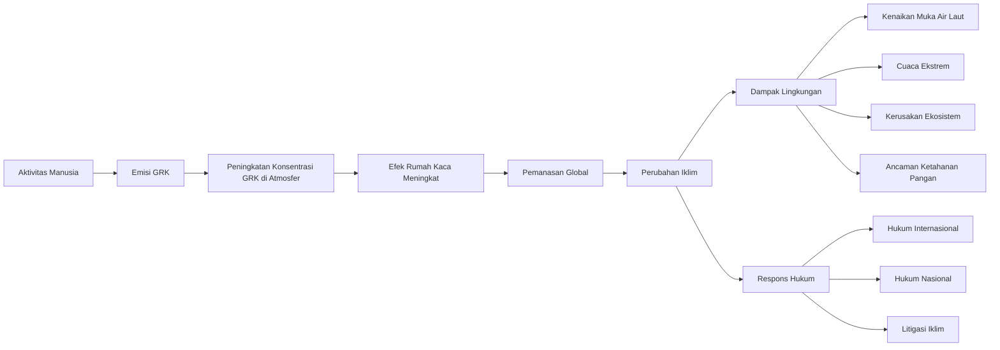
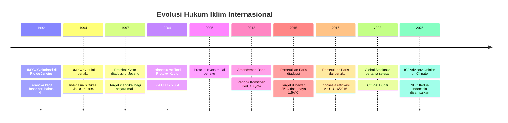

---
title: "Perubahan Iklim dan Hukum Lingkungan"
description: "Bab kedua buku ajar Hukum Lingkungan yang membahas kerangka hukum internasional perubahan iklim (UNFCCC, Protokol Kyoto, Persetujuan Paris), kebijakan iklim nasional Indonesia (NDC, perdagangan karbon, FOLU Net Sink), litigasi iklim global dan domestik, serta adaptasi dan mitigasi dalam konteks hukum."
date: 2026-04-09
tags:
  - hukum-lingkungan
  - 06-PerubahanIklim
  - climate-change
  - UNFCCC
  - Paris-Agreement
  - NDC
  - carbon-trading
  - litigasi-iklim
  - nilai-ekonomi-karbon
aliases:
  - Perubahan Iklim dan Hukum
  - Hukum Iklim Indonesia
publish: true
---

# Perubahan Iklim dan Hukum Lingkungan

**Navigasi:**
- [[01_Konsep_Dasar_Prinsip|← Konsep Dasar dan Prinsip]]
- [[README|↑ Index]]
- [[03_Perencanaan_Lingkungan|Perencanaan Lingkungan →]]

---

## Tujuan Pembelajaran

Setelah mempelajari bab ini, mahasiswa diharapkan mampu:

1. Menjelaskan hubungan fundamental antara perubahan iklim dan hukum lingkungan
2. Menguraikan evolusi kerangka hukum internasional perubahan iklim dari UNFCCC hingga Persetujuan Paris
3. Menganalisis kebijakan iklim nasional Indonesia, termasuk NDC dan regulasi nilai ekonomi karbon
4. Mengevaluasi perkembangan litigasi iklim baik di tingkat global maupun nasional
5. Membedakan konsep mitigasi dan adaptasi dalam konteks peraturan perundang-undangan Indonesia
6. Mengidentifikasi tantangan dan prospek hukum iklim Indonesia dalam konteks pembangunan berkelanjutan

---

## 1. Hubungan Perubahan Iklim dan Hukum Lingkungan

### 1.1 Basis Ilmiah Perubahan Iklim

Perubahan iklim merupakan fenomena global dan sistemik yang didorong oleh **emisi gas rumah kaca (GRK)** hasil aktivitas manusia. Laporan keenam *Intergovernmental Panel on Climate Change* (IPCC AR6), yang diselesaikan pada tahun 2023, menegaskan bahwa peningkatan konsentrasi karbon dioksida (CO₂), metana (CH₄), dan dinitrogen oksida (N₂O) di atmosfer telah menyebabkan peningkatan suhu permukaan bumi rata-rata sebesar 1,1°C sejak periode praindustri. IPCC menyimpulkan dengan tingkat keyakinan sangat tinggi bahwa aktivitas manusia merupakan penyebab utama pemanasan global yang diamati sejak pertengahan abad ke-20.

Mekanisme **efek rumah kaca** berlangsung sebagai berikut: radiasi matahari yang masuk ke bumi sebagian dipantulkan kembali ke angkasa dalam bentuk radiasi inframerah. Namun, gas-gas rumah kaca yang terakumulasi di atmosfer menyerap dan memancarkan kembali radiasi inframerah tersebut, sehingga panas terperangkap di atmosfer bumi dan menyebabkan peningkatan suhu global. Sumber utama emisi GRK meliputi: pembakaran bahan bakar fosil (batu bara, minyak bumi, gas alam) untuk pembangkitan listrik, pemanasan, dan transportasi yang menyumbang sekitar 73% emisi global; deforestasi dan degradasi hutan yang melepaskan karbon tersimpan ke atmosfer; kegiatan pertanian dan peternakan yang menghasilkan metana dari proses pencernaan ruminansia dan pengelolaan lahan sawah; serta proses industri termasuk produksi semen, baja, dan bahan kimia.

IPCC AR6 juga menegaskan bahwa dampak perubahan iklim yang diamati meliputi peningkatan frekuensi dan intensitas peristiwa cuaca ekstrem, kenaikan permukaan air laut rata-rata sebesar 3,7 milimeter per tahun selama dekade 2006-2018, penurunan tutupan es di Arktik dan Antartika, pergeseran zona iklim dan musim, serta peningkatan pengasaman laut. Laporan ini menyimpulkan bahwa setiap kenaikan tambahan suhu global akan memperbesar risiko secara tidak linier, menegaskan urgensi tindakan segera untuk membatasi pemanasan global.

### 1.2 Perubahan Iklim sebagai Isu Hukum Lingkungan

Perubahan iklim merupakan bentuk pencemaran dan kerusakan lingkungan dalam skala global yang memiliki dimensi hukum yang sangat kompleks. Berbeda dengan pencemaran konvensional yang bersifat lokal dan terukur, perubahan iklim memiliki karakteristik unik: sifatnya global (emisi dari satu negara berdampak pada seluruh dunia), kumulatif (efek akumulasi emisi sepanjang waktu), dan memiliki jeda waktu yang panjang antara penyebab dan akibat. Karakteristik ini menimbulkan tantangan khusus bagi sistem hukum dalam hal atribusi tanggung jawab, yurisdiksi, dan pembuktian kausalitas.

| Aspek | Hubungan dengan Hukum Lingkungan |
|-------|----------------------------------|
| **Emisi GRK** | Bentuk pencemaran udara lintas batas yang bersifat kumulatif |
| **Kenaikan suhu global** | Kerusakan ekosistem, hilangnya keanekaragaman hayati |
| **Kenaikan muka air laut** | Ancaman terhadap wilayah pesisir dan pulau kecil, kedaulatan wilayah |
| **Cuaca ekstrem** | Bencana lingkungan, kerugian ekonomi, korban jiwa |
| **Perubahan pola hujan** | Ancaman ketahanan pangan dan air bersih |
| **Pengasaman laut** | Kerusakan ekosistem terumbu karang dan perikanan |

### 1.3 Definisi Normatif dalam Hukum Indonesia

UU 32/2009 telah memasukkan perubahan iklim ke dalam kerangka hukum lingkungan nasional. Pasal 1 angka 19 mendefinisikan:

> "Perubahan iklim adalah berubahnya iklim yang diakibatkan langsung atau tidak langsung oleh aktivitas manusia sehingga menyebabkan perubahan komposisi atmosfir secara global dan selain itu juga berupa perubahan variabilitas iklim alamiah yang teramati pada kurun waktu yang dapat dibandingkan."

Definisi ini konsisten dengan definisi dalam Pasal 1 UNFCCC yang membedakan antara perubahan iklim akibat aktivitas manusia (*anthropogenic climate change*) dan variabilitas iklim alamiah. Dengan memasukkan definisi ini ke dalam UU PPLH, Indonesia mengakui perubahan iklim sebagai isu lingkungan yang memerlukan penanganan hukum secara komprehensif.

Lebih lanjut, Pasal 63 ayat (1) huruf p UU 32/2009 menempatkan pengendalian dampak perubahan iklim sebagai tugas pemerintah:

> "[Tugas dan wewenang Pemerintah meliputi] penetapan dan pelaksanaan kebijakan mengenai pengendalian dampak perubahan iklim dan perlindungan lapisan ozon."

### 1.4 Prinsip-Prinsip Hukum yang Mendasari

Penanganan perubahan iklim dalam kerangka hukum memerlukan penerapan beberapa prinsip hukum lingkungan yang telah dibahas dalam [[01_Konsep_Dasar_Prinsip|Bab 1]]. **Prinsip kehati-hatian** (*precautionary principle*) menjadi sangat relevan mengingat masih terdapat ketidakpastian ilmiah mengenai besaran dan kecepatan dampak perubahan iklim, namun potensi kerusakan bersifat serius dan tidak dapat dipulihkan. **Prinsip pencemar membayar** (*polluter pays principle*) mendasari mekanisme perdagangan karbon dan instrumen ekonomi lainnya yang menginternalisasi biaya emisi GRK ke dalam harga produksi. **Prinsip CBDR-RC** (*Common But Differentiated Responsibilities and Respective Capabilities*) yang spesifik untuk rezim hukum iklim internasional mengakui tanggung jawab yang berbeda antara negara maju dan negara berkembang. **Prinsip keadilan antargenerasi** (*intergenerational equity*) menegaskan bahwa generasi sekarang tidak boleh mewariskan beban perubahan iklim yang tidak dapat ditanggung oleh generasi mendatang.

Interaksi antara prinsip-prinsip ini menciptakan kerangka normatif yang kompleks namun koheren untuk menangani perubahan iklim melalui jalur hukum. Prinsip kehati-hatian mendorong tindakan segera meskipun terdapat ketidakpastian, prinsip pencemar membayar memastikan pihak yang bertanggung jawab menanggung biaya, CBDR-RC menjamin keadilan antarnegara, dan keadilan antargenerasi menjamin keadilan antarwaktu.

### 1.5 Kerentanan Khusus Indonesia

Indonesia memiliki tingkat kerentanan yang sangat tinggi terhadap dampak perubahan iklim karena beberapa faktor: sebagai negara kepulauan terbesar di dunia dengan lebih dari 17.000 pulau, Indonesia sangat rentan terhadap kenaikan muka air laut yang mengancam eksistensi pulau-pulau kecil dan wilayah pesisir. Hutan tropis Indonesia yang merupakan paru-paru dunia terancam oleh perubahan pola hujan dan peningkatan risiko kebakaran hutan. Sektor pertanian yang menjadi tumpuan penghidupan jutaan penduduk rentan terhadap perubahan musim dan cuaca ekstrem. Ekosistem terumbu karang yang menjadi kekayaan laut Indonesia terancam oleh kenaikan suhu laut dan pengasaman laut.

| Aspek Kerentanan | Dampak | Populasi Terdampak |
|------------------|--------|-------------------|
| Kenaikan muka air laut | Penggenangan wilayah pesisir, intrusi air asin, erosi pantai | ~65 juta penduduk pesisir |
| Perubahan pola hujan | Banjir dan kekeringan, gagal panen | Petani dan masyarakat pedesaan |
| Peningkatan suhu laut | Pemutihan terumbu karang, penurunan stok ikan | Nelayan, komunitas pesisir |
| Cuaca ekstrem | Banjir bandang, longsor, angin kencang | Seluruh lapisan masyarakat |
| Kebakaran hutan | Kerusakan hutan dan lahan gambut, kabut asap | Masyarakat Sumatera dan Kalimantan |

Pada saat bersamaan, Indonesia juga merupakan salah satu penghasil emisi GRK terbesar di dunia, terutama dari sektor penggunaan lahan dan kehutanan (*land use, land-use change, and forestry*/LULUCF) serta sektor energi. Posisi ganda ini — sebagai penyumbang emisi sekaligus korban perubahan iklim — menuntut pendekatan hukum yang komprehensif dan seimbang antara kewajiban mitigasi dan kebutuhan adaptasi.

---

## 2. Kerangka Hukum Internasional Perubahan Iklim

### 2.1 UNFCCC 1992

**Konvensi Kerangka Kerja Perserikatan Bangsa-Bangsa tentang Perubahan Iklim** (*United Nations Framework Convention on Climate Change*/UNFCCC) diadopsi pada Konferensi Tingkat Tinggi Bumi (*Earth Summit*) di Rio de Janeiro pada tahun 1992 dan mulai berlaku pada tanggal 21 Maret 1994. UNFCCC menjadi fondasi hukum internasional untuk penanganan perubahan iklim secara multilateral.

**Tujuan** UNFCCC sebagaimana dirumuskan dalam Pasal 2:

> "The ultimate objective of this Convention [...] is to achieve [...] stabilization of greenhouse gas concentrations in the atmosphere at a level that would prevent dangerous anthropogenic interference with the climate system."

Stabilisasi konsentrasi GRK di atmosfer pada tingkat yang dapat mencegah gangguan antropogenik berbahaya terhadap sistem iklim global merupakan tujuan utama yang menjadi acuan bagi seluruh perkembangan hukum iklim internasional selanjutnya.

**Prinsip-prinsip kunci** UNFCCC (Pasal 3) meliputi:

- **CBDR-RC** (*Common But Differentiated Responsibilities and Respective Capabilities*): Seluruh negara memiliki tanggung jawab bersama namun berbeda-beda sesuai dengan kontribusi historis terhadap emisi dan kapasitas masing-masing. Prinsip ini mengakui bahwa negara-negara maju memiliki tanggung jawab yang lebih besar mengingat kontribusi historis mereka terhadap akumulasi emisi GRK. Negara berkembang, termasuk Indonesia, berhak mendapatkan dukungan keuangan dan teknologi dari negara maju.
- **Prinsip kehati-hatian** (*precautionary principle*): Sebagaimana telah dibahas dalam [[01_Konsep_Dasar_Prinsip|Bab 1]], ketidakpastian ilmiah tidak boleh menjadi alasan penundaan aksi iklim.
- **Prinsip keadilan** (*equity*): Penanganan perubahan iklim harus dilakukan secara adil, dengan mempertimbangkan kebutuhan khusus negara berkembang yang rentan.

UNFCCC mengelompokkan negara-negara pihak ke dalam dua kategori utama: **Annex I** (negara-negara maju dan ekonomi transisi yang memiliki komitmen pengurangan emisi) dan **Non-Annex I** (negara-negara berkembang, termasuk Indonesia). Pengelompokan ini mencerminkan prinsip CBDR-RC.

Indonesia meratifikasi UNFCCC melalui **UU Nomor 6 Tahun 1994** tentang Pengesahan United Nations Framework Convention on Climate Change. Dengan ratifikasi ini, Indonesia terikat secara hukum untuk melaksanakan kewajiban-kewajiban berdasarkan Konvensi, termasuk menyusun inventarisasi emisi GRK nasional dan mengomunikasikan laporan nasional secara berkala.

Mekanisme kelembagaan UNFCCC mencakup **Conference of the Parties** (COP) yang merupakan badan pengambil keputusan tertinggi dan diselenggarakan setiap tahun. COP telah menjadi forum utama negosiasi iklim global dan melahirkan berbagai keputusan dan perjanjian turunan yang membentuk arsitektur hukum iklim internasional.

### 2.2 Protokol Kyoto 1997

**Protokol Kyoto** diadopsi pada COP3 di Kyoto, Jepang, pada tahun 1997 dan mulai berlaku pada 16 Februari 2005. Protokol ini merupakan langkah konkret pertama yang menetapkan target pengurangan emisi yang mengikat secara hukum (*legally binding*) bagi negara-negara Annex I.

**Periode Komitmen Pertama (2008-2012):** Negara-negara Annex I berkomitmen untuk mengurangi emisi GRK secara agregat setidaknya 5% di bawah tingkat emisi tahun 1990.

**Periode Komitmen Kedua (Amendemen Doha, 2013-2020):** Target pengurangan emisi ditingkatkan menjadi setidaknya 18% di bawah tingkat emisi tahun 1990. Namun, beberapa negara besar seperti Kanada, Jepang, dan Rusia tidak berpartisipasi dalam periode kedua, dan Amerika Serikat tidak pernah meratifikasi Protokol Kyoto.

Protokol Kyoto memperkenalkan tiga **mekanisme fleksibilitas** yang memungkinkan negara Annex I mencapai target pengurangan emisi secara efisien dari segi biaya:

**Mekanisme Pembangunan Bersih** (*Clean Development Mechanism*/CDM): CDM memungkinkan negara Annex I memperoleh kredit pengurangan emisi (*Certified Emission Reductions*/CER) melalui investasi dalam proyek pengurangan emisi di negara berkembang. Bagi negara berkembang seperti Indonesia, CDM memberikan peluang memperoleh investasi dan teknologi bersih sekaligus berkontribusi pada pembangunan berkelanjutan. Indonesia telah mengembangkan sejumlah proyek CDM di sektor energi terbarukan, kehutanan, dan pengelolaan limbah. Proyek-proyek ini menjadi cikal bakal mekanisme pasar karbon yang kemudian berkembang di Indonesia.

**Implementasi Bersama** (*Joint Implementation*/JI): Mekanisme ini memungkinkan negara Annex I memperoleh kredit pengurangan emisi (*Emission Reduction Units*/ERU) melalui proyek di negara Annex I lainnya. Karena hanya berlaku antar negara Annex I, mekanisme ini tidak relevan secara langsung bagi Indonesia.

**Perdagangan Emisi** (*Emissions Trading*/ET): Negara Annex I yang telah memenuhi target pengurangan emisinya dapat menjual kelebihan jatah emisinya kepada negara Annex I lainnya.

Indonesia meratifikasi Protokol Kyoto melalui **UU Nomor 17 Tahun 2004**. Meskipun sebagai negara Non-Annex I Indonesia tidak memiliki kewajiban pengurangan emisi berdasarkan Protokol Kyoto, ratifikasi ini menegaskan komitmen Indonesia terhadap rezim hukum iklim internasional dan membuka akses bagi Indonesia untuk berpartisipasi dalam mekanisme CDM.

Pengalaman Indonesia dalam mekanisme CDM memberikan pelajaran berharga yang kemudian menjadi fondasi bagi pengembangan pasar karbon domestik. Indonesia mendaftarkan puluhan proyek CDM di berbagai sektor, termasuk proyek pembangkit listrik tenaga panas bumi di Kamojang dan Darajat (Jawa Barat), proyek penangkapan gas metana dari tempat pembuangan akhir sampah, dan proyek energi biomassa dari limbah kelapa sawit. Proyek-proyek ini memperkenalkan konsep pengukuran, pelaporan, dan verifikasi emisi (MRV) yang menjadi komponen esensial dalam arsitektur pasar karbon.

Namun, kelemahan utama Protokol Kyoto terletak pada tidak dilibatkannya dua penghasil emisi terbesar dunia — Amerika Serikat yang tidak pernah meratifikasi dan Tiongkok yang tidak termasuk negara Annex I — sehingga efektivitasnya dalam mengurangi emisi global secara signifikan menjadi terbatas. Kelemahan ini mendorong negosiasi perjanjian baru yang lebih inklusif, yang akhirnya terwujud dalam Persetujuan Paris 2015.

### 2.3 Persetujuan Paris 2015

**Persetujuan Paris** (*Paris Agreement*) diadopsi pada COP21 di Paris pada tanggal 12 Desember 2015 dan mulai berlaku pada 4 November 2016. Persetujuan ini menandai paradigma baru dalam hukum iklim internasional dengan beralih dari pendekatan *top-down* (target ditentukan secara terpusat) ke pendekatan *bottom-up* berbasis kontribusi nasional.

**Elemen-elemen pokok** Persetujuan Paris:

**Target suhu global** (Pasal 2): Membatasi peningkatan suhu rata-rata global jauh di bawah 2°C di atas tingkat praindustri dan melanjutkan upaya untuk membatasi peningkatan suhu hingga 1,5°C. Target 1,5°C memiliki signifikansi khusus karena IPCC *Special Report on Global Warming of 1.5°C* (2018) menunjukkan perbedaan dampak yang sangat besar antara pemanasan 1,5°C dan 2°C.

Pada pemanasan 1,5°C, diperkirakan 70-90% terumbu karang tropis akan rusak; pada 2°C, kerusakan mencapai lebih dari 99%. Kenaikan permukaan air laut pada 2100 diperkirakan 10 sentimeter lebih rendah pada skenario 1,5°C dibandingkan 2°C, yang berarti jutaan penduduk pesisir lebih sedikit yang terdampak. Bagi Indonesia sebagai negara kepulauan tropis dengan terumbu karang terluas di dunia dan populasi pesisir yang besar, perbedaan setengah derajat ini memiliki implikasi eksistensial.

**Nationally Determined Contribution** (NDC) (Pasal 4): Setiap negara pihak wajib menyusun, mengomunikasikan, dan mempertahankan kontribusi yang ditentukan secara nasional (*nationally determined contribution*) untuk pencapaian tujuan Persetujuan Paris. NDC bersifat *self-determined* — setiap negara menentukan sendiri target dan langkah-langkahnya berdasarkan kondisi nasional masing-masing. Namun, setelah disampaikan, NDC memiliki kekuatan hukum karena negara berkewajiban untuk "mengejar langkah-langkah mitigasi domestik untuk mencapai tujuan kontribusi tersebut" (Pasal 4 ayat 2 Persetujuan Paris).

Sifat NDC ini menciptakan dinamika hukum yang unik: di satu sisi memberikan fleksibilitas bagi negara berkembang untuk menyesuaikan ambisi dengan kapasitas nasional; di sisi lain mengandalkan tekanan *peer pressure* dan mekanisme transparansi untuk mendorong peningkatan ambisi secara progresif. Setiap NDC berikutnya harus menunjukkan peningkatan ambisi (*progression*) dari NDC sebelumnya, mencerminkan "ambisi tertinggi yang dimungkinkan" (*highest possible ambition*) negara bersangkutan.

**Mekanisme peningkatan ambisi** (*ratchet mechanism*): Persetujuan Paris membangun siklus lima tahunan di mana negara-negara pihak meninjau dan meningkatkan ambisi NDC mereka secara progresif.

**Global Stocktake** (Pasal 14): Evaluasi kolektif kemajuan pencapaian tujuan Persetujuan Paris dilaksanakan setiap lima tahun. *Global Stocktake* pertama diselesaikan pada COP28 di Dubai pada Desember 2023, yang menghasilkan keputusan bersejarah mengenai transisi dari bahan bakar fosil (*transitioning away from fossil fuels in energy systems*). Keputusan ini menandai pertama kalinya dalam sejarah negosiasi iklim PBB, bahan bakar fosil — penyebab utama perubahan iklim — disebut secara eksplisit dalam keputusan COP. Keputusan *Global Stocktake* juga mencakup seruan untuk melipattigakan kapasitas energi terbarukan dan melipatduakan laju peningkatan efisiensi energi secara global pada tahun 2030, serta pengurangan bertahap (*phase-down*) pembangkit listrik batu bara yang tidak dilengkapi teknologi penangkapan karbon (*unabated coal power*).

**Kerugian dan kerusakan** (*loss and damage*) (Pasal 8): Persetujuan Paris mengakui pentingnya pencegahan, minimalisasi, dan penanganan kerugian dan kerusakan yang terkait dengan dampak buruk perubahan iklim. Konsep *loss and damage* mengacu pada dampak perubahan iklim yang tidak dapat diatasi melalui mitigasi atau adaptasi, termasuk dampak dari peristiwa cuaca ekstrem (*event-driven*) dan dampak dari proses yang berlangsung lambat (*slow-onset processes*) seperti kenaikan muka air laut, desertifikasi, dan pengasaman laut.

Perkembangan penting terjadi pada COP27 di Sharm el-Sheikh (2022), di mana negara-negara pihak menyepakati pembentukan *Loss and Damage Fund* untuk membantu negara-negara berkembang yang rentan mengatasi dampak perubahan iklim. Dana ini kemudian dioperasionalkan pada COP28 di Dubai (2023) dengan komitmen awal dari sejumlah negara maju dan tuan rumah Uni Emirat Arab. Bagi Indonesia sebagai negara kepulauan yang sangat rentan, mekanisme *loss and damage* memiliki relevansi strategis untuk membiayai pemulihan dari bencana terkait iklim dan mengatasi dampak jangka panjang seperti kenaikan muka air laut yang mengancam eksistensi pulau-pulau kecil.

**Pasar karbon** (Pasal 6): Persetujuan Paris menyediakan kerangka untuk mekanisme pasar karbon internasional melalui tiga sub-pasal: Pasal 6.2 mengatur mekanisme bilateral atau multilateral untuk transfer hasil mitigasi yang ditetapkan secara internasional (*Internationally Transferred Mitigation Outcomes*/ITMOs) antar negara pihak; Pasal 6.4 membentuk mekanisme baru yang menggantikan CDM (*Sustainable Development Mechanism*) yang diawasi oleh badan supervisi di bawah Persetujuan Paris; dan Pasal 6.8 mengakui pendekatan non-pasar (*non-market approaches*) untuk mendukung implementasi NDC. Aturan implementasi Pasal 6 disepakati pada COP26 di Glasgow (2021) setelah negosiasi panjang sejak 2015, dan menjadi dasar bagi pengembangan pasar karbon internasional yang lebih terintegrasi dan transparan.

Indonesia meratifikasi Persetujuan Paris melalui **UU Nomor 16 Tahun 2016** tentang Pengesahan Paris Agreement to the United Nations Framework Convention on Climate Change. Ratifikasi ini menjadikan Indonesia terikat secara hukum untuk melaksanakan komitmen-komitmen berdasarkan Persetujuan Paris, termasuk menyusun dan menyampaikan NDC serta meningkatkan ambisi secara progresif.

---

## 3. Kebijakan Iklim Nasional Indonesia

### 3.1 NDC Indonesia: Evolusi Komitmen

Indonesia telah menyampaikan beberapa versi **Nationally Determined Contribution** (NDC) yang menunjukkan evolusi komitmen iklim nasional:

| Versi NDC | Tahun | Target Pengurangan Emisi (2030 vs BAU) | Ketentuan |
|-----------|-------|----------------------------------------|-----------|
| **First NDC** | 2016 | -29% (tanpa syarat) / -41% (bersyarat) | Disampaikan saat ratifikasi Persetujuan Paris |
| **Enhanced NDC** | September 2022 | -31,89% (tanpa syarat) / -43,20% (bersyarat) | Peningkatan ambisi sesuai *ratchet mechanism* |
| **Second NDC** | Oktober 2025 | Emisi puncak 2030, turun ke 1,26-1,49 GtCOâ‚‚e pada 2035 | Target *net zero emissions* 2060 atau lebih cepat |

**First NDC (2016):** Indonesia berkomitmen mengurangi emisi GRK sebesar 29% secara tanpa syarat (*unconditional*) dan 41% dengan dukungan internasional (*conditional*) pada tahun 2030 dibandingkan skenario *business as usual* (BAU). Lima sektor prioritas ditetapkan sebagai basis pengurangan emisi: energi, limbah, proses industri dan penggunaan produk (IPPU), pertanian, serta kehutanan dan penggunaan lahan lainnya (FOLU).

**Enhanced NDC (September 2022):** Indonesia meningkatkan target pengurangan emisi menjadi 31,89% (tanpa syarat) dan 43,20% (bersyarat). Peningkatan ini sejalan dengan kewajiban *progression* berdasarkan Pasal 4 Persetujuan Paris.

**Second NDC (Oktober 2025):** NDC Kedua Indonesia yang disampaikan pada Oktober 2025 menandai perubahan paradigma yang signifikan. NDC ini memproyeksikan bahwa emisi Indonesia akan mencapai puncaknya pada tahun 2030 dan kemudian menurun ke kisaran 1,26 hingga 1,49 GtCOâ‚‚e pada tahun 2035, bergantung pada skenario pertumbuhan ekonomi. Indonesia menegaskan kembali komitmen terhadap target *net zero emissions* pada tahun 2060 atau lebih cepat, dengan menyeimbangkan ambisi iklim dan prioritas pembangunan nasional.

Inovasi dalam NDC Kedua mencakup: penambahan mitigasi berbasis kelautan (*marine-based mitigation*) dan kerangka akuntansi karbon biru (*blue carbon*); integrasi program *food-water-energy nexus*; indikator adaptasi yang terukur dan terhubung dengan SDGs; serta integrasi Sistem Informasi Data Indeks Kerentanan (*Vulnerability Index Data Information System*) ke dalam Sistem Registri Nasional. Estimasi awal menunjukkan kebutuhan investasi sebesar USD 472,6 miliar untuk mencapai target NDC Kedua.

### 3.2 FOLU Net Sink 2030

Target **FOLU Net Sink 2030** merupakan salah satu komponen paling ambisius dari strategi iklim Indonesia. Target ini menetapkan bahwa sektor kehutanan dan penggunaan lahan (*Forestry and Other Land Use*/FOLU) harus menjadi penyerap bersih karbon (*net carbon sink*) pada tahun 2030, yang berarti penyerapan karbon oleh hutan dan lahan harus melebihi emisi dari sektor tersebut.

Strategi pencapaian FOLU Net Sink 2030 meliputi: pengurangan drastis tingkat deforestasi melalui pengetatan penegakan hukum dan moratorium perizinan baru; restorasi lahan gambut yang telah terdegradasi melalui program yang dikoordinasikan oleh Badan Restorasi Gambut dan Mangrove (BRGM); percepatan program rehabilitasi hutan dan lahan (*reforestasi* dan *aforestasi*); pengembangan perhutanan sosial (*social forestry*) yang memberikan akses kelola hutan kepada masyarakat sekitar hutan; serta pengelolaan kebakaran hutan dan lahan yang lebih efektif.

Landasan hukum FOLU Net Sink 2030 terkait erat dengan beberapa regulasi kehutanan dan lingkungan: UU Nomor 41 Tahun 1999 tentang Kehutanan (sebagaimana telah diubah oleh UU Cipta Kerja), Perpres Nomor 120 Tahun 2020 tentang Badan Restorasi Gambut dan Mangrove, dan berbagai peraturan menteri terkait moratorium perizinan. Instrumen hukum kunci yang mendukung pencapaian target ini adalah moratorium pemberian izin baru pada hutan primer dan lahan gambut yang pertama kali ditetapkan melalui Inpres 10/2011 dan telah diperpanjang serta diperkuat secara berkala.

Target ini menghadapi tantangan besar mengingat tekanan pembangunan terhadap kawasan hutan, konflik tenurial yang masih belum terselesaikan di banyak wilayah, keterbatasan kapasitas penegakan hukum di lapangan, serta potensi kontradiksi antara kebijakan perluasan perkebunan dan industri ekstraktif dengan tujuan perlindungan hutan. Alih fungsi kawasan hutan untuk proyek-proyek pembangunan strategis nasional, termasuk pembangunan ibu kota baru Nusantara (IKN), juga menimbulkan perdebatan mengenai konsistensi komitmen pemerintah terhadap perlindungan hutan.

Namun, pencapaian target FOLU Net Sink 2030 sangat krusial karena sektor FOLU merupakan kontributor terbesar emisi GRK Indonesia (sekitar 50% dari total emisi nasional), sekaligus menawarkan potensi penyerapan karbon terbesar melalui hutan tropis Indonesia yang memiliki luas sekitar 92 juta hektare. Keberhasilan atau kegagalan target ini akan sangat menentukan kredibilitas komitmen iklim Indonesia secara keseluruhan di mata internasional.

### 3.3 Regulasi Nilai Ekonomi Karbon

Perkembangan regulasi **Nilai Ekonomi Karbon** (NEK) di Indonesia menunjukkan komitmen pemerintah untuk memanfaatkan instrumen ekonomi dalam penanganan perubahan iklim. Dua peraturan presiden utama telah diterbitkan dalam kurun waktu empat tahun:

**Perpres Nomor 98 Tahun 2021** tentang Penyelenggaraan Nilai Ekonomi Karbon untuk Pencapaian Target Kontribusi yang Ditetapkan Secara Nasional dan Pengendalian Emisi Gas Rumah Kaca dalam Pembangunan Nasional merupakan regulasi pertama yang memberikan kerangka hukum komprehensif bagi penyelenggaraan NEK di Indonesia. Perpres ini mendefinisikan NEK sebagai nilai untuk setiap unit emisi gas rumah kaca yang dihasilkan dari aktivitas manusia dan kegiatan ekonomi.

Instrumen NEK berdasarkan Perpres 98/2021 meliputi: perdagangan karbon (*carbon trading*) yang dilaksanakan melalui mekanisme *cap-and-trade* dan *offset* emisi; pembayaran berbasis kinerja (*result-based payment*); pungutan atas karbon (*carbon levy*); dan mekanisme NEK lainnya yang ditetapkan melalui peraturan menteri. Sektor pembangkit listrik dipilih sebagai sektor pertama yang menerapkan perdagangan karbon wajib, dengan program uji coba dimulai pada tahun 2021 sebelum diluncurkan secara resmi pada Februari 2023 melalui **IDXCarbon** (Bursa Karbon Indonesia).

**Perpres Nomor 110 Tahun 2025** tentang Penyelenggaraan Instrumen Nilai Ekonomi Karbon dan Pengendalian Emisi Gas Rumah Kaca Nasional menggantikan Perpres 98/2021 yang dinilai tidak lagi sesuai dengan kebutuhan hukum dan perkembangan masyarakat. Perpres ini ditandatangani oleh Presiden Prabowo pada 10 Oktober 2025 dan terdiri atas sembilan bab dan 103 pasal.

| Aspek | Perpres 98/2021 | Perpres 110/2025 |
|-------|-----------------|------------------|
| **Jumlah pasal** | 75 pasal | 103 pasal |
| **Cakupan** | NEK untuk pencapaian NDC | Instrumen NEK dan pengendalian emisi nasional |
| **Mekanisme** | Perdagangan karbon, *result-based payment*, pungutan karbon | Diperluas dan disederhanakan |
| **Tata kelola** | Belum sepenuhnya terstruktur | Penguatan kedaulatan negara dalam pengelolaan karbon |
| **Posisi ekonomi karbon** | Instrumen pendukung NDC | Pilar ekonomi baru di samping pajak dan cukai |
| **Status** | Dicabut dan dinyatakan tidak berlaku | Berlaku sejak Oktober 2025 |

Perpres 110/2025 memperkuat kedaulatan negara dalam pengelolaan karbon dan memosisikan ekonomi karbon sebagai pilar ekonomi baru yang diharapkan menjadi sumber pendapatan negara di samping pajak dan cukai. Regulasi ini juga menyederhanakan mekanisme perdagangan karbon sambil mempertahankan tata kelola karbon yang kuat.

### 3.4 Peraturan Pelaksana dan Kebijakan Pendukung

Selain NDC dan regulasi NEK, terdapat beberapa kebijakan pendukung yang membentuk arsitektur hukum iklim nasional:

**PP 22/2021** tentang Penyelenggaraan PPLH mengandung ketentuan terkait perubahan iklim, termasuk pengaturan mengenai inventarisasi GRK, pemantauan dan pelaporan emisi, serta integrasi adaptasi dan mitigasi perubahan iklim dalam perencanaan lingkungan hidup.

**Perpres 61/2011** tentang Rencana Aksi Nasional Penurunan Emisi Gas Rumah Kaca (RAN-GRK) menetapkan kerangka kerja nasional untuk pengurangan emisi yang kemudian diturunkan menjadi Rencana Aksi Daerah (RAD-GRK) di tingkat provinsi. Meskipun telah melampaui periode implementasinya, RAN-GRK meletakkan fondasi penting bagi perencanaan aksi iklim di Indonesia.

Peraturan menteri terkait **MRV** (*Measurement, Reporting, and Verification*) yang mengatur tentang pengukuran, pelaporan, dan verifikasi emisi GRK. Sistem MRV yang kredibel merupakan prasyarat bagi berfungsinya mekanisme perdagangan karbon dan akuntabilitas komitmen iklim Indonesia di tingkat internasional.

---

## 4. Litigasi Iklim

### 4.1 Perkembangan Global

**Litigasi iklim** (*climate litigation*) telah berkembang menjadi salah satu instrumen paling dinamis dalam penanganan perubahan iklim melalui jalur hukum. Secara global, jumlah kasus litigasi iklim telah melampaui 2.000 kasus di berbagai yurisdiksi, dengan peningkatan yang sangat signifikan sejak diadopsinya Persetujuan Paris pada tahun 2015. Litigasi iklim mencakup gugatan terhadap pemerintah yang dinilai tidak memenuhi kewajiban iklimnya, gugatan terhadap korporasi penghasil emisi tinggi, serta pengujian konstitusionalitas kebijakan yang berkaitan dengan perubahan iklim.

Beberapa kasus *landmark* dalam litigasi iklim global:

**Urgenda Foundation v. State of the Netherlands (2019)**
Putusan Mahkamah Agung Belanda (*Hoge Raad*) dalam kasus Urgenda merupakan putusan pengadilan tertinggi pertama di dunia yang mewajibkan negara untuk meningkatkan target pengurangan emisi GRK. Mahkamah Agung memutuskan bahwa pemerintah Belanda memiliki kewajiban hukum untuk mengurangi emisi setidaknya 25% pada akhir tahun 2020 dibandingkan tahun 1990, berdasarkan kewajiban kehati-hatian (*duty of care*) pemerintah terhadap warganya yang diturunkan dari Pasal 2 (hak atas hidup) dan Pasal 8 (hak atas kehidupan pribadi dan keluarga) Konvensi Eropa tentang Hak Asasi Manusia.

Signifikansi putusan ini terletak pada pengakuan bahwa kewajiban negara untuk mengurangi emisi GRK bukan hanya kewajiban politik, melainkan kewajiban hukum yang dapat ditegakkan melalui pengadilan. Putusan ini telah menginspirasi gugatan serupa di berbagai negara lain.

**Milieudefensie v. Royal Dutch Shell (2021)**
Pengadilan Den Haag dalam kasus ini memerintahkan Royal Dutch Shell untuk mengurangi emisi COâ‚‚ dari seluruh operasi global perusahaan sebesar 45% pada tahun 2030 dibandingkan tahun 2019. Ini merupakan putusan pertama yang mewajibkan perusahaan swasta untuk mengurangi emisi GRK berdasarkan standar hak asasi manusia dan hukum perdata. Putusan ini memperluas cakupan tanggung jawab iklim dari negara ke korporasi.

**Neubauer v. Germany (2021)**
*Bundesverfassungsgericht* (Mahkamah Konstitusi Jerman) memutuskan bahwa Undang-Undang Perlindungan Iklim Jerman (*Klimaschutzgesetz*) 2019 tidak cukup melindungi hak-hak fundamental generasi mendatang. Pengadilan menyatakan bahwa upaya pengurangan emisi yang tidak memadai saat ini akan membebankan beban yang tidak proporsional kepada generasi muda di masa depan, yang bertentangan dengan jaminan konstitusional atas kebebasan. Putusan ini merupakan penerapan konkret prinsip keadilan antargenerasi (*intergenerational equity*) dalam litigasi iklim.

### 4.2 Pendapat Penasehat Mahkamah Internasional (ICJ Advisory Opinion) 2025

Pada tanggal 23 Juli 2025, **Mahkamah Internasional** (*International Court of Justice*/ICJ) mengeluarkan pendapat penasehat bersejarah mengenai kewajiban negara terkait perubahan iklim. Pendapat ini diminta oleh Majelis Umum PBB atas inisiatif Vanuatu dan negara-negara kepulauan Pasifik yang sangat rentan terhadap dampak perubahan iklim.

Temuan-temuan kunci ICJ:

**Target 1,5°C mengikat secara hukum:** ICJ menyatakan bahwa target suhu 1,5°C berdasarkan Persetujuan Paris menciptakan kewajiban hukum yang mengikat dan dapat ditegakkan. Seluruh negara, khususnya penghasil emisi terbesar, wajib mengambil langkah mitigasi yang ambisius sesuai dengan ilmu pengetahuan terbaik yang tersedia (*best available science*).

**Kewajiban berdasarkan hukum kebiasaan internasional:** Kewajiban negara terkait perubahan iklim bersumber tidak hanya dari perjanjian iklim (UNFCCC dan Persetujuan Paris) tetapi juga dari hukum kebiasaan internasional, khususnya kewajiban untuk mencegah kerusakan lintas batas (*duty to prevent transboundary harm*) dan kewajiban bekerja sama (*duty to cooperate*), serta hukum hak asasi manusia internasional.

**Adaptasi sebagai kewajiban hukum:** ICJ menegaskan bahwa adaptasi terhadap perubahan iklim bukan lagi pilihan kebijakan, melainkan kewajiban hukum. Pemerintah bertanggung jawab atas tindakan atau kelambanan mereka dalam memperkuat ketahanan dan menyediakan dukungan bagi negara-negara paling rentan.

**Subsidi bahan bakar fosil dapat melanggar hukum internasional:** ICJ mencatat bahwa produksi dan konsumsi bahan bakar fosil, pemberian izin eksplorasi bahan bakar fosil, atau penyediaan subsidi bagi bahan bakar fosil berpotensi merupakan pelanggaran hukum internasional.

**Konsekuensi hukum:** Negara yang melanggar kewajiban internasionalnya terkait perubahan iklim dapat menghadapi penghentian tindakan pelanggaran (*cessation*), jaminan tidak akan mengulangi (*guarantees of non-repetition*), atau reparasi melalui restitusi, kompensasi, atau kepuasan (*satisfaction*). Negara yang telah melanggar kewajibannya tetap memiliki kewajiban berkelanjutan untuk mematuhi, termasuk dengan menyampaikan NDC baru atau yang direvisi.

Meskipun pendapat penasehat ICJ bersifat tidak mengikat secara langsung (*non-binding*), pendapat ini memiliki bobot hukum yang sangat signifikan sebagai pernyataan otoritatif tentang keadaan hukum internasional dan diperkirakan akan memberikan pengaruh besar terhadap perkembangan litigasi iklim di seluruh dunia serta negosiasi iklim multilateral.

### 4.3 Litigasi Iklim di Indonesia

Perkembangan litigasi iklim di Indonesia masih pada tahap awal namun menunjukkan potensi yang signifikan. Kasus paling menonjol adalah **Citizen Lawsuit Polusi Udara Jakarta** (2019).

Pada tahun 2019, sejumlah warga dan aktivis lingkungan hidup mengajukan gugatan warga negara (*citizen lawsuit*) terhadap pemerintah karena buruknya kualitas udara di Jakarta. Para penggugat mendalilkan bahwa pemerintah telah melalaikan kewajibannya untuk memenuhi hak warga atas lingkungan hidup yang baik dan sehat sebagaimana dijamin oleh Pasal 28H ayat (1) UUD 1945 dan Pasal 65 UU 32/2009.

Dalam putusan tingkat pertama yang bersejarah, **Pengadilan Negeri Jakarta Pusat** menyatakan bahwa Presiden Joko Widodo bersama tiga menteri telah **lalai dalam memenuhi kewajibannya** untuk menjamin hak atas lingkungan hidup yang baik dan sehat, yang menyebabkan kualitas udara Jakarta buruk sehingga menimbulkan berbagai penyakit terkait polusi udara bagi penduduk Jakarta. Pemerintah mengajukan banding dan kemudian kasasi, namun baik **Pengadilan Tinggi** maupun **Mahkamah Agung** menolak upaya hukum pemerintah tersebut, sehingga putusan yang memenangkan warga negara menjadi berkekuatan hukum tetap setelah proses litigasi selama empat tahun.

Kasus ini memiliki signifikansi berlapis dalam konteks hukum lingkungan dan iklim:

Pertama, sebagai **preseden** bahwa mekanisme *citizen lawsuit* dapat digunakan secara efektif untuk menuntut pertanggungjawaban pemerintah atas kualitas lingkungan hidup. Pengadilan tidak hanya menyatakan pemerintah lalai, tetapi juga memerintahkan tindakan korektif yang spesifik.

Kedua, sebagai **indikasi progresivitas yudisial** bahwa pengadilan Indonesia bersedia memutus isu lingkungan yang memiliki dimensi iklim secara maju. Hakim mengakui hubungan antara hak konstitusional atas lingkungan yang sehat dengan kewajiban pemerintah untuk mengendalikan pencemaran udara.

Ketiga, sebagai **tantangan implementasi**: meskipun putusan telah berkekuatan hukum tetap, eksekusi putusan pengadilan yang memerintahkan pemerintah untuk memperbaiki kualitas udara menghadapi hambatan praktis yang signifikan. Pemerintah tidak dapat memperbaiki kualitas udara dalam semalam — diperlukan kebijakan jangka panjang yang melibatkan regulasi emisi kendaraan bermotor, pengendalian emisi industri, penataan ruang, dan perluasan ruang terbuka hijau. Ketiadaan mekanisme pemantauan kepatuhan putusan (*compliance monitoring*) mempersulit penilaian apakah pemerintah telah melaksanakan putusan pengadilan secara memadai.

Riset akademis mencatat terdapat setidaknya **112 kasus terkait perubahan iklim** yang telah diajukan ke pengadilan Indonesia pada periode 2010 hingga 2020, mencakup berbagai jenis perkara yang menggunakan frasa atau dalil terkait perubahan iklim dalam gugatan utama, dalil, alat bukti, keterangan ahli, atau pertimbangan putusan. Angka ini menunjukkan bahwa meskipun belum ada undang-undang khusus tentang perubahan iklim, isu ini telah masuk ke dalam diskursus yudisial Indonesia dan semakin sering digunakan sebagai argumen hukum dalam berbagai jenis sengketa lingkungan.

Kasus-kasus tersebut meliputi beragam kategori: gugatan perdata terhadap perusahaan yang menyebabkan kebakaran hutan (yang berkontribusi terhadap emisi GRK), sengketa tata usaha negara mengenai perizinan yang tidak mempertimbangkan dampak iklim, perkara pidana terkait pembakaran lahan, serta gugatan warga negara terhadap pemerintah atas kelalaian pengelolaan lingkungan. Pola ini menunjukkan bahwa litigasi iklim di Indonesia berkembang secara organik melalui berbagai mekanisme hukum yang sudah ada, meskipun belum ada gugatan yang secara eksplisit mendalilkan kewajiban pengurangan emisi GRK sebagaimana yang telah terjadi di Eropa.

**Prospek litigasi iklim ke depan** di Indonesia dapat dikelompokkan dalam beberapa kategori:

Pertama, **gugatan terhadap korporasi penghasil emisi tinggi**, terutama perusahaan batu bara, semen, dan kelapa sawit, berdasarkan prinsip pencemar membayar (Pasal 2 huruf j UU 32/2009) dan tanggung jawab mutlak (Pasal 88 UU 32/2009). Preseden dari kasus *Milieudefensie v. Shell* di Belanda menunjukkan bahwa korporasi dapat dituntut untuk mengurangi emisi berdasarkan standar kehati-hatian dan hak asasi manusia.

Kedua, **gugatan atas kegagalan adaptasi** pemerintah terhadap dampak perubahan iklim yang merugikan masyarakat rentan. Masyarakat pesisir yang kehilangan tempat tinggal akibat kenaikan muka air laut, petani yang mengalami gagal panen akibat perubahan pola hujan, atau penduduk yang terdampak banjir bandang yang diperburuk oleh perubahan iklim berpotensi menjadi penggugat. ICJ Advisory Opinion 2025 yang menegaskan adaptasi sebagai kewajiban hukum memperkuat dasar argumentasi jenis gugatan ini.

Ketiga, ***citizen lawsuit* terkait tata usaha negara** atas kebijakan perizinan yang tidak mempertimbangkan dampak perubahan iklim. Misalnya, pemberian izin operasi baru untuk PLTU batu bara dapat digugat dengan dalil bahwa keputusan tersebut bertentangan dengan komitmen iklim Indonesia dalam NDC.

Keempat, **pengujian konstitusionalitas** kebijakan yang bertentangan dengan komitmen iklim Indonesia melalui mekanisme *judicial review* di Mahkamah Konstitusi, dengan mendalilkan pelanggaran Pasal 28H ayat (1) dan Pasal 33 ayat (4) UUD 1945.

---

## 5. Adaptasi dan Mitigasi dalam Hukum Indonesia

### 5.1 Kerangka Normatif

Pasal 57 UU 32/2009 menyatakan bahwa pemeliharaan lingkungan hidup dilakukan melalui upaya, antara lain, adaptasi dan mitigasi terhadap perubahan iklim. Ketentuan ini merupakan dasar hukum integratif yang menempatkan adaptasi dan mitigasi sebagai bagian tidak terpisahkan dari rezim PPLH Indonesia.

**Mitigasi** perubahan iklim mengacu pada upaya mengurangi sumber atau meningkatkan penyerap emisi GRK. Dalam konteks hukum Indonesia, mitigasi mencakup beberapa bidang utama:

Dalam **sektor energi**, mitigasi diarahkan pada percepatan pengembangan energi terbarukan (panas bumi, surya, angin, biomassa), peningkatan efisiensi energi, dan penghentian bertahap pembangkit listrik batu bara. UU Nomor 30 Tahun 2007 tentang Energi dan Perpres tentang Rencana Umum Energi Nasional (RUEN) memberikan kerangka hukum bagi transisi energi ini.

Dalam **sektor kehutanan dan lahan**, mitigasi mencakup pencegahan deforestasi, perlindungan dan restorasi hutan tropis serta lahan gambut, serta pengembangan perhutanan sosial. Sektor ini memiliki signifikansi khusus bagi Indonesia karena berkontribusi terhadap sekitar separuh total emisi nasional.

Dalam **sektor limbah**, mitigasi meliputi pengelolaan limbah padat dan cair yang mengurangi emisi metana, pemanfaatan gas metana dari tempat pembuangan akhir untuk energi, serta penerapan konsep ekonomi sirkular. Dalam **sektor industri dan transportasi**, mitigasi diwujudkan melalui implementasi teknologi rendah karbon, elektrifikasi transportasi, dan peningkatan standar emisi kendaraan bermotor.

Instrumen hukum mitigasi meliputi regulasi NEK (Perpres 110/2025), standar emisi, baku mutu emisi sumber tidak bergerak dan bergerak, serta insentif fiskal dan non-fiskal untuk investasi hijau.

**Adaptasi** perubahan iklim mengacu pada upaya penyesuaian sistem alam dan manusia terhadap dampak perubahan iklim yang telah terjadi atau yang tidak dapat dihindari. Adaptasi bukan berarti menerima kerusakan secara pasif, melainkan membangun ketahanan (*resilience*) masyarakat dan ekosistem terhadap dampak iklim.

Dalam konteks hukum Indonesia, adaptasi meliputi beberapa bidang:

**Penataan ruang dan pengelolaan wilayah pesisir**: UU Nomor 26 Tahun 2007 tentang Penataan Ruang dan UU Nomor 27 Tahun 2007 tentang Pengelolaan Wilayah Pesisir dan Pulau-Pulau Kecil (sebagaimana diubah oleh UU Cipta Kerja) memberikan kerangka hukum untuk mengintegrasikan pertimbangan risiko iklim ke dalam perencanaan tata ruang. Penetapan zona rawan bencana, larangan pembangunan di kawasan yang rentan terhadap dampak iklim, dan perlindungan ekosistem pesisir seperti mangrove dan terumbu karang sebagai benteng alami merupakan instrumen adaptasi yang berbasis hukum.

**Penanggulangan bencana**: UU Nomor 24 Tahun 2007 tentang Penanggulangan Bencana menjadi instrumen hukum adaptasi yang penting mengingat peningkatan frekuensi dan intensitas bencana hidrometeorologi yang terkait dengan perubahan iklim. Sistem peringatan dini (*early warning system*), rencana kontinjensi, dan pembangunan infrastruktur tahan bencana merupakan komponen adaptasi yang diatur dalam undang-undang ini.

**Ketahanan pangan dan air**: Diversifikasi sumber pangan, pengembangan varietas tanaman yang tahan terhadap cekaman iklim (*climate-resilient crops*), serta pengelolaan sumber daya air yang adaptif terhadap perubahan pola curah hujan merupakan aspek adaptasi yang krusial bagi negara dengan populasi besar seperti Indonesia.

**Kesehatan masyarakat**: Perubahan iklim berdampak pada penyebaran penyakit tropis seperti demam berdarah dan malaria, kualitas udara, serta ketersediaan air bersih. Kebijakan kesehatan masyarakat yang mempertimbangkan dampak iklim termasuk dalam kategori adaptasi.

### 5.2 Kelompok Rentan dan Keadilan Iklim

Dampak perubahan iklim tidak dirasakan secara merata oleh seluruh lapisan masyarakat. **Keadilan iklim** (*climate justice*) menuntut perhatian khusus terhadap kelompok rentan yang paling terdampak namun paling sedikit berkontribusi terhadap penyebab perubahan iklim:

- **Masyarakat pesisir dan pulau kecil**: Terancam oleh kenaikan muka air laut, erosi pantai, intrusi air asin, dan cuaca ekstrem. Banyak komunitas pesisir bergantung pada perikanan yang semakin terganggu oleh perubahan ekosistem laut.
- **Petani dan nelayan**: Perubahan pola hujan dan musim mengganggu siklus pertanian tradisional, sementara kenaikan suhu laut memengaruhi distribusi dan ketersediaan ikan.
- **Masyarakat miskin perkotaan**: Rentan terhadap banjir, gelombang panas, dan krisis air bersih yang diperburuk oleh perubahan iklim. Keterbatasan akses terhadap layanan kesehatan memperparah dampak kesehatan akibat iklim.
- **Masyarakat adat**: Kehidupan dan penghidupan masyarakat adat yang sangat bergantung pada ekosistem hutan dan sumber daya alam terancam oleh perubahan iklim dan respons kebijakan yang tidak mempertimbangkan hak-hak mereka.

Perspektif keadilan iklim mensyaratkan bahwa kebijakan mitigasi dan adaptasi harus dirancang dengan memperhatikan distribusi beban dan manfaat secara adil, menghormati hak masyarakat adat dan kelompok rentan, serta memastikan partisipasi bermakna dari kelompok terdampak dalam proses pengambilan keputusan. Hal ini sejalan dengan asas keadilan dalam Pasal 2 huruf g UU 32/2009 dan pembahasan lebih lanjut mengenai keadilan lingkungan terdapat di [[06_Keadilan_Lingkungan|Keadilan Lingkungan]].

### 5.3 Integrasi Mitigasi dan Adaptasi dalam Perencanaan Pembangunan

Dalam praktik perencanaan pembangunan Indonesia, mitigasi dan adaptasi perubahan iklim semakin diintegrasikan ke dalam berbagai instrumen perencanaan. RPPLH (Rencana Perlindungan dan Pengelolaan Lingkungan Hidup) sebagaimana diatur dalam Pasal 10 UU 32/2009 secara eksplisit memasukkan adaptasi dan mitigasi perubahan iklim sebagai salah satu muatan rencana. Demikian pula, KLHS (Kajian Lingkungan Hidup Strategis) wajib memuat kajian tentang tingkat kerentanan dan kapasitas adaptasi terhadap perubahan iklim.

Pada tingkat sektoral, beberapa instrumen perencanaan yang mengintegrasikan perspektif iklim antara lain: Rencana Umum Energi Nasional (RUEN) yang menetapkan target bauran energi terbarukan sebesar 23% pada tahun 2025 dan 31% pada tahun 2050; Rencana Umum Tata Ruang yang harus memperhatikan wilayah rawan bencana terkait iklim; serta Rencana Induk Pengelolaan Ekosistem Mangrove yang mengintegrasikan fungsi adaptasi pesisir dan mitigasi karbon biru. Untuk pembahasan lebih lengkap mengenai instrumen perencanaan, lihat [[03_Perencanaan_Lingkungan|Perencanaan Lingkungan Hidup]].

### 5.4 Pendanaan Iklim dan Instrumen Fiskal

Pendanaan iklim (*climate finance*) merupakan komponen krusial dalam implementasi mitigasi dan adaptasi. Indonesia telah mengembangkan beberapa mekanisme pendanaan iklim: **Indonesia Climate Change Trust Fund** (ICCTF) yang dikelola oleh Bappenas untuk memobilisasi dan mengkoordinasikan sumber pendanaan iklim domestik dan internasional; akses terhadap **Green Climate Fund** (GCF) melalui entitas nasional terakreditasi; serta pengembangan instrumen keuangan hijau seperti *green sukuk* (sukuk hijau) yang telah diterbitkan oleh pemerintah Indonesia sejak 2018 untuk membiayai proyek-proyek ramah lingkungan.

Perdagangan karbon melalui IDXCarbon juga merupakan instrumen pendanaan iklim berbasis pasar yang diharapkan mampu memobilisasi investasi swasta dalam pengurangan emisi. Pendapatan dari perdagangan karbon dapat digunakan untuk membiayai proyek mitigasi dan adaptasi di berbagai sektor. Namun, efektivitas instrumen ini sangat bergantung pada harga karbon yang memadai, likuiditas pasar, dan integritas lingkungan dari kredit karbon yang diperdagangkan.

---

## 6. Tantangan dan Prospek

### 6.1 Kesenjangan Implementasi

Tantangan utama yang dihadapi Indonesia dalam hukum iklim adalah **kesenjangan implementasi** (*implementation gap*) antara komitmen di atas kertas dan realitas di lapangan. Target NDC yang ambisius memerlukan transformasi mendasar dalam sektor energi, kehutanan, dan industri, yang sering kali berbenturan dengan kepentingan ekonomi jangka pendek dan keterbatasan kapasitas kelembagaan.

Beberapa indikator kesenjangan implementasi yang dapat diamati antara lain: tingkat deforestasi yang masih tinggi meskipun telah ada moratorium perizinan; pembangunan PLTU batu bara baru yang terus berlangsung meskipun bertentangan dengan target transisi energi; lambatnya perkembangan energi terbarukan yang masih jauh dari target bauran energi; serta belum optimalnya implementasi mekanisme perdagangan karbon. Koordinasi antarsektor dan antartingkat pemerintahan menjadi tantangan tersendiri dalam negara yang sangat terdesentralisasi seperti Indonesia, di mana pemerintah daerah memiliki kewenangan signifikan atas pengelolaan sumber daya alam di wilayahnya tetapi tidak selalu memiliki kapasitas atau kemauan politik untuk menerapkan kebijakan iklim secara konsisten.

### 6.2 Peran Pemerintah Daerah

Keberhasilan implementasi kebijakan iklim sangat bergantung pada peran aktif pemerintah daerah yang memiliki kewenangan langsung atas pengelolaan sumber daya alam di wilayahnya. Dalam kerangka desentralisasi Indonesia, pemerintah provinsi dan kabupaten/kota memiliki kewenangan yang signifikan dalam perizinan pemanfaatan sumber daya alam, pengelolaan kawasan hutan, penataan ruang, dan pengelolaan lingkungan hidup.

Pengembangan Rencana Aksi Daerah Penurunan Emisi GRK (RAD-GRK) sebagai turunan dari RAN-GRK merupakan langkah penting dalam menerjemahkan komitmen nasional ke level daerah. Pada tahun 2013, seluruh 34 provinsi telah menyusun RAD-GRK masing-masing melalui peraturan gubernur. Namun, implementasi RAD-GRK belum merata: beberapa provinsi telah mengintegrasikan target pengurangan emisi ke dalam RPJMD dan RKPD, sementara provinsi lain masih menganggap RAD-GRK sebagai dokumen yang bersifat deklaratif.

Tantangan yang dihadapi pemerintah daerah meliputi: keterbatasan kapasitas teknis dalam melakukan inventarisasi emisi GRK dan pemantauan pelaksanaan RAD-GRK; ketergantungan pada pendapatan dari sektor-sektor penghasil emisi tinggi (pertambangan, perkebunan kelapa sawit) yang menimbulkan dilema antara pertumbuhan ekonomi daerah dan pengurangan emisi; serta kurangnya insentif fiskal dari pemerintah pusat bagi daerah yang berhasil mencapai target pengurangan emisi. Penyelarasan antara kebijakan iklim nasional dan prioritas pembangunan daerah memerlukan mekanisme koordinasi yang lebih kuat dan alokasi sumber daya yang lebih adil.

### 6.3 Keterlibatan Sektor Swasta

Perdagangan karbon melalui IDXCarbon dan regulasi NEK membuka peluang bagi keterlibatan sektor swasta dalam aksi iklim. Sektor swasta berperan ganda sebagai sumber emisi GRK dan sebagai motor inovasi teknologi rendah karbon. Regulasi NEK mendorong internalisasi biaya karbon ke dalam keputusan bisnis, yang pada gilirannya menciptakan insentif bagi investasi dalam efisiensi energi, energi terbarukan, dan teknologi bersih.

Perkembangan terkini dalam tata kelola perusahaan juga menunjukkan meningkatnya perhatian terhadap aspek iklim dan lingkungan. Standar **Environmental, Social, and Governance** (ESG) dan kerangka pengungkapan risiko iklim semakin menjadi tuntutan dari investor, pemberi pinjaman, dan pemangku kepentingan lainnya. Otoritas Jasa Keuangan (OJK) telah menerbitkan sejumlah regulasi terkait keuangan berkelanjutan (*sustainable finance*) yang mewajibkan lembaga keuangan untuk mempertimbangkan aspek lingkungan dalam keputusan pembiayaan.

Namun, efektivitas mekanisme pasar ini bergantung pada penetapan batas atas emisi (*cap*) yang cukup ketat untuk menciptakan kelangkaan yang mendorong harga karbon ke tingkat yang bermakna, sistem MRV yang kredibel dan independen, serta penegakan hukum yang konsisten terhadap pelanggar. Tantangan *greenwashing* — klaim palsu tentang kinerja lingkungan — juga perlu diantisipasi melalui regulasi yang ketat dan verifikasi independen.

### 6.4 Alih Teknologi dan Pendanaan Iklim

Pencapaian target iklim Indonesia memerlukan dukungan signifikan dalam hal alih teknologi dan pendanaan. NDC Kedua memperkirakan kebutuhan investasi sebesar USD 472,6 miliar, yang merupakan angka yang sangat besar dan tidak mungkin dipenuhi hanya dari anggaran pemerintah. Sebagian besar pendanaan harus dimobilisasi dari sektor swasta domestik dan internasional, lembaga keuangan multilateral, serta mekanisme pendanaan iklim internasional.

Sumber-sumber pendanaan iklim yang tersedia bagi Indonesia meliputi: **Green Climate Fund** (GCF) yang merupakan mekanisme pendanaan utama di bawah UNFCCC dengan komitmen negara maju sebesar USD 100 miliar per tahun (target yang kemudian ditingkatkan pada COP29); **Global Environment Facility** (GEF) yang mendukung proyek-proyek lingkungan termasuk mitigasi dan adaptasi iklim; **Adaptation Fund** yang didedikasikan khusus untuk proyek adaptasi di negara berkembang; serta instrumen bilateral dari negara-negara maju.

Alih teknologi (*technology transfer*) juga merupakan komponen penting yang diakui dalam Persetujuan Paris melalui Pasal 10 yang memperkuat Mekanisme Teknologi UNFCCC. Bagi Indonesia, alih teknologi yang diperlukan meliputi teknologi energi terbarukan (khususnya panas bumi, surya, dan angin), teknologi penangkapan dan penyimpanan karbon (CCS/CCUS), teknologi pemantauan hutan dan lahan berbasis satelit, serta teknologi pertanian yang tahan terhadap cekaman iklim. Tantangan utama dalam alih teknologi bukan hanya ketersediaan teknologi, melainkan juga adaptasi terhadap konteks lokal, pengembangan kapasitas sumber daya manusia, dan pembiayaan yang berkelanjutan.

### 6.5 Tantangan Hukum: Absennya UU Perubahan Iklim

Salah satu kelemahan mendasar dalam arsitektur hukum iklim Indonesia adalah **absennya undang-undang khusus tentang perubahan iklim** (*climate change act*). Berbeda dengan beberapa negara lain yang telah memiliki undang-undang iklim tersendiri — seperti Inggris (*Climate Change Act 2008*), Jerman (*Klimaschutzgesetz 2019*), dan Filipina (*Climate Change Act of 2009*) — Indonesia masih mengandalkan ketentuan-ketentuan yang tersebar di berbagai peraturan perundang-undangan, terutama UU 32/2009, peraturan presiden, dan peraturan menteri.

Absennya undang-undang iklim khusus menimbulkan beberapa masalah: tidak adanya target pengurangan emisi yang mengikat secara hukum di tingkat undang-undang (*legally binding statutory targets*); fragmentasi pengaturan yang menyulitkan koordinasi; ketidakjelasan kewenangan dan akuntabilitas antar-kementerian/lembaga; serta ketidakpastian hukum bagi pelaku usaha yang memerlukan kerangka regulasi yang stabil dan dapat diprediksi untuk investasi jangka panjang dalam teknologi rendah karbon.

### 6.6 Prospek Perkembangan Hukum

Beberapa perkembangan yang diharapkan dalam hukum iklim Indonesia meliputi: kemungkinan penyusunan undang-undang khusus tentang perubahan iklim yang akan memberikan kerangka hukum yang lebih komprehensif dan terpadu dengan target emisi yang mengikat secara hukum; penguatan mekanisme *accountability* pemerintah melalui litigasi iklim, yang diperkirakan akan semakin berkembang pasca-ICJ Advisory Opinion 2025; pengembangan regulasi tentang pengungkapan risiko iklim (*climate risk disclosure*) bagi korporasi yang sejalan dengan standar internasional seperti Task Force on Climate-related Financial Disclosures (TCFD); penguatan mekanisme kerugian dan kerusakan (*loss and damage*) untuk melindungi kelompok rentan; serta harmonisasi hukum nasional dengan perkembangan hukum iklim internasional yang semakin dinamis.

Perkembangan IDXCarbon dan mekanisme perdagangan karbon juga diharapkan akan matang seiring dengan perluasan cakupan sektor yang wajib berpartisipasi, peningkatan likuiditas pasar, dan integrasi dengan pasar karbon internasional berdasarkan Pasal 6 Persetujuan Paris. Keberhasilan mekanisme ini akan sangat bergantung pada konsistensi dan keberanian pemerintah dalam menetapkan batas atas emisi (*cap*) yang cukup ketat serta menegakkan kepatuhan.

---

## Materi Terkait

### Traktat Internasional
- [[01-Traktat_UNFCCC_1992|UNFCCC 1992]]
- [[01-Traktat_Kyoto_Protocol_1997|Protokol Kyoto 1997]]
- [[01-Traktat_Paris_Agreement_2015|Persetujuan Paris 2015]]

### Yurisprudensi
- [[02-Yurisprudensi-Internasional_ICJ_Climate_AO_2025|ICJ Climate Advisory Opinion 2025]]
- [[02-Yurisprudensi-Internasional_ITLOS_Case31_2024|ITLOS COSIS 2024]]
- [[02-Yurisprudensi-Domestik_Urgenda_v_Netherlands_2019|Urgenda v. Netherlands]]

### Peraturan Indonesia
- [[03-Peraturan-Indonesia_NDC_Indonesia|NDC Indonesia]]
- [[03-Peraturan-Indonesia_Perpres_98_2021_NEK|Perpres 98/2021 NEK]]
- [[03-Peraturan-Indonesia_FOLU_Net_Sink_2030|FOLU Net Sink 2030]]

> **Materi Lengkap:** Lihat [[../06-PerubahanIklim/README_Bibliography|Daftar Pustaka Perubahan Iklim]] untuk referensi komprehensif.

---

## Pertanyaan Refleksi

1. Bagaimana prinsip CBDR-RC (*Common But Differentiated Responsibilities and Respective Capabilities*) dapat diterapkan secara adil dalam konteks Indonesia sebagai negara berkembang yang juga merupakan salah satu penghasil emisi GRK terbesar?
2. Evaluasi secara kritis apakah target NDC Kedua Indonesia (Oktober 2025) cukup ambisius untuk berkontribusi pada pencapaian tujuan Persetujuan Paris, khususnya target 1,5°C. Pertimbangkan aspek keadilan iklim dalam analisis Anda.
3. Analisis implikasi hukum Pendapat Penasehat ICJ (Juli 2025) terhadap kewajiban Indonesia untuk memperkuat kebijakan iklim nasionalnya, termasuk kemungkinan dampak terhadap litigasi iklim domestik.
4. Bandingkan mekanisme perdagangan karbon berdasarkan Perpres 98/2021 dengan Perpres 110/2025. Apakah perubahan-perubahan yang dilakukan memperkuat atau memperlemah efektivitas instrumen NEK?
5. Bagaimana hukum lingkungan nasional dapat diperkuat untuk memastikan perlindungan yang memadai bagi kelompok rentan terhadap dampak perubahan iklim? Identifikasi kelemahan regulasi saat ini dan usulkan perbaikan.
6. Diskusikan prospek pengembangan undang-undang khusus tentang perubahan iklim (*climate change act*) di Indonesia. Apa saja substansi yang harus diatur dan bagaimana hubungannya dengan UU 32/2009?
7. Evaluasi putusan *citizen lawsuit* polusi udara Jakarta. Apa hambatan utama dalam eksekusi putusan pengadilan yang memerintahkan pemerintah untuk memperbaiki kualitas udara, dan bagaimana hambatan tersebut dapat diatasi?

---

## Referensi Peraturan

> [!info] Cross-Vault Links
> Dokumen lengkap tersedia di vault `regulationvault`. Lihat [[_referensi/REGULATIONVAULT_LINKS|Daftar Lengkap Cross-Vault Links]]

### Peraturan Nasional
- **UU 6/1994**: Ratifikasi UNFCCC
- **UU 17/2004**: Ratifikasi Protokol Kyoto
- **UU 16/2016**: Ratifikasi Persetujuan Paris
- **UU 32/2009**: PPLH (Pasal 1 angka 19, Pasal 57, Pasal 63 ayat 1 huruf p)
- **Perpres 61/2011**: RAN-GRK
- **Perpres 98/2021**: NEK (dicabut) — Path: `regulationvault/05_ACTIVE/PERPRES/2021/PERPRES_98_2021/`
- **Perpres 110/2025**: NEK (berlaku) — Path: `regulationvault/05_ACTIVE/PERPRES/2025/PERPRES_110_2025/`
- **PP 22/2021**: Penyelenggaraan PPLH — Path: `regulationvault/05_ACTIVE/PP/2021/PP_22_2021/`

### Referensi Regulasi Lengkap
- [[_referensi/REGULATION_INDEX|Indeks Regulasi Lingkungan]]

---

## Daftar Pustaka

### Buku dan Artikel Akademis
- Bodansky, Daniel, Brunnée, Jutta & Rajamani, Lavanya. (2017). *International Climate Change Law*. Oxford University Press.
- Jepsen, Henrik, et al. (2021). *Negotiating the Paris Agreement: The Insider Stories*. Cambridge University Press.
- Mayer, Benoit. (2018). *The International Law on Climate Change*. Cambridge University Press.
- Peel, Jacqueline & Osofsky, Hari M. (2015). *Climate Change Litigation: Regulatory Pathways to Cleaner Energy*. Cambridge University Press.
- Rahmadi, Takdir. (2020). *Hukum Lingkungan di Indonesia*. Edisi Ketiga. Rajawali Pers.
- Sands, Philippe & Peel, Jacqueline. (2018). *Principles of International Environmental Law*. Edisi Keempat. Cambridge University Press.

### Laporan dan Dokumen Internasional
- ICJ. (2025). *Advisory Opinion on Obligations of States in Respect of Climate Change*. 23 Juli 2025.
- IPCC. (2018). *Special Report on Global Warming of 1.5°C*. IPCC.
- IPCC. (2023). *AR6 Synthesis Report: Climate Change 2023*. IPCC.
- UNFCCC. (2015). *Paris Agreement*. FCCC/CP/2015/L.9/Rev.1.
- WCED. (1987). *Our Common Future (Brundtland Report)*. Oxford University Press.

### Dokumen Indonesia
- Pemerintah Republik Indonesia. (2016). *First Nationally Determined Contribution*. UNFCCC NDC Registry.
- Pemerintah Republik Indonesia. (2022). *Enhanced Nationally Determined Contribution*. UNFCCC NDC Registry.
- Pemerintah Republik Indonesia. (2025). *Second Nationally Determined Contribution*. UNFCCC NDC Registry.

### Peraturan Perundang-undangan
- Undang-Undang Nomor 6 Tahun 1994 tentang Pengesahan UNFCCC
- Undang-Undang Nomor 17 Tahun 2004 tentang Pengesahan Protokol Kyoto
- Undang-Undang Nomor 32 Tahun 2009 tentang PPLH
- Undang-Undang Nomor 16 Tahun 2016 tentang Pengesahan Persetujuan Paris
- Peraturan Presiden Nomor 61 Tahun 2011 tentang RAN-GRK
- Peraturan Presiden Nomor 98 Tahun 2021 tentang Penyelenggaraan NEK
- Peraturan Presiden Nomor 110 Tahun 2025 tentang Instrumen NEK dan Pengendalian Emisi GRK Nasional
- Peraturan Pemerintah Nomor 22 Tahun 2021 tentang Penyelenggaraan PPLH

### Putusan Pengadilan
- Urgenda Foundation v. State of the Netherlands, Hoge Raad (2019), ECLI:NL:HR:2019:2007
- Milieudefensie et al. v. Royal Dutch Shell PLC, Rechtbank Den Haag (2021), ECLI:NL:RBDHA:2021:5339
- Neubauer et al. v. Germany, Bundesverfassungsgericht (2021), BvR 2656/18
- ICJ, *Obligations of States in Respect of Climate Change*, Advisory Opinion, 23 Juli 2025
- Putusan Pengadilan Negeri Jakarta Pusat, Citizen Lawsuit Polusi Udara Jakarta (2021)

---

**Navigasi:**
- [[01_Konsep_Dasar_Prinsip|← Konsep Dasar dan Prinsip]]
- [[README|↑ Index]]
- [[03_Perencanaan_Lingkungan|Perencanaan Lingkungan →]]

