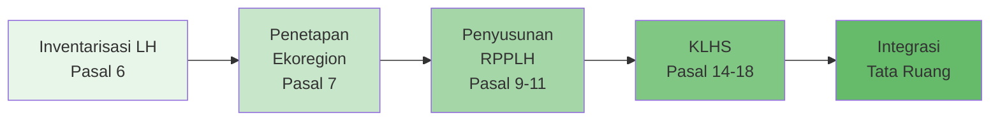
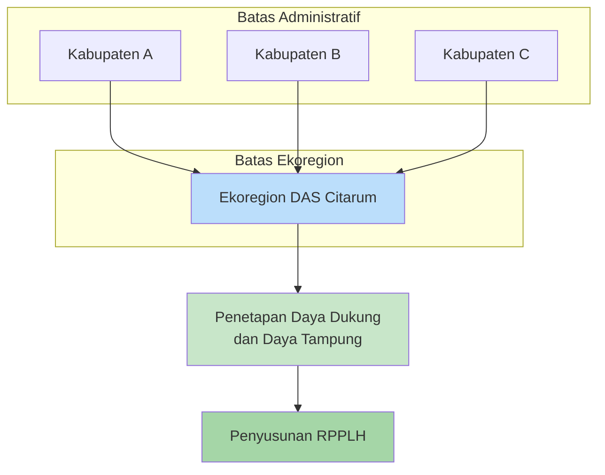
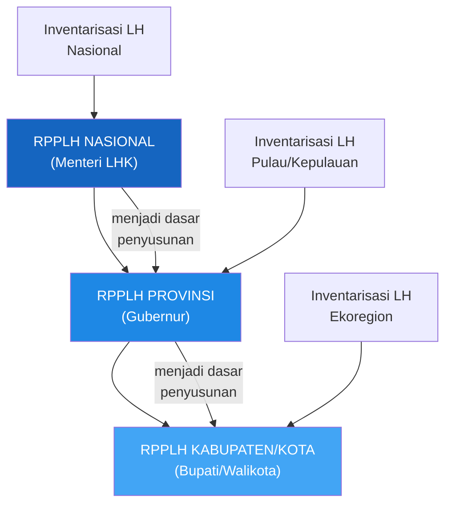
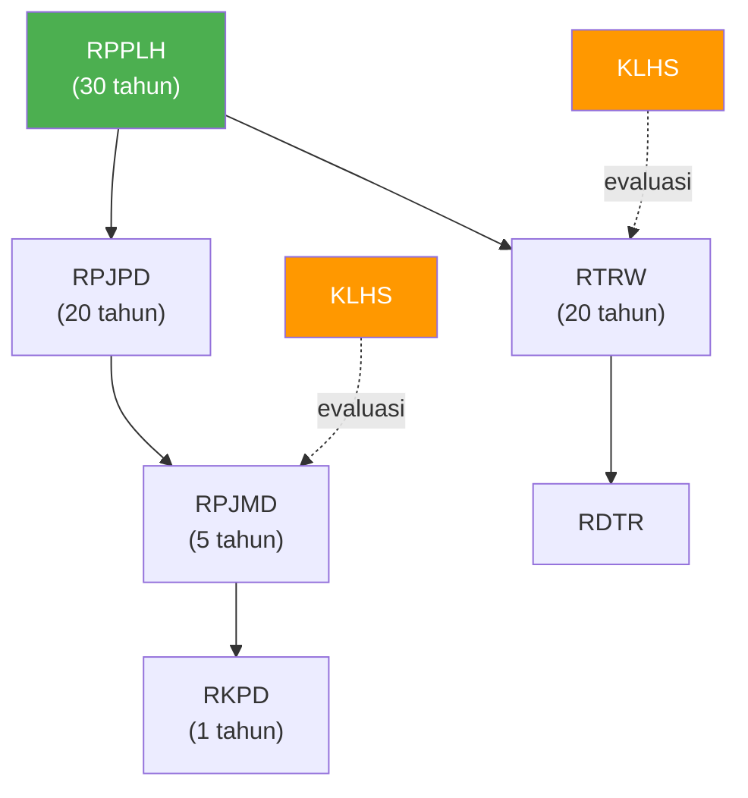
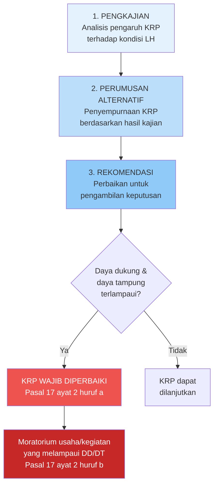
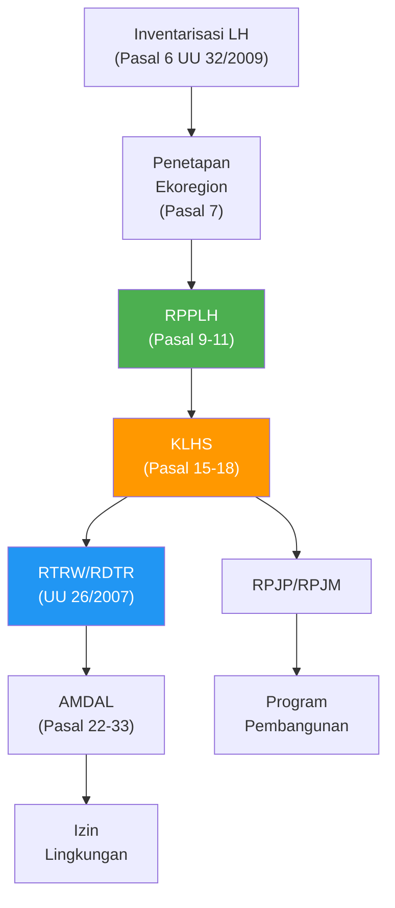
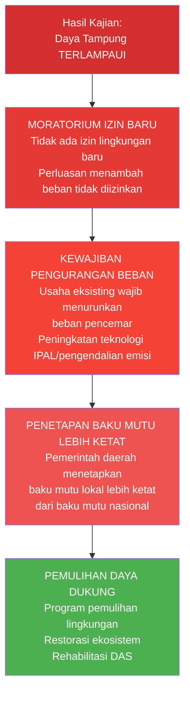

# Perencanaan Lingkungan Hidup

**Navigasi:**
- [[02_Perubahan_Iklim|← Sebelumnya: Perubahan Iklim]]
- [[README|↑ Index]]
- [[04_Pengendalian_Pencemaran|Lanjut →: Pengendalian Pencemaran]]

---

## Tujuan Pembelajaran

Setelah mempelajari topik ini, mahasiswa mampu:
1. Menjelaskan konsep, tahapan, dan dasar hukum perencanaan lingkungan hidup berdasarkan UU 32/2009
2. Menguraikan proses inventarisasi lingkungan hidup dan penetapan wilayah ekoregion
3. Menganalisis muatan, hierarki, dan mekanisme penyusunan RPPLH
4. Mengevaluasi fungsi, mekanisme, dan konsekuensi hukum KLHS sebagai instrumen pencegahan
5. Memahami konsep daya dukung dan daya tampung lingkungan hidup dalam konteks perencanaan
6. Mengidentifikasi keterkaitan antara perencanaan lingkungan hidup dengan penataan ruang
7. Menganalisis konsekuensi hukum pelampauan daya dukung dan daya tampung lingkungan hidup

---

## 1. Kerangka Hukum Perencanaan Lingkungan Hidup

### 1.1 Kedudukan Perencanaan dalam Siklus PPLH

Perencanaan merupakan tahap pertama dalam siklus perlindungan dan pengelolaan lingkungan hidup sebagaimana diamanatkan oleh UU 32/2009. Pasal 1 angka 2 mendefinisikan perlindungan dan pengelolaan lingkungan hidup sebagai:

> "Upaya sistematis dan terpadu yang dilakukan untuk melestarikan fungsi lingkungan hidup dan mencegah terjadinya pencemaran dan/atau kerusakan lingkungan hidup yang meliputi **perencanaan**, pemanfaatan, pengendalian, pemeliharaan, pengawasan, dan penegakan hukum."

Penempatan perencanaan sebagai tahap pertama mencerminkan paradigma pencegahan (*preventive principle*) yang menjadi salah satu prinsip utama hukum lingkungan modern. Filosofi ini menegaskan bahwa mencegah kerusakan lingkungan jauh lebih efektif dan efisien dibandingkan memulihkannya setelah terjadi.

### 1.2 Dasar Hukum Utama

| Peraturan | Substansi Terkait Perencanaan |
|-----------|-------------------------------|
| **UU 32/2009** Pasal 5-18 | Inventarisasi LH, penetapan ekoregion, RPPLH, KLHS |
| **PP 22/2021** | Implementasi perencanaan perlindungan mutu air, udara, laut |
| **UU 26/2007** | Penataan Ruang (RTRW, RDTR) |
| **UU 6/2023** | Penetapan Perppu 2/2022 tentang Cipta Kerja — perubahan ketentuan perizinan dan KLHS |
| **Permen LHK 69/2017** | Pedoman Pelaksanaan KLHS |
| **PP 46/2016** | Tata Cara Penyelenggaraan KLHS |

### 1.3 Tahapan Perencanaan Lingkungan Hidup

**Pasal 5 UU 32/2009** menetapkan bahwa perencanaan perlindungan dan pengelolaan lingkungan hidup dilaksanakan melalui tiga tahapan:

> Perencanaan perlindungan dan pengelolaan lingkungan hidup dilaksanakan melalui tahapan:
> a. inventarisasi lingkungan hidup;
> b. penetapan wilayah ekoregion; dan
> c. penyusunan RPPLH.



Ketiga tahapan ini bersifat **sekuensial dan kumulatif**: inventarisasi menyediakan data dasar, penetapan ekoregion memberikan kerangka spasial, dan RPPLH merumuskan rencana pengelolaan. KLHS kemudian memastikan bahwa seluruh kebijakan, rencana, dan program pembangunan memperhatikan daya dukung dan daya tampung lingkungan hidup.

---

## 2. Inventarisasi Lingkungan Hidup

### 2.1 Pengertian dan Tujuan

Inventarisasi lingkungan hidup merupakan kegiatan pengumpulan data dan informasi mengenai kondisi sumber daya alam dan lingkungan hidup secara sistematis. Inventarisasi ini menjadi fondasi bagi seluruh proses perencanaan lingkungan karena menyediakan basis data ilmiah yang diperlukan untuk pengambilan keputusan.

### 2.2 Tingkatan Inventarisasi

**Pasal 6 ayat (1) UU 32/2009** menetapkan tiga tingkatan inventarisasi:

> Inventarisasi lingkungan hidup terdiri atas inventarisasi lingkungan hidup:
> a. tingkat nasional;
> b. tingkat pulau/kepulauan; dan
> c. tingkat wilayah ekoregion.

Hierarki ini mencerminkan pendekatan berjenjang (*tiered approach*) yang memungkinkan pengelolaan lingkungan disesuaikan dengan karakteristik ekologis masing-masing wilayah.

### 2.3 Muatan Inventarisasi

**Pasal 6 ayat (2) UU 32/2009** menyatakan bahwa inventarisasi dilaksanakan untuk memperoleh data dan informasi mengenai sumber daya alam yang meliputi:

| Komponen | Penjelasan | Contoh |
|----------|------------|--------|
| **Potensi dan ketersediaan** | Kuantitas dan kualitas SDA yang ada | Cadangan air tanah, luas hutan |
| **Jenis yang dimanfaatkan** | SDA yang sedang dieksploitasi | Pertambangan, perikanan, kehutanan |
| **Bentuk penguasaan** | Status hukum penguasaan SDA | Hak pengelolaan, konsesi, HGU |
| **Pengetahuan pengelolaan** | Metode dan teknologi pengelolaan | Kearifan lokal, teknologi modern |
| **Bentuk kerusakan** | Degradasi yang sudah terjadi | Deforestasi, pencemaran, erosi |
| **Konflik dan penyebab konflik** | Sengketa terkait pengelolaan SDA | Konflik tata guna lahan, hak adat |

### 2.4 Pelaksanaan Inventarisasi

Inventarisasi tingkat nasional dan tingkat pulau/kepulauan dilaksanakan oleh Menteri yang menyelenggarakan urusan pemerintahan di bidang lingkungan hidup, setelah berkoordinasi dengan instansi terkait. Data inventarisasi ini bersifat terbuka dan dapat diakses oleh publik sebagai bagian dari prinsip transparansi dalam pengelolaan lingkungan hidup.

Dalam praktiknya, inventarisasi melibatkan berbagai metode:
- Pemetaan geospasial menggunakan teknologi *Geographic Information System* (GIS)
- Survei lapangan dan pengambilan sampel lingkungan
- Analisis citra satelit untuk pemantauan perubahan tutupan lahan
- Studi ekologi dan biodiversitas
- Pengumpulan data sosial ekonomi masyarakat setempat

### 2.5 Fungsi Inventarisasi sebagai Basis Perencanaan

Hasil inventarisasi menjadi dasar bagi dua kegiatan pokok berikutnya, yaitu penetapan wilayah ekoregion dan penyusunan RPPLH. Tanpa data inventarisasi yang akurat dan komprehensif, penetapan ekoregion dan perumusan RPPLH tidak akan memiliki basis ilmiah yang memadai. Inilah mengapa Pasal 5 menempatkan inventarisasi sebagai tahapan pertama dalam perencanaan lingkungan hidup.

---

## 3. Penetapan Wilayah Ekoregion

### 3.1 Definisi Ekoregion

**Pasal 1 angka 10 UU 32/2009** mendefinisikan ekoregion sebagai:

> "Wilayah geografis yang memiliki kesamaan ciri iklim, tanah, air, flora, dan fauna asli, serta pola interaksi manusia dengan alam yang menggambarkan integritas sistem alam dan lingkungan hidup."

Konsep ekoregion mengakui bahwa batas-batas ekologis tidak selalu sesuai dengan batas-batas administratif (provinsi, kabupaten/kota). Sebuah ekoregion dapat melintasi batas administratif karena mengikuti karakteristik ekosistem alami, seperti daerah aliran sungai (DAS) atau bentang alam pegunungan.

### 3.2 Mekanisme Penetapan

**Pasal 7 UU 32/2009** mengatur bahwa penetapan wilayah ekoregion dilaksanakan dengan mempertimbangkan kesamaan:

| Faktor | Penjelasan |
|--------|------------|
| **Karakteristik bentang alam** | Topografi, geomorfologi, tipe lahan |
| **Daerah aliran sungai** | Satu kesatuan hidrologis DAS |
| **Iklim** | Pola curah hujan, suhu, kelembaban |
| **Flora dan fauna** | Keanekaragaman hayati khas wilayah |
| **Sosial budaya** | Pola interaksi masyarakat dengan alam |
| **Ekonomi** | Pola pemanfaatan SDA dan mata pencaharian |
| **Kelembagaan masyarakat** | Organisasi pengelolaan SDA lokal |
| **Hasil inventarisasi LH** | Data ilmiah dari tahap sebelumnya |

### 3.3 Fungsi Penetapan Ekoregion

Penetapan ekoregion memiliki beberapa fungsi penting:

1. **Kerangka spasial pengelolaan** — Ekoregion menjadi unit dasar untuk pengelolaan lingkungan yang bersifat lintas batas administratif, misalnya pengelolaan DAS yang melintasi beberapa kabupaten.

2. **Basis penentuan daya dukung dan daya tampung** — **Pasal 8 UU 32/2009** menyatakan bahwa inventarisasi lingkungan hidup di tingkat wilayah ekoregion dilakukan untuk menentukan daya dukung dan daya tampung serta cadangan sumber daya alam. Ketentuan ini sangat penting karena menghubungkan penetapan ekoregion secara langsung dengan konsep daya dukung dan daya tampung.

3. **Koordinasi lintas wilayah** — Ekoregion memfasilitasi kerja sama antardaerah dalam pengelolaan lingkungan hidup yang tidak terbatas pada batas administratif.



### 3.4 Tipologi Ekoregion di Indonesia

Indonesia memiliki keragaman ekoregion yang sangat tinggi karena posisi geografisnya di antara dua benua dan dua samudra, serta bentang alam yang sangat beragam dari dataran rendah hingga pegunungan tinggi. Berdasarkan pendekatan ekoregion, wilayah Indonesia dapat dikelompokkan ke dalam beberapa tipologi utama:

| Tipologi Ekoregion | Karakteristik | Contoh Wilayah |
|---------------------|---------------|----------------|
| **Ekoregion dataran rendah tropika basah** | Curah hujan tinggi, vegetasi hutan hujan tropis, biodiversitas tinggi | Sumatera bagian timur, Kalimantan |
| **Ekoregion pegunungan** | Elevasi tinggi, suhu rendah, vegetasi montane | Pegunungan Jaya Wijaya, Gunung Kerinci |
| **Ekoregion karst** | Batuan kapur, gua, sungai bawah tanah | Gunung Kidul, Maros-Pangkep |
| **Ekoregion pesisir dan laut** | Ekosistem mangrove, terumbu karang, lamun | Kepulauan Raja Ampat, Bunaken |
| **Ekoregion DAS besar** | Sistem hidrologi kompleks, dataran banjir | DAS Citarum, DAS Brantas, DAS Kapuas |
| **Ekoregion gambut** | Lahan gambut tebal, cadangan karbon tinggi | Riau, Kalimantan Tengah |
| **Ekoregion vulkanik** | Tanah subur vulkanik, risiko bencana | Sekitar Gunung Merapi, Gunung Bromo |

Setiap tipologi ekoregion memiliki karakteristik daya dukung dan daya tampung yang berbeda. Misalnya, ekoregion gambut memiliki daya tampung yang rendah terhadap perubahan tata air karena sifat gambut yang sangat sensitif terhadap drainase. Sementara ekoregion DAS besar memiliki dinamika daya tampung yang sangat dipengaruhi oleh curah hujan dan debit sungai.

### 3.5 Contoh Penerapan: Ekoregion DAS Citarum

DAS Citarum di Jawa Barat merupakan contoh relevan penerapan konsep ekoregion. DAS ini melintasi wilayah administratif Kabupaten Bandung, Kabupaten Bandung Barat, Kabupaten Cianjur, Kabupaten Karawang, Kabupaten Purwakarta, Kabupaten Subang, Kabupaten Sumedang, dan Kota Bandung. Pengelolaan DAS Citarum tidak dapat dilakukan secara parsial oleh masing-masing kabupaten/kota karena sifat ekosistem sungai yang merupakan satu kesatuan hidrologis. Oleh karena itu, pendekatan ekoregion menjadi sangat relevan untuk memastikan koordinasi dan konsistensi pengelolaan.

Pada tahun 2018, Presiden menerbitkan Peraturan Presiden Nomor 15 Tahun 2018 tentang Percepatan Pengendalian Pencemaran dan Kerusakan DAS Citarum sebagai respons terhadap kondisi pencemaran berat yang dialami sungai ini. Kebijakan ini mencerminkan urgensi pendekatan ekoregion dalam pengelolaan lingkungan hidup.

---

## 4. RPPLH (Rencana Perlindungan dan Pengelolaan Lingkungan Hidup)

### 4.1 Pengertian dan Dasar Hukum

RPPLH merupakan dokumen perencanaan tertulis yang memuat pokok-pokok arah pengelolaan lingkungan hidup dalam periode waktu tertentu. **Pasal 9 UU 32/2009** menetapkan bahwa RPPLH disusun oleh Menteri, gubernur, atau bupati/walikota sesuai dengan kewenangannya.

> **Pasal 9:**
> (1) RPPLH disusun oleh Menteri, gubernur, atau bupati/walikota sesuai dengan kewenangannya.
> (2) Penyusunan RPPLH sebagaimana dimaksud pada ayat (1) memperhatikan:
> a. keragaman karakter dan fungsi ekologis;
> b. sebaran penduduk;
> c. sebaran potensi sumber daya alam;
> d. kearifan lokal;
> e. aspirasi masyarakat; dan
> f. perubahan iklim.

### 4.2 Muatan RPPLH

**Pasal 10 UU 32/2009** menjabarkan muatan RPPLH secara rinci:

> RPPLH memuat rencana tentang:
> a. pemanfaatan dan/atau pencadangan sumber daya alam;
> b. pemeliharaan dan perlindungan kualitas dan/atau fungsi lingkungan hidup;
> c. pengendalian, pemantauan, serta pendayagunaan dan pelestarian sumber daya alam; dan
> d. adaptasi dan mitigasi terhadap perubahan iklim.

| Muatan RPPLH | Substansi | Keterkaitan dengan Bab Lain |
|--------------|-----------|----------------------------|
| Pemanfaatan/pencadangan SDA | Alokasi eksploitasi dan konservasi SDA | [[04_Pengendalian_Pencemaran\|Pengendalian Pencemaran]] |
| Pemeliharaan dan perlindungan kualitas LH | Upaya menjaga fungsi ekosistem | [[06_Keadilan_Lingkungan\|Keadilan Lingkungan]] |
| Pengendalian, pemantauan, pendayagunaan, pelestarian SDA | Tata kelola SDA berkelanjutan | [[05_AMDAL_Perizinan\|AMDAL dan Perizinan]] |
| Adaptasi dan mitigasi perubahan iklim | Respons terhadap *climate change* | [[02_Perubahan_Iklim\|Perubahan Iklim]] |

### 4.3 Hierarki RPPLH

RPPLH disusun secara berjenjang dan saling terkait:



**Pasal 11 UU 32/2009** menegaskan bahwa:

> (1) RPPLH sebagaimana dimaksud dalam Pasal 10 menjadi dasar penyusunan dan dimuat dalam rencana pembangunan jangka panjang dan rencana pembangunan jangka menengah.

Ketentuan ini memberikan kekuatan hukum yang signifikan kepada RPPLH karena wajib diintegrasikan ke dalam dokumen perencanaan pembangunan (RPJP dan RPJM). Artinya, perencanaan pembangunan nasional dan daerah harus memperhatikan dan mengakomodasi rencana perlindungan lingkungan hidup.

### 4.4 RPPLH sebagai Dasar Pemanfaatan SDA

**Pasal 12 UU 32/2009** mengatur hubungan RPPLH dengan pemanfaatan sumber daya alam:

> (1) Pemanfaatan sumber daya alam dilakukan berdasarkan RPPLH.
> (2) Dalam hal RPPLH sebagaimana dimaksud pada ayat (1) belum tersusun, pemanfaatan sumber daya alam dilaksanakan berdasarkan daya dukung dan daya tampung lingkungan hidup.

Pasal 12 ayat (2) sangat penting karena memberikan alternatif dalam situasi di mana RPPLH belum tersusun. Dalam kondisi tersebut, pemanfaatan SDA tetap harus memperhatikan batas daya dukung dan daya tampung lingkungan hidup. Ketentuan ini menunjukkan bahwa daya dukung dan daya tampung merupakan prinsip fundamental yang berlaku bahkan tanpa adanya dokumen perencanaan formal.

### 4.5 Jangka Waktu dan Periodisasi RPPLH

RPPLH disusun untuk jangka waktu tertentu yang disesuaikan dengan hierarkinya:

| Tingkatan | Jangka Waktu | Keterkaitan dengan Dokumen Perencanaan Lain |
|-----------|-------------|---------------------------------------------|
| RPPLH Nasional | 30 tahun | Sejalan dengan RPJPN (20 tahun) dan visi jangka panjang nasional |
| RPPLH Provinsi | 30 tahun | Memperhatikan RPPLH Nasional dan RPJPD Provinsi |
| RPPLH Kabupaten/Kota | 30 tahun | Memperhatikan RPPLH Provinsi dan RPJPD Kab/Kota |

RPPLH ditinjau dan disesuaikan secara berkala, minimal setiap 5 (lima) tahun, untuk mengakomodasi perkembangan kondisi lingkungan, perubahan kebijakan, dan dinamika pembangunan di wilayah masing-masing. Peninjauan ini merupakan mekanisme adaptif (*adaptive management*) yang memungkinkan rencana tetap relevan dan responsif terhadap perubahan.

### 4.6 Sinkronisasi RPPLH dengan Dokumen Perencanaan Pembangunan

Salah satu aspek kritis dalam implementasi RPPLH adalah sinkronisasinya dengan berbagai dokumen perencanaan pembangunan:



Hubungan antara RPPLH dan dokumen perencanaan pembangunan bersifat **integratif**: RPPLH memberikan kerangka batas (*environmental ceiling*) yang harus dihormati oleh dokumen perencanaan pembangunan. Misalnya, jika RPPLH menetapkan bahwa suatu kawasan merupakan zona perlindungan daya dukung air, maka RTRW tidak boleh mengalokasikan kawasan tersebut untuk kegiatan industri berat.

### 4.7 Tantangan Implementasi RPPLH

Dalam praktiknya, penyusunan RPPLH di Indonesia menghadapi sejumlah tantangan:

1. **Ketersediaan data** — Banyak daerah belum memiliki data inventarisasi lingkungan hidup yang memadai sebagai basis penyusunan RPPLH.
2. **Kapasitas kelembagaan** — Dinas lingkungan hidup daerah sering kali kekurangan tenaga ahli dan anggaran untuk menyusun RPPLH yang komprehensif.
3. **Koordinasi lintas sektor** — RPPLH memerlukan koordinasi dengan berbagai sektor pembangunan (pertambangan, kehutanan, pertanian, industri) yang masing-masing memiliki kepentingan tersendiri.
4. **Konsistensi vertikal** — Menjaga konsistensi antara RPPLH nasional, provinsi, dan kabupaten/kota memerlukan mekanisme koordinasi yang efektif.

---

## 5. KLHS (Kajian Lingkungan Hidup Strategis)

### 5.1 Latar Belakang Konseptual KLHS

Konsep KLHS berakar pada tradisi *Strategic Environmental Assessment* (SEA) yang berkembang di Eropa dan Amerika Utara sejak dekade 1990-an. SEA merupakan evolusi dari konsep AMDAL (*Environmental Impact Assessment*/EIA) yang dianggap tidak memadai untuk menangani dampak kumulatif dan sinergistik dari kebijakan pembangunan pada skala yang lebih luas. Jika AMDAL mengevaluasi dampak pada level proyek individu, KLHS mengevaluasi dampak pada level kebijakan, rencana, dan program — sehingga mampu menangkap dampak-dampak yang tidak terdeteksi dalam kajian per proyek.

Dalam konteks Indonesia, adopsi konsep SEA ke dalam hukum positif melalui UU 32/2009 merupakan langkah progresif yang menunjukkan kesadaran pembuat undang-undang bahwa perlindungan lingkungan hidup harus dimulai dari tahap perencanaan yang paling awal dan strategis. Sebelum UU 32/2009, Indonesia hanya mengenal AMDAL sebagai instrumen kajian lingkungan, yang beroperasi pada level proyek dan sering kali sudah terlambat untuk mencegah dampak kumulatif.

### 5.2 Pengertian dan Kedudukan

KLHS merupakan instrumen pencegahan yang bekerja pada **level strategis** — yaitu pada level kebijakan, rencana, dan program (KRP) pembangunan. Berbeda dengan AMDAL yang diterapkan pada level proyek individual, KLHS beroperasi pada tahap yang lebih hulu (*upstream approach*).

**Pasal 1 angka 10 UU 32/2009** mendefinisikan KLHS sebagai:

> "Rangkaian analisis yang sistematis, menyeluruh, dan partisipatif untuk memastikan bahwa prinsip pembangunan berkelanjutan telah menjadi dasar dan terintegrasi dalam pembangunan suatu wilayah dan/atau kebijakan, rencana, dan/atau program."

**Pasal 14 UU 32/2009** menempatkan KLHS sebagai instrumen **pertama** dari 13 instrumen pencegahan pencemaran dan/atau kerusakan lingkungan hidup. Penempatan ini menunjukkan filosofi hukum lingkungan Indonesia yang mengutamakan pendekatan preventif sejak tahap paling awal perencanaan.

### 5.3 Kewajiban Melaksanakan KLHS

**Pasal 15 UU 32/2009** menetapkan kewajiban hukum yang tegas:

> **(1)** Pemerintah dan pemerintah daerah **wajib** membuat KLHS untuk memastikan bahwa prinsip pembangunan berkelanjutan telah menjadi dasar dan terintegrasi dalam pembangunan suatu wilayah dan/atau kebijakan, rencana, dan/atau program.
>
> **(2)** Pemerintah dan pemerintah daerah **wajib** melaksanakan KLHS sebagaimana dimaksud pada ayat (1) ke dalam penyusunan atau evaluasi:
> a. rencana tata ruang wilayah (RTRW) beserta rencana rincinya, rencana pembangunan jangka panjang (RPJP), dan rencana pembangunan jangka menengah (RPJM) nasional, provinsi, dan kabupaten/kota; dan
> b. kebijakan, rencana, dan/atau program yang berpotensi menimbulkan dampak dan/atau risiko lingkungan hidup.

Kata "**wajib**" dalam pasal ini menunjukkan bahwa KLHS bukan sekadar anjuran atau pedoman (*best practice*), melainkan kewajiban hukum yang mengikat. Pemerintah dan pemerintah daerah yang tidak melaksanakan KLHS dapat dikategorikan melakukan pelanggaran hukum.

Implikasi penting dari Pasal 15 ayat (2):
- KLHS wajib dilaksanakan untuk dokumen perencanaan strategis: RTRW, RPJP, dan RPJM
- Kebijakan sektoral yang berpotensi menimbulkan dampak lingkungan juga wajib dilengkapi KLHS, misalnya: kebijakan pengembangan kawasan industri, rencana pembangunan infrastruktur energi, atau program intensifikasi pertanian

### 5.4 Mekanisme Pelaksanaan KLHS

**Pasal 15 ayat (3) UU 32/2009** menjelaskan tiga mekanisme pelaksanaan KLHS:

> KLHS dilaksanakan dengan mekanisme:
> a. pengkajian pengaruh kebijakan, rencana, dan/atau program terhadap kondisi lingkungan hidup di suatu wilayah;
> b. perumusan alternatif penyempurnaan kebijakan, rencana, dan/atau program; dan
> c. rekomendasi perbaikan untuk pengambilan keputusan kebijakan, rencana, dan/atau program yang mengintegrasikan prinsip pembangunan berkelanjutan.



Dari mekanisme ini terlihat bahwa KLHS bukan sekadar kajian akademis, melainkan proses yang menghasilkan **rekomendasi perbaikan** yang harus menjadi dasar pengambilan keputusan.

### 5.5 Muatan KLHS

**Pasal 16 UU 32/2009** secara eksplisit mewajibkan KLHS memuat kajian tentang:

> KLHS memuat kajian antara lain:
> a. kapasitas daya dukung dan daya tampung lingkungan hidup untuk pembangunan;
> b. perkiraan mengenai dampak dan risiko lingkungan hidup;
> c. kinerja layanan/jasa ekosistem;
> d. efisiensi pemanfaatan sumber daya alam;
> e. tingkat kerentanan dan kapasitas adaptasi terhadap perubahan iklim; dan
> f. tingkat ketahanan dan potensi keanekaragaman hayati.

Muatan pertama yang wajib dikaji adalah **kapasitas daya dukung dan daya tampung lingkungan hidup untuk pembangunan**. Penempatan muatan ini di urutan pertama menunjukkan prioritas legislatif bahwa daya dukung dan daya tampung adalah parameter fundamental yang harus dikaji sebelum parameter lainnya.

Keterkaitan antarmuatan KLHS:

| Muatan KLHS | Hubungan dengan Daya Dukung/Daya Tampung |
|-------------|------------------------------------------|
| Kapasitas daya dukung dan daya tampung | Parameter utama dan langsung |
| Dampak dan risiko lingkungan | Apakah pembangunan akan melampaui daya tampung? |
| Kinerja layanan ekosistem | Manifestasi dari daya dukung yang terjaga |
| Efisiensi pemanfaatan SDA | Menjaga pemanfaatan dalam batas daya dukung |
| Kerentanan terhadap perubahan iklim | Memengaruhi besaran daya tampung wilayah |
| Ketahanan keanekaragaman hayati | Indikator kesehatan daya dukung ekosistem |

### 5.6 Konsekuensi Hukum KLHS

**Pasal 17 UU 32/2009** memberikan kekuatan hukum yang sangat kuat pada hasil KLHS:

> **(1)** Hasil KLHS menjadi dasar bagi kebijakan, rencana, dan/atau program pembangunan dalam suatu wilayah.
>
> **(2)** Apabila hasil KLHS menyatakan bahwa daya dukung dan daya tampung sudah terlampaui:
> a. kebijakan, rencana, dan/atau program pembangunan tersebut **wajib diperbaiki** sesuai dengan rekomendasi KLHS; dan
> b. segala usaha dan/atau kegiatan yang telah melampaui daya dukung dan daya tampung lingkungan hidup **tidak diperbolehkan lagi**.

Implikasi operasional dari Pasal 17 ayat (2) sangat signifikan:

1. **Moratorium izin baru** — Tidak boleh ada izin lingkungan baru untuk kegiatan yang menambah beban di wilayah yang daya dukung dan daya tampungnya telah terlampaui.
2. **Larangan perluasan** — Usaha eksisting yang ingin melakukan perluasan yang menambah beban juga tidak diperbolehkan.
3. **Kewajiban perbaikan KRP** — Seluruh kebijakan, rencana, dan program pembangunan wajib diperbaiki sesuai rekomendasi KLHS.
4. **Prioritas pemulihan** — Pemerintah daerah wajib memprioritaskan pemulihan daya dukung dan daya tampung.

### 5.7 Sanksi atas Pelanggaran Kewajiban KLHS

**Pasal 18 UU 32/2009** menegaskan:

> **(1)** KLHS dilaksanakan dengan melibatkan masyarakat dan pemangku kepentingan.
> **(2)** Ketentuan lebih lanjut mengenai tata cara penyelenggaraan KLHS diatur dalam Peraturan Pemerintah.

Meskipun UU 32/2009 tidak secara eksplisit mengatur sanksi pidana bagi pejabat yang tidak melaksanakan KLHS, ketiadaan KLHS dapat berdampak pada keabsahan (*validity*) kebijakan, rencana, dan program yang dihasilkan. Dokumen perencanaan yang disusun tanpa melalui KLHS berpotensi dibatalkan melalui mekanisme pengujian di pengadilan tata usaha negara.

### 5.8 Pelaksanaan Teknis KLHS: PP 46/2016

PP 46/2016 tentang Tata Cara Penyelenggaraan KLHS menjabarkan ketentuan teknis pelaksanaan KLHS yang meliputi:

**a. Tahapan Pelaksanaan KLHS:**

1. **Pembentukan tim penyusun** — Tim terdiri dari unsur pemerintah, akademisi, dan pemangku kepentingan yang kompeten di bidang lingkungan hidup, tata ruang, dan pembangunan.

2. **Pengumpulan dan analisis data** — Data *baseline* lingkungan hidup termasuk kondisi daya dukung dan daya tampung, status mutu lingkungan, dan proyeksi dampak pembangunan.

3. **Pengkajian pengaruh KRP** — Analisis sistematis terhadap pengaruh kebijakan, rencana, dan/atau program terhadap enam muatan wajib KLHS (Pasal 16 UU 32/2009).

4. **Perumusan mitigasi dan/atau alternatif** — Jika ditemukan potensi dampak negatif, disusun langkah mitigasi atau alternatif penyempurnaan KRP.

5. **Penjaminan kualitas dan validasi** — Validasi hasil KLHS oleh Kementerian LHK untuk memastikan kualitas dan kelengkapan kajian.

6. **Penyusunan rekomendasi** — Rekomendasi perbaikan yang bersifat mengikat dan harus diakomodasi dalam KRP final.

**b. Partisipasi Masyarakat dalam KLHS:**

Pasal 18 UU 32/2009 mewajibkan pelibatan masyarakat dan pemangku kepentingan dalam pelaksanaan KLHS. Partisipasi ini mencakup:
- Konsultasi publik pada tahap awal dan akhir penyusunan KLHS
- Akses terhadap dokumen KLHS dan informasi lingkungan yang relevan
- Mekanisme pengaduan dan penyampaian aspirasi masyarakat
- Keterlibatan masyarakat adat dalam identifikasi kearifan lokal dan pengetahuan tradisional terkait pengelolaan lingkungan

Prinsip partisipasi dalam KLHS sejalan dengan ketentuan Pasal 70 UU 32/2009 tentang peran masyarakat dalam perlindungan dan pengelolaan lingkungan hidup serta Pasal 28H ayat (1) UUD 1945 tentang hak atas lingkungan hidup yang baik dan sehat.

**c. Penjaminan Kualitas (*Quality Assurance*) KLHS:**

Untuk memastikan kualitas KLHS, PP 46/2016 mengatur mekanisme validasi oleh Kementerian LHK. Validasi dilakukan untuk memastikan kelengkapan muatan KLHS sesuai Pasal 16 UU 32/2009, kecukupan data dan analisis ilmiah, keabsahan metodologi yang digunakan, kesesuaian rekomendasi dengan temuan kajian, serta keterlibatan masyarakat dan pemangku kepentingan.

KLHS yang tidak lolos validasi harus diperbaiki sebelum KRP yang bersangkutan dapat ditetapkan. Mekanisme ini menjadi *quality gate* yang memastikan bahwa KLHS bukan sekadar formalitas prosedural tetapi benar-benar berfungsi sebagai instrumen perlindungan lingkungan.

### 5.9 Perbedaan KLHS dan AMDAL

Pemahaman yang jelas tentang perbedaan KLHS dan [[05_AMDAL_Perizinan|AMDAL]] sangat penting karena keduanya merupakan instrumen pencegahan namun beroperasi pada level yang berbeda:

| Aspek | KLHS | AMDAL |
|-------|------|-------|
| **Level** | Strategis (KRP) | Proyek (usaha/kegiatan) |
| **Objek** | Kebijakan, rencana, program | Usaha/kegiatan individual |
| **Waktu** | Sebelum KRP ditetapkan | Sebelum izin lingkungan diterbitkan |
| **Fokus** | Daya dukung dan daya tampung regional | Dampak proyek spesifik |
| **Output** | Rekomendasi perbaikan KRP | Kelayakan/ketidaklayakan lingkungan |
| **Pelaksana** | Pemerintah/pemerintah daerah | Pemrakarsa usaha/kegiatan |
| **Sifat** | Pengambilan keputusan publik | Pengambilan keputusan administratif |
| **Dasar Hukum** | Pasal 14-18 UU 32/2009 | Pasal 22-33 UU 32/2009 |

---

## 6. Daya Dukung Lingkungan Hidup

### 6.1 Definisi

**Pasal 1 angka 7 UU 32/2009:**

> "Daya dukung lingkungan hidup adalah kemampuan lingkungan hidup untuk mendukung perikehidupan manusia, makhluk hidup lain, dan keseimbangan antarkeduanya."

Definisi ini mengandung empat dimensi:

| Dimensi | Penjelasan |
|---------|------------|
| **Kemampuan LH** | Kapasitas tertentu yang bersifat terbatas (*finite*) |
| **Mendukung manusia** | Menyediakan kebutuhan hidup manusia (pangan, air, energi) |
| **Mendukung makhluk hidup lain** | Habitat dan sumber kehidupan bagi flora dan fauna |
| **Keseimbangan** | Harmoni dan keselarasan antara kepentingan manusia dan alam |

### 6.2 Komponen Daya Dukung

Daya dukung lingkungan hidup ditentukan oleh beberapa komponen:

1. **Ketersediaan sumber daya alam** — Air, tanah, udara, mineral, dan sumber daya hayati
2. **Kondisi iklim dan biodiversitas** — Pola cuaca, keanekaragaman hayati, dan stabilitas ekosistem
3. **Karakteristik geografis** — Topografi, tipe tanah, lokasi geografis
4. **Layanan ekosistem** (*ecosystem services*) — Jasa penyediaan, jasa pengaturan, jasa pendukung, dan jasa kultural

### 6.3 Metode Penetapan Daya Dukung

Penetapan daya dukung lingkungan hidup dilakukan melalui beberapa metode:

| Metode | Deskripsi | Keunggulan |
|--------|-----------|------------|
| Analisis ketersediaan vs kebutuhan SDA | Membandingkan suplai dan permintaan SDA | Sederhana, mudah dikomunikasikan |
| Pemodelan ekosistem | Simulasi dinamika ekosistem dengan model matematis | Komprehensif, dapat memprediksi tren |
| Kajian *carrying capacity* berbasis GIS | Analisis spasial kapasitas wilayah | Akurat secara spasial |
| Analisis jasa ekosistem | Valuasi ekonomi layanan ekosistem | Dapat dikuantifikasi dalam nilai ekonomi |
| Ecological footprint | Jejak ekologis vs biokapasitas | Dapat dibandingkan antarwilayah |

### 6.4 Contoh Praktis: Daya Dukung Wilayah Perkotaan

**Kasus DKI Jakarta:**

DKI Jakarta merupakan contoh klasik pelampauan daya dukung lingkungan hidup di Indonesia:

| Indikator | Kapasitas Ideal | Kondisi Aktual | Status |
|-----------|----------------|----------------|--------|
| Jumlah penduduk | 5-6 juta jiwa | >10 juta jiwa (siang >14 juta) | **Terlampaui** |
| Ruang terbuka hijau | 30% luas wilayah | ~9,98% luas wilayah | **Terlampaui** |
| Ketersediaan air bersih | Mandiri dari sumber lokal | >60% bergantung air tanah berlebihan | **Terlampaui** |
| Kapasitas drainase | Mampu menampung curah hujan normal | Banjir tahunan di banyak wilayah | **Terlampaui** |

Akibat pelampauan daya dukung Jakarta:
- Krisis air bersih dan penurunan muka tanah (*land subsidence*) akibat eksploitasi air tanah berlebihan
- Banjir berulang karena sistem drainase tidak memadai dan berkurangnya daerah resapan
- Polusi udara yang secara rutin melampaui baku mutu (emisi melebihi kapasitas *self-purification* atmosfer)
- Minimnya ruang terbuka hijau yang jauh di bawah standar 30% yang diamanatkan UU 26/2007

Kondisi ini menjadi salah satu faktor yang mendasari kebijakan pemindahan Ibu Kota Negara ke Nusantara (IKN) di Kalimantan Timur melalui UU 3/2022.

### 6.5 Daya Dukung dan Jasa Ekosistem (*Ecosystem Services*)

Konsep daya dukung berkaitan erat dengan jasa ekosistem — yaitu manfaat yang diperoleh manusia dari ekosistem. Menurut kerangka *Millennium Ecosystem Assessment* (MEA) yang juga diadopsi dalam konteks KLHS di Indonesia, jasa ekosistem terdiri dari empat kategori:

| Kategori Jasa Ekosistem | Penjelasan | Contoh | Relevansi Daya Dukung |
|--------------------------|------------|--------|----------------------|
| **Jasa penyediaan** (*provisioning*) | Produk yang diperoleh dari ekosistem | Pangan, air bersih, kayu, obat-obatan | Menentukan kapasitas penyediaan kebutuhan dasar |
| **Jasa pengaturan** (*regulating*) | Manfaat dari pengaturan proses ekosistem | Pengaturan iklim, penyerbukan, pengendalian banjir, purifikasi air | Menentukan kemampuan lingkungan menyerap gangguan |
| **Jasa pendukung** (*supporting*) | Jasa yang diperlukan untuk produksi jasa lainnya | Pembentukan tanah, siklus nutrien, fotosintesis | Fondasi dari seluruh jasa ekosistem lainnya |
| **Jasa kultural** (*cultural*) | Manfaat non-material dari ekosistem | Rekreasi, estetika, spiritual, pendidikan | Menentukan kualitas hidup non-material |

Penurunan daya dukung lingkungan hidup akan berdampak langsung pada penurunan jasa ekosistem. Misalnya, ketika daya dukung hutan hujan tropis di Sumatera menurun akibat deforestasi:
- Jasa penyediaan menurun: berkurangnya sumber air bersih dan keanekaragaman hayati
- Jasa pengaturan terganggu: meningkatnya frekuensi banjir dan longsor, berkurangnya penyerapan karbon
- Jasa pendukung terdegradasi: erosi tanah, hilangnya kesuburan
- Jasa kultural berkurang: hilangnya lanskap alami, situs kearifan lokal terancam

KLHS wajib mengkaji kinerja jasa ekosistem (Pasal 16 huruf c UU 32/2009) sebagai salah satu indikator daya dukung lingkungan hidup. Valuasi ekonomi jasa ekosistem juga semakin digunakan sebagai alat untuk mengkomunikasikan nilai lingkungan hidup kepada pengambil kebijakan, meskipun pendekatan ini tidak tanpa kontroversi karena sulitnya memonetisasi nilai intrinsik alam.

### 6.6 Indeks dan Instrumen Pengukuran Daya Dukung

Dalam praktik perencanaan lingkungan di Indonesia, beberapa indeks dan instrumen digunakan untuk mengukur dan memantau daya dukung:

| Instrumen | Deskripsi | Kegunaan |
|-----------|-----------|----------|
| **IKLH** (Indeks Kualitas Lingkungan Hidup) | Indeks komposit yang mengukur kualitas air, udara, dan tutupan lahan | Pemantauan tahunan oleh KLHK |
| **Neraca Sumber Daya Alam** | Catatan stok dan aliran SDA | Perencanaan pemanfaatan berkelanjutan |
| **Status Lingkungan Hidup Daerah** (SLHD) | Laporan kondisi LH per daerah | Basis data untuk RPPLH dan KLHS |
| **Indeks Kualitas Air** (IKA) | Pengukuran status mutu air | Pemantauan daya tampung sungai/danau |
| **Indeks Kualitas Udara** (IKU) | Pengukuran status mutu udara | Pemantauan daya tampung atmosfer |
| **Indeks Tutupan Lahan** (ITL) | Persentase tutupan hutan/vegetasi | Indikator daya dukung ekosistem darat |

IKLH merupakan instrumen yang paling sering digunakan untuk mengevaluasi kinerja pengelolaan lingkungan hidup di tingkat nasional dan daerah. Pada tahun 2023, IKLH nasional berada pada angka 72,42 dari skala 100, yang menunjukkan bahwa secara keseluruhan kondisi lingkungan Indonesia masih dalam kategori cukup baik namun memerlukan perbaikan di beberapa wilayah kritis.

---

## 7. Daya Tampung Lingkungan Hidup

### 7.1 Definisi

**Pasal 1 angka 8 UU 32/2009:**

> "Daya tampung lingkungan hidup adalah kemampuan lingkungan hidup untuk menyerap zat, energi, dan/atau komponen lain yang masuk atau dimasukkan ke dalamnya."

### 7.2 Hubungan dengan Daya Dukung

Daya tampung merupakan **aspek spesifik** dari daya dukung yang fokus pada kemampuan lingkungan untuk menyerap, mengolah, dan menetralisir bahan pencemar. Secara hierarkis:

```
┌─────────────────────────────────────────────────────────────┐
│         DAYA DUKUNG LINGKUNGAN HIDUP (Level 1)              │
│  (Kemampuan mendukung kehidupan secara menyeluruh)          │
│                                                             │
│  ┌───────────────────────────────────────────────────────┐  │
│  │    DAYA TAMPUNG LINGKUNGAN HIDUP (Level 2)            │  │
│  │   (Kemampuan menyerap beban pencemar)                 │  │
│  │                                                       │  │
│  │   ┌───────────────────────────────────────────────┐   │  │
│  │   │  BAKU MUTU LINGKUNGAN HIDUP (Level 3)        │   │  │
│  │   │  (Standar numerik yang dapat diukur)          │   │  │
│  │   │  Jika terlampaui = PENCEMARAN                 │   │  │
│  │   └───────────────────────────────────────────────┘   │  │
│  └───────────────────────────────────────────────────────┘  │
└─────────────────────────────────────────────────────────────┘
```

### 7.3 Prinsip *Self-Purification*

Setiap media lingkungan memiliki kemampuan alami untuk "membersihkan diri" (*self-purification*):

| Media | Mekanisme *Self-Purification* | Faktor Penentu |
|-------|-------------------------------|----------------|
| **Air sungai** | Bakteri pengurai, oksigenasi, pengendapan | Debit, suhu, DO, kecepatan arus |
| **Udara** | Dispersi angin, presipitasi hujan, reaksi kimia atmosfer | Kecepatan angin, topografi, stabilitas atmosfer |
| **Tanah** | Mikroorganisme degradasi, filtrasi, adsorpsi | Jenis tanah, kelembaban, pH |
| **Laut** | Pengenceran, dispersi arus, biodegradasi | Volume, arus laut, salinitas |

Namun, kemampuan *self-purification* ini **memiliki batas**. Jika beban pencemar melebihi kapasitas asimilasi, terjadilah pencemaran. Konsep inilah yang mendasari penetapan baku mutu lingkungan hidup sebagaimana dibahas lebih lanjut dalam [[04_Pengendalian_Pencemaran|bab pengendalian pencemaran]].

### 7.4 Daya Tampung Beban Pencemaran Air

**PP 22/2021 Pasal 1 angka 43:**

> "Daya Tampung Beban Pencemaran Air adalah kemampuan air pada suatu sumber air untuk menerima masukan beban pencemaran tanpa mengakibatkan air tersebut tercemar."

**Rumus konseptual:**

```
Daya Tampung = Beban Pencemaran Maksimal − Beban Pencemaran Eksisting
```

**Contoh Perhitungan — Sungai Ciliwung Segmen X:**

| Parameter | Nilai |
|-----------|-------|
| Kelas Air | II (rekreasi air) |
| Baku Mutu BOD Kelas II | 3 mg/L |
| Debit sungai | 10 m³/detik = 864.000 m³/hari |
| Kondisi eksisting BOD | 2 mg/L |

| Komponen | Perhitungan | Hasil |
|----------|-------------|-------|
| Beban eksisting | 2 mg/L × 864.000 m³/hari | **1.728 kg/hari** |
| Beban maksimal | 3 mg/L × 864.000 m³/hari | **2.592 kg/hari** |
| **Daya tampung tersisa** | 2.592 − 1.728 | **864 kg BOD/hari** |

Artinya, sungai Ciliwung pada segmen tersebut masih mampu menerima tambahan beban pencemar organik sebesar 864 kg BOD per hari sebelum melampaui baku mutu Kelas II. Informasi ini sangat kritis untuk penerbitan izin pembuangan air limbah bagi industri dan kegiatan lain di sepanjang segmen tersebut.

### 7.5 Daya Tampung Beban Pencemaran Udara

**PP 22/2021 Pasal 1 angka 54:**

> "Daya Tampung Beban Pencemaran Udara adalah kemampuan Udara Ambien untuk menerima masukan beban Emisi dari suatu kegiatan atau Usaha."

Daya tampung udara lebih dinamis dibandingkan daya tampung air karena dipengaruhi oleh:
- Dispersi oleh angin (kecepatan dan arah)
- *Wet/dry deposition* (hujan dan pengendapan kering)
- Transformasi kimia di atmosfer (reaksi fotokimia)
- Stabilitas atmosfer dan lapisan inversi

---

## 8. Integrasi Perencanaan Lingkungan dengan Tata Ruang

### 8.1 Hubungan RPPLH-KLHS-RTRW

Perencanaan lingkungan hidup tidak berdiri sendiri tetapi terintegrasi erat dengan perencanaan tata ruang. UU 26/2007 tentang Penataan Ruang mengamanatkan bahwa penyusunan Rencana Tata Ruang Wilayah (RTRW) harus memperhatikan daya dukung dan daya tampung lingkungan hidup.



### 8.2 Hierarki Perencanaan

Hubungan hierarkis antara instrumen perencanaan lingkungan dan tata ruang:

1. **RPPLH** → Rencana umum perlindungan dan pengelolaan LH (level paling strategis)
2. **KLHS** → Kajian dampak KRP terhadap LH (instrumen evaluasi)
3. **RTRW** → Rencana alokasi ruang wilayah (integrasi dengan aspek lingkungan)
4. **RDTR** → Rencana detail tata ruang (implementasi di level mikro)
5. **AMDAL** → Kajian dampak proyek spesifik (level operasional)

### 8.3 UU 26/2007 dan Kewajiban Lingkungan dalam Tata Ruang

UU 26/2007 tentang Penataan Ruang memuat beberapa ketentuan kunci yang berkaitan dengan perencanaan lingkungan hidup:

- **Kawasan lindung** — RTRW wajib menetapkan kawasan lindung yang berfungsi melindungi kelestarian lingkungan hidup, termasuk sumber daya alam dan sumber daya buatan.
- **Ruang terbuka hijau** — Kota wajib menyediakan ruang terbuka hijau minimal 30% dari luas wilayah kota, dengan 20% ruang terbuka hijau publik.
- **Daya dukung wilayah** — Perencanaan tata ruang harus memperhatikan daya dukung dan daya tampung wilayah.

### 8.4 Kawasan Strategis Nasional dan Perencanaan Lingkungan

Dalam kerangka penataan ruang nasional, terdapat konsep **Kawasan Strategis Nasional** (KSN) yang memiliki implikasi penting bagi perencanaan lingkungan. KSN adalah kawasan yang penataan ruangnya diprioritaskan karena mempunyai pengaruh sangat penting secara nasional terhadap kedaulatan negara, pertahanan dan keamanan, ekonomi, sosial, budaya, dan/atau lingkungan.

KSN dari sudut kepentingan fungsi dan daya dukung lingkungan hidup meliputi antara lain:
- Kawasan ekosistem kritis (misalnya kawasan gambut di Riau dan Kalimantan Tengah)
- Kawasan lindung yang memiliki keanekaragaman hayati tinggi (misalnya Taman Nasional Gunung Leuser, Raja Ampat)
- Kawasan rawan bencana alam tinggi (misalnya kawasan rawan tsunami di pesisir Aceh)
- Kawasan DAS kritis yang berfungsi sebagai penyedia air bagi jutaan penduduk

Perencanaan lingkungan hidup untuk KSN memerlukan pendekatan yang lebih komprehensif dan ketat dibandingkan kawasan biasa. KLHS untuk KSN harus mempertimbangkan tidak hanya daya dukung dan daya tampung lokal tetapi juga dampak terhadap jasa ekosistem di tingkat nasional dan bahkan global (misalnya, kontribusi terhadap emisi gas rumah kaca jika ekosistem gambut didrainase).

### 8.5 Pengalaman Internasional: Perbandingan Pendekatan KLHS

Untuk memperkaya pemahaman, berikut perbandingan pendekatan KLHS di beberapa negara:

| Aspek | Indonesia (UU 32/2009) | Uni Eropa (Directive 2001/42/EC) | Amerika Serikat (NEPA) |
|-------|------------------------|-----------------------------------|------------------------|
| **Nama** | KLHS | SEA (*Strategic Environmental Assessment*) | Programmatic EIS |
| **Kewajiban** | Wajib untuk RTRW, RPJP, RPJM | Wajib untuk rencana dan program tertentu | Bervariasi per lembaga |
| **Muatan** | 6 komponen wajib (Pasal 16) | Dampak lingkungan, alternatif, mitigasi | Dampak lingkungan signifikan |
| **Konsekuensi** | Moratorium jika DD/DT terlampaui | KRP harus memperhitungkan hasil SEA | Informasi untuk pengambil keputusan |
| **Partisipasi** | Wajib (Pasal 18) | Wajib (*public consultation*) | Wajib (*public comment period*) |
| **Kekuatan hukum** | Mengikat (Pasal 17) | Mengikat (*shall be taken into account*) | Informatif (*disclose and consider*) |

Perbandingan ini menunjukkan bahwa KLHS Indonesia memiliki kekuatan hukum yang relatif kuat dibandingkan beberapa yurisdiksi lain. Pasal 17 ayat (2) UU 32/2009 yang mewajibkan perbaikan KRP dan melarang usaha/kegiatan jika daya dukung dan daya tampung terlampaui merupakan ketentuan yang progresif bahkan dalam konteks internasional. Tantangannya terletak pada implementasi dan penegakan ketentuan tersebut di lapangan.

### 8.6 Perubahan oleh UU Cipta Kerja (UU 6/2023)

UU 6/2023 tentang Penetapan Peraturan Pemerintah Pengganti Undang-Undang Nomor 2 Tahun 2022 tentang Cipta Kerja membawa beberapa perubahan signifikan terhadap kerangka perencanaan lingkungan hidup:

1. **Penyederhanaan perizinan** — Perubahan dari izin lingkungan menjadi persetujuan lingkungan yang terintegrasi dengan perizinan berusaha berbasis risiko.
2. **KLHS tetap wajib** — Meskipun terdapat penyederhanaan, kewajiban penyusunan KLHS untuk RTRW dan dokumen perencanaan strategis lainnya tetap dipertahankan.
3. **Integrasi perizinan** — Sistem perizinan berusaha terintegrasi melalui Online Single Submission (OSS) yang mengintegrasikan persyaratan lingkungan.

Perubahan ini menimbulkan perdebatan di kalangan akademisi dan praktisi hukum lingkungan. Di satu sisi, simplifikasi prosedur diharapkan mempercepat investasi dan pembangunan. Di sisi lain, terdapat kekhawatiran bahwa pengurangan persyaratan prosedural dapat melemahkan perlindungan lingkungan hidup. Mahkamah Konstitusi dalam Putusan Nomor 91/PUU-XVIII/2020 telah memberikan catatan penting mengenai proses pembentukan UU Cipta Kerja yang harus diperbaiki, yang kemudian ditindaklanjuti dengan penerbitan Perppu 2/2022 yang ditetapkan menjadi UU 6/2023.

### 8.7 Studi Kasus: KLHS dalam Penyusunan RTRW

**Kasus KLHS RTRW Kota Semarang (2011-2031):**

Penyusunan revisi RTRW Kota Semarang dilengkapi dengan KLHS yang mengidentifikasi beberapa isu lingkungan strategis:
- Potensi banjir dan rob (*tidal flooding*) yang semakin meningkat akibat perubahan iklim dan penurunan muka tanah
- Alih fungsi lahan pertanian dan kawasan resapan menjadi kawasan terbangun
- Kebutuhan peningkatan ruang terbuka hijau yang belum mencapai 30%
- Pencemaran badan air dari limbah industri dan domestik

Rekomendasi KLHS kemudian diakomodasi dalam revisi RTRW, antara lain:
- Penetapan zona rawan banjir dan rob sebagai kawasan pembatasan pembangunan
- Peningkatan proporsi ruang terbuka hijau dalam rencana pola ruang
- Penetapan zona perlindungan sempadan sungai

Kasus ini menunjukkan bagaimana KLHS berfungsi efektif sebagai instrumen integrasi pertimbangan lingkungan dalam perencanaan tata ruang.

---

## 9. Konsekuensi Pelampauan Daya Dukung dan Daya Tampung

### 9.1 Implikasi Hukum

Berdasarkan **Pasal 17 ayat (2) UU 32/2009**, pelampauan daya dukung dan daya tampung memiliki konsekuensi hukum yang serius:

| Tindakan Hukum | Dasar Hukum | Penjelasan |
|----------------|-------------|------------|
| Kewajiban perbaikan KRP | Pasal 17(2) huruf a | Seluruh kebijakan, rencana, program wajib diperbaiki |
| Larangan usaha/kegiatan | Pasal 17(2) huruf b | Usaha yang melampaui DD/DT tidak diperbolehkan lagi |
| Moratorium izin baru | Pasal 17(2) | Tidak ada izin baru untuk kegiatan menambah beban |
| Penetapan baku mutu lebih ketat | PP 22/2021 | Pemerintah daerah wajib menetapkan standar lebih ketat |
| Pencabutan izin | Pasal 37, 40 UU 32/2009 | Izin yang tidak sesuai dapat dicabut |

### 9.2 Kewajiban Pemerintah Daerah

Gubernur dan bupati/walikota memiliki kewajiban hukum untuk:

1. **Melakukan kajian daya tampung secara berkala** — Kajian ilmiah yang memuat peruntukan air/udara, status mutu, dan daya tampung beban pencemaran.
2. **Menetapkan status daya tampung** — Apakah daya tampung telah terlampaui atau belum.
3. **Mengambil tindakan sesuai status:**
   - Jika **belum terlampaui** → baku mutu mengikuti peraturan menteri (standar nasional)
   - Jika **sudah terlampaui** → **wajib menetapkan baku mutu lebih ketat** dari standar nasional

### 9.3 Konsekuensi Operasional



---

## 10. Studi Kasus

### 10.1 Kasus Sungai Citarum: Perencanaan Lingkungan yang Gagal

Sungai Citarum di Jawa Barat merupakan contoh kegagalan perencanaan lingkungan yang berdampak serius. Sungai sepanjang 297 km ini pernah dijuluki "sungai terkotor di dunia" oleh berbagai media internasional.

**Kronologi Masalah:**
- Citarum melintasi kawasan dengan lebih dari 2.000 industri dan melayani kebutuhan air bagi sekitar 28 juta penduduk
- Beban pencemaran jauh melampaui daya tampung sungai — kadar BOD, COD, dan logam berat di beberapa segmen melebihi baku mutu puluhan hingga ratusan kali lipat
- Perencanaan tata ruang di sepanjang DAS tidak mengintegrasikan pertimbangan daya dukung dan daya tampung secara memadai
- Izin industri diterbitkan tanpa memperhatikan kapasitas asimilasi sungai secara kumulatif

**Respons Hukum:**
- Perpres 15/2018 tentang Percepatan Pengendalian Pencemaran dan Kerusakan DAS Citarum
- Pembentukan Tim Pengendalian Pencemaran dan Kerusakan DAS Citarum yang melibatkan TNI
- Penegakan hukum terhadap industri pencemar berdasarkan Pasal 98-99 UU 32/2009

**Pelajaran:**
Kasus Citarum menunjukkan bahwa kegagalan perencanaan lingkungan di tahap hulu (tidak dilaksanakannya KLHS secara memadai, RPPLH tidak disusun, daya tampung tidak dihitung) mengakibatkan kerusakan lingkungan yang sangat mahal untuk dipulihkan. Biaya pemulihan DAS Citarum diperkirakan mencapai triliunan rupiah, jauh melebihi biaya yang seharusnya dialokasikan untuk perencanaan lingkungan yang baik sejak awal.

### 10.2 Kasus Rawa Tripa, Aceh: KLHS dan Perlindungan Ekosistem Gambut

Rawa Tripa di Kabupaten Nagan Raya, Aceh, merupakan ekosistem gambut yang sangat penting secara ekologis sebagai habitat orangutan Sumatera (*Pongo abelii*) dan penyimpan karbon yang signifikan. Kasus ini menjadi contoh penting tentang hubungan antara perencanaan tata ruang dan perlindungan lingkungan.

**Kronologi:**
- RTRW Kabupaten Nagan Raya mengalokasikan sebagian kawasan Rawa Tripa untuk perkebunan kelapa sawit
- Organisasi lingkungan hidup menggugat izin pembukaan lahan di kawasan gambut ini
- Argumentasi penggugat: RTRW disusun tanpa KLHS yang memadai, sehingga tidak mempertimbangkan daya dukung dan daya tampung ekosistem gambut
- Kebakaran lahan gambut berulang di kawasan yang telah dikonversi menyebabkan pencemaran udara lintas batas

**Pelajaran Hukum:**
1. Ekosistem gambut memiliki daya dukung dan daya tampung yang sangat rendah terhadap perubahan tata air — drainase gambut untuk perkebunan menyebabkan subsidensi, kebakaran, dan emisi karbon masif
2. KLHS untuk RTRW di kawasan gambut harus memberikan perhatian khusus pada fungsi ekologis gambut, bukan hanya mempertimbangkan aspek ekonomi jangka pendek
3. Kasus ini menunjukkan bahwa kegagalan perencanaan (tidak adanya KLHS yang memadai) dapat berujung pada kerusakan lingkungan yang tidak reversibel dan pencemaran udara lintas wilayah

### 10.3 Kasus Pemindahan IKN: Perencanaan Lingkungan Skala Besar

Pembangunan Ibu Kota Nusantara (IKN) di Kalimantan Timur merupakan contoh perencanaan lingkungan berskala besar yang menjadi sorotan. KLHS untuk IKN disusun dengan memperhatikan:
- Daya dukung dan daya tampung kawasan yang sebagian besar masih berupa hutan
- Potensi dampak terhadap keanekaragaman hayati, termasuk habitat orangutan Kalimantan
- Kebutuhan konservasi DAS dan pengelolaan sumber daya air
- Ketahanan terhadap perubahan iklim

Namun, proses KLHS IKN juga menuai kritik dari berbagai pihak, antara lain:
- Pertanyaan tentang kecukupan waktu dan kedalaman kajian
- Kekhawatiran tentang dampak konversi hutan terhadap biodiversitas
- Perdebatan mengenai kapasitas daya dukung wilayah untuk menampung jutaan penduduk baru

Kasus ini mengilustrasikan kompleksitas perencanaan lingkungan untuk proyek pembangunan berskala besar dan pentingnya KLHS yang komprehensif serta partisipatif.

### 10.4 Rangkuman Pelajaran dari Studi Kasus

Dari ketiga studi kasus di atas, terdapat beberapa pelajaran penting bagi perencanaan lingkungan hidup di Indonesia:

**Pertama**, perencanaan lingkungan yang memadai sejak awal jauh lebih efisien dan efektif dibandingkan pemulihan setelah kerusakan terjadi. Biaya pemulihan DAS Citarum yang mencapai triliunan rupiah seharusnya dapat dicegah jika perencanaan lingkungan (KLHS, RPPLH, penetapan daya tampung) dilaksanakan secara konsisten sejak awal.

**Kedua**, perencanaan lingkungan tidak boleh mengabaikan karakteristik ekologis spesifik wilayah. Kasus Rawa Tripa menunjukkan bahwa ekosistem gambut memiliki kerentanan tinggi yang harus menjadi pertimbangan utama dalam perencanaan tata ruang — bukan sekadar pertimbangan tambahan.

**Ketiga**, pelibatan masyarakat dan transparansi dalam perencanaan lingkungan sangat krusial. Kasus IKN menunjukkan bahwa meskipun secara prosedural KLHS telah dilaksanakan, kualitas partisipasi publik dan keterbukaan informasi sangat menentukan legitimasi dan penerimaan masyarakat terhadap kebijakan perencanaan lingkungan.

**Keempat**, perencanaan lingkungan harus bersifat adaptif dan responsif terhadap perubahan kondisi. Daya dukung dan daya tampung bukan angka statis — keduanya berubah seiring perubahan iklim, pertumbuhan penduduk, dan intensifikasi kegiatan pembangunan. Oleh karena itu, peninjauan berkala terhadap RPPLH dan KLHS menjadi sangat penting.

**Kelima**, koordinasi lintas sektor dan lintas wilayah merupakan prasyarat keberhasilan perencanaan lingkungan. Pendekatan ekoregion yang melampaui batas administratif, sebagaimana dimandatkan oleh Pasal 7 UU 32/2009, harus dilaksanakan secara konsisten untuk menghindari pengelolaan lingkungan yang terfragmentasi.

---

## Pertanyaan Diskusi

1. Mengapa KLHS harus dilaksanakan **sebelum** penyusunan RTRW, bukan sesudahnya? Apa konsekuensi hukumnya jika RTRW disusun tanpa melalui KLHS?
2. Bagaimana hubungan antara daya dukung dan daya tampung dengan konsep pembangunan berkelanjutan (*sustainable development*)? Apakah pembangunan yang melampaui daya dukung masih dapat disebut "berkelanjutan"?
3. Apa yang harus dilakukan pemerintah daerah ketika hasil KLHS menunjukkan bahwa daya dukung wilayahnya telah terlampaui? Jelaskan langkah-langkah hukum yang harus ditempuh berdasarkan Pasal 17 UU 32/2009.
4. Mengapa penetapan ekoregion penting untuk penentuan daya dukung dan daya tampung lingkungan hidup? Berikan contoh konkret di mana batas ekoregion berbeda dari batas administratif.
5. Analisis kritis: apakah perubahan yang dibawa oleh UU Cipta Kerja (UU 6/2023) terhadap kerangka perencanaan lingkungan hidup memperkuat atau justru melemahkan perlindungan lingkungan? Berikan argumentasi hukum.
6. Bagaimana seharusnya perencanaan lingkungan hidup mengakomodasi perubahan iklim dan ketidakpastian (*uncertainty*) yang menyertainya?
7. Evaluasi kasus DAS Citarum dari perspektif perencanaan lingkungan: di tahap mana kegagalan perencanaan terjadi, dan bagaimana seharusnya tahapan perencanaan dalam UU 32/2009 mencegah terjadinya pencemaran masif tersebut?

---

## Referensi Peraturan

> [!info] Cross-Vault Links
> Dokumen lengkap tersedia di vault `regulationvault`. Lihat [[_referensi/REGULATIONVAULT_LINKS|Daftar Lengkap Cross-Vault Links]]

### UU 32/2009 tentang PPLH
**BAB III: Perencanaan** (Pasal 5-11)
- Pasal 5: Tahapan perencanaan PPLH (inventarisasi, ekoregion, RPPLH)
- Pasal 6: Tingkatan dan muatan inventarisasi LH
- Pasal 7: Penetapan wilayah ekoregion
- Pasal 8: Inventarisasi LH tingkat ekoregion untuk penetapan daya dukung dan daya tampung
- Pasal 9-11: RPPLH (penyusunan, muatan, hierarki)

**BAB IV: Pemanfaatan** (Pasal 12-13)
- Pasal 12: Pemanfaatan SDA berdasarkan RPPLH dan daya dukung/daya tampung
- Pasal 13: Pengendalian pemanfaatan SDA

**BAB V: Pengendalian — Bagian KLHS** (Pasal 14-18)
- Pasal 14: KLHS sebagai instrumen pencegahan pertama
- Pasal 15: Kewajiban pelaksanaan KLHS, dokumen yang wajib dilengkapi KLHS, mekanisme KLHS
- Pasal 16: Muatan wajib KLHS (daya dukung, daya tampung, risiko lingkungan, jasa ekosistem)
- Pasal 17: Konsekuensi hukum KLHS — kewajiban perbaikan KRP, larangan usaha/kegiatan
- Pasal 18: Partisipasi masyarakat dalam KLHS

**Pasal Definisi:**
- Pasal 1 angka 7: Definisi daya dukung lingkungan hidup
- Pasal 1 angka 8: Definisi daya tampung lingkungan hidup
- Pasal 1 angka 10: Definisi ekoregion

Path: `regulationvault/05_ACTIVE/UU/2009/UU_32_2009/`

### PP 22/2021 tentang Penyelenggaraan PPLH
- Pasal 1 angka 43: Definisi daya tampung beban pencemaran air
- Pasal 1 angka 54: Definisi daya tampung beban pencemaran udara
- Implementasi perencanaan perlindungan mutu air, udara, laut
- Path: `regulationvault/05_ACTIVE/PP/2021/PP_22_2021/`

### UU 26/2007 tentang Penataan Ruang
- Integrasi perencanaan lingkungan dengan tata ruang wilayah
- Kewajiban ruang terbuka hijau minimal 30%
- Kawasan lindung dalam RTRW

### UU 6/2023 tentang Cipta Kerja
- Perubahan ketentuan perizinan lingkungan
- Penyesuaian mekanisme KLHS

### Peraturan Pelaksana
- PP 46/2016 tentang Tata Cara Penyelenggaraan KLHS
- Permen LHK 69/2017 tentang Pedoman Pelaksanaan KLHS

### Referensi Regulasi Lengkap
- [[_referensi/REGULATION_INDEX|Indeks Regulasi Lingkungan]]

---

## Daftar Pustaka

- Rahmadi, Takdir. (2020). *Hukum Lingkungan di Indonesia*. Rajawali Pers.
- Santosa, Mas Achmad. (2016). *Alam Pun Butuh Hukum dan Keadilan*. AS@Publishing.
- Soemarwoto, Otto. (2004). *Ekologi, Lingkungan Hidup dan Pembangunan*. Penerbit Djambatan.
- Hardjasoemantri, Koesnadi. (2012). *Hukum Tata Lingkungan*. Gadjah Mada University Press.
- Helmi. (2012). *Hukum Perizinan Lingkungan Hidup*. Sinar Grafika.
- Sadler, B., et al. (2011). *Handbook of Strategic Environmental Assessment*. Earthscan.

---

**Navigasi:**
- [[02_Perubahan_Iklim|← Perubahan Iklim]]
- [[README|↑ Index]]
- [[04_Pengendalian_Pencemaran|Pengendalian Pencemaran →]]
