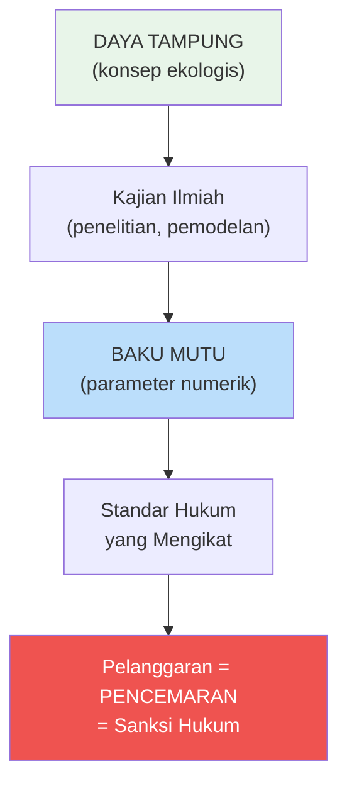
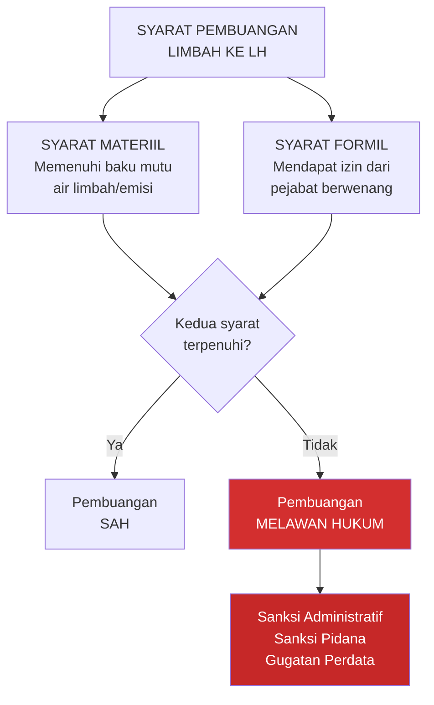
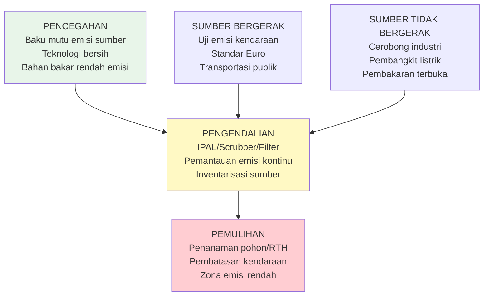
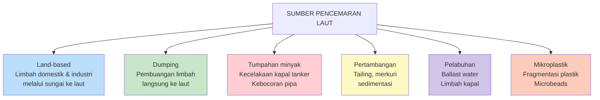
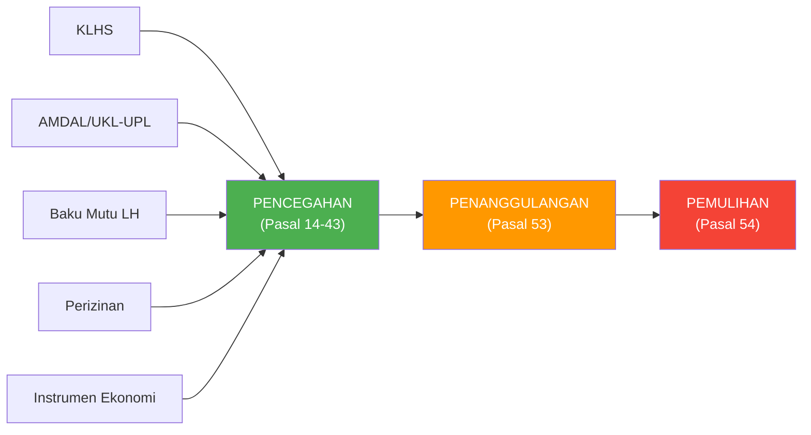
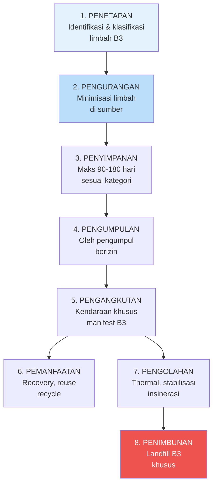

# Pengendalian Pencemaran Lingkungan

**Navigasi:**
- [[03_Perencanaan_Lingkungan|← Sebelumnya: Perencanaan Lingkungan]]
- [[README|↑ Index]]
- [[05_AMDAL_Perizinan|Lanjut →: AMDAL dan Perizinan]]

---

## Tujuan Pembelajaran

Setelah mempelajari topik ini, mahasiswa mampu:
1. Menjelaskan definisi dan elemen konstitutif pencemaran lingkungan hidup menurut UU 32/2009
2. Memahami dan menganalisis sistem baku mutu lingkungan hidup (air, udara, laut, kebisingan)
3. Mengidentifikasi kriteria baku kerusakan lingkungan hidup
4. Menguraikan mekanisme pencegahan dan pengendalian pencemaran air, udara, dan laut
5. Memahami kerangka hukum pengelolaan limbah bahan berbahaya dan beracun (B3)
6. Menjelaskan mekanisme pemulihan fungsi lingkungan hidup
7. Menerapkan konsep baku mutu dalam identifikasi dan penegakan hukum pencemaran

---

## 1. Konsep Pencemaran Lingkungan Hidup

### 1.1 Definisi

**Pasal 1 angka 14 UU 32/2009:**

> "Pencemaran Lingkungan Hidup adalah masuk atau dimasukkannya makhluk hidup, zat, energi, dan/atau komponen lain ke dalam lingkungan hidup oleh kegiatan manusia sehingga melampaui baku mutu lingkungan hidup yang telah ditetapkan."

Definisi ini menjadi dasar yuridis untuk menentukan apakah suatu peristiwa dapat dikategorikan sebagai pencemaran lingkungan hidup. Setiap elemen dalam definisi ini bersifat **kumulatif** — seluruhnya harus terpenuhi untuk dapat menyatakan bahwa telah terjadi pencemaran.

### 1.2 Lima Elemen Konstitutif Pencemaran

| No | Elemen | Penjelasan | Signifikansi Hukum |
|----|--------|------------|---------------------|
| 1 | **Masuknya polutan** | "Masuk" (pasif/tidak sengaja) atau "dimasukkan" (aktif/sengaja) | Menentukan *mens rea* — apakah ada kesengajaan atau kelalaian |
| 2 | **Jenis polutan** | Makhluk hidup, zat, energi, komponen lain | Menentukan jenis pencemaran dan parameter yang diukur |
| 3 | **Ke dalam LH** | Air, udara, tanah, laut | Menentukan media lingkungan yang tercemar dan baku mutu yang berlaku |
| 4 | **Oleh kegiatan manusia** | Bukan fenomena alam (natural occurrence) | Membatasi pertanggungjawaban hukum — hanya aktivitas manusia yang dapat dituntut |
| 5 | **Melampaui baku mutu** | Syarat mutlak (conditio sine qua non) | Tanpa pelampauan baku mutu, secara hukum belum terjadi pencemaran |

Elemen kelima — melampaui baku mutu — merupakan elemen paling krusial karena menjadi penghubung antara konsep ekologis (daya tampung) dengan instrumen hukum yang konkret dan terukur. Tanpa baku mutu sebagai parameter, sulit untuk membuktikan secara hukum bahwa pencemaran telah terjadi.

### 1.3 Jenis-Jenis Polutan

#### a. Makhluk Hidup
- Bakteri *Escherichia coli* dari limbah domestik
- Ganggang invasif perusak ekosistem (*algal bloom*)
- Mikroorganisme patogen (virus, parasit)
- Spesies invasif yang merusak keseimbangan ekosistem

#### b. Zat (Bahan Kimia)
- **Zat organik:** BOD (*Biochemical Oxygen Demand*), COD (*Chemical Oxygen Demand*), minyak/lemak, fenol
- **Zat anorganik:** logam berat (Hg, Pb, Cd, Cr, As), sianida, sulfida, fluorida
- **Nutrien:** nitrogen (NH₃-N, NO₃-N), fosfor (PO₄) — penyebab eutrofikasi
- **Pestisida dan herbisida:** organoklor, organofosfat

#### c. Energi
- Panas (*thermal pollution*) — air pendingin industri/pembangkit listrik
- Radiasi ionisasi dan non-ionisasi
- Kebisingan (*noise pollution*)
- Getaran (*vibration*)
- Cahaya berlebihan (*light pollution*)

#### d. Komponen Lain
- Bau (*odor*) — dari aktivitas peternakan, industri pengolahan
- Debu — dari konstruksi, pertambangan
- Sampah dan mikroplastik

### 1.4 Pencemaran vs Fenomena Alam

Pembedaan antara pencemaran dan fenomena alam memiliki implikasi hukum yang sangat penting:

| Peristiwa | Status | Alasan | Implikasi Hukum |
|-----------|--------|--------|-----------------|
| Erupsi gunung berapi | **Bukan pencemaran** | Fenomena alam | Tidak ada subjek yang dapat dimintai pertanggungjawaban hukum |
| Pembakaran hutan/lahan oleh manusia | **Pencemaran** | Kegiatan manusia | Dapat dituntut pidana (Pasal 108 UU 32/2009) dan perdata |
| Rembesan minyak alami dari dasar laut | **Bukan pencemaran** | Fenomena alam | Bukan tanggung jawab hukum pihak manapun |
| Tumpahan minyak dari kapal tanker | **Pencemaran** | Kegiatan manusia | Berlaku [[07_Tanggung_Jawab_Mutlak\|tanggung jawab mutlak]] (*strict liability*) |
| Banjir bandang akibat hujan deras | **Bukan pencemaran** | Fenomena alam | Meskipun deforestasi hulu mungkin berkontribusi |
| Limbah pabrik ke sungai | **Pencemaran** | Kegiatan manusia | Pidana dan/atau perdata, sanksi administratif |

---

## 2. Baku Mutu Lingkungan Hidup

### 2.1 Pengertian dan Fungsi

**Pasal 1 angka 13 UU 32/2009:**

> "Baku mutu lingkungan hidup adalah ukuran batas atau kadar makhluk hidup, zat, energi, atau komponen yang ada atau harus ada dan/atau unsur pencemar yang ditenggang keberadaannya dalam suatu sumber daya tertentu sebagai unsur lingkungan hidup."

Baku mutu berfungsi sebagai **jembatan** antara konsep ekologis (daya tampung) dengan instrumen hukum yang konkret dan terukur:



**Pasal 20 ayat (1) UU 32/2009** menegaskan:

> "Penentuan terjadinya pencemaran lingkungan hidup **diukur melalui baku mutu lingkungan hidup**."

### 2.2 Jenis-Jenis Baku Mutu

**Pasal 20 ayat (2) UU 32/2009** mengidentifikasi tujuh jenis baku mutu:

| No | Jenis Baku Mutu | Keterangan | Regulasi Teknis |
|----|-----------------|------------|-----------------|
| a | Baku mutu air | Kualitas air di badan air | PP 22/2021; PP 82/2001 |
| b | Baku mutu air limbah | Kualitas limbah yang boleh dibuang | PermenLHK 5/2014; PermenLHK 68/2016 |
| c | Baku mutu air laut | Kualitas air laut per peruntukan | PP 22/2021 |
| d | Baku mutu udara ambien | Kualitas udara atmosfer | PP 22/2021; PP 41/1999 |
| e | Baku mutu emisi | Kualitas gas buang dari sumber | PermenLHK 13/2009 dan turunannya |
| f | Baku mutu gangguan | Kebisingan, getaran, kebauan | KepmenLH 48/1996 (kebisingan) |
| g | Baku mutu lainnya | Sesuai perkembangan IPTEK | Berkembang sesuai kebutuhan |

### 2.3 Dua Kategori Besar Baku Mutu

Baku mutu lingkungan hidup dapat dikelompokkan menjadi dua kategori besar:

#### A. Baku Mutu Lingkungan (*Environmental Quality Standards*)

Mengatur kualitas **media lingkungan** itu sendiri — yaitu kondisi yang harus terpelihara:

| Jenis | Fungsi | Contoh Parameter |
|-------|--------|------------------|
| Baku mutu air | Kualitas air sungai/danau per kelas | pH, BOD, COD, DO, logam berat |
| Baku mutu udara ambien | Kualitas udara yang dihirup | PM2.5, PM10, SO₂, NO₂, O₃, CO |
| Baku mutu air laut | Kualitas air laut per peruntukan | Salinitas, pH, minyak/lemak, logam berat |

#### B. Baku Mutu Sumber Pencemar (*Effluent/Emission Standards*)

Mengatur kualitas **buangan** yang boleh dilepas ke lingkungan:

| Jenis | Fungsi | Contoh Parameter |
|-------|--------|------------------|
| Baku mutu air limbah | Kualitas air limbah dari IPAL | BOD, COD, TSS, logam berat, pH |
| Baku mutu emisi | Kualitas gas dari cerobong | Partikulat, SO₂, NOₓ, CO |
| Baku mutu gangguan | Tingkat gangguan yang dibolehkan | Desibel (kebisingan), frekuensi getaran |

Hubungan antara kedua kategori bersifat saling melengkapi. Baku mutu sumber pencemar ditetapkan sedemikian rupa sehingga jika seluruh sumber pencemar memenuhi standar buangan, maka baku mutu lingkungan (media) pun akan terpenuhi. Namun dalam praktiknya, akumulasi dari banyak sumber yang masing-masing memenuhi baku mutu sumber pencemar tetap dapat menyebabkan pelampauan baku mutu lingkungan jika daya tampung sudah terbatas.

### 2.4 Prinsip Penetapan Baku Mutu

Penetapan baku mutu lingkungan hidup didasarkan pada beberapa prinsip ilmiah dan hukum:

**a. Prinsip Berbasis Ilmu Pengetahuan (*Science-Based*):**
Baku mutu ditetapkan berdasarkan penelitian ilmiah mengenai ambang batas konsentrasi zat yang masih aman bagi kesehatan manusia dan kelestarian ekosistem. Misalnya, baku mutu PM2.5 ditetapkan berdasarkan studi epidemiologi tentang dampak partikulat halus terhadap kesehatan pernapasan.

**b. Prinsip Kehati-hatian (*Precautionary Principle*):**
Dalam situasi ketidakpastian ilmiah, baku mutu ditetapkan dengan margin keamanan (*safety factor*) yang memadai. Prinsip ini sejalan dengan Prinsip 15 Deklarasi Rio 1992 yang menyatakan bahwa ketiadaan kepastian ilmiah tidak boleh dijadikan alasan untuk menunda upaya pencegahan kerusakan lingkungan.

**c. Prinsip Kewenangan Bertingkat:**
Pemerintah pusat menetapkan baku mutu nasional sebagai standar minimum. Pemerintah daerah dapat menetapkan baku mutu yang **lebih ketat** dari standar nasional apabila kondisi lingkungan setempat memerlukannya (misalnya, jika daya tampung sudah mendekati batas atau sudah terlampaui). Namun, pemerintah daerah **tidak diperkenankan** menetapkan baku mutu yang lebih longgar dari standar nasional.

**d. Prinsip Proporsionalitas:**
Baku mutu dibedakan berdasarkan peruntukan dan sensitivitas media lingkungan. Air untuk baku air minum (Kelas I) memiliki baku mutu lebih ketat dibandingkan air untuk irigasi (Kelas IV) karena tingkat risiko kesehatan yang berbeda.

**e. Prinsip Dinamis (*Adaptive*):**
Baku mutu dapat direvisi seiring dengan perkembangan ilmu pengetahuan dan teknologi. Misalnya, baku mutu PM2.5 yang semula tidak dikenal sebagai parameter terpisah kini menjadi salah satu parameter terpenting dalam baku mutu udara ambien setelah penelitian menunjukkan dampaknya yang signifikan terhadap kesehatan.

### 2.5 Perbandingan Baku Mutu Indonesia dengan Standar Internasional

Untuk memberikan perspektif komparatif, berikut perbandingan beberapa baku mutu Indonesia dengan standar WHO (*World Health Organization*):

| Parameter | Baku Mutu Indonesia (PP 22/2021) | Standar WHO (2021) | Keterangan |
|-----------|----------------------------------|---------------------|------------|
| PM2.5 (rata-rata tahunan) | 15 μg/m³ | 5 μg/m³ | Indonesia 3x lebih longgar |
| PM2.5 (24 jam) | 55 μg/m³ | 15 μg/m³ | Indonesia ~3,7x lebih longgar |
| PM10 (rata-rata tahunan) | 40 μg/m³ | 15 μg/m³ | Indonesia 2,7x lebih longgar |
| NO₂ (rata-rata tahunan) | 40 μg/m³ | 10 μg/m³ | Indonesia 4x lebih longgar |
| SO₂ (24 jam) | 75 μg/m³ | 40 μg/m³ | Indonesia ~2x lebih longgar |

Perbandingan ini menunjukkan bahwa baku mutu Indonesia secara umum masih lebih longgar dibandingkan rekomendasi WHO. Hal ini menjadi bahan diskusi penting mengenai kecukupan standar perlindungan kesehatan masyarakat Indonesia dan urgensi pengetatan baku mutu secara bertahap (*progressive tightening*).

### 2.6 Syarat Pembuangan Limbah

**Pasal 20 ayat (3) UU 32/2009** menetapkan dua syarat **kumulatif** untuk pembuangan limbah:



Kedua syarat ini bersifat kumulatif — artinya harus dipenuhi secara bersamaan. Memenuhi baku mutu tetapi tidak memiliki izin tetap merupakan pelanggaran, demikian pula sebaliknya.

---

## 3. Baku Mutu Air

### 3.1 Klasifikasi Kelas Air

**PP 22/2021** (menggantikan PP 82/2001) membagi air permukaan menjadi empat kelas berdasarkan peruntukannya:

| Kelas | Peruntukan | Tingkat Kualitas |
|-------|------------|------------------|
| **I** | Air baku air minum | Tertinggi |
| **II** | Rekreasi air, pembudidayaan ikan air tawar, peternakan, pertanaman | Tinggi |
| **III** | Pembudidayaan ikan air tawar, peternakan, pertanaman | Sedang |
| **IV** | Mengairi pertanaman dan peruntukan lain yang mempersyaratkan mutu air sama | Terendah |

**Prinsip utama:** Semakin tinggi kelas air, semakin ketat baku mutunya karena peruntukannya yang lebih sensitif terhadap kualitas air.

### 3.2 Parameter Baku Mutu Air

Baku mutu air mencakup parameter fisika, kimia, dan biologi:

| Parameter | Satuan | Kelas I | Kelas II | Kelas III | Kelas IV |
|-----------|--------|---------|----------|-----------|----------|
| BOD | mg/L | 2 | 3 | 6 | 12 |
| COD | mg/L | 10 | 25 | 50 | 100 |
| DO | mg/L | ≥6 | ≥4 | ≥3 | ≥0 |
| pH | — | 6-9 | 6-9 | 6-9 | 5-9 |
| TSS | mg/L | 40 | 50 | 100 | 400 |
| Suhu | °C | Deviasi 3 | Deviasi 3 | Deviasi 3 | Deviasi 5 |
| Fecal coliform | jml/100mL | 100 | 1.000 | 2.000 | 2.000 |
| Total coliform | jml/100mL | 1.000 | 5.000 | 10.000 | 10.000 |

**Parameter logam berat (berlaku untuk semua kelas):**

| Parameter | Simbol | Baku Mutu (mg/L) | Sumber Utama |
|-----------|--------|-------------------|--------------|
| Merkuri | Hg | 0,001 | Pertambangan emas, industri klor-alkali |
| Kadmium | Cd | 0,01 | Industri baterai, electroplating |
| Timbal | Pb | 0,03 | Industri cat, bahan bakar |
| Kromium (VI) | Cr⁶⁺ | 0,05 | Industri penyamakan kulit, chrome plating |
| Arsen | As | 0,05 | Pertambangan, pestisida |
| Tembaga | Cu | 0,02 | Industri elektronik, pertambangan |

### 3.3 Definisi Pencemaran Air

**PP 22/2021 Pasal 1 angka 36:**

> "Pencemaran Air adalah masuk atau dimasukkannya makhluk hidup, zat, energi, dan/atau komponen lain ke dalam air oleh kegiatan manusia sehingga melampaui Baku Mutu Air yang telah ditetapkan."

### 3.4 Contoh Penerapan — Monitoring Sungai Ciliwung

Sungai Ciliwung segmen A ditetapkan sebagai Kelas II (rekreasi air):

| Titik Pemantauan | Hasil BOD (mg/L) | Baku Mutu Kelas II | Status | Implikasi |
|-------------------|-------------------|---------------------|--------|-----------|
| Titik 1 (hulu) | 2,5 | 3 mg/L | **Belum tercemar** | Daya tampung masih tersedia |
| Titik 2 (tengah) | 3,8 | 3 mg/L | **Tercemar** | Daya tampung terlampaui — perlu tindakan |
| Titik 3 (hilir) | 12,4 | 3 mg/L | **Tercemar berat** | Pelampauan >4x — penegakan hukum diperlukan |

Dari data ini dapat diidentifikasi bahwa terdapat sumber pencemaran signifikan antara Titik 1 dan Titik 2 yang menyebabkan lonjakan BOD. Identifikasi sumber ini menjadi dasar untuk [[08_Penegakan_Hukum|penegakan hukum]] terhadap pihak yang bertanggung jawab.

### 3.5 Status Mutu Air dan Indeks Pencemaran

Untuk menentukan status mutu air secara komprehensif (bukan hanya berdasarkan satu parameter), digunakan metode **Indeks Pencemaran (IP)** sesuai KepmenLH 115/2003:

**Rumus Indeks Pencemaran:**

```
IP = √((Ci/Lij)²max + (Ci/Lij)²rata-rata) / 2
```

Di mana:
- Ci = konsentrasi parameter i hasil pengukuran
- Lij = baku mutu parameter i untuk peruntukan j

**Klasifikasi status mutu air berdasarkan IP:**

| Nilai IP | Status Mutu | Kategori |
|----------|-------------|----------|
| 0 ≤ IP ≤ 1,0 | Memenuhi baku mutu | **Baik** |
| 1,0 < IP ≤ 5,0 | Cemar ringan | **Cemar ringan** |
| 5,0 < IP ≤ 10,0 | Cemar sedang | **Cemar sedang** |
| IP > 10,0 | Cemar berat | **Cemar berat** |

Metode ini memberikan gambaran status mutu air yang lebih komprehensif dibandingkan evaluasi parameter per parameter karena mempertimbangkan seluruh parameter yang diukur secara simultan.

**Contoh Penerapan:**

Sungai X ditetapkan sebagai Kelas II. Hasil pengukuran menunjukkan:
- BOD: 4,5 mg/L (baku mutu: 3 mg/L) → Ci/Lij = 1,5
- COD: 20 mg/L (baku mutu: 25 mg/L) → Ci/Lij = 0,8
- DO: 5 mg/L (baku mutu: ≥4 mg/L) → Ci/Lij = 0,8
- TSS: 60 mg/L (baku mutu: 50 mg/L) → Ci/Lij = 1,2

IP = √((1,5² + ((1,5+0,8+0,8+1,2)/4)²) / 2) = √((2,25 + 1,16) / 2) = √1,71 = **1,31** → **Cemar ringan**

Metode indeks pencemaran ini digunakan secara luas oleh dinas lingkungan hidup daerah dalam pemantauan kualitas air sungai dan danau, serta menjadi dasar bagi penetapan status daya tampung.

### 3.6 Baku Mutu Air Limbah

Selain baku mutu air (media), terdapat baku mutu air limbah (sumber) yang mengatur kualitas air limbah yang diizinkan untuk dibuang ke badan air. Beberapa standar penting:

**PermenLHK 5/2014 — Baku Mutu Air Limbah per Jenis Industri (48 Lampiran):**

| Jenis Industri | BOD (mg/L) | COD (mg/L) | TSS (mg/L) | Parameter Khusus |
|----------------|------------|------------|------------|------------------|
| Minyak sawit (Lamp. III) | 100 | 350 | 250 | Minyak/lemak 25 mg/L |
| Pulp & kertas (Lamp. XXXV) | 150 | — | 150 | AOX 0,25 kg/ton |
| Tekstil (Lamp. XLII) | 60 | 150 | 50 | Warna 200 Pt-Co |
| Industri umum (Lamp. XLVII) | 50 | 100 | 100 | pH 6-9 |

**PermenLHK 68/2016 — Baku Mutu Air Limbah Domestik:**

| Parameter | Baku Mutu | Satuan |
|-----------|-----------|--------|
| BOD | 30 | mg/L |
| COD | 100 | mg/L |
| TSS | 30 | mg/L |
| Minyak/lemak | 5 | mg/L |
| pH | 6-9 | — |
| Total coliform | 3.000 | MPN/100mL |

---

## 4. Baku Mutu Udara

### 4.1 Baku Mutu Udara Ambien

**PP 22/2021** mengatur baku mutu udara ambien nasional. Perencanaan perlindungan dan pengelolaan mutu udara dilakukan melalui: inventarisasi udara, penyusunan dan penetapan baku mutu udara ambien, penyusunan dan penetapan Wilayah Dengan Penurunan Mutu Udara (WDPMU), dan penyusunan rencana perlindungan dan pengelolaan mutu udara (RPPMU).

| Parameter | Simbol | Waktu Pengukuran | Baku Mutu | Satuan | Sumber Utama |
|-----------|--------|------------------|-----------|--------|--------------|
| Sulfur dioksida | SO₂ | 1 jam | 150 | μg/m³ | Pembakaran bahan bakar fosil |
| | | 24 jam | 75 | μg/m³ | |
| Karbon monoksida | CO | 1 jam | 30.000 | μg/m³ | Kendaraan bermotor |
| | | 8 jam | 10.000 | μg/m³ | |
| Nitrogen dioksida | NO₂ | 1 jam | 200 | μg/m³ | Pembakaran, industri |
| | | 1 tahun | 40 | μg/m³ | |
| Ozon | O₃ | 1 jam | 150 | μg/m³ | Reaksi fotokimia |
| | | 8 jam | 100 | μg/m³ | |
| PM10 | PM10 | 24 jam | 75 | μg/m³ | Debu, pembakaran |
| | | 1 tahun | 40 | μg/m³ | |
| PM2.5 | PM2.5 | 24 jam | 55 | μg/m³ | Pembakaran, industri |
| | | 1 tahun | 15 | μg/m³ | |
| Timbal | Pb | 24 jam | 2 | μg/m³ | Industri, kendaraan |

### 4.2 Definisi Pencemaran Udara

**PP 22/2021 Pasal 1 angka 49:**

> "Pencemaran Udara adalah masuk atau dimasukkannya zat, energi, dan/atau komponen lainnya ke dalam Udara Ambien oleh kegiatan manusia sehingga melampaui Baku Mutu Udara Ambien yang telah ditetapkan."

### 4.3 Mekanisme Pengendalian Pencemaran Udara

Pengendalian pencemaran udara dilakukan melalui pendekatan bertingkat:



### 4.4 Contoh Kasus — Polusi Udara Jakarta

Kualitas udara DKI Jakarta menjadi perhatian nasional dan internasional. Pada tahun 2023, Jakarta sempat menduduki peringkat kota dengan kualitas udara terburuk di dunia menurut indeks IQAir.

| Parameter | Baku Mutu (24 jam) | Pengukuran Rata-rata | Status |
|-----------|---------------------|----------------------|--------|
| PM2.5 | 55 μg/m³ | 60-80 μg/m³ (musim kering) | **TERCEMAR** |

**Putusan Pengadilan Negeri Jakarta Pusat No. 374/Pdt.G/LH/2019/PN Jkt.Pst** (dikenal sebagai "Gugatan Warga Negara atas Polusi Udara Jakarta"):
- Tujuh warga negara menggugat Presiden RI, Menteri LHK, Menteri Kesehatan, Gubernur DKI Jakarta, dan beberapa pejabat lainnya atas kelalaian dalam mengendalikan pencemaran udara
- Pengadilan memutuskan bahwa para tergugat **terbukti melakukan perbuatan melawan hukum** karena lalai mengendalikan pencemaran udara
- Putusan ini menjadi landmark case dalam penegakan hak atas lingkungan hidup yang baik dan sehat

Kasus ini menunjukkan bahwa kewajiban pemerintah untuk mengendalikan pencemaran bukan sekadar kewajiban administratif, tetapi juga merupakan kewajiban hukum yang dapat dituntut oleh warga negara melalui mekanisme [[06_Keadilan_Lingkungan|gugatan warga negara]] (*citizen lawsuit*).

---

## 5. Baku Mutu Air Laut

### 5.1 Klasifikasi Peruntukan

**PP 22/2021** mengatur baku mutu air laut berdasarkan peruntukan:

| Peruntukan | Fokus Parameter | Tingkat Keketatan |
|------------|-----------------|-------------------|
| **Wisata bahari** | TSS, minyak/lemak, BOD, kekeruhan | Sangat ketat |
| **Biota laut** | DO, pH, logam berat, pestisida | Ketat |
| **Pelabuhan** | Minyak/lemak, BOD, TSS | Relatif lebih longgar |

### 5.2 Definisi Pencemaran Laut

**PP 22/2021 Pasal 1 angka 60:**

> "Pencemaran Laut adalah masuknya atau dimasukkannya makhluk hidup, zat, energi, dan/atau komponen lain ke dalam lingkungan Laut oleh kegiatan manusia sehingga kualitasnya turun sampai ke tingkat tertentu yang menyebabkan lingkungan Laut tidak sesuai lagi dengan Baku Mutu Air Laut."

### 5.3 Sumber Pencemaran Laut



### 5.4 Contoh Kasus — Pencemaran Teluk Jakarta

Teluk Jakarta merupakan salah satu perairan paling tercemar di Indonesia. Sebagai muara dari 13 sungai yang melintasi kawasan Jakarta dan sekitarnya, Teluk Jakarta menerima beban pencemaran kumulatif yang sangat besar.

| Parameter | Baku Mutu Biota Laut | Hasil Pemantauan | Status | Dampak |
|-----------|----------------------|-------------------|--------|--------|
| Hg (merkuri) | 0,001 mg/L | 0,008 mg/L | **Tercemar 8x** | Bioakumulasi dalam ikan, risiko kesehatan konsumen |
| Pb (timbal) | 0,008 mg/L | 0,05 mg/L | **Tercemar 6x** | Kontaminasi biota laut |
| Coliform | 1.000 MPN/100mL | >10.000 MPN/100mL | **Tercemar >10x** | Risiko penyakit kulit, diare |

Pencemaran Teluk Jakarta berdampak langsung pada mata pencaharian nelayan tradisional dan kesehatan masyarakat pesisir. Konsentrasi logam berat yang tinggi menyebabkan bioakumulasi dalam ikan dan kerang yang dikonsumsi masyarakat, menimbulkan risiko kesehatan jangka panjang.

---

## 6. Baku Mutu Gangguan (Kebisingan, Getaran, Kebauan)

### 6.1 Baku Mutu Kebisingan

**KepmenLH 48/1996** menetapkan baku mutu kebisingan berdasarkan peruntukan kawasan:

| Peruntukan Kawasan | Baku Mutu (dBA) |
|--------------------|-----------------|
| Perumahan dan pemukiman | 55 |
| Perdagangan dan jasa | 70 |
| Perkantoran dan perdagangan | 65 |
| Ruang terbuka hijau | 50 |
| Industri | 70 |
| Pemerintahan dan fasilitas umum | 60 |
| Rekreasi | 70 |
| Rumah sakit dan sejenisnya | 55 |
| Sekolah dan sejenisnya | 55 |
| Tempat ibadah dan sejenisnya | 55 |

### 6.2 Baku Mutu Getaran

Getaran mekanik yang ditimbulkan oleh aktivitas industri, konstruksi, atau transportasi juga diatur. Standar getaran memperhatikan:
- Frekuensi getaran (Hz)
- Amplitudo perpindahan (mm)
- Kecepatan getaran (mm/detik)
- Durasi paparan

### 6.3 Baku Mutu Kebauan

Kebauan diatur berdasarkan ambang batas bau untuk beberapa zat tertentu:
- Amoniak (NH₃): 2 ppm
- Hidrogen sulfida (H₂S): 0,02 ppm
- Metil merkaptan (CH₃SH): 0,002 ppm
- Dimetil sulfida ((CH₃)₂S): 0,01 ppm

---

## 7. Kriteria Baku Kerusakan Lingkungan Hidup

### 7.1 Pengertian

Selain baku mutu (yang mengukur pencemaran), hukum lingkungan Indonesia juga mengenal **kriteria baku kerusakan lingkungan hidup** yang mengukur tingkat kerusakan ekosistem. **Pasal 21 UU 32/2009** mengatur tentang kriteria baku kerusakan lingkungan hidup yang meliputi kriteria baku kerusakan ekosistem dan kriteria baku kerusakan akibat perubahan iklim.

### 7.2 Jenis Kriteria Baku Kerusakan

**PP 22/2021 Pasal 272 ayat (2)** merinci kriteria baku kerusakan lingkungan hidup:

| Ekosistem/Media | Indikator Kerusakan | Regulasi |
|-----------------|---------------------|----------|
| **Terumbu karang** | Persentase tutupan karang hidup | PP 22/2021 |
| **Mangrove** | Kerapatan, persentase tutupan | PP 22/2021 |
| **Padang lamun** | Kerapatan tegakan, tutupan kanopi | PP 22/2021 |
| **Tanah untuk produksi biomassa** | Erosi, kesuburan, struktur tanah | PP 22/2021 |
| **Gambut** | Kedalaman muka air, subsiden | PP 22/2021 |
| **Karst** | Perubahan bentang alam, hidrologi | PP 22/2021 |
| **Kebakaran hutan/lahan** | Luas areal terbakar, hotspot | PP 22/2021 |
| **Pertambangan** | Luas lahan terganggu, kualitas air | PP 22/2021 |

### 7.3 Perbedaan Pencemaran dan Kerusakan

| Aspek | Pencemaran | Kerusakan |
|-------|------------|-----------|
| **Definisi** | Masuknya polutan melampaui baku mutu | Perubahan sifat fisik/hayati LH melampaui kriteria baku kerusakan |
| **Indikator** | Baku mutu lingkungan hidup | Kriteria baku kerusakan LH |
| **Contoh** | Limbah merkuri di sungai | Deforestasi, kerusakan terumbu karang |
| **Mekanisme** | Masuknya zat/energi dari luar | Perubahan struktural/fungsional ekosistem |
| **Pasal UU 32/2009** | Pasal 1 angka 14 | Pasal 1 angka 17 |

---

## 8. Mekanisme Pencegahan dan Pengendalian Pencemaran

### 8.1 Kerangka Umum Pengendalian

UU 32/2009 mengatur pengendalian pencemaran dan kerusakan lingkungan hidup melalui tiga instrumen utama:



### 8.2 Instrumen Pencegahan (Pasal 14 UU 32/2009)

Pasal 14 UU 32/2009 menetapkan 13 instrumen pencegahan pencemaran dan/atau kerusakan lingkungan hidup:

| No | Instrumen | Pembahasan |
|----|-----------|------------|
| 1 | KLHS | [[03_Perencanaan_Lingkungan\|Bab 3 - Perencanaan]] |
| 2 | Tata ruang | [[03_Perencanaan_Lingkungan\|Bab 3 - Perencanaan]] |
| 3 | Baku mutu lingkungan hidup | Bab ini (Bab 4) |
| 4 | Kriteria baku kerusakan LH | Bab ini (Bab 4) |
| 5 | AMDAL | [[05_AMDAL_Perizinan\|Bab 5 - AMDAL]] |
| 6 | UKL-UPL | [[05_AMDAL_Perizinan\|Bab 5 - AMDAL]] |
| 7 | Perizinan | [[05_AMDAL_Perizinan\|Bab 5 - AMDAL]] |
| 8 | Instrumen ekonomi LH | Pajak lingkungan, insentif |
| 9 | Peraturan perundang-undangan berbasis LH | Regulasi sektoral |
| 10 | Anggaran berbasis LH | APBN/APBD untuk lingkungan |
| 11 | Analisis risiko LH | Identifikasi bahaya dan risiko |
| 12 | Audit lingkungan hidup | Evaluasi ketaatan pelaku usaha |
| 13 | Instrumen lain sesuai kebutuhan | Berkembang sesuai IPTEK |

### 8.3 Pengendalian Pencemaran Air

**PP 22/2021** mengatur pengendalian pencemaran air secara komprehensif melalui:

#### a. Perencanaan Perlindungan Mutu Air
- Inventarisasi mutu air dan sumber pencemaran
- Penetapan baku mutu air berdasarkan kelas
- Penetapan daya tampung beban pencemaran air
- Penyusunan rencana perlindungan dan pengelolaan mutu air

#### b. Pemanfaatan Air
- Pemanfaatan sesuai kelas peruntukan
- Kewajiban efisiensi penggunaan air
- Pemanfaatan air limbah yang telah diolah (*water reuse*)

#### c. Pengendalian Pencemaran Air
- Kewajiban pengolahan air limbah sebelum dibuang (IPAL — Instalasi Pengolahan Air Limbah)
- Pemantauan kualitas air limbah secara berkala
- Pelaporan hasil pemantauan kepada instansi berwenang
- Larangan pembuangan air limbah yang melampaui baku mutu

#### d. Pemantauan Mutu Air
- Pemantauan kualitas air di badan air secara periodik
- Penentuan status mutu air
- Evaluasi efektivitas pengendalian

#### e. Alokasi Beban Pencemaran

Salah satu mekanisme pengendalian pencemaran air yang penting adalah **alokasi beban pencemaran** (*pollution load allocation*). Mekanisme ini membagi kapasitas daya tampung sungai kepada seluruh sumber pencemar di sepanjang aliran sungai:

```
Total Daya Tampung Sungai = Σ Alokasi Beban per Sumber Pencemar
```

Misalnya, jika sungai X memiliki daya tampung BOD sebesar 1.000 kg/hari, maka daya tampung tersebut dialokasikan:
- Industri A: 200 kg BOD/hari
- Industri B: 150 kg BOD/hari
- Industri C: 100 kg BOD/hari
- Limbah domestik pemukiman: 350 kg BOD/hari
- Cadangan (*margin of safety*): 200 kg BOD/hari

Setiap sumber pencemar wajib mengelola limbahnya agar tidak melampaui alokasi yang ditetapkan. Mekanisme ini memastikan bahwa meskipun masing-masing sumber memenuhi baku mutu individual, total beban kumulatif tidak melampaui daya tampung sungai.

#### f. Kewajiban Instalasi Pengolahan Air Limbah (IPAL)

Setiap usaha dan/atau kegiatan yang menghasilkan air limbah wajib memiliki dan mengoperasikan IPAL yang memadai. Jenis IPAL disesuaikan dengan karakteristik air limbah:

| Jenis Limbah | Teknologi IPAL | Efisiensi Pengolahan |
|-------------|----------------|----------------------|
| Limbah domestik | Septic tank, IPAL komunal, constructed wetland | 60-85% penurunan BOD |
| Limbah industri organik | Activated sludge, trickling filter, UASB | 85-95% penurunan BOD |
| Limbah industri anorganik | Koagulasi-flokulasi, presipitasi kimia, pertukaran ion | 90-99% penurunan logam berat |
| Limbah rumah sakit | Klorinasi, UV disinfection, ozonasi | 99% penurunan patogen |

Pelanggaran kewajiban pengolahan air limbah dapat dikenakan sanksi administratif (teguran tertulis, paksaan pemerintah, denda administratif, pembekuan izin, pencabutan izin) dan/atau sanksi pidana berdasarkan Pasal 98-99 UU 32/2009.

#### g. Pemantauan dan Pelaporan Kualitas Air

Pengendalian pencemaran air memerlukan sistem pemantauan yang komprehensif dan berkala. PP 22/2021 mengatur kewajiban pemantauan pada dua level:

**Level sumber pencemar (*self-monitoring*):** Setiap penanggung jawab usaha/kegiatan yang menghasilkan air limbah wajib melakukan pemantauan kualitas air limbahnya secara berkala (minimal 1 kali per bulan untuk parameter kunci) dan melaporkan hasilnya kepada instansi lingkungan hidup. Pemantauan ini disebut *self-monitoring* karena dilakukan oleh pelaku usaha itu sendiri, dengan verifikasi berkala oleh pemerintah.

**Level badan air (*ambient monitoring*):** Pemerintah daerah wajib melakukan pemantauan kualitas air pada badan air (sungai, danau, waduk) secara periodik untuk menentukan status mutu air dan memantau tren kualitas lingkungan. Data pemantauan ini menjadi dasar penetapan status daya tampung dan pengambilan keputusan pengelolaan.

Untuk mendukung transparansi dan akuntabilitas, PP 22/2021 juga mengatur pengembangan sistem informasi lingkungan hidup yang dapat diakses publik. Informasi tentang status mutu air, izin pembuangan limbah, dan data pemantauan harus tersedia bagi masyarakat sebagai implementasi hak atas informasi lingkungan.

### 8.4 Pengendalian Pencemaran Udara

**PP 22/2021 Pasal 164** mengatur perencanaan perlindungan dan pengelolaan mutu udara melalui:
- Inventarisasi udara
- Penyusunan dan penetapan baku mutu udara ambien
- Penyusunan dan penetapan Wilayah Dengan Penurunan Mutu Udara (WDPMU)
- Penyusunan dan penetapan Rencana Perlindungan dan Pengelolaan Mutu Udara (RPPMU)

Pengendalian pencemaran udara meliputi pengendalian dari **sumber bergerak** (kendaraan bermotor) dan **sumber tidak bergerak** (cerobong industri, pembangkit listrik):

| Aspek | Sumber Bergerak | Sumber Tidak Bergerak |
|-------|-----------------|----------------------|
| Regulasi | Uji emisi berkala | Baku mutu emisi per industri |
| Teknologi | Catalytic converter, standar Euro | Scrubber, electrostatic precipitator, bag filter |
| Pemantauan | Uji emisi kendaraan | CEMS (Continuous Emission Monitoring System) |
| Penegakan | Tilang, larangan operasi | Sanksi administratif, pidana |

---

## 9. Pengelolaan Limbah Bahan Berbahaya dan Beracun (B3)

### 9.1 Pengertian Limbah B3

Limbah B3 adalah sisa suatu usaha dan/atau kegiatan yang mengandung bahan berbahaya dan beracun yang karena sifat, konsentrasi, dan/atau jumlahnya, baik secara langsung maupun tidak langsung, dapat mencemarkan dan/atau merusak lingkungan hidup, membahayakan lingkungan hidup, kesehatan, serta kelangsungan hidup manusia dan makhluk hidup lain.

### 9.2 Karakteristik Limbah B3

**PP 22/2021 Pasal 278 ayat (2)** menetapkan enam karakteristik limbah B3:

| Karakteristik | Simbol | Penjelasan | Contoh |
|---------------|--------|------------|--------|
| **Mudah meledak** (*explosive*) | E | Menghasilkan gas dalam suhu dan tekanan tinggi | Limbah peledak, aerosol tertentu |
| **Mudah menyala** (*flammable*) | F | Titik nyala rendah | Pelarut organik bekas, minyak bekas |
| **Reaktif** (*reactive*) | R | Tidak stabil, bereaksi hebat | Logam natrium bekas, limbah peroksida |
| **Infeksius** (*infectious*) | I | Mengandung kuman penyakit | Limbah medis, jarum suntik bekas |
| **Korosif** (*corrosive*) | C | pH sangat rendah (<2) atau tinggi (>12,5) | Asam/basa pekat bekas |
| **Beracun** (*toxic*) | T | Mengandung zat beracun | Limbah mengandung logam berat, pestisida bekas |

### 9.3 Kategori Limbah B3

**PP 22/2021 Pasal 276** membagi limbah B3 menjadi dua kategori:

| Kategori | Tingkat Bahaya | Pengelolaan | Contoh |
|----------|---------------|-------------|--------|
| **Kategori 1** | Tinggi — akut dan/atau kronis terhadap kesehatan dan lingkungan | Pengelolaan sangat ketat, tidak dapat dimanfaatkan | Limbah sangat beracun, limbah infeksius |
| **Kategori 2** | Kronik terhadap kesehatan dan lingkungan | Dapat dimanfaatkan dan/atau diolah | Limbah elektronik, minyak pelumas bekas |

### 9.4 Tahapan Pengelolaan Limbah B3

**PP 22/2021 Pasal 275** mengatur penyelenggaraan pengelolaan limbah B3 secara komprehensif:



### 9.5 Kewajiban Pengelola Limbah B3

Setiap penghasil, pengumpul, pengangkut, pemanfaat, dan pengolah limbah B3 wajib:

1. **Memiliki izin** — Perizinan untuk setiap tahapan pengelolaan limbah B3
2. **Melakukan pencatatan** — Neraca limbah B3, jenis, volume, karakteristik
3. **Menggunakan manifest** — Dokumen yang menyertai setiap pengangkutan limbah B3
4. **Menyimpan sesuai ketentuan** — Wadah khusus, simbol bahaya, batas waktu penyimpanan
5. **Melapor secara berkala** — Kepada instansi lingkungan hidup yang berwenang
6. **Bertanggung jawab** — Tanggung jawab penuh terhadap limbah B3 yang dihasilkan (*cradle to grave*)

### 9.6 Prinsip *Cradle to Grave* dalam Pengelolaan Limbah B3

Pengelolaan limbah B3 di Indonesia menganut prinsip *cradle to grave* — yaitu tanggung jawab pengelolaan dari titik dihasilkannya limbah hingga penimbunan akhir. Prinsip ini memiliki beberapa implikasi hukum penting:

**a. Tanggung jawab penghasil tidak berpindah:**
Meskipun penghasil limbah B3 dapat menyerahkan pengelolaan kepada pihak ketiga (pengumpul, pengangkut, pengolah), tanggung jawab hukum tetap melekat pada penghasil. Jika pengolah limbah B3 menyebabkan pencemaran, penghasil turut bertanggung jawab secara hukum.

**b. Sistem manifest:**
Setiap perpindahan limbah B3 harus dilengkapi dengan dokumen manifest yang mencatat jenis, jumlah, karakteristik, pengirim, pengangkut, dan penerima limbah. Manifest berfungsi sebagai *chain of custody* yang memungkinkan pelacakan limbah B3 dari sumber hingga tujuan akhir.

**c. Kewajiban pelaporan:**
Penghasil limbah B3 wajib menyampaikan laporan pengelolaan limbah B3 secara berkala (minimal setiap 3 bulan) kepada instansi lingkungan hidup. Laporan ini mencakup neraca limbah (*waste balance*): jumlah yang dihasilkan, disimpan, dikirim untuk pengolahan, dan sisa penyimpanan.

**d. Larangan pembuangan langsung:**
Limbah B3 **dilarang keras** untuk dibuang langsung ke lingkungan (sungai, tanah, laut) tanpa melalui pengolahan yang memadai. Pelanggaran terhadap larangan ini dikenakan sanksi pidana berat berdasarkan Pasal 103 UU 32/2009 dengan ancaman pidana penjara minimal 1 tahun dan maksimal 3 tahun serta denda minimal Rp1 miliar dan maksimal Rp3 miliar.

### 9.7 Fasilitas Pengolahan Limbah B3 di Indonesia

Indonesia memiliki sejumlah fasilitas pengolahan limbah B3 yang tersebar di beberapa wilayah. Beberapa jenis teknologi pengolahan yang digunakan:

| Teknologi | Prinsip Kerja | Jenis Limbah yang Diolah | Kapasitas (contoh) |
|-----------|---------------|--------------------------|---------------------|
| **Insinerasi** | Pembakaran pada suhu tinggi (>850°C) | Limbah organik berbahaya, limbah medis | PT PPLI Bogor: ~100.000 ton/tahun |
| **Stabilisasi/solidifikasi** | Pencampuran dengan binder untuk mengikat kontaminan | Limbah anorganik, logam berat | Bervariasi per fasilitas |
| **Pengolahan fisika-kimia** | Netralisasi, presipitasi, oksidasi | Limbah cair B3, limbah asam/basa | Bervariasi per fasilitas |
| **Landfill B3** | Penimbunan terkendali dengan lapisan kedap | Residu pengolahan, limbah stabil | Bervariasi per fasilitas |
| **Recovery** | Pengambilan kembali bahan bernilai dari limbah | Minyak pelumas bekas, logam bekas | Semakin berkembang |

Tantangan utama pengelolaan limbah B3 di Indonesia adalah keterbatasan fasilitas pengolahan yang memenuhi standar, terutama di luar Pulau Jawa. Hal ini menyebabkan biaya pengelolaan yang tinggi (termasuk biaya transportasi) dan dalam beberapa kasus mendorong pembuangan ilegal.

### 9.8 Kontroversi Perubahan Status B3 dalam PP 22/2021

PP 22/2021 sempat menuai kontroversi karena mengubah status beberapa jenis limbah dari B3 menjadi non-B3, antara lain:
- **FABA** (*Fly Ash* dan *Bottom Ash*) dari pembangkit listrik tenaga uap (PLTU) batubara
- **SBE** (*Spent Bleaching Earth*) dari industri minyak sawit

Organisasi lingkungan hidup seperti WALHI mengkritik perubahan ini karena dianggap melonggarkan standar pengelolaan limbah yang berpotensi berbahaya. Perdebatan ini menunjukkan tegangan antara kepentingan ekonomi (biaya pengelolaan limbah B3 yang tinggi) dan perlindungan lingkungan (prinsip kehati-hatian/*precautionary principle*).

---

## 10. Pemulihan Fungsi Lingkungan Hidup

### 10.1 Dasar Hukum

**Pasal 53-54 UU 32/2009** mengatur tentang penanggulangan dan pemulihan pencemaran dan/atau kerusakan lingkungan hidup. **PP 22/2021 Pasal 471** menjabarkan lebih lanjut.

### 10.2 Tahapan Pemulihan

**PP 22/2021 Pasal 471 ayat (4)** menetapkan tahapan pemulihan fungsi lingkungan hidup:

> Pemulihan fungsi Lingkungan Hidup akibat Pencemaran Lingkungan Hidup dan/atau Kerusakan Lingkungan Hidup meliputi kegiatan:
> a. penghentian sumber pencemaran dan pembersihan unsur pencemar;
> b. remediasi;
> c. rehabilitasi;
> d. restorasi; dan/atau
> e. upaya lain sesuai dengan perkembangan ilmu pengetahuan dan teknologi.

| Tahapan | Pengertian | Contoh Penerapan |
|---------|------------|------------------|
| **Penghentian sumber & pembersihan** | Menghentikan masuknya pencemar dan membersihkan kontaminan | Penutupan saluran limbah, *oil spill cleanup* |
| **Remediasi** | Upaya pemulihan kualitas media lingkungan yang tercemar | Bioremediasi tanah tercemar, *pump and treat* air tanah |
| **Rehabilitasi** | Pemulihan untuk mengembalikan fungsi ekosistem | Penanaman mangrove, rehabilitasi terumbu karang |
| **Restorasi** | Pengembalian kondisi lingkungan ke keadaan semula | Restorasi lahan bekas tambang, restorasi gambut |

### 10.3 Penanggulangan Pencemaran

**PP 22/2021 Pasal 471 ayat (3)** mengatur penanggulangan yang harus dilakukan segera setelah pencemaran terjadi:

> Penanggulangan Pencemaran Lingkungan Hidup dan/atau Kerusakan Lingkungan Hidup meliputi kegiatan:
> a. pemberian informasi peringatan Pencemaran kepada masyarakat;
> b. penghentian sumber Pencemaran;
> c. pengisolasian Pencemaran; dan/atau
> d. upaya lain sesuai dengan perkembangan ilmu pengetahuan dan teknologi.

### 10.4 Pembiayaan Pemulihan

Biaya pemulihan fungsi lingkungan hidup menjadi tanggung jawab penanggung jawab usaha/kegiatan yang menyebabkan pencemaran, sesuai prinsip *polluter pays* (pencemar membayar). PP 22/2021 juga mengatur kewajiban penyediaan dana penjaminan untuk pemulihan fungsi lingkungan hidup sebagai instrumen preventif — dana ini harus disiapkan sebelum kerusakan terjadi.

### 10.5 Studi Kasus Pemulihan: Program Citarum Harum

Program Citarum Harum yang diluncurkan berdasarkan Perpres 15/2018 merupakan contoh skala besar pemulihan fungsi lingkungan hidup. Program ini meliputi:
- Penertiban industri pencemar di sepanjang DAS Citarum
- Pembangunan dan peningkatan kapasitas IPAL komunal
- Normalisasi dan pengerukan sungai
- Penghijauan sempadan sungai
- Pengelolaan sampah terpadu
- Edukasi dan pemberdayaan masyarakat

Tantangan utama program ini adalah skala pencemaran yang sudah sangat berat dan memerlukan investasi besar serta waktu panjang untuk pemulihan. Diperkirakan diperlukan waktu minimal 7-10 tahun untuk mengembalikan kualitas air Citarum ke tingkat yang memenuhi baku mutu.

---

## 11. Instrumen Ekonomi dalam Pengendalian Pencemaran

### 11.1 Dasar Hukum

Pasal 42-43 UU 32/2009 mengatur instrumen ekonomi lingkungan hidup sebagai salah satu instrumen pencegahan pencemaran. Instrumen ekonomi merupakan pendekatan berbasis insentif dan disinsentif (*market-based instruments*) yang melengkapi pendekatan regulasi (*command and control*).

### 11.2 Jenis Instrumen Ekonomi

| Instrumen | Mekanisme | Contoh Penerapan |
|-----------|-----------|------------------|
| **Pajak/retribusi lingkungan** | Pungutan atas polusi atau pemanfaatan SDA | Retribusi limbah cair, pajak emisi karbon |
| **Deposit-refund** | Jaminan dikembalikan setelah pengembalian produk | Deposit botol, pengembalian aki bekas |
| **Perdagangan izin emisi** (*cap and trade*) | Alokasi kuota emisi yang dapat diperjualbelikan | Perdagangan karbon (masih terbatas di Indonesia) |
| **Insentif fiskal** | Pengurangan pajak untuk investasi lingkungan | Tax holiday untuk industri hijau, keringanan pajak IPAL |
| **Dana jaminan pemulihan** | Dana yang disisihkan untuk pemulihan LH | Dana reklamasi tambang, dana jaminan IPAL |
| **Subsidi teknologi bersih** | Dukungan finansial untuk adopsi teknologi ramah lingkungan | Subsidi konversi energi bersih |

### 11.3 Penerapan Prinsip *Polluter Pays*

Prinsip pencemar membayar (*polluter pays principle*) merupakan fondasi utama instrumen ekonomi lingkungan. Prinsip ini mewajibkan pihak yang menyebabkan pencemaran untuk menanggung seluruh biaya pengendalian dan pemulihan lingkungan, termasuk:
- Biaya pembangunan dan pengoperasian IPAL/pengendalian emisi
- Biaya pemantauan dan pelaporan
- Dana jaminan pemulihan fungsi lingkungan hidup
- Kompensasi kerugian yang diderita pihak lain akibat pencemaran

Dalam konteks PP 22/2021, kewajiban penyediaan **dana penjaminan untuk pemulihan fungsi lingkungan hidup** merupakan implementasi konkret dari prinsip *polluter pays*. Setiap penanggung jawab usaha/kegiatan yang wajib AMDAL harus menyiapkan dana penjaminan sebelum usaha beroperasi, sebagai jaminan bahwa pemulihan lingkungan dapat dilaksanakan jika terjadi pencemaran atau kerusakan.

---

## 12. Hubungan Pencemaran dengan Daya Tampung

### 12.1 Mekanisme Hubungan

Pencemaran lingkungan hidup pada hakikatnya merupakan **indikator** bahwa daya tampung lingkungan hidup telah terlampaui. Hubungan ini dapat diilustrasikan sebagai berikut:

```
TAHAP 1: Beban Pencemar < Daya Tampung
├─ Kondisi: Baku mutu terpenuhi
├─ Status: TIDAK TERCEMAR
└─ Tindakan: Pemantauan rutin, izin baru masih dimungkinkan

TAHAP 2: Beban Pencemar = Daya Tampung
├─ Kondisi: Tepat di ambang baku mutu
├─ Status: KRITIS (belum tercemar secara hukum)
└─ Tindakan: Moratorium izin baru, peningkatan pengendalian

TAHAP 3: Beban Pencemar > Daya Tampung
├─ Kondisi: Melampaui baku mutu
├─ Status: TERCEMAR (secara hukum)
└─ Tindakan: Penegakan hukum, pengurangan beban, pemulihan
```

### 12.2 Perhitungan Beban Pencemaran

**Rumus Beban Pencemaran:**

```
Beban Pencemaran (kg/hari) = Konsentrasi (mg/L) × Debit (L/hari) × 10⁻³
```

**Contoh Perhitungan:**
- Konsentrasi BOD air limbah = 50 mg/L
- Debit air limbah = 100 m³/hari = 100.000 L/hari

Beban BOD = 50 × 100.000 × 10⁻³ = **5.000 g/hari = 5 kg/hari**

### 12.3 Baku Mutu Lokal yang Lebih Ketat

Jika daya tampung telah terlampaui, **Gubernur wajib** menetapkan baku mutu air limbah/emisi yang **lebih ketat** dari standar nasional. Hal ini diatur dalam PP 22/2021 dan merupakan mekanisme penyesuaian (*adaptive management*) untuk memastikan pemulihan daya tampung.

Contoh: DKI Jakarta menetapkan baku mutu air limbah lebih ketat untuk industri tertentu karena daya tampung sungai-sungai di Jakarta sudah terlampaui. Dengan menetapkan baku mutu yang lebih ketat, beban pencemaran dari masing-masing sumber akan berkurang, sehingga daya tampung dapat pulih secara bertahap.

---

## 13. Studi Kasus Komprehensif

### 13.1 Kasus Pencemaran Sungai Citarum

**Konteks:** Sungai Citarum di Jawa Barat, sepanjang 297 km, melintasi 12 kabupaten/kota dan melayani kebutuhan air bagi sekitar 28 juta penduduk.

**Data Pencemaran:**
- Lebih dari 2.000 industri beroperasi di sepanjang DAS
- Kadar BOD di beberapa segmen mencapai 40-60 mg/L (baku mutu Kelas II: 3 mg/L)
- Logam berat (Hg, Pb, Cd) terdeteksi melampaui baku mutu
- Limbah domestik dari jutaan rumah tangga tanpa IPAL

**Analisis Hukum:**
- Pencemaran terbukti karena baku mutu terlampaui (elemen ke-5 terpenuhi)
- Penegakan hukum melalui sanksi administratif (peringatan, paksaan pemerintah, denda, pencabutan izin) dan sanksi pidana (Pasal 98-99 UU 32/2009)
- Penerapan [[07_Tanggung_Jawab_Mutlak|tanggung jawab mutlak]] (*strict liability*) berdasarkan Pasal 88 UU 32/2009 terhadap industri yang menggunakan B3

### 13.2 Kasus Pencemaran PT Newmont Minahasa Raya (Buyat Bay)

**Konteks:** Pada tahun 2004, warga sekitar Teluk Buyat di Sulawesi Utara mengalami berbagai gangguan kesehatan yang diduga terkait dengan pembuangan tailing (limbah pertambangan) oleh PT Newmont Minahasa Raya ke dasar laut Teluk Buyat.

**Aspek Teknis:**
- PT Newmont menggunakan metode *Submarine Tailings Disposal* (STD) — pembuangan tailing melalui pipa ke kedalaman laut
- Tailing mengandung logam berat termasuk merkuri (Hg) dan arsen (As)
- Hasil pemeriksaan menunjukkan kadar merkuri dalam darah beberapa warga melebihi ambang batas normal
- Terdapat perdebatan ilmiah mengenai apakah konsentrasi logam berat dalam air laut melampaui baku mutu

**Analisis Hukum:**
- Kasus ini menjadi perkara pidana lingkungan pertama yang melibatkan perusahaan multinasional besar di Indonesia
- Pengadilan membebaskan PT Newmont dari dakwaan pidana pencemaran (Putusan Pengadilan Negeri Manado No. 284/Pid.B/2005/PN.Mdo), namun putusan ini kontroversial
- Perdebatan berpusat pada pembuktian pelampauan baku mutu air laut — menunjukkan betapa krusialnya elemen "melampaui baku mutu" dalam definisi pencemaran
- Kasus ini mendorong diskusi tentang kecukupan baku mutu yang ada dan perlunya standar yang lebih ketat untuk pembuangan tailing laut

**Pelajaran:**
Kasus Buyat menunjukkan kompleksitas pembuktian pencemaran dalam kasus nyata, terutama ketika melibatkan pembuangan ke lingkungan laut yang dinamis dan beragam variabel yang mempengaruhi konsentrasi polutan. Kasus ini juga menunjukkan pentingnya pemantauan lingkungan (*environmental monitoring*) yang independen dan berkala.

### 13.3 Kasus Tumpahan Minyak Montara (2009)

**Konteks:** Kebocoran sumur minyak Montara di Laut Timor pada Agustus 2009, yang mengakibatkan tumpahan minyak mencapai perairan Indonesia.

**Dampak:**
- Pencemaran laut di wilayah NTT dan perairan sekitarnya
- Kerusakan ekosistem laut dan penurunan hasil tangkapan nelayan
- Baku mutu air laut terlampaui untuk parameter minyak/lemak

**Respons Hukum:**
- Gugatan pemerintah Indonesia terhadap PTTEP Australasia (operator)
- Penerapan prinsip *polluter pays* dan *strict liability*
- Kasus ini menjadi pembelajaran penting tentang pengelolaan pencemaran lintas batas negara
- Negosiasi diplomatik antara Indonesia dan Australia mengenai kompensasi dan pemulihan lingkungan

### 13.4 Rangkuman Pelajaran dari Studi Kasus

Dari ketiga studi kasus di atas, dapat ditarik beberapa pelajaran penting bagi pengendalian pencemaran lingkungan hidup di Indonesia:

**Pertama**, pembuktian pencemaran sangat bergantung pada ketersediaan data baku mutu dan pemantauan yang akurat. Kasus Buyat Bay menunjukkan bahwa tanpa data pemantauan yang konsisten dan independen, pembuktian pelampauan baku mutu menjadi sangat sulit, bahkan ketika dampak kesehatan sudah tampak pada masyarakat.

**Kedua**, pengendalian pencemaran memerlukan pendekatan kumulatif, bukan hanya per sumber individual. Kasus Citarum menunjukkan bahwa meskipun masing-masing industri mungkin memenuhi baku mutu individual, akumulasi dari ribuan sumber pencemar tetap menyebabkan pelampauan daya tampung yang masif.

**Ketiga**, pencemaran lintas batas (baik lintas daerah maupun lintas negara) memerlukan mekanisme kerja sama dan koordinasi yang efektif. Kasus Montara menunjukkan kompleksitas penanganan pencemaran yang melibatkan yurisdiksi dua negara, sementara pencemaran Citarum melibatkan puluhan kabupaten/kota.

**Keempat**, instrumen ekonomi dan penerapan prinsip *polluter pays* harus diperkuat untuk memastikan bahwa biaya pengendalian dan pemulihan ditanggung oleh pihak yang menyebabkan pencemaran, bukan oleh masyarakat atau negara. Dana penjaminan pemulihan fungsi lingkungan yang diatur dalam PP 22/2021 merupakan langkah ke arah yang benar, namun implementasinya masih perlu ditingkatkan.

**Kelima**, penegakan hukum yang konsisten dan transparan merupakan kunci efektivitas seluruh sistem pengendalian pencemaran. Baku mutu yang ketat sekalipun tidak akan bermakna tanpa pemantauan dan penegakan hukum yang efektif. Putusan pengadilan dalam kasus polusi udara Jakarta (No. 374/2019) menunjukkan bahwa warga negara dapat berperan aktif dalam mendorong penegakan hukum lingkungan melalui mekanisme [[06_Keadilan_Lingkungan|gugatan warga negara]] (*citizen lawsuit*).

---

## Pertanyaan Diskusi

1. Mengapa elemen "melampaui baku mutu" menjadi syarat mutlak (*conditio sine qua non*) pencemaran dalam hukum positif Indonesia? Apa kelebihan dan kelemahan pendekatan ini dibandingkan pendekatan berbasis *harm* (kerugian)?
2. Bagaimana hubungan antara baku mutu air limbah (*effluent standard*) dengan baku mutu air (*ambient standard*)? Mengapa keduanya harus ada secara bersamaan?
3. Apakah baku mutu yang sama dapat diterapkan untuk semua wilayah di Indonesia? Jelaskan argumentasi hukum dan ekologis terkait kewenangan pemerintah daerah menetapkan baku mutu yang lebih ketat.
4. Analisis kontroversi perubahan status FABA dari limbah B3 menjadi non-B3 dalam PP 22/2021 dari perspektif prinsip kehati-hatian (*precautionary principle*) dan prinsip pencemar membayar (*polluter pays principle*).
5. Bagaimana mekanisme pemulihan fungsi lingkungan hidup dapat diefektifkan? Evaluasi keberhasilan dan kendala Program Citarum Harum.
6. Dalam konteks kasus polusi udara Jakarta (Putusan PN Jakpus No. 374/2019), bagaimana hubungan antara kewajiban pemerintah mengendalikan pencemaran udara dengan hak warga negara atas lingkungan hidup yang baik dan sehat (Pasal 28H ayat (1) UUD 1945)?
7. Bandingkan pendekatan Indonesia dalam menetapkan baku mutu lingkungan hidup dengan pendekatan negara lain (misalnya, standar WHO untuk kualitas udara). Apakah standar Indonesia sudah memadai?

---

## Referensi Peraturan

> [!info] Cross-Vault Links
> Dokumen lengkap tersedia di vault `regulationvault`. Lihat [[_referensi/REGULATIONVAULT_LINKS|Daftar Lengkap Cross-Vault Links]]

### UU 32/2009 tentang PPLH
- **Pasal 1 angka 13:** Definisi baku mutu lingkungan hidup
- **Pasal 1 angka 14:** Definisi pencemaran lingkungan hidup
- **Pasal 1 angka 17:** Definisi kerusakan lingkungan hidup
- **Pasal 14:** 13 instrumen pencegahan pencemaran
- **Pasal 20-21:** Penentuan pencemaran melalui baku mutu; jenis baku mutu
- **Pasal 53:** Penanggulangan pencemaran dan/atau kerusakan LH
- **Pasal 54:** Pemulihan fungsi lingkungan hidup
- **Pasal 59:** Pengelolaan limbah B3
- **Pasal 88:** Tanggung jawab mutlak (strict liability)
- **Pasal 98-99:** Sanksi pidana pencemaran
- Path: `regulationvault/05_ACTIVE/UU/2009/UU_32_2009/`

### PP 22/2021 tentang Penyelenggaraan PPLH
- **BAB III:** Perlindungan dan pengelolaan mutu air (Pasal 96-163)
- **BAB IV:** Perlindungan dan pengelolaan mutu udara (Pasal 164-222)
- **BAB V:** Perlindungan dan pengelolaan mutu laut (Pasal 223-271)
- **BAB VI:** Pengendalian kerusakan LH (Pasal 272-274)
- **BAB VII:** Pengelolaan limbah B3 dan non-B3 (Pasal 275-470)
- **Pasal 471:** Penanggulangan dan pemulihan fungsi LH
- **Pasal 483:** Kewajiban pelaporan pengendalian pencemaran
- **Lampiran VI:** Baku mutu air nasional
- Path: `regulationvault/05_ACTIVE/PP/2021/PP_22_2021/`

### Peraturan Teknis Baku Mutu
- **PermenLHK 5/2014** tentang Baku Mutu Air Limbah (48 lampiran per jenis industri)
- **PermenLHK 68/2016** tentang Baku Mutu Air Limbah Domestik
- **KepmenLH 48/1996** tentang Baku Tingkat Kebisingan
- **KepmenLH 49/1996** tentang Baku Tingkat Getaran
- **KepmenLH 50/1996** tentang Baku Tingkat Kebauan
- **PP 41/1999** tentang Pengendalian Pencemaran Udara

### Referensi Regulasi Lengkap
- [[_referensi/REGULATION_INDEX|Indeks Regulasi Lingkungan]]

---

## Daftar Pustaka

- Rahmadi, Takdir. (2020). *Hukum Lingkungan di Indonesia*. Rajawali Pers.
- Hadi, Sudharto P. (2014). *Bunga Rampai Hukum Lingkungan*. BP Undip.
- Hardjasoemantri, Koesnadi. (2012). *Hukum Tata Lingkungan*. Gadjah Mada University Press.
- Helmi. (2012). *Hukum Perizinan Lingkungan Hidup*. Sinar Grafika.
- Santosa, Mas Achmad. (2016). *Alam Pun Butuh Hukum dan Keadilan*. AS@Publishing.
- Metcalf & Eddy. (2014). *Wastewater Engineering: Treatment and Resource Recovery*. McGraw-Hill.
- Soemarwoto, Otto. (2004). *Ekologi, Lingkungan Hidup dan Pembangunan*. Penerbit Djambatan.
- World Health Organization. (2021). *WHO Global Air Quality Guidelines*. WHO Press.

---

**Navigasi:**
- [[03_Perencanaan_Lingkungan|← Perencanaan Lingkungan]]
- [[README|↑ Index]]
- [[05_AMDAL_Perizinan|AMDAL dan Perizinan →]]
