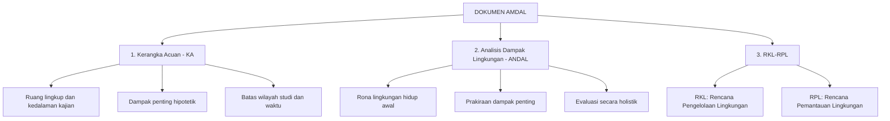
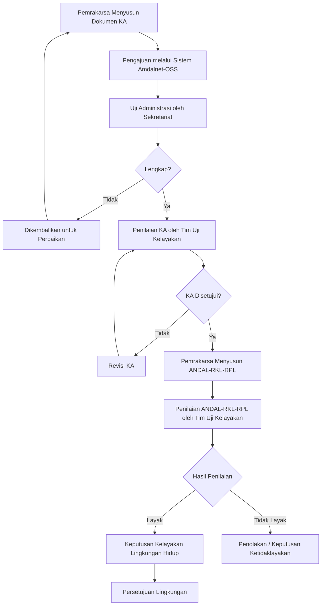
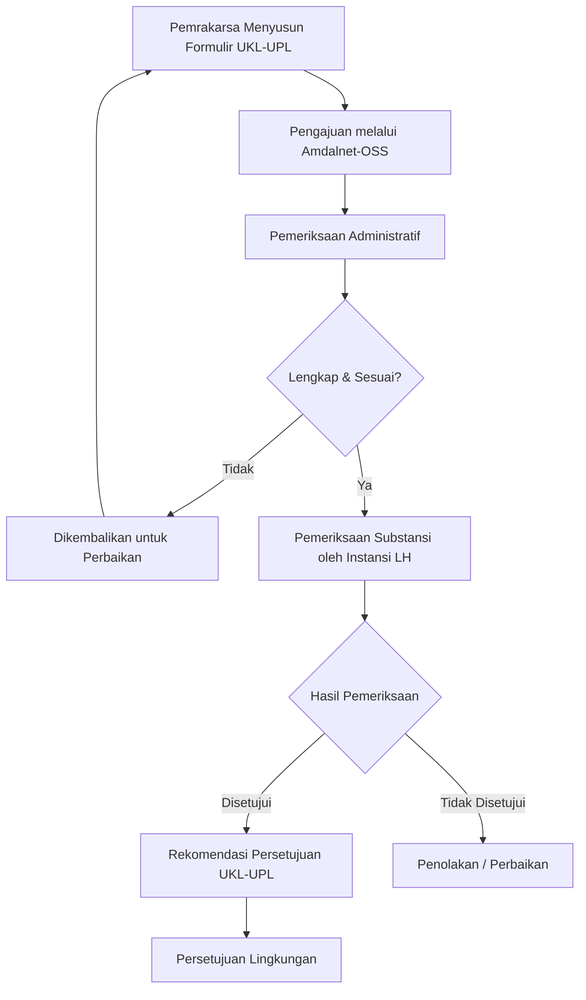
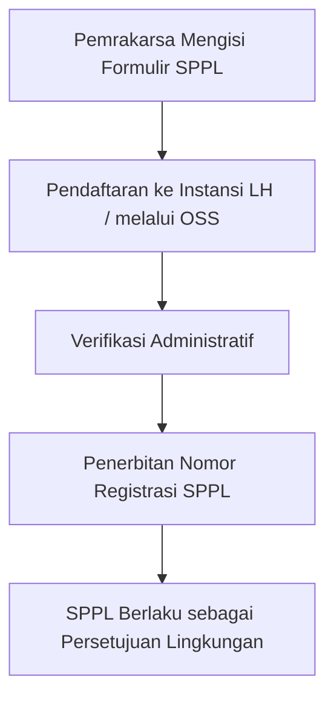
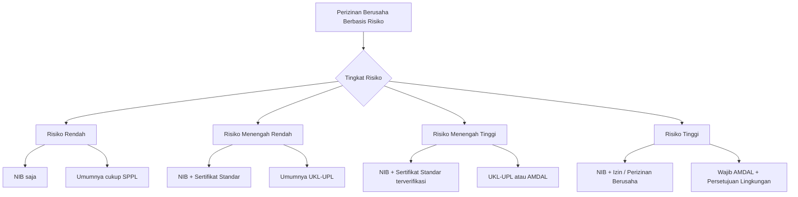

---
title: "AMDAL dan Perizinan Lingkungan"
description: "Kajian komprehensif tentang Analisis Mengenai Dampak Lingkungan (AMDAL), instrumen perizinan lingkungan, dan transformasi rezim persetujuan lingkungan pasca UU Cipta Kerja dalam sistem hukum lingkungan Indonesia"
tags:
  - AMDAL
  - UKL-UPL
  - SPPL
  - perizinan
  - izin-lingkungan
  - persetujuan-lingkungan
  - cipta-kerja
  - OSS-RBA
  - tim-uji-kelayakan
  - audit-lingkungan
date: 2026-04-09
publish: true
---

# AMDAL dan Perizinan Lingkungan

**Navigasi:**
- [[04_Pengendalian_Pencemaran|← Sebelumnya]]
- [[README|↑ Index]]
- [[06_Keadilan_Lingkungan|Lanjut →]]

---

## Tujuan Pembelajaran

Setelah mempelajari topik ini, mahasiswa mampu:

1. Menjelaskan evolusi pengaturan AMDAL di Indonesia dari PP 29/1986 hingga PP 22/2021
2. Memahami kriteria usaha/kegiatan wajib AMDAL, UKL-UPL, dan SPPL serta proses penapisan (*screening*)
3. Menganalisis tahapan proses penilaian AMDAL secara utuh: pelingkupan (*scoping*), penyusunan dokumen, penilaian, dan pengambilan keputusan kelayakan
4. Mengidentifikasi perubahan substansial dari rezim "Izin Lingkungan" menjadi "Persetujuan Lingkungan" pasca UU Cipta Kerja
5. Menjelaskan peran Tim Uji Kelayakan Lingkungan Hidup sebagai pengganti Komisi Penilai AMDAL
6. Memahami integrasi perizinan lingkungan dalam sistem OSS-RBA (*Online Single Submission Risk-Based Approach*)
7. Menganalisis kasus-kasus strategis terkait AMDAL dan perizinan lingkungan (Kendeng, Reklamasi Teluk Jakarta)
8. Menjelaskan fungsi audit lingkungan hidup sebagai instrumen evaluasi pascaoperasional

---

## 1. Evolusi Pengaturan AMDAL di Indonesia

### 1.1 Latar Belakang Historis

Konsep AMDAL (*Environmental Impact Assessment*/EIA) pertama kali diperkenalkan di Amerika Serikat melalui *National Environmental Policy Act* (NEPA) tahun 1969. Di Indonesia, instrumen AMDAL diadopsi secara formal melalui Undang-Undang Nomor 4 Tahun 1982 tentang Ketentuan-Ketentuan Pokok Pengelolaan Lingkungan Hidup (UUKPLH), yang menjadi landasan hukum pertama bagi kajian dampak lingkungan.

Sejak diperkenalkan pada 1982, pengaturan AMDAL di Indonesia telah mengalami beberapa kali perubahan yang mencerminkan dinamika politik hukum lingkungan nasional. Setiap perubahan membawa paradigma baru, mulai dari sentralisasi penilaian hingga desentralisasi, dan akhirnya integrasi dengan sistem perizinan berusaha berbasis risiko.

### 1.2 Periodisasi Pengaturan AMDAL

| Periode | Dasar Hukum | Karakteristik Utama |
|---------|-------------|---------------------|
| **1982–1993** | UU 4/1982 → PP 29/1986 | Pengenalan pertama AMDAL; penilaian terpusat di Komisi AMDAL Pusat; hanya berlaku untuk proyek berskala besar |
| **1993–1999** | PP 51/1993 | Revisi pertama; mulai membedakan AMDAL, UKL-UPL; desentralisasi sebagian ke daerah |
| **1999–2009** | UU 23/1997 → PP 27/1999 | Desentralisasi penilaian ke pemerintah daerah; pembentukan Komisi Penilai AMDAL di tingkat pusat, provinsi, dan kabupaten/kota |
| **2009–2012** | UU 32/2009 (UUPPLH) | Paradigma baru: AMDAL sebagai dasar "Izin Lingkungan"; penguatan partisipasi masyarakat; sanksi pidana yang lebih tegas |
| **2012–2021** | PP 27/2012 | Pelaksanaan UU 32/2009; Komisi Penilai AMDAL sebagai lembaga struktural; integrasi izin lingkungan dengan izin usaha |
| **2021–sekarang** | UU 11/2020 jo. UU 6/2023 → PP 22/2021 | Transformasi "Izin Lingkungan" menjadi "Persetujuan Lingkungan"; Tim Uji Kelayakan menggantikan Komisi Penilai AMDAL; integrasi dengan OSS-RBA |

### 1.3 Pergeseran Paradigma

Evolusi pengaturan AMDAL di Indonesia menunjukkan beberapa pergeseran paradigma yang signifikan. Pertama, terjadi pergeseran dari pendekatan *command and control* yang murni bersifat regulatif menuju pendekatan berbasis risiko yang lebih fleksibel. Kedua, terjadi transformasi kelembagaan dari Komisi Penilai AMDAL yang bersifat kolegial-multipartai menjadi Tim Uji Kelayakan yang lebih teknis dan tersertifikasi. Ketiga, terdapat pergeseran dari sistem perizinan yang terpisah-pisah (*fragmented*) menuju sistem tunggal yang terintegrasi melalui OSS-RBA.

Pergeseran paradigma ini memunculkan perdebatan akademik mengenai apakah simplifikasi proses perizinan lingkungan benar-benar meningkatkan efisiensi tanpa mengorbankan perlindungan lingkungan, ataukah justru melemahkan fungsi AMDAL sebagai instrumen pencegahan pencemaran dan kerusakan lingkungan.

### 1.4 Filosofi AMDAL: Pencegahan vs Penanggulangan

AMDAL didasarkan pada filosofi **pencegahan** (*prevention principle*) — bahwa lebih baik mencegah kerusakan lingkungan sebelum terjadi daripada berusaha memulihkannya setelah kerusakan terjadi. Prinsip ini berkaitan erat dengan **prinsip kehati-hatian** (*precautionary principle*) yang menyatakan bahwa ketidakpastian ilmiah tidak boleh dijadikan alasan untuk menunda tindakan pencegahan.

Dalam konteks AMDAL, implikasi prinsip pencegahan adalah bahwa kajian dampak lingkungan harus dilakukan **sebelum** (*ex ante*) kegiatan dimulai, bukan sesudahnya (*ex post*). Hal ini membedakan AMDAL dari audit lingkungan (Pasal 48-51 UU 32/2009) yang bersifat evaluatif terhadap kegiatan yang sudah berjalan.

**Pasal 2 huruf f UU 32/2009** secara eksplisit menyebutkan "kehati-hatian" sebagai salah satu asas perlindungan dan pengelolaan lingkungan hidup. Penjelasan pasal tersebut menegaskan bahwa asas kehati-hatian mengandung makna bahwa ketidakpastian mengenai dampak suatu usaha dan/atau kegiatan karena keterbatasan penguasaan ilmu pengetahuan dan teknologi bukan merupakan alasan untuk menunda langkah-langkah meminimalisasi atau menghindari ancaman terhadap pencemaran dan/atau kerusakan lingkungan hidup.

### 1.5 AMDAL dalam Konteks Pembangunan Berkelanjutan

AMDAL tidak boleh dipahami sebagai instrumen yang bertujuan menghambat pembangunan. Sebaliknya, AMDAL merupakan instrumen untuk memastikan bahwa pembangunan dilaksanakan secara berkelanjutan (*sustainable development*) — yaitu pembangunan yang memenuhi kebutuhan generasi sekarang tanpa mengorbankan kemampuan generasi mendatang untuk memenuhi kebutuhannya sendiri (definisi Brundtland, 1987).

Dalam konteks ini, AMDAL berfungsi sebagai *balancing tool* — menyeimbangkan kepentingan pembangunan ekonomi dengan perlindungan lingkungan dan kesejahteraan sosial. AMDAL yang baik tidak mengatakan "tidak boleh membangun," melainkan memberikan rekomendasi mengenai "bagaimana membangun dengan dampak lingkungan yang dapat diterima."

---

## 2. Analisis Mengenai Dampak Lingkungan (AMDAL)

### 2.1 Dasar Hukum dan Definisi

Pengaturan AMDAL diatur dalam **Pasal 22–35 UU 32/2009** tentang Perlindungan dan Pengelolaan Lingkungan Hidup (sebagaimana telah diubah melalui UU 11/2020 tentang Cipta Kerja, yang kemudian ditetapkan sebagai undang-undang melalui UU 6/2023), serta dijabarkan lebih lanjut dalam **PP 22/2021** tentang Penyelenggaraan Perlindungan dan Pengelolaan Lingkungan Hidup.

**Pasal 1 angka 11 UU 32/2009** mendefinisikan AMDAL sebagai berikut:

> "Analisis mengenai dampak lingkungan hidup, yang selanjutnya disebut Amdal, adalah kajian mengenai dampak penting suatu usaha dan/atau kegiatan yang direncanakan pada lingkungan hidup yang diperlukan bagi proses pengambilan keputusan tentang penyelenggaraan usaha dan/atau kegiatan."

Dari definisi tersebut, terdapat beberapa elemen pokok AMDAL. Pertama, AMDAL merupakan suatu *kajian* (bukan sekadar dokumen administratif), yang menuntut pendekatan ilmiah dan metodologis. Kedua, objek kajiannya adalah *dampak penting* — bukan sembarang dampak, melainkan dampak yang memenuhi kriteria tertentu. Ketiga, AMDAL bersifat *prediktif*, karena dilakukan terhadap usaha/kegiatan yang *direncanakan* (belum dilaksanakan). Keempat, AMDAL berfungsi sebagai instrumen *pengambilan keputusan*, yang menentukan layak atau tidaknya suatu rencana usaha/kegiatan dari perspektif lingkungan.

### 2.2 Penapisan (*Screening*): Kriteria Usaha/Kegiatan Wajib AMDAL

Tahap pertama dalam proses AMDAL adalah penapisan, yaitu penentuan apakah suatu rencana usaha/kegiatan wajib dilengkapi dengan AMDAL, UKL-UPL, atau cukup dengan SPPL. Penapisan didasarkan pada kriteria dampak penting sebagaimana diatur dalam **Pasal 23 ayat (1) UU 32/2009**:

> "Kriteria usaha dan/atau kegiatan yang berdampak penting yang wajib dilengkapi dengan Amdal terdiri atas:
> a. pengubahan bentuk lahan dan bentang alam;
> b. eksploitasi sumber daya alam, baik yang terbarukan maupun yang tidak terbarukan;
> c. proses dan kegiatan yang secara potensial dapat menimbulkan pencemaran dan/atau kerusakan lingkungan hidup serta pemborosan dan kemerosotan sumber daya alam dalam pemanfaatannya;
> d. proses dan kegiatan yang hasilnya dapat mempengaruhi lingkungan alam, lingkungan buatan, serta lingkungan sosial dan budaya;
> e. proses dan kegiatan yang hasilnya akan mempengaruhi pelestarian kawasan konservasi sumber daya alam dan/atau perlindungan cagar budaya;
> f. introduksi jenis tumbuh-tumbuhan, hewan, dan jasad renik;
> g. pembuatan dan penggunaan bahan hayati dan nonhayati;
> h. kegiatan yang mempunyai risiko tinggi dan/atau mempengaruhi pertahanan negara; dan/atau
> i. penerapan teknologi yang diperkirakan mempunyai potensi besar untuk mempengaruhi lingkungan hidup."

Secara lebih operasional, **PP 22/2021** beserta lampirannya menetapkan daftar jenis rencana usaha/kegiatan yang wajib AMDAL berdasarkan parameter skala/besaran, antara lain: pembangunan bendungan dengan tinggi tertentu, pembukaan lahan pertanian di atas skala tertentu, kegiatan pertambangan, pembangunan pembangkit listrik, industri kimia, dan sebagainya.

Pasca berlakunya integrasi Amdalnet dengan OSS-RBA (efektif 1 Mei 2024), proses penapisan dilakukan secara elektronik melalui sistem Amdalnet yang terintegrasi dengan OSS-RBA. Pemrakarsa memasukkan data rencana usaha/kegiatan, dan sistem secara otomatis melakukan penapisan apakah kegiatan tersebut termasuk kategori wajib AMDAL, UKL-UPL, atau SPPL.

### 2.3 Penentuan Dampak Penting

**Pasal 22 ayat (2) UU 32/2009** menetapkan kriteria dampak penting yang ditentukan berdasarkan:

| Kriteria | Penjelasan | Contoh |
|----------|------------|--------|
| **Besarnya jumlah penduduk yang terkena dampak** | Semakin banyak penduduk terkena dampak, semakin penting dampaknya | Pembangunan bandara baru di dekat permukiman padat |
| **Luas wilayah penyebaran dampak** | Cakupan geografis dampak | Pencemaran sungai yang melintasi beberapa kecamatan |
| **Intensitas dan lamanya dampak berlangsung** | Durasi dan tingkat keparahan | Dampak radiasi yang berlangsung puluhan tahun |
| **Banyaknya komponen lingkungan hidup lain yang terkena dampak** | Efek berantai ke berbagai komponen | Kegiatan yang memengaruhi air, udara, tanah, dan biota secara simultan |
| **Sifat kumulatif dampak** | Dampak yang bertambah dari waktu ke waktu atau akibat akumulasi kegiatan | Beberapa pabrik di satu kawasan yang secara kumulatif melampaui daya tampung |
| **Berbalik atau tidak berbaliknya dampak** | Reversibilitas dampak | Hilangnya spesies endemik yang tidak dapat dipulihkan |

### 2.4 Pelingkupan (*Scoping*) dan Penyusunan Kerangka Acuan

Setelah ditetapkan bahwa suatu rencana usaha/kegiatan wajib AMDAL, tahap berikutnya adalah pelingkupan (*scoping*). Pelingkupan bertujuan untuk menentukan lingkup dan kedalaman kajian AMDAL, termasuk identifikasi dampak penting hipotetik, batas wilayah studi, dan metodologi kajian.

Hasil pelingkupan dituangkan dalam dokumen **Kerangka Acuan (KA)**, yang menjadi acuan bagi penyusunan dokumen ANDAL dan RKL-RPL. KA memuat antara lain: pendahuluan (latar belakang, tujuan, dan manfaat rencana usaha/kegiatan), pelingkupan (identifikasi dampak penting, evaluasi dampak penting, dan pemusatan dampak penting), serta metodologi yang akan digunakan dalam studi AMDAL.

### 2.5 Dokumen AMDAL

Dokumen AMDAL terdiri atas tiga komponen utama yang merupakan satu kesatuan:

**Kerangka Acuan (KA)** berfungsi sebagai *blueprint* atau panduan bagi penyusunan ANDAL dan RKL-RPL. KA disusun oleh pemrakarsa berdasarkan hasil pelingkupan dan diajukan kepada lembaga yang berwenang untuk dinilai.

**ANDAL (Analisis Dampak Lingkungan Hidup)** merupakan inti dari dokumen AMDAL. ANDAL memuat telaahan secara cermat dan mendalam mengenai dampak penting suatu rencana usaha/kegiatan. Komponen ANDAL meliputi: deskripsi rona lingkungan hidup awal (*baseline*), prakiraan dampak penting terhadap komponen fisik-kimia, biologi, dan sosial-ekonomi-budaya, serta evaluasi dampak secara holistik yang mempertimbangkan interaksi antar-dampak.

**RKL-RPL** memuat rencana pengelolaan dampak penting (RKL) yang berisi upaya-upaya konkret untuk mencegah, mengendalikan, dan menanggulangi dampak penting negatif, serta meningkatkan dampak penting positif. RPL memuat rencana pemantauan terhadap komponen lingkungan hidup yang terkena dampak, termasuk metode, lokasi, dan frekuensi pemantauan.

### 2.6 Proses Penilaian AMDAL

Proses penilaian AMDAL pasca UU Cipta Kerja mengalami perubahan signifikan, khususnya dengan dibentuknya **Tim Uji Kelayakan Lingkungan Hidup** yang menggantikan Komisi Penilai AMDAL. Proses penilaian dapat digambarkan sebagai berikut:

### 2.7 Tim Uji Kelayakan Lingkungan Hidup: Pengganti Komisi Penilai AMDAL

Salah satu perubahan paling mendasar yang dibawa oleh UU Cipta Kerja dan PP 22/2021 adalah penghapusan **Komisi Penilai AMDAL** dan pembentukan **Lembaga Uji Kelayakan Lingkungan Hidup (LUKLH)** beserta **Tim Uji Kelayakan Lingkungan Hidup (TUKLH)**.

Berdasarkan **Pasal 24 UU 32/2009** (sebagaimana diubah oleh UU Cipta Kerja) jo. **Pasal 106 PP 22/2021**, perubahan kelembagaan ini dapat dirinci sebagai berikut:

| Aspek | Komisi Penilai AMDAL (Rezim Lama) | Tim Uji Kelayakan LH (Rezim Baru) |
|-------|-------------------------------------|--------------------------------------|
| **Dasar Hukum** | UU 32/2009 asli, PP 27/2012 | UU 32/2009 jo. UU 6/2023, PP 22/2021, Permen LHK 4/2021 |
| **Keanggotaan** | Multi-stakeholder: pejabat pemerintah, pakar, wakil masyarakat | Tenaga ahli bersertifikat kompetensi penilaian AMDAL |
| **Kedudukan** | Di tingkat pusat, provinsi, kabupaten/kota | Dibentuk oleh LUKLH di tingkat Pusat, Provinsi, Kabupaten/Kota, dan Khusus |
| **Sifat Penilaian** | Kolegial, pertimbangan politik dan teknis | Lebih teknis dan berorientasi kompetensi |
| **Keterlibatan Masyarakat** | Masyarakat sebagai anggota Komisi | Masyarakat berpartisipasi melalui mekanisme tersendiri (bukan bagian dari Tim) |

Pembentukan TUKLH dimaksudkan untuk meningkatkan kualitas dan objektivitas penilaian AMDAL melalui penekanan pada kompetensi teknis penilai. Namun, perubahan ini menuai kritik karena dianggap mengurangi ruang partisipasi publik dalam proses penilaian AMDAL, mengingat dalam Komisi Penilai AMDAL, wakil masyarakat terkena dampak dan organisasi lingkungan hidup duduk sebagai anggota komisi.

**Permen LHK Nomor 4 Tahun 2021** dan **Permen LHK Nomor 18 Tahun 2021** (sebagai pelaksanaan Pasal 106 huruf b, c, dan d PP 22/2021) mengatur lebih lanjut mengenai tata kerja TUKLH, persyaratan sertifikasi kompetensi, serta mekanisme operasional penilaian.

### 2.8 Sertifikasi Penyusun AMDAL

**Pasal 27 UU 32/2009** mewajibkan bahwa dokumen AMDAL disusun oleh pemrakarsa dengan menugaskan pihak lain yang tergabung dalam **penyusun AMDAL** yang telah memiliki sertifikat kompetensi. Sertifikasi penyusun AMDAL bertujuan untuk menjamin kualitas ilmiah dan metodologis dokumen AMDAL. Penyusun AMDAL harus memiliki kompetensi yang mencakup kemampuan melakukan identifikasi dan prakiraan dampak penting, kemampuan mengevaluasi dampak secara holistik, dan kemampuan merumuskan rencana pengelolaan dan pemantauan lingkungan yang efektif.

Pasca UU Cipta Kerja, sertifikasi penyusun AMDAL diselenggarakan oleh lembaga sertifikasi profesi yang terakreditasi oleh Badan Nasional Sertifikasi Profesi (BNSP). Penyusun AMDAL yang menyusun dokumen tanpa sertifikasi dapat dikenai sanksi pidana berdasarkan **Pasal 110 UU 32/2009** berupa pidana penjara paling lama 3 tahun dan denda paling banyak Rp3.000.000.000,00 (tiga miliar rupiah).

Kualitas penyusun AMDAL merupakan salah satu faktor kunci dalam menentukan kualitas dokumen AMDAL. Dalam praktik, masih terdapat permasalahan terkait penyusun AMDAL yang bekerja di bawah tekanan pemrakarsa untuk menghasilkan dokumen yang "meloloskan" rencana usaha/kegiatan, bukan dokumen yang secara objektif mengkaji dampak lingkungan. Independensi penyusun AMDAL menjadi isu etis yang penting, mengingat penyusun dibayar oleh pemrakarsa sehingga berpotensi terjadi *conflict of interest*.

### 2.9 Kriteria Kelayakan Lingkungan Hidup

Berdasarkan **Pasal 29 UU 32/2009**, uji kelayakan lingkungan hidup dilakukan dengan mempertimbangkan beberapa kriteria. Pertama, rencana tata ruang harus sesuai dengan rencana tata ruang wilayah. Kedua, kebijakan di bidang perlindungan dan pengelolaan lingkungan hidup harus diperhatikan. Ketiga, harus mempertimbangkan kepentingan pertahanan keamanan. Selain itu, berdasarkan praktik yang berlaku, kriteria kelayakan juga mencakup hal-hal berikut:

1. Dampak penting negatif dapat dikelola dengan teknologi yang tersedia dan secara ekonomis layak (*technically and economically feasible*)
2. Rencana pengelolaan dan pemantauan lingkungan hidup mampu menjamin bahwa dampak penting negatif dapat dikelola sampai tingkat yang dapat diterima
3. Usaha/kegiatan tidak akan melampaui daya dukung dan daya tampung lingkungan hidup
4. Dampak dapat diterima secara sosial-budaya oleh masyarakat terkena dampak

Apabila hasil uji kelayakan menyatakan bahwa rencana usaha/kegiatan tidak layak lingkungan, maka Pemerintah wajib menolak permohonan Persetujuan Lingkungan (*mandatory rejection*).

---

## 3. UKL-UPL (Upaya Pengelolaan Lingkungan Hidup – Upaya Pemantauan Lingkungan Hidup)

### 3.1 Kedudukan UKL-UPL dalam Sistem Perizinan

UKL-UPL merupakan instrumen pengelolaan lingkungan hidup untuk usaha/kegiatan yang **tidak wajib AMDAL** namun **tetap berpotensi menimbulkan dampak** terhadap lingkungan hidup. UKL-UPL diatur dalam **Pasal 34–35 UU 32/2009** dan dijabarkan lebih lanjut dalam **PP 22/2021**.

Berbeda dengan AMDAL yang merupakan kajian ilmiah mendalam, UKL-UPL lebih bersifat sebagai formulir standar yang memuat upaya-upaya pengelolaan dan pemantauan lingkungan yang akan dilakukan oleh pemrakarsa. Meskipun demikian, UKL-UPL tetap merupakan instrumen penting karena mayoritas usaha/kegiatan di Indonesia termasuk dalam kategori wajib UKL-UPL.

### 3.2 Kriteria Usaha/Kegiatan Wajib UKL-UPL

Usaha/kegiatan yang wajib menyusun UKL-UPL adalah yang memenuhi kriteria berikut: tidak termasuk dalam daftar wajib AMDAL (dampaknya tidak memenuhi kriteria "dampak penting"), tetap berpotensi menimbulkan dampak lingkungan hidup yang memerlukan pengelolaan dan pemantauan, serta memenuhi parameter skala/besaran tertentu sebagaimana ditetapkan dalam lampiran PP 22/2021.

### 3.3 Format dan Muatan UKL-UPL

Formulir UKL-UPL memuat komponen-komponen sebagai berikut:

| Komponen | Muatan |
|----------|--------|
| **Identitas Pemrakarsa** | Nama, alamat, penanggung jawab usaha/kegiatan |
| **Rencana Usaha/Kegiatan** | Nama kegiatan, lokasi, skala/besaran, deskripsi proses |
| **Dampak Lingkungan** | Jenis dampak yang diperkirakan timbul pada tahap pra-konstruksi, konstruksi, dan operasi |
| **Upaya Pengelolaan Lingkungan (UKL)** | Bentuk upaya pengelolaan, lokasi pengelolaan, periode pengelolaan |
| **Upaya Pemantauan Lingkungan (UPL)** | Bentuk upaya pemantauan, lokasi pemantauan, frekuensi pemantauan |
| **Surat Pernyataan** | Kesanggupan pemrakarsa untuk melaksanakan UKL-UPL |

### 3.4 Proses Pemeriksaan UKL-UPL

Proses pemeriksaan UKL-UPL lebih sederhana dibandingkan penilaian AMDAL. Pemeriksaan dilakukan oleh instansi lingkungan hidup yang berwenang (Kementerian LHK, Dinas LH Provinsi, atau Dinas LH Kabupaten/Kota) tanpa melalui Tim Uji Kelayakan. Jangka waktu pemeriksaan UKL-UPL juga lebih singkat dibandingkan penilaian AMDAL.

---

## 4. SPPL (Surat Pernyataan Kesanggupan Pengelolaan dan Pemantauan Lingkungan Hidup)

### 4.1 Kedudukan SPPL

SPPL merupakan instrumen pengelolaan lingkungan untuk usaha/kegiatan berskala paling kecil, yaitu yang **tidak wajib AMDAL** dan **tidak wajib UKL-UPL**. Dampak lingkungan dari kegiatan ini dinilai **sangat kecil** sehingga tidak memerlukan kajian mendalam atau formulir standar, melainkan cukup dengan pernyataan kesanggupan (*self-declaration*) dari pemrakarsa.

### 4.2 Prosedur SPPL

SPPL bersifat deklaratif: pemrakarsa mengisi formulir SPPL yang memuat identitas, jenis usaha/kegiatan, dan pernyataan kesanggupan untuk melakukan pengelolaan dan pemantauan lingkungan hidup. SPPL didaftarkan kepada instansi lingkungan hidup yang berwenang dan memperoleh nomor registrasi.

SPPL tidak memerlukan proses penilaian atau pemeriksaan substansial. Penerbitan nomor registrasi SPPL bersifat otomatis setelah formulir diisi secara lengkap dan benar. Meskipun prosesnya sederhana, pemrakarsa tetap bertanggung jawab untuk melaksanakan pengelolaan dan pemantauan lingkungan sebagaimana dinyatakan dalam SPPL.

### 4.3 Perbandingan Tiga Instrumen Dokumen Lingkungan

Ketiga instrumen dokumen lingkungan — AMDAL, UKL-UPL, dan SPPL — membentuk suatu hierarki berdasarkan tingkat dampak lingkungan yang diperkirakan:

| Aspek | AMDAL | UKL-UPL | SPPL |
|-------|-------|---------|------|
| **Tingkat dampak** | Dampak penting (signifikan) | Dampak tidak penting, tetapi ada | Dampak sangat kecil |
| **Sifat dokumen** | Kajian ilmiah mendalam | Formulir standar dengan analisis | Pernyataan kesanggupan (*self-declaration*) |
| **Penyusun** | Penyusun AMDAL bersertifikat | Pemrakarsa (dapat dibantu konsultan) | Pemrakarsa sendiri |
| **Proses penilaian** | Tim Uji Kelayakan LH | Pemeriksaan oleh Instansi LH | Registrasi otomatis |
| **Jangka waktu proses** | 3-12 bulan | 1-3 bulan | Hari kerja (sangat singkat) |
| **Biaya** | Tinggi (ratusan juta - miliaran rupiah) | Sedang (puluhan - ratusan juta rupiah) | Minimal (biaya formulir saja) |
| **Partisipasi publik** | Wajib ada konsultasi publik | Tidak wajib konsultasi publik formal | Tidak ada |
| **Contoh kegiatan** | Pembangunan PLTU, tambang besar, pembangunan bandara | Hotel menengah, industri kecil, gedung perkantoran | Warung, bengkel kecil, usaha rumah tangga |

Sistem tiga tingkat ini dirancang agar proporsional — semakin besar potensi dampak lingkungan, semakin ketat persyaratan kajian dan penilaiannya. Pendekatan ini mencerminkan prinsip proporsionalitas dalam hukum administrasi, di mana beban regulasi harus seimbang dengan risiko yang dihadapi.

---

## 5. Persetujuan Lingkungan: Transformasi Pasca UU Cipta Kerja

### 5.1 Dari "Izin Lingkungan" ke "Persetujuan Lingkungan"

Perubahan paling mendasar yang dibawa oleh UU Cipta Kerja (UU 11/2020, kemudian ditetapkan menjadi UU 6/2023) di bidang hukum lingkungan adalah transformasi dari konsep **"Izin Lingkungan"** menjadi **"Persetujuan Lingkungan"**. Perubahan ini bukan sekadar perubahan nomenklatur, melainkan mencerminkan pergeseran konseptual yang substansial dalam hubungan antara instrumen lingkungan dan perizinan berusaha.

### 5.2 Perbandingan Rezim Lama dan Baru

| Aspek | Izin Lingkungan (Rezim Lama) | Persetujuan Lingkungan (Rezim Baru) |
|-------|------------------------------|--------------------------------------|
| **Dasar Hukum** | UU 32/2009 (asli), PP 27/2012 | UU 32/2009 jo. UU 6/2023, PP 22/2021 |
| **Sifat Hukum** | Keputusan Tata Usaha Negara (KTUN) yang berdiri sendiri | Bagian dari perizinan berusaha terintegrasi |
| **Proses** | Terpisah dari perizinan berusaha; diajukan sendiri | Terintegrasi dalam sistem OSS-RBA |
| **Lembaga Penilai** | Komisi Penilai AMDAL (multistakeholder) | Tim Uji Kelayakan LH (bersertifikat kompetensi) |
| **Objek Gugatan TUN** | Izin Lingkungan dapat langsung digugat ke PTUN sebagai KTUN | Status sebagai KTUN yang dapat digugat menjadi perdebatan; sebagian pendapat menyatakan Persetujuan Lingkungan bukan KTUN mandiri |
| **Partisipasi Publik** | Masyarakat terkena dampak duduk sebagai anggota Komisi Penilai | Partisipasi melalui mekanisme tersendiri, bukan sebagai bagian Tim Uji Kelayakan |
| **Kaitan dengan Izin Usaha** | Prasyarat izin usaha; pencabutan izin lingkungan → pembatalan izin usaha | Prasyarat perizinan berusaha; persyaratan dalam Persetujuan Lingkungan melekat pada perizinan berusaha |
| **Sistem Pengajuan** | Manual / sebagian elektronik | Sepenuhnya elektronik melalui Amdalnet-OSS |

### 5.3 Kritik terhadap Perubahan Rezim

Perubahan dari Izin Lingkungan ke Persetujuan Lingkungan menuai kritik dari berbagai kalangan. Para akademisi hukum lingkungan dan organisasi masyarakat sipil mengemukakan beberapa kekhawatiran.

Pertama, terkait **melemahnya akses keadilan**: jika Persetujuan Lingkungan bukan lagi KTUN yang berdiri sendiri, maka masyarakat kehilangan *legal standing* untuk menggugat ke PTUN secara langsung terhadap keputusan persetujuan lingkungan. Kedua, mengenai **reduksi partisipasi publik**: penghapusan keterlibatan masyarakat dalam lembaga penilai (dari Komisi Penilai ke Tim Uji Kelayakan) berpotensi mengurangi kualitas pengawasan sosial terhadap proses AMDAL. Ketiga, tentang **simplifikasi yang berlebihan**: orientasi pada kemudahan berusaha (*ease of doing business*) dikhawatirkan mengorbankan prinsip kehati-hatian (*precautionary principle*) dalam pengelolaan lingkungan.

Di sisi lain, pemerintah berargumen bahwa perubahan ini dimaksudkan untuk menghilangkan birokrasi yang berlebihan, mempercepat proses perizinan, dan meningkatkan daya saing investasi Indonesia tanpa mengurangi substansi perlindungan lingkungan.

### 5.4 Integrasi dengan Perizinan Berusaha Berbasis Risiko

**PP Nomor 5 Tahun 2021** tentang Penyelenggaraan Perizinan Berusaha Berbasis Risiko mengklasifikasikan perizinan berusaha berdasarkan tingkat risiko kegiatan:

Dalam skema ini, Persetujuan Lingkungan menjadi bagian integral dari perizinan berusaha, bukan lagi izin yang terpisah. Persyaratan yang tercantum dalam keputusan kelayakan lingkungan atau rekomendasi UKL-UPL melekat sebagai kewajiban (*conditionalities*) dalam perizinan berusaha.

### 5.5 Persyaratan dalam Persetujuan Lingkungan

Berdasarkan **Pasal 36 ayat (3) UU 32/2009** (sebagaimana diubah), Persetujuan Lingkungan memuat persyaratan-persyaratan yang wajib dipenuhi oleh pemrakarsa, antara lain: kewajiban memenuhi baku mutu air limbah dan/atau emisi, kewajiban pengelolaan limbah bahan berbahaya dan beracun (B3), kewajiban melakukan pemantauan kualitas lingkungan secara berkala, kewajiban pelaporan pelaksanaan RKL-RPL atau UKL-UPL, kewajiban menyediakan dana jaminan pemulihan lingkungan hidup, dan kewajiban-kewajiban spesifik lainnya sesuai karakteristik usaha/kegiatan.

---

## 6. Sistem OSS-RBA dan Amdalnet

### 6.1 Pengertian OSS-RBA

**OSS-RBA** (*Online Single Submission Risk-Based Approach*) adalah sistem perizinan berusaha secara elektronik yang terintegrasi, berbasis pendekatan risiko. OSS-RBA diselenggarakan oleh Kementerian Investasi/BKPM sebagai pelaksanaan PP 5/2021 dan PP 6/2021.

### 6.2 Klasifikasi Risiko dan Kewajiban Dokumen Lingkungan

Salah satu inovasi dari sistem perizinan berusaha berbasis risiko adalah penyelarasan antara tingkat risiko kegiatan dengan jenis dokumen lingkungan yang dipersyaratkan. Penyelarasan ini dilakukan melalui mekanisme penapisan otomatis yang mengklasifikasikan setiap jenis usaha/kegiatan ke dalam empat kategori risiko berdasarkan parameter bahaya (*hazard*) dan potensi terjadinya bahaya (*probability*).

**Risiko rendah** meliputi usaha/kegiatan berskala mikro dan kecil dengan dampak lingkungan minimal — misalnya warung makan kecil, usaha menjahit, atau bengkel sepeda. Kegiatan ini umumnya cukup dengan SPPL atau bahkan tidak memerlukan dokumen lingkungan sama sekali. **Risiko menengah rendah** mencakup usaha/kegiatan berskala kecil hingga menengah dengan dampak lingkungan terbatas — misalnya restoran menengah, usaha pencucian mobil, atau gudang penyimpanan. Kegiatan ini umumnya memerlukan UKL-UPL.

**Risiko menengah tinggi** meliputi usaha/kegiatan berskala menengah hingga besar dengan dampak lingkungan yang signifikan — misalnya hotel besar, rumah sakit, atau pabrik makanan. Kegiatan ini memerlukan UKL-UPL atau AMDAL tergantung pada skala dan sifat dampaknya. **Risiko tinggi** mencakup usaha/kegiatan berskala besar dengan dampak lingkungan yang sangat signifikan — misalnya pertambangan, pembangkit listrik tenaga batu bara, industri kimia besar, atau pembangunan infrastruktur berskala besar. Kegiatan ini wajib AMDAL dan Persetujuan Lingkungan.

Sistem klasifikasi ini bertujuan agar beban regulasi proporsional dengan risiko yang ditimbulkan — kegiatan berisiko rendah tidak dibebankan dengan persyaratan dokumen lingkungan yang berlebihan, sementara kegiatan berisiko tinggi tetap tunduk pada persyaratan AMDAL yang ketat.

### 6.3 Integrasi Amdalnet dengan OSS-RBA

Efektif sejak 1 Mei 2024, proses permohonan Persetujuan Lingkungan dilakukan melalui sistem **Amdalnet** yang terintegrasi penuh dengan OSS-RBA. Amdalnet merupakan sistem informasi berbasis web yang dikelola oleh Kementerian Lingkungan Hidup dan Kehutanan (KLHK) untuk mengelola seluruh proses dokumen lingkungan, mulai dari penapisan, penyusunan, penilaian/pemeriksaan, hingga penerbitan Persetujuan Lingkungan.

Alur proses integrasi Amdalnet-OSS adalah sebagai berikut: pemrakarsa mengajukan Perizinan Berusaha melalui OSS-RBA, kemudian sistem OSS secara otomatis melakukan penapisan dan meneruskan ke Amdalnet apabila kegiatan memerlukan dokumen lingkungan. Selanjutnya, pemrakarsa menyusun dan mengunggah dokumen (AMDAL/UKL-UPL/SPPL) melalui Amdalnet, penilaian/pemeriksaan dilakukan secara elektronik melalui Amdalnet, dan apabila disetujui, Persetujuan Lingkungan diterbitkan melalui Amdalnet dan diteruskan ke OSS-RBA untuk dilekatkan pada Perizinan Berusaha.

### 6.3 Pembaruan 2025: PP 28/2025

**PP Nomor 28 Tahun 2025** tentang Perizinan Berusaha Berbasis Risiko membawa reformasi lebih lanjut terhadap sistem OSS, dengan penyempurnaan mekanisme berbasis risiko dan peningkatan interoperabilitas antar-sistem kementerian/lembaga. PP ini memperkuat prinsip bahwa jenis dan tingkat kompleksitas izin yang diperlukan pelaku usaha disesuaikan dengan tingkat risiko usaha — rendah, menengah, atau tinggi.

---

## 7. Mekanisme Perizinan sebagai Kontrol Administratif

### 7.1 Prinsip *"No Permit, No Operation"*

Sistem perizinan lingkungan didasarkan pada prinsip fundamental bahwa tanpa Persetujuan Lingkungan, suatu usaha/kegiatan tidak boleh beroperasi. Persetujuan Lingkungan merupakan prasyarat mutlak (*conditio sine qua non*) bagi penerbitan perizinan berusaha.

### 7.2 Kewajiban Penolakan (*Mandatory Rejection*)

**Pasal 37 ayat (1) UU 32/2009** menegaskan kewajiban penolakan:

> "Menteri, gubernur, atau bupati/walikota sesuai dengan kewenangannya **wajib menolak** permohonan izin lingkungan apabila permohonan izin tidak dilengkapi dengan amdal atau UKL-UPL."

Kata **"wajib"** dalam ketentuan ini bersifat **imperatif** (*mandatory*), yang berarti pejabat yang berwenang tidak memiliki diskresi (*no discretion*) untuk memberikan izin tanpa AMDAL atau UKL-UPL. Pemberian izin tanpa dokumen lingkungan yang lengkap merupakan **pelanggaran hukum** yang dapat dikenai sanksi administratif dan pidana.

### 7.3 Pembatalan Persetujuan Lingkungan

**Pasal 37 ayat (2) UU 32/2009** mengatur bahwa Persetujuan Lingkungan dapat dibatalkan apabila:

| Alasan Pembatalan | Penjelasan | Implikasi |
|--------|------------|-----------|
| **Persyaratan cacat hukum** | Data palsu, pemalsuan dokumen, penyalahgunaan prosedur | Persetujuan batal demi hukum (*null and void*) |
| **Tidak memenuhi syarat kelayakan** | Diterbitkan tanpa melalui proses yang benar | Persetujuan dapat dibatalkan |
| **Kewajiban tidak dilaksanakan** | Pemrakarsa tidak melaksanakan kewajiban dalam RKL-RPL/UKL-UPL | Persetujuan dapat dicabut setelah melalui mekanisme sanksi bertahap |

### 7.4 Hubungan dengan Perizinan Berusaha

**Pasal 40 UU 32/2009** menegaskan bahwa Persetujuan Lingkungan merupakan prasyarat untuk memperoleh perizinan berusaha. Konsekuensi hukumnya bersifat kaskade (*cascading effect*): pencabutan Persetujuan Lingkungan mengakibatkan pembatalan perizinan berusaha, yang pada gilirannya mengakibatkan penghentian usaha/kegiatan.

Mekanisme ini memberikan *"gigi"* pada penegakan hukum lingkungan administratif, karena ancaman pencabutan izin usaha merupakan *deterrent* yang efektif bagi pelaku usaha untuk mematuhi persyaratan lingkungan.

---

## 8. Partisipasi Masyarakat dalam Proses AMDAL

### 8.1 Dasar Hukum Partisipasi

Partisipasi masyarakat dalam proses AMDAL dijamin oleh **Pasal 26 UU 32/2009** yang menyatakan:

> "Dokumen amdal sebagaimana dimaksud dalam Pasal 22 disusun oleh pemrakarsa dengan melibatkan masyarakat."

Pelibatan masyarakat dilakukan berdasarkan prinsip pemberian informasi yang transparan dan lengkap serta diberitahukan sebelum kegiatan dilaksanakan. Masyarakat yang dilibatkan meliputi: masyarakat yang terkena dampak, pemerhati lingkungan hidup, dan/atau masyarakat yang terpengaruh atas segala bentuk keputusan dalam proses AMDAL.

### 8.2 Bentuk Partisipasi

Pasca UU Cipta Kerja, bentuk partisipasi masyarakat dalam AMDAL mengalami perubahan. Dalam rezim lama, masyarakat terlibat melalui dua jalur: sebagai pemberi saran/pendapat/tanggapan dalam konsultasi publik, dan sebagai anggota Komisi Penilai AMDAL. Dalam rezim baru, jalur kedua dihapus — masyarakat tidak lagi duduk sebagai anggota Tim Uji Kelayakan. Partisipasi masyarakat dilakukan melalui mekanisme konsultasi publik yang diatur secara terpisah.

**Mekanisme konsultasi publik** meliputi: pengumuman rencana kegiatan oleh pemrakarsa (melalui media massa dan/atau papan pengumuman), penerimaan saran, pendapat, dan tanggapan dari masyarakat, serta pengakomodasian masukan masyarakat dalam dokumen AMDAL.

### 8.3 Pengajuan Keberatan

Masyarakat berhak mengajukan keberatan pada berbagai tahap, yaitu terhadap rencana usaha/kegiatan itu sendiri, terhadap proses dan substansi dokumen AMDAL, serta terhadap keputusan kelayakan lingkungan hidup. Keberatan terhadap keputusan kelayakan lingkungan dapat dilanjutkan melalui jalur hukum administratif (keberatan ke pejabat yang berwenang) maupun jalur peradilan tata usaha negara.

### 8.4 Kritis: Kemunduran Partisipasi Pasca UU Cipta Kerja?

Perubahan dari Komisi Penilai AMDAL (di mana wakil masyarakat duduk sebagai anggota) ke Tim Uji Kelayakan (yang seluruhnya terdiri dari tenaga ahli bersertifikat) menuai kritik tajam dari organisasi masyarakat sipil. Indonesian Center for Environmental Law (ICEL) dan berbagai organisasi lingkungan mencatat bahwa perubahan ini merupakan **kemunduran** (*regression*) dalam hak partisipasi publik, karena menghilangkan jalur keterlibatan langsung masyarakat dalam proses penilaian substansi dokumen AMDAL.

Dalam sistem lama, wakil masyarakat terkena dampak yang duduk di Komisi Penilai AMDAL dapat secara langsung mempertanyakan kualitas data, metodologi, dan kesimpulan dokumen AMDAL. Mereka juga dapat menyampaikan pengetahuan lokal (*local knowledge*) yang mungkin tidak tertangkap oleh penyusun AMDAL. Dalam sistem baru, partisipasi masyarakat terbatas pada tahap konsultasi publik yang dilakukan sebelum penilaian — artinya, masyarakat memberikan masukan tetapi tidak hadir saat proses penilaian berlangsung.

Pemerintah berargumen bahwa perubahan ini diperlukan untuk meningkatkan **objektivitas** dan **kompetensi teknis** penilaian AMDAL — bahwa penilaian harus dilakukan oleh ahli yang kompeten, bukan oleh pihak-pihak yang mungkin memiliki kepentingan subjektif. Namun, kritikus membalas bahwa objektivitas dan partisipasi tidaklah saling bertentangan — keduanya dapat diwujudkan secara bersamaan melalui desain kelembagaan yang tepat.

Perdebatan ini pada hakikatnya mencerminkan **ketegangan fundamental** dalam hukum lingkungan: antara efisiensi administratif dan demokrasi partisipatif, antara keahlian teknis dan pengetahuan lokal, dan antara kemudahan berusaha dan perlindungan lingkungan. Keseimbangan yang tepat di antara nilai-nilai ini merupakan tantangan kebijakan yang terus berkembang.

---

## 9. Audit Lingkungan Hidup

### 9.1 Pengertian dan Dasar Hukum

Audit lingkungan hidup merupakan instrumen evaluasi yang dilakukan terhadap usaha/kegiatan yang **sudah beroperasi**, berbeda dengan AMDAL yang bersifat prediktif (dilakukan sebelum kegiatan dimulai). Audit lingkungan diatur dalam **Pasal 48–51 UU 32/2009**.

### 9.2 Jenis Audit Lingkungan

**Audit Sukarela (Pasal 48):** Pemerintah mendorong penanggung jawab usaha/kegiatan untuk melakukan audit lingkungan hidup dalam rangka meningkatkan kinerja lingkungan (*environmental performance*). Audit ini bersifat sukarela dan dapat digunakan sebagai instrumen internal perusahaan untuk mengidentifikasi peluang peningkatan efisiensi dan kepatuhan lingkungan.

**Audit Wajib (Pasal 49):** Menteri mewajibkan audit lingkungan hidup terhadap: (a) usaha/kegiatan tertentu yang berisiko tinggi terhadap lingkungan hidup, dan/atau (b) penanggung jawab usaha/kegiatan yang menunjukkan ketidaktaatan terhadap peraturan perundang-undangan. Audit wajib dilakukan secara berkala dan hasilnya menjadi dasar bagi perbaikan kinerja lingkungan.

### 9.3 Pelaksanaan dan Konsekuensi

Audit lingkungan hidup wajib dilaksanakan oleh auditor lingkungan hidup yang memiliki sertifikat kompetensi. Apabila penanggung jawab usaha/kegiatan tidak melaksanakan audit wajib, Menteri dapat melaksanakan atau menugaskan pihak ketiga independen untuk melaksanakan audit atas biaya penanggung jawab usaha/kegiatan (**Pasal 49 ayat (3)**).

Hasil audit lingkungan digunakan sebagai dasar untuk: penyusunan kebijakan pengelolaan dan pemantauan lingkungan, pertimbangan dalam penerbitan atau pencabutan Persetujuan Lingkungan, serta penegakan hukum administratif dan/atau pidana apabila ditemukan pelanggaran.

### 9.4 Hubungan Audit Lingkungan dengan PROPER

Program Penilaian Peringkat Kinerja Perusahaan dalam Pengelolaan Lingkungan Hidup (**PROPER**) yang diselenggarakan oleh Kementerian LHK merupakan instrumen pelengkap audit lingkungan yang menggunakan pendekatan berbasis insentif (*incentive-based approach*). PROPER memberikan peringkat kinerja lingkungan perusahaan dengan skala lima warna: emas (terbaik), hijau (lebih dari yang dipersyaratkan), biru (memenuhi persyaratan), merah (belum memenuhi), dan hitam (terburuk/melanggar berat).

PROPER berfungsi sebagai instrumen transparansi publik — hasil penilaian dipublikasikan sehingga masyarakat, investor, dan konsumen dapat mengetahui kinerja lingkungan perusahaan. Perusahaan dengan peringkat merah atau hitam menghadapi tekanan publik dan kemungkinan sanksi administratif, sementara perusahaan dengan peringkat emas atau hijau mendapatkan pengakuan dan reputasi positif.

Kombinasi antara audit lingkungan wajib (Pasal 49 UU 32/2009) dan PROPER menciptakan **sistem ganda** (*dual system*) untuk mengevaluasi dan mendorong kinerja lingkungan: audit lingkungan bersifat teknis-legal dan hasilnya dapat menjadi dasar penegakan hukum, sedangkan PROPER bersifat insentif-reputasional dan mendorong kepatuhan sukarela (*voluntary compliance*).

---

## 10. Perizinan sebagai Instrumen Kontrol Daya Dukung dan Daya Tampung

### 10.1 Hubungan AMDAL dengan Daya Dukung dan Daya Tampung

AMDAL berfungsi sebagai instrumen untuk memastikan bahwa setiap usaha/kegiatan baru tidak akan melampaui daya dukung dan daya tampung lingkungan hidup di lokasi yang bersangkutan. Kajian AMDAL harus mempertimbangkan beban pencemaran dan/atau kerusakan yang sudah ada (*existing load*) dan memproyeksikan tambahan beban dari rencana usaha/kegiatan baru.

### 10.2 Penolakan di Wilayah yang Telah Melampaui Kapasitas

Berdasarkan **Pasal 17 ayat (2) UU 32/2009**, apabila hasil Kajian Lingkungan Hidup Strategis (KLHS) menyatakan daya dukung dan daya tampung lingkungan hidup suatu wilayah telah terlampaui, maka izin atau persetujuan lingkungan untuk usaha/kegiatan baru di wilayah tersebut **harus ditolak**. Ini merupakan penerapan prinsip bahwa lingkungan memiliki batas kapasitas yang tidak boleh dilampaui.

### 10.3 Mekanisme Kontrol Terpadu

| Tahap | Instrumen | Fungsi Kontrol |
|-------|-----------|----------------|
| **Perencanaan wilayah** | KLHS | Menentukan daya dukung dan daya tampung wilayah |
| **Pra-kegiatan** | AMDAL/UKL-UPL | Mengkaji beban pencemaran tambahan vs daya tampung tersisa |
| **Penerbitan izin** | Persetujuan Lingkungan | Menetapkan persyaratan baku mutu dan kewajiban pengelolaan |
| **Operasional** | Monitoring & pelaporan berkala | Memastikan kepatuhan terhadap persyaratan |
| **Evaluasi** | Audit lingkungan | Mengevaluasi kinerja lingkungan secara menyeluruh |
| **Pelanggaran** | Sanksi administratif → pencabutan izin | Menghentikan sumber pencemar yang melanggar |

---

## 11. Studi Kasus Strategis

### 11.1 Kasus Kendeng: Pabrik Semen di Pegunungan Karst

**Latar Belakang:** Pegunungan Kendeng di Jawa Tengah merupakan kawasan pegunungan karst yang memiliki fungsi ekologis vital sebagai penyimpan dan penyedia air tanah bagi ratusan ribu penduduk di sekitarnya. Rencana pembangunan pabrik semen oleh PT Semen Indonesia (Persero) Tbk di Kabupaten Rembang memicu konflik berkepanjangan antara masyarakat lokal — khususnya petani yang menggantungkan hidupnya pada sumber air dari kawasan karst — dengan perusahaan dan pemerintah daerah.

**Kronologi Hukum:**

1. **PTUN Semarang (2015):** Pengadilan Tata Usaha Negara Semarang mengabulkan gugatan warga dan menyatakan izin lingkungan yang diterbitkan Gubernur Jawa Tengah tidak sah karena AMDAL dinilai bermasalah — tidak sepenuhnya mempertimbangkan fungsi kawasan karst sebagai Cekungan Air Tanah (CAT).

2. **Banding dan Kasasi:** Pemerintah Provinsi dan perusahaan mengajukan upaya hukum. Kasus mengalami perjalanan panjang melalui berbagai tingkat peradilan.

3. **Putusan Peninjauan Kembali MA No. 99 PK/TUN/2016:** Mahkamah Agung melarang penambangan dan pengeboran di atas Cekungan Air Tanah di wilayah Pegunungan Kendeng. Putusan ini menegaskan bahwa perlindungan sumber air tanah harus diprioritaskan di atas kepentingan ekonomi.

4. **Perkembangan pasca-PK:** Meskipun ada putusan MA yang menguntungkan masyarakat penolak, AMDAL kemudian diperbaiki dan izin baru diterbitkan dengan sejumlah modifikasi dan kesepakatan tambahan, termasuk pemberian saham untuk BUMDes di empat desa terdampak.

**Pelajaran Hukum:**

Kasus Kendeng mengilustrasikan beberapa isu penting dalam hukum AMDAL. Pertama, mengenai **kualitas kajian AMDAL**: AMDAL yang tidak mempertimbangkan secara memadai fungsi ekologis kawasan (dalam hal ini, fungsi karst sebagai CAT) dapat dibatalkan oleh pengadilan. Kedua, tentang **partisipasi masyarakat**: keterlibatan masyarakat yang tidak memadai dalam proses AMDAL menjadi salah satu dasar pembatalan izin. Ketiga, mengenai **efektivitas putusan pengadilan**: putusan MA yang memenangkan masyarakat tidak serta-merta menghentikan rencana proyek; melalui perbaikan AMDAL, izin baru dapat diterbitkan kembali.

### 11.2 Kasus Reklamasi Teluk Jakarta

**Latar Belakang:** Rencana reklamasi 17 pulau di Teluk Jakarta merupakan salah satu proyek paling kontroversial dalam sejarah pembangunan di Indonesia. Proyek ini melibatkan reklamasi besar-besaran yang berpotensi mengubah bentang alam pesisir, mengganggu ekosistem laut, dan memengaruhi penghidupan ribuan nelayan tradisional.

**Putusan PTUN Jakarta (2016-2017):**

Koalisi Selamatkan Teluk Jakarta — yang terdiri dari Kesatuan Nelayan Tradisional Indonesia (KNTI), Wahana Lingkungan Hidup Indonesia (WALHI), Koalisi Rakyat untuk Keadilan Perikanan (KIARA), dan Lembaga Bantuan Hukum Jakarta — mengajukan gugatan ke PTUN Jakarta terhadap izin reklamasi yang diterbitkan oleh Gubernur DKI Jakarta.

Pada 31 Mei 2016, PTUN Jakarta mengabulkan gugatan terkait Pulau G dan memerintahkan penghentian reklamasi. Pertimbangan hukum utama hakim adalah bahwa proses penilaian AMDAL melanggar **Pasal 31 dan 39 UU 32/2009** karena tidak melibatkan masyarakat (khususnya nelayan) dan organisasi lingkungan hidup secara memadai. Pada 2017, PTUN Jakarta kembali membatalkan izin reklamasi Pulau F, I, dan K dengan pertimbangan serupa mengenai pelanggaran hak partisipasi publik dalam proses AMDAL.

**Pelajaran Hukum:**

Kasus Reklamasi Teluk Jakarta menegaskan beberapa prinsip penting. Pertama, **partisipasi publik bukan formalitas** — pelibatan masyarakat terkena dampak (termasuk nelayan tradisional) merupakan syarat substansial yang pelanggarannya dapat membatalkan AMDAL dan izin lingkungan. Kedua, **PTUN memiliki peran krusial** dalam menguji keabsahan keputusan perizinan lingkungan (*judicial review*). Ketiga, **organisasi lingkungan hidup memiliki *legal standing*** yang efektif untuk memperjuangkan kepentingan pelestarian lingkungan di pengadilan. Keempat, **keterkaitan AMDAL dengan perencanaan tata ruang**: izin reklamasi harus sejalan dengan rencana tata ruang yang telah mempertimbangkan aspek lingkungan, sosial, dan budaya.

Kasus ini juga mengilustrasikan fenomena **koalisi lintas sektor** dalam advokasi lingkungan — nelayan tradisional (KNTI), organisasi lingkungan (WALHI), organisasi perikanan (KIARA), dan bantuan hukum (LBH Jakarta) bergabung dalam satu koalisi untuk memperjuangkan kepentingan yang sama, menunjukkan bahwa keadilan lingkungan tidak dapat diperjuangkan secara terpisah-pisah (lihat [[06_Keadilan_Lingkungan|Keadilan Lingkungan]]).

---

## 12. Permasalahan Praktis dalam Implementasi AMDAL

### 12.1 Kualitas Dokumen AMDAL

Dalam praktik, kualitas dokumen AMDAL di Indonesia masih menjadi permasalahan serius. Beberapa isu utama meliputi:

**AMDAL sebagai formalitas administratif:** Banyak pelaku usaha memandang AMDAL sebagai sekadar persyaratan administratif yang harus dipenuhi untuk memperoleh izin, bukan sebagai kajian ilmiah yang bertujuan melindungi lingkungan. Akibatnya, dokumen AMDAL sering kali disusun secara asal-asalan (*copy-paste*) tanpa kajian lapangan yang memadai.

**Konflik kepentingan penyusun:** Penyusun AMDAL dibayar oleh pemrakarsa, sehingga terdapat tekanan implisit untuk menghasilkan dokumen yang mendukung kelayakan proyek. Independensi penyusun menjadi sulit dijamin dalam hubungan kontraktual semacam ini.

**Data *baseline* yang tidak akurat:** Kajian kondisi awal lingkungan (*baseline study*) sering kali tidak dilakukan secara menyeluruh. Data flora, fauna, kualitas air, udara, dan tanah yang digunakan sebagai dasar prakiraan dampak tidak jarang menggunakan data sekunder yang sudah usang, bukan data primer hasil survei lapangan terkini.

**Minimnya kajian dampak kumulatif:** Dampak kumulatif — yaitu dampak gabungan dari beberapa usaha/kegiatan di suatu wilayah — sering kali tidak dikaji secara memadai. Padahal, dampak individual suatu kegiatan mungkin masih dalam batas toleransi, tetapi secara kumulatif dengan kegiatan lain dapat melampaui daya tampung lingkungan.

### 12.2 Tantangan Pengawasan dan Kepatuhan

Pengawasan terhadap pelaksanaan RKL-RPL pasca-AMDAL juga menghadapi kendala. Keterbatasan sumber daya manusia dan anggaran di instansi lingkungan hidup daerah menyebabkan pengawasan tidak dapat dilakukan secara intensif. Banyak perusahaan yang tidak melaksanakan kewajiban dalam RKL-RPL tanpa terdeteksi oleh otoritas pengawas. Pelaporan berkala oleh pemrakarsa sering kali bersifat formalitas dan tidak mencerminkan kondisi aktual di lapangan.

---

## 13. Perbandingan Rezim Pra dan Pasca UU Cipta Kerja

Untuk memberikan gambaran utuh mengenai transformasi yang terjadi, berikut perbandingan komprehensif antara rezim pra dan pasca UU Cipta Kerja:

| Aspek | Pra UU Cipta Kerja | Pasca UU Cipta Kerja |
|-------|---------------------|----------------------|
| **Nomenklatur** | Izin Lingkungan | Persetujuan Lingkungan |
| **Kedudukan Hukum** | KTUN mandiri, dapat digugat ke PTUN | Bagian dari perizinan berusaha terintegrasi |
| **Lembaga Penilai AMDAL** | Komisi Penilai AMDAL (multistakeholder: pejabat, pakar, wakil masyarakat) | Tim Uji Kelayakan LH (tenaga ahli bersertifikat) |
| **Partisipasi Masyarakat** | Dua jalur: konsultasi publik + keanggotaan Komisi Penilai | Satu jalur: konsultasi publik saja |
| **Sistem Pengajuan** | Sebagian elektronik, sebagian manual | Sepenuhnya elektronik (Amdalnet-OSS) |
| **Orientasi** | Perlindungan lingkungan (*environmental safeguard*) | Keseimbangan perlindungan lingkungan dan kemudahan berusaha (*ease of doing business*) |
| **Sanksi** | Sanksi administratif dan pidana yang tegas | Penerapan sanksi bertahap (*graduated sanctions*) dengan penekanan pada pembinaan |
| **Pengawasan** | Kementerian LHK dan Pemda | Kementerian LHK, Pemda, dan mekanisme OSS |
| **Jangka Waktu Proses** | Relatif lebih lama (dapat mencapai 6-12 bulan untuk AMDAL) | Ditargetkan lebih singkat melalui integrasi sistem |

---

## 14. Sanksi terhadap Pelanggaran Perizinan Lingkungan

### 14.1 Sanksi Administratif

Pelanggaran terhadap ketentuan perizinan lingkungan dapat dikenai sanksi administratif sebagaimana diatur dalam **Pasal 76–83 UU 32/2009**. Sanksi administratif dijatuhkan secara bertahap (*graduated sanctions*), dimulai dari **teguran tertulis** sebagai peringatan pertama, dilanjutkan dengan **paksaan pemerintah** (*bestuursdwang*) berupa perintah untuk menghentikan kegiatan dan/atau melakukan pemulihan, kemudian **pembekuan izin** yang bersifat sementara hingga pelanggaran diperbaiki, dan terakhir **pencabutan izin** yang merupakan sanksi terberat yang mengakibatkan penghentian seluruh kegiatan.

**Paksaan pemerintah** merupakan instrumen yang sangat penting dalam penegakan hukum administrasi lingkungan. Berdasarkan **Pasal 80 UU 32/2009**, paksaan pemerintah dapat berupa: penghentian sementara kegiatan produksi, pemindahan sarana produksi, penutupan saluran pembuangan air limbah atau emisi, pembongkaran, penyitaan terhadap barang atau alat yang berpotensi menimbulkan pelanggaran, penghentian sementara seluruh kegiatan, dan/atau tindakan lain yang bertujuan untuk menghentikan pelanggaran dan tindakan memulihkan fungsi lingkungan hidup.

Setiap penanggung jawab usaha/kegiatan yang tidak melaksanakan paksaan pemerintah dapat dikenai denda atas setiap keterlambatan pelaksanaan sanksi paksaan pemerintah. Denda ini bersifat **dwangsom** (*coercive fine*) yang bertujuan untuk mendorong kepatuhan, bukan sebagai hukuman.

### 14.2 Sanksi Pidana

**Pasal 109 UU 32/2009** menetapkan sanksi pidana bagi setiap orang yang melakukan usaha/kegiatan **tanpa memiliki Persetujuan Lingkungan**: pidana penjara paling singkat 1 tahun dan paling lama 3 tahun, serta denda paling sedikit Rp1.000.000.000,00 (satu miliar rupiah) dan paling banyak Rp3.000.000.000,00 (tiga miliar rupiah).

**Pasal 111 UU 32/2009** menetapkan sanksi pidana bagi pejabat yang menerbitkan Persetujuan Lingkungan **tanpa dilengkapi dengan AMDAL atau UKL-UPL**: pidana penjara paling lama 3 tahun dan denda paling banyak Rp3.000.000.000,00. Ketentuan ini penting karena menjadikan pejabat yang menerbitkan izin secara tidak sah sebagai subjek yang dapat dipidana, bukan hanya pemrakarsa.

**Pasal 113 UU 32/2009** memberikan perlindungan terhadap integritas dokumen AMDAL dengan menetapkan bahwa setiap orang yang memberikan **informasi palsu**, menyesatkan, menghilangkan informasi, merusak informasi, atau memberikan keterangan yang tidak benar dalam dokumen AMDAL dipidana dengan pidana penjara paling lama 3 tahun dan denda paling banyak Rp3.000.000.000,00.

### 14.3 Pertanggungjawaban Korporasi

**Pasal 116-119 UU 32/2009** mengatur pertanggungjawaban pidana korporasi dalam kasus lingkungan. Apabila tindak pidana lingkungan hidup dilakukan oleh, untuk, atau atas nama **badan usaha**, tuntutan pidana dan sanksi pidana dijatuhkan kepada badan usaha dan/atau orang yang memberi perintah untuk melakukan tindak pidana tersebut atau orang yang bertindak sebagai pemimpin kegiatan. Sanksi pidana terhadap korporasi berupa pidana denda, dengan pemberatan sepertiga dari denda pokok. Selain itu, dapat dijatuhkan pidana tambahan berupa perampasan keuntungan yang diperoleh dari tindak pidana, penutupan seluruh atau sebagian tempat usaha, perbaikan akibat tindak pidana, dan/atau kewajiban mengerjakan apa yang dilalaikan tanpa hak.

---

## 15. Perbandingan dengan Sistem EIA Negara Lain

Untuk memberikan perspektif komparatif, berikut perbandingan sistem EIA Indonesia dengan beberapa negara:

| Aspek | Indonesia | Amerika Serikat (NEPA) | Uni Eropa (Direktif EIA) | Australia (EPBC Act) |
|-------|-----------|------------------------|--------------------------|----------------------|
| **Dasar Hukum** | UU 32/2009 jo. UU 6/2023, PP 22/2021 | NEPA 1969, 40 CFR 1500-1508 | Direktif 2011/92/EU (diubah 2014/52/EU) | EPBC Act 1999 |
| **Lembaga Penilai** | Tim Uji Kelayakan LH | Badan federal terkait (*lead agency*) | Otoritas kompeten negara anggota | Menteri Lingkungan federal |
| **Partisipasi Publik** | Konsultasi publik (dikurangi pasca UU CK) | Sangat kuat: *public scoping*, *public comment period* | Wajib dalam *screening* dan *scoping* | Kuat: *public comment period* 20-50 hari |
| **Kajian Alternatif** | Tidak wajib secara eksplisit | Wajib mempelajari alternatif (*no action* termasuk) | Wajib menjelaskan alternatif | Wajib mempertimbangkan alternatif |
| **Dampak Kumulatif** | Diatur tapi implementasi lemah | Wajib dikaji (*cumulative impacts*) | Wajib dikaji | Wajib dikaji |
| **Judicial Review** | PTUN untuk izin; PN untuk gugatan perdata | Federal courts | Pengadilan nasional | Federal Court of Australia |

Perbandingan ini menunjukkan bahwa sistem AMDAL Indonesia memiliki kerangka hukum yang relatif komprehensif, namun terdapat beberapa kelemahan dibandingkan sistem di negara-negara maju — khususnya dalam hal kajian alternatif, kajian dampak kumulatif, dan kekuatan partisipasi publik.

Salah satu perbedaan paling mencolok adalah kewajiban **kajian alternatif** (*alternatives analysis*). Dalam sistem NEPA (AS) dan Direktif EIA (UE), penyusun dokumen lingkungan wajib mengkaji berbagai alternatif rencana usaha/kegiatan — termasuk alternatif "tidak melakukan apa-apa" (*no-action alternative*), alternatif lokasi, alternatif teknologi, dan alternatif desain — serta membandingkan dampak lingkungan dari masing-masing alternatif. Pendekatan ini memaksa pengambil keputusan untuk mempertimbangkan opsi-opsi yang secara lingkungan lebih baik, bukan sekadar melegitimasi rencana yang sudah ada.

Dalam sistem AMDAL Indonesia, kewajiban kajian alternatif tidak diatur secara eksplisit dan tegas. Meskipun dalam praktik beberapa dokumen AMDAL memuat kajian alternatif, tidak ada kewajiban hukum yang jelas untuk melakukannya. Akibatnya, AMDAL di Indonesia sering kali hanya berfungsi sebagai justifikasi (*post hoc rationalization*) terhadap rencana yang sudah diputuskan, bukan sebagai instrumen untuk memilih alternatif terbaik dari perspektif lingkungan.

Kelemahan lain yang teridentifikasi dari perbandingan ini adalah terkait **Kajian Lingkungan Hidup Strategis** (*Strategic Environmental Assessment*/SEA). Sementara banyak negara telah mengintegrasikan KLHS/SEA secara efektif dengan EIA pada tingkat proyek, di Indonesia hubungan antara KLHS (Pasal 15-18 UU 32/2009) dan AMDAL masih belum optimal. KLHS seharusnya berfungsi sebagai payung strategis yang menginformasikan dan mengarahkan proses AMDAL di tingkat proyek, namun dalam praktik keduanya sering berjalan secara paralel tanpa sinergi yang memadai.

---

## Pertanyaan Diskusi

1. Mengapa AMDAL harus disusun **sebelum** kegiatan dimulai (*ex ante*), bukan sesudahnya (*ex post*)? Hubungkan jawaban Anda dengan prinsip pencegahan (*prevention principle*) dan kehati-hatian (*precautionary principle*) dalam hukum lingkungan.

2. Bagaimana transformasi dari Komisi Penilai AMDAL ke Tim Uji Kelayakan Lingkungan Hidup memengaruhi kualitas penilaian AMDAL? Diskusikan dari perspektif kompetensi teknis dan partisipasi publik.

3. Analisis kasus Kendeng: apakah perbaikan AMDAL dan penerbitan izin baru pasca putusan MA merupakan bentuk kepatuhan terhadap putusan pengadilan, ataukah justru *circumvention* (pengelabuan) terhadap putusan tersebut?

4. Apakah integrasi AMDAL dalam sistem OSS-RBA memperkuat atau justru melemahkan fungsi AMDAL sebagai instrumen perlindungan lingkungan? Berikan argumen dari kedua sisi.

5. Apa konsekuensi hukum jika Persetujuan Lingkungan diterbitkan tanpa melalui proses AMDAL yang benar? Jelaskan dari perspektif hukum administrasi, pidana, dan perdata.

6. Bandingkan sistem AMDAL Indonesia dengan sistem *Environmental Impact Assessment* (EIA) di negara lain yang Anda ketahui. Apa kelebihan dan kekurangan masing-masing?

7. Menurut Anda, apakah audit lingkungan (Pasal 48-49 UU 32/2009) telah berfungsi efektif sebagai instrumen evaluasi kinerja lingkungan di Indonesia? Apa hambatan utamanya?

---

## Dasar Hukum

> [!info] Cross-Vault Links
> Dokumen lengkap tersedia di vault `regulationvault`. Lihat [[_referensi/REGULATIONVAULT_LINKS|Daftar Lengkap Cross-Vault Links]]

### Undang-Undang

**UU Nomor 32 Tahun 2009** tentang Perlindungan dan Pengelolaan Lingkungan Hidup (UUPPLH):

- **Pasal 1 angka 11**: Definisi AMDAL
- **Pasal 22**: Kewajiban AMDAL untuk usaha/kegiatan berdampak penting
- **Pasal 23**: Kriteria dampak penting yang mewajibkan AMDAL
- **Pasal 24-25**: Dokumen AMDAL (KA, ANDAL, RKL-RPL) dan proses penyusunan
- **Pasal 26**: Pelibatan masyarakat dalam penyusunan AMDAL
- **Pasal 27-28**: Sertifikasi penyusun AMDAL
- **Pasal 29**: Kriteria uji kelayakan lingkungan hidup
- **Pasal 30-33**: Lembaga penilai/uji kelayakan AMDAL
- **Pasal 34-35**: UKL-UPL
- **Pasal 36-41**: Persetujuan Lingkungan (sebelumnya Izin Lingkungan)
- **Pasal 48-51**: Audit lingkungan hidup

Path: `regulationvault/05_ACTIVE/UU/2009/UU_32_2009/`

**UU Nomor 6 Tahun 2023** tentang Penetapan Perppu 2/2022 tentang Cipta Kerja menjadi Undang-Undang:

- Perubahan "Izin Lingkungan" → "Persetujuan Lingkungan"
- Perubahan kelembagaan penilai AMDAL
- Integrasi dengan perizinan berusaha

### Peraturan Pemerintah

**PP Nomor 22 Tahun 2021** tentang Penyelenggaraan Perlindungan dan Pengelolaan Lingkungan Hidup:

- **BAB II**: Persetujuan Lingkungan (Pasal 2–273)
- **Pasal 106**: Pembentukan LUKLH dan Tim Uji Kelayakan
- **Lampiran I**: Kriteria kawasan lindung dan penapisan AMDAL
- **Lampiran II**: Formulir Kerangka Acuan
- **Lampiran III**: Formulir UKL-UPL dan SPPL

Path: `regulationvault/05_ACTIVE/PP/2021/PP_22_2021/`

**PP Nomor 5 Tahun 2021** tentang Penyelenggaraan Perizinan Berusaha Berbasis Risiko

**PP Nomor 28 Tahun 2025** tentang Perizinan Berusaha Berbasis Risiko (pembaruan)

### Peraturan Menteri

**Permen LHK Nomor 4 Tahun 2021** tentang Daftar Usaha dan/atau Kegiatan yang Wajib Memiliki AMDAL, UKL-UPL, atau SPPL

**Permen LHK Nomor 5 Tahun 2021** tentang Tata Cara Penerbitan Persetujuan Teknis dan Surat Kelayakan Operasional Bidang Pengendalian Pencemaran Lingkungan

Path: `regulationvault/05_ACTIVE/PERMENLHK/2021/PERMENLHK_5_2021/`

**Permen LHK Nomor 18 Tahun 2021** tentang Tata Kerja Tim Uji Kelayakan Lingkungan Hidup

### Referensi Regulasi Lengkap
- [[_referensi/REGULATION_INDEX|Indeks Regulasi Lingkungan]]

---

## Daftar Pustaka

- Helmi. (2012). *Hukum Perizinan Lingkungan Hidup*. Sinar Grafika.
- Rahmadi, Takdir. (2020). *Hukum Lingkungan di Indonesia*. Rajawali Pers.
- Rangkuti, Siti Sundari. (2005). *Hukum Lingkungan dan Kebijaksanaan Lingkungan Nasional*. Airlangga University Press.
- Santosa, Mas Achmad. (2016). *Alam Pun Butuh Hukum dan Keadilan*. AS@Publishing.
- Silalahi, Daud & Kristianto, P.H. (2015). *Perkembangan Pengaturan AMDAL di Indonesia*. Keni Media.
- Wibisana, Andri G. (2019). "Instrumen Ekonomi, Command and Control, dan Instrumen Lainnya: Kawan atau Lawan?" *Bina Hukum Lingkungan*, 4(1).
- Indonesian Center for Environmental Law (ICEL). (2021). *Catatan Kritis terhadap UU Cipta Kerja: Perspektif Hukum Lingkungan*. ICEL Policy Paper.

---

**Navigasi:**
- [[04_Pengendalian_Pencemaran|← Pengendalian Pencemaran]]
- [[README|↑ Index]]
- [[06_Keadilan_Lingkungan|Keadilan Lingkungan →]]

