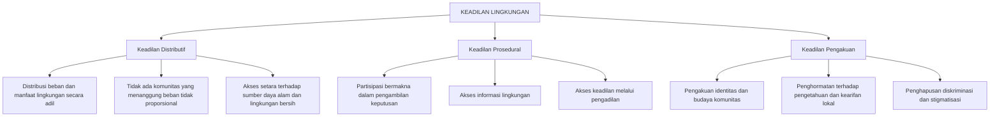
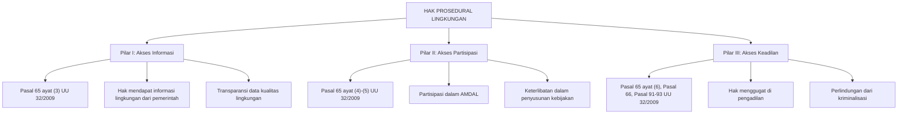
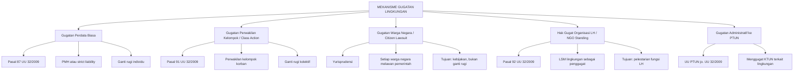

---
title: "Keadilan Lingkungan (Environmental Justice)"
description: "Kajian komprehensif tentang teori keadilan lingkungan (distributif, prosedural, pengakuan), akses terhadap keadilan, hak gugat organisasi lingkungan hidup, perlindungan anti-SLAPP, hak masyarakat adat, dan kasus-kasus landmark dalam hukum lingkungan Indonesia"
tags:
  - keadilan-lingkungan
  - environmental-justice
  - hak-lingkungan
  - advokasi
  - climate-justice
  - citizen-lawsuit
  - class-action
  - hak-gugat-organisasi
  - anti-SLAPP
  - masyarakat-adat
date: 2026-04-09
publish: true
---

# Keadilan Lingkungan (*Environmental Justice*)

**Navigasi:**
- [[05_AMDAL_Perizinan|← Sebelumnya]]
- [[README|↑ Index]]
- [[07_Tanggung_Jawab_Mutlak|Lanjut →]]

---

## Tujuan Pembelajaran

Setelah mempelajari topik ini, mahasiswa mampu:

1. Menjelaskan konsep *environmental justice* dan tiga dimensinya: keadilan distributif, prosedural, dan pengakuan (*recognition justice*)
2. Menganalisis pola ketidakadilan lingkungan di Indonesia, termasuk dimensi rasial, kelas sosial, dan gender
3. Memahami kerangka hak atas lingkungan hidup yang baik dan sehat berdasarkan UUD 1945 dan UU 32/2009
4. Mengidentifikasi dan membedakan mekanisme akses keadilan lingkungan: gugatan biasa, *class action*, *citizen lawsuit*, dan hak gugat organisasi lingkungan hidup (Pasal 92 UU 32/2009)
5. Menganalisis perlindungan anti-SLAPP berdasarkan Pasal 66 UU 32/2009 dan implementasinya
6. Menjelaskan kasus-kasus *landmark* keadilan lingkungan di Indonesia (Mandalawangi, gugatan polusi udara Jakarta 2021, Kendeng)
7. Menganalisis hak-hak lingkungan masyarakat adat dalam konteks hukum Indonesia
8. Menghubungkan keadilan lingkungan lokal dengan keadilan iklim (*climate justice*) global

---

## 1. Kerangka Teori Keadilan Lingkungan

### 1.1 Pengertian dan Asal-Usul

**Keadilan Lingkungan** (*Environmental Justice*) adalah prinsip bahwa semua orang — tanpa memandang ras, etnis, warna kulit, asal-usul kebangsaan, pendapatan, atau kelas sosial — berhak atas perlindungan yang sama terhadap bahaya lingkungan dan akses yang setara terhadap proses pengambilan keputusan yang memengaruhi lingkungan hidup mereka.

Konsep ini lahir dari pengalaman empiris bahwa beban pencemaran dan kerusakan lingkungan tidak terdistribusi secara merata dalam masyarakat, melainkan secara sistematis dan tidak proporsional ditanggung oleh kelompok-kelompok yang termarjinalisasi — masyarakat miskin, komunitas kulit berwarna, masyarakat adat, dan kelompok rentan lainnya.

### 1.2 Kelahiran Gerakan: Warren County 1982

Gerakan keadilan lingkungan secara konvensional ditelusuri pada peristiwa di **Warren County, North Carolina, Amerika Serikat, tahun 1982**. Pemerintah negara bagian North Carolina memutuskan untuk menempatkan tempat pembuangan akhir (TPA) limbah bahan berbahaya dan beracun (*polychlorinated biphenyls*/PCB) di Warren County — sebuah komunitas yang mayoritas penduduknya adalah warga Afrika-Amerika dengan tingkat kemiskinan tinggi.

Protes besar yang dilakukan oleh penduduk Warren County berhasil menarik perhatian nasional dan memicu serangkaian studi yang membuktikan pola sistematis penempatan fasilitas berbahaya di komunitas minoritas dan miskin. Studi paling berpengaruh adalah laporan **United Church of Christ Commission for Racial Justice** (1987) berjudul *Toxic Wastes and Race in the United States*, yang secara statistik membuktikan korelasi antara ras dan lokasi fasilitas pembuangan limbah B3.

### 1.3 Perkembangan Global

| Periode | Perkembangan |
|---------|--------------|
| **1960–1970-an** | Gerakan lingkungan awal (*environmentalism*) yang berfokus pada konservasi alam; belum memperhatikan dimensi keadilan sosial |
| **1982** | Protes Warren County — kelahiran gerakan keadilan lingkungan |
| **1987** | Studi *Toxic Wastes and Race* membuktikan korelasi ras dan lokasi limbah B3 |
| **1991** | *First National People of Color Environmental Leadership Summit* — merumuskan 17 Prinsip Keadilan Lingkungan |
| **1992** | Deklarasi Rio (*Earth Summit*) — Prinsip 10 mengakui hak akses informasi, partisipasi, dan keadilan dalam isu lingkungan |
| **1994** | Executive Order 12898 (AS) — mengarahkan lembaga federal untuk memperhatikan keadilan lingkungan |
| **1998** | Konvensi Aarhus — menjamin akses informasi, partisipasi publik, dan akses keadilan di bidang lingkungan |
| **2000-an** | Perluasan konsep ke **keadilan iklim** (*climate justice*) — masyarakat rentan paling terdampak perubahan iklim |
| **2010-an** | Litigasi iklim (*climate litigation*) berkembang pesat secara global |
| **2020-an** | Pengakuan hak atas lingkungan yang sehat oleh Majelis Umum PBB (Resolusi A/RES/76/300, 2022) |

### 1.4 Tiga Dimensi Keadilan Lingkungan

Mengikuti kerangka yang dikembangkan oleh **David Schlosberg** (2007), keadilan lingkungan memiliki tiga dimensi yang saling terkait:

**Keadilan Distributif** (*distributive justice*) menyangkut pembagian yang adil atas beban dan manfaat lingkungan. Pertanyaan sentralnya adalah: siapa yang menanggung beban pencemaran, kerusakan lingkungan, dan risiko bencana? Siapa yang menikmati manfaat dari eksploitasi sumber daya alam? Dalam konteks Indonesia, keadilan distributif menjadi isu krusial mengingat kekayaan sumber daya alam Indonesia sangat besar, namun manfaatnya tidak selalu dinikmati oleh masyarakat yang tinggal di sekitar wilayah eksploitasi.

**Keadilan Prosedural** (*procedural justice*) menyangkut keadilan dalam proses pengambilan keputusan. Dimensi ini menuntut agar semua pihak yang terkena dampak kebijakan lingkungan memiliki akses yang bermakna (*meaningful access*) terhadap proses pengambilan keputusan. Hal ini mencakup tiga pilar yang dikenal dari Konvensi Aarhus: akses informasi, akses partisipasi, dan akses keadilan.

**Keadilan Pengakuan** (*recognition justice*) menyangkut penghormatan terhadap identitas, budaya, dan pengetahuan lokal komunitas yang terkena dampak. Dimensi ini sangat relevan bagi masyarakat adat di Indonesia yang memiliki hubungan spiritual dan kultural dengan tanah, hutan, dan sumber daya alam di wilayah mereka. Ketidakadilan pengakuan terjadi ketika pengetahuan tradisional diabaikan dalam proses pengambilan keputusan, atau ketika identitas budaya masyarakat adat tidak dihormati dalam proyek pembangunan.

---

## 2. Ketidakadilan Lingkungan di Indonesia

### 2.1 Pola Struktural Ketidakadilan

Di Indonesia, ketidakadilan lingkungan memiliki pola struktural yang unik, berbeda dengan konteks Amerika Serikat yang lebih bertumpu pada dimensi rasial. Dalam konteks Indonesia, ketidakadilan lingkungan lebih banyak bertumpu pada dimensi **kelas sosial-ekonomi**, **hubungan pusat-daerah**, dan **relasi antara korporasi-masyarakat adat**.

| Dimensi Ketidakadilan | Manifestasi di Indonesia |
|------------------------|--------------------------|
| **Kelas sosial-ekonomi** | Masyarakat miskin perkotaan tinggal di bantaran sungai tercemar; masyarakat desa menanggung dampak industri ekstraktif; permukiman kumuh terkena dampak banjir paling parah |
| **Relasi pusat-daerah** | Sumber daya alam dieksploitasi di daerah, namun sebagian besar keuntungan ekonomi mengalir ke pusat dan korporasi; daerah menanggung kerusakan lingkungan, pusat menikmati devisa |
| **Korporasi vs masyarakat lokal** | Konsesi pertambangan dan perkebunan sawit skala besar di atas tanah masyarakat adat; ketimpangan posisi tawar dalam negosiasi |
| **Gender** | Perempuan pedesaan yang bergantung pada sumber daya alam (air, hutan, pertanian) paling terdampak kerusakan lingkungan; perempuan menanggung beban ekstra dalam mengatasi dampak pencemaran terhadap kesehatan keluarga |
| **Antargenerasi** | Eksploitasi SDA saat ini mengorbankan kepentingan generasi mendatang; perubahan iklim dan degradasi lingkungan menurunkan kualitas hidup generasi yang akan datang |

### 2.2 Kasus-Kasus Ketidakadilan Lingkungan

**Pertambangan di Wilayah Masyarakat Adat:** Di berbagai wilayah di Kalimantan, Sulawesi, Papua, dan Maluku, kegiatan pertambangan (nikel, batubara, emas) dilakukan di atas tanah ulayat masyarakat adat tanpa persetujuan yang memadai (*free, prior, and informed consent*/FPIC). Masyarakat adat kehilangan akses terhadap sumber daya alam yang menjadi sumber penghidupan mereka, sementara keuntungan ekonomi pertambangan mengalir ke korporasi dan pemerintah pusat. Dampak pencemaran — air sungai tercemar, debu, kebisingan — ditanggung oleh masyarakat lokal.

**Penempatan PLTU Batubara di Pesisir:** Pembangunan PLTU batubara di kawasan pesisir (misalnya PLTU Batang di Jawa Tengah, PLTU Celukan Bawang di Bali) menimbulkan dampak pencemaran udara dan air yang tidak proporsional terhadap masyarakat nelayan dan petani di sekitarnya. Polusi udara dari pembakaran batubara menyebabkan gangguan kesehatan pernapasan, sementara air pendingin yang dibuang ke laut mengganggu ekosistem perikanan.

**Industri Tekstil di Bantaran Sungai:** Di sepanjang Sungai Citarum, Sungai Brantas, dan sungai-sungai lain di Jawa, industri tekstil dan manufaktur membuang limbah ke sungai yang menjadi sumber air bagi jutaan penduduk. Masyarakat miskin yang tinggal di bantaran sungai dan menggunakan air sungai untuk keperluan sehari-hari menanggung dampak kesehatan paling besar.

**Dampak Kebakaran Hutan dan Lahan:** Kebakaran hutan dan lahan — yang sebagian besar dipicu oleh praktik pembukaan lahan untuk perkebunan kelapa sawit dan hutan tanaman industri — menyebabkan kabut asap yang berdampak pada jutaan orang. Masyarakat miskin di pedesaan yang tidak memiliki akses terhadap pelayanan kesehatan dan masker menanggung dampak kesehatan paling parah.

### 2.3 Dimensi Gender dalam Ketidakadilan Lingkungan

Ketidakadilan lingkungan memiliki dimensi gender yang signifikan namun sering terabaikan. Di Indonesia, perempuan pedesaan memikul beban ganda dalam konteks kerusakan lingkungan. Sebagai pengelola utama kebutuhan rumah tangga (air, pangan, bahan bakar), perempuan paling terdampak ketika sumber air tercemar, hutan ditebang, atau lahan pertanian dikonversi untuk kepentingan industri. Mereka harus menempuh jarak lebih jauh untuk mencari air bersih, menghabiskan waktu lebih banyak untuk mengolah pangan pengganti, dan menanggung beban kesehatan yang lebih berat akibat pencemaran.

Fenomena ini terlihat jelas dalam kasus Kendeng, di mana ibu-ibu petani menjadi garda terdepan perlawanan terhadap pabrik semen. Bagi mereka, ancaman terhadap sumber air bukan sekadar isu lingkungan, melainkan ancaman eksistensial terhadap kemampuan mereka menjalankan peran sebagai penopang kehidupan keluarga dan komunitas.

Dalam kerangka keadilan lingkungan, **ecofeminism** menawarkan perspektif bahwa terdapat hubungan struktural antara dominasi terhadap alam dan dominasi terhadap perempuan — keduanya berakar pada sistem patriarki dan kapitalisme yang menempatkan alam dan perempuan sebagai objek eksploitasi.

### 2.4 Ketidakadilan Lingkungan Antargenerasi

Dimensi antargenerasi (*intergenerational*) merupakan aspek keadilan lingkungan yang semakin mendapat perhatian. Eksploitasi sumber daya alam yang berlebihan, pencemaran lingkungan yang tidak terkendali, dan perubahan iklim yang diakibatkan oleh emisi gas rumah kaca masa kini akan berdampak paling berat terhadap generasi yang belum lahir — yang sama sekali tidak memiliki suara dalam proses pengambilan keputusan saat ini.

Di Indonesia, degradasi hutan gambut, konversi hutan primer menjadi perkebunan monokultur, pencemaran sungai dan laut yang bersifat permanen, serta hilangnya keanekaragaman hayati merupakan contoh-contoh ketidakadilan antargenerasi yang nyata. Generasi mendatang akan mewarisi lingkungan yang secara kualitas jauh lebih rendah dibandingkan yang diwarisi generasi sebelumnya.

Prinsip **keadilan antargenerasi** (*intergenerational equity*) — sebagaimana dinyatakan oleh Edith Brown Weiss (1989) dalam teorinya tentang *planetary trust* — menegaskan bahwa setiap generasi memiliki kewajiban sebagai *trustee* (wali amanah) terhadap generasi mendatang untuk menyerahkan planet dalam kondisi yang tidak lebih buruk dari yang diterimanya.

---

## 3. Hak Atas Lingkungan Hidup yang Baik dan Sehat

### 3.1 Dasar Konstitusional

Hak atas lingkungan hidup yang baik dan sehat memiliki kedudukan konstitusional yang kuat dalam sistem hukum Indonesia. **Pasal 28H ayat (1) UUD 1945** menyatakan:

> "Setiap orang berhak hidup sejahtera lahir dan batin, bertempat tinggal, dan mendapatkan **lingkungan hidup yang baik dan sehat** serta berhak memperoleh pelayanan kesehatan."

Ketentuan ini menempatkan hak atas lingkungan hidup yang baik dan sehat sebagai **hak konstitusional** (*constitutional right*) yang dijamin oleh konstitusi. Sifat hak ini adalah sebagai hak asasi manusia yang fundamental (*non-derogable right*), yang menimbulkan kewajiban negara untuk **menghormati** (*respect*), **melindungi** (*protect*), dan **memenuhi** (*fulfil*).

Selain Pasal 28H ayat (1), terdapat ketentuan konstitusional lain yang relevan. **Pasal 33 ayat (3) UUD 1945** menyatakan: "Bumi dan air dan kekayaan alam yang terkandung di dalamnya dikuasai oleh negara dan dipergunakan untuk sebesar-besar kemakmuran rakyat." Ketentuan ini menegaskan bahwa penguasaan negara atas sumber daya alam harus diarahkan untuk kemakmuran seluruh rakyat, bukan untuk kepentingan segelintir kelompok. **Pasal 33 ayat (4)** menambahkan bahwa perekonomian nasional diselenggarakan berdasarkan prinsip "berwawasan lingkungan."

### 3.2 Hak-Hak Lingkungan dalam UU 32/2009

**Pasal 65 UU 32/2009** menguraikan hak-hak setiap orang terkait lingkungan hidup secara komprehensif:

| Ayat | Hak | Penjelasan | Dimensi Keadilan |
|------|-----|------------|-------------------|
| **(1)** | Lingkungan hidup yang baik dan sehat | Hak substantif yang menjamin kualitas lingkungan yang layak bagi kehidupan | Keadilan distributif |
| **(2)** | Pendidikan lingkungan hidup | Hak atas pengetahuan dan kesadaran lingkungan | Keadilan pengakuan |
| **(3)** | Akses informasi | Hak untuk memperoleh informasi tentang kondisi lingkungan dan kebijakan pemerintah | Keadilan prosedural |
| **(4)** | Partisipasi dalam perlindungan dan pengelolaan LH | Hak untuk berpartisipasi dalam proses pengambilan keputusan | Keadilan prosedural |
| **(5)** | Mengajukan usul dan/atau keberatan | Hak untuk menyuarakan pandangan terhadap rencana kebijakan/kegiatan | Keadilan prosedural |
| **(6)** | Berperan dalam perlindungan dan pengelolaan LH | Hak untuk berkontribusi aktif dalam upaya perlindungan lingkungan | Keadilan prosedural |

### 3.3 Tiga Pilar Hak Prosedural Lingkungan

Mengikuti kerangka Konvensi Aarhus (1998) yang telah menjadi standar internasional, hak prosedural lingkungan terdiri atas tiga pilar yang saling melengkapi:

**Pilar I: Akses Informasi** — Masyarakat berhak memperoleh informasi yang lengkap, akurat, dan terbuka mengenai kondisi lingkungan hidup, termasuk data kualitas udara, air, dan tanah, serta informasi tentang rencana usaha/kegiatan yang berpotensi menimbulkan dampak lingkungan. Keterbukaan informasi ini merupakan prasyarat bagi partisipasi yang bermakna.

**Pilar II: Akses Partisipasi** — Masyarakat berhak untuk berpartisipasi secara bermakna (*meaningful participation*) dalam proses pengambilan keputusan yang memengaruhi lingkungan hidup mereka. Partisipasi tidak boleh bersifat semu atau formalitas belaka, melainkan harus memberikan pengaruh nyata terhadap keputusan yang diambil. Dalam konteks AMDAL, partisipasi masyarakat diatur dalam Pasal 26 UU 32/2009 (lihat [[05_AMDAL_Perizinan|AMDAL dan Perizinan Lingkungan]]).

**Pilar III: Akses Keadilan** — Masyarakat berhak memperoleh akses terhadap mekanisme penyelesaian sengketa dan penegakan hukum lingkungan, baik melalui jalur pengadilan (*judicial*) maupun di luar pengadilan (*non-judicial*). Akses keadilan mencakup hak untuk menggugat, hak atas bantuan hukum, dan perlindungan dari upaya pembungkaman (*anti-SLAPP*).

---

## 4. Akses Keadilan: Mekanisme Gugatan Lingkungan

### 4.1 Jenis-Jenis Gugatan Lingkungan

Sistem hukum Indonesia menyediakan beberapa mekanisme gugatan untuk kasus lingkungan, masing-masing dengan karakteristik, syarat, dan tujuan yang berbeda:

### 4.2 Gugatan Perdata Biasa (Pasal 87 UU 32/2009)

Setiap orang yang mengalami kerugian akibat pencemaran dan/atau perusakan lingkungan hidup berhak mengajukan gugatan ganti rugi dan/atau tindakan tertentu terhadap usaha/kegiatan yang menyebabkan pencemaran/perusakan tersebut. Gugatan dapat didasarkan pada perbuatan melawan hukum (*onrechtmatige daad*) berdasarkan Pasal 1365 KUHPerdata atau tanggung jawab mutlak (*strict liability*) berdasarkan Pasal 88 UU 32/2009 (lihat [[07_Tanggung_Jawab_Mutlak|Tanggung Jawab Mutlak]]).

### 4.3 Gugatan Perwakilan Kelompok / *Class Action* (Pasal 91)

**Pasal 91 UU 32/2009** menyatakan:

> "(1) Masyarakat berhak mengajukan gugatan perwakilan kelompok untuk kepentingan dirinya sendiri dan/atau untuk kepentingan masyarakat apabila mengalami kerugian akibat pencemaran dan/atau kerusakan lingkungan hidup."

*Class action* merupakan mekanisme yang memungkinkan satu orang atau lebih mewakili kelompok besar korban yang memiliki kesamaan fakta dan dasar hukum, sehingga tidak perlu setiap korban mengajukan gugatan secara individual. Mekanisme ini diatur lebih lanjut dalam **PERMA Nomor 1 Tahun 2002** tentang Acara Gugatan Perwakilan Kelompok.

**Syarat *class action*:** terdapat kelompok besar (*numerosity*) dengan kesamaan fakta dan dasar hukum (*commonality*), wakil kelompok memiliki kepentingan yang sama dengan anggota kelompok (*typicality*), dan wakil kelompok mampu mewakili kepentingan kelompok secara layak (*adequacy of representation*).

**Contoh penerapan:** Gugatan *class action* oleh masyarakat korban pencemaran sungai terhadap pabrik yang membuang limbah ke sungai, di mana ratusan hingga ribuan warga yang terkena dampak pencemaran diwakili oleh beberapa orang perwakilan. Contoh historis yang penting adalah gugatan *class action* dalam kasus Mandalawangi (2003), di mana Dedi dan tujuh orang lainnya mengajukan gugatan mewakili seluruh korban longsor yang disebabkan oleh kerusakan hutan di Kabupaten Garut.

**Kelebihan dan keterbatasan *class action*:** Mekanisme ini sangat efektif untuk kasus yang melibatkan korban dalam jumlah besar dengan kesamaan fakta dan hukum, karena menghindari duplikasi proses peradilan dan memungkinkan penanganan massal yang efisien. Namun, keterbatasannya mencakup: kompleksitas prosedur (terutama pada tahap sertifikasi kelas dan distribusi ganti rugi), rendahnya pemahaman masyarakat mengenai mekanisme ini, serta kesulitan dalam menentukan dan mendistribusikan ganti rugi secara adil kepada seluruh anggota kelas.

### 4.4 Gugatan Warga Negara / *Citizen Lawsuit*

*Citizen lawsuit* merupakan mekanisme gugatan yang memungkinkan setiap warga negara — tanpa perlu menunjukkan kerugian langsung — menggugat pemerintah (penyelenggara negara) yang dinilai telah lalai (*omission*) dalam memenuhi kewajibannya, termasuk kewajiban perlindungan lingkungan hidup.

Berbeda dengan *class action* yang bertujuan memperoleh ganti rugi bagi korban, *citizen lawsuit* bertujuan memaksa pemerintah mengeluarkan kebijakan (*policy making*) atau menjalankan kewajibannya. *Citizen lawsuit* tidak memiliki dasar hukum eksplisit dalam undang-undang Indonesia, tetapi telah diterima dan dikembangkan melalui **yurisprudensi** — terutama melalui putusan-putusan pengadilan yang progresif.

**Prosedur khusus *citizen lawsuit*:** Sebelum mengajukan gugatan, penggugat wajib mengirimkan **surat notifikasi** (*notification letter*) kepada tergugat (pemerintah) yang memberikan waktu bagi pemerintah untuk memenuhi kewajibannya. Apabila setelah jangka waktu tertentu pemerintah tidak merespons atau tidak mengambil tindakan, penggugat baru mengajukan gugatan ke pengadilan.

### 4.5 Hak Gugat Organisasi Lingkungan Hidup (Pasal 92 UU 32/2009)

Pasal 92 UU 32/2009 mengatur hak gugat organisasi lingkungan hidup (*NGO standing* / *ius standi*):

> "(1) Dalam rangka pelaksanaan tanggung jawab perlindungan dan pengelolaan lingkungan hidup, **organisasi lingkungan hidup berhak mengajukan gugatan** untuk kepentingan pelestarian fungsi lingkungan hidup.
>
> (2) Hak mengajukan gugatan terbatas pada tuntutan untuk melakukan **tindakan tertentu** tanpa adanya tuntutan ganti rugi, kecuali biaya atau pengeluaran riil.
>
> (3) Organisasi lingkungan hidup dapat mengajukan gugatan apabila memenuhi persyaratan:
> a. berbentuk **badan hukum**;
> b. menegaskan di dalam **anggaran dasarnya** bahwa organisasi tersebut didirikan untuk kepentingan pelestarian fungsi lingkungan hidup; dan
> c. telah melaksanakan kegiatan nyata sesuai dengan anggaran dasarnya paling singkat **2 (dua) tahun**."

**Sejarah Pengakuan Hak Gugat Organisasi LH di Indonesia:**

Pengakuan hak gugat organisasi lingkungan hidup di Indonesia memiliki sejarah panjang. Tonggak awalnya adalah **gugatan WALHI terhadap PT Inti Indorayon Utama (1988)** terkait pencemaran Danau Toba. Dalam putusan perkara ini, majelis hakim Pengadilan Negeri Jakarta Pusat untuk pertama kalinya mengakui *legal standing* organisasi lingkungan hidup untuk menggugat atas nama kepentingan pelestarian lingkungan — meskipun pada saat itu belum ada dasar hukum tertulis yang secara eksplisit memberikan hak tersebut.

Putusan bersejarah ini menjadi fondasi intelektual bagi perumusan hak gugat organisasi lingkungan hidup dalam **Pasal 38 UU 23/1997** (Undang-Undang Pengelolaan Lingkungan Hidup), yang kemudian dilanjutkan dan diperkuat dalam **Pasal 92 UU 32/2009**.

**Persyaratan *Legal Standing* Organisasi LH:**

Berdasarkan Pasal 92 ayat (3) UU 32/2009 dan **PERMA Nomor 1 Tahun 2023** tentang Pedoman Mengadili Perkara Lingkungan Hidup, organisasi lingkungan hidup harus memenuhi persyaratan kumulatif untuk memiliki *legal standing*:

1. Berbentuk **badan hukum** (yayasan atau perkumpulan yang telah disahkan sebagai badan hukum)
2. Dalam **anggaran dasarnya** secara tegas menyatakan tujuan pelestarian fungsi lingkungan hidup
3. Telah melaksanakan **kegiatan nyata** sesuai anggaran dasarnya selama minimal 2 tahun, seperti: advokasi lingkungan, seminar, penelitian, kampanye, pendampingan masyarakat, atau kegiatan nyata lainnya
4. Bersifat **representatif** — cukup mewakili kepentingan pelestarian lingkungan yang diperjuangkan

**Batasan Penting:** Berbeda dengan gugatan perdata biasa atau *class action*, hak gugat organisasi lingkungan **terbatas pada tuntutan tindakan tertentu** (*injunctive relief*) — misalnya perintah untuk menghentikan pencemaran, membersihkan lingkungan yang tercemar, atau melakukan pemulihan fungsi lingkungan. Organisasi lingkungan **tidak dapat menuntut ganti rugi** (*damages*), kecuali biaya atau pengeluaran riil yang telah dikeluarkan organisasi.

**Contoh Organisasi LH yang Memiliki *Legal Standing*:**

- **WALHI** (Wahana Lingkungan Hidup Indonesia) — sebagai *friends of the earth* Indonesia, WALHI telah puluhan kali menggunakan hak gugatnya di pengadilan
- **ICEL** (Indonesian Center for Environmental Law) — fokus pada advokasi kebijakan dan litigasi kepentingan publik
- **Greenpeace Indonesia** — organisasi internasional dengan badan hukum di Indonesia
- **KIARA** (Koalisi Rakyat untuk Keadilan Perikanan) — fokus pada hak nelayan dan pesisir

---

## 5. Perlindungan Anti-SLAPP

### 5.1 Pengertian SLAPP

**SLAPP** (*Strategic Lawsuit Against Public Participation*) adalah gugatan atau tuntutan hukum yang diajukan oleh pihak yang berkuasa (korporasi, pejabat pemerintah, atau aktor lain yang memiliki sumber daya besar) terhadap individu atau kelompok yang memperjuangkan kepentingan publik — dengan tujuan utama untuk **membungkam** (*silencing effect*), **mengintimidasi**, dan **menguras sumber daya** (waktu, biaya, energi) para pembela lingkungan.

**Karakteristik SLAPP:**

1. Diajukan oleh pihak yang secara ekonomi dan politis lebih kuat
2. Ditujukan terhadap aktivis lingkungan, jurnalis, pembela HAM, atau masyarakat yang menyuarakan kepentingan publik
3. Tujuan sebenarnya bukan untuk memenangkan perkara, melainkan untuk **menimbulkan efek jera** (*chilling effect*) — membuat pihak lain takut untuk angkat suara
4. Menggunakan jalur hukum pidana (pelaporan polisi) maupun perdata (gugatan ganti rugi) sebagai instrumen tekanan
5. Sering kali menggunakan pasal-pasal umum seperti pencemaran nama baik, penghasutan, atau perbuatan melawan hukum

### 5.2 Perlindungan Anti-SLAPP dalam UU 32/2009

**Pasal 66 UU 32/2009** merupakan ketentuan anti-SLAPP yang paling eksplisit dalam hukum Indonesia:

> "Setiap orang yang memperjuangkan hak atas lingkungan hidup yang baik dan sehat **tidak dapat dituntut secara pidana maupun digugat secara perdata**."

Ketentuan ini memberikan perlindungan ganda — baik terhadap tuntutan pidana maupun gugatan perdata — bagi setiap orang yang memperjuangkan hak atas lingkungan hidup. Perlindungan ini bersifat **imunitas prosedural** yang berlaku sejak tahap awal proses hukum.

**Penjelasan Pasal 66** memperjelas bahwa ketentuan ini dimaksudkan untuk melindungi korban dan/atau pelapor yang menempuh cara hukum akibat pencemaran dan/atau perusakan lingkungan hidup. Perlindungan ini dimaksudkan untuk mencegah tindakan pembalasan dari pihak tertentu terhadap korban dan/atau pelapor.

### 5.3 Regulasi Anti-SLAPP Lainnya

Selain Pasal 66 UU 32/2009, perlindungan anti-SLAPP juga terdapat dalam beberapa regulasi lain:

1. **Pasal 58 ayat (2) huruf e UU 18/2013** tentang Pencegahan dan Pemberantasan Perusakan Hutan — memberikan perlindungan serupa bagi pelapor perusakan hutan
2. **SK KMA Nomor 36 Tahun 2013** tentang Pemberlakuan Pedoman Penanganan Perkara Lingkungan Hidup — memberikan panduan bagi hakim dalam mengidentifikasi dan menangani SLAPP
3. **PERMA Nomor 1 Tahun 2023** tentang Pedoman Mengadili Perkara Lingkungan Hidup — mengatur lebih lanjut mekanisme anti-SLAPP dalam proses peradilan

### 5.4 Data dan Realitas Implementasi

Meskipun Indonesia memiliki kerangka hukum anti-SLAPP yang relatif progresif, implementasinya menghadapi tantangan serius. Data menunjukkan bahwa sepanjang **2014–2023, setidaknya terdapat 133 tindakan SLAPP** terhadap pembela lingkungan di Indonesia. Distribusi geografis menunjukkan Jawa sebagai wilayah dengan jumlah SLAPP terbanyak (35 kasus), diikuti Sumatera (28 kasus), Sulawesi dan Kalimantan (masing-masing 22 kasus). Dari aspek sektoral, hampir separuh kasus (53 kasus) terjadi di **sektor tambang dan energi**.

Ketua Mahkamah Agung dalam peluncuran buku *Anti-SLAPP* mengakui bahwa tindakan kriminalisasi, intimidasi, dan gugatan terhadap pejuang lingkungan hidup cenderung **meningkat dari tahun ke tahun**, meskipun regulasi anti-SLAPP telah tersedia.

**Contoh Kasus SLAPP:**

Pada tahun 2013, tiga aktivis WALHI Sumatera Selatan — Anwar Sadat (Direktur Eksekutif), Dedek Chaniago, dan Kamaludin (petani) — ditangkap saat melakukan aksi damai di depan Mapolda Sumatera Selatan memprotes pencemaran lingkungan oleh perusahaan pertambangan. Penangkapan ini merupakan contoh tipikal SLAPP yang menggunakan kekuatan aparat negara untuk membungkam suara masyarakat.

Di Maluku Utara (2024), aktivis lingkungan dan mahasiswa yang memprotes pertambangan nikel mengalami kriminalisasi — menunjukkan bahwa pola SLAPP masih terus berlangsung meskipun regulasi anti-SLAPP telah ada.

### 5.5 Tantangan dan Agenda Pembaruan

Beberapa tantangan utama dalam implementasi anti-SLAPP di Indonesia meliputi: kurangnya pemahaman aparat penegak hukum (polisi, jaksa, hakim) mengenai konsep SLAPP, ketidakkonsistenan penerapan Pasal 66 oleh pengadilan, lemahnya mekanisme deteksi dini SLAPP pada tahap penyidikan, dan tidak adanya sanksi bagi pihak yang melakukan SLAPP.

Agenda pembaruan yang diusulkan oleh para akademisi dan organisasi masyarakat sipil meliputi: penguatan pelatihan hakim mengenai pedoman anti-SLAPP, pengembangan mekanisme *early dismissal* untuk gugatan yang teridentifikasi sebagai SLAPP, pemberian sanksi terhadap pihak yang menggunakan proses hukum sebagai SLAPP, dan perlindungan yang lebih komprehensif bagi saksi dan pelapor terkait lingkungan.

---

## 6. Kasus-Kasus *Landmark* Keadilan Lingkungan di Indonesia

### 6.1 Putusan Mandalawangi (2003–2004)

**Latar Belakang:** Pada tahun 2003, longsor dahsyat terjadi di kawasan Gunung Mandalawangi, Kecamatan Kadungora, Kabupaten Garut, Jawa Barat. Longsor ini menyebabkan korban jiwa, kerusakan properti, hilangnya lahan pertanian, dan kerusakan ekosistem yang luas. Penyebab utama longsor diidentifikasi sebagai **kerusakan hutan** di kawasan hulu akibat eksploitasi oleh Perum Perhutani tanpa memperhatikan fungsi lindung kawasan.

**Putusan Pengadilan Negeri Bandung (4 September 2003):**

Dedi dan tujuh orang lainnya — para korban langsung longsor — mengajukan gugatan terhadap Presiden RI, Menteri Kehutanan, Perum Perhutani, Gubernur Jawa Barat, dan Bupati Garut. Pengadilan Negeri Bandung mengabulkan gugatan penggugat dan menyatakan para tergugat bertanggung jawab.

**Signifikansi Hukum:**

Putusan Mandalawangi merupakan **putusan pertama** di Indonesia yang menerapkan **tanggung jawab mutlak** (*strict liability*) dalam kasus lingkungan hidup. Majelis hakim juga menerapkan **prinsip kehati-hatian** (*precautionary principle*) sebagai dasar pertimbangan hukum, yaitu bahwa pemerintah dan Perum Perhutani seharusnya mengambil tindakan pencegahan terhadap risiko longsor, tanpa harus menunggu kepastian ilmiah yang penuh mengenai hubungan kausal antara kerusakan hutan dan longsor.

Putusan ini memberikan inspirasi bagi perkembangan hukum lingkungan Indonesia, khususnya dalam hal penerapan prinsip-prinsip hukum lingkungan internasional (*strict liability* dan *precautionary principle*) dalam konteks domestik (lihat [[07_Tanggung_Jawab_Mutlak|Tanggung Jawab Mutlak]]).

### 6.2 Gugatan Polusi Udara Jakarta (*Citizen Lawsuit*, 2019–2022)

**Latar Belakang:** Pada 4 Juli 2019, 32 warga negara Indonesia dari berbagai latar belakang (mahasiswa, pengusaha, karyawan, dan aktivis lingkungan) mengajukan **gugatan warga negara** (*citizen lawsuit*) terhadap tujuh pejabat penyelenggara negara terkait buruknya kualitas udara Jakarta:

1. Presiden RI
2. Menteri Lingkungan Hidup dan Kehutanan
3. Menteri Kesehatan
4. Menteri Dalam Negeri
5. Gubernur DKI Jakarta
6. Gubernur Jawa Barat
7. Gubernur Banten

Dalil utama penggugat adalah bahwa para tergugat telah **lalai** (*omission*) dalam menjalankan kewajiban konstitusional dan legal mereka untuk memastikan kualitas udara yang layak bagi kesehatan warga Jakarta, sebagaimana dijamin oleh Pasal 28H UUD 1945 dan Pasal 65 UU 32/2009.

**Putusan PN Jakarta Pusat (16 September 2021):**

Pengadilan Negeri Jakarta Pusat mengabulkan sebagian gugatan dan menyatakan bahwa **lima dari tujuh tergugat** — Presiden, Menteri LHK, Menteri Kesehatan, Menteri Dalam Negeri, dan Gubernur DKI Jakarta — telah **melawan hukum** karena tidak melaksanakan kewajiban mereka berdasarkan **Pasal 32 UU 32/2009**.

**Perintah Pengadilan (*Court Orders*):** Pengadilan memerintahkan antara lain: Menteri LHK untuk mengawasi Gubernur DKI Jakarta, Banten, dan Jawa Barat dalam melakukan inventarisasi emisi lintas provinsi; Menteri Dalam Negeri untuk mengawasi kinerja Gubernur DKI Jakarta dalam pengendalian polusi udara; Menteri Kesehatan untuk menghitung penurunan dampak kesehatan dari polusi udara yang diperlukan di DKI Jakarta sebagai dasar penyusunan strategi pengendalian; dan Gubernur DKI Jakarta untuk memperketat standar emisi dan memperkuat pemantauan kualitas udara.

**Putusan Banding PT Jakarta (17 Oktober 2022):**

Pengadilan Tinggi Jakarta menguatkan putusan PN Jakarta Pusat, memperkuat preseden bahwa *citizen lawsuit* merupakan mekanisme yang sah dan efektif untuk memaksa pemerintah menjalankan kewajibannya dalam perlindungan lingkungan.

**Signifikansi Hukum:**

Kasus ini merupakan salah satu gugatan polusi udara paling signifikan di Asia Tenggara. Signifikansinya meliputi: pengukuhan *citizen lawsuit* sebagai mekanisme akses keadilan yang efektif di Indonesia, penerapan kewajiban negara (*state obligation*) atas hak atas lingkungan yang baik dan sehat secara konkret, penetapan perintah pengadilan yang bersifat *mandatory injunction* terhadap pejabat tinggi negara (termasuk Presiden), serta pengakuan bahwa kualitas udara merupakan hak dasar yang dapat diperjuangkan melalui pengadilan.

Namun, tantangan utama pasca-putusan adalah **eksekusi**: sejauh mana pemerintah benar-benar melaksanakan perintah pengadilan. Organisasi masyarakat sipil mencatat bahwa meskipun putusan telah berkekuatan hukum tetap, kualitas udara Jakarta belum menunjukkan perbaikan signifikan, menunjukkan kesenjangan antara *judgment* dan *enforcement*.

**Perspektif komparatif:** Kasus gugatan polusi udara Jakarta memiliki kesamaan dengan kasus *Urgenda Foundation v. State of the Netherlands* (2019), di mana warga Belanda berhasil menggugat pemerintahnya atas kelalaian dalam mengurangi emisi gas rumah kaca. Kedua kasus ini menunjukkan tren global bahwa pengadilan semakin bersedia untuk memaksa pemerintah menjalankan kewajibannya dalam perlindungan lingkungan dan iklim. Perbedaan signifikan terletak pada efektivitas eksekusi: di Belanda, putusan Urgenda berhasil mendorong perubahan kebijakan nyata (pengurangan emisi yang terukur), sementara di Indonesia, implementasi pasca-putusan masih menjadi tantangan besar.

Kasus ini juga membuka pertanyaan lebih luas mengenai **justiciability** hak atas lingkungan — yaitu apakah hak atas lingkungan yang baik dan sehat dapat ditegakkan secara efektif melalui pengadilan, atau apakah penegakannya lebih bergantung pada mekanisme politik dan administratif. Pengalaman internasional menunjukkan bahwa kombinasi antara litigasi, advokasi politik, dan tekanan publik memberikan hasil yang paling efektif.

### 6.3 Kasus Kendeng: Perjuangan Masyarakat Melawan Pabrik Semen

Selain dimensi AMDAL yang telah dibahas pada [[05_AMDAL_Perizinan|Bab 5]], kasus Kendeng juga merupakan contoh paradigmatik keadilan lingkungan dari perspektif **keadilan pengakuan** (*recognition justice*).

Masyarakat petani Kendeng — yang sebagian besar adalah perempuan — memiliki hubungan kultural yang mendalam dengan Pegunungan Kendeng sebagai sumber air dan penghidupan. Perlawanan mereka bukan sekadar masalah ekonomi, melainkan juga perjuangan identitas dan cara hidup. Aksi ibu-ibu petani Kendeng yang **menyemen kaki mereka** di depan Istana Negara (2016) menjadi simbol perlawanan yang mendunia dan mengilustrasikan ketiga dimensi keadilan lingkungan: ketidakadilan distribusi (petani menanggung dampak, korporasi memperoleh keuntungan), ketidakadilan prosedural (partisipasi masyarakat yang tidak memadai dalam AMDAL), dan ketidakadilan pengakuan (pengabaian hubungan kultural masyarakat dengan tanah dan air).

---

## 7. Hak-Hak Lingkungan Masyarakat Adat

### 7.1 Pengakuan Konstitusional

**Pasal 18B ayat (2) UUD 1945** menyatakan:

> "Negara mengakui dan menghormati kesatuan-kesatuan masyarakat hukum adat beserta hak-hak tradisionalnya sepanjang masih hidup dan sesuai dengan perkembangan masyarakat dan prinsip Negara Kesatuan Republik Indonesia, yang diatur dalam undang-undang."

Ketentuan ini memberikan pengakuan konstitusional bersyarat terhadap masyarakat hukum adat dan hak-hak tradisionalnya. **Putusan MK Nomor 35/PUU-X/2012** memperjelas bahwa **hutan adat bukan hutan negara**, melainkan hutan yang berada dalam wilayah masyarakat hukum adat — putusan yang membuka jalan bagi pengakuan hak pengelolaan hutan oleh masyarakat adat.

### 7.2 Hak Lingkungan Masyarakat Adat dalam UU 32/2009

UU 32/2009 mengakui hak-hak masyarakat adat dalam konteks perlindungan lingkungan melalui beberapa ketentuan. **Pasal 63 ayat (1) huruf t** mengatur kewenangan Pemerintah untuk menetapkan kebijakan mengenai tata cara pengakuan keberadaan masyarakat hukum adat, kearifan lokal, dan hak masyarakat hukum adat yang terkait dengan perlindungan dan pengelolaan lingkungan hidup. **Pasal 70** mengatur peran masyarakat (termasuk masyarakat adat) dalam perlindungan dan pengelolaan lingkungan hidup.

### 7.3 Prinsip FPIC (*Free, Prior, and Informed Consent*)

Dalam konteks hukum lingkungan internasional, prinsip FPIC mewajibkan bahwa proyek atau kegiatan yang memengaruhi wilayah atau sumber daya masyarakat adat harus mendapatkan **persetujuan bebas** (tanpa paksaan), **diberikan sebelumnya** (sebelum kegiatan dimulai), dan **berdasarkan informasi yang memadai** (masyarakat adat memperoleh informasi yang lengkap dan dapat dipahami).

Di Indonesia, penerapan FPIC masih menghadapi banyak tantangan. Dalam praktik, proses "konsultasi" dengan masyarakat adat sering kali bersifat formalitas, dilakukan setelah keputusan sudah diambil, dan tidak memberikan ruang bagi masyarakat adat untuk menolak. Ketiadaan undang-undang khusus tentang masyarakat adat (*indigenous peoples*) semakin memperlemah posisi hukum masyarakat adat dalam negosiasi dengan korporasi dan pemerintah.

### 7.4 Konflik Lingkungan dan Masyarakat Adat

Konflik antara masyarakat adat dan proyek pembangunan merupakan salah satu manifestasi paling akut dari ketidakadilan lingkungan di Indonesia. Pola umum konflik meliputi: pemberian konsesi pertambangan atau perkebunan di atas tanah ulayat tanpa persetujuan masyarakat adat, pencabutan akses masyarakat adat terhadap hutan dan sumber daya alam yang menjadi sumber penghidupan, kriminalisasi masyarakat adat yang mempertahankan wilayahnya (masyarakat adat dituduh "menyerobot" tanah yang secara adat merupakan tanah mereka), serta pengabaian pengetahuan ekologis tradisional (*traditional ecological knowledge*) dalam proses AMDAL dan perencanaan pembangunan.

### 7.5 Putusan MK 35/2012: Tonggak Sejarah Hak Masyarakat Adat

**Putusan Mahkamah Konstitusi Nomor 35/PUU-X/2012** merupakan salah satu putusan paling penting dalam sejarah pengakuan hak masyarakat adat di Indonesia. Dalam putusan ini, MK menyatakan bahwa **Pasal 1 angka 6 UU 41/1999** tentang Kehutanan yang menyatakan "hutan adat adalah hutan negara yang berada dalam wilayah masyarakat hukum adat" bertentangan dengan UUD 1945 sepanjang tidak dimaknai "hutan adat adalah hutan yang berada dalam wilayah masyarakat hukum adat."

**Implikasi hukum putusan ini sangat luas.** Pertama, hutan adat dikeluarkan dari klasifikasi hutan negara — artinya, negara tidak lagi memiliki klaim penguasaan atas hutan adat. Kedua, masyarakat hukum adat memiliki hak untuk mengelola hutan adat sesuai dengan hukum adat mereka. Ketiga, pemerintah wajib mengakui dan menghormati keberadaan masyarakat hukum adat dan hak-haknya atas hutan.

Namun, implementasi putusan MK 35/2012 menghadapi tantangan besar. Proses penetapan wilayah hutan adat memerlukan pengakuan formal melalui Peraturan Daerah, yang prosesnya sangat lambat dan bergantung pada kemauan politik pemerintah daerah. Hingga kini, baru sebagian kecil wilayah hutan adat yang telah mendapat penetapan formal, sementara jutaan hektare hutan adat masih belum diakui secara hukum.

### 7.6 Kearifan Lokal dan Pengelolaan Lingkungan

Masyarakat adat Indonesia memiliki kekayaan **kearifan lokal** (*local wisdom*) dalam pengelolaan lingkungan yang telah terbukti berkelanjutan selama berabad-abad. Contohnya meliputi: **Sasi** di Maluku dan Papua (pelarangan mengambil sumber daya alam pada periode tertentu untuk pemulihan), **Subak** di Bali (sistem irigasi tradisional yang mengintegrasikan dimensi spiritual dan ekologis), **Tana' Ulen** di Kalimantan (hutan larangan yang dikelola masyarakat Dayak sebagai cadangan sumber daya), dan **Lubuk Larangan** di Sumatera (konservasi sungai berbasis adat).

Kearifan lokal ini merupakan bentuk konkret dari keadilan pengakuan (*recognition justice*) — pengakuan bahwa masyarakat adat memiliki pengetahuan dan sistem pengelolaan lingkungan yang valid dan efektif, yang seharusnya dihormati dan diintegrasikan dalam kebijakan lingkungan nasional. **Pasal 63 ayat (1) huruf t UU 32/2009** mengakomodasi hal ini dengan mengatur kewenangan pemerintah untuk menetapkan kebijakan mengenai tata cara pengakuan kearifan lokal yang terkait dengan perlindungan lingkungan.

---

## 8. Peran Masyarakat Sipil dalam Advokasi Lingkungan

### 8.1 Fungsi Organisasi Masyarakat Sipil

Organisasi masyarakat sipil (LSM, akademisi, media, komunitas) memainkan peran yang sangat penting dalam mewujudkan keadilan lingkungan melalui beberapa fungsi: **pengawasan sosial** (*watchdog function*) terhadap kebijakan dan praktik yang merugikan lingkungan, **advokasi kebijakan** untuk mendorong regulasi yang lebih protektif terhadap lingkungan dan hak masyarakat, **pendampingan masyarakat** yang terkena dampak pencemaran dan kerusakan lingkungan, **litigasi kepentingan publik** (*public interest litigation*) menggunakan mekanisme hak gugat organisasi (Pasal 92) dan *citizen lawsuit*, serta **edukasi dan kampanye** untuk meningkatkan kesadaran publik.

### 8.2 Contoh Peran LSM Lingkungan Indonesia

**WALHI** (Wahana Lingkungan Hidup Indonesia), sebagai *friends of the earth* Indonesia, merupakan organisasi lingkungan tertua dan terbesar di Indonesia (berdiri 1980). WALHI telah menjadi pelopor dalam penggunaan *legal standing* organisasi lingkungan di pengadilan, mulai dari gugatan terhadap PT Inti Indorayon (1988) hingga gugatan reklamasi Teluk Jakarta.

**ICEL** (Indonesian Center for Environmental Law) berfokus pada reformasi hukum dan kebijakan lingkungan melalui riset, advokasi, dan litigasi strategis. ICEL memainkan peran kunci dalam menyusun analisis kritis terhadap UU Cipta Kerja dari perspektif hukum lingkungan.

**LBH Jakarta** dan jaringan LBH di seluruh Indonesia memberikan bantuan hukum bagi masyarakat yang menjadi korban pencemaran dan kerusakan lingkungan, termasuk pendampingan dalam kasus-kasus SLAPP.

### 8.3 Gerakan Akar Rumput

Selain organisasi formal, gerakan akar rumput (*grassroots movements*) memainkan peran yang semakin penting dalam advokasi lingkungan. Gerakan ini bersifat berbasis komunitas lokal, dipimpin oleh masyarakat yang terkena dampak langsung, menggabungkan kearifan lokal dengan strategi advokasi modern, dan sering kali bersifat kreatif dan simbolik.

Contoh ikonik gerakan akar rumput meliputi perlawanan ibu-ibu petani Kendeng yang menyemen kaki di depan Istana Negara, gerakan nelayan pesisir Jakarta menolak reklamasi, perjuangan masyarakat adat Dayak di Kalimantan mempertahankan hutan adat dari perusahaan kelapa sawit, dan aksi petani di Jawa Timur melawan penambangan pasir ilegal.

---

## 9. Keadilan Iklim (*Climate Justice*)

### 9.1 Hubungan Perubahan Iklim dan Keadilan

Keadilan iklim (*climate justice*) merupakan perluasan konsep keadilan lingkungan ke konteks perubahan iklim global. Konsep ini menyoroti kenyataan bahwa perubahan iklim bukan sekadar masalah lingkungan, melainkan juga masalah **keadilan** — karena mereka yang paling sedikit berkontribusi terhadap perubahan iklim justru yang paling parah terkena dampaknya.

**Ketidakadilan iklim termanifestasi dalam beberapa dimensi.** Dalam dimensi antarnegara, negara-negara maju yang secara historis paling bertanggung jawab atas emisi gas rumah kaca bukanlah negara yang paling terdampak perubahan iklim — negara-negara berkembang dan kepulauan kecil yang menanggung dampak paling berat. Dalam dimensi antargenerasi, generasi saat ini yang memproduksi emisi bukanlah generasi yang akan menanggung dampak terparah — generasi mendatang yang akan menghadapi konsekuensi penuh dari perubahan iklim. Dalam dimensi intranasional, kelompok kaya yang jejak karbonnya lebih besar memiliki kapasitas adaptasi yang lebih tinggi, sementara kelompok miskin yang jejak karbonnya kecil justru paling rentan.

### 9.2 Prinsip-Prinsip Keadilan Iklim

| Prinsip | Penjelasan | Relevansi bagi Indonesia |
|---------|------------|--------------------------|
| **Tanggung jawab historis** (*historical responsibility*) | Negara maju yang lebih dulu mengindustrialisasi bertanggung jawab lebih besar | Indonesia sebagai negara berkembang berhak atas transfer teknologi dan pendanaan iklim |
| **CBDR-RC** (*Common But Differentiated Responsibilities and Respective Capabilities*) | Tanggung jawab bersama namun berbeda sesuai kemampuan | Indonesia berkontribusi melalui pengurangan deforestasi dan emisi dari lahan gambut |
| **Keadilan antargenerasi** (*intergenerational equity*) | Generasi sekarang wajib menjaga lingkungan untuk generasi mendatang | Kebijakan pembangunan harus mempertimbangkan keberlanjutan jangka panjang |
| **Kerugian dan kerusakan** (*loss and damage*) | Kompensasi bagi negara/komunitas yang terdampak | Indonesia mengalami kenaikan muka air laut, perubahan pola cuaca, banjir dan kekeringan yang semakin ekstrem |

### 9.3 Kelompok Rentan di Indonesia

Beberapa kelompok di Indonesia paling rentan terhadap dampak perubahan iklim. Masyarakat pesisir dan pulau kecil menghadapi ancaman kenaikan muka air laut yang mengancam kelangsungan hidup mereka. Petani dan nelayan terdampak perubahan pola cuaca yang mengganggu musim tanam dan tangkapan ikan. Masyarakat miskin perkotaan menghadapi risiko banjir, *heat wave*, dan penyakit tropis yang meningkat. Masyarakat adat terdampak perubahan ekosistem hutan dan hilangnya keanekaragaman hayati. Perempuan dan anak memiliki kerentanan yang lebih tinggi karena peran sosial dan akses terbatas terhadap sumber daya.

### 9.4 Litigasi Iklim

**Litigasi iklim** (*climate litigation*) merupakan tren global yang berkembang pesat. Di berbagai negara, warga negara dan organisasi lingkungan menggugat pemerintah dan korporasi karena gagal mengambil tindakan yang memadai untuk mengatasi perubahan iklim. Contoh-contoh signifikan secara global termasuk kasus *Urgenda Foundation v. State of the Netherlands* (2019), di mana Mahkamah Agung Belanda memerintahkan pemerintah Belanda untuk mengurangi emisi gas rumah kaca minimal 25% pada akhir 2020 dibandingkan level 1990.

Di Indonesia, potensi litigasi iklim masih terbatas namun mulai berkembang. Gugatan polusi udara Jakarta (2021) dapat dilihat sebagai *quasi-climate litigation* karena menyangkut emisi dari sumber yang juga berkontribusi pada perubahan iklim (PLTU batubara, kendaraan bermotor).

> **Materi Lengkap:** [[02_Perubahan_Iklim|Perubahan Iklim dan Hukum Lingkungan]]

### 9.5 Keadilan Iklim dalam Konteks Indonesia

Indonesia memiliki posisi unik dalam diskursus keadilan iklim. Sebagai negara kepulauan terbesar di dunia dengan lebih dari 17.000 pulau, Indonesia sangat rentan terhadap dampak perubahan iklim — kenaikan muka air laut mengancam kelangsungan pulau-pulau kecil dan wilayah pesisir, perubahan pola cuaca mengganggu sektor pertanian dan perikanan, serta peningkatan frekuensi dan intensitas bencana hidrometeorologi (banjir, longsor, kekeringan) membahayakan jutaan penduduk.

Di sisi lain, Indonesia juga merupakan salah satu penghasil emisi gas rumah kaca terbesar di dunia — terutama dari sektor kehutanan dan penggunaan lahan (deforestasi, degradasi gambut, kebakaran hutan). Posisi ganda ini — sebagai korban sekaligus kontributor — menciptakan dinamika kompleks dalam diplomasi iklim Indonesia.

Dari perspektif keadilan iklim domestik, pertanyaan penting yang muncul adalah: **siapa di dalam Indonesia yang paling terdampak dan siapa yang paling bertanggung jawab?** Nelayan di pulau-pulau kecil terdepan yang mata pencahariannya terancam kenaikan muka air laut bukanlah pihak yang bertanggung jawab atas deforestasi di Kalimantan atau Sumatera. Petani subsisten yang lahannya terdampak perubahan pola cuaca bukanlah pihak yang memutuskan konversi hutan gambut menjadi perkebunan. Terdapat ketidakadilan distribusi beban dan tanggung jawab yang nyata di dalam negeri sendiri.

**Komitmen Indonesia** dalam Paris Agreement untuk mengurangi emisi gas rumah kaca sebesar 31,89% (unconditional) hingga 43,2% (conditional) pada tahun 2030 dibandingkan *business as usual* (melalui Enhanced Nationally Determined Contribution/E-NDC) juga memiliki dimensi keadilan iklim — terutama dalam hal bagaimana beban transisi energi dari bahan bakar fosil ke energi terbarukan didistribusikan secara adil, termasuk dampaknya terhadap pekerja dan komunitas yang bergantung pada industri batu bara (*just transition*).

---

## 10. Penyelesaian Sengketa Lingkungan di Luar Pengadilan

### 10.1 Dasar Hukum

Selain jalur pengadilan (*litigasi*), UU 32/2009 juga menyediakan mekanisme penyelesaian sengketa lingkungan di luar pengadilan (*non-litigasi*). **Pasal 84 UU 32/2009** menyatakan bahwa penyelesaian sengketa lingkungan hidup dapat ditempuh melalui pengadilan atau di luar pengadilan berdasarkan pilihan sukarela para pihak yang bersengketa. Pilihan non-litigasi tidak menghilangkan hak untuk menempuh jalur pidana — artinya, proses non-litigasi hanya berlaku untuk aspek perdata, sedangkan tuntutan pidana tetap dapat diajukan.

### 10.2 Bentuk Penyelesaian Non-Litigasi

**Pasal 85 UU 32/2009** mengatur bahwa penyelesaian sengketa lingkungan di luar pengadilan dilakukan untuk mencapai kesepakatan mengenai bentuk dan besarnya ganti rugi, tindakan pemulihan akibat pencemaran/perusakan, tindakan tertentu untuk menjamin tidak terulangnya pencemaran/perusakan, dan/atau tindakan untuk mencegah timbulnya dampak negatif.

Mekanisme non-litigasi mencakup: **mediasi** (bantuan pihak ketiga netral untuk memfasilitasi negosiasi), **arbitrase** (pihak ketiga memberikan putusan yang mengikat), dan **bentuk lainnya** yang disepakati para pihak. Pemerintah dan pemerintah daerah dapat memfasilitasi penyelesaian sengketa sebagai pihak ketiga netral, dan dapat pula membentuk **lembaga penyedia jasa penyelesaian sengketa lingkungan hidup** yang bersifat bebas dan tidak berpihak.

### 10.3 Kelebihan dan Keterbatasan Non-Litigasi

Penyelesaian non-litigasi memiliki kelebihan berupa: proses yang lebih cepat dan murah, kerahasiaan (*confidentiality*), fleksibilitas solusi (tidak terbatas pada ganti rugi uang), dan potensi untuk memulihkan hubungan antarpihak. Namun, keterbatasannya mencakup: ketimpangan posisi tawar antara korporasi dan masyarakat yang dapat menghasilkan kesepakatan yang tidak adil, hasil negosiasi yang mungkin tidak dapat dipaksakan seperti putusan pengadilan, serta tidak adanya efek jera (*deterrent*) bagi pelanggar.

Dalam konteks keadilan lingkungan, mekanisme non-litigasi harus diterapkan dengan hati-hati untuk memastikan bahwa masyarakat yang terkena dampak tidak dirugikan oleh ketimpangan kekuasaan dalam proses negosiasi.

---

## 11. Tantangan dan Prospek Keadilan Lingkungan di Indonesia

### 10.1 Tantangan Sistemik

| Tantangan | Penjelasan |
|-----------|------------|
| **Kesenjangan hukum dan implementasi** | Kerangka hukum relatif progresif (UU 32/2009, hak konstitusional), namun implementasinya lemah |
| **Korupsi dalam perizinan** | Izin lingkungan diterbitkan tidak sesuai prosedur, AMDAL "dipesan", konflik kepentingan penilai |
| **Ketimpangan posisi tawar** | Korporasi memiliki sumber daya hukum dan politik yang jauh lebih besar dibandingkan masyarakat terkena dampak |
| **Biaya litigasi** | Biaya hukum yang tinggi membatasi akses keadilan bagi masyarakat miskin |
| **Rendahnya kesadaran hukum** | Masyarakat belum sepenuhnya menyadari hak-hak lingkungan yang dimilikinya |
| **Eksekusi putusan** | Putusan pengadilan yang memenangkan masyarakat sering kali sulit dieksekusi |
| **Kriminalisasi pembela lingkungan** | Meskipun ada Pasal 66, aktivis lingkungan masih menghadapi SLAPP |

### 10.2 Prospek dan Agenda Pembaruan

Beberapa langkah pembaruan yang dapat memperkuat keadilan lingkungan di Indonesia meliputi:

1. **Penguatan bantuan hukum lingkungan** — perluasan akses *pro bono* dan *legal aid* untuk kasus-kasus lingkungan
2. **Peningkatan kapasitas hakim** — pelatihan berkelanjutan mengenai hukum lingkungan, termasuk penerapan prinsip *precautionary*, *strict liability*, dan anti-SLAPP
3. **Pengesahan RUU Masyarakat Adat** — undang-undang khusus yang mengakui dan melindungi hak-hak masyarakat adat secara komprehensif
4. **Penguatan mekanisme FPIC** — memastikan persetujuan masyarakat adat yang bebas, didahulukan, dan berdasarkan informasi yang memadai
5. **Transparansi data lingkungan** — pembukaan akses publik terhadap data kualitas lingkungan secara *real-time*
6. **Penguatan partisipasi dalam AMDAL** — memulihkan partisipasi masyarakat yang bermakna dalam proses penilaian AMDAL pasca UU Cipta Kerja
7. **Pengembangan litigasi iklim** — membangun kapasitas advokasi dan litigasi iklim di Indonesia

---

## 12. Keadilan Lingkungan dalam Perspektif Komparatif

### 12.1 Perbedaan Konteks Indonesia dan Global

Keadilan lingkungan di Indonesia memiliki konteks yang berbeda dari asal-muasalnya di Amerika Serikat. Sementara gerakan *environmental justice* di AS bertumpu pada dimensi **rasial** — diskriminasi terhadap komunitas Afrika-Amerika dan Latin dalam penempatan fasilitas berbahaya — di Indonesia, dimensi yang paling menonjol adalah **kelas sosial-ekonomi**, **relasi korporasi-masyarakat adat**, dan **ketimpangan pusat-daerah**.

Di banyak negara berkembang, termasuk Indonesia, ketidakadilan lingkungan terkait erat dengan **model pembangunan ekstraktif** yang menempatkan sumber daya alam sebagai komoditas untuk diekspor, dengan keuntungan yang terkonsentrasi pada segelintir elit ekonomi dan beban lingkungan yang ditanggung oleh masyarakat lokal. Pola ini berbeda dari negara maju yang ketidakadilan lingkungannya lebih terkait dengan penempatan fasilitas industri dan pembuangan limbah.

### 12.2 Pengakuan Internasional atas Hak Lingkungan

Resolusi Majelis Umum PBB **A/RES/76/300** (Juli 2022) yang mengakui **hak atas lingkungan yang bersih, sehat, dan berkelanjutan** sebagai hak asasi manusia universal merupakan tonggak sejarah dalam perkembangan hukum lingkungan internasional. Meskipun resolusi Majelis Umum tidak bersifat mengikat secara hukum (*non-binding*), resolusi ini memiliki kekuatan moral dan politik yang besar, serta dapat memperkuat interpretasi hak konstitusional atas lingkungan di tingkat nasional — termasuk Pasal 28H ayat (1) UUD 1945 di Indonesia.

Pengakuan ini juga memperkuat argumen dalam litigasi lingkungan bahwa hak atas lingkungan yang sehat bukan sekadar aspek kebijakan (*policy*), melainkan hak fundamental yang menimbulkan kewajiban hukum bagi negara (*legal obligation*). Perkembangan ini berpotensi memperkuat posisi hukum masyarakat yang memperjuangkan keadilan lingkungan di pengadilan Indonesia.

### 12.3 Perkembangan Hak Alam (*Rights of Nature*)

Dalam beberapa tahun terakhir, muncul gerakan hukum yang memberikan hak hukum kepada alam itu sendiri (*rights of nature*). Konstitusi Ekuador (2008) merupakan yang pertama mengakui hak-hak Pachamama (Bumi), dan Mahkamah Konstitusi Kolombia (2016) memberikan status subjek hukum kepada Sungai Atrato. Sungai Whanganui di Selandia Baru diberikan status badan hukum (*legal personhood*) pada 2017, dan Mahkamah Konstitusi India memberikan status serupa kepada Sungai Gangga dan Yamuna.

Di Indonesia, konsep *rights of nature* belum diadopsi secara formal, meskipun prinsip **in dubio pro natura** (dalam keraguan, hakim harus memutuskan demi perlindungan alam) telah mulai diterapkan oleh beberapa hakim lingkungan. SK KMA 36/2013 menyebutkan prinsip ini sebagai salah satu pedoman dalam mengadili perkara lingkungan. Perkembangan ini menunjukkan potensi untuk memperluas kerangka keadilan lingkungan di Indonesia dari antroposentris (berpusat pada manusia) menuju ekosentris (berpusat pada ekosistem secara keseluruhan).

---

## Pertanyaan Diskusi

1. Mengapa beban lingkungan cenderung lebih banyak dipikul oleh kelompok marjinal? Analisis dari perspektif struktural (kekuasaan, ekonomi, politik) dan bagaimana hal ini berlaku dalam konteks Indonesia.

2. Bandingkan efektivitas tiga mekanisme gugatan lingkungan (*class action*, *citizen lawsuit*, hak gugat organisasi LH) dalam mewujudkan keadilan lingkungan di Indonesia. Kapan masing-masing mekanisme paling tepat digunakan?

3. Analisis putusan gugatan polusi udara Jakarta 2021: apakah *citizen lawsuit* merupakan mekanisme yang efektif untuk memaksa pemerintah menjalankan kewajibannya? Apa tantangan utama dalam eksekusi putusan?

4. Bagaimana Pasal 66 UU 32/2009 (anti-SLAPP) seharusnya diterapkan untuk memberikan perlindungan efektif bagi pembela lingkungan? Mengapa masih terjadi 133 kasus SLAPP selama 2014–2023 meskipun ketentuan ini sudah berlaku?

5. Apa hubungan antara keadilan lingkungan lokal (misalnya pencemaran sungai di Jawa) dengan keadilan iklim global? Bagaimana Indonesia dapat memperjuangkan keduanya secara simultan?

6. Diskusikan dilema antara pembangunan ekonomi dan keadilan lingkungan bagi masyarakat adat. Apakah mungkin mencapai keduanya? Dengan merujuk pada prinsip FPIC, bagaimana seharusnya proses pengambilan keputusan dilakukan?

7. Apakah Resolusi Majelis Umum PBB tentang Hak atas Lingkungan yang Sehat (2022) memiliki implikasi praktis bagi penguatan keadilan lingkungan di Indonesia?

---

## Dasar Hukum

> [!info] Cross-Vault Links
> Dokumen lengkap tersedia di vault `regulationvault`. Lihat [[_referensi/REGULATIONVAULT_LINKS|Daftar Lengkap Cross-Vault Links]]

### Konstitusi

**UUD 1945:**

- **Pasal 28H ayat (1):** Hak atas lingkungan hidup yang baik dan sehat
- **Pasal 33 ayat (3):** Bumi, air, dan kekayaan alam dikuasai negara untuk sebesar-besar kemakmuran rakyat
- **Pasal 33 ayat (4):** Perekonomian diselenggarakan berwawasan lingkungan
- **Pasal 18B ayat (2):** Pengakuan dan penghormatan kesatuan masyarakat hukum adat

### UU Nomor 32 Tahun 2009 tentang PPLH

**BAB X: Hak, Kewajiban, dan Larangan (Pasal 65–69):**

- **Pasal 65** — Hak setiap orang atas lingkungan hidup yang baik dan sehat, pendidikan lingkungan, akses informasi, partisipasi, mengajukan usul/keberatan, berperan dalam perlindungan LH
- **Pasal 66** — Anti-SLAPP: perlindungan dari tuntutan pidana dan gugatan perdata bagi pembela lingkungan

**BAB XI: Peran Masyarakat (Pasal 70):**

- Pengawasan sosial, pemberian saran, pendapat, usul, keberatan, pengaduan, penyampaian informasi

**BAB XIII: Penyelesaian Sengketa Lingkungan Hidup (Pasal 84–93):**

- **Pasal 87** — Gugatan ganti rugi dan tindakan tertentu
- **Pasal 88** — Tanggung jawab mutlak (*strict liability*)
- **Pasal 91** — Hak gugat masyarakat (*class action*)
- **Pasal 92** — Hak gugat organisasi lingkungan hidup (*NGO standing*)
- **Pasal 93** — Gugatan administratif terhadap KTUN lingkungan

Path: `regulationvault/05_ACTIVE/UU/2009/UU_32_2009/`

### Peraturan Mahkamah Agung

- **PERMA Nomor 1 Tahun 2002** tentang Acara Gugatan Perwakilan Kelompok (*Class Action*)
- **SK KMA Nomor 36 Tahun 2013** tentang Pedoman Penanganan Perkara Lingkungan Hidup (termasuk panduan anti-SLAPP)
- **PERMA Nomor 1 Tahun 2023** tentang Pedoman Mengadili Perkara Lingkungan Hidup

### Peraturan Perundang-Undangan Lainnya

- **UU 39/1999** tentang Hak Asasi Manusia
- **UU 18/2013** tentang Pencegahan dan Pemberantasan Perusakan Hutan (Pasal 58 ayat (2) huruf e — anti-SLAPP)
- **UU 6/2023** tentang Penetapan Perppu 2/2022 tentang Cipta Kerja menjadi Undang-Undang

### Putusan Penting

- **Putusan MK Nomor 35/PUU-X/2012** — Hutan adat bukan hutan negara
- **Putusan PN Bandung (4 September 2003)** — Kasus Mandalawangi; *strict liability* dan *precautionary principle*
- **Putusan MA No. 99 PK/TUN/2016** — Kasus Kendeng; perlindungan CAT
- **Putusan PN Jakarta Pusat (16 September 2021)** — Gugatan polusi udara Jakarta; *citizen lawsuit*
- **Putusan PT Jakarta (17 Oktober 2022)** — Banding polusi udara Jakarta; menguatkan putusan PN

### Instrumen Internasional

- **Konvensi Aarhus (1998)** — Akses informasi, partisipasi publik, dan akses keadilan dalam bidang lingkungan
- **Resolusi MU PBB A/RES/76/300 (2022)** — Pengakuan hak atas lingkungan yang bersih, sehat, dan berkelanjutan

### Referensi Regulasi Lengkap
- [[_referensi/REGULATION_INDEX|Indeks Regulasi Lingkungan]]

---

## Daftar Pustaka

- Bullard, Robert D. (2000). *Dumping in Dixie: Race, Class, and Environmental Quality*. 3rd ed. Westview Press.
- Herlambang, Purnama, dkk. (2022). *Mengenal Strategic Lawsuit Against Public Participation (SLAPP) dan Karakteristiknya*. Indonesian Center for Environmental Law (ICEL).
- Keraf, A. Sonny. (2010). *Etika Lingkungan Hidup*. Penerbit Buku Kompas.
- Nickel, James W. (1993). "The Human Right to a Safe Environment: Philosophical Perspectives on Its Scope and Justification." *Yale Journal of International Law*, 18(1).
- Rahmadi, Takdir. (2020). *Hukum Lingkungan di Indonesia*. Rajawali Pers.
- Santosa, Mas Achmad. (2016). *Alam Pun Butuh Hukum dan Keadilan*. AS@Publishing.
- Schlosberg, David. (2007). *Defining Environmental Justice: Theories, Movements, and Nature*. Oxford University Press.
- Silalahi, Daud & Kristianto, P.H. (2015). *Hukum Lingkungan dalam Sistem Penegakan Hukum Lingkungan Indonesia*. Keni Media.
- Walker, Gordon. (2012). *Environmental Justice: Concepts, Evidence and Politics*. Routledge.
- Wibisana, Andri G. (2017). "Keadilan dalam Satu (atau Dua) Atap: Ide-Ide Keadilan Ekologis dalam UU No. 32 Tahun 2009." *Jurnal Hukum & Pembangunan*, 47(1).

---

**Navigasi:**
- [[05_AMDAL_Perizinan|← AMDAL dan Perizinan]]
- [[README|↑ Index]]
- [[07_Tanggung_Jawab_Mutlak|Tanggung Jawab Mutlak →]]

