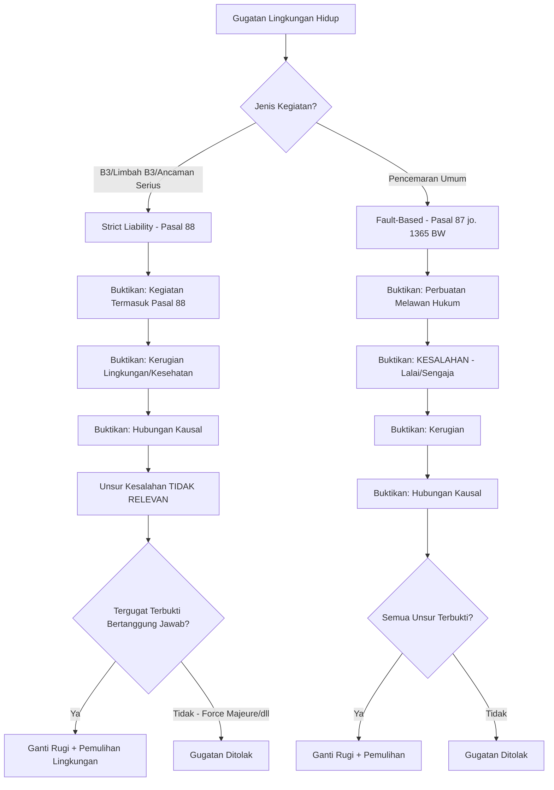
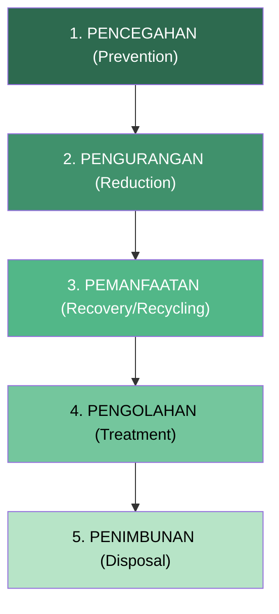
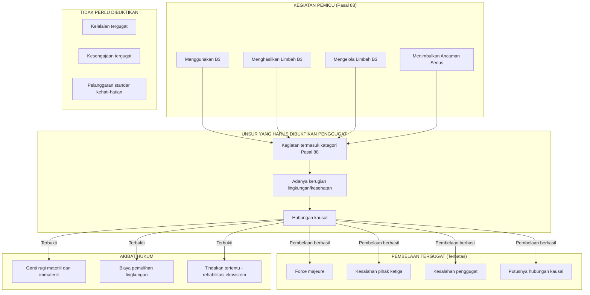

# Tanggung Jawab Mutlak (*Strict Liability*)

**Navigasi:**
- [[06_Keadilan_Lingkungan|← Keadilan Lingkungan]]
- [[README|↑ Index]]
- [[08_Penegakan_Hukum|Penegakan Hukum →]]

---

## Tujuan Pembelajaran

Setelah mempelajari bab ini, mahasiswa diharapkan mampu:

1. Menjelaskan sejarah dan perkembangan doktrin *strict liability* dari tradisi *common law* hingga penerapannya dalam sistem hukum Indonesia.
2. Membedakan secara sistematis antara tanggung jawab mutlak (*strict liability*) dan tanggung jawab berdasarkan kesalahan (*liability based on fault*), termasuk implikasi masing-masing terhadap beban pembuktian.
3. Menganalisis unsur-unsur Pasal 88 UU 32/2009 tentang Perlindungan dan Pengelolaan Lingkungan Hidup (PPLH) dan penerapannya terhadap kegiatan yang menggunakan, menghasilkan, atau mengelola B3 dan limbah B3.
4. Mengevaluasi pembelaan (*defenses*) yang tersedia bagi tergugat dalam gugatan *strict liability* serta batas-batasnya.
5. Memahami mekanisme perhitungan ganti rugi dan kewajiban asuransi atau dana jaminan pemulihan lingkungan.
6. Menganalisis yurisprudensi Mahkamah Agung yang menerapkan doktrin tanggung jawab mutlak dalam perkara lingkungan hidup.
7. Membandingkan doktrin *strict liability* di Indonesia dengan praktik di yurisdiksi *common law*, khususnya doktrin *Rylands v Fletcher*.
8. Menjelaskan hubungan antara tanggung jawab mutlak dengan prinsip pencemar membayar (*polluter pays principle*).

---

## 1. Landasan Filosofis dan Sejarah Doktrin *Strict Liability*

### 1.1 Pengertian Tanggung Jawab Mutlak

Tanggung jawab mutlak (*strict liability*) adalah suatu bentuk pertanggungjawaban hukum yang dibebankan kepada pelaku kegiatan tertentu tanpa memerlukan pembuktian unsur kesalahan — baik berupa kelalaian (*negligence*) maupun kesengajaan (*intention*). Dalam rezim ini, cukup dibuktikan adanya hubungan kausal (*causal link*) antara kegiatan tergugat dan kerugian yang diderita penggugat. Doktrin ini berangkat dari pemikiran bahwa pihak yang memperoleh keuntungan ekonomi dari kegiatan berbahaya sudah sepatutnya memikul risiko kerugian yang ditimbulkan kegiatan tersebut terhadap pihak lain.

Konsep ini berbeda secara mendasar dari pertanggungjawaban berdasarkan kesalahan (*fault-based liability*) yang mensyaratkan pembuktian bahwa tergugat tidak memenuhi standar kehati-hatian yang wajar (*reasonable standard of care*). Dalam tanggung jawab mutlak, pertanyaan utamanya bukan "apakah tergugat bersalah?", melainkan "apakah kegiatan tergugat menyebabkan kerugian?".

Secara dogmatis, tanggung jawab mutlak berpijak pada beberapa landasan filosofis:

Pertama, **teori risiko** (*risk theory*): pihak yang menjalankan kegiatan berbahaya menciptakan risiko bagi orang lain, sehingga sudah selayaknya memikul tanggung jawab atas risiko tersebut, terlepas dari ada atau tidaknya kesalahan. Kedua, **teori keuntungan** (*benefit theory*): pihak yang memperoleh manfaat ekonomi dari kegiatan berbahaya harus menanggung kerugian yang timbul sebagai konsekuensi logis dari keuntungan yang diperolehnya. Ketiga, **prinsip keadilan distributif**: beban kerugian lingkungan tidak boleh diletakkan pada korban yang tidak memiliki daya tawar (*bargaining position*) untuk mencegah terjadinya kerugian.

### 1.2 Asal-Usul dalam Tradisi *Common Law*: Kasus *Rylands v Fletcher* (1868)

Doktrin *strict liability* dalam konteks modern berawal dari putusan *House of Lords* dalam perkara *Rylands v Fletcher* [1868] UKHL 1. Perkara ini menjadi salah satu preseden paling berpengaruh dalam sejarah hukum pertanggungjawaban perdata.

**Fakta Perkara:**

Thomas Fletcher, seorang pemilik pabrik, membangun sebuah reservoir (waduk) di atas tanahnya untuk menampung air guna keperluan penggilingan. Tanpa diketahui Fletcher, di bawah tanahnya terdapat lorong-lorong bekas pertambangan yang terhubung dengan tambang batu bara milik John Rylands di tanah yang bersebelahan. Ketika reservoir diisi air, air merembes melalui lorong-lorong bawah tanah tersebut dan membanjiri tambang Rylands, menyebabkan kerugian material yang besar.

**Pertimbangan Hukum:**

Hakim Blackburn di tingkat *Court of Exchequer Chamber* merumuskan prinsip yang kemudian menjadi rujukan universal:

> *"The person who for his own purposes brings on his lands and collects and keeps there anything likely to do mischief if it escapes, must keep it in at his peril, and, if he does not do so, is prima facie answerable for all the damage which is the natural consequence of its escape."*

*House of Lords*, melalui Lord Cairns, memperkuat putusan tersebut dengan menambahkan unsur *non-natural use of land* — yakni penggunaan tanah yang bukan merupakan pemanfaatan alamiah atau biasa. Dengan demikian, tanggung jawab mutlak berlaku apabila seseorang menggunakan tanahnya secara tidak lazim (*non-natural use*) dan membawa atau menghimpun sesuatu di atasnya yang berpotensi menimbulkan bahaya apabila lepas atau lolos dari penguasaannya.

**Elemen Doktrin *Rylands v Fletcher*:**

Dari putusan ini dapat diturunkan empat elemen pokok: (1) tergugat membawa atau menghimpun sesuatu di tanahnya, (2) hal tersebut berpotensi menimbulkan kerusakan apabila lepas (*escape*), (3) penggunaan tanah bersifat tidak lazim (*non-natural use*), dan (4) terjadi kerusakan sebagai akibat alamiah (*natural consequence*) dari lepasnya benda tersebut.

### 1.3 Perkembangan di Amerika Serikat: *Restatement of Torts*

Di Amerika Serikat, doktrin *strict liability* berkembang lebih lanjut melalui *Restatement (Second) of Torts* § 519-520 (1977). *Restatement* ini memperkenalkan konsep *abnormally dangerous activities* sebagai dasar penerapan tanggung jawab mutlak, dengan mempertimbangkan enam faktor: (a) tinggi rendahnya risiko bahaya, (b) kemungkinan bahaya menimbulkan kerugian besar, (c) ketidakmampuan menghilangkan risiko meskipun sudah menerapkan kehati-hatian yang wajar, (d) sejauh mana kegiatan tersebut bukan kegiatan lazim (*common usage*), (e) ketidaksesuaian kegiatan dengan lokasi pelaksanaannya, dan (f) sejauh mana nilai kegiatan bagi masyarakat lebih kecil daripada risiko yang ditimbulkan.

Pendekatan *Restatement* ini memberikan fleksibilitas lebih besar kepada pengadilan untuk menilai secara kasuistis apakah suatu kegiatan tergolong *abnormally dangerous* sehingga layak dikenakan tanggung jawab mutlak.

Penting untuk dibedakan antara *strict liability* dan *absolute liability*. Dalam *strict liability*, masih dimungkinkan beberapa pembelaan terbatas (seperti *force majeure* atau kesalahan pihak ketiga). Dalam *absolute liability*, tanggung jawab bersifat mutlak tanpa pengecualian apa pun — yakni tidak ada pembelaan yang dapat membebaskan tergugat. Sistem hukum Indonesia mengadopsi *strict liability* (bukan *absolute liability*) karena masih mengakui beberapa pembelaan terbatas, sebagaimana akan dibahas pada bagian selanjutnya.

### 1.4 Doktrin *Ultrahazardous Activities* dan Perkembangannya

Sebelum terminologi *abnormally dangerous activities* digunakan dalam *Restatement (Second)*, doktrin ini dikenal sebagai *ultrahazardous activities* dalam *Restatement (First) of Torts* § 520 (1938). Konsep ini merujuk pada kegiatan yang: (a) secara intrinsik melibatkan risiko bahaya serius terhadap orang, tanah, atau harta benda orang lain, (b) tidak dapat dilakukan dengan aman meskipun telah menerapkan segala upaya kehati-hatian yang wajar, dan (c) bukan merupakan kegiatan yang lazim dilakukan (*not a matter of common usage*).

Contoh klasik kegiatan yang termasuk *ultrahazardous* meliputi: pengeboran dan produksi minyak dan gas bumi, penggunaan bahan peledak, penyimpanan bahan kimia berbahaya dalam jumlah besar, pengoperasian instalasi nuklir, serta fumigasi dengan menggunakan gas beracun. Klasifikasi ini memiliki relevansi langsung dengan ketentuan Pasal 88 UU 32/2009 yang menerapkan tanggung jawab mutlak untuk kegiatan yang menggunakan atau menghasilkan B3.

### 1.5 Perkembangan Hukum Internasional

Dalam hukum internasional, doktrin tanggung jawab mutlak diadopsi dalam berbagai instrumen, antara lain: Konvensi Paris 1960 tentang Tanggung Jawab Pihak Ketiga di Bidang Energi Nuklir, Konvensi Wina 1963 tentang Tanggung Jawab Sipil atas Kerusakan Nuklir, Konvensi Tanggung Jawab Sipil Internasional untuk Kerusakan Akibat Pencemaran Minyak (*Civil Liability Convention*) 1969, serta Protokol Basel 1999 tentang Tanggung Jawab dan Kompensasi atas Kerusakan Akibat Perpindahan Lintas Batas Limbah Berbahaya. Instrumen-instrumen ini menunjukkan bahwa komunitas internasional mengakui kebutuhan penerapan tanggung jawab mutlak untuk kegiatan yang membawa risiko tinggi bagi lingkungan dan kesehatan manusia.

---

## 2. Dasar Hukum Tanggung Jawab Mutlak di Indonesia

### 2.1 Pasal 88 UU 32/2009 tentang PPLH

Ketentuan utama mengenai tanggung jawab mutlak dalam hukum lingkungan Indonesia terdapat pada Pasal 88 UU Nomor 32 Tahun 2009 tentang Perlindungan dan Pengelolaan Lingkungan Hidup:

> "Setiap orang yang tindakannya, usahanya, dan/atau kegiatannya menggunakan B3, menghasilkan dan/atau mengelola limbah B3, dan/atau yang menimbulkan **ancaman serius** terhadap lingkungan hidup bertanggung jawab **mutlak** atas kerugian yang terjadi tanpa perlu pembuktian unsur kesalahan."

Penjelasan Pasal 88 menambahkan klarifikasi penting:

> "Yang dimaksud dengan 'bertanggung jawab mutlak' atau *strict liability* adalah unsur kesalahan tidak perlu dibuktikan oleh pihak penggugat sebagai dasar pembayaran ganti rugi. Ketentuan ayat ini merupakan *lex specialis* dalam gugatan tentang perbuatan melanggar hukum pada umumnya. Besarnya nilai ganti rugi yang dapat dibebankan terhadap pencemar atau perusak lingkungan hidup menurut Pasal ini dapat ditetapkan sampai batas tertentu."

Frasa "dapat ditetapkan sampai batas tertentu" (*ceiling of liability*) menunjukkan bahwa pembuat undang-undang mengakui kemungkinan penetapan plafon ganti rugi dalam penerapan tanggung jawab mutlak. Ini berbeda dari tanggung jawab berdasarkan kesalahan yang pada prinsipnya tidak mengenal pembatasan jumlah ganti rugi.

### 2.2 Unsur-Unsur Pasal 88

Dari rumusan Pasal 88, dapat diidentifikasi unsur-unsur berikut:

| Unsur | Penjelasan | Contoh Konkret |
|-------|------------|----------------|
| **Subjek hukum** | "Setiap orang" — mencakup orang perseorangan dan badan usaha (Pasal 1 angka 32) | Korporasi pertambangan, perusahaan kimia, pengelola pabrik |
| **Menggunakan B3** | Kegiatan usaha yang melibatkan penggunaan bahan berbahaya dan beracun | Pabrik pestisida, industri petrokimia, pengguna bahan kimia industri |
| **Menghasilkan limbah B3** | Proses produksi yang menghasilkan residu berbahaya | Smelter, kilang minyak, industri tekstil dengan pewarnaan kimia |
| **Mengelola limbah B3** | Pengumpulan, pengangkutan, pemanfaatan, pengolahan, dan penimbunan limbah B3 | Perusahaan pengolah limbah, transporter limbah B3 |
| **Ancaman serius** | Dampak luas, persisten, dan/atau sulit dipulihkan terhadap lingkungan hidup | Tumpahan minyak besar, kebocoran reaktor, pencemaran air tanah oleh logam berat |
| **Tanpa pembuktian kesalahan** | Penggugat dibebaskan dari kewajiban membuktikan kelalaian atau kesengajaan tergugat | Cukup buktikan kegiatan + kerugian + hubungan kausal |

### 2.3 Perubahan Melalui UU 6/2023 (*Omnibus Law* Cipta Kerja)

UU Nomor 6 Tahun 2023 tentang Penetapan Perppu 2/2022 tentang Cipta Kerja menjadi Undang-Undang mengubah beberapa ketentuan dalam UU 32/2009, termasuk memengaruhi konteks penerapan tanggung jawab mutlak. Perubahan signifikan terletak pada sistem perizinan yang semula berbasis izin lingkungan (*environmental permit*) kini bergeser ke persetujuan lingkungan (*environmental approval*) yang terintegrasi dalam Perizinan Berusaha melalui sistem *Online Single Submission* (OSS). Meskipun demikian, ketentuan Pasal 88 tentang tanggung jawab mutlak tidak mengalami perubahan substansial — prinsip tanggung jawab mutlak tetap berlaku untuk kegiatan yang berkaitan dengan B3, limbah B3, dan ancaman serius terhadap lingkungan.

### 2.4 Hubungan dengan Pasal 87 dan 89 UU 32/2009

Pasal 88 tidak berdiri sendiri, melainkan merupakan bagian dari rangkaian ketentuan ganti rugi lingkungan:

**Pasal 87 ayat (1)** mengatur tanggung jawab berdasarkan kesalahan (*fault-based liability*):

> "Setiap penanggung jawab usaha dan/atau kegiatan yang melakukan perbuatan melanggar hukum berupa pencemaran dan/atau perusakan lingkungan hidup yang menimbulkan kerugian pada orang lain atau lingkungan hidup **wajib membayar ganti rugi dan/atau melakukan tindakan tertentu**."

**Pasal 89** mengatur mengenai kedaluwarsa (*statute of limitations*):

> "Tenggat kedaluwarsa untuk mengajukan gugatan terhadap pelanggaran pencemaran dan/atau perusakan lingkungan hidup ditetapkan sesuai dengan ketentuan mengenai **daluwarsa penuntutan**."

Ketiga pasal ini membentuk suatu kerangka pertanggungjawaban perdata yang komprehensif: Pasal 87 untuk kasus pencemaran umum (berbasis kesalahan), Pasal 88 untuk kegiatan B3 dan ancaman serius (berbasis risiko/mutlak), dan Pasal 89 yang mengatur batas waktu pengajuan gugatan.

---

## 3. Perbandingan *Strict Liability* dan *Liability Based on Fault*

### 3.1 Tabel Perbandingan Komprehensif

| Aspek | *Strict Liability* (Pasal 88) | *Fault-Based Liability* (Pasal 87 jo. 1365 BW) |
|-------|-------------------------------|------------------------------------------------|
| **Dasar hukum** | Pasal 88 UU 32/2009 (*lex specialis*) | Pasal 87 UU 32/2009 jo. Pasal 1365 BW (*lex generalis*) |
| **Pembuktian kesalahan** | **Tidak diperlukan** | Harus dibuktikan oleh penggugat |
| **Beban pembuktian** | Lebih ringan bagi penggugat | Berat bagi penggugat |
| **Lingkup penerapan** | Terbatas: kegiatan B3, limbah B3, ancaman serius | Luas: semua perbuatan melawan hukum yang menimbulkan kerugian lingkungan |
| **Pembelaan tergugat** | Sangat terbatas | Lebih luas (termasuk pembuktian tidak ada kesalahan) |
| **Plafon ganti rugi** | Dapat ditetapkan batas tertentu (*ceiling*) | Tidak ada pembatasan (*full compensation*) |
| **Kausalitas** | Tetap harus dibuktikan | Tetap harus dibuktikan |
| **Sifat** | *Lex specialis* terhadap Pasal 1365 BW | *Lex generalis* |

### 3.2 Beban Pembuktian: Analisis Mendalam

Perbedaan paling fundamental terletak pada beban pembuktian. Dalam sistem tanggung jawab berdasarkan kesalahan, penggugat harus membuktikan empat unsur secara kumulatif: adanya perbuatan melawan hukum (*onrechtmatige daad*), adanya kesalahan berupa kelalaian atau kesengajaan, adanya kerugian, dan adanya hubungan kausal antara perbuatan dan kerugian.

Sebaliknya, dalam tanggung jawab mutlak, penggugat cukup membuktikan tiga unsur: bahwa kegiatan tergugat termasuk dalam kategori Pasal 88 (menggunakan B3, menghasilkan/mengelola limbah B3, atau menimbulkan ancaman serius), adanya kerugian lingkungan dan/atau kesehatan, serta adanya hubungan kausal antara kegiatan tergugat dan kerugian.

**Penting untuk dicatat** bahwa tanggung jawab mutlak **bukan** pembalikan beban pembuktian (*reversal of burden of proof* / *omkering van bewijslast*). Dalam pembalikan beban pembuktian, tergugatlah yang harus membuktikan bahwa ia tidak bersalah. Dalam tanggung jawab mutlak, unsur kesalahan sama sekali tidak relevan — bukan dipindahkan kepada tergugat, melainkan dihapuskan dari elemen pembuktian. Penjelasan Pasal 88 secara tegas menyatakan bahwa unsur kesalahan "tidak perlu dibuktikan oleh pihak penggugat."

### 3.3 Diagram Perbandingan Proses Pembuktian

---

## 4. Pembelaan (*Defenses*) dalam Gugatan Tanggung Jawab Mutlak

### 4.1 Prinsip Umum

Meskipun tanggung jawab mutlak meniadakan unsur kesalahan, bukan berarti tergugat sama sekali tidak memiliki ruang untuk membela diri. Beberapa pembelaan tetap dimungkinkan, meskipun ruang lingkupnya jauh lebih sempit dibandingkan dengan pembelaan dalam gugatan berbasis kesalahan.

### 4.2 Pembelaan yang Diterima dan Tidak Diterima

| Jenis Pembelaan | Diterima? | Penjelasan |
|-----------------|-----------|------------|
| "Saya tidak lalai" | **Tidak** | Unsur kesalahan tidak relevan dalam *strict liability* |
| "Saya sudah menerapkan teknologi terbaik (*best available technology*)" | **Tidak** | Standar kehati-hatian tidak menjadi pertimbangan |
| "Saya sudah memenuhi semua persyaratan izin" | **Tidak** | Kepatuhan terhadap regulasi bukan pembelaan |
| "Saya sudah memiliki AMDAL dan Izin Lingkungan" | **Tidak** | Perizinan tidak menghapuskan tanggung jawab mutlak |
| *Force majeure* (keadaan kahar/memaksa) | **Ya** (terbatas) | Bencana alam di luar kendali manusia yang tidak dapat diduga dan dicegah |
| Kesalahan pihak ketiga (*third party fault*) | **Ya** (terbatas) | Kerugian sepenuhnya disebabkan oleh tindakan pihak ketiga yang tidak dapat dikendalikan tergugat |
| Kesalahan penggugat sendiri (*contributory negligence*) | **Ya** (terbatas) | Kerugian timbul karena tindakan penggugat sendiri — dapat mengurangi atau menghapuskan tanggung jawab |
| Putusnya hubungan kausal | **Ya** | Jika tergugat berhasil membuktikan tidak ada hubungan kausal antara kegiatannya dan kerugian |

### 4.3 Analisis Pembelaan *Force Majeure*

Pembelaan *force majeure* dalam konteks tanggung jawab mutlak harus ditafsirkan secara ketat (*restrictive interpretation*). Tergugat harus membuktikan bahwa: peristiwa yang menyebabkan kerugian benar-benar di luar kendali manusia (misalnya gempa bumi, tsunami, letusan gunung api), peristiwa tersebut tidak dapat diduga sebelumnya (*unforeseeable*), dan tidak ada tindakan pencegahan yang wajar yang dapat dilakukan. Perlu dicatat bahwa banjir akibat penggundulan hutan, misalnya, tidak termasuk *force majeure* karena merupakan akibat dari tindakan manusia.

### 4.4 Problematika "Ancaman Serius"

Salah satu tantangan terbesar dalam penerapan Pasal 88 adalah penafsiran frasa "ancaman serius terhadap lingkungan hidup." UU 32/2009 tidak memberikan definisi eksplisit mengenai apa yang dimaksud "ancaman serius." Dalam praktik, hakim menilai unsur ini secara kasuistis dengan mempertimbangkan luas wilayah yang terdampak, tingkat keparahan kerusakan (*severity*), apakah dampak bersifat persisten dan sulit dipulihkan (*irreversible*), jumlah penduduk yang terkena dampak, serta jenis dan karakteristik bahan pencemar.

Ketiadaan definisi yang pasti ini menimbulkan ketidakpastian hukum (*legal uncertainty*) dan potensi perbedaan penafsiran antarhakim.

### 4.5 Pembelaan *Third Party Fault* dan Kontribusi Kesalahan

Pembelaan berdasarkan kesalahan pihak ketiga (*third party fault*) mensyaratkan tergugat untuk membuktikan bahwa kerugian yang terjadi seluruhnya atau sebagian disebabkan oleh tindakan pihak ketiga yang berada di luar kendali tergugat. Dalam konteks pencemaran lingkungan, pihak ketiga tersebut dapat berupa kontraktor yang lalai, pemasok bahan yang tidak memenuhi spesifikasi, atau pihak lain yang secara independen turut menyebabkan pencemaran. Namun demikian, pembelaan ini tidak dapat diterima apabila tergugat memiliki hubungan kontraktual dengan pihak ketiga tersebut dan seharusnya mampu mengawasi atau mengendalikan tindakan pihak ketiga itu.

Berkaitan dengan kontribusi kesalahan penggugat (*contributory negligence*), apabila kerugian lingkungan atau kesehatan turut disebabkan oleh tindakan penggugat sendiri, maka ganti rugi yang harus dibayar tergugat dapat dikurangi secara proporsional. Misalnya, dalam kasus pencemaran air sumur oleh limbah pabrik, apabila penggugat juga turut mencemari sumber air tersebut dengan limbah domestiknya, maka kontribusi kesalahan penggugat dapat mengurangi besaran ganti rugi yang dibebankan kepada tergugat.

### 4.6 Hubungan dengan Izin dan Kepatuhan Regulasi

Salah satu aspek yang sering menimbulkan kebingungan adalah hubungan antara tanggung jawab mutlak dan kepatuhan terhadap perizinan. Apakah perusahaan yang telah memenuhi seluruh persyaratan izin lingkungan, memiliki AMDAL yang disetujui, dan beroperasi sesuai baku mutu yang ditetapkan, tetap dapat dikenakan tanggung jawab mutlak?

Jawabannya adalah **ya**. Dalam rezim tanggung jawab mutlak, kepatuhan terhadap regulasi (*regulatory compliance*) bukan merupakan pembelaan yang sah. Prinsip ini dikenal sebagai *compliance is not a defense*. Rasionalnya adalah bahwa izin dan baku mutu ditetapkan berdasarkan pengetahuan ilmiah pada saat penetapan dan mungkin tidak cukup melindungi lingkungan dalam semua situasi. Selain itu, tujuan tanggung jawab mutlak bukan untuk menghukum pelaku yang lalai, melainkan untuk memastikan bahwa korban pencemaran mendapatkan kompensasi, terlepas dari apakah pencemar telah mematuhi regulasi.

Prinsip ini memiliki konsekuensi praktis yang signifikan: pelaku usaha tidak dapat berdalih bahwa mereka telah "melakukan semua yang diwajibkan oleh peraturan" untuk menghindari tanggung jawab. Hal ini mendorong pelaku usaha untuk tidak hanya memenuhi standar minimum yang ditetapkan regulasi, tetapi juga mengambil langkah-langkah tambahan untuk meminimalkan risiko pencemaran.

### 4.7 *Channeling of Liability* dan Tanggung Jawab Berantai

Dalam pengelolaan limbah B3, sering terdapat rantai pihak yang terlibat: penghasil limbah, pengumpul, pengangkut, pengolah, dan penimbun. Pertanyaan hukum yang muncul adalah kepada siapa tanggung jawab mutlak dibebankan dalam rantai pengelolaan tersebut.

Pada prinsipnya, **setiap pihak dalam rantai pengelolaan limbah B3** dapat dikenakan tanggung jawab mutlak berdasarkan Pasal 88 karena masing-masing "mengelola limbah B3." Namun dalam praktik, penghasil limbah B3 memegang tanggung jawab utama (*primary liability*) karena dialah yang menciptakan limbah tersebut. Penyerahan limbah B3 kepada pihak ketiga yang berizin tidak serta-merta membebaskan penghasil dari tanggung jawab, terutama apabila penghasil mengetahui atau seharusnya mengetahui bahwa pihak ketiga tidak mampu mengelola limbah dengan aman.

Konsep ini disebut *cradle-to-grave responsibility* — tanggung jawab penghasil limbah B3 berlangsung dari saat limbah dihasilkan hingga limbah tersebut aman diolah atau ditimbun secara final.

---

## 5. Pengelolaan B3 dan Limbah B3 sebagai Pemicu Tanggung Jawab Mutlak

### 5.1 Definisi B3

**Pasal 1 angka 21 UU 32/2009** mendefinisikan:

> "Bahan berbahaya dan beracun yang selanjutnya disingkat B3 adalah zat, energi, dan/atau komponen lain yang karena sifat, konsentrasi, dan/atau jumlahnya, baik secara langsung maupun tidak langsung, dapat mencemarkan dan/atau merusak lingkungan hidup, dan/atau membahayakan lingkungan hidup, kesehatan, serta kelangsungan hidup manusia dan makhluk hidup lain."

### 5.2 Klasifikasi B3

Berdasarkan PP 22/2021, B3 diklasifikasikan menurut karakteristiknya:

| Karakteristik | Deskripsi | Contoh |
|---------------|-----------|--------|
| **Mudah meledak** (*explosive*) | Dapat menghasilkan gas bertekanan tinggi dan suhu tinggi dengan cepat | TNT, dinamit, amonium nitrat |
| **Mudah menyala** (*flammable*) | Dapat terbakar pada suhu relatif rendah | Bensin, minyak tanah, aseton, alkohol |
| **Reaktif** (*reactive*) | Bereaksi hebat dengan air atau udara, atau tidak stabil secara kimiawi | Natrium logam, kalium, peroksida organik |
| **Beracun** (*toxic*) | Dapat menyebabkan keracunan, penyakit, atau kematian | Sianida, arsenik, merkuri, pestisida organoklorin |
| **Korosif** (*corrosive*) | Dapat merusak jaringan hidup dan mengikis logam | Asam sulfat (H₂SO₄), asam klorida (HCl), natrium hidroksida (NaOH) |
| **Karsinogenik** | Dapat memicu pertumbuhan sel kanker | Benzena, asbes, vinil klorida, formaldehida |
| **Mutagenik** | Dapat mengubah struktur DNA organisme | Radiasi ionisasi, etilena oksida |
| **Teratogenik** | Dapat menyebabkan cacat pada janin | Thalidomide, merkuri organik |

### 5.3 Definisi dan Hierarki Pengelolaan Limbah B3

**Pasal 1 angka 22 UU 32/2009** mendefinisikan limbah B3:

> "Limbah bahan berbahaya dan beracun, yang selanjutnya disebut Limbah B3, adalah sisa suatu usaha dan/atau kegiatan yang mengandung B3."

Pengelolaan limbah B3 mengikuti hierarki prioritas sebagai berikut, sesuai PP 22/2021:

Hierarki ini mencerminkan prinsip bahwa pencegahan selalu lebih baik daripada penanganan setelah limbah dihasilkan, dan penimbunan (*disposal*) merupakan pilihan terakhir apabila opsi lain tidak memungkinkan.

### 5.4 Kewajiban Hukum Pengelola B3 dan Limbah B3

**Pasal 58-59 UU 32/2009** jo. **PP 22/2021** menetapkan serangkaian kewajiban:

Setiap orang yang menghasilkan limbah B3 wajib melakukan pengelolaan limbah B3 yang dihasilkannya. Pengelolaan tersebut mencakup: identifikasi dan karakterisasi limbah B3 yang dihasilkan berdasarkan sumber spesifik, sumber tidak spesifik, atau bahan kimia kedaluwarsa; pencatatan jenis, jumlah, dan karakteristik limbah secara berkala; pengemasan dengan wadah yang sesuai karakteristik limbah; pelabelan yang memuat informasi mengenai identitas limbah, simbol bahaya, dan penanganan darurat; penyimpanan sementara di tempat penyimpanan yang memenuhi persyaratan teknis (maksimal 90 hari untuk penghasil limbah B3 yang menghasilkan lebih dari 50 kg/hari); pelaporan berkala kepada instansi yang berwenang; serta penyerahan kepada pihak yang memiliki izin pengelolaan jika tidak mampu mengolah sendiri.

### 5.5 Perizinan Limbah B3 Berdasarkan PP 22/2021

| Jenis Kegiatan | Izin yang Diperlukan | Otoritas Penerbit |
|----------------|---------------------|-------------------|
| Penghasilan limbah B3 | Persetujuan pengelolaan limbah B3 | Pemerintah pusat/daerah melalui OSS |
| Pengumpulan | Persetujuan teknis pengumpulan limbah B3 | Kementerian LHK / Dinas LH Provinsi |
| Pengangkutan | Rekomendasi pengangkutan limbah B3 | Kementerian LHK |
| Pemanfaatan | Persetujuan teknis pemanfaatan limbah B3 | Kementerian LHK |
| Pengolahan | Persetujuan teknis pengolahan limbah B3 | Kementerian LHK |
| Penimbunan | Persetujuan teknis penimbunan limbah B3 | Kementerian LHK |

### 5.6 Sistem Manifes dan Pelacakan Limbah B3

Salah satu instrumen penting dalam pengelolaan limbah B3 adalah sistem manifes — dokumen pengangkutan limbah B3 yang berfungsi sebagai alat pelacakan (*tracking*) perpindahan limbah dari penghasil ke pengelola akhir. Setiap perpindahan limbah B3 harus disertai dokumen manifes yang memuat informasi mengenai: identitas penghasil, pengangkut, dan penerima limbah; jenis, karakteristik, dan jumlah limbah; tanggal pengiriman dan penerimaan; serta tanda tangan pihak-pihak yang bertanggung jawab pada setiap tahap.

Sistem manifes memiliki fungsi ganda dalam konteks tanggung jawab mutlak. Pertama, sebagai alat pembuktian: manifes dapat digunakan untuk melacak asal-usul limbah dan membuktikan hubungan kausal antara penghasil limbah dan pencemaran yang terjadi. Kedua, sebagai alat pencegahan: kewajiban pencatatan mendorong transparansi dan akuntabilitas dalam rantai pengelolaan limbah B3. Kegagalan mematuhi kewajiban manifes merupakan pelanggaran administratif tersendiri dan dapat menjadi bukti pendukung dalam gugatan tanggung jawab mutlak.

Berdasarkan PP 22/2021, penghasil limbah B3 wajib menyimpan dokumen manifes selama sekurang-kurangnya 5 tahun. Dokumen ini harus dapat diperlihatkan kepada petugas pengawas lingkungan hidup pada saat inspeksi.

### 5.7 Kegiatan Usaha yang Termasuk Kategori B3

Untuk memberikan gambaran konkret mengenai luasnya cakupan Pasal 88, berikut adalah contoh sektor-sektor usaha yang melibatkan penggunaan, penghasilan, atau pengelolaan B3/limbah B3:

| Sektor Industri | Jenis B3/Limbah B3 | Potensi Risiko Lingkungan |
|-----------------|-------------------|--------------------------|
| **Pertambangan** | Merkuri (amalgamasi emas), sianida, asam sulfat, tailing | Pencemaran air dan tanah, air asam tambang |
| **Petrokimia** | Benzena, toluena, xilena, logam berat | Pencemaran udara dan air, risiko ledakan |
| **Tekstil** | Pewarna azo, krom, formaldehida | Pencemaran air, dampak kesehatan pekerja |
| **Elektroplating** | Sianida, krom heksavalen, nikel | Pencemaran air tanah, limbah lumpur beracun |
| **Farmasi** | Pelarut organik, bahan aktif kedaluwarsa | Pencemaran air, resistensi antimikroba |
| **Pertanian** | Pestisida, herbisida, insektisida | Bioakumulasi, dampak terhadap biodiversitas |
| **Pembangkit listrik** | Batu bara (fly ash, bottom ash), minyak trafo | Pencemaran udara, limbah abu |
| **Rumah sakit** | Limbah medis infeksius, bahan kimia laboratorium | Risiko infeksi, pencemaran lingkungan |
| **Elektronik** | Timbal, kadmium, merkuri, PCB | Pencemaran tanah, dampak neurologis |

Setiap pelaku usaha di sektor-sektor tersebut berpotensi dikenakan tanggung jawab mutlak berdasarkan Pasal 88 apabila kegiatannya menimbulkan kerugian lingkungan atau kesehatan.

### 5.8 Larangan Terkait B3 dan Limbah B3

**Pasal 60 UU 32/2009** menetapkan larangan tegas:

> "Setiap orang dilarang melakukan **dumping** limbah dan/atau bahan ke media lingkungan hidup **tanpa izin**."

Pelanggaran terhadap ketentuan ini mencakup: pembuangan limbah B3 ke badan air (sungai, danau, laut), penimbunan secara liar (*illegal dumping*) di lahan kosong, pencampuran limbah B3 dengan sampah domestik, serta pengenceran limbah B3 untuk menurunkan konsentrasi tanpa mengolah zat berbahayanya.

---

## 6. Perhitungan Ganti Rugi dan Pemulihan Lingkungan

### 6.1 Komponen Ganti Rugi

Dalam perkara tanggung jawab mutlak, ganti rugi yang dapat dituntut meliputi beberapa komponen. **Kerugian nyata (*actual loss/materiil*)** mencakup biaya pengobatan bagi korban pencemaran, hilangnya pendapatan dari sumber daya alam yang tercemar (misalnya hasil pertanian, perikanan), dan kerusakan properti. **Biaya pemulihan lingkungan (*environmental restoration costs*)** meliputi biaya remediasi tanah dan air yang tercemar, biaya rehabilitasi ekosistem (revegetasi, restocking biota), biaya pemantauan pasca-remediasi, serta biaya kajian dan perencanaan pemulihan. **Kerugian ekosistem (*ecological damages*)** mencakup hilangnya jasa ekosistem (*ecosystem services*) selama periode pemulihan dan penurunan kualitas lingkungan yang bersifat permanen. **Kerugian immateriil** berupa penderitaan psikologis, hilangnya kenyamanan hidup, dan keresahan masyarakat.

### 6.2 Metode Perhitungan Kerugian Lingkungan

Perhitungan kerugian lingkungan merupakan salah satu aspek yang paling kompleks dalam perkara lingkungan hidup. Peraturan Menteri Lingkungan Hidup Nomor 7 Tahun 2014 tentang Kerugian Lingkungan Hidup Akibat Pencemaran dan/atau Kerusakan Lingkungan Hidup memberikan pedoman mengenai metode penghitungan kerugian lingkungan, yang meliputi metode penghitungan berdasarkan biaya pemulihan (*restoration cost method*), metode berdasarkan nilai ekonomi jasa lingkungan yang hilang (*lost ecosystem services*), dan metode berdasarkan biaya pengganti (*replacement cost method*).

### 6.3 Plafon Ganti Rugi (*Ceiling of Liability*)

Sebagaimana tercantum dalam Penjelasan Pasal 88, ganti rugi dalam tanggung jawab mutlak "dapat ditetapkan sampai batas tertentu." Konsep plafon ini lazim dalam rezim tanggung jawab mutlak internasional, misalnya dalam Konvensi Tanggung Jawab Sipil untuk Kerusakan Pencemaran Minyak (*CLC 1992*). Tujuannya adalah memberikan kepastian hukum bagi pelaku usaha mengenai batas maksimum paparan finansial (*financial exposure*) mereka, sehingga risiko dapat diperhitungkan dan diasuransikan.

Namun, sampai saat ini belum ada peraturan pelaksana yang menetapkan besaran plafon ganti rugi berdasarkan Pasal 88. Dalam praktik, pengadilan menetapkan ganti rugi berdasarkan bukti kerugian yang diajukan penggugat.

---

## 7. Asuransi Lingkungan dan Dana Jaminan Pemulihan

### 7.1 Kerangka Hukum

Pasal 42 UU 32/2009 mengatur mengenai instrumen ekonomi lingkungan, termasuk dana jaminan pemulihan lingkungan hidup. Pasal 43 ayat (2) huruf c menyebutkan bahwa instrumen ekonomi lingkungan meliputi antara lain "dana jaminan pemulihan lingkungan hidup." Lebih lanjut, PP 22/2021 mensyaratkan adanya dana jaminan pemulihan lingkungan untuk kegiatan tertentu.

### 7.2 Bentuk Dana Jaminan

Dana jaminan pemulihan lingkungan dapat berupa: deposito berjangka (*time deposit*) di bank pemerintah, tabungan bersama (*joint savings*), jaminan bank (*bank guarantee*), polis asuransi lingkungan (*environmental insurance policy*), atau instrumen keuangan lain yang ditetapkan oleh pemerintah.

### 7.3 Asuransi Lingkungan (*Environmental Insurance*)

Asuransi lingkungan berfungsi sebagai jaminan finansial bahwa pelaku usaha mampu membayar ganti rugi apabila terjadi pencemaran atau kerusakan lingkungan. Di Indonesia, pengembangan asuransi lingkungan masih pada tahap awal dan belum berkembang secara optimal. Kendala utama meliputi: belum adanya regulasi khusus yang mewajibkan asuransi lingkungan secara menyeluruh, kesulitan dalam menghitung premi karena ketidakpastian besaran risiko lingkungan, kurangnya data aktuaria mengenai kerugian lingkungan, dan belum berkembangnya pasar asuransi lingkungan di Indonesia.

Meskipun demikian, beberapa sektor telah menerapkan mekanisme serupa. Dalam sektor pertambangan, dana jaminan reklamasi dan pascatambang merupakan kewajiban yang bersifat *mandatory*. Dalam sektor pengelolaan limbah B3, pelaku usaha pengolah dan penimbun limbah B3 disyaratkan memiliki jaminan keuangan untuk pemulihan.

### 7.4 Praktik Internasional Asuransi Lingkungan

Di negara-negara maju, asuransi lingkungan telah berkembang menjadi instrumen yang matang. Di Amerika Serikat, *Environmental Impairment Liability* (EIL) insurance dan *Pollution Legal Liability* (PLL) insurance menjadi produk standar yang ditawarkan oleh perusahaan asuransi besar. Polis asuransi ini meliputi: biaya pembersihan lokasi tercemar (*cleanup costs*), tanggung jawab terhadap pihak ketiga (*third-party liability*), biaya pembelaan hukum (*defense costs*), dan kerugian akibat gangguan operasional (*business interruption*).

Di Eropa, beberapa negara telah mewajibkan asuransi lingkungan untuk sektor-sektor tertentu. Misalnya, Jerman mewajibkan asuransi tanggung jawab lingkungan untuk instalasi yang beroperasi berdasarkan *Umwelthaftungsgesetz* (UmweltHG) — Undang-Undang Tanggung Jawab Lingkungan Jerman. Spanyol melalui *Ley de Responsabilidad Medioambiental* mewajibkan jaminan finansial (*financial guarantee*) yang dapat berupa asuransi, jaminan bank, atau penyisihan dana internal (*self-insurance*).

Pelajaran dari praktik internasional menunjukkan bahwa pengembangan asuransi lingkungan memerlukan: kerangka regulasi yang jelas dan mewajibkan asuransi untuk kegiatan berisiko tinggi, ketersediaan data aktuaria mengenai kerugian lingkungan historis, pengembangan kapasitas teknis perusahaan asuransi dalam menilai risiko lingkungan, serta standar penghitungan kerugian lingkungan yang terukur dan dapat diprediksi.

### 7.5 Hubungan dengan Prinsip Pencemar Membayar

Kewajiban asuransi dan dana jaminan merupakan perwujudan konkret dari prinsip pencemar membayar (*polluter pays principle*) yang diadopsi dalam Pasal 2 huruf j UU 32/2009. Prinsip ini menghendaki agar biaya pencemaran dan kerusakan lingkungan dibebankan kepada pihak yang menyebabkannya, bukan kepada masyarakat atau negara. Tanggung jawab mutlak dan prinsip pencemar membayar saling memperkuat: tanggung jawab mutlak memastikan bahwa pencemar tidak dapat mengelak dengan berdalih tidak bersalah, sementara prinsip pencemar membayar memastikan bahwa biaya pemulihan ditanggung oleh pihak yang seharusnya bertanggung jawab.

---

## 8. Yurisprudensi Tanggung Jawab Mutlak di Indonesia

### 8.1 Putusan MA No. 1794 K/Pdt/2004 — Kasus Mandalawangi

**Para Pihak:**
- **Penggugat**: Dedi dkk., mewakili sekitar 1.200 Kepala Keluarga masyarakat Mandalawangi, Kecamatan Kadungora, Kabupaten Garut
- **Tergugat**: Perum Perhutani, Pemerintah RI (Kementerian Kehutanan), dan Pemerintah Daerah Jawa Barat

**Fakta Perkara:**

Pada tahun 2003, terjadi bencana tanah longsor di kawasan hutan lindung Gunung Mandalawangi yang menyebabkan 20 orang meninggal dunia dan kerusakan lahan pertanian serta permukiman masyarakat. Masyarakat menggugat Perum Perhutani sebagai pengelola kawasan hutan yang dianggap gagal menjaga kelestarian fungsi hutan lindung. Perhutani telah mengetahui adanya titik-titik rawan longsor namun tidak memberikan peringatan kepada masyarakat sekitar maupun pemerintah daerah.

**Pertimbangan Hukum:**

Mahkamah Agung dalam putusan kasasi mempertimbangkan bahwa kasus ini dapat diselesaikan dengan menerapkan prinsip tanggung jawab mutlak yang dikaitkan dengan asas kehati-hatian (*precautionary principle*). Majelis hakim menetapkan bahwa ketika pengetahuan ilmiah masih terbatas dan kerusakan lingkungan sudah terjadi secara nyata, pengadilan wajib menerapkan asas kehati-hatian. Perhutani dinyatakan bertanggung jawab secara mutlak karena sebagai pengelola kawasan hutan, Perhutani seharusnya mengetahui dan mencegah risiko longsor.

**Amar Putusan:**
Perhutani dihukum untuk membayar ganti rugi kepada para penggugat dan melakukan rehabilitasi kawasan yang rusak.

**Signifikansi:**
Putusan Mandalawangi merupakan salah satu yurisprudensi paling penting dalam hukum lingkungan Indonesia karena: pertama kalinya Mahkamah Agung secara eksplisit mengaitkan *strict liability* dengan *precautionary principle*; memperkuat legitimasi gugatan *class action* dalam perkara lingkungan; dan menetapkan preseden bahwa pengelola kawasan yang mengetahui adanya risiko lingkungan tetapi tidak mengambil tindakan dapat dikenakan tanggung jawab mutlak.

### 8.2 Kasus Buyat Bay — PT Newmont Minahasa Raya

**Fakta Perkara:**

PT Newmont Minahasa Raya (NMR), anak perusahaan Newmont Mining Corporation, mengoperasikan tambang emas di Sulawesi Utara. Perusahaan membuang limbah tailing (*submarine tailings disposal*) ke dasar Teluk Buyat melalui pipa bawah laut. Masyarakat Buyat mengalami berbagai penyakit kulit, gangguan pernapasan, dan masalah kesehatan lainnya. Kasus ini menjadi sorotan internasional pada tahun 2004.

**Proses Hukum:**

Kasus ini melibatkan dua jalur penyelesaian: pidana dan perdata. Dalam jalur pidana (Putusan PN Manado No. 284/Pid.B/2005/PN.Mdo), PT NMR dan Richard Bruce Ness (Presiden Direktur) dinyatakan tidak bersalah (*vrijspraak*) pada tahun 2007. Namun, secara perdata, penyelesaian dilakukan melalui kesepakatan di luar pengadilan (*settlement*) di mana Newmont membayar dana kompensasi sebesar US$ 30 juta untuk pemulihan lingkungan dan pemberdayaan masyarakat.

**Analisis** ***Strict Liability*****:**

Kasus Buyat Bay menunjukkan bahwa putusan bebas dalam perkara pidana tidak menghalangi penerapan tanggung jawab mutlak secara perdata. Kegiatan pertambangan emas yang menghasilkan dan membuang limbah tailing termasuk dalam kategori kegiatan yang menghasilkan dan mengelola limbah B3 sehingga Pasal 88 dapat diterapkan. Lepas dari pertanyaan apakah PT NMR bersalah atau tidak, perusahaan tetap bertanggung jawab secara mutlak atas kerugian yang timbul dari kegiatan pengelolaan limbah B3-nya.

### 8.3 Kasus Lapindo Brantas — Semburan Lumpur Sidoarjo

**Fakta Perkara:**

Pada tanggal 29 Mei 2006, terjadi semburan lumpur panas di lokasi pengeboran eksplorasi migas PT Lapindo Brantas Inc. di Kecamatan Porong, Kabupaten Sidoarjo, Jawa Timur. Semburan ini mengakibatkan ribuan hektar lahan tenggelam, puluhan ribu warga dari 16 desa di tiga kecamatan harus mengungsi, dan infrastruktur publik (jalan tol, rel kereta api, pipa gas) rusak parah.

**Perdebatan Kausalitas:**

Kasus Lapindo menjadi kontroversial karena adanya perdebatan ilmiah mengenai penyebab semburan: apakah disebabkan oleh aktivitas pengeboran (*drilling-induced*) atau oleh gempa bumi tektonik (*natural seismic event*) yang terjadi dua hari sebelumnya di Yogyakarta. Mayoritas ahli geologi internasional berpendapat bahwa semburan disebabkan oleh aktivitas pengeboran, namun pihak Lapindo berargumen bahwa penyebabnya adalah gempa bumi.

**Proses Hukum:**

Putusan Mahkamah Agung Nomor 2710 K/Pdt/2008 menolak gugatan perdata masyarakat terhadap PT Lapindo Brantas. Secara paralel, Perpres No. 14/2007 jo. Perpres No. 37/2012 menetapkan kasus ini sebagai bencana nasional dan menugaskan PT Lapindo Brantas untuk menangani pembelian tanah dan bangunan warga di area terdampak melalui pembayaran bertahap.

**Analisis** ***Strict Liability*****:**

Kasus ini menjadi ilustrasi penting mengenai hubungan antara kausalitas dan tanggung jawab mutlak. Meskipun Pasal 88 meniadakan unsur kesalahan, penggugat tetap harus membuktikan hubungan kausal. Apabila terbukti bahwa semburan disebabkan oleh aktivitas pengeboran (yang melibatkan penggunaan lumpur pengeboran B3 dan menimbulkan ancaman serius), maka tanggung jawab mutlak seharusnya dapat diterapkan tanpa perlu membuktikan bahwa Lapindo lalai. Namun, pertanyaan apakah ada hubungan kausal antara kegiatan pengeboran dan semburan lumpur menjadi titik sentral sengketa.

### 8.4 Kasus PT Kumai Sentosa — Kebakaran Lahan Perkebunan Kelapa Sawit

Mahkamah Agung dalam perkara peninjauan kembali terhadap PT Kumai Sentosa mempertimbangkan bahwa tanggung jawab mutlak berdasarkan UU 32/2009 mengesampingkan unsur kesalahan dalam penerapan pertanggungjawaban perdata. Dalam kasus ini, meskipun terdapat putusan pidana yang membebaskan atau tidak menetapkan kesalahan korporasi, secara perdata perusahaan tetap dapat dimintai pertanggungjawaban berdasarkan prinsip *strict liability* mengingat sifat kegiatan usahanya yang melibatkan pengelolaan lahan dan berpotensi menimbulkan ancaman serius (kebakaran hutan dan lahan).

### 8.5 Gugatan Kementerian LHK terhadap Pembakar Lahan

Sejak tahun 2015, Kementerian Lingkungan Hidup dan Kehutanan secara aktif menggunakan dalil tanggung jawab mutlak dalam gugatan perdata terhadap perusahaan perkebunan yang lahannya terbakar. Beberapa putusan penting meliputi:

- **PT Kallista Alam** (Putusan MA No. 651 K/Pdt/2015): perusahaan perkebunan kelapa sawit di Aceh dihukum membayar ganti rugi sebesar Rp 366 miliar untuk pemulihan lingkungan akibat kebakaran lahan gambut.
- **PT National Sago Prima** (Putusan PN Pelalawan): perusahaan sagu dihukum membayar ganti rugi untuk kebakaran lahan di Riau.

Putusan-putusan ini memperkuat penerapan *strict liability* untuk kebakaran hutan dan lahan yang terjadi di konsesi perusahaan, terlepas dari apakah perusahaan yang secara langsung membakar lahan tersebut.

---

## 9. Perbandingan dengan Yurisdiksi Lain

### 9.1 *Common Law* (Inggris dan Australia)

Dalam sistem *common law*, doktrin *Rylands v Fletcher* tetap menjadi dasar tanggung jawab mutlak, meskipun penerapannya telah mengalami modifikasi. Di Inggris, *House of Lords* dalam *Transco plc v Stockport MBC* [2003] mempersempit penerapan doktrin ini dengan mensyaratkan bahwa penggunaan tanah harus bersifat "luar biasa dan tidak lazim" (*extraordinary and unusual*). Di Australia, *High Court* dalam *Burnie Port Authority v General Jones Pty Ltd* [1994] meleburkan doktrin *Rylands v Fletcher* ke dalam hukum kelalaian (*negligence law*), sehingga tanggung jawab mutlak tidak lagi menjadi doktrin tersendiri.

### 9.2 Amerika Serikat: CERCLA

Di Amerika Serikat, *Comprehensive Environmental Response, Compensation, and Liability Act* (CERCLA) 1980 menerapkan tanggung jawab mutlak yang sangat luas untuk pembersihan lokasi tercemar (*Superfund sites*). Tanggung jawab berdasarkan CERCLA bersifat: *strict* (tanpa pembuktian kesalahan), *joint and several* (setiap pihak yang berkontribusi dapat dimintai tanggung jawab penuh), dan *retroactive* (berlaku surut). Pembelaan yang tersedia sangat terbatas, hanya mencakup *act of God*, *act of war*, dan tindakan pihak ketiga yang tidak terkait kontraktual (*third party defense*).

### 9.3 Uni Eropa: Direktif Tanggung Jawab Lingkungan

Direktif 2004/35/EC tentang Tanggung Jawab Lingkungan (*Environmental Liability Directive*) menerapkan tanggung jawab mutlak untuk kerusakan lingkungan yang disebabkan oleh kegiatan yang tercantum dalam Lampiran III Direktif (termasuk pengelolaan limbah, pengoperasian instalasi IPPC, dan penggunaan organisme hasil rekayasa genetika). Untuk kegiatan di luar Lampiran III, berlaku tanggung jawab berdasarkan kesalahan.

### 9.4 Tabel Perbandingan Lintas Yurisdiksi

| Aspek | Indonesia (Pasal 88) | CERCLA (AS) | EU ELD | *Common Law* |
|-------|----------------------|-------------|--------|-------------|
| **Lingkup** | B3, limbah B3, ancaman serius | Zat berbahaya di Superfund sites | Kegiatan Lampiran III | *Non-natural use of land* |
| **Retroaktif** | Tidak | Ya | Tidak | Tidak |
| **Tanggung renteng** | Tidak eksplisit | Ya (*joint and several*) | Tidak | Tergantung yurisdiksi |
| **Plafon ganti rugi** | Dimungkinkan | Tidak ada | Tidak ada | Tidak ada |
| **Pembelaan** | Terbatas | Sangat terbatas | Izin dan *state-of-the-art* | *Act of God*, persetujuan penggugat |

---

## 10. Hubungan Tanggung Jawab Mutlak dengan Prinsip-Prinsip Hukum Lingkungan

### 10.1 Prinsip Pencemar Membayar (*Polluter Pays Principle*)

Tanggung jawab mutlak merupakan instrumen hukum utama untuk mengoperasionalisasi prinsip pencemar membayar. Tanpa *strict liability*, pencemar dapat mengelak dari tanggung jawab dengan berdalih tidak bersalah, sehingga beban pemulihan lingkungan jatuh pada negara atau masyarakat. Dengan meniadakan unsur kesalahan, tanggung jawab mutlak memastikan bahwa internalisasi biaya lingkungan (*internalization of environmental costs*) benar-benar terlaksana.

### 10.2 Asas Kehati-hatian (*Precautionary Principle*)

Sebagaimana didemonstrasikan dalam Putusan Mandalawangi, tanggung jawab mutlak dan asas kehati-hatian saling melengkapi. Asas kehati-hatian menghendaki tindakan pencegahan bahkan ketika bukti ilmiah belum lengkap, sementara tanggung jawab mutlak memastikan bahwa pelaku kegiatan berbahaya tidak dapat berlindung di balik argumen "tidak ada bukti kesalahan."

### 10.3 Asas Pembangunan Berkelanjutan (*Sustainable Development*)

Tanggung jawab mutlak mendorong pelaku usaha untuk menginternalisasi biaya lingkungan dalam perhitungan bisnis mereka. Hal ini berkontribusi pada pembangunan berkelanjutan dengan memastikan bahwa kegiatan ekonomi memperhitungkan dampak lingkungan sebagai bagian dari biaya produksi, bukan sebagai eksternalitas yang ditanggung masyarakat.

---

## 11. Analisis Kritis: Perkembangan Doktrin dalam Putusan Pengadilan

### 11.1 Tren Yurisprudensi 2015-2025

Sepanjang satu dekade terakhir, yurisprudensi Indonesia menunjukkan tren peningkatan penerapan tanggung jawab mutlak dalam perkara lingkungan, khususnya terkait kebakaran hutan dan lahan. Beberapa pola yang dapat diamati: pertama, pengadilan semakin berani menerapkan *strict liability* untuk menghukum perusahaan perkebunan yang lahannya terbakar, meskipun perusahaan membantah bahwa mereka yang membakar lahan; kedua, besaran ganti rugi yang dikabulkan pengadilan menunjukkan tren peningkatan yang signifikan — dari puluhan miliar rupiah menjadi ratusan miliar hingga triliunan rupiah; ketiga, Kementerian LHK sebagai penggugat mewakili negara dalam menuntut ganti rugi kerugian lingkungan semakin aktif menggunakan dalil tanggung jawab mutlak.

### 11.2 Hubungan antara Putusan Pidana dan Tanggung Jawab Perdata

Salah satu perkembangan doktrin yang penting adalah pengakuan bahwa putusan bebas (*vrijspraak*) dalam perkara pidana tidak menghalangi penerapan tanggung jawab mutlak secara perdata. Hal ini ditegaskan dalam beberapa putusan Mahkamah Agung yang menyatakan bahwa: pertama, hukum pidana dan hukum perdata memiliki standar pembuktian yang berbeda — pidana mensyaratkan pembuktian "di luar keraguan yang wajar" (*beyond reasonable doubt*), sedangkan perdata hanya mensyaratkan pembuktian berdasarkan "keseimbangan probabilitas" (*balance of probabilities*); kedua, tanggung jawab mutlak perdata bahkan tidak mensyaratkan pembuktian kesalahan, sehingga tidak bergantung pada ada atau tidaknya kesalahan pidana; ketiga, fungsi hukum pidana (penjeraan) berbeda dari fungsi hukum perdata (kompensasi), sehingga keduanya berjalan secara independen.

Prinsip ini menjadi sangat relevan dalam kasus seperti Buyat Bay, di mana PT Newmont Minahasa Raya dibebaskan dari dakwaan pidana tetapi tetap dimintai pertanggungjawaban perdata melalui mekanisme penyelesaian di luar pengadilan (*settlement*).

### 11.3 Metode Pembuktian Kausalitas yang Berkembang

Meskipun tanggung jawab mutlak menghilangkan unsur kesalahan, pembuktian kausalitas tetap merupakan tantangan besar. Pengadilan Indonesia secara bertahap mengadopsi beberapa metode pembuktian kausalitas yang berkembang dalam praktik internasional:

*Teori Kondisi* (*conditio sine qua non* / *but-for test*) — menguji apakah kerugian akan tetap terjadi apabila kegiatan tergugat tidak ada. Jika jawabannya tidak (kerugian tidak akan terjadi tanpa kegiatan tergugat), maka kausalitas terbukti.

*Teori Penyebab yang Cukup* (*adequate cause theory*) — menilai apakah menurut pengalaman umum, kegiatan tergugat secara wajar dapat menyebabkan jenis kerugian yang terjadi. Teori ini memberikan batasan pada tanggung jawab sehingga tergugat tidak bertanggung jawab atas kerugian yang sangat tidak terduga atau terlalu jauh dari kegiatannya.

*Pendekatan Probabilistik* — dalam kasus di mana kausalitas tidak dapat dibuktikan secara pasti (misalnya pencemaran udara yang menyebabkan penyakit pernapasan), beberapa yurisdiksi menerima pembuktian berdasarkan probabilitas atau peningkatan risiko. Meskipun pendekatan ini belum diadopsi secara formal di Indonesia, beberapa putusan mulai menunjukkan keterbukaan terhadap bukti epidemiologis dan statistik.

---

## 12. Tantangan dan Prospek Penerapan di Indonesia

### 11.1 Tantangan Utama

Penerapan tanggung jawab mutlak di Indonesia menghadapi beberapa tantangan struktural. Pertama, **ketidakjelasan norma**: frasa "ancaman serius" belum memiliki definisi yang pasti, menimbulkan ketidakpastian hukum. Kedua, **kesulitan pembuktian kausalitas**: meskipun unsur kesalahan dihapuskan, pembuktian hubungan kausal dalam kasus pencemaran lingkungan tetap sangat kompleks, terutama untuk pencemaran yang bersifat kumulatif dan berjangka panjang. Ketiga, **resistensi dunia usaha**: pelaku usaha sering kali memandang tanggung jawab mutlak sebagai beban yang tidak proporsional dan berpotensi menghambat investasi. Keempat, **kapasitas peradilan**: tidak semua hakim memiliki pemahaman yang memadai mengenai doktrin tanggung jawab mutlak dan aspek teknis pencemaran lingkungan. Kelima, **belum adanya peraturan pelaksana** mengenai plafon ganti rugi dan mekanisme asuransi wajib lingkungan.

### 11.2 Prospek Pengembangan

Beberapa langkah ke depan yang dapat memperkuat penerapan tanggung jawab mutlak:

Pertama, **penyusunan pedoman** (*guideline*) mengenai kriteria "ancaman serius" untuk memberikan kepastian hukum — pedoman ini idealnya memuat parameter kuantitatif dan kualitatif yang dapat digunakan oleh hakim dan pihak yang bersengketa.

Kedua, **pengembangan kapasitas hakim lingkungan** melalui program sertifikasi hakim lingkungan hidup sebagaimana telah diinisiasi oleh Mahkamah Agung melalui SK KMA No. 134/KMA/SK/IX/2011. Program ini perlu diperluas cakupannya dan dilengkapi dengan pelatihan berkala mengenai perkembangan terbaru dalam hukum dan ilmu lingkungan.

Ketiga, **penguatan mekanisme asuransi lingkungan wajib** untuk kegiatan berisiko tinggi — dengan menetapkan sektor-sektor yang wajib memiliki polis asuransi lingkungan dan standar minimum pertanggungan.

Keempat, **pengembangan metode penghitungan kerugian lingkungan** yang terstandarisasi dan dapat diterapkan secara konsisten oleh pengadilan di seluruh Indonesia — termasuk pelatihan bagi penilai kerugian lingkungan dan pembentukan panel ahli independen.

Kelima, **pembentukan pengadilan khusus lingkungan hidup** (*green bench* atau *environmental court*) yang dilengkapi dengan tenaga ahli lingkungan, sebagaimana telah dilakukan di beberapa negara seperti Australia (Land and Environment Court of New South Wales) dan India (National Green Tribunal).

Keenam, **penguatan mekanisme *class action* dan *citizen lawsuit*** melalui penyederhanaan prosedur, penyediaan bantuan hukum gratis bagi masyarakat korban pencemaran, dan penguatan mekanisme eksekusi putusan.

---

## 13. Aspek Prosedural Gugatan Tanggung Jawab Mutlak

### 13.1 Siapa yang Dapat Menggugat?

Berdasarkan UU 32/2009, pihak-pihak yang memiliki kedudukan hukum (*legal standing*) untuk mengajukan gugatan tanggung jawab mutlak meliputi: individu atau kelompok masyarakat yang menderita kerugian langsung akibat pencemaran atau kerusakan lingkungan; organisasi lingkungan hidup yang memenuhi persyaratan Pasal 92 ayat (3); pemerintah (dalam hal ini Kementerian LHK) yang mewakili kepentingan negara atas kerugian lingkungan; serta pemerintah daerah yang wilayahnya terdampak pencemaran.

Dalam praktik, gugatan tanggung jawab mutlak yang diajukan oleh Kementerian LHK atas nama negara cenderung lebih berhasil dibandingkan dengan gugatan individu. Hal ini disebabkan oleh beberapa faktor: kapasitas teknis dan hukum yang lebih besar, akses terhadap data pemantauan lingkungan, kemampuan untuk mendanai proses litigasi yang panjang, dan ketersediaan tenaga ahli dari internal kementerian.

### 13.2 Pengadilan yang Berwenang

Gugatan tanggung jawab mutlak diajukan ke Pengadilan Negeri yang wilayah hukumnya meliputi tempat terjadinya pencemaran atau kerusakan lingkungan. Pasal 90 UU 32/2009 memberikan kewenangan khusus kepada instansi pemerintah dan pemerintah daerah untuk mengajukan gugatan ganti rugi dan tindakan tertentu terhadap usaha/kegiatan yang menyebabkan pencemaran dan/atau kerusakan lingkungan yang mengakibatkan kerugian lingkungan hidup.

Sejak tahun 2011, Mahkamah Agung telah mengembangkan program sertifikasi hakim lingkungan hidup berdasarkan SK KMA No. 134/KMA/SK/IX/2011. Hakim yang telah tersertifikasi diharapkan memiliki pemahaman yang memadai mengenai prinsip-prinsip hukum lingkungan, termasuk tanggung jawab mutlak, sehingga mampu menangani perkara lingkungan secara lebih kompeten. Meskipun belum terbentuk pengadilan khusus lingkungan hidup (*environmental court*), penunjukan hakim tersertifikasi untuk menangani perkara lingkungan merupakan langkah penting menuju spesialisasi peradilan lingkungan.

### 13.3 Kedaluwarsa Gugatan

Pasal 89 UU 32/2009 mengatur mengenai kedaluwarsa (*statute of limitations*) gugatan lingkungan. Ketentuan ini penting karena dampak pencemaran lingkungan sering kali baru terdeteksi setelah jangka waktu yang lama — misalnya pencemaran air tanah oleh logam berat atau dampak karsinogenik dari paparan bahan kimia yang baru muncul setelah bertahun-tahun.

Dalam konteks pencemaran B3, terdapat argumentasi kuat bahwa kedaluwarsa seharusnya dihitung sejak dampak pencemaran **diketahui atau seharusnya diketahui** oleh korban (*discovery rule*), bukan sejak saat pencemaran terjadi. Pendekatan ini telah diadopsi di beberapa yurisdiksi untuk melindungi korban pencemaran yang dampaknya bersifat laten (*latent injury*).

### 13.4 Putusan Sela: Tindakan Pendahuluan

Dalam perkara lingkungan, pengadilan dapat menjatuhkan putusan sela (*provisional measures*) berupa perintah penghentian sementara kegiatan yang diduga menyebabkan pencemaran sebelum putusan akhir dijatuhkan. Tindakan pendahuluan ini penting untuk mencegah kerugian lingkungan yang lebih besar selama proses persidangan berlangsung. Hakim dapat memerintahkan tindakan pendahuluan berdasarkan pertimbangan bahwa: terdapat bukti permulaan yang cukup mengenai pencemaran, apabila kegiatan terus berlangsung akan menimbulkan kerugian lingkungan yang tidak dapat dipulihkan (*irreparable harm*), dan kepentingan perlindungan lingkungan lebih besar daripada kepentingan ekonomi pelaku usaha.

---

## Diagram Ringkasan: Kerangka Tanggung Jawab Mutlak

---

## Pertanyaan Diskusi

1. **Filosofi hukum**: Mengapa tanggung jawab mutlak hanya diterapkan untuk kegiatan tertentu (B3 dan ancaman serius), bukan untuk semua bentuk pencemaran lingkungan? Apakah pembatasan ini sudah tepat, atau justru membatasi perlindungan korban?

2. **Keadilan bagi pelaku usaha**: Apakah tanggung jawab mutlak bersifat adil bagi pelaku usaha yang sudah menerapkan *best available technology* (BAT) dan mematuhi seluruh persyaratan perizinan? Bagaimana menyeimbangkan antara perlindungan lingkungan dan kepastian berusaha?

3. **Kausalitas**: Dalam kasus pencemaran yang melibatkan banyak sumber (*multiple sources*) dan bersifat kumulatif, bagaimana cara membuktikan hubungan kausal? Apakah doktrin *substantial factor test* atau *market share liability* dapat diadopsi?

4. **Plafon ganti rugi**: Apakah penetapan plafon ganti rugi dalam tanggung jawab mutlak sudah tepat? Bandingkan dengan pendekatan CERCLA (AS) yang tidak menerapkan plafon. Apa implikasi masing-masing pendekatan bagi korban dan pelaku usaha?

5. **Kasus Lapindo**: Analisis penerapan tanggung jawab mutlak dalam kasus Lapindo. Apabila hubungan kausal antara pengeboran dan semburan lumpur terbukti, apakah pembelaan *force majeure* (gempa bumi) dapat diterima? Mengapa atau mengapa tidak?

6. **Asuransi lingkungan**: Mengapa pengembangan asuransi lingkungan di Indonesia masih lambat? Langkah-langkah apa yang diperlukan untuk mendorong pertumbuhannya?

7. **Perbandingan yurisdiksi**: Bandingkan penerapan *strict liability* di Indonesia dengan CERCLA (AS) dan EU Environmental Liability Directive. Kelebihan dan kelemahan masing-masing pendekatan? Pelajaran apa yang dapat dipetik Indonesia?

---

## Referensi Peraturan

> [!info] Cross-Vault Links
> Dokumen lengkap tersedia di vault `regulationvault`. Lihat [[_referensi/REGULATIONVAULT_LINKS|Daftar Lengkap Cross-Vault Links]]

### UU 32/2009 tentang PPLH

**Pasal Kunci Tanggung Jawab Mutlak:**

| Pasal | Ketentuan | Relevansi |
|-------|-----------|-----------|
| **Pasal 1 angka 21** | Definisi B3 | Menentukan lingkup subjek tanggung jawab mutlak |
| **Pasal 1 angka 22** | Definisi Limbah B3 | Menentukan lingkup subjek tanggung jawab mutlak |
| **Pasal 2 huruf j** | Asas pencemar membayar | Landasan filosofis tanggung jawab mutlak |
| **Pasal 42-43** | Instrumen ekonomi lingkungan hidup | Dana jaminan pemulihan |
| **Pasal 58-59** | Pengelolaan B3 | Kewajiban pengelolaan B3 yang aman |
| **Pasal 60** | Larangan dumping | Larangan pembuangan tanpa izin |
| **Pasal 87** | Ganti rugi dan tindakan pemulihan (*fault-based*) | Perbandingan dengan Pasal 88 |
| **Pasal 88** | **Tanggung jawab mutlak** untuk B3 dan ancaman serius | Ketentuan pokok |
| **Pasal 89** | Kedaluwarsa gugatan | Batas waktu pengajuan gugatan |

Path: `regulationvault/05_ACTIVE/UU/2009/UU_32_2009/`

### PP 22/2021 tentang Penyelenggaraan PPLH

**BAB VII: Pengelolaan Limbah B3** (Pasal 274-470) — Klasifikasi limbah B3, perizinan, daftar limbah B3, standar TCLP.

Path: `regulationvault/05_ACTIVE/PP/2021/PP_22_2021/`

### UU 6/2023 tentang Cipta Kerja

Perubahan terhadap UU 32/2009, khususnya terkait sistem perizinan lingkungan.

### Peraturan Lainnya

- PermenLHK No. 7/2014 tentang Kerugian Lingkungan Hidup
- SK KMA No. 134/KMA/SK/IX/2011 tentang Sertifikasi Hakim Lingkungan Hidup

### Referensi Regulasi Lengkap
- [[_referensi/REGULATION_INDEX|Indeks Regulasi Lingkungan]]

---

## Daftar Pustaka

- Hardjasoemantri, Koesnadi. (2012). *Hukum Tata Lingkungan*. Edisi 8. Gadjah Mada University Press.
- Rahmadi, Takdir. (2020). *Hukum Lingkungan di Indonesia*. Rajawali Pers.
- Rangkuti, Siti Sundari. (2005). *Hukum Lingkungan dan Kebijaksanaan Lingkungan Nasional*. Airlangga University Press.
- Sands, Philippe & Peel, Jacqueline. (2018). *Principles of International Environmental Law*. 4th ed. Cambridge University Press.
- Pring, George & Pring, Catherine. (2009). *Greening Justice: Creating and Improving Environmental Courts and Tribunals*. Access Initiative.
- Santosa, Mas Achmad. (2016). *Alam Pun Butuh Hukum dan Keadilan*. AS@Publishing.
- Silalahi, M. Daud & Kristianto, Paulus Hadi. (2015). *Perkembangan Hukum Lingkungan Indonesia: Tantangan dan Peluang*. Nuansa Aulia.
- Bell, Stuart & McGillivray, Donald. (2018). *Environmental Law*. 9th ed. Oxford University Press.
- Bergkamp, Lucas. (2001). *Liability and Environment: Private and Public Law Aspects of Civil Liability for Environmental Harm in an International Context*. Kluwer Law International.
- ICEL. (2019). *Putusan Penting Perkara Lingkungan Hidup Indonesia: Potret Tiga Dekade untuk Penguatan Hukum Lingkungan*. Indonesian Center for Environmental Law.

---

**Navigasi:**
- [[06_Keadilan_Lingkungan|← Keadilan Lingkungan]]
- [[README|↑ Index]]
- [[08_Penegakan_Hukum|Penegakan Hukum →]]
