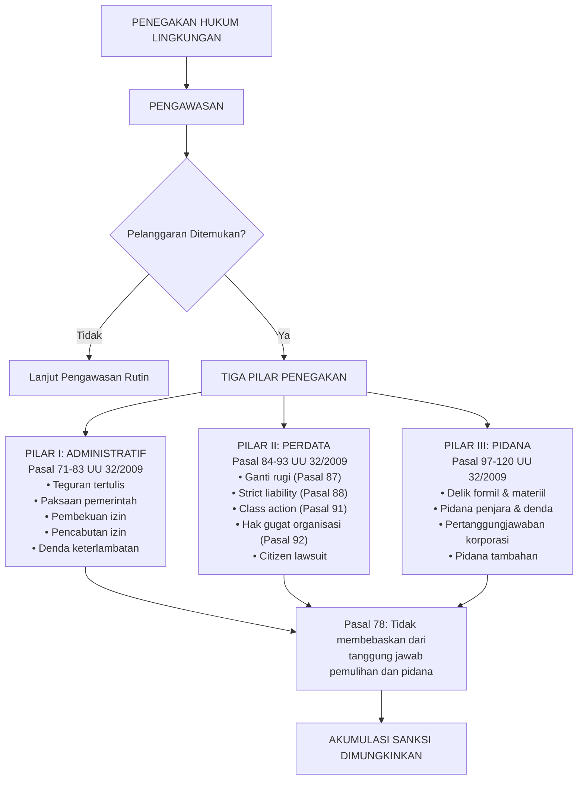
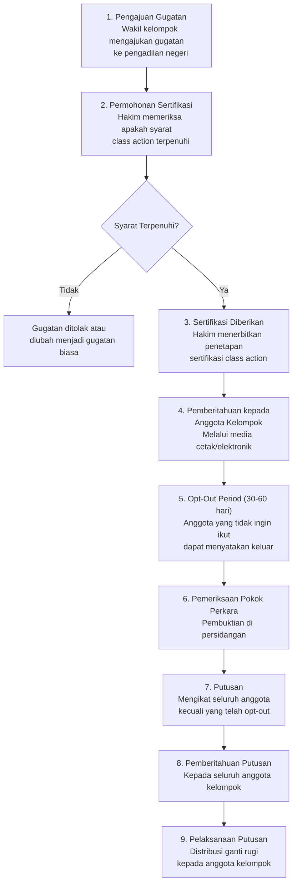
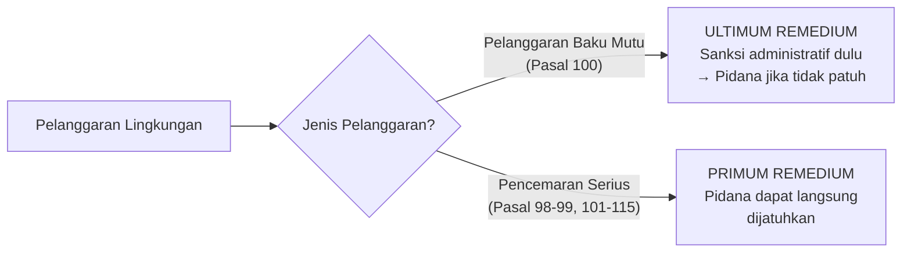
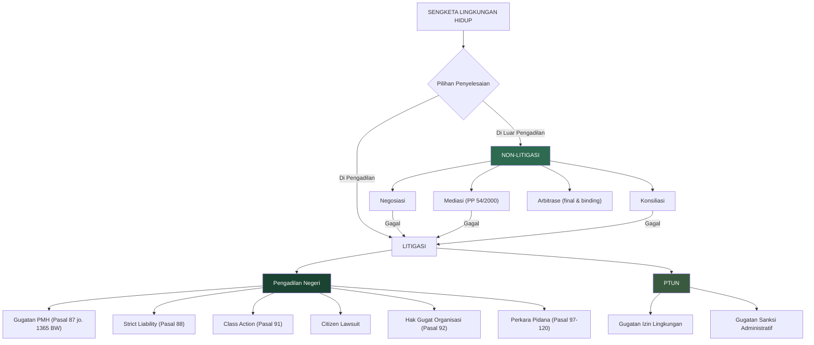

# Penegakan Hukum Lingkungan

**Navigasi:**
- [[07_Tanggung_Jawab_Mutlak|← Tanggung Jawab Mutlak]]
- [[README|↑ Index]]
- [[09_Hukum_Lingkungan_Internasional|Hukum Lingkungan Internasional →]]

---

## Tujuan Pembelajaran

Setelah mempelajari bab ini, mahasiswa diharapkan mampu:

1. Menjelaskan kerangka umum penegakan hukum lingkungan yang terdiri dari tiga pilar: administratif, perdata, dan pidana, serta hubungan antara ketiganya.
2. Menganalisis mekanisme sanksi administratif berdasarkan Pasal 71-83 UU 32/2009, termasuk paksaan pemerintah (*bestuursdwang*), pembekuan dan pencabutan izin, serta uang paksa (*dwangsom*).
3. Memahami berbagai jalur gugatan perdata lingkungan hidup: gugatan perwakilan kelompok (*class action*), gugatan warga negara (*citizen lawsuit*), dan hak gugat organisasi lingkungan (*legal standing*).
4. Mengidentifikasi unsur-unsur tindak pidana lingkungan berdasarkan Pasal 97-120 UU 32/2009, membedakan delik formil dan materiil, serta memahami pertanggungjawaban korporasi.
5. Menjelaskan peran Penyidik Pegawai Negeri Sipil (PPNS) lingkungan hidup dan mekanisme penyidikan tindak pidana lingkungan.
6. Menganalisis mekanisme penyelesaian sengketa lingkungan di luar pengadilan berdasarkan PP 54/2000 dan peran Pengadilan Tata Usaha Negara (PTUN) dalam sengketa izin lingkungan.
7. Mengevaluasi efektivitas penegakan hukum lingkungan di Indonesia melalui studi kasus konkret: Lapindo, Kaltim Prima Coal, Indorayon/Toba Pulp Lestari, dan kasus polusi udara Jakarta.
8. Membedakan prinsip *ultimum remedium* dan *primum remedium* serta penerapannya dalam hukum pidana lingkungan.

---

## 1. Kerangka Umum Penegakan Hukum Lingkungan

### 1.1 Definisi dan Ruang Lingkup

Penegakan hukum lingkungan (*environmental law enforcement*) adalah serangkaian upaya untuk memastikan kepatuhan terhadap norma-norma hukum lingkungan hidup, baik melalui pencegahan pelanggaran (preventif) maupun penindakan terhadap pelanggar (represif). Dalam sistem hukum Indonesia, penegakan hukum lingkungan dilaksanakan melalui tiga jalur yang bersifat kumulatif — artinya, ketiga jalur dapat diterapkan secara bersamaan terhadap satu pelanggaran yang sama.

### 1.2 Instrumen Preventif dan Represif

Penegakan hukum lingkungan dapat dibedakan menjadi dua kategori besar:

**Instrumen Preventif** — diterapkan sebelum terjadinya pelanggaran — bertujuan mencegah pencemaran dan kerusakan lingkungan. Instrumen ini meliputi Kajian Lingkungan Hidup Strategis (KLHS), Analisis Mengenai Dampak Lingkungan (AMDAL), penetapan baku mutu lingkungan, perizinan lingkungan (kini berupa persetujuan lingkungan), dan pengawasan berkala oleh Pejabat Pengawas Lingkungan Hidup (PPLH).

**Instrumen Represif** — diterapkan setelah terjadinya pelanggaran — bertujuan menghentikan pelanggaran, memulihkan fungsi lingkungan, dan memberikan efek jera. Instrumen represif terdiri dari tiga pilar: sanksi administratif, gugatan perdata, dan sanksi pidana.

### 1.3 Diagram Tiga Pilar Penegakan Hukum

### 1.4 Prinsip Akumulasi Sanksi

**Pasal 78 UU 32/2009** menetapkan prinsip fundamental:

> "Sanksi administratif tidak membebaskan penanggung jawab usaha dan/atau kegiatan dari tanggung jawab pemulihan dan pidana."

Prinsip ini berarti bahwa satu pelanggaran lingkungan dapat dikenakan sanksi administratif (pencabutan izin), kewajiban pemulihan lingkungan, sanksi pidana (penjara dan denda), dan gugatan perdata (ganti rugi) secara bersamaan. Prinsip *ne bis in idem* (tidak diadili dua kali untuk perkara yang sama) tidak berlaku karena masing-masing sanksi memiliki fungsi dan tujuan yang berbeda: sanksi administratif bertujuan menghentikan pelanggaran dan memulihkan kepatuhan, sanksi perdata bertujuan memberikan kompensasi kepada korban, dan sanksi pidana bertujuan memberikan efek jera dan pembalasan.

---

## 2. Pilar Pertama: Penegakan Hukum Administratif

### 2.1 Pengawasan sebagai Prasyarat

Sebelum sanksi administratif dijatuhkan, terlebih dahulu harus dilakukan pengawasan. **Pasal 71 UU 32/2009** menetapkan:

> "Menteri, gubernur, atau bupati/walikota sesuai dengan kewenangannya **wajib melakukan pengawasan** terhadap ketaatan penanggung jawab usaha dan/atau kegiatan atas ketentuan yang ditetapkan dalam peraturan perundang-undangan di bidang perlindungan dan pengelolaan lingkungan hidup."

**Pasal 72 UU 32/2009** mengatur bahwa pengawasan dilaksanakan oleh Pejabat Pengawas Lingkungan Hidup (PPLH) yang ditetapkan oleh menteri, gubernur, atau bupati/walikota. PPLH memiliki kewenangan luas: melakukan pemantauan, meminta keterangan, membuat salinan dokumen, memasuki tempat tertentu, memotret, membuat rekaman, mengambil sampel, memeriksa peralatan, dan memeriksa instalasi pengolahan limbah.

**Pasal 73 UU 32/2009** menambahkan bahwa menteri dapat melakukan pengawasan terhadap ketaatan penanggung jawab usaha yang izin lingkungannya diterbitkan oleh pemerintah daerah, apabila pemerintah daerah dinilai tidak melaksanakan pengawasan dengan semestinya.

### 2.2 Jenis Sanksi Administratif

**Pasal 76 ayat (2) UU 32/2009** menetapkan empat jenis sanksi administratif:

| Sanksi | Dasar Hukum | Sifat | Tujuan | Mekanisme |
|--------|-------------|-------|--------|-----------|
| **Teguran tertulis** | Pasal 76 ayat (2) huruf a | Peringatan resmi | Memberikan kesempatan perbaikan dalam jangka waktu tertentu | Surat teguran dari pejabat berwenang |
| **Paksaan pemerintah** (*bestuursdwang*) | Pasal 76 ayat (2) huruf b jo. Pasal 80 | Tindakan paksa | Menghentikan pelanggaran dan/atau memulihkan kondisi | Tindakan nyata oleh pemerintah atas biaya pelanggar |
| **Pembekuan izin** | Pasal 76 ayat (2) huruf c | Penangguhan sementara | Menghentikan sementara kegiatan operasi | Keputusan pembekuan izin lingkungan/usaha |
| **Pencabutan izin** | Pasal 76 ayat (2) huruf d | Penghentian permanen | Menghentikan seluruh kegiatan usaha | Keputusan pencabutan izin yang bersifat final |

### 2.3 Paksaan Pemerintah (*Bestuursdwang*): Analisis Mendalam

Paksaan pemerintah merupakan instrumen administratif paling kuat yang dimiliki pemerintah. **Pasal 80 ayat (1) UU 32/2009** merinci bentuk-bentuk paksaan pemerintah:

1. Penghentian sementara kegiatan produksi
2. Pemindahan sarana produksi
3. Penutupan saluran pembuangan air limbah atau emisi
4. Pembongkaran instalasi atau bangunan yang melanggar
5. Penyitaan terhadap barang atau alat yang berpotensi menimbulkan pelanggaran
6. Penghentian sementara seluruh kegiatan
7. Tindakan lain yang bertujuan untuk menghentikan pelanggaran dan tindakan memulihkan fungsi lingkungan hidup

Biaya pelaksanaan paksaan pemerintah ditanggung oleh penanggung jawab usaha yang melanggar. Ini merupakan penerapan prinsip pencemar membayar (*polluter pays principle*) dalam konteks administratif.

### 2.4 Paksaan Pemerintah Tanpa Teguran Terlebih Dahulu

**Pasal 80 ayat (2) UU 32/2009** memungkinkan penjatuhan paksaan pemerintah **tanpa didahului teguran tertulis** apabila:

- Pelanggaran menimbulkan **ancaman yang sangat serius** bagi manusia dan lingkungan hidup
- Dampak yang lebih besar dan lebih luas akan terjadi jika pelanggaran tidak segera dihentikan
- Kerugian yang lebih besar bagi lingkungan hidup akan terjadi jika pelanggaran tidak segera dihentikan

Ketentuan ini memberikan kewenangan darurat kepada pemerintah untuk bertindak cepat dalam situasi yang mendesak, tanpa harus menunggu proses teguran yang biasanya memakan waktu.

### 2.5 Uang Paksa (*Dwangsom*)

**Pasal 81 UU 32/2009** mengatur mengenai uang paksa sebagai mekanisme pemaksaan tidak langsung (*indirect enforcement*):

> "Setiap penanggung jawab usaha dan/atau kegiatan yang tidak melaksanakan paksaan pemerintah dapat dikenai **denda atas setiap keterlambatan** pelaksanaan sanksi paksaan pemerintah."

Denda keterlambatan (*dwangsom*) bersifat akumulatif — dihitung per hari keterlambatan dan terus berjalan hingga penanggung jawab usaha melaksanakan paksaan pemerintah. Besaran denda ditetapkan dalam keputusan paksaan pemerintah.

**Ilustrasi Penerapan:**
Misalkan sebuah pabrik diperintahkan untuk membangun Instalasi Pengolahan Air Limbah (IPAL) dalam jangka waktu 90 hari, dengan denda keterlambatan Rp 10 juta per hari. Apabila pabrik tersebut terlambat 60 hari, maka total uang paksa yang harus dibayar adalah 60 × Rp 10 juta = Rp 600 juta, di samping tetap wajib membangun IPAL.

### 2.6 Kewenangan Substitusi Menteri

**Pasal 77 UU 32/2009** mengatur suatu mekanisme pengaman (*safeguard mechanism*):

> "Menteri dapat menerapkan sanksi administratif terhadap penanggung jawab usaha dan/atau kegiatan jika **Pemerintah menganggap pemerintah daerah secara sengaja tidak menerapkan sanksi administratif** terhadap pelanggaran yang serius di bidang perlindungan dan pengelolaan lingkungan hidup."

Ketentuan ini mencerminkan kenyataan bahwa pemerintah daerah terkadang enggan menerapkan sanksi terhadap perusahaan yang dianggap memberikan kontribusi ekonomi signifikan bagi daerah. Kewenangan substitusi menteri berfungsi sebagai mekanisme koreksi terhadap pembiaran (*omission*) oleh pemerintah daerah.

### 2.7 Keterkaitan dengan Perizinan Berusaha Pasca-UU Cipta Kerja

Dengan berlakunya UU 6/2023 tentang Cipta Kerja, sistem perizinan lingkungan mengalami perubahan dari izin lingkungan menjadi persetujuan lingkungan yang terintegrasi dalam Perizinan Berusaha Berbasis Risiko. Konsekuensinya, sanksi administratif berupa pembekuan dan pencabutan izin kini terkait dengan Perizinan Berusaha secara keseluruhan, bukan hanya izin lingkungan tersendiri. Hal ini berpotensi memberikan dampak yang lebih luas bagi pelaku usaha yang melanggar ketentuan lingkungan.

---

## 3. Pilar Kedua: Penegakan Hukum Perdata

### 3.1 Kerangka Hukum

Penegakan hukum perdata dalam bidang lingkungan hidup diatur dalam **Pasal 84-93 UU 32/2009**, yang memberikan beberapa jalur penyelesaian sengketa: penyelesaian di dalam pengadilan (litigasi) dan penyelesaian di luar pengadilan (non-litigasi). Ketentuan ini dilengkapi oleh **Pasal 1365 BW** (Kitab Undang-Undang Hukum Perdata) mengenai perbuatan melawan hukum sebagai dasar umum gugatan perdata.

**Pasal 84 ayat (1) UU 32/2009** menyatakan:

> "Penyelesaian sengketa lingkungan hidup dapat ditempuh melalui pengadilan atau di luar pengadilan."

**Pasal 84 ayat (3)** menambahkan prinsip penting:

> "Gugatan melalui pengadilan hanya dapat ditempuh apabila upaya penyelesaian sengketa di luar pengadilan yang dipilih dinyatakan tidak berhasil oleh salah satu atau para pihak yang bersengketa."

### 3.2 Gugatan Ganti Rugi Berdasarkan Kesalahan

**Pasal 87 ayat (1) UU 32/2009** mengatur gugatan ganti rugi berdasarkan kesalahan (*fault-based liability*):

> "Setiap penanggung jawab usaha dan/atau kegiatan yang melakukan perbuatan melanggar hukum berupa pencemaran dan/atau perusakan lingkungan hidup yang menimbulkan kerugian pada orang lain atau lingkungan hidup **wajib membayar ganti rugi dan/atau melakukan tindakan tertentu**."

**Pasal 87 ayat (2)** memberikan kewenangan kepada hakim untuk menetapkan uang paksa:

> "Hakim dapat menetapkan pembayaran uang paksa terhadap setiap hari keterlambatan atas pelaksanaan putusan pengadilan."

Komponen ganti rugi meliputi: ganti rugi materiil (kerugian nyata yang dapat dihitung — hilangnya pendapatan, biaya pengobatan, kerusakan properti), ganti rugi immateriil (kerugian psikologis, penderitaan, hilangnya kenyamanan), dan biaya pemulihan lingkungan (remediasi, rehabilitasi, restorasi ekosistem). Untuk pembahasan mengenai tanggung jawab mutlak (*strict liability*) berdasarkan Pasal 88, lihat [[07_Tanggung_Jawab_Mutlak|Bab 7: Tanggung Jawab Mutlak]].

### 3.3 Gugatan Perwakilan Kelompok (*Class Action*)

#### 3.3.1 Dasar Hukum dan Pengertian

**Pasal 91 UU 32/2009** memberikan dasar hukum bagi gugatan perwakilan kelompok:

> "Masyarakat berhak mengajukan **gugatan perwakilan kelompok** untuk kepentingan dirinya sendiri dan/atau untuk kepentingan masyarakat apabila mengalami kerugian akibat pencemaran dan/atau kerusakan lingkungan hidup."

Mekanisme *class action* diatur lebih lanjut dalam **Peraturan Mahkamah Agung (PERMA) Nomor 1 Tahun 2002** tentang Acara Gugatan Perwakilan Kelompok. PERMA ini mendefinisikan gugatan perwakilan kelompok sebagai "suatu tata cara pengajuan gugatan, dalam mana satu orang atau lebih yang mewakili kelompok mengajukan gugatan untuk diri atau diri-diri mereka sendiri dan sekaligus mewakili sekelompok orang yang jumlahnya banyak, yang memiliki kesamaan fakta atau dasar hukum."

#### 3.3.2 Syarat-Syarat *Class Action*

Empat syarat kumulatif harus dipenuhi:

| Syarat | Istilah | Penjelasan |
|--------|---------|------------|
| **Jumlah yang memadai** | *Numerosity* | Jumlah anggota kelompok sedemikian banyak sehingga tidak praktis untuk menggugat secara individual |
| **Kesamaan permasalahan** | *Commonality* | Terdapat kesamaan fakta atau peristiwa dan kesamaan dasar hukum antara wakil kelompok dan anggota kelompok |
| **Kesamaan jenis tuntutan** | *Typicality* | Tuntutan dan pembelaan wakil kelompok sejenis (*typical*) dengan anggota kelompok |
| **Kelayakan wakil** | *Adequacy of representation* | Wakil kelompok memiliki kejujuran, kesungguhan, dan kemampuan untuk melindungi kepentingan anggota kelompok |

#### 3.3.3 Prosedur *Class Action*

#### 3.3.4 Yurisprudensi: Kasus Mandalawangi (Putusan MA No. 1794 K/Pdt/2004)

Kasus Mandalawangi merupakan salah satu *class action* lingkungan paling berpengaruh di Indonesia. Sekitar 1.200 Kepala Keluarga masyarakat Mandalawangi, Kecamatan Kadungora, Kabupaten Garut, menggugat Perum Perhutani dan instansi pemerintah terkait atas bencana tanah longsor tahun 2003 yang menewaskan 20 orang dan merusak lahan pertanian serta permukiman.

Mahkamah Agung mengabulkan gugatan dan memerintahkan Perhutani untuk membayar ganti rugi serta melakukan rehabilitasi. Putusan ini signifikan karena mengakui penerapan *class action* dalam perkara lingkungan dan mengaitkan tanggung jawab mutlak dengan asas kehati-hatian (*precautionary principle*). Untuk analisis lebih mendalam, lihat [[07_Tanggung_Jawab_Mutlak|Bab 7: Tanggung Jawab Mutlak]].

### 3.4 Gugatan Warga Negara (*Citizen Lawsuit*)

#### 3.4.1 Konsep dan Pengertian

*Citizen lawsuit* adalah gugatan yang diajukan oleh satu atau lebih warga negara terhadap penyelenggara negara karena **tidak menjalankan kewajibannya** (*omission*) dalam perlindungan dan pengelolaan lingkungan hidup. Berbeda dengan *class action* yang menggugat pihak pencemar (swasta), *citizen lawsuit* ditujukan kepada pemerintah yang dianggap lalai atau gagal menjalankan fungsi perlindungan lingkungan.

Menariknya, *citizen lawsuit* tidak diatur secara eksplisit dalam peraturan perundang-undangan Indonesia. Mekanisme ini pertama kali diterima dalam praktik peradilan Indonesia melalui Putusan Pengadilan Negeri Jakarta Pusat dalam perkara lingkungan pada tahun 2003 dan telah berkembang menjadi instrumen penegakan hukum yang diakui secara *de facto* oleh sistem peradilan Indonesia.

#### 3.4.2 Perbedaan Mendasar dengan *Class Action*

| Aspek | *Class Action* | *Citizen Lawsuit* |
|-------|---------------|-------------------|
| **Tergugat** | Pencemar/perusak (umumnya swasta) | Penyelenggara negara (pemerintah) |
| **Dasar gugatan** | Perbuatan (*action*) — pencemaran/perusakan | Kelalaian/pembiaran (*omission*) — tidak menjalankan kewajiban |
| **Jenis tuntutan** | Ganti rugi materiil dan immateriil | *Condemnatoir* — mewajibkan tergugat melakukan tindakan tertentu |
| **Legal standing** | Korban langsung atau wakilnya | **Setiap warga negara** — tidak perlu membuktikan kerugian langsung |
| **Syarat notifikasi** | Tidak ada | Wajib mengirimkan notifikasi kepada tergugat 60 hari sebelum gugatan |
| **Sifat putusan** | Ganti rugi finansial dan/atau pemulihan | Perintah melakukan kebijakan publik tertentu |
| **Dasar hukum** | Pasal 91 UU 32/2009 jo. PERMA 1/2002 | Belum diatur eksplisit; diterima melalui yurisprudensi |

#### 3.4.3 Yurisprudensi: Kasus Polusi Udara Jakarta (2019-2021)

**Putusan PN Jakarta Pusat No. 374/Pdt.G/LH/2019/PN.Jkt.Pst.**

Perkara ini merupakan *citizen lawsuit* paling signifikan dalam sejarah hukum lingkungan Indonesia kontemporer.

**Penggugat**: 32 warga negara Indonesia yang tinggal di Jakarta dan sekitarnya.

**Tergugat**: Presiden Republik Indonesia, Menteri Lingkungan Hidup dan Kehutanan, Menteri Kesehatan, Gubernur DKI Jakarta, Gubernur Jawa Barat, Gubernur Banten, dan Menteri Dalam Negeri.

**Dalil Gugatan**: Para tergugat telah lalai menjalankan kewajibannya dalam pengendalian pencemaran udara di wilayah Jakarta dan sekitarnya. Kualitas udara Jakarta secara konsisten berada di bawah standar yang ditetapkan oleh Organisasi Kesehatan Dunia (WHO) dan baku mutu nasional, menyebabkan dampak serius terhadap kesehatan masyarakat.

**Putusan (16 September 2021)**: Majelis Hakim mengabulkan gugatan sebagian. Presiden RI, Menteri LHK, Menteri Kesehatan, dan Gubernur DKI Jakarta dinyatakan telah **melakukan perbuatan melawan hukum** karena lalai menjalankan kewajiban pengendalian pencemaran udara. Pengadilan memerintahkan: Presiden untuk menetapkan standar nasional kualitas udara ambien yang baru, Menteri LHK untuk memperketat pengawasan sumber pencemar, Menteri Kesehatan untuk membuat sistem informasi kualitas udara dan dampak kesehatannya, dan Gubernur DKI Jakarta untuk memperketat pengawasan emisi kendaraan bermotor dan industri.

**Signifikansi**: Putusan ini menunjukkan bahwa *citizen lawsuit* dapat menjadi instrumen efektif untuk memaksa pemerintah menjalankan kewajibannya. Meskipun tidak menuntut ganti rugi finansial, putusan ini berdampak luas terhadap kebijakan pengendalian pencemaran udara nasional.

### 3.5 Hak Gugat Organisasi Lingkungan (*Legal Standing*)

#### 3.5.1 Dasar Hukum

**Pasal 92 ayat (1) UU 32/2009**:

> "Dalam rangka pelaksanaan tanggung jawab perlindungan dan pengelolaan lingkungan hidup, organisasi lingkungan hidup berhak mengajukan **gugatan untuk kepentingan pelestarian fungsi lingkungan hidup**."

#### 3.5.2 Syarat Organisasi

**Pasal 92 ayat (3) UU 32/2009** menetapkan tiga syarat kumulatif:

| Syarat | Penjelasan | Rasio |
|--------|------------|-------|
| **Berbentuk badan hukum** | Yayasan atau perkumpulan yang telah memperoleh status badan hukum | Menjamin akuntabilitas dan kejelasan representasi |
| **Anggaran dasar menegaskan tujuan lingkungan** | Dalam akta pendirian dan anggaran dasar secara tegas menyatakan tujuan pelestarian lingkungan | Memastikan organisasi memiliki kepentingan sah (*legitimate interest*) |
| **Kegiatan nyata selama minimal 2 tahun** | Telah melaksanakan kegiatan sesuai anggaran dasar selama sekurang-kurangnya 2 tahun | Membuktikan komitmen dan kapabilitas organisasi |

#### 3.5.3 Batasan Tuntutan

Organisasi lingkungan **tidak dapat** menuntut ganti rugi finansial untuk kepentingan organisasi itu sendiri. Tuntutan yang dimungkinkan hanya berupa: tindakan tertentu untuk pelestarian fungsi lingkungan, penghentian kegiatan yang merusak atau mencemari lingkungan, dan perintah untuk memulihkan fungsi lingkungan hidup.

#### 3.5.4 Tonggak Sejarah: WALHI sebagai Pelopor

Wahana Lingkungan Hidup Indonesia (WALHI) merupakan organisasi lingkungan pertama yang hak gugatnya diakui oleh pengadilan Indonesia. Dalam gugatan terhadap PT Inti Indorayon Utama pada akhir tahun 1980-an, Pengadilan Negeri Jakarta Pusat menerima kedudukan hukum (*legal standing*) WALHI meskipun pada saat itu belum ada dasar hukum eksplisit yang mengatur hak gugat organisasi lingkungan. Pengakuan ini merupakan terobosan hukum (*judicial activism*) yang kemudian dikodifikasi dalam UU 23/1997 dan dilanjutkan dalam UU 32/2009.

### 3.6 Penyelesaian Sengketa Lingkungan di Luar Pengadilan

#### 3.6.1 Kerangka Hukum

**Pasal 85 UU 32/2009** mengatur penyelesaian sengketa lingkungan di luar pengadilan, yang dilakukan secara sukarela oleh para pihak. **PP Nomor 54 Tahun 2000** tentang Lembaga Penyedia Jasa Pelayanan Penyelesaian Sengketa Lingkungan Hidup di Luar Pengadilan mengatur lebih lanjut mengenai mekanisme dan lembaga pelaksananya.

#### 3.6.2 Mekanisme yang Tersedia

Berdasarkan PP 54/2000, mekanisme penyelesaian sengketa di luar pengadilan meliputi:

**Mediasi** — pihak ketiga netral (mediator) membantu para pihak mencapai kesepakatan bersama, tanpa wewenang memutus. Mediator bertindak sebagai fasilitator yang membantu komunikasi dan negosiasi antara pihak pencemar dan korban.

**Konsiliasi** — mirip dengan mediasi, tetapi konsiliator memiliki peran lebih aktif dalam mengusulkan solusi penyelesaian kepada para pihak.

**Arbitrase** — pihak ketiga netral (arbiter) diberi wewenang untuk memutus sengketa. Putusan arbiter bersifat final dan mengikat (*final and binding*) para pihak.

Selain ketiga mekanisme utama tersebut, dimungkinkan pula penyelesaian melalui negosiasi langsung, penilaian ahli (*expert assessment*), dan pencarian fakta netral (*neutral fact-finding*).

#### 3.6.3 Kelebihan dan Kekurangan Penyelesaian di Luar Pengadilan

Kelebihan penyelesaian di luar pengadilan meliputi: proses yang lebih cepat dan murah dibandingkan litigasi, kerahasiaan terjaga (*confidentiality*), hubungan antarpihak dapat dipertahankan, dan solusi dapat lebih kreatif dan fleksibel. Kekurangannya antara lain: bergantung pada itikad baik kedua belah pihak, tidak ada mekanisme pemaksaan jika satu pihak tidak bersedia, hasil kesepakatan mungkin tidak mencerminkan keadilan substantif jika posisi tawar tidak seimbang, dan tidak ada efek jera bagi pelanggar.

### 3.7 Peran PTUN dalam Sengketa Lingkungan

#### 3.7.1 Objek Sengketa di PTUN

Pengadilan Tata Usaha Negara (PTUN) berwenang mengadili sengketa yang timbul dari penerbitan Keputusan Tata Usaha Negara (KTUN) di bidang lingkungan. Dalam konteks lingkungan hidup, KTUN yang dapat menjadi objek sengketa meliputi: keputusan penerbitan persetujuan lingkungan (dahulu izin lingkungan), keputusan pemberian izin usaha yang berdampak lingkungan, keputusan penolakan permohonan izin lingkungan, serta keputusan penjatuhan atau penolakan penjatuhan sanksi administratif.

#### 3.7.2 Mekanisme Gugatan di PTUN

Pihak yang merasa dirugikan oleh penerbitan KTUN di bidang lingkungan harus terlebih dahulu menempuh **upaya administratif** (keberatan dan/atau banding administratif) sesuai UU 30/2014 tentang Administrasi Pemerintahan jo. Perma No. 6/2018. Gugatan ke PTUN dapat diajukan dalam tenggang waktu **90 hari** sejak KTUN diterima atau diketahui.

#### 3.7.3 Problematika PTUN dalam Sengketa Lingkungan

Fungsi PTUN dalam memberikan perlindungan terhadap kelestarian lingkungan hidup belum optimal. Beberapa kendala yang teridentifikasi: hakim PTUN cenderung bersifat prosedural-formalistik dan kurang mempertimbangkan aspek substansi perlindungan lingkungan, adanya pembatasan objek sengketa KTUN yang dapat digugat, asas pembangunan berkelanjutan (*sustainable development*) belum konsisten digunakan sebagai pertimbangan hakim, serta pemahaman hakim PTUN terhadap kompleksitas persoalan lingkungan yang masih terbatas.

---

## 4. Pilar Ketiga: Penegakan Hukum Pidana

### 4.1 Kerangka Hukum

Ketentuan pidana lingkungan diatur dalam **Pasal 97-120 UU 32/2009**. Pasal 97 menegaskan bahwa tindak pidana yang diatur dalam UU 32/2009 merupakan **kejahatan** (*misdrijf*), bukan pelanggaran (*overtreding*). Penetapan sebagai kejahatan membawa konsekuensi hukum yang penting: ancaman pidana lebih berat, percobaan (*poging*) dapat dipidana, dan pembantuan (*medeplichtigheid*) dapat dipidana.

### 4.2 Delik Formil dan Delik Materiil

UU 32/2009 mengenal dua jenis delik:

| Jenis Delik | Unsur Pembuktian | Pasal | Contoh |
|-------------|------------------|-------|--------|
| **Delik Materiil** | Harus membuktikan **akibat** (pencemaran/kerusakan lingkungan) | Pasal 98-99 | Sengaja/lalai melakukan perbuatan yang mengakibatkan pencemaran yang melampaui baku mutu |
| **Delik Formil** | Cukup membuktikan **perbuatan** yang melanggar ketentuan, tanpa perlu membuktikan akibat | Pasal 100-115 | Melampaui baku mutu tanpa perlu membuktikan pencemaran terjadi; membuang limbah B3 tanpa izin |

Pembedaan ini memiliki signifikansi praktis yang besar: delik formil jauh lebih mudah dibuktikan karena tidak perlu membuktikan terjadinya pencemaran atau kerusakan lingkungan — cukup membuktikan bahwa pelaku melanggar ketentuan normatif (misalnya melampaui baku mutu atau tidak memiliki izin).

### 4.3 Ancaman Pidana dalam UU 32/2009

#### 4.3.1 Delik Materiil

**Pasal 98 ayat (1) UU 32/2009** — Pencemaran/perusakan yang dilakukan dengan **sengaja**:

> "Setiap orang yang dengan sengaja melakukan perbuatan yang mengakibatkan dilampauinya baku mutu udara ambien, baku mutu air, baku mutu air laut, atau kriteria baku kerusakan lingkungan hidup, dipidana dengan pidana penjara paling singkat **3 (tiga) tahun** dan paling lama **10 (sepuluh) tahun** dan denda paling sedikit **Rp3.000.000.000,00** (tiga miliar rupiah) dan paling banyak **Rp10.000.000.000,00** (sepuluh miliar rupiah)."

**Pasal 98 ayat (2)** — Pemberatan jika mengakibatkan luka berat atau bahaya kesehatan: penjara 5-12 tahun, denda Rp5-12 miliar.

**Pasal 98 ayat (3)** — Pemberatan jika mengakibatkan kematian: penjara 5-15 tahun, denda Rp5-15 miliar.

**Pasal 99 UU 32/2009** — Pencemaran/perusakan karena **kelalaian** (*culpa*):

| Ayat | Akibat | Penjara | Denda |
|------|--------|---------|-------|
| (1) | Melampaui baku mutu | 1-3 tahun | Rp1-3 miliar |
| (2) | Luka berat/bahaya kesehatan | 2-6 tahun | Rp2-6 miliar |
| (3) | Kematian | 3-9 tahun | Rp3-9 miliar |

#### 4.3.2 Delik Formil — Tabel Ringkasan

| Pasal | Tindak Pidana | Penjara | Denda |
|-------|---------------|---------|-------|
| **100(1)** | Melanggar baku mutu air limbah/emisi/gangguan (*ultimum remedium*) | Maks. 3 tahun | Maks. Rp3 miliar |
| **101** | Melepaskan/mengedarkan produk rekayasa genetika tanpa izin | 1-3 tahun | Rp1-3 miliar |
| **102** | Mengelola limbah B3 tanpa izin | 1-3 tahun | Rp1-3 miliar |
| **103** | Menghasilkan limbah B3 tanpa pengelolaan | 1-3 tahun | Rp1-3 miliar |
| **104** | *Dumping* limbah/bahan ke media lingkungan tanpa izin | Maks. 3 tahun | Maks. Rp3 miliar |
| **105** | Memasukkan limbah ke NKRI | 4-12 tahun | Rp4-12 miliar |
| **106** | Memasukkan **limbah B3** ke NKRI | 5-15 tahun | Rp5-15 miliar |
| **107** | Memasukkan B3 yang dilarang ke NKRI | 5-15 tahun | Rp5-15 miliar |
| **108** | Pembakaran lahan | 3-10 tahun | Rp3-10 miliar |
| **109** | Tidak melakukan pengawasan terhadap usaha/kegiatan (*bagi pejabat*) | 1 tahun/denda | Rp500 juta |

#### 4.3.3 Ketentuan Pidana Minimum

UU 32/2009 memperkenalkan **pidana minimum** untuk beberapa tindak pidana lingkungan. Penetapan pidana minimum bertujuan memberikan kepastian bahwa pelaku tindak pidana lingkungan akan menerima hukuman yang memadai dan berfungsi sebagai *deterrent effect*. Namun, pasca-Putusan Mahkamah Konstitusi yang membatalkan beberapa ketentuan pidana minimum dalam undang-undang lain, terdapat diskursus mengenai konstitusionalitas pidana minimum dalam UU 32/2009.

### 4.4 Pertanggungjawaban Korporasi

#### 4.4.1 Prinsip Dasar

**Pasal 116 ayat (1) UU 32/2009** menetapkan:

> "Apabila tindak pidana lingkungan hidup dilakukan oleh, untuk, atau atas nama badan usaha, tuntutan pidana dan sanksi pidana dijatuhkan kepada: (a) badan usaha; dan/atau (b) orang yang memberi perintah untuk melakukan tindak pidana tersebut atau orang yang bertindak sebagai pemimpin kegiatan dalam tindak pidana tersebut."

**Pasal 116 ayat (2)** menambahkan bahwa apabila tindak pidana dilakukan oleh orang yang berdasarkan hubungan kerja atau berdasarkan hubungan lain yang bertindak dalam lingkup kerja badan usaha, sanksi pidana dijatuhkan terhadap pemberi perintah atau pemimpin kegiatan **tanpa memperhatikan** apakah tindak pidana dilakukan secara sendiri atau bersama-sama.

#### 4.4.2 Kriteria Pertanggungjawaban Korporasi

Berdasarkan Pasal 116-118, pertanggungjawaban pidana korporasi diterapkan melalui tiga jalur:

Pertama, **pertanggungjawaban korporasi langsung** (*direct corporate liability*) — korporasi sebagai entitas hukum dimintai pertanggungjawaban atas tindak pidana yang dilakukan untuk atau atas namanya. Kedua, **pertanggungjawaban pengurus** (*officer liability*) — direksi, komisaris, atau pejabat yang memberi perintah atau memimpin kegiatan yang mengandung tindak pidana dapat dipidana secara personal. Ketiga, **pertanggungjawaban kumulatif** — baik korporasi maupun pengurusnya dapat dipidana secara bersamaan.

#### 4.4.3 Pidana Tambahan untuk Korporasi

**Pasal 119 UU 32/2009** mengatur pidana tambahan yang khusus untuk korporasi:

1. **Perampasan keuntungan** yang diperoleh dari tindak pidana — untuk menghilangkan insentif ekonomi kejahatan lingkungan
2. **Penutupan seluruh atau sebagian tempat usaha dan/atau kegiatan** — sanksi terberat yang menghentikan operasi korporasi
3. **Perbaikan akibat tindak pidana** — kewajiban memulihkan kerusakan lingkungan yang ditimbulkan
4. **Kewajiban mengerjakan apa yang dilalaikan tanpa hak** — misalnya kewajiban membangun IPAL yang tidak dibangun
5. **Penempatan perusahaan di bawah pengampuan** paling lama 3 tahun — pengelolaan perusahaan dialihkan kepada pihak yang ditunjuk pengadilan

### 4.5 *Ultimum Remedium* versus *Primum Remedium*

#### 4.5.1 Konsep Dasar

Perdebatan mengenai kapan hukum pidana boleh diterapkan dalam penegakan hukum lingkungan terkristalisasi dalam dua pendekatan:

**Ultimum Remedium** — hukum pidana sebagai upaya terakhir (*last resort*). Pendekatan ini mengutamakan sanksi administratif terlebih dahulu; pidana baru diterapkan apabila sanksi administratif gagal mencapai kepatuhan. Alasannya: sanksi administratif lebih cepat, lebih murah, dan lebih berorientasi pada pemulihan.

**Primum Remedium** — hukum pidana dapat dijatuhkan langsung tanpa harus melalui sanksi administratif terlebih dahulu. Pendekatan ini diterapkan untuk pelanggaran yang sangat serius di mana penerapan sanksi administratif terlebih dahulu justru akan memperburuk kerusakan lingkungan.

#### 4.5.2 Penerapan dalam UU 32/2009

UU 32/2009 menerapkan kedua pendekatan secara berbeda tergantung pada tingkat keparahan pelanggaran:

**Ultimum remedium berlaku untuk Pasal 100** (pelanggaran baku mutu air limbah, emisi, atau gangguan). Penjelasan Pasal 100 menyatakan:

> "Pemidanaan terhadap pelanggaran baku mutu ini baru dapat dilakukan apabila **sanksi administratif yang telah dijatuhkan tidak dipatuhi** atau pelanggaran dilakukan lebih dari satu kali."

**Primum remedium berlaku untuk Pasal 98-99** dan delik formil lainnya (Pasal 101-115). Untuk pelanggaran serius seperti pencemaran yang mengakibatkan kerusakan besar, luka berat, atau kematian, pidana dapat dijatuhkan langsung tanpa menunggu proses administratif.

---

## 5. Peran PPNS Lingkungan Hidup

### 5.1 Dasar Hukum dan Kedudukan

Penyidik Pegawai Negeri Sipil (PPNS) lingkungan hidup memiliki peran strategis dalam penegakan hukum pidana lingkungan. **Pasal 94 UU 32/2009** mengatur kewenangan PPNS di bidang PPLH.

PPNS lingkungan hidup adalah pejabat pegawai negeri sipil tertentu di lingkungan instansi pemerintah yang lingkup tugas dan tanggung jawabnya di bidang perlindungan dan pengelolaan lingkungan hidup yang diberi wewenang khusus sebagai penyidik.

### 5.2 Kewenangan PPNS

**Pasal 94 ayat (2) UU 32/2009** memberikan kewenangan yang luas kepada PPNS:

1. Melakukan pemeriksaan atas kebenaran laporan atau keterangan berkenaan dengan tindak pidana lingkungan
2. Melakukan pemeriksaan terhadap setiap orang yang diduga melakukan tindak pidana lingkungan
3. Meminta keterangan dan bahan bukti dari setiap orang berkenaan dengan peristiwa tindak pidana lingkungan
4. Melakukan pemeriksaan atas pembukuan, catatan, dan dokumen lain
5. Melakukan pemeriksaan di tempat tertentu yang diduga terdapat bahan bukti dan dokumen
6. Melakukan penyitaan terhadap bahan dan barang hasil pelanggaran
7. Meminta bantuan ahli dalam rangka pelaksanaan tugas penyidikan
8. Menghentikan penyidikan
9. Memasuki tempat tertentu, memotret, dan/atau membuat rekaman audio visual
10. Melakukan penggeledahan terhadap badan, pakaian, ruangan, dan/atau tempat lain yang diduga merupakan tempat dilakukannya tindak pidana
11. Menangkap dan menahan pelaku tindak pidana

### 5.3 Keistimewaan PPNS Lingkungan

**Pasal 94 ayat (6) UU 32/2009** memberikan keistimewaan yang tidak dimiliki PPNS pada umumnya:

> "Hasil penyidikan yang telah dilakukan oleh penyidik pegawai negeri sipil **disampaikan kepada penuntut umum**."

Ketentuan ini memodifikasi prosedur dalam KUHAP yang mensyaratkan PPNS menyerahkan berkas penyidikan kepada penyidik Polri untuk diteruskan ke penuntut umum. Dengan Pasal 94 ayat (6), PPNS lingkungan hidup dapat langsung menyerahkan berkas penyidikan kepada penuntut umum tanpa melalui penyidik Polri. Hal ini mempercepat proses penyidikan dan mengurangi ketergantungan pada kepolisian.

### 5.4 Koordinasi dengan Penyidik Polri

Meskipun PPNS memiliki kewenangan penyidikan mandiri, **Pasal 94 ayat (4)** menegaskan bahwa PPNS memberitahukan dimulainya penyidikan kepada penyidik pejabat kepolisian. **Pasal 94 ayat (5)** menyatakan bahwa PPNS dapat meminta bantuan kepada aparat kepolisian dalam pelaksanaan penyidikan. Koordinasi ini penting untuk menghindari tumpang tindih penyidikan dan memastikan sinergi antaraparat penegak hukum.

### 5.5 Alat Bukti dalam Perkara Pidana Lingkungan

**Pasal 96 UU 32/2009** memperluas alat bukti yang dapat digunakan dalam perkara pidana lingkungan di luar yang diatur dalam KUHAP. Alat bukti meliputi: keterangan saksi, keterangan ahli, surat, petunjuk, keterangan terdakwa, **serta alat bukti lain** termasuk informasi yang diucapkan, dikirimkan, diterima, atau disimpan secara elektronik, serta hasil penelitian dan data pemantauan kualitas lingkungan yang dilakukan dengan metode ilmiah.

Perluasan alat bukti ini sangat krusial mengingat bahwa pembuktian tindak pidana lingkungan sering kali memerlukan bukti ilmiah dan teknis — seperti hasil uji laboratorium terhadap sampel air, udara, dan tanah; citra satelit yang menunjukkan perubahan tutupan lahan; data pemantauan emisi dan kualitas air secara kontinu; serta pendapat ahli di bidang toksikologi, ekologi, hidrologi, dan ilmu lingkungan lainnya.

### 5.6 Tantangan PPNS dalam Praktik

Meskipun kewenangan PPNS lingkungan sudah cukup luas secara normatif, dalam praktik terdapat beberapa tantangan: jumlah PPNS lingkungan yang sangat terbatas dibandingkan dengan luas wilayah dan jumlah kegiatan yang harus diawasi; keterbatasan sarana dan prasarana penyidikan, terutama di daerah terpencil; kesulitan dalam koordinasi dengan aparat penegak hukum lain (Polri dan Kejaksaan); keterbatasan anggaran untuk operasi penyidikan yang sering kali memerlukan pengambilan dan analisis sampel yang mahal; serta tantangan dalam menghadapi perusahaan besar yang memiliki sumber daya hukum yang jauh lebih kuat.

---

## 6. Studi Kasus Penegakan Hukum Lingkungan

### 6.1 Kasus Lapindo Brantas (2006-sekarang)

**Fakta:**
Pada 29 Mei 2006, terjadi semburan lumpur panas di lokasi pengeboran eksplorasi migas PT Lapindo Brantas Inc. di Kecamatan Porong, Kabupaten Sidoarjo. Semburan yang berlangsung selama bertahun-tahun ini menenggelamkan 16 desa di tiga kecamatan, memaksa sekitar 60.000 warga mengungsi, merusak infrastruktur publik, dan menyebabkan kerugian ekonomi yang sangat besar.

**Jalur Hukum yang Ditempuh:**

*Jalur Pidana:* Penyidikan tindak pidana terhadap PT Lapindo Brantas dilakukan tetapi menghadapi kendala pembuktian — khususnya terkait perdebatan ilmiah mengenai penyebab semburan (aktivitas pengeboran versus gempa bumi). Proses pidana berjalan sangat lambat dan tidak menghasilkan penghukuman pidana terhadap korporasi.

*Jalur Perdata:* Beberapa gugatan perdata diajukan oleh masyarakat korban. Mahkamah Agung melalui Putusan No. 2710 K/Pdt/2008 menolak gugatan perdata masyarakat. Masyarakat mengajukan *class action* ke Pengadilan Negeri Sidoarjo, tetapi tidak berhasil memperoleh putusan yang mengabulkan tuntutan ganti rugi.

*Jalur Regulasi:* Pemerintah menangani kasus ini melalui pendekatan regulasi — Perpres No. 14/2007 yang kemudian diubah dengan Perpres No. 37/2012 — yang menetapkan kewajiban PT Lapindo Brantas untuk membeli tanah dan bangunan warga di area terdampak dengan pembayaran bertahap (20% tunai dan 80% melalui cicilan).

**Pelajaran:**
Kasus Lapindo menunjukkan kelemahan penegakan hukum lingkungan Indonesia dalam menangani bencana lingkungan berskala besar: proses hukum yang lamban, sulitnya pembuktian kausalitas, dan kecenderungan penyelesaian melalui jalur politik/regulasi alih-alih jalur hukum yang memastikan pertanggungjawaban penuh.

### 6.2 Kasus Indorayon/Toba Pulp Lestari

**Fakta:**
PT Inti Indorayon Utama (kemudian berganti nama menjadi PT Toba Pulp Lestari) adalah perusahaan penggilingan pulp dan kertas yang beroperasi di sekitar Danau Toba, Sumatera Utara, sejak akhir tahun 1980-an. Operasi perusahaan menimbulkan pencemaran udara (bau menyengat), pencemaran air (limbah cair ke Sungai Asahan), dan kerusakan hutan akibat penebangan untuk bahan baku. Masyarakat di sekitar pabrik mengalami gangguan kesehatan, kerusakan lahan pertanian, dan penurunan kualitas air.

**Proses Hukum:**

*Gugatan WALHI (1989):* WALHI mengajukan gugatan terhadap BKPM, Menteri Perindustrian, Menteri Kehutanan, dan PT Indorayon di Pengadilan Negeri Jakarta Pusat. Gugatan ini bersejarah karena merupakan salah satu kali pertama hak gugat organisasi lingkungan (*legal standing*) diakui oleh pengadilan Indonesia. Namun secara substansi, PN Jakarta Pusat menolak seluruh gugatan pada 14 Agustus 1989.

*Penutupan oleh Pemerintah (1999):* Setelah bertahun-tahun konflik sosial yang melibatkan demonstrasi besar-besaran oleh masyarakat, Kementerian Lingkungan Hidup merekomendasikan penutupan pabrik pada tahun 1999. Perusahaan kemudian beroperasi kembali dengan nama PT Toba Pulp Lestari.

*Gugatan Kementerian LHK (2019):* Kementerian Lingkungan Hidup dan Kehutanan mengajukan gugatan perdata terhadap PT Toba Pulp Lestari atas tuduhan pengrusakan lingkungan dan operasi ilegal di kawasan hutan.

**Pelajaran:**
Kasus Indorayon/TPL menunjukkan betapa panjang dan berliku proses penegakan hukum lingkungan, serta pentingnya partisipasi masyarakat dan organisasi lingkungan dalam mengawasi pelaku usaha. Kasus ini juga menjadi tonggak sejarah dalam pengakuan hak gugat organisasi lingkungan.

### 6.3 Kasus Kaltim Prima Coal

**Fakta:**
PT Kaltim Prima Coal (KPC) adalah salah satu perusahaan tambang batu bara terbesar di Indonesia yang beroperasi di Sangatta, Kalimantan Timur. Operasi pertambangan batu bara skala besar menimbulkan berbagai dampak lingkungan: kerusakan bentang alam (*landscape*), pencemaran air akibat air asam tambang (*acid mine drainage*), kerusakan hutan dan biodiversitas, serta gangguan terhadap mata pencaharian masyarakat sekitar.

**Proses Penegakan Hukum:**
KPC menghadapi berbagai tuntutan hukum terkait lingkungan, termasuk gugatan perdata dari masyarakat sekitar dan tindakan pengawasan dari instansi pemerintah. Perusahaan juga menjadi subjek sengketa pajak yang berkaitan dengan kewajiban lingkungannya. Di sisi lain, KPC termasuk perusahaan yang lahannya mengalami kebakaran berulang, menimbulkan pertanyaan mengenai kecukupan upaya pencegahan dan pengendalian kebakaran dalam areal konsesi.

**Pelajaran:**
Kasus KPC mengilustrasikan tantangan penegakan hukum lingkungan di sektor pertambangan — di mana kepentingan ekonomi (pendapatan daerah, lapangan kerja) sering kali bertentangan dengan kepentingan perlindungan lingkungan, dan di mana kapasitas penegakan hukum daerah tidak selalu memadai untuk mengawasi operasi pertambangan berskala besar.

### 6.4 Kasus Kebakaran Hutan dan Lahan (Karhutla)

Kebakaran hutan dan lahan merupakan salah satu isu penegakan hukum lingkungan paling kritis di Indonesia. Kementerian LHK telah menggunakan berbagai instrumen penegakan:

**Jalur Perdata:** Gugatan terhadap perusahaan yang lahannya terbakar menggunakan dalil tanggung jawab mutlak (Pasal 88) maupun perbuatan melawan hukum (Pasal 87 jo. 1365 BW). Putusan penting meliputi: PT Kallista Alam dihukum membayar Rp 366 miliar (Putusan MA No. 651 K/Pdt/2015); PT Jatim Jaya Perkasa dihukum membayar Rp 491 miliar; dan PT National Sago Prima dihukum membayar Rp 1,07 triliun.

**Jalur Pidana:** Penerapan Pasal 108 UU 32/2009 tentang pembakaran lahan dengan ancaman pidana penjara 3-10 tahun dan denda Rp3-10 miliar.

**Jalur Administratif:** Pembekuan dan pencabutan izin usaha perkebunan yang terbukti melakukan pembakaran lahan, serta penerapan paksaan pemerintah untuk memulihkan lahan yang terbakar.

### 6.5 Kasus Pencemaran Sungai Citarum

Sungai Citarum di Jawa Barat, yang panjangnya sekitar 297 kilometer dan mengaliri lebih dari 28 juta penduduk, dikenal sebagai salah satu sungai paling tercemar di dunia. Pencemaran berasal dari berbagai sumber: lebih dari 2.000 pabrik tekstil dan industri lainnya membuang limbah cair ke anak-anak sungai Citarum, ratusan ribu rumah tangga membuang limbah domestik tanpa pengolahan, serta kegiatan pertanian dan peternakan yang berkontribusi pada polusi nonpoint source.

**Upaya Penegakan:**

Pemerintah membentuk Tim Satuan Tugas Citarum Harum melalui Perpres No. 15/2018 yang melibatkan TNI, Polri, dan instansi pemerintah terkait untuk membersihkan Sungai Citarum. Dari aspek penegakan hukum: puluhan pabrik disegel dan izinnya dibekukan; beberapa perusahaan mendapat sanksi pidana atas pencemaran sungai; dan masyarakat mengajukan berbagai gugatan perdata termasuk *citizen lawsuit* terhadap pemerintah yang dianggap lalai mengendalikan pencemaran.

**Pelajaran:**
Kasus Citarum mengilustrasikan problematika pencemaran dari sumber majemuk (*multiple sources pollution*) yang sangat sulit ditangani melalui penegakan hukum konvensional karena: jumlah pelanggar sangat banyak, pencemaran bersifat kumulatif, dan kapasitas penegakan tidak memadai. Pendekatan yang efektif memerlukan kombinasi penegakan hukum represif dengan program preventif, investasi infrastruktur pengelolaan limbah, dan partisipasi masyarakat yang aktif.

### 6.6 Ringkasan Studi Kasus: Pola dan Temuan

| Kasus | Jalur Hukum yang Ditempuh | Hasil | Pelajaran Utama |
|-------|--------------------------|-------|-----------------|
| **Lapindo** | Perdata, regulasi (Perpres) | Regulasi > hukum | Kasus besar sering diselesaikan politis |
| **Indorayon/TPL** | Gugatan WALHI, sanksi administratif | Penutupan sementara | Partisipasi publik vital |
| **Kaltim Prima Coal** | Gugatan perdata, pengawasan | Beragam | Kesenjangan kapasitas daerah |
| **Polusi Udara Jakarta** | *Citizen lawsuit* | Pemerintah dinyatakan lalai | *Citizen lawsuit* efektif untuk *omission* |
| **Karhutla** | Perdata (*strict liability*), pidana, administratif | Ganti rugi ratusan miliar-triliunan | Tiga pilar digunakan bersamaan |
| **Citarum** | Multi-jalur + satgas | Parsial | Sumber majemuk butuh pendekatan holistik |

---

## 7. Efektivitas Penegakan Hukum Lingkungan: Evaluasi Kritis

### 7.1 Capaian

Penegakan hukum lingkungan Indonesia telah menunjukkan beberapa kemajuan positif. Pengakuan hak gugat organisasi lingkungan dan mekanisme *class action* serta *citizen lawsuit* telah memperluas akses keadilan bagi masyarakat. Keberhasilan gugatan Kementerian LHK terhadap perusahaan pembakar lahan menunjukkan bahwa *strict liability* dapat diterapkan secara efektif. Putusan polusi udara Jakarta membuktikan bahwa pemerintah dapat dimintai pertanggungjawaban atas kelalaiannya.

### 7.2 Data Kuantitatif Penegakan

Berdasarkan data dari Direktorat Jenderal Penegakan Hukum LHK, dalam kurun waktu 2015-2023, Kementerian LHK telah menjatuhkan lebih dari 600 sanksi administratif, mengajukan lebih dari 40 gugatan perdata dengan total tuntutan ganti rugi lebih dari Rp 18 triliun, dan menangani ratusan perkara pidana lingkungan melalui PPNS. Meskipun angka-angka ini menunjukkan peningkatan aktivitas penegakan, proporsinya masih sangat kecil dibandingkan dengan jumlah pelanggaran yang terdeteksi maupun yang tidak terdeteksi (*dark figure*). Rasio antara jumlah PPLH yang aktif dan jumlah usaha/kegiatan yang harus diawasi menunjukkan kesenjangan kapasitas yang sangat besar, khususnya di tingkat pemerintah daerah.

### 7.3 Kelemahan Struktural

Di sisi lain, terdapat kelemahan yang bersifat sistemik. **Kesenjangan penegakan** (*enforcement gap*): terdapat jarak yang lebar antara ketentuan normatif yang memadai dan implementasi di lapangan. **Kapasitas kelembagaan**: jumlah PPLH dan PPNS lingkungan hidup tidak sebanding dengan jumlah usaha/kegiatan yang harus diawasi. **Ketergantungan pada political will**: penegakan hukum lingkungan sangat dipengaruhi oleh komitmen politik pemerintah daerah, yang sering kali berbenturan dengan kepentingan ekonomi. **Akses keadilan**: biaya litigasi yang tinggi dan proses yang panjang menjadi hambatan bagi masyarakat miskin untuk mengakses keadilan lingkungan. **Lemahnya eksekusi putusan**: bahkan setelah putusan diperoleh, pelaksanaan (*eksekusi*) putusan sering kali tidak berjalan efektif.

### 7.3 Inisiatif Penguatan

Beberapa inisiatif telah dilakukan untuk memperkuat penegakan hukum lingkungan: sertifikasi hakim lingkungan hidup berdasarkan SK KMA No. 134/KMA/SK/IX/2011 untuk meningkatkan kompetensi hakim dalam menangani perkara lingkungan; pembentukan unit khusus penegakan hukum lingkungan di Kementerian LHK (Direktorat Jenderal Penegakan Hukum Lingkungan Hidup dan Kehutanan); pengembangan kapasitas PPNS lingkungan melalui pelatihan teknis; serta penguatan kerja sama antara instansi penegak hukum (Kementerian LHK, Kepolisian, Kejaksaan, Pengadilan).

---

## 8. Perbandingan Penegakan Hukum Lingkungan Antaryurisdiksi

### 8.1 Amerika Serikat: Model EPA

Di Amerika Serikat, *Environmental Protection Agency* (EPA) memiliki kewenangan yang sangat luas dalam penegakan hukum lingkungan. EPA dapat menjatuhkan *administrative penalty* (denda administratif) secara langsung tanpa melalui pengadilan, melakukan inspeksi mendadak tanpa persetujuan pemilik usaha, menerbitkan *compliance order* yang langsung mengikat, dan mengajukan gugatan perdata maupun tuntutan pidana melalui *Department of Justice*.

Model EPA menunjukkan pendekatan yang lebih terintegrasi dan terpusat dibandingkan dengan Indonesia, di mana kewenangan penegakan tersebar di berbagai kementerian dan pemerintah daerah. Kelebihan model EPA adalah kecepatan tindakan, konsistensi penegakan, dan adanya *deterrent effect* yang kuat melalui denda administratif langsung yang besarannya sangat signifikan (hingga puluhan ribu dolar per hari per pelanggaran).

### 8.2 Uni Eropa: Pendekatan Berbasis Direktif

Uni Eropa menerapkan pendekatan penegakan melalui sistem *directive* yang harus ditransposisi ke dalam hukum nasional masing-masing negara anggota. Direktif 2008/99/EC tentang Perlindungan Lingkungan Melalui Hukum Pidana mewajibkan negara anggota untuk mengkriminalisasi pelanggaran lingkungan tertentu dan menerapkan sanksi yang efektif, proporsional, dan memberikan efek jera (*effective, proportionate, and dissuasive*). Sistem ini memungkinkan harmonisasi standar minimum sambil memberikan fleksibilitas kepada negara anggota untuk menyesuaikan dengan konteks hukum nasional masing-masing.

### 8.3 Tabel Perbandingan

| Aspek | Indonesia | Amerika Serikat (EPA) | Uni Eropa |
|-------|-----------|----------------------|-----------|
| **Otoritas utama** | Kementerian LHK, Pemda, PPNS | EPA (lembaga independen) | Otoritas nasional berdasarkan direktif UE |
| **Denda administratif** | Melalui *dwangsom* (uang paksa) | Langsung oleh EPA tanpa pengadilan | Bervariasi antarnegara |
| **Pidana** | UU 32/2009, Pasal 97-120 | *Clean Air Act*, *Clean Water Act*, dll. | Direktif 2008/99/EC |
| **Inspeksi** | PPLH | EPA inspectors + *citizen suit provision* | Bervariasi antarnegara |
| **Kewenangan penyidikan** | PPNS (langsung ke jaksa) | FBI, EPA Criminal Investigation Division | Kepolisian nasional |
| **Kelemahan utama** | Desentralisasi, kapasitas daerah terbatas | Tekanan politik, *regulatory capture* | Variasi implementasi antarnegara |

### 8.4 Pelajaran yang Dapat Dipetik

Dari perbandingan lintas yurisdiksi, beberapa pelajaran yang relevan untuk penguatan penegakan hukum lingkungan Indonesia: pertama, konsolidasi kewenangan penegakan ke dalam satu lembaga yang kuat dapat meningkatkan efektivitas (model EPA); kedua, mekanisme denda administratif langsung (*administrative penalty*) yang cukup besar dapat memberikan *deterrent effect* yang lebih kuat daripada proses litigasi yang panjang; ketiga, keterlibatan warga negara dalam pengawasan (*citizen enforcement*) melalui mekanisme *citizen suit* dapat melengkapi kapasitas pemerintah yang terbatas; dan keempat, standarisasi penegakan antardaerah diperlukan untuk menghindari "perlombaan menuju ke bawah" (*race to the bottom*) di mana daerah menurunkan standar lingkungan untuk menarik investasi.

---

## 9. Penyelesaian Sengketa Lingkungan: Diagram Komprehensif

---

## 10. Penegakan Hukum Lingkungan dan Hak Asasi Manusia

### 10.1 Hak atas Lingkungan Hidup yang Baik dan Sehat

Penegakan hukum lingkungan tidak hanya merupakan persoalan teknis-yuridis, tetapi juga berkaitan erat dengan pemenuhan hak asasi manusia. **Pasal 28H ayat (1) UUD 1945** menjamin bahwa "setiap orang berhak hidup sejahtera lahir dan batin, bertempat tinggal, dan mendapatkan **lingkungan hidup yang baik dan sehat** serta berhak memperoleh pelayanan kesehatan." Pasal 65 ayat (1) UU 32/2009 menegaskan hal serupa: "Setiap orang berhak atas lingkungan hidup yang baik dan sehat sebagai bagian dari hak asasi manusia."

Pengakuan hak atas lingkungan hidup yang baik dan sehat sebagai hak konstitusional memiliki implikasi penting bagi penegakan hukum lingkungan: negara memiliki kewajiban konstitusional (*constitutional obligation*) untuk melindungi lingkungan hidup; kegagalan negara menjalankan kewajiban ini dapat digugat melalui mekanisme *citizen lawsuit*; dan standar perlindungan lingkungan harus terus ditingkatkan seiring dengan perkembangan ilmu pengetahuan.

### 10.2 Akses terhadap Keadilan Lingkungan

Efektivitas penegakan hukum lingkungan sangat bergantung pada akses masyarakat terhadap keadilan (*access to justice*). Tiga pilar akses keadilan lingkungan — sebagaimana dirumuskan dalam Konvensi Aarhus 1998 — meliputi: akses terhadap informasi lingkungan, akses terhadap partisipasi publik dalam pengambilan keputusan lingkungan, dan akses terhadap keadilan (pengadilan) apabila hak-hak lingkungan dilanggar.

Di Indonesia, akses terhadap keadilan lingkungan masih menghadapi beberapa hambatan: biaya litigasi yang tinggi dan tidak terjangkau oleh masyarakat miskin, ketiadaan mekanisme bantuan hukum khusus untuk perkara lingkungan, proses peradilan yang panjang dan berbelit, kesenjangan informasi dan pengetahuan hukum antara korporasi dan masyarakat, serta lokasi pengadilan yang jauh dari komunitas terdampak.

Beberapa inisiatif telah dilakukan untuk mengatasi hambatan ini, termasuk program *pro bono* dari firma hukum dan LSM hukum lingkungan seperti ICEL (*Indonesian Center for Environmental Law*), pengembangan pos bantuan hukum di pengadilan, dan pemanfaatan teknologi informasi untuk memperluas akses informasi mengenai hak-hak lingkungan.

### 10.3 Perlindungan Pembela Lingkungan (*Environmental Defenders*)

Salah satu aspek kritis dalam penegakan hukum lingkungan adalah perlindungan terhadap aktivis dan pembela lingkungan yang sering kali menghadapi ancaman, intimidasi, dan kriminalisasi. Di Indonesia, terdapat sejumlah kasus di mana masyarakat atau aktivis yang memperjuangkan hak lingkungan justru dijerat dengan pasal pidana — baik melalui UU ITE, pasal pencemaran nama baik, maupun pasal-pasal lain dalam KUHP. Fenomena ini dikenal sebagai *strategic lawsuit against public participation* (SLAPP).

Meskipun UU 32/2009 melalui Pasal 66 memberikan perlindungan hukum bahwa "setiap orang yang memperjuangkan hak atas lingkungan hidup yang baik dan sehat tidak dapat dituntut secara pidana maupun digugat secara perdata," implementasi ketentuan anti-SLAPP ini masih belum konsisten dalam praktik peradilan.

---

## Pertanyaan Diskusi

1. **Akumulasi sanksi**: Pasal 78 UU 32/2009 memungkinkan penjatuhan sanksi administratif, perdata, dan pidana secara bersamaan. Apakah hal ini adil bagi pelaku usaha? Bagaimana hal ini dibandingkan dengan prinsip *ne bis in idem* dalam hukum pidana?

2. **Ultimum remedium vs primum remedium**: Mengapa pembuat undang-undang menerapkan *ultimum remedium* hanya untuk Pasal 100, sementara untuk Pasal 98-99 berlaku *primum remedium*? Apakah pembedaan ini logis dan proporsional?

3. **Citizen lawsuit**: Putusan polusi udara Jakarta (2021) memerintahkan pemerintah untuk memperbaiki kebijakan pengendalian pencemaran udara. Bagaimana cara memastikan putusan tersebut benar-benar dilaksanakan? Apa mekanisme pemaksa (*enforcement mechanism*) yang tersedia?

4. **Pertanggungjawaban korporasi**: Pasal 119 memungkinkan penempatan perusahaan di bawah pengampuan selama maksimal 3 tahun. Dalam situasi apa sanksi ini sebaiknya diterapkan? Apa dampak ekonomi dan sosialnya bagi pekerja dan masyarakat sekitar?

5. **Efektivitas penegakan**: Berdasarkan studi kasus yang dibahas (Lapindo, Indorayon/TPL, Kaltim Prima Coal), identifikasi faktor-faktor yang menghambat efektivitas penegakan hukum lingkungan di Indonesia dan usulkan solusi konkret.

6. **PPNS lingkungan**: Pasal 94 ayat (6) memungkinkan PPNS menyerahkan berkas langsung ke penuntut umum tanpa melalui Polri. Apa kelebihan dan potensi masalah dari mekanisme ini?

7. **Perbandingan internasional**: Bandingkan pendekatan Indonesia (tiga pilar penegakan) dengan pendekatan EPA (Amerika Serikat) yang memiliki kewenangan *administrative penalty* langsung. Apa kelebihan dan kelemahan masing-masing?

---

## Referensi Peraturan

> [!info] Cross-Vault Links
> Dokumen lengkap tersedia di vault `regulationvault`. Lihat [[_referensi/REGULATIONVAULT_LINKS|Daftar Lengkap Cross-Vault Links]]

### UU 32/2009 tentang PPLH

**BAB XII: Pengawasan dan Sanksi Administratif** (Pasal 71-83)

| Pasal | Ketentuan | Isi Pokok |
|-------|-----------|-----------|
| 71 | Kewajiban pengawasan | Menteri/gubernur/bupati wajib mengawasi |
| 72 | Pejabat Pengawas LH | Kewenangan PPLH |
| 73 | Pengawasan oleh menteri | Substitusi pengawasan |
| 76 | Jenis sanksi administratif | Teguran, paksaan, pembekuan, pencabutan izin |
| 77 | Substitusi menteri | Jika pemda sengaja tidak menerapkan sanksi |
| 78 | Akumulasi sanksi | Administratif tidak membebaskan dari pemulihan dan pidana |
| 80 | Paksaan pemerintah | Bentuk-bentuk *bestuursdwang* |
| 81 | Uang paksa (*dwangsom*) | Denda per hari keterlambatan |

**BAB XIII: Penyelesaian Sengketa** (Pasal 84-93)

| Pasal | Ketentuan | Isi Pokok |
|-------|-----------|-----------|
| 84 | Pilihan penyelesaian | Pengadilan atau di luar pengadilan |
| 85 | Penyelesaian di luar pengadilan | Mediasi, arbitrase, dll. |
| 87 | Ganti rugi | Ganti rugi dan tindakan pemulihan |
| 88 | Tanggung jawab mutlak | *Strict liability* untuk B3/ancaman serius |
| 91 | *Class action* | Gugatan perwakilan kelompok |
| 92 | Hak gugat organisasi | Gugatan oleh organisasi lingkungan |

**BAB XIV: Penyidikan dan Pembuktian** (Pasal 94-96)

| Pasal | Ketentuan | Isi Pokok |
|-------|-----------|-----------|
| 94 | PPNS lingkungan | Kewenangan penyidikan |
| 95 | Alat bukti | Termasuk bukti ilmiah |
| 96 | Pembuktian | Beban pembuktian |

**BAB XV: Ketentuan Pidana** (Pasal 97-120)

| Pasal | Tindak Pidana | Ancaman |
|-------|---------------|---------|
| 97 | Sifat kejahatan | Semua tindak pidana = kejahatan |
| 98(1) | Sengaja melampaui baku mutu | Penjara 3-10 th, denda Rp3-10 M |
| 98(2) | + luka berat/bahaya kesehatan | Penjara 5-12 th, denda Rp5-12 M |
| 98(3) | + kematian | Penjara 5-15 th, denda Rp5-15 M |
| 99(1) | Lalai melampaui baku mutu | Penjara 1-3 th, denda Rp1-3 M |
| 100(1) | Melanggar baku mutu (*ultimum remedium*) | Maks. 3 th, maks. Rp3 M |
| 103 | Tidak mengelola limbah B3 | 1-3 th, Rp1-3 M |
| 104 | *Dumping* tanpa izin | Maks. 3 th, maks. Rp3 M |
| 106 | Memasukkan limbah B3 ke NKRI | 5-15 th, Rp5-15 M |
| 108 | Pembakaran lahan | 3-10 th, Rp3-10 M |
| 116 | Pertanggungjawaban korporasi | Badan usaha dan/atau pengurus |
| 119 | Pidana tambahan korporasi | Perampasan, penutupan, pengampuan |

Path: `regulationvault/05_ACTIVE/UU/2009/UU_32_2009/`

### Peraturan Pelaksana dan Terkait

- **PP 54/2000** tentang Lembaga Penyedia Jasa Pelayanan Penyelesaian Sengketa Lingkungan Hidup di Luar Pengadilan
- **PP 22/2021** tentang Penyelenggaraan PPLH (BAB tentang pengawasan dan sanksi)
- **UU 6/2023** tentang Cipta Kerja (perubahan terhadap UU 32/2009)
- **UU 30/2014** tentang Administrasi Pemerintahan (upaya administratif sebelum gugatan PTUN)
- **PERMA No. 1/2002** tentang Acara Gugatan Perwakilan Kelompok
- **PERMA No. 6/2018** tentang Pedoman Penyelesaian Sengketa Administrasi Pemerintahan
- **SK KMA No. 134/KMA/SK/IX/2011** tentang Sertifikasi Hakim Lingkungan Hidup
- **KUHPerdata Pasal 1365** — Perbuatan Melawan Hukum

### Referensi Regulasi Lengkap
- [[_referensi/REGULATION_INDEX|Indeks Regulasi Lingkungan]]

---

## Daftar Pustaka

- Hardjasoemantri, Koesnadi. (2012). *Hukum Tata Lingkungan*. Edisi 8. Gadjah Mada University Press.
- Rahmadi, Takdir. (2020). *Hukum Lingkungan di Indonesia*. Rajawali Pers.
- Santosa, Mas Achmad. (2016). *Alam Pun Butuh Hukum dan Keadilan*. AS@Publishing.
- Hamzah, Andi. (2005). *Penegakan Hukum Lingkungan*. Sinar Grafika.
- Rangkuti, Siti Sundari. (2005). *Hukum Lingkungan dan Kebijaksanaan Lingkungan Nasional*. Airlangga University Press.
- Silalahi, M. Daud & Kristianto, Paulus Hadi. (2015). *Perkembangan Hukum Lingkungan Indonesia: Tantangan dan Peluang*. Nuansa Aulia.
- ICEL. (2019). *Putusan Penting Perkara Lingkungan Hidup Indonesia: Potret Tiga Dekade untuk Penguatan Hukum Lingkungan*. Indonesian Center for Environmental Law.
- ICEL. (2019). *Ringkasan Putusan Terpilih Perkara Lingkungan Hidup*. Indonesian Center for Environmental Law.
- Faure, Michael & Wibisana, Andri G. (eds.). (2013). *Regulating Disasters, Climate Change and Environmental Harm: Lessons from the Indonesian Experience*. Edward Elgar.
- Bell, Stuart & McGillivray, Donald. (2018). *Environmental Law*. 9th ed. Oxford University Press.

---

**Navigasi:**
- [[07_Tanggung_Jawab_Mutlak|← Tanggung Jawab Mutlak]]
- [[README|↑ Index]]
- [[09_Hukum_Lingkungan_Internasional|Hukum Lingkungan Internasional →]]
