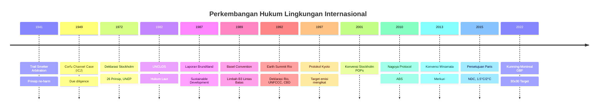
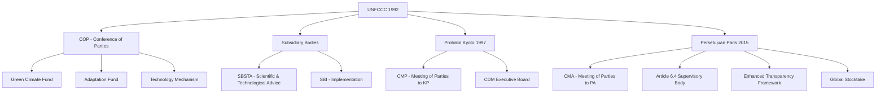
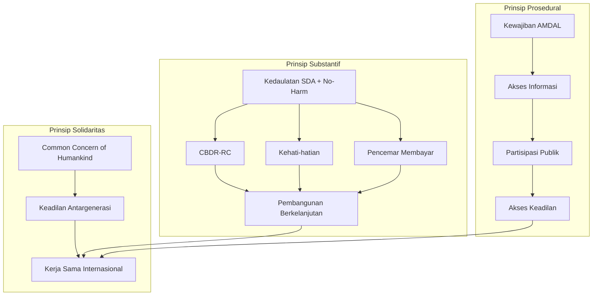
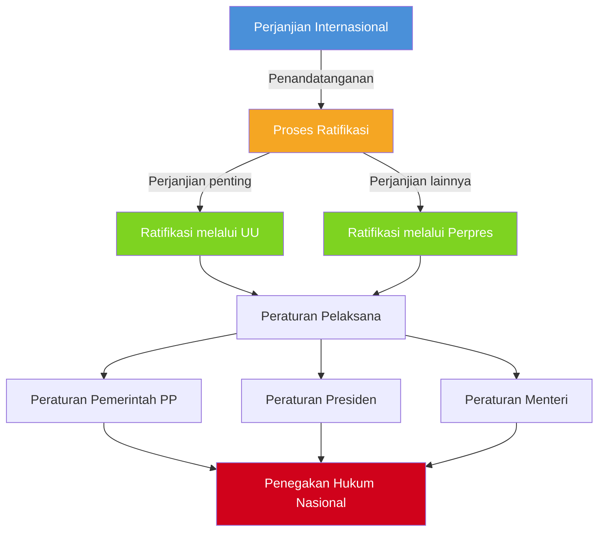

# Hukum Lingkungan Internasional

**Navigasi:**
- [[08_Penegakan_Hukum|← Penegakan Hukum]]
- [[README|↑ Index]]
- [[10_Isu_Kontemporer|Isu Kontemporer →]]

---

## Tujuan Pembelajaran

Setelah mempelajari bab ini, mahasiswa diharapkan mampu:

1. Menguraikan perkembangan historis hukum lingkungan internasional dari era pra-Stockholm hingga era pasca-Paris Agreement
2. Menganalisis prinsip-prinsip dalam Deklarasi Stockholm 1972 dan Deklarasi Rio 1992 beserta implikasinya terhadap hukum nasional Indonesia
3. Menjelaskan struktur dan mekanisme rezim hukum perubahan iklim internasional (UNFCCC, Protokol Kyoto, Persetujuan Paris)
4. Mengidentifikasi konvensi-konvensi lingkungan internasional utama beserta kewajiban negara pihak
5. Membedakan *hard law* dan *soft law* serta menjelaskan peran masing-masing dalam tata kelola lingkungan global
6. Menganalisis yurisprudensi internasional yang membentuk prinsip-prinsip hukum lingkungan internasional
7. Mengevaluasi proses transformasi hukum internasional ke dalam sistem hukum nasional Indonesia beserta tantangannya

---

## 1. Sejarah dan Perkembangan Hukum Lingkungan Internasional

### 1.1 Era Pra-Stockholm: Fondasi Awal

Hukum lingkungan internasional sebagai cabang hukum yang mandiri baru berkembang pada paruh kedua abad ke-20, namun fondasi prinsipnya telah diletakkan jauh lebih awal melalui yurisprudensi dan praktik negara. Dua putusan yang menjadi tonggak awal adalah *Trail Smelter Arbitration* (1941) dan *Corfu Channel Case* (1949).

**Trail Smelter Arbitration (Amerika Serikat v. Kanada, 1941)** merupakan kasus arbitrase pertama yang secara eksplisit menetapkan prinsip tanggung jawab negara atas kerusakan lingkungan lintas batas. Kasus ini bermula dari operasi pabrik peleburan di Trail, British Columbia, Kanada, yang menghasilkan emisi sulfur dioksida (SO₂) dalam jumlah besar. Emisi tersebut terbawa angin melintasi perbatasan internasional dan menyebabkan kerusakan pada lahan pertanian serta hutan di negara bagian Washington, Amerika Serikat. Tribunal arbitrase menetapkan prinsip yang sangat berpengaruh:

> "No State has the right to use or permit the use of its territory in such a manner as to cause injury by fumes in or to the territory of another or the properties or persons therein, when the case is of serious consequence and the injury is established by clear and convincing evidence."

Prinsip ini kemudian dikenal sebagai *no-harm rule* atau *sic utere tuo ut alienum non laedas*, yang menjadi salah satu fondasi terpenting dalam hukum lingkungan internasional. Prinsip Trail Smelter kemudian dikodifikasi dalam Prinsip 21 Deklarasi Stockholm dan Prinsip 2 Deklarasi Rio.

**Corfu Channel Case (Inggris Raya v. Albania, ICJ 1949)** meskipun bukan kasus lingkungan secara langsung, menetapkan prinsip umum bahwa setiap negara berkewajiban untuk tidak secara sadar membiarkan wilayahnya digunakan untuk tindakan yang bertentangan dengan hak-hak negara lain. Mahkamah Internasional (ICJ) menyatakan bahwa terdapat kewajiban setiap negara untuk tidak membiarkan wilayahnya digunakan untuk perbuatan yang melanggar hak negara lain (*obligation not to allow knowingly its territory to be used for acts contrary to the rights of other states*). Prinsip ini kemudian menjadi dasar bagi kewajiban *due diligence* dalam konteks perlindungan lingkungan lintas batas.

### 1.2 Konferensi Stockholm 1972: Titik Balik

United Nations Conference on the Human Environment yang diselenggarakan di Stockholm, Swedia, pada 5-16 Juni 1972 merupakan konferensi internasional pertama yang secara khusus membahas isu lingkungan hidup pada tingkat global. Konferensi ini dihadiri oleh perwakilan dari 113 negara dan menghasilkan tiga dokumen penting: Deklarasi Stockholm yang memuat 26 prinsip, Rencana Aksi untuk Lingkungan Hidup Manusia (*Action Plan for the Human Environment*), serta rekomendasi pembentukan United Nations Environment Programme (UNEP).

Deklarasi Stockholm memuat dua prinsip yang paling berpengaruh dalam perkembangan hukum lingkungan internasional. **Prinsip 1** mengakui hak fundamental manusia atas lingkungan hidup yang layak:

> "Man has the fundamental right to freedom, equality and adequate conditions of life, in an environment of a quality that permits a life of dignity and well-being, and he bears a solemn responsibility to protect and improve the environment for present and future generations."

Prinsip ini menjadi cikal bakal pengakuan hak atas lingkungan hidup yang sehat dalam berbagai konstitusi nasional, termasuk Indonesia melalui Pasal 28H ayat (1) UUD 1945 dan Pasal 65 UU 32/2009 tentang PPLH, sebagaimana dibahas dalam [[01_Konsep_Dasar_Prinsip|Bab 1: Konsep Dasar dan Prinsip]].

**Prinsip 21** merumuskan keseimbangan antara kedaulatan negara atas sumber daya alam dan tanggung jawab untuk tidak merugikan lingkungan negara lain:

> "States have, in accordance with the Charter of the United Nations and the principles of international law, the sovereign right to exploit their own resources pursuant to their own environmental policies, and the responsibility to ensure that activities within their jurisdiction or control do not cause damage to the environment of other States or of areas beyond the limits of national jurisdiction."

Konferensi Stockholm mendorong Indonesia untuk menyusun undang-undang lingkungan pertamanya, yaitu Undang-Undang Nomor 4 Tahun 1982 tentang Ketentuan-Ketentuan Pokok Pengelolaan Lingkungan Hidup (UULH), yang kemudian digantikan oleh UU 23/1997 dan selanjutnya UU 32/2009.

### 1.3 Komisi Brundtland dan *Our Common Future* (1987)

Pada tahun 1983, Majelis Umum PBB membentuk World Commission on Environment and Development (WCED) yang dipimpin oleh Gro Harlem Brundtland, Perdana Menteri Norwegia. Komisi ini menghasilkan laporan bersejarah berjudul *Our Common Future* (1987), yang merumuskan definisi pembangunan berkelanjutan (*sustainable development*) yang hingga kini menjadi acuan utama:

> "Sustainable development is development that meets the needs of the present without compromising the ability of future generations to meet their own needs."

Laporan Brundtland mengidentifikasi keterkaitan antara kemiskinan, ketidaksetaraan, dan degradasi lingkungan, serta menekankan perlunya pendekatan terpadu yang memadukan dimensi ekonomi, sosial, dan lingkungan dalam pembangunan. Konsep ini kemudian diadopsi secara luas dalam Deklarasi Rio 1992 dan menjadi landasan bagi seluruh kerangka hukum lingkungan internasional kontemporer. Di Indonesia, konsep pembangunan berkelanjutan diadopsi dalam Pasal 1 angka 3 UU 32/2009 dan menjadi salah satu asas penyelenggaraan perlindungan dan pengelolaan lingkungan hidup sebagaimana diatur dalam Pasal 2 huruf a undang-undang tersebut.

---

## 2. Deklarasi Rio 1992 dan Agenda 21

### 2.1 Konferensi Tingkat Tinggi Bumi (*Earth Summit*)

United Nations Conference on Environment and Development (UNCED), yang lebih dikenal sebagai *Earth Summit* atau KTT Bumi, diselenggarakan di Rio de Janeiro, Brasil, pada 3-14 Juni 1992. Konferensi ini merupakan pertemuan lingkungan terbesar yang pernah diselenggarakan pada masanya, dihadiri oleh delegasi dari 172 negara termasuk 108 kepala negara dan pemerintahan, serta ribuan perwakilan organisasi non-pemerintah. Earth Summit menghasilkan lima dokumen penting: Deklarasi Rio tentang Lingkungan dan Pembangunan (27 prinsip), Agenda 21, Pernyataan Prinsip tentang Hutan, serta membuka penandatanganan dua konvensi internasional yaitu UNFCCC dan CBD.

### 2.2 Prinsip-Prinsip Rio yang Fundamental

Deklarasi Rio memuat 27 prinsip yang menyempurnakan dan mengembangkan prinsip-prinsip Deklarasi Stockholm. Beberapa prinsip yang paling berpengaruh dan banyak diadopsi dalam hukum nasional berbagai negara termasuk Indonesia adalah sebagai berikut.

**Prinsip 2** merupakan reformulasi Prinsip 21 Stockholm dengan penambahan kata "developmental" yang mencerminkan pengakuan atas hak pembangunan:

> "States have, in accordance with the Charter of the United Nations and the principles of international law, the sovereign right to exploit their own resources pursuant to their own environmental and developmental policies, and the responsibility to ensure that activities within their jurisdiction or control do not cause damage to the environment of other States or of areas beyond the limits of national jurisdiction."

**Prinsip 7** merumuskan prinsip *Common But Differentiated Responsibilities and Respective Capabilities* (CBDR-RC) yang menjadi landasan fundamental bagi negosiasi lingkungan internasional, khususnya dalam rezim perubahan iklim:

> "States shall cooperate in a spirit of global partnership to conserve, protect and restore the health and integrity of the Earth's ecosystem. In view of the different contributions to global environmental degradation, States have common but differentiated responsibilities. The developed countries acknowledge the responsibility that they bear in the international pursuit of sustainable development in view of the pressures their societies place on the global environment and of the technologies and financial resources they command."

Prinsip ini mengakui bahwa meskipun semua negara memiliki tanggung jawab bersama atas lingkungan global, tanggung jawab tersebut dibedakan berdasarkan kontribusi historis terhadap degradasi lingkungan serta kapasitas ekonomi dan teknologi. Indonesia, sebagai negara berkembang, secara konsisten memperjuangkan implementasi prinsip CBDR-RC dalam negosiasi iklim internasional.

**Prinsip 10** menetapkan tiga pilar tata kelola lingkungan yang partisipatif, yang kemudian dikenal sebagai hak-hak prosedural lingkungan:

> "Environmental issues are best handled with the participation of all concerned citizens, at the relevant level. At the national level, each individual shall have appropriate access to information concerning the environment that is held by public authorities, including information on hazardous materials and activities in their communities, and the opportunity to participate in decision-making processes. States shall facilitate and encourage public awareness and participation by making information widely available. Effective access to judicial and administrative proceedings, including redress and remedy, shall be provided."

Ketiga pilar ini — akses informasi, partisipasi publik, dan akses keadilan — diadopsi dalam UU 32/2009 khususnya melalui Pasal 65 tentang hak setiap orang atas lingkungan hidup yang baik dan sehat, Pasal 62 tentang keterbukaan informasi, dan Pasal 66 tentang perlindungan bagi pejuang lingkungan, sebagaimana dibahas dalam [[06_Keadilan_Lingkungan|Bab 6: Keadilan Lingkungan]].

**Prinsip 15** merumuskan asas kehati-hatian (*precautionary principle*) yang menjadi salah satu prinsip paling berpengaruh dalam hukum lingkungan modern:

> "In order to protect the environment, the precautionary approach shall be widely applied by States according to their capabilities. Where there are threats of serious or irreversible damage, lack of full scientific certainty shall not be used as a reason for postponing cost-effective measures to prevent environmental degradation."

Prinsip ini diadopsi dalam Pasal 2 huruf f UU 32/2009 sebagai asas kehati-hatian dan telah diterapkan oleh pengadilan Indonesia, antara lain dalam putusan landmark kasus Mandalawangi sebagaimana dianalisis dalam [[11_Studi_Kasus|Bab 11: Studi Kasus]].

**Prinsip 16** merumuskan asas pencemar membayar (*polluter pays principle*):

> "National authorities should endeavour to promote the internalization of environmental costs and the use of economic instruments, taking into account the approach that the polluter should, in principle, bear the cost of pollution, with due regard to the public interest and without distorting international trade and investment."

Prinsip ini diadopsi dalam Pasal 2 huruf j UU 32/2009 dan menjadi dasar bagi berbagai instrumen ekonomi lingkungan di Indonesia, termasuk mekanisme perdagangan karbon dan pajak karbon sebagaimana dibahas dalam [[10_Isu_Kontemporer|Bab 10: Isu Kontemporer]].

**Prinsip 17** mewajibkan Analisis Mengenai Dampak Lingkungan (AMDAL) sebagai instrumen pengambilan keputusan nasional untuk kegiatan yang berpotensi menimbulkan dampak lingkungan signifikan. Kewajiban ini diadopsi dalam UU 32/2009 Pasal 22-35 tentang AMDAL, sebagaimana dibahas dalam [[05_AMDAL_Perizinan|Bab 5: AMDAL dan Perizinan]].

### 2.3 Agenda 21 dan Tindak Lanjut

Agenda 21 merupakan program aksi komprehensif untuk pembangunan berkelanjutan yang terdiri dari 40 bab dalam empat bagian utama: (1) dimensi sosial dan ekonomi, yang membahas kemiskinan, pola konsumsi, dinamika kependudukan, dan kesehatan; (2) konservasi dan pengelolaan sumber daya untuk pembangunan, mencakup atmosfer, lahan, hutan, keanekaragaman hayati, dan pengelolaan limbah; (3) penguatan peran kelompok-kelompok utama termasuk perempuan, pemuda, masyarakat adat, dan sektor swasta; serta (4) sarana pelaksanaan yang meliputi keuangan, alih teknologi, dan pengembangan kapasitas.

Konferensi lanjutan Rio+20 (2012) di Rio de Janeiro menghasilkan dokumen *The Future We Want* yang menegaskan kembali komitmen terhadap pembangunan berkelanjutan dan memulai proses perumusan Tujuan Pembangunan Berkelanjutan (*Sustainable Development Goals*/SDGs) yang diadopsi pada tahun 2015 melalui Agenda 2030. SDGs mencakup 17 tujuan dan 169 target yang mengintegrasikan dimensi ekonomi, sosial, dan lingkungan secara komprehensif.

---

## 3. Rezim Hukum Perubahan Iklim

### 3.1 UNFCCC (1992)

United Nations Framework Convention on Climate Change (UNFCCC) yang diadopsi pada tahun 1992 dan mulai berlaku pada 21 Maret 1994 merupakan kerangka hukum internasional utama untuk menangani perubahan iklim. Pasal 2 UNFCCC menetapkan tujuan utama konvensi:

> "The ultimate objective of this Convention... is to achieve... stabilization of greenhouse gas concentrations in the atmosphere at a level that would prevent dangerous anthropogenic interference with the climate system."

UNFCCC mengklasifikasikan negara pihak ke dalam dua kategori utama: negara Annex I (negara maju dan negara transisi ekonomi yang memiliki kewajiban pengurangan emisi) dan negara non-Annex I (negara berkembang termasuk Indonesia). Konvensi ini menetapkan beberapa prinsip fundamental dalam Pasal 3, termasuk prinsip CBDR-RC, prinsip kehati-hatian, hak atas pembangunan berkelanjutan, dan kewajiban negara maju untuk memimpin upaya mitigasi.

Indonesia meratifikasi UNFCCC melalui **Undang-Undang Nomor 6 Tahun 1994** tentang Pengesahan UNFCCC. Ratifikasi ini menandai komitmen awal Indonesia dalam rezim hukum perubahan iklim internasional.

### 3.2 Protokol Kyoto (1997)

Protokol Kyoto, yang diadopsi pada Conference of Parties (COP) ke-3 di Kyoto, Jepang, tahun 1997 dan mulai berlaku pada 16 Februari 2005, merupakan instrumen hukum pertama yang menetapkan target pengurangan emisi gas rumah kaca yang mengikat secara hukum bagi negara-negara maju (Annex I). Protokol ini menggunakan pendekatan *top-down* dengan menetapkan target agregat pengurangan emisi sebesar 5% di bawah tingkat emisi tahun 1990 selama periode komitmen pertama (2008-2012).

Protokol Kyoto memperkenalkan tiga mekanisme fleksibel yang inovatif: pertama, *Emissions Trading* yang memungkinkan perdagangan unit emisi antarnegara Annex I; kedua, *Joint Implementation* (JI) yang memungkinkan negara Annex I memperoleh kredit emisi dari proyek pengurangan emisi di negara Annex I lainnya; dan ketiga, *Clean Development Mechanism* (CDM) yang memungkinkan negara Annex I memperoleh kredit emisi dari proyek pengurangan emisi di negara berkembang. CDM memiliki signifikansi khusus bagi Indonesia karena memungkinkan masuknya investasi hijau dari negara maju untuk proyek-proyek mitigasi perubahan iklim di Indonesia.

Indonesia meratifikasi Protokol Kyoto melalui **Undang-Undang Nomor 17 Tahun 2004** tentang Pengesahan Kyoto Protocol to the UNFCCC.

### 3.3 Persetujuan Paris (2015)

Persetujuan Paris (*Paris Agreement*), yang diadopsi pada COP ke-21 di Paris pada 12 Desember 2015 dan mulai berlaku pada 4 November 2016, merupakan pergeseran paradigma fundamental dalam rezim hukum perubahan iklim. Berbeda dengan Protokol Kyoto yang bersifat *top-down*, Persetujuan Paris menggunakan pendekatan *bottom-up* melalui mekanisme *Nationally Determined Contribution* (NDC) di mana setiap negara pihak menentukan sendiri kontribusinya terhadap upaya mitigasi dan adaptasi perubahan iklim.

Pasal 2 Persetujuan Paris menetapkan tiga tujuan utama: pertama, menahan kenaikan suhu rata-rata global jauh di bawah 2°C di atas tingkat pra-industri dan mengupayakan pembatasan pada 1,5°C; kedua, meningkatkan kemampuan adaptasi terhadap dampak perubahan iklim dan membangun ketahanan iklim; dan ketiga, menyelaraskan aliran keuangan dengan jalur menuju pembangunan rendah emisi dan berketahanan iklim.

Pasal 6 Persetujuan Paris mengatur mekanisme pasar karbon internasional yang menggantikan mekanisme Protokol Kyoto, termasuk mekanisme perdagangan hasil mitigasi yang ditransfer secara internasional (*Internationally Transferred Mitigation Outcomes*/ITMO) berdasarkan Pasal 6.2, mekanisme baru yang menggantikan CDM berdasarkan Pasal 6.4, serta pendekatan non-pasar berdasarkan Pasal 6.8.

Indonesia meratifikasi Persetujuan Paris melalui **Undang-Undang Nomor 16 Tahun 2016** tentang Pengesahan Paris Agreement to the UNFCCC. Indonesia menyampaikan NDC yang menargetkan pengurangan emisi sebesar 29% secara mandiri (*unconditional*) dan 41% dengan bantuan internasional (*conditional*) pada tahun 2030 dibandingkan skenario bisnis seperti biasa (*business as usual*). Implementasi NDC di Indonesia diatur lebih lanjut melalui Perpres 98/2021 yang kemudian digantikan oleh **Perpres 110/2025** tentang Nilai Ekonomi Karbon, sebagaimana dibahas dalam [[10_Isu_Kontemporer|Bab 10: Isu Kontemporer]].

| Aspek | Protokol Kyoto (1997) | Persetujuan Paris (2015) |
|-------|----------------------|--------------------------|
| **Pendekatan** | *Top-down* (target ditetapkan) | *Bottom-up* (NDC ditentukan sendiri) |
| **Cakupan negara** | Hanya Annex I (negara maju) | Seluruh negara pihak |
| **Target** | Pengurangan 5% dari 1990 | Menahan kenaikan 1,5°C/2°C |
| **Mekanisme pasar** | CDM, JI, Emissions Trading | Pasal 6.2, 6.4, 6.8 |
| **Sifat komitmen** | Mengikat secara hukum | NDC bersifat sukarela, pelaporan wajib |
| **Transparansi** | Terbatas | Enhanced Transparency Framework |
| **Evaluasi** | Compliance Committee | Global Stocktake (5 tahun) |

### 3.4 Struktur Kelembagaan Rezim Iklim

---

## 4. Konvensi Keanekaragaman Hayati

### 4.1 Convention on Biological Diversity (CBD) 1992

Convention on Biological Diversity (CBD) diadopsi pada 5 Juni 1992 di Rio de Janeiro dan mulai berlaku pada 29 Desember 1993. CBD memiliki tiga tujuan utama: konservasi keanekaragaman hayati, pemanfaatan berkelanjutan komponen-komponennya, dan pembagian keuntungan yang adil dan merata dari pemanfaatan sumber daya genetik. Indonesia meratifikasi CBD melalui **Undang-Undang Nomor 5 Tahun 1994**.

Sebagai salah satu negara *megadiversity* yang terletak di dalam segitiga keanekaragaman hayati laut (*coral triangle*) dan memiliki sekitar 10-15% spesies dunia, Indonesia memiliki kepentingan fundamental terhadap efektivitas rezim CBD. Indonesia menempati peringkat kedua dunia dalam hal keanekaragaman hayati terestrial dan memiliki kekayaan laut yang tak tertandingi, dengan lebih dari 590 spesies karang keras, lebih dari 2.000 spesies ikan karang, dan ekosistem mangrove terluas di dunia.

### 4.2 Protokol Cartagena tentang Keamanan Hayati (2000)

Protokol Cartagena tentang Keamanan Hayati (*Cartagena Protocol on Biosafety*), yang diadopsi pada tahun 2000 dan mulai berlaku pada 11 September 2003, mengatur perpindahan lintas batas organisme hasil modifikasi genetik (*Living Modified Organisms*/LMO). Protokol ini menerapkan asas kehati-hatian sebagai dasar pengambilan keputusan terkait LMO dan mewajibkan prosedur *Advance Informed Agreement* (AIA) sebelum pengiriman LMO lintas batas. Indonesia meratifikasi Protokol Cartagena melalui **Undang-Undang Nomor 21 Tahun 2004**.

### 4.3 Protokol Nagoya tentang Akses dan Pembagian Keuntungan (2010)

Protokol Nagoya tentang Akses pada Sumber Daya Genetik dan Pembagian Keuntungan yang Adil dan Merata yang Timbul dari Pemanfaatannya (*Nagoya Protocol on Access and Benefit Sharing*/ABS) diadopsi pada COP ke-10 CBD di Nagoya, Jepang, pada tahun 2010. Protokol ini mengatur dua mekanisme utama: *Prior Informed Consent* (PIC) dari negara penyedia sumber daya genetik, dan *Mutually Agreed Terms* (MAT) untuk pembagian keuntungan antara penyedia dan pengguna sumber daya genetik. Indonesia meratifikasi Protokol Nagoya melalui **Undang-Undang Nomor 11 Tahun 2013**.

Bagi Indonesia sebagai negara kaya keanekaragaman hayati, Protokol Nagoya memiliki signifikansi strategis untuk melindungi sumber daya genetik nasional dari *biopiracy* dan memastikan bahwa pemanfaatan sumber daya genetik Indonesia oleh pihak asing memberikan manfaat yang adil bagi negara dan masyarakat lokal.

### 4.4 Kerangka Keanekaragaman Hayati Global Kunming-Montreal (2022)

Kunming-Montreal Global Biodiversity Framework (GBF), yang diadopsi pada COP ke-15 CBD di Montreal pada Desember 2022, menetapkan visi ambisius untuk hidup selaras dengan alam pada tahun 2050. GBF memuat 4 tujuan jangka panjang 2050 dan 23 target aksi 2030, termasuk target 30x30 yang mewajibkan konservasi efektif setidaknya 30% wilayah daratan, perairan darat, pesisir, dan lautan pada tahun 2030. Target ini memiliki implikasi signifikan bagi Indonesia mengingat luasnya kawasan konservasi yang perlu dikelola secara efektif.

---

## 5. Konvensi Limbah dan Bahan Berbahaya

### 5.1 Konvensi Basel (1989)

Basel Convention on the Control of Transboundary Movements of Hazardous Wastes and Their Disposal diadopsi pada 22 Maret 1989 di Basel, Swiss, dan mulai berlaku pada 5 Mei 1992. Konvensi ini lahir sebagai respons terhadap skandal pembuangan limbah beracun dari negara maju ke negara berkembang pada dekade 1980-an, yang dikenal sebagai *toxic colonialism*. Konvensi Basel bertujuan mengurangi pergerakan limbah berbahaya dan beracun (B3) lintas batas, mencegah transfer limbah B3 ke negara berkembang, serta memastikan pengelolaan limbah B3 yang berwawasan lingkungan (*environmentally sound management*).

Mekanisme utama Konvensi Basel adalah prosedur *Prior Informed Consent* (PIC), yang mewajibkan negara pengekspor untuk memberitahu dan mendapat persetujuan tertulis dari negara pengimpor sebelum melakukan pengiriman limbah B3 lintas batas. Pada tahun 1995, negara-negara pihak mengadopsi *Ban Amendment* yang melarang ekspor limbah B3 dari negara-negara OECD, Uni Eropa, dan Liechtenstein ke negara berkembang, baik untuk pembuangan akhir maupun daur ulang. Amendemen ini baru mulai berlaku pada 5 Desember 2019 setelah memenuhi kuorum ratifikasi.

Indonesia meratifikasi Konvensi Basel melalui **Keputusan Presiden Nomor 61 Tahun 1993** dan mengimplementasikannya melalui peraturan perundang-undangan nasional tentang pengelolaan limbah B3, termasuk **PP 22/2021** tentang Penyelenggaraan Perlindungan dan Pengelolaan Lingkungan Hidup. Dalam beberapa tahun terakhir, Indonesia telah mengembalikan kontainer limbah plastik impor ilegal ke negara asalnya, menunjukkan pelaksanaan konkret kewajiban Konvensi Basel.

### 5.2 Konvensi Stockholm tentang Bahan Pencemar Organik Persisten (2001)

Konvensi Stockholm tentang *Persistent Organic Pollutants* (POPs) diadopsi pada 22 Mei 2001 dan mulai berlaku pada 17 Mei 2004. Konvensi ini mengatur eliminasi atau pembatasan produksi dan penggunaan bahan kimia organik yang sangat persisten di lingkungan, bersifat bioakumulatif dalam rantai makanan, dan berpotensi menimbulkan dampak merugikan terhadap kesehatan manusia dan lingkungan. Konvensi ini awalnya mencakup 12 bahan kimia yang dikenal sebagai "Dirty Dozen" (termasuk aldrin, chlordane, DDT, dioxins, furans, dan PCB), yang kemudian terus bertambah melalui proses amandemen.

Indonesia meratifikasi Konvensi Stockholm melalui **Undang-Undang Nomor 19 Tahun 2009** dan telah menyusun National Implementation Plan (NIP) untuk eliminasi penggunaan POPs.

### 5.3 Konvensi Rotterdam (1998) dan Konvensi Minamata (2013)

Konvensi Rotterdam tentang *Prior Informed Consent Procedure for Certain Hazardous Chemicals and Pesticides in International Trade* (1998) mengatur prosedur PIC untuk perdagangan internasional bahan kimia berbahaya dan pestisida tertentu, memastikan bahwa negara pengimpor memiliki informasi lengkap dan dapat membuat keputusan yang terinformasi.

Konvensi Minamata tentang Merkuri (2013), yang dinamai berdasarkan tragedi keracunan merkuri di Teluk Minamata, Jepang, pada dekade 1950-an, mengatur pengurangan bertahap (*phase-down*) penggunaan merkuri secara global. Konvensi ini memiliki relevansi khusus bagi Indonesia mengingat masih maraknya pertambangan emas skala kecil (*Artisanal and Small-Scale Gold Mining*/ASGM) yang menggunakan merkuri, terutama di Kalimantan, Sulawesi, dan Nusa Tenggara. Indonesia meratifikasi Konvensi Minamata melalui **Undang-Undang Nomor 11 Tahun 2017**.

| Konvensi | Tahun Adopsi | Mulai Berlaku | Ratifikasi Indonesia | Substansi Utama |
|----------|-------------|---------------|---------------------|-----------------|
| Basel | 1989 | 1992 | Keppres 61/1993 | Limbah B3 lintas batas |
| Rotterdam | 1998 | 2004 | UU 10/2013 | PIC bahan kimia berbahaya |
| Stockholm (POPs) | 2001 | 2004 | UU 19/2009 | Eliminasi POPs |
| Minamata | 2013 | 2017 | UU 11/2017 | Pengurangan merkuri |

---

## 6. Hukum Laut dan Konservasi Spesies

### 6.1 UNCLOS Bagian XII: Perlindungan Lingkungan Laut

United Nations Convention on the Law of the Sea (UNCLOS) 1982, yang sering disebut sebagai "konstitusi laut" (*constitution of the oceans*), memuat Bagian XII (Pasal 192-237) yang secara komprehensif mengatur perlindungan dan pelestarian lingkungan laut. Pasal 192 menetapkan kewajiban umum bahwa "States have the obligation to protect and preserve the marine environment." Kewajiban ini bersifat *erga omnes* dan berlaku terhadap semua negara tanpa kecuali.

UNCLOS mengatur pencemaran laut dari enam sumber: pencemaran dari darat (*land-based sources*), pencemaran dari kegiatan di dasar laut (*seabed activities*), pencemaran dari kegiatan di Area (*activities in the Area*), pencemaran karena pembuangan (*dumping*), pencemaran dari kapal (*vessel-source pollution*), dan pencemaran dari atau melalui atmosfer (*from or through the atmosphere*). Setiap negara berkewajiban mengambil langkah-langkah untuk mencegah, mengurangi, dan mengendalikan pencemaran dari semua sumber tersebut.

Indonesia, sebagai negara kepulauan terbesar di dunia dengan lebih dari 17.000 pulau dan garis pantai sepanjang lebih dari 95.000 km, meratifikasi UNCLOS melalui **Undang-Undang Nomor 17 Tahun 1985**. UNCLOS memiliki signifikansi ganda bagi Indonesia: selain sebagai dasar pengakuan status negara kepulauan (*archipelagic state*), UNCLOS juga memberikan kerangka hukum untuk perlindungan lingkungan laut Indonesia yang sangat luas.

### 6.2 MARPOL 73/78

International Convention for the Prevention of Pollution from Ships (MARPOL) 1973 yang diamandemen oleh Protokol 1978 merupakan konvensi utama yang mengatur pencegahan pencemaran laut dari kapal. MARPOL terdiri dari enam Annex yang mengatur: minyak (Annex I), zat cair beracun curah (Annex II), bahan berbahaya dalam kemasan (Annex III), limbah dari kapal (Annex IV), sampah dari kapal (Annex V), dan pencemaran udara dari kapal (Annex VI). Indonesia telah meratifikasi MARPOL melalui **Peraturan Pemerintah Nomor 21 Tahun 2010**.

### 6.3 Konvensi Ramsar (1971) dan CITES (1973)

Konvensi Ramsar tentang Lahan Basah yang Memiliki Kepentingan Internasional (*Convention on Wetlands of International Importance*, 1971) merupakan perjanjian antar-pemerintah tertua dalam bidang lingkungan. Konvensi ini mewajibkan negara pihak untuk menunjuk setidaknya satu lahan basah untuk dimasukkan dalam Daftar Lahan Basah yang Memiliki Kepentingan Internasional dan menerapkan konsep pemanfaatan bijaksana (*wise use*) terhadap seluruh lahan basah di wilayahnya. Indonesia telah menunjuk beberapa situs Ramsar termasuk Taman Nasional Berbak, Danau Sentarum, dan Wasur.

Convention on International Trade in Endangered Species of Wild Fauna and Flora (CITES, 1973) mengatur perdagangan internasional spesies tumbuhan dan satwa liar yang terancam punah melalui sistem tiga appendiks: Appendiks I (spesies yang terancam punah dan perdagangan dilarang kecuali keadaan luar biasa), Appendiks II (spesies yang belum terancam punah tetapi perdagangannya harus dikendalikan), dan Appendiks III (spesies yang dilindungi oleh salah satu negara pihak). Indonesia meratifikasi CITES melalui **Keputusan Presiden Nomor 43 Tahun 1978**.

### 6.4 ASEAN Agreement on Transboundary Haze Pollution (2002)

Perjanjian ASEAN tentang Pencemaran Asap Lintas Batas diadopsi pada tahun 2002 sebagai respons terhadap krisis kabut asap berulang yang disebabkan oleh kebakaran hutan dan lahan di Asia Tenggara, khususnya di Indonesia, Malaysia, dan Brunei Darussalam. Perjanjian ini mewajibkan negara pihak untuk mengambil langkah-langkah pencegahan dan pengendalian kebakaran hutan dan lahan, serta mengatur mekanisme kerja sama regional dalam pemantauan, penanggulangan, dan pemulihan.

Indonesia, sebagai negara yang paling terdampak dan sekaligus sumber utama kabut asap regional, baru meratifikasi perjanjian ini pada tahun 2014 melalui **Undang-Undang Nomor 26 Tahun 2014**, menjadi negara ASEAN terakhir yang meratifikasi. Keterlambatan ratifikasi ini menimbulkan kritik dari negara-negara tetangga, khususnya Singapura dan Malaysia, yang secara rutin terdampak kabut asap dari kebakaran hutan dan lahan di Indonesia. Implikasi hukum dari perjanjian ini dibahas lebih lanjut dalam konteks kasus kebakaran hutan di [[11_Studi_Kasus|Bab 11: Studi Kasus]].

---

## 7. Soft Law dan Hard Law dalam Hukum Lingkungan Internasional

### 7.1 Pengertian dan Perbedaan

Dalam hukum internasional, perbedaan antara *hard law* dan *soft law* memiliki implikasi penting terhadap kekuatan mengikat, mekanisme penegakan, dan efektivitas implementasi norma-norma lingkungan.

**Hard law** merujuk pada instrumen hukum internasional yang mengikat secara hukum (*legally binding*) bagi negara-negara pihak, terutama perjanjian internasional (*treaties*), konvensi, dan protokol. Instrumen *hard law* tunduk pada prinsip *pacta sunt servanda* sebagaimana diatur dalam Pasal 26 Vienna Convention on the Law of Treaties (1969), yang menyatakan bahwa setiap perjanjian yang berlaku mengikat para pihak dan harus dilaksanakan dengan itikad baik. Contoh *hard law* lingkungan internasional meliputi UNFCCC, Persetujuan Paris, CBD, Konvensi Basel, dan UNCLOS.

**Soft law** merujuk pada instrumen yang tidak mengikat secara hukum namun memiliki pengaruh normatif yang signifikan, termasuk deklarasi, resolusi Majelis Umum PBB, pedoman (*guidelines*), kode etik (*codes of conduct*), dan standar sukarela. Meskipun tidak mengikat, instrumen *soft law* memainkan peran penting dalam pembentukan norma hukum lingkungan internasional melalui beberapa mekanisme: memberikan artikulasi dan interpretasi norma-norma yang ada, membentuk praktik negara yang dapat mengkristal menjadi hukum kebiasaan internasional, menjadi tahap antara menuju negosiasi perjanjian yang mengikat, serta mengisi kekosongan hukum di bidang-bidang yang belum tercakup perjanjian.

| Karakteristik | *Hard Law* | *Soft Law* |
|---------------|-----------|-----------|
| **Kekuatan mengikat** | Mengikat secara hukum | Tidak mengikat |
| **Contoh instrumen** | Konvensi, protokol, perjanjian | Deklarasi, resolusi, pedoman |
| **Penegakan** | Mekanisme *compliance* | Tekanan politik dan moral |
| **Presisi norma** | Biasanya lebih spesifik | Sering lebih umum dan fleksibel |
| **Proses adopsi** | Negosiasi panjang, ratifikasi | Lebih cepat, konsensus |
| **Contoh** | UNFCCC, CBD, Basel, Paris | Deklarasi Stockholm, Rio, SDGs |

### 7.2 Kristalisasi Soft Law menjadi Hard Law

Salah satu fenomena penting dalam hukum lingkungan internasional adalah proses kristalisasi norma *soft law* menjadi *hard law* atau hukum kebiasaan internasional. Prinsip 21 Deklarasi Stockholm (1972) yang awalnya bersifat *soft law* kini dianggap telah menjadi bagian dari hukum kebiasaan internasional berdasarkan praktik negara yang konsisten dan *opinio juris*. Demikian pula, kewajiban melakukan AMDAL untuk kegiatan yang berpotensi menimbulkan dampak lintas batas, yang awalnya hanya disebutkan dalam Prinsip 17 Deklarasi Rio (*soft law*), telah dinyatakan oleh ICJ dalam kasus Pulp Mills (2010) sebagai kewajiban berdasarkan hukum internasional umum.

---

## 8. Prinsip-Prinsip Hukum Lingkungan Internasional

### 8.1 Kedaulatan atas Sumber Daya Alam dan Prinsip *No-Harm*

Prinsip kedaulatan permanen atas sumber daya alam (*permanent sovereignty over natural resources*) berakar pada Resolusi Majelis Umum PBB 1803 (XVII) tahun 1962 dan kemudian ditegaskan dalam Prinsip 21 Deklarasi Stockholm dan Prinsip 2 Deklarasi Rio. Prinsip ini mengakui hak berdaulat setiap negara untuk mengeksploitasi sumber daya alam di wilayahnya sesuai dengan kebijakan lingkungan dan pembangunannya sendiri. Namun, kedaulatan ini dibatasi oleh prinsip *no-harm* (*sic utere tuo ut alienum non laedas*) yang mewajibkan setiap negara untuk memastikan bahwa kegiatan di dalam yurisdiksi atau kendalinya tidak menyebabkan kerusakan lingkungan di negara lain atau kawasan di luar yurisdiksi nasional.

### 8.2 CBDR-RC

Prinsip *Common But Differentiated Responsibilities and Respective Capabilities* (CBDR-RC) merupakan prinsip sentral dalam hukum lingkungan internasional, khususnya dalam rezim perubahan iklim. Prinsip ini, sebagaimana dirumuskan dalam Prinsip 7 Deklarasi Rio dan Pasal 3 ayat (1) UNFCCC, mengakui bahwa: pertama, semua negara memiliki tanggung jawab bersama (*common responsibility*) untuk melindungi lingkungan global; dan kedua, tanggung jawab tersebut dibedakan (*differentiated*) berdasarkan kontribusi historis terhadap masalah lingkungan dan kapasitas ekonomi serta teknologi masing-masing negara. Implementasi prinsip CBDR-RC terlihat jelas dalam struktur Protokol Kyoto yang hanya mewajibkan negara Annex I untuk menurunkan emisi, serta dalam Persetujuan Paris yang memberikan fleksibilitas bagi negara berkembang dalam menentukan NDC-nya.

### 8.3 Asas Kehati-hatian (*Precautionary Principle*)

Asas kehati-hatian, sebagaimana dirumuskan dalam Prinsip 15 Deklarasi Rio, merupakan salah satu prinsip yang paling luas diadopsi dalam hukum lingkungan nasional dan internasional. Prinsip ini mensyaratkan bahwa ketidakpastian ilmiah tidak boleh dijadikan alasan untuk menunda tindakan pencegahan terhadap kerusakan lingkungan yang serius atau tidak dapat dipulihkan. Dalam praktik, terdapat dua versi prinsip ini: versi lemah (*weak version*) yang mensyaratkan ancaman kerusakan yang "serius atau tidak dapat dipulihkan" sebagaimana dalam Prinsip 15 Rio, dan versi kuat (*strong version*) yang membalikkan beban pembuktian kepada pihak yang mengusulkan kegiatan yang berpotensi merusak.

Di Indonesia, asas kehati-hatian diadopsi dalam Pasal 2 huruf f UU 32/2009 dan telah diterapkan oleh Mahkamah Agung dalam putusan kasus Mandalawangi (MA No. 1794 K/Pdt/2004), sebagaimana dianalisis dalam [[07_Tanggung_Jawab_Mutlak|Bab 7: Tanggung Jawab Mutlak]] dan [[11_Studi_Kasus|Bab 11: Studi Kasus]].

### 8.4 Asas Pencemar Membayar (*Polluter Pays Principle*)

Asas pencemar membayar berasal dari rekomendasi OECD tahun 1972 yang menyatakan bahwa pencemar harus menanggung biaya pencegahan dan pengendalian pencemaran. Prinsip ini berkembang dari prinsip efisiensi ekonomi (*economic efficiency*) menjadi prinsip keadilan (*equity*) yang mendasari berbagai instrumen hukum lingkungan, termasuk pajak lingkungan, perdagangan emisi, kewajiban ganti rugi, dan pertanggungjawaban perdata atas kerusakan lingkungan. Di Indonesia, prinsip ini diadopsi dalam Pasal 2 huruf j UU 32/2009 dan menjadi landasan bagi instrumen ekonomi lingkungan termasuk perdagangan karbon (Perpres 110/2025).

### 8.5 Pembangunan Berkelanjutan (*Sustainable Development*)

Pembangunan berkelanjutan, sebagaimana didefinisikan oleh Komisi Brundtland dan ditegaskan dalam Deklarasi Rio, mengintegrasikan tiga dimensi: ekonomi, sosial, dan lingkungan. ICJ dalam putusan kasus Gabcikovo-Nagymaros (1997) mengakui pembangunan berkelanjutan sebagai konsep hukum internasional. Hakim Weeramantry dalam pendapat terpisahnya (*separate opinion*) bahkan menyatakan bahwa pembangunan berkelanjutan merupakan prinsip normatif hukum internasional.

### 8.6 Keprihatinan Bersama Umat Manusia dan Keadilan Antargenerasi

Konsep *common concern of humankind* digunakan dalam pembukaan UNFCCC dan CBD untuk menunjukkan bahwa perubahan iklim dan hilangnya keanekaragaman hayati merupakan keprihatinan bersama seluruh umat manusia yang memerlukan kerja sama internasional. Konsep ini berbeda dari *common heritage of mankind* yang digunakan dalam UNCLOS untuk sumber daya dasar laut di luar yurisdiksi nasional.

Prinsip keadilan antargenerasi (*intergenerational equity*), yang dikembangkan oleh Edith Brown Weiss, menyatakan bahwa generasi saat ini memiliki kewajiban *trusteeship* untuk menjaga kualitas lingkungan dan sumber daya alam bagi generasi mendatang. Prinsip ini tercermin dalam definisi pembangunan berkelanjutan dan diadopsi dalam UU 32/2009.

### 8.7 Kewajiban Analisis Dampak Lingkungan

Kewajiban melakukan Analisis Mengenai Dampak Lingkungan (AMDAL) untuk kegiatan yang berpotensi menimbulkan dampak lingkungan signifikan telah berkembang dari rekomendasi *soft law* (Prinsip 17 Deklarasi Rio) menjadi kewajiban hukum internasional. ICJ dalam putusan kasus Pulp Mills (2010) menyatakan secara tegas:

> "It may now be considered a requirement under general international law to undertake an environmental impact assessment where there is a risk that the proposed industrial activity may have a significant adverse impact in a transboundary context, in particular, on a shared resource."

Pernyataan ICJ ini menegaskan bahwa AMDAL bukan sekadar instrumen kebijakan nasional, melainkan kewajiban berdasarkan hukum internasional umum, khususnya dalam konteks kegiatan yang berpotensi menimbulkan dampak lintas batas. Hal ini memperkuat dasar hukum internasional bagi sistem AMDAL Indonesia sebagaimana diatur dalam Pasal 22-35 UU 32/2009 dan dibahas dalam [[05_AMDAL_Perizinan|Bab 5: AMDAL dan Perizinan]].

---

## 9. Yurisprudensi Internasional

### 9.1 Trail Smelter Arbitration (1941)

Sebagaimana telah disinggung pada Bagian 1.1, Trail Smelter Arbitration antara Amerika Serikat dan Kanada merupakan yurisprudensi pertama yang secara eksplisit menetapkan prinsip tanggung jawab negara atas pencemaran lingkungan lintas batas. Putusan ini menetapkan bahwa tidak ada negara yang berhak menggunakan atau mengizinkan penggunaan wilayahnya sedemikian rupa sehingga menimbulkan kerugian di wilayah negara lain. Prinsip ini menjadi fondasi bagi Prinsip 21 Deklarasi Stockholm dan Prinsip 2 Deklarasi Rio serta dikutip secara luas dalam literatur dan yurisprudensi hukum internasional selanjutnya.

### 9.2 Corfu Channel Case (ICJ, 1949)

Meskipun bukan kasus lingkungan, Corfu Channel Case menetapkan prinsip umum yang sangat relevan bahwa setiap negara berkewajiban untuk tidak membiarkan wilayahnya digunakan untuk perbuatan yang bertentangan dengan hak-hak negara lain. ICJ menyatakan adanya kewajiban setiap negara untuk memberitahu negara lain tentang bahaya yang diketahuinya di wilayahnya (*duty to notify*), yang kemudian menjadi dasar bagi kewajiban notifikasi dalam konteks lingkungan lintas batas, termasuk Pasal 198 UNCLOS dan prosedur notifikasi dalam Konvensi Espoo.

### 9.3 Nuclear Tests Cases (ICJ, 1974)

Dalam kasus Nuclear Tests (Australia v. Prancis; Selandia Baru v. Prancis, 1974), Australia dan Selandia Baru menggugat Prancis atas uji coba nuklir atmosferik di Polinesia Prancis yang menyebabkan jatuhan radioaktif (*radioactive fallout*) di wilayah mereka. Meskipun ICJ memutuskan kasus ini berdasarkan deklarasi unilateral Prancis untuk menghentikan uji coba (sehingga tidak perlu memutuskan meritnya), kasus ini penting karena menegaskan bahwa deklarasi unilateral negara dapat menciptakan kewajiban hukum yang mengikat dan memberikan preseden bagi pengajuan sengketa lingkungan lintas batas ke ICJ.

### 9.4 Gabcikovo-Nagymaros Project (ICJ, 1997)

Kasus Gabcikovo-Nagymaros (Hungaria v. Slovakia, 1997) merupakan kasus pertama di mana ICJ secara eksplisit mengakui konsep pembangunan berkelanjutan dalam konteks sengketa lingkungan internasional. Kasus ini melibatkan proyek bendungan bersama di Sungai Danube yang diperjanjikan melalui Treaty of Budapest 1977. Hungaria menghentikan proyeknya dengan alasan kekhawatiran lingkungan terhadap ekosistem Danube, sementara Slovakia (sebagai penerus Cekoslowakia) melanjutkan proyek secara sepihak.

ICJ dalam putusannya menyatakan bahwa kedua pihak harus bernegosiasi ulang dengan memperhatikan norma-norma hukum lingkungan yang baru berkembang dan konsep pembangunan berkelanjutan. Mahkamah menegaskan bahwa kebutuhan untuk mendamaikan pembangunan ekonomi dengan perlindungan lingkungan merupakan ekspresi dari konsep pembangunan berkelanjutan. Hakim Weeramantry dalam *separate opinion*-nya menyatakan secara lebih tegas:

> "The principle of sustainable development is thus a part of modern international law by reason not only of its inescapable logical necessity, but also by reason of its wide and general acceptance by the global community."

### 9.5 Pulp Mills on the River Uruguay (ICJ, 2010)

Kasus Pulp Mills (Argentina v. Uruguay, 2010) merupakan putusan ICJ yang paling signifikan dalam perkembangan hukum lingkungan internasional kontemporer. Argentina menggugat Uruguay atas pembangunan pabrik pulp di tepi Sungai Uruguay yang menjadi perbatasan kedua negara, dengan dalil bahwa pembangunan tersebut melanggar kewajiban berdasarkan Statute of the River Uruguay 1975.

ICJ dalam putusannya menetapkan tiga prinsip penting. Pertama, kewajiban melakukan AMDAL telah menjadi keharusan berdasarkan hukum internasional umum (*general international law*) untuk kegiatan yang berpotensi menimbulkan dampak lintas batas yang signifikan. Kedua, negara memiliki kewajiban *due diligence* yang berkelanjutan untuk mencegah, mengurangi, dan mengendalikan pencemaran serta kerusakan lingkungan lintas batas. Ketiga, prosedur notifikasi dan konsultasi merupakan kewajiban prosedural yang harus dipenuhi sebelum pelaksanaan kegiatan yang berpotensi berdampak lintas batas.

### 9.6 Yurisprudensi ITLOS

International Tribunal for the Law of the Sea (ITLOS) juga telah memberikan kontribusi penting terhadap yurisprudensi hukum lingkungan internasional. Dalam *Advisory Opinion on Responsibilities and Obligations of States Sponsoring Persons and Entities with Respect to Activities in the Area* (2011), ITLOS menetapkan bahwa negara sponsor memiliki kewajiban *due diligence* untuk memastikan bahwa kegiatan penambangan dasar laut yang mereka sponsori tidak merusak lingkungan laut. ITLOS juga menegaskan penerapan asas kehati-hatian dan kewajiban melakukan AMDAL sebelum kegiatan dimulai.

---

## 10. Peran Indonesia dalam Hukum Lingkungan Internasional

### 10.1 Sejarah Ratifikasi

Indonesia telah meratifikasi berbagai konvensi dan perjanjian lingkungan internasional utama. Berikut adalah tabel komprehensif ratifikasi Indonesia:

| Perjanjian Internasional | Instrumen Ratifikasi | Tahun |
|--------------------------|---------------------|-------|
| CITES (1973) | Keppres 43/1978 | 1978 |
| UNCLOS (1982) | UU 17/1985 | 1985 |
| Konvensi Wina tentang Lapisan Ozon (1985) | Keppres 23/1992 | 1992 |
| Protokol Montreal (1987) | Keppres 23/1992 | 1992 |
| Konvensi Basel (1989) | Keppres 61/1993 | 1993 |
| UNFCCC (1992) | UU 6/1994 | 1994 |
| CBD (1992) | UU 5/1994 | 1994 |
| UNCCD (1994) | Keppres 135/1998 | 1998 |
| Protokol Kyoto (1997) | UU 17/2004 | 2004 |
| Protokol Cartagena (2000) | UU 21/2004 | 2004 |
| Konvensi Stockholm POPs (2001) | UU 19/2009 | 2009 |
| Protokol Nagoya (2010) | UU 11/2013 | 2013 |
| Konvensi Rotterdam (1998) | UU 10/2013 | 2013 |
| ASEAN Haze Agreement (2002) | UU 26/2014 | 2014 |
| Persetujuan Paris (2015) | UU 16/2016 | 2016 |
| Konvensi Minamata (2013) | UU 11/2017 | 2017 |

### 10.2 Peran dalam Negosiasi Internasional

Indonesia memainkan peran aktif dalam negosiasi lingkungan internasional melalui berbagai forum dan kelompok negosiasi. Dalam konteks perubahan iklim, Indonesia merupakan anggota G77+China, kelompok negara berkembang yang memperjuangkan implementasi prinsip CBDR-RC. Indonesia juga tergabung dalam *Like-Minded Developing Countries* (LMDC) yang menekankan pentingnya hak atas pembangunan bagi negara berkembang. Pada COP ke-13 di Bali tahun 2007, Indonesia berperan penting sebagai tuan rumah yang menghasilkan *Bali Action Plan*, peta jalan menuju Persetujuan Paris.

Dalam konteks keanekaragaman hayati, Indonesia merupakan salah satu pendiri *Megadiverse Countries Group* yang mewakili 17 negara dengan keanekaragaman hayati tertinggi di dunia. Indonesia juga berperan aktif dalam Coral Triangle Initiative on Coral Reefs, Fisheries and Food Security (CTI-CFF) yang merupakan kemitraan multilateral enam negara di kawasan segitiga karang.

### 10.3 Tantangan Implementasi

Meskipun Indonesia telah meratifikasi sejumlah besar perjanjian lingkungan internasional, tantangan utama terletak pada implementasi dan penegakan. Kesenjangan antara ratifikasi dan implementasi efektif (*implementation gap*) disebabkan oleh beberapa faktor: kapasitas kelembagaan yang terbatas, kurangnya peraturan pelaksana yang memadai, tekanan pembangunan ekonomi, koordinasi antarlembaga yang lemah, serta keterbatasan sumber daya manusia dan keuangan. Selain itu, pendekatan dualis Indonesia terhadap hukum internasional mengharuskan setiap perjanjian internasional ditransformasikan ke dalam hukum nasional melalui proses ratifikasi sebelum dapat diterapkan, yang memerlukan waktu dan sumber daya tersendiri.

---

## 11. Transformasi Hukum Internasional ke Hukum Nasional

### 11.1 Sistem Dualisme Indonesia

Indonesia menganut sistem dualisme dalam hubungan antara hukum internasional dan hukum nasional, yang berarti bahwa perjanjian internasional tidak secara otomatis (*self-executing*) berlaku dalam sistem hukum nasional. Perjanjian internasional harus terlebih dahulu ditransformasikan melalui proses ratifikasi sebelum dapat diterapkan sebagai hukum nasional.

Undang-Undang Nomor 24 Tahun 2000 tentang Perjanjian Internasional mengatur bahwa ratifikasi perjanjian internasional dilakukan melalui dua bentuk instrumen: Undang-Undang untuk perjanjian yang menyangkut masalah politik, perdamaian, pertahanan, kedaulatan negara, atau keuangan negara, serta Keputusan Presiden (kini Peraturan Presiden) untuk perjanjian-perjanjian lainnya. Setelah diratifikasi, perjanjian internasional masih memerlukan peraturan pelaksana berupa Peraturan Pemerintah (PP) atau Peraturan Menteri (Permen) untuk dapat diimplementasikan secara operasional.

### 11.2 Proses Transformasi

### 11.3 Contoh Transformasi: Rezim Perubahan Iklim

Transformasi rezim hukum perubahan iklim ke dalam sistem hukum nasional Indonesia menunjukkan kompleksitas dan panjangnya proses transformasi. UNFCCC (1992) diratifikasi melalui UU 6/1994, Protokol Kyoto (1997) melalui UU 17/2004, dan Persetujuan Paris (2015) melalui UU 16/2016. Implementasi komitmen Indonesia di bawah Persetujuan Paris kemudian diterjemahkan ke dalam berbagai peraturan pelaksana, di antaranya Perpres 98/2021 tentang Penyelenggaraan Nilai Ekonomi Karbon yang kemudian digantikan oleh Perpres 110/2025, serta berbagai Peraturan Menteri yang mengatur aspek teknis perdagangan karbon, pelaporan emisi, dan instrumen ekonomi lainnya.

Namun demikian, proses transformasi seringkali menghadapi kesenjangan waktu (*time gap*) yang signifikan antara ratifikasi dan penerbitan peraturan pelaksana, serta kesenjangan substansi (*substance gap*) di mana peraturan pelaksana tidak sepenuhnya mengakomodasi seluruh kewajiban dalam perjanjian internasional. Tantangan ini menjadi perhatian penting dalam evaluasi kepatuhan Indonesia terhadap kewajiban hukum internasionalnya.

---

## Pertanyaan Diskusi

1. Bagaimana prinsip CBDR-RC dapat diterapkan secara adil dalam konteks perubahan iklim, mengingat emisi historis negara maju dan kebutuhan pembangunan negara berkembang? Evaluasi posisi Indonesia dalam negosiasi iklim internasional.
2. Bandingkan pendekatan *top-down* Protokol Kyoto dengan pendekatan *bottom-up* Persetujuan Paris. Manakah yang lebih efektif dalam mencapai tujuan mitigasi perubahan iklim dan mengapa?
3. Analysislah relevansi yurisprudensi Trail Smelter dan Pulp Mills terhadap permasalahan asap lintas batas di Asia Tenggara. Apakah ASEAN Haze Agreement sudah memadai sebagai kerangka hukum?
4. Bagaimana proses transformasi hukum internasional ke hukum nasional di Indonesia dapat diperbaiki untuk mengurangi kesenjangan implementasi?
5. Evaluasi peran *soft law* dalam perkembangan hukum lingkungan internasional. Apakah instrumen *soft law* lebih efektif daripada *hard law* dalam konteks tertentu?
6. Mengapa Indonesia baru meratifikasi ASEAN Agreement on Transboundary Haze Pollution pada tahun 2014, dan apa implikasi hukum dari keterlambatan ini?
7. Bagaimana putusan ICJ dalam kasus Pulp Mills (2010) memperkuat dasar hukum sistem AMDAL di Indonesia? Identifikasi implikasinya terhadap proyek-proyek pembangunan yang berdampak lintas batas di kawasan ASEAN.

---

## Dasar Hukum dan Referensi

> [!info] Cross-Vault Links
> Dokumen lengkap tersedia di vault `regulationvault`. Lihat [[_referensi/REGULATIONVAULT_LINKS|Daftar Lengkap Cross-Vault Links]]

### Instrumen Hukum Internasional

- Deklarasi Stockholm tentang Lingkungan Hidup Manusia, 1972
- Deklarasi Rio tentang Lingkungan dan Pembangunan, 1992
- Agenda 21, 1992
- United Nations Framework Convention on Climate Change (UNFCCC), 1992
- Kyoto Protocol to the UNFCCC, 1997
- Paris Agreement, 2015
- Convention on Biological Diversity (CBD), 1992
- Nagoya Protocol on ABS, 2010
- Cartagena Protocol on Biosafety, 2000
- Kunming-Montreal Global Biodiversity Framework, 2022
- Basel Convention on the Control of Transboundary Movements of Hazardous Wastes, 1989
- Stockholm Convention on POPs, 2001
- Rotterdam Convention on PIC, 1998
- Minamata Convention on Mercury, 2013
- United Nations Convention on the Law of the Sea (UNCLOS), 1982
- MARPOL 73/78
- CITES, 1973
- Ramsar Convention on Wetlands, 1971
- ASEAN Agreement on Transboundary Haze Pollution, 2002

### Undang-Undang Ratifikasi Indonesia

| UU/Keppres | Konvensi/Perjanjian | Tahun Ratifikasi |
|------------|---------------------|-----------------|
| Keppres 43/1978 | CITES | 1978 |
| UU 17/1985 | UNCLOS | 1985 |
| Keppres 61/1993 | Basel Convention | 1993 |
| UU 5/1994 | CBD | 1994 |
| UU 6/1994 | UNFCCC | 1994 |
| UU 17/2004 | Protokol Kyoto | 2004 |
| UU 21/2004 | Protokol Cartagena | 2004 |
| UU 19/2009 | Konvensi Stockholm POPs | 2009 |
| UU 11/2013 | Protokol Nagoya | 2013 |
| UU 10/2013 | Konvensi Rotterdam | 2013 |
| UU 26/2014 | ASEAN Haze Agreement | 2014 |
| UU 16/2016 | Persetujuan Paris | 2016 |
| UU 11/2017 | Konvensi Minamata | 2017 |

### Peraturan Perundang-undangan Nasional Terkait

- UU 4/1982 tentang Ketentuan-Ketentuan Pokok Pengelolaan Lingkungan Hidup
- UU 23/1997 tentang Pengelolaan Lingkungan Hidup
- UU 32/2009 tentang Perlindungan dan Pengelolaan Lingkungan Hidup
- UU 24/2000 tentang Perjanjian Internasional
- Perpres 98/2021 tentang Penyelenggaraan Nilai Ekonomi Karbon
- Perpres 110/2025 tentang Penyelenggaraan Nilai Ekonomi Karbon (pengganti)

### Yurisprudensi Internasional

- Trail Smelter Arbitration (US v. Canada, 1941)
- Corfu Channel Case (UK v. Albania, ICJ 1949)
- Nuclear Tests Cases (Australia/NZ v. France, ICJ 1974)
- Gabcikovo-Nagymaros Project (Hungary v. Slovakia, ICJ 1997)
- Pulp Mills on the River Uruguay (Argentina v. Uruguay, ICJ 2010)
- ITLOS Advisory Opinion on Seabed Mining (2011)

### Referensi Regulasi Lengkap
- [[_referensi/REGULATION_INDEX|Indeks Regulasi Lingkungan]]

---

## Daftar Pustaka

- Sands, Philippe & Peel, Jacqueline. (2018). *Principles of International Environmental Law*. 4th edition. Cambridge University Press.
- Birnie, Patricia, Boyle, Alan & Redgwell, Catherine. (2009). *International Law and the Environment*. 3rd edition. Oxford University Press.
- Mayer, Benoit. (2018). *The International Law on Climate Change*. Cambridge University Press.
- Brown Weiss, Edith. (1989). *In Fairness to Future Generations: International Law, Common Patrimony, and Intergenerational Equity*. Transnational Publishers.
- Kiss, Alexandre & Shelton, Dinah. (2007). *Guide to International Environmental Law*. Martinus Nijhoff.
- Bodansky, Daniel, Brunnée, Jutta & Hey, Ellen (eds.). (2007). *The Oxford Handbook of International Environmental Law*. Oxford University Press.
- Takdir Rahmadi. (2019). *Hukum Lingkungan di Indonesia*. Edisi ke-3. Rajawali Pers.
- Koesnadi Hardjasoemantri. (2012). *Hukum Tata Lingkungan*. Edisi ke-8. Gadjah Mada University Press.

---

**Navigasi:**
- [[08_Penegakan_Hukum|← Penegakan Hukum]]
- [[README|↑ Index]]
- [[10_Isu_Kontemporer|Isu Kontemporer →]]
