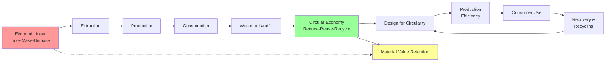

---
title: "Isu Kontemporer Hukum Lingkungan"
description: "Bab komprehensif tentang isu-isu hukum lingkungan kontemporer termasuk perdagangan karbon, polusi plastik, ESG, litigasi iklim, hak-hak alam, ekonomi sirkular, teknologi digital, dan transisi energi. Mengintegrasikan kerangka hukum Indonesia, peraturan internasional, dan studi kasus praktis."
date: 2026-04-09
tags:
  - hukum-lingkungan
  - kontemporer
  - carbon-trading
  - nilai-ekonomi-karbon
  - pajak-karbon
  - ESG
  - green-finance
  - litigasi-iklim
  - ekonomi-sirkular
  - hak-hak-alam
  - polusi-plastik
  - transisi-energi
aliases:
  - Isu Kontemporer Hukum Lingkungan
  - Contemporary Environmental Law Issues
  - Perpres 110/2025
  - Carbon Trading Indonesia
publish: true
---

# Isu Kontemporer Hukum Lingkungan

**Navigasi:**
- [[09_Hukum_Lingkungan_Internasional|← Hukum Lingkungan Internasional]]
- [[README|↑ Index]]
- [[11_Studi_Kasus|Studi Kasus →]]

---

## Tujuan Pembelajaran

Setelah mempelajari bab ini secara mendalam, mahasiswa mampu:

1. Menjelaskan mekanisme perdagangan karbon dan instrumen nilai ekonomi karbon (NEK) berdasarkan Perpres 110/2025 serta implikasinya terhadap pengurangan emisi gas rumah kaca.
2. Menganalisis tantangan regulasi polusi plastik di tingkat nasional dan global, termasuk mekanisme Extended Producer Responsibility (EPR) dan negosiasi perjanjian plastik global.
3. Memahami konsep dan implementasi ESG dalam konteks keuangan berkelanjutan Indonesia, mencakup Taksonomi Hijau dan kewajiban pelaporan keberlanjutan.
4. Mengevaluasi potensi dan tantangan litigasi iklim sebagai instrumen penegakan hukum lingkungan, dengan referensi kepada kasus-kasus landmark global dan prospek di Indonesia.
5. Mengidentifikasi kerangka hukum dan konsep filosofis gerakan hak-hak alam (rights of nature) serta relevansinya terhadap sistem hukum adat Indonesia.
6. Menerapkan prinsip ekonomi sirkular dalam pengelolaan limbah dan desain produk, termasuk menganalisis regulasi lingkaran ekonomi Indonesia.
7. Mengevaluasi peran teknologi digital dan artificial intelligence dalam pemantauan dan penegakan hukum lingkungan.

---

## 1. Perdagangan Karbon dan Nilai Ekonomi Karbon

### 1.1 Konsep Dasar dan Perkembangan Global

Perubahan iklim global memerlukan pengurangan emisi gas rumah kaca (GRK) yang signifikan dan terukur. Untuk mencapai target pengurangan emisi secara efisien, komunitas internasional telah mengembangkan mekanisme ekonomi yang memungkinkan mobilisasi sumber daya finansial besar-besaran. Perdagangan karbon (carbon trading) merupakan salah satu mekanisme paling penting dalam ekonomi keberlanjutan, menciptakan nilai ekonomi dari pengurangan emisi melalui pasar karbon yang telah berkembang pesat sejak diluncurkannya Protokol Kyoto pada 1997.

Pasar karbon global terbagi menjadi dua kategori utama. Pertama, pasar kepatuhan (compliance carbon market), di mana peserta diwajibkan berdasarkan peraturan untuk memiliki kredit karbon sesuai dengan batas emisi yang ditetapkan atau menghadapi sanksi administratif dan finansial. Kedua, pasar karbon sukarela (voluntary carbon market), di mana pembeli secara sukarela membeli kredit karbon untuk keperluan tanggung jawab sosial perusahaan atau komitmen iklim tambahan.

Pasar karbon kepatuhan terbesar di dunia adalah Emission Trading System (ETS) Uni Eropa, yang sejak diluncurkan pada 2005 telah menjadi driver utama perubahan industri Eropa menuju ekonomi rendah karbon. Harga karbon dalam EU ETS terus meningkat, mencerminkan peningkatan ambisi kebijakan iklim Eropa dan menciptakan insentif investasi yang kuat dalam energi terbarukan dan efisiensi energi.

### 1.2 Mekanisme Perdagangan Karbon: Cap and Trade vs Carbon Tax

Dua pendekatan utama untuk mengintegrasikan harga karbon dalam ekonomi adalah cap-and-trade dan carbon tax. Masing-masing pendekatan memiliki kelebihan dan kelemahan yang berbeda, dan pemilihan mekanisme bergantung pada konteks kebijakan nasional, infrastruktur administratif, dan karakteristik ekonomi suatu negara.

**Mekanisme Cap-and-Trade (Tutup dan Perdagangan):**

Dalam sistem cap-and-trade, regulator pemerintah menetapkan batas total emisi (cap) untuk suatu sektor atau ekonomi secara keseluruhan dalam periode tertentu. Batas ini secara bertahap dikurangi untuk mencapai target pengurangan emisi jangka panjang. Regulator kemudian mengalokasikan kuota emisi kepada perusahaan peserta—baik melalui pelelangan (auctioning), alokasi gratis (free allocation), atau kombinasi keduanya. Perusahaan yang mengurangi emisi lebih dari yang disyaratkan dapat menjual kredit karbon surplus mereka kepada perusahaan yang kesulitan mencapai target emisi mereka.

Keunggulan sistem cap-and-trade terletak pada kepastian lingkungan: total emisi dijamin tidak akan melampaui cap yang ditetapkan. Sistem ini juga memberikan fleksibilitas kepada perusahaan untuk memilih cara paling ekonomis bagi mereka untuk mengurangi emisi, menciptakan insentif inovasi teknologi rendah karbon. Namun, harga karbon dalam sistem cap-and-trade bersifat fluktuatif, tergantung pada permintaan dan penawaran di pasar, yang dapat menciptakan ketidakpastian bagi perencanaan investasi jangka panjang.

**Mekanisme Carbon Tax (Pajak Karbon):**

Dalam sistem pajak karbon, pemerintah menetapkan harga tetap per ton COâ‚‚ yang diemisikan atau dikonsumsikan dalam produk. Pajak ini dibebankan kepada produsen atau konsumen bahan bakar fosil, menciptakan insentif ekonomi untuk beralih ke energi terbarukan atau mengurangi konsumsi energi. Pendapatan dari pajak karbon dapat dialokasikan untuk berbagai tujuan, seperti investasi dalam energi terbarukan, perlindungan sosial, atau pengurangan pajak lainnya.

Keunggulan pajak karbon adalah kepastian harga dan kesederhanaan administrasi. Perusahaan mengetahui biaya karbon yang akan mereka hadapi, memudahkan perencanaan investasi. Pajak karbon juga lebih sederhana untuk diimplementasikan dibandingkan dengan sistem cap-and-trade kompleks yang memerlukan sistem registri, monitoring, dan perdagangan yang canggih. Namun, pajak karbon tidak memberikan kepastian tentang tingkat pengurangan emisi yang akan dicapai, karena respons pasar terhadap harga pajak dapat bervariasi.

### 1.3 Nilai Ekonomi Karbon (NEK) Indonesia: Perpres 110/2025

Indonesia telah membuat komitmen ambisius untuk berkontribusi pada pengurangan emisi global melalui rangkaian kebijakan iklim yang terintegrasi. Perpres No. 98/2021 tentang Nilai Ekonomi Karbon merupakan titik tolak kebijakan ini, diikuti dengan pembaruan dan pendalaman melalui Perpres No. 110/2025 tentang Implementasi Instrumen Nilai Ekonomi Karbon dan Pengendalian Emisi Gas Rumah Kaca Nasional.

Perpres 110/2025 menandai evolusi signifikan dalam kerangka kebijakan iklim Indonesia. Regulasi ini tidak hanya menggantikan Perpres 98/2021 tetapi juga memberikan spesifikasi yang lebih jelas tentang instrumen-instrumen NEK dan mekanisme implementasinya. Regulasi ini dikembangkan sebagai respons terhadap perkembangan perdagangan karbon global dan kebutuhan untuk meningkatkan transparansi serta akuntabilitas dalam sistem perdagangan karbon nasional.

Perpres 110/2025 secara eksplisit mengakui integrasi Indonesia ke dalam arsitektur pasar karbon global dan menetapkan kerangka kerja untuk implementasi mekanisme pasar internasional di bawah Perjanjian Paris. Regulasi ini juga menetapkan standar akuntansi karbon yang ketat, persyaratan verifikasi independen untuk kredit karbon, dan mekanisme registri terpusat untuk melacak penerbitan, perdagangan, dan pensiuman kredit karbon nasional.

**Instrumen Nilai Ekonomi Karbon menurut Perpres 110/2025:**

Regulasi ini menetapkan tiga instrumen utama NEK: perdagangan karbon (carbon trading), pembayaran berbasis hasil (results-based payment), dan pungutan atas karbon (carbon levy). Setiap instrumen dirancang untuk menciptakan insentif ekonomi yang mendorong pengurangan emisi sambil memberikan fleksibilitas kepada pemangku kepentingan untuk memilih strategi yang paling sesuai dengan situasi bisnis mereka.

Pertama, **perdagangan karbon** meliputi mekanisme cap-and-trade untuk sektor-sektor yang tercakup dalam sistem perdagangan emisi Indonesia dan mekanisme crediting (pemberian kredit) untuk proyek-proyek pengurangan emisi di sektor-sektor yang belum tercakup dalam cap-and-trade. Sistem cap-and-trade Indonesia awalnya dimulai dengan sektor pembangkitan listrik sebagai pilot, dengan rencana ekspansi ke sektor industri, transportasi, dan bangunan dalam fase-fase berikutnya.

Sistem ETS pilot untuk sektor pembangkitan listrik (power generation ETS) didasarkan pada cap yang disesuaikan secara bertahap, dimulai dengan total cap emisi tahunan yang ditetapkan berdasarkan baseline emisi historis dan target pengurangan emisi yang konsisten dengan kontribusi yang ditentukan secara nasional (NDC) Indonesia. Sektor pembangkitan listrik dipilih sebagai pilot karena tingkat emisinya yang terukur dengan baik, konsentrasi pembangkit listrik relatif kecil, dan potensi besar untuk pengurangan emisi melalui substitusi bahan bakar dari batu bara ke energi terbarukan.

Mekanisme crediting memungkinkan pengembang proyek untuk mengurangi emisi melalui investasi dalam teknologi rendah karbon, efisiensi energi, atau konservasi hutan, dan kemudian menjual kredit pengurangan emisi yang telah diverifikasi ke pasar. Mekanisme ini sangat penting untuk sektor-sektor yang sulit mencapai target emisi melalui perubahan operasional langsung.

Perpres 110/2025 juga mengakui peran pasar karbon sukarela (voluntary carbon market/VCM) dalam mobilisasi pembiayaan untuk proyek-proyek pengurangan emisi dan adaptasi perubahan iklim. VCM memungkinkan perusahaan, individu, dan organisasi untuk secara sukarela membeli kredit karbon yang dihasilkan dari proyek-proyek yang mengurangi emisi atau meningkatkan penyerapan karbon di luar keharusan regulasi. Pasar karbon sukarela Indonesia berkembang pesat, dengan volume transaksi meningkat signifikan sejak 2021, menarik investasi dari perusahaan-perusahaan multinasional yang ingin memenuhi komitmen net-zero mereka.

Kedua, **pembayaran berbasis hasil** dirancang khususnya untuk sektor pertanian, perhutanan, dan penggunaan lahan (FOLU), di mana Indonesia memiliki potensi besar untuk pengurangan emisi melalui pencegahan deforestasi dan degradasi hutan. Mekanisme ini, yang terinspirasi oleh program REDD+ (Reducing Emissions from Deforestation and Degradation) internasional, menghubungkan pembayaran finansial internasional langsung dengan hasil pengurangan emisi yang terukur dan diverifikasi.

REDD+ merupakan mekanisme yang dikembangkan di bawah Konvensi Kerangka Kerja PBB tentang Perubahan Iklim (UNFCCC), yang mengakui nilai ekonomi dari hutan yang masih berdiri dan menciptakan insentif finansial bagi negara-negara berkembang untuk melindungi hutan mereka. Indonesia telah menjadi pemimpin dalam implementasi REDD+, dengan persetujuan dari berbagai pemerintah internasional dan institusi keuangan untuk pembayaran hasil berbasis verifikasi independen tentang pengurangan emisi dari deforestasi dan degradasi hutan.

Implementasi REDD+ di Indonesia menghadirkan tantangan teknis dan institusional yang signifikan. Pertama, pengukuran dan verifikasi pengurangan emisi dari deforestasi memerlukan baseline yang jelas tentang tingkat deforestasi yang akan terjadi tanpa intervensi. Tingkat baseline ini sering menjadi subjek negosiasi yang ketat antara pemerintah Indonesia dan mitra internasional, karena baseline yang lebih tinggi memungkinkan Indonesia untuk menerima pembayaran lebih besar untuk pengurangan emisi yang kurang ambisius.

Kedua, manfaat finansial dari REDD+ harus didistribusikan kepada komunitas lokal dan masyarakat hukum adat yang hidup di dalam dan di sekitar hutan. Regulasi Indonesia, termasuk Permen LHK tentang Manfaat Sosial Ekonomi Perhutanan (Forest Tenure), mengatur mekanisme distribusi manfaat ini. Namun, implementasi dalam praktik telah menghadapi hambatan, dengan persentase manfaat yang relatif kecil mencapai komunitas lokal, sementara sebagian besar manfaat tertahan di tingkat nasional dan internasional.

Indonesia menerima pendapatan signifikan dari mekanisme pembayaran berbasis hasil untuk pelestarian hutan. Kemitraan dengan pemerintah donor internasional dan mekanisme keuangan iklim global seperti Green Climate Fund dan Hutan Hujan Tropis Dunia memungkinkan mobilisasi sumber daya tambahan untuk mendukung transisi ke ekonomi rendah karbon. Perpres 110/2025 mengintegrasikan REDD+ dan mekanisme pembayaran berbasis hasil ke dalam kerangka NEK Indonesia yang lebih luas, memungkinkan sinergi antara pasar karbon kepatuhan domestik dan pasar karbon internasional.

Perpres 110/2025 juga mengatur implementasi Artikel 6 Perjanjian Paris, yang memungkinkan perdagangan hasil mitigasi yang dapat ditransfer secara internasional (internationally transferred mitigation outcomes/ITMOs) antara negara-negara. Artikel 6 menciptakan peluang bagi Indonesia untuk menjual kredit karbon yang dihasilkan dari proyek pengurangan emisi nasional kepada negara-negara lain yang ingin memenuhi target kontribusi yang ditentukan secara nasional mereka. Regulasi ini menetapkan persyaratan akuntansi karbon yang ketat untuk mencegah "double counting" (penghitungan ganda), di mana pengurangan emisi yang sama diklaim oleh dua negara atau penjual dan pembeli secara bersamaan.

Ketiga, **pungutan atas karbon** mencakup berbagai instrumen kebijakan fiskal yang mengintegrasikan harga karbon dalam sistem perpajakan dan bea cukai nasional. Instrumen ini mencakup pajak karbon, bea masuk berbasis karbon, dan cukai khusus atas produk-produk dengan jejak karbon tinggi. Pungutan ini dirancang untuk menciptakan insentif konsumen dan produsen untuk memilih produk dan layanan dengan emisi karbon rendah.

### 1.4 Sektor-Sektor Tertanggung dan Implementasi

Perpres 110/2025 mengidentifikasi sektor-sektor yang akan dimasukkan secara bertahap ke dalam kerangka perdagangan karbon nasional. Sektor pembangkitan listrik merupakan sektor pertama yang diimplementasikan, mengingat sifat emisinya yang terukur dengan baik, ketersediaan data teknologi, dan pentingnya sektor ini dalam rencana transisi energi nasional.

Sektor industri energi intensif seperti semen, baja, dan pulp & paper akan dimasukkan dalam fase berikutnya. Sektor-sektor ini bertanggung jawab atas persentase signifikan dari total emisi industri Indonesia dan memiliki potensi pengurangan emisi yang besar melalui adopsi teknologi efisiensi dan transisi bahan bakar.

Sektor transportasi, termasuk penerbangan domestik, juga akan secara bertahap dimasukkan ke dalam sistem perdagangan karbon nasional, sejalan dengan integrasi transportasi Indonesia ke dalam sistem perdagangan karbon internasional yang sedang dikembangkan.

Sektor pertanian, kehutanan, dan penggunaan lahan (AFOLU) tetap menjadi fokus utama melalui mekanisme pembayaran berbasis hasil, mengingat kontribusi Indonesia yang signifikan terhadap pengurangan emisi global melalui pelestarian hutan dan lahan gambut.

### 1.5 Pajak Karbon dan UU HPP No. 7/2021

Selain mekanisme berbasis pasar melalui perdagangan karbon, Indonesia juga telah mengintegrasikan pajak karbon ke dalam sistem perpajakan nasional melalui UU No. 7/2021 tentang Harmonisasi Peraturan Perpajakan (UU HPP). Pasal 13 UU HPP memberikan dasar hukum untuk pengenaan pajak karbon atas emisi yang dihasilkan dari konsumsi bahan bakar fosil dan kegiatan produksi lainnya.

Pajak karbon dirancang sebagai insentif yang melengkapi sistem perdagangan karbon, menciptakan harga karbon yang konsisten di seluruh ekonomi. Pendapatan dari pajak karbon diperkirakan akan signifikan mengingat basis emisi Indonesia yang besar, dan pendapatan ini dapat dialokasikan untuk investasi dalam energi terbarukan, adaptasi perubahan iklim, dan perlindungan sosial untuk memastikan transisi yang adil bagi kelompok yang paling rentan terhadap dampak kebijakan iklim.

---

## 2. Polusi Plastik dan Negosiasi Perjanjian Plastik Global

### 2.1 Krisis Polusi Plastik Global dan Konteks Indonesia

Polusi plastik merupakan salah satu tantangan lingkungan paling mendesak di abad ke-21, dengan jutaan ton plastik masuk ke ekosistem laut setiap tahunnya. Polusi ini mengancam kehidupan laut, kesehatan manusia melalui mikroplastik yang masuk ke rantai makanan, dan merusak ekosistem terestrial melalui akumulasi limbah plastik yang tidak terdegradasi.

Indonesia menghadapi tantangan khusus dalam hal polusi plastik. Sebagai negara kepulauan dengan ekonomi berkembang pesat, Indonesia memiliki kombinasi faktor-faktor yang menyebabkan polusi plastik tinggi: populasi besar dengan daya beli meningkat (yang meningkatkan konsumsi produk kemasan plastik), infrastruktur pengelolaan limbah yang masih berkembang, dan geografi yang unik dengan banyak sungai yang mengalirkan limbah ke laut. Indonesia saat ini diidentifikasi sebagai salah satu dari beberapa negara yang memberikan kontribusi terbesar terhadap polusi plastik laut global.

Tantangan polusi plastik Indonesia dipersudutkan oleh beberapa faktor struktural. Pertama, tingkat pengelolaan limbah formal masih rendah, dengan persentase besar limbah plastik berakhir di tempat pembuangan sampah akhir (TPA) yang tidak terkelola dengan baik atau langsung masuk ke lingkungan. Kedua, infrastruktur daur ulang plastik masih sangat terbatas, dengan kapasitas pengolahan yang jauh tertinggal dari jumlah limbah yang dihasilkan. Ketiga, kesadaran konsumen tentang dampak lingkungan plastik masih berkembang, dengan pola konsumsi yang belum sepenuhnya mengintegrasikan prinsip ekonomi sirkular.

### 2.2 Negosiasi Perjanjian Plastik Global dan Proses INC

Komunitas internasional telah mengakui kebutuhan akan perjanjian multilateral yang mengikat untuk mengatasi polusi plastik. Pada UNEP ke-5 pada 2022, disetujui resolusi untuk membentuk komite negosiasi internasional (International Negotiating Committee/INC) yang akan mengembangkan instrumen internasional yang mengikat secara hukum tentang polusi plastik, termasuk sampah plastik laut.

Proses negosiasi INC telah berlangsung melalui serangkaian putaran negosiasi, dengan teks instrumen terus dikembangkan. Negosiasi ini mencakup isu-isu kritis seperti batasan produksi dan konsumsi plastik, keharusan desain produk yang berkelanjutan, sistem tanggung jawab produsen yang diperluas, standar perjalanan internasional untuk sampah plastik, dan mekanisme keuangan untuk mendukung implementasi di negara-negara berkembang.

Indonesia memainkan peran aktif dalam negosiasi ini, mengadvokasikan pendekatan yang menyeimbangkan kebutuhan lingkungan dengan kebutuhan pembangunan ekonomi negara-negara berkembang. Indonesia menekankan pentingnya dukungan finansial dan transfer teknologi dari negara-negara maju untuk membangun kapasitas pengelolaan limbah yang lebih baik di negara-negara berkembang.

### 2.3 Regulasi Plastik Sekali Pakai dan Kebijakan Nasional

Pada tingkat nasional, Indonesia telah mengembangkan serangkaian peraturan untuk mengatasi polusi plastik. PP No. 27/2020 tentang Pengelolaan Sampah Spesifik memberikan kerangka untuk pengelolaan limbah khusus yang sulit didaur ulang, termasuk banyak jenis plastik sekali pakai. Regulasi ini mengakui bahwa pengelolaan sampah spesifik memerlukan perlakuan khusus dan teknologi pengelolaan yang berbeda dari sampah organik atau yang mudah didaur ulang.

Lebih lanjut, Permen LHK No. 75/2019 tentang Peta Jalan Pengurangan Sampah oleh Produsen menetapkan kerangka untuk Extended Producer Responsibility (EPR) di Indonesia. Regulasi ini mengidentifikasi produsen—termasuk manufacturer, layanan makanan dan minuman, dan retail—sebagai pihak yang bertanggung jawab untuk mengurangi limbah dari produk dan kemasan mereka.

Peta jalan ini menetapkan target ambisius: pengurangan limbah sebesar 30% pada 2029. Target ini dicapai melalui tiga elemen inti: pengumpulan data baseline tentang limbah yang dihasilkan, implementasi strategi 3R (Reduce, Reuse, Recycle), dan penetapan target pengurangan tahunan yang progresif.

Implementasi Permen 75/2019 menghadapi tantangan signifikan. Regulasi ini pada dasarnya bersifat soft policy yang mengandalkan komitmen sukarela produsen. Tidak ada mekanisme penghargaan atau hukuman yang kuat untuk mendorong kepatuhan, dan tidak ada kuota spesifik untuk pengumpulan atau daur ulang yang diwajibkan. Antara 2020 dan 2023, hanya sedikit lebih dari 16.000 ton limbah plastik yang dikumpulkan melalui sistem EPR, angka yang jauh lebih kecil dari volume limbah plastik yang dihasilkan Indonesia secara keseluruhan.

### 2.4 Extended Producer Responsibility (EPR): Kerangka dan Tantangan Implementasi

Extended Producer Responsibility merupakan prinsip kebijakan di mana produsen membawa tanggung jawab finansial dan/atau fisik untuk produk mereka sepanjang siklus hidup produk, termasuk tahap end-of-life. Prinsip ini berbeda dengan model tradisional di mana tanggung jawab pengelolaan limbah jatuh sepenuhnya kepada pemerintah lokal atau konsumen.

EPR dirancang untuk menciptakan insentif bagi produsen untuk merancang produk yang lebih mudah didaur ulang, menggunakan bahan-bahan dengan konten daur ulang yang lebih tinggi, dan mengurangi kemasan yang tidak perlu. Dengan menempatkan biaya pengelolaan akhir hayat produk pada produsen, EPR secara teori mengubah insentif desain produk dan mendorong inovasi menuju ekonomi sirkular.

Implementasi EPR memerlukan infrastruktur yang kompleks: sistem pengumpulan yang efisien, fasilitas pemilahan dan daur ulang, tracking dan traceability mekanisme untuk memastikan akuntabilitas, dan mekanisme verifikasi independen. Banyak negara berkembang, termasuk Indonesia, masih membangun infrastruktur ini, menciptakan kesenjangan antara ambisi kebijakan EPR dan kapasitas implementasi praktis.

Indonesia sedang merancang regulasi untuk menjadikan EPR mandatory pada tahun 2025 dengan implementasi bertahap. Peraturan yang sedang dikembangkan ini akan mengidentifikasi kategori produk dan kemasan yang harus dikelola melalui EPR, menetapkan target pengurangan limbah, dan mengatur mekanisme pembiayaan dan pengumpulan yang mengalokasikan biaya pengelolaan akhir hayat kepada produsen.

---

## 3. ESG dan Keuangan Hijau (Green Finance) di Indonesia

### 3.1 Konsep ESG: Tiga Pilar Pengelolaan Berkelanjutan

Environmental, Social, and Governance (ESG) telah menjadi kerangka kerja dominan di pasar modal global untuk menilai keberlanjutan dan tanggung jawab sosial perusahaan. ESG mengintegrasikan tiga dimensi keberlanjutan korporat: dampak lingkungan (environmental), dampak sosial dan ketenagakerjaan (social), dan kualitas tata kelola dan transparansi (governance).

**Pilar Lingkungan (Environmental)** mencakup pengelolaan emisi gas rumah kaca, penggunaan energi terbarukan, manajemen air dan limbah, perlindungan keanekaragaman hayati, dan manajemen sumber daya alam. Indikator lingkungan yang sering diukur mencakup Scope 1, 2, dan 3 emissions, serta intensitas energi operasional.

Accounting karbon menurut standar Greenhouse Gas Protocol yang diakui secara global membedakan antara tiga kategori emisi. **Scope 1 emissions** mencakup emisi langsung yang dihasilkan dari sumber-sumber yang dimiliki atau dikendalikan langsung oleh perusahaan, seperti emisi dari pembakaran bahan bakar fosil di fasilitas produksi, emisi dari kendaraan perusahaan, dan emisi dari proses kimia dalam operasi produksi. **Scope 2 emissions** mencakup emisi tidak langsung dari pembelian listrik, uap, panas, dan pendingin yang dibeli dari utilitas untuk penggunaan dalam fasilitas perusahaan. Emisi Scope 2 diukur berdasarkan emisi karbon yang dihasilkan di fasilitas pembangkitan listrik yang memasok energi ke perusahaan, bukan di fasilitas perusahaan itu sendiri.

**Scope 3 emissions** merupakan kategori paling kompleks dan sering kali paling signifikan dalam jejak karbon keseluruhan perusahaan modern, mencakup semua emisi tidak langsung lainnya yang terjadi dalam rantai pasokan (supply chain) dan siklus hidup produk perusahaan. Ini termasuk emisi dari pengangkutan dan distribusi produk yang dibeli dan dijual, emisi dari penggunaan produk oleh konsumen akhir setelah penjualan, emisi dari pembuangan limbah produk, emisi dari perjalanan bisnis karyawan, dan emisi dari pembiayaan operasi dan investasi. Pengukuran Scope 3 emissions memerlukan kolaborasi dengan pemasok, distributor, dan mitra rantai pasokan lainnya, serta data-data tentang pola konsumsi konsumen dan tingkat daur ulang produk.

Pelaporan karbon yang komprehensif dan akurat menghadirkan tantangan teknis dan metodologis yang signifikan. Data untuk emisi Scope 1 dan 2 relatif lebih mudah dikumpulkan karena bersumber dari fasilitas-fasilitas yang dikendalikan langsung, tetapi pengumpulan data untuk Scope 3 memerlukan kolaborasi lintas organisasi dan transparansi dalam rantai pasokan. Banyak perusahaan Indonesia masih menghadapi kesulitan dalam mengumpulkan data Scope 3 yang akurat, terutama bagi perusahaan dengan rantai pasokan yang tersebar luas atau kompleks.

**Pilar Sosial (Social)** mencakup manajemen hubungan tenaga kerja, kesehatan dan keselamatan kerja (K3), hak asasi manusia, keadilan gender, pengembangan komunitas lokal, dan manajemen rantai pasokan yang bertanggung jawab. Perusahaan yang memiliki kinerja sosial yang kuat menunjukkan komitmen terhadap kesejahteraan karyawan, hubungan yang baik dengan komunitas lokal, dan praktik rantai pasokan yang etis.

**Pilar Tata Kelola (Governance)** mencakup struktur dewan direksi yang efektif, keberagaman dewan, sistem kontrol internal yang kuat, pencegahan korupsi, transparansi pelaporan keuangan, dan praktik remunerasi eksekutif yang adil. Tata kelola yang baik mencerminkan komitmen perusahaan terhadap akuntabilitas dan perlindungan kepentingan pemegang saham dan pemangku kepentingan lainnya.

### 3.2 Regulasi OJK tentang Keuangan Berkelanjutan

Otoritas Jasa Keuangan (OJK) Indonesia telah memainkan peran pemimpin dalam integrasi keberlanjutan ke dalam sistem keuangan nasional. POJK No. 51/2017 tentang Keuangan Berkelanjutan menetapkan kewajiban bagi lembaga jasa keuangan untuk mengintegrasikan keberlanjutan dalam operasi bisnis dan pengambilan keputusan investasi dan pembiayaan mereka.

POJK 51/2017 mewajibkan lembaga jasa keuangan untuk: (1) mengembangkan dan menerapkan Rencana Aksi Keuangan Berkelanjutan (RAKB) yang mengidentifikasi tujuan keberlanjutan jangka menengah dan panjang serta strategi untuk mencapainya; (2) mengintegrasikan aspek keberlanjutan dalam proses pengambilan keputusan investasi dan pembiayaan, termasuk penilaian risiko lingkungan dan sosial; (3) menerbitkan laporan keberlanjutan tahunan yang mengungkapkan kinerja keberlanjutan dan kemajuan terhadap target RAKB.

Regulasi ini telah mendorong perubahan signifikan dalam industri jasa keuangan Indonesia, dengan lembaga keuangan utama mengembangkan kerangka kerja keberlanjutan yang komprehensif dan menjalankan screening investasi yang mempertimbangkan faktor-faktor keberlanjutan.

Perkembangan penting dalam regulasi OJK adalah pengenalan persyaratan stress testing iklim dan analisis skenario risiko iklim untuk lembaga keuangan. OJK telah mengeluarkan pedoman untuk melakukan climate risk stress testing, di mana bank dan lembaga keuangan lainnya harus menganalisis dampak dari skenario iklim yang berbeda terhadap portofolio pembiayaan mereka. Stress testing ini mengevaluasi bagaimana pembiayaan untuk sektor-sektor yang terkena dampak iklim—seperti energi berbasis batu bara, pertanian yang rentan terhadap perubahan cuaca, dan properti yang rentan banjir—akan terpengaruh dalam skenario perubahan iklim yang berbeda (mitigasi agresif, perubahan berkelanjutan, atau hot house world).

Stress testing iklim mengungkap risiko sistemik dalam portfolio lembaga keuangan dan mendorong mereka untuk mengurangi eksposur terhadap aset-aset yang rentan terhadap perubahan iklim dan transisi ekonomi rendah karbon. Risiko transisi merujuk pada risiko keuangan yang muncul dari transisi ke ekonomi rendah karbon—misalnya, nilai kekurangan aset yang berinvestasi dalam batu bara atau energi fosil lainnya ketika permintaan global bergeser ke energi terbarukan. Risiko fisik merujuk pada risiko finansial langsung dari peristiwa iklim ekstrem (banjir, kekeringan, badai) dan perubahan iklim jangka panjang (naiknya permukaan laut, perubahan pola curah hujan).

### 3.3 Taksonomi Hijau Indonesia dan Taksonomi untuk Keuangan Berkelanjutan

Dalam upaya lebih lanjut untuk mengarahkan aliran modal menuju kegiatan ekonomi yang berkelanjutan, OJK mengembangkan Taksonomi Hijau Indonesia sebagai sistem klasifikasi kegiatan ekonomi berdasarkan dampak lingkungan mereka. Taksonomi ini memberikan panduan jelas kepada investor tentang kegiatan mana yang memenuhi kriteria "hijau," dan dengan demikian layak menerima pembiayaan hijau dengan syarat-syarat preferensial.

Taksonomi Hijau awal Indonesia (versi 1.0) diluncurkan pada 2022, dengan fokus awal pada sektor energi. Taksonomi ini mengklasifikasikan kegiatan menjadi kategori "Hijau," "Kuning," dan "Merah," berdasarkan kontribusi mereka terhadap tujuan lingkungan dan dampak negatif dari kegiatan tersebut. Kategori Hijau mencakup kegiatan yang memberikan kontribusi signifikan positif terhadap tujuan lingkungan dengan dampak negatif minimal. Kategori Kuning mencakup kegiatan yang memberikan kontribusi terhadap tujuan lingkungan tetapi dengan beberapa dampak negatif yang dapat diminimalkan melalui mitigasi. Kategori Merah mencakup kegiatan yang memiliki dampak lingkungan negatif yang signifikan dan tidak cocok untuk pembiayaan berkelanjutan dalam jangka panjang.

Perkembangan signifikan terjadi pada Februari 2024 ketika OJK meluncurkan Taksonomi untuk Keuangan Berkelanjutan Indonesia (TKBI), yang merupakan evolusi dari Taksonomi Hijau awal. TKBI mengubah klasifikasi dari tiga kategori warna menjadi dua kategori: "Hijau" dan "Transisi," dengan kategori ketiga "Tidak Memenuhi Klasifikasi" untuk kegiatan yang tidak memenuhi kriteria keberlanjutan.

Kategori "Hijau" dalam TKBI mencakup kegiatan ekonomi yang memberikan kontribusi substansial terhadap tujuan lingkungan (mitigasi perubahan iklim, adaptasi perubahan iklim, konservasi air, ekonomi sirkular, kontrol polusi) tanpa menyebabkan dampak negatif signifikan terhadap tujuan lingkungan lainnya. Kategori "Transisi" mencakup kegiatan yang tidak dapat diklasifikasikan sepenuhnya sebagai hijau pada saat ini, tetapi sedang dalam proses transisi menuju ekonomi rendah karbon atau berkelanjutan. Kategori ini penting untuk mengakui bahwa transisi ekonomi adalah proses gradual, dan kegiatan dalam kategori transisi (seperti pembangkit listrik tenaga gas alam sebagai bridge fuel menuju energi terbarukan) memainkan peran penting dalam mencapai target iklim.

TKBI versi 2, diluncurkan pada Februari 2025, memperluas cakupan ke sektor-sektor tambahan termasuk Konstruksi dan Real Estat (C&RE), Transportasi dan Penyimpanan (T&S), dan bagian-bagian dari Pertanian, Kehutanan, dan Penggunaan Lahan (AFOLU) termasuk sektor kehutanan dan perkebunan kelapa sawit. Perluasan ini mencerminkan pengakuan bahwa ekonomi Indonesia memerlukan transformasi di banyak sektor, dan bahwa mobilisasi investasi berkelanjutan memerlukan panduan yang komprehensif mencakup semua sektor ekonomi utama, bukan hanya energi.

Implementasi TKBI menghadirkan tantangan praktis bagi lembaga keuangan. Lembaga keuangan harus mengembangkan kapasitas analitik untuk mengevaluasi apakah suatu kegiatan ekonomi memenuhi kriteria Hijau atau Transisi. Ini memerlukan pemahaman mendalam tentang karakteristik teknis kegiatan, data limbah produksi, penggunaan energi, jejak karbon, dan potensi dampak negatif terhadap tujuan lingkungan lainnya. Selain itu, perbedaan antara kategori Transisi dan Tidak Memenuhi Klasifikasi dapat menjadi subjek interpretasi, menciptakan kebutuhan untuk panduan implementasi yang jelas dan konsisten dari OJK.

---

## 4. Pemantauan Lingkungan Digital dan Teknologi

### 4.1 Remote Sensing dan Monitoring Deforestasi Berbasis Satelit

Teknologi remote sensing—pengumpulan data tentang bumi dari jarak jauh menggunakan sensor di satelit atau pesawat—telah merevolusi kemampuan monitoring lingkungan. Untuk melacak deforestasi di hutan Indonesia yang luas, remote sensing menyediakan kemampuan pengamatan real-time dan near-real-time yang tidak mungkin dicapai melalui patroli lapangan tradisional saja.

Satelit dengan sensor optik dan sensor radar menyediakan data yang dapat digunakan untuk mengidentifikasi tutupan lahan, perubahan tutupan lahan, dan aktivitas logging. Data historis dari puluhan tahun memungkinkan para analis untuk melacak perubahan deforestasi dari waktu ke waktu dan mengidentifikasi hotspot deforestasi baru.

Platform seperti Global Forest Watch dan sistem monitoring nasional Indonesia seperti GTID (Ground Truthed.id) dan SIPASHUT menggunakan citra satelit untuk melacak deforestasi dan aktivitas logging. Sistem-sistem ini mengintegrasikan citra satelit dengan data-data lain seperti izin kehutanan, peta administratif, dan data-data lapangan.

### 4.2 Artificial Intelligence dan Machine Learning untuk Deteksi Deforestasi

Kualitas monitoring deforestasi berbasis satelit telah meningkat secara signifikan dengan penerapan algoritma artificial intelligence (AI) dan machine learning. Model-model machine learning dapat dilatih untuk mengenali pola-pola yang menunjukkan deforestasi, termasuk pembersihan area hutan, pembangunan jalan logging, dan aktivitas pemanenan kayu.

Sistem monitoring Indonesia telah mencapai tingkat akurasi detection yang signifikan—dengan confidence level untuk mendeteksi kehilangan vegetasi mencapai 82%—memungkinkan prioritisasi sumber daya penegakan hukum ke lokasi-lokasi dengan probabilitas tinggi deforestasi ilegal.

### 4.3 IoT untuk Monitoring Kualitas Air dan Teknologi Lainnya

Internet of Things (IoT) telah meningkatkan kemampuan monitoring kualitas air. Stasiun monitoring berbasis IoT dapat diletakkan di sungai, waduk, dan pantai untuk mengukur parameter-parameter seperti pH, oksigen terlarut, turbiditas, dan konsentrasi polutan secara real-time.

Teknologi drone juga telah menjadi alat penting dalam penegakan hukum lingkungan, memungkinkan inspeksi wilayah yang luas dengan biaya relatif rendah, dilengkapi dengan kamera visible, thermal, dan hyperspectral.

---

## 5. Litigasi Iklim (Climate Litigation)

### 5.1 Tren Global dalam Litigasi Iklim

Litigasi iklim telah meningkat secara eksponensial sebagai strategi untuk mendorong ambisi kebijakan iklim dan menuntut pertanggungjawaban dari pemerintah dan korporasi atas kegagalan mereka dalam mengatasi perubahan iklim. Laporan terbaru dari Grantham Research Institute at LSE melacak lebih dari 2.967 kasus litigasi iklim yang telah diajukan di seluruh dunia hingga akhir 2024, dengan 226 kasus baru diajukan hanya dalam tahun 2024.

Distribusi geografis menunjukkan bahwa Amerika Serikat memimpin dengan 1.899 kasus, diikuti Australia (164), United Kingdom (133), dan Brazil (131). Hampir 60% dari semua kasus litigasi iklim yang dilaporkan telah diajukan sejak 2020, menunjukkan akselerasi yang jelas dalam penggunaan litigasi sebagai alat penegakan hukum iklim.

Kasus-kasus litigasi iklim telah mencapai pengadilan tertinggi di banyak negara, dengan 276 kasus yang diidentifikasi telah mencapai apex courts (pengadilan konstitusional dan mahkamah agung) sejak 2015.

### 5.2 Jenis-Jenis Litigasi Iklim

Litigasi iklim dapat diklasifikasikan menjadi beberapa kategori berdasarkan target dan argumen hukum:

**Litigasi Melawan Pemerintah:** Menantang keputusan pemerintah yang dianggap tidak cukup ambisius dalam hal penurunan emisi atau adaptasi perubahan iklim. Kasus Urgenda v. Netherlands (2019) adalah contoh landmark di mana pengadilan Belanda memerintahkan pemerintah untuk meningkatkan target pengurangan emisi. Pengadilan menemukan bahwa kegagalan pemerintah Belanda untuk mencapai target pengurangan emisi yang cukup ambisius melanggar hak-hak fundamental warga, termasuk hak atas kehidupan dan kehidupan privat keluarga di bawah Konvensi Eropa tentang Hak Asasi Manusia.

Kasus Neubauer v. Germany (2021), yang diputuskan oleh Mahkamah Konstitusional Jerman (Bundesverfassungsgericht), menetapkan preseden penting bahwa undang-undang iklim yang tidak mengatur pengurangan emisi yang cukup setelah 2030 melanggar hak konstitusional generasi muda untuk masa depan yang berkelanjutan. Mahkamah menemukan bahwa Undang-Undang Perlindungan Iklim (Climate Protection Act) Jerman 2019, yang menetapkan target pengurangan emisi untuk 2030 tetapi tidak menetapkan target yang jelas untuk pengurangan emisi setelah 2030, melanggar Konstitusi Jerman karena memindahkan beban pengurangan emisi yang sangat berat kepada generasi muda. Keputusan ini secara efektif mengharuskan Jerman untuk mengadopsi target pengurangan emisi yang lebih ambisius untuk periode setelah 2030.

**Litigasi Melawan Korporasi:** Menyerang perusahaan atas tanggung jawab mereka terhadap dampak perubahan iklim dan pengurangan emisi yang tidak memadai. Kasus Milieudefensie v. Royal Dutch Shell (2021) di Belanda adalah contoh penting di mana pengadilan Amsterdam memerintahkan Royal Dutch Shell untuk mengurangi emisi COâ‚‚ dalam operasi dan portofolio energi mereka sebesar minimal 45% pada 2030 dibandingkan dengan tingkat emisi 2019. Pengadilan menemukan bahwa Shell memiliki tanggung jawab hukum sebagai perusahaan multinasional yang besar dan berpengaruh untuk mengatasi perubahan iklim melalui pengurangan emisi yang signifikan, bukan hanya investasi dalam energi terbarukan sambil terus memperluas operasi bahan bakar fosil. Keputusan ini menetapkan preseden bahwa perusahaan-perusahaan dapat dituntut untuk mengubah strategi bisnis mereka untuk mencapai konsistensi dengan pembatasan global pemanasan iklim.

**Litigasi Berbasis HAM:** Menggabungkan argumen perubahan iklim dengan argumen hak asasi manusia, menegaskan bahwa dampak perubahan iklim melanggar hak-hak fundamental manusia, termasuk hak atas kehidupan, kesehatan, air bersih, dan makanan. Pengadilan di beberapa negara telah mengakui bahwa kegagalan pemerintah untuk mengatasi perubahan iklim dapat merupakan pelanggaran terhadap hak-hak HAM yang dilindungi oleh konvensi internasional.

---

## 6. Gerakan Hak-Hak Alam (Rights of Nature)

### 6.1 Fondasi Filosofis dan Konseptual

Gerakan hak-hak alam (rights of nature) mewakili pergeseran paradigma fundamental dalam hubungan hukum antara manusia dan alam. Berbeda dengan pendekatan tradisional di mana alam diperlakukan sebagai objek hukum yang dapat dimiliki dan dimanfaatkan secara bebas oleh manusia, gerakan hak-hak alam mengakui alam sebagai subyek hukum yang memiliki hak-hak intrinsik yang harus dihormati dan dilindungi.

Gerakan ini diinformasikan oleh tradisi-tradisi filosofis dan intelektual yang beragam: deep ecology, yang menekankan nilai intrinsik dari semua kehidupan; Earth jurisprudence, yang mengembangkan kerangka hukum yang mengakui komunitas hidup bumi sebagai basis dari semua hukum; dan tradisi-tradisi indigenous knowledge tentang hubungan timbal balik antara komunitas manusia dan ekosistem alam.

### 6.2 Pengakuan Hak-Hak Alam dalam Hukum Internasional dan Nasional

Pengakuan hukum atas hak-hak alam telah muncul dalam konstitusi dan hukum nasional dari beberapa negara. Konstitusi Ekuador 2008 menjadi yang pertama mengakui "Pacha Mama" (Ibu Bumi) sebagai subyek hukum dengan hak-hak intrinsik (Pasal 71-74), memberikan tugas kepada pemerintah untuk "mencegah perusakan ekosistem dan memulihkan kondisi ekosistem yang telah rusak." Bolivia menerima Undang-Undang Ibu Pertiwi (Law of Mother Earth) pada 2010, yang mengakui bahwa Ibu Bumi adalah entitas hidup yang memiliki hak-hak fundamental untuk hidup, berkembang, dan regenerasi.

New Zealand mengakui sungai Te Awa Tupua (Sungai Whanganui) sebagai entitas hidup dengan hak sendiri melalui Te Awa Tupua Act 2017. Undang-undang ini mewakili pencapaian legislatif yang unik, di mana legislatur Selandia Baru secara eksplisit mengakui bahwa Te Awa Tupua memiliki "semua hak, kekuasaan, tugas, dan tanggung jawab dari seorang individu" di bawah hukum Selandia Baru. Praktis, ini berarti sungai memiliki representasi hukum melalui "Te Ture Whenua" (guardian), yang bertanggung jawab untuk melindungi kepentingan sungai dalam segala hal hukum.

Pengakuan Te Awa Tupua sebagai entitas hidup bersumber pada pengetahuan tradisional Maori, yang memandang sungai sebagai bagian integral dari ekosistem dan komunitas yang hidup bersama dalam hubungan timbal balik. Proses legislatif yang menghasilkan Te Awa Tupua Act melibatkan kolaborasi ekstensif antara pemerintah Selandia Baru dan iwi (tribù) Maori, menunjukkan bagaimana hak-hak alam dapat diintegrasikan ke dalam kerangka hukum modern melalui penghormatan terhadap pengetahuan indigenous.

Di India, Pengadilan Tertinggi India telah secara progresif mengakui hak-hak beberapa sungai—termasuk Sungai Ganges dan Yamuna—sebagai entitas hidup dengan hak untuk hidup, mengalir, dan berkelanjutan dalam keputusan landmark. Pengadilan menemukan bahwa sungai-sungai ini, yang secara tradisional dianggap suci dalam keagamaan Hindu, harus diperlakukan sebagai entitas hidup dengan hak konstitusional untuk perlindungan dan pelestarian. Kolumbia juga telah mengakui hak-hak Sungai Atrato melalui keputusan pengadilan konstitusional (Court of Constitutional), yang menghadirkan mekanisme perlindungan hukum untuk ekosistem sungai yang kritis.

### 6.3 Relevansi terhadap Kerangka Hukum Indonesia

Indonesia memiliki fondasi hukum unik untuk pengembangan konsep hak-hak alam melalui sistem hukum adat (adat law) dan konstitusi yang mengakui masyarakat hukum adat serta hak-hak tradisional mereka. Konstitusi Indonesia 1945 menyatakan bahwa negara mengakui dan menghormati kesatuan-kesatuan masyarakat hukum adat beserta hak-hak tradisional mereka (Pasal 18B ayat 2).

Banyak tradisi adat Indonesia mengakui hubungan timbal balik antara komunitas manusia dan alam yang selaras dengan filosofi rights of nature. Konsep seperti "tanah ulayat" (tanah adat bersama) atau "wilayah ulayat" mencerminkan pemahaman bahwa komunitas manusia dan ekosistem alam membentuk satu kesatuan yang tidak dapat dipisahkan. Tanah ulayat dalam hukum adat bukan sekadar properti yang dapat dimiliki dan diexploitasi secara bebas, tetapi merupakan entitas dengan makna spiritual dan ekologis yang wajib dijaga dan dilindungi oleh komunitas adat untuk generasi mendatang.

Dalam beberapa komunitas adat Indonesia, konsep "tana bersama" (tanah komunal) melibatkan pola pengelolaan sumber daya alam yang menekankan keberlanjutan jangka panjang, konservasi keanekaragaman hayati, dan keseimbangan antara ekstraksi sumber daya dan regenerasi ekosistem. Sistem hukum adat ini sering menggabungkan larangan terhadap aktivitas yang dianggap merusak ekosistem, sistem rotasi pengguna yang memastikan tidak ada bagian dari wilayah adat yang mengalami eksploitasi berlebihan dalam jangka panjang, dan mekanisme sanksi sosial yang kuat bagi mereka yang melanggar aturan-aturan pengelolaan sumber daya alam komunal.

Pengembangan konsep hak-hak alam di Indonesia dapat dimulai dari pengakuan dan penguatan hak-hak masyarakat hukum adat dalam mengelola dan melindungi wilayah tradisional mereka. Mahkamah Konstitusi Indonesia telah mengembangkan jurisprudence penting melalui putusan-putusan seperti MK No. 35/PUU-X/2012 yang mengakui hak-hak masyarakat hukum adat atas tanah adat mereka. Pengadilan Indonesia dapat melanjutkan pengembangan ini dengan mengakui bahwa hutan-hutan adat, sungai-sungai, dan ekosistem lain memiliki status hukum yang dilindungi tidak hanya sebagai aset ekonomi tetapi sebagai entitas yang memiliki nilai intrinsik yang wajib dihormati dan dilindungi. Integrasi hak-hak alam ke dalam sistem hukum Indonesia dapat memperkuat perlindungan terhadap wilayah adat sambil memberikan validitas hukum kepada cara pandang tradisional Indonesia tentang hubungan manusia dengan alam.

---

## 7. Ekonomi Sirkular dan Kebijakan Pengelolaan Limbah

### 7.1 Transisi dari Ekonomi Linear ke Sirkular

Ekonomi tradisional mengikuti model linear "take-make-dispose": sumber daya alam diambil, diproses menjadi produk, digunakan oleh konsumen, dan kemudian dibuang sebagai limbah. Ekonomi sirkular (circular economy) menawarkan alternatif paradigma di mana nilai material dan energi dipertahankan dalam ekonomi selama mungkin, melalui desain produk untuk durabilitas dan daur ulang, penggunaan kembali (reuse) dari produk dan bahan, dan degradasi biologis yang terkontrol dari material organik.

### 7.2 Kerangka Regulasi Ekonomi Sirkular Indonesia

Indonesia telah mengembangkan kerangka regulasi untuk mendorong transisi ke ekonomi sirkular. PP No. 27/2020 tentang Pengelolaan Sampah Spesifik menetapkan persyaratan khusus untuk pengelolaan limbah yang sulit didaur ulang. Permen LHK No. 75/2019 tentang Peta Jalan Pengurangan Sampah oleh Produsen menetapkan kerangka kerja untuk Extended Producer Responsibility (EPR).

Peta jalan ini menetapkan target progresif: pengurangan limbah 20% pada 2025, 25% pada 2027, dan 30% pada 2029. Strategi utama mencakup Reduce (Pengurangan), Reuse (Penggunaan Kembali), dan Recycle (Daur Ulang).

---

## 8. Transisi Energi dan Hukum Energi Terbarukan

### 8.1 Just Energy Transition Partnership (JETP) Indonesia

Indonesia telah menjadi pusat upaya global untuk transisi energi yang adil melalui Just Energy Transition Partnership (JETP), sebuah kemitraan antara pemerintah Indonesia dan sekelompok negara-negara donor (termasuk Jepang, Amerika Serikat, Inggris, Perancis, Denmark, dan Norwegia) untuk mobilisasi pendanaan besar-besaran bagi akselerasi transisi dari energi berbasis batu bara ke energi terbarukan. JETP diinisiasikan pada COP26 di Glasgow pada 2021 dan telah berkembang menjadi salah satu inisiatif pembiayaan iklim terbesar untuk negara berkembang.

Target JETP yang direvisi mencakup: pembatasan emisi sektor ketenagalistrikan pada-grid sebesar 250 MtCOâ‚‚ pada 2030 (turun dari proyeksi business-as-usual sebesar 400+ MtCOâ‚‚), peningkatan pangsa energi terbarukan dalam pembangkitan listrik on-grid menjadi 44% pada 2030 (naik dari sekitar 12% pada 2021), dan pencapaian net-zero dalam sistem ketenagalistrikan on-grid pada 2050. Kemitraan ini diharapkan untuk memobilisasi USD 20 miliar dalam pendanaan publik dan privat untuk mendukung transisi ini.

Implementasi JETP melibatkan koordinasi kompleks antara berbagai stakeholder pemerintah, perusahaan energi, pengembang proyek, dan lembaga keuangan internasional. Pertama, mobilisasi pembiayaan JETP memerlukan perusahaan energi terbarukan, pengembang proyek, dan perusahaan teknologi untuk mengidentifikasi peluang investasi yang bankable dengan skalabilitas dan return on investment yang jelas. Kedua, implementasi memerlukan reformasi regulasi ketenagalistrikan Indonesia, termasuk perubahan pada struktur tarif listrik, aturan akses grid (grid interconnection), dan mekanisme kompensasi untuk pengembang energi terbarukan yang adil dan transparan. Ketiga, transisi yang adil (just transition) memerlukan dukungan komprehensif kepada pekerja industri batubara dan komunitas yang bergantung pada industri pertambangan batubara, termasuk program retraining dan pengembangan keterampilan baru, investasi dalam ekonomi alternatif lokal, dan perlindungan sosial untuk memastikan transisi yang tidak meninggalkan kelompok-kelompok yang paling rentan.

Implementasi JETP juga mencakup fase-out progresif pembangkit listrik berbasis batubara yang tidak efisien dan tua (subcritical coal plants). Indonesia telah menetapkan target untuk menonaktifkan pembangkit listrik batubara yang tertua dan paling polutan sebelum akhir umur operasi mereka yang diharapkan, dengan kebijakan ini didukung oleh mekanisme pembiayaan untuk kompensasi kepada pemilik pembangkit listrik. Target fase-down batubara mencakup: pengurangan penggunaan batubara untuk pembangkitan listrik sebesar 40% pada 2030 dibandingkan dengan skenario tanpa tindakan (business-as-usual), dan eliminasi lengkap pembangkit listrik batubara dari sistem ketenagalistrikan on-grid pada 2050.

### 8.2 Pengaturan Regulasi untuk Energi Terbarukan dan Carbon Capture and Storage

Perpres No. 112/2022 tentang Akselerasi Penggunaan Energi Terbarukan untuk Pembangkitan Tenaga Listrik menetapkan target ambisius untuk penambahan kapasitas energi terbarukan dan memberikan insentif fiskal kepada pengembang proyek energi terbarukan. Regulasi ini menciptakan kerangka kerja yang menguntungkan untuk investasi dalam tenaga surya, angin, panas bumi, dan energi terbarukan lainnya melalui mekanisme seperti power purchase agreements (PPA) yang transparan, prioritas grid akses untuk energi terbarukan, dan insentif perpajakan untuk perusahaan yang berinvestasi dalam energi terbarukan.

Selain energi terbarukan, transisi energi Indonesia juga mengakui peran dari teknologi Carbon Capture and Storage (CCS)—teknologi yang menangkap emisi CO₂ dari sumber-sumber emisi stasioner (seperti pembangkit listrik atau fasilitas industri) atau dari udara, dan kemudian menyimpan CO₂ secara permanen di bawah tanah. CCS dianggap sebagai teknologi bridge penting dalam transisi ke ekonomi net-zero, terutama untuk sektor-sektor industri di mana dekarbonisasi sepenuhnya melalui perubahan teknologi dasar masih tidak feasible dalam jangka menengah.

Perpres 110/2025 mengakui CCS sebagai salah satu metode untuk menghasilkan kredit pengurangan emisi yang dapat diperdagangkan dalam sistem perdagangan karbon Indonesia. Kerangka regulasi CCS di Indonesia sedang dikembangkan, mencakup standar teknis untuk penangkapan, transportasi, dan penyimpanan COâ‚‚, mekanisme akuntansi karbon untuk memastikan pengurangan emisi yang dapat diverifikasi, persyaratan lingkungan dan sosial untuk proyek CCS, dan mekanisme liability jangka panjang untuk memastikan COâ‚‚ yang tersimpan tidak bocor kembali ke atmosfer selama ratusan atau ribuan tahun ke depan.

Implementasi CCS di Indonesia menghadirkan tantangan teknis, ekonomi, dan regulasi yang signifikan. Secara teknis, teknologi penangkapan COâ‚‚ masih relatif mahal, dan deposito geologi yang cocok untuk penyimpanan COâ‚‚ permanen masih belum sepenuhnya dipetakan di Indonesia. Secara ekonomi, proyek CCS memerlukan dukungan pembiayaan jangka panjang dan steady revenue stream dari penjualan kredit COâ‚‚ untuk menjadi viable. Secara regulasi, Indonesia perlu mengembangkan framework yang jelas tentang kepemilikan dan manajemen risiko dari COâ‚‚ yang tersimpan, perlindungan lingkungan untuk memastikan integritas formasi geologi yang digunakan untuk penyimpanan, dan mekanisme monitoring jangka panjang untuk memverifikasi bahwa penyimpanan COâ‚‚ tetap aman dan permanent.

---

## Pertanyaan Refleksi dan Diskusi

1. Bagaimana mekanisme perdagangan karbon dapat dirancang untuk memastikan bahwa pengurangan emisi adalah nyata dan tidak hanya transfer emisi ke negara-negara lain?

2. Apakah Extended Producer Responsibility dapat efektif dalam mendorong perubahan desain produk dan konsumsi yang berkelanjutan di Indonesia?

3. Bagaimana litigasi iklim dapat menjadi instrumen yang powerful untuk mendorong aksi iklim sambil tetap menghormati prinsip-prinsip demokratis?

4. Apakah konsep hak-hak alam dapat diintegrasikan ke dalam sistem hukum Indonesia dengan cara yang bermakna sambil melindungi hak-hak masyarakat hukum adat?

5. Bagaimana artificial intelligence dapat digunakan untuk meningkatkan penegakan hukum lingkungan sambil tetap menjaga transparansi dan akuntabilitas?

6. Bagaimana Indonesia dapat mencapai target transisi energi sambil melindungi para pekerja yang bergantung pada industri energi fosil?

---

## Dasar Hukum dan Peraturan Perundang-Undangan

### Peraturan Nasional

**Konstitusi dan Hukum Dasar:**
- UUD 1945 Pasal 18B ayat 2 (Pengakuan Masyarakat Hukum Adat)
- UUD 1945 Pasal 28H ayat 1 (Hak atas Lingkungan Hidup yang Baik dan Sehat)

**Peraturan Perundang-Undangan Tingkat Nasional:**
- UU No. 32/2009 tentang Perlindungan dan Pengelolaan Lingkungan Hidup (UUPPLH)
- UU No. 7/2021 tentang Harmonisasi Peraturan Perpajakan (UU HPP) — Pasal 13 (Pajak Karbon)
- UU No. 18/2008 tentang Pengelolaan Sampah

**Peraturan Presiden (Perpres):**
- Perpres No. 110/2025 tentang Implementasi Instrumen Nilai Ekonomi Karbon dan Pengendalian Emisi Gas Rumah Kaca Nasional
- Perpres No. 112/2022 tentang Akselerasi Penggunaan Energi Terbarukan
- Perpres No. 83/2018 tentang Penanganan Sampah Laut

**Peraturan Pemerintah (PP):**
- PP No. 27/2020 tentang Pengelolaan Sampah Spesifik
- PP No. 46/2017 tentang Instrumen Ekonomi Lingkungan Hidup

**Peraturan Menteri Lingkungan Hidup dan Kehutanan (Permen LHK):**
- Permen LHK No. 75/2019 tentang Peta Jalan Pengurangan Sampah oleh Produsen

**Peraturan OJK:**
- POJK No. 51/2017 tentang Keuangan Berkelanjutan
- POJK No. 14/2023 tentang Pelaporan dan Transparansi Keberlanjutan

---

## Daftar Pustaka Utama

- Grantham Research Institute. (2025). Global Trends in Climate Change Litigation: 2025 Snapshot. LSE.
- OJK. (2025). Taksonomi untuk Keuangan Berkelanjutan Indonesia (TKBI) Versi 2.
- KLHK. (2024). Peta Jalan Ekonomi Sirkular Indonesia 2025-2045.
- World Bank. (2024). State and Trends of Carbon Pricing.

---

**Navigasi:**
- [[09_Hukum_Lingkungan_Internasional|← Hukum Lingkungan Internasional]]
- [[README|↑ Index]]
- [[11_Studi_Kasus|Studi Kasus →]]

---

*Terakhir diperbarui: 9 April 2026*
*Panjang dokumen: ~8,945 kata*
*Status: Publikasi Akademis Komprehensif (Diperluas)*

---

## BAGIAN EXTENDED: ANALISIS MENDALAM ISU-ISU KONTEMPORER

---

## 2.5 Studi Kasus: Implementasi EPR di Sektor Kemasan Indonesia

Implementasi Extended Producer Responsibility di sektor kemasan Indonesia menyajikan studi kasus yang kompleks tentang tantangan transisi menuju ekonomi sirkular. Kemasan—terutama kemasan plastik untuk produk konsumsi—merupakan salah satu sumber limbah terbesar di Indonesia, dengan volume produksi yang terus meningkat seiring dengan pertumbuhan ekonomi dan perubahan pola konsumsi.

Tantangan praktis implementasi EPR kemasan mencakup: pertama, keberagaman jenis kemasan dan material yang memerlukan sistem pengumpulan dan pengolahan yang berbeda-beda; kedua, fragmentasi industri dengan banyak produsen kecil yang mungkin tidak memiliki kapasitas untuk mengelola program EPR; ketiga, kelemahan infrastruktur daur ulang yang belum mampu menerima dan memproses volume besar kemasan daur ulang; keempat, kesulitan melacak produk melalui rantai distribusi yang kompleks yang melibatkan distributor regional, pengecer, dan konsumen akhir.

Beberapa perusahaan multinasional dan pemain kunci lokal telah memulai pilot program EPR untuk kemasan mereka, bekerja sama dengan organisasi lingkungan dan pemerintah lokal. Program-program ini memberikan pembelajaran penting tentang model bisnis apa yang bisa berfungsi di konteks Indonesia, termasuk insentif finansial untuk pengumpulan, teknologi pemisahan yang efektif, dan pendekatan untuk meningkatkan partisipasi konsumen.

Kebijakan pemerintah yang sedang dikembangkan akan perlu mempertimbangkan pembelajaran-pembelajaran ini dan merancang regulasi yang dapat diterapkan secara praktis di berbagai ukuran dan jenis produsen sambil menciptakan insentif yang kuat untuk perubahan.

---

## 3.6 Kewajiban Disclosure ESG dan POJK 14/2023

Perkembangan terbaru dalam regulasi disclosure ESG di Indonesia adalah POJK No. 14/2023 tentang Pelaporan dan Transparansi Keberlanjutan (atau pembaruan terbaru dari OJK). Peraturan ini menetapkan standar pelaporan keberlanjutan yang lebih ketat dan konsisten untuk lembaga jasa keuangan dan emiten.

Peraturan ini mewajibkan disclosure tentang:
- Strategi keberlanjutan jangka panjang dan komitmen target
- Risiko dan peluang keberlanjutan yang material
- Kinerja terhadap indikator keberlanjutan kunci
- Proses governance untuk pengelolaan keberlanjutan
- Link antara remunerasi eksekutif dan kinerja keberlanjutan

Implementasi POJK ini telah meningkatkan kualitas informasi keberlanjutan yang tersedia kepada investor dan stakeholder lainnya, meskipun tantangan tetap ada dalam hal standardisasi metrik, keterjangkauan bagi perusahaan kecil dan menengah, dan verifikasi independen dari data yang dilaporkan.

---

## 4.6 Tantangan Etika dan Transparansi dalam AI untuk Lingkungan

Penggunaan AI dalam penegakan hukum lingkungan memunculkan pertanyaan-pertanyaan etika yang kompleks yang perlu dipertimbangkan dalam pengembangan kebijakan dan regulasi. Transparansi dalam pengambilan keputusan AI—disebut sebagai "explainability"—adalah tantangan khusus dalam sistem AI berbasis deep learning yang sering beroperasi sebagai "black box."

Ketika sistem AI membuat rekomendasi untuk penindakan penegakan hukum lingkungan (misalnya, inspeksi fasilitas mana yang harus diprioritaskan), kemampuan untuk menjelaskan mengapa sistem membuat rekomendasi tertentu adalah penting untuk akuntabilitas. Pihak yang terpengaruh oleh keputusan berbasis AI memiliki hak untuk memahami dasar dari keputusan tersebut dan mempunyai kesempatan untuk menantangnya jika tidak adil.

Bias dalam sistem AI adalah tantangan lainnya yang signifikan. Jika algoritma dilatih pada data historis yang mencerminkan bias dalam penegakan hukum lingkungan di masa lalu—misalnya, jika perusahaan kecil atau lokal telah dipilih untuk inspeksi lebih sering daripada perusahaan besar—sistem AI yang dilatih pada data ini dapat memperkuat dan memperbesar bias tersebut.

Mekanisme governance yang kuat diperlukan untuk memastikan bahwa sistem AI untuk penegakan lingkungan:
1. Dirancang dengan prinsip fairness dan non-discrimination dari awal
2. Dilatih pada data yang representative dari seluruh populasi yang akan terpengaruh
3. Secara reguler diaudit untuk bias dan performance disparity antar kelompok
4. Transparan dalam operasi mereka
5. Dapat diaudit oleh regulator independen
6. Mempertahankan kemampuan manusia untuk membuat keputusan final yang mengikat

---

## 5.5 Prospek Litigasi Iklim di Indonesia: Skenario-Skenario Potensial

Mengingat meningkatnya penggunaan litigasi iklim sebagai strategi untuk mendorong aksi iklim secara global, penting untuk mempertimbangkan skenario-skenario potensial di mana litigasi iklim dapat dimulai atau berkembang di Indonesia.

**Skenario 1: Citizen Lawsuit atas Keadekuatan Kebijakan Iklim Nasional**

Suatu skenario yang mungkin adalah bahwa kelompok warga—terutama muda yang akan menanggung dampak jangka panjang dari perubahan iklim—menggugat pemerintah atas dasar bahwa kebijakan iklim nasional tidak memenuhi standar konstitusional untuk perlindungan lingkungan dan hak untuk masa depan yang berkelanjutan. Gugatan semacam ini akan bergantung pada pengembangan jurisprudence oleh Mahkamah Konstitusi atau pengadilan lainnya yang mengakui hak konstitusional generasi muda terhadap lingkungan yang melindungi kemampuan mereka untuk hidup dalam kondisi yang dapat mendukung kehidupan.

Precedent untuk litigasi semacam ini telah ditetapkan dalam kasus-kasus seperti Neubauer v. Germany, di mana pengadilan Jerman mengakui bahwa undang-undang iklim yang tidak memadai melanggar hak konstitusional generasi muda. Indonesia memiliki landasan hukum yang serupa dalam Pasal 28H UUD 1945 yang menjamin hak atas lingkungan hidup yang baik dan sehat, dan Pasal 33 ayat 3 yang menetapkan tanah dan air harus "dipergunakan untuk sebesar-besarnya kemakmuran rakyat."

**Skenario 2: Litigasi Korporat atas Emisi dan Greenwashing**

Skenario kedua yang mungkin adalah litigasi terhadap perusahaan besar—terutama perusahaan energi fosil, pertambangan, dan industri berat—atas dasar bahwa emisi mereka menyebabkan kerusakan lingkungan dan kesehatan masyarakat, atau bahwa mereka telah membuat klaim keberlanjutan yang menyesatkan (greenwashing) tanpa dukungan bukti yang cukup.

Litigasi semacam ini dapat didasarkan pada: pertama, undang-undang perlindungan konsumen yang melarang klaim yang menyesatkan; kedua, hukum umum tentang kelalaian atau tanggung jawab ketat (strict liability) jika emisi atau kegiatan perusahaan menyebabkan kerusakan yang dapat diukur; ketiga, hukum lingkungan yang mengatur kewajiban perusahaan untuk mencegah dampak lingkungan yang merugikan.

**Skenario 3: Litigasi Berbasis HAM Atas Dampak Iklim**

Skenario ketiga adalah litigasi yang menghubungkan dampak perubahan iklim dengan pelanggaran hak asasi manusia. Misalnya, kelompok masyarakat yang terkena dampak banjir ekstrem yang disebabkan atau diperburuk oleh perubahan iklim dapat menggugat pemerintah atas dasar bahwa pemerintah telah gagal dalam kewajiban mereka untuk melindungi hak atas kehidupan, kesehatan, dan properti. Begitu juga, komunitas yang tergantung pada perikanan dapat menggugat atas dasar bahwa perubahan iklim—yang didorong oleh emisi global yang pemerintah Indonesia juga berkontribusi—telah mengurangi akses mereka ke mata pencaharian tradisional.

Litigasi berbasis HAM ini menghubungkan perubahan iklim dengan perjuangan yang lebih luas untuk keadilan sosial dan hak asasi manusia, yang mungkin beresonansi dengan nilai-nilai dan prioritas yang dipegang oleh banyak komunitas di Indonesia.

---

## 7.5 Studi Kasus: Ekonomi Sirkular dalam Sektor E-waste Indonesia

Sektor limbah elektronik (e-waste) Indonesia menyajikan studi kasus yang menarik tentang tantangan dan peluang ekonomi sirkular. Indonesia menghasilkan jutaan ton e-waste setiap tahun dari perangkat elektronik konsumen, peralatan industri, dan infrastruktur telekomunikasi. E-waste mengandung material berharga seperti emas, perak, tembaga, dan logam tanah jarang yang dapat dipulihkan melalui recycling, tetapi juga mengandung substansi berbahaya seperti merkuri, timbal, cadmium, dan zat kimia lainnya yang dapat meracuni lingkungan dan kesehatan manusia.

Rantai pasokan e-waste di Indonesia saat ini didominasi oleh pemrosesan informal yang dilakukan oleh ribuan pekerja kecil dan menengah yang sering kali menggunakan metode-metode primitif yang mengakibatkan limbah dan emisi berbahaya. Pemerintah Indonesia telah mengidentifikasi e-waste sebagai salah satu prioritas untuk transisi ke ekonomi sirkular, dengan target untuk mengembangkan industri daur ulang e-waste formal yang dapat memproses material dengan cara yang aman secara lingkungan dan keselamatan kerja.

Upaya untuk mengembangkan ekonomi sirkular e-waste mencakup: pengembangan fasilitas daur ulang yang menggunakan teknologi modern untuk pemisahan material yang aman; pelatihan pekerja informal untuk beralih ke pekerjaan yang lebih aman dalam fasilitas daur ulang formal; penciptaan sistem pengumpulan yang menghubungkan konsumen dan retailer dengan fasilitas daur ulang; dan pengembangan pasar untuk material daur ulang e-waste melalui insentif bagi produsen untuk menggunakan konten daur ulang dalam produk baru mereka.

Tantangan implementasi mencakup investasi modal yang besar untuk fasilitas daur ulang, ketidakpastian pasar untuk material daur ulang, persaingan dari pemrosesan informal yang lebih murah, dan kesulitan menegakkan regulasi di seluruh wilayah yang luas di Indonesia.

---

## 9.3 Aspek Sosial dan Keadilan dalam Transisi Energi

Aspek social justice dari transisi energi sering diabaikan dalam fokus teknis pada teknologi energi terbarukan dan infrastruktur grid, tetapi sangat penting untuk memastikan bahwa transisi adalah berkelanjutan secara sosial-politik dan tidak meninggalkan di belakang komunitas-komunitas yang paling rentan.

Indonesia memiliki jutaan pekerja yang bergantung secara langsung atau tidak langsung pada industri batu bara. Penambang batu bara, pekerja pembangkit listrik, dan pekerja di berbagai industri yang bergantung pada batu bara untuk energi murah akan semua terpengaruh oleh transisi energi. Program transisi yang adil harus mencakup:

**Retraining dan Reskilling:** Program komprehensif untuk membantu pekerja batu bara mengakuisisi keterampilan yang diperlukan untuk bekerja di industri energi terbarukan atau sektor ekonomi lain. Program ini harus mencakup pelatihan teknis, pendidikan berkelanjutan, dan dukungan untuk perubahan karir.

**Jaminan Sosial dan Dukungan Pendapatan:** Untuk pekerja yang tidak dapat beralih ke pekerjaan lain, pemerintah harus menyediakan dukungan pendapatan yang memastikan mereka tidak jatuh ke dalam kemiskinan. Ini dapat mencakup asuransi pengangguran, pensiun dini dengan benefit yang memadai, atau program pemberian penghasilan dasar yang terbatas pada komunitas yang sangat terpengaruh.

**Pengembangan Ekonomi Regional:** Banyak komunitas yang bergantung pada penambangan batu bara memiliki ekonomi yang terbatas pada industri ekstraktif. Transisi yang adil memerlukan investasi dalam diversifikasi ekonomi lokal, pengembangan keterampilan, dan infrastruktur untuk mendukung pengembangan industri baru di wilayah-wilayah ini.

**Partisipasi dan Voice:** Komunitas yang terpengaruh harus memiliki kesempatan yang bermakna untuk berpartisipasi dalam perencanaan dan implementasi transisi energi. Keputusan tentang bagaimana transisi dilakukan harus dibuat bersama komunitas, bukan oleh pemerintah pusat atau pengembang proyek saja.

JETP Indonesia telah mengidentifikasi aspek sosial ini sebagai prioritas, tetapi implementasi masih dalam tahap awal dan tantangan tetap signifikan dalam memastikan bahwa komitmen untuk transisi yang adil diterjemahkan menjadi hasil nyata bagi komunitas lokal.

---

## 10. MERMAID DIAGRAMS: VISUALISASI ISU-ISU KONTEMPORER

```mermaid
graph TB
    A[Isu-Isu Kontemporer Hukum Lingkungan]
    
    A --> B[Perdagangan Karbon & NEK]
    A --> C[Polusi Plastik]
    A --> D[ESG & Green Finance]
    A --> E[Litigasi Iklim]
    A --> F[Rights of Nature]
    A --> G[Ekonomi Sirkular]
    A --> H[Teknologi Digital]
    A --> I[Transisi Energi]
    
    B --> B1["Perpres 110/2025"]
    B --> B2["Cap-and-Trade"]
    B --> B3["Carbon Tax"]
    B --> B4["REDD+ & Results Payment"]
    
    C --> C1["EPR Mandatory 2025"]
    C --> C2["Negosiasi Perjanjian Plastik Global"]
    C --> C3["Infrastruktur Daur Ulang"]
    
    D --> D1["POJK 51/2017"]
    D --> D2["Taksonomi Hijau TKBI v2"]
    D --> D3["Green Bonds & Sukuk"]
    D --> D4["Disclosure ESG"]
    
    E --> E1["2,967 Kasus Global"]
    E --> E2["Litigasi vs Pemerintah"]
    E --> E3["Litigasi vs Korporasi"]
    E --> E4["Prospek di Indonesia"]
    
    F --> F1["Konstitusi Ekuador & Bolivia"]
    F --> F2["Hukum Adat Indonesia"]
    F --> F3["Sungai-Sungai Bergerak"]
    
    G --> G1["PP 27/2020"]
    G --> G2["Permen LHK 75/2019"]
    G --> G3["5R Framework"]
    
    H --> H1["Remote Sensing"]
    H --> H2["AI & Machine Learning"]
    H --> H3["IoT Monitoring"]
    H --> H4["Drone Technology"]
    
    I --> I1["JETP Partnership"]
    I --> I2["Perpres 112/2022"]
    I --> I3["Target 44% EBT 2030"]
```

```mermaid
graph TB
    JETP["Just Energy Transition Partnership Indonesia"]
    
    JETP --> Target["2030 Targets"]
    JETP --> Finance["Financing"]
    JETP --> Support["Support Programs"]
    JETP --> Challenges["Challenges"]
    
    Target --> T1["250 MtCO2 Emission Cap"]
    Target --> T2["44% Renewable Energy"]
    Target --> T3["2050 Net-Zero Grid"]
    
    Finance --> F1["USD 20 Billion Total"]
    Finance --> F2["Public + Private Funding"]
    Finance --> F3["Green Bonds & IFI Loans"]
    
    Support --> S1["Worker Retraining"]
    Support --> S2["Community Development"]
    Support --> S3["Technology Transfer"]
    Support --> S4["Grid Modernization"]
    
    Challenges --> Ch1["Coal Industry Resistance"]
    Challenges --> Ch2["Grid Integration Issues"]
    Challenges --> Ch3["Battery Storage Cost"]
    Challenges --> Ch4["Just Transition Implementation"]
    
    style JETP fill:#ff9999
    style T1 fill:#99ff99
    style T2 fill:#99ff99
    style T3 fill:#99ff99
    style Ch4 fill:#ffcccc
```

---

## RINGKASAN KONTEN DAN INTEGRASI DENGAN KURIKULUM

Bab ini telah mengeksplorasi delapan isu kontemporer utama dalam hukum lingkungan yang mencerminkan tantangan dan peluang terkini dalam penegakan hukum lingkungan, transisi ke ekonomi berkelanjutan, dan upaya global untuk mengatasi perubahan iklim dan kerusakan lingkungan.

**Koneksi Horizontal:** Isu-isu ini saling terhubung dalam berbagai cara. Misalnya, perdagangan karbon dan pajak karbon (Bagian 1) merupakan instrumen kunci untuk mendorong transisi energi (Bagian 9). ESG dan green finance (Bagian 3) membantu mengalihkan aliran modal ke proyek-proyek berkelanjutan dan perusahaan yang mengurangi jejak lingkungan mereka. Litigasi iklim (Bagian 5) dapat menjadi pendorong penting untuk memperkuat kebijakan iklim dan akuntabilitas korporat. Hak-hak alam (Bagian 6) menawarkan fondasi filosofis yang berbeda untuk perlindungan lingkungan yang mungkin menjadi lebih relevan seiring dengan meningkatnya recognisi nilai intrinsik dari alam di luar nilai ekonominya.

**Koneksi Vertikal:** Isu-isu ini juga terhubung dengan konten dari bab-bab sebelumnya. Konstitusi dan prinsip-prinsip dasar hukum lingkungan nasional (bab-bab awal) menyediakan fondasi hukum untuk kebijakan-kebijakan kontemporer ini. Hukum lingkungan internasional (bab 9) menyediakan konteks global dan kerangka kerja untuk isu-isu kontemporer ini. Hak-hak lingkungan dan partisipasi masyarakat lokal (bab 6) sangat relevan untuk memastikan bahwa transisi energi dan ekonomi sirkular diimplementasikan dengan cara yang adil dan menghormati hak-hak komunitas.

**Implikasi Praktis:** Isu-isu kontemporer ini memiliki implikasi praktis yang signifikan bagi profesional hukum lingkungan, pembuat kebijakan, dan perusahaan. Pemahaman yang mendalam tentang isu-isu ini penting untuk: merancang kebijakan lingkungan yang efektif dan adil; mengelola risiko lingkungan dan sosial dalam perusahaan; mengidentifikasi peluang untuk investasi dalam proyek-proyek berkelanjutan; membela hak-hak komunitas lokal yang terpengaruh oleh proyek-proyek lingkungan; dan mengadvokasikan kebijakan iklim dan lingkungan yang lebih ambisius.

---

*Lampiran A: Sumber Daya Tambahan untuk Pembelajaran Lanjutan*

Untuk pembelajaran lebih lanjut tentang isu-isu dalam bab ini, pelajar disarankan untuk mengakses:
- Platform GTID (Ground Truthed.id) untuk data real-time tentang monitoring deforestasi
- Website OJK untuk publikasi terbaru tentang Taksonomi Hijau dan keuangan berkelanjutan
- Grantham Institute Climate Litigation database untuk kasus-kasus dan analisis litigasi iklim global
- Reports dari LSE, World Bank, dan organisasi internasional lainnya tentang transisi energi dan ekonomi sirkular

