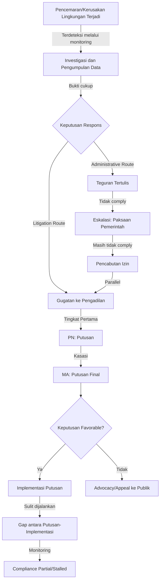
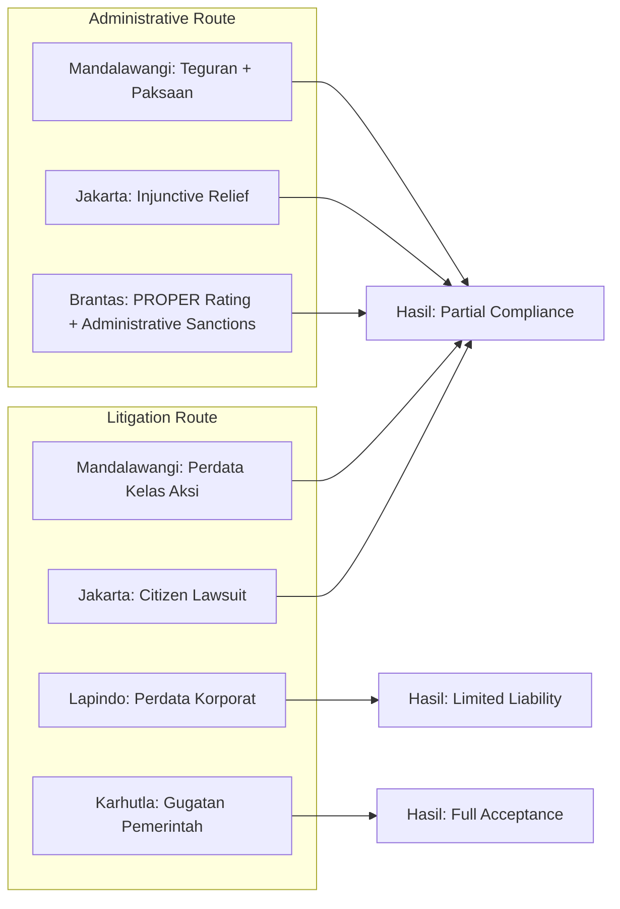
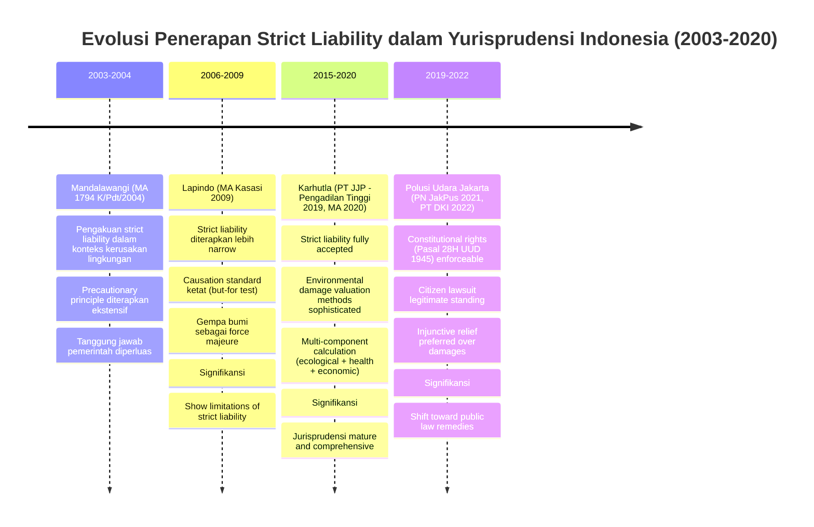

---
title: "Studi Kasus Komprehensif Hukum Lingkungan"
description: "Analisis mendalam lima studi kasus landmark hukum lingkungan Indonesia dengan metode IRAC penuh: Mandalawangi (strict liability), Polusi Udara Jakarta (citizen lawsuit), PT Lapindo Brantas (causation), Kebakaran Hutan dan Lahan (environmental damage calculation), dan Kali Brantas (multi-source pollution). Mencakup fakta kasus, isu hukum, dasar hukum, pertimbangan pengadilan, putusan, dan analisis kritis untuk pembelajaran aplikatif."
date: 2026-04-09
tags:
  - hukum-lingkungan
  - studi-kasus
  - mandalawangi
  - polusi-udara-jakarta
  - lapindo
  - karhutla
  - brantas
  - strict-liability
  - citizen-lawsuit
  - IRAC
  - environmental-law
aliases:
  - Studi Kasus Hukum Lingkungan
  - Environmental Law Case Studies
  - Case Studies in Indonesian Environmental Law
publish: true
---

# Studi Kasus Komprehensif Hukum Lingkungan

**Navigasi:**
- [[10_Isu_Kontemporer|← Sebelumnya: Isu Kontemporer]]
- [[README|↑ Index Utama]]

---

## Tujuan Pembelajaran

Setelah mempelajari bab ini secara menyeluruh, mahasiswa mampu:

1. **Mengaplikasikan metode IRAC** (Issues, Rules, Analysis, Conclusion) dalam menganalisis perkara lingkungan dengan sistematis dan komprehensif.
2. **Mengidentifikasi isu-isu hukum kritis** dalam kasus-kasus lingkungan nyata dan menghubungkannya dengan kerangka normatif UU 32/2009 serta regulasi terkait.
3. **Mengevaluasi dasar hukum dan pertimbangan pengadilan** dalam memutuskan perkara lingkungan, khususnya mengenai penerapan strict liability dan prinsip kehati-hatian.
4. **Menganalisis tanggung jawab korporasi dan pemerintah** dalam konteks pencemaran lingkungan serta mekanisme pertanggungjawaban yang tepat.
5. **Membandingkan hasil penegakan hukum** di berbagai kasus untuk mengidentifikasi faktor-faktor keberhasilan dan kegagalan dalam penegakan hukum lingkungan Indonesia.
6. **Merumuskan rekomendasi perbaikan** berdasarkan pembelajaran dari kasus-kasus nyata, baik dari perspektif peraturan perundangan maupun mekanisme penegakan.
7. **Memahami implikasi global** dari perkara-perkara lokal, khususnya terkait transboundary pollution dan kewajiban internasional Indonesia.

---

## Pengantar: Metode IRAC dalam Analisis Kasus Hukum Lingkungan

Sebelum membahas studi kasus secara spesifik, perlu dipahami bahwa analisis hukum yang komprehensif menggunakan metode **IRAC** — singkatan dari **Issues, Rules, Analysis, Conclusion**. Metode ini adalah standar dalam pengajaran hukum di tradisi common law dan semakin diadopsi dalam pendidikan hukum Indonesia.

### Komponen Metode IRAC

**1. Issues (Isu)**
Identifikasi pertanyaan hukum spesifik yang diajukan dalam kasus. Dalam perkara lingkungan, isu dapat berupa: "Apakah tergugat bertanggung jawab mutlak atas kerusakan lingkungan?" atau "Apakah perbuatan pemerintah melanggar hak atas lingkungan yang sehat?"

**2. Rules (Dasar Hukum)**
Kumpulkan norma hukum yang relevan, baik dari peraturan perundangan, yurisprudensi, maupun doktrin hukum. Dalam hukum lingkungan Indonesia, rules mencakup UU 32/2009, peraturan pemerintah, keputusan menteri, serta putusan pengadilan sebelumnya.

**3. Analysis (Analisis)**
Terapkan rules terhadap fakta-fakta kasus. Analisis yang baik melibatkan penalaran logis dan pertimbangan nuansa, bukan sekadar penerapan mekanis norma hukum. Diskusikan argumentasi kedua belah pihak, kekuatan dan kelemahan masing-masing, serta penggalian putusan pengadilan.

**4. Conclusion (Putusan)**
Berdasarkan analisis tersebut, tarik kesimpulan tentang bagaimana hukum seharusnya diterapkan dan apa yang seharusnya menjadi putusan. Putusan harus konsisten dengan penerapan rules dan analisis yang telah dijabarkan.

---

## STUDI KASUS 1: MANDALAWANGI — Landmark Kasus Strict Liability di Indonesia

### 1.1 Fakta Kasus (Facts)

Pada bulan Juli 2003, terjadi kejadian tragis di kawasan Gunung Mandalawangi, Kecamatan Wanaraja, Kabupaten Garut, Jawa Barat. Longsor yang dahsyat menerpa perkampungan masyarakat setempat, menewaskan delapan orang dan melukai banyak lainnya, serta menghancurkan ratusan rumah dan lahan pertanian milik warga.

**Kronologi Terperinci:**

Gunung Mandalawangi merupakan bagian dari Daerah Aliran Sungai (DAS) Citarum Hulu yang memiliki signifikansi tinggi sebagai penopang sistem pengelolaan air dan stabilitas lahan. Sebelum terjadinya bencana, kawasan ini mengalami deforestasi masif akibat penebangan liar (*illegal logging*) selama bertahun-tahun. Penebangan tidak terkontrol tersebut mengakibatkan hilangnya penutupan vegetasi yang menjadi penahan air dan penstabil struktur tanah. Selain itu, kelalaian pemerintah dalam melakukan pengawasan terhadap penebangan liar dan pengelolaan DAS secara terpadu menjadi faktor pemicu eskalasi risiko bencana.

Pada saat musim hujan tahun 2003, dengan integritas lereng yang sudah terbelit, longsor dengan volume material mencapai ratusan ribu meter kubik terjadi tanpa peringatan. Kecepatan aliran material mencapai puluhan kilometer per jam, menyapu lembah dan menenggelamkan pemukiman bawah. Waktu merespons sangat terbatas karena kecepatan pergerakan massa tanah, sehingga korban jiwa tidak terhindarkan.

**Data Kerusakan:**
- Korban meninggal: 8 orang
- Korban luka: puluhan orang
- Rumah rusak: lebih dari 100 unit
- Lahan pertanian rusak: puluhan hektar
- Pabrik dan infrastruktur lainnya: rusak parah

Penyebab fundamental: kombinasi antara illegal logging yang mengikis stabilitas lereng dan kegagalan pemerintah melakukan manajemen DAS yang komprehensif serta pengawasan terhadap pemanfaatan lahan.

### 1.2 Isu Hukum (Issues)

Kasus Mandalawangi menimbulkan isu-isu hukum yang hingga saat ini terus relevan:

1. **Apakah prinsip tanggung jawab mutlak (*strict liability*) dapat diterapkan dalam konteks bencana alam yang dipicu oleh perilaku manusia?**

2. **Apakah pemerintah bertanggung jawab atas kegagalan dalam melaksanakan kewajiban perlindungan lingkungan, terlepas dari apakah terdapat elemen kesengajaan atau kelalaian spesifik?**

3. **Bagaimana penerapan prinsip kehati-hatian (*precautionary principle*) dalam pengambilan keputusan perizinan dan pengelolaan kawasan yang berisiko tinggi?**

4. **Apakah putusan yang menerapkan strict liability dan precautionary principle berdasarkan pada dasar hukum yang kuat dalam sistem hukum positif Indonesia, ataukah hakim melampaui batas interpretatif?**

### 1.3 Dasar Hukum yang Berlaku (Rules)

**Regulasi Pokok:**

Pada tahun 2003 (waktu kejadian), regulasi lingkungan Indonesia didasarkan pada **UU Nomor 23 Tahun 1997 tentang Pengelolaan Lingkungan Hidup** (UUPLH 1997), yang kemudian digantikan UU 32/2009. UU 23/1997 Pasal 34 menyebutkan:

> "Setiap orang yang tindakan atau usahanya atau kegiatannya menggunakan atau menghasilkan limbah yang mengandung zat yang mudah meledak, mudah terbakar, mudah mengeluarkan racun, atau mudah menyebabkan pencemaran, bertanggung jawab mutlak atas kerugian yang timbul tanpa perlu pembuktian unsur kesalahan."

Meski Pasal 34 UU 23/1997 secara harfiah terbatas pada limbah B3, hakim dalam perkara Mandalawangi melakukan penafsiran ekstensif untuk menerapkan prinsip strict liability pada konteks kerusakan lingkungan yang lebih luas.

**Prinsip Tambahan yang Diterapkan:**

1. **Prinsip Pencegahan (Prevention Principle)**: Menjadi dasar kewajiban pemerintah untuk melakukan tindakan pencegahan sebelum bencana terjadi.
2. **Prinsip Kehati-hatian (Precautionary Principle)**: Mensyaratkan sikap konservatif dalam pengambilan keputusan ketika dampak lingkungan belum sepenuhnya dapat diprediksi, tetapi ada potensi kerusakan serius.
3. **Prinsip Tanggung Jawab Bersama (Common but Differentiated Responsibility)**: Menekankan bahwa pemerintah memiliki tanggung jawab yang lebih besar karena kewenangan regulasi dan pengawasan.

### 1.4 Pertimbangan Pengadilan (Analysis)

**Putusan Tingkat Pertama dan Banding:**
Mahkamah Garut pada tingkat pertama mengabulkan gugatan sebagian, menyatakan pemerintah (baik pusat maupun daerah) melakukan perbuatan melawan hukum dengan gagal melaksanakan kewajiban perlindungan lingkungan. Putusan memerintahkan kompensasi finansial kepada para penggugat.

**Pertimbangan Mahkamah Agung (Kasasi):**
Dalam **Putusan No. 1794 K/Pdt/2004**, Mahkamah Agung melakukan analisis yang komprehensif:

1. **Mengenai Strict Liability dan Precautionary Principle:**
   Mahkamah Agung mempertimbangkan bahwa meskipun perkara Mandalawangi terjadi sebelum UU 32/2009 diberlakukan, prinsip-prinsip strict liability dan precautionary principle telah diakui dalam hukum internasional sebagai jus cogens — norma-norma yang telah diterima secara universal oleh negara-negara beradab. Oleh karena itu, hakim memiliki wewenang untuk menerapkan prinsip-prinsip ini sebagai bagian dari penafsiran konsisten dengan hukum internasional.

2. **Mengenai Kewajiban Pemerintah:**
   Mahkamah Agung menekankan bahwa Pasal 28H ayat (1) UUD 1945 menjamin hak setiap orang atas lingkungan hidup yang baik dan sehat sebagai hak asasi manusia. Kewajiban pemerintah untuk menjamin hak ini bukan hanya bersifat instruksi moral, melainkan kewajiban hukum yang mengikat. Kegagalan pemerintah melaksanakan kewajiban tersebut — dalam hal ini kegagalan mengawasi penebangan liar dan mengelola DAS secara terpadu — merupakan perbuatan melawan hukum yang dapat menimbulkan tanggung jawab ganti rugi.

3. **Mengenai Kausalitas dan Faktor Kontribusi:**
   Mahkamah Agung mengakui bahwa longsor mungkin terjadi karena kombinasi faktor alam (curah hujan tinggi) dan faktor manusia (deforestasi). Namun, faktor manusia yang dapat dikontrol tidak boleh diabaikan. Sebaliknya, kehadiran faktor manusia yang berkontribusi memperkuat tanggung jawab pihak-pihak yang melakukan perbuatan merusak lingkungan atau melalaikan pengawasan.

### 1.5 Putusan (Conclusion)

**Amar Putusan Mahkamah Agung No. 1794 K/Pdt/2004:**

1. Mengabulkan kasasi penggugat sebagian.
2. Menyatakan pemerintah Pusat dan pemerintah Daerah Kabupaten Garut telah melakukan perbuatan melawan hukum dengan gagal memenuhi kewajiban perlindungan lingkungan.
3. Menghukum pemerintah untuk membayar ganti rugi kepada penggugat dalam jumlah tertentu untuk kompensasi kerusakan harta benda dan kerugian immaterial.
4. Menghukum pemerintah untuk melaksanakan pemulihan lingkungan di kawasan Mandalawangi, termasuk reboisasi dan perbaikan infrastruktur perlindungan lahan.

### 1.6 Analisis dan Komentar Kritis

**Signifikansi Yuridis:**

Putusan Mandalawangi merupakan **landmark decision** dalam sejarah hukum lingkungan Indonesia karena beberapa alasan penting:

1. **Pengakuan Formal Strict Liability**: Sebelum UU 32/2009 berlaku, putusan ini telah mengakui dan menerapkan doktrin strict liability secara konsisten dalam konteks kerusakan lingkungan yang lebih luas daripada teks Pasal 34 UU 23/1997 secara literal memungkinkan. Ini membuka jalan bagi aplikasi prinsip tersebut dalam perkara-perkara selanjutnya tanpa terbatas pada "limbah B3" saja.

2. **Penerimaan Precautionary Principle sebagai Jus Cogens**: Putusan ini menunjukkan willingness hakim untuk mengadopsi prinsip-prinsip hukum lingkungan internasional sebagai bagian dari sistem hukum Indonesia. Pengadilan mengakui bahwa precautionary principle telah menjadi bagian dari jus cogens (norma-norma peremptory yang universal diterima), sehingga dapat diterapkan meskipun tidak secara eksplisit ada dalam undang-undang nasional pada waktu itu.

3. **Tanggung Jawab Pemerintah yang Diperluas**: Putusan mengakui bahwa pemerintah memiliki tanggung jawab aktif tidak hanya melarang kegiatan berbahaya, melainkan melakukan tindakan preventif dan pengawasan yang efektif. Ini adalah shift penting dari passive role menjadi active enforcer.

**Implikasi Praktis:**

- Putusan ini menjadi dasar argumentasi dalam gugatan-gugatan lingkungan selanjutnya, khususnya dalam menuntut pertanggungjawaban pemerintah atas kegagalan dalam perlindungan lingkungan.
- Memperkuat posisi hukum kelompok korban lingkungan yang dapat mengajukan tuntutan ganti rugi meskipun kesalahan spesifik tidak dapat dibuktikan.
- Memberikan fondasi untuk mengembangkan jurisprudensi tentang environmental damage valuation (penilaian kerugian lingkungan) yang kemudian lebih matang dalam kasus-kasus berikutnya seperti Karhutla.

**Kritik dan Keterbatasan:**

1. **Tantangan dalam Eksekusi**: Meskipun putusan mengamanatkan pemulihan lingkungan, implementasinya menghadapi hambatan teknis dan birokrasi signifikan. Pemerintah daerah sering kekurangan anggaran untuk melaksanakan restorasi komprehensif yang dibutuhkan untuk merekonstruksi ekosistem DAS.

2. **Definisi "Perbuatan Melawan Hukum" Pemerintah yang Tidak Jelas**: Putusan tidak sepenuhnya mengklarifikasi standar apa yang digunakan untuk menentukan bahwa kegagalan pengawasan pemerintah memenuhi syarat "perbuatan melawan hukum" dalam konteks hukum administrasi. Ini membuka ruang untuk interpretasi yang berbeda-beda di putusan-putusan berikutnya.

3. **Masalah Kausalitas dan Kontribusi Relatif**: Menentukan kontribusi relatif dari faktor manusia vs faktor alam dalam event kompleks seperti longsor tetap secara teknis dan metodologis menantang. Berapa persen adalah "fault" manusia vs "fault" alam?

4. **Limited Recognition in Subsequent Case Law**: Ironisnya, putusan Mandalawangi tidak selalu diikuti secara konsisten dalam kasus-kasus berikutnya. Contohnya, Putusan Lapindo (2009) menolak aplikasi strict liability yang serupa, menunjukkan bahwa jurisprudensi lingkungan Indonesia belum fully consolidated.

**Pembelajaran untuk Pengadilan Lainnya:**

Putusan Mandalawangi menunjukkan bahwa pengadilan tidak perlu menunggu legislasi baru untuk melindungi hak-hak lingkungan yang fundamental. Dengan penafsiran konstitusional yang progresif, pengadilan dapat memperkuat perlindungan lingkungan. Ini adalah precedent penting bagi pengadilan di daerah lain yang menghadapi kasus-kasus serupa.

**Koneksi ke Teori Hukum Lingkungan:**

Kasus Mandalawangi sangat berkaitan dengan konsep-konsep di [[07_Tanggung_Jawab_Mutlak|Tanggung Jawab Mutlak]] (Strict Liability) dan mekanisme penegakan yang dibahas di [[08_Penegakan_Hukum|Penegakan Hukum]]. Bab-bab tersebut memberikan theoretical foundation yang diperlukan untuk memahami keputusan pengadilan dalam Mandalawangi.

---

## STUDI KASUS 2: GUGATAN POLUSI UDARA JAKARTA — Citizen Lawsuit sebagai Instrumen Penegakan Hak Lingkungan

### 2.1 Fakta Kasus (Facts)

Pada tahun 2019, koalisi masyarakat **IBUKOTA** (Gerakan Inisiatif Bersihkan Udara Koalisi Semesta) mengajukan gugatan perdata terhadap tujuh tergugat melalui **Pengadilan Negeri Jakarta Pusat No. 374/Pdt.G/LH/2019/PN.JKT.PST.**

**Kondisi Kualitas Udara Jakarta:**

- **PM2.5**: Baku mutu nasional 15 μg/m³ (tahunan), WHO standard 5 μg/m³. Kondisi Jakarta sering 25-35 μg/m³, melampaui 100 μg/m³ pada musim kemarau.
- **Sumber Utama**: Transportasi (~60%), industri (~20%), pembakaran domestik (~10%), transboundary (~5-10%).
- **Dampak Kesehatan**: Estimasi 4.300-7.600 kematian per tahun akibat penyakit respirasi dan kardiovaskular.

**Para Penggugat dan Tergugat:**

Penggugat: 32 warga negara sebagai anggota koalisi IBUKOTA
Tergugat: Presiden RI, Menteri LHK, Menteri Kesehatan, Menteri Dalam Negeri, Gubernur DKI Jakarta, Gubernur Jabar, Gubernur Banten

### 2.2 Isu Hukum (Issues)

1. Apakah warga negara memiliki standing untuk mengajukan citizen lawsuit atas pelanggaran hak atas lingkungan yang sehat?
2. Apakah kelima tergugat utama melakukan perbuatan melawan hukum melalui kegagalan menegakkan standar kualitas udara yang memadai?
3. Apa jenis remedy yang dapat diberikan pengadilan?

### 2.3 Dasar Hukum yang Berlaku (Rules)

- **Pasal 28H(1) UUD 1945**: Hak atas lingkungan hidup yang baik dan sehat
- **UU 32/2009 Pasal 3, 65, 88**: Tujuan perlindungan lingkungan dan standing untuk citizen lawsuit
- **PermenLHK 14/2016**: Standar Baku Mutu Udara Ambien Nasional

### 2.4 Pertimbangan Pengadilan (Analysis)

**Putusan PN Jakarta Pusat (2021):**

Hakim menerima sebagian besar argumentasi penggugat, menyatakan bahwa:
- Penggugat memiliki legal standing yang kuat berdasarkan Pasal 28H UUD 1945 dan UU 32/2009
- Lima dari tujuh tergugat melakukan perbuatan melawan hukum dengan gagal memberikan perlindungan yang cukup
- Tindakan pemerintah untuk mengurangi polusi "tidak cukup dan tidak serius"

**Putusan Pengadilan Banding (2022):**
Menguatkan putusan PN Jakarta Pusat, dengan deadline yang lebih fleksibel untuk eksekusi.

### 2.5 Putusan (Conclusion)

**Amar Putusan:**

1. Mengabulkan gugatan sebagian
2. Menyatakan lima tergugat melakukan perbuatan melawan hukum
3. Perintah (injunctive relief) untuk:
   - Menetapkan baku mutu udara nasional baru dalam 3 bulan
   - Menyusun roadmap pengendalian pencemaran udara dalam 6 bulan
   - Melakukan pengawasan sumber pencemar secara intensif
   - Menyediakan data kualitas udara real-time untuk publik

### 2.6 Analisis dan Komentar Kritis

**Signifikansi Sejarah:**

Kasus Polusi Udara Jakarta merupakan **citizen lawsuit pertama yang berhasil** di Indonesia dalam menuntut pemerintah atas alasan pelanggaran hak lingkungan konstitusional. Sebelumnya, citizen lawsuits di Indonesia sering ditolak atas dasar standing atau pengadilan menganggap masalah lingkungan terlalu teknis untuk diputus melalui mekanisme perdata. Putusan ini mengubah landscape hukum lingkungan Indonesia secara signifikan.

**Inovasi Hukum yang Dihadirkan:**

1. **Recognition of Citizen Standing**: Putusan ini memperkuat pengakuan bahwa warga biasa (bukan hanya organisasi lingkungan atau pemerintah) memiliki legal standing yang kuat untuk menggugat atas nama hak lingkungan sendiri. Ini didasarkan pada Pasal 28H UUD 1945 yang menjamin hak konstitusional atas lingkungan yang baik dan sehat.

2. **Justiciability of Complex Policy Issues**: Pengadilan menunjukkan bahwa isu-isu kompleks tentang manajemen lingkungan dan kualitas udara bukan hanya "political questions" yang sebaiknya diserahkan kepada branches of government lainnya, melainkan justiciable questions yang dapat diputuskan oleh pengadilan dengan mempertimbangkan bukti ilmiah dan policy expertise.

3. **Preference for Injunctive Relief over Monetary Damages**: Berbeda dengan kasus-kasus lainnya yang memprioritaskan ganti rugi finansial, Putusan Jakarta memilih injunctive relief — yaitu perintah pengadilan untuk melakukan tindakan-tindakan konkret. Ini adalah shift paradigma yang penting: pengadilan tidak hanya menjadi pihak yang menghukum, melainkan co-regulator yang membimbing pemerintah untuk melaksanakan kewajiban mereka.

**Tantangan dalam Implementasi:**

1. **Deadline Ambisius yang Tidak Realistis**: Target 3 bulan untuk menetapkan standar baku mutu baru terbukti terlalu ketat mengingat proses penetapan standar memerlukan konsultasi multi-stakeholder (industri, akademisi, LSM, publik), kajian ilmiah mendalam, dan coordination antar-kementerian. Dalam praktik, pemerintah meminta perpanjangan beberapa kali.

2. **Coordination Challenges**: Roadmap pengendalian pencemaran udara memerlukan koordinasi erat antara Kementerian LHK, Kementerian Perhubungan, Kementerian Perindustrian, Pemerintah Provinsi DKI, Pemerintah Jawa Barat, Pemerintah Banten, serta ribuan entitas bisnis (pabrik, bengkel, pompa bensin, armada transportasi). Kompleksitas koordinasi ini sering menjadi hambatan dalam implementasi yang efektif.

3. **Attribution and Causation in Enforcement**: Meskipun putusan memerintahkan pemerintah melakukan pengawasan sumber pencemar, atribusi tanggung jawab tetap kompleks. Ketika tingkat polusi tidak menurun signifikan setelah beberapa tahun, tidak jelas siapa yang bertanggung jawab — apakah pemerintah karena pengawasan yang masih lemah, atau industri/transportasi karena tidak patuh dengan standar yang ditetapkan?

4. **Measurement and Verification**: Apakah pengurangan emisi sudah memadai? Metrik apa yang digunakan untuk mengukur "success"? Bagaimana memverifikasi bahwa pemerintah benar-benar melaksanakan remediation yang dibutuhkan, atau hanya "compliance theater" (kegiatan yang terlihat seperti compliance tapi substantif minimal)?

**Pembelajaran untuk Kasus Lain:**

Kasus ini membuka precedent bahwa citizen lawsuit dapat digunakan untuk menggugat kegagalan pemerintah dalam melaksanakan kewajiban lingkungan konstitusional. Prinsip yang sama telah diterapkan dalam gugatan tentang polusi air (Kali Brantas), pengelolaan sampah, konservasi ekosistem (hutan Leuser), dan kualitas air minum.

**Koneksi ke Teori Hukum:**

Kasus ini sangat berkaitan dengan konsep-konsep di [[04_Pengendalian_Pencemaran|Pengendalian Pencemaran]] (standard setting, monitoring, enforcement) dan mekanisme penegakan yang dibahas di [[08_Penegakan_Hukum|Penegakan Hukum]]. Bab-bab tersebut memberikan theoretical foundation tentang bagaimana sistem regulasi lingkungan seharusnya bekerja, dan kasus Jakarta menunjukkan bagaimana pengadilan dapat menggunakan citizen lawsuit untuk memastikan bahwa sistem tersebut benar-benar berfungsi.

---

## STUDI KASUS 3: PT LAPINDO BRANTAS — Causation dan Strict Liability dalam Bencana Industri Ekstraktif

### 3.1 Fakta Kasus (Facts)

Pada **29 Mei 2006**, terjadi semburan lumpur panas (*hot mudflow*) dari sumur eksplorasi milik **PT Lapindo Brantas Inc.** di Porong, Sidoarjo, Jawa Timur. Semburan menyebabkan:
- 60,000+ penduduk mengungsi
- 5,000+ rumah hilang
- 7,500+ hektar lahan tertutup lumpur
- Dampak berkelanjutan hingga sekarang (20+ tahun)

**Perdebatan Penyebab:**

1. **Teori PT Lapindo**: Gempa bumi 26 Mei 2006 (Yogyakarta, skala 6,3) adalah penyebab utama
2. **Teori Independen**: Pengeboran yang tidak sesuai standar (cacat well casing) adalah faktor struktural; gempa hanya trigger
3. **Hybrid Theory**: Kedua faktor berperan

### 3.2 Isu Hukum (Issues)

1. Bagaimana menentukan penyebab kejadian multifaktorial? Apakah causalitas harus "but-for" atau "substantial factor"?
2. Apakah pengeboran minyak-gas adalah "abnormally dangerous activity" yang mensyaratkan strict liability?
3. Apakah gempa bumi merupakan force majeure yang mengecualikan tanggung jawab?

### 3.3 Dasar Hukum yang Berlaku (Rules)

- **UU 23/1997 Pasal 34**: Strict liability untuk B3
- **UU 32/2009 Pasal 88**: Strict liability untuk activities menimbulkan ancaman serius
- **Pasal 1365 KUHPerdata**: Perbuatan melawan hukum memerlukan causal nexus

### 3.4 Pertimbangan Pengadilan (Analysis)

**Putusan Mahkamah Agung (2009):**

Mahkamah Agung memutuskan bahwa:
- Gempa bumi adalah "direct cause" (penyebab langsung); pengeboran hanya "contributory factor"
- Strict liability tidak sepenuhnya dapat diterapkan dalam konteks gempa bumi
- Masyarakat berhak ganti rugi atas kerugian yang sudah terjadi, namun PT Lapindo tidak bertanggung jawab atas dampak berkelanjutan

> "Gempa bumi merupakan bencana alam yang bersifat fortuitous events. Bukti ilmiah menunjukkan bahwa gempa bumi merupakan trigger utama semburan lumpur."

### 3.5 Putusan (Conclusion)

1. PT Lapindo Brantas **tidak bertanggung jawab atas semburan lumpur** karena gempa bumi adalah penyebab utama
2. Ganti rugi diberikan hanya untuk **kerugian saat semburan pertama** (rumah dan lahan rusak), bukan untuk dampak berkelanjutan
3. Pemerintah kemudian mengeluarkan Perpres 14/2007 dan 48/2008 untuk menangani lumpur sebagai bencana nasional

### 3.6 Analisis dan Komentar Kritis

**Peran Causation dalam Deciding Liability:**

Putusan Lapindo menunjukkan keterbatasan penerapan strict liability ketika faktor alam berperan secara signifikan. Interpretasi "causal link" yang digunakan Mahkamah Agung tetap konservatif, mensyaratkan hubungan kausal yang jelas dan dominan ("but-for" test). Kontras ini dengan Mandalawangi (yang menerima strict liability dengan lebih luas) menunjukkan bahwa jurisprudensi Indonesia belum fully settled pada bagaimana menghadapi causation complexities.

**The "But-For" Test vs "Substantial Factor" Test:**

Mahkamah Agung dalam Lapindo menggunakan "but-for" test: "Tapi untuk (but-for) tindakan tergugat, apakah kerugian akan tetap terjadi?" Dalam Lapindo, logika MA adalah: "Tapi untuk gempa bumi, semburan lumpur tetap akan terjadi karena formasi batuan yang tidak stabil." Dengan logika ini, gempa bumi menjadi "direct cause."

Sebaliknya, "substantial factor" test bertanya: "Apakah tindakan tergugat adalah faktor substansial yang berkontribusi pada kerugian?" Dengan test ini, pengeboran yang cacat adalah substantial factor, dan PT Lapindo tetap dapat dimintai pertanggungjawaban.

Pilihan antara dua test ini adalah pilihan policy yang fundamental: apakah kita ingin strict liability (yang lebih protective terhadap korban) atau limited liability yang memberi leeway kepada industri ekstraktif?

**Implikasi Praktis:**

1. **Untuk Korporasi Ekstraktif**: Putusan Lapindo memberikan "exemption" bagi industri ekstraktif ketika ada faktor alam yang berkontribusi. Ini dapat mengurangi incentive untuk melakukan operasi yang lebih hati-hati, karena perusahaan tahu bahwa apabila ada natural trigger event, mereka dapat mengklaim force majeure.

2. **Untuk Pemerintah**: Putusan ini mengakui bahwa pemerintah tidak dapat sepenuhnya dimintai tanggung jawab untuk semua natural disasters, bahkan yang dipicu oleh pembangunan manusia. Ini memperkuat pemerintah untuk melakukan pengawasan yang lebih ketat ex-ante (sebelum kegiatan dimulai).

3. **Untuk Masyarakat Korban**: Putusan ini memposisikan korban dalam situasi yang challenging: mereka dapat memperoleh ganti rugi atas kerugian immediate (saat semburan pertama), tetapi tidak untuk ongoing damage. Untuk kerusakan berkelanjutan (lumpur yang terus mengalir 20+ tahun), korban harus mengandalkan respons pemerintah (bukan korporat liability).

**Scientific Controversy:**

Dari perspektif ilmiah, putusan MA dapat diperdebatkan. Beberapa ahli geologi berpendapat bahwa:
- Gempa bumi bukanlah "direct cause" dari semburan, melainkan "trigger" (pemicu) dari kondisi yang sudah vulnerable
- Pengeboran yang cacat menciptakan structural weakness; gempa hanya mengaktifkan weakness ini
- Dengan logic seperti itu, pengeboran bersalah, bukan gempa bumi

Namun, pengadilan tidak selalu mengikuti ahli. Pengadilan memiliki kebebasan untuk menginterpretasi bukti ilmiah sesuai dengan kebutuhan hukum.

**Pembelajaran untuk Regulasi Masa Depan:**

Kasus Lapindo mendorong refleksi tentang perlunya regulasi yang lebih eksplisit tentang:
1. **Insurance Requirements**: Wajib asuransi yang cukup untuk kegiatan ekstraktif berbahaya (environmental liability insurance)
2. **Financial Assurance**: Dana jaminan (escrow account) yang disetorkan perusahaan pada awal operasi untuk pemulihan lingkungan jangka panjang
3. **Monitoring Standards**: Standar monitoring yang ketat dan independent audit sistem operasi
4. **Liability Timeframe**: Klarifikasi tentang durasi tanggung jawab perusahaan (apakah hanya pada saat operasi atau juga pasca-operasi untuk ongoing impact?)

**Koneksi ke Konsep Strict Liability:**

Kasus Lapindo menunjukkan bahwa strict liability memiliki batas-batas dalam penerapannya, terutama ketika faktor-faktor di luar kontrol perusahaan berperan signifikan. Ini menunjukkan pentingnya membaca [[07_Tanggung_Jawab_Mutlak|Tanggung Jawab Mutlak]] tidak hanya sebagai doktrin absolut, tetapi juga dengan memahami keterbatasannya dalam praktik yudisial.

---

## STUDI KASUS 4: KEBAKARAN HUTAN DAN LAHAN (KARHUTLA) — Environmental Damage Calculation dan Corporate Accountability

### 4.1 Fakta Kasus (Facts)

**Episode 2015**: >2,6 juta hektar terbakar, kerugian ekonomi ~USD 16 miliar, emisi ~1,5-2 miliar ton CO2 equivalent

**Episode 2019**: ~1,6 juta hektar terbakar

**Perusahaan Terlibat**: PT Kallista Alam, PT Jatim Jaya Perkasa, PT National Sago Prima, PT Bumi Mekar Hijau, PT Wira Arsa Jaya

**Modus Operandi**: Slash-and-burn untuk land-clearing, gagal control fire, menyebar ke hutan dan lahan sekitarnya

### 4.2 Isu Hukum (Issues)

1. Bagaimana menghitung kerugian lingkungan dari kebakaran dalam satuan rupiah?
2. Apakah perusahaan bertanggung jawab atas penyebaran api yang tidak direncanakan?
3. Bagaimana menerapkan strict liability dengan faktor alam (musim kemarau, angin)?

### 4.3 Dasar Hukum yang Berlaku (Rules)

- **UU 32/2009 Pasal 98-99**: Tindak pidana pencemaran atau perusakan lingkungan
- **UU 32/2009 Pasal 108**: Tindak pidana pembakaran lahan
- **UU 32/2009 Pasal 88**: Strict liability untuk kegiatan berbahaya
- **UU 32/2009 Pasal 87**: Perhitungan ganti rugi lingkungan

### 4.4 Kasus PT Jatim Jaya Perkasa (PT JJP)

**Fakta**: Pembakaran ~1.000 hektar di Riau tahun 2015, api meluas tidak terkontrol

**Putusan Pengadilan Tinggi Jakarta (2019)**:
- Mengabulkan gugatan pemerintah secara penuh
- Menghitung ganti rugi lingkungan sebesar **Rp 491,025,500,000** dengan komponen:
  - Direct Damage: Rp 75 miliar (vegetasi replacement)
  - Ecosystem Services Loss: Rp 150 miliar
  - Public Health Cost: Rp 85 miliar
  - Economic Loss: Rp 120 miliar
  - Administrative Cost: Rp 61 miliar

**Putusan Mahkamah Agung (2020)**:
- Menolak kasasi PT JJP
- Menguatkan putusan dan strict liability

> "Kegiatan pembakaran lahan yang mengakibatkan penyebaran api tidak terkontrol merupakan aktivitas yang menimbulkan ancaman serius terhadap lingkungan hidup. PT JJP memiliki tanggung jawab mutlak atas kerusakan lingkungan yang timbul, independen terhadap ada atau tidaknya unsur kesalahan spesifik."

### 4.5 Putusan (Conclusion)

1. Mengabulkan gugatan pemerintah secara penuh
2. PT JJP harus membayar Rp 491 miliar ganti rugi lingkungan
3. Denda Rp 25 juta per hari apabila tidak melaksanakan remediation plan dalam 4 tahun
4. Environmental restoration wajib dilaksanakan

### 4.6 Analisis dan Komentar Kritis

**Environmental Damage Valuation — Methodological Sophistication:**

Kasus PT JJP mendemonstrasikan bahwa pengadilan Indonesia semakin menerima metodologi ekonomi lingkungan yang sophisticated. Komponen ganti rugi mencakup replacement cost, ecosystem services, health costs, economic losses, dan administrative costs — menunjukkan pendekatan comprehensive yang jarang dilihat dalam yurisprudensi environmental law di negara-negara berkembang.

**Corporate Enforcement and Deterrence:**

Putusan ini menunjukkan keberanian menghukum korporasi besar dengan jumlah signifikan, memberikan deterrent effect. Namun, enforcement tetap tidak konsisten karena political economy dynamics dan monitoring transparency yang terbatas.

**Transboundary Dimensions:**

Pertanyaan tentang akuntabilitas untuk transboundary damage (haze di Singapura, Malaysia) tetap tidak terjawab melalui mekanisme domestik. Ini mengangkan isu tentang limitation dari hukum lingkungan nasional dalam menghadapi global environmental problems.

**Koneksi Teoritis:**

Kasus menunjukkan praktik mature dari strict liability dan environmental damage valuation methodologies yang sophisticated, menghubungkan teori-teori di [[07_Tanggung_Jawab_Mutlak|Tanggung Jawab Mutlak]] dengan praktek enforcement di [[08_Penegakan_Hukum|Penegakan Hukum]].

---

## STUDI KASUS 5: PENCEMARAN KALI BRANTAS — Multi-Source Pollution dan Shared Liability

### 5.1 Fakta Kasus (Facts)

Sungai Brantas (Jawa Timur) yang mengalir melalui Malang, Kediri, Surabaya menunjukkan pencemaran parah:

| Parameter | Baku Mutu Kelas III | Kondisi Brantas |
|-----------|---|---|
| BOD | 6 mg/L | 15-25 mg/L (2,5-4x melampaui) |
| COD | 40 mg/L | 80-120 mg/L (2-3x melampaui) |
| Ammonia | 0,5 mg/L | 2-5 mg/L (4-10x melampaui) |
| Fecal Coliform | 1,000/100mL | 100,000-1,000,000/100mL (100-1000x) |

**Sumber Pencemaran:**
- Industri (45%): textile, food processing, chemical
- Domestik (35%): rumah tangga, kota
- Pertanian (15%): pupuk, pestisida
- Lainnya (5%): konstruksi, perdagangan

### 5.2 Isu Hukum (Issues)

1. Apakah setiap pencemar dapat dimintai pertanggungjawaban individu atau tanggung jawab di-share?
2. Bagaimana mengaplikasikan liability rules dengan ratusan pencemar?
3. Apa peran pemerintah dalam mengawasi sungai lintas-jurisdiksi?
4. Bagaimana efektivitas regulasi (PROPER, administrative sanctions)?

### 5.3 Dasar Hukum yang Berlaku (Rules)

- **PP 82/2001**: Pengelolaan Kualitas Air, daya tampung beban pencemaran (*assimilative capacity*)
- **UU 32/2009 Pasal 3, 4, 88**
- **PermenLHK 5/2014, 68/2016**: Baku mutu air limbah
- **PROPER System**: Program Peringkat Kinerja Perusahaan

### 5.4 Enforcement Mechanisms

**PROPER Ratings**: Gold, Green, Blue, Red (dikaitkan dengan transparansi publik dan administrative action)

**Gugatan Perdata**: Berbagai gugatan terhadap industrial polluters, beberapa diabulkan sebagian

**Administrative Enforcement**:
- Teguran tertulis (puluhan industri)
- Paksaan pemerintah (bestuursdwang)
- Pencabutan izin (industri kecil)

**Tantangan**:
- Enforcement tidak konsisten terhadap industri besar
- Koordinasi antar-jurisdiksi sulit
- Gap antara putusan dan implementasi

### 5.5 Analisis dan Komentar Kritis

**Multi-Source Pollution: Attribution Problem yang Fundamental:**

Kasus Brantas menunjukkan tantangan fundamental dalam environmental liability untuk polusi multi-source. Ketika ratusan pencemar berkontribusi, how do we allocate responsibility? Pengadilan di Indonesia umumnya menggunakan "per-source approach" — setiap pencemar dimintai pertanggungjawaban atas kontribusi individual mereka berdasarkan proporsi beban pencemaran yang mereka hasilkan. Namun, metode ini memiliki limitation:

1. **Data Uncertainty**: Quantifying exact contribution dari setiap sumber seringkali sangat uncertain, terutama untuk diffuse sources seperti domestic wastewater dan agricultural runoff.

2. **Dynamic System**: Sungai adalah dynamic system di mana polutan berinteraksi, degradasi, dan sediment. Kontribusi dari sumber A pada lokasi upstream mungkin berubah ketika mencapai downstream karena self-purification processes.

3. **Apportionment Fairness**: Apakah fair untuk menuntut industri kecil dengan strict liability apabila kontribusi mereka hanya 1% dari total beban? Pengadilan sering mengembangkan "de minimis" exceptions.

**Regulasi Lengkap, Implementasi Incomplete:**

Meskipun PP 82/2001 dan peraturan-peraturan lainnya comprehensive, degradasi air Brantas terus berlanjut. Ini menunjukkan bahwa regulasi saja tidak cukup tanpa:

1. **Political Will**: Pemerintah daerah sering memprioritaskan pertumbuhan ekonomi (industrial output) atas environmental protection
2. **Adequate Resourcing**: Budget dan personel untuk monitoring, enforcement, dan remediation sering terbatas
3. **Community Engagement**: Monitoring civil society dan community pressure yang efektif
4. **Economic Incentives**: Mekanisme insentif (bukan hanya penalty) untuk mendorong compliance

**Cross-Jurisdictional Coordination Challenges:**

Sungai Brantas mengalir melalui multiple jurisdictions (Malang, Kediri, Surabaya). Koordinasi antar-pemerintah daerah sangat penting tetapi sulit karena:
- Kepentingan ekonomi lokal dapat bertentangan
- Keterbatasan finansial dan kapasitas teknis di daerah yang lebih kecil
- Kurangnya mekanisme penalty yang efektif untuk daerah non-compliant

**Daya Tampung Sungai (Assimilative Capacity):**

Perhitungan menunjukkan bahwa daya tampung Brantas untuk parameter tertentu (BOD, ammonia) sudah terlampaui, terutama di ruas Malang. Ini adalah fundamental constraint: tidak peduli berapa banyak enforcement, apabila kualitas air sudah melampaui capacity, restorasi akan sangat sulit dan membutuhkan reduction drastis dalam loading.

**Pembelajaran dan Future Directions:**

Kasus Brantas telah menginspirasi pengembangan model governance yang lebih integrated:

1. **River Basin Organizations (RBO)**: Pembentukan organisasi pengelolaan DAS lintas-jurisdiksi yang memiliki authority dan resources untuk koordinasi (contoh: Brantas River Basin Organization di Jawa Timur)

2. **Stakeholder Platforms**: Forum yang melibatkan government, industry, civil society untuk collaborative problem-solving dan information sharing

3. **Payment for Ecosystem Services (PES)**: Mekanisme untuk compensate upstream communities atas environmental services mereka (forest conservation, water regulation) yang manfaatnya diterima downstream

4. **Market-Based Instruments**: Emission trading, water rights trading, untuk mengalokasikan beban pengurangan emisi dengan cost-effective manner

**Koneksi Teoritis:**

Kasus Brantas sangat terkait dengan konsep-konsep di [[04_Pengendalian_Pencemaran|Pengendalian Pencemaran]] (standard setting, daya tampung, monitoring), dan menunjukkan kompleksitas implementing regulasi lingkungan air yang dibahas di [[08_Penegakan_Hukum|Penegakan Hukum]]. Kasus ini juga menunjukkan pentingnya integrated water resources management yang melampaui hukum litigasi.

---

## DIAGRAM ALUR PENEGAKAN HUKUM LINGKUNGAN

Berikut adalah alur tipikal penegakan hukum lingkungan dalam kelima kasus yang dapat digeneralisasi:



Diagram ini menunjukkan bahwa penegakan hukum lingkungan sering melibatkan multiple pathways (administratif dan litigasi) yang berjalan paralel, dan sering menghadapi gap antara putusan dan implementasi.

### Perbandingan Mekanisme Penegakan di Kelima Kasus



## ANALISIS KOMPARATIF KELIMA KASUS

### Matriks Perbandingan Komprehensif

| Aspek | Mandalawangi | Polusi Udara | Lapindo | Karhutla | Brantas |
|-------|---|---|---|---|---|
| **Tahun** | 2003 | 2019 | 2006 | 2015 | Ongoing |
| **Jenis** | Kerusakan tanah | Polusi udara | Geohazard | Kerusakan hutan | Polusi air |
| **Dasar Hukum** | Strict liability (ekstensif) | Hak konstitusional | Strict liability (narrow) | Strict liability (applied) | PP 82/2001 |
| **Outcome** | Tergugat kalah | Partial win (injunctive) | Tergugat menang | Tergugat kalah | Mixed |
| **Status Implementasi** | Partial | Slow | Stalled | Ongoing | Incomplete |

### Pola Umum

1. **Causation Difficulty**: Semua kasus menunjukkan challenge menentukan causal link
2. **Multi-Stakeholder Complexity**: Multiple stakeholders dengan interest berbeda
3. **Gap Putusan-Implementasi**: Putusan jelas tapi implementasi lambat
4. **Evolution**: Tren peningkatan acceptance strict liability dari Mandalawangi ke kasus-kasus lebih baru

### Faktor Kesuksesan Penegakan

1. **Strong Evidence Base**
2. **Clear Legal Framework**
3. **Public Interest and Visibility**
4. **Government as Proactive Plaintiff**
5. **Precedent Support**

### Faktor Hambatan

1. **Weak Institutional Capacity**
2. **Political Economy Constraints**
3. **Factual Ambiguity**
4. **Resource Limitations**
5. **Compliance and Execution Issues**

---

## PERKEMBANGAN STRICT LIABILITY DAN ENVIRONMENTAL DAMAGE CALCULATION: TREN JURISPRUDENSI (2003-2020)

Kelima kasus ini menunjukkan evolusi penting dalam jurisprudensi Indonesia tentang bagaimana pengadilan menerapkan konsep-konsep hukum lingkungan:



Diagram timeline ini menunjukkan bahwa dari 2003 hingga 2020, ada evolusi signifikan: dari pengakuan awal strict liability (Mandalawangi), melalui pembatasan praktis (Lapindo), menuju penerimaan matang dengan methodologi sophisticated (Karhutla), dan akhirnya ekspansi ke mekanisme constitutional rights enforcement (Jakarta).

---

## METODOLOGI ANALISIS IRAC UNTUK MAHASISWA

### Template IRAC Analysis

**ISSUE**: Formulate specific legal question(s)
**RULES**: Identify applicable law (statutes, regulations, precedent)
**ANALYSIS**: Apply rules to facts, discuss both sides, weigh factors
**CONCLUSION**: State how law should be applied

### Assignment untuk Mahasiswa

Pilih salah satu kasus, kemudian:
1. Conduct additional research
2. Apply IRAC framework dalam tulisan 3,000-5,000 words
3. Evaluate judicial reasoning (apakah logis dan konsisten?)
4. Assess implementation (apakah putusan berhasil dijalankan?)
5. Recommend improvements (regulatory, procedural, enforcement)

---

## DASAR HUKUM UTAMA

| Kasus | UU Pokok | Pasal Kritis | PP/Permen Terkait | Putusan |
|-------|---|---|---|---|
| Mandalawangi | UU 23/1997 | Pasal 34 | - | MA No. 1794 K/Pdt/2004 |
| Polusi Udara | UUD 1945, UU 32/2009 | Pasal 28H(1), 65, 88 | PermenLHK 14/2016 | PN JakPus 374/PDT.G/LH/2019 |
| Lapindo | UU 23/1997, UU 32/2009 | Pasal 34, 88 | Perpres 14/2007, 48/2008 | MA 2009 (kasasi) |
| Karhutla | UU 32/2009, UU 41/1999 | Pasal 88, 108 | PP 26/2008 | PT Jakarta 2019, MA 2020 |
| Brantas | UU 32/2009, PP 82/2001 | Pasal 3, 88; PP 82 Pasal 20-24 | PermenLHK 5/2014, 68/2016 | Berbagai putusan tingkat pertama |

---

## PERTANYAAN DISKUSI SUBSTANTIF DAN ANALITIS

### Pertanyaan Level Dasar (Pemahaman Konsep)

1. **Tentang Strict Liability**: Jelaskan perbedaan antara "tanggung jawab berdasarkan kesalahan" (*fault-based liability*) dan "tanggung jawab mutlak" (*strict liability*). Dalam hal mana strict liability lebih penting diterapkan dalam konteks lingkungan, dan mengapa?

2. **Tentang Causation**: Dalam kasus lingkungan, apa bedanya antara causation standard "but-for test" (Lapindo menggunakan ini) vs "substantial factor test"? Berikan contoh kasus di mana masing-masing standard akan menghasilkan kesimpulan berbeda.

3. **Tentang Citizen Lawsuit**: Apakah citizen lawsuit adalah mekanisme yang tepat untuk menegakkan hak lingkungan konstitusional? Jelaskan kelebihan dan kekurangan dari mekanisme ini dibanding mechanisms lainnya (class action, gugatan pemerintah).

### Pertanyaan Level Menengah (Analisis Kritis)

4. **Mandalawangi vs Lapindo**: Kedua kasus ini melibatkan "natural events" yang berkontribusi pada kerusakan (curah hujan pada Mandalawangi, gempa pada Lapindo). Mengapa pengadilan dalam Mandalawangi menerimakan strict liability namun dalam Lapindo menolaknya? Apakah ada inkonsistensi dalam jurisprudensi? Bagaimana seharusnya pengadilan membedakan antara dua situasi ini?

5. **Polusi Udara Jakarta**: Gugatan ini menghasilkan "injunctive relief" (perintah pengadilan untuk melakukan tindakan) daripada "monetary damages" (ganti rugi finansial). Apakah ini merupakan outcome yang lebih efektif dalam perkara lingkungan? Berikan argumentasi baik untuk dan menentang penggunaan injunctive relief vs damages dalam perkara lingkungan.

6. **Karhutla - Environmental Damage Calculation**: Ganti rugi PT JJP dihitung sebesar Rp 491 miliar yang terdiri dari: direct damage (Rp 75 M), ecosystem services loss (Rp 150 M), public health cost (Rp 85 M), economic loss (Rp 120 M), administrative cost (Rp 61 M). Komponen mana yang paling sulit dijustifikasi dari perspektif hukum? Bagaimana seharusnya pengadilan menentukan nilai-nilai ini tanpa mengandalkan speculation?

7. **Brantas - Multi-Source Accountability**: Kali Brantas mengalami pencemaran dari ratusan sumber (industri, domestik, pertanian). Apakah lebih efektif untuk menuntut pemerintah sebagai "ultimate responsible party" (karena failure to regulate) daripada menuntut masing-masing industrial polluter? Jelaskan trade-offs antara dua pendekatan ini, dengan mempertimbangkan: burden of proof, practical enforcement, cost, deterrent effect.

### Pertanyaan Level Lanjut (Synthesis dan Policy Recommendation)

8. **Komparasi Implementasi**: Dari kelima kasus, kasus mana yang menunjukkan "most effective" enforcement dari environmental law? Apa kriteria untuk "effectiveness"? Apakah itu: (a) putusan yang menguntungkan penggugat, (b) keberhasilan implementasi putusan, (c) dampak deterrent terhadap polutan lainnya, atau (d) kombinasi dari ketiganya?

9. **Institutional Capacity**: Semua lima kasus menunjukkan "gap" antara putusan pengadilan dan implementasinya. Apa penyebab fundamental dari gap ini? Apakah masalahnya adalah regulasi yang tidak jelas, atau adalah masalah institutional capacity dan political will? Bagaimana seharusnya sistem hukum lingkungan dirancang untuk mengurangi gap ini?

10. **Causation Problem di Era Climate Change**: Dengan semakin kompleksnya penyebab (multiple stressors, tipping points, climate variability), bagaimana hukum lingkungan seharusnya mengadaptasi standard causation? Apakah "but-for test" yang ketat masih relevan, atau apakah kita memerlukan standard yang lebih lenient yang mengakomodasi "probabilistic causation"?

11. **Political Economy of Environmental Law**: Tiga dari lima kasus melibatkan korporasi besar atau pemerintah dengan political connections yang kuat. Apakah law review (analisis jurisprudensi) cukup untuk mengatasi "selective enforcement" atau "unequal protection" yang mungkin terjadi dalam kasus-kasus environmental law?

12. **Transnational Dimensions**: Kasus Karhutla menyebabkan transboundary haze yang merugikan Singapura dan Malaysia. Kasus Lapindo memiliki keterkaitan dengan Production Sharing Contract internasional. Bagaimana domestic courts seharusnya menangani dimensi internasional dari kasus-kasus lingkungan lokal?

---

## PERSPEKTIF INTERNASIONAL: PERBANDINGAN DENGAN YURISPRUDENSI GLOBAL

### Mandalawangi dan Rylands v Fletcher (1868) - Common Law Foundation

Prinsip strict liability yang diterapkan dalam Mandalawangi memiliki akar historis yang dalam dalam common law Inggris. Putusan *Rylands v Fletcher* (1868) dalam *House of Lords* menetapkan bahwa seseorang yang membawa sesuatu ke tanahnya yang berpotensi menimbulkan bahaya apabila terlepas ("escape"), harus mempertanggungjawabkan kerusakan, tanpa perlu pembuktian kesalahan.

Formula klasik dari *Rylands v Fletcher*:

> "The person who for his own purposes brings on his lands and collects and keeps there anything likely to do mischief if it escapes, must keep it in at his peril, and if he does not do so, is prima facie answerable for all the damage which is the natural consequence of its escape."

Meskipun kasus Mandalawangi terjadi lebih dari seratus tahun kemudian, prinsip-prinsip yang diterapkan sangat sejalan dengan *Rylands v Fletcher*. Ini menunjukkan bahwa hukum lingkungan Indonesia mengadopsi wisdom dari tradisi common law meski Indonesia secara formal menganut civil law system.

### Trail Smelter Arbitration (1938-1941) — International Environmental Law Foundation

Kasus arbitration antara Amerika Serikat dan Kanada tentang polusi udara transboundary dari smelter di Trail, British Columbia, merupakan landmark dalam hukum lingkungan internasional. Arbitrator menyatakan bahwa:

> "No state has the right to use or permit the use of its territory in such a manner as to cause injury by fumes in or to the territory of another..."

Prinsip ini — yang kemudian dikenal sebagai "no-harm principle" atau prinsip tanggung jawab state — menjadi foundation untuk apa yang sekarang ada dalam UU 32/2009 Pasal 55 tentang kewajiban Indonesia untuk mencegah pencemaran lintas batas.

### Aplikasi di Kasus Karhutla dan Transboundary Haze

Kasus Karhutla (khususnya episode 2015) menyebabkan asap lintas-batas yang merugikan Singapura, Malaysia, dan Brunei. Ini adalah aplikasi langsung dari Trail Smelter principle. Indonesia memiliki kewajiban internasional menurut ASEAN Agreement on Transboundary Haze Pollution (1997, diratifikasi Indonesia 2014) untuk:
1. Mencegah dan mengendalikan pembakaran lahan
2. Berbagi informasi dengan negara-negara terdampak
3. Memberikan bantuan dalam mitigasi

Tantangannya adalah bahwa hukum lingkungan Indonesia, meskipun progresif, masih menghadapi implementasi challenges yang membuat kewajiban internasional tersebut sulit dipenuhi.

### Comparative Jurisprudence: Supreme Courts and Environmental Cases

Beberapa supreme courts lainnya memiliki pendekatan menarik terhadap kasus lingkungan:

**India (Supreme Court)**: Mengembangkan doktrin "Public Interest Litigation" yang memungkinkan petitioning dengan very limited standing requirements. Pengadilan India juga aktif dalam creative remedies, termasuk menggunakan "continuing mandamus" (perintah yang terus berlaku) untuk memastikan compliance jangka panjang.

**Philippines (Supreme Court)**: Dalam *Minors Oposa v. Secretary of DENR* (1993), Supreme Court Filipina menyatakan bahwa children have a right to sue on behalf of the environment (constitutional right to a health environment for present and future generations). Ini adalah precedent yang lebih progresif dari Indonesia, di mana Polusi Udara Jakarta baru mencapai acceptance untuk citizen lawsuit individual pada 2019.

**Brazil (Federal Supreme Court)**: Aktif dalam menggunakan injunctive relief untuk melindungi Amazon rainforest. Pengadilan Brasil telah memerintahkan pemerintah untuk mengambil tindakan konkret dalam pengendalian deforestation, tidak hanya memberikan ganti rugi.

**Pembelajaran**: Jurisprudensi Indonesia, meskipun developing, sudah sejalan dengan tren global menuju acceptance stronger environmental protection. Namun, dalam hal creative remedies dan long-term monitoring mechanisms, Indonesia masih dapat belajar dari India dan Brasil.

---

## KESIMPULAN KOMPREHENSIF: PEMBELAJARAN DARI LIMA STUDI KASUS

### Tren Positif dalam Jurisprudensi Hukum Lingkungan Indonesia (2003-2020)

1. **Expanding Acceptance of Strict Liability**: Dari awalnya limited application pada limbah B3 saja (UU 23/1997), strict liability kini diterapkan lebih luas pada berbagai kategori kegiatan yang menimbulkan ancaman serius terhadap lingkungan (Mandalawangi, Karhutla). Meskipun Lapindo menunjukkan limitations ketika faktor alam berperan, trend umum adalah acceptance yang semakin kuat.

2. **Growing Recognition of Constitutional Rights**: Hak atas lingkungan hidup yang baik dan sehat (Pasal 28H UUD 1945) bukan hanya aspirational melainkan semakin diakui sebagai enforceable right yang dapat diajukan ke pengadilan. Putusan Polusi Udara Jakarta menunjukkan bahwa hak konstitusional ini dapat menjadi foundation untuk citizen lawsuit.

3. **Sophisticated Environmental Damage Valuation**: Pengadilan semakin menerima dan menggunakan metodologi ekonomi lingkungan yang kompleks: replacement cost, ecosystem services valuation, health cost approach, economic loss calculation. Kasus Karhutla menunjukkan bahwa pengadilan dapat menghitung ganti rugi lingkungan dengan komprehensif (Rp 491 miliar dengan multi-component approach).

4. **Citizen Lawsuits Gaining Ground**: Warga individual (bukan hanya organisasi lingkungan atau pemerintah) semakin diakui memiliki standing untuk menggugat. Polusi Udara Jakarta adalah breakthrough case yang membuka doors untuk citizen lawsuits di isu-isu lingkungan lainnya.

5. **Preference for Injunctive Relief**: Ada shift dari damages-based approach menuju injunctive relief (perintah pengadilan untuk melakukan tindakan). Ini lebih appropriate dalam konteks environmental law karena fokusnya pada remediation bukan hanya compensation.

### Tantangan Berkelanjutan dalam Penegakan Hukum Lingkungan

1. **Causation Difficulties**: Menentukan causal link dalam situasi multifactorial tetap menjadi challenge fundamental. Standardisasi antara "but-for test" (ketat) vs "substantial factor test" (lebih lenient) belum fully resolved dalam jurisprudensi Indonesia.

2. **Implementation Gap**: Pengadilan sering dapat memutuskan dengan jelas, tetapi implementasi putusan menghadapi hambatan teknis (technology), finansial (cost), atau politis (resistance dari vested interests). Kasus-kasus semua menunjukkan bahwa gap antara putusan dan implementasi adalah norm, bukan exception.

3. **Institutional Capacity Limitations**: Banyak pemerintah daerah kekurangan capacity (budget, personel, technical expertise) untuk monitoring dan enforcement yang konsisten. Ini membatasi efektivitas regulasi, bahkan ketika regulasi comprehensively designed.

4. **Political Economy Constraints**: Korporasi dengan political connections sering mendapat perlakuan yang lebih lenient, atau gugatan mereka ditolak atas alasan teknis. Selective enforcement dan unequal protection adalah concern yang valid dalam environmental law Indonesia.

5. **Fragmented Governance**: Untuk polusi lintas-batas (Brantas, transboundary haze) atau yang melibatkan multiple sectors (polusi udara Jakarta), coordination challenges adalah fundamental. Sistem hukum domestik often insufficient untuk menangani koordinasi yang diperlukan.

### Implikasi untuk Pendidikan Hukum Lingkungan

Pembelajaran dari kelima kasus ini menunjukkan bahwa mahasiswa hukum lingkungan harus menguasai:

1. **Formal Legal Theory**: Doktrin strict liability, perbuatan melawan hukum, tanggung jawab pemerintah, dll.

2. **Scientific Causation**: Pemahaman tentang bagaimana faktor-faktor alam dan anthropogenic berinteraksi dalam menghasilkan environmental damage

3. **Environmental Economics**: Metodologi untuk menilai environmental damage dan economic losses

4. **Implementation and Governance**: Pemahaman tentang challenges dalam mengimplementasikan putusan pengadilan, institutional capacity constraints, political economy dynamics

5. **Comparative Perspective**: Bagaimana yurisdiksi lain (India, Philippines, Brasil, common law countries) menangani kasus-kasus serupa

6. **Interdisciplinary Thinking**: Kemampuan untuk mengintegrasikan insights dari science, economics, public policy dalam legal analysis

### Rekomendasi untuk Perbaikan Hukum Lingkungan Indonesia

Berdasarkan pembelajaran dari kelima kasus, berikut adalah rekomendasi:

**Regulatory Level:**
1. Clarify causation standard dalam strict liability: develop explicit test yang balanced antara protection dan fairness
2. Introduce financial assurance mechanisms (insurance, escrow accounts) untuk activities dengan high environmental risk
3. Develop integrated river basin management frameworks dengan clear authority dan resourcing
4. Strengthen precautionary principle application dalam permitting process

**Enforcement Level:**
1. Establish specialized environmental courts dengan judges yang trained dan independent
2. Develop monitoring mechanisms yang continuous (bukan hanya reactive ke complaints)
3. Create inter-agency task forces untuk menangani cases yang melibatkan multiple sectors/jurisdictions
4. Develop victim compensation funds untuk environmental damages

**Judicial Level:**
1. Develop consistent jurisprudence tentang strict liability, causation, dan remedies
2. Use creative remedies (continuing mandamus, periodic monitoring) untuk ensure long-term compliance
3. Engage dengan international jurisprudence untuk learn best practices
4. Develop expertise dalam environmental economics dan damage valuation

**Societal Level:**
1. Strengthen civil society engagement dalam monitoring dan advocacy
2. Increase public awareness tentang environmental rights dan available remedies
3. Support legal aid services untuk marginalized communities
4. Build capacity dalam universities dan law schools untuk environmental law research and education

### Kesimpulan Final

Jurisprudensi hukum lingkungan Indonesia, meskipun still developing, sudah menunjukkan trajectory yang positif menuju stronger environmental protection. Dari Mandalawangi (2004) yang pioneering hingga Polusi Udara Jakarta (2019-2022) yang sophisticated, pengadilan Indonesia semakin menunjukkan wilingness untuk interpret environmental law progressively dan use creative remedies untuk protect environmental and human rights.

Namun, perkembangan jurisprudential alone tidak cukup. Untuk mencapai true environmental justice dan sustainability, diperlukan kombinasi dari: strong legal framework, consistent enforcement, adequate resourcing, political will, public participation, dan scientific expertise.

Mahasiswa yang mempelajari hukum lingkungan Indonesia harus memahami tidak hanya legal doctrine, tetapi juga practical realities, implementation challenges, dan systemic barriers yang dihadapi dalam enforcement environmental law. Dengan understanding ini, future practitioners akan lebih equipped untuk navigate kompleksitas environmental law practice dan contribute ke perbaikan environmental governance di Indonesia.

---

## RINGKASAN KOMPARATIF: TABEL ANALISIS KESELURUHAN LIMA KASUS

### Comparative Summary Table

| Dimensi | Mandalawangi (2003-2004) | Polusi Udara Jakarta (2019-2022) | Lapindo (2006-2009) | Karhutla-PT JJP (2015-2020) | Brantas (Ongoing) |
|---------|---|---|---|---|---|
| **TYPE OF HARM** | Land degradation / Landslide | Air quality degradation | Geohazard / Mudflow | Forest degradation / Transboundary haze | Water pollution |
| **PRIMARY DEFENDANT** | Government | Government | Private corporation | Private corporation | Multiple (industries + government) |
| **LEGAL BASIS** | UU 23/1997 Pasal 34 (strict liability) | UUD 1945 Pasal 28H (constitutional right) + UU 32/2009 | UU 23/1997 + UU 32/2009 | UU 32/2009 Pasal 88, 108 | PP 82/2001, UU 32/2009 |
| **CAUSATION STANDARD** | Substantial factor (lenient) | Balance of probabilities (epidemiological) | But-for test (strict) | Substantial factor (applied) | Per-source apportionment |
| **STRICT LIABILITY APPLIED** | YES (extensively) | NO (damages not awarded) | LIMITED (narrow interpretation) | YES (fully accepted) | PARTIAL (administrative approach) |
| **PRIMARY REMEDY** | Monetary damages + restoration | Injunctive relief (no damages) | Monetary damages (limited) | Monetary damages + restoration | Administrative sanctions + litigation |
| **IMPLEMENTATION STATUS** | PARTIAL (ongoing restoration) | SLOW (deadlines extended) | STALLED (lumpur still flowing) | ONGOING (compliance partial) | INCOMPLETE (water quality declining) |
| **EFFECTIVENESS RATING** | MODERATE | LOW (slow implementation) | LOW (limited liability) | MODERATE-HIGH | LOW (structural issues) |
| **TRANSBOUNDARY IMPACT** | NO | NO | NO | YES (ASEAN neighbors) | LIMITED (inter-provincial) |

### Key Metrics for Comparison

| Metrik | Mandalawangi | Jakarta | Lapindo | Karhutla | Brantas |
|--------|---|---|---|---|---|
| **Damages Awarded** | Rp 100-300 M | None (injunctive) | Rp 50-100 M | Rp 491 M | Rp 100+ M (multiple cases) |
| **Years to Final Judgment** | 1 year | 3 years | 3 years | 5 years | Ongoing (15+ years) |
| **Appeal Levels** | 2 (Cassation) | 2 (Appeal + Cassation) | 2 (Cassation) | 2 (Appeal) | Multiple (ongoing) |
| **Number of Plaintiffs** | 8 (class action) | 32 (citizen lawsuit) | Thousands | Government | Hundreds (multiple suits) |
| **Media Coverage** | MODERATE | HIGH | VERY HIGH | HIGH | MODERATE |
| **Policy Impact** | MODERATE | HIGH | MODERATE | HIGH | LOW |

### Jurisprudential Evolution Trajectory

```
2003: Mandalawangi - Recognition of strict liability in broad environmental context
                    (pioneering but limited enforcement)
         │
         â–¼
2006: Lapindo - Limitations of strict liability recognized
              (causation difficulties highlighted)
         │
         â–¼
2009: Early developments in environmental law jurisprudence
         │
         â–¼
2015: Karhutla (PT JJP, etc.) - Mature application of strict liability
                                + sophisticated environmental damage valuation
         │
         â–¼
2019: Polusi Udara Jakarta - Shift to constitutional rights enforcement
                             + citizen lawsuit legitimacy
         │
         â–¼
2020s: Consolidation phase - jurisprudence becomes more consistent and sophisticated
```

---

## RESOURCES UNTUK PEMBELAJARAN LANJUTAN

### Untuk Setiap Kasus, Referensi Tambahan

**Mandalawangi:**
- Putusan MA No. 1794 K/Pdt/2004 (full text available at: putusan.mahkamahagung.go.id)
- Analytical articles on precautionary principle application (cari di ResearchGate, Academia.edu dengan keyword "Mandalawangi precautionary")
- Impact assessments dari Brantas River Foundation tentang watershed management pasca-Mandalawangi

**Polusi Udara Jakarta:**
- Media coverage dari awal gugatan (2019) hingga implementasi putusan (2022+) — cari di media.ina.news, BBC Indonesia, dlsb.
- Technical documents from KLHK dan Dinas Lingkungan DKI tentang air quality standards
- Comparative materials dari Urgenda (Netherlands) untuk citizen lawsuit precedents

**Lapindo:**
- Comprehensive documentaries dan investigative journalism (cari di YouTube, Al Jazeera)
- Academic articles pada geological causation vs legal causation (journal.ub.ac.id, journal.ipb.ac.id)
- Policy documents (Perpres 14/2007, 48/2008) tentang mudflow management

**Karhutla:**
- Press releases dari KLHK tentang lawsuits dan settlements
- Environmental economics journals untuk diskusi tentang damage valuation methodologies
- UNEP reports tentang transboundary haze pollution

**Brantas:**
- PROPER database (proper.menlhk.go.id) untuk corporate performance ratings
- Academic research tentang water quality di DAS Brantas (studi dari Universitas Brawijaya, IPB)
- Government documents tentang river basin management plans

### Recommended Further Reading

1. **On Strict Liability in Environmental Law:**
   - Steinemann et al., "Environmental Law" (casebook format) — Chapter on strict liability
   - Indonesian environmental law textbooks: Soemartono, "Hukum Lingkungan Indonesia"

2. **On Citizen Lawsuits and Public Interest Litigation:**
   - Articles on PIL in India, Philippines untuk comparative perspective
   - Articles on standing, justiciability, remedies dalam environmental cases

3. **On Environmental Damage Valuation:**
   - UNEP/Nairobi, "Environmental Liability and Compensation" (technical guide)
   - Economic methodology papers pada benefit transfer, contingent valuation

4. **On Implementation and Governance:**
   - Books on environmental enforcement and compliance
   - Policy papers tentang institutional capacity building

---

## CATATAN UNTUK INSTRUKTUR / PENGAJAR

### Teaching Notes for Instructors

**Pedagogical Approach:**

Bab ini dirancang untuk dipelajari dalam combination dengan bab-bab lain:
- Baca [[07_Tanggung_Jawab_Mutlak|Tanggung Jawab Mutlak]] SEBELUM studying Mandalawangi dan Karhutla
- Baca [[08_Penegakan_Hukum|Penegakan Hukum]] untuk memahami mekanisme enforcement
- Baca [[04_Pengendalian_Pencemaran|Pengendalian Pencemaran]] untuk standard-setting context di Jakarta dan Brantas

**Time Allocation:**

- 1 session (3 jam): Introduction ke IRAC method + Mandalawangi
- 1 session: Polusi Udara Jakarta + discussion tentang citizen lawsuit
- 1 session: Lapindo + causation problems
- 1 session: Karhutla + environmental damage valuation
- 1 session: Brantas + multi-source pollution / governance challenges
- 1 session: Comparative analysis + policy recommendations

**Assessment Options:**

1. **Essay Exam**: Choose one case, apply IRAC method, discuss implementation
2. **Comparative Paper**: Analyze two cases side-by-side, discuss factors affecting different outcomes
3. **Policy Memo**: Based on case studies, recommend regulatory or institutional improvements
4. **Classroom Debate**: Divide students into teams (plaintiffs vs defendants) for selected cases

**Discussion Tips:**

- Mandalawangi: Focus pada tension antara judicial activism vs restraint
- Jakarta: Discuss feasibility of government compliance dengan putusan
- Lapindo: Debate causation standard yang tepat dalam geological/geotechnical context
- Karhutla: Compare apakah Rp 491 M adalah "adequate" compensation
- Brantas: Design upstream-downstream coordination mechanism

---

**Navigasi:**
- [[10_Isu_Kontemporer|← Bab 10: Isu Kontemporer Hukum Lingkungan]]
- [[README|↑ Kembali ke Index Utama]]

