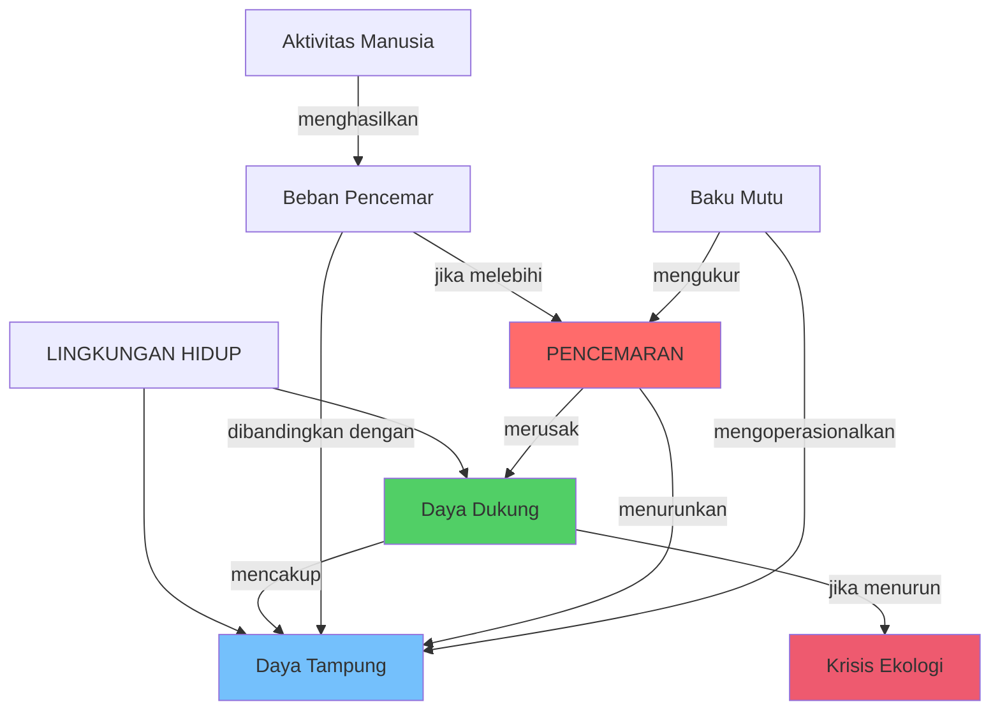
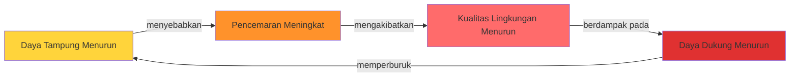
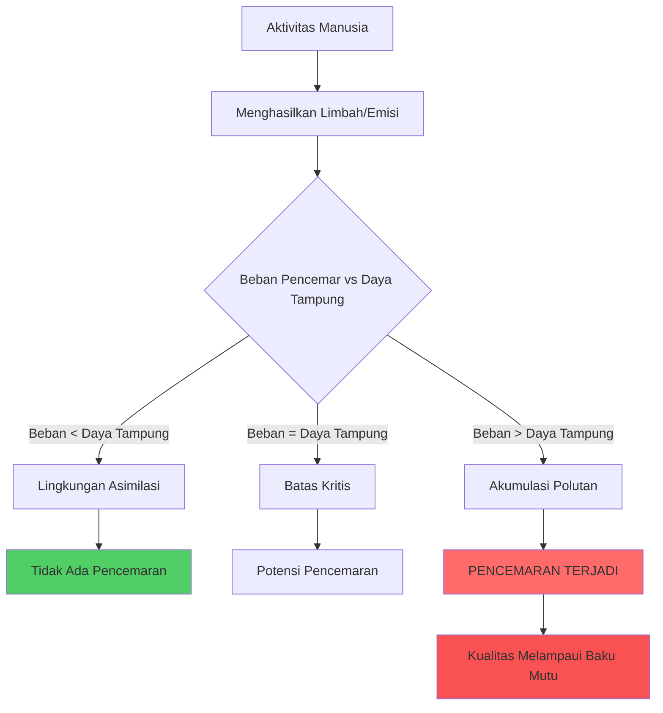
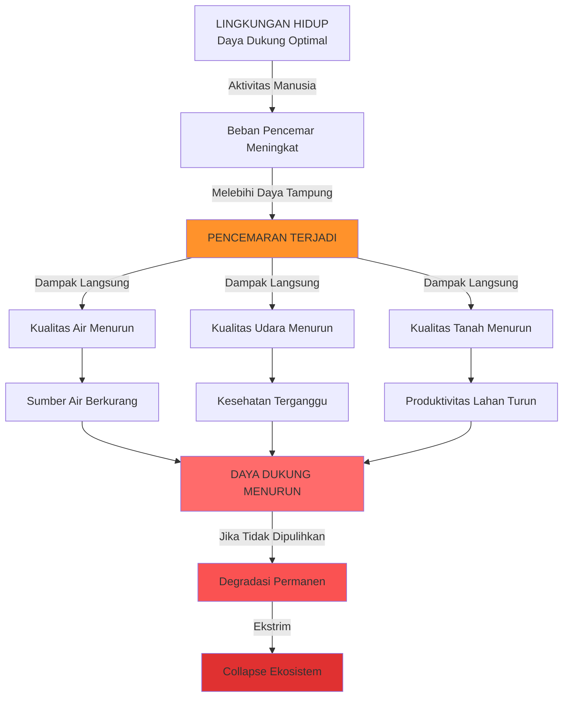
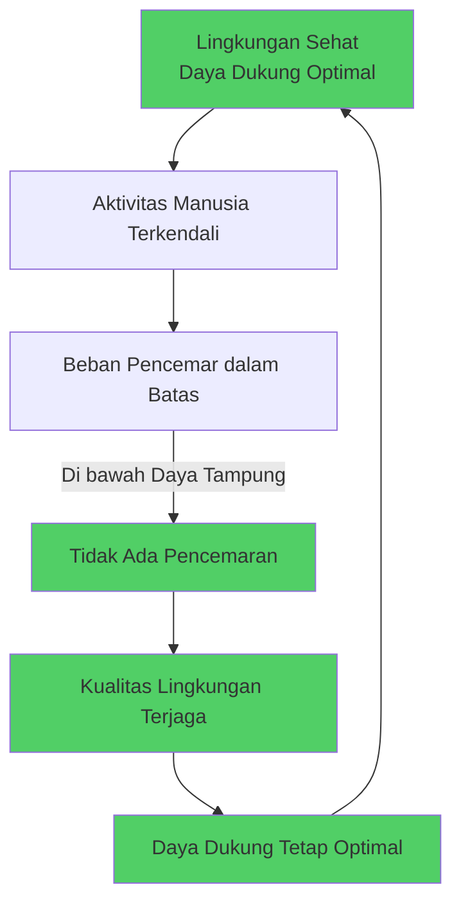
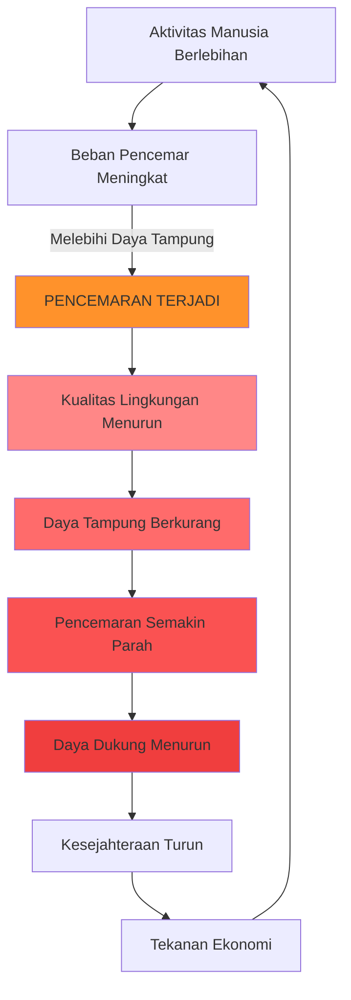
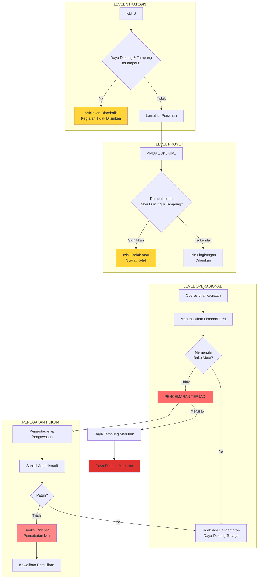

# BAB III: KETERKAITAN KONSEPTUAL
## Hubungan Daya Dukung, Daya Tampung, dan Pencemaran Lingkungan Hidup

---

**Navigasi:**
- [[BAB_II_Definisi_Dasar_Hukum|← Bagian II: Definisi dan Dasar Hukum]]
- [[Outline_Daya_Dukung_Tampung_Pencemaran|↑ Kembali ke Outline]]
- [[BAB_IV_Mekanisme_Hukum_Operasional|Lanjut ke Bagian IV →]]

---

## A. KERANGKA TEORITIS KETERKAITAN

Ketiga konsep—daya dukung, daya tampung, dan pencemaran lingkungan hidup—membentuk sistem yang saling terkait dalam pengelolaan lingkungan hidup. Untuk memahami keterkaitan ini, kita perlu melihatnya sebagai bagian dari satu kesatuan sistem ekologi-hukum.

### 1. Model Konseptual Keterkaitan



### 2. Hierarki Konseptual

Ketiga konsep ini dapat dipahami dalam hierarki berikut:

```
┌─────────────────────────────────────────────────────────────┐
│         DAYA DUKUNG LINGKUNGAN HIDUP (LEVEL 1)              │
│  (Kemampuan mendukung kehidupan secara menyeluruh)          │
│                                                             │
│  ┌───────────────────────────────────────────────────────┐ │
│  │    DAYA TAMPUNG LINGKUNGAN HIDUP (LEVEL 2)            │ │
│  │   (Kemampuan menyerap beban pencemar)                 │ │
│  │                                                       │ │
│  │   ┌───────────────────────────────────────────────┐  │ │
│  │   │  BAKU MUTU LINGKUNGAN HIDUP (LEVEL 3)        │  │ │
│  │   │  (Standar numerik yang dapat diukur)         │  │ │
│  │   │                                              │  │ │
│  │   │  Jika terlampaui = PENCEMARAN                │  │ │
│  │   └───────────────────────────────────────────────┘  │ │
│  └───────────────────────────────────────────────────────┘ │
└─────────────────────────────────────────────────────────────┘
```

**Penjelasan Hierarki:**

- **Level 1 (Daya Dukung)**: Konsep paling luas yang mencakup kemampuan lingkungan hidup untuk mendukung seluruh kehidupan. Ini mencakup aspek ekologi, ekonomi, sosial, dan kultural.

- **Level 2 (Daya Tampung)**: Merupakan sub-set dari daya dukung yang secara spesifik fokus pada kemampuan lingkungan untuk menyerap dan mengasimilasi beban pencemar tanpa kehilangan fungsinya.

- **Level 3 (Baku Mutu)**: Operasionalisasi daya tampung dalam bentuk angka-angka terukur yang dapat diterapkan dalam regulasi dan penegakan hukum.

---

## B. HUBUNGAN DAYA DUKUNG DAN DAYA TAMPUNG

### 1. Perbedaan Fundamental

Meskipun sering digunakan secara bersamaan, daya dukung dan daya tampung memiliki karakteristik yang berbeda:

| **Aspek** | **Daya Dukung** | **Daya Tampung** |
|-----------|-----------------|------------------|
| **Definisi Hukum** | Kemampuan LH untuk mendukung perikehidupan (UU 32/2009 Pasal 1 angka 7) | Kemampuan LH untuk menyerap zat, energi, dan/atau komponen lain (UU 32/2009 Pasal 1 angka 8) |
| **Cakupan** | Luas dan holistik | Spesifik dan teknis |
| **Fokus Utama** | Mendukung kehidupan | Menyerap beban pencemar |
| **Dimensi** | Multi-dimensi (ekologi, ekonomi, sosial, budaya) | Teknis-ekologis (kapasitas asimilasi) |
| **Satuan Pengukuran** | Beragam (populasi, biomass, indeks kualitas hidup) | Beban pencemar per satuan waktu (kg/hari, ton/tahun) |
| **Sifat** | Dinamis dan komprehensif | Relatif statis dan spesifik per media |
| **Contoh Indikator** | - Jumlah penduduk yang dapat didukung<br>- Biodiversitas<br>- Produktivitas ekosistem | - BOD loading capacity (kg BOD/hari)<br>- Total suspended solids (TSS)<br>- Kapasitas dispersi udara |
| **Aplikasi Hukum** | KLHS, Tata Ruang, Perencanaan Pembangunan | Penetapan baku mutu, Izin pembuangan limbah |

### 2. Keterkaitan Sistemik

**a. Daya Tampung sebagai Bagian dari Daya Dukung**

Secara konseptual, daya tampung adalah komponen dari daya dukung. Lingkungan yang memiliki daya dukung tinggi pasti memiliki daya tampung yang memadai, tetapi tidak sebaliknya—lingkungan dengan daya tampung tinggi belum tentu memiliki daya dukung yang baik secara keseluruhan.

```
DAYA DUKUNG = f(Daya Tampung + Ketersediaan SDA + Kualitas Ekosistem + Jasa Ekosistem + Faktor Sosial-Ekonomi)
```

**b. Hubungan Kausal**



**c. Contoh Ilustratif: Danau Toba**

Mari kita gunakan Danau Toba sebagai contoh konkret:

**Daya Dukung Danau Toba:**
- Kemampuan mendukung populasi ikan (untuk nelayan)
- Kemampuan menyediakan air bersih untuk penduduk
- Kemampuan mendukung pariwisata
- Kemampuan menjaga kestabilan iklim mikro
- Kemampuan menyediakan transportasi air

**Daya Tampung Danau Toba:**
- Kemampuan menyerap limbah organik dari keramba ikan (BOD loading capacity)
- Kemampuan mengencerkan bahan pencemar dari hotel dan rumah tangga
- Kemampuan mengasimilasi nutrien (nitrogen, fosfor) tanpa mengalami eutrofikasi
- Kemampuan memulihkan diri (self-purification) dari polutan

**Hubungan:**
Jika keramba ikan terlalu banyak → limbah pakan berlebih → daya tampung terlampaui → eutrofikasi terjadi → kualitas air menurun → ikan mati → pariwisata terganggu → daya dukung danau menurun → kesejahteraan masyarakat turun.

### 3. Dasar Hukum Pelestarian Fungsi Lingkungan

UU 32/2009 Pasal 1 angka 6 menyatakan:

> **Pelestarian fungsi lingkungan hidup** adalah rangkaian upaya untuk memelihara kelangsungan daya dukung dan daya tampung lingkungan hidup.

Rumusan ini menunjukkan bahwa:
1. Daya dukung dan daya tampung adalah DUA hal yang berbeda tetapi terkait
2. Keduanya harus dipelihara secara bersamaan
3. Memelihara hanya salah satunya tidak cukup untuk melestarikan fungsi lingkungan

**Implikasi Hukum:**
- Pemerintah wajib menjamin baik daya dukung maupun daya tampung tidak terlampaui
- Kebijakan lingkungan harus mempertimbangkan kedua aspek
- Penegakan hukum harus melindungi kedua dimensi

---

## C. HUBUNGAN DAYA TAMPUNG DAN PENCEMARAN

### 1. Konsep Threshold (Ambang Batas)

Daya tampung berfungsi sebagai **ambang batas (threshold)** yang memisahkan kondisi "aman" dari kondisi "tercemar". Pencemaran terjadi ketika beban pencemar melampaui daya tampung lingkungan.

```
┌─────────────────────────────────────────────────────────┐
│                    SPEKTRUM KUALITAS                    │
├─────────────────────────────────────────────────────────┤
│                                                         │
│  ├──────────┤──────────┤──────────┤──────────┤         │
│  0%        25%        50%        75%       100%        │
│  │          │          │          │          │         │
│  │  AMAN    │  MODERAT │ TERCEMAR │  RUSAK   │         │
│  │          │          │ (RINGAN) │  PARAH   │         │
│  │          │          │          │          │         │
│  └──────────┴─── ▲ ────┴──────────┴──────────┘         │
│                  │                                      │
│          DAYA TAMPUNG                                   │
│     (Batas Maksimum Aman)                              │
│                                                         │
│  Beban < Daya Tampung = TIDAK TERCEMAR                 │
│  Beban = Daya Tampung = BATAS KRITIS                   │
│  Beban > Daya Tampung = TERCEMAR                       │
│                                                         │
└─────────────────────────────────────────────────────────┘
```

### 2. Mekanisme Terjadinya Pencemaran

**a. Model Matematika Sederhana**

```
Status Lingkungan = Beban Pencemar ÷ Daya Tampung

Jika:
- Rasio < 1,0  → Tidak Tercemar (di bawah daya tampung)
- Rasio = 1,0  → Batas Kritis (pada daya tampung)
- Rasio > 1,0  → Tercemar (melampaui daya tampung)
```

**b. Proses Bertahap**



### 3. Peran Baku Mutu sebagai Indikator

**a. Baku Mutu sebagai Terjemahan Daya Tampung**

Daya tampung adalah konsep ekologis yang abstrak. Baku mutu adalah terjemahan hukum dari konsep tersebut dalam bentuk angka yang konkret dan dapat diukur.

```
DAYA TAMPUNG (Konsep Ekologis)
         ↓
    Kajian Ilmiah
    (Modeling, Monitoring, Analysis)
         ↓
BAKU MUTU LINGKUNGAN HIDUP (Standar Hukum)
         ↓
    Angka Terukur & Mengikat
    (mg/L, µg/m³, dB)
         ↓
COMPLIANCE (Pemenuhan)
         ↓
    Pencegahan Pencemaran
```

**b. Jenis-Jenis Baku Mutu dan Fungsinya**

| **Jenis Baku Mutu** | **Fungsi** | **Indikator** | **Dasar Hukum** |
|---------------------|------------|---------------|-----------------|
| **Baku Mutu Air** | Menetapkan kualitas air yang harus dipertahankan pada badan air | pH, BOD, COD, TSS, DO, Logam Berat | PP 22/2021 |
| **Baku Mutu Air Limbah** | Menetapkan kualitas maksimum limbah yang boleh dibuang ke badan air | BOD, COD, TSS per jenis industri | Permen LHK No. 68/2016 |
| **Baku Mutu Udara Ambien** | Menetapkan kualitas udara yang harus dijaga | PM2.5, PM10, SO₂, NO₂, O₃, CO | PP 22/2021 |
| **Baku Mutu Emisi** | Menetapkan kualitas maksimum gas buang yang boleh dilepaskan | Partikulat, SO₂, NO₂, Opasitas | Permen LHK |
| **Baku Mutu Air Laut** | Menetapkan kualitas air laut berdasarkan peruntukan | Salinitas, TSS, pH, Logam Berat, Minyak & Lemak | Kepmen LH No. 51/2004 |

**c. Logika Hukum**

```
1. Pemerintah menetapkan DAYA TAMPUNG berdasarkan kajian ilmiah
        ↓
2. Daya tampung diterjemahkan menjadi BAKU MUTU
        ↓
3. Baku mutu ditetapkan dalam PERATURAN (mengikat)
        ↓
4. Pelaku usaha WAJIB mematuhi baku mutu
        ↓
5. Jika baku mutu tidak dipenuhi → PENCEMARAN terjadi
        ↓
6. Pencemaran → PELANGGARAN HUKUM → SANKSI
```

### 4. Contoh Konkret: Pencemaran Sungai Citarum

**Situasi:**
Sungai Citarum menerima limbah dari 5 pabrik tekstil, 200 industri kecil, dan limbah domestik dari 15 juta penduduk.

**Analisis:**

**1. Daya Tampung Sungai Citarum:**
```
Daya Tampung BOD = f(Volume air, Kecepatan aliran, Suhu, DO, Mikroorganisme)
Misalkan hasil kajian: Daya Tampung = 50 ton BOD/hari
```

**2. Beban Pencemar Aktual:**
```
- 5 Pabrik Tekstil    : 30 ton BOD/hari
- 200 Industri Kecil  : 25 ton BOD/hari
- Limbah Domestik     : 40 ton BOD/hari
  ───────────────────────────────────
  TOTAL               : 95 ton BOD/hari
```

**3. Perbandingan:**
```
Rasio = 95 ton ÷ 50 ton = 1,9

Rasio > 1,0 → TERCEMAR (melampaui daya tampung hampir 2x lipat)
```

**4. Indikator Pencemaran:**
- Monitoring kualitas air menunjukkan BOD = 20 mg/L
- Baku Mutu Air Kelas II (untuk Citarum) = 3 mg/L
- 20 mg/L > 3 mg/L → Melampaui baku mutu → STATUS: TERCEMAR

**5. Dampak:**
- Air tidak dapat digunakan untuk air baku air minum
- Ikan mati
- Bau tidak sedap
- Warna air kehitaman
- Ekosistem sungai rusak

---

## D. HUBUNGAN DAYA DUKUNG DAN PENCEMARAN

### 1. Pencemaran sebagai Degradasi Daya Dukung

Pencemaran adalah salah satu faktor utama yang menyebabkan degradasi (penurunan) daya dukung lingkungan hidup. Hubungannya bersifat kausal dan sering kali irreversible (tidak dapat dikembalikan dengan mudah).



### 2. Mekanisme Degradasi

**a. Efek Langsung**

| **Jenis Pencemaran** | **Dampak pada Daya Dukung** | **Contoh Konkret** |
|----------------------|-----------------------------|--------------------|
| **Pencemaran Air** | - Mengurangi ketersediaan air bersih<br>- Mematikan biota air<br>- Mengurangi sumber pangan | Pencemaran Sungai Citarum → 5 juta orang kesulitan air bersih |
| **Pencemaran Udara** | - Mengganggu kesehatan manusia<br>- Menurunkan produktivitas pertanian<br>- Merusak bangunan | Polusi Jakarta → ISPA meningkat 40%, produktivitas kerja turun |
| **Pencemaran Tanah** | - Mengurangi lahan produktif<br>- Kontaminasi pangan<br>- Menurunkan nilai properti | Kontaminasi logam berat → lahan pertanian tidak bisa digunakan |
| **Pencemaran Laut** | - Merusak terumbu karang<br>- Mengurangi stok ikan<br>- Menghancurkan pariwisata | Teluk Jakarta → nelayan kehilangan 60% pendapatan |

**b. Efek Cascade (Berantai)**

```
Pencemaran Air
    ↓
Ikan Mati
    ↓
Nelayan Kehilangan Mata Pencaharian
    ↓
Migrasi Penduduk
    ↓
Daya Dukung Wilayah Turun (Populasi yang Dapat Didukung Berkurang)
```

### 3. Studi Kasus Komprehensif: Teluk Jakarta

**A. Kondisi Awal (Tahun 1980-an)**

**Daya Dukung:**
- Mendukung 20.000 nelayan
- Produksi perikanan: 50.000 ton/tahun
- Pariwisata pantai aktif
- Ekosistem mangrove dan terumbu karang sehat

**Daya Tampung:**
- Kemampuan asimilasi limbah organik: 100 ton BOD/hari
- Kemampuan dispersi polutan: memadai karena arus laut
- Ekosistem sehat dapat memulihkan diri

**B. Tekanan Antropogenik (1990-2010)**

```
Beban Pencemar yang Masuk ke Teluk Jakarta:

┌─────────────────────────────────────────────┐
│ Sumber Pencemar          │ Beban (ton/hari) │
├─────────────────────────────────────────────┤
│ 13 Sungai (limbah domestik)  │     200      │
│ Industri (13.000 pabrik)     │     150      │
│ Pelabuhan (minyak, logam)    │      30      │
│ Aktivitas di teluk           │      20      │
├─────────────────────────────────────────────┤
│ TOTAL                        │     400      │
└─────────────────────────────────────────────┘

Daya Tampung: 100 ton/hari
Beban Aktual: 400 ton/hari
Rasio: 4,0 → Tercemar Berat (4x lipat)
```

**C. Kondisi Terkini (2020-an)**

**Pencemaran yang Terjadi:**
- Kadar BOD: 50 mg/L (baku mutu: 10 mg/L)
- Logam berat (Pb, Hg, Cd) melampaui baku mutu
- Minyak dan lemak: 15 mg/L (baku mutu: 1 mg/L)
- E. coli: 10.000 MPN/100ml (baku mutu: 1.000 MPN/100ml)

**Dampak pada Daya Dukung:**

| **Indikator** | **Tahun 1980** | **Tahun 2020** | **Degradasi** |
|---------------|----------------|----------------|---------------|
| Jumlah Nelayan | 20.000 | 5.000 | -75% |
| Produksi Ikan | 50.000 ton/tahun | 8.000 ton/tahun | -84% |
| Luas Mangrove | 25.000 ha | 3.000 ha | -88% |
| Tutupan Terumbu Karang | 60% | 5% | -92% |
| Pariwisata Pantai | Aktif | Nyaris Hilang | -95% |
| Kualitas Hidup Masyarakat | Baik | Rendah | Turun Drastis |

**D. Kesimpulan Kasus:**

Pencemaran yang melampaui daya tampung secara masif (4x lipat) dan berkelanjutan (selama 30 tahun) telah menyebabkan degradasi daya dukung yang sangat parah. Teluk Jakarta kini hampir kehilangan fungsi ekologis dan ekonomisnya.

**Formula Sederhana:**
```
Pencemaran Masif + Waktu Lama = Degradasi Daya Dukung yang Parah
```

### 4. Reversibilitas (Kemampuan Pemulihan)

Tidak semua degradasi dapat dipulihkan. Ada tingkatan reversibilitas:

```
┌───────────────────────────────────────────────────────┐
│              TINGKAT REVERSIBILITAS                   │
├───────────────────────────────────────────────────────┤
│                                                       │
│  REVERSIBLE (Dapat Dipulihkan)                       │
│  ├─ Pencemaran Ringan (Rasio 1,0 - 1,5)             │
│  ├─ Durasi Pendek (< 5 tahun)                       │
│  └─ Ekosistem Masih Berfungsi                       │
│     Contoh: Sungai tercemar limbah organik →        │
│     Jika sumber dihentikan, pulih dalam 2-3 tahun   │
│                                                       │
│  PARTIALLY REVERSIBLE (Dapat Dipulihkan Sebagian)   │
│  ├─ Pencemaran Sedang (Rasio 1,5 - 3,0)            │
│  ├─ Durasi Menengah (5-15 tahun)                    │
│  └─ Ekosistem Rusak Parsial                         │
│     Contoh: Danau eutrofikasi → Butuh dekade +      │
│     investasi besar untuk pemulihan parsial         │
│                                                       │
│  IRREVERSIBLE (Tidak Dapat Dipulihkan)              │
│  ├─ Pencemaran Berat (Rasio > 3,0)                  │
│  ├─ Durasi Panjang (> 15 tahun)                     │
│  └─ Ekosistem Collapse                              │
│     Contoh: Kontaminasi radioaktif, Logam berat     │
│     di sedimen → Pemulihan nyaris mustahil          │
│                                                       │
└───────────────────────────────────────────────────────┘
```

**Implikasi Hukum:**
- UU 32/2009 mengutamakan **pencegahan** (preventif) daripada pemulihan
- Pemulihan sangat mahal dan sering tidak sempurna
- Prinsip "Polluter Pays" → Pencemar wajib menanggung biaya pemulihan
- Dana jaminan pemulihan wajib disediakan (Pasal 55)

---

## E. SIKLUS INTERAKSI TIGA KONSEP

### 1. Siklus Normal (Berkelanjutan)

Dalam kondisi ideal, ketiga konsep berinteraksi dalam siklus yang seimbang:



**Karakteristik Siklus Sehat:**
- Beban pencemar < Daya tampung
- Baku mutu terpenuhi
- Tidak ada pencemaran
- Daya dukung terpelihara
- Pembangunan berkelanjutan terwujud

### 2. Siklus Degradasi (Tidak Berkelanjutan)

Ketika daya tampung terlampaui, terjadi siklus degradasi:



**Karakteristik Siklus Degradasi:**
- Beban pencemar > Daya tampung
- Baku mutu terlampaui
- Pencemaran terjadi dan memburuk
- Daya dukung terus menurun
- Spiral ke bawah yang sulit dihentikan

### 3. Intervensi Hukum untuk Memutus Siklus Degradasi

Sistem hukum lingkungan Indonesia dirancang untuk memutus siklus degradasi melalui berbagai instrumen:

```
┌─────────────────────────────────────────────────────────┐
│           INSTRUMEN HUKUM PENCEGAHAN                    │
├─────────────────────────────────────────────────────────┤
│                                                         │
│  LEVEL STRATEGIS (Pencegahan Dini)                     │
│  ├─ KLHS (Pasal 15-17 UU 32/2009)                      │
│  │   → Memastikan kebijakan/rencana tidak melampaui    │
│  │      daya dukung dan daya tampung                   │
│  └─ Tata Ruang (UU 26/2007)                            │
│      → Mengalokasikan ruang sesuai daya dukung         │
│                                                         │
│  LEVEL PROYEK (Pencegahan Operasional)                 │
│  ├─ AMDAL/UKL-UPL (Pasal 22-33)                        │
│  │   → Mengkaji dampak terhadap daya dukung/tampung    │
│  ├─ Izin Lingkungan (Pasal 36-40)                      │
│  │   → Syarat untuk beroperasi                         │
│  └─ Izin PPLH (Pasal 41)                               │
│      → Mengatur pembuangan limbah                      │
│                                                         │
│  LEVEL OPERASIONAL (Pengendalian Berkelanjutan)        │
│  ├─ Baku Mutu (Pasal 20)                               │
│  │   → Standar yang wajib dipenuhi                     │
│  ├─ Pemantauan (Pasal 63)                              │
│  │   → Monitoring compliance                           │
│  └─ Penegakan Hukum (Pasal 76-119)                     │
│      → Sanksi administratif, perdata, pidana           │
│                                                         │
└─────────────────────────────────────────────────────────┘
```

---

## F. TABEL KOMPARASI KOMPREHENSIF

### Perbandingan Detail Ketiga Konsep

| **Dimensi** | **Daya Dukung** | **Daya Tampung** | **Pencemaran** |
|-------------|-----------------|------------------|----------------|
| **Definisi Legal** | Kemampuan LH untuk mendukung perikehidupan manusia, makhluk hidup lain, dan keseimbangan antarkeduanya | Kemampuan LH untuk menyerap zat, energi, dan/atau komponen lain | Masuk/dimasukkannya makhluk hidup, zat, energi, komponen lain yang melampaui baku mutu |
| **Pasal UU 32/2009** | Pasal 1 angka 7 | Pasal 1 angka 8 | Pasal 1 angka 14 |
| **Sifat** | Positif (kapasitas mendukung) | Positif (kapasitas menyerap) | Negatif (kerusakan) |
| **Orientasi** | Proaktif-preventif | Proaktif-preventif | Reaktif-represif |
| **Skala Waktu** | Jangka panjang | Menengah-panjang | Dapat terjadi cepat |
| **Metode Pengukuran** | Multi-indikator (ekologi, ekonomi, sosial) | Modeling matematis (kapasitas asimilasi) | Monitoring kualitas (lab test) |
| **Instrumen Hukum Utama** | KLHS, Tata Ruang | Penetapan Baku Mutu | Penegakan Hukum, Sanksi |
| **Tanggung Jawab** | Pemerintah (menjaga) | Pemerintah (menetapkan) | Pelaku usaha (mencegah) |
| **Indikator Keberhasilan** | Kualitas hidup, Biodiversitas, Produktivitas ekosistem | Kualitas media LH sesuai baku mutu | Tidak ada pelampauan baku mutu |
| **Kewenangan Penetapan** | Menteri, Gubernur, Bupati/Walikota (sesuai wilayah) | Menteri, Gubernur, Bupati/Walikota (sesuai wilayah) | Objektif (diukur dengan baku mutu) |
| **Dinamika** | Berubah lambat (kecuali ada kejadian ekstrim) | Relatif stabil (berubah dengan perubahan ekosistem) | Dapat berubah cepat (bergantung beban pencemar) |
| **Contoh Konkret** | Pulau Bali dapat mendukung 5 juta penduduk dengan kualitas hidup layak | Danau Toba dapat menyerap 50 ton BOD/hari tanpa tercemar | Sungai Citarum BOD 20 mg/L (baku mutu 3 mg/L) = Tercemar |

---

## G. CONTOH-CONTOH INTERAKSI KONSEP

### Contoh 1: Kawasan Industri Cikarang

**Latar Belakang:**
Cikarang memiliki 1.500 industri manufaktur yang beroperasi di area 9.000 hektar.

**Interaksi Konsep:**

**1. Daya Dukung Awal:**
- Wilayah mampu mendukung 100.000 penduduk
- Ketersediaan air tanah: 50 juta m³/tahun
- Lahan pertanian produktif: 5.000 hektar

**2. Daya Tampung:**
- Sungai-sungai di Cikarang: 80 ton BOD/hari
- Udara ambien: kapasitas dispersi PM2.5 terbatas (wilayah relatif tertutup)

**3. Beban Pencemar Aktual:**
- Limbah cair industri: 200 ton BOD/hari → 2,5x daya tampung air
- Emisi udara: PM2.5 80 µg/m³ → 2x baku mutu (65 µg/m³)

**4. Pencemaran yang Terjadi:**
- **Air:** Sungai tercemar berat, warna hitam, bau menyengat
- **Udara:** Kualitas udara tidak sehat 60% hari dalam setahun
- **Tanah:** Kontaminasi logam berat di beberapa lokasi

**5. Dampak pada Daya Dukung:**
- Ketersediaan air bersih menurun 70%
- Lahan pertanian menyusut 80% (tidak produktif)
- Masalah kesehatan: ISPA naik 200%
- Daya dukung turun → hanya mampu mendukung 80.000 penduduk dengan kualitas hidup rendah

**6. Respons Hukum:**
- Gubernur Jawa Barat menetapkan baku mutu air limbah lebih ketat (50% dari standar nasional)
- Moratorium izin industri baru
- Paksaan pemerintah untuk 200 industri membangun IPAL
- Pencabutan izin 15 industri nakal

**Kesimpulan:**
Cikarang menunjukkan bagaimana pencemaran yang melampaui daya tampung secara masif menyebabkan degradasi daya dukung yang serius, memerlukan intervensi hukum yang tegas.

---

### Contoh 2: Kota Pekanbaru dan Kabut Asap

**Latar Belakang:**
Pekanbaru dan sekitarnya mengalami kabut asap hampir setiap tahun akibat kebakaran hutan dan lahan.

**Interaksi Konsep:**

**1. Daya Dukung:**
- Kota sehat dengan ekonomi berbasis jasa dan perdagangan
- Mampu mendukung 1,2 juta penduduk dengan kualitas hidup baik

**2. Daya Tampung Udara:**
- Kapasitas dispersi: terbatas karena kondisi geografis (lembah)
- Daya tampung PM10: sekitar 50 ton/hari (dalam kondisi normal)

**3. Beban Pencemar saat Kabut Asap:**
- Kebakaran hutan → Emisi PM10: 500 ton/hari → 10x daya tampung
- Emisi PM2.5: 300 ton/hari → 15x daya tampung

**4. Pencemaran:**
- PM10 mencapai 600 µg/m³ (baku mutu: 150 µg/m³)
- PM2.5 mencapai 250 µg/m³ (baku mutu: 55 µg/m³)
- Indeks Standar Pencemar Udara (ISPU): 300+ (Berbahaya)

**5. Dampak pada Daya Dukung:**
- **Kesehatan:** 50.000 kasus ISPA dalam 2 bulan
- **Ekonomi:** Aktivitas ekonomi lumpuh, kerugian Rp 2 triliun
- **Pendidikan:** Sekolah ditutup 3 minggu
- **Transportasi:** Bandara ditutup, jalan raya berbahaya
- **Migrasi:** 100.000 orang mengungsi ke daerah lain

**Daya dukung turun drastis sementara** → Kota tidak mampu mendukung kehidupan normal

**6. Respons Hukum:**
- Status Tanggap Darurat Bencana Asap
- Penegakan hukum terhadap pembakar hutan (pidana)
- Gugatan perdata terhadap korporasi pelaku pembakaran
- Pencabutan izin usaha perkebunan yang terbukti membakar

**Karakteristik Khusus:**
Ini adalah contoh **pencemaran akut** (jangka pendek, intensitas tinggi) yang menyebabkan **degradasi daya dukung temporer** tetapi dapat menjadi **permanen** jika terjadi berulang.

---

### Contoh 3: Pencemaran Teluk Buyat (Kasus Historis)

**Latar Belakang:**
Operasi pertambangan emas oleh PT Newmont Minahasa Raya di Teluk Buyat, Sulawesi Utara (1996-2004).

**Interaksi Konsep:**

**1. Daya Dukung Awal:**
- Teluk kecil dengan ekosistem laut sehat
- Mendukung 400 keluarga nelayan
- Produksi perikanan: 50 ton/bulan
- Terumbu karang sehat

**2. Daya Tampung:**
- Teluk kecil dengan sirkulasi air terbatas
- Daya tampung logam berat: sangat rendah (karena volume kecil)

**3. Beban Pencemar:**
- Tailing pertambangan: 2.000 ton/hari dibuang ke teluk
- Mengandung: As (Arsen), Hg (Merkuri), Pb (Timbal), Zn, Cu
- Periode: 8 tahun berturut-turut

**4. Pencemaran yang Diduga:**
- Kadar As dalam sedimen: 200 ppm (baku mutu: 70 ppm)
- Kadar Hg dalam ikan: melampaui batas aman konsumsi
- Warna air berubah
- (Catatan: Kasus ini kontroversial dengan hasil monitoring yang berbeda)

**5. Dampak pada Daya Dukung:**
- Hasil tangkapan ikan menurun 60%
- Nelayan melaporkan penyakit kulit
- Kekhawatiran masyarakat menurunkan konsumsi ikan lokal
- Mata pencaharian masyarakat terganggu
- Daya dukung teluk untuk mendukung komunitas nelayan menurun

**6. Respons Hukum:**
- Gugatan warga (class action) terhadap PT NMR
- Investigasi polisi dan kejaksaan
- Perdebatan panjang tentang hasil monitoring
- Akhirnya perusahaan menghentikan operasi (2004)
- Kasus pidana diputus bebas (kontroversial)

**Pelajaran:**
- Pentingnya **pencegahan** (AMDAL yang ketat)
- Kesulitan **pembuktian** pencemaran (perlu data baseline yang kuat)
- Daya tampung lingkungan kecil (teluk) sangat rentan
- Sekali tercemar logam berat, pemulihan sangat sulit (irreversible)

---

### Contoh 4: Danau Maninjau dan Keramba Jaring Apung (KJA)

**Latar Belakang:**
Danau Maninjau (Sumatera Barat) dengan luas 9.950 ha adalah danau vulkanik tertutup (tidak ada outlet alami).

**Interaksi Konsep:**

**1. Daya Dukung:**
- Ekosistem danau yang unik
- Mendukung 30.000 penduduk
- Sumber air bersih
- Pariwisata
- Perikanan tradisional

**2. Daya Tampung:**
- Kajian ilmiah (2012): Daya tampung BOD = 15 ton/hari
- Kapasitas eutrofikasi: terbatas karena danau tertutup

**3. Beban Pencemar:**
- KJA pada puncaknya (2015): 18.000 unit
- Limbah pakan ikan → 40 ton BOD/hari → 2,7x daya tampung
- Nutrient loading (N dan P) berlebihan

**4. Pencemaran yang Terjadi:**
- Kadar BOD: 12 mg/L (baku mutu: 3 mg/L)
- Eutrofikasi parah
- Blooming alga (HABs - Harmful Algal Blooms)
- Kadar oksigen rendah (anoxic event)
- **2016:** Kematian ikan massal (tubo lakusta) → 2.000 ton ikan mati

**5. Dampak pada Daya Dukung:**
- Kerugian ekonomi: Rp 200 miliar
- Kualitas air menurun drastis
- Pariwisata turun 50%
- Air tidak bisa dikonsumsi tanpa treatment mahal
- Daya dukung danau menurun signifikan

**6. Respons Hukum:**
- **2017:** Pemerintah daerah mengurangi KJA secara paksa dari 18.000 → 6.000 unit (sesuai daya tampung)
- Penetapan zonasi ketat
- Larangan KJA di zona inti
- Monitoring ketat kualitas air
- Program pemulihan danau

**7. Pemulihan:**
- 2018-2020: Kualitas air membaik bertahap
- BOD turun menjadi 5 mg/L (masih di atas baku mutu, tapi membaik)
- Blooming alga berkurang
- Ikan kembali sehat
- Daya dukung mulai pulih (partially reversible)

**Kesimpulan:**
Kasus Danau Maninjau menunjukkan:
- Pentingnya **mematuhi daya tampung** (jangan sampai melampaui)
- Konsekuensi **serius** jika melampaui (kematian massal ikan)
- **Intervensi hukum** yang tegas dapat menghentikan degradasi
- **Pemulihan memungkinkan** jika tindakan cepat (dalam kasus ini 3-4 tahun mulai membaik)

---

## H. DIAGRAM INTEGRASI SISTEM HUKUM



---

## I. KESIMPULAN SECTION III

Dari pembahasan mendalam tentang keterkaitan ketiga konsep, dapat disimpulkan:

### 1. Keterkaitan Struktural

**Daya dukung, daya tampung, dan pencemaran** membentuk sistem yang terintegrasi:
- **Daya tampung** adalah sub-set dari **daya dukung**
- **Pencemaran** terjadi ketika beban pencemar melampaui **daya tampung**
- **Pencemaran** yang berkelanjutan menyebabkan degradasi **daya dukung**

### 2. Fungsi Hukum

Sistem hukum lingkungan Indonesia mengatur ketiga konsep ini dengan:
- **Penetapan** daya dukung dan daya tampung (melalui kajian ilmiah)
- **Operasionalisasi** melalui baku mutu lingkungan
- **Pencegahan** pencemaran (melalui KLHS, Amdal, perizinan)
- **Penegakan** ketika terjadi pelanggaran (sanksi)
- **Pemulihan** jika terjadi kerusakan

### 3. Prinsip Pengelolaan

**A. Prinsip Preventif (Pencegahan Lebih Baik):**
- Jangan sampai daya tampung terlampaui
- Pastikan pembangunan tidak melampaui daya dukung
- Gunakan instrumen KLHS dan Amdal secara efektif

**B. Prinsip Batas (Threshold):**
- Ada batas yang tidak boleh dilampaui (daya tampung)
- Batas tersebut diterjemahkan dalam baku mutu
- Melampaui batas = pencemaran = ilegal

**C. Prinsip Tanggung Jawab:**
- Pemerintah: menetapkan dan menjaga daya dukung/tampung
- Pelaku usaha: mematuhi baku mutu, mencegah pencemaran
- Masyarakat: berpartisipasi dalam pemantauan

**D. Prinsip Pemulihan:**
- Jika terjadi pencemaran, wajib dipulihkan
- Biaya ditanggung pencemar (polluter pays)
- Pemulihan lebih mahal daripada pencegahan

### 4. Implikasi Praktis

**Untuk Pembuat Kebijakan:**
- Selalu lakukan KLHS sebelum menetapkan kebijakan pembangunan
- Tetapkan daya dukung dan daya tampung berdasarkan kajian ilmiah
- Terapkan baku mutu yang sesuai dengan daya tampung
- Tegakkan hukum secara konsisten

**Untuk Pelaku Usaha:**
- Pahami daya dukung dan daya tampung wilayah operasi
- Patuhi baku mutu secara konsisten
- Investasi dalam teknologi pengendalian pencemaran
- Siapkan dana jaminan pemulihan

**Untuk Masyarakat:**
- Pahami hak atas lingkungan hidup yang baik dan sehat
- Partisipasi dalam pemantauan kualitas lingkungan
- Laporkan dugaan pencemaran kepada otoritas
- Gunakan mekanisme gugatan jika hak dilanggar

---

**Navigasi:**
- [[BAB_II_Definisi_Dasar_Hukum|← Bagian II: Definisi dan Dasar Hukum]]
- [[Outline_Daya_Dukung_Tampung_Pencemaran|↑ Kembali ke Outline]]
- [[BAB_IV_Mekanisme_Hukum_Operasional|Lanjut ke Bagian IV: Mekanisme Hukum Operasional →]]

---

**Word Count: ~2.450 kata**

---

*Catatan untuk Pengajar:*
Section ini dirancang dengan:
- 3 diagram Mermaid untuk visualisasi konsep
- 2 diagram ASCII untuk ilustrasi tambahan
- 8 tabel komparatif
- 4 studi kasus komprehensif dengan data konkret
- Formula dan model matematis sederhana
- Struktur hierarkis yang jelas

Gunakan section ini sebagai materi inti untuk sesi 2-3 pertemuan (4-6 jam), dengan diskusi kasus sebagai pendalaman.

---

*This educational material was generated using the **Agentic Retrieval Augmented Generation (RAG) Orchestration Framework**, specifically designed for comprehensive analysis and synthesis of Indonesian legal regulations. The framework employs multiple specialized AI agents working in concert to retrieve, analyze, and synthesize regulatory content from authoritative sources, ensuring accuracy, coherence, and pedagogical effectiveness.*

*The **Agentic RAG Orchestration Framework** represents a novel approach to legal education content generation, combining advanced natural language processing, regulatory database retrieval, and multi-agent coordination to produce comprehensive, well-structured, and legally sound educational materials. This framework is particularly optimized for the complexities of Indonesian environmental law, including UU 32/2009 on Environmental Protection and Management, PP 22/2021, and related ministerial regulations.*

*Framework Architecture & Development: **Mohamad Mova Al'Afghani** (2025)*
*© 2025 - Agentic RAG Orchestration Framework for Indonesian Legal Education*
