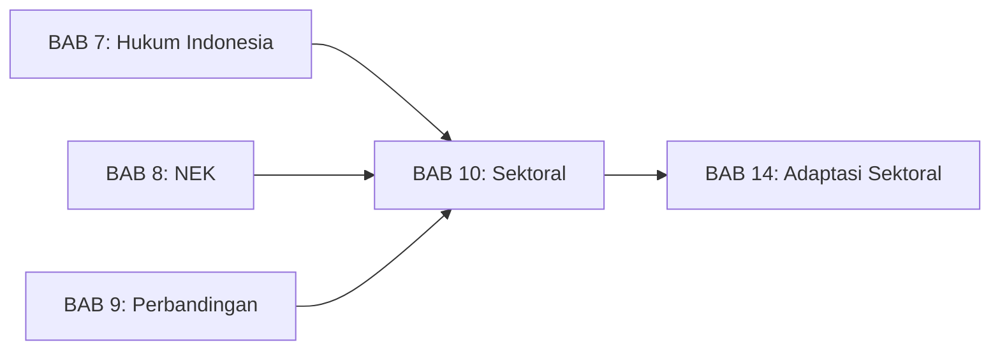
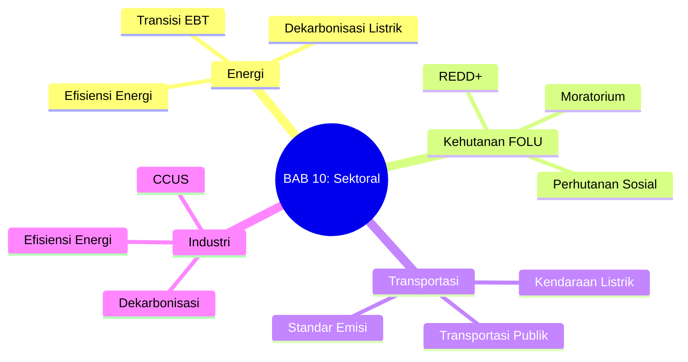
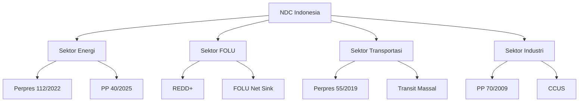

---
publish: true
bab: "10"
judul: "Hukum Iklim Sektoral"
level: "S1"
durasi_baca: "90 menit"
tags:
  - buku-ajar
  - hukum-06-PerubahanIklim
  - sektoral
  - energi
  - kehutanan
  - transportasi
---

# BAB 10: Hukum Iklim Sektoral

---

## A. PENDAHULUAN

### 1. Capaian Pembelajaran (Sub-CPMK)

Setelah mempelajari bab ini, mahasiswa mampu:

1. **Menjelaskan** regulasi iklim di sektor-sektor utama: energi, kehutanan, transportasi, industri
2. **Menganalisis** tantangan hukum spesifik di masing-masing sektor
3. **Mengevaluasi** koherensi regulasi sektoral dengan target NDC
4. **Mengidentifikasi** peluang penguatan regulasi sektoral

### 2. Indikator Pencapaian

- [ ] Mahasiswa dapat menyebutkan regulasi utama di setiap sektor (energi, kehutanan, transportasi, industri)
- [ ] Mahasiswa dapat menjelaskan konsep REDD+ dan FOLU Net Sink 2030
- [ ] Mahasiswa dapat menganalisis tantangan hukum transisi energi
- [ ] Mahasiswa dapat mengidentifikasi kesenjangan regulasi sektoral

### 3. Deskripsi Singkat

Target NDC Indonesia tidak dapat dicapai tanpa aksi sektoral yang terkoordinasi. Bab ini mengkaji regulasi iklim di empat sektor utama—energi, kehutanan/lahan (FOLU), transportasi, dan industri—yang bersama-sama menyumbang lebih dari 90% emisi GRK Indonesia. Setiap sektor memiliki tantangan hukum spesifik yang memerlukan pendekatan berbeda.

### 4. Hubungan dengan Bab Lain

Bab ini memperdalam [[Buku-Ajar-Hukum-06-PerubahanIklim-07-Kerangka-Hukum-Indonesia_BAB-07|BAB 7]] dengan fokus pada regulasi sektor-sektor utama. Untuk pembahasan adaptasi sektoral (bukan mitigasi), lihat [[Buku-Ajar-Hukum-06-PerubahanIklim-14-Hukum-Adaptasi-Sektoral_BAB-14|BAB 14]].

### 5. Peta Konsep Bab

---

## B. PENYAJIAN MATERI

### 1. Sektor Energi: Transisi ke Ekonomi Rendah Karbon

Sektor energi adalah kontributor terbesar kedua emisi GRK Indonesia setelah FOLU, dengan proporsi sekitar 35% dari total emisi nasional.[^1] Pembangkitan listrik berbasis batubara, penggunaan minyak bumi untuk transportasi, dan konsumsi gas untuk industri menjadi sumber utama emisi sektor ini. Dengan demikian, transisi energi—pergeseran sistematis dari energi berbasis fosil ke energi terbarukan—adalah prasyarat mutlak pencapaian target NDC Indonesia.

Kerangka hukum transisi energi Indonesia berkembang pesat dalam beberapa tahun terakhir, dengan serangkaian regulasi yang bertujuan mempercepat penetrasi energi baru terbarukan (EBT) sekaligus mengelola penurunan peran batubara secara terencana. Namun demikian, berbagai tantangan hukum masih menghambat transisi ini, dari kontrak jangka panjang yang mengunci pembangkit fosil hingga inkonsistensi kebijakan yang menciptakan sinyal campuran bagi investor.

[^1]: KLHK, *Indonesia: Third Biennial Update Report* (UNFCCC 2021) 25-30.

#### 1.1 Arsitektur Regulasi Transisi Energi

**Rencana Umum Energi Nasional (RUEN)** yang ditetapkan melalui Peraturan Presiden Nomor 22 Tahun 2017 menjadi dokumen perencanaan energi jangka panjang yang menetapkan target bauran energi primer nasional. RUEN menargetkan bauran energi baru terbarukan (EBT) minimal 23% pada 2025 dan 31% pada 2050—meskipun angka ini kini dipandang terlalu konservatif dan sedang dalam proses revisi.[^2]

**Peraturan Presiden Nomor 112 Tahun 2022 tentang Percepatan Pengembangan Energi Terbarukan untuk Penyediaan Tenaga Listrik** menjadi regulasi paling komprehensif untuk percepatan EBT. Perpres ini mengatur berbagai aspek krusial: harga pembelian listrik EBT oleh PLN, mekanisme tender proyek, kewajiban pembelian (*off-take guarantee*), dan insentif fiskal. Perpres 112/2022 juga menetapkan prinsip bahwa pembangkit EBT harus diprioritaskan dalam *dispatch order* sistem kelistrikan.[^3]

Beberapa ketentuan penting Perpres 112/2022:

**Pertama, harga pembelian listrik EBT** ditetapkan berdasarkan formula yang memperhitungkan biaya pembangkitan rata-rata PLN (Biaya Pokok Penyediaan/BPP) di wilayah setempat. Untuk wilayah dengan BPP di atas rata-rata nasional, harga pembelian EBT dapat mencapai 100% BPP—memberikan insentif signifikan.[^4]

**Kedua, kewajiban PLN** untuk membeli seluruh listrik yang dihasilkan pembangkit EBT yang sudah memiliki kontrak (*take-or-pay*), mengurangi risiko pasar bagi investor.

**Ketiga, percepatan perizinan** melalui penyederhanaan prosedur dan koordinasi antar-instansi.

**Peraturan Pemerintah Nomor 40 Tahun 2025 tentang Dekarbonisasi Sektor Ketenagalistrikan** adalah regulasi terbaru yang mengatur roadmap pensiun dini PLTU batubara dan integrasi dengan sistem perdagangan emisi. PP ini menetapkan cap emisi untuk sektor ketenagalistrikan yang akan menurun secara bertahap, dengan target net zero sektor listrik pada 2060.[^5]

[^2]: Peraturan Presiden Nomor 22 Tahun 2017 tentang Rencana Umum Energi Nasional, Lampiran.
[^3]: Peraturan Presiden Nomor 112 Tahun 2022 tentang Percepatan Pengembangan Energi Terbarukan untuk Penyediaan Tenaga Listrik, ps 5-15.
[^4]: ibid ps 8.
[^5]: Peraturan Pemerintah Nomor 40 Tahun 2025 tentang Dekarbonisasi Sektor Ketenagalistrikan, ps 10-20.

#### 1.2 Tantangan Hukum Transisi Energi

Meskipun kerangka regulasi terus diperkuat, transisi energi Indonesia menghadapi berbagai hambatan hukum yang kompleks:

**Pertama, kontrak PPA jangka panjang.** Indonesia memiliki sekitar 21 GW kapasitas PLTU batubara yang beroperasi dengan kontrak *Power Purchase Agreement* (PPA) berdurasi 20-30 tahun. Kontrak-kontrak ini umumnya berisi klausul *take-or-pay* yang mewajibkan PLN membayar kapasitas yang tersedia terlepas dari apakah listriknya digunakan. Ini menciptakan **lock-in effect**—PLN terikat membeli listrik batubara bahkan ketika listrik EBT tersedia dengan harga lebih murah.[^6]

Pensiun dini PLTU sebelum berakhirnya kontrak PPA menimbulkan isu hukum kompleks: siapa yang menanggung biaya terminasi dini? Bagaimana kompensasi untuk *stranded assets*? Apakah kontrak dapat dinegosiasi ulang secara sepihak? Tanpa kerangka hukum yang jelas untuk *early retirement*, investor dan developer PLTU menghadapi ketidakpastian yang signifikan.

**Kedua, risiko stranded assets.** *Stranded assets* merujuk pada aset-aset—dalam konteks ini PLTU batubara—yang kehilangan nilai ekonomi lebih cepat dari proyeksi karena perubahan kebijakan, teknologi, atau preferensi pasar terkait transisi rendah karbon.[^7] Dengan komitmen Indonesia untuk peak emisi sektor listrik pada 2030 (di bawah JETP) dan net zero 2060, banyak PLTU yang masih relatif muda mungkin harus pensiun sebelum masa ekonomisnya berakhir.

Pertanyaan hukum kunci: apakah pemilik PLTU berhak atas kompensasi jika kebijakan pemerintah mempercepat pensiun? Berdasarkan prinsip hukum investasi, perubahan kebijakan yang berdampak signifikan pada nilai investasi dapat menimbulkan klaim—terutama jika investor asing dilindungi oleh *Bilateral Investment Treaty* (BIT).[^8]

**Ketiga, inkonsistensi kebijakan.** Di satu sisi, Indonesia mendorong transisi energi melalui insentif EBT. Di sisi lain, kebijakan Domestic Market Obligation (DMO) untuk batubara memastikan pasokan batubara murah untuk pembangkit domestik, mengurangi tekanan biaya untuk beralih ke EBT. Subsidi listrik juga menjaga harga listrik tetap rendah, mengurangi insentif untuk efisiensi energi.[^9]

**Keempat, kapasitas jaringan dan intermittency.** Integrasi EBT dalam skala besar—terutama solar dan angin yang bersifat intermittent—memerlukan penguatan jaringan transmisi dan penyimpanan energi (*energy storage*). Regulasi tentang *grid code* untuk EBT, standar teknis penyimpanan, dan mekanisme pengelolaan intermittency masih dalam pengembangan.[^10]

[^6]: IESR, *Indonesia Energy Transition Outlook 2024* (IESR 2024) 45-50.
[^7]: Carbon Tracker Initiative, *Stranded Assets and Thermal Coal* (2015) 5-10.
[^8]: Tienhaara K, 'Regulatory Chill and the Threat of Arbitration: A View from Political Science' in Brown C dan Miles K (eds), *Evolution in Investment Treaty Law and Arbitration* (Cambridge University Press 2011) 605-628.
[^9]: Bridle R and others, *Fossil Fuel Subsidies in Indonesia* (GSI/IISD 2019) 20-25.
[^10]: Irena, *Renewable Energy Integration in Indonesia: A Technical Assessment* (IRENA 2023) 35-40.

---

### 2. Sektor Kehutanan dan Lahan (FOLU)

Sektor kehutanan dan penggunaan lahan lainnya (*Forestry and Other Land Use*/FOLU) memiliki posisi unik dalam profil emisi Indonesia. Secara historis, FOLU adalah sumber emisi terbesar—terutama dari deforestasi, degradasi hutan, dan kebakaran lahan gambut. Namun, sektor ini juga memiliki potensi besar sebagai penyerap karbon (*carbon sink*) jika dikelola dengan tepat.[^11]

Target **FOLU Net Sink 2030**—yang bermakna bahwa sektor kehutanan akan menjadi penyerap bersih karbon pada 2030—adalah salah satu komitmen paling ambisius Indonesia dalam Enhanced NDC. Pencapaiannya memerlukan transformasi fundamental dalam tata kelola hutan dan lahan, didukung oleh kerangka hukum yang kuat.

[^11]: KLHK, *Indonesia FOLU Net Sink 2030: Operational Plan* (2022) 10-15.

#### 2.1 REDD+ dan Pembayaran Berbasis Hasil

**REDD+** (*Reducing Emissions from Deforestation and Forest Degradation plus conservation, sustainable forest management, and enhancement of forest carbon stocks*) adalah mekanisme internasional yang memberikan insentif finansial kepada negara berkembang untuk mengurangi emisi dari sektor kehutanan. Konsepnya sederhana: negara atau subnasional yang berhasil mengurangi deforestasi di bawah tingkat referensi (*baseline*) dapat menerima pembayaran berbasis hasil (*Results-Based Payment*/RBP).[^12]

Indonesia memiliki pengalaman panjang dengan REDD+, dimulai dari fase kesiapan (*readiness*) pada 2008-2016 hingga fase implementasi dan RBP saat ini. Beberapa elemen kunci kerangka hukum REDD+ di Indonesia:

**Perpres 98/2021 tentang NEK** menyediakan payung hukum untuk pembayaran berbasis kinerja, termasuk mekanisme distribusi benefit (*benefit sharing*) untuk hasil REDD+. Perpres ini mengatur bahwa pendapatan dari REDD+ dikelola melalui BPDLH dan didistribusikan berdasarkan kontribusi pemangku kepentingan.[^13]

**Peraturan Menteri LHK** mengatur aspek teknis implementasi REDD+: sistem MRV untuk menghitung pengurangan emisi, FREL (*Forest Reference Emission Level*) sebagai baseline, dan mekanisme safeguards untuk memastikan REDD+ tidak merugikan masyarakat adat dan lokal.

Indonesia telah menerima RBP dari beberapa sumber. Perjanjian dengan **Norwegia** (Letter of Intent 2010, diperkuat 2022) menghasilkan pembayaran USD 56 juta untuk pengurangan emisi yang terverifikasi. **GCF** juga menyetujui RBP untuk Indonesia berdasarkan pengurangan emisi periode 2014-2016.[^14]

[^12]: Angelsen A and others (eds), *Realising REDD+: National Strategy and Policy Options* (CIFOR 2009) 15-25.
[^13]: Perpres 98/2021 (n 22) ps 40-45.
[^14]: GCF, *Indonesia REDD+ Results-Based Payment: Project Document* (GCF 2020) 5-10.

#### 2.2 Moratorium Hutan Primer dan Gambut

Salah satu instrumen hukum paling signifikan untuk perlindungan hutan Indonesia adalah kebijakan **moratorium**—larangan sementara penerbitan izin baru di hutan primer dan lahan gambut. Kebijakan ini dimulai melalui Instruksi Presiden Nomor 10 Tahun 2011 dan telah diperpanjang beberapa kali, hingga akhirnya dijadikan permanen melalui Instruksi Presiden Nomor 5 Tahun 2019.[^15]

Substansi moratorium mencakup:
- Penghentian penerbitan izin baru (Izin Usaha Pemanfaatan Hasil Hutan Kayu, Izin Usaha Perkebunan, dll.) di hutan primer dan lahan gambut
- Tidak mencakup izin yang sudah diterbitkan sebelum moratorium
- Pengecualian untuk proyek "kepentingan nasional" seperti geotermal, migas, dan pertambangan
- Penyempurnaan Peta Indikatif Penundaan Pemberian Izin Baru (PIPPIB) secara berkala

Evaluasi efektivitas moratorium menunjukkan hasil beragam. Di satu sisi, kebijakan ini berhasil menurunkan laju deforestasi di kawasan yang tercakup. Di sisi lain, pengecualian dan inkonsistensi penegakan mengurangi dampaknya. Studi menunjukkan bahwa deforestasi bergeser ke kawasan di luar cakupan moratorium atau terjadi secara ilegal di dalam kawasan moratorium dengan penegakan yang lemah.[^16]

[^15]: Instruksi Presiden Nomor 5 Tahun 2019 tentang Penghentian Pemberian Izin Baru dan Penyempurnaan Tata Kelola Hutan Alam Primer dan Lahan Gambut.
[^16]: Busch J and others, 'What Drives Deforestation and What Stops It? A Meta-Analysis' (2019) 13 Review of Environmental Economics and Policy 3, 10-15.

#### 2.3 FOLU Net Sink 2030: Target dan Tantangan

Target **FOLU Net Sink 2030** mensyaratkan bahwa emisi dari sektor kehutanan dan lahan harus lebih kecil dari penyerapan karbon oleh hutan dan vegetasi pada 2030. Dalam angka, ini berarti sektor FOLU harus bergerak dari posisi net emitter (emisi lebih besar dari penyerapan) menjadi net sink (penyerapan lebih besar dari emisi).[^17]

Pencapaian target ini memerlukan intervensi simultan di beberapa area:

**Penghentian deforestasi bersih** (*zero net deforestation*): Laju deforestasi harus ditekan mendekati nol. Indonesia telah menunjukkan kemajuan—deforestasi turun dari 0,6 juta hektar per tahun (2015-2016) menjadi 0,1 juta hektar (2020-2021).[^18] Namun, mempertahankan dan memperdalam penurunan ini memerlukan penegakan hukum yang konsisten dan penyelesaian konflik tenurial.

**Rehabilitasi lahan kritis**: Target rehabilitasi 12 juta hektar lahan kritis mensyaratkan program penanaman dan restorasi dalam skala yang belum pernah terjadi. Tantangan hukum meliputi kejelasan tenurial, mekanisme insentif untuk petani dan masyarakat, serta pendanaan jangka panjang.

**Pengelolaan gambut**: Restorasi 2 juta hektar gambut terdegradasi memerlukan pembasahan kembali (*rewetting*) gambut yang telah dikeringkan, yang seringkali berkonflik dengan kepentingan perkebunan dan pertanian.

**Perhutanan sosial**: Program perhutanan sosial yang memberikan akses kelola hutan kepada masyarakat mencakup target 12,7 juta hektar. Skema ini—Hutan Desa, Hutan Kemasyarakatan, Hutan Tanaman Rakyat, Kemitraan Kehutanan—memberikan insentif bagi masyarakat untuk menjaga hutan.[^19]

[^17]: KLHK (n 11) 20-25.
[^18]: KLHK, *Deforestation of Indonesia's Forest 2020-2021* (2022) 5.
[^19]: Peraturan Menteri LHK Nomor 83 Tahun 2016 tentang Perhutanan Sosial sebagaimana diubah dengan Permen LHK 9/2021.

---

### 3. Sektor Transportasi

Sektor transportasi menyumbang sekitar 27% dari konsumsi energi final Indonesia dan proporsi signifikan emisi GRK sektor energi.[^20] Dengan pertumbuhan kepemilikan kendaraan bermotor yang pesat—Indonesia memiliki lebih dari 150 juta kendaraan bermotor pada 2023—dekarbonisasi transportasi menjadi prioritas kritis. Dua strategi utama adalah elektrifikasi kendaraan dan pengembangan transportasi publik massal.

[^20]: Kementerian ESDM, *Handbook of Energy & Economic Statistics of Indonesia 2023* (2023) 45.

#### 3.1 Elektrifikasi Kendaraan Bermotor

**Peraturan Presiden Nomor 55 Tahun 2019 tentang Percepatan Program Kendaraan Bermotor Listrik Berbasis Baterai (KBLBB) untuk Transportasi Jalan** menjadi regulasi utama yang mendorong transisi ke kendaraan listrik. Perpres ini menetapkan roadmap percepatan adopsi KBLBB dengan target yang ambisius—meskipun capaiannya masih jauh dari ekspektasi.[^21]

Elemen kunci Perpres 55/2019:

**Insentif fiskal** untuk kendaraan listrik mencakup pembebasan atau pengurangan Pajak Penjualan atas Barang Mewah (PPnBM), Bea Masuk untuk KBLBB impor dalam masa transisi, dan Pajak Kendaraan Bermotor (PKB) di tingkat daerah. Beberapa daerah seperti DKI Jakarta dan Jawa Barat telah menerapkan pembebasan PKB untuk KBLBB.[^22]

**Pengembangan industri** dalam negeri didorong melalui persyaratan Tingkat Komponen Dalam Negeri (TKDN) yang meningkat bertahap, dengan target akhir produksi lokal komponen kunci termasuk baterai.

**Infrastruktur pengisian** (*charging infrastructure*) diatur melalui standarisasi SPKLU (Stasiun Pengisian Kendaraan Listrik Umum), kewajiban penyediaan di area publik, dan insentif untuk pengembang.

Tantangan implementasi mencakup harga KBLBB yang masih premium dibanding kendaraan konvensional, ketersediaan infrastruktur pengisian yang terbatas di luar kota besar, dan kapasitas jaringan listrik untuk mendukung pengisian massal.

[^21]: Peraturan Presiden Nomor 55 Tahun 2019 tentang Percepatan Program Kendaraan Bermotor Listrik Berbasis Baterai untuk Transportasi Jalan, ps 5-15.
[^22]: Peraturan Gubernur DKI Jakarta Nomor 3 Tahun 2020 tentang Insentif Pajak Daerah untuk Kendaraan Bermotor Listrik Berbasis Baterai.

#### 3.2 Pengembangan Transportasi Publik Massal

Strategi kedua untuk dekarbonisasi transportasi adalah pergeseran moda (*modal shift*) dari kendaraan pribadi ke transportasi publik massal yang lebih efisien per penumpang-kilometer. Indonesia telah berinvestasi signifikan dalam infrastruktur transportasi publik di kota-kota besar:

**Mass Rapid Transit (MRT)** Jakarta mulai beroperasi pada 2019 dan terus diperluas. MRT menyediakan alternatif bebas emisi langsung untuk perjalanan perkotaan dan diharapkan mengurangi penggunaan kendaraan pribadi.[^23]

**Light Rail Transit (LRT)** dibangun di Jakarta, Palembang, dan beberapa kota lainnya sebagai moda menengah antara bus dan MRT.

**Bus Rapid Transit (BRT)** seperti TransJakarta menjadi tulang punggung transportasi publik dengan jalur khusus dan armada yang semakin banyak menggunakan bus listrik atau berbahan bakar gas.

Konsep **Transit-Oriented Development (TOD)**—pengembangan kawasan padat terintegrasi di sekitar stasiun transit—didorong sebagai strategi untuk mengurangi kebutuhan perjalanan dan meningkatkan penggunaan transportasi publik. Beberapa regulasi mendukung TOD, termasuk dalam revisi Rencana Tata Ruang Wilayah kota-kota besar.[^24]

Hambatan dalam pengembangan transportasi publik meliputi fragmentasi kewenangan antara pemerintah pusat dan daerah, pembiayaan yang besar untuk infrastruktur, dan perlunya integrasi antarmoda yang belum optimal.

[^23]: PT MRT Jakarta, *Annual Report 2023* (2024) 10-15.
[^24]: Peraturan Daerah Provinsi DKI Jakarta Nomor 1 Tahun 2024 tentang Rencana Tata Ruang Wilayah Provinsi DKI Jakarta Tahun 2024-2044.

---

### 4. Sektor Industri

Sektor industri—termasuk manufaktur, konstruksi, dan pertambangan non-energi—menyumbang sekitar 21% emisi GRK Indonesia, terutama dari penggunaan energi (listrik dan bahan bakar) serta proses industri tertentu yang melepaskan GRK.[^25] Dekarbonisasi industri menghadapi tantangan khusus karena banyak proses industri memerlukan panas tinggi yang sulit dielektrifikasi.

[^25]: KLHK (n 1) 35-40.

#### 4.1 Efisiensi Energi Industri

**Peraturan Pemerintah Nomor 70 Tahun 2009 tentang Konservasi Energi** menjadi landasan utama kebijakan efisiensi energi di Indonesia. PP ini mewajibkan pengguna energi besar—termasuk industri dengan konsumsi di atas 6.000 TOE (Ton Oil Equivalent) per tahun—untuk melakukan program konservasi energi yang mencakup:[^26]

**Audit energi berkala** untuk mengidentifikasi potensi penghematan. Industri wajib melakukan audit setiap tiga tahun dan melaporkan hasilnya ke Kementerian ESDM.

**Penunjukan manajer energi** yang bertanggung jawab atas program konservasi di perusahaan.

**Pelaporan intensitas energi** yang memungkinkan benchmarking dan pemantauan kemajuan.

Standar kinerja energi minimum untuk peralatan industri—seperti motor listrik, boiler, dan AC—juga ditetapkan melalui Standar Nasional Indonesia (SNI) yang wajib diterapkan.

Efektivitas PP 70/2009 masih terbatas. Banyak industri melakukan compliance minimal—melakukan audit tetapi tidak mengimplementasikan rekomendasi penghematan karena tidak ada mekanisme penegakan yang efektif. Revisi PP atau regulasi tambahan diperlukan untuk memperkuat insentif dan sanksi.[^27]

[^26]: Peraturan Pemerintah Nomor 70 Tahun 2009 tentang Konservasi Energi, ps 10-20.
[^27]: Nugroho H dan Widodo P, 'Evaluasi Implementasi Kebijakan Konservasi Energi di Indonesia' (2021) 15 Jurnal Energi dan Lingkungan 25, 30-35.

#### 4.2 Dekarbonisasi Industri Berat: Tantangan dan Pathway

Industri berat—semen, baja, petrokimia, aluminium—menghadapi tantangan dekarbonisasi yang lebih kompleks dibanding sektor lain. Proses produksinya memerlukan panas tinggi (>1.000°C) yang sulit dipenuhi oleh listrik atau energi terbarukan konvensional. Selain itu, beberapa proses industri—seperti kalsinasi limestone dalam produksi semen—melepaskan CO₂ sebagai bagian dari reaksi kimia, bukan dari pembakaran bahan bakar.[^28]

Pathway dekarbonisasi industri berat mencakup beberapa teknologi dan strategi:

**Carbon Capture, Utilization, and Storage (CCUS)**: Teknologi untuk menangkap COâ‚‚ dari proses industri, memanfaatkannya (misalnya untuk Enhanced Oil Recovery) atau menyimpannya secara permanen di formasi geologi. Indonesia memiliki potensi penyimpanan karbon yang besar di depleted oil and gas fields dan formasi saline aquifer. Beberapa proyek pilot CCUS sedang dikembangkan oleh perusahaan minyak dan gas.[^29]

**Hidrogen hijau**: Hidrogen yang diproduksi dari elektrolisis air menggunakan listrik EBT dapat menjadi bahan bakar atau bahan baku industri tanpa emisi karbon. Namun, saat ini hidrogen hijau masih jauh lebih mahal dari hidrogen konvensional (dari gas alam) dan infrastruktur produksi/distribusi belum ada.

**Elektrifikasi parsial**: Untuk proses dengan suhu lebih rendah, elektrifikasi menggunakan listrik EBT dapat menjadi opsi. Heat pumps industri dan electric boilers semakin viable untuk aplikasi tertentu.

**Material substitution dan circular economy**: Penggunaan material alternatif dengan footprint karbon lebih rendah dan peningkatan daur ulang dapat mengurangi kebutuhan produksi primer.

Kerangka regulasi untuk dekarbonisasi industri berat masih dalam tahap awal. Perpres 98/2021 menyediakan kerangka NEK yang mencakup industri, namun implementasi spesifik—seperti cap emisi per sektor industri atau standar emisi untuk produk industri—belum sepenuhnya ditetapkan.[^30]

[^28]: IEA, *Iron and Steel Technology Roadmap* (IEA 2020) 15-25.
[^29]: Kementerian ESDM, *CCUS Roadmap Indonesia* (2024) 10-20.
[^30]: Perpres 98/2021 (n 22) ps 15.

---

## C. STUDI KASUS

### Kasus: Dilema Pensiun Dini PLTU

Bagaimana kerangka hukum untuk *early retirement* PLTU batubara? Apa implikasinya untuk kontrak PPA, tenaga kerja, dan daerah penghasil?

---

## D. PENUTUP

### 1. Rangkuman

Pada bab ini, kita telah mempelajari:

- **Sektor Energi:** Indonesia mengejar transisi ke EBT melalui Perpres 112/2022 dengan target bauran 23% pada 2025. Tantangan utama adalah kontrak PPA jangka panjang untuk PLTU batubara dan risiko *stranded assets*. PP 40/2025 mengatur dekarbonisasi ketenagalistrikan menuju net zero 2060.

- **Sektor FOLU:** Target ambisius FOLU Net Sink 2030 mensyaratkan sektor kehutanan menjadi penyerap bersih karbon. Ini didukung oleh REDD+ dengan pembayaran berbasis hasil, moratorium hutan primer/gambut, dan target rehabilitasi 12 juta hektar lahan kritis.

- **Sektor Transportasi:** Elektrifikasi kendaraan didorong melalui Perpres 55/2019 tentang KBLBB dengan insentif pajak. Pengembangan transportasi publik (MRT, LRT, BRT) dan TOD menjadi komponen penting.

- **Sektor Industri:** Fokus pada efisiensi energi melalui PP 70/2009 dengan audit wajib. Dekarbonisasi industri berat (semen, baja) memerlukan teknologi CCUS dan hidrogen hijau yang masih dalam pengembangan.

---

### 2. Latihan

Kerjakan latihan berikut untuk memperdalam pemahaman Anda:

1. **Analisis Regulasi:** Identifikasi 3 regulasi utama untuk sektor energi di Indonesia dan jelaskan target serta mekanisme masing-masing!

2. **Studi Tantangan:** Jelaskan mengapa target FOLU Net Sink 2030 sangat ambisius. Apa tantangan hukum dan implementasi yang harus diatasi?

3. **Evaluasi Kebijakan:** Bandingkan insentif untuk kendaraan listrik di Indonesia dengan negara ASEAN lainnya. Apakah insentif Indonesia sudah memadai?

4. **Analisis Kasus:** Sebuah PLTU batubara berusia 10 tahun memiliki PPA 25 tahun. Bagaimana kerangka hukum untuk pensiun dini? Siapa yang menanggung biaya *stranded assets*?

5. **Rekomendasi:** Rumuskan 3 rekomendasi untuk mempercepat dekarbonisasi sektor industri semen di Indonesia!

---

### 3. Tes Formatif

Jawablah pertanyaan-pertanyaan berikut untuk mengukur pemahaman Anda:

**Pilihan Ganda:**

1. Target bauran energi baru terbarukan Indonesia pada 2025 adalah:
   - a. 15%
   - b. 23%
   - c. 31%
   - d. 40%

2. REDD+ adalah mekanisme untuk mengurangi emisi dari:
   - a. Pembangkit listrik tenaga batubara
   - b. Deforestasi dan degradasi hutan
   - c. Kendaraan bermotor
   - d. Industri manufaktur

3. Target FOLU Net Sink Indonesia direncanakan tercapai pada:
   - a. 2025
   - b. 2030
   - c. 2040
   - d. 2050

4. Regulasi yang mengatur percepatan kendaraan berbasis listrik berbasis baterai adalah:
   - a. Perpres 55/2019
   - b. Perpres 98/2021
   - c. PP 40/2025
   - d. PP 70/2009

5. *Stranded assets* dalam konteks transisi energi merujuk pada:
   - a. Aset yang hilang karena bencana alam
   - b. Aset fosil yang kehilangan nilai akibat transisi energi
   - c. Aset yang tidak terdaftar dalam pembukuan
   - d. Aset yang dipindahkan ke luar negeri

**Benar atau Salah:**

6. PP 70/2009 mengatur konservasi energi termasuk audit energi wajib. (B/S)

7. Indonesia sudah mencapai target FOLU Net Sink 2030. (B/S)

8. CCUS adalah teknologi untuk menangkap, memanfaatkan, dan menyimpan karbon. (B/S)

9. Perpres 112/2022 mengatur tentang energi baru terbarukan. (B/S)

10. TOD adalah singkatan dari *Transit-Oriented Development*. (B/S)

---

### 4. Umpan Balik dan Tindak Lanjut

Cocokkan jawaban Anda dengan **Kunci Jawaban** di [[Buku-Ajar-Hukum-06-PerubahanIklim-Back-Matter-Lampiran_Lampiran-04-Kunci-Jawaban|Lampiran 4]].

**Kunci Jawaban Singkat:** 1-b, 2-b, 3-b, 4-a, 5-b, 6-B, 7-S, 8-B, 9-B, 10-B

**Rumus Penilaian:**

$$Tingkat\ Penguasaan = \frac{Jumlah\ Jawaban\ Benar}{10} \times 100\%$$

**Interpretasi dan Tindak Lanjut:**

| Tingkat Penguasaan | Kategori | Tindak Lanjut |
|--------------------|----------|---------------|
| **90 - 100%** | Baik Sekali | Selamat! Anda dapat melanjutkan ke [[Buku-Ajar-Hukum-06-PerubahanIklim-11-Litigasi-06-PerubahanIklim_BAB-11|BAB 11]] |
| **80 - 89%** | Baik | Anda dapat melanjutkan, namun pelajari kembali bagian yang masih ragu |
| **70 - 79%** | Cukup | **Ulangi** materi bab ini, terutama bagian yang belum dikuasai |
| **< 70%** | Kurang | **Wajib mengulangi** seluruh materi bab ini sebelum melanjutkan |

---

### 5. Senarai Istilah Kunci

| Istilah | Bahasa Inggris | Definisi |
|---------|----------------|----------|
| EBT | *Renewable Energy* | Energi Baru Terbarukan |
| FOLU | *Forestry and Other Land Use* | Kehutanan dan Penggunaan Lahan Lainnya |
| REDD+ | *Reducing Emissions from Deforestation and Degradation* | Mekanisme insentif pengurangan emisi dari hutan |
| PPA | *Power Purchase Agreement* | Perjanjian jual beli listrik |
| *Stranded assets* | *Stranded assets* | Aset yang kehilangan nilai akibat transisi |
| CCUS | *Carbon Capture, Utilization, Storage* | Penangkapan, pemanfaatan, penyimpanan karbon |
| KBLBB | *Battery-Based Electric Vehicle* | Kendaraan Bermotor Listrik Berbasis Baterai |
| TOD | *Transit-Oriented Development* | Pembangunan berorientasi transit |
| RUEN | *National Energy General Plan* | Rencana Umum Energi Nasional |
| RBP | *Result-Based Payment* | Pembayaran berbasis hasil |

---

### 6. Daftar Pustaka Bab

**Sumber Primer:**

- Peraturan Presiden Nomor 112 Tahun 2022 tentang Percepatan Pengembangan Energi Terbarukan untuk Penyediaan Tenaga Listrik.
- Peraturan Pemerintah Nomor 40 Tahun 2025 tentang Percepatan Dekarbonisasi di Sektor Ketenagalistrikan.
- Peraturan Presiden Nomor 55 Tahun 2019 tentang Percepatan Program Kendaraan Bermotor Listrik Berbasis Baterai.
- Peraturan Pemerintah Nomor 70 Tahun 2009 tentang Konservasi Energi.

**Sumber Sekunder:**

- Diantoro, T. D. (2022). "Regulasi FOLU dalam Kerangka NDC Indonesia." *Jurnal Hukum Lingkungan Indonesia*.
- ESDM. (2023). *Laporan Tahunan Energi Terbarukan*. Jakarta: Kementerian ESDM.
- KLHK. (2022). *Indonesia FOLU Net Sink 2030*. Jakarta: KLHK.

**Sumber Pendukung:**

- Kementerian ESDM. https://www.esdm.go.id/
- Kementerian LHK. https://www.menlhk.go.id/
- Indonesia Climate Change Trust Fund. https://icctf.or.id/

---

### 7. Tautan Terkait

**Sumber dalam Vault:**
- [[03-Peraturan-Indonesia_Perpres_112_2022_EBT]] - Perpres tentang EBT
- [[04-Akademik-Artikel_Diantoro_RegulasiFOLU]] - Artikel tentang regulasi FOLU
- [[03-Peraturan-Indonesia_NDC_Indonesia]] - Dokumen NDC Indonesia

**Navigasi Buku:**
- ← [[Buku-Ajar-Hukum-06-PerubahanIklim-09-Perbandingan-Hukum-Iklim_BAB-09|BAB 9: Studi Perbandingan Hukum Iklim]]
- → [[Buku-Ajar-Hukum-06-PerubahanIklim-11-Litigasi-06-PerubahanIklim_BAB-11|BAB 11: Litigasi Perubahan Iklim]]
- ↑ [[Buku-Ajar-Hukum-06-PerubahanIklim-00-Front-Matter_09-Tinjauan-Mata-Kuliah|Kembali ke Tinjauan Mata Kuliah]]

---

*Buku Ajar Hukum Perubahan Iklim | BAB 10*

