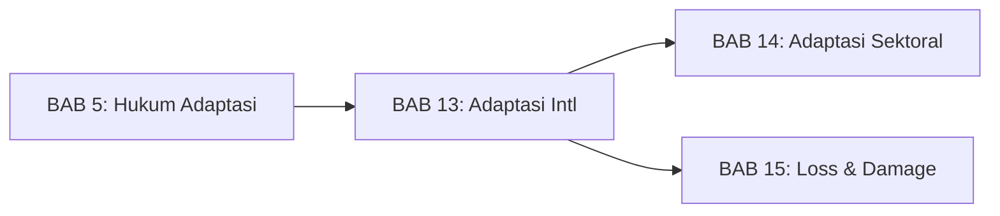
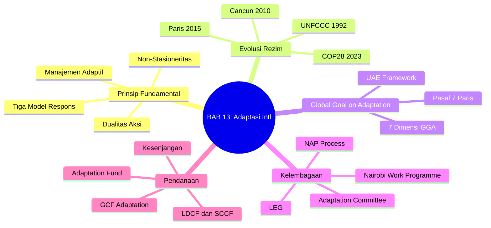
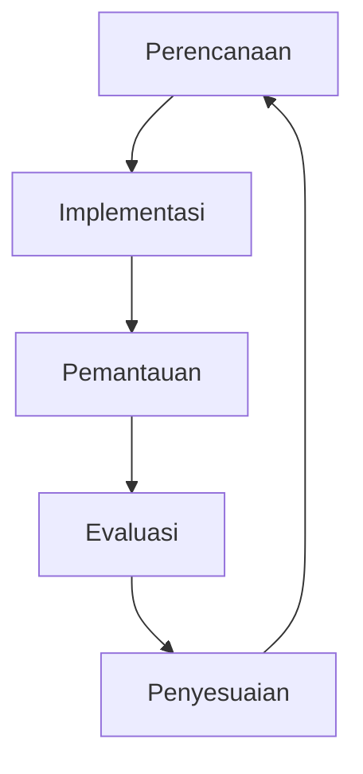
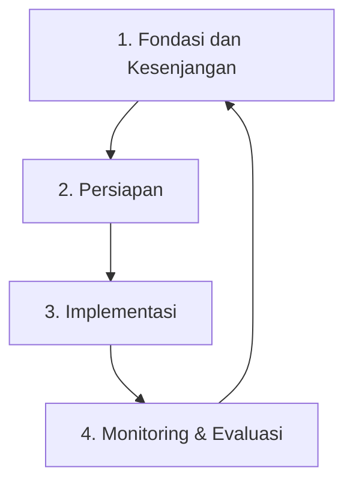
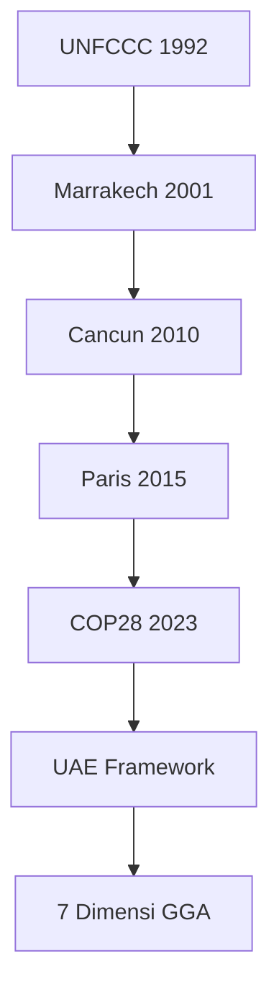

---
publish: true
bab: "13"
judul: "Kerangka Hukum Adaptasi Internasional"
level: "S1"
durasi_baca: "90 menit"
tags:
  - buku-ajar
  - hukum-06-PerubahanIklim
  - adaptasi
  - GGA
  - Paris-Agreement
  - UNFCCC
---

# BAB 13: Kerangka Hukum Adaptasi Internasional

---

## A. PENDAHULUAN

### 1. Capaian Pembelajaran (Sub-CPMK)

Setelah mempelajari bab ini, mahasiswa mampu:

1. **Menganalisis** evolusi adaptasi dalam rezim hukum iklim internasional dari UNFCCC hingga Paris Agreement
2. **Menjelaskan** Global Goal on Adaptation (GGA) dan mekanisme implementasinya berdasarkan UAE Framework
3. **Mengevaluasi** kerangka kelembagaan adaptasi internasional (AC, NAP, NWP)
4. **Mengidentifikasi** mekanisme pendanaan adaptasi internasional dan kesenjangan yang ada

### 2. Indikator Pencapaian

- [ ] Mahasiswa dapat menjelaskan perkembangan status adaptasi dalam rezim iklim internasional
- [ ] Mahasiswa dapat mengidentifikasi 7 dimensi GGA berdasarkan UAE Framework
- [ ] Mahasiswa dapat mendeskripsikan fungsi Adaptation Committee dan proses NAP
- [ ] Mahasiswa dapat membandingkan berbagai sumber pendanaan adaptasi internasional

### 3. Deskripsi Singkat

Selama bertahun-tahun, adaptasi diperlakukan sebagai "anak tiri" dalam rezim hukum iklim internasional—fokus utama diberikan pada mitigasi. Namun, seiring semakin jelasnya bahwa dampak perubahan iklim tidak dapat sepenuhnya dihindari, adaptasi kini diakui sebagai pilar yang sama pentingnya. Bab ini akan mengajak Anda menelusuri perjalanan panjang adaptasi dari kewajiban sekunder menjadi prioritas global, memahami prinsip-prinsip fundamentalnya, dan mengenal kerangka kelembagaan serta pendanaan yang mendukungnya.

### 4. Hubungan dengan Bab Lain



Bab ini merupakan pendalaman dari [[Buku-Ajar-Hukum-06-PerubahanIklim-05-Hukum-Adaptasi_BAB-05|BAB 5: Hukum Adaptasi Perubahan Iklim]] dengan fokus pada kerangka internasional. Pemahaman ini menjadi fondasi untuk [[Buku-Ajar-Hukum-06-PerubahanIklim-14-Hukum-Adaptasi-Sektoral_BAB-14|BAB 14]] tentang implementasi sektoral di Indonesia dan [[Buku-Ajar-Hukum-06-PerubahanIklim-15-Loss-and-Damage_BAB-15|BAB 15]] tentang kerugian yang melampaui kapasitas adaptasi.

### 5. Peta Konsep Bab



---

## B. PENYAJIAN MATERI

### 1. Prinsip-Prinsip Fundamental Hukum Adaptasi

Sebelum membahas kerangka internasional, penting untuk memahami prinsip-prinsip normatif yang mendasari hukum adaptasi. Prinsip-prinsip ini menjadi panduan dalam merancang dan mengevaluasi kebijakan adaptasi di tingkat manapun.

#### 1.1 Dualitas Aksi Adaptasi

> [!info] **Definisi**
> **Adaptasi perubahan iklim** (*climate change adaptation*): Penyesuaian dalam sistem alam atau manusia sebagai respons terhadap rangsangan iklim aktual atau yang diperkirakan, atau dampaknya, yang memoderasi kerugian atau mengeksploitasi peluang yang menguntungkan.[^1]

Hukum adaptasi harus mencakup dua tujuan utama yang saling melengkapi:[^10]

**a. Mengurangi Kerentanan (*Reducing Vulnerability*)**

Kebijakan yang secara proaktif mengurangi eksposur sistem terhadap dampak iklim. Contoh-contoh konkretnya meliputi:
- Melarang pembangunan di zona rawan banjir
- Menetapkan zona mundur (*setback zones*) dari garis pantai
- Membatasi eksploitasi air tanah di wilayah yang mengalami intrusi air laut

**b. Meningkatkan Ketahanan (*Increasing Resilience*)**

Kebijakan yang meningkatkan kapasitas sistem—baik sosial, ekonomi, maupun ekologis—untuk menghadapi dan pulih dari dampak yang tak terhindarkan. Contohnya:
- Sistem asuransi pertanian untuk petani
- Diversifikasi ekonomi di wilayah yang bergantung pada sektor rentan iklim
- Pembangunan cadangan pangan strategis

> [!tip] **Kotak Pengayaan: Kerentanan versus Ketahanan**
> Dalam literatur adaptasi, **kerentanan** (*vulnerability*) dan **ketahanan** (*resilience*) sering dipahami sebagai dua sisi mata uang yang sama—namun tidak selalu demikian. Sebuah sistem bisa memiliki kerentanan tinggi tetapi juga ketahanan tinggi jika memiliki kapasitas pemulihan yang baik. Hukum adaptasi yang efektif harus menangani keduanya secara simultan.

#### 1.2 Tiga Model Respons Adaptasi

Setiap kebijakan adaptasi pada dasarnya jatuh ke dalam salah satu dari tiga model strategis. Kerangka hukum yang komprehensif harus memfasilitasi ketiga pendekatan ini:[^11]

| Model | Deskripsi | Contoh Implementasi |
|-------|-----------|---------------------|
| **Bertahan (*Defend/Protect*)** | Membangun infrastruktur keras untuk melindungi aset yang ada dari dampak iklim | Tembok laut, tanggul, *breakwater*, sistem drainase |
| **Mundur (*Retreat*)** | Relokasi aset dan populasi dari area berisiko tinggi | Pemindahan infrastruktur vital dari pesisir, relokasi permukiman |
| **Mengakomodasi (*Accommodate*)** | Mengubah desain dan fungsi sistem agar dapat hidup berdampingan dengan dampak | Rumah panggung, varietas tanaman tahan kekeringan, sistem peringatan dini |

**Tabel 13.1.** Tiga model respons adaptasi dan contoh implementasinya

Pilihan di antara ketiga model ini bukanlah keputusan teknis semata—ia mengandung dimensi politik, ekonomi, dan keadilan yang signifikan. Siapa yang menanggung biaya relokasi? Siapa yang dilindungi oleh infrastruktur keras? Pertanyaan-pertanyaan ini harus dijawab secara eksplisit dalam kerangka hukum.

#### 1.3 Prinsip Non-Stasioneritas (*Stationarity is Dead*)

> [!warning] **Perhatian**
> Prinsip ini mungkin merupakan yang paling fundamental namun sering diabaikan dalam hukum adaptasi.

Selama berabad-abad, sistem hukum dan perencanaan dibangun di atas asumsi bahwa kondisi iklim di masa depan akan serupa dengan data historis. Asumsi ini tidak lagi valid.

> [!quote] **Kutipan**
> "Stationarity is dead: Stationarity—the idea that natural systems fluctuate within an unchanging envelope of variability—is a foundational concept that permeates training and practice in water-resource engineering... [But] in a nonstationary world, continuity of historical data is no longer a reliable guide to future risk."
> — *Milly et al., Science, 2008*[^2]

**Implikasi Hukum:**

1. **Peta Zonasi:** Peta banjir, zona rawan bencana, dan dokumen perencanaan serupa harus diperbarui secara berkala menggunakan proyeksi perubahan iklim, bukan hanya data historis.

2. **Standar Desain:** Standar bangunan, infrastruktur, dan fasilitas publik harus memasukkan *climate safety margins* yang mengantisipasi kondisi masa depan.

3. **Izin dan Perizinan:** Proses perizinan harus mempertimbangkan viabilitas proyek dalam skenario iklim yang berubah—bukan hanya kondisi saat ini.

4. **Kontrak Jangka Panjang:** Kontrak infrastruktur, konsesi sumber daya alam, dan perjanjian investasi jangka panjang perlu memasukkan klausul penyesuaian iklim.

#### 1.4 Prinsip Manajemen Adaptif (*Adaptive Management*)

Mengingat ketidakpastian yang melekat pada proyeksi iklim dan efektivitas intervensi, hukum adaptasi harus bersifat fleksibel dan iteratif. Prinsip manajemen adaptif mensyaratkan siklus berkelanjutan:



**Gambar 13.1.** Siklus manajemen adaptif

Prinsip ini menantang model hukum tradisional yang bersifat kaku dan berbasis keputusan di muka (*ex ante*). Hukum adaptasi yang efektif harus:
- Menetapkan mekanisme tinjauan berkala (*sunset clauses*, evaluasi periodik)
- Memberikan fleksibilitas kepada pelaksana untuk menyesuaikan pendekatan
- Menghindari "penguncian" (*lock-in*) pada satu solusi teknologi atau pendekatan
- Memastikan pembelajaran dari kegagalan tidak dikenai sanksi berlebihan

---

### 2. Evolusi Adaptasi dalam Rezim Iklim Internasional

#### 2.1 UNFCCC 1992: Fondasi yang Terbatas

Konvensi Kerangka Kerja PBB tentang Perubahan Iklim (UNFCCC) 1992 menyebutkan adaptasi, namun hanya secara marginal. Pasal 4.1(b) mewajibkan semua Pihak untuk:

> "Formulate, implement, publish and regularly update national and, where appropriate, regional programmes containing measures to *facilitate adequate adaptation* to climate change."[^3]

Namun, kewajiban ini bersifat umum dan tidak disertai mekanisme implementasi yang jelas. Fokus utama rezim iklim pada era ini adalah **mitigasi**—khususnya bagi negara-negara maju yang tercantum dalam Annex I.

**Mengapa Adaptasi Terabaikan?**

Beberapa faktor menjelaskan marjinalisasi adaptasi pada periode awal:
1. **Kekhawatiran *moral hazard*:** Pembahasan adaptasi dianggap dapat mengurangi tekanan untuk mitigasi
2. **Preferensi negara maju:** Negara-negara industri lebih nyaman membahas mitigasi (yang dapat ditunda) daripada adaptasi (yang memerlukan transfer sumber daya segera)
3. **Kompleksitas:** Adaptasi bersifat lokal dan kontekstual, sulit dibakukan dalam perjanjian internasional
4. **Ilusi pencegahan:** Keyakinan bahwa mitigasi yang memadai dapat menghindari kebutuhan adaptasi

#### 2.2 Marrakech Accords 2001 (COP7): Pengakuan Pertama

COP7 di Marrakech menandai pengakuan pertama bahwa negara-negara berkembang memerlukan dukungan khusus untuk adaptasi. Keputusan-keputusan penting meliputi:[^12]

1. **Pembentukan Dana Adaptasi:**
   - Least Developed Countries Fund (LDCF)
   - Special Climate Change Fund (SCCF)

2. **National Adaptation Programmes of Action (NAPAs):**
   - Program untuk Negara Kurang Berkembang (LDCs)
   - Mengidentifikasi kebutuhan adaptasi mendesak
   - Mendapat pendanaan dari LDCF

Meski penting, mekanisme ini masih terbatas pada kelompok negara tertentu dan belum mengangkat status adaptasi secara sistemik.

#### 2.3 Cancun Adaptation Framework 2010 (COP16)

COP16 di Cancun, Meksiko, menjadi titik balik penting. **Cancun Adaptation Framework** secara eksplisit mengangkat status adaptasi setara dengan mitigasi:

> [!quote] **Kutipan**
> "Adaptation must be addressed with the same priority as mitigation and requires appropriate institutional arrangements to enhance adaptation action and support."
> — *Decision 1/CP.16, paragraph 2*[^4]

**Capaian Kunci Cancun:**

| Elemen | Deskripsi |
|--------|-----------|
| **Adaptation Committee** | Badan baru untuk memberikan bimbingan teknis dan mendorong koherensi |
| **NAP Process** | Proses perencanaan adaptasi jangka menengah-panjang untuk semua negara berkembang |
| **Work Programme on Loss and Damage** | Pengakuan pertama bahwa ada dampak yang melampaui kapasitas adaptasi |
| **Enhanced Action** | Komitmen untuk mendukung negara-negara berkembang dalam implementasi |

**Tabel 13.2.** Capaian kunci Cancun Adaptation Framework

#### 2.4 Paris Agreement 2015: Pasal 7 dan Global Goal on Adaptation

Persetujuan Paris 2015 mengkonsolidasikan dan memperkuat kerangka adaptasi internasional melalui **Pasal 7**. Pasal ini menetapkan:

> [!info] **Definisi**
> **Global Goal on Adaptation (GGA)**: Tujuan global yang ditetapkan Pasal 7 untuk "meningkatkan kapasitas adaptif, memperkuat ketahanan, dan mengurangi kerentanan terhadap perubahan iklim, dengan tujuan berkontribusi pada pembangunan berkelanjutan dan memastikan respons adaptasi yang memadai."[^5]

**Elemen-Elemen Pasal 7:**

1. **Pengakuan sebagai Tantangan Global (Pasal 7.2):**
   > "Parties recognize that adaptation is a global challenge faced by all with local, subnational, national, regional and international dimensions..."

2. **National Adaptation Plans dan Communications (Pasal 7.9-10):**
   - Setiap Pihak didorong untuk menyusun dan melaksanakan NAP
   - Komunikasi adaptasi menjadi bagian dari siklus lima tahunan

3. **Siklus Global Stocktake (Pasal 7.14):**
   - Tinjauan berkala terhadap kecukupan dan efektivitas adaptasi
   - Pengakuan kebutuhan dukungan untuk negara berkembang

4. **Tidak Ada Target Kuantitatif:**
   - Berbeda dengan mitigasi (1.5°C/2°C), adaptasi tidak memiliki target numerik global
   - Ini menjadi debat yang terus berlanjut hingga COP28

#### 2.5 COP28 Dubai 2023: UAE Framework for GGA

Setelah bertahun-tahun perdebatan tentang bagaimana mengoperasionalisasikan GGA, COP28 di Dubai menghasilkan terobosan signifikan: **UAE Framework for the Global Goal on Adaptation**.

**Keputusan 2/CMA.5** menetapkan kerangka kerja yang mencakup:[^6]

1. **Tujuh Dimensi Tematik** dengan target terukur
2. **Siklus Dua Tahun** untuk pelaporan dan tinjauan
3. **Indikator** untuk mengukur kemajuan
4. **Integrasi** dengan Global Stocktake

> [!tip] **Kotak Pengayaan: Perdebatan Target Adaptasi**
> Tidak seperti mitigasi yang memiliki target suhu global (1.5°C/2°C), menetapkan target global untuk adaptasi sangat sulit karena sifatnya yang lokal dan kontekstual. Apa yang menjadi adaptasi "berhasil" di Belanda (perlindungan dari kenaikan muka laut) berbeda dengan di Sahel (ketahanan terhadap kekeringan). UAE Framework mencoba mengatasi ini dengan menetapkan *dimensi* bersama sambil membiarkan *target spesifik* ditentukan secara nasional.

---

### 3. Global Goal on Adaptation (GGA)

#### 3.1 Pasal 7 Paris Agreement: Arsitektur Normatif

Pasal 7 Paris Agreement terdiri dari 14 paragraf yang membentuk arsitektur normatif adaptasi internasional. Berikut struktur dan elemen kuncinya:

| Paragraf | Substansi | Sifat Kewajiban |
|----------|-----------|-----------------|
| 7.1 | Penetapan GGA | Deklaratif |
| 7.2 | Pengakuan adaptasi sebagai tantangan global | Deklaratif |
| 7.4 | Pengakuan kebutuhan mendesak saat ini | Hortatoris |
| 7.5 | Pendekatan berbasis negara, gender-responsive, partisipatif | Prinsip panduan |
| 7.7 | Kewajiban kerjasama, NAP, asesmen kerentanan | *Should* (bukan *shall*) |
| 7.9-10 | Perencanaan dan komunikasi adaptasi | *Should* |
| 7.13 | Dukungan berkelanjutan dan meningkat untuk negara berkembang | *Shall* |
| 7.14 | Global Stocktake untuk adaptasi | *Shall* |

**Tabel 13.3.** Struktur Pasal 7 Paris Agreement

Perlu dicatat bahwa sebagian besar kewajiban adaptasi menggunakan kata "*should*" (seharusnya), bukan "*shall*" (wajib). Ini mencerminkan kompromi politik: negara-negara berkembang menginginkan kewajiban yang lebih kuat, sementara negara maju khawatir dengan implikasi tanggung jawab hukum.[^16]

#### 3.2 UAE Framework: Tujuh Dimensi GGA

UAE Framework menetapkan tujuh dimensi tematik yang menjadi kerangka bersama untuk aksi adaptasi global. Setiap dimensi memiliki target dan indikator yang akan dikembangkan lebih lanjut:[^17]

**1. Air (*Water*)**
- Target: Ketahanan sumber daya air untuk semua
- Fokus: Akses air bersih, pengelolaan DAS, efisiensi penggunaan air
- Indikator: Coverage layanan air, kualitas air, efisiensi irigasi

**2. Pangan dan Pertanian (*Food and Agriculture*)**
- Target: Ketahanan pangan dan sistem pertanian yang adaptif
- Fokus: Produksi berkelanjutan, rantai pasokan, akses pangan
- Indikator: Food security index, produktivitas pertanian, kerugian pasca-panen

**3. Kesehatan (*Health*)**
- Target: Sistem kesehatan yang tahan iklim
- Fokus: Surveilans penyakit sensitif iklim, infrastruktur kesehatan, kapasitas tenaga kesehatan
- Indikator: Health vulnerability index, cakupan layanan, kesiapsiagaan darurat

**4. Ekosistem dan Biodiversitas (*Ecosystems*)**
- Target: Perlindungan dan restorasi ekosistem untuk ketahanan
- Fokus: Kawasan lindung, jasa ekosistem, adaptasi berbasis alam
- Indikator: Tutupan hutan, kondisi terumbu karang, keanekaragaman hayati

**5. Infrastruktur (*Infrastructure*)**
- Target: Infrastruktur yang tahan iklim dan berkelanjutan
- Fokus: Standar desain, pemeliharaan, infrastruktur adaptif
- Indikator: Resilience standards compliance, kerugian infrastruktur, aksesibilitas

**6. Kemiskinan dan Penghidupan (*Poverty and Livelihoods*)**
- Target: Pengentasan kerentanan dan perlindungan penghidupan
- Fokus: Jaring pengaman sosial, diversifikasi ekonomi, kapasitas adaptif masyarakat
- Indikator: Livelihood diversification, social protection coverage, income stability

**7. Warisan Budaya (*Cultural Heritage*)**
- Target: Perlindungan warisan budaya dari dampak iklim
- Fokus: Situs warisan, pengetahuan tradisional, identitas budaya
- Indikator: Heritage sites at risk, preservation efforts, traditional knowledge documentation

> [!example] **Contoh: Indonesia dan 7 Dimensi GGA**
> Indonesia menghadapi tantangan di semua tujuh dimensi:
> - **Air:** 60% penduduk menghadapi kelangkaan air musiman
> - **Pangan:** Gangguan musim tanam akibat El Niño dan La Niña
> - **Kesehatan:** Perluasan habitat nyamuk demam berdarah ke dataran tinggi
> - **Ekosistem:** Pemutihan karang masif (2015-2016 dan 2024)
> - **Infrastruktur:** Kerusakan jalan dan jembatan akibat banjir dan longsor
> - **Penghidupan:** Nelayan dan petani paling terdampak variabilitas iklim
> - **Warisan:** Situs-situs pesisir dan pulau-pulau kecil terancam kenaikan muka laut

#### 3.3 Siklus Pelaporan dan Global Stocktake

UAE Framework menetapkan siklus dua tahun untuk pelaporan kemajuan adaptasi, yang terintegrasi dengan siklus lima tahun Global Stocktake:

```
2024: Baseline assessment
2025: Pelaporan nasional pertama
2026: Sintesis regional
2027: Input ke GST ke-2
2028: Global Stocktake ke-2
```

**Komunikasi Adaptasi (*Adaptation Communications*):**

Setiap Pihak didorong untuk menyampaikan komunikasi adaptasi yang mencakup:
1. Prioritas, kebutuhan, dan rencana adaptasi nasional
2. Tindakan yang telah dan akan diambil
3. Kebutuhan dukungan (pendanaan, teknologi, kapasitas)
4. Kontribusi pada aksi adaptasi global

---

### 4. Kelembagaan Adaptasi Internasional

#### 4.1 Adaptation Committee (AC)

**Pembentukan dan Mandat:**

Adaptation Committee dibentuk oleh COP16 Cancun (2010) sebagai badan utama untuk memberikan bimbingan teknis dan mendorong koherensi dalam aksi adaptasi global.

**Komposisi:**
- 16 anggota dari lima kelompok regional PBB
- Perimbangan antara negara maju dan berkembang
- Rotasi keanggotaan untuk memastikan representasi[^13]

**Fungsi Utama:**

| Fungsi | Deskripsi |
|--------|-----------|
| **Bimbingan Teknis** | Menyediakan panduan dan standar untuk perencanaan adaptasi |
| **Knowledge Sharing** | Memfasilitasi pertukaran informasi dan praktik terbaik |
| **Sinergi** | Memastikan koherensi antara berbagai badan dan mekanisme UNFCCC |
| **Rekomendasi** | Memberikan masukan kepada COP/CMA tentang isu adaptasi |
| **Engagement** | Melibatkan organisasi, lembaga, dan sektor swasta |

**Tabel 13.4.** Fungsi utama Adaptation Committee

#### 4.2 National Adaptation Plans (NAPs)

**Proses NAP:**

NAP adalah proses perencanaan adaptasi jangka menengah dan panjang yang bertujuan:[^7]

1. Mengurangi kerentanan terhadap dampak perubahan iklim
2. Memfasilitasi integrasi adaptasi ke dalam kebijakan, program, dan kegiatan pembangunan
3. Meningkatkan koherensi perencanaan pembangunan dan adaptasi

**Empat Elemen NAP:**



**Gambar 13.2.** Empat elemen proses NAP

| Elemen | Kegiatan Utama |
|--------|----------------|
| **Fondasi** | Asesmen kapasitas, identifikasi kesenjangan, koordinasi kelembagaan |
| **Persiapan** | Asesmen kerentanan, identifikasi opsi adaptasi, prioritisasi |
| **Implementasi** | Integrasi ke perencanaan, mobilisasi sumber daya, pelaksanaan |
| **Monitoring** | Indikator, pelaporan, evaluasi, pembelajaran |

**Tabel 13.5.** Elemen dan kegiatan utama proses NAP

**Status Global NAP:**

Hingga 2024, lebih dari 50 negara berkembang telah menyampaikan NAP mereka kepada UNFCCC. Indonesia sendiri telah mengintegrasikan adaptasi dalam RAN-API (Rencana Aksi Nasional Adaptasi Perubahan Iklim), meski belum menyampaikan NAP formal ke UNFCCC.

#### 4.3 Nairobi Work Programme (NWP)

NWP adalah program kerja UNFCCC yang berfokus pada pengetahuan untuk adaptasi, khususnya:[^18]

- Dampak, kerentanan, dan adaptasi terhadap perubahan iklim
- Metodologi dan data untuk asesmen
- Praktik terbaik dan pembelajaran

**Struktur Kerja NWP:**

1. **Knowledge Brokering:** Menghubungkan peneliti, praktisi, dan pembuat kebijakan
2. **Focal Point Partnerships:** Kerjasama dengan organisasi mitra
3. **Synthesis Reports:** Kompilasi dan sintesis pengetahuan adaptasi
4. **Technical Papers:** Dokumen teknis tentang isu-isu spesifik

#### 4.4 Least Developed Countries Expert Group (LEG)

LEG adalah kelompok ahli yang secara khusus mendukung Negara-Negara Kurang Berkembang (LDCs) dalam adaptasi. Fungsinya meliputi:

1. **Panduan Teknis:** Mengembangkan pedoman untuk NAPA dan NAP
2. **Capacity Building:** Pelatihan dan workshop untuk negara-negara LDC
3. **Support:** Mendampingi negara-negara dalam proses perencanaan adaptasi

---

### 5. Pendanaan Adaptasi Internasional

#### 5.1 Adaptation Fund

**Sejarah dan Sumber Dana:**

Adaptation Fund dibentuk di bawah Protokol Kyoto pada COP7 Marrakech (2001) dan mulai beroperasi pada 2007. Keunikannya adalah sumber dana yang inovatif:

- **2% dari CER (Certified Emission Reductions):** Levy dari proyek CDM
- **Kontribusi sukarela:** Dari negara-negara maju

**Fitur Inovatif:**

| Fitur | Deskripsi |
|-------|-----------|
| **Direct Access** | Negara berkembang dapat mengakses langsung tanpa melalui lembaga multilateral |
| **NIE (National Implementing Entity)** | Lembaga nasional terakreditasi sebagai pelaksana |
| **Enhanced Direct Access** | Desentralisasi lebih lanjut ke tingkat lokal |
| **Climate Finance** | Fokus khusus pada adaptasi (bukan mitigasi) |

**Tabel 13.6.** Fitur inovatif Adaptation Fund

**Pencapaian:**
- Lebih dari USD 1 miliar telah dialokasikan sejak 2010
- 130+ proyek di 100+ negara
- Fokus pada komunitas paling rentan

#### 5.2 Green Climate Fund (GCF) - Adaptation Window

GCF adalah mekanisme keuangan utama di bawah Paris Agreement dengan target pendanaan USD 100 miliar per tahun.[^14] Untuk adaptasi:

- **Target Alokasi:** 50:50 antara mitigasi dan adaptasi
- **Enhanced Direct Access:** Mekanisme untuk adaptasi berbasis komunitas
- **Readiness Programme:** Dukungan persiapan untuk mengakses pendanaan

**Akumulasi Pendanaan GCF untuk Adaptasi:**
- Total portofolio: ~USD 50 miliar (dengan co-financing)
- Porsi adaptasi: ~35-40% (di bawah target 50%)
- Tantangan: Proposal adaptasi lebih sulit memenuhi kriteria "bankability"

#### 5.3 LDCF dan SCCF

**Least Developed Countries Fund (LDCF):**
- Khusus untuk 46 LDCs
- Mendanai implementasi NAPA dan NAP
- Total alokasi: ~USD 2 miliar sejak 2001

**Special Climate Change Fund (SCCF):**
- Untuk negara berkembang non-LDC
- Fokus: adaptasi, transfer teknologi, sektor ekonomi tertentu
- Dikelola oleh GEF

#### 5.4 Kesenjangan Pendanaan Adaptasi

> [!warning] **Perhatian: Kesenjangan yang Mengkhawatirkan**
> Kesenjangan antara kebutuhan dan ketersediaan pendanaan adaptasi merupakan salah satu tantangan terbesar dalam implementasi hukum adaptasi internasional.

**Angka-Angka Kunci:**

| Aspek | Nilai |
|-------|-------|
| **Kebutuhan tahunan (negara berkembang)** | USD 215-387 miliar[^8] |
| **Pendanaan aktual (2021-2022)** | ~USD 21 miliar |
| **Rasio kesenjangan** | 10-18x lipat |
| **Tren** | Kesenjangan meningkat |

**Tabel 13.7.** Kesenjangan pendanaan adaptasi global

**Implikasi Hukum:**

Kesenjangan pendanaan ini memiliki implikasi serius bagi implementasi hukum adaptasi:

1. **Kewajiban Pasal 7.13:** Negara maju "wajib" (*shall*) menyediakan dukungan berkelanjutan dan meningkat—tetapi tidak ada sanksi atas kegagalan memenuhi kewajiban ini.

2. **Loss and Damage:** Kegagalan mendanai adaptasi yang memadai akan meningkatkan kerugian dan kerusakan, yang menimbulkan pertanyaan tanggung jawab hukum.

3. **Keadilan Iklim:** Negara-negara yang paling sedikit berkontribusi pada perubahan iklim menanggung beban terbesar karena tidak mampu beradaptasi.

---

### 6. Global Stocktake dan Adaptasi

#### 6.1 Komponen Adaptasi dalam Global Stocktake

Pasal 7.14(c) Paris Agreement menetapkan bahwa Global Stocktake akan:

> "Review the adequacy and effectiveness of adaptation and support provided for adaptation."[^9]

**First Global Stocktake (2023):**

GST pertama di COP28 Dubai menghasilkan penilaian komprehensif tentang status adaptasi global:[^15]

1. **Kemajuan:** Ada peningkatan signifikan dalam perencanaan adaptasi (>80% negara memiliki instrumen perencanaan)
2. **Kesenjangan:** Implementasi masih tertinggal dari perencanaan
3. **Pendanaan:** Jauh di bawah kebutuhan
4. **Rekomendasi:** Penguatan GGA melalui UAE Framework

#### 6.2 Informasi Adaptasi dalam Siklus GST

**Sumber Informasi:**

| Sumber | Konten | Peran |
|--------|--------|-------|
| **Adaptation Communications** | Prioritas, rencana, kebutuhan nasional | Input utama |
| **NAP Reports** | Kemajuan implementasi NAP | Bukti kemajuan |
| **National Communications** | Informasi adaptasi komprehensif | Baseline |
| **Biennial Transparency Reports** | Pelaporan berkala | Tracking |
| **IPCC Reports** | Basis ilmiah | Konteks |

**Tabel 13.8.** Sumber informasi adaptasi untuk Global Stocktake

#### 6.3 Outcome dan Implikasi Hukum

GST pertama menghasilkan beberapa keputusan penting untuk adaptasi:

1. **Adopsi UAE Framework:** Operasionalisasi GGA dengan 7 dimensi
2. **Siklus Pelaporan:** Dua tahun untuk adaptasi
3. **Indikator:** Pengembangan indikator terukur
4. **Pendanaan:** Penggandaan pendanaan adaptasi hingga 2025

Meski tidak mengikat secara hukum keras (*hard law*), keputusan-keputusan ini membentuk ekspektasi dan norma yang akan mempengaruhi perilaku negara dan akuntabilitas politik.

---

## C. STUDI KASUS

### Kasus: Bagaimana Global Goal on Adaptation Diterjemahkan ke Tingkat Nasional?

**Latar Belakang:**

Indonesia adalah negara kepulauan terbesar di dunia dengan lebih dari 17.000 pulau dan 108.000 km garis pantai. Sebagai negara yang sangat rentan terhadap dampak perubahan iklim—mulai dari kenaikan muka laut hingga perubahan pola curah hujan—Indonesia memiliki kepentingan strategis dalam implementasi GGA.

Pada 2023, Indonesia menyampaikan *Updated Nationally Determined Contribution* (NDC) yang mencakup komponen adaptasi. Namun, Indonesia belum menyampaikan National Adaptation Plan (NAP) formal kepada UNFCCC, meski telah memiliki RAN-API (Rencana Aksi Nasional Adaptasi Perubahan Iklim) secara domestik.

**Fakta Hukum:**

1. RAN-API ditetapkan melalui Peraturan Menteri PPN/Bappenas
2. Indonesia telah menetapkan target adaptasi dalam NDC
3. Belum ada undang-undang khusus tentang adaptasi perubahan iklim
4. Regulasi adaptasi tersebar di berbagai sektor (pesisir, air, pertanian, kesehatan)

**Isu Hukum:**

Bagaimana tujuh dimensi GGA dalam UAE Framework dapat diterjemahkan ke dalam kerangka hukum Indonesia? Apa kesenjangan regulasi yang perlu diatasi?

---

**Pertanyaan Pemantik:**

1. **Analisis:** Identifikasi regulasi Indonesia yang sudah ada untuk masing-masing dari tujuh dimensi GGA. Di dimensi mana regulasi sudah memadai, dan di mana masih ada kesenjangan?

2. **Evaluasi:** Bandingkan kekuatan hukum RAN-API (Peraturan Menteri) dengan National Adaptation Plan negara lain yang ditetapkan melalui undang-undang. Apa implikasinya untuk implementasi?

3. **Sintesis:** Rancang kerangka hukum adaptasi yang ideal untuk Indonesia, dengan mempertimbangkan hierarki peraturan perundang-undangan dan pembagian kewenangan pusat-daerah.

4. **Aplikasi:** Bagaimana prinsip "non-stasioneritas" dapat diintegrasikan ke dalam regulasi tata ruang pesisir di Indonesia?

> [!note] **Petunjuk Diskusi**
> Kasus ini dapat didiskusikan dalam kelompok dengan masing-masing kelompok menganalisis satu dimensi GGA dan regulasi Indonesia yang relevan. Presentasi hasil analisis dapat dibandingkan untuk melihat gambaran lengkap.

---

## D. PENUTUP

### 1. Rangkuman

Pada bab ini, kita telah mempelajari:

- **Prinsip Fundamental:** Hukum adaptasi dibangun di atas prinsip dualitas aksi (mengurangi kerentanan dan meningkatkan ketahanan), tiga model respons (bertahan, mundur, mengakomodasi), non-stasioneritas (proyeksi masa depan, bukan data historis), dan manajemen adaptif (fleksibilitas dan iterasi).

- **Evolusi Rezim:** Adaptasi berkembang dari kewajiban marginal dalam UNFCCC (1992) menjadi pilar setara dengan mitigasi di Cancun (2010) dan mendapat kerangka operasional komprehensif di Paris (2015) dan Dubai (2023).

- **Global Goal on Adaptation:** Pasal 7 Paris Agreement menetapkan GGA, yang kini dioperasionalisasikan melalui UAE Framework dengan tujuh dimensi tematik: air, pangan, kesehatan, ekosistem, infrastruktur, penghidupan, dan warisan budaya.

- **Kelembagaan:** Adaptation Committee, proses NAP, Nairobi Work Programme, dan LEG membentuk arsitektur kelembagaan yang mendukung implementasi adaptasi global.

- **Pendanaan:** Meski ada berbagai mekanisme (Adaptation Fund, GCF, LDCF, SCCF), kesenjangan pendanaan tetap sangat besar—10-18 kali lipat antara kebutuhan dan ketersediaan.



**Gambar 13.3.** Evolusi kerangka adaptasi internasional

---

### 2. Latihan

Kerjakan latihan berikut untuk memperdalam pemahaman Anda:

1. Jelaskan perbedaan antara "mengurangi kerentanan" dan "meningkatkan ketahanan" dengan contoh konkret dari Indonesia!

2. Mengapa prinsip "stationarity is dead" penting untuk perencanaan tata ruang? Berikan contoh regulasi Indonesia yang masih menggunakan pendekatan berbasis data historis!

3. Bandingkan model respons adaptasi "bertahan" (*defend*) dan "mundur" (*retreat*) untuk penanganan kenaikan muka laut di pesisir utara Jawa!

4. Analisis satu dimensi GGA yang menurut Anda paling relevan untuk Indonesia dan jelaskan alasannya!

5. Cari informasi tentang proyek Adaptation Fund di Indonesia dan evaluasi efektivitasnya!

---

### 3. Tes Formatif

Jawablah pertanyaan-pertanyaan berikut untuk mengukur pemahaman Anda:

**Pilihan Ganda:**

1. Prinsip adaptasi yang menyatakan bahwa hukum tidak dapat lagi berasumsi kondisi iklim masa depan sama dengan historis adalah:
   - a. Manajemen adaptif
   - b. Non-stasioneritas
   - c. Dualitas aksi
   - d. Ketahanan iklim

2. Badan di bawah UNFCCC yang dibentuk oleh COP16 Cancun untuk memberikan bimbingan teknis adaptasi adalah:
   - a. IPCC
   - b. GEF
   - c. Adaptation Committee
   - d. LEG

3. Berapa jumlah dimensi tematik yang ditetapkan dalam UAE Framework untuk GGA?
   - a. 5 dimensi
   - b. 7 dimensi
   - c. 9 dimensi
   - d. 12 dimensi

4. Mekanisme pendanaan adaptasi yang memiliki fitur "Direct Access" untuk negara berkembang adalah:
   - a. GCF saja
   - b. Adaptation Fund
   - c. LDCF saja
   - d. World Bank

5. Kesenjangan antara kebutuhan dan ketersediaan pendanaan adaptasi global saat ini adalah sekitar:
   - a. 2-3 kali lipat
   - b. 5-7 kali lipat
   - c. 10-18 kali lipat
   - d. 50-100 kali lipat

**Benar atau Salah:**

6. Paris Agreement menetapkan target kuantitatif global untuk adaptasi seperti halnya untuk mitigasi (1.5°C/2°C). (B/S)

7. Proses NAP hanya diperuntukkan bagi Negara-Negara Kurang Berkembang (LDCs). (B/S)

8. Adaptation Fund mendapat sumber dana dari 2% Certified Emission Reductions (CER) dari proyek CDM. (B/S)

9. Indonesia telah menyampaikan National Adaptation Plan formal kepada UNFCCC. (B/S)

10. UAE Framework diadopsi pada COP28 Dubai 2023 untuk mengoperasionalisasikan Global Goal on Adaptation. (B/S)

---

### 4. Umpan Balik dan Tindak Lanjut

Cocokkan jawaban Anda dengan **Kunci Jawaban** di [[Buku-Ajar-Hukum-06-PerubahanIklim-Back-Matter-Lampiran_Lampiran-04-Kunci-Jawaban|Lampiran 4]].

**Kunci Jawaban Singkat:** 1-b, 2-c, 3-b, 4-b, 5-c, 6-S, 7-S, 8-B, 9-S, 10-B

**Rumus Penilaian:**

$$Tingkat\ Penguasaan = \frac{Jumlah\ Jawaban\ Benar}{10} \times 100\%$$

**Interpretasi dan Tindak Lanjut:**

| Tingkat Penguasaan | Kategori | Tindak Lanjut |
|--------------------|----------|---------------|
| **90 - 100%** | Baik Sekali | Selamat! Anda dapat melanjutkan ke [[Buku-Ajar-Hukum-06-PerubahanIklim-14-Hukum-Adaptasi-Sektoral_BAB-14|BAB 14]] |
| **80 - 89%** | Baik | Anda dapat melanjutkan, namun pelajari kembali bagian yang masih ragu |
| **70 - 79%** | Cukup | **Ulangi** materi bab ini, terutama bagian yang belum dikuasai |
| **< 70%** | Kurang | **Wajib mengulangi** seluruh materi bab ini sebelum melanjutkan |

---

### 5. Senarai Istilah Kunci

| Istilah | Bahasa Inggris | Definisi |
|---------|----------------|----------|
| GGA | *Global Goal on Adaptation* | Tujuan global adaptasi yang ditetapkan Pasal 7 Paris Agreement |
| NAP | *National Adaptation Plan* | Rencana adaptasi nasional jangka menengah-panjang |
| AC | *Adaptation Committee* | Komite adaptasi di bawah UNFCCC |
| AdCom | *Adaptation Communication* | Komunikasi adaptasi yang disampaikan negara dalam siklus NDC |
| LDCF | *Least Developed Countries Fund* | Dana untuk mendukung adaptasi di negara kurang berkembang |
| UAE Framework | *UAE Framework for GGA* | Kerangka operasional GGA yang diadopsi COP28 |
| Non-stasioneritas | *Non-stationarity* | Prinsip bahwa kondisi iklim masa depan berbeda dari historis |
| Manajemen adaptif | *Adaptive management* | Pendekatan iteratif: pemantauan-evaluasi-penyesuaian |

---

### 6. Daftar Pustaka Bab

**Sumber Primer:**

- Paris Agreement, 2015, Pasal 7.
- Decision 1/CP.16 (Cancun Adaptation Framework), 2010.
- Decision 2/CMA.5 (UAE Framework for GGA), 2023.
- UNFCCC. (2012). *National Adaptation Plans: Technical Guidelines*. Bonn: UNFCCC.

**Sumber Sekunder:**

- Verschuuren, J. (Ed.). (2022). *Research Handbook on Climate Change Adaptation Law*. Cheltenham: Edward Elgar.
- Mayer, B. (2022). *The International Law on Climate Change*. Cambridge: Cambridge University Press.
- UNEP. (2023). *Adaptation Gap Report 2023*. Nairobi: UNEP.

**Sumber Pendukung:**

- Milly, P. C. D. et al. (2008). "Stationarity is Dead: Whither Water Management?" *Science*, 319(5863), 573-574.
- Green Climate Fund. (2024). *Portfolio Dashboard*. https://www.greenclimate.fund/
- Adaptation Fund. (2024). *Project Database*. https://www.adaptation-fund.org/

---

### 7. Catatan Kaki

[^1]: IPCC. (2014). *Climate Change 2014: Impacts, Adaptation, and Vulnerability. Glossary*. Cambridge: Cambridge University Press.

[^2]: Milly, P. C. D. et al. (2008). "Stationarity is Dead: Whither Water Management?" *Science*, 319(5863), 573-574.

[^3]: United Nations Framework Convention on Climate Change, 1992, Pasal 4.1(b).

[^4]: Decision 1/CP.16, Cancun Agreements, 2010, paragraf 2.

[^5]: Paris Agreement, 2015, Pasal 7.1.

[^6]: Decision 2/CMA.5, UAE Framework for the Global Goal on Adaptation, 2023.

[^7]: UNFCCC. (2012). *National Adaptation Plans: Technical Guidelines for the National Adaptation Plan Process*. LDC Expert Group, Bonn.

[^8]: UNEP. (2023). *Adaptation Gap Report 2023: Underfinanced. Underprepared*. Nairobi: United Nations Environment Programme.

[^9]: Paris Agreement, 2015, Pasal 7.14(c).

[^10]: Jonathan Verschuuren, 'Climate Change Adaptation: Introduction and Overview' in Jonathan Verschuuren (ed), *Research Handbook on Climate Change Adaptation Law* (Edward Elgar 2022) 1-18.

[^11]: AR Siders, 'Adaptive Capacity to Climate Change: A Synthesis of Concepts, Methods, and Findings in a Fragmented Field' (2019) 10 WIREs Climate Change e573; see also MC Lemos and others, 'To Co-Produce or Not to Co-Produce' (2018) 1 Nature Sustainability 722.

[^12]: Decision 7/CP.7, Funding under the Convention, 2001 (Marrakech Accords); Decision 10/CP.7, Funding under the Kyoto Protocol, 2001.

[^13]: Decision 1/CP.16, The Cancun Agreements: Outcome of the Work of the Ad Hoc Working Group on Long-term Cooperative Action under the Convention, 2010, paras 20-29.

[^14]: Decision 1/CP.21, Adoption of the Paris Agreement, 2015, para 54; Green Climate Fund, 'GCF Handbook: Decisions, Policies and Frameworks' (GCF 2024).

[^15]: Decision 1/CMA.5, Outcome of the First Global Stocktake, 2023, paras 64-87.

[^16]: Benoit Mayer, *The International Law on Climate Change* (Cambridge University Press 2022) 189-215.

[^17]: Decision 2/CMA.5, UAE Framework for the Global Goal on Adaptation, 2023, para 9 (identifying the seven thematic targets on water, food and agriculture, health, ecosystems, infrastructure, poverty and livelihoods, and cultural heritage).

[^18]: Decision 2/CP.11, Five-Year Programme of Work of the Subsidiary Body for Scientific and Technological Advice on Impacts, Vulnerability and Adaptation to Climate Change, 2005.

---

**Navigasi Buku:**
- ← [[Buku-Ajar-Hukum-06-PerubahanIklim-12-Masa-Depan-Hukum-Iklim_BAB-12|BAB 12: Masa Depan Hukum Perubahan Iklim]]
- → [[Buku-Ajar-Hukum-06-PerubahanIklim-14-Hukum-Adaptasi-Sektoral_BAB-14|BAB 14: Hukum Adaptasi Sektoral Indonesia]]
- ↑ [[Buku-Ajar-Hukum-06-PerubahanIklim-00-Front-Matter_09-Tinjauan-Mata-Kuliah|Kembali ke Tinjauan Mata Kuliah]]

---

*Buku Ajar Hukum Perubahan Iklim | BAB 13*

