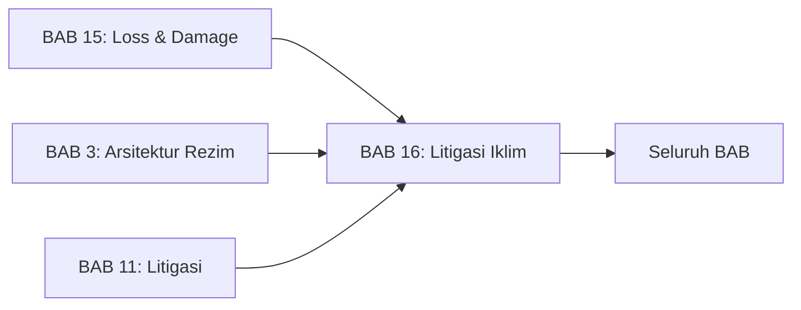
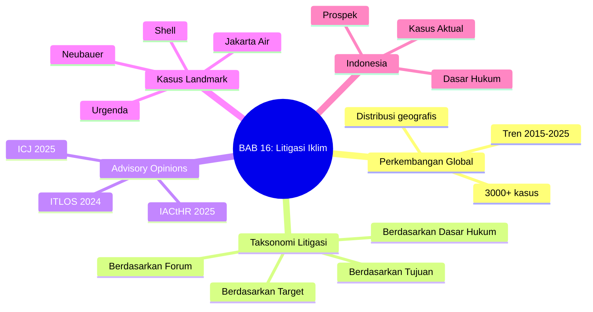

---
publish: true
bab: "16"
judul: "Litigasi Perubahan Iklim"
level: "S1"
durasi_baca: "120 menit"
tags:
  - buku-ajar
  - hukum-06-PerubahanIklim
  - litigasi
  - Urgenda
  - ICJ
  - climate-litigation
  - HAM
---

# BAB 16: Litigasi Perubahan Iklim

---

## A. PENDAHULUAN

### 1. Capaian Pembelajaran (Sub-CPMK)

Setelah mempelajari bab ini, mahasiswa mampu:

1. **Menjelaskan** perkembangan global litigasi perubahan iklim dan signifikansinya
2. **Menganalisis** berbagai strategi hukum, dasar gugatan, dan yurisprudensi landmark
3. **Mengevaluasi** Advisory Opinions dari ICJ, ITLOS, dan IACtHR serta implikasinya
4. **Mengidentifikasi** potensi dan tantangan litigasi iklim di Indonesia

### 2. Indikator Pencapaian

- [ ] Mahasiswa dapat mengklasifikasikan litigasi iklim berdasarkan forum, dasar hukum, target, dan tujuan
- [ ] Mahasiswa dapat menjelaskan key findings dari ICJ Advisory Opinion 2025
- [ ] Mahasiswa dapat menganalisis putusan landmark: Urgenda, Neubauer, Shell
- [ ] Mahasiswa dapat mengidentifikasi dasar hukum potensial untuk litigasi iklim di Indonesia

### 3. Deskripsi Singkat

Pengadilan telah menjadi arena penting dalam perjuangan iklim. Dari Belanda hingga Jerman, dari Shell hingga pemerintah, litigasi iklim meningkat pesat dengan lebih dari 3.000 kasus di seluruh dunia. Bab ini akan memandu Anda memahami lanskap litigasi iklim global, menganalisis putusan-putusan landmark, dan mengeksplorasi potensi serta tantangan litigasi iklim di Indonesia—termasuk implikasi Advisory Opinion ICJ yang bersejarah.

### 4. Hubungan dengan Bab Lain

Bab ini memperdalam dan memperbarui pembahasan litigasi di [[Buku-Ajar-Hukum-06-PerubahanIklim-11-Litigasi-06-PerubahanIklim_BAB-11|BAB 11]] dengan perkembangan terbaru termasuk ICJ Advisory Opinion 2025. Pemahaman tentang litigasi iklim juga terhubung dengan [[Buku-Ajar-Hukum-06-PerubahanIklim-15-Loss-and-Damage_BAB-15|BAB 15]] (kompensasi *loss and damage* melalui pengadilan) dan [[Buku-Ajar-Hukum-06-PerubahanIklim-03-Arsitektur-Rezim-Iklim_BAB-03|BAB 3]] (interpretasi kewajiban dalam traktat iklim).

### 5. Peta Konsep Bab

---

## B. PENYAJIAN MATERI

### 1. Perkembangan Global Litigasi Iklim

#### 1.1 Tren Peningkatan Dramatis

Litigasi iklim telah meningkat secara eksponensial dalam dekade terakhir:

| Tahun | Kumulatif Kasus | Catatan |
|-------|-----------------|---------|
| 2015 | ~900 | Pre-Paris Agreement |
| 2020 | ~1.500 | Pasca-Urgenda Supreme Court |
| 2023 | ~2.300 | Ekspansi global |
| 2025 | ~3.000+ | Post-ICJ Advisory Opinion surge |

**Tabel 16.1.** Perkembangan jumlah litigasi iklim global[^1]

#### 1.2 Distribusi Geografis

Meski AS mendominasi jumlah kasus, litigasi iklim kini menyebar ke seluruh dunia, mencerminkan apa yang oleh para ahli disebut sebagai "gelombang ketiga" litigasi iklim yang berfokus pada hak asasi manusia dan tanggung jawab korporasi:[^14]

| Region | Persentase Kasus | Karakteristik |
|--------|------------------|---------------|
| **Amerika Serikat** | ~70% | Volume tinggi, beragam jenis |
| **Eropa** | ~15% | Kasus HAM breakthrough |
| **Asia-Pasifik** | ~8% | Indonesia terdepan |
| **Amerika Latin** | ~4% | Berkembang pesat |
| **Afrika & Timur Tengah** | ~3% | Emerging |

**Tabel 16.2.** Distribusi geografis litigasi iklim

> [!tip] **Kotak Pengayaan: Indonesia sebagai Litigasi Leader Asia**
> Indonesia adalah negara paling litigious untuk kasus iklim di Asia, dengan lebih dari 100 kasus terkait iklim dalam database Climate Case Chart. Mayoritas berkaitan dengan kehutanan, kebakaran hutan, dan polusi udara.

---

### 2. Taksonomi Litigasi Iklim

#### 2.1 Berdasarkan Forum/Level

| Forum | Deskripsi | Contoh |
|-------|-----------|--------|
| **Internasional** | Pengadilan internasional dan tribunal | ICJ, ITLOS |
| **Regional** | Pengadilan HAM regional | ECtHR, IACtHR |
| **Nasional** | Pengadilan domestik tertinggi | Supreme Courts |
| **Sub-nasional** | Pengadilan tingkat daerah | District Courts |
| **Quasi-Judicial** | Badan HAM, komisi | CHR Philippines |

**Tabel 16.3.** Klasifikasi litigasi iklim berdasarkan forum

#### 2.2 Berdasarkan Dasar Hukum

| Basis | Deskripsi | Contoh Kasus |
|-------|-----------|--------------|
| **HAM Internasional** | Pelanggaran HAM internasional | KlimaSeniorinnen v. Swiss |
| **Konstitusional** | Hak-hak fundamental dalam konstitusi | Neubauer v. Germany |
| **Administratif** | Keputusan administrasi publik | Izin PLTU, AMDAL |
| **Private Law/Tort** | PMH, negligence, nuisance | Milieudefensie v. Shell |
| **Statutory** | Pelanggaran UU spesifik | Clean Air Act cases |
| **Fraud/Consumer** | Misrepresentasi, greenwashing | Advertising cases |

**Tabel 16.4.** Klasifikasi litigasi iklim berdasarkan dasar hukum

#### 2.3 Berdasarkan Target

| Target | Deskripsi | Contoh |
|--------|-----------|--------|
| **Pemerintah** | Kebijakan/aksi negara | Urgenda, Jakarta Air |
| **Korporasi** | Perusahaan emiter besar | Shell, Holcim |
| **Proyek Spesifik** | Izin proyek tertentu | PLTU, tambang batubara |
| **Institusi Keuangan** | Bank, investor | ANZ Bank, pension funds |

**Tabel 16.5.** Klasifikasi litigasi iklim berdasarkan target

#### 2.4 Berdasarkan Tujuan

| Tujuan | Deskripsi | Contoh |
|--------|-----------|--------|
| **Systemic Mitigation** | Perkuat kebijakan iklim keseluruhan | Urgenda, Neubauer |
| **Project-Based** | Hentikan proyek spesifik | Coal mine challenges |
| **Compensation/L&D** | Ganti rugi/kompensasi | Pari Island v. Holcim |
| **Disclosure** | Transparansi informasi | ESG disclosure cases |
| **Greenwashing** | Klaim lingkungan palsu | Advertising cases |

**Tabel 16.6.** Klasifikasi litigasi iklim berdasarkan tujuan

---

### 3. Advisory Opinions Internasional

#### 3.1 ICJ Advisory Opinion on Climate Change (23 Juli 2025)

> [!info] **Definisi**
> **Advisory Opinion ICJ** adalah pendapat hukum yang diberikan oleh Mahkamah Internasional atas permintaan badan PBB atau organisasi internasional. Meski tidak mengikat secara formal, pendapat ini memiliki otoritas persuasif yang sangat tinggi.[^2]

**Latar Belakang:**
- Request: Majelis Umum PBB (29 Maret 2023)
- Inisiator: Vanuatu dan koalisi negara kepulauan
- Partisipasi: 96 negara + 11 organisasi internasional (tertinggi dalam sejarah ICJ)

**Pertanyaan kepada ICJ:**
1. Apa kewajiban negara di bawah hukum internasional untuk melindungi sistem iklim?
2. Apa konsekuensi hukum jika negara gagal memenuhi kewajiban tersebut?

**Key Findings ICJ Advisory Opinion:**[^3]

| Temuan | Implikasi |
|--------|-----------|
| **Paris Agreement creates binding obligations** | Bukan sekadar political commitment |
| **1.5°C as primary temperature goal** | Target mengikat, bukan aspirasional |
| **Due diligence obligation** | Negara wajib menggunakan semua sarana yang tersedia |
| **NDC not purely discretionary** | Diskresi dalam menyusun NDC tidak tak terbatas |
| **Human rights link** | Hak lingkungan sebagai prasyarat hak fundamental |
| **State responsibility applies** | Jika negara gagal memenuhi kewajiban |

**Tabel 16.7.** Key findings ICJ Advisory Opinion 2025

> [!quote] **Kutipan**
> "States must act with due diligence and do their utmost to mitigate climate change, including through action on fossil fuel production and consumption."
> — *ICJ Advisory Opinion, 2025*[^4]

**Signifikansi:**
- Pertama kali pengadilan internasional tertinggi menyatakan pendapat tentang kewajiban iklim
- Memperkuat dasar hukum untuk litigasi domestik dan internasional
- Berpotensi mempengaruhi negosiasi iklim dan kebijakan nasional

#### 3.2 ITLOS Advisory Opinion (21 Mei 2024)

International Tribunal for the Law of the Sea (ITLOS) mengeluarkan pendapat yang lebih spesifik untuk konteks kelautan:

**Key Findings ITLOS:**[^5]

| Temuan | Penjelasan |
|--------|------------|
| **GHG as marine pollution** | Emisi GRK yang diserap laut = polusi laut di bawah UNCLOS |
| **UNCLOS Article 194** | Kewajiban mencegah, mengurangi, mengendalikan polusi laut |
| **Stringent due diligence** | Standar lebih ketat mengingat risiko tinggi |
| **Beyond Paris compliance** | Kepatuhan Paris tidak cukup; UNCLOS terpisah |
| **Precautionary approach** | Tidak perlu kepastian ilmiah penuh untuk bertindak |

**Tabel 16.8.** Key findings ITLOS Advisory Opinion 2024

> [!quote] **Kutipan**
> "The absorption of anthropogenic greenhouse gas emissions by the marine environment constitutes pollution of the marine environment within the meaning of UNCLOS."
> — *ITLOS Advisory Opinion, 2024*[^6]

#### 3.3 Inter-American Court of Human Rights (IACtHR) Advisory Opinion (Mei 2025)

IACtHR mengeluarkan Advisory Opinion atas permintaan Kolombia dan Chili yang menegaskan kewajiban iklim dalam konteks regional Amerika:[^15]

**Key Findings IACtHR:**

| Temuan | Penjelasan |
|--------|------------|
| **Right to healthy environment** | Hak atas lingkungan sehat sebagai hak otonom yang dapat dituntut (*justiciable*) |
| **Climate emergency as human rights crisis** | Krisis iklim adalah krisis HAM yang memerlukan respons mendesak |
| **State obligations** | Kewajiban negara mencakup mitigasi, adaptasi, dan perlindungan kelompok rentan |
| **Corporate responsibility** | Negara wajib mengatur aktivitas korporasi yang berdampak iklim |
| **Intergenerational equity** | Perlindungan hak generasi mendatang sebagai kewajiban konstitusional |

**Tabel 16.8a.** Key findings IACtHR Advisory Opinion 2025

> [!quote] **Kutipan**
> "Climate change constitutes an urgent threat to human rights, and States have an immediate obligation to prevent foreseeable harm to present and future generations."
> — *IACtHR Advisory Opinion OC-31/25, 2025*[^16]

---

### 4. Kasus Landmark: Terhadap Pemerintah

#### 4.1 Urgenda v. Netherlands (2015-2019)

> [!info] **Definisi**
> **Urgenda Case** adalah kasus pertama di dunia di mana pengadilan memerintahkan pemerintah untuk memperkuat kebijakan iklimnya berdasarkan hak asasi manusia.[^7]

**Fakta Kasus:**
- **Penggugat:** Urgenda Foundation + 900 warga negara
- **Tergugat:** Pemerintah Belanda
- **Tuntutan:** Pemerintah diperintahkan mengurangi emisi minimal 25% pada 2020 (dari 1990)

**Perjalanan Kasus:**

| Tingkat | Tahun | Putusan |
|---------|-------|---------|
| District Court | 2015 | Mengabulkan—25% reduksi |
| Court of Appeal | 2018 | Menguatkan |
| Supreme Court | 2019 | Menguatkan |

**Dasar Hukum:**
- ECHR Pasal 2 (hak atas hidup)
- ECHR Pasal 8 (hak atas kehidupan pribadi dan keluarga)
- *Duty of care* negara di bawah hukum Belanda

**Reasoning Kunci:**
1. Negara memiliki kewajiban positif untuk melindungi warga dari ancaman terhadap nyawa
2. Perubahan iklim adalah ancaman nyata terhadap nyawa dan kesejahteraan
3. Target 25-40% untuk negara maju adalah konsensus ilmiah minimum
4. Meski masalah global, setiap negara tetap memiliki tanggung jawab individual

> [!quote] **Kutipan**
> "There is a legal obligation on the State to reduce greenhouse gas emissions... The Netherlands must reduce emissions by at least 25% by the end of 2020."
> — *Hoge Raad der Nederlanden, 2019*[^8]

**Impact:**
- Model untuk "Urgenda-style cases" di seluruh dunia
- Menginspirasi 30+ kasus serupa
- Belanda mencapai target 25% (meski dengan bantuan COVID-19 lockdown)

#### 4.2 Neubauer v. Germany (2021)

**Fakta Kasus:**
- **Penggugat:** Sekelompok pemuda Jerman, NGOs (termasuk Fridays for Future)
- **Tergugat:** Undang-Undang Iklim Federal (Klimaschutzgesetz)
- **Tuntutan:** UU Iklim dinyatakan inkonstitusional

**Putusan Bundesverfassungsgericht (24 Maret 2021):**[^9]

UU Iklim Jerman dinyatakan **sebagian inkonstitusional** karena:
- Tidak ada target interim yang memadai pasca-2030
- Membebankan secara tidak proporsional kepada generasi mendatang

**Konsep Revolusioner: Kebebasan Antargenerasi (*Intertemporal Freedom*):**

> [!quote] **Kutipan**
> "Fundamental rights—as intertemporal guarantees of freedom—afford protection against greenhouse gas reduction burdens being unilaterally offloaded onto the future."
> — *Bundesverfassungsgericht, 2021*[^10]

**Impact:**
- Jerman merevisi target: 65% reduksi 2030, net zero 2045 (maju dari 2050)
- Model untuk litigasi berbasis hak generasi mendatang
- Diikuti oleh Constitutional Court of Korea (2024)

#### 4.3 Leghari v. Pakistan (2015)

**Signifikansi:**
- Kasus HAM-iklim pertama dari Global South yang menarik perhatian global
- Dikutip IPCC 2022 sebagai *leading case* adaptasi
- Hakim membentuk Climate Change Commission

**Reasoning:**
- Hak atas lingkungan sehat sebagai bagian dari hak atas hidup
- Kegagalan implementasi kebijakan iklim = pelanggaran HAM

---

### 5. Kasus Landmark: Terhadap Korporasi

#### 5.1 Milieudefensie v. Royal Dutch Shell (2021-2024)

**Fakta Kasus:**
- **Penggugat:** Milieudefensie (Friends of the Earth Netherlands) + 6 NGO + 17.379 individu
- **Tergugat:** Royal Dutch Shell
- **Tuntutan:** Shell diperintahkan mengurangi emisi 45% pada 2030

**District Court The Hague (26 Mei 2021):**[^11]
- Shell diperintahkan mengurangi emisi 45% pada 2030 (vs 2019)
- Mencakup **Scope 1, 2, DAN 3** (emisi dari produk yang dijual)
- Berbasis Dutch tort law + UNGP on Business and Human Rights

**Court of Appeal (12 November 2024):**
- Putusan District Court **dibatalkan**
- Tidak ada *social standard of care* yang cukup jelas untuk target spesifik
- **NAMUN:** Shell tetap memiliki *duty of care* untuk membatasi emisi
- Kasus berlanjut ke Supreme Court

**Signifikansi:**
- Pertama kali pengadilan memerintahkan perusahaan swasta mengurangi emisi
- Perdebatan tentang Scope 3 emissions
- Preseden untuk kasus korporasi lainnya

#### 5.2 Pari Island v. Holcim (Swiss Courts)

**Fakta Kasus:**
- **Penggugat:** 4 warga Pulau Pari, Kepulauan Seribu, Indonesia
- **Tergugat:** Holcim (perusahaan semen Swiss)
- **Forum:** Pengadilan Swiss (tempat Holcim berkantor pusat)
- **Tuntutan:** Kompensasi atas kerugian akibat kenaikan muka laut

**Status:**
- Conciliation request: Juli 2022
- Main hearing: September 2025

**Signifikansi untuk Indonesia:**
- Warga Indonesia menggunakan *foreign courts* untuk keadilan iklim
- Transboundary climate litigation
- Corporate liability for climate damages

#### 5.3 Philippines Carbon Majors Inquiry

**Fakta:**
- Petisi ke Commission on Human Rights (CHR) Philippines
- 51 *carbon majors* sebagai respondent
- Model pendekatan HAM terhadap korporasi

**Temuan CHR (2022):**
- Carbon majors dapat dimintai pertanggungjawaban moral dan hukum
- Perusahaan yang mengetahui dampak dan tetap menyangkal = *climate obstruction*

---

### 6. Litigasi HAM Regional

#### 6.1 KlimaSeniorinnen v. Switzerland (ECtHR, April 2024)

**Fakta Kasus:**
- **Penggugat:** Asosiasi perempuan lansia Swiss
- **Tergugat:** Pemerintah Swiss
- **Argumen:** Swiss gagal melindungi dari dampak iklim, terutama heat waves

**Putusan European Court of Human Rights (9 April 2024):**[^12]
- Pertama kali ECtHR memutus kasus iklim secara substantif
- ECHR menciptakan *positive obligation* untuk melindungi dari dampak iklim
- Berbasis Pasal 8 (right to private and family life)
- Swiss dinyatakan melanggar ECHR karena tidak memiliki kerangka regulasi yang memadai untuk mitigasi iklim

**Implikasi:**
- Berlaku untuk 46 negara anggota Council of Europe
- Preseden untuk kasus HAM-iklim regional

#### 6.2 Constitutional Court of Korea (Agustus 2024)

Dalam putusan bersejarah, Constitutional Court of Korea menyatakan sebagian dari Carbon Neutrality Act inkonstitusional:[^17]

- Target iklim Korea tidak memadai untuk melindungi hak konstitusional
- Tidak ada target mengikat 2031-2049 melanggar hak generasi mendatang
- Pemerintah diberi waktu hingga 2026 untuk merevisi undang-undang
- Model "Neubauer-style" pertama di Asia yang sukses

---

### 7. Litigasi Iklim di Indonesia

#### 7.1 Jakarta Air Pollution Case (2019-2023)

**Fakta Kasus:**[^13]
- **Penggugat:** 32 warga Jakarta (citizen lawsuit)
- **Tergugat:** Presiden RI, 3 Menteri (LHK, Kesehatan, Dalam Negeri), Gubernur DKI, 2 Gubernur (Jabar, Banten)

**Putusan Pengadilan Negeri Jakarta Pusat (16 September 2021):**
- Semua tergugat terbukti **melakukan perbuatan melawan hukum**
- Presiden diperintahkan memperketat standar kualitas udara (baku mutu)
- Tergugat lainnya diperintahkan mengambil langkah konkret

**Putusan Mahkamah Agung (2023):**
- Menolak kasasi pemerintah
- Menguatkan putusan PN Jakarta Pusat

**Signifikansi:**
- **Landmark:** Pertama kali presiden dinyatakan melakukan PMH terkait lingkungan
- Model *citizen lawsuit* Indonesia
- Preseden untuk litigasi iklim lebih luas

#### 7.2 Kasus-Kasus Terkait Iklim Lainnya

| Kasus | Forum | Status | Isu |
|-------|-------|--------|-----|
| Gugatan izin PLTU Cirebon | PTUN | Ongoing | Izin pembangkit batubara |
| Gugatan kebakaran hutan | PN | Berbagai | Tanggung jawab korporasi |
| Bali Climate Lawsuit (2025) | PN | Filed | Climate negligence pasca banjir |
| Greenpeace v. Pulpwood | PN Palembang | Ditolak | Standing |

**Tabel 16.9.** Kasus-kasus terkait iklim di Indonesia

**Statistik Indonesia:**
- 112 kasus iklim 2010-2020 (mayoritas kehutanan/karhutla)
- 15 kasus dalam database Climate Case Chart
- Asia's most climate-litigious country

---

### 8. Strategi dan Dasar Hukum

#### 8.1 Litigasi Berbasis HAM

| Hak | Instrumen | Aplikasi |
|-----|-----------|----------|
| Right to Life | ECHR Art. 2, ICCPR Art. 6, UUD Pasal 28A | Urgenda, potensial Indonesia |
| Right to Private Life | ECHR Art. 8 | KlimaSeniorinnen |
| Right to Environment | UUD Pasal 28H | Jakarta Air Pollution |
| Children's Rights | CRC | Youth cases |
| Indigenous Rights | UNDRIP, UUD | Masyarakat adat cases |

**Tabel 16.10.** Dasar hukum HAM untuk litigasi iklim

#### 8.2 Litigasi Berbasis Tort/PMH

**Elemen Pembuktian:**
1. **Duty of care:** Ada kewajiban kehati-hatian
2. **Breach:** Pelanggaran kewajiban tersebut
3. **Causation:** Hubungan kausal antara pelanggaran dan kerugian
4. **Damages:** Kerugian yang dapat dibuktikan

**Tantangan Khusus Iklim:**
- Causation: Bagaimana membuktikan emisi tertentu menyebabkan kerugian tertentu?[^18]
- Multiple tortfeasors: Siapa yang bertanggung jawab dari ribuan emitter?
- Standing: Siapa yang memiliki hak menggugat?

Perkembangan terbaru dalam *attribution science* telah mempermudah pembuktian kausalitas. Studi dari World Weather Attribution kini dapat menghitung dengan presisi tinggi kontribusi perubahan iklim terhadap kejadian cuaca ekstrem tertentu.[^19]

#### 8.3 Litigasi Berbasis Konstitusi

- Hak-hak fundamental dalam konstitusi
- Separation of powers
- Intergenerational equity (model Neubauer)

---

### 9. Potensi Litigasi Iklim Indonesia

#### 9.1 Dasar Hukum Potensial

| Dasar | Ketentuan | Potensi Argumen |
|-------|-----------|-----------------|
| **UUD 1945 Pasal 28H(1)** | Hak atas lingkungan hidup yang baik dan sehat | Hak konstitusional |
| **UU 32/2009 PPLH** | Hak gugat masyarakat (Pasal 91), hak gugat organisasi LH (Pasal 92) | *Legal standing*[^20] |
| **KUH Perdata 1365** | Perbuatan melawan hukum | Tort/ganti rugi |
| **PTUN** | Keputusan administrasi | Gugatan izin lingkungan |
| **UU 8/1999** | Perlindungan konsumen | Greenwashing |

**Tabel 16.11.** Dasar hukum potensial litigasi iklim Indonesia[^21]

#### 9.2 Forum yang Tersedia

| Forum | Mekanisme | Contoh Penggunaan |
|-------|-----------|-------------------|
| **Pengadilan Negeri** | Citizen lawsuit, class action | Jakarta Air Pollution |
| **PTUN** | Gugatan izin administrasi | Izin PLTU |
| **Mahkamah Konstitusi** | Judicial review UU | Potensial untuk UU Iklim |
| **Komnas HAM** | Pengaduan HAM | Potensial |
| **Ombudsman** | Maladministrasi | Kegagalan implementasi |

**Tabel 16.12.** Forum litigasi yang tersedia di Indonesia

#### 9.3 Hambatan

1. **Budaya litigasi:** Masih berkembang untuk kasus publik
2. **Kapasitas hakim:** Pemahaman tentang isu iklim terbatas
3. **Akses keadilan:** Biaya, kompleksitas, durasi
4. **Risiko SLAPP:** *Strategic Lawsuit Against Public Participation*
5. **Kausalitas:** Kompleksitas pembuktian hubungan iklim-kerugian
6. **Penegakan:** Kesulitan eksekusi putusan

#### 9.4 Peluang Pasca-ICJ Advisory Opinion

ICJ Advisory Opinion 2025 membuka peluang baru:[^22]
- **Persuasive authority:** Dapat dikutip di pengadilan Indonesia sebagai sumber hukum internasional
- **Penguatan argumen due diligence:** Kewajiban negara lebih jelas dan terukur
- **Preseden internasional:** Memperkuat legitimasi litigasi iklim domestik
- **Public awareness:** Meningkatkan pemahaman tentang kewajiban iklim sebagai kewajiban hukum, bukan sekadar politik

---

### 10. Tantangan dan Isu Emerging

#### 10.1 Penegakan Putusan

Bahkan setelah menang, penegakan putusan tetap tantangan:
- Urgenda: Belanda butuh beberapa tahun mencapai target
- Shell: Putusan banding melemahkan
- Jakarta Air: Implementasi lambat

#### 10.2 Backlash dan Risiko

- Potensi respon legislatif membatasi litigasi
- Risiko SLAPP terhadap aktivis dan pengacara
- Politisasi pengadilan

#### 10.3 Litigasi Greenwashing

Kategori baru yang berkembang pesat:
- Klaim lingkungan yang menyesatkan
- *Net zero* pledges yang tidak kredibel
- Advertising standards

---

## C. STUDI KASUS

### Kasus: Merancang Gugatan Iklim Indonesia

**Latar Belakang:**

Koalisi LSM lingkungan hidup dan kelompok warga terdampak berencana mengajukan gugatan terhadap pemerintah Indonesia atas kegagalan mencapai target NDC dan melindungi warga dari dampak perubahan iklim. Mereka mempertimbangkan berbagai strategi hukum.

**Fakta Hukum:**

1. Indonesia berkomitmen mengurangi emisi 31,89% (unconditional) atau 43,2% (conditional) pada 2030
2. Laporan tracking menunjukkan Indonesia tidak on track untuk mencapai target
3. Dampak iklim sudah dirasakan: banjir lebih sering, kekeringan lebih panjang, gagal panen
4. Tidak ada undang-undang khusus perubahan iklim dengan target mengikat
5. UUD 1945 menjamin hak atas lingkungan hidup yang baik dan sehat

**Isu Hukum:**

1. Apa dasar hukum yang paling kuat untuk gugatan ini?
2. Di forum mana gugatan sebaiknya diajukan?
3. Apa remedy yang dapat diminta?
4. Bagaimana mengatasi isu kausalitas?
5. Apa tantangan yang akan dihadapi?

---

**Pertanyaan Pemantik:**

1. **Analisis:** Bandingkan pendekatan Urgenda (HAM via ECHR) dengan pendekatan Neubauer (konstitusional). Mana yang lebih aplikatif untuk konteks Indonesia? Mengapa?

2. **Evaluasi:** Identifikasi kelebihan dan kelemahan citizen lawsuit vs judicial review ke MK untuk memaksa pemerintah memperkuat kebijakan iklim.

3. **Sintesis:** Rancang strategi litigasi komprehensif, termasuk pemilihan penggugat, tergugat, forum, dasar hukum, dan remedy yang diminta. Pertimbangkan juga strategi komunikasi publik.

4. **Aplikasi:** Bagaimana ICJ Advisory Opinion 2025 dapat digunakan sebagai argumen dalam gugatan Indonesia? Kutip temuan-temuan spesifik yang relevan.

> [!note] **Petunjuk Diskusi**
> Simulasikan moot court dengan pembagian peran: tim penggugat, tim tergugat (pemerintah), dan panel hakim. Masing-masing menyiapkan argumen dan mempresentasikan dalam format persidangan.

---

## D. PENUTUP

### 1. Rangkuman

Pada bab ini, kita telah mempelajari:

- **Perkembangan Global:** Litigasi iklim meningkat pesat dengan 3.000+ kasus, menyebar dari Global North ke Global South, dengan Indonesia sebagai leader di Asia.

- **Taksonomi:** Litigasi iklim dapat diklasifikasikan berdasarkan forum (internasional hingga sub-nasional), dasar hukum (HAM, konstitusional, tort, statutory), target (pemerintah, korporasi, proyek), dan tujuan (systemic, compensation, disclosure).

- **Advisory Opinions:** ICJ (2025) dan ITLOS (2024) memperkuat basis hukum internasional untuk aksi iklim dan berpotensi mempengaruhi litigasi domestik.

- **Kasus Landmark:** Urgenda (HAM, duty of care), Neubauer (kebebasan antargenerasi), Shell (korporasi, Scope 3), Jakarta Air (citizen lawsuit Indonesia).

- **Indonesia:** Jakarta Air Pollution Case sebagai preseden penting; dasar hukum tersedia (UUD 28H, UU PPLH, PMH); hambatan tetap ada namun peluang berkembang pasca-ICJ AO.

---

### 2. Latihan

Kerjakan latihan berikut untuk memperdalam pemahaman Anda:

1. Klasifikasikan kasus Jakarta Air Pollution berdasarkan empat dimensi taksonomi (forum, dasar hukum, target, tujuan).

2. Bandingkan reasoning hukum Urgenda dengan Neubauer. Apa persamaan dan perbedaannya?

3. Analisis key findings ICJ Advisory Opinion 2025 dan identifikasi mana yang paling relevan untuk konteks Indonesia.

4. Identifikasi tiga hambatan utama litigasi iklim di Indonesia dan usulkan cara mengatasinya.

5. Rancang argumen untuk menggugat perusahaan batubara Indonesia atas kontribusinya terhadap perubahan iklim. Pertimbangkan dasar hukum, pembuktian, dan remedy.

---

### 3. Tes Formatif

Jawablah pertanyaan-pertanyaan berikut untuk mengukur pemahaman Anda:

**Pilihan Ganda:**

1. ICJ Advisory Opinion tentang perubahan iklim dikeluarkan pada:
   - a. 2022
   - b. 2023
   - c. 2024
   - d. 2025

2. Kasus Urgenda v. Netherlands menggunakan dasar hukum utama:
   - a. Hukum kontrak
   - b. Hak asasi manusia (ECHR)
   - c. Hukum administrasi murni
   - d. Hukum lingkungan domestik saja

3. Konsep "kebebasan antargenerasi" (*intertemporal freedom*) dikembangkan dalam putusan:
   - a. Urgenda v. Netherlands
   - b. Neubauer v. Germany
   - c. Shell case
   - d. Jakarta Air Pollution

4. Pengadilan yang pertama kali memerintahkan perusahaan swasta mengurangi emisi adalah:
   - a. ICJ
   - b. District Court The Hague
   - c. Mahkamah Konstitusi Jerman
   - d. Supreme Court AS

5. Kasus litigasi iklim pertama di Indonesia yang menyatakan Presiden melakukan PMH adalah:
   - a. Gugatan izin PLTU
   - b. Gugatan kebakaran hutan
   - c. Jakarta Air Pollution Case
   - d. Bali Climate Lawsuit

**Benar atau Salah:**

6. ICJ Advisory Opinion bersifat mengikat secara hukum untuk semua negara anggota PBB. (B/S)

7. Indonesia adalah negara paling litigious untuk kasus iklim di Asia. (B/S)

8. Milieudefensie v. Shell memerintahkan Shell mengurangi emisi termasuk Scope 3. (B/S)

9. ITLOS Advisory Opinion menyatakan bahwa emisi GRK yang diserap laut bukan termasuk polusi laut. (B/S)

10. UUD 1945 Pasal 28H menjamin hak atas lingkungan hidup yang baik dan sehat. (B/S)

---

### 4. Umpan Balik dan Tindak Lanjut

Cocokkan jawaban Anda dengan **Kunci Jawaban** di [[Buku-Ajar-Hukum-06-PerubahanIklim-Back-Matter-Lampiran_Lampiran-04-Kunci-Jawaban|Lampiran 4]].

**Kunci Jawaban Singkat:** 1-d, 2-b, 3-b, 4-b, 5-c, 6-S, 7-B, 8-B, 9-S, 10-B

**Rumus Penilaian:**

$$Tingkat\ Penguasaan = \frac{Jumlah\ Jawaban\ Benar}{10} \times 100\%$$

**Interpretasi dan Tindak Lanjut:**

| Tingkat Penguasaan | Kategori | Tindak Lanjut |
|--------------------|----------|---------------|
| **90 - 100%** | Baik Sekali | Selamat! Anda telah menyelesaikan buku ajar ini |
| **80 - 89%** | Baik | Pelajari kembali bagian yang masih ragu |
| **70 - 79%** | Cukup | **Ulangi** materi bab ini, terutama bagian yang belum dikuasai |
| **< 70%** | Kurang | **Wajib mengulangi** seluruh materi bab ini |

---

### 5. Senarai Istilah Kunci

| Istilah | Bahasa Inggris | Definisi |
|---------|----------------|----------|
| Advisory Opinion | *Advisory Opinion* | Pendapat hukum pengadilan internasional atas permintaan |
| Citizen lawsuit | *Citizen lawsuit* | Gugatan warga negara untuk kepentingan umum |
| Duty of care | *Duty of care* | Kewajiban kehati-hatian dalam hukum |
| Standing | *Legal standing* | Kedudukan hukum untuk menggugat |
| SLAPP | *Strategic Lawsuit Against Public Participation* | Gugatan untuk membungkam aktivis |
| Scope 3 | *Scope 3 emissions* | Emisi tidak langsung dari rantai nilai |
| Intertemporal freedom | *Intertemporal freedom* | Kebebasan antargenerasi (konsep Neubauer) |
| Due diligence | *Due diligence* | Kewajiban melakukan upaya terbaik |

---

### 6. Daftar Pustaka Bab

**Sumber Primer:**

- ICJ. (2025). *Advisory Opinion on the Obligations of States in respect of Climate Change*. Case No. 187.
- ITLOS. (2024). *Advisory Opinion on Climate Change and International Law*. Case No. 31.
- *Urgenda Foundation v. State of the Netherlands*, ECLI:NL:HR:2019:2007 (Supreme Court, 2019).
- *Neubauer et al. v. Germany*, 1 BvR 2656/18 (Bundesverfassungsgericht, 2021).
- *Milieudefensie et al. v. Royal Dutch Shell*, ECLI:NL:RBDHA:2021:5339 (District Court, 2021).

**Sumber Sekunder:**

- Setzer, J. & Higham, C. (2023). *Global Trends in Climate Change Litigation: 2023 Snapshot*. London: Grantham Research Institute.
- Peel, J. & Osofsky, H. (2020). *Climate Change Litigation: Regulatory Pathways to Cleaner Energy*. Cambridge: Cambridge University Press.

**Sumber Pendukung:**

- Climate Case Chart. https://climatecasechart.com/
- Sabin Center for Climate Change Law. Columbia Law School.

---

### 7. Catatan Kaki

[^1]: Setzer, J. & Higham, C. (2023). *Global Trends in Climate Change Litigation: 2023 Snapshot*. London: Grantham Research Institute on Climate Change and the Environment.

[^2]: Statute of the International Court of Justice, Article 65.

[^3]: ICJ. (2025). *Advisory Opinion on the Obligations of States in respect of Climate Change*. Case No. 187.

[^4]: Ibid., paragraph 167.

[^5]: ITLOS. (2024). *Advisory Opinion on Climate Change and International Law*. Case No. 31.

[^6]: Ibid., paragraph 179.

[^7]: Climate Case Chart. "Urgenda Foundation v. State of the Netherlands." https://climatecasechart.com/non-us-case/urgenda-foundation-v-kingdom-of-the-netherlands/

[^8]: *Urgenda Foundation v. State of the Netherlands*, ECLI:NL:HR:2019:2007 (Supreme Court, 2019).

[^9]: Bundesverfassungsgericht. Press Release No. 31/2021 of 29 April 2021.

[^10]: *Neubauer et al. v. Germany*, 1 BvR 2656/18, paragraph 183.

[^11]: *Milieudefensie et al. v. Royal Dutch Shell*, ECLI:NL:RBDHA:2021:5339.

[^12]: *Verein KlimaSeniorinnen Schweiz and Others v. Switzerland*, Application no. 53600/20 (ECtHR, 2024).

[^13]: Putusan Pengadilan Negeri Jakarta Pusat Nomor 374/Pdt.G/LH/2019/PN.Jkt.Pst.

[^14]: Peel J and Osofsky HM, *Climate Change Litigation: Regulatory Pathways to Cleaner Energy* (Cambridge University Press 2015) 4-7; Setzer J and Higham C, 'Global Trends in Climate Change Litigation: 2024 Snapshot' (Grantham Research Institute on Climate Change and the Environment 2024) 12-15.

[^15]: *Request for an Advisory Opinion Submitted by the Republic of Colombia and the Republic of Chile* (Advisory Opinion) IACtHR OC-31/25 (29 May 2025).

[^16]: ibid para 112.

[^17]: Constitutional Court of Korea, 2020Hun-Ma389 (29 August 2024); Sabin Center for Climate Change Law, 'Constitutional Court of Korea Rules Climate Law is Partially Unconstitutional' (Climate Law Blog, 30 August 2024).

[^18]: Stuart-Smith RF and others, 'Filling the Evidentiary Gap in Climate Litigation' (2021) 11 Nature Climate Change 651.

[^19]: World Weather Attribution, 'Scientific Methods' <https://www.worldweatherattribution.org/about/scientific-methods/> accessed 15 December 2025; Philip S and others, 'Rapid Attribution Analysis of the Extraordinary Heat Wave on the Pacific Coast of the US and Canada in June 2021' (2022) 13 Earth System Dynamics 1689.

[^20]: Undang-Undang Nomor 32 Tahun 2009 tentang Perlindungan dan Pengelolaan Lingkungan Hidup, Pasal 91-92.

[^21]: Wibisana AG, 'Climate Change Litigation in Indonesia: Between Hope and Reality' (2023) 20 Indonesian Journal of International Law 45.

[^22]: Voigt C, 'The Potential of the ICJ Advisory Opinion on Climate Change' (2024) 23 Climate Policy 1201; Banda ML, 'Climate Litigation as Climate Governance' (2023) 36 Georgetown International Environmental Law Review 1.

---

**Navigasi Buku:**
- ← [[Buku-Ajar-Hukum-06-PerubahanIklim-15-Loss-and-Damage_BAB-15|BAB 15: Loss and Damage dalam Hukum Iklim]]
- ↑ [[Buku-Ajar-Hukum-06-PerubahanIklim-00-Front-Matter_09-Tinjauan-Mata-Kuliah|Kembali ke Tinjauan Mata Kuliah]]

---

## SELAMAT! ANDA TELAH MENYELESAIKAN BUKU AJAR INI.

Terima kasih telah mempelajari Hukum Perubahan Iklim. Semoga pengetahuan ini bermanfaat untuk karir dan kontribusi Anda dalam upaya global mengatasi krisis iklim.

**Langkah Selanjutnya:**
1. Kerjakan semua tes formatif dan latihan
2. Diskusikan studi kasus dengan dosen dan teman
3. Ikuti perkembangan terkini melalui sumber-sumber yang dirujuk
4. Pertimbangkan untuk terlibat dalam aksi iklim—melalui karir hukum, advokasi, penelitian, atau warga aktif

---

*Buku Ajar Hukum Perubahan Iklim | BAB 16 | Universitas Ibn Khaldun Bogor | 2026*

