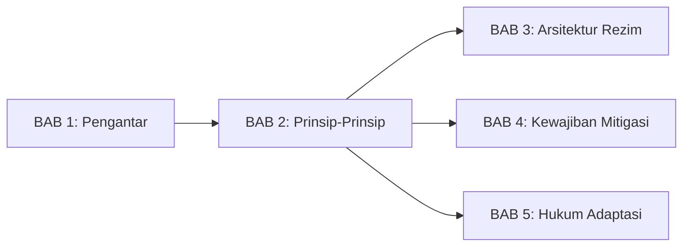
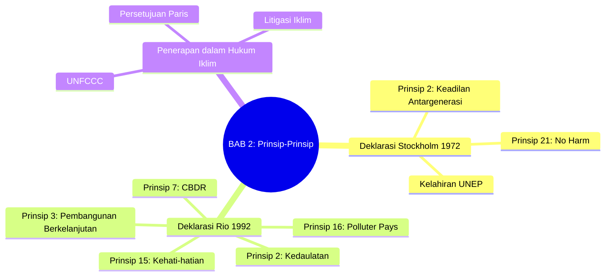
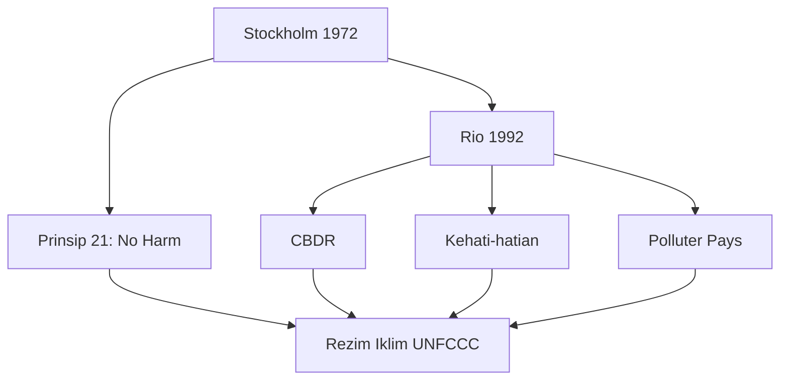

---
publish: true
bab: "2"
judul: "Prinsip-Prinsip Hukum Lingkungan Internasional"
level: "S1"
durasi_baca: "90 menit"
tags:
  - buku-ajar
  - hukum-06-PerubahanIklim
  - hukum-lingkungan-internasional
  - stockholm
  - rio
  - CBDR
  - precautionary-principle
---

# BAB 2: Prinsip-Prinsip Hukum Lingkungan Internasional

---

## A. PENDAHULUAN

### 1. Capaian Pembelajaran (Sub-CPMK)

Setelah mempelajari bab ini, mahasiswa mampu:

1. **Menjelaskan** asal-usul dan perkembangan prinsip-prinsip hukum lingkungan internasional
2. **Menganalisis** substansi dan implikasi prinsip-prinsip utama: kedaulatan dan *no harm*, CBDR, kehati-hatian, dan *polluter pays*
3. **Mengevaluasi** penerapan prinsip-prinsip tersebut dalam konteks hukum perubahan iklim
4. **Mengidentifikasi** tantangan implementasi prinsip-prinsip lingkungan dalam rezim iklim

### 2. Indikator Pencapaian

- [ ] Mahasiswa dapat menjelaskan hubungan antara Deklarasi Stockholm 1972 dan Deklarasi Rio 1992
- [ ] Mahasiswa dapat menguraikan substansi Prinsip 21 Stockholm dan Prinsip 2 Rio
- [ ] Mahasiswa dapat membedakan prinsip CBDR dengan prinsip tanggung jawab umum
- [ ] Mahasiswa dapat menerapkan prinsip kehati-hatian pada skenario perubahan iklim

### 3. Deskripsi Singkat

Sebelum kita memasuki kompleksitas rezim iklim internasional, penting untuk memahami fondasi normatifnya. Prinsip-prinsip hukum lingkungan internasional yang berkembang sejak 1972 menjadi batu penjuru bagi seluruh bangunan hukum iklim. Bab ini akan membawa Anda menelusuri sejarah dan substansi prinsip-prinsip fundamental tersebut, serta bagaimana prinsip-prinsip itu diterjemahkan ke dalam konteks perubahan iklim.

### 4. Hubungan dengan Bab Lain

Bab ini merupakan kelanjutan dari [[Buku-Ajar-Hukum-06-PerubahanIklim-01-Pengantar-Hukum-06-PerubahanIklim_BAB-01|BAB 1 tentang Pengantar]] dan menjadi fondasi normatif untuk memahami [[Buku-Ajar-Hukum-06-PerubahanIklim-03-Arsitektur-Rezim-Iklim_BAB-03|Arsitektur Rezim Iklim Internasional]] dan bab-bab selanjutnya.

### 5. Peta Konsep Bab

---

## B. PENYAJIAN MATERI

### 1. Deklarasi Stockholm 1972: Titik Awal Hukum Lingkungan Internasional

Tahun 1972 menandai momen bersejarah dalam perkembangan hukum lingkungan internasional. Pada 5-16 Juni 1972, perwakilan dari 113 negara berkumpul di Stockholm, Swedia, untuk Konferensi PBB tentang Lingkungan Hidup Manusia (*United Nations Conference on the Human Environment*).[^1] Konferensi ini merupakan konferensi internasional besar pertama yang secara khusus membahas isu lingkungan dan menghasilkan kerangka normatif yang akan membentuk seluruh arsitektur hukum lingkungan internasional untuk dekade-dekade berikutnya.

#### 1.1 Konteks Historis

Kesadaran global tentang krisis lingkungan tidak muncul secara tiba-tiba, melainkan merupakan kulminasi dari berbagai peristiwa dan publikasi yang mengguncang kesadaran publik sepanjang dekade 1960-an. Rachel Carson, melalui karyanya yang monumental *Silent Spring* pada tahun 1962, mengungkapkan secara gamblang dampak destruktif pestisida DDT terhadap ekosistem dan kesehatan manusia, sebuah karya yang oleh banyak kalangan dianggap sebagai pemicu lahirnya gerakan lingkungan modern.[^2] Bencana tumpahan minyak dari kapal tanker Torrey Canyon pada tahun 1967 yang mencemari pesisir Inggris dan Prancis menunjukkan betapa aktivitas manusia dapat menyebabkan kerusakan lingkungan lintas batas dalam skala yang belum pernah terjadi sebelumnya.[^3]

Di Eropa dan Amerika Utara, polusi industri lintas batas telah menjadi permasalahan yang semakin mendesak. Hujan asam yang berasal dari emisi industri di satu negara menyebabkan kerusakan hutan dan danau di negara tetangga, membuktikan bahwa pencemaran tidak mengenal batas-batas politik.[^4] Sementara itu, gerakan lingkungan yang menguat di negara-negara maju, ditandai dengan perayaan Hari Bumi (*Earth Day*) pertama pada tahun 1970 yang melibatkan jutaan warga Amerika Serikat, menciptakan tekanan politik yang signifikan bagi pemerintah untuk mengambil tindakan konkret.[^5]

> [!info] **Definisi**
> **Deklarasi Stockholm** (*Stockholm Declaration*): Dokumen yang memuat 26 prinsip tentang lingkungan dan pembangunan yang diadopsi pada Konferensi Stockholm 1972, menjadi fondasi hukum lingkungan internasional modern.

#### 1.2 Prinsip 21: Fondasi Tanggung Jawab Lintas Batas

Dari 26 prinsip yang diadopsi di Stockholm, Prinsip 21 menjadi yang paling berpengaruh dan paling sering dikutip dalam praktik hukum internasional. Prinsip ini bukan merupakan inovasi yang sepenuhnya baru, melainkan merupakan kodifikasi dari norma hukum kebiasaan internasional yang telah berkembang melalui praktik negara dan putusan pengadilan internasional, khususnya yang berakar pada putusan *Trail Smelter Arbitration* antara Amerika Serikat dan Kanada pada tahun 1941.[^6]

> [!quote] **Kutipan**
> "States have, in accordance with the Charter of the United Nations and the principles of international law, the sovereign right to exploit their own resources pursuant to their own environmental policies, **and the responsibility to ensure that activities within their jurisdiction or control do not cause damage to the environment of other States or of areas beyond the limits of national jurisdiction.**"
> — *Prinsip 21, Deklarasi Stockholm 1972*

Prinsip 21 memuat dua elemen fundamental yang saling melengkapi dan mencerminkan ketegangan abadi dalam hukum internasional antara kedaulatan negara dan kepentingan komunitas internasional. Elemen pertama menegaskan hak kedaulatan permanen negara atas sumber daya alamnya, sebuah prinsip yang sangat penting bagi negara-negara berkembang yang baru merdeka dan ingin memastikan kontrol penuh atas kekayaan alam mereka.[^7] Elemen kedua, yang dikenal sebagai prinsip *sic utere tuo ut alienum non laedas* (gunakan milikmu sedemikian rupa sehingga tidak merugikan milik orang lain), menetapkan batasan terhadap kedaulatan tersebut dengan mewajibkan negara untuk tidak menyebabkan kerusakan lingkungan lintas batas.[^8]

| Elemen | Substansi | Implikasi |
|--------|-----------|-----------|
| **Hak kedaulatan** | Negara berhak mengeksploitasi sumber daya alamnya | Kebebasan menentukan kebijakan pembangunan |
| **Kewajiban *no harm*** | Negara bertanggung jawab mencegah kerusakan lintas batas | Batasan terhadap kedaulatan absolut |

**Tabel 2.1.** Dua elemen Prinsip 21 Deklarasi Stockholm

#### 1.3 Warisan Stockholm

Konferensi Stockholm menghasilkan warisan institusional dan normatif yang bertahan hingga saat ini. Deklarasi Stockholm dengan 26 prinsipnya meletakkan fondasi filosofis bagi perkembangan hukum lingkungan internasional, meskipun sebagai deklarasi ia tidak memiliki kekuatan hukum mengikat secara langsung.[^9] Rencana Aksi dengan 109 rekomendasinya menyediakan panduan operasional bagi negara-negara dalam menangani berbagai isu lingkungan, dari pengelolaan sumber daya alam hingga pengendalian pencemaran.

Salah satu warisan terpenting adalah pembentukan United Nations Environment Programme (UNEP), yang bermarkas di Nairobi, Kenya, menjadikannya badan PBB pertama yang berkantor pusat di negara berkembang.[^10] UNEP diberi mandat untuk menjadi katalis dan koordinator dalam isu-isu lingkungan dalam sistem PBB, dan hingga kini tetap memainkan peran sentral dalam pengembangan hukum lingkungan internasional. Penetapan tanggal 5 Juni sebagai Hari Lingkungan Hidup Sedunia merupakan simbol komitmen global yang terus dirayakan setiap tahun sebagai momentum untuk meningkatkan kesadaran dan aksi lingkungan.

> [!tip] **Kotak Pengayaan: Maurice Strong dan "Only One Earth"**
> Maurice Strong, diplomat Kanada yang menjadi Sekretaris Jenderal Konferensi Stockholm, memelopori konsep bahwa masalah lingkungan adalah masalah global yang memerlukan kerjasama internasional. Buku *Only One Earth* yang ditulis oleh Barbara Ward dan Rene Dubos khusus untuk konferensi ini menekankan bahwa planet bumi adalah rumah bersama yang harus dijaga.[^11] Strong kemudian juga memimpin KTT Bumi Rio 1992, membuktikan pengaruhnya yang berkelanjutan dalam diplomasi lingkungan global.

---

### 2. Deklarasi Rio 1992: Perluasan dan Pendalaman Prinsip

Dua puluh tahun setelah Stockholm, komunitas internasional kembali berkumpul di Rio de Janeiro, Brasil, untuk Konferensi PBB tentang Lingkungan dan Pembangunan (*United Nations Conference on Environment and Development* atau UNCED), yang dikenal luas sebagai "KTT Bumi" (*Earth Summit*). Konferensi yang berlangsung pada tanggal 3-14 Juni 1992 ini menandai titik kulminasi dari proses persiapan yang intensif dan menghasilkan kerangka normatif yang jauh lebih komprehensif dibandingkan pendahulunya di Stockholm.[^12]

#### 2.1 Dari Stockholm ke Rio

KTT Bumi Rio 1992 merupakan konferensi terbesar dalam sejarah PBB hingga saat itu, dihadiri oleh perwakilan dari 172 negara termasuk 108 kepala negara dan pemerintahan, menunjukkan tingkat perhatian politik tertinggi yang belum pernah diberikan pada isu lingkungan sebelumnya. Kehadiran para pemimpin dunia ini mencerminkan pergeseran paradigma bahwa lingkungan bukan lagi isu pinggiran, melainkan isu strategis yang memerlukan komitmen di tingkat tertinggi.

Konferensi Rio menghasilkan serangkaian instrumen hukum dan kebijakan yang saling terkait dan membentuk arsitektur tata kelola lingkungan global kontemporer. Deklarasi Rio dengan 27 prinsipnya memperluas dan memperdalam prinsip-prinsip Stockholm, dengan penekanan khusus pada keterkaitan antara lingkungan dan pembangunan. Agenda 21, dokumen program aksi yang komprehensif, menyediakan panduan operasional untuk implementasi pembangunan berkelanjutan di tingkat lokal, nasional, dan global.[^13] Namun yang paling penting dalam konteks kajian ini adalah adopsi UNFCCC (Konvensi Kerangka Kerja PBB tentang Perubahan Iklim) dan Konvensi Keanekaragaman Hayati sebagai instrumen hukum internasional yang mengikat, menunjukkan bahwa komunitas internasional siap untuk bergerak dari prinsip-prinsip deklaratif menuju kewajiban-kewajiban konkret.

> [!info] **Definisi**
> **Deklarasi Rio** (*Rio Declaration on Environment and Development*): Dokumen yang memuat 27 prinsip yang menegaskan kembali dan mengembangkan prinsip-prinsip Stockholm, dengan penekanan pada hubungan antara lingkungan dan pembangunan.

#### 2.2 Prinsip 2: Penegasan Kembali *No Harm*

Prinsip 2 Deklarasi Rio menegaskan kembali Prinsip 21 Stockholm dengan formulasi yang hampir identik, menunjukkan bahwa prinsip *no harm* telah mengkristal menjadi norma hukum kebiasaan internasional yang diterima secara universal. Mahkamah Internasional dalam *Advisory Opinion on the Legality of the Threat or Use of Nuclear Weapons* (1996) secara eksplisit mengakui status normatif dari prinsip ini, menyatakan bahwa kewajiban umum negara untuk memastikan aktivitas di dalam yurisdiksi mereka tidak menyebabkan kerusakan lingkungan negara lain merupakan bagian dari korpus hukum internasional yang berkaitan dengan lingkungan.[^14]

Perbedaan formulasi antara Stockholm dan Rio, meskipun terlihat kecil, memiliki signifikansi politik yang penting. Rio menambahkan frasa "*developmental* policies" di samping "*environmental* policies", mencerminkan kompromi yang dicapai antara agenda perlindungan lingkungan yang diusung negara-negara maju dan agenda pembangunan yang diperjuangkan oleh negara-negara berkembang. Penambahan ini menegaskan bahwa hak untuk pembangunan merupakan bagian integral dari paradigma keberlanjutan.[^15]

#### 2.3 Prinsip 3: Pembangunan Berkelanjutan

> [!quote] **Kutipan**
> "The right to development must be fulfilled so as to equitably meet developmental and environmental needs of present and future generations."
> — *Prinsip 3, Deklarasi Rio 1992*

Prinsip 3 Deklarasi Rio mengkodifikasi konsep pembangunan berkelanjutan (*sustainable development*) yang telah dipopulerkan oleh Laporan Brundtland pada tahun 1987. Komisi Dunia untuk Lingkungan dan Pembangunan yang dipimpin oleh Gro Harlem Brundtland, Perdana Menteri Norwegia, mendefinisikan pembangunan berkelanjutan sebagai "pembangunan yang memenuhi kebutuhan generasi sekarang tanpa mengorbankan kemampuan generasi mendatang untuk memenuhi kebutuhan mereka sendiri."[^16]

> [!info] **Definisi**
> **Pembangunan berkelanjutan** (*sustainable development*): Pembangunan yang memenuhi kebutuhan generasi sekarang tanpa mengorbankan kemampuan generasi mendatang untuk memenuhi kebutuhan mereka sendiri.

Konsep ini telah berkembang menjadi kerangka analitis yang diakui secara luas dengan tiga pilar yang saling terkait dan tidak dapat dipisahkan. Pilar ekonomi menuntut pertumbuhan yang berkelanjutan dan efisien dalam penggunaan sumber daya, mengakui bahwa kemakmuran ekonomi tetap diperlukan namun harus dicapai dengan cara yang tidak melampaui daya dukung planet. Pilar sosial menekankan keadilan dan inklusivitas, memastikan bahwa manfaat pembangunan didistribusikan secara merata dan tidak ada kelompok yang tertinggal. Pilar lingkungan menuntut pelestarian sumber daya alam dan jasa ekosistem untuk generasi mendatang.[^17] Ketiga pilar ini, sebagaimana ditegaskan dalam Deklarasi Johannesburg 2002, merupakan "pilar-pilar yang saling bergantung dan saling memperkuat dari pembangunan berkelanjutan."[^18]

---

### 3. Prinsip Tanggung Jawab Bersama namun Berbeda (CBDR)

Prinsip 7 Deklarasi Rio memperkenalkan konsep yang menjadi sangat penting dan sekaligus paling kontroversial dalam negosiasi iklim internasional. Prinsip ini merupakan hasil kompromi yang dicapai setelah negosiasi yang alot antara negara-negara maju dan berkembang, mencerminkan ketegangan fundamental tentang bagaimana beban perlindungan lingkungan global harus didistribusikan.[^19]

> [!quote] **Kutipan**
> "States shall cooperate in a spirit of global partnership to conserve, protect and restore the health and integrity of the Earth's ecosystem. In view of the different contributions to global environmental degradation, States have **common but differentiated responsibilities**."
> — *Prinsip 7, Deklarasi Rio 1992*

#### 3.1 Makna CBDR

> [!info] **Definisi**
> **CBDR** (*Common But Differentiated Responsibilities and Respective Capabilities*): Prinsip yang menyatakan bahwa semua negara memiliki tanggung jawab bersama untuk melindungi lingkungan global, namun kontribusi masing-masing berbeda sesuai dengan tanggung jawab historis dan kapasitas saat ini.

Prinsip CBDR bertumpu pada dua justifikasi yang saling melengkapi dan membentuk dasar moral serta praktis untuk diferensiasi kewajiban. Justifikasi pertama bersifat historis dan korektif: negara-negara maju, melalui proses industrialisasi yang dimulai sejak abad ke-18, telah menyumbangkan porsi terbesar dari emisi gas rumah kaca kumulatif yang kini berada di atmosfer. Data menunjukkan bahwa negara-negara Annex I bertanggung jawab atas sekitar 79% emisi CO2 kumulatif dari sektor energi antara tahun 1850-2011, sementara populasi mereka hanya sekitar 20% dari populasi global.[^20] Berdasarkan prinsip keadilan korektif, mereka yang telah menyebabkan masalah memiliki tanggung jawab lebih besar untuk memperbaikinya.

Justifikasi kedua bersifat kapasitas dan distributif: negara-negara maju memiliki sumber daya finansial, teknologi, dan institusional yang jauh lebih besar untuk mengambil tindakan. Berdasarkan prinsip keadilan distributif, mereka yang lebih mampu seharusnya memikul beban yang lebih besar. Kedua justifikasi ini saling memperkuat dan membentuk dasar bagi arsitektur diferensiasi dalam rezim lingkungan internasional.

| Justifikasi | Penjelasan | Implikasi |
|-------------|------------|-----------|
| **Kontribusi historis** | Negara maju secara historis lebih banyak menyumbang emisi kumulatif | Negara maju harus memimpin pengurangan emisi |
| **Kapasitas saat ini** | Negara maju memiliki sumber daya lebih besar | Negara maju harus menyediakan pendanaan dan teknologi |

**Tabel 2.2.** Dua justifikasi prinsip CBDR

#### 3.2 CBDR dalam Rezim Iklim

Prinsip CBDR telah menjadi tulang punggung arsitektur rezim iklim internasional, meskipun penerapannya telah berevolusi seiring waktu mencerminkan pergeseran geopolitik dan ekonomi global. Dalam UNFCCC yang diadopsi pada tahun 1992, diferensiasi diwujudkan melalui pembagian negara ke dalam dua kategori: negara-negara Annex I (negara maju dan ekonomi transisi) yang memikul kewajiban lebih berat untuk mengurangi emisi dan menyediakan bantuan finansial dan teknologi, serta negara-negara non-Annex I (negara berkembang) yang kewajibannya lebih ringan.[^21]

Protokol Kyoto pada tahun 1997 membawa diferensiasi ini ke tingkat yang lebih konkret dengan hanya mewajibkan negara-negara Annex I untuk memenuhi target pengurangan emisi yang mengikat secara hukum, sementara negara-negara berkembang tidak memiliki kewajiban pengurangan kuantitatif. Pendekatan ini, meskipun konsisten dengan prinsip CBDR, akhirnya menjadi salah satu faktor yang menyebabkan Amerika Serikat menolak meratifikasi protokol tersebut dengan alasan tidak adanya partisipasi negara-negara berkembang utama seperti China dan India.

Persetujuan Paris 2015 menandai pergeseran paradigma dalam penerapan CBDR dengan menerapkan pendekatan yang lebih fleksibel dan dinamis. Semua negara, termasuk negara berkembang, kini berkontribusi melalui Nationally Determined Contributions (NDC), namun diferensiasi tetap dipertahankan melalui bahasa "in the light of different national circumstances" dan fleksibilitas yang diberikan kepada negara berkembang dalam menentukan sifat dan ambisi kontribusi mereka.[^22]

> [!example] **Contoh: Indonesia dan CBDR**
> Indonesia, sebagai negara berkembang, menggunakan argumen CBDR untuk menuntut pendanaan dari negara maju untuk aksi iklim domestik, transfer teknologi rendah karbon yang terjangkau, fleksibilitas dalam mencapai target NDC termasuk dukungan internasional untuk target kondisional, serta bantuan untuk adaptasi dan kompensasi *loss and damage*.

#### 3.3 Perdebatan CBDR

Prinsip CBDR tidak pernah berhenti menjadi subjek perdebatan sengit dalam negosiasi iklim internasional. Negara-negara maju, terutama Amerika Serikat, secara konsisten berpendapat bahwa kategorisasi yang ditetapkan pada tahun 1992 tidak lagi mencerminkan realitas ekonomi dan emisi kontemporer. Mereka menunjuk pada fakta bahwa China kini telah menjadi emitter terbesar dunia, melampaui Amerika Serikat dan Uni Eropa, dan bahwa ekonomi-ekonomi emerging seperti India, Brasil, dan Indonesia juga memiliki emisi yang signifikan dan terus meningkat. Dalam pandangan mereka, diferensiasi yang "kaku" berdasarkan kategori yang sudah usang tidak lagi dapat dipertahankan secara logis maupun efektif.[^23]

Negara-negara berkembang membela prinsip CBDR dengan argumentasi yang sama kuatnya. Mereka menunjukkan bahwa meskipun emisi tahunan beberapa negara berkembang kini memang besar, emisi kumulatif historis yang bertanggung jawab atas konsentrasi gas rumah kaca saat ini tetap didominasi oleh negara-negara maju. Mereka juga menekankan bahwa emisi per kapita negara-negara berkembang masih jauh lebih rendah dibandingkan negara maju, dan bahwa hak untuk pembangunan yang merupakan hak asasi manusia harus tetap dihormati. Pembatasan emisi yang setara bagi semua negara, tanpa mempertimbangkan tahap pembangunan dan tanggung jawab historis, akan mengunci ketidaksetaraan global yang ada.[^24]

---

### 4. Prinsip Kehati-hatian (*Precautionary Principle*)

Prinsip 15 Deklarasi Rio mengkodifikasi pendekatan kehati-hatian (*precautionary approach*) yang telah berkembang dalam hukum lingkungan nasional dan internasional, khususnya dalam konteks perlindungan laut dan pengelolaan perikanan. Prinsip ini memiliki akar dalam hukum Jerman (*Vorsorgeprinzip*) dan telah diadopsi dalam berbagai perjanjian internasional sebelum Rio, termasuk Protokol Montreal 1987 tentang zat-zat yang merusak lapisan ozon.[^25]

> [!quote] **Kutipan**
> "In order to protect the environment, the precautionary approach shall be widely applied by States according to their capabilities. Where there are threats of serious or irreversible damage, **lack of full scientific certainty shall not be used as a reason for postponing cost-effective measures** to prevent environmental degradation."
> — *Prinsip 15, Deklarasi Rio 1992*

#### 4.1 Makna Prinsip Kehati-hatian

> [!info] **Definisi**
> **Prinsip kehati-hatian** (*precautionary principle*): Prinsip yang menyatakan bahwa ketiadaan kepastian ilmiah yang penuh tidak boleh dijadikan alasan untuk menunda tindakan pencegahan terhadap ancaman kerusakan lingkungan yang serius atau tidak dapat dipulihkan.

Prinsip kehati-hatian merepresentasikan pergeseran paradigma fundamental dalam cara hukum internasional menangani risiko lingkungan. Pendekatan tradisional dalam hukum internasional mensyaratkan bukti yang jelas tentang kerusakan atau kausalitas sebelum tindakan regulatif dapat dibenarkan. Pendekatan ini, yang sering disebut sebagai pendekatan "reaktif" atau berbasis bukti, memiliki kelemahan fundamental ketika berhadapan dengan risiko lingkungan yang bersifat sistemik, lambat berkembang, dan berpotensi tidak dapat dipulihkan.

Prinsip kehati-hatian membalik beban pembuktian dengan cara yang signifikan. Dalam kerangka kehati-hatian, ketidakpastian ilmiah tidak lagi menjadi alasan untuk tidak bertindak, melainkan justru menjadi alasan untuk bertindak secara preventif. Hal ini tidak berarti bahwa bukti ilmiah menjadi tidak relevan, melainkan bahwa ambang batas bukti yang diperlukan untuk membenarkan tindakan regulatif diturunkan ketika potensi konsekuensinya serius dan tidak dapat dipulihkan.[^26]

#### 4.2 Penerapan dalam Hukum Iklim

Prinsip kehati-hatian memiliki relevansi yang sangat tinggi dalam konteks perubahan iklim, dan telah secara eksplisit diadopsi dalam Pasal 3(3) UNFCCC yang menyatakan bahwa Para Pihak "should take precautionary measures to anticipate, prevent or minimize the causes of climate change and mitigate its adverse effects." Beberapa karakteristik perubahan iklim menjadikannya sebagai kasus paradigmatik untuk penerapan prinsip ini.

Pertama, meskipun konsensus ilmiah tentang perubahan iklim antropogenik sangat kuat, proyeksi tentang besaran, kecepatan, dan distribusi geografis dampaknya masih memiliki rentang ketidakpastian. IPCC secara konsisten menggunakan bahasa probabilistik dalam laporan-laporannya, mencerminkan ketidakpastian inheren dalam pemodelan sistem iklim yang kompleks. Kedua, dampak perubahan iklim berpotensi tidak dapat dipulihkan dalam skala waktu yang relevan bagi peradaban manusia. Sekali titik-titik kritis (*tipping points*) seperti runtuhnya lapisan es Antartika Barat atau matinya hutan Amazon terlampaui, konsekuensinya bersifat permanen atau membutuhkan ribuan tahun untuk pulih. Ketiga, terdapat jeda waktu (*time lag*) yang signifikan antara emisi dan dampak penuhnya karena CO2 bertahan di atmosfer selama ratusan tahun dan sistem iklim memiliki inersia termal.[^27]

> [!example] **Contoh: Kehati-hatian dalam Litigasi**
> Dalam kasus *Urgenda Foundation v. State of the Netherlands* (2019), Mahkamah Agung Belanda secara eksplisit merujuk pada prinsip kehati-hatian sebagai salah satu justifikasi untuk mewajibkan pemerintah meningkatkan target pengurangan emisi menjadi minimal 25% di bawah tingkat 1990 pada akhir 2020. Pengadilan menyatakan bahwa ketidakpastian tentang kapan persisnya ambang 1,5 derajat Celsius akan terlampaui tidak boleh menjadi alasan untuk menunda tindakan, mengingat potensi konsekuensinya yang katastrofik dan tidak dapat dipulihkan.[^28]

> [!warning] **Perhatian**
> Prinsip kehati-hatian bukan berarti tindakan harus sempurna atau bebas risiko. Prinsip ini meminta keseimbangan antara risiko bertindak dan risiko tidak bertindak, sebagaimana tercermin dalam frasa "*cost-effective measures*" dalam Prinsip 15 Rio.

---

### 5. Prinsip Pencemar Membayar (*Polluter Pays Principle*)

Prinsip pencemar membayar (*polluter pays principle*) yang tercantum dalam Prinsip 16 Deklarasi Rio memiliki akar yang lebih tua dibandingkan prinsip-prinsip lain yang dibahas dalam bab ini. Prinsip ini pertama kali diadopsi sebagai prinsip panduan kebijakan lingkungan oleh Organisation for Economic Co-operation and Development (OECD) pada tahun 1972, bersamaan dengan Konferensi Stockholm, sebagai instrumen untuk mencegah distorsi dalam perdagangan internasional yang dapat timbul dari perbedaan standar lingkungan antar negara.[^29]

> [!quote] **Kutipan**
> "National authorities should endeavour to promote the internalization of environmental costs and the use of economic instruments, taking into account the approach that **the polluter should, in principle, bear the cost of pollution**..."
> — *Prinsip 16, Deklarasi Rio 1992*

#### 5.1 Makna Polluter Pays

> [!info] **Definisi**
> **Prinsip pencemar membayar** (*polluter pays principle*): Prinsip yang menyatakan bahwa biaya pencemaran harus ditanggung oleh pihak yang menyebabkan pencemaran, bukan oleh masyarakat atau korban.

Secara ekonomi, prinsip pencemar membayar merupakan respons terhadap kegagalan pasar yang dikenal sebagai eksternalitas negatif. Ketika pencemar tidak menanggung biaya penuh dari aktivitas polusinya, biaya tersebut ditransfer kepada masyarakat luas dalam bentuk kerusakan kesehatan, degradasi lingkungan, dan penurunan kualitas hidup. Kondisi ini menciptakan insentif yang salah karena pencemar dapat mengeksternalisasi biaya sambil menikmati keuntungan penuh dari aktivitas produktifnya.

Prinsip ini bertujuan untuk mencapai tiga tujuan yang saling terkait. Pertama, internalisasi eksternalitas dengan memasukkan biaya lingkungan ke dalam struktur harga produk dan jasa, sehingga harga pasar mencerminkan biaya sosial yang sebenarnya. Kedua, menciptakan insentif ekonomi yang tepat bagi pencemar untuk mengurangi polusi karena pengurangan polusi akan langsung mengurangi biaya yang mereka tanggung. Ketiga, mewujudkan keadilan dengan mengalihkan beban biaya pencemaran dari korban dan masyarakat umum kepada pihak yang seharusnya bertanggung jawab.[^30]

#### 5.2 Penerapan dalam Hukum Iklim

Penerapan prinsip pencemar membayar dalam konteks perubahan iklim telah mengambil berbagai bentuk instrumen kebijakan yang semakin berkembang dalam beberapa dekade terakhir. Pajak karbon, yang pertama kali diterapkan secara komprehensif oleh Finlandia pada tahun 1990 dan kemudian diikuti oleh Swedia, membebankan biaya langsung pada setiap ton CO2 yang diemisikan, dengan Swedia kini menerapkan tarif pajak karbon tertinggi di dunia.[^31] Sistem perdagangan emisi (*emissions trading system*), dengan EU ETS sebagai contoh terbesar dan paling berkembang, menciptakan harga karbon melalui mekanisme pasar di mana izin emisi diperdagangkan, secara efektif membebankan biaya pada pencemar yang melampaui jatah emisinya.

| Instrumen | Penerapan Polluter Pays | Contoh |
|-----------|------------------------|--------|
| **Pajak karbon** | Emitter membayar per ton CO2 | Carbon tax di Swedia, Kanada |
| **Perdagangan emisi** | Emitter membeli izin emisi | EU ETS, pasar karbon Indonesia |
| **Loss and damage** | Emitter historis membiayai kerusakan | Loss and Damage Fund (COP27) |
| **Litigasi** | Perusahaan fosil mengganti kerugian | Gugatan terhadap Exxon, Shell |

**Tabel 2.3.** Penerapan prinsip *polluter pays* dalam konteks iklim

Dimensi yang lebih kontroversial dari prinsip pencemar membayar dalam konteks iklim muncul dalam negosiasi tentang *loss and damage*. Negara-negara berkembang, khususnya negara-negara kepulauan kecil yang paling rentan, berpendapat bahwa prinsip ini mengharuskan negara-negara maju sebagai emitter historis utama untuk memberikan kompensasi atas kerusakan yang telah dan akan terjadi akibat perubahan iklim. Pembentukan Loss and Damage Fund pada COP27 di Sharm el-Sheikh pada tahun 2022 merupakan pengakuan parsial terhadap argumen ini, meskipun negara-negara maju terus menolak penggunaan bahasa "kompensasi" atau "tanggung jawab hukum."[^32]

> [!tip] **Kotak Pengayaan: Siapa "Pencemar" dalam Perubahan Iklim?**
> Pertanyaan siapa yang seharusnya menanggung biaya dalam konteks perubahan iklim sangat kompleks dan memiliki implikasi kebijakan yang signifikan. Apakah tanggung jawab harus dibebankan pada negara-negara yang emisinya tinggi, pada perusahaan-perusahaan fosil yang memproduksi dan memasarkan bahan bakar, atau pada konsumen individu yang mengonsumsi energi dan produk?
>
> Studi Richard Heede (2014) yang diterbitkan dalam jurnal *Climatic Change* memberikan jawaban yang mengejutkan: hanya 90 perusahaan yang bertanggung jawab atas 63% emisi kumulatif global sejak 1854.[^33] Temuan ini telah menjadi landasan empiris bagi gelombang "litigasi iklim berbasis atribusi" yang menargetkan perusahaan-perusahaan fosil besar secara langsung, dengan argumen bahwa mereka telah mengetahui risiko perubahan iklim namun terus mempromosikan produk fosil dan bahkan mendanai kampanye disinformasi.

---

### 6. Keadilan Antargenerasi (*Intergenerational Equity*)

Prinsip keadilan antargenerasi, meskipun tidak dirumuskan secara eksplisit dalam satu prinsip tunggal, meresapi seluruh Deklarasi Stockholm dan Deklarasi Rio serta menjadi fondasi filosofis bagi konsep pembangunan berkelanjutan. Pembukaan Deklarasi Stockholm sudah menyatakan bahwa manusia memiliki tanggung jawab untuk melindungi lingkungan "for present and future generations," sementara Prinsip 3 Rio secara eksplisit merujuk pada "present and future generations."[^34]

#### 6.1 Konsep Keadilan Antargenerasi

> [!info] **Definisi**
> **Keadilan antargenerasi** (*intergenerational equity*): Prinsip yang menyatakan bahwa generasi saat ini memiliki kewajiban untuk melestarikan pilihan, kualitas, dan akses lingkungan bagi generasi mendatang, sebagaimana diwarisi dari generasi sebelumnya.

Kerangka teoretis paling berpengaruh untuk memahami keadilan antargenerasi dalam konteks hukum internasional dikembangkan oleh Edith Brown Weiss dalam karyanya yang seminal *In Fairness to Future Generations* (1989). Weiss mengajukan teori "planetary trust" yang memandang setiap generasi sebagai pemegang amanah (*trustee*) dari planet bumi yang menerima warisan dari generasi sebelumnya dan berkewajiban meneruskannya kepada generasi berikutnya dalam kondisi yang tidak lebih buruk.

Dari kerangka ini, Weiss mengidentifikasi tiga prinsip turunan yang saling terkait. Prinsip pelestarian pilihan (*conservation of options*) mengharuskan setiap generasi untuk melestarikan keragaman sumber daya alam dan budaya sehingga generasi mendatang memiliki pilihan yang sebanding dengan yang dinikmati generasi sebelumnya. Prinsip pelestarian kualitas (*conservation of quality*) mewajibkan setiap generasi untuk menjaga kualitas planet sehingga diteruskan dalam kondisi yang tidak lebih buruk dari yang diterima. Prinsip pelestarian akses (*conservation of access*) menjamin bahwa setiap generasi memiliki akses yang setara terhadap warisan generasi sebelumnya dan melestarikan akses ini bagi generasi mendatang.[^35]

#### 6.2 Tantangan Hukum Keadilan Antargenerasi

Meskipun secara moral persuasif, penerapan keadilan antargenerasi dalam kerangka hukum menghadirkan tantangan-tantangan konseptual dan praktis yang unik dan belum sepenuhnya terpecahkan. Permasalahan representasi menjadi tantangan fundamental karena generasi mendatang, menurut definisi, tidak dapat mewakili diri mereka sendiri dalam proses pengambilan keputusan saat ini. Berbagai mekanisme telah diusulkan untuk mengatasi hal ini, termasuk pembentukan ombudsman untuk generasi mendatang atau pemberian *standing* kepada organisasi-organisasi yang mengklaim mewakili kepentingan generasi mendatang, namun tidak ada solusi yang sepenuhnya memuaskan.

Permasalahan *discount rate* atau tingkat diskonto juga menimbulkan perdebatan yang intens. Dalam analisis ekonomi standar, manfaat dan biaya di masa depan didiskontokan ke nilai sekarang, yang berarti bahwa kerugian yang akan dialami generasi mendatang memiliki nilai yang jauh lebih rendah dibandingkan kerugian yang dialami generasi saat ini. Beberapa ekonom, khususnya Nicholas Stern dalam *Stern Review on the Economics of Climate Change* (2006), berpendapat bahwa diskonto yang tinggi tidak dapat dibenarkan secara etis ketika menyangkut kesejahteraan generasi mendatang dan bahwa tingkat diskonto yang mendekati nol lebih tepat untuk isu-isu seperti perubahan iklim.[^36]

| Tantangan | Penjelasan |
|-----------|------------|
| **Representasi** | Generasi mendatang tidak dapat mewakili diri sendiri |
| **Justisiabilitas** | Bagaimana generasi mendatang menggugat? |
| **Discount rate** | Berapa nilai masa depan dibandingkan sekarang? |
| **Ketidakpastian** | Kita tidak tahu preferensi generasi mendatang |

**Tabel 2.4.** Tantangan hukum keadilan antargenerasi

> [!example] **Contoh: Mahkamah Konstitusi Jerman**
> Dalam putusan bersejarah *Neubauer et al. v. Germany* (2021), Mahkamah Konstitusi Federal Jerman memutuskan bahwa Undang-Undang Perlindungan Iklim Jerman (*Klimaschutzgesetz*) tahun 2019 melanggar hak-hak konstitusional generasi muda. Mahkamah menyatakan bahwa undang-undang tersebut membebankan beban pengurangan emisi yang tidak proporsional ke masa depan karena target pengurangan yang terlalu rendah untuk periode hingga 2030 akan memaksa pengurangan yang drastis dan restriktif terhadap kebebasan setelah 2030. Mahkamah mewajibkan pemerintah untuk menetapkan target yang lebih ambisius dan lebih jelas untuk periode pasca-2030.[^37]
>
> Putusan ini merupakan contoh sukses litigasi berbasis keadilan antargenerasi dan telah menginspirasi kasus-kasus serupa di berbagai yurisdiksi.

---

## C. STUDI KASUS

### Kasus: Prinsip *No Harm* dalam Advisory Opinion ICJ 2025

**Latar Belakang:**

Pada 29 Maret 2023, Majelis Umum PBB mengadopsi resolusi yang meminta Mahkamah Internasional (ICJ) memberikan pendapat hukum (*advisory opinion*) tentang kewajiban negara terkait perubahan iklim. Resolusi ini diprakarsai oleh Vanuatu dan didukung oleh lebih dari 100 negara.

Pada tahun 2025, ICJ mengeluarkan *advisory opinion* yang bersejarah, menegaskan bahwa prinsip *no harm* Stockholm/Rio berlaku dalam konteks perubahan iklim.

**Fakta Kunci:**
1. Vanuatu adalah negara kepulauan kecil yang sangat rentan terhadap kenaikan muka laut
2. Emisi GRK Vanuatu sangat kecil dibandingkan kontribusi globalnya terhadap perubahan iklim
3. ICJ diminta menjawab: Apa kewajiban negara di bawah hukum internasional untuk melindungi sistem iklim?
4. ICJ menafsirkan Prinsip 21 Stockholm dan Prinsip 2 Rio dalam konteks perubahan iklim

**Isu Hukum:**
- Apakah prinsip *no harm* berlaku untuk emisi GRK dan perubahan iklim?
- Bagaimana atribusi kausalitas antara emisi satu negara dan kerusakan di negara lain?
- Apa konsekuensi hukum bagi negara yang gagal mengurangi emisi?

---

**Pertanyaan Pemantik:**

1. **Analisis:** Identifikasi prinsip-prinsip hukum lingkungan internasional yang relevan dengan *advisory opinion* ini!

2. **Evaluasi:** Apakah prinsip *no harm* yang dirancang untuk polusi "tradisional" dapat diterapkan pada perubahan iklim? Apa perbedaan dan kesulitannya?

3. **Sintesis:** Menurut Anda, bagaimana seharusnya standar kehati-hatian (*standard of care*) diterapkan pada negara terkait emisi GRK? Apakah semua negara memiliki standar yang sama?

4. **Aplikasi:** Bagaimana *advisory opinion* ini dapat mempengaruhi kebijakan iklim Indonesia sebagai negara yang rentan sekaligus emitter signifikan?

> [!note] **Petunjuk Diskusi**
> Kasus ini dapat didiskusikan dalam kelompok kecil (3-4 orang) selama 45 menit. Setiap kelompok dapat mengambil perspektif berbeda: negara kepulauan kecil, negara maju, negara berkembang besar (seperti Indonesia), atau perusahaan multinasional.

---

## D. PENUTUP

### 1. Rangkuman

Pada bab ini, kita telah mempelajari:

- **Deklarasi Stockholm 1972:** Titik awal hukum lingkungan internasional modern, dengan Prinsip 21 yang menegaskan kedaulatan negara dan kewajiban *no harm*.

- **Deklarasi Rio 1992:** Perluasan dan pendalaman prinsip-prinsip Stockholm, memperkenalkan konsep pembangunan berkelanjutan, CBDR, kehati-hatian, dan *polluter pays*.

- **Prinsip CBDR:** Semua negara bertanggung jawab, namun kontribusinya berbeda sesuai tanggung jawab historis dan kapasitas saat ini.

- **Prinsip Kehati-hatian:** Ketidakpastian ilmiah bukan alasan untuk menunda tindakan pencegahan terhadap ancaman serius.

- **Prinsip *Polluter Pays*:** Pencemar harus menanggung biaya pencemaran yang ditimbulkannya.

- **Keadilan Antargenerasi:** Generasi saat ini memiliki kewajiban terhadap generasi mendatang.

---

### 2. Latihan

Kerjakan latihan berikut untuk memperdalam pemahaman Anda:

1. Jelaskan dengan kata-kata Anda sendiri mengapa Prinsip 21 Deklarasi Stockholm disebut sebagai fondasi hukum lingkungan internasional!

2. Bandingkan dan kontraskan prinsip CBDR dengan prinsip kesetaraan kedaulatan negara!

3. Berikan 3 contoh penerapan prinsip kehati-hatian dalam kebijakan iklim Indonesia!

4. Analisis hubungan antara prinsip *polluter pays* dengan mekanisme pasar karbon!

5. Cari satu kasus litigasi iklim yang menggunakan argumen keadilan antargenerasi dan identifikasi penerapan prinsip-prinsip yang dipelajari dalam bab ini!

---

### 3. Tes Formatif

Jawablah pertanyaan-pertanyaan berikut untuk mengukur pemahaman Anda:

**Pilihan Ganda:**

1. Konferensi internasional yang menghasilkan Deklarasi Stockholm adalah:
   - a. KTT Bumi Rio 1992
   - b. Konferensi PBB tentang Lingkungan Hidup Manusia 1972
   - c. Konferensi Paris 2015
   - d. Konferensi Kyoto 1997

2. Prinsip yang menyatakan negara tidak boleh menyebabkan kerusakan lingkungan lintas batas terdapat dalam:
   - a. Prinsip 7 Rio
   - b. Prinsip 15 Rio
   - c. Prinsip 21 Stockholm
   - d. Prinsip 16 Rio

3. Prinsip CBDR pertama kali dikodifikasi dalam:
   - a. Deklarasi Stockholm 1972
   - b. Deklarasi Rio 1992
   - c. UNFCCC 1992
   - d. Persetujuan Paris 2015

4. Prinsip yang menyatakan ketidakpastian ilmiah bukan alasan menunda tindakan adalah:
   - a. Prinsip *no harm*
   - b. Prinsip CBDR
   - c. Prinsip kehati-hatian
   - d. Prinsip keadilan prosedural

5. Instrumen ekonomi yang merupakan penerapan prinsip *polluter pays* adalah:
   - a. Subsidi energi fosil
   - b. Pajak karbon
   - c. Bantuan sosial
   - d. Asuransi bencana

**Benar atau Salah:**

6. Deklarasi Stockholm dan Rio bersifat mengikat secara hukum (*hard law*). (B/S)

7. Prinsip CBDR mewajibkan negara maju memimpin pengurangan emisi. (B/S)

8. Prinsip kehati-hatian mensyaratkan kepastian ilmiah 100% sebelum bertindak. (B/S)

9. Keadilan antargenerasi berkaitan dengan hak generasi yang belum lahir. (B/S)

10. UNEP dibentuk setelah Konferensi Rio 1992. (B/S)

---

### 4. Umpan Balik dan Tindak Lanjut

Cocokkan jawaban Anda dengan **Kunci Jawaban** di [[Buku-Ajar-Hukum-06-PerubahanIklim-Back-Matter-Lampiran_Lampiran-04-Kunci-Jawaban|Lampiran 4]].

**Kunci Jawaban Singkat:** 1-b, 2-c, 3-b, 4-c, 5-b, 6-S, 7-B, 8-S, 9-B, 10-S

**Rumus Penilaian:**

$$Tingkat\ Penguasaan = \frac{Jumlah\ Jawaban\ Benar}{10} \times 100\%$$

**Interpretasi dan Tindak Lanjut:**

| Tingkat Penguasaan | Kategori | Tindak Lanjut |
|--------------------|----------|---------------|
| **90 - 100%** | Baik Sekali | Selamat! Anda dapat melanjutkan ke [[Buku-Ajar-Hukum-06-PerubahanIklim-03-Arsitektur-Rezim-Iklim_BAB-03|BAB 3]] |
| **80 - 89%** | Baik | Anda dapat melanjutkan, namun pelajari kembali bagian yang masih ragu |
| **70 - 79%** | Cukup | **Ulangi** materi bab ini, terutama bagian yang belum dikuasai |
| **< 70%** | Kurang | **Wajib mengulangi** seluruh materi bab ini sebelum melanjutkan |

> [!tip] **Saran Belajar**
> Jika tingkat penguasaan Anda belum mencapai 80%, cobalah:
> 1. Baca ulang rangkuman dan peta konsep
> 2. Diskusikan materi dengan teman sejawat
> 3. Konsultasikan dengan dosen pada sesi tatap muka
> 4. Cari referensi tambahan dari daftar pustaka

---

### 5. Senarai Istilah Kunci

| Istilah | Bahasa Inggris | Definisi |
|---------|----------------|----------|
| Prinsip *no harm* | *No harm principle* | Kewajiban negara untuk tidak menyebabkan kerusakan lingkungan lintas batas |
| CBDR | *Common But Differentiated Responsibilities* | Tanggung jawab bersama yang berbeda sesuai kontribusi historis dan kapasitas |
| Prinsip kehati-hatian | *Precautionary principle* | Ketidakpastian bukan alasan menunda tindakan pencegahan |
| Pencemar membayar | *Polluter pays principle* | Pencemar menanggung biaya pencemaran |
| Pembangunan berkelanjutan | *Sustainable development* | Pembangunan tanpa mengorbankan generasi mendatang |
| Keadilan antargenerasi | *Intergenerational equity* | Keadilan antara generasi saat ini dan mendatang |

---

### 6. Daftar Pustaka Bab

**Sumber Primer:**
- Declaration of the United Nations Conference on the Human Environment (Stockholm Declaration), 1972. [[01-Traktat_Stockholm_Declaration_1972]]
- Rio Declaration on Environment and Development, 1992. [[01-Traktat_Rio_Declaration_1992]]

**Sumber Sekunder:**
- Sands, P. & Peel, J. (2018). *Principles of International Environmental Law*. 4th ed. Cambridge: CUP.
- Bodansky, D., Brunnée, J., & Rajamani, L. (2017). *International Climate Change Law*. Oxford: OUP.
- Weiss, E. B. (1989). *In Fairness to Future Generations*. Tokyo: UNU.

**Sumber Pendukung:**
- ICJ Advisory Opinion on Climate Change, 2025. [[02-Yurisprudensi-Internasional_ICJ_Climate_AO_2025]]
- Heede, R. (2014). "Tracing anthropogenic carbon dioxide and methane emissions to fossil fuel and cement producers." *Climatic Change*.

---

### 7. Tautan Terkait

**Sumber dalam Vault:**
- [[01-Traktat_Stockholm_Declaration_1972]] - Teks Deklarasi Stockholm
- [[01-Traktat_Rio_Declaration_1992]] - Teks Deklarasi Rio
- [[01-Traktat_UNFCCC_1992]] - Konvensi yang mengadopsi prinsip-prinsip Rio
- [[02-Yurisprudensi-Internasional_ICJ_Climate_AO_2025]] - Penerapan prinsip-prinsip dalam yurisprudensi

**Navigasi Buku:**
- ← [[Buku-Ajar-Hukum-06-PerubahanIklim-01-Pengantar-Hukum-06-PerubahanIklim_BAB-01|BAB 1: Pengantar Hukum Perubahan Iklim]]
- → [[Buku-Ajar-Hukum-06-PerubahanIklim-03-Arsitektur-Rezim-Iklim_BAB-03|BAB 3: Arsitektur Rezim Iklim Internasional]]
- ↑ [[Buku-Ajar-Hukum-06-PerubahanIklim-00-Front-Matter_09-Tinjauan-Mata-Kuliah|Kembali ke Tinjauan Mata Kuliah]]

---

*Buku Ajar Hukum Perubahan Iklim | BAB 2*

---

## Catatan Kaki

[^1]: Report of the United Nations Conference on the Human Environment (Stockholm, 5-16 June 1972) UN Doc A/CONF.48/14/Rev.1.

[^2]: Rachel Carson, *Silent Spring* (Houghton Mifflin 1962). Lihat juga Linda Lear, *Rachel Carson: Witness for Nature* (Henry Holt 1997) untuk biografi komprehensif tentang pengaruh Carson terhadap gerakan lingkungan.

[^3]: Untuk analisis dampak hukum dari bencana Torrey Canyon, lihat Alan Khee-Jin Tan, *Vessel-Source Marine Pollution: The Law and Politics of International Regulation* (CUP 2006) 157-162.

[^4]: Gregory S Wetstone and Armin Rosencranz, *Acid Rain in Europe and North America: National Responses to an International Problem* (Environmental Law Institute 1983).

[^5]: Adam Rome, *The Genius of Earth Day: How a 1970 Teach-In Unexpectedly Made the First Green Generation* (Hill and Wang 2013).

[^6]: Trail Smelter Arbitration (United States v Canada) (1941) 3 RIAA 1905. Tribunal menyatakan: "no State has the right to use or permit the use of its territory in such a manner as to cause injury by fumes in or to the territory of another."

[^7]: Lihat Resolusi Majelis Umum PBB 1803 (XVII) tentang Kedaulatan Permanen atas Sumber Daya Alam (14 Desember 1962) yang menegaskan hak kedaulatan negara atas sumber daya alamnya.

[^8]: Philippe Sands and Jacqueline Peel, *Principles of International Environmental Law* (4th edn, CUP 2018) 191-197.

[^9]: Patricia Birnie, Alan Boyle and Catherine Redgwell, *International Law and the Environment* (3rd edn, OUP 2009) 111-116.

[^10]: Maria Ivanova, 'Designing the United Nations Environment Programme: A Story of Compromise and Confrontation' (2007) 7 International Environmental Agreements: Politics, Law and Economics 337.

[^11]: Barbara Ward and Rene Dubos, *Only One Earth: The Care and Maintenance of a Small Planet* (WW Norton 1972).

[^12]: Daniel Bodansky, Jutta Brunnee and Lavanya Rajamani, *International Climate Change Law* (OUP 2017) 96-98.

[^13]: Agenda 21: Programme of Action for Sustainable Development, UN Doc A/CONF.151/26 (Vol I-III) (1992).

[^14]: Legality of the Threat or Use of Nuclear Weapons (Advisory Opinion) [1996] ICJ Rep 226, para 29.

[^15]: Lavanya Rajamani, 'The Principle of Common but Differentiated Responsibility and the Balance of Commitments under the Climate Regime' (2000) 9 RECIEL 120, 122-123.

[^16]: World Commission on Environment and Development, *Our Common Future* (OUP 1987) 43.

[^17]: Virginie Barral, 'Sustainable Development in International Law: Nature and Operation of an Evolutive Legal Norm' (2012) 23 EJIL 377.

[^18]: Johannesburg Declaration on Sustainable Development, UN Doc A/CONF.199/20 (2002) para 5.

[^19]: Christopher D Stone, 'Common but Differentiated Responsibilities in International Law' (2004) 98 AJIL 276.

[^20]: Intergovernmental Panel on Climate Change, *Climate Change 2014: Mitigation of Climate Change* (CUP 2015) 126-127.

[^21]: United Nations Framework Convention on Climate Change (adopted 9 May 1992, entered into force 21 March 1994) 1771 UNTS 107, arts 4(1)-(2).

[^22]: Paris Agreement (adopted 12 December 2015, entered into force 4 November 2016) UN Doc FCCC/CP/2015/10/Add.1, art 4(3).

[^23]: Daniel Bodansky, 'The Paris Climate Change Agreement: A New Hope?' (2016) 110 AJIL 288, 306-308.

[^24]: Tuula Honkonen, *The Common but Differentiated Responsibility Principle in Multilateral Environmental Agreements: Regulatory and Policy Aspects* (Kluwer Law International 2009) 71-92.

[^25]: Arie Trouwborst, *Precautionary Rights and Duties of States* (Martinus Nijhoff 2006) 21-45.

[^26]: Jonathan B Wiener, 'Precaution' in Daniel Bodansky, Jutta Brunnee and Ellen Hey (eds), *The Oxford Handbook of International Environmental Law* (OUP 2007) 597.

[^27]: Timothy M Lenton and others, 'Tipping Elements in the Earth's Climate System' (2008) 105 PNAS 1786.

[^28]: Hoge Raad der Nederlanden, *Urgenda Foundation v State of the Netherlands* (20 December 2019) ECLI:NL:HR:2019:2007.

[^29]: OECD, *Recommendation of the Council on Guiding Principles concerning International Economic Aspects of Environmental Policies* C(72)128 (26 May 1972).

[^30]: Sanford E Gaines, 'The Polluter-Pays Principle: From Economic Equity to Environmental Ethos' (1991) 26 Texas International Law Journal 463.

[^31]: Carl-Friedrich Elmer and Goran Sjodin, 'The Swedish Carbon Tax: A Pioneering Approach' (2019) 128 Energy Policy 111.

[^32]: Decision 2/CP.27, 'Funding Arrangements for Responding to Loss and Damage Associated with the Adverse Effects of Climate Change' FCCC/CP/2022/10/Add.1.

[^33]: Richard Heede, 'Tracing Anthropogenic Carbon Dioxide and Methane Emissions to Fossil Fuel and Cement Producers, 1854-2010' (2014) 122 Climatic Change 229.

[^34]: Declaration of the United Nations Conference on the Human Environment (Stockholm, 16 June 1972) UN Doc A/CONF.48/14/Rev.1, Preamble para 6.

[^35]: Edith Brown Weiss, *In Fairness to Future Generations: International Law, Common Patrimony, and Intergenerational Equity* (United Nations University Press 1989) 38-46.

[^36]: Nicholas Stern, *The Economics of Climate Change: The Stern Review* (CUP 2007) 31-35.

[^37]: Bundesverfassungsgericht, *Neubauer et al v Germany* (24 March 2021) 1 BvR 2656/18, 1 BvR 78/20, 1 BvR 96/20, 1 BvR 288/20.

