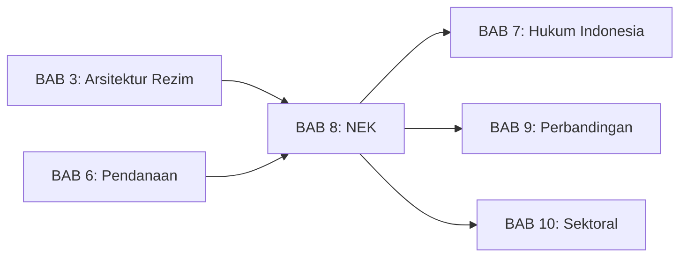
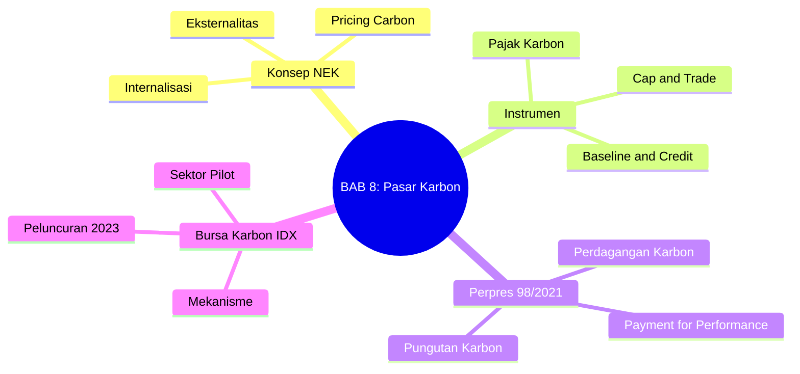
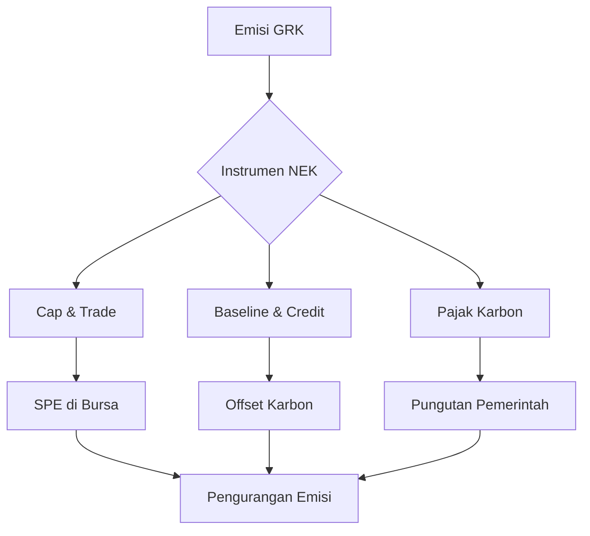

---
publish: true
bab: "8"
judul: "Nilai Ekonomi Karbon dan Bursa Karbon"
level: "S1"
durasi_baca: "90 menit"
tags:
  - buku-ajar
  - hukum-06-PerubahanIklim
  - NEK
  - carbon-market
  - bursa-karbon
  - pajak-karbon
---

# BAB 8: Nilai Ekonomi Karbon dan Bursa Karbon

---

## A. PENDAHULUAN

### 1. Capaian Pembelajaran (Sub-CPMK)

Setelah mempelajari bab ini, mahasiswa mampu:

1. **Menjelaskan** konsep nilai ekonomi karbon dan berbagai instrumennya
2. **Menganalisis** kerangka hukum perdagangan karbon di Indonesia (Perpres 98/2021)
3. **Mengevaluasi** implementasi Bursa Karbon Indonesia dan tantangannya
4. **Membandingkan** sistem perdagangan karbon Indonesia dengan yurisdiksi lain

### 2. Indikator Pencapaian

- [ ] Mahasiswa dapat membedakan *cap and trade*, *baseline and credit*, dan pajak karbon
- [ ] Mahasiswa dapat menguraikan instrumen NEK menurut Perpres 98/2021
- [ ] Mahasiswa dapat menjelaskan mekanisme perdagangan di Bursa Karbon Indonesia
- [ ] Mahasiswa dapat mengidentifikasi tantangan hukum pasar karbon domestik

### 3. Deskripsi Singkat

Bagaimana "memperdagangkan" sesuatu yang tidak terlihat seperti emisi karbon? Bab ini akan mengajak Anda memahami konsep nilai ekonomi karbon, berbagai instrumen yang tersedia, dan bagaimana Indonesia membangun infrastruktur pasar karbonnya melalui Perpres 98/2021 dan Bursa Karbon Indonesia.

### 4. Hubungan dengan Bab Lain

Bab ini terkait erat dengan [[Buku-Ajar-Hukum-06-PerubahanIklim-06-Pendanaan-Mekanisme-Iklim_BAB-06|BAB 6 tentang Pendanaan]] karena pasar karbon merupakan salah satu instrumen pendanaan iklim, dan [[Buku-Ajar-Hukum-06-PerubahanIklim-07-Kerangka-Hukum-Indonesia_BAB-07|BAB 7 tentang Kerangka Hukum Indonesia]] yang membahas regulasi iklim nasional secara umum.

### 5. Peta Konsep Bab

---

## B. PENYAJIAN MATERI

### 1. Konsep Nilai Ekonomi Karbon

#### 1.1 Eksternalitas dan Internalisasi

Pemahaman tentang nilai ekonomi karbon dimulai dari konsep fundamental dalam ilmu ekonomi: **eksternalitas**. Ketika sebuah pabrik membakar batubara untuk menghasilkan listrik, ia tidak hanya memproduksi energi tetapi juga melepaskan karbon dioksida ke atmosfer. Biaya kerusakan iklim akibat emisi ini—banjir pesisir, gagal panen, gelombang panas yang mematikan—tidak tercermin dalam harga listrik yang dibayar konsumen. Inilah yang disebut eksternalitas negatif: biaya yang ditanggung oleh pihak ketiga (masyarakat global, generasi mendatang) tanpa kompensasi.[^1]

Dalam teori ekonomi klasik, eksternalitas menyebabkan *kegagalan pasar* (*market failure*). Harga yang "terlalu murah" mendorong konsumsi berlebihan atas barang yang sebenarnya mahal secara sosial. Arthur Pigou, ekonom Universitas Cambridge, pertama kali mengusulkan solusi pada tahun 1920: kenakan pajak pada aktivitas yang menghasilkan eksternalitas sehingga harga mencerminkan biaya sosial sesungguhnya.[^2] Inilah asal mula konsep "internalisasi eksternalitas" yang menjadi fondasi seluruh kerangka nilai ekonomi karbon.

Ukuran eksternalitas emisi GRK sangatlah besar. Laporan Stern menyebutkan bahwa biaya sosial karbon (*social cost of carbon*) berkisar antara USD 85-105 per ton CO₂—memperhitungkan dampak jangka panjang seperti kerusakan infrastruktur pesisir, penurunan produktivitas pertanian, dan peningkatan biaya kesehatan.[^3] Namun, harga karbon di sebagian besar pasar dunia masih jauh di bawah angka tersebut, menunjukkan bahwa eksternalitas belum sepenuhnya terinternalisasi.

Indonesia mengadopsi pendekatan internalisasi ini melalui Perpres 98/2021 yang mendefinisikan NEK sebagai "nilai setiap unit emisi gas rumah kaca yang dihasilkan dari kegiatan manusia dan kegiatan ekonomi."[^4] Dengan menetapkan harga pada karbon—baik melalui pajak, perdagangan emisi, atau mekanisme lainnya—pencemar dipaksa memperhitungkan dampak lingkungan dalam keputusan ekonominya. Hasilnya: insentif untuk mengurangi emisi, berinvestasi dalam teknologi bersih, dan beralih ke energi terbarukan.

[^1]: Stern N, *The Economics of Climate Change: The Stern Review* (Cambridge University Press 2007) 27-35.
[^2]: Pigou AC, *The Economics of Welfare* (4th edn, Macmillan 1932) Part II Ch 9.
[^3]: Stern (n 1) Executive Summary, vi.
[^4]: Peraturan Presiden Nomor 98 Tahun 2021 tentang Penyelenggaraan Nilai Ekonomi Karbon untuk Pencapaian Target Kontribusi yang Ditetapkan Secara Nasional dan Pengendalian Emisi Gas Rumah Kaca dalam Pembangunan Nasional, ps 1 angka 1.

#### 1.2 Instrumen Penetapan Harga Karbon

Secara global, terdapat tiga instrumen utama untuk menetapkan harga pada karbon. Masing-masing memiliki karakteristik, kelebihan, dan kelemahan yang perlu dipahami untuk mengevaluasi pilihan kebijakan Indonesia.

**Sistem Cap and Trade (Perdagangan Emisi)**

Sistem *cap and trade* bekerja dengan menetapkan batas (*cap*) total emisi yang diizinkan dalam suatu yurisdiksi atau sektor. Pemerintah menerbitkan izin emisi (*allowances*) sejumlah cap tersebut, lalu entitas yang emisinya melebihi izin yang dimiliki wajib membeli izin tambahan dari pihak yang memiliki surplus. Mekanisme ini menciptakan pasar di mana harga karbon ditentukan oleh interaksi penawaran dan permintaan.[^5]

Contoh paling sukses adalah EU Emissions Trading System (EU ETS) yang telah beroperasi sejak 2005 dan kini mencakup sekitar 40% emisi Uni Eropa. Pada 2023, harga karbon di EU ETS mencapai lebih dari EUR 80 per ton—tertinggi di dunia—mencerminkan cap yang semakin ketat seiring waktu.[^6] Kelebihan utama *cap and trade* adalah kepastian kuantitas: total emisi dijamin tidak melebihi cap. Kelemahannya adalah volatilitas harga, yang dapat menciptakan ketidakpastian bagi dunia usaha dalam perencanaan investasi.

**Sistem Baseline and Credit (Offset)**

Berbeda dengan *cap and trade* yang menetapkan batasan absolut, sistem *baseline and credit* menghasilkan kredit bagi proyek yang mengurangi emisi di bawah tingkat referensi (*baseline*). Kredit ini dapat dijual kepada entitas yang membutuhkan offset untuk memenuhi kewajiban atau target sukarela.[^7]

Clean Development Mechanism (CDM) di bawah Protokol Kyoto adalah contoh klasik sistem ini. Proyek energi terbarukan atau efisiensi energi di negara berkembang menghasilkan Certified Emission Reductions (CERs) yang dapat dibeli oleh negara maju untuk memenuhi target Kyoto. Namun, CDM dikritik karena isu *additionality* (apakah pengurangan benar-benar terjadi karena proyek tersebut?) dan *hot air* (kredit yang dihasilkan tanpa pengurangan emisi nyata).[^8]

**Pajak Karbon (Carbon Tax)**

Pajak karbon adalah pendekatan paling sederhana: pemerintah menetapkan tarif pajak per ton emisi GRK. Berbeda dengan *cap and trade*, pajak karbon memberikan kepastian harga tetapi bukan kepastian kuantitas—respons emisi bergantung pada elastisitas permintaan dan ketersediaan alternatif bersih.[^9]

Sekitar 30 yurisdiksi telah menerapkan pajak karbon, dengan tarif bervariasi dari USD 1/ton (Polandia) hingga USD 137/ton (Swedia).[^10] Indonesia berencana menerapkan pajak karbon pada sektor ketenagalistrikan dengan tarif Rp 30.000/ton COâ‚‚e (sekitar USD 2/ton), meskipun implementasinya telah ditunda beberapa kali dari rencana awal April 2022.[^11]

**Perbandingan Instrumen**

| Instrumen | Mekanisme | Kelebihan | Kekurangan |
|-----------|-----------|-----------|------------|
| **Cap and Trade** | Batasan emisi total, perdagangan izin | Kepastian kuantitas pengurangan emisi | Volatilitas harga, kompleksitas administratif |
| **Baseline and Credit** | Kredit untuk pengurangan di bawah baseline | Fleksibilitas, mendorong proyek hijau | Risiko *hot air*, isu *additionality* |
| **Pajak Karbon** | Pungutan per ton emisi | Kepastian harga, sederhana | Tidak ada kepastian kuantitas, resistensi politik |

**Tabel 8.1.** Perbandingan instrumen penetapan harga karbon

[^5]: Bodansky D, Brunnée J and Rajamani L, *International Climate Change Law* (Oxford University Press 2017) 248-253.
[^6]: ICAP, *Emissions Trading Worldwide: Status Report 2023* (ICAP Secretariat 2023) 32.
[^7]: Bodansky, Brunnée and Rajamani (n 5) 254-258.
[^8]: Wara M, 'Is the Global Carbon Market Working?' (2007) 445 Nature 595.
[^9]: World Bank, *State and Trends of Carbon Pricing 2023* (World Bank Group 2023) 20-25.
[^10]: ibid 22.
[^11]: Undang-Undang Nomor 7 Tahun 2021 tentang Harmonisasi Peraturan Perpajakan, ps 13.

---

### 2. Kerangka Hukum NEK Indonesia (Perpres 98/2021)

#### 2.1 Latar Belakang dan Tujuan

Peraturan Presiden Nomor 98 Tahun 2021 tentang Penyelenggaraan Nilai Ekonomi Karbon merupakan tonggak penting dalam arsitektur hukum iklim Indonesia. Perpres ini diterbitkan sebagai respons terhadap kebutuhan instrumen ekonomi untuk mendukung pencapaian NDC Indonesia dan mengatur infrastruktur pasar karbon domestik secara komprehensif.[^12]

Tujuan utama Perpres 98/2021 sebagaimana tercantum dalam Pasal 2 adalah "mendorong upaya pencapaian target kontribusi yang ditetapkan secara nasional dan pengendalian emisi gas rumah kaca dalam pembangunan nasional melalui penerapan nilai ekonomi karbon."[^13] Dengan kata lain, Perpres ini menjembatani komitmen internasional Indonesia di bawah Paris Agreement dengan mekanisme implementasi domestik berbasis pasar.

#### 2.2 Definisi Nilai Ekonomi Karbon

Pasal 1 angka 1 Perpres 98/2021 mendefinisikan NEK sebagai:

> "Nilai setiap unit emisi gas rumah kaca yang dihasilkan dari kegiatan manusia dan kegiatan ekonomi."[^14]

Definisi ini luas dan mencakup seluruh emisi antropogenik, baik dari sektor energi, industri, pertanian, kehutanan, maupun limbah. NEK bukan sekadar "harga karbon" dalam pengertian sempit, melainkan konsep payung yang mencakup berbagai instrumen untuk memberikan nilai ekonomi pada setiap unit emisi—baik sebagai biaya (melalui pungutan) maupun sebagai aset (melalui kredit yang dapat diperdagangkan).

#### 2.3 Empat Instrumen NEK

Perpres 98/2021 mengatur empat instrumen utama NEK yang dapat diterapkan secara mandiri atau kombinasi:[^15]

**Instrumen Pertama: Perdagangan Karbon**

Perdagangan karbon mencakup dua sub-mekanisme:[^16]

1. *Perdagangan Emisi* (*cap and trade*): Pemerintah menetapkan batas atas emisi untuk sektor tertentu dan menerbitkan Sertifikat Persetujuan Emisi (SPE). Entitas yang emisinya melebihi jatah SPE wajib membeli dari pasar, sementara yang efisien dapat menjual surplus.

2. *Perdagangan Offset* (*baseline and credit*): Proyek pengurangan emisi yang terverifikasi menghasilkan unit karbon yang dapat diperdagangkan. Berbeda dengan SPE, offset berasal dari aktivitas pengurangan emisi, bukan dari jatah yang ditetapkan pemerintah.

Kedua mekanisme ini dapat berinteraksi: entitas dengan kewajiban SPE dapat menggunakan offset untuk memenuhi sebagian kewajibannya, dengan batasan tertentu untuk menjaga integritas lingkungan.

**Instrumen Kedua: Pembayaran Berbasis Kinerja (Result-Based Payment)**

Instrumen ini memungkinkan Indonesia menerima pembayaran dari donor internasional atau bilateral berdasarkan kinerja pengurangan emisi yang terverifikasi.[^17] Contoh utama adalah REDD+ Result-Based Payment dari Norway untuk kinerja pengurangan deforestasi. Berbeda dengan perdagangan karbon yang bersifat pasar, pembayaran berbasis kinerja merupakan transfer fiskal antar-negara atau dari lembaga multilateral.

**Instrumen Ketiga: Pungutan atas Karbon (Carbon Levy)**

Pungutan karbon adalah pajak per unit emisi yang dipungut pemerintah.[^18] Berbeda dengan perdagangan karbon, pungutan tidak menciptakan pasar—melainkan beban fiskal langsung pada pencemar. UU 7/2021 tentang Harmonisasi Peraturan Perpajakan mengatur dasar hukum pajak karbon dengan tarif Rp 30.000/ton CO₂e untuk sektor ketenagalistrikan.[^19]

**Instrumen Keempat: Instrumen Lainnya**

Perpres 98/2021 membuka kemungkinan pengembangan instrumen baru sesuai perkembangan ilmu pengetahuan dan teknologi.[^20] Ini mencerminkan prinsip fleksibilitas untuk mengakomodasi inovasi di masa depan.

[^12]: Perpres 98/2021 (n 4) Bagian Menimbang.
[^13]: ibid ps 2.
[^14]: ibid ps 1 angka 1.
[^15]: ibid ps 4.
[^16]: ibid ps 5-6.
[^17]: ibid ps 7.
[^18]: ibid ps 8.
[^19]: UU 7/2021 (n 11) ps 13.
[^20]: Perpres 98/2021 (n 4) ps 9.

#### 2.4 Kelembagaan dan Tata Kelola

Perpres 98/2021 membentuk arsitektur kelembagaan yang melibatkan berbagai instansi dengan peran yang jelas:[^21]

**Kementerian Lingkungan Hidup dan Kehutanan (KLHK)** berperan sebagai koordinator utama penyelenggaraan NEK. KLHK menetapkan kebijakan, mengkoordinasikan antar-sektor, dan menjadi *focal point* nasional untuk isu karbon.

**Sistem Registri Nasional Pengendalian Perubahan Iklim (SRN PPI)** adalah infrastruktur data terpusat yang mencatat seluruh transaksi karbon, kepemilikan unit, dan pembatalan (*retirement*). SRN PPI memastikan transparansi, mencegah penghitungan ganda (*double counting*), dan memfasilitasi pelaporan ke UNFCCC.[^22]

**Bursa Karbon** adalah platform perdagangan resmi yang dioperasikan oleh penyelenggara bursa berizin. Pada praktiknya, Bursa Efek Indonesia (BEI) melalui unit IDX Carbon menjadi penyelenggara bursa karbon pertama di Indonesia.

**Sistem MRV (Monitoring, Reporting, Verification)** menjadi tulang punggung integritas sistem. Tanpa MRV yang kredibel, pasar karbon akan kehilangan kepercayaan karena unit yang diperdagangkan tidak mewakili pengurangan emisi nyata.[^23]

[^21]: ibid ps 10-15.
[^22]: ibid ps 12.
[^23]: ibid ps 14.

---

### 3. Bursa Karbon Indonesia

#### 3.1 Peluncuran dan Signifikansi

Bursa Karbon Indonesia (IDX Carbon) diluncurkan pada **26 September 2023** oleh Presiden Joko Widodo, menandai tonggak bersejarah sebagai bursa karbon pertama di Asia Tenggara.[^24] Peluncuran ini memposisikan Indonesia dalam peta perdagangan karbon global, bergabung dengan lebih dari 70 yurisdiksi yang telah menerapkan instrumen penetapan harga karbon.

Signifikansi IDX Carbon melampaui aspek teknis perdagangan. Keberadaan bursa karbon mengirimkan sinyal kebijakan bahwa Indonesia serius dalam transisi rendah karbon. Bagi investor, bursa karbon menyediakan mekanisme lindung nilai (*hedging*) terhadap risiko karbon di masa depan. Bagi perusahaan yang sudah efisien, bursa menawarkan potensi pendapatan dari penjualan surplus unit.

#### 3.2 Produk yang Diperdagangkan

IDX Carbon memperdagangkan beberapa jenis unit karbon dengan karakteristik berbeda:[^25]

**Sertifikat Persetujuan Emisi (SPE)** adalah unit dalam sistem *cap and trade* sektor ketenagalistrikan. Setiap SPE mewakili hak untuk melepaskan 1 ton COâ‚‚e. Pembangkit listrik yang emisinya melebihi jatah SPE wajib membeli dari pasar; yang efisien dapat menjual surplus.

**Offset Karbon** dihasilkan dari proyek pengurangan emisi di luar sektor yang diatur *cap and trade*. Offset dapat berasal dari proyek energi terbarukan, efisiensi energi, pengelolaan limbah, atau kehutanan (REDD+). Verifikasi dilakukan oleh lembaga verifikasi terakreditasi.

**Carbon Credit Terverifikasi** mencakup unit dari standar internasional seperti Verified Carbon Standard (VCS) atau Gold Standard yang didaftarkan di SRN PPI. Ini memungkinkan interoperabilitas dengan pasar karbon sukarela global.

| Produk | Mekanisme Asal | Penggunaan |
|--------|----------------|------------|
| **SPE** | Cap and trade ketenagalistrikan | Kepatuhan wajib pembangkit listrik |
| **Offset Karbon** | Proyek pengurangan emisi terverifikasi | Kepatuhan atau sukarela |
| **Carbon Credit** | Standar internasional (VCS, Gold Standard) | Pasar sukarela, klaim netralitas karbon |

**Tabel 8.2.** Jenis unit karbon di Bursa Karbon Indonesia

[^24]: 'Presiden Jokowi Resmikan Perdagangan Karbon di Bursa Efek Indonesia' (*Sekretariat Kabinet*, 26 September 2023) <https://setkab.go.id/> accessed 15 December 2025.
[^25]: Peraturan OJK Nomor 14 Tahun 2023 tentang Perdagangan Karbon Melalui Bursa Karbon, ps 5-7.

#### 3.3 Sektor Pilot: Ketenagalistrikan

Sektor ketenagalistrikan dipilih sebagai sektor pilot dengan pertimbangan strategis:[^26]

Pertama, sektor ini merupakan **kontributor emisi terbesar** di Indonesia, menyumbang sekitar 40% emisi nasional dari pembakaran batubara dan gas untuk pembangkitan listrik. Kedua, sektor ketenagalistrikan relatif **terkonsentrasi** dengan jumlah pemain terbatas (PLN dan produsen listrik swasta besar), memudahkan pengawasan dan penegakan. Ketiga, **data emisi tersedia** karena pelaporan produksi listrik dan konsumsi bahan bakar sudah mapan.

Sistem *cap and trade* sektor ketenagalistrikan menggunakan pendekatan **intensitas emisi** (*intensity-based*) alih-alih batas absolut. Pembangkit listrik dengan kapasitas di atas 100 MW wajib memenuhi standar intensitas emisi maksimum 0,9 tCOâ‚‚/MWh. Pendekatan ini memungkinkan pertumbuhan produksi listrik sambil mendorong efisiensi.

> [!example] **Ilustrasi: Mekanisme Perdagangan SPE**
>
> PLTU Batang memiliki intensitas emisi 0,8 tCOâ‚‚/MWh, di bawah *cap* 0,9 tCOâ‚‚/MWh. Jika produksi tahunan 5 juta MWh, maka PLTU Batang memiliki surplus:
>
> (0,9 - 0,8) × 5.000.000 = 500.000 ton CO₂ surplus SPE
>
> Di sisi lain, PLTU Tanjung Jati B dengan intensitas 0,95 tCOâ‚‚/MWh dan produksi 6 juta MWh memiliki defisit:
>
> (0,95 - 0,9) × 6.000.000 = 300.000 ton CO₂ defisit SPE
>
> PLTU Tanjung Jati B wajib membeli 300.000 SPE dari pasar, yang dapat dipasok oleh PLTU Batang atau pembangkit efisien lainnya.

[^26]: Peraturan Menteri ESDM Nomor 16 Tahun 2022 tentang Tata Cara Penyelenggaraan Nilai Ekonomi Karbon Subsektor Pembangkit Tenaga Listrik, ps 3-5.

#### 3.4 Kinerja Awal dan Perkembangan

Pada periode awal perdagangan (September-Desember 2023), IDX Carbon mencatat volume transaksi sekitar 500.000 ton COâ‚‚e dengan nilai transaksi mencapai Rp 30 miliar.[^27] Harga karbon berfluktuasi antara Rp 30.000-69.600 per ton COâ‚‚e (sekitar USD 2-4,5/ton), jauh di bawah harga di pasar karbon yang lebih mapan seperti EU ETS.

Meskipun volume masih terbatas, beberapa perkembangan positif patut dicatat. Kesadaran korporat terhadap risiko karbon meningkat, tercermin dari partisipasi aktif perusahaan-perusahaan besar dalam perdagangan. Infrastruktur teknis bursa berjalan stabil tanpa gangguan signifikan. Regulasi pendukung terus disempurnakan melalui koordinasi OJK, KLHK, dan Kementerian ESDM.

[^27]: 'Laporan Kinerja Bursa Karbon 2023' (*IDX Carbon*, Januari 2024) <https://carbon.idx.co.id/> accessed 15 December 2025.

---

### 4. Tantangan dan Prospek Pasar Karbon Indonesia

#### 4.1 Tantangan Struktural

**Likuiditas Pasar yang Rendah**

Likuiditas—kemampuan membeli atau menjual unit tanpa mempengaruhi harga secara signifikan—masih menjadi tantangan utama. Dengan volume transaksi harian rata-rata hanya puluhan ribu ton, pasar rentan terhadap manipulasi dan kesulitan dalam *price discovery* yang efisien. Likuiditas rendah juga mengurangi insentif bagi *market maker* dan spekulan yang biasanya menyediakan likuiditas di pasar keuangan.[^28]

**Harga Karbon yang Sangat Rendah**

Harga karbon Indonesia berkisar USD 2-5/ton, sangat jauh di bawah harga yang diperlukan untuk mendorong perubahan perilaku signifikan. Sebagai perbandingan, EU ETS memperdagangkan karbon di atas EUR 80/ton, sementara Kanada menerapkan pajak karbon CAD 65/ton (meningkat ke CAD 170/ton pada 2030).[^29] Pada harga Indonesia saat ini, insentif untuk berinvestasi dalam teknologi rendah karbon relatif lemah.

**Kapasitas Verifikasi Terbatas**

Sistem pasar karbon bergantung pada MRV yang kredibel. Indonesia memiliki jumlah verifikator terakreditasi yang terbatas, menciptakan *bottleneck* dalam penerbitan unit karbon dan validasi proyek offset. Peningkatan kapasitas verifikasi memerlukan investasi dalam pelatihan, akreditasi, dan standar teknis.[^30]

**Integrasi Internasional yang Belum Optimal**

Pasal 6 Paris Agreement membuka peluang perdagangan karbon antarnegara melalui mekanisme *cooperative approaches*. Namun, konektivitas Indonesia dengan pasar internasional masih terkendala oleh perbedaan standar, kebutuhan *corresponding adjustments*, dan negosiasi bilateral yang kompleks. Tanpa integrasi internasional, pasar domestik berisiko terisolasi dan kurang kompetitif.[^31]

[^28]: Smits J (ed), *Climate Change Governance and Sustainable Finance* (Edward Elgar 2024) Ch 8.
[^29]: World Bank (n 9) 28.
[^30]: Diantoro TD, 'Carbon Market Development in Indonesia: Challenges and Opportunities' (2023) 15 Climate Policy 112.
[^31]: Bodansky, Brunnée and Rajamani (n 5) 318-325.

#### 4.2 Peluang dan Prospek

Meski menghadapi tantangan, prospek jangka menengah pasar karbon Indonesia cukup menjanjikan.

**Ekspansi Sektoral**

Pemerintah berencana memperluas cakupan *cap and trade* ke sektor-sektor lain: industri semen, baja, petrokimia, dan pulp & paper. Sektor kehutanan dengan potensi REDD+ yang besar juga akan terintegrasi lebih dalam. Ekspansi ini akan meningkatkan volume transaksi dan likuiditas pasar.[^32]

**Konektivitas Pasal 6 Paris Agreement**

Indonesia aktif dalam negosiasi Pasal 6 dan telah menandatangani MoU bilateral dengan beberapa negara untuk perdagangan karbon. Konektivitas internasional akan membuka akses ke pembeli dengan kesediaan membayar lebih tinggi dan meningkatkan efisiensi pasar.[^33]

**Peningkatan Ambisi Cap**

Seiring waktu, *cap* intensitas emisi akan diperketat untuk mendorong pengurangan emisi lebih ambisius. Pengetatan *cap* akan meningkatkan kelangkaan SPE, mendorong harga naik, dan memperkuat insentif investasi rendah karbon.

**Partisipasi Pasar Sukarela**

Di luar kepatuhan wajib, pasar karbon sukarela (*voluntary carbon market*) tumbuh pesat secara global. Korporasi multinasional yang berkomitmen *net zero* mencari offset berkualitas tinggi untuk mengimbangi emisi residual. Indonesia, dengan potensi besar dalam solusi berbasis alam (*nature-based solutions*) seperti restorasi mangrove dan hutan gambut, dapat menjadi pemasok utama kredit karbon premium.[^34]

[^32]: 'Roadmap Pasar Karbon Indonesia 2024-2030' (*KLHK*, Maret 2024).
[^33]: 'Indonesia-Singapore Carbon Credit Cooperation Agreement' (*Ministry of Energy and Mineral Resources*, Oktober 2023).
[^34]: Forest Trends, *State of the Voluntary Carbon Markets 2023* (Ecosystem Marketplace 2023) 45

---

## C. STUDI KASUS

### Kasus: Kontroversi Ekspor Kredit Karbon Hutan

**Latar Belakang:**
Indonesia memiliki potensi besar kredit karbon dari hutan (REDD+). Perpres 98/2021 mengatur bahwa kredit karbon dapat diperdagangkan secara internasional, namun harus mempertimbangkan pencapaian NDC.

**Isu Hukum:**
- Bagaimana menyeimbangkan ekspor kredit karbon dengan pencapaian NDC?
- Apakah *corresponding adjustments* wajib diterapkan?
- Bagaimana melindungi hak masyarakat adat dalam proyek karbon hutan?

---

## D. PENUTUP

### 1. Rangkuman

Pada bab ini, kita telah mempelajari:

- **Konsep NEK:** Nilai ekonomi karbon adalah upaya menginternalisasi eksternalitas emisi GRK melalui mekanisme pasar, memberikan harga pada karbon untuk mendorong pengurangan emisi.

- **Tiga Instrumen Utama:** *Cap and trade* memberikan kepastian kuantitas pengurangan, *baseline and credit* memberikan fleksibilitas, dan pajak karbon memberikan kepastian harga.

- **Perpres 98/2021:** Indonesia membangun kerangka hukum NEK komprehensif dengan empat instrumen—perdagangan karbon, *payment for performance*, pungutan karbon, dan instrumen lainnya.

- **Bursa Karbon Indonesia:** Diluncurkan September 2023 di BEI dengan sektor ketenagalistrikan sebagai pilot, memperdagangkan SPE dan offset karbon.

- **Tantangan:** Likuiditas rendah, harga karbon murah (USD 2-5/ton vs. USD 80+ di EU), kapasitas verifikator terbatas, dan kebutuhan integrasi dengan pasar internasional melalui Pasal 6 Paris Agreement.

---

### 2. Latihan

Kerjakan latihan berikut untuk memperdalam pemahaman Anda:

1. **Analisis Konsep:** Jelaskan dengan kata-kata Anda sendiri mengapa emisi GRK disebut sebagai "eksternalitas negatif" dan bagaimana mekanisme pasar karbon berupaya memperbaikinya!

2. **Perbandingan Instrumen:** Bandingkan kelebihan dan kekurangan *cap and trade* versus pajak karbon. Instrumen mana yang lebih cocok untuk Indonesia dan mengapa?

3. **Studi Regulasi:** Baca Perpres 98/2021 (dapat diakses di jdih.setkab.go.id) dan identifikasi:
   - Definisi NEK menurut peraturan tersebut
   - Empat instrumen yang diatur
   - Kewenangan masing-masing lembaga

4. **Analisis Kasus:** Sebuah PLTU memiliki intensitas emisi 0,95 tCOâ‚‚/MWh, melebihi *cap* 0,9 tCOâ‚‚/MWh. Jika PLTU tersebut memproduksi 1 juta MWh per tahun, berapa SPE yang harus dibeli? Berapa biayanya jika harga SPE adalah USD 5/ton?

5. **Pemikiran Kritis:** Mengapa harga karbon di Indonesia sangat rendah dibandingkan EU ETS? Apa implikasinya terhadap efektivitas pengurangan emisi?

---

### 3. Tes Formatif

Jawablah pertanyaan-pertanyaan berikut untuk mengukur pemahaman Anda:

**Pilihan Ganda:**

1. Eksternalitas dalam konteks emisi GRK berarti:
   - a. Biaya yang ditanggung pemerintah
   - b. Biaya yang tidak tercermin dalam harga pasar dan ditanggung masyarakat
   - c. Keuntungan dari perdagangan karbon
   - d. Kerugian dari perubahan iklim

2. Instrumen NEK yang menetapkan batasan total emisi adalah:
   - a. Pajak karbon
   - b. *Cap and trade*
   - c. *Baseline and credit*
   - d. *Payment for performance*

3. Perpres 98/2021 mengatur ... instrumen NEK:
   - a. Dua
   - b. Tiga
   - c. Empat
   - d. Lima

4. Bursa Karbon Indonesia diluncurkan pada:
   - a. 2021
   - b. 2022
   - c. September 2023
   - d. 2024

5. Sektor pilot dalam Bursa Karbon Indonesia adalah:
   - a. Industri semen
   - b. Kehutanan
   - c. Ketenagalistrikan
   - d. Transportasi

**Benar atau Salah:**

6. *Cap and trade* memberikan kepastian harga tetapi bukan kepastian kuantitas. (B/S)

7. SRN PPI adalah Sistem Registri Nasional Pengendalian Perubahan Iklim. (B/S)

8. *Hot air* adalah risiko dalam sistem *baseline and credit* di mana kredit dihasilkan tanpa pengurangan emisi nyata. (B/S)

9. Harga karbon di Indonesia saat ini sudah setara dengan EU ETS. (B/S)

10. *Corresponding adjustments* diperlukan untuk menghindari penghitungan ganda dalam perdagangan karbon internasional. (B/S)

---

### 4. Umpan Balik dan Tindak Lanjut

Cocokkan jawaban Anda dengan **Kunci Jawaban** di [[Buku-Ajar-Hukum-06-PerubahanIklim-Back-Matter-Lampiran_Lampiran-04-Kunci-Jawaban|Lampiran 4]].

**Kunci Jawaban Singkat:** 1-b, 2-b, 3-c, 4-c, 5-c, 6-S, 7-B, 8-B, 9-S, 10-B

**Rumus Penilaian:**

$$Tingkat\ Penguasaan = \frac{Jumlah\ Jawaban\ Benar}{10} \times 100\%$$

**Interpretasi dan Tindak Lanjut:**

| Tingkat Penguasaan | Kategori | Tindak Lanjut |
|--------------------|----------|---------------|
| **90 - 100%** | Baik Sekali | Selamat! Anda dapat melanjutkan ke [[Buku-Ajar-Hukum-06-PerubahanIklim-09-Perbandingan-Hukum-Iklim_BAB-09|BAB 9]] |
| **80 - 89%** | Baik | Anda dapat melanjutkan, namun pelajari kembali bagian yang masih ragu |
| **70 - 79%** | Cukup | **Ulangi** materi bab ini, terutama bagian yang belum dikuasai |
| **< 70%** | Kurang | **Wajib mengulangi** seluruh materi bab ini sebelum melanjutkan |

---

### 5. Senarai Istilah Kunci

| Istilah | Bahasa Inggris | Definisi |
|---------|----------------|----------|
| NEK | *Carbon Economic Value* | Nilai ekonomi setiap unit emisi GRK |
| *Cap and trade* | *Cap and trade* | Sistem perdagangan dengan batasan emisi total |
| *Baseline and credit* | *Baseline and credit* | Sistem kredit berdasarkan pengurangan dari baseline |
| Pajak karbon | *Carbon tax* | Pungutan per ton emisi GRK |
| SPE | *Emission Permit Certificate* | Sertifikat Persetujuan Emisi |
| *Offset* | *Carbon offset* | Kredit dari proyek pengurangan emisi |
| SRN PPI | *National Registry System* | Sistem Registri Nasional Pengendalian Perubahan Iklim |
| *Hot air* | *Hot air* | Kredit tanpa pengurangan emisi nyata |
| *Corresponding adjustments* | *Corresponding adjustments* | Penyesuaian untuk menghindari penghitungan ganda |
| MRV | *Monitoring, Reporting, Verification* | Sistem pemantauan, pelaporan, verifikasi |

---

### 6. Daftar Pustaka Bab

**Sumber Primer:**

- Peraturan Presiden Nomor 98 Tahun 2021 tentang Penyelenggaraan Nilai Ekonomi Karbon untuk Pencapaian Target Kontribusi yang Ditetapkan Secara Nasional dan Pengendalian Emisi Gas Rumah Kaca dalam Pembangunan Nasional.
- Paris Agreement, Pasal 6 tentang Cooperative Approaches.
- Peraturan OJK Nomor 14 Tahun 2023 tentang Perdagangan Karbon Melalui Bursa Karbon.

**Sumber Sekunder:**

- Smits, J. (Ed.). (2024). *Climate Change Governance and Sustainable Finance*. Edward Elgar.
- World Bank. (2023). *State and Trends of Carbon Pricing 2023*. Washington, DC.
- ICAP. (2023). *Emissions Trading Worldwide: Status Report 2023*. Berlin: ICAP Secretariat.

**Sumber Pendukung:**

- IDX Carbon. https://carbon.idx.co.id/
- Badan Pengelola Dana Lingkungan Hidup (BPDLH). https://bpdlh.id/

---

### 7. Tautan Terkait

**Sumber dalam Vault:**
- [[03-Peraturan-Indonesia_Perpres_98_2021_NEK]] - Teks lengkap Perpres 98/2021
- [[03-Peraturan-Indonesia_PP_40_2025_Dekarbonisasi]] - PP tentang dekarbonisasi
- [[01-Traktat_Paris_Agreement_2015]] - Pasal 6 tentang mekanisme pasar

**Navigasi Buku:**
- ← [[Buku-Ajar-Hukum-06-PerubahanIklim-07-Kerangka-Hukum-Indonesia_BAB-07|BAB 7: Kerangka Hukum Iklim Indonesia]]
- → [[Buku-Ajar-Hukum-06-PerubahanIklim-09-Perbandingan-Hukum-Iklim_BAB-09|BAB 9: Studi Perbandingan Hukum Iklim]]
- ↑ [[Buku-Ajar-Hukum-06-PerubahanIklim-00-Front-Matter_09-Tinjauan-Mata-Kuliah|Kembali ke Tinjauan Mata Kuliah]]

---

*Buku Ajar Hukum Perubahan Iklim | BAB 8*

