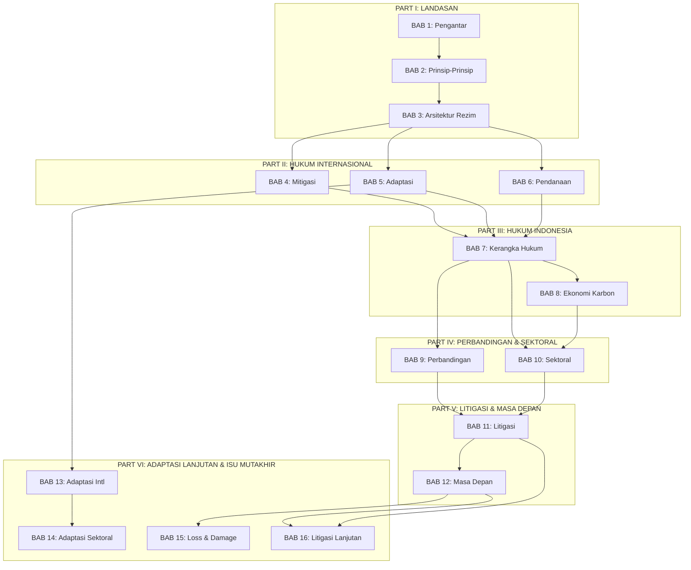
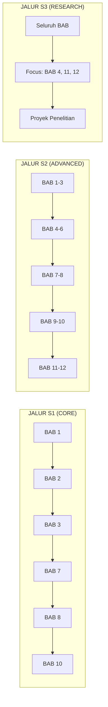

---
publish: true
title: Tinjauan Mata Kuliah
mata_kuliah: Hukum Perubahan Iklim
sks: 3
semester: Ganjil/Genap
prodi: Ilmu Hukum
jenjang: S1/S2/S3
tags:
  - buku-ajar
  - hukum-06-PerubahanIklim
  - tinjauan
---

# TINJAUAN MATA KULIAH

## Hukum Perubahan Iklim
### (*Climate Change Law*)

---

## I. DESKRIPSI MATA KULIAH

Mata kuliah **Hukum Perubahan Iklim** mengkaji kerangka hukum yang mengatur respons masyarakat internasional dan nasional terhadap perubahan iklim. Perkuliahan mencakup landasan ilmiah perubahan iklim dan implikasinya terhadap hukum, arsitektur rezim iklim internasional dari Konvensi Stockholm 1972 hingga Persetujuan Paris 2015, kewajiban mitigasi dan adaptasi, mekanisme pendanaan dan pasar karbon, serta perkembangan litigasi perubahan iklim di berbagai yurisdiksi.

Mata kuliah ini bersifat **interdisipliner**, menggabungkan hukum internasional publik, hukum lingkungan, hukum administrasi, hukum bisnis, dan hak asasi manusia. Mahasiswa diharapkan tidak hanya memahami norma-norma hukum yang berlaku, tetapi juga mampu menganalisis dan mengevaluasi efektivitas instrumen hukum dalam mengatasi krisis iklim global.

---

## II. CAPAIAN PEMBELAJARAN LULUSAN (CPL)

Mata kuliah ini berkontribusi pada pencapaian CPL berikut:

### CPL Sikap
- **S9:** Menunjukkan sikap bertanggung jawab atas pekerjaan di bidang keahliannya secara mandiri

### CPL Pengetahuan
- **P1:** Menguasai konsep teoritis hukum secara mendalam pada bidang hukum lingkungan dan sumber daya alam
- **P3:** Menguasai prinsip-prinsip dan norma-norma hukum internasional yang berkaitan dengan isu-isu global kontemporer

### CPL Keterampilan Umum
- **KU1:** Mampu menerapkan pemikiran logis, kritis, sistematis, dan inovatif dalam konteks pengembangan atau implementasi ilmu pengetahuan dan teknologi
- **KU2:** Mampu menunjukkan kinerja mandiri, bermutu, dan terukur

### CPL Keterampilan Khusus
- **KK2:** Mampu menganalisis permasalahan hukum dengan menerapkan prinsip-prinsip dan norma-norma hukum
- **KK4:** Mampu menyusun dokumen hukum dan pendapat hukum (*legal opinion*)

---

## III. CAPAIAN PEMBELAJARAN MATA KULIAH (CPMK)

Setelah menyelesaikan mata kuliah ini, mahasiswa mampu:

| No | CPMK | Deskripsi |
|----|------|-----------|
| 1 | CPMK-1 | **Menjelaskan** hubungan antara ilmu perubahan iklim dengan perkembangan hukum iklim internasional dan nasional |
| 2 | CPMK-2 | **Menganalisis** prinsip-prinsip hukum lingkungan internasional yang mendasari rezim hukum perubahan iklim |
| 3 | CPMK-3 | **Mengevaluasi** arsitektur dan evolusi rezim iklim internasional dari UNFCCC hingga Persetujuan Paris |
| 4 | CPMK-4 | **Menganalisis** kewajiban mitigasi negara berdasarkan hukum internasional dan implikasinya bagi Indonesia |
| 5 | CPMK-5 | **Menjelaskan** kerangka hukum adaptasi dan mekanisme *loss and damage* |
| 6 | CPMK-6 | **Menganalisis** instrumen pendanaan iklim dan mekanisme pasar karbon |
| 7 | CPMK-7 | **Mengevaluasi** kerangka hukum iklim Indonesia dan implementasinya |
| 8 | CPMK-8 | **Menganalisis** sistem nilai ekonomi karbon dan bursa karbon Indonesia |
| 9 | CPMK-9 | **Membandingkan** pendekatan hukum iklim di berbagai yurisdiksi |
| 10 | CPMK-10 | **Menganalisis** penerapan hukum iklim pada sektor-sektor prioritas |
| 11 | CPMK-11 | **Mengevaluasi** perkembangan litigasi perubahan iklim dan implikasinya |
| 12 | CPMK-12 | **Merumuskan** perspektif hukum terhadap isu-isu iklim emerging |

---

## IV. PRASYARAT KOMPETENSI

Sebelum mempelajari buku ajar ini, mahasiswa diharapkan telah memiliki pemahaman dasar tentang:

- [x] Pengantar Ilmu Hukum
- [x] Hukum Internasional Publik
- [x] Hukum Lingkungan (direkomendasikan)
- [x] Hukum Administrasi Negara (direkomendasikan)

> [!tip] **Bagi Mahasiswa S1**
> Jika Anda belum menempuh mata kuliah prasyarat, bab-bab awal buku ini menyediakan pengantar yang cukup untuk memahami konsep-konsep dasar.

---

## V. PETA KOMPETENSI

---

## VI. STRUKTUR BUKU AJAR

### Organisasi Bab

| Part | BAB | Judul | Durasi | Level |
|------|-----|-------|--------|-------|
| **I. LANDASAN** | 1 | [[BAB-01\|Pengantar Hukum Perubahan Iklim]] | 90 menit | S1 |
| | 2 | [[BAB-02\|Prinsip-Prinsip Hukum Lingkungan Internasional]] | 120 menit | S1-S2 |
| | 3 | [[BAB-03\|Arsitektur Rezim Iklim Internasional]] | 120 menit | S1-S2 |
| **II. HUKUM INTERNASIONAL** | 4 | [[BAB-04\|Kewajiban Mitigasi dalam Hukum Internasional]] | 150 menit | S2-S3 |
| | 5 | [[BAB-05\|Hukum Adaptasi Perubahan Iklim]] | 120 menit | S2 |
| | 6 | [[BAB-06\|Pendanaan dan Mekanisme Iklim]] | 120 menit | S1-S2 |
| **III. HUKUM INDONESIA** | 7 | [[BAB-07\|Kerangka Hukum Iklim Indonesia]] | 150 menit | S1 |
| | 8 | [[BAB-08\|Nilai Ekonomi Karbon dan Bursa Karbon]] | 120 menit | S1-S2 |
| **IV. PERBANDINGAN & SEKTORAL** | 9 | [[BAB-09\|Studi Perbandingan Hukum Iklim]] | 120 menit | S2-S3 |
| | 10 | [[BAB-10\|Hukum Iklim Sektoral]] | 150 menit | S1-S2 |
| **V. LITIGASI & MASA DEPAN** | 11 | [[BAB-11\|Litigasi Perubahan Iklim]] | 150 menit | S2-S3 |
| | 12 | [[BAB-12\|Masa Depan Hukum Perubahan Iklim]] | 90 menit | S2-S3 |
| **VI. ADAPTASI LANJUTAN & ISU MUTAKHIR** | 13 | [[BAB-13\|Kerangka Hukum Adaptasi Internasional]] | 120 menit | S2-S3 |
| | 14 | [[BAB-14\|Hukum Adaptasi Sektoral Indonesia]] | 150 menit | S1-S2 |
| | 15 | [[BAB-15\|Loss and Damage dalam Hukum Iklim]] | 120 menit | S2-S3 |
| | 16 | [[BAB-16\|Litigasi Perubahan Iklim Lanjutan]] | 150 menit | S2-S3 |

**Total Durasi Baca:** ± 32 jam (termasuk latihan dan studi kasus)

---

## VII. PANDUAN PENGGUNAAN BUKU

### A. Untuk Mahasiswa

#### Strategi Belajar Mandiri

1. **Sebelum Membaca:**
   - Baca Capaian Pembelajaran (Sub-CPMK) di awal setiap bab
   - Perhatikan peta konsep untuk memahami struktur materi
   - Hubungkan dengan pengetahuan yang sudah Anda miliki

2. **Saat Membaca:**
   - Baca secara aktif—buat catatan, garis bawahi konsep penting
   - Perhatikan kotak pengayaan (*enrichment box*) untuk wawasan tambahan
   - Coba jawab pertanyaan pemantik sebelum melihat jawabannya

3. **Setelah Membaca:**
   - Kerjakan latihan dan tes formatif
   - Hitung tingkat penguasaan Anda menggunakan rumus yang disediakan
   - Jika < 80%, ulangi bagian yang belum dikuasai

4. **Pendalaman:**
   - Baca sumber-sumber yang dirujuk dalam Daftar Pustaka Bab
   - Diskusikan studi kasus dengan teman sejawat
   - Ikuti perkembangan terkini melalui sumber di Tautan Terkait

#### Jalur Pembelajaran Berdasarkan Jenjang

### B. Untuk Dosen

#### Rekomendasi Alokasi Waktu (3 SKS = 14 Pertemuan)

| Pertemuan | Materi | Metode |
|-----------|--------|--------|
| 1 | BAB 1: Pengantar | Ceramah + Diskusi |
| 2 | BAB 2: Prinsip-Prinsip | Ceramah + *Case Method* |
| 3 | BAB 3: Arsitektur Rezim (I) | Ceramah + Timeline Exercise |
| 4 | BAB 3: Arsitektur Rezim (II) | Simulasi Negosiasi COP |
| 5 | BAB 4: Mitigasi | Ceramah + Analisis ICJ AO |
| 6 | BAB 5: Adaptasi | Ceramah + *Case Method* |
| 7 | BAB 6: Pendanaan | Ceramah + Simulasi GCF |
| 8 | **UTS** | Ujian Tengah Semester |
| 9 | BAB 7: Kerangka Hukum Indonesia | Ceramah + Mapping Regulasi |
| 10 | BAB 8: Ekonomi Karbon | *Field Trip*/Guest Lecture IDX |
| 11 | BAB 9: Perbandingan | Presentasi Kelompok |
| 12 | BAB 10: Sektoral | Presentasi Kelompok |
| 13 | BAB 11: Litigasi | Moot Court |
| 14 | BAB 12: Masa Depan + Review | Diskusi Panel |
| 15-16 | **UAS** | Ujian Akhir Semester |

#### Metode Penilaian

Mata kuliah ini menggunakan penilaian berbasis kompetensi dengan komponen sebagai berikut:

| Komponen | Bobot | Deskripsi |
|----------|-------|-----------|
| **Partisipasi & Diskusi** | 10% | Keaktifan dalam diskusi kelas, pertanyaan kritis |
| **Tugas & Latihan** | 15% | Latihan per BAB, analisis kasus singkat |
| **Proyek Kelompok** | 20% | Naskah Akademik Perda Iklim (IKU 7) |
| **UTS** | 25% | Ujian Tengah Semester (BAB 1-6) |
| **UAS** | 30% | Ujian Akhir Semester - Studi Kasus Litigasi |

**Format UAS Khusus:**
UAS untuk mata kuliah ini menggunakan format **studi kasus litigasi iklim fiktif** yang dirancang untuk menguji kemampuan mahasiswa dalam:
- Mengintegrasikan materi dari seluruh 16 BAB
- Menganalisis preseden kasus nyata (Indonesia dan internasional)
- Menyusun argumentasi hukum yang komprehensif
- Menerapkan prinsip-prinsip hukum pada situasi konkret

Untuk informasi lengkap tentang format UAS, lihat:
- [[UAS-Soal-Studi-Kasus-Litigasi-Iklim|Soal UAS: Studi Kasus Litigasi Iklim]]

---

## VIII. PROYEK BERBASIS TIM (IKU 7)

### Proyek Semester: Naskah Akademik Perda Perubahan Iklim

**Deskripsi:**
Tim mahasiswa (4-5 orang) menyusun Naskah Akademik Rancangan Peraturan Daerah tentang Pengendalian Perubahan Iklim untuk satu provinsi di Indonesia.

**Fase Pengerjaan:**

| Fase | Periode | Materi Terkait | Output |
|------|---------|----------------|--------|
| 1 | Minggu 1-3 | BAB 1-3 | Pemilihan Provinsi & Identifikasi Isu |
| 2 | Minggu 4-6 | BAB 4-6 | Analisis Kewajiban Internasional |
| 3 | Minggu 7-9 | BAB 7-8 | Pemetaan Regulasi Nasional |
| 4 | Minggu 10-11 | BAB 9-10 | Studi Perbandingan & Sektoral |
| 5 | Minggu 12-13 | BAB 11 | Draft Naskah Akademik |
| 6 | Minggu 14 | BAB 12 | Presentasi & Finalisasi |

**Rubrik Penilaian Proyek:** Lihat [[Lampiran-05-Rubrik-Proyek]]

---

## IX. SUMBER BELAJAR UTAMA

### Traktat & Peraturan
- [[01-Traktat/UNFCCC_1992|UNFCCC 1992]]
- [[01-Traktat/Paris_Agreement_2015|Persetujuan Paris 2015]]
- [[03-Peraturan/Indonesia/NDC_Indonesia|NDC Indonesia]]
- [[03-Peraturan/Indonesia/Perpres_98_2021_NEK|Perpres 98/2021 NEK]]

### Yurisprudensi Landmark
- [[02-Yurisprudensi/Internasional/ICJ_Climate_AO_2025|ICJ Climate Advisory Opinion 2025]]
- [[02-Yurisprudensi/Domestik/Urgenda_v_Netherlands_2019|Urgenda v. Netherlands]]
- [[02-Yurisprudensi/Domestik/Shell_v_Milieudefensie_2021|Shell v. Milieudefensie]]

### Referensi Akademik Utama
- [[04-Akademik/Buku/Bodansky_2017_IntlClimateLaw|Bodansky et al. - International Climate Change Law (2017)]]
- [[04-Akademik/Buku/Coplan_2021_ClimateChangeLaw|Coplan et al. - Climate Change Law (2021)]]
- [[04-Akademik/Buku/Mayer_2022_Mitigation|Mayer - Mitigation Obligations (2022)]]

### Database & Sumber Online
- UNFCCC Document Portal: https://unfccc.int
- Sabin Center Climate Litigation Database: http://climatecasechart.com
- Climate Action Tracker: https://climateactiontracker.org

---

## X. RELEVANSI DAN PROSPEK KARIR

Pemahaman hukum perubahan iklim membuka peluang karir di bidang:

| Sektor | Contoh Posisi |
|--------|---------------|
| **Pemerintah** | Analis Kebijakan KLHK, Bappenas, OJK |
| **Korporasi** | ESG Manager, Sustainability Officer, Carbon Trader |
| **Firma Hukum** | Konsultan Hukum Lingkungan, Litigator |
| **NGO** | Climate Policy Advocate, Legal Researcher |
| **Internasional** | UNFCCC Secretariat, UNDP, World Bank |
| **Akademik** | Peneliti, Dosen |

---

## XI. NAVIGASI BUKU

### Bagian Awal (*Front Matter*)
- [[01-Sampul|Sampul]]
- [[04-Prakata|Prakata]]
- [[05-Daftar-Isi|Daftar Isi]]
- [[08-Daftar-Singkatan|Daftar Singkatan]]
- **→ Anda di sini: Tinjauan Mata Kuliah**

### Bagian Isi (*Body Matter*)
- [[BAB 1 -- Pengantar Hukum Perubahan Iklim --|BAB 1]] → [[BAB 2 -- Prinsip-Prinsip Hukum Lingkungan Internasional --|BAB 2]] → ... → [[BAB 12 -- Masa Depan Hukum Perubahan Iklim --|BAB 12]]

### Bagian Akhir (*Back Matter*)
- [[Daftar-Pustaka|Daftar Pustaka]]
- [[Glosarium|Glosarium]]
- [[Indeks|Indeks]]
- [[Lampiran-04-Kunci-Jawaban|Lampiran]]

---

**Mulai Perjalanan Anda:** [[BAB 1 -- Pengantar Hukum Perubahan Iklim --|→ BAB 1: Pengantar Hukum Perubahan Iklim]]

---

*Buku Ajar Hukum Perubahan Iklim*
*Disusun sesuai standar SN-Dikti dan Kurikulum Merdeka*

