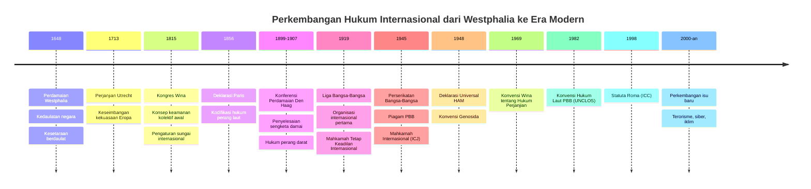
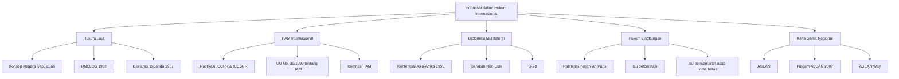

# Bab 1: Pengertian dan Sejarah Hukum Internasional

## Tujuan Pembelajaran

Setelah mempelajari bab ini, mahasiswa diharapkan mampu:

1. Menjelaskan definisi hukum internasional menurut berbagai sarjana dan perspektif teoritis.
2. Menguraikan perkembangan sejarah hukum internasional dari masa klasik hingga era kontemporer.
3. Membedakan hukum internasional publik dan hukum internasional privat.
4. Mengidentifikasi karakteristik utama sistem hukum internasional yang membedakannya dari hukum nasional.
5. Menganalisis peran hukum internasional di era globalisasi dan relevansinya bagi Indonesia.
6. Membandingkan pandangan positivis dan naturalis dalam filsafat hukum internasional.
7. Menjelaskan kontribusi para sarjana utama dalam perkembangan hukum internasional.

---

## 1.1 Definisi Hukum Internasional

### 1.1.1 Pengertian Umum

Hukum internasional adalah seperangkat aturan dan prinsip yang mengatur hubungan antara negara-negara berdaulat serta subjek hukum internasional lainnya. Istilah "hukum internasional" (*international law*) pertama kali diperkenalkan oleh Jeremy Bentham pada tahun 1789 dalam karyanya *An Introduction to the Principles of Morals and Legislation*. Sebelumnya, cabang hukum ini dikenal dengan sebutan *law of nations* atau *ius gentium* dalam tradisi Romawi.

Menurut Malcolm N. Shaw, hukum internasional adalah "the body of rules which are legally binding on states in their intercourse with each other" — sekumpulan aturan yang secara hukum mengikat negara-negara dalam hubungan satu sama lain. Definisi ini menekankan sifat mengikat (*legally binding*) dari hukum internasional, sekaligus menempatkan negara sebagai subjek utamanya.

James Crawford dalam edisi terbaru *Brownlie's Principles of Public International Law* mendefinisikan hukum internasional sebagai "the system of law which governs relations between states" — sistem hukum yang mengatur hubungan antarnegara. Namun, Crawford segera menambahkan bahwa definisi ini terlalu sempit untuk menggambarkan realitas hukum internasional kontemporer, yang kini juga mencakup organisasi internasional, individu, dan entitas lain sebagai subjeknya.

Lassa Oppenheim, dalam karyanya yang monumental *International Law: A Treatise* (1905), memberikan definisi yang lebih terperinci. Menurutnya, hukum internasional adalah "the body of customary and conventional rules which are considered legally binding by civilised States in their intercourse with each other." Definisi Oppenheim ini mencerminkan era di mana hukum internasional masih terbatas pada "negara-negara beradab" (*civilised states*), sebuah konsep yang kemudian dikritik karena sarat muatan kolonialisme dan Eurosentrisme.

Mochtar Kusumaatmadja, ahli hukum internasional Indonesia yang berpengaruh, mendefinisikan hukum internasional sebagai "keseluruhan kaidah-kaidah dan asas-asas hukum yang mengatur hubungan atau persoalan yang melintasi batas negara antara negara dengan negara, negara dengan subjek hukum lain bukan negara, atau subjek hukum bukan negara satu sama lain." Definisi ini lebih luas dan mengakomodasi perkembangan subjek hukum internasional modern.

### 1.1.2 Istilah dan Penamaan

Dalam kepustakaan hukum, terdapat beberapa istilah yang digunakan untuk menyebut hukum internasional:

| Istilah | Bahasa Asal | Pengguna/Konteks |
|---------|-------------|------------------|
| *Ius gentium* | Latin | Hukum Romawi — awalnya mengatur hubungan antara warga Romawi dan orang asing |
| *Law of nations* | Inggris | Digunakan sebelum abad ke-18; masih kadang dipakai dalam konteks sejarah |
| *International law* | Inggris | Jeremy Bentham (1789); istilah yang paling umum digunakan saat ini |
| *Droit international* | Prancis | Tradisi hukum Prancis |
| *Völkerrecht* | Jerman | Tradisi hukum Jerman, secara harfiah berarti "hukum bangsa-bangsa" |
| *Hukum internasional* | Indonesia | Padanan resmi dalam Bahasa Indonesia |
| *Hukum antarbangsa* | Indonesia | Alternatif yang kurang umum digunakan |

Perlu dicatat bahwa istilah *ius gentium* dalam hukum Romawi berbeda dari hukum internasional modern. *Ius gentium* Romawi pada awalnya merupakan hukum yang diterapkan oleh *praetor peregrinus* untuk mengatur hubungan hukum antara warga Romawi dan orang asing (*peregrini*), atau antarsesama orang asing di dalam wilayah Romawi. Ia bukan hukum yang mengatur hubungan antarnegara sebagaimana hukum internasional modern.

### 1.1.3 Ruang Lingkup Hukum Internasional Modern

Hukum internasional modern mencakup ruang lingkup yang sangat luas. Secara garis besar, bidang-bidang yang diatur mencakup:

**Bidang tradisional**: hukum perjanjian internasional (*law of treaties*), hukum diplomatik dan konsuler, hukum laut, hukum perang dan hukum humaniter internasional, tanggung jawab negara (*state responsibility*), penyelesaian sengketa internasional, suksesi negara, dan kedaulatan wilayah.

**Bidang yang berkembang sejak pertengahan abad ke-20**: hukum hak asasi manusia internasional, hukum lingkungan internasional, hukum ekonomi internasional, hukum pidana internasional, hukum organisasi internasional, hukum ruang angkasa, dan hukum investasi internasional.

**Bidang yang muncul di era kontemporer**: hukum siber internasional (*international cyber law*), hukum perubahan iklim, tanggung jawab korporasi dalam hukum internasional, tata kelola kecerdasan buatan, dan perlindungan data lintas batas.

Perluasan ruang lingkup ini mencerminkan semakin kompleksnya hubungan antarnegara dan antarsubjek hukum internasional di era globalisasi, serta menunjukkan kemampuan hukum internasional untuk beradaptasi dengan tantangan baru.

---

## 1.2 Perbedaan Hukum Internasional Publik dan Hukum Internasional Privat

### 1.2.1 Hukum Internasional Publik

Hukum internasional publik (*public international law*) adalah cabang hukum yang mengatur hubungan antara negara-negara berdaulat dan subjek hukum internasional lainnya. Ia mengatur perilaku negara dalam hubungan antarnegara, hak dan kewajiban negara di bawah hukum internasional, serta norma-norma yang mengikat masyarakat internasional secara keseluruhan.

Ciri utama hukum internasional publik adalah bahwa subjeknya terutama terdiri atas negara dan organisasi internasional. Sumber hukumnya berasal dari perjanjian internasional, hukum kebiasaan internasional, dan prinsip umum hukum. Penegakannya bergantung pada mekanisme internasional seperti Mahkamah Internasional (ICJ), badan-badan arbitrase, serta mekanisme kepatuhan yang terdapat dalam berbagai rezim perjanjian.

### 1.2.2 Hukum Internasional Privat

Hukum internasional privat (*private international law*), yang juga dikenal sebagai *conflict of laws*, adalah cabang hukum yang menangani persoalan hukum yang mengandung unsur asing (*foreign element*). Ia menentukan yurisdiksi pengadilan mana yang berwenang mengadili suatu perkara, hukum negara mana yang berlaku (*applicable law* atau *choice of law*), serta apakah putusan pengadilan suatu negara dapat diakui dan dilaksanakan di negara lain (*recognition and enforcement of foreign judgments*).

Berbeda dengan hukum internasional publik yang bersumber dari hukum internasional itu sendiri, hukum internasional privat pada dasarnya merupakan bagian dari hukum nasional masing-masing negara. Setiap negara memiliki aturan hukum internasional privatnya sendiri, meskipun terdapat upaya harmonisasi melalui konvensi internasional seperti yang dihasilkan oleh Konferensi Den Haag tentang Hukum Internasional Privat (*Hague Conference on Private International Law*).

### 1.2.3 Perbandingan

| Aspek | HI Publik | HI Privat |
|-------|-----------|-----------|
| Subjek utama | Negara, organisasi internasional | Individu, badan hukum privat |
| Sumber hukum | Perjanjian internasional, kebiasaan, prinsip umum | Hukum nasional masing-masing negara |
| Ruang lingkup | Hubungan antarnegara dan subjek HI | Hubungan hukum privat bersifat lintas batas |
| Forum penyelesaian | ICJ, arbitrase internasional, badan-badan PBB | Pengadilan nasional, arbitrase komersial |
| Contoh persoalan | Sengketa wilayah, pelanggaran HAM, hukum laut | Kontrak dagang internasional, perkawinan campuran |
| Penegakan | Sanksi internasional, tekanan diplomatik, pengadilan internasional | Mekanisme penegakan hukum nasional |
| Terminologi alternatif | *Law of nations*, *Völkerrecht* | *Conflict of laws*, *choix de loi* |

Meskipun terdapat perbedaan mendasar antara keduanya, dalam praktiknya kedua cabang hukum ini sering berinteraksi. Misalnya, dalam sengketa investasi internasional di hadapan tribunal ICSID (*International Centre for Settlement of Investment Disputes*), baik prinsip hukum internasional publik maupun hukum internasional privat dapat diterapkan secara bersamaan.

Dalam buku ini, istilah "hukum internasional" merujuk pada hukum internasional publik, kecuali dinyatakan lain.

---

## 1.3 Sejarah Perkembangan Hukum Internasional

### 1.3.1 Akar Kuno dan Awal Mula

Meskipun hukum internasional modern umumnya dianggap bermula dari sistem Eropa pasca-Westphalia, praktik hubungan antarnegara yang diatur oleh norma-norma tertentu sesungguhnya telah ada jauh sebelumnya. Beberapa contoh penting dari peradaban kuno antara lain:

**Mesopotamia**: Perjanjian perdamaian antara Lagash dan Umma (sekitar 2100 SM), yang dianggap sebagai salah satu perjanjian internasional tertua yang diketahui. Perjanjian ini menetapkan batas wilayah antara kedua negara-kota dan memuat klausul penyelesaian sengketa.

**Mesir Kuno**: Perjanjian Kadesh (sekitar 1259 SM) antara Firaun Ramses II dari Mesir dan Raja Hattusili III dari Het (Hittite) merupakan salah satu perjanjian perdamaian tertulis tertua yang masih bertahan. Perjanjian ini memuat ketentuan tentang perdamaian, aliansi militer defensif, dan ekstradisi pengungsi politik — elemen-elemen yang sampai hari ini masih ditemukan dalam perjanjian internasional modern.

**India Kuno**: Arthashastra karya Kautilya (sekitar abad ke-4 SM) memuat prinsip-prinsip tentang hubungan antarnegara, termasuk soal duta besar, perang, dan perdamaian. Kitab Manu (*Manusmriti*) juga mengandung aturan tentang perilaku dalam peperangan yang menunjukkan kemiripan dengan hukum humaniter modern.

**Cina Kuno**: Pada masa Negara-Negara Berperang (*Warring States Period*, 475-221 SM), negara-negara di Cina mengembangkan praktik diplomatik yang canggih, termasuk sistem duta besar tetap, perjanjian aliansi, dan aturan perang.

**Yunani Kuno**: Negara-negara kota Yunani (*polis*) mengembangkan berbagai institusi yang menyerupai hukum internasional, seperti *proxenia* (semacam konsuler kehormatan), *amphictyonic councils* (dewan antarnegara kota untuk pengelolaan kuil bersama), arbitrase antarnegara kota, dan aturan perang termasuk perlakuan terhadap tawanan perang.

**Romawi**: Sebagaimana telah disebutkan, konsep *ius gentium* Romawi memberikan kontribusi penting meskipun berbeda dari hukum internasional modern. Yang lebih relevan adalah konsep *ius fetiale* — hukum yang mengatur prosedur formal untuk menyatakan perang dan membuat perjanjian, yang dilaksanakan oleh para imam *fetiales*.

### 1.3.2 Abad Pertengahan dan Pengaruh Gereja

Pada Abad Pertengahan di Eropa, perkembangan hukum internasional dipengaruhi oleh beberapa faktor utama. Gereja Katolik Roma memainkan peran sentral sebagai otoritas moral dan politik yang melampaui batas-batas kerajaan. Paus berfungsi sebagai semacam arbiter dalam sengketa antara penguasa Kristen, dan konsep *res publica Christiana* (komunitas Kristen) memberikan kerangka normatif bagi hubungan antarpembesar Eropa.

Tradisi hukum kodrat (*natural law*) yang dikembangkan oleh para pemikir Skolastik seperti Santo Thomas Aquinas (1225-1274) memberikan landasan filosofis bagi gagasan tentang hukum yang mengikat semua bangsa. Aquinas, dalam *Summa Theologica*, membedakan antara *lex aeterna* (hukum abadi), *lex naturalis* (hukum kodrat), dan *lex humana* (hukum manusia), dan berpendapat bahwa terdapat prinsip-prinsip moral universal yang mengikat semua manusia dan semua penguasa.

Perang Salib (1095-1291) dan perdagangan lintas benua yang menyertainya mendorong perkembangan hukum laut dan hukum dagang internasional. *Consolato del Mare*, sebuah kompilasi hukum kebiasaan laut dari Mediterania yang disusun pada abad ke-14, menjadi rujukan utama dalam perdagangan maritim internasional. Demikian pula, *Lex Mercatoria* (hukum dagang) berkembang sebagai seperangkat aturan yang mengatur perdagangan antarpedagang dari berbagai negara.

### 1.3.3 Sekolah Salamanca dan Awal Hukum Internasional Modern

Pada abad ke-16, Sekolah Salamanca di Spanyol menghasilkan para pemikir yang sangat berpengaruh dalam perkembangan hukum internasional. Konteks sejarahnya adalah ekspansi kolonial Spanyol dan Portugal ke Benua Amerika, yang menimbulkan pertanyaan mendalam tentang legitimasi penaklukan, hak penduduk asli, dan batasan kekuasaan negara.

**Francisco de Vitoria** (1483-1546) dianggap sebagai salah satu pendiri hukum internasional modern. Dalam kuliahnya *De Indis* (1532), Vitoria membahas status hukum penduduk asli Amerika. Ia berpendapat bahwa penduduk asli memiliki hak atas tanah dan properti mereka, bahwa penemuan saja (*discovery*) tidak memberikan dasar hukum bagi penaklukan, dan bahwa kekuasaan Paus tidak mencakup wilayah temporal atas penduduk non-Kristen. Meskipun Vitoria akhirnya membenarkan penaklukan Spanyol berdasarkan alasan lain (terutama hak untuk berdagang dan menyebarkan agama), pemikirannya merupakan langkah revolusioner karena mengakui bahwa penduduk asli memiliki hak-hak yang dilindungi hukum.

**Francisco Suárez** (1548-1617), juga dari Sekolah Salamanca, mengembangkan gagasan tentang komunitas internasional (*communitas orbis*) yang terikat oleh hukum kodrat. Dalam karyanya *De Legibus ac Deo Legislatore* (1612), Suárez berpendapat bahwa meskipun setiap negara berdaulat, mereka semua merupakan bagian dari komunitas yang lebih besar yang memerlukan aturan bersama.

### 1.3.4 Hugo Grotius: "Bapak Hukum Internasional"

Hugo Grotius (1583-1645), seorang sarjana Belanda, secara luas dianggap sebagai "Bapak Hukum Internasional" (*Father of International Law*), meskipun gelar ini dalam beberapa dekade terakhir diperdebatkan mengingat kontribusi para pemikir sebelumnya.

Karya Grotius yang paling berpengaruh adalah *De Iure Belli ac Pacis* (*On the Law of War and Peace*, 1625), yang disusun dalam konteks Perang Tiga Puluh Tahun (1618-1648) yang menghancurkan Eropa. Dalam karya ini, Grotius berupaya membangun suatu sistem hukum yang mengatur hubungan antarnegara baik dalam masa perang maupun damai.

Kontribusi utama Grotius meliputi:

**Sekularisasi hukum internasional**: Grotius berpendapat bahwa hukum kodrat akan tetap berlaku "etiamsi daremus non esse Deum" — bahkan jika kita berasumsi bahwa Tuhan tidak ada. Dengan pernyataan berani ini, Grotius memisahkan hukum internasional dari otoritas teologis dan meletakkannya di atas landasan rasional. Ini merupakan langkah krusial menuju hukum internasional modern yang bersifat sekular.

**Sistematisasi hukum perang**: Grotius membedakan antara perang yang adil (*bellum iustum*) dan perang yang tidak adil, serta menetapkan aturan tentang perilaku dalam peperangan. Ia berpendapat bahwa bahkan dalam perang, terdapat batasan-batasan moral dan hukum yang harus dipatuhi.

**Konsep kebebasan laut**: Dalam karyanya yang lebih awal, *Mare Liberum* (1609), Grotius membela prinsip bahwa laut lepas terbuka bagi semua bangsa dan tidak dapat dikuasai oleh satu negara. Karya ini ditulis untuk membela kepentingan Belanda dalam perdagangan rempah-rempah dengan Asia Tenggara melawan klaim monopoli Portugis.

**Hukum kodrat dan hukum positif**: Grotius membedakan antara hukum kodrat (*ius naturale*), yang bersumber dari akal budi manusia, dan hukum sukarela (*ius voluntarium*), yang bersumber dari persetujuan negara-negara. Ia berpendapat bahwa kedua jenis hukum ini saling melengkapi dalam mengatur hubungan antarnegara.

Perlu dicatat bahwa pemikiran Grotius tidak lepas dari konteks kolonial Eropa. *Mare Liberum* ditulis untuk membenarkan ekspansi perdagangan Belanda, dan karyanya secara umum mencerminkan perspektif Eropa tentang hukum dan ketertiban internasional. Kritik poskolonial kontemporer menyoroti bahwa konsep "hukum internasional" yang dibangun oleh Grotius dan penerusnya secara historis bersifat Eurosentris.

### 1.3.5 Perdamaian Westphalia (1648)

Perdamaian Westphalia (1648) sering dianggap sebagai titik awal sistem hukum internasional modern. Perjanjian ini mengakhiri Perang Tiga Puluh Tahun di Eropa — sebuah konflik yang menghancurkan yang melibatkan hampir semua kekuatan besar Eropa dan menyebabkan kematian jutaan orang.

Perdamaian Westphalia terdiri dari dua perjanjian utama: Perjanjian Osnabrück (antara Kekaisaran Romawi Suci dan Swedia) dan Perjanjian Münster (antara Kekaisaran Romawi Suci dan Prancis). Bersama-sama, perjanjian ini menetapkan prinsip-prinsip yang menjadi fondasi sistem internasional modern.

Prinsip-prinsip utama yang lahir dari Westphalia meliputi:

**Kedaulatan negara** (*state sovereignty*): Setiap negara memiliki kekuasaan tertinggi atas wilayah dan rakyatnya, tanpa tunduk pada otoritas eksternal. Ini secara efektif mengakhiri klaim kekuasaan universal oleh Paus dan Kaisar.

**Kesetaraan kedaulatan** (*sovereign equality*): Semua negara berdaulat dianggap setara secara hukum, tanpa memandang ukuran, kekuatan, atau kekayaan. Prinsip ini kemudian dikodifikasi dalam Pasal 2(1) Piagam PBB.

**Non-intervensi** (*non-intervention*): Negara tidak boleh mencampuri urusan dalam negeri negara lain. Prinsip ini berasal dari pengakuan Westphalia bahwa setiap pangeran berhak menentukan agama di wilayahnya (*cuius regio, eius religio*).

**Integritas wilayah** (*territorial integrity*): Batas wilayah negara harus dihormati dan tidak boleh diubah secara sepihak melalui kekerasan.

Namun, perlu dipahami bahwa narasi "Westphalia sebagai titik nol" kini mendapat kritik dari para sejarawan hukum internasional. Beberapa kritik penting di antaranya: pertama, prinsip kedaulatan tidak muncul secara tiba-tiba pada 1648 tetapi berkembang secara bertahap selama berabad-abad; kedua, Perdamaian Westphalia pada awalnya hanya berlaku untuk Eropa dan tidak dimaksudkan sebagai tatanan universal; ketiga, banyak elemen hukum internasional sudah ada sebelum 1648, sebagaimana ditunjukkan oleh karya-karya Vitoria, Suárez, dan Grotius.

### 1.3.6 Abad ke-17 hingga ke-19: Konsolidasi dan Kodifikasi

Setelah Westphalia, hukum internasional mengalami perkembangan yang pesat melalui beberapa fase.

**Abad ke-17 dan ke-18: Pembentukan Teori**

Pada periode ini, sejumlah sarjana penting memperkuat fondasi teoretis hukum internasional:

**Samuel Pufendorf** (1632-1694), seorang pemikir Jerman, mengembangkan teori hukum kodrat yang komprehensif dalam *De Iure Naturae et Gentium* (1672). Pufendorf menolak gagasan bahwa hukum positif antarnegara dapat berdiri sendiri tanpa hukum kodrat. Menurutnya, hukum antarbangsa sepenuhnya bersumber dari hukum alam, bukan dari persetujuan negara-negara.

**Cornelius van Bynkershoek** (1673-1743), seorang ahli hukum Belanda, menekankan pentingnya praktik negara (*state practice*) sebagai sumber hukum internasional. Dalam karyanya *De Dominio Maris* (1702), ia mengembangkan doktrin "tembakan meriam" (*cannon-shot rule*) untuk menentukan lebar laut teritorial — yaitu bahwa kedaulatan negara pantai atas laut hanya berlaku sejauh jarak tembakan meriam dari pantai. Konsep ini kemudian menjadi cikal bakal aturan laut teritorial 3 mil laut.

**Emmerich de Vattel** (1714-1767), seorang diplomat dan sarjana Swiss, menulis *Le Droit des Gens* (*The Law of Nations*, 1758), yang menjadi salah satu karya paling berpengaruh dalam hukum internasional. Vattel menggabungkan tradisi hukum kodrat dengan pendekatan yang lebih praktis dan berorientasi pada praktik negara. Karyanya sangat berpengaruh dalam praktik diplomatik abad ke-18 dan ke-19, serta sering dirujuk oleh para pendiri Amerika Serikat.

Vattel mengembangkan beberapa konsep penting, antara lain: doktrin kesetaraan kedaulatan yang lebih terperinci; gagasan tentang keseimbangan kekuasaan (*balance of power*) sebagai mekanisme untuk menjaga ketertiban internasional; dan konsep hak penentuan nasib sendiri yang embrionik. Kelemahan utama pemikiran Vattel adalah kecenderungannya untuk memberikan terlalu banyak keleluasaan kepada negara dalam menafsirkan kewajiban internasionalnya, yang oleh para pengkritiknya dianggap dapat melemahkan sifat mengikat hukum internasional.

**Abad ke-19: Era Positivisme dan Kodifikasi**

Abad ke-19 menyaksikan pergeseran mendasar dari tradisi hukum kodrat menuju positivisme hukum. Para positivis berpendapat bahwa hukum internasional hanya dapat bersumber dari persetujuan negara — baik melalui perjanjian internasional maupun melalui hukum kebiasaan. Tokoh-tokoh positivis terkemuka meliputi:

**John Austin** (1790-1859), yang meskipun bukan sarjana hukum internasional, memberikan pengaruh besar melalui kritiknya bahwa hukum internasional bukan "hukum" yang sesungguhnya (*law properly so called*) melainkan hanya "moralitas positif internasional" (*positive international morality*). Menurut Austin, hukum yang sesungguhnya harus merupakan perintah dari penguasa berdaulat yang disertai ancaman sanksi — sesuatu yang tidak dimiliki oleh hukum internasional. Kritik Austin ini, meskipun banyak ditolak, mendorong para sarjana hukum internasional untuk merumuskan pembelaan yang lebih kuat terhadap sifat hukum (*legal character*) dari hukum internasional.

**Lassa Oppenheim** (1858-1919), yang karyanya *International Law: A Treatise* (1905) menjadi buku teks hukum internasional terpenting di abad ke-20. Oppenheim mengambil posisi positivis yang moderat, mengakui persetujuan negara sebagai dasar hukum internasional tetapi juga mengakui bahwa komunitas internasional memiliki kepentingan bersama yang melampaui kepentingan individual negara.

Perkembangan institusional penting pada abad ke-19 meliputi:

**Kongres Wina (1814-1815)**: Selain menata ulang peta politik Eropa pasca-Napoleon, Kongres Wina menghasilkan beberapa norma hukum internasional yang penting, termasuk pengaturan sungai internasional (terutama Sungai Rhine dan Danube), penghapusan perdagangan budak (meskipun baru sebagai deklarasi prinsip), dan kodifikasi hierarki agen diplomatik.

**Deklarasi Paris (1856)**: Mengatur hukum perang laut, termasuk penghapusan *privateering* (pembajakan berlisensi negara) dan perlindungan barang milik negara netral.

**Konvensi Jenewa Pertama (1864)**: Diprakarsai oleh Henry Dunant setelah menyaksikan kengerian Pertempuran Solferino (1859), konvensi ini meletakkan dasar bagi hukum humaniter internasional dengan mengatur perlakuan terhadap tentara yang terluka di medan perang.

**Pembentukan Uni Internasional**: Abad ke-19 menyaksikan pembentukan organisasi internasional awal seperti International Telegraph Union (1865) dan Universal Postal Union (1874), yang merupakan cikal bakal organisasi internasional modern.

**Konferensi Perdamaian Den Haag (1899 dan 1907)**: Konferensi-konferensi ini menghasilkan sejumlah konvensi penting tentang penyelesaian sengketa secara damai, hukum perang darat dan laut, serta mendirikan Mahkamah Tetap Arbitrase (*Permanent Court of Arbitration*). Konferensi Den Haag 1907 sering dianggap sebagai cikal bakal kodifikasi hukum internasional secara multilateral.

### 1.3.7 Abad ke-20: Institusionalisasi

Abad ke-20 membawa transformasi besar dalam hukum internasional, didorong oleh dua Perang Dunia yang menghancurkan.

**Liga Bangsa-Bangsa (1919-1946)**

Setelah Perang Dunia I, Liga Bangsa-Bangsa (*League of Nations*) didirikan berdasarkan Perjanjian Versailles (1919). Liga ini merupakan organisasi internasional pertama yang bertujuan menjaga perdamaian dan keamanan internasional. Meskipun pada akhirnya gagal mencegah Perang Dunia II, Liga memberikan beberapa kontribusi penting bagi hukum internasional:

Pertama, Liga mendirikan Mahkamah Tetap Keadilan Internasional (*Permanent Court of International Justice*/PCIJ) pada tahun 1920, yang merupakan pengadilan internasional permanen pertama. PCIJ menghasilkan sejumlah keputusan dan nasihat hukum (*advisory opinions*) yang menjadi tonggak dalam perkembangan hukum internasional, termasuk kasus *Lotus* (1927) tentang yurisdiksi negara dan kasus *Eastern Greenland* (1933) tentang kedaulatan wilayah.

Kedua, Liga mengembangkan Sistem Mandat untuk mengelola bekas koloni Kekaisaran Ottoman dan Jerman, yang meskipun dalam praktiknya masih bersifat kolonial, memperkenalkan gagasan bahwa penguasaan atas wilayah dan rakyat membawa tanggung jawab terhadap masyarakat internasional — gagasan yang kemudian berkembang menjadi konsep perwalian PBB dan hak penentuan nasib sendiri.

Ketiga, Liga memfasilitasi upaya kodifikasi hukum internasional melalui Konferensi Kodifikasi Den Haag (1930), yang meskipun hasilnya terbatas, menjadi preseden bagi upaya kodifikasi selanjutnya oleh Komisi Hukum Internasional PBB.

**Perkembangan Antara Dua Perang Dunia**

Beberapa perkembangan hukum internasional penting terjadi pada periode antardua perang dunia. Pakta Briand-Kellogg (1928) merupakan perjanjian pertama yang secara eksplisit melarang penggunaan perang sebagai instrumen kebijakan nasional. Meskipun gagal mencegah Perang Dunia II, pakta ini menetapkan prinsip yang kemudian dikodifikasi dalam Piagam PBB.

Konvensi Montevideo tentang Hak dan Kewajiban Negara (1933) menetapkan kriteria kenegaraan yang hingga kini masih menjadi acuan utama dalam hukum internasional, yaitu: (a) penduduk tetap; (b) wilayah tertentu; (c) pemerintahan; dan (d) kemampuan untuk berhubungan dengan negara lain. Konvensi ini akan dibahas lebih lanjut dalam Bab 3 tentang Subjek Hukum Internasional.

**Perserikatan Bangsa-Bangsa dan Tatanan Pasca-1945**

Pendirian Perserikatan Bangsa-Bangsa (PBB) pada tahun 1945 menandai dimulainya era baru dalam hukum internasional. Piagam PBB, yang mulai berlaku pada 24 Oktober 1945, menetapkan kerangka normatif yang fundamental bagi hukum internasional modern.

Prinsip-prinsip utama Piagam PBB meliputi:

Larangan penggunaan kekerasan (*prohibition of the use of force*) dalam hubungan internasional (Pasal 2(4)), kecuali dalam hal pembelaan diri (*self-defence*, Pasal 51) atau otorisasi Dewan Keamanan PBB berdasarkan Bab VII Piagam. Prinsip ini merupakan perkembangan revolusioner karena sebelumnya, penggunaan kekerasan oleh negara umumnya dianggap sebagai hak berdaulat (*sovereign right*).

Penyelesaian sengketa secara damai (*peaceful settlement of disputes*, Pasal 2(3) dan Bab VI), yang mewajibkan negara-negara untuk menyelesaikan sengketa mereka melalui negosiasi, mediasi, konsiliasi, arbitrase, penyelesaian yudisial, atau cara-cara damai lainnya.

Hak penentuan nasib sendiri (*self-determination of peoples*, Pasal 1(2) dan 55), yang memberikan landasan hukum bagi proses dekolonisasi yang mengubah peta politik dunia pada paruh kedua abad ke-20.

Perlindungan hak asasi manusia sebagai salah satu tujuan PBB (Pasal 1(3)), yang membuka jalan bagi perkembangan hukum HAM internasional.

**Pengadilan Nuremberg dan Tokyo (1945-1946)**

Pengadilan Militer Internasional di Nuremberg dan Tokyo untuk mengadili para penjahat perang Perang Dunia II merupakan tonggak dalam perkembangan hukum pidana internasional. Pengadilan Nuremberg menetapkan prinsip bahwa individu dapat dimintai pertanggungjawaban pidana di bawah hukum internasional, bahwa pemimpin negara tidak kebal dari tuntutan pidana internasional, dan bahwa perintah atasan bukan pembelaan yang sah.

Prinsip-prinsip Nuremberg kemudian dikodifikasi oleh Komisi Hukum Internasional PBB dan menjadi dasar bagi perkembangan hukum pidana internasional selanjutnya, termasuk pendirian Tribunal Pidana Internasional untuk bekas Yugoslavia (ICTY, 1993), Tribunal Pidana Internasional untuk Rwanda (ICTR, 1994), dan Mahkamah Pidana Internasional (ICC, 2002).

### 1.3.8 Era Kontemporer: Tantangan dan Perkembangan Baru

Hukum internasional pada era kontemporer menghadapi sejumlah tantangan dan perkembangan baru yang signifikan.

**Dekolonisasi dan universalisasi hukum internasional**: Proses dekolonisasi pada tahun 1950-an hingga 1970-an secara fundamental mengubah karakter hukum internasional. Masuknya puluhan negara baru yang merdeka — terutama dari Asia dan Afrika — ke dalam sistem internasional membawa perspektif, kepentingan, dan tradisi hukum baru. Negara-negara baru ini menantang banyak norma hukum internasional yang dianggap mencerminkan kepentingan kolonial, dan mendorong pengembangan konsep-konsep baru seperti kedaulatan permanen atas sumber daya alam (*permanent sovereignty over natural resources*), Tata Ekonomi Internasional Baru (*New International Economic Order*), dan warisan bersama umat manusia (*common heritage of mankind*).

**Perkembangan hukum HAM internasional**: Deklarasi Universal Hak Asasi Manusia (1948), Kovenan Internasional tentang Hak Sipil dan Politik (1966), dan Kovenan Internasional tentang Hak Ekonomi, Sosial, dan Budaya (1966) membentuk kerangka normatif yang komprehensif untuk perlindungan hak asasi manusia di tingkat internasional. Perkembangan ini mengubah hubungan antara negara dan individu dalam hukum internasional — yang sebelumnya urusan domestik, kini perlakuan negara terhadap warganya menjadi perhatian masyarakat internasional.

**Hukum lingkungan internasional**: Sejak Konferensi Stockholm (1972), hukum lingkungan internasional berkembang pesat melalui berbagai perjanjian multilateral seperti Konvensi Wina tentang Perlindungan Lapisan Ozon (1985), Konvensi Kerangka Kerja PBB tentang Perubahan Iklim (1992), Protokol Kyoto (1997), dan Perjanjian Paris (2015). Konsep-konsep seperti pembangunan berkelanjutan (*sustainable development*), prinsip kehati-hatian (*precautionary principle*), dan tanggung jawab bersama tapi berbeda (*common but differentiated responsibilities*) telah menjadi bagian integral dari hukum internasional.

**Hukum ekonomi internasional**: Pendirian Organisasi Perdagangan Dunia (*World Trade Organization*/WTO) pada tahun 1995, perkembangan hukum investasi internasional melalui ribuan perjanjian investasi bilateral (*bilateral investment treaties*), dan meningkatnya peran lembaga keuangan internasional telah menciptakan kerangka hukum yang semakin kompleks untuk mengatur hubungan ekonomi antarnegara.

**Hukum pidana internasional**: Pendirian Mahkamah Pidana Internasional (*International Criminal Court*/ICC) berdasarkan Statuta Roma (1998, mulai berlaku 2002) merupakan puncak dari perkembangan hukum pidana internasional. ICC memiliki yurisdiksi atas genosida, kejahatan terhadap kemanusiaan, kejahatan perang, dan kejahatan agresi.

**Tantangan kontemporer**: Hukum internasional saat ini menghadapi tantangan dari berbagai arah, termasuk terorisme internasional dan penggunaan kekerasan, kejahatan siber dan keamanan digital, perubahan iklim dan bencana lingkungan, migrasi massal dan pengungsi, perkembangan teknologi baru (kecerdasan buatan, bioteknologi, ruang angkasa), serta meningkatnya unilateralisme dan nasionalisme di sejumlah negara besar.

---

## 1.4 Karakteristik Sistem Hukum Internasional

### 1.4.1 Absennya Legislatur Terpusat

Berbeda dengan hukum nasional yang dibentuk oleh lembaga legislatif (seperti DPR di Indonesia atau Parliament di Inggris), hukum internasional tidak memiliki legislatur terpusat yang berwenang membuat undang-undang yang mengikat semua negara. Majelis Umum PBB, meskipun sering disebut sebagai "parlemen dunia," tidak memiliki kekuasaan legislatif dalam pengertian yang sesungguhnya — resolusinya pada umumnya bersifat rekomendasi, bukan mengikat secara hukum (kecuali dalam hal-hal internal PBB seperti anggaran dan penerimaan anggota baru).

Pembentukan hukum internasional terjadi melalui beberapa cara yang berbeda dari proses legislasi nasional. Perjanjian internasional (*treaties*) dibentuk melalui negosiasi dan persetujuan antarnegara, sehingga pada prinsipnya hanya mengikat negara-negara yang telah menyatakan persetujuannya. Hukum kebiasaan internasional berkembang secara bertahap melalui praktik negara yang konsisten dan diterima sebagai hukum (*opinio juris*). Prinsip umum hukum diekstraksi dari sistem hukum nasional negara-negara di dunia.

### 1.4.2 Absennya Penegakan Hukum Terpusat

Hukum internasional tidak memiliki aparat penegak hukum terpusat yang sebanding dengan kepolisian dalam sistem hukum nasional. Meskipun Dewan Keamanan PBB memiliki kewenangan untuk mengambil tindakan koersif berdasarkan Bab VII Piagam PBB — termasuk sanksi ekonomi dan bahkan penggunaan kekuatan militer — mekanisme ini memiliki keterbatasan serius.

Pertama, hak veto yang dimiliki oleh lima anggota tetap Dewan Keamanan (AS, Rusia, Cina, Prancis, dan Inggris) berarti bahwa tindakan penegakan tidak dapat diambil terhadap kepentingan salah satu dari lima negara tersebut atau sekutu dekatnya. Kedua, PBB tidak memiliki angkatan bersenjata sendiri dan bergantung pada kontribusi sukarela dari negara-negara anggota untuk operasi pemeliharaan perdamaian. Ketiga, mekanisme sanksi sering kali tidak efektif karena kebocoran dan pengelakan.

### 1.4.3 Absennya Yurisdiksi Pengadilan yang Wajib

Tidak seperti sistem hukum nasional di mana pengadilan umumnya memiliki yurisdiksi wajib (*compulsory jurisdiction*) atas semua subjek hukum dalam wilayahnya, pengadilan internasional pada umumnya hanya dapat mengadili suatu sengketa apabila para pihak telah menyetujui yurisdiksinya.

Mahkamah Internasional (ICJ), sebagai organ yudisial utama PBB, hanya dapat mengadili sengketa antarnegara jika kedua pihak telah menerima yurisdiksinya. Penerimaan yurisdiksi ini dapat diberikan melalui beberapa cara: deklarasi sepihak berdasarkan Pasal 36(2) Statuta ICJ (*optional clause*), klausul yurisdiksi dalam perjanjian internasional (*compromissory clause*), atau perjanjian khusus antara para pihak untuk mengajukan sengketa tertentu ke ICJ (*special agreement* atau *compromis*).

### 1.4.4 Sifat Berbasis Konsensus

Hukum internasional pada dasarnya bersifat konsensual — ia didasarkan pada persetujuan negara-negara. Negara hanya terikat oleh perjanjian yang telah mereka ratifikasi, dan hukum kebiasaan internasional berkembang melalui praktik yang diterima oleh negara-negara sebagai hukum. Doktrin *persistent objector* memungkinkan suatu negara untuk tidak terikat oleh suatu aturan kebiasaan internasional jika negara tersebut secara konsisten menolak aturan tersebut sejak tahap pembentukannya.

Namun, terdapat pengecualian penting terhadap prinsip konsensual ini. Norma *jus cogens* (*peremptory norms*) mengikat semua negara tanpa memerlukan persetujuan mereka. Norma-norma ini dianggap begitu fundamental bagi masyarakat internasional sehingga tidak boleh dilanggar oleh negara mana pun. Contoh norma *jus cogens* meliputi larangan genosida, larangan penyiksaan, larangan perbudakan, dan larangan penggunaan kekerasan bersenjata (dengan pengecualian tertentu).

### 1.4.5 Perbandingan dengan Sistem Hukum Nasional

| Aspek | Hukum Nasional | Hukum Internasional |
|-------|---------------|---------------------|
| Legislatur | DPR/Parlemen dengan kewenangan legislasi | Tidak ada legislatur terpusat; hukum dibentuk melalui perjanjian dan kebiasaan |
| Penegakan | Polisi, kejaksaan, lembaga pemasyarakatan | Tidak ada penegak hukum terpusat; bergantung pada Dewan Keamanan PBB, sanksi, tekanan diplomatik |
| Pengadilan | Yurisdiksi wajib atas semua subjek hukum | Yurisdiksi umumnya bergantung pada persetujuan para pihak |
| Subjek hukum | Individu dan badan hukum | Terutama negara dan organisasi internasional |
| Dasar kewajiban | Kewarganegaraan/domisili; undang-undang berlaku bagi semua | Pada prinsipnya konsensual, kecuali *jus cogens* |
| Hierarki norma | Konstitusi → UU → peraturan pelaksana | *Jus cogens* → perjanjian/kebiasaan → prinsip umum |
| Sanksi | Pidana, perdata, administratif yang efektif | Sanksi ekonomi, tekanan diplomatik, isolasi; efektivitas bervariasi |

### 1.4.6 Mengapa Hukum Internasional Tetap Dipatuhi?

Meskipun tidak memiliki mekanisme penegakan terpusat, hukum internasional secara umum tetap dipatuhi oleh negara-negara. Beberapa penjelasan untuk fenomena ini antara lain:

**Kepentingan timbal balik** (*reciprocity*): Negara mematuhi hukum internasional karena mengharapkan negara lain juga akan mematuhinya. Misalnya, negara menghormati kekebalan diplomatik duta besar asing karena mengharapkan duta besarnya di luar negeri juga diberikan kekebalan yang sama.

**Reputasi** (*reputation*): Negara yang sering melanggar kewajiban internasionalnya akan kehilangan kepercayaan dan kredibilitas di mata masyarakat internasional, yang dapat merugikan kepentingannya dalam jangka panjang.

**Legitimasi** (*legitimacy*): Negara cenderung mematuhi aturan yang mereka anggap sah dan adil. Thomas Franck berargumen bahwa aturan hukum internasional yang memenuhi kriteria legitimasi — kejelasan, keabsahan prosedural, koherensi, dan keterkaitan dengan norma yang lebih tinggi — cenderung lebih dipatuhi.

**Internalisasi** (*internalization*): Harold Koh berpendapat bahwa kepatuhan terhadap hukum internasional terjadi melalui proses internalisasi, yakni ketika norma-norma internasional diserap ke dalam sistem hukum nasional, kebijakan pemerintah, dan budaya hukum suatu masyarakat.

**Tekanan institusional dan sosial**: Keanggotaan dalam organisasi internasional, hubungan perdagangan, dan tekanan dari masyarakat sipil dan media juga mendorong kepatuhan.

Louis Henkin, sarjana hukum internasional terkemuka, pernah menulis bahwa "almost all nations observe almost all principles of international law and almost all of their obligations almost all of the time" — hampir semua negara mematuhi hampir semua prinsip hukum internasional dan hampir semua kewajiban mereka hampir sepanjang waktu. Pernyataan ini, meskipun mendapat kritik karena terlalu optimistis, pada dasarnya mencerminkan realitas bahwa pelanggaran hukum internasional merupakan pengecualian dan bukan norma.

---

## 1.5 Pandangan Positivis dan Naturalis

### 1.5.1 Mazhab Hukum Kodrat (Naturalis)

Tradisi hukum kodrat (*natural law*) dalam hukum internasional berpandangan bahwa terdapat prinsip-prinsip moral dan hukum yang bersifat universal, objektif, dan dapat diketahui oleh akal budi manusia, yang mengikat semua bangsa tanpa memerlukan persetujuan mereka.

Dalam sejarah pemikiran hukum internasional, mazhab naturalis memiliki akar yang panjang. Para pemikir Yunani kuno seperti Aristoteles dan kaum Stoa sudah berbicara tentang hukum alam yang berlaku universal. Tradisi ini kemudian dikembangkan oleh para pemikir Skolastik Abad Pertengahan, terutama Santo Thomas Aquinas, dan diteruskan oleh para sarjana Sekolah Salamanca seperti Vitoria dan Suárez.

Dalam konteks hukum internasional, pandangan naturalis berpendapat bahwa hukum internasional bersumber dari prinsip-prinsip moral universal yang dapat ditemukan oleh akal budi. Kekuatan mengikat hukum internasional tidak bergantung pada persetujuan negara, melainkan pada kebenaran moral yang melekat pada aturan tersebut. Negara terikat oleh hukum internasional bukan karena mereka menyetujuinya, melainkan karena hukum tersebut mencerminkan keadilan dan moralitas universal.

Kekuatan pendekatan naturalis terletak pada kemampuannya untuk memberikan landasan moral yang kuat bagi hukum internasional dan untuk mengkritik hukum positif yang tidak adil. Ia juga menyediakan kerangka untuk mengembangkan norma-norma baru berdasarkan prinsip moral. Kelemahan utamanya adalah ketidakpastian dan subjektivitas — siapa yang menentukan isi hukum kodrat? Perbedaan budaya, agama, dan filosofi dapat menghasilkan pemahaman yang berbeda tentang apa yang "alamiah" atau "adil."

### 1.5.2 Mazhab Positivis

Positivisme hukum dalam konteks hukum internasional berpandangan bahwa hukum internasional semata-mata bersumber dari persetujuan negara — baik yang dinyatakan secara eksplisit melalui perjanjian internasional maupun secara implisit melalui kebiasaan internasional.

Positivisme mulai mendominasi pemikiran hukum internasional sejak abad ke-19. Para tokoh positivis berpendapat bahwa hanya aturan yang diciptakan oleh negara melalui persetujuannya yang dapat dianggap sebagai hukum internasional. Hukum kodrat, menurut para positivis, terlalu subjektif dan tidak dapat diverifikasi secara empiris untuk dijadikan dasar hukum yang mengikat.

Kekuatan pendekatan positivis adalah kepastian dan objektivitasnya — hukum dapat diidentifikasi berdasarkan kriteria formal yang jelas (apakah ada perjanjian? apakah ada praktik negara yang konsisten?). Ia juga menghormati kedaulatan negara dengan mensyaratkan persetujuan sebagai dasar kewajiban hukum.

Kelemahan positivisme adalah kesulitannya dalam menjelaskan norma-norma yang dianggap mengikat tanpa memerlukan persetujuan (*jus cogens*), serta kecenderungannya untuk membenarkan ketidakadilan selama norma tersebut dibentuk melalui prosedur yang benar.

### 1.5.3 Pendekatan Eklektis dan Kontemporer

Dalam praktiknya, hukum internasional modern mengadopsi pendekatan yang menggabungkan elemen positivis dan naturalis. Pasal 38(1) Statuta ICJ, yang mendaftarkan sumber-sumber hukum internasional, mencerminkan pendekatan eklektis ini: perjanjian dan kebiasaan internasional mencerminkan elemen positivis, sementara "prinsip umum hukum yang diakui oleh bangsa-bangsa beradab" mengandung elemen naturalis.

Di samping mazhab positivis dan naturalis, terdapat beberapa pendekatan kontemporer yang perlu dipahami:

**Mazhab New Haven (*Policy-Oriented Jurisprudence*)**: Dikembangkan oleh Myres McDougal dan Harold Lasswell di Universitas Yale, mazhab ini memandang hukum internasional sebagai proses pengambilan keputusan (*decision-making process*) yang bertujuan untuk mewujudkan nilai-nilai kemanusiaan. Menurut mazhab ini, hukum internasional bukan sekadar sekumpulan aturan tetapi proses otoritatif untuk mengambil keputusan yang memengaruhi distribusi nilai-nilai dalam masyarakat internasional.

**Pendekatan Hak (*Rights-Based Approach*)**: Menekankan bahwa hukum internasional harus berpusat pada perlindungan hak-hak fundamental individu dan kelompok, bukan semata-mata pada kepentingan negara.

**Teori Kritis (*Critical Legal Studies*)**: Mengkritik hukum internasional sebagai instrumen yang melanggengkan ketimpangan kekuasaan antara negara-negara maju dan berkembang. Martti Koskenniemi, dalam karyanya *From Apology to Utopia* (1989), berargumen bahwa hukum internasional terperangkap dalam ketegangan antara positivisme (yang cenderung membenarkan kekuasaan) dan naturalisme (yang cenderung utopis).

**Pendekatan Poskolonial (*Postcolonial Approaches*)**: Menyoroti bahwa hukum internasional secara historis dikembangkan untuk melayani kepentingan kekuatan kolonial Eropa. Antony Anghie, dalam *Imperialism, Sovereignty and the Making of International Law* (2004), berargumen bahwa hubungan kolonial bukan sekadar latar belakang sejarah hukum internasional, melainkan konstitutif — membentuk struktur dasar dari hukum internasional itu sendiri.

**Feminisme dalam Hukum Internasional**: Mengkritik hukum internasional sebagai sistem yang bias gender dan mengabaikan pengalaman perempuan. Hilary Charlesworth dan Christine Chinkin, dalam *The Boundaries of International Law* (2000), berargumen bahwa hukum internasional perlu direkonstruksi dengan memasukkan perspektif gender.

### 1.5.4 Perbandingan Pendekatan

| Aspek | Naturalis | Positivis | New Haven | Kritis |
|-------|-----------|-----------|-----------|--------|
| Sumber hukum | Akal budi/moral universal | Persetujuan negara | Proses pengambilan keputusan | Kekuasaan dan ideologi |
| Dasar kewajiban | Kebenaran moral | Persetujuan | Nilai kemanusiaan | Dominasi dan hegemoni |
| Kekuatan | Landasan moral kuat | Kepastian hukum | Berorientasi pada tujuan | Mengungkap ketimpangan |
| Kelemahan | Subjektif, tidak pasti | Sulit jelaskan *jus cogens* | Terlalu pragmatis | Destruktif tanpa alternatif |
| Tokoh utama | Grotius, Vitoria, Suárez | Oppenheim, Anzilotti | McDougal, Lasswell | Koskenniemi, Anghie |

---

## 1.6 Kontribusi Sarjana Utama

### 1.6.1 Hugo Grotius (1583-1645)

Hugo Grotius, seorang sarjana Belanda yang luar biasa berbakat, sering dijuluki sebagai "Bapak Hukum Internasional." Kontribusi utamanya telah dibahas di bagian sejarah, tetapi beberapa aspek tambahan perlu disoroti.

Grotius bukan hanya seorang teoretikus; ia juga seorang praktisi hukum dan diplomat. Ia menjadi penasihat hukum Perusahaan Hindia Timur Belanda (VOC) dan menulis *Mare Liberum* atas permintaan VOC untuk membela hak Belanda berdagang di perairan yang diklaim oleh Portugis. Fakta ini menunjukkan bahwa perkembangan hukum internasional tidak dapat dipisahkan dari kepentingan politik dan ekonomi.

Karya utamanya, *De Iure Belli ac Pacis*, disusun dalam tiga buku: Buku I membahas apakah perang dapat adil dan siapa yang memiliki hak untuk berperang (*ius ad bellum*); Buku II membahas sebab-sebab perang, termasuk hak atas properti, perjanjian, dan ganti rugi; Buku III membahas aturan perilaku dalam peperangan (*ius in bello*), termasuk perlakuan terhadap tawanan perang, pembatasan kekerasan, dan hak negara netral.

Pendekatan Grotius yang menggabungkan hukum kodrat dan hukum positif menjadi ciri khas pemikirannya. Ia bukan seorang naturalis murni seperti Pufendorf, dan bukan pula seorang positivis murni. Ia disebut sebagai "Grotian" — suatu mazhab tersendiri yang menekankan bahwa hukum internasional bersumber baik dari alam (akal budi) maupun dari persetujuan negara-negara, dan bahwa kedua sumber ini saling melengkapi.

### 1.6.2 Emmerich de Vattel (1714-1767)

Vattel, seorang diplomat dan sarjana Swiss, adalah penulis *Le Droit des Gens* (1758), yang menjadi buku teks hukum internasional paling berpengaruh di abad ke-18 dan ke-19. Karya Vattel sangat berpengaruh karena beberapa alasan.

Pertama, Vattel menulis dalam bahasa yang jelas dan dapat dipahami oleh para diplomat dan politisi, bukan hanya oleh para sarjana hukum. Kedua, ia mengambil pendekatan praktis yang berorientasi pada kebutuhan para praktisi hubungan internasional. Ketiga, ia menggabungkan prinsip hukum kodrat dengan penghormatan terhadap kedaulatan negara, yang sesuai dengan semangat zaman.

Konsep-konsep utama Vattel meliputi gagasan bahwa setiap bangsa berdaulat memiliki hak untuk mengatur dirinya sendiri tanpa campur tangan asing (*auto-limitation*); bahwa keseimbangan kekuasaan (*balance of power*) merupakan mekanisme penting untuk menjaga ketertiban internasional; bahwa perang hanya dapat dibenarkan untuk sebab-sebab yang adil (*just cause*); dan bahwa negara netral memiliki hak dan kewajiban tertentu dalam situasi perang.

Namun, Vattel juga dikritik karena memberikan terlalu banyak keleluasaan kepada negara dalam menafsirkan kewajiban internasionalnya. Konsep *auto-limitation* — bahwa negara sendiri yang menentukan sejauh mana ia terikat oleh hukum internasional — dapat digunakan untuk melemahkan sifat mengikat hukum internasional.

### 1.6.3 Lassa Oppenheim (1858-1919)

Oppenheim, seorang sarjana kelahiran Jerman yang mengajar di Universitas Cambridge, adalah penulis *International Law: A Treatise* (1905), yang menjadi buku teks hukum internasional terpenting di abad ke-20 dan terus diperbarui hingga kini (edisi terakhir diedit oleh Robert Jennings dan Arthur Watts).

Oppenheim mengambil posisi positivis yang moderat. Ia mendefinisikan hukum internasional sebagai hukum yang dibuat oleh dan untuk negara-negara, berdasarkan persetujuan mereka. Namun, ia juga mengakui bahwa hukum internasional memiliki dimensi komunal — ia melayani kepentingan bersama masyarakat internasional, bukan hanya kepentingan individual negara.

### 1.6.4 James Crawford (1948-2021)

James Crawford, seorang sarjana hukum internasional kelahiran Australia yang mengajar di Universitas Cambridge, memberikan kontribusi yang sangat signifikan terhadap hukum internasional modern. Karyanya mencakup berbagai bidang, tetapi kontribusi terbesarnya meliputi:

**Hukum kenegaraan**: Karya monumentalnya *The Creation of States in International Law* (1979, edisi kedua 2006) menjadi rujukan utama dalam hukum tentang pembentukan negara dan pengakuan negara. Crawford mengembangkan analisis yang komprehensif tentang kriteria kenegaraan, pengakuan, suksesi negara, dan status entitas non-negara.

**Tanggung jawab negara**: Crawford menjadi Pelapor Khusus (*Special Rapporteur*) Komisi Hukum Internasional PBB untuk topik tanggung jawab negara dan memainkan peran kunci dalam penyelesaian Artikel tentang Tanggung Jawab Negara atas Tindakan yang Melanggar Hukum Internasional (*Articles on State Responsibility for Internationally Wrongful Acts*, 2001), yang menjadi kodifikasi paling komprehensif tentang tanggung jawab negara.

**Praktisi hukum internasional**: Crawford juga sangat aktif sebagai praktisi, menjadi penasihat hukum dan advokat di hadapan Mahkamah Internasional dalam puluhan kasus, termasuk kasus-kasus yang melibatkan Australia, Timor Leste, dan Indonesia.

Crawford kemudian menjadi editor *Brownlie's Principles of Public International Law*, melanjutkan karya Ian Brownlie yang menjadi salah satu buku teks hukum internasional terpenting di dunia.

### 1.6.5 Sarjana dari Dunia Non-Barat

Penting untuk diakui bahwa hukum internasional bukan semata-mata produk pemikiran Barat. Beberapa sarjana dari dunia non-Barat yang memberikan kontribusi penting meliputi:

**Taslim Olawale Elias** (1914-1991), sarjana hukum Nigeria yang menjadi Hakim dan kemudian Presiden Mahkamah Internasional. Karyanya *Africa and the Development of International Law* (1972) membahas kontribusi Afrika terhadap perkembangan hukum internasional.

**R.P. Anand** (1933-2016), sarjana India yang karyanya *New States and International Law* (1972) menganalisis perspektif negara-negara baru terhadap hukum internasional dan menantang hegemoni Barat dalam pembentukan norma internasional.

**Mochtar Kusumaatmadja** (1929-2021), ahli hukum internasional Indonesia yang mengembangkan konsep hukum pembangunan (*development law*) dan berperan penting dalam perkembangan hukum laut internasional, terutama konsep Negara Kepulauan (*Archipelagic State*) yang kemudian diadopsi dalam UNCLOS 1982.

**Onuma Yasuaki** (1946-2018), sarjana Jepang yang mengembangkan pendekatan "perspektif trans-peradaban" (*trans-civilizational perspective*) terhadap hukum internasional dan mengkritik dominasi perspektif Eropa dan Amerika dalam studi hukum internasional.

---

## 1.7 Peran Hukum Internasional di Era Globalisasi

### 1.7.1 Globalisasi dan Hukum Internasional

Globalisasi — proses meningkatnya keterkaitan dan ketergantungan antarnegara dan antarmasyarakat di berbagai bidang — telah memberikan dampak mendalam terhadap hukum internasional. Di satu sisi, globalisasi mendorong ekspansi hukum internasional ke bidang-bidang baru dan memperkuat kebutuhan akan kerja sama internasional. Di sisi lain, globalisasi juga menimbulkan tantangan baru bagi kedaulatan negara dan tatanan hukum internasional yang ada.

Beberapa dampak globalisasi terhadap hukum internasional antara lain:

**Proliferasi rezim hukum internasional**: Globalisasi telah mendorong pembentukan ratusan rezim perjanjian baru yang mengatur perdagangan, investasi, lingkungan, HAM, kesehatan, telekomunikasi, dan sebagainya. Hal ini di satu sisi memperkuat hukum internasional, tetapi di sisi lain menimbulkan masalah fragmentasi — yaitu situasi di mana berbagai rezim hukum internasional berkembang secara terpisah dan kadang saling bertentangan.

**Munculnya aktor non-negara**: Globalisasi memperkuat peran aktor non-negara dalam hubungan internasional, termasuk organisasi internasional, perusahaan multinasional, organisasi non-pemerintah (NGO), dan bahkan individu. Hal ini menantang paradigma tradisional hukum internasional yang berpusat pada negara.

**Deteritorialisasi isu hukum**: Banyak persoalan hukum yang kini melampaui batas wilayah negara — perdagangan elektronik, kejahatan siber, pencemaran lintas batas, perubahan iklim — sehingga tidak dapat ditangani secara efektif oleh hukum nasional saja.

### 1.7.2 Tantangan Kontemporer

Hukum internasional di era kontemporer menghadapi beberapa tantangan fundamental. Pertama, fragmentasi hukum internasional: dengan berkembangnya berbagai rezim hukum khusus (hukum perdagangan, hukum HAM, hukum lingkungan, dan sebagainya), terdapat risiko inkonsistensi dan konflik antara norma-norma dari rezim yang berbeda.

Kedua, krisis multilateralisme: meningkatnya unilateralisme dan nasionalisme di beberapa negara besar menantang kerangka kerja sama multilateral yang menjadi tulang punggung hukum internasional.

Ketiga, kepatuhan dan penegakan: meskipun hukum internasional secara umum dipatuhi, pelanggaran-pelanggaran serius — seperti agresi, genosida, dan kejahatan perang — masih terjadi, dan mekanisme penegakan yang ada seringkali tidak memadai.

Keempat, legitimasi dan representasi: pertanyaan tentang siapa yang membuat hukum internasional dan untuk siapa hukum itu dibuat tetap relevan. Negara-negara berkembang, masyarakat adat, dan kelompok-kelompok yang termarginalkan menuntut partisipasi yang lebih besar dalam pembentukan hukum internasional.

---

## 1.8 Relevansi Hukum Internasional bagi Indonesia

### 1.8.1 Indonesia sebagai Negara Kepulauan

Indonesia, sebagai negara kepulauan terbesar di dunia dengan lebih dari 17.000 pulau dan wilayah laut yang sangat luas, memiliki kepentingan yang sangat besar dalam hukum internasional, khususnya hukum laut. Konsep Negara Kepulauan (*Archipelagic State*) yang diperjuangkan oleh Indonesia dan Filipina akhirnya diadopsi dalam Bagian IV UNCLOS (1982), yang mengakui bahwa perairan yang terletak di antara pulau-pulau suatu negara kepulauan merupakan bagian dari wilayah kedaulatannya.

Perjuangan Indonesia untuk pengakuan konsep negara kepulauan dimulai dengan Deklarasi Djuanda (1957), yang menyatakan bahwa laut-laut antara dan di sekitar pulau-pulau Indonesia merupakan satu kesatuan wilayah Negara Kesatuan Republik Indonesia. Deklarasi ini pada awalnya tidak diterima oleh banyak negara maritim besar, tetapi melalui diplomasi yang gigih — terutama pada Konferensi Hukum Laut PBB III (1973-1982) — Indonesia berhasil memasukkan konsep ini ke dalam UNCLOS.

Tokoh-tokoh Indonesia yang memainkan peran penting dalam perkembangan ini antara lain Mochtar Kusumaatmadja (yang juga menjadi Menteri Luar Negeri), Hasjim Djalal, dan Etty R. Agoes. Keberhasilan mereka merupakan salah satu kontribusi paling signifikan Indonesia terhadap perkembangan hukum internasional.

### 1.8.2 Indonesia dan Gerakan Non-Blok

Indonesia, sebagai salah satu pendiri Gerakan Non-Blok (*Non-Aligned Movement*) melalui Konferensi Asia-Afrika di Bandung (1955), memainkan peran penting dalam pembentukan norma-norma hukum internasional yang mendukung kepentingan negara-negara berkembang. Konferensi Bandung menghasilkan Sepuluh Prinsip Bandung (*Dasasila Bandung*) yang mencakup prinsip-prinsip seperti penghormatan terhadap kedaulatan, non-agresi, non-intervensi, kesetaraan, dan koeksistensi damai.

Prinsip-prinsip Bandung ini memengaruhi perkembangan hukum internasional dalam beberapa cara. Ia memperkuat gerakan dekolonisasi yang mengubah komposisi masyarakat internasional. Ia mendorong pengakuan hak penentuan nasib sendiri sebagai prinsip hukum internasional yang mengikat. Ia juga mendukung upaya untuk mereformasi hukum ekonomi internasional agar lebih adil bagi negara-negara berkembang.

### 1.8.3 Indonesia dan Hak Asasi Manusia

Indonesia meratifikasi sejumlah instrumen HAM internasional utama, termasuk Kovenan Internasional tentang Hak Sipil dan Politik (diratifikasi melalui UU No. 12 Tahun 2005) dan Kovenan Internasional tentang Hak Ekonomi, Sosial, dan Budaya (diratifikasi melalui UU No. 11 Tahun 2005). Indonesia juga menjadi anggota Dewan HAM PBB dan berpartisipasi aktif dalam mekanisme tinjauan universal (*Universal Periodic Review*).

Namun, implementasi HAM internasional di Indonesia masih menghadapi berbagai tantangan, termasuk penyelesaian pelanggaran HAM masa lalu, perlindungan hak-hak minoritas, dan keseimbangan antara kepentingan keamanan nasional dan perlindungan HAM.

### 1.8.4 Indonesia dalam Forum Internasional

Indonesia berpartisipasi aktif dalam berbagai forum dan organisasi internasional yang berperan dalam pembentukan dan penegakan hukum internasional. Indonesia adalah anggota PBB sejak 1950, anggota ASEAN sejak pendiriannya pada 1967, anggota G-20, dan aktif dalam berbagai rezim perjanjian multilateral.

Dalam konteks regional, Indonesia berperan penting dalam pembentukan Piagam ASEAN (2007) yang memberikan landasan hukum yang lebih kuat bagi kerja sama regional di Asia Tenggara. Indonesia juga aktif dalam penyelesaian sengketa di kawasan, termasuk sengketa Laut Cina Selatan.

---

## 1.9 Pertanyaan Refleksi

1. **Konseptual**: Mengapa definisi hukum internasional terus berkembang dari masa ke masa? Faktor-faktor apa yang mendorong perubahan dalam definisi tersebut?

2. **Historis**: Apakah Anda setuju bahwa Perdamaian Westphalia (1648) merupakan titik awal hukum internasional modern? Apa kekuatan dan kelemahan dari narasi ini?

3. **Teoretis**: Manakah yang lebih meyakinkan: pandangan naturalis bahwa hukum internasional bersumber dari prinsip moral universal, atau pandangan positivis bahwa hukum internasional bersumber dari persetujuan negara? Berikan alasan Anda.

4. **Praktis**: Jika hukum internasional tidak memiliki mekanisme penegakan terpusat, mengapa sebagian besar negara tetap mematuhinya? Apakah kepatuhan ini cukup?

5. **Indonesia**: Bagaimana konsep negara kepulauan mencerminkan kontribusi Indonesia terhadap perkembangan hukum internasional? Apa saja tantangan yang dihadapi Indonesia dalam menegakkan kedaulatannya atas perairan kepulauannya?

6. **Kritis**: Apakah hukum internasional bersifat universal atau masih mencerminkan bias Eurosentris? Bagaimana perspektif poskolonial menantang pemahaman tradisional tentang hukum internasional?

7. **Kontemporer**: Dengan meningkatnya unilateralisme dan nasionalisme di beberapa negara besar, apakah hukum internasional masih relevan di abad ke-21? Bagaimana hukum internasional dapat beradaptasi dengan tantangan baru seperti kecerdasan buatan dan keamanan siber?

---

## 1.10 Glosarium

| Istilah | Definisi |
|---------|---------|
| *Ius gentium* | Hukum bangsa-bangsa dalam tradisi Romawi; cikal bakal konsep hukum internasional |
| *Ius naturale* | Hukum kodrat; prinsip hukum yang bersumber dari alam/akal budi |
| Kedaulatan (*sovereignty*) | Kekuasaan tertinggi negara atas wilayah dan rakyatnya |
| *Jus cogens* | Norma imperatif hukum internasional yang tidak boleh dilanggar |
| *Erga omnes* | Kewajiban yang berlaku terhadap semua; kewajiban terhadap masyarakat internasional secara keseluruhan |
| *Opinio juris* | Keyakinan bahwa suatu praktik dilakukan karena kewajiban hukum |
| *Ratifikasi* | Tindakan formal negara untuk mengikatkan diri pada perjanjian internasional |
| *Persistent objector* | Negara yang secara konsisten menolak norma kebiasaan sejak pembentukannya |
| *Ius ad bellum* | Hukum tentang kapan perang dapat dibenarkan |
| *Ius in bello* | Hukum tentang perilaku dalam peperangan |
| *Mare liberum* | Prinsip kebebasan laut yang dikembangkan oleh Grotius |
| Negara Kepulauan (*Archipelagic State*) | Negara yang seluruhnya terdiri atas kepulauan, dengan perairan kepulauan sebagai wilayah kedaulatannya |

---

## Daftar Pustaka

### Sumber Utama

- Brownlie, Ian. *Principles of Public International Law*. Edisi ke-9, diedit oleh James Crawford. Oxford: Oxford University Press, 2019.
- Crawford, James. *Brownlie's Principles of Public International Law*. Edisi ke-9. Oxford: Oxford University Press, 2019.
- Shaw, Malcolm N. *International Law*. Edisi ke-9. Cambridge: Cambridge University Press, 2021.

### Sumber Pendukung

- Anghie, Antony. *Imperialism, Sovereignty and the Making of International Law*. Cambridge: Cambridge University Press, 2004.
- Charlesworth, Hilary, dan Christine Chinkin. *The Boundaries of International Law: A Feminist Analysis*. Manchester: Manchester University Press, 2000.
- Crawford, James. *The Creation of States in International Law*. Edisi ke-2. Oxford: Oxford University Press, 2006.
- Franck, Thomas M. *Fairness in International Law and Institutions*. Oxford: Clarendon Press, 1995.
- Grotius, Hugo. *De Iure Belli ac Pacis* (On the Law of War and Peace). 1625.
- Henkin, Louis. *How Nations Behave: Law and Foreign Policy*. Edisi ke-2. New York: Columbia University Press, 1979.
- Koh, Harold Hongju. "Why Do Nations Obey International Law?" *Yale Law Journal* 106, no. 8 (1997): 2599-2659.
- Koskenniemi, Martti. *From Apology to Utopia: The Structure of International Legal Argument*. Edisi ulang. Cambridge: Cambridge University Press, 2005.
- Kusumaatmadja, Mochtar. *Pengantar Hukum Internasional*. Bandung: Binacipta, 1982.
- Oppenheim, Lassa. *International Law: A Treatise*. Edisi ke-1. London: Longmans, 1905.
- Vattel, Emmerich de. *Le Droit des Gens* (The Law of Nations). 1758.
- Vitoria, Francisco de. *De Indis* (On the Indians). 1532.

### Sumber tentang Indonesia dan Hukum Internasional

- Agoes, Etty R. "Indonesia and the Law of the Sea." Dalam *The Law of the Sea in Southeast Asia*, diedit oleh Sam Bateman dan Ralf Emmers. London: Routledge, 2009.
- Djalal, Hasjim. *Indonesia and the Law of the Sea*. Jakarta: Centre for Strategic and International Studies, 1995.
- Kusumaatmadja, Mochtar. "The Concept of the Indonesian Archipelago." *Indonesian Journal of International Law* 1, no. 1 (2003): 12-30.

---

*Bab ini merupakan bagian dari seri materi ajar Hukum Internasional. Lihat juga: [Bab 2: Sumber Hukum Internasional](02_Sumber_Hukum_Internasional.md), [Bab 3: Subjek Hukum Internasional](03_Subjek_Hukum_Internasional.md), [Bab 4: Hubungan Hukum Internasional dan Hukum Nasional](04_Hubungan_HI_Hukum_Nasional.md).*
