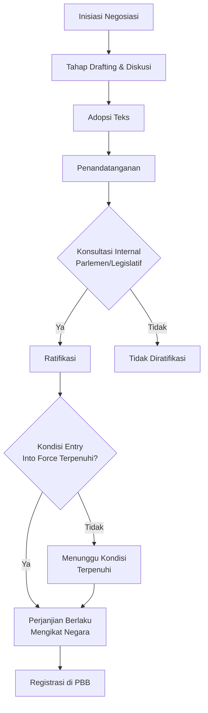
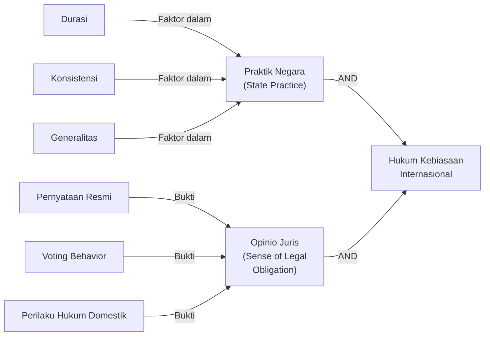
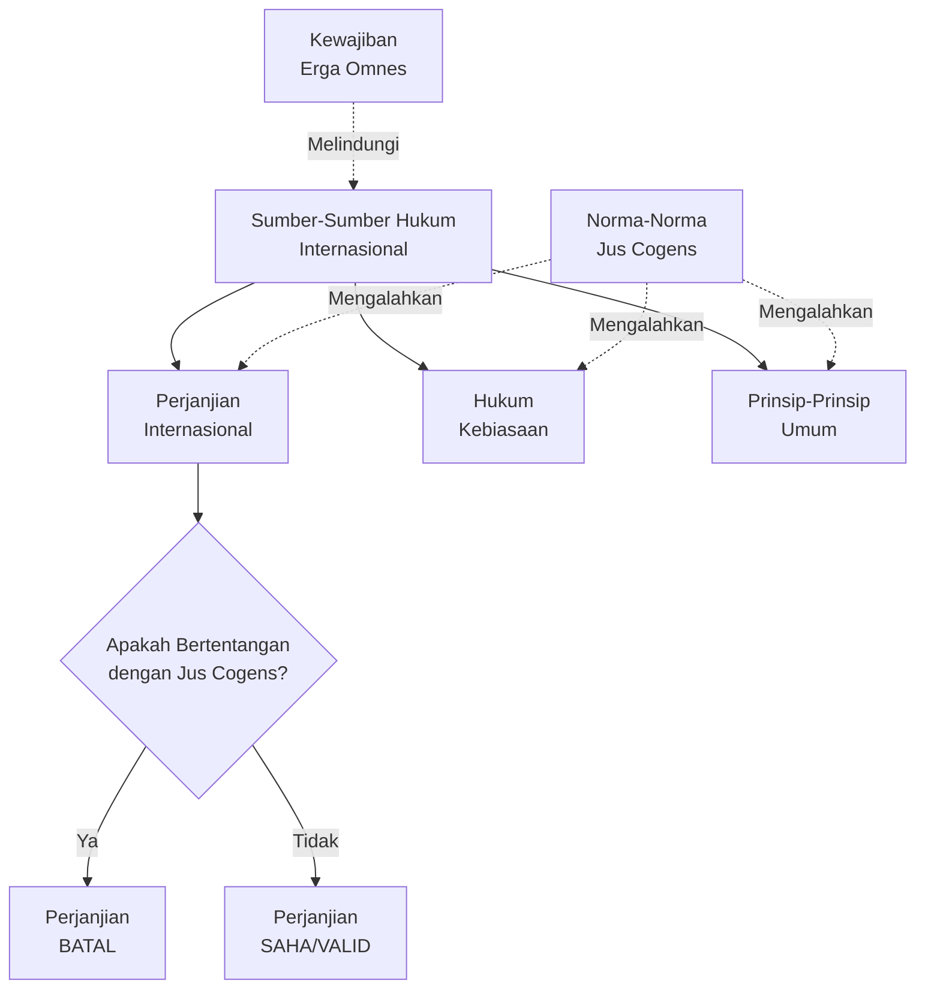

# Sumber-Sumber Hukum Internasional

Sumber hukum internasional merupakan fondasi esensial dalam memahami keberlakuan dan otoritas norma-norma hukum pada tingkat internasional. Pertanyaan mendasar dalam setiap sistem hukum adalah: dari mana kewenangan hukum itu berasal? Bagaimana suatu norma dianggap mengikat negara-negara? Pertanyaan-pertanyaan ini memerlukan kejelasan tentang apa yang dianggap sebagai sumber hukum internasional yang sah dan pengakuan.

Tidak seperti sistem hukum nasional yang memiliki struktur hierarkis jelas dengan badan legislatif pusat, hukum internasional berkembang melalui mekanisme yang lebih desentralisasi dan plural. Negara-negara sebagai subjek utama hukum internasional menciptakan norma-norma melalui berbagai cara: perjanjian bilateral dan multilateral, praktik negara yang konsisten, prinsip-prinsip umum yang diakui, dan keputusan pengadilan internasional. Pemahaman mendalam tentang sumber-sumber ini penting bagi praktisi hukum, diplomat, akademikus, dan pejabat pemerintah yang menangani isu-isu internasional.

## Tujuan Pembelajaran

Setelah mempelajari bab ini, mahasiswa diharapkan mampu:

1. **Menjelaskan** kerangka hukum yang diatur dalam Pasal 38(1) Statuta Mahkamah Internasional beserta sejarah dan konteks perumusannya.

2. **Menganalisis** perbedaan antara sumber-sumber formal dan material dalam hukum internasional serta implikasinya terhadap validitas norma hukum.

3. **Menerapkan** ketentuan Konvensi Wina tentang Hukum Perjanjian Tahun 1969 (VCLT) dalam membaca, menginterpretasi, dan mengidentifikasi kekuatan mengikat perjanjian internasional.

4. **Mengevaluasi** elemen-elemen hukum kebiasaan internasional melalui analisis praktik negara dan opinio juris dalam konteks-konteks empiris yang konkret.

5. **Membedakan** antara prinsip-prinsip umum hukum yang bersumber dari sistem hukum domestik dengan prinsip-prinsip yang berkembang dalam praktik internasional.

6. **Mendeskripsikan** peran keputusan pengadilan dan ajaran para ahli sebagai alat pembantu dalam penetapan hukum internasional menurut Pasal 38(1)(d) Statuta ICJ.

7. **Mengidentifikasi** norma-norma imperatif (jus cogens) dan kewajiban erga omnes dalam konteks hierarki hukum internasional serta konsekuensi hukumnya.

8. **Membandingkan** antara hard law dan soft law serta menganalisis peranan soft law dalam perkembangan hukum internasional kontemporer.

9. **Menjelaskan** mekanisme ratifikasi dan transformasi perjanjian internasional ke dalam hukum nasional Indonesia berdasarkan Undang-Undang Nomor 24 Tahun 2000.

10. **Mengkritisi** tren-tren terkini dalam pengidentifikasian sumber-sumber hukum internasional dan relevansinya terhadap isu-isu global kontemporer.

---

## 1. Pasal 38(1) Statuta ICJ sebagai Kerangka Utama

### 1.1 Teks Pasal 38(1) dan Konteks Historisnya

Pasal 38(1) Statuta Mahkamah Internasional merupakan provision yang paling sering dirujuk dalam wacana hukum internasional untuk menentukan sumber-sumber hukum yang berlaku pada tingkat internasional. Teks Inggris berbunyi:

> **"The Court, whose function is to decide in accordance with international law such disputes as are submitted to it, shall apply: (a) international conventions, whether general or particular, establishing rules expressly recognised by the contesting states; (b) international custom, as evidence of a general practice accepted as law; (c) the general principles of law recognised by civilised nations; (d) subject to the provisions of Article 59, judicial decisions and the teachings of the most highly qualified publicists of the various nations, as subsidiary means for the determination of rules of law."**

Terjemahan bahasa Indonesia yang akurat:

> **"Mahkamah, yang fungsinya adalah memutus sesuai dengan hukum internasional atas sengketa-sengketa yang diserahkan kepadanya, harus menerapkan: (a) konvensi-konvensi internasional, baik umum maupun khusus, yang menetapkan kaidah-kaidah yang secara tegas diakui oleh negara-negara yang bersengketa; (b) kebiasaan internasional, sebagai bukti dari suatu praktik umum yang diterima sebagai hukum; (c) prinsip-prinsip umum hukum yang diakui oleh negara-negara beradab; (d) dengan tunduk pada ketentuan Pasal 59, keputusan-keputusan pengadilan dan ajaran para ahli hukum terkemuka dari berbagai negara, sebagai alat-alat pembantu untuk penetapan kaidah-kaidah hukum."**

Pasal ini berakar dari Pasal 38 Statuta Mahkamah Permanen Internasional (PCIJ) yang diadopsi tahun 1920. Proses drafting melibatkan pertimbangan mendalam tentang apa yang seharusnya menjadi sumber-sumber hukum yang mengikat negara-negara dalam sistem internasional yang masih berkembang pada masa itu. Para pembuat statuta menyadari bahwa sistem internasional tidak memiliki badan legislatif terpusat, sehingga perlu diidentifikasi mekanisme-mekanisme alternatif untuk menciptakan dan mempertahankan norma-norma hukum.

### 1.2 Perdebatan: Daftar Exhaustif atau Sekedar Indikasyon?

Salah satu pertanyaan fundamentalnya adalah apakah Pasal 38(1) mencantumkan sumber-sumber hukum secara exhaustif atau hanya bersifat indikasi saja. Mayoritas pandangan akademis menganggap bahwa Pasal 38(1) adalah enumerasi yang relatif exhaustif. Argumen ini didukung oleh:

- Sejarah drafting yang menunjukkan usaha deliberatif untuk mengidentifikasi mekanisme-mekanisme hukum utama yang tersedia bagi pengadilan internasional.
- Penggunaan frasa "The Court... shall apply" yang menunjukkan fungsi penetapan norma secara komprehensif.
- Pengalaman praktik ICJ selama lebih dari seratus tahun yang konsisten menggunakan keempat kategori tersebut.

Namun demikian, beberapa ahli seperti Antonio Cassese berpendapat bahwa daftar ini tidak sepenuhnya exhaustif dan dapat dikembangkan mengikuti perkembangan internasional. Kritik ini didasarkan pada:

- Berkembangnya bentuk-bentuk soft law yang tidak sepenuhnya termasuk dalam keempat kategori tersebut.
- Pengakuan terhadap resolusi Majelis Umum PBB yang dapat mencerminkan konsensus internasional.
- Keputusan dari organisasi internasional yang semakin memainkan peran penting.

### 1.3 Sumber Formal versus Sumber Material

Dalam teori hukum, sering dibedakan antara sumber formal dan sumber material. **Sumber formal** merujuk pada proses dan mekanisme yang melaluinya norma-norma hukum terbentuk dan memperoleh otoritas mengikat. **Sumber material** merujuk pada isi atau substansi norma-norma tersebut, termasuk nilai-nilai, prinsip-prinsip, dan praktik-praktik yang mendasarinya.

Dalam konteks Pasal 38(1):

- **Sumber formal**: perjanjian internasional, kebiasaan internasional, prinsip-prinsip umum hukum, keputusan pengadilan, dan ajaran para ahli adalah mekanisme formal melalui mana hukum internasional terbentuk.
- **Sumber material**: kepentingan negara-negara, nilai-nilai moral dan keadilan, praktik sosial, dan kebiasaan adalah isi substantif yang membentuk norma-norma tersebut.

Pemahaman ini penting karena membantu menjelaskan mengapa Pasal 38(1) dirumuskan sedemikian rupa dan bagaimana norma-norma berkembang dalam praktik.

### 1.4 Pertanyaan Hierarki: Apakah Sumber-Sumber Tersebut Disusun Menurut Tingkat Kepentingan?

Persepsi umum adalah bahwa urutan pengaturan dalam Pasal 38(1)(a) hingga (d) menunjukkan urutan hierarki, dengan perjanjian internasional di posisi teratas, kemudian kebiasaan internasional, diikuti prinsip-prinsip umum, dan akhirnya keputusan pengadilan serta ajaran para ahli. Namun, interpretasi ini diperdebatkan dalam literatur internasional.

**Argumen Pro-Hierarki**:
- Urutan enumerasi dalam suatu dokumen sering mencerminkan prioritas atau kepentingan relatif.
- Dalam praktik, negara-negara memang sering mempertimbangkan perjanjian sebagai sumber yang paling definitif bagi hubungan bilateral atau multilateral mereka.
- Keputusan-keputusan ICJ dalam beberapa kasus menunjukkan preferensi terhadap teks perjanjian yang jelas.

**Argumen Anti-Hierarki**:
- Konteks Pasal 38(1) menunjukkan bahwa ICJ harus mempertimbangkan semua sumber yang relevan tanpa harus mengikuti urutan hierarki yang ketat.
- Dalam banyak kasus, kebiasaan internasional dapat mengungguli atau melengkapi perjanjian internasional.
- Keputusan ICJ sendiri tidak konsisten dalam menerapkan hierarki tersebut dan sering bergantung pada konteks kasus spesifik.

Pandangan yang lebih masuk akal adalah bahwa urutan dalam Pasal 38(1) mencerminkan urutan frekuensi penggunaan oleh pengadilan internasional, bukan hierarki normatif yang ketat. Pengadilan akan memilih sumber yang paling relevan dan dapat diandalkan untuk situasi hukum tertentu.

### 1.5 Tabel Perbandingan Sumber-Sumber Hukum Internasional

| Sumber Hukum | Definisi Singkat | Pembuat | Fleksibilitas | Dampak |
|---|---|---|---|---|
| **Perjanjian (Treaty)** | Perjanjian tertulis antara negara atau organisasi internasional | Negara-negara, organisasi internasional | Rendah (tekstual) | Sangat tinggi bagi pihak-pihak |
| **Kebiasaan Internasional** | Praktik negara yang konsisten dengan opinio juris | Praktik negara-negara | Tinggi (evolusioner) | Tinggi (mengikat semua negara) |
| **Prinsip-Prinsip Umum** | Asas-asas hukum yang diakui dalam sistem hukum nasional | Sistem hukum nasional + pengadilan | Sedang | Sedang (untuk mengisi kekosongan) |
| **Keputusan Pengadilan** | Putusan dari mahkamah internasional | Mahkamah internasional | Rendah | Sedang (de facto precedent) |
| **Ajaran Para Ahli** | Pendapat dari publicist terkemuka | Akademisi, praktisi | Sangat tinggi | Rendah (pertimbangan saja) |

---

## 2. Perjanjian Internasional (Treaties)

### 2.1 Definisi dan Kerangka Hukum: Konvensi Wina tentang Hukum Perjanjian 1969

Perjanjian internasional adalah instrumen hukum yang paling eksplisit dan paling sering digunakan dalam hubungan internasional. Definisi yang paling diakui secara universal ditemukan dalam Konvensi Wina tentang Hukum Perjanjian (Vienna Convention on the Law of Treaties) 1969, yang telah diratifikasi oleh sebagian besar negara di dunia.

Menurut Pasal 2(1)(a) VCLT 1969:

> **"Treaty means an international agreement concluded between States in written form and governed by international law, whether it is embodied in a single instrument or in two or more related instruments and whatever its particular designation."**

Definisi ini memiliki beberapa elemen penting:

1. **Agreement**: kesepakatan atau konsensus antara para pihak untuk terikat oleh istilah-istilah tertentu.
2. **International**: melibatkan subjek-subjek hukum internasional, khususnya negara-negara.
3. **Written form**: perjanjian harus terdokumentasikan dalam bentuk tertulis.
4. **Governed by international law**: perjanjian tersebut diatur oleh hukum internasional, bukan hukum domestik.
5. **Whatever its designation**: tidak peduli apa nama yang diberikan pada dokumen tersebut (treaty, convention, protocol, agreement, dll.), jika memenuhi kriteria tersebut, ia dianggap sebagai perjanjian internasional.

Dalam praktik, terdapat berbagai istilah yang digunakan untuk menunjuk perjanjian internasional:

- **Treaty** atau **Perjanjian**: Istilah umum untuk perjanjian internasional apapun.
- **Convention** atau **Konvensi**: Biasanya digunakan untuk perjanjian multilateral yang menciptakan standar atau kode perilaku bersama.
- **Protocol**: Sering digunakan untuk protokol tambahan (additional protocol) atau protokol amandemen.
- **Covenant** atau **Pakta**: Istilah yang biasa digunakan dalam instrumen hak asasi manusia.
- **Charter** atau **Piagam**: Digunakan untuk dokumen konstitusional organisasi internasional.
- **Agreement** atau **Perjanjian**: Istilah yang lebih spesifik atau informal, sering untuk perjanjian bilateral.

### 2.2 Jenis-Jenis Perjanjian Internasional

Perjanjian internasional dapat diklasifikasikan berdasarkan berbagai kriteria:

**Berdasarkan Jumlah Pihak:**

1. **Perjanjian Bilateral**: Perjanjian antara dua negara atau organisasi internasional. Contoh: Perjanjian Ekstradisi, Perjanjian Perdagangan Bilateral.

2. **Perjanjian Multilateral**: Perjanjian antara lebih dari dua negara atau organisasi internasional. Contoh: Konvensi Wina tentang Hukum Perjanjian, Konvensi Perserikatan Bangsa-Bangsa tentang Hukum Laut (UNCLOS).

3. **Perjanjian Plurilateral**: Perjanjian multilateral yang hanya terbuka untuk kelompok negara-negara tertentu yang memenuhi kriteria khusus. Contoh: Perjanjian Perdagangan Rupa-Rupa (Agreement on Trade in Civil Aircraft).

**Berdasarkan Tujuan:**

- **Perjanjian Teritori**: Menetapkan perbatasan, status tanah, atau hak atas wilayah tertentu.
- **Perjanjian Komersial**: Mengatur perdagangan, investasi, dan hubungan ekonomi.
- **Perjanjian Hak Asasi Manusia**: Melindungi hak-hak fundamental individu.
- **Perjanjian Lingkungan**: Melindungi dan melestarikan lingkungan global.
- **Perjanjian Keamanan**: Menyangkut pertahanan, disarmament, atau kontrol senjata.

### 2.3 Proses Pembuatan Perjanjian Internasional (Treaty-Making Process)

Proses pembuatan perjanjian internasional melewati beberapa tahap yang jelas dan terstruktur. Pemahaman terhadap tahapan ini penting karena setiap tahap memiliki implikasi hukum tertentu.

#### 2.3.1 Tahap Negosiasi

Tahap negosiasi adalah fase awal di mana delegasi-delegasi negara (atau organisasi internasional) berkumpul untuk membahas dan menegosiasikan istilah-istilah perjanjian. Tahap ini mencakup:

- **Inisiasi**: Salah satu atau lebih negara mengajukan proposal untuk membentuk perjanjian baru tentang topik tertentu.
- **Drafting**: Para negosiator membahas dan merancang teks perjanjian, termasuk ketentuan-ketentuan substantif dan prosedural.
- **Pembahasan**: Negosiator mengusulkan perubahan, memberikan penjelasan, dan berusaha mencapai konsensus.

Negosiasi dapat berlangsung selama berbulan-bulan atau bahkan bertahun-tahun, tergantung pada kompleksitas topik dan keberhasilan mencapai consensus.

#### 2.3.2 Adopsi (Adoption)

Setelah teks perjanjian dirancang dan disepakati, teks tersebut diadopsi oleh para pihak yang terlibat dalam negosiasi. Adopsi biasanya memerlukan suara mayoritas atau konsensus, tergantung pada aturan prosedur yang disepakati sebelumnya.

#### 2.3.3 Penandatanganan (Signature)

Penandatanganan adalah tindakan formal di mana perwakilan resmi negara atau organisasi internasional menandatangani dokumen perjanjian. Penandatanganan memiliki arti penting:

- Menunjukkan persetujuan awal terhadap istilah-istilah perjanjian.
- Membuka peluang bagi negara untuk mempertimbangkan apakah akan meratifikasi perjanjian.
- Dalam beberapa kasus, penandatanganan dapat menciptakan kewajiban sementara untuk tidak mengambil tindakan yang bertentangan dengan tujuan perjanjian (lihat Pasal 18 VCLT).

Penting untuk dicatat bahwa penandatanganan **bukan berarti kesepakatannya sudah mengikat secara hukum**. Negara dapat menandatangani sebuah perjanjian tetapi kemudian memilih untuk tidak meratifikasinya.

#### 2.3.4 Ratifikasi (Ratification)

Ratifikasi adalah tindakan formal di mana negara mengekspresikan persetujuannya untuk terikat oleh perjanjian internasional. Dalam sistem konstitusional banyak negara, ratifikasi memerlukan persetujuan dari badan legislatif nasional (parlemen, kongres, dll.). Proses ini penting karena:

- Memberikan kesepakatannya terikat secara hukum oleh perjanjian.
- Memungkinkan perjanjian untuk ditransformasikan atau diterapkan dalam hukum domestik.
- Dalam konteks Indonesia, ratifikasi dilakukan berdasarkan Undang-Undang Nomor 24 Tahun 2000 tentang Perjanjian Internasional.

#### 2.3.5 Masuk Berlaku (Entry Into Force)

Perjanjian baru menjadi mengikat (entry into force) ketika kondisi-kondisi yang ditetapkan dalam perjanjian itu sendiri terpenuhi. Kondisi-kondisi ini dapat meliputi:

- Sejumlah minimum negara harus meratifikasi atau mengaksesi perjanjian (misalnya, "perjanjian ini berlaku ketika 50 negara telah meratifikasinya").
- Pada tanggal yang ditentukan sebelumnya.
- Setelah pengajuan instrumen ratifikasi atau aksesi terakhir yang diperlukan.

Setelah perjanjian masuk berlaku, perjanjian tersebut menjadi mengikat bagi semua negara-negara yang telah meratifikasinya atau mengaksesinya (kecuali negara-negara yang melakukan reservasi).

#### 2.3.6 Registrasi (Registration)

Pasal 102 Piagam PBB mewajibkan setiap perjanjian yang dibuat oleh anggota PBB untuk didaftarkan dengan sekretariat PBB. Meskipun registrasi tidak membuat perjanjian mengikat, daftar perjanjian internasional ini memiliki nilai penting untuk transparansi dan dokumentasi dalam sistem internasional.

### 2.4 Diagram Proses Pembuatan Perjanjian Internasional

### 2.5 Reservasi terhadap Perjanjian Internasional (Articles 19-23 VCLT)

Reservasi adalah pernyataan sepihak yang dibuat oleh negara yang menandatangani atau meratifikasi perjanjian internasional dengan tujuan mengecualikan atau memodifikasi dampak hukum dari ketentuan-ketentuan perjanjian tertentu.

#### 2.5.1 Pengertian Reservasi

Pasal 2(1)(d) VCLT mendefinisikan reservasi sebagai:

> **"Reservation means a unilateral statement, however phrased or named, made by a State, when signing, ratifying, accepting, approving or acceding to a treaty, whereby it purports to exclude or to modify the legal effect of certain provisions of the treaty in their application to that State."**

Dengan kata lain, reservasi memungkinkan negara untuk:
- Tidak menerima seluruh perjanjian dengan status quo, tetapi hanya bagian-bagian tertentu.
- Menyesuaikan perjanjian dengan kebutuhan domestik atau pertimbangan hukum nasional.
- Tetap bergabung dengan perjanjian multilateral sambil mempertahankan fleksibilitas tertentu.

#### 2.5.2 Ketentuan Pasal 19 VCLT: Formulasi Reservasi

Pasal 19 VCLT memungkinkan negara untuk merumuskan reservasi, kecuali jika:

1. **Larangan dalam Perjanjian**: Perjanjian secara tegas melarang reservasi.
2. **Ketentuan Khusus**: Perjanjian hanya memperbolehkan jenis-jenis reservasi tertentu.
3. **Ketidaksesuaian dengan Tujuan dan Tujuan Perjanjian**: Reservasi tersebut tidak sesuai dengan objek dan tujuan perjanjian secara keseluruhan.

Kriteria ketiga ini paling kontroversial karena memerlukan penilaian subjektif tentang "tujuan dan tujuan" perjanjian.

#### 2.5.3 Penerimaan, Keberatan, dan Implikasi Hukum (Articles 20-23)

- **Penerimaan Reservasi**: Negara lain dapat secara eksplisit menerima reservasi atau membiarkan begitu saja tanpa keberatan.
- **Keberatan terhadap Reservasi**: Negara lain dapat mengajukan keberatan (objection) terhadap reservasi negara tertentu. Keberatan dapat mengakibatkan:
  - Perjanjian tidak berlaku antara negara yang merumuskan reservasi dan negara yang membuat keberatan (penghapusan total).
  - Perjanjian berlaku tetapi tanpa ketentuan yang direservasi (penghapusan parsial).
  
- **Dampak Hukum**: Reservasi yang diterima atau tidak keberatan akan menghasilkan dampak hukum bahwa negara tersebut tidak terikat oleh ketentuan yang direservasi, tetapi terikat oleh ketentuan-ketentuan lainnya.

### 2.6 Interpretasi Perjanjian Internasional (Articles 31-33 VCLT)

Pasal 31-33 VCLT menetapkan aturan-aturan kanonik untuk interpretasi perjanjian internasional. Interpretasi merupakan proses krusial karena perjanjian sering kali menggunakan bahasa yang ambigu atau terbuka terhadap berbagai interpretasi.

#### 2.6.1 Aturan Interpretasi Umum (Pasal 31)

**Pasal 31(1)**: "Perjanjian harus ditafsirkan dengan itikad baik menurut makna biasa (ordinary meaning) yang harus diberikan kepada istilah-istilah perjanjian dalam konteks mereka, dan dalam cahaya objek dan tujuan perjanjian."

Aturan ini terdiri dari beberapa elemen:

1. **Tafsir Itikad Baik**: Negara-negara harus menginterpretasi perjanjian dengan niat baik, bukan untuk mencari celah atau keuntungan yang tidak seharusnya.

2. **Makna Biasa dari Istilah**: Istilah-istilah dalam perjanjian harus dipahami menurut makna biasa (ordinary meaning), bukan makna teknis khusus atau idiosinkratik.

3. **Konteks**: Makna dari istilah-istilah harus dipahami dalam konteks keseluruhan perjanjian, termasuk:
   - Preambul
   - Lampiran (annex)
   - Perjanjian-perjanjian terkait yang disimpulkan pada waktu yang bersamaan
   - Instrumen-instrumen terkait yang dibuat dalam hubungan dengan perjanjian

4. **Objek dan Tujuan**: Interpretasi harus konsisten dengan objek dan tujuan perjanjian sebagaimana dinyatakan dalam preambul atau dapat disimpulkan dari konteks.

**Pasal 31(3)** menambahkan bahwa dalam interpretasi, harus juga diperhitungkan:

- **Perjanjian-perjanjian terkait yang kemudian disimpulkan**: Praktik-praktik berikutnya dalam penerapan perjanjian oleh para pihak.
- **Perjanjian yang disimpulkan dalam hubungan dengan perjanjian yang sama**: Instrumen-instrumen lain yang berkaitan dengan perjanjian utama.
- **Setiap hukum internasional yang relevan yang berlaku dalam hubungan antar pihak**: Konteks hukum internasional yang lebih luas.

#### 2.6.2 Alat-Alat Pelengkap Interpretasi (Pasal 32)

Pasal 32 VCLT memungkinkan penggunaan "alat-alat pelengkap interpretasi" (supplementary means of interpretation) untuk:

- Memastikan interpretasi yang konsisten dengan Pasal 31.
- Mengklarifikasi makna yang masih tidak jelas setelah menerapkan Pasal 31.
- Mengidentifikasi interpretasi yang akan menghasilkan hasil yang secara manifiesto absurd atau tidak masuk akal.

Alat-alat pelengkap ini mencakup:
- Persiapan perjanjian (travaux préparatoires), yaitu catatan-catatan negosiasi, protokol, dan dokumen-dokumen yang menunjukkan maksud para pembuat perjanjian.
- Keadaan-keadaan pada saat perjanjian disimpulkan.

#### 2.6.3 Aturan Interpretasi Khusus (Pasal 33): Perjanjian Multibahasa

Banyak perjanjian internasional dibuat dalam dua bahasa atau lebih dan semua versi dianggap autentik. Pasal 33 VCLT menetapkan:

- Jika makna dalam berbagai bahasa autentik sama, tidak ada masalah.
- Jika makna berbeda, maka harus dicari makna yang terbaik memenuhi objek dan tujuan perjanjian.
- Hanya dalam kasus-kasus ekstrem perbedaan tidak dapat diselesaikan, para pihak akan merundingkan makna yang dimaksud.

### 2.7 Keabsahan, Pemutusan, dan Penangguhan Perjanjian Internasional

#### 2.7.1 Keabsahan Perjanjian (Invalidity)

Perjanjian internasional dapat dinyatakan tidak sah jika:

1. **Tidak ada Kesepakatan Nyata**: Misalnya, negosiasi tidak dilakukan dengan itikad baik atau ada kecurangan dalam proses pembuatan perjanjian.

2. **Melanggar Jus Cogens**: Perjanjian yang bertentangan dengan norma-norma imperatif hukum internasional (seperti pembatalan pembunuhan, perbudakan, atau genosida) dapat dinyatakan tidak sah oleh Mahkamah Internasional.

3. **Kekeliruan (Mistake)**: Jika para pihak secara fundamental keliru tentang fakta atau hukum yang menjadi dasar perjanjian.

4. **Penipuan atau Korupsi**: Jika perjanjian diperoleh melalui penipuan atau pengaturan yang korup.

#### 2.7.2 Pemutusan Perjanjian (Termination)

Perjanjian internasional dapat diakhiri melalui:

1. **Pengaturan dalam Perjanjian Itu Sendiri**: Banyak perjanjian mencantumkan ketentuan tentang bagaimana perjanjian dapat diterminasi, sering kali dengan pemberitahuan terlebih dahulu (misalnya, 90 hari sebelum pemutusan berlaku).

2. **Kesepakatan Semua Pihak**: Semua negara yang pihak dalam perjanjian dapat setuju untuk mengakhiri perjanjian tersebut.

3. **Perubahan Keadaan Fundamental (Rebus Sic Stantibus)**: Lihat bagian di bawah ini.

4. **Pelanggaran Material**: Jika salah satu pihak melakukan pelanggaran material terhadap perjanjian, pihak lain dapat mengakhiri perjanjian atau menangguhkan pelaksanaannya.

#### 2.7.3 Penangguhan Perjanjian (Suspension)

Penangguhan berbeda dari pemutusan karena perjanjian tidak berakhir sepenuhnya, melainkan "tidur" sementara. Penangguhan dapat terjadi jika:

- Para pihak setuju untuk menangguhkan perjanjian sementara.
- Salah satu pihak menarik kembali dari perjanjian sementara karena alasan-alasan hukum internasional yang diakui.

### 2.8 Prinsip-Prinsip Fundamental dalam Hukum Perjanjian

#### 2.8.1 Pacta Sunt Servanda (Pasal 26 VCLT)

Prinsip ini adalah fondasi dari seluruh hukum perjanjian internasional. Pasal 26 VCLT menyatakan:

> **"Every treaty in force is binding upon the parties to it and must be performed by them in good faith."**

Prinsip ini berarti:
- Setiap perjanjian yang telah masuk berlaku mengikat negara-negara yang menjadi pihaknya.
- Negara-negara harus melaksanakan perjanjian dengan itikad baik.
- Negara tidak dapat menggunakan hukum domestik mereka sebagai alasan untuk tidak melaksanakan perjanjian internasional.

Dalam kasus Nicaragua v. United States (1986), Mahkamah Internasional menegaskan bahwa prinsip pacta sunt servanda adalah salah satu prinsip paling fundamental dalam hukum internasional.

#### 2.8.2 Pacta Tertiis Nec Nocent Nec Prosunt (Pasal 34 VCLT)

Prinsip ini menyatakan bahwa perjanjian tidak menciptakan kewajiban atau hak bagi negara-negara yang bukan pihak dalam perjanjian tersebut, kecuali para pihak dalam perjanjian secara tegas setuju untuk menciptakan kewajiban atau hak bagi negara ketiga.

Implikasinya:
- Perjanjian bilateral antara A dan B tidak mengikat negara C.
- Namun, perjanjian dapat menciptakan "kewajiban untuk pihak ketiga" (obligations for third parties) atau "hak untuk pihak ketiga" (rights for third parties) jika pihak-pihak asli secara tegas menyetujuinya.

#### 2.8.3 Rebus Sic Stantibus (Pasal 62 VCLT): Perubahan Keadaan Fundamental

Dalam kasus-kasus luar biasa, perjanjian dapat diakhiri atau ditangguhkan jika ada perubahan keadaan fundamental yang mendasari perjanjian tersebut. Namun, dokrin ini dibatasi dengan ketat oleh Pasal 62 VCLT:

**Syarat-Syaratnya:**

1. **Perubahan Harus Fundamental**: Perubahan keadaan harus mengubah sifat kewajiban-kewajiban yang masih perlu dipenuhi.

2. **Perubahan Harus Tidak Diantisipasi**: Para pihak tidak boleh telah memperhitungkan kemungkinan perubahan tersebut ketika membuat perjanjian.

3. **Perubahan Harus Terjadi Setelah Perjanjian Dibuat**: Keadaan yang ada pada saat negosiasi tidak dapat digunakan sebagai dasar.

4. **Negara Harus Telah Menerima Perubahan Secara Sukarela**: Negara yang mengklaim rebus sic stantibus tidak boleh secara material berkontribusi pada perubahan tersebut.

5. **Perjanjian Harus Bukan Perjanjian Penetapan Perbatasan**: Prinsip ini tidak berlaku untuk perjanjian yang menetapkan perbatasan antar negara.

**Contoh Historis:**

Rebus sic stantibus sering diajukan dalam kasus-kasus yang melibatkan perubahan-perubahan dramatik dalam kondisi ekonomi atau geografis. Misalnya, dalam Fisheries Jurisdiction Case (Inggris v. Islandia), kedua pihak mengemukakan bahwa perubahan kondisi stok ikan seharusnya memungkinkan renegosiasi perjanjian tentang akses perikanan.

### 2.9 Studi Kasus Perjanjian Internasional

#### 2.9.1 Konvensi Wina tentang Hukum Perjanjian 1969 (Vienna Convention on the Law of Treaties)

Konvensi Wina sendiri adalah contoh sempurna dari sebuah perjanjian internasional yang komprehensif. Dilakukan dalam konferensi internasional yang berlangsung dari 1968 hingga 1969, Konvensi Wina mencakup 85 pasal yang mengatur hampir setiap aspek pembuatan, interpretasi, dan pelaksanaan perjanjian internasional.

**Signifikansi:**
- Merupakan penyederhanaan dan kodifikasi dari praktik-praktik yang telah berkembang selama berabad-abad dalam hukum internasional.
- Telah diratifikasi oleh lebih dari 116 negara, menjadikannya salah satu perjanjian internasional yang paling luas diadopsi.
- Menyediakan kerangka hukum yang jelas untuk semua negosiasi perjanjian internasional sejak 1969.

#### 2.9.2 Konvensi Perserikatan Bangsa-Bangsa tentang Hukum Laut 1982 (UNCLOS)

UNCLOS adalah salah satu perjanjian multilateral terbesar yang pernah disimpulkan. Dirancang selama 9 tahun (1973-1982) dengan partisipasi lebih dari 150 negara, UNCLOS mencakup 320 pasal dan beberapa protokol tambahan.

**Konten Utama:**
- Mendefinisikan berbagai zona maritim (laut teritorial, zona ekonomi eksklusif, landas kontinen).
- Menetapkan hak dan kewajiban negara-negara dalam penggunaan laut.
- Menciptakan Tribunal Internasional untuk Hukum Laut (ITLOS) sebagai mekanisme penyelesaian sengketa.

**Aplikasi Praktis:**
- Menjadi kerangka hukum untuk semua aktivitas maritim global, dari eksplorasi sumber daya alam hingga perlindungan lingkungan laut.
- Indonesia, sebagai negara kepulauan, adalah salah satu negara yang paling diuntungkan oleh UNCLOS dan telah meratifikasinya.

#### 2.9.3 Statuta Roma 1998 (Rome Statute of the International Criminal Court)

Statuta Roma adalah perjanjian yang mendirikan Mahkamah Pidana Internasional (International Criminal Court, ICC). Dirancang untuk mengatasi kelemahan-kelemahan dalam mekanisme internasional untuk memproses kejahatan-kejahatan internasional yang paling serius (seperti genosida, kejahatan terhadap kemanusiaan, kejahatan perang, dan kejahatan agresi).

**Fitur Unik:**
- Menciptakan pengadilan internasional permanen dengan yurisdiksi universal (dalam kondisi-kondisi tertentu).
- Menawarkan perlindungan untuk kejadian-kejadian di negara-negara yang tidak memiliki sistem peradilan yang efektif atau independen.
- Telah menjadi salah satu instrumen hukum internasional paling kontroversial, dengan beberapa negara (termasuk AS, China, Russia) menolak untuk meratifikasinya.

---

## 3. Hukum Kebiasaan Internasional (Customary International Law)

Hukum kebiasaan internasional (customary international law) mewakili konseptualisasi praktik-praktik negara yang telah berlangsung lama dan diterima sebagai hukum. Tidak seperti perjanjian internasional yang selalu tertulis dan eksplisit, hukum kebiasaan bersifat implisit dan berkembang melalui waktu.

### 3.1 Dua Elemen Fundamental: Praktik Negara dan Opinio Juris

Pasal 38(1)(b) VCLT mendefinisikan hukum kebiasaan internasional sebagai "kebiasaan internasional, sebagai bukti dari suatu praktik umum yang diterima sebagai hukum." Definisi ini mengindikasikan bahwa hukum kebiasaan memerlukan dua elemen yang berbeda namun saling melengkapi:

1. **Praktik Negara (State Practice)**: Tindakan-tindakan nyata yang dilakukan oleh negara-negara dalam kapasitas mereka sebagai subjek hukum internasional.

2. **Opinio Juris (Sense of Legal Obligation)**: Keyakinan atau niat dari negara-negara bahwa mereka berkewajiban secara hukum untuk mengikuti praktik tersebut.

Kedua elemen ini harus hadir secara bersamaan. Praktik saja tanpa opinio juris adalah sekadar kebiasaan sosial, dan opinio juris tanpa praktik adalah sekadar aspirasi hukum.

### 3.2 Praktik Negara: Apa yang Dihitung?

**Durasi (Duration)**: Pertanyaan pertama adalah berapa lama praktik harus berlangsung agar dianggap sebagai "kebiasaan internasional." Pandangan tradisional menganggap bahwa praktik harus berlangsung selama "waktu yang lama" (long-standing practice), biasanya berkisar dari puluhan hingga ratusan tahun.

Namun, perkembangan modern dalam teknologi dan komunikasi internasional telah mengakibatkan pengakuan bahwa praktik dapat dianggap sebagai kebiasaan dalam waktu yang lebih singkat jika:
- Praktik tersebut konsisten dan masif.
- Diadopsi oleh mayoritas besar negara-negara.
- Tidak ditentang oleh negara-negara yang secara signifikan dipengaruhi oleh praktik tersebut.

**Konsistensi (Consistency)**: Praktik tidak perlu sempurna atau universal, tetapi harus cukup konsisten. Beberapa penyimpangan dari praktik umum tidak akan membuat praktik tersebut gagal untuk menjadi hukum kebiasaan, selama penyimpangan tersebut jarang dan dapat dijelaskan (misalnya, sebagai pembunuhan atau pemerkosaan melawan norma).

**Generalitas (Generality)**: Praktik harus cukup umum, yang berarti:
- Diikuti oleh sebagian besar negara-negara yang relevan secara geografis atau fungsional.
- Bukan hanya diikuti oleh kelompok negara-negara tertentu atau di wilayah geografis tertentu.

Namun, dalam kasus-kasus tertentu, praktik oleh negara-negara "khusus yang terkena dampak" (specially affected states) dapat membentuk hukum kebiasaan bahkan jika negara-negara lain tidak mengikutinya.

### 3.3 Opinio Juris: Mengidentifikasi Keyakinan tentang Kewajiban Hukum

Opinio juris adalah elemen yang paling sulit diidentifikasi karena bersifat subjektif dan tidak selalu diartikulasikan secara tegas. Metode-metode untuk mengidentifikasi opinio juris meliputi:

**Pernyataan Resmi (Official Statements):**
- Deklarasi resmi dari pemerintah tentang posisi hukum mereka.
- Pernyataan diplomatik dalam negosiasi internasional atau di hadapan pengadilan.
- Publikasi resmi dari departemen pemerintah tentang hukum internasional.

**Voting Behavior di Organisasi Internasional:**
- Cara negara-negara memilih dalam Majelis Umum PBB atau badan-badan internasional lainnya dapat mencerminkan opinio juris mereka.
- Misalnya, jika mayoritas besar negara memilih untuk mendukung resolusi yang menyatakan bahwa tindakan tertentu adalah pelanggaran hukum internasional, hal ini dapat menunjukkan opinio juris yang berkembang.

**Perilaku Hukum Domestik:**
- Bagaimana negara-negara mengintegrasikan praktik internasional ke dalam hukum domestik mereka.
- Pengakuan resmi dalam konstitusi atau hukum nasional bahwa praktik tertentu adalah kewajiban hukum.

**Perlakuan terhadap Negara Lain:**
- Bagaimana negara-negara merespons pelanggaran norma-norma internasional oleh negara-negara lain dapat menunjukkan opinio juris mereka.
- Protes diplomatik, tuntutan kompensasi, atau tindakan penghukuman terhadap negara lain yang melanggar norma menunjukkan bahwa negara tersebut menganggap norma sebagai kewajiban hukum.

### 3.4 Dokrin "Persistent Objector" (Keberatan Terus-Menerus)

Dokrin "persistent objector" adalah pengecualian penting terhadap pengaturan umum bahwa hukum kebiasaan internasional mengikat semua negara. Dokrin ini menyatakan bahwa negara yang secara terus-menerus dan konsisten membantah pembentukan norma kebiasaan selama periode ketika norma tersebut sedang terbentuk tidak akan terikat oleh norma tersebut setelah norma tersebut sepenuhnya terbentuk.

**Persyaratan:**

1. **Keberatan Harus Terus-Menerus**: Negara harus menunjukkan keberatan yang konsisten sejak saat praktik mulai berkembang.

2. **Keberatan Harus Jelas**: Keberatan tidak boleh tersirat atau samar-samar, melainkan harus diartikulasikan dengan jelas.

3. **Keberatan Harus Dilakukan oleh Negara yang "Relevan Secara Khusus"**: Negara yang membantah harus menjadi negara yang secara khusus terkena dampak oleh norma yang sedang berkembang.

**Contoh Historis:**

- **Praktek Asil (Slavery)**: Inggris menolak untuk mengakui norma kebiasaan tentang penghapusan perbudakan selama waktu yang lama, tetapi akhirnya keberatan ini tidak berfungsi karena norma itu menjadi terlalu kuat dan diterima secara universal.
- **Zona Ekonomi Eksklusif**: Beberapa negara awalnya menolak konsep zona ekonomi eksklusif (exclusive economic zone, EEZ) sebagai hukum kebiasaan, tetapi kemudian menerima konsep ini sebagai bagian dari UNCLOS.

### 3.5 Negara-Negara "Khusus yang Terkena Dampak" (Specially Affected States)

Dalam beberapa kasus, praktik oleh negara-negara yang secara khusus terkena dampak oleh situasi hukum tertentu dapat membentuk hukum kebiasaan bahkan jika negara-negara lain tidak mengikutinya. Misalnya:

- Dalam kasus North Sea Continental Shelf, Mahkamah Internasional mengakui bahwa praktik negara-negara pantai yang terkena dampak oleh penetapan landas kontinen dapat membentuk hukum kebiasaan tentang penetapan landas kontinentaltersebut.
- Dalam hukum maritim, praktik negara-negara pantai dapat membentuk hukum kebiasaan tentang hak-hak mereka di laut.

### 3.6 "Instant Custom" dan Perkembangan Modern Hukum Kebiasaan

Ahli hukum internasional Bin Cheng mengajukan teori "instant custom" pada 1950-an, yang mengemukakan bahwa hukum kebiasaan dapat terbentuk dengan cepat dalam beberapa tahun atau bahkan bulan jika terdapat praktik universal yang konsisten dan opinio juris yang kuat. Teori ini telah mempengaruhi cara pengadilan internasional mengidentifikasi hukum kebiasaan di era modern.

**Pendukung Teori Ini:**
- Menjelaskan pengakuan cepat dari norma-norma baru dalam era globalisasi dan komunikasi cepat.
- Sesuai dengan kenyataan bahwa negara-negara dapat dengan cepat mengadopsi norma-norma baru melalui organisasi internasional dan perjanjian multilateral.

**Kritikus:**
- Teori ini dapat mengecilkan pentingnya "praktik yang berlangsung lama" sebagai unsur kebiasaan internasional.
- Dapat menyebabkan pengidentifikasi prematurely dari norma-norma baru sebagai hukum kebiasaan sebelum mereka benar-benar diterima secara universal.

### 3.7 Konklusi Penyusunan ILC 2018 tentang Identifikasi Hukum Kebiasaan Internasional

Pada 2018, Komisi Hukum Internasional (International Law Commission, ILC) menyelesaikan "Draft Conclusions on the Identification of Customary International Law," yang merupakan perangkat aturan komprehensif untuk mengidentifikasi hukum kebiasaan. Dokumen ini mengakui:

- Pentingnya kedua elemen (praktik negara dan opinio juris).
- Fleksibilitas dalam menentukan durasi praktik (bukan harus "lama" dalam arti kaku).
- Peran organisasi internasional dalam mempercepat pembentukan hukum kebiasaan.
- Signifikansi perbedaan antara negara-negara yang terkena dampak khusus dan negara-negara lainnya.

### 3.8 Hubungan antara Perjanjian dan Hukum Kebiasaan

Perjanjian dan hukum kebiasaan tidak selalu berdiri terpisah. Hubungan mereka kompleks:

**Perjanjian Mengkodifikasi Hukum Kebiasaan:**
- Banyak perjanjian internasional dirancang untuk mengkodifikasi (menuliskan) norma-norma hukum kebiasaan yang telah berkembang. Contoh: Konvensi Wina tentang Hukum Perjanjian mengkodifikasi banyak norma kebiasaan tentang pembuatan dan interpretasi perjanjian.

**Perjanjian Mengembangkan Hukum Kebiasaan:**
- Ketika banyak negara meratifikasi perjanjian dan mempraktikkannya secara konsisten, perjanjian tersebut dapat menjadi dasar bagi pembentukan hukum kebiasaan baru yang mengikat bahkan negara-negara non-pihak.

**Perjanjian dapat Mereformasi Hukum Kebiasaan:**
- Perjanjian dapat secara eksplisit mengubah norma-norma kebiasaan yang telah ada sebelumnya, menciptakan hukum baru untuk pihak-pihaknya dan potentially untuk semua negara jika adopsi universal.

### 3.9 Studi Kasus: Hukum Kebiasaan Internasional

#### 3.9.1 Kasus North Sea Continental Shelf (1969)

**Latar Belakang:**
Kasus ini melibatkan Germany, Denmark, dan Belanda yang memperebutkan hak untuk mengeksplorasi dan mengeksploitasi landas kontinen di Laut Utara. Pertanyaan hukum utama adalah apakah ada norma kebiasaan tentang bagaimana batas-batas zona landas kontinen harus ditentukan.

**Putusan Mahkamah:**
Mahkamah Internasional memutuskan bahwa:
- Tidak ada hukum kebiasaan yang mewajibkan pembagian batas landas kontinen di antara negara-negara dengan pantai yang berhadapan.
- Sebaliknya, batas-batas harus ditentukan berdasarkan "prinsip ekuitabilitas" yang memperhitungkan semua keadaan yang relevan.
- Dalam mengidentifikasi prinsip kebiasaan ini, Mahkamah fokus pada praktik negara-negara "khusus yang terkena dampak" (specially affected states) oleh landas kontinentalissue.

**Signifikansi:**
- Menetapkan preseden bahwa norma kebiasaan dapat terbentuk dari praktik negara-negara yang khusus terkena dampak, tidak harus dari praktik universal semua negara.
- Mempengaruhi pengembangan UNCLOS dan konsep zona ekonomi eksklusif.

#### 3.9.2 Kasus Nicaragua v. United States (1986)

**Latar Belakang:**
Kasus ini melibatkan pengajuan Nicaragua ke Mahkamah Internasional untuk mencari perlindungan terhadap "Aktivitas Militer dan Paramiliter" yang didukung oleh Amerika Serikat, termasuk dukungan terhadap "contra" rebels.

**Isu Hukum Kebiasaan Utama:**
- Apakah ada hukum kebiasaan yang melarang dukungan terhadap kekuatan non-negara yang melakukan operasi militer di dalam negara lain?
- Apakah non-intervensi adalah norma kebiasaan yang mengikat?

**Putusan:**
Mahkamah menyimpulkan bahwa:
- Ada norma kebiasaan tentang non-intervensi dalam urusan domestik negara lain.
- Norma ini mencakup larangan terhadap dukungan militer terhadap kekuatan non-negara yang melakukan operasi militer di dalam negara lain.
- Amerika Serikat telah melanggar norma ini dengan mendukung "contra" rebels terhadap Pemerintah Sandinista Nicaragua.

**Signifikansi:**
- Mengakui bahwa norma-norma kebiasaan dapat terus berkembang dan diartikulasikan melalui keputusan pengadilan.
- Menunjukkan bahwa norma-norma kebiasaan dapat bersumber dari Piagam PBB dan praktik negara-negara sejak didirikan PBB.

#### 3.9.3 Kasus Lotus (Perlembagaan S.S. Lotus) (1927)

**Latar Belakang:**
Kasus ini adalah salah satu kasus paling awal dan paling terkenal tentang hukum kebiasaan internasional. Kasus ini melibatkan tabrakan antara dua kapal (Lotus dan Boz-Kourt) di Laut Tengah yang mengakibatkan kematian lima orang di kapal Boz-Kourt (kapal Turki). Perancis menangkap kapten Lotus dan menuntutnya di pengadilan Perancis, sementara Turki mengajukan keberatan.

**Isu Hukum Utama:**
- Apakah ada hukum kebiasaan internasional yang memberi yurisdiksi eksklusif kepada negara bendera dalam kasus-kasus tabrakan kapal di laut lepas?

**Putusan Mahkamah Permanen:**
Mahkamah memutuskan bahwa:
- Tidak ada norma kebiasaan internasional yang melarang Perancis untuk menjalankan yurisdiksi terhadap kapten Lotus.
- Dalam hal tidak ada norma kebiasaan yang tegas melarang suatu tindakan, negara-negara bebas untuk mengambil tindakan tersebut (prinsip yang dikenal sebagai "freedom of action").
- Namun, negara-negara harus menghormati batas-batas kewenangan mereka dalam hukum internasional.

**Signifikansi:**
- Menetapkan preseden bahwa hukum kebiasaan internasional dapat bersifat permisif (mengizinkan tindakan) maupun prohibitif (melarang tindakan).
- Menunjukkan pentingnya mengidentifikasi norma-norma negatif (apa yang dilarang) serta norma-norma positif (apa yang diperlukan).

#### 3.9.4 Kasus Asylum (Colombia v. Peru) (1950)

**Latar Belakang:**
Kasus ini melibatkan permintaan Peru untuk ekstradisi seorang politisi Peruvian, Victor Raúl Haya de la Torre, yang mencari suaka di kedutaan Colombia di Lima. Colombia bersikeras bahwa hak suaka adalah hukum kebiasaan yang mengikat Peru.

**Isu Hukum Utama:**
- Apakah ada hukum kebiasaan tentang hak negara untuk memberikan suaka di kedutaan mereka?
- Siapa yang berhak untuk menentukan kapan seseorang adalah "pengungsi politik" yang berhak atas suaka?

**Putusan:**
Mahkamah menyimpulkan bahwa:
- Colombia tidak dapat membuktikan adanya norma kebiasaan universal tentang hak untuk memberikan suaka.
- Meskipun praktik pemberian suaka ada di Amerika Latin, praktik ini tidak cukup luas untuk menjadi norma kebiasaan universal yang mengikat Peru.
- Oleh karena itu, Peru tidak berkewajiban menerima keputusan Colombia tentang status Haya de la Torre sebagai pengungsi politik.

**Signifikansi:**
- Menunjukkan bahwa norma kebiasaan harus cukup universal untuk mengikat negara-negara.
- Norma yang hanya berlaku di kawasan geografis tertentu mungkin tidak dianggap sebagai hukum kebiasaan universal.

### 3.10 Diagram Dua Elemen Hukum Kebiasaan Internasional

---

## 4. Prinsip-Prinsip Umum Hukum (General Principles of Law)

Prinsip-prinsip umum hukum merujuk pada prinsip-prinsip hukum yang umum diterima dalam sistem-sistem hukum nasional di seluruh dunia dan yang juga diterima dalam hukum internasional. Menurut Pasal 38(1)(c) Statuta ICJ, mahkamah dapat menerapkan "prinsip-prinsip umum hukum yang diakui oleh negara-negara beradab" dalam memutuskan sengketa.

### 4.1 Makna "Diakui oleh Negara-Negara Beradab"

Frasa "negara-negara beradab" (civilized nations) dalam Pasal 38(1)(c) mencerminkan bahasa abad ke-19 ketika Statuta PCIJ disusun. Dalam konteks modern, frasa ini dipahami sebagai merujuk pada semua negara-negara, tanpa diskriminasi berdasarkan tingkat pembangunan atau budaya. Penggunaan istilah ini dalam dokumen modern sering dipandang sebagai arkaik, dan beberapa proposal telah diajukan untuk menggantinya dengan frasa yang lebih inklusif seperti "negara-negara secara umum."

### 4.2 Contoh-Contoh Prinsip-Prinsip Umum Hukum

#### 4.2.1 Good Faith (Itikad Baik)

Itikad baik adalah prinsip fundamental dalam hampir semua sistem hukum nasional, dan juga merupakan prinsip fundamental dalam hukum internasional. Dalam konteks hukum perjanjian, Pasal 26 VCLT secara eksplisit menyatakan bahwa perjanjian harus dilaksanakan dengan itikad baik. Dalam konteks yang lebih luas, itikad baik adalah prinsip yang mengharuskan para pihak dalam hubungan hukum untuk memperlakukan satu sama lain dengan kejujuran dan integritas.

#### 4.2.2 Estoppel

Estoppel adalah doktrin hukum yang mencegah pihak dari menyanggah atau menyangkal pernyataan mereka sendiri yang telah dipercaya oleh pihak lain. Prinsip ini berlaku dalam hukum internasional: jika negara telah membuat pernyataan yang diciptakan harapan yang sah bagi negara lain, negara tersebut mungkin dilarang untuk kemudian menyangkal pernyataan itu.

#### 4.2.3 Res Judicata

Res judicata adalah prinsip yang menyatakan bahwa setelah pengadilan telah membuat keputusan final tentang suatu perkara, perkara yang sama tidak dapat diajukan kembali di hadapan pengadilan. Prinsip ini berlaku dalam hukum internasional: Pasal 59 Statuta ICJ menyatakan bahwa keputusan mahkamah hanya mengikat dalam perkara tertentu dan tidak menciptakan preseden yang mengikat.

#### 4.2.4 Unjust Enrichment (Pengayaan Tanpa Alasan)

Prinsip unjust enrichment melarang seorang atau pihak dari memperoleh keuntungan atau kekayaan dari tindakan-tindakan yang tidak adil atau melanggar hak pihak lain. Prinsip ini telah diakui dalam beberapa keputusan ICJ.

#### 4.2.5 Proportionality (Proporsionalitas)

Prinsip proporsionalitas mengharuskan bahwa tindakan-tindakan yang diambil oleh pemerintah atau lembaga internasional harus sebanding dengan tujuan yang mereka targetkan. Dalam hukum internasional, prinsip ini telah menjadi penting dalam konteks penggunaan kekuatan, hak asasi manusia, dan perlindungan lingkungan.

### 4.3 Peran Prinsip-Prinsip Umum dalam Mengisi Kekosongan Hukum

Salah satu fungsi utama dari prinsip-prinsip umum hukum adalah mengisi kekosongan (gaps) dalam hukum internasional. Ketika suatu isu tidak diatur oleh perjanjian internasional atau hukum kebiasaan, pengadilan dapat menerapkan prinsip-prinsip umum hukum untuk memutuskan perkara. Fungsi ini penting karena memastikan bahwa hukum internasional tidak meninggalkan pertanyaan-pertanyaan penting tanpa jawaban.

### 4.4 Perdebatan: Prinsip-Prinsip Umum Hukum Internasional vs. Prinsip-Prinsip dari Sistem Hukum Domestik

Pertanyaan fundamental adalah apakah prinsip-prinsip umum hukum mencakup:

1. **Prinsip-prinsip yang berasal dari sistem hukum nasional** (ekstraksi dari hukum domestik): Menurut pandangan ini, ICJ harus melihat sistem-sistem hukum nasional di seluruh dunia dan mengidentifikasi prinsip-prinsip yang umum diterima di antara mereka, kemudian menerapkan prinsip-prinsip tersebut dalam konteks hukum internasional.

2. **Prinsip-prinsip yang telah berkembang dalam praktik hukum internasional itu sendiri**: Menurut pandangan ini, prinsip-prinsip umum adalah prinsip-prinsip yang telah dikembangkan melalui praktik internasional jangka panjang dan keputusan-keputusan pengadilan internasional.

Mayoritas pengadilan internasional cenderung menggunakan pendekatan kombinasi: mereka melihat kepada sistem hukum nasional untuk inspirasi dan validasi, tetapi juga mengakui bahwa prinsip-prinsip hukum internasional dapat berkembang dengan cara mereka sendiri yang unik.

### 4.5 Contoh Kasus: Penerapan Prinsip-Prinsip Umum Hukum

#### 4.5.1 Chorzów Factory Case (Kasus Pabrik Chorzów) (1927)

Dalam kasus ini antara Jerman dan Polandia, Mahkamah Permanen mempertimbangkan apakah Polandia diwajibkan untuk mengembalikan pabrik (factory) yang telah disita kepada Jerman atau memberikan kompensasi finansial. Mahkamah menerapkan prinsip-prinsip umum hukum, khususnya prinsip bahwa pengambilan properti tanpa kompensasi yang adil adalah melanggar hukum.

#### 4.5.2 Barcelona Traction Case (1970)

Dalam kasus antara Belgia dan Spanyol, ICJ mempertimbangkan hak-hak pemegang saham (shareholders) dalam perusahaan yang telah bangkrut. Mahkamah menerapkan prinsip-prinsip yang umum diterima dalam hukum korporat nasional tentang perlindungan pemegang saham, sambil juga mengembangkan prinsip-prinsip baru yang spesifik untuk konteks hukum internasional.

#### 4.5.3 Corfu Channel Case (1949)

Dalam kasus antara Inggris dan Albania, Mahkamah menerapkan prinsip-prinsip umum hukum, termasuk prinsip bahwa negara berkewajiban untuk memperingatkan negara lain tentang bahaya di wilayah mereka (dalam kasus ini, ranjau laut yang belum diledakkan).

---

## 5. Keputusan Pengadilan dan Doktrin (Subsidiary Means)

Pasal 38(1)(d) Statuta ICJ menyebutkan "keputusan-keputusan pengadilan dan ajaran para ahli hukum terkemuka dari berbagai negara" sebagai "alat-alat pembantu untuk penetapan kaidah-kaidah hukum" (subsidiary means for the determination of rules of law). Istilah "alat-alat pembantu" menunjukkan bahwa sumber-sumber ini memiliki otoritas yang lebih rendah dibandingkan dengan perjanjian, kebiasaan, dan prinsip-prinsip umum.

### 5.1 Keputusan Pengadilan Internasional

#### 5.1.1 Otoritas Keputusan ICJ

Pasal 59 Statuta ICJ menyatakan dengan jelas:

> **"The decision of the Court has no binding force except between the parties and in respect of that case."**

Ini berarti bahwa keputusan ICJ tidak memiliki kekuatan preseden yang mengikat dalam arti formal. Setiap keputusan hanya mengikat para pihak dalam perkara tertentu dan tidak mengikat pengadilan dalam perkara-perkara berikutnya atau negara-negara yang tidak menjadi pihak dalam perkara asli.

#### 5.1.2 De Facto Precedent dalam Praktik

Meskipun Pasal 59 menyatakan bahwa keputusan ICJ tidak memiliki kekuatan preseden formal, dalam praktik, keputusan-keputusan ICJ memiliki pengaruh yang signifikan. Pengadilan dalam perkara-perkara berikutnya sering merujuk kepada keputusan-keputusan sebelumnya dan menganggapnya sebagai berwibawa (authoritative). Ini menciptakan de facto precedent, di mana keputusan sebelumnya tidak mengikat secara formal tetapi mempengaruhi keputusan-keputusan masa depan.

Alasan-alasan mengapa keputusan ICJ memiliki pengaruh de facto:

1. **Kewibawaan Pengadilan**: ICJ adalah pengadilan internasional tertinggi dengan hakim-hakim terkemuka dari berbagai negara, memberikan keputusannya otoritas moral dan intelektual.

2. **Konsistensi Hukum**: Negara-negara dan pengadilan internasional lainnya mengakui pentingnya konsistensi dalam penerapan hukum internasional. Keputusan sebelumnya yang konsisten membantu membangun kepercayaan dan stabilitas dalam sistem hukum internasional.

3. **Prediktabilitas**: Mengikuti keputusan-keputusan sebelumnya membantu membuat hukum internasional lebih dapat diprediksi, yang menguntungkan semua pihak.

#### 5.1.3 Opini Terpisah dan Opini Disiden (Separate and Dissenting Opinions)

Opini terpisah dan opini disiden yang ditulis oleh hakim individual dalam keputusan ICJ juga memiliki nilai. Meskipun tidak mengikat, opini-opini ini sering dikutip untuk:

- Mendukung argumen-argumen hukum tertentu.
- Mengantisipasi perkembangan hukum di masa depan.
- Menyediakan wawasan tentang perdebatan internal dalam pengadilan tentang isu-isu hukum.

Dalam beberapa kasus, opini dissenting dari pengadilan sebelumnya menjadi opini mayoritas dalam keputusan berikutnya, menunjukkan bahwa hukum internasional memang berkembang melalui waktu.

### 5.2 Keputusan Pengadilan Internasional Lainnya

Selain ICJ, terdapat berbagai pengadilan dan tribunal internasional lainnya yang keputusannya dapat berperan sebagai alat pembantu dalam penetapan hukum internasional:

1. **Tribunal Internasional untuk Hukum Laut (ITLOS)**: Keputusan-keputusan dari tribunal ini tentang penafsiran UNCLOS memiliki otoritas yang signifikan.

2. **Mahkamah Pidana Internasional (ICC)**: Keputusan-keputusan ICC tentang kejahatan internasional mempengaruhi perkembangan hukum pidana internasional.

3. **Pengadilan Hak Asasi Manusia Internasional**: Pengadilan-pengadilan regional seperti Pengadilan Hak Asasi Manusia Eropa dan Inter-American Court of Human Rights memiliki jurisprudensi yang kaya tentang hak asasi manusia.

4. **Arbitrase Internasional**: Keputusan-keputusan dari tribunal arbitrase internasional, terutama dalam kasus-kasus investasi, juga berkontribusi pada perkembangan hukum internasional.

### 5.3 Ajaran Para Ahli (Teachings of Publicists)

Ajaran para ahli hukum internasional terkemuka adalah sumber keempat yang disebutkan dalam Pasal 38(1)(d). Para ahli ini mencakup:

1. **Akademisi Hukum Internasional**: Profesor dan peneliti di universitas-universitas terkemuka yang telah menghabiskan karir mereka mempelajari dan menulis tentang hukum internasional.

2. **Praktisi Berpengalaman**: Diplomat, hakim internasional, dan praktisi hukum lainnya yang memiliki pengalaman langsung dalam penerapan hukum internasional.

3. **Organisasi-Organisasi Ahli**: Organisasi seperti Institut de Droit International dan Asosiasi Hukum Internasional yang membawa bersama para ahli terkemuka untuk membahas dan mengembangkan prinsip-prinsip hukum internasional.

#### 5.3.1 Komisi Hukum Internasional (ILC)

Komisi Hukum Internasional, didirikan oleh PBB pada 1947, memiliki peran khusus dalam mengembangkan hukum internasional. Meskipun ILC bukan pengadilan, keputusan-keputusan dan "draft articles" (rancangan artikel) yang dihasilkan oleh ILC memiliki pengaruh yang sangat besar. Banyak perjanjian internasional modern didasarkan pada draft articles dari ILC, dan keputusan-keputusan pengadilan internasional sering merujuk kepada pekerjaan ILC.

Contoh kontribusi ILC:
- Draft Articles on State Responsibility
- Draft Articles on the Law of Non-Navigational Uses of International Watercourses
- Draft Conclusions on the Identification of Customary International Law

#### 5.3.2 Institut de Droit International

Institut de Droit International adalah organisasi swasta yang didirikan pada 1873 dan terdiri dari para ahli hukum internasional terkemuka. Institut ini menerbitkan "resolutions" tentang berbagai topik hukum internasional yang sering dikutip oleh pengadilan internasional dan diplomat sebagai pernyataan otoritatif tentang hukum yang sedang berkembang.

### 5.4 Peran Pengadilan Nasional dalam Mengembangkan Hukum Internasional

Meskipun keputusan-keputusan pengadilan nasional bukan secara teknis "alat pembantu" yang direferensikan dalam Pasal 38(1)(d), keputusan-keputusan ini dapat berkontribusi pada perkembangan hukum internasional. Ketika pengadilan nasional di berbagai negara membuat keputusan-keputusan yang konsisten tentang masalah-masalah hukum internasional, keputusan-keputusan ini dapat menunjukkan pengembangan hukum kebiasaan atau prinsip-prinsip umum hukum.

Contoh: Pengadilan nasional di berbagai negara telah secara konsisten mengakui konsep "universal jurisdiction" (yurisdiksi universal) dalam kasus-kasus yang melibatkan kejahatan internasional yang paling serius, seperti kejahatan terhadap kemanusiaan. Pengakuan ini oleh pengadilan-pengadilan nasional telah berkontribusi pada pengembangan hukum internasional yang mendukung yurisdiksi universal dalam konteks-konteks tertentu.

---

## 6. Hierarki dan Norma-Norma Imperatif (Jus Cogens)

Salah satu perkembangan penting dalam hukum internasional modern adalah pengakuan bahwa tidak semua norma-norma internasional memiliki status hukum yang sama. Beberapa norma dianggap lebih fundamental dan memiliki status yang lebih tinggi daripada norma-norma lainnya.

### 6.1 Jus Cogens (Norma-Norma Imperatif)

Jus cogens, yang diterjemahkan sebagai "norma-norma imperatif" atau "norma-norma paksa," adalah norma-norma hukum internasional yang fundamental yang tidak dapat dikecualikan atau dimodifikasi oleh perjanjian internasional atau praktik negara. Dengan kata lain, jus cogens adalah "hukum yang tidak dapat dinegosiasikan."

#### 6.1.1 Definisi Hukum: Pasal 53 VCLT 1969

Pasal 53 VCLT 1969 mendefinisikan jus cogens sebagai:

> **"A norm accepted and recognised by the international community of States as a whole as a norm from which no derogation is permitted and which can be modified only by a subsequent norm of general international law having the same character."**

Definisi ini memiliki beberapa elemen penting:

1. **Diterima oleh Komunitas Internasional Secara Keseluruhan**: Norma harus diterima secara luas oleh komunitas negara-negara, bukan hanya oleh beberapa negara.

2. **Tidak Ada Pengecualian yang Diizinkan**: Tidak dapat ada derogasi (pengecualian) dari norma-norma ini.

3. **Hanya dapat Diubah oleh Norma yang Sama Karakternya**: Hanya norma jus cogens baru dapat mengubah norma jus cogens yang ada.

#### 6.1.2 Contoh-Contoh Jus Cogens

Meskipun VCLT tidak memberikan daftar lengkap norma-norma yang dianggap jus cogens, komunitas internasional secara luas mengakui beberapa norma sebagai jus cogens:

1. **Larangan Genosida**: Genosida, yang merupakan upaya sistematis untuk memusnahkan kelompok etnis, agama, atau nasional, adalah jus cogens yang jelas.

2. **Larangan Perbudakan**: Perbudakan modern dan perdagangan manusia dilarang oleh jus cogens.

3. **Larangan Penyiksaan**: Penyiksaan dan perlakuan kejam, tidak manusiawi, atau merendahkan martabat dilarang oleh norma jus cogens.

4. **Larangan Kejahatan Terhadap Kemanusiaan**: Kejahatan terhadap kemanusiaan, yang meliputi pembunuhan massal, pengusiran paksa, dan perkosaan sistematis, adalah jus cogens.

5. **Hak untuk Penentuan Nasib Sendiri (Self-Determination)**: Hak bangsa untuk menentukan nasib mereka sendiri dianggap sebagai norma jus cogens dalam konteks dekolonisasi dan pemerintahan.

6. **Larangan Agresi**: Penggunaan kekerasan bersenjata oleh satu negara terhadap negara lain tanpa pembenaran yang sah (pertahanan diri atau otorisasi Dewan Keamanan) dilarang oleh jus cogens.

7. **Hak Dasar Manusia**: Beberapa hak asasi manusia yang paling fundamental dianggap sebagai jus cogens, termasuk:
   - Hak untuk hidup
   - Hak untuk tidak disiksa
   - Hak untuk tidak perbudakan
   - Hak untuk pengakuan sebagai pribadi di hadapan hukum

#### 6.1.3 Implikasi Hukum dari Jus Cogens

Pengakuan bahwa suatu norma adalah jus cogens memiliki implikasi hukum yang signifikan:

1. **Pembatalan Perjanjian**: Menurut Pasal 53 VCLT, perjanjian yang pada saat penutupannya bertentangan dengan norma jus cogens adalah batal.

2. **Kewajiban Erga Omnes**: Norma-norma jus cogens sering terkait dengan "kewajiban erga omnes," yang merupakan kewajiban yang diakui oleh hukum internasional kepada komunitas internasional secara keseluruhan.

3. **Tanggung Jawab Negara**: Pelanggaran norma jus cogens dapat mengakibatkan tanggung jawab negara internasional, termasuk kewajiban untuk membayar kompensasi dan hukuman.

4. **Yurisdiksi Universal**: Negara-negara memiliki basis untuk menjalankan yurisdiksi universal terhadap pelanggar norma-norma jus cogens yang paling serius, seperti kejahatan perang dan kejahatan terhadap kemanusiaan.

### 6.2 Erga Omnes dan Kewajiban Erga Omnes Partes

Sementara jus cogens merujuk pada karakter norma-norma itu sendiri (sebagai norma yang tidak dapat dikecualikan), "erga omnes" merujuk pada pemilik (beneficiary) dari kewajiban-kewajiban tertentu: bukan hanya negara-negara pihak dalam perjanjian, melainkan komunitas internasional secara keseluruhan.

#### 6.2.1 Pengertian Kewajiban Erga Omnes

Mahkamah Internasional dalam kasus Barcelona Traction Light and Power Company (1970) mendefinisikan "obligations erga omnes" sebagai:

> **"Obligations of a State towards the international community as a whole."**

Ini berarti bahwa pelanggaran atas kewajiban tersebut bukan hanya masalah antara negara-negara pihak dalam perjanjian, tetapi adalah masalah yang menyangkut kepentingan komunitas internasional secara luas.

#### 6.2.2 Contoh-Contoh Erga Omnes

Kewajiban-kewajiban yang dianggap "erga omnes" termasuk:

- Kewajiban untuk tidak melakukan genosida
- Kewajiban untuk tidak melakukan kejahatan terhadap kemanusiaan
- Kewajiban untuk melindungi hak-hak dasar manusia
- Kewajiban untuk menghormati prinsip penentuan nasib sendiri

#### 6.2.3 Kewajiban "Erga Omnes Partes"

Istilah "erga omnes partes" merujuk pada kewajiban-kewajiban dalam perjanjian multilateral yang terutama tentang kepentingan umum. Meskipun secara teknis hanya negara-negara pihak yang terikat oleh kewajiban-kewajiban ini, karena perjanjian menyangkut isu-isu yang bersifat umum (seperti perlindungan lingkungan atau hak asasi manusia), semua negara pihak dapat dianggap memiliki kepentingan dalam pelaksanaan kewajiban-kewajiban tersebut.

### 6.3 Tabel Hierarki Norma-Norma Hukum Internasional

| Tingkat Hierarki | Jenis Norma | Contoh | Karakteristik |
|---|---|---|---|
| **Tertinggi** | **Jus Cogens** | Larangan genosida, perbudakan, penyiksaan | Tidak dapat dikecualikan, dapat mengubah perjanjian yang bertentangan |
| **Tinggi** | **Norma Erga Omnes** | Perlindungan HAM dasar, non-agresi | Melindungi kepentingan komunitas internasional, dapat diajukan oleh siapapun |
| **Menengah** | **Perjanjian Internasional** | Konvensi Wina, UNCLOS, Statuta Roma | Mengikat pihak-pihaknya, dapat dirancang ulang melalui amandemen |
| **Menengah** | **Hukum Kebiasaan** | Non-intervensi, droit du seigneur | Berkembang melalui praktik negara dan opinio juris |
| **Rendah** | **Prinsip-Prinsip Umum** | Itikad baik, res judicata, estoppel | Digunakan untuk mengisi kekosongan, berasal dari hukum nasional |
| **Terendah** | **Keputusan Pengadilan & Ajaran Ahli** | Yurisprudensi ICJ, karya Institut Droit | Alat pembantu, tidak mengikat secara formal |

### 6.4 Diagram: Hubungan antara Jus Cogens, Erga Omnes, dan Sumber-Sumber Lainnya

---

## 7. Soft Law dan Perannya dalam Perkembangan Hukum Internasional

Istilah "soft law" (hukum lembek) mengacu pada instrumen-instrumen hukum internasional yang tidak mengikat secara formal tetapi memiliki pengaruh normatif dan praktis yang signifikan. Meskipun soft law bukan "hukum" dalam arti teknis Pasal 38(1) VCLT, soft law memainkan peran penting dalam perkembangan hukum internasional kontemporer.

### 7.1 Definisi dan Karakteristik Soft Law

**Soft law** dapat didefinisikan sebagai instrumen-instrumen atau pernyataan-pernyataan internasional yang:

1. **Tidak Mengikat Secara Formal**: Instrumen-instrumen ini tidak menciptakan kewajiban hukum yang ketat dan dapat ditegakkan.

2. **Memiliki Otoritas Persuasif**: Meskipun tidak mengikat secara formal, instrumen-instrumen ini memiliki pengaruh persuasif yang nyata atas perilaku negara-negara dan aktor-aktor internasional lainnya.

3. **Fleksibel dan Dapat Diadaptasi**: Soft law dapat disesuaikan dengan perubahan keadaan dan kebutuhan tanpa memerlukan proses amandemen yang formal.

4. **Sering Bersifat Aspirasional**: Soft law sering mengungkapkan aspirasi atau nilai-nilai yang negara-negara ingin capai, bahkan jika mereka tidak langsung menerima kewajiban hukum yang ketat.

### 7.2 Jenis-Jenis Soft Law

#### 7.2.1 Resolusi Majelis Umum PBB

Resolusi Majelis Umum PBB adalah salah satu bentuk soft law yang paling penting dan paling sering digunakan. Meskipun secara teknis resolusi-resolusi ini hanya "rekomendasi" (berdasarkan Pasal 10 Piagam PBB), resolusi yang didukung oleh mayoritas besar negara-negara atau konsensus dapat mencerminkan opini internasional yang kuat dan dapat berkontribusi pada pembentukan opinio juris.

Contoh resolusi penting:
- Resolusi tentang "Permanent Sovereignty over Natural Resources"
- Resolusi tentang "Right to Development"
- Resolusi-resolusi tentang isu-isu lingkungan dan perubahan iklim

#### 7.2.2 Deklarasi Internasional

Deklarasi adalah dokumen-dokumen yang biasanya adopsi oleh konferensi internasional yang menyatakan komitmen negara-negara terhadap prinsip-prinsip tertentu. Deklarasi berbeda dari konvensi karena tidak disertai dengan mekanisme ratifikasi formal, meskipun beberapa deklarasi memiliki dampak yang signifikan secara faktual.

Contoh deklarasi penting:
- **Universal Declaration of Human Rights (1948)**: Meskipun secara teknis bukan perjanjian yang mengikat, UDHR telah menjadi dokumen yang paling berpengaruh dalam hukum internasional hak asasi manusia.
- **Rio Declaration on Environment and Development (1992)**: Menetapkan prinsip-prinsip pembangunan berkelanjutan.
- **Declaration on the Rights of Indigenous Peoples (2007)**: Mengakui hak-hak masyarakat adat.

#### 7.2.3 Panduan, Standar, dan Kode Etik

Banyak organisasi internasional dan badan-badan profesional telah mengembangkan panduan, standar, dan kode etik yang berfungsi sebagai soft law. Contoh:

- **ILO Conventions dan Recommendations**: Meskipun konvensi ILO mengikat, banyak rekomendasi dari ILO adalah soft law.
- **OECD Guidelines for Corporate Governance**: Memberikan standar untuk perilaku perusahaan multinasional.
- **Basel Committee Standards on Banking Regulation**: Menetapkan standar internasional untuk regulasi perbankan.

#### 7.2.4 Keputusan dan Perjanjian Organisasi Internasional

Keputusan-keputusan yang diambil oleh organisasi internasional seperti PBB, IMF, atau Organisasi Perdagangan Dunia (WTO) sering memiliki status soft law, meskipun beberapa keputusan tertentu (terutama dari Dewan Keamanan PBB) dapat mengikat.

### 7.3 Hubungan antara Soft Law dan Hard Law

Soft law dan hard law tidak sepenuhnya terpisah, tetapi seringkali saling melengkapi dan berkembang bersama:

1. **Soft Law sebagai Pendahulu Hard Law**: Soft law sering berfungsi sebagai "testing ground" untuk ide-ide baru dalam hukum internasional. Jika soft law mendapat penerimaan luas, hal itu dapat mengalihkan ke hard law melalui perjanjian formal atau pembentukan hukum kebiasaan. Contoh: prinsip-prinsip pembangunan berkelanjutan yang pertama kali muncul dalam soft law kemudian menjadi bagian dari perjanjian formal seperti Konvensi Kerangka Kerja PBB tentang Perubahan Iklim.

2. **Soft Law sebagai Pelengkap Hard Law**: Soft law dapat melengkapi perjanjian formal dengan memberikan pedoman praktis tentang bagaimana perjanjian harus diterapkan. Contoh: Protokol tentang Lingkungan untuk Protokol untuk Perjanjian Antartika mengandung hard law, tetapi juga dilengkapi dengan soft law dalam bentuk keputusan-keputusan sistem Antarctic Treaty.

3. **Hard Law yang Diciptakan oleh Soft Law**: Dalam beberapa kasus, soft law dapat menciptakan dasar bagi pembentukan hard law. Ketika resolusi Majelis Umum PBB didukung oleh mayoritas besar negara, resolusi tersebut dapat mencerminkan opinio juris yang sedang berkembang menuju pembentukan hard law kebiasaan.

### 7.4 Keuntungan dan Keterbatasan Soft Law

**Keuntungan:**

1. **Fleksibilitas**: Soft law dapat dengan mudah disesuaikan dengan perubahan keadaan tanpa memerlukan proses amandemen formal yang panjang.

2. **Partisipasi Luas**: Soft law sering dapat menerima partisipasi dari lebih banyak negara dan aktor-aktor non-negara dibandingkan dengan hard law formal.

3. **Inovasi**: Soft law memungkinkan eksperimen dengan ide-ide baru dan pendekatan-pendekatan baru tanpa komitmen hukum yang ketat.

4. **Kecepatan Adopsi**: Soft law dapat diadopsi dengan lebih cepat daripada perjanjian formal yang memerlukan negosiasi panjang dan ratifikasi legislatif.

**Keterbatasan:**

1. **Kurangnya Penegakan**: Soft law tidak dapat ditegakkan melalui mekanisme hukum internasional yang sama seperti hard law.

2. **Kepastian Hukum Rendah**: Karena soft law tidak mengikat secara formal, ada ketidakpastian tentang sejauh mana negara-negara akan mematuhi soft law tersebut.

3. **Potensi untuk Penyalahgunaan**: Negara-negara dapat menggunakan soft law secara selektif atau mengabaikannya ketika itu tidak sesuai dengan kepentingan mereka.

4. **Legitimasi yang Dipertanyakan**: Beberapa pihak berpendapat bahwa soft law yang tidak mengikat secara formal memiliki legitimasi yang lebih rendah dibandingkan dengan hard law yang diadopsi melalui proses formal.

### 7.5 Tabel: Soft Law vs. Hard Law

| Aspek | Soft Law | Hard Law |
|---|---|---|
| **Kekuatan Mengikat** | Persuasif, tidak mengikat | Mengikat dan dapat ditegakkan |
| **Fleksibilitas** | Tinggi, mudah diubah | Rendah, memerlukan amandemen formal |
| **Kecepatan Adopsi** | Cepat | Lambat (negosiasi panjang) |
| **Ruang Lingkup Peserta** | Luas, banyak aktor | Terbatas, terutama negara pihak |
| **Penegakan** | Kepercayaan dan reputasi | Melalui pengadilan dan mekanisme hukum |
| **Contoh** | Deklarasi, resolusi PBB | Perjanjian, konvensi, kebiasaan |

---

## 8. Praktik Indonesia: Ratifikasi dan Transformasi Perjanjian Internasional

Indonesia, sebagai negara kepulauan terbesar di dunia dengan populasi lebih dari 270 juta orang, memiliki praktik yang aktif dalam membuat dan meratifikasi perjanjian internasional. Pemahaman tentang bagaimana Indonesia menangani perjanjian internasional penting bagi siswa-siswa yang ingin memahami penerapan praktis dari hukum internasional di tingkat nasional.

### 8.1 Kerangka Konstitusional: Pasal 11 UUD 1945

Konstitusi Republik Indonesia, Undang-Undang Dasar Negara Republik Indonesia Tahun 1945 (disingkat UUD 1945), mengandung beberapa pasal yang mengatur kewenangan pemerintah dalam membuat dan meratifikasi perjanjian internasional:

**Pasal 11(1):**
> **"Presiden dengan persetujuan Dewan Perwakilan Rakyat menyatakan perang, membuat perdamaian, dan membuat perjanjian dengan negara lain."**

Pasal ini menunjukkan bahwa:
- **Presiden** adalah pihak yang secara formal membuat perjanjian internasional.
- **Dewan Perwakilan Rakyat (DPR)** harus memberikan persetujuan untuk perjanjian-perjanjian tertentu.

**Pasal 11(2):**
> **"Presiden dalam membuat perjanjian internasional lainnya yang menimbulkan akibat hukum yang luas dan mendasar bagi kehidupan rakyat yang menyangkut perubahan wilayah ataupun penetapan hukum baru memerlukan persetujuan Dewan Perwakilan Rakyat."**

Pasal ini menunjukkan kategori perjanjian yang memerlukan persetujuan DPR (perjanjian yang "menimbulkan akibat hukum yang luas dan mendasar").

**Pasal 11(3):**
> **"Ketentuan lebih lanjut tentang pembuatan dan pengesahan perjanjian internasional diatur dalam undang-undang."**

Pasal ini merujuk kepada undang-undang khusus yang mengatur prosedur pembuatan dan pengesahan perjanjian internasional.

### 8.2 Undang-Undang Nomor 24 Tahun 2000 tentang Perjanjian Internasional

Implementasi lebih lanjut dari Pasal 11 UUD 1945 dilakukan melalui Undang-Undang Nomor 24 Tahun 2000 tentang Perjanjian Internasional (disingkat UU 24/2000). UU ini mengatur prosedur pembuatan, pengesahan, dan transformasi perjanjian internasional di Indonesia.

#### 8.2.1 Tahap Persiapan dan Negosiasi

Menurut UU 24/2000, tahap awal dalam pembuatan perjanjian internasional meliputi:

1. **Inisiasi**: Departemen atau lembaga pemerintah yang berwenang mengidentifikasi kebutuhan untuk perjanjian internasional dan mengajukan proposal kepada pejabat yang tepat.

2. **Persiapan**: Persiapan naskah perjanjian melalui dialog dan negosiasi internal dengan departemen-departemen terkait.

3. **Negosiasi Internasional**: Tim Indonesia bernegosiasi dengan pihak lain (negara atau organisasi internasional) untuk menyepakati istilah-istilah perjanjian.

#### 8.2.2 Kategori Perjanjian: Pengesahan vs. Ratifikasi

UU 24/2000 membedakan antara dua kategori perjanjian:

**Kategori I - Perjanjian yang Memerlukan Ratifikasi DPR:**

Perjanjian-perjanjian tertentu memerlukan persetujuan DPR sebelum Presiden dapat meratifikasinya. Menurut Pasal 9 UU 24/2000, perjanjian yang memerlukan ratifikasi DPR adalah perjanjian yang:

- Menyangkut masalah-masalah pokok yang meliputi: (a) perdamaian, pertahanan, dan keamanan negara; (b) kemerdekaan dan tergantung ekonomi Indonesia; (c) pengubahan wilayah atau penetapan batas-batas wilayah Indonesia; (d) kewarganegaraan atau hak-hak individual; (e) pemberian iuran kepada organisasi internasional; (f) pinjaman dan utang luar negeri; (g) Pemajakan; (h) pemberian amnesti atau pembebasan; (i) pengaturan hak eksklusif yang menyangkut sumber daya alam.

- Memiliki konsekuensi hukum yang "luas dan mendasar" bagi masyarakat Indonesia.

**Kategori II - Perjanjian yang Dapat Diratifikasi oleh Presiden Saja:**

Perjanjian-perjanjian lain yang tidak masuk dalam Kategori I dapat diratifikasi oleh Presiden tanpa perlu persetujuan DPR. Perjanjian-perjanjian ini biasanya menyangkut masalah-masalah teknis atau operasional yang tidak memiliki implikasi politis yang signifikan.

#### 8.2.3 Proses Ratifikasi DPR

Untuk perjanjian Kategori I, proses ratifikasi meliputi:

1. **Pengajuan ke DPR**: Presiden mengajukan naskah perjanjian kepada DPR untuk persetujuan ratifikasi.

2. **Pembahasan di Komisi**: Naskah perjanjian dibahas dalam komisi DPR yang relevan.

3. **Persetujuan DPR**: DPR memberikan persetujuan (ratification permission) kepada Presiden jika DPR setuju dengan perjanjian tersebut.

4. **Pengesahan Presiden**: Setelah mendapat persetujuan DPR, Presiden mengesahkan perjanjian dengan menerbitkan instrumen ratifikasi.

5. **Pengiriman Instrumen Ratifikasi**: Indonesia mengirimkan instrumen ratifikasi kepada "depository" (negara yang ditunjuk untuk menyimpan instrumen ratifikasi) atau organisasi internasional yang bertanggung jawab atas perjanjian tersebut.

### 8.3 Transformasi Perjanjian ke dalam Hukum Nasional

Setelah perjanjian internasional diratifikasi, perjanjian tersebut harus ditransformasikan (diterapkan) dalam hukum nasional Indonesia. Transformasi ini dapat dilakukan melalui dua cara:

#### 8.3.1 Transformasi Adopsi (Adoption)

Dalam sistem "adoption," perjanjian internasional dianggap secara otomatis menjadi bagian dari hukum nasional tanpa perlu legislasi tambahan. Beberapa konstitusi (seperti Belanda dan Perancis) menggunakan sistem ini. Namun, Indonesia tidak secara penuh menggunakan sistem adoption murni.

#### 8.3.2 Transformasi Legislasi (Legislation)

Indonesia umumnya menggunakan sistem transformasi "legislation," di mana perjanjian internasional yang sudah diratifikasi harus diterjemahkan ke dalam undang-undang atau peraturan nasional yang spesifik. Proses ini meliputi:

1. **Penyiapan Rancangan Undang-Undang (RUU)**: Departemen terkait menyiapkan RUU yang mengimplementasikan ketentuan-ketentuan perjanjian internasional.

2. **Pembahasan di DPR**: RUU dibahas dalam DPR dan melalui proses legislatif normal.

3. **Pengesahan Presiden**: Presiden mengesahkan RUU menjadi undang-undang.

4. **Pendaftaran**: Undang-undang didaftarkan di Lembaran Negara Republik Indonesia.

### 8.4 Kewajiban Retensi dan Reservasi Indonesia

Indonesia, ketika meratifikasi perjanjian internasional, kadang-kadang membuat reservasi terhadap ketentuan-ketentuan tertentu yang dianggap tidak sesuai dengan hukum nasional atau kepentingan nasional.

Contoh-contoh reservasi Indonesia:

- **Konvensi Penghapusan Segala Bentuk Diskriminasi terhadap Perempuan (CEDAW)**: Indonesia membuat reservasi terhadap beberapa pasal yang dianggap bertentangan dengan Hukum Islam.

- **Konvensi Perserikatan Bangsa-Bangsa tentang Hukum Laut (UNCLOS)**: Indonesia membuat pernyataan penafsiran tentang konsep "archipelago" (negara kepulauan) yang berkaitan dengan status Indonesia sebagai negara kepulauan terbesar di dunia.

### 8.5 Tabel: Perjanjian Internasional Penting yang Diratifikasi Indonesia

| No. | Nama Perjanjian | Tahun Ratifikasi | Kategori | Status |
|---|---|---|---|---|
| 1 | Konvensi Perserikatan Bangsa-Bangsa tentang Hukum Laut (UNCLOS) | 1997 | Kategori I | Berlaku |
| 2 | Konvensi Penghapusan Segala Bentuk Diskriminasi Rasial (ICERD) | 1999 | Kategori I | Berlaku |
| 3 | Konvensi Penghapusan Segala Bentuk Diskriminasi terhadap Perempuan (CEDAW) | 1984 | Kategori I | Berlaku (dengan reservasi) |
| 4 | Konvensi Hak Anak (CRC) | 1990 | Kategori I | Berlaku |
| 5 | Konvensi Hak Penyandang Disabilitas (CRPD) | 2011 | Kategori I | Berlaku |
| 6 | Statuta Roma (International Criminal Court) | 2000 | Kategori I | Berlaku |
| 7 | Konvensi tentang Keanekaragaman Hayati | 1992 | Kategori I | Berlaku |
| 8 | Protokol Kyoto tentang Perubahan Iklim | 2004 | Kategori I | Berlaku |

### 8.6 Hubungan dengan Bab Lain

Indonesia's engagement dengan hukum internasional sangat erat terkait dengan konsep-konsep yang dijelaskan dalam bab-bab lain dari modul ini:

- Lihat [[01-Pengertian]] untuk memahami dasar-dasar hukum internasional dan mengapa negara-negara seperti Indonesia mengikat diri pada perjanjian internasional.

- Lihat [[03-Subjek]] untuk memahami bagaimana Indonesia, sebagai negara, memiliki kapasitas hukum untuk membuat perjanjian internasional dan berpartisipasi dalam hubungan-hubungan hukum internasional.

- Lihat [[04-HI-Nasional]] untuk memahami bagaimana perjanjian internasional yang diratifikasi Indonesia diintegrasikan ke dalam sistem hukum nasional Indonesia.

---

## 9. Pertanyaan Refleksi

1. **Hierarki Sumber-Sumber Hukum**: Pertimbangkan situasi di mana perjanjian internasional bertentangan dengan norma kebiasaan internasional. Bagaimana pengadilan internasional seharusnya memutuskan kasus semacam itu? Jelaskan dengan memberikan contoh kasus nyata.

2. **Hukum Kebiasaan Internasional**: Menggambarkan dua elemen (praktik negara dan opinio juris) diperlukan untuk membentuk hukum kebiasaan. Apakah teori "instant custom" oleh Bin Cheng dapat diterima secara luas? Jelaskan keuntungan dan kerugiannya.

3. **Soft Law**: Berikan tiga contoh soft law yang telah berkembang menjadi hard law, dan jelaskan bagaimana proses transformasi tersebut terjadi. Apakah soft law lebih efektif daripada hard law dalam konteks-konteks tertentu?

4. **Perjanjian Internasional**: Apakah reservasi terhadap perjanjian internasional merupakan cara yang efektif untuk menyesuaikan perjanjian dengan kebutuhan nasional, atau apakah reservasi tersebut mengancam konsistensi hukum internasional?

5. **Jus Cogens**: Identifikasi tiga norma yang Anda yakin adalah jus cogens dan jelaskan mengapa norma-norma tersebut memiliki status tertinggi dalam hierarki norma-norma internasional.

6. **Ratifikasi Indonesia**: Jelaskan perbedaan antara perjanjian Kategori I dan Kategori II dalam UU 24/2000. Apakah pembedaan ini masih relevan di era globalisasi di mana masalah-masalah teknis seringkali memiliki implikasi politis yang signifikan?

7. **Pengadilan Internasional**: Meskipun Pasal 59 Statuta ICJ menyatakan bahwa keputusan ICJ tidak memiliki kekuatan preseden yang mengikat, keputusan-keputusan tersebut memiliki pengaruh de facto yang signifikan. Bagaimana fenomena ini dapat dijelaskan?

8. **Prinsip-Prinsip Umum Hukum**: Bagaimana prinsip-prinsip yang berasal dari sistem hukum nasional dapat diterapkan dalam konteks hukum internasional yang berbeda secara fundamental?

9. **Kewajiban Erga Omnes**: Jelaskan bagaimana kewajiban erga omnes memperluas kapasitas negara lain untuk membawa kasus-kasus tertentu ke pengadilan internasional, bahkan jika negara tersebut bukan pihak yang langsung dirugikan.

10. **Validitas Perjanjian**: Menurut Pasal 53 VCLT, perjanjian yang bertentangan dengan jus cogens adalah batal. Bagaimana komunitas internasional dapat menentukan dengan pasti bahwa suatu perjanjian bertentangan dengan jus cogens, mengingat tidak ada daftar resmi norma-norma jus cogens?

---

## Daftar Pustaka

### Buku-Buku Referensi Utama:

1. **Shaw, Malcolm N.** (2021). *International Law* (9th edition). Cambridge University Press.
   - Buku teks komprehensif yang mencakup semua aspek hukum internasional dengan fokus pada sumber-sumber hukum.

2. **Crawford, James.** (2019). *Brownlie's Principles of Public International Law* (9th edition). Oxford University Press.
   - Karya klasik yang mendetail tentang hukum internasional publik dengan analisis mendalam tentang sumber-sumber hukum.

3. **Cassese, Antonio.** (2005). *International Law* (2nd edition). Oxford University Press.
   - Teks yang jelas dan terstruktur dengan perspektif kritis tentang hukum internasional.

4. **Villiger, Mark E.** (2009). *Commentary on the 1969 Vienna Convention on the Law of Treaties*. Martinus Nijhoff Publishers.
   - Referensi otoritatif tentang Konvensi Wina dengan analisis pasal demi pasal.

5. **Aust, Anthony.** (2013). *Modern Treaty Law and Practice* (3rd edition). Cambridge University Press.
   - Panduan praktis tentang pembuatan dan interpretasi perjanjian internasional.

### Literatur Indonesia:

6. **Mochtar Kusumaatmadja.** (2003). *Pengantar Hukum Internasional*. PT. Alumni.
   - Karya fondasi ahli hukum internasional Indonesia yang masih sangat relevan.

7. **Huala Adolf.** (2014). *Hukum Perjanjian Internasional*. Sinar Grafika.
   - Teks komprehensif tentang hukum perjanjian internasional dengan contoh-contoh Indonesia.

8. **Jawahir Thontowi dan Pranoto.** (2016). *Pengantar Hukum Internasional*. Refika Aditama.
   - Teks modern dengan fokus pada praktik Indonesia.

### Sumber-Sumber Khusus:

9. **International Court of Justice.** *Statute of the International Court of Justice*.
   - Dokumen resmi Statuta ICJ yang mengandung Pasal 38.

10. **United Nations.** (1969). *Vienna Convention on the Law of Treaties*.
    - Teks lengkap konvensi yang mengatur hukum perjanjian internasional.

11. **International Law Commission.** (2018). *Draft Conclusions on the Identification of Customary International Law*.
    - Dokumen modern yang mengatur identifikasi hukum kebiasaan internasional.

12. **Republic of Indonesia.** (2000). *Law Number 24 Year 2000 Concerning International Agreements*.
    - Undang-undang Indonesia yang mengatur prosedur perjanjian internasional.

### Jurnal dan Publikasi Akademis:

13. **Bin Cheng.** (1953). "General Principles of Law as Applied by International Courts and Tribunals." *British Year Book of International Law*, 30.
    - Artikel klasik tentang prinsip-prinsip umum hukum dan konsep "instant custom."

14. **D'Aspremont, Jean dan Forlati, Serena.** (2016). "Customary International Law as a Source of Law." *Procedural Aspects of International Law Series*.
    - Analisis modern tentang hukum kebiasaan internasional.

15. **Pauwelyn, Joost.** (2012). "The Role of Public International Law in the WTO: How Far Can We Go?" *The American Journal of International Law*, 95(2).
    - Diskusi tentang peran soft law dalam konteks perdagangan internasional.

### Sumber-Sumber Pengadilan:

16. **International Court of Justice.** *Case Reports and Advisory Opinions*.
    - Kumpulan lengkap keputusan-keputusan ICJ yang tersedia di website resmi ICJ (icj-cij.org).

17. **Permanent Court of International Justice.** *Lotus Case (1927)*.
    - Keputusan landmark tentang yurisdiksi internasional.

18. **International Court of Justice.** *North Sea Continental Shelf Cases (1969)*.
    - Keputusan penting tentang pembentukan hukum kebiasaan.

19. **International Court of Justice.** *Nicaragua v. United States (1986)*.
    - Keputusan komprehensif tentang hukum kebiasaan dan non-intervensi.

20. **International Court of Justice.** *Barcelona Traction Case (1970)*.
    - Keputusan penting tentang kewajiban erga omnes.

---

**Catatan Akhir:**

Materi pembelajaran ini dirancang untuk memberikan pemahaman komprehensif tentang sumber-sumber hukum internasional sebagaimana diatur dalam Pasal 38(1) Statuta ICJ. Sumber-sumber ini—perjanjian internasional, hukum kebiasaan, prinsip-prinsip umum hukum, dan alat-alat pembantu—membentuk fondasi dari seluruh sistem hukum internasional modern.

Pemahaman yang mendalam tentang sumber-sumber ini penting tidak hanya untuk akademisi dan praktisi hukum, tetapi juga untuk diplomat, pejabat pemerintah, dan siapa pun yang terlibat dalam hubungan-hubungan internasional. Di era globalisasi ini, di mana masalah-masalah lintas batas semakin kompleks dan saling tergantung, kemampuan untuk mengidentifikasi, menginterpretasi, dan menerapkan norma-norma hukum internasional adalah keterampilan yang sangat penting.

