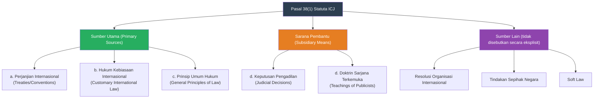
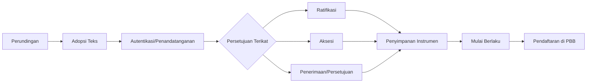
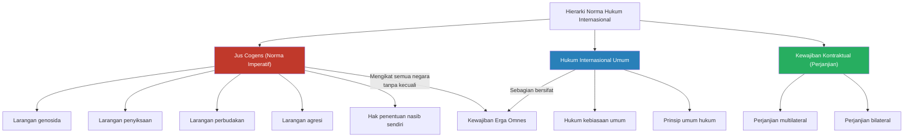

# Bab 2: Sumber Hukum Internasional

## Tujuan Pembelajaran

Setelah mempelajari bab ini, mahasiswa diharapkan mampu:

1. Menjelaskan kerangka sumber hukum internasional berdasarkan Pasal 38(1) Statuta Mahkamah Internasional (ICJ).
2. Menganalisis peran perjanjian internasional sebagai sumber hukum utama, termasuk proses pembentukannya.
3. Menguraikan unsur-unsur pembentuk hukum kebiasaan internasional: praktik negara dan *opinio juris*.
4. Memahami kedudukan prinsip umum hukum sebagai sumber hukum internasional.
5. Menjelaskan peran keputusan pengadilan dan doktrin sebagai sarana pembantu (*subsidiary means*).
6. Menganalisis hierarki sumber hukum internasional, termasuk konsep *jus cogens* dan kewajiban *erga omnes*.
7. Mengevaluasi peran *soft law* dalam perkembangan hukum internasional kontemporer.
8. Memberikan contoh penerapan sumber-sumber hukum internasional dalam kasus-kasus konkret.

---

## 2.1 Kerangka Pasal 38(1) Statuta ICJ

### 2.1.1 Teks Pasal 38(1)

Pasal 38(1) Statuta Mahkamah Internasional (*Statute of the International Court of Justice*) merupakan titik tolak utama dalam pembahasan sumber hukum internasional. Teks lengkapnya berbunyi:

> "1. The Court, whose function is to decide in accordance with international law such disputes as are submitted to it, shall apply:
>
> a. international conventions, whether general or particular, establishing rules expressly recognized by the contesting states;
>
> b. international custom, as evidence of a general practice accepted as law;
>
> c. the general principles of law recognized by civilized nations;
>
> d. subject to the provisions of Article 59, judicial decisions and the teachings of the most highly qualified publicists of the various nations, as subsidiary means for the determination of rules of law."

Dalam terjemahan Bahasa Indonesia:

> "1. Mahkamah, yang fungsinya adalah untuk memutus sesuai dengan hukum internasional sengketa-sengketa yang diajukan kepadanya, akan menerapkan:
>
> a. perjanjian internasional, baik umum maupun khusus, yang menetapkan aturan-aturan yang secara tegas diakui oleh negara-negara yang bersengketa;
>
> b. kebiasaan internasional, sebagai bukti adanya praktik umum yang diterima sebagai hukum;
>
> c. prinsip-prinsip umum hukum yang diakui oleh bangsa-bangsa beradab;
>
> d. dengan tunduk pada ketentuan Pasal 59, keputusan-keputusan pengadilan dan ajaran-ajaran para ahli hukum yang paling terkemuka dari berbagai bangsa, sebagai sarana pembantu untuk menentukan aturan hukum."

### 2.1.2 Status dan Fungsi Pasal 38(1)

Meskipun secara teknis Pasal 38(1) hanya menentukan hukum yang diterapkan oleh ICJ, ketentuan ini secara luas diterima sebagai pernyataan otoritatif tentang sumber-sumber hukum internasional. Ia merupakan warisan dari Pasal 38 Statuta Mahkamah Tetap Keadilan Internasional (PCIJ, 1920), yang disusun oleh Komite Penasihat Para Ahli Hukum (*Advisory Committee of Jurists*) pada tahun 1920.

Perlu dipahami beberapa catatan penting mengenai Pasal 38(1):

**Bukan daftar tertutup**: Meskipun Pasal 38(1) mendaftarkan sumber-sumber hukum internasional utama, daftar ini tidak bersifat tertutup (*exhaustive*). Terdapat sumber-sumber lain yang berperan penting dalam hukum internasional kontemporer, seperti resolusi organisasi internasional, tindakan sepihak negara (*unilateral acts*), dan *soft law*, yang tidak secara eksplisit disebutkan dalam Pasal 38(1).

**Pertanyaan tentang hierarki**: Terdapat perdebatan di kalangan sarjana tentang apakah urutan pencantuman dalam Pasal 38(1) mencerminkan suatu hierarki. Pandangan mayoritas adalah bahwa secara formal tidak ada hierarki di antara tiga sumber utama (perjanjian, kebiasaan, prinsip umum), meskipun dalam praktiknya pengadilan cenderung menerapkan perjanjian terlebih dahulu jika ada, kemudian hukum kebiasaan, dan terakhir prinsip umum.

**Frasa "bangsa-bangsa beradab"**: Frasa "*civilized nations*" dalam huruf (c) merupakan peninggalan dari era kolonial dan kini dianggap ketinggalan zaman. Secara umum dipahami bahwa frasa ini merujuk pada semua negara dalam masyarakat internasional, tanpa pembedaan berdasarkan tingkat "keberadaban."

---

## 2.2 Perjanjian Internasional (*Treaties*)

### 2.2.1 Pengertian dan Istilah

Perjanjian internasional (*treaty*) merupakan sumber hukum internasional yang paling jelas dan paling pasti. Konvensi Wina tentang Hukum Perjanjian (*Vienna Convention on the Law of Treaties*, 1969) — yang sering disebut sebagai "perjanjian tentang perjanjian" (*treaty on treaties*) — mendefinisikan perjanjian internasional sebagai:

> "*an international agreement concluded between States in written form and governed by international law, whether embodied in a single instrument or in two or more related instruments and whatever its particular designation*" (Pasal 2(1)(a)).

Perjanjian internasional dikenal dengan berbagai nama, meskipun secara hukum semuanya memiliki status yang sama. Beberapa istilah yang umum digunakan:

| Istilah | Penggunaan Umum | Contoh |
|---------|-----------------|--------|
| *Treaty* (Perjanjian) | Istilah umum; sering untuk perjanjian penting | Perjanjian Pelarangan Senjata Nuklir |
| *Convention* (Konvensi) | Perjanjian multilateral yang luas | Konvensi Jenewa 1949 |
| *Covenant* (Kovenan) | Perjanjian yang bersifat konstitusional | Kovenan Internasional Hak Sipil dan Politik |
| *Charter* (Piagam) | Perjanjian pendirian organisasi | Piagam PBB |
| *Protocol* (Protokol) | Perjanjian tambahan atas konvensi | Protokol Kyoto |
| *Agreement* (Persetujuan) | Perjanjian yang kurang formal | Persetujuan Paris 2015 |
| *Statute* (Statuta) | Perjanjian pendirian pengadilan/lembaga | Statuta Roma (ICC) |
| *Memorandum of Understanding* (MoU) | Sering digunakan untuk kesepakatan yang kurang formal | Berbagai MoU bilateral |
| *Exchange of Notes* | Kesepakatan melalui pertukaran nota diplomatik | Perjanjian bilateral sederhana |
| *Accord* (Akord) | Istilah yang kadang digunakan untuk penyelesaian | Akord Helsinki |
| *Pact* (Pakta) | Perjanjian aliansi atau komitmen khusus | Pakta Briand-Kellogg |
| *Declaration* (Deklarasi) | Kadang mengikat, kadang tidak | Deklarasi tentang Prinsip-Prinsip HI |

### 2.2.2 Jenis Perjanjian Internasional

Perjanjian internasional dapat diklasifikasikan berdasarkan beberapa kriteria:

**Berdasarkan jumlah pihak**:

*Perjanjian bilateral* melibatkan dua pihak saja. Perjanjian bilateral pada umumnya hanya mengikat kedua pihak dan mengatur hubungan khusus di antara mereka. Contoh: Perjanjian Bilateral Investasi antara Indonesia dan Jepang; Perjanjian Ekstradisi antara Indonesia dan Australia.

*Perjanjian multilateral* melibatkan tiga pihak atau lebih, dan sering kali terbuka untuk partisipasi dari banyak negara. Perjanjian multilateral berpotensi menciptakan aturan yang berlaku umum, terutama jika diikuti oleh sebagian besar negara di dunia. Contoh: Piagam PBB (193 negara anggota); UNCLOS (168 pihak per 2024); Konvensi Wina tentang Hukum Perjanjian (116 pihak).

**Berdasarkan sifat hukumnya**:

*Treaty-contract* (*traité-contrat*) adalah perjanjian yang menetapkan hak dan kewajiban khusus antara para pihak, mirip dengan kontrak dalam hukum perdata. Contoh: perjanjian perbatasan, perjanjian perdagangan bilateral.

*Law-making treaty* (*traité-loi*) adalah perjanjian yang menetapkan aturan umum yang berlaku bagi semua pihak dan dimaksudkan untuk mengkodifikasi atau mengembangkan hukum internasional. Contoh: Konvensi Jenewa tentang Hukum Humaniter; Konvensi Wina tentang Hubungan Diplomatik (1961).

Pembedaan ini penting karena *law-making treaties* dapat berkontribusi pada pembentukan hukum kebiasaan internasional bahkan bagi negara yang bukan pihak pada perjanjian tersebut, sebagaimana ditegaskan oleh ICJ dalam kasus *North Sea Continental Shelf* (1969).

### 2.2.3 Proses Pembentukan Perjanjian Internasional

Konvensi Wina 1969 mengatur secara terperinci proses pembentukan perjanjian internasional. Proses ini umumnya mencakup beberapa tahap:

**Tahap 1: Perundingan (*Negotiation*)**

Perundingan merupakan tahap awal di mana para wakil negara bertemu untuk membahas dan menyusun rancangan teks perjanjian. Wakil negara harus memiliki surat kuasa penuh (*full powers*) yang dikeluarkan oleh otoritas yang berwenang. Namun, Konvensi Wina (Pasal 7(2)) menetapkan bahwa beberapa pejabat — kepala negara, kepala pemerintahan, dan menteri luar negeri — dianggap secara *ex officio* mewakili negaranya tanpa memerlukan surat kuasa penuh. Demikian pula, kepala misi diplomatik untuk perjanjian antara negara pengirim dan negara penerima, serta wakil negara yang diakreditasikan pada konferensi internasional atau organisasi internasional.

**Tahap 2: Adopsi Teks (*Adoption of the Text*)**

Setelah perundingan selesai, teks perjanjian diadopsi oleh para peserta. Untuk konferensi internasional, adopsi umumnya dilakukan melalui pemungutan suara dengan mayoritas dua pertiga (Pasal 9(2) Konvensi Wina), kecuali para peserta menyepakati aturan lain.

**Tahap 3: Autentikasi (*Authentication*)**

Autentikasi adalah prosedur untuk menetapkan teks akhir perjanjian sebagai otentik dan definitif. Ini biasanya dilakukan melalui penandatanganan, penandatanganan *ad referendum*, atau pembubuhan paraf (Pasal 10 Konvensi Wina).

**Tahap 4: Persetujuan untuk Terikat (*Consent to be Bound*)**

Persetujuan negara untuk terikat pada perjanjian dapat dinyatakan melalui berbagai cara (Pasal 11 Konvensi Wina), yang paling umum adalah:

*Penandatanganan* (*signature*): Untuk beberapa perjanjian, penandatanganan saja sudah cukup untuk mengikat negara. Namun, untuk sebagian besar perjanjian multilateral penting, penandatanganan hanya merupakan langkah awal yang kemudian harus diikuti oleh ratifikasi.

*Ratifikasi* (*ratification*): Merupakan tindakan formal di mana negara menyatakan persetujuannya untuk terikat pada perjanjian yang telah ditandatanganinya. Ratifikasi umumnya melibatkan proses internal sesuai dengan konstitusi masing-masing negara — di Indonesia, perjanjian internasional tertentu memerlukan persetujuan DPR (Pasal 11 UUD 1945).

*Aksesi* (*accession*): Merupakan cara bagi negara yang tidak ikut serta dalam perundingan atau penandatanganan untuk kemudian menyatakan keinginannya terikat pada perjanjian.

*Penerimaan* (*acceptance*) atau *persetujuan* (*approval*): Cara alternatif untuk menyatakan persetujuan terikat, yang pada dasarnya serupa dengan ratifikasi.

**Tahap 5: Mulai Berlaku (*Entry into Force*)**

Perjanjian mulai berlaku sesuai dengan ketentuan yang diatur dalam perjanjian itu sendiri. Banyak perjanjian multilateral mensyaratkan jumlah minimum ratifikasi sebelum perjanjian dapat mulai berlaku. Misalnya, Statuta Roma mensyaratkan 60 ratifikasi (yang tercapai pada tahun 2002); Perjanjian Paris tentang Perubahan Iklim mensyaratkan ratifikasi oleh setidaknya 55 negara yang mewakili setidaknya 55% emisi gas rumah kaca global.

**Tahap 6: Pendaftaran (*Registration*)**

Pasal 102 Piagam PBB mewajibkan setiap perjanjian yang dibuat oleh anggota PBB untuk didaftarkan pada Sekretariat PBB. Perjanjian yang tidak didaftarkan tidak dapat diajukan ke organ PBB mana pun. Ketentuan ini dimaksudkan untuk menghindari diplomasi rahasia yang dianggap sebagai salah satu penyebab Perang Dunia I.

### 2.2.4 Reservasi (*Reservations*)

Reservasi adalah pernyataan sepihak oleh suatu negara pada saat menandatangani, meratifikasi, menerima, menyetujui, atau melakukan aksesi terhadap perjanjian, yang bermaksud untuk mengesampingkan atau memodifikasi akibat hukum dari ketentuan tertentu dalam perjanjian tersebut dalam penerapannya terhadap negara itu (Pasal 2(1)(d) Konvensi Wina).

Reservasi merupakan salah satu aspek paling kompleks dalam hukum perjanjian. Ia mencerminkan ketegangan antara dua kepentingan yang saling bersaing: di satu sisi, keinginan untuk memperoleh partisipasi seluas mungkin dalam perjanjian multilateral; di sisi lain, kebutuhan untuk menjaga integritas dan tujuan perjanjian.

Aturan tentang reservasi dalam Konvensi Wina (Pasal 19-23) sangat dipengaruhi oleh *Advisory Opinion* ICJ dalam kasus *Reservations to the Convention on the Prevention and Punishment of the Crime of Genocide* (1951). Dalam nasihat hukum ini, ICJ menyatakan bahwa reservasi terhadap suatu konvensi multilateral diperbolehkan sepanjang tidak bertentangan dengan objek dan tujuan konvensi tersebut (*object and purpose test*).

Aturan umum Konvensi Wina tentang reservasi adalah sebagai berikut: reservasi dilarang jika perjanjian secara eksplisit melarangnya (Pasal 19(a)); reservasi dilarang jika perjanjian hanya mengizinkan reservasi tertentu dan reservasi yang dimaksud tidak termasuk di dalamnya (Pasal 19(b)); reservasi dilarang jika tidak sesuai dengan objek dan tujuan perjanjian (Pasal 19(c)).

Dalam praktiknya, banyak negara mengajukan reservasi terhadap perjanjian HAM internasional, yang menimbulkan kekhawatiran tentang sejauh mana reservasi dapat diterima terhadap perjanjian yang melindungi hak-hak fundamental individu. Komite HAM PBB, dalam Komentar Umum No. 24 (1994), menyatakan bahwa reservasi yang tidak sesuai dengan objek dan tujuan Kovenan Hak Sipil dan Politik adalah tidak sah (*invalid*) dan tidak berlaku — suatu pendekatan yang menimbulkan kontroversi karena menyiratkan bahwa negara tetap terikat oleh seluruh kovenan tanpa reservasi.

### 2.2.5 Interpretasi Perjanjian Internasional

Konvensi Wina menetapkan aturan interpretasi dalam Pasal 31-33, yang dianggap sebagai kodifikasi hukum kebiasaan internasional.

**Aturan umum interpretasi** (Pasal 31(1)): Perjanjian harus diinterpretasikan dengan iktikad baik (*good faith*), sesuai dengan arti biasa (*ordinary meaning*) dari istilah-istilah dalam konteksnya (*context*), dan dengan memperhatikan objek dan tujuan (*object and purpose*) perjanjian.

Aturan ini menggabungkan tiga pendekatan interpretasi: pendekatan tekstual (arti biasa dari istilah), pendekatan kontekstual (konteks perjanjian), dan pendekatan teleologis (objek dan tujuan). ICJ secara konsisten menerapkan pendekatan terpadu ini, sebagaimana terlihat dalam kasus *Territorial Dispute (Libyan Arab Jamahiriya/Chad)* (1994) dan *Oil Platforms (Iran v. United States)* (2003).

**Sarana interpretasi pelengkap** (Pasal 32): Travaux préparatoires (catatan persiapan perundingan) dan keadaan pada saat penutupan perjanjian dapat digunakan sebagai sarana pelengkap untuk mengonfirmasi interpretasi berdasarkan Pasal 31 atau jika interpretasi berdasarkan Pasal 31 menghasilkan makna yang ambigu, kabur, atau jelas tidak masuk akal.

**Perjanjian dalam berbagai bahasa** (Pasal 33): Jika perjanjian diautentikasi dalam dua bahasa atau lebih, teks dalam setiap bahasa memiliki kekuatan yang sama. Jika terdapat perbedaan, arti yang paling mendamaikan teks-teks tersebut — dengan memperhatikan objek dan tujuan perjanjian — yang harus digunakan.

### 2.2.6 Keberlakuan Perjanjian Internasional: *Pacta Sunt Servanda*

Prinsip *pacta sunt servanda* — bahwa perjanjian yang berlaku mengikat para pihak dan harus dilaksanakan dengan iktikad baik — merupakan prinsip paling fundamental dalam hukum perjanjian. Prinsip ini dikodifikasi dalam Pasal 26 Konvensi Wina dan dianggap sebagai norma hukum kebiasaan internasional.

Tanpa *pacta sunt servanda*, seluruh sistem hukum perjanjian akan runtuh karena tidak ada jaminan bahwa negara akan memenuhi kewajiban yang telah mereka ambil. ICJ dalam kasus *Nuclear Tests (Australia v. France)* (1974) menegaskan bahwa prinsip *pacta sunt servanda* juga berlaku untuk kewajiban yang timbul dari pernyataan sepihak negara.

### 2.2.7 Pengakhiran dan Penghentian Perjanjian

Konvensi Wina mengatur beberapa alasan untuk mengakhiri atau menghentikan sementara keberlakuan perjanjian:

**Sesuai ketentuan perjanjian**: Banyak perjanjian memuat ketentuan tentang jangka waktu, penarikan diri (*withdrawal*), atau pembubaran.

**Persetujuan para pihak**: Perjanjian dapat diakhiri kapan saja dengan persetujuan semua pihak.

**Pelanggaran material** (*material breach*, Pasal 60): Pelanggaran material oleh satu pihak memberikan hak kepada pihak lainnya untuk menangguhkan atau mengakhiri perjanjian.

**Ketidakmungkinan pelaksanaan** (*impossibility of performance*, Pasal 61): Jika pelaksanaan perjanjian menjadi tidak mungkin karena musnahnya objek yang esensial bagi pelaksanaan perjanjian.

**Perubahan fundamental keadaan** (*fundamental change of circumstances* atau *rebus sic stantibus*, Pasal 62): Perubahan keadaan yang fundamental dan tidak terduga yang mengubah secara radikal ruang lingkup kewajiban para pihak. Namun, doktrin ini diterapkan secara sangat ketat oleh ICJ — dalam kasus *Gabčíkovo-Nagymaros Project (Hungary/Slovakia)* (1997), ICJ menolak argumen Hongaria bahwa perubahan keadaan politik membenarkan penghentian perjanjian.

**Norma *jus cogens* baru** (Pasal 64): Jika muncul norma *jus cogens* baru yang bertentangan dengan perjanjian yang ada, perjanjian tersebut menjadi batal (*void*).

---

## 2.3 Hukum Kebiasaan Internasional (*Customary International Law*)

### 2.3.1 Pengertian

Hukum kebiasaan internasional merupakan sumber hukum internasional tertua dan tetap menjadi salah satu sumber terpenting. Menurut Pasal 38(1)(b) Statuta ICJ, kebiasaan internasional adalah "bukti adanya praktik umum yang diterima sebagai hukum" (*evidence of a general practice accepted as law*).

Pembentukan hukum kebiasaan internasional mensyaratkan adanya dua unsur: unsur material (*material element*), yaitu praktik negara yang umum dan konsisten (*state practice*); dan unsur psikologis (*psychological element*), yaitu keyakinan bahwa praktik tersebut dilakukan karena kewajiban hukum (*opinio juris sive necessitatis*, biasanya disingkat *opinio juris*).

Hukum kebiasaan internasional memiliki beberapa keunggulan dibandingkan perjanjian internasional. Ia bersifat mengikat secara universal (dengan pengecualian *persistent objector*), tidak seperti perjanjian yang hanya mengikat para pihaknya. Ia juga lebih fleksibel dan dapat berkembang secara bertahap sesuai dengan perubahan praktik negara. Namun, kelemahannya adalah ketidakpastian — sering kali sulit untuk menentukan dengan tepat kapan suatu praktik telah menjadi hukum kebiasaan dan apa isi pastinya.

### 2.3.2 Unsur Pertama: Praktik Negara (*State Practice*)

Praktik negara mencakup berbagai bentuk perilaku dan tindakan negara yang relevan untuk pembentukan hukum kebiasaan. Komisi Hukum Internasional PBB, dalam pekerjaannya tentang Identifikasi Hukum Kebiasaan Internasional (*Identification of Customary International Law*, 2018), mengidentifikasi berbagai bentuk praktik negara yang relevan, meliputi:

Tindakan diplomatik dan korespondensi; perilaku sehubungan dengan resolusi organisasi internasional; perilaku sehubungan dengan perjanjian internasional; tindakan eksekutif, termasuk dekrit dan kebijakan operasional; keputusan legislatif, termasuk undang-undang dan peraturan domestik; keputusan pengadilan nasional; pernyataan resmi atas nama negara, termasuk di forum internasional; dan publikasi resmi, seperti manual militer.

**Syarat-syarat praktik negara**:

*Generalitas* (*generality*): Praktik tidak harus universal — yaitu, tidak harus dilakukan oleh semua negara tanpa kecuali. Namun, ia harus cukup luas dan representatif. ICJ dalam kasus *North Sea Continental Shelf* (1969) menyatakan bahwa praktik harus "both extensive and virtually uniform" — luas dan pada dasarnya seragam. Partisipasi negara-negara yang kepentingannya terdampak secara khusus sangat penting.

*Konsistensi* (*consistency*): Praktik harus cukup konsisten, meskipun tidak harus sempurna. ICJ dalam kasus *Nicaragua v. United States* (1986) menyatakan bahwa tidak diperlukan kesesuaian yang sempurna (*perfect consistency*) antara praktik negara dan norma yang diklaim; yang penting adalah bahwa perilaku negara-negara pada umumnya konsisten dengan norma tersebut, dan bahwa pelanggaran diperlakukan sebagai pelanggaran terhadap aturan, bukan sebagai pengakuan atas aturan baru.

*Durasi* (*duration*): Tidak ada persyaratan waktu minimum yang pasti untuk pembentukan hukum kebiasaan. ICJ dalam kasus *North Sea Continental Shelf* mengakui kemungkinan pembentukan hukum kebiasaan dalam "waktu yang singkat" (*short period of time*) jika praktiknya cukup luas dan seragam. Konsep ini dikenal sebagai "kebiasaan instan" (*instant custom*), meskipun istilah ini kontroversial.

### 2.3.3 Unsur Kedua: *Opinio Juris*

*Opinio juris sive necessitatis* — keyakinan bahwa suatu praktik dilakukan karena kewajiban hukum — merupakan unsur yang membedakan hukum kebiasaan dari sekadar kebiasaan atau praktik umum yang tidak bersifat hukum.

ICJ dalam kasus *North Sea Continental Shelf* (1969) memberikan penjelasan klasik tentang *opinio juris*:

> "Not only must the acts concerned amount to a settled practice, but they must also be such, or be carried out in such a way, as to be evidence of a belief that this practice is rendered obligatory by the existence of a rule of law requiring it. The need for such a belief, i.e., the existence of a subjective element, is implicit in the very notion of the opinio juris sive necessitatis."

Dengan kata lain, praktik negara saja tidak cukup; negara harus melakukan praktik tersebut karena keyakinan bahwa mereka diwajibkan secara hukum untuk melakukannya.

**Bukti *opinio juris*** dapat ditemukan dalam berbagai sumber, antara lain: pernyataan resmi pemerintah yang menyatakan bahwa suatu praktik dilakukan karena kewajiban hukum; dukungan atau penolakan terhadap resolusi organisasi internasional yang relevan; posisi hukum yang diambil dalam sengketa internasional; *travaux préparatoires* perjanjian internasional; dan komentar atas rancangan pasal yang disiapkan oleh Komisi Hukum Internasional PBB.

Salah satu tantangan utama dalam pembuktian *opinio juris* adalah apa yang disebut sebagai "paradoks kebiasaan" (*chronological paradox*): bagaimana suatu praktik dapat dilakukan berdasarkan keyakinan akan kewajiban hukum, jika aturan hukum tersebut justru terbentuk melalui praktik itu sendiri? Dengan kata lain, bagaimana negara dapat percaya bahwa mereka diwajibkan oleh hukum untuk melakukan sesuatu ketika hukum tersebut belum ada?

Para sarjana memberikan berbagai jawaban terhadap paradoks ini. Beberapa berpendapat bahwa *opinio juris* tidak harus sudah ada sejak awal praktik dimulai, melainkan berkembang secara bertahap seiring dengan semakin mapannya praktik. Yang lain berpendapat bahwa yang diperlukan bukan keyakinan bahwa praktik sudah diwajibkan oleh hukum, melainkan keyakinan bahwa praktik tersebut seharusnya menjadi hukum.

### 2.3.4 Hubungan antara Perjanjian dan Hukum Kebiasaan

Hubungan antara perjanjian internasional dan hukum kebiasaan internasional bersifat kompleks dan saling memengaruhi. ICJ dalam kasus *North Sea Continental Shelf* (1969) mengidentifikasi tiga kemungkinan hubungan:

**Kodifikasi** (*codification*): Perjanjian mengkodifikasi norma hukum kebiasaan yang sudah ada sebelumnya. Dalam hal ini, norma tersebut mengikat baik berdasarkan perjanjian (bagi pihak-pihaknya) maupun berdasarkan hukum kebiasaan (bagi semua negara).

**Kristalisasi** (*crystallization*): Perjanjian mengkristalisasi norma hukum kebiasaan yang sedang dalam proses pembentukan. Adopsi perjanjian memberikan dorongan terakhir yang diperlukan untuk memantapkan norma tersebut sebagai hukum kebiasaan.

**Pembentukan** (*generation*): Perjanjian memulai proses pembentukan norma hukum kebiasaan baru. Setelah perjanjian diadopsi, praktik negara yang mengikuti perjanjian tersebut secara bertahap dapat membentuk norma kebiasaan baru yang mengikat bahkan negara yang bukan pihak pada perjanjian.

### 2.3.5 Doktrin *Persistent Objector*

Doktrin *persistent objector* menyatakan bahwa suatu negara yang secara konsisten dan terus-menerus menolak suatu norma hukum kebiasaan selama proses pembentukannya tidak terikat oleh norma tersebut. Doktrin ini mencerminkan sifat konsensual hukum internasional — bahwa pada prinsipnya, negara tidak dapat terikat oleh norma tanpa persetujuannya.

Syarat-syarat doktrin *persistent objector* meliputi: penolakan harus bersifat jelas dan eksplisit; penolakan harus konsisten dan berkelanjutan selama proses pembentukan norma kebiasaan; penolakan harus dimulai sejak tahap awal pembentukan norma — negara yang kemudian keberatan (*subsequent objector*) setelah norma kebiasaan terbentuk tidak dapat mengklaim status *persistent objector*.

Perlu dicatat bahwa doktrin *persistent objector* tidak berlaku terhadap norma *jus cogens*. Negara tidak dapat menghindarkan diri dari larangan genosida, penyiksaan, atau perbudakan dengan mengklaim status *persistent objector*.

### 2.3.6 Kebiasaan Regional dan Lokal

Selain hukum kebiasaan internasional yang bersifat umum (*general customary international law*), terdapat pula kebiasaan regional dan lokal yang hanya mengikat sekelompok negara tertentu atau bahkan hanya dua negara.

ICJ mengakui keberadaan kebiasaan regional dalam kasus *Asylum (Colombia v. Peru)* (1950), meskipun dalam kasus tersebut ICJ memutuskan bahwa Kolombia gagal membuktikan adanya kebiasaan regional Amerika Latin tentang suaka diplomatik yang mengikat Peru. ICJ menyatakan bahwa pihak yang mengklaim adanya kebiasaan regional harus membuktikan bahwa norma tersebut sudah mapan dan bahwa pihak lawan telah menerimanya.

Dalam kasus *Right of Passage over Indian Territory (Portugal v. India)* (1960), ICJ bahkan mengakui kemungkinan kebiasaan bilateral — yaitu kebiasaan yang hanya berlaku antara dua negara. ICJ memutuskan bahwa Portugal memiliki hak lintas atas wilayah India berdasarkan praktik yang sudah berlangsung lama antara kedua negara.

### 2.3.7 Kasus Penting: *North Sea Continental Shelf* (1969)

Kasus *North Sea Continental Shelf* (1969) merupakan salah satu putusan ICJ terpenting dalam hukum kebiasaan internasional. Sengketa ini melibatkan Jerman, Belanda, dan Denmark mengenai delimitasi landas kontinen di Laut Utara.

Belanda dan Denmark berargumen bahwa prinsip ekuidistansi (*equidistance principle*) yang terdapat dalam Pasal 6 Konvensi Landas Kontinen 1958 telah menjadi hukum kebiasaan internasional yang mengikat Jerman, meskipun Jerman bukan pihak pada konvensi tersebut.

ICJ menolak argumen ini. Mahkamah menyatakan bahwa agar suatu ketentuan perjanjian dapat dianggap telah menjadi hukum kebiasaan, diperlukan bukti bahwa:

Pertama, ketentuan tersebut harus bersifat "fundamentally norm-creating" — mampu membentuk norma umum. Pasal yang terlalu terperinci, teknis, atau mengandung terlalu banyak pengecualian mungkin tidak cocok untuk menjadi hukum kebiasaan.

Kedua, harus terdapat praktik negara yang luas dan pada dasarnya seragam (*extensive and virtually uniform*) yang konsisten dengan ketentuan tersebut, termasuk praktik dari negara-negara yang kepentingannya terdampak secara khusus (*specially affected states*).

Ketiga, praktik tersebut harus disertai *opinio juris* — yaitu, negara-negara harus melakukannya karena keyakinan akan kewajiban hukum, bukan semata-mata karena pertimbangan kepraktisan, kesopanan, atau kebiasaan.

### 2.3.8 Kasus Penting: *Nicaragua v. United States* (1986)

Kasus *Military and Paramilitary Activities in and against Nicaragua (Nicaragua v. United States)* (1986) merupakan putusan ICJ yang sangat penting untuk berbagai aspek hukum internasional, termasuk hukum kebiasaan.

Dalam kasus ini, AS berargumen bahwa setelah menarik penerimaan yurisdiksi wajib ICJ, Mahkamah tidak berwenang mengadili kasus berdasarkan perjanjian multilateral (termasuk Piagam PBB). ICJ merespons dengan memutuskan bahwa ia tetap dapat mengadili kasus berdasarkan hukum kebiasaan internasional, yang keberadaannya bersifat independen dari perjanjian.

ICJ menegaskan bahwa hukum kebiasaan internasional dan hukum perjanjian merupakan dua sistem yang berbeda dan independen, meskipun isinya mungkin identik. Norma yang sama dapat eksis secara paralel baik sebagai hukum kebiasaan maupun sebagai ketentuan perjanjian. Dengan demikian, larangan penggunaan kekerasan dalam Pasal 2(4) Piagam PBB juga merupakan norma hukum kebiasaan yang mengikat secara independen.

---

## 2.4 Prinsip Umum Hukum (*General Principles of Law*)

### 2.4.1 Pengertian dan Fungsi

Pasal 38(1)(c) Statuta ICJ menyebutkan "prinsip-prinsip umum hukum yang diakui oleh bangsa-bangsa beradab" sebagai sumber hukum internasional ketiga. Prinsip umum hukum berfungsi sebagai jaring pengaman (*safety net*) untuk mengisi kekosongan hukum (*lacunae*) yang tidak tercakup oleh perjanjian atau hukum kebiasaan.

Terdapat perdebatan mengenai asal-usul prinsip umum hukum. Pandangan mayoritas menyatakan bahwa prinsip umum hukum diekstraksi dari sistem hukum nasional negara-negara di dunia — yaitu prinsip-prinsip yang ditemukan secara umum dalam berbagai sistem hukum nasional dan kemudian ditransposisikan ke tingkat internasional. Pandangan lain menyatakan bahwa prinsip umum juga mencakup prinsip-prinsip yang berasal dari sistem hukum internasional itu sendiri.

### 2.4.2 Contoh Prinsip Umum Hukum

Beberapa prinsip umum hukum yang telah diterapkan oleh pengadilan internasional antara lain:

**Iktikad baik** (*good faith* / *bona fides*): Prinsip bahwa hak dan kewajiban harus dilaksanakan dengan jujur dan tanpa niat untuk menipu. Prinsip ini telah diterapkan secara luas oleh ICJ, termasuk dalam kasus *Nuclear Tests (Australia v. France)* (1974).

***Pacta sunt servanda***: Prinsip bahwa perjanjian yang berlaku mengikat para pihak dan harus dilaksanakan dengan iktikad baik. Meskipun juga merupakan norma hukum kebiasaan dan dikodifikasi dalam Konvensi Wina, *pacta sunt servanda* pada dasarnya merupakan prinsip umum hukum.

**Res judicata**: Prinsip bahwa putusan pengadilan yang telah berkekuatan hukum tetap (*final*) bersifat mengikat dan tidak dapat digugat kembali. ICJ menerapkan prinsip ini dalam kasus *Genocide (Bosnia v. Serbia)* (2007).

***Estoppel***: Prinsip bahwa suatu pihak yang telah membuat pernyataan atau menunjukkan perilaku tertentu tidak dapat kemudian mengambil posisi yang bertentangan jika pihak lain telah mengandalkan pernyataan atau perilaku tersebut. ICJ menerapkan prinsip ini dalam kasus *Temple of Preah Vihear (Cambodia v. Thailand)* (1962).

**Keadilan dan kepatutan** (*equity*): Prinsip bahwa hukum harus diterapkan secara adil dengan memperhatikan keadaan khusus setiap kasus. ICJ menggunakan pertimbangan keadilan dalam berbagai kasus delimitasi maritim.

***Nemo judex in causa sua***: Tidak seorang pun boleh menjadi hakim dalam perkaranya sendiri. Prinsip keadilan alami (*natural justice*) ini diterapkan dalam konteks prosedur pengadilan internasional.

**Kewajiban ganti rugi** (*reparation*): Prinsip bahwa pelanggaran kewajiban hukum internasional menimbulkan kewajiban untuk memberikan ganti rugi. PCIJ dalam kasus *Factory at Chorzów* (1928) menyatakan: "It is a principle of international law, and even a general conception of law, that any breach of an engagement involves an obligation to make reparation."

***Lex specialis derogat legi generali***: Hukum khusus mengesampingkan hukum umum. Prinsip ini sering digunakan untuk menyelesaikan konflik antara berbagai aturan hukum internasional.

### 2.4.3 Prinsip Umum dalam Praktik

Dalam praktiknya, pengadilan internasional relatif jarang merujuk secara eksplisit pada prinsip umum hukum sebagai sumber hukum yang berdiri sendiri. Lebih sering, prinsip umum digunakan untuk mendukung interpretasi perjanjian atau hukum kebiasaan, untuk mengisi kekosongan prosedural, atau sebagai dasar penalaran hukum. Namun, peran prinsip umum tetap penting, terutama dalam bidang-bidang di mana perjanjian dan kebiasaan internasional belum berkembang sepenuhnya.

---

## 2.5 Sarana Pembantu (*Subsidiary Means*)

### 2.5.1 Keputusan Pengadilan

Pasal 38(1)(d) Statuta ICJ menyebutkan keputusan pengadilan (*judicial decisions*) sebagai "sarana pembantu untuk menentukan aturan hukum" (*subsidiary means for the determination of rules of law*). Dengan kata lain, keputusan pengadilan bukan merupakan sumber hukum internasional yang mandiri, melainkan berfungsi sebagai bukti untuk menentukan isi hukum yang berlaku.

Lebih lanjut, Pasal 59 Statuta ICJ menyatakan bahwa keputusan Mahkamah hanya mengikat para pihak dan hanya dalam kasus yang diputus. Tidak ada doktrin preseden (*stare decisis*) yang mengikat dalam hukum internasional, berbeda dengan sistem *common law*.

Meskipun demikian, dalam praktiknya keputusan pengadilan internasional — terutama ICJ — memiliki pengaruh yang sangat besar dalam perkembangan hukum internasional. ICJ secara rutin merujuk pada putusan-putusan sebelumnya dan berupaya menjaga konsistensi yurisprudensinya. Para sarjana, praktisi, dan pengadilan nasional juga mengutip putusan ICJ sebagai otoritas persuasif.

Selain putusan ICJ, keputusan pengadilan dan tribunal internasional lainnya juga berpengaruh, termasuk putusan Tribunal Hukum Laut Internasional (*International Tribunal for the Law of the Sea*/ITLOS), putusan tribunal pidana internasional (ICTY, ICTR, ICC), putusan badan penyelesaian sengketa WTO, dan putusan tribunal arbitrase investasi internasional (seperti tribunal ICSID).

Keputusan pengadilan nasional juga dapat berfungsi sebagai bukti praktik negara dan *opinio juris* dalam pembentukan hukum kebiasaan internasional, atau sebagai bukti keberadaan prinsip umum hukum.

### 2.5.2 Doktrin Sarjana Terkemuka

Pasal 38(1)(d) juga menyebutkan "ajaran-ajaran para ahli hukum yang paling terkemuka dari berbagai bangsa" (*teachings of the most highly qualified publicists of the various nations*) sebagai sarana pembantu. Dalam era modern, peran doktrin telah berkurang dibandingkan dengan abad-abad sebelumnya, ketika karya-karya Grotius, Vattel, dan lainnya memiliki otoritas yang sangat besar.

Namun, doktrin tetap memainkan peran penting dalam beberapa cara. Karya-karya akademis membantu mengidentifikasi dan mensistematisasi aturan hukum internasional. Mereka juga berfungsi dalam menganalisis praktik negara dan yurisprudensi untuk menentukan isi hukum kebiasaan. Selain itu, doktrin berperan dalam mengusulkan dan mendukung perkembangan hukum baru, serta memberikan kritik dan evaluasi terhadap hukum yang berlaku.

Selain karya individual, "doktrin kolektif" juga memainkan peran penting. Ini mencakup karya-karya yang dihasilkan oleh badan-badan seperti Komisi Hukum Internasional PBB (*International Law Commission*), Institut Hukum Internasional (*Institut de Droit International*), dan Asosiasi Hukum Internasional (*International Law Association*). Rancangan Pasal (*Draft Articles*) yang disiapkan oleh Komisi Hukum Internasional, misalnya, memiliki pengaruh yang sangat besar dalam perkembangan hukum internasional.

---

## 2.6 Hierarki Sumber Hukum: *Jus Cogens* dan Kewajiban *Erga Omnes*

### 2.6.1 Norma *Jus Cogens* (*Peremptory Norms*)

*Jus cogens* (norma imperatif atau norma pemaksa) merupakan konsep yang sangat penting dalam hukum internasional. Konvensi Wina tentang Hukum Perjanjian (Pasal 53) mendefinisikan norma *jus cogens* sebagai:

> "a norm accepted and recognized by the international community of States as a whole as a norm from which no derogation is permitted and which can be modified only by a subsequent norm of general international law having the same character."

Dalam Bahasa Indonesia: norma yang diterima dan diakui oleh masyarakat internasional negara-negara secara keseluruhan sebagai norma yang tidak boleh dilanggar dan yang hanya dapat dimodifikasi oleh norma hukum internasional umum yang memiliki karakter yang sama.

Ciri-ciri norma *jus cogens* meliputi: mengikat semua negara tanpa kecuali, tidak dapat dihapuskan atau dikurangi melalui perjanjian atau kebiasaan, perjanjian yang bertentangan dengan *jus cogens* batal demi hukum (*void*), dan hanya dapat diubah oleh norma *jus cogens* baru.

Meskipun terdapat kesepakatan umum tentang keberadaan *jus cogens*, daftar pasti norma-norma yang termasuk di dalamnya masih diperdebatkan. Komisi Hukum Internasional PBB, dalam pekerjaannya tentang *Peremptory Norms of General International Law (Jus Cogens)* (2022), mengidentifikasi beberapa norma yang secara umum diterima sebagai *jus cogens*:

| Norma *Jus Cogens* | Dasar Pengakuan |
|---------------------|-----------------|
| Larangan agresi | Komentar Pasal tentang Tanggung Jawab Negara; praktik negara |
| Larangan genosida | ICJ, *Reservations to the Genocide Convention* (1951); *Barcelona Traction* (1970) |
| Larangan kejahatan terhadap kemanusiaan | ICTY, ICTR; Statuta Roma |
| Larangan perbudakan dan perdagangan budak | Praktik negara universal; konvensi-konvensi penghapusan perbudakan |
| Larangan penyiksaan | ICTY, *Furundžija* (1998); Pengadilan HAM Eropa, *Al-Adsani v. UK* (2001) |
| Larangan diskriminasi rasial dan *apartheid* | Konvensi Penghapusan Diskriminasi Rasial; praktik negara |
| Hak penentuan nasib sendiri | ICJ, *East Timor (Portugal v. Australia)* (1995); *Wall Advisory Opinion* (2004) |
| Aturan dasar hukum humaniter internasional | Konvensi Jenewa 1949; Protokol Tambahan 1977 |

### 2.6.2 Kewajiban *Erga Omnes*

Konsep kewajiban *erga omnes* — kewajiban yang berlaku terhadap semua negara — diperkenalkan oleh ICJ dalam kasus *Barcelona Traction, Light and Power Company, Limited (Belgium v. Spain)* (1970). Dalam putusan ini, ICJ membedakan antara kewajiban suatu negara terhadap negara lain secara bilateral, dan kewajiban terhadap masyarakat internasional secara keseluruhan (*obligations erga omnes*).

ICJ menyatakan:

> "In particular, an essential distinction should be drawn between the obligations of a State towards the international community as a whole, and those arising vis-à-vis another State in the field of diplomatic protection. By their very nature, the former are the concern of all States. In view of the importance of the rights involved, all States can be held to have a legal interest in their protection; they are obligations erga omnes."

ICJ memberikan contoh kewajiban *erga omnes*: larangan agresi, larangan genosida, serta hak-hak dasar manusia termasuk perlindungan dari perbudakan dan diskriminasi rasial.

Implikasi praktis dari kewajiban *erga omnes* adalah bahwa setiap negara — bukan hanya negara yang terdampak langsung — memiliki kepentingan hukum (*legal interest*) dalam menjamin dipatuhinya kewajiban tersebut. Ini berarti, secara teoritis, setiap negara dapat mengajukan klaim terhadap negara yang melanggar kewajiban *erga omnes*, meskipun dalam praktiknya mekanisme untuk menegakkan hak ini masih terbatas.

### 2.6.3 Hubungan antara *Jus Cogens* dan *Erga Omnes*

*Jus cogens* dan *erga omnes* adalah dua konsep yang berkaitan erat tetapi berbeda. *Jus cogens* merujuk pada hierarki norma — norma *jus cogens* berada di puncak hierarki hukum internasional dan tidak dapat dilanggar. *Erga omnes* merujuk pada ruang lingkup keberlakuan kewajiban — kewajiban *erga omnes* berlaku terhadap semua negara.

Semua norma *jus cogens* menimbulkan kewajiban *erga omnes*, tetapi tidak semua kewajiban *erga omnes* berstatus *jus cogens*. Misalnya, kewajiban berdasarkan Konvensi Jenewa 1949 (misalnya perlindungan terhadap tawanan perang) mungkin bersifat *erga omnes* tetapi tidak seluruhnya berstatus *jus cogens*.

---

## 2.7 *Soft Law* dan Perannya

### 2.7.1 Pengertian *Soft Law*

Istilah *soft law* merujuk pada instrumen-instrumen internasional yang tidak mengikat secara hukum (*legally binding*) tetapi memiliki relevansi normatif dan pengaruh praktis dalam hubungan internasional. Meskipun istilah ini sering digunakan, definisi pastinya masih diperdebatkan.

Dalam konteks hukum internasional, *soft law* mencakup berbagai instrumen, antara lain:

**Resolusi Majelis Umum PBB**: Meskipun pada umumnya bersifat rekomendasi, beberapa resolusi Majelis Umum memiliki pengaruh normatif yang besar. Deklarasi Universal Hak Asasi Manusia (Resolusi 217A(III), 1948), misalnya, diadopsi sebagai resolusi Majelis Umum yang tidak mengikat, tetapi kini secara luas dianggap mencerminkan hukum kebiasaan internasional — setidaknya untuk sebagian ketentuan-ketentuannya. Resolusi Majelis Umum lainnya yang berpengaruh meliputi Deklarasi tentang Prinsip-Prinsip Hukum Internasional tentang Hubungan Persahabatan dan Kerja Sama antar Negara (Resolusi 2625(XXV), 1970) dan Deklarasi tentang Kedaulatan Permanen atas Sumber Daya Alam (Resolusi 1803(XVII), 1962).

**Deklarasi dan prinsip**: Instrumen-instrumen seperti Deklarasi Rio tentang Lingkungan dan Pembangunan (1992), Deklarasi Wina dan Program Aksi tentang HAM (1993), dan Prinsip-Prinsip Panduan PBB tentang Bisnis dan Hak Asasi Manusia (2011).

**Pedoman dan standar teknis**: Termasuk pedoman yang dikeluarkan oleh organisasi internasional seperti Codex Alimentarius (standar keamanan pangan), Pedoman OECD untuk Perusahaan Multinasional, dan Standar Inti Ketenagakerjaan ILO.

**Kode etik dan praktik terbaik**: Berbagai kode etik yang diadopsi oleh industri atau organisasi internasional, seperti Kode Etik PBB tentang Perusahaan Transnasional (meskipun gagal diadopsi secara formal).

### 2.7.2 Fungsi *Soft Law*

*Soft law* memainkan beberapa fungsi penting dalam hukum internasional:

**Sebagai tahap awal pembentukan hukum keras (*hard law*)**: *Soft law* sering berfungsi sebagai langkah awal menuju pembentukan perjanjian internasional yang mengikat. Misalnya, Deklarasi Stockholm (1972) membuka jalan bagi perkembangan hukum lingkungan internasional yang kemudian dituangkan dalam perjanjian-perjanjian mengikat. Prinsip kehati-hatian (*precautionary principle*) berkembang dari instrumen *soft law* sebelum kemudian dimasukkan ke dalam berbagai perjanjian internasional.

**Sebagai bukti *opinio juris***: Dukungan negara terhadap resolusi atau deklarasi tertentu dapat berfungsi sebagai bukti *opinio juris* dalam pembentukan hukum kebiasaan internasional. ICJ dalam kasus *Nicaragua v. United States* (1986) menggunakan dukungan negara-negara terhadap resolusi Majelis Umum tentang larangan penggunaan kekerasan sebagai bukti *opinio juris*.

**Sebagai alat interpretasi**: *Soft law* dapat membantu menginterpretasikan ketentuan-ketentuan perjanjian internasional yang bersifat umum atau ambigu. Misalnya, resolusi dan pedoman yang dihasilkan oleh Konferensi Para Pihak (*Conference of the Parties*) pada perjanjian lingkungan sering berfungsi untuk memperinci dan mengoperasionalkan kewajiban-kewajiban umum dalam perjanjian.

**Sebagai pengatur perilaku dalam bidang yang belum diatur oleh *hard law***: Di bidang-bidang di mana pembentukan perjanjian mengikat belum dimungkinkan — karena alasan politik, teknis, atau lainnya — *soft law* menyediakan kerangka normatif yang minimal.

### 2.7.3 Kritik terhadap *Soft Law*

*Soft law* juga mendapat kritik dari beberapa perspektif. Pertama, dari sudut pandang positivis, instrumen yang tidak mengikat secara hukum bukanlah "hukum" dalam pengertian yang sesungguhnya, dan penggunaan istilah "*soft law*" menciptakan kebingungan konseptual. Kedua, terdapat kekhawatiran bahwa *soft law* dapat digunakan oleh negara-negara untuk menghindari kewajiban yang mengikat — yaitu, mereka memilih *soft law* justru karena ingin menghindari tanggung jawab hukum. Ketiga, proliferasi *soft law* dapat menciptakan ketidakpastian tentang status normatif suatu instrumen.

---

## 2.8 Sumber Hukum Lain

### 2.8.1 Resolusi Organisasi Internasional

Selain resolusi Majelis Umum PBB yang telah dibahas di atas, resolusi organisasi internasional lainnya juga dapat memiliki relevansi hukum. Resolusi Dewan Keamanan PBB berdasarkan Bab VII Piagam PBB, misalnya, bersifat mengikat bagi semua anggota PBB (Pasal 25 Piagam PBB).

### 2.8.2 Tindakan Sepihak Negara (*Unilateral Acts*)

Tindakan sepihak negara — seperti pengakuan, protes, janji, dan penolakan (*waiver*) — dapat menimbulkan akibat hukum dalam hukum internasional. ICJ dalam kasus *Nuclear Tests (Australia v. France)* (1974) memutuskan bahwa pernyataan sepihak Prancis bahwa mereka akan menghentikan uji coba nuklir atmosfer menimbulkan kewajiban hukum yang mengikat.

### 2.8.3 Keputusan Organisasi Internasional

Beberapa organisasi internasional memiliki kewenangan untuk mengambil keputusan yang mengikat anggotanya. Selain resolusi Dewan Keamanan PBB, contoh lainnya termasuk keputusan-keputusan Uni Eropa (yang mengikat negara anggota berdasarkan hukum Uni Eropa) dan keputusan Organisasi Penerbangan Sipil Internasional (ICAO) tentang standar keselamatan penerbangan.

---

## 2.9 Praktik Indonesia: Ratifikasi dan Transformasi

### 2.9.1 Kerangka Hukum Nasional

Indonesia mengatur proses pembuatan dan pengesahan perjanjian internasional melalui beberapa ketentuan hukum. Pasal 11 UUD 1945 menetapkan bahwa Presiden dengan persetujuan DPR menyatakan perang, membuat perdamaian, dan perjanjian dengan negara lain. Selanjutnya, UU No. 24 Tahun 2000 tentang Perjanjian Internasional mengatur secara lebih terperinci tentang pembuatan dan pengesahan perjanjian internasional.

UU No. 24 Tahun 2000 membedakan antara perjanjian yang memerlukan pengesahan melalui undang-undang dan perjanjian yang cukup disahkan melalui keputusan presiden. Perjanjian yang memerlukan pengesahan melalui undang-undang adalah perjanjian yang berkenaan dengan: masalah politik, perdamaian, pertahanan, dan keamanan negara; perubahan wilayah atau penetapan batas wilayah negara; kedaulatan atau hak berdaulat negara; hak asasi manusia dan lingkungan hidup; pembentukan kaidah hukum baru; dan pinjaman dan/atau hibah luar negeri.

### 2.9.2 Praktik Ratifikasi Indonesia

Indonesia telah meratifikasi sejumlah besar perjanjian internasional di berbagai bidang. Beberapa contoh penting meliputi:

| Perjanjian | Instrumen Ratifikasi | Tahun |
|------------|---------------------|-------|
| Konvensi Jenewa 1949 | UU No. 59 Tahun 1958 | 1958 |
| Konvensi Wina tentang Hubungan Diplomatik 1961 | UU No. 1 Tahun 1982 | 1982 |
| UNCLOS 1982 | UU No. 17 Tahun 1985 | 1985 |
| Konvensi Hak Anak 1989 | Keppres No. 36 Tahun 1990 | 1990 |
| Konvensi Keanekaragaman Hayati 1992 | UU No. 5 Tahun 1994 | 1994 |
| Konvensi Perubahan Iklim (UNFCCC) 1992 | UU No. 6 Tahun 1994 | 1994 |
| Konvensi Penghapusan Diskriminasi Rasial | UU No. 29 Tahun 1999 | 1999 |
| Konvensi Anti-Penyiksaan | UU No. 5 Tahun 1998 | 1998 |
| ICCPR | UU No. 12 Tahun 2005 | 2005 |
| ICESCR | UU No. 11 Tahun 2005 | 2005 |
| Perjanjian Paris 2015 | UU No. 16 Tahun 2016 | 2016 |

### 2.9.3 Hubungan dengan Hukum Kebiasaan

Indonesia juga terikat oleh hukum kebiasaan internasional, termasuk norma-norma yang belum dikodifikasi dalam perjanjian yang diratifikasi oleh Indonesia. Pengadilan Indonesia, meskipun jarang merujuk secara eksplisit pada hukum kebiasaan internasional, secara implisit mengakui keberadaannya melalui penerapan prinsip-prinsip hukum internasional dalam berbagai konteks.

Mahkamah Konstitusi Republik Indonesia juga telah beberapa kali membahas hubungan antara hukum internasional dan hukum nasional Indonesia, termasuk dalam konteks ratifikasi perjanjian internasional dan penerapan prinsip-prinsip hukum internasional. Topik ini akan dibahas lebih mendalam dalam Bab 4 tentang Hubungan Hukum Internasional dan Hukum Nasional.

---

## 2.10 Pertanyaan Refleksi

1. **Konseptual**: Apakah Pasal 38(1) Statuta ICJ masih memadai sebagai kerangka sumber hukum internasional di abad ke-21? Sumber hukum apa yang mungkin perlu ditambahkan?

2. **Analitis**: Dalam kasus *North Sea Continental Shelf* (1969), mengapa ICJ menolak argumen bahwa Pasal 6 Konvensi Landas Kontinen telah menjadi hukum kebiasaan? Apa implikasi putusan ini bagi hubungan antara perjanjian dan hukum kebiasaan?

3. **Praktis**: Bagaimana Anda akan membuktikan bahwa suatu aturan telah menjadi hukum kebiasaan internasional? Bukti apa yang akan Anda kumpulkan untuk unsur praktik negara dan *opinio juris*?

4. **Teoretis**: Apakah doktrin *persistent objector* masih dapat dipertahankan dalam hukum internasional modern? Apakah ada norma yang seharusnya mengikat semua negara tanpa memerlukan persetujuan?

5. **Kritis**: Apa dampak dari perkembangan *soft law* bagi kepastian hukum internasional? Apakah *soft law* memperkuat atau justru melemahkan hukum internasional?

6. **Indonesia**: Bagaimana praktik ratifikasi Indonesia mencerminkan posisinya sebagai negara dualis atau monis? Apakah proses pengesahan perjanjian internasional di Indonesia sudah memadai?

7. **Etis**: Siapa yang seharusnya menentukan isi norma *jus cogens*? Apakah proses pembentukan norma *jus cogens* sudah cukup demokratis dan inklusif?

---

## 2.11 Glosarium

| Istilah | Definisi |
|---------|---------|
| *Treaty* (Perjanjian) | Kesepakatan tertulis antara subjek hukum internasional yang diatur oleh hukum internasional |
| *Ratifikasi* | Tindakan formal suatu negara untuk menyatakan persetujuan terikat pada perjanjian |
| *Reservasi* | Pernyataan sepihak yang mengesampingkan/memodifikasi ketentuan perjanjian |
| *Pacta sunt servanda* | Prinsip bahwa perjanjian mengikat dan harus dilaksanakan dengan iktikad baik |
| *Opinio juris* | Keyakinan bahwa suatu praktik dilakukan karena kewajiban hukum |
| *Jus cogens* | Norma imperatif yang tidak boleh dilanggar oleh negara mana pun |
| *Erga omnes* | Kewajiban yang berlaku terhadap semua negara |
| *Soft law* | Instrumen internasional yang tidak mengikat tetapi memiliki relevansi normatif |
| *Persistent objector* | Negara yang secara konsisten menolak suatu norma kebiasaan sejak pembentukannya |
| *Lex specialis* | Prinsip bahwa hukum khusus mengesampingkan hukum umum |
| *Estoppel* | Prinsip bahwa pihak tidak dapat mengambil posisi yang bertentangan dengan pernyataan sebelumnya |
| *Aksesi* | Cara bagi negara yang bukan pihak awal untuk mengikatkan diri pada perjanjian |

---

## Daftar Pustaka

### Sumber Utama

- Brownlie, Ian. *Principles of Public International Law*. Edisi ke-9, diedit oleh James Crawford. Oxford: Oxford University Press, 2019.
- Crawford, James. *Brownlie's Principles of Public International Law*. Edisi ke-9. Oxford: Oxford University Press, 2019.
- Shaw, Malcolm N. *International Law*. Edisi ke-9. Cambridge: Cambridge University Press, 2021.

### Sumber Pendukung

- Aust, Anthony. *Modern Treaty Law and Practice*. Edisi ke-3. Cambridge: Cambridge University Press, 2013.
- Gardiner, Richard. *Treaty Interpretation*. Edisi ke-2. Oxford: Oxford University Press, 2015.
- International Law Commission. "Identification of Customary International Law: Text of the Draft Conclusions." *Yearbook of the International Law Commission* (2018).
- International Law Commission. "Peremptory Norms of General International Law (Jus Cogens): Text of the Draft Conclusions." (2022).
- Thirlway, Hugh. *The Sources of International Law*. Edisi ke-2. Oxford: Oxford University Press, 2019.
- Villiger, Mark E. *Commentary on the 1969 Vienna Convention on the Law of Treaties*. Leiden: Martinus Nijhoff, 2009.

### Kasus-Kasus Penting

- *Reservations to the Convention on the Prevention and Punishment of the Crime of Genocide*, Advisory Opinion, ICJ Reports 1951, p. 15.
- *Asylum (Colombia v. Peru)*, Judgment, ICJ Reports 1950, p. 266.
- *Right of Passage over Indian Territory (Portugal v. India)*, Judgment, ICJ Reports 1960, p. 6.
- *North Sea Continental Shelf (Federal Republic of Germany/Denmark; Federal Republic of Germany/Netherlands)*, Judgment, ICJ Reports 1969, p. 3.
- *Barcelona Traction, Light and Power Company, Limited (Belgium v. Spain)*, Judgment, ICJ Reports 1970, p. 3.
- *Nuclear Tests (Australia v. France)*, Judgment, ICJ Reports 1974, p. 253.
- *Military and Paramilitary Activities in and against Nicaragua (Nicaragua v. United States of America)*, Judgment, ICJ Reports 1986, p. 14.
- *Gabčíkovo-Nagymaros Project (Hungary/Slovakia)*, Judgment, ICJ Reports 1997, p. 7.
- *Factory at Chorzów*, Judgment No. 13, 1928, PCIJ, Series A, No. 17.

### Sumber tentang Praktik Indonesia

- Indonesia. Undang-Undang Dasar Negara Republik Indonesia Tahun 1945.
- Indonesia. Undang-Undang Nomor 24 Tahun 2000 tentang Perjanjian Internasional.
- Kusumaatmadja, Mochtar. *Pengantar Hukum Internasional*. Bandung: Binacipta, 1982.

---

*Bab ini merupakan bagian dari seri materi ajar Hukum Internasional. Lihat juga: [Bab 1: Pengertian dan Sejarah Hukum Internasional](01_Pengertian_Sejarah_HI.md), [Bab 3: Subjek Hukum Internasional](03_Subjek_Hukum_Internasional.md), [Bab 4: Hubungan Hukum Internasional dan Hukum Nasional](04_Hubungan_HI_Hukum_Nasional.md).*
