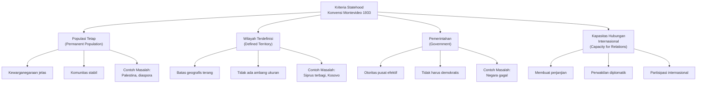
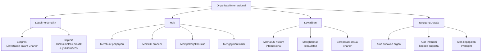
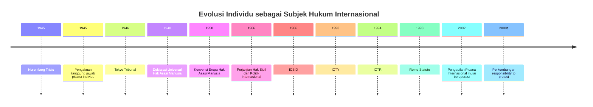
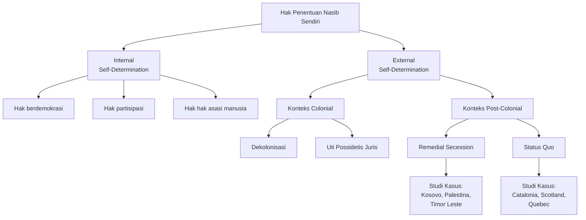

# Subjek Hukum Internasional

## Pengantar

Subjek hukum internasional merupakan entitas yang memiliki hak dan kewajiban menurut hukum internasional. Konsep ini berkembang dari pandangan tradisional yang hanya mengakui negara sebagai satu-satunya subjek, menjadi pemahaman yang lebih luas dan pluralistik. Materi pembelajaran ini mengeksplorasi berbagai entitas yang dapat bertindak dalam sistem hukum internasional modern.

## Tujuan Pembelajaran

Setelah menyelesaikan bab ini, mahasiswa diharapkan dapat:

1. Menjelaskan konsep subjek hukum internasional dan perkembangan historisnya dari paradigma state-centric menuju sistem pluralistik yang mengakui berbagai entitas sebagai pemangku kepentingan dalam hukum internasional.

2. Menganalisis kriteria Konvensi Montevideo 1933 untuk penentuan status negara dengan memberikan contoh konkret dari praktik internasional dan kasus-kasus problematik.

3. Membedakan teori deklaratif dan teori konstitutif mengenai pengakuan negara serta mengevaluasi relevansi masing-masing teori dalam praktik kontemporer.

4. Menjelaskan legal personality organisasi internasional berdasarkan Pendapat Konsultatif ICJ tentang Reparation for Injuries dan menganalisis implikasinya terhadap tanggung jawab internasional organisasi.

5. Mengidentifikasi evolusi individu sebagai subjek hukum internasional melalui perkembangan hukum pidana internasional dan perlindungan hak asasi manusia.

6. Menganalisis status hukum entitas non-tradisional seperti gerakan pembebasan nasional, entitas de facto, dan organisasi kemanusiaan dalam sistem hukum internasional.

7. Mengevaluasi posisi hukum perusahaan multinasional dalam konteks prinsip bisnis dan hak asasi manusia serta tanggung jawab mereka menurut hukum internasional.

8. Menjelaskan konsep hak penentuan nasib sendiri dan menganalisis aplikasinya dalam kasus-kasus kontemporer seperti Kosovo, Palestina, dan Timor Leste.

9. Membandingkan berbagai kategori subjek hukum internasional dan menentukan batasan legal personality masing-masing entitas.

10. Mengaplikasikan pengetahuan tentang subjek hukum internasional untuk menganalisis isu-isu hukum internasional kontemporer dalam konteks praktik negara dan yurisprudensi.

## 1. Konsep Subjek Hukum Internasional

### 1.1 Definisi dan Makna

Subjek hukum internasional adalah entitas yang diakui memiliki legal personality dalam sistem hukum internasional. Legal personality mencakup kemampuan untuk memiliki hak dan kewajiban menurut hukum internasional, serta kemampuan untuk mengajukan klaim hukum untuk melindungi hak-hak tersebut. Sebagai penanda pembeda, subjek hukum internasional tidak perlu memiliki kapasitas penuh untuk melakukan semua tindakan yang dapat dilakukan oleh negara.

### 1.2 Perkembangan Historis

Sistem hukum internasional tradisional berasal dari Perjanjian Westphalia 1648 yang menetapkan negara sebagai entitas utama dalam hubungan internasional. Paradigma state-centric ini mendominasi pemikiran hukum internasional klasik. Namun, sejak awal abad kedua puluh, sistem ini mengalami transformasi signifikan. Penciptaan Liga Bangsa-Bangsa pada 1920 menandai pengakuan formal terhadap organisasi internasional sebagai subjek hukum. Perkembangan lebih lanjut pasca-Perang Dunia Kedua, khususnya melalui Pengadilan Nuremberg dan Pengadilan Tokyo, membuka pintu pengakuan individu sebagai pembawa tanggung jawab hukum internasional.

Pada era kontemporer, pengakuan terhadap entitas non-tradisional terus berkembang. Gerakan pembebasan nasional mendapatkan status pengamat di Perserikatan Bangsa-Bangsa. Organisasi non-pemerintah memainkan peran penting dalam penegakan hukum internasional. Individu dapat mengakses mekanisme perlindungan hak asasi manusia di tingkat internasional. Perkembangan ini mencerminkan kompleksitas hubungan internasional modern yang tidak lagi didominasi oleh negara-negara besar.

### 1.3 Konsep Legal Personality

Legal personality dalam konteks hukum internasional berarti kemampuan untuk memiliki hak dan kewajiban serta membawa tanggung jawab atas pelanggaran hukum internasional. Pengakuan atas legal personality tidak bersifat dichotomous melainkan spektrum. Tidak semua subjek hukum internasional memiliki jangkauan legal personality yang sama. Negara memiliki legal personality yang paling luas, sementara individu dan organisasi non-pemerintah memiliki legal personality yang terbatas pada bidang-bidang tertentu.

Legal personality juga berkaitan dengan kapasitas untuk membuat klaim internasional. Sebuah entitas dengan legal personality dapat mengajukan klaim untuk mempertahankan hak-haknya terhadap pelanggaran. Sebagai contoh, individu dapat mengajukan petisi ke Mahkamah Hak Asasi Manusia Eropa berdasarkan legal personality yang terbatas namun diakui dalam sistem perlindungan hak asasi manusia regional.

### 1.4 Subjek Penuh versus Subjek Sebagian

Pembedaan antara subjek penuh dan subjek sebagian (full subjects versus partial subjects) penting dalam memahami struktur hukum internasional. Negara dianggap sebagai subjek penuh karena dapat melakukan semua tindakan yang diizinkan menurut hukum internasional, termasuk membuat perjanjian internasional, mengajukan klaim, dan mengeksekusi hukum pidana internasional. Sebaliknya, individu merupakan subjek sebagian yang memiliki hak dalam bidang hukum pidana internasional dan perlindungan hak asasi manusia, namun tidak dapat membuat perjanjian internasional atau mengajukan klaim untuk diri mereka sendiri dalam forum internasional tertentu (kecuali melalui mekanisme perlindungan hak asasi manusia atau dalam konteks investor-state dispute settlement).

Organisasi internasional juga merupakan subjek sebagian dengan legal personality terbatas pada fungsi-fungsi yang diperlukan untuk menjalankan tujuan mereka. Sebagai contoh, Organisasi Buruh Internasional dapat membuat konvensi internasional dalam bidang ketenagakerjaan, namun tidak dapat mengajukan klaim territorial.

| Kategori Subjek | Jenis Legal Personality | Contoh Hak | Contoh Keterbatasan |
|---|---|---|---|
| Negara | Penuh | Membuat perjanjian, mengajukan klaim, eksekusi hukum pidana | Terikat pada hak-hak fundamental negara lain |
| Organisasi Internasional | Sebagian | Mempekerjakan staf, membuat perjanjian dalam fungsi, memiliki keistimewaan | Terbatas pada tujuan organisasi |
| Individu | Sebagian | Pengakuan hak asasi manusia, klaim dalam arbitrase investasi, tanggung jawab pidana internasional | Tidak dapat membuat perjanjian, tidak dapat mengajukan klaim untuk diri sendiri dalam litigasi negara |
| Gerakan Pembebasan Nasional | Sangat Terbatas | Status pengamat di PBB, pengakuan internasional | Tidak memiliki hak-hak negara penuh |

## 2. Negara sebagai Subjek Utama Hukum Internasional

### 2.1 Konvensi Montevideo 1933

Konvensi Tentang Hak dan Kewajiban Negara yang ditandatangani di Montevideo pada tahun 1933 menetapkan standar internasional untuk pengakuan sebagai negara. Pasal 1 konvensi ini menyatakan bahwa "negara sebagai subjek hukum internasional harus memiliki hal-hal sebagai berikut: (a) populasi yang tetap; (b) wilayah yang ditentukan; (c) pemerintahan; dan (d) kapasitas untuk memasuki hubungan dengan negara-negara lain."

Kriteria-kriteria ini telah menjadi fondasi teori statehood modern dan terus digunakan sebagai acuan dalam penentuan status negara. Namun, perlu dicatat bahwa kriteria ini bukan satu-satunya faktor yang menentukan statehood. Pengakuan internasional, khususnya melalui keanggotaan Perserikatan Bangsa-Bangsa, memiliki signifikansi penting dalam praktik kontemporer.

### 2.2 Analisis Mendalam Terhadap Setiap Kriteria

#### 2.2.1 Populasi Tetap (Permanent Population)

Kriteria populasi tetap mengacu pada kehadiran penduduk yang stabil dan berkelanjutan di suatu wilayah. Populasi tidak harus homogen secara etnis atau budaya, seperti yang ditunjukkan oleh negara-negara multikultural modern seperti Indonesia, India, dan Kanada. Namun, populasi harus memiliki ikatan tertentu terhadap negara, baik melalui kewarganegaraan maupun hak untuk tinggal secara permanen.

Kriteria ini dapat menjadi problematik dalam kasus-kasus tertentu. Sebagai contoh, dalam penentuan status negara Palestina, pertanyaan mengenai siapa yang dianggap sebagai "populasi tetap" tetap menjadi isu yang diperdebatkan. Populasi Palestina tersebar di Tepi Barat, Jalur Gaza, dan pengasingan (diaspora), yang menciptakan kompleksitas dalam menerapkan kriteria ini.

Demikian pula, dalam kasus negara kepulauan kecil seperti Nauru atau Tuvalu, populasi yang sangat kecil tidak menghalangi pengakuan sebagai negara, menunjukkan bahwa tidak ada ambang batas numerik yang ketat untuk kriteria ini.

#### 2.2.2 Wilayah yang Ditentukan (Defined Territory)

Wilayah yang ditentukan berarti adanya batas-batas geografis yang jelas, meskipun tidak perlu batas-batas tersebut sepenuhnya diakui oleh semua negara. Wilayah harus cukup memadai untuk memungkinkan suatu komunitas hidup dan berkembang. Tidak ada persyaratan mengenai ukuran wilayah, seperti yang ditunjukkan oleh pengakuan terhadap micro-states seperti Liechtenstein (160 km²) dan Monaco (2 km²).

Isu-isu yang muncul dalam penerapan kriteria ini mencakup sengketa wilayah dan klaim territorial yang tumpang tindih. Dalam kasus Kosovo, penetapan batas-batas wilayah yang jelas merupakan prasyarat untuk pengakuan sebagai negara. Demikian pula, dalam kasus Palestina, penentuan wilayah yang tepat tetap menjadi isu yang diperdebatkan dalam negosiasi damai.

Selain itu, konsep "wilayah yang ditentukan" dapat mencakup wilayah yang belum sepenuhnya dipunyai (effective control). Dalam kasus Siprus, meskipun pulau tersebut terbagi antara zona yang dikontrol oleh pemerintah Siprus internasional dan zona yang dikontrol oleh komunitas Turki Siprus, Siprus tetap diakui sebagai satu negara dengan wilayah yang ditentukan.

#### 2.2.3 Pemerintahan (Government)

Pemerintahan mengacu pada adanya otoritas pusat yang mampu mengeksekusi fungsi-fungsi negara secara efektif. Pemerintahan ini tidak harus demokratis atau stabil sepenuhnya. Negara-negara dengan berbagai bentuk pemerintahan, mulai dari monarki absolut hingga demokrasi liberal, semuanya diakui sebagai subjek hukum internasional yang sah.

Namun, dalam praktik, stabilitas dan legitimasi pemerintahan dapat mempengaruhi pengakuan internasional. Pemerintahan yang diperoleh melalui kudeta atau coup d'état sering mengalami kesulitan dalam mendapatkan pengakuan internasional, meskipun secara teknis memenuhi kriteria pemerintahan. Sebagai contoh, pemerintahan Myanmar yang diperoleh melalui kudeta militer pada 2021 tetap diakui sebagai pemerintah yang sah di Perserikatan Bangsa-Bangsa, menunjukkan bahwa pengakuan internasional tidak selalu bergantung pada legitimasi demokratis.

Dalam beberapa kasus, kehadiran pemerintahan yang efektif dapat dipertanyakan. Negara-negara gagal seperti Somalia, Libya, dan Afganistan pasca-2021 mengalami kehancuran sistem pemerintahan pusat, namun tetap mempertahankan status sebagai negara dalam sistem internasional.

#### 2.2.4 Kapasitas untuk Memasuki Hubungan dengan Negara-Negara Lain

Kriteria terakhir dari Konvensi Montevideo 1933 adalah kapasitas untuk memasuki hubungan dengan negara-negara lain. Ini berarti bahwa negara harus memiliki kapasitas untuk melakukan tindakan internasional, seperti membuat perjanjian, menjalin hubungan diplomatik, dan mempertahankan hak-hak dan kewajiban internasional.

Kapasitas ini erat kaitannya dengan kedaulatan dan kemampuan untuk bernegosiasi. Negara harus memiliki otoritas pusat yang dapat berbicara atas nama seluruh populasi dan wilayah. Dalam praktik, kapasitas ini dibuktikan melalui pertukaran perwakilan diplomatik dan partisipasi dalam organisasi internasional.

Dalam kasus entitas seperti Uni Eropa (sebagai organisasi supra-nasional), pertanyaan mengenai kapasitas untuk memasuki hubungan internasional tetap menjadi isu yang kompleks. Uni Eropa memiliki kapasitas untuk membuat perjanjian internasional dalam hal-hal tertentu (kompetensi eksklusif), namun negara-negara anggota tetap menjadi pihak utama dalam hubungan internasional tradisional.

### 2.3 Kontroversi Statehood Kontemporer

#### 2.3.1 Taiwan

Taipei (Taiwan) merupakan kasus yang kompleks dalam statehood. Entitas ini memiliki semua kriteria Montevideo 1933: populasi tetap sekitar 23 juta orang, wilayah yang ditentukan (pulau Taiwan dan pulau-pulau sekitarnya), pemerintahan yang efektif dan stabil secara demokratis, serta kapasitas untuk memasuki hubungan internasional (membuat perjanjian perdagangan, memiliki hubungan diplomatik dengan negara-negara tertentu).

Namun, status internasional Taiwan sangat bergantung pada posisi Republik Rakyat Tiongkok (RRT). Resolusi Majelis Umum PBB No. 2758 tahun 1971 mengakui RRT sebagai "wakil satu-satunya yang sah dari Tiongkok di Perserikatan Bangsa-Bangsa," yang mengakibatkan pengecualian Taiwan dari PBB. Meskipun Taiwan memiliki hubungan perdagangan yang luas dan partisipasi dalam organisasi internasional tertentu (seperti WTO di bawah nama "Customs Territory of Taiwan"), ia tidak diakui oleh mayoritas negara di dunia dan tidak memiliki keanggotaan penuh di PBB.

Contoh ini menunjukkan bahwa pengakuan internasional, bukan hanya kriteria Montevideo 1933, memiliki peran signifikan dalam penentuan status negara dalam praktik internasional kontemporer.

#### 2.3.2 Palestina

Palestina mewakili kasus yang paling memperumit dalam hukum statehood kontemporer. Otoritas Palestina telah mengumumkan kemerdekaan (1988), namun status internasionalnya tetap ambigu. Palestina memiliki populasi tetap dan wilayah yang terdefinisi (Tepi Barat dan Jalur Gaza, meskipun kontrol territorial dibatasi oleh kehadiran Israel). Namun, kapasitas untuk memasuki hubungan internasional dan mengontrol wilayah secara efektif tetap terbatas oleh kehadiran militer Israel dan pembatasan internasional.

Pengakuan Palestina bervariasi di antara negara-negara. Lebih dari seratus negara telah mengakui Palestina sebagai negara, namun pengakuan tersebut tidak universal. Pada 2012, Majelis Umum PBB memberikan status "negara pengamat non-anggota" kepada Palestina, meningkat dari status "entitas pengamat" sebelumnya. Meskipun peningkatan status ini signifikan, Palestina masih belum memiliki keanggotaan penuh di PBB, yang biasanya memerlukan persetujuan Dewan Keamanan.

Kasus Palestina menunjukkan bahwa isu-isu politik dan kekuatan geopolitik memiliki dampak signifikan pada penentuan statehood, bahkan ketika kriteria legal formal sebelumnya dipenuhi.

#### 2.3.3 Kosovo

Kosovo mendeklarasikan kemerdekaan unilateral dari Serbia pada 17 Februari 2008. Pengakuan internasional terhadap Kosovo sangat terbagi, dengan negara-negara Barat mayoritas mengakui kemerdekaannya, sementara Rusia, Tiongkok, dan beberapa negara lain menolak pengakuan tersebut.

Dalam hal kriteria Montevideo 1933, Kosovo memiliki populasi tetap (sekitar 1,8 juta orang), wilayah yang terdefinisi dengan jelas (meskipun masih diperdebatkan dengan Serbia), pemerintahan yang efektif (meskipun stabilitas awalnya dipertanyakan), dan kapasitas untuk memasuki hubungan internasional (Kosovo sekarang memiliki hubungan diplomatik dengan sebagian besar negara Eropa).

Kasus Kosovo penting karena keputusan Pengadilan Internasional tentang Keputusan tentang Konsistensi Konstitusional No. 4/07 (Kosova) dari Pengadilan Konstitusional Kosovo dan terutama Pendapat Konsultatif Pengadilan Internasional tentang Konsistensi Deklarasi Kemerdekaan Kosovo dengan Hukum Internasional. Dalam pendapatnya, ICJ menyatakan bahwa penyataan kemerdekaan Kosovo tidak melanggar hukum internasional, meskipun ini tidak berarti bahwa deklarasi tersebut secara otomatis menciptakan negara atau mengakibatkan pengakuan.

#### 2.3.4 Somaliland

Somaliland, yang berada di utara Somalia, telah mengumumkan kemerdekaan unilateral pada 1991. Somaliland memiliki semua kriteria Montevideo 1933: populasi tetap sekitar 4 juta orang, wilayah yang terdefinisi dengan batas-batas yang relatif stabil, pemerintahan yang lebih stabil dibandingkan dengan negara-negara lain di kawasan, dan kapasitas untuk memasuki hubungan internasional (meskipun terbatas).

Namun, Somaliland tidak memiliki pengakuan internasional yang signifikan. Hanya sedikit entitas yang telah mengakui kemerdekaannya secara resmi. Alasan penolakan pengakuan termasuk prinsip uti possidetis juris (penerusan perbatasan kolonialisasi) dan kekhawatiran bahwa pengakuan Somaliland dapat membuka preseden untuk pemisahan di seluruh benua Afrika. Kasus Somaliland menunjukkan bahwa pemenuhan kriteria legal tidak menjamin pengakuan internasional dalam praktik.

### 2.4 Negara-Negara yang Gagal dan Status Statehood

Negara gagal adalah negara yang tidak lagi mampu mengeksekusi fungsi-fungsi dasar pemerintahan secara efektif. Somalia, setelah jatuhnya rezim Siad Barre pada 1991, mengalami kehancuran sistem pemerintahan pusat dan perpecahan menjadi faksi-faksi yang saling berperang. Meskipun demikian, Somalia tetap diakui sebagai negara dalam sistem internasional dan mempertahankan kursi di Perserikatan Bangsa-Bangsa.

Kasus Somalia menunjukkan bahwa loss of effective government tidak mengakibatkan loss of statehood. Negara tetap mempertahankan status legal internasionalnya meskipun tidak mampu mengeksekusi fungsi-fungsi pemerintahan secara efektif. Namun, absence of effective government dapat memiliki dampak signifikan pada kapasitas negara untuk melaksanakan hak dan kewajiban internasionalnya, serta dapat membuka peluang bagi intervensi internasional.

### 2.5 Micro-States dan Legal Personality Penuh

Micro-states adalah negara dengan populasi dan/atau wilayah yang sangat kecil. Contoh-contoh termasuk Liechtenstein (populasi 38.000, wilayah 160 km²), Monaco (populasi 36.000, wilayah 2 km²), San Marino (populasi 34.000, wilayah 61 km²), dan Vatikan (populasi kurang dari 1000, wilayah 0,44 km²).

Pengakuan terhadap micro-states sebagai negara dengan legal personality penuh menunjukkan bahwa tidak ada persyaratan minimum mengenai ukuran populasi atau luas wilayah untuk memenuhi kriteria statehood. Sebaliknya, prinsip kesetaraan kedaulatan berlaku bahwa semua negara, terlepas dari ukuran mereka, memiliki legal personality yang sama dan hak-hak yang sama dalam sistem hukum internasional (meskipun dalam praktik, kemampuan mereka untuk melaksanakan hak-hak tersebut dapat berbeda secara signifikan).

Micro-states seperti Liechtenstein dan Monaco memiliki kapasitas penuh untuk membuat perjanjian internasional, menjalin hubungan diplomatik, dan berpartisipasi dalam organisasi internasional. Mereka memiliki hak untuk vote (voting power) yang sama di Majelis Umum PBB seperti negara-negara besar, meskipun pengaruh mereka dalam pengambilan keputusan dunia secara faktis lebih terbatas.

### 2.6 Studi Kasus: Penciptaan Republik Sudan Selatan (2011)

Republik Sudan Selatan mendeklarasikan kemerdekaan pada 9 Juli 2011, setelah referendum kemerdekaan yang diadakan pada Januari 2011 dengan dukungan internasional yang luas. Penciptaan Sudan Selatan merupakan contoh modern tentang bagaimana proses statehood dapat terjadi dalam kerangka internasional yang terstruktur.

Sebelum kemerdekaan, Sudan Selatan adalah region dalam Sudan yang dipimpin oleh Gerakan Rakyat Sudan Selatan (Sudan People's Liberation Movement/SPLM). Setelah Perjanjian Damai Komprehensif (Comprehensive Peace Agreement/CPA) pada 2005 yang mengakhiri perang saudara Sudan selama 22 tahun, Sudan Selatan mendapatkan status otonomi khusus dengan janji referendum kemerdekaan pada 2011.

Referendum pada 2011 menghasilkan suara luar biasa mendukung kemerdekaan, dengan 98,83% pemilih memilih untuk memisahkan diri dari Sudan. Proses ini diakui dan didukung oleh komunitas internasional, termasuk Perserikatan Bangsa-Bangsa, Uni Afrika, dan negara-negara besar.

Sudan Selatan memenuhi semua kriteria Montevideo 1933: memiliki populasi tetap (sekitar 10 juta orang saat kemerdekaan), wilayah yang terdefinisi dengan jelas (meskipun masih ada sengketa perbatasan dengan Sudan), pemerintahan yang didirikan (SPLM menjadi partai pemerintah), dan kapasitas untuk memasuki hubungan internasional (menjadi anggota PBB pada 14 Juli 2011).

Namun, sejak kemerdekaan, Sudan Selatan telah menghadapi tantangan signifikan dalam membangun institusi negara yang kuat. Perang sipil yang pecah pada 2013 dan berlanjut hingga perjanjian gencatan senjata pada 2018 menunjukkan bahwa penciptaan negara tidak otomatis memastikan stabilitas dan efektivitas pemerintahan. Kasus Sudan Selatan memberikan pelajaran penting bahwa statehood hukum tidak cukup tanpa kapasitas institusional dan kemauan politik untuk membangun tata kelola yang efektif.

## 3. Pengakuan Negara (Recognition of States)

### 3.1 Teori-Teori Pengakuan

#### 3.1.1 Teori Deklaratif (Declaratory Theory)

Teori deklaratif, yang dikembangkan oleh Lord Lauterpacht dan para sarjana liberal, menyatakan bahwa pengakuan internasional adalah deklarasi semata dari fakta bahwa entitas telah memenuhi kriteria statehood. Dengan kata lain, pengakuan bersifat deklaratif, bukan konstitutif. Pengakuan tidak menciptakan negara; sebaliknya, pengakuan hanya mengakui apa yang sudah ada secara objektif.

Menurut teori ini, jika suatu entitas memenuhi kriteria statehood (populasi tetap, wilayah terdefinisi, pemerintahan, dan kapasitas untuk hubungan internasional), entitas tersebut adalah negara dengan atau tanpa pengakuan formal dari negara-negara lain. Pengakuan memiliki nilai praktis dalam hal memudahkan hubungan internasional, namun bukan prasyarat hukum untuk keberadaan negara.

Keuntungan teori deklaratif adalah bahwa teori ini menekankan kriteria objektif untuk statehood, yang mengurangi kesewenangan-wenangan dalam penentuan statehood. Teori ini juga mendukung prinsip bahwa statehood adalah masalah fakta hukum, bukan pilihan politik dari negara-negara yang sudah mapan.

#### 3.1.2 Teori Konstitutif (Constitutive Theory)

Teori konstitutif menyatakan bahwa pengakuan internasional adalah prasyarat konstitutif untuk statehood. Tanpa pengakuan dari negara-negara yang sudah mapan, suatu entitas tidak dapat dianggap sebagai negara dalam sistem hukum internasional. Pengakuan tidak hanya deklarasi atas fakta tetapi adalah tindakan hukum yang menciptakan status statehood.

Menurut teori ini, karena hukum internasional adalah sistem hukum yang dibangun atas konsensus negara-negara, pengakuan oleh negara-negara yang sudah mapan adalah elemen esensial untuk membawa entitas baru ke dalam sistem hukum tersebut. Tanpa pengakuan ini, entitas tetap berada di luar sistem hukum internasional.

Kritik terhadap teori konstitutif mencakup bahwa teori ini memberikan kekuatan yang berlebihan kepada negara-negara yang sudah mapan untuk menentukan statehood berdasarkan kepentingan mereka, dan dapat memungkinkan kesewenangan-wenangan dalam pemberian atau penolakan pengakuan.

### 3.2 Teori Mana yang Berlaku dalam Praktik Kontemporer?

Dalam praktik internasional kontemporer, teori deklaratif seringkali lebih mencerminkan realitas. Namun, teori konstitutif juga memiliki pengaruh signifikan, khususnya dalam hal pengakuan formal dan penerimaan ke dalam organisasi internasional.

Kasus Kosovo mengilustrasikan kompleksitas ini. Pendapat Konsultatif Pengadilan Internasional menyatakan bahwa deklarasi kemerdekaan Kosovo tidak melanggar hukum internasional, dengan demikian mengakui bahwa ada landasan legal untuk statehood independen dari pengakuan formal. Ini mendukung teori deklaratif. Namun, dalam praktik, pengakuan internasional tetap penting bagi Kosovo untuk membangun legitimasi dan mengakses hak-hak yang terkait dengan statehood, seperti keanggotaan di organisasi internasional (Kosovo belum menjadi anggota PBB pada tahun 2024, meskipun diakui oleh mayoritas negara Barat).

Demikian pula, dalam kasus Taiwan, meskipun entitas ini memenuhi kriteria statehood secara objektif, kurangnya pengakuan internasional yang luas (khususnya dari negara-negara besar seperti Tiongkok, Rusia, dan India) membatasi kapasitasnya untuk beroperasi sebagai negara dalam sistem internasional.

Praktik kontemporer menunjukkan bahwa kedua teori ini bekerja secara bersamaan. Kriteria objektif (teori deklaratif) menyediakan standar untuk menentukan siapa yang memenuhi syarat, sementara pengakuan formal (teori konstitutif) menyediakan sarana untuk mengintegrasikan entitas baru ke dalam sistem internasional dan memperkuat legitimasi mereka.

### 3.3 Pengakuan Negara versus Pengakuan Pemerintahan

Penting untuk membedakan antara pengakuan negara dan pengakuan pemerintahan. Pengakuan negara berarti mengakui bahwa entitas tersebut adalah subjek hukum internasional yang sah. Pengakuan pemerintahan berarti mengakui bahwa pemerintahan tertentu adalah pemerintah yang sah yang mewakili negara tersebut dalam hubungan internasional.

Pengakuan pemerintahan dapat berubah tanpa mengubah status statehood dari negara tersebut. Sebagai contoh, ketika Myanmar mengalami kudeta pada 2021, komunitas internasional menolak untuk mengakui pemerintahan militer baru sambil tetap mengakui Myanmar sebagai negara. Kursi Myanmar di Perserikatan Bangsa-Bangsa dipertanyakan, dan hubungan diplomatik dengan pemerintahan militer ditangguhkan oleh banyak negara, namun status statehood Myanmar tidak pernah dipertanyakan.

Demikian pula, dalam kasus Libyan civil war (2011-2020), dua pemerintahan bersaing untuk pengakuan sebagai pemerintah yang sah Libya. Komunitas internasional pada awalnya mengakui Dewan Transisional Nasional (National Transitional Council) sebagai perwakilan yang sah dari negara Libya, meskipun pemerintahan yang dimulai oleh Muammar Gaddafi masih menguasai bagian dari wilayah. Isu di sini adalah pengakuan pemerintahan, bukan pengakuan negara.

### 3.4 Pengakuan Kolektif melalui Keanggotaan PBB

Dalam praktik kontemporer, pengakuan kolektif melalui keanggotaan Perserikatan Bangsa-Bangsa memiliki signifikansi khusus. Penerimaan sebagai anggota PBB memerlukan persetujuan dari Dewan Keamanan (keputusan afirmatif) dan kemudian Majelis Umum. Keputusan ini secara praktis menghasilkan pengakuan kolektif dari komunitas negara-negara.

Keanggotaan PBB bukan prasyarat untuk statehood, tetapi merupakan pengakuan praktis dan formal. Entitas yang memenuhi kriteria statehood tetapi tidak memiliki keanggotaan PBB masih dianggap sebagai negara (seperti Palestina dengan status negara pengamat), tetapi kapasitas mereka untuk melaksanakan hak-hak yang terkait dengan statehood terbatas.

### 3.5 Pengakuan Prematur dan Konsekuensinya

Pengakuan prematur terjadi ketika negara mengakui entitas sebagai negara sebelum entitas tersebut memenuhi kriteria statehood sepenuhnya atau sebelum pengakuan luas terjadi. Pengakuan prematur dapat memiliki konsekuensi hukum yang signifikan.

Dalam kasus Yugoslavia, pengakuan prematur terhadap Slovenia dan Kroatia oleh Jerman pada 1991 (sebelum pengakuan luas atau penyelesaian sengketa territorial) dianggap oleh beberapa ahli hukum internasional sebagai berkontribusi pada eskalasi konflik dan destabilisasi wilayah.

Sebaliknya, pengakuan yang terlambat atau penolakan pengakuan juga dapat memiliki konsekuensi. Penolakan komunitas internasional untuk secara luas mengakui Palestina sebagai negara penuh telah mengakibatkan status legal yang ambigu dan ketidakstabilan dalam wilayah tersebut.

### 3.6 Doktrin Estrada

Doktrin Estrada diambil dari nama Jenderal Estrada dari Meksiko. Doktrin ini menyatakan bahwa negara tidak harus memberikan pernyataan formal atau deklarasi pengakuan, melainkan hubungan diplomatik yang sesungguhnya dengan suatu entitas itu sendiri merupakan bukah pengakuan implisit.

Menurut doktrin ini, pengakuan adalah hasil logis dari pembentukan hubungan diplomatik dan bukan tindakan formal yang terpisah. Doktrin Estrada memiliki keuntungan dalam mengurangi formalitas dalam pengakuan dan memudahkan normalisasi hubungan internasional.

Dalam praktik kontemporer, doktrin Estrada tidak selalu diikuti. Banyak negara masih memberikan pernyataan formal pengakuan terhadap negara-negara baru, meskipun pembentukan hubungan diplomatik juga memiliki arti penting.

### 3.7 Studi Kasus: Kosovo (2008), Crimea (2014), Taiwan

#### 3.7.1 Kosovo (2008)

Deklarasi kemerdekaan Kosovo pada Februari 2008 diikuti oleh pengakuan yang bervariasi dari komunitas internasional. Negara-negara Barat, khususnya Amerika Serikat dan mayoritas Uni Eropa, mengakui Kosovo sebagai negara independen. Namun, Rusia, Tiongkok, dan beberapa negara lain menolak pengakuan ini, menunjukkan bahwa Kosovo menjadi korban perpecahan geopolitik.

Pengakuan Kosovo menciptakan preseden yang dikhawatirkan oleh banyak negara: pengakuan terhadap pemisahan unilateral dari entitas yang sudah mapan. Beberapa pengamat berpendapat bahwa preseden ini dapat membuka jalan bagi pemisahan di wilayah lain (seperti Crimea dan Donbas di Ukraina, atau Catalonia dan Basque Country di Spanyol).

Meskipun demikian, komunitas internasional mengakui perbedaan antara kasus Kosovo dan kasus-kasus pemisahan lainnya. NATO intervention dalam Kosovan war (1999) dan subsequent international administration dianggap sebagai konteks khusus yang membedakan Kosovo dari kasus-kasus lainnya. Ini menunjukkan bahwa pengakuan tidak hanya berdasarkan kriteria objektif tetapi juga pada konteks politikkhusus dan dukungan kekuatan besar.

#### 3.7.2 Crimea (2014)

Setelah kudeta di Ukraina pada 2014, Rusia mengorganisir referendum di Crimea yang menghasilkan suara mayoritas (meskipun hasilnya diperdebatkan) untuk bergabung dengan Rusia. Rusia mengakui kemerdekaan Crimea sebagai Republik Crimea, dan beberapa hari kemudian Crimea bergabung dengan Rusia.

Pengakuan internasional terhadap Crimea sebagai independen sangat terbatas. Amerika Serikat, Uni Eropa, dan sebagian besar negara-negara Barat menolak mengakui pemisahan Crimea dan tetap menganggap Crimea sebagai bagian dari Ukraina yang diduduki oleh Rusia secara ilegal. Hanya segelintir negara (terutama Rusia dan beberapa negara lain) yang mengakui pemisahan Crimea.

Kasus Crimea menunjukkan bahwa geopolitik dan distribusi kekuatan memiliki dampak signifikan pada pengakuan internasional. Meskipun Crimea dapat dianggap memenuhi beberapa kriteria statehood (populasi, wilayah, pemerintahan), pengakuan internasional sangat terbatas karena konteks invasi dan intervensi militer.

#### 3.7.3 Taiwan

Sebagaimana dibahas sebelumnya, Taiwan memiliki semua kriteria Montevideo 1933 tetapi tidak memiliki pengakuan universal. Pengakuan Taiwan sangat bergantung pada posisi geopolitik negara-negara terhadap Tiongkok. Negara-negara yang menjalin hubungan diplomatik dengan Tiongkok umumnya tidak secara formal mengakui Taiwan, meskipun mereka dapat memiliki hubungan perdagangan dan informal yang luas.

## 4. Organisasi Internasional sebagai Subjek Hukum Internasional

### 4.1 Legal Personality: Ekspres versus Implisit

Organisasi internasional dapat memiliki legal personality yang diakui secara ekspres dalam instrumen pendirianya atau yang diakui secara implisit melalui praktik dan yurisprudensi internasional.

Legal personality yang ekspres adalah ketika charter atau konstitusi organisasi secara eksplisit menyatakan bahwa organisasi memiliki legal personality internasional. Sebagai contoh, Piagam Perserikatan Bangsa-Bangsa tidak secara ekspres menyatakan bahwa PBB memiliki legal personality internasional, tetapi implikasinya jelas dari fungsi-fungsi yang diberikan kepada organisasi.

Legal personality yang implisit diakui melalui prakti dan yurisprudensi. Pengadilan Internasional, melalui pendapat konsultatifnya, telah mengakui bahwa organisasi internasional memiliki legal personality meskipun charter mereka tidak secara ekspres menyatakannya.

### 4.2 Pendapat Konsultatif ICJ: Reparation for Injuries (1949) - Analisis Mendalam

Kasus "Reparation for Injuries Suffered in the Service of the United Nations" adalah pendapat konsultatif yang diajukan oleh Majelis Umum PBB kepada Pengadilan Internasional pada 1948. Pendapat ini berkaitan dengan pertanyaan apakah Perserikatan Bangsa-Bangsa dapat mengajukan klaim internasional untuk kerusakan yang diderita oleh anggotanya karena pelanggaran kewajiban internasional.

Pada 1948, Count Folke Bernadotte, mediator PBB yang ditunjuk untuk menengahi konflik Arab-Israel, terbunuh bersama dengan anggota stafnya yang lain di Yerusalem. PBB ingin mengajukan klaim terhadap Israel (atau pihak yang bertanggung jawab) atas kerusakan yang dialami sebagai hasil dari pembunuhan ini.

Dalam pendapatnya, Pengadilan Internasional menyatakan bahwa:

> "Organisasi internasional dibentuk oleh negara-negara yang, untuk mencapai tujuan-tujuan bersama mereka, telah membatasi hak-hak mereka sebaliknya dengan mereka bersedia untuk menerima hak-hak dan kewajiban-kewajiban yang ditetapkan dalam piagam organisasi."

Pengadilan menyimpulkan bahwa PBB memiliki legal personality internasional yang terpisah dari legal personality negara-negara anggotanya. Oleh karena itu, PBB dapat mengajukan klaim internasional atas nama anggotanya yang terlibat dalam kegiatan PBB.

Secara khusus, Pengadilan menyatakan:

> "PBB adalah subjek dari hukum internasional dan mampu memiliki hak dan kewajiban internasional, serta memiliki kapasitas untuk mempertahankan hak-haknya dengan cara membawa klaim internasional."

Pendapat ini menciptakan preseden penting bahwa organisasi internasional bukan sekadar instrumen dari negara-negara anggota melainkan entitas hukum yang independen dengan legal personality internasional.

Dalam praktik, pendapat ini telah diperluas. Organisasi internasional dapat sekarang:
- Membuat perjanjian internasional
- Memiliki staf internasional dengan immunitas
- Memiliki properti dan aset
- Mengajukan klaim internasional
- Bertanggung jawab atas pelanggaran kewajiban internasional

### 4.3 Perserikatan Bangsa-Bangsa sebagai Contoh Utama

Perserikatan Bangsa-Bangsa adalah organisasi internasional global terbesar dan paling signifikan. PBB memiliki legal personality internasional yang luas dan diakui secara universal.

PBB dapat:
- Membuat perjanjian internasional dalam berbagai bidang (diperkuat oleh Konvensi tentang Legal Personality Organisasi Internasional)
- Memiliki properti dan aset yang dilindungi dari penguasaan nasional
- Mempekerjakan staf internasional dengan immunitas dan privilese
- Mengajukan klaim internasional
- Mengambil tindakan enforcement melalui Dewan Keamanan (termasuk penggunaan kekuatan militer)
- Memberikan status pengamat kepada entitas non-anggota

Fungsi-fungsi ini menunjukkan bahwa legal personality PBB jauh melampaui apa yang dimiliki oleh organisasi internasional lainnya.

### 4.4 Badan Khusus dan Organisasi Regional

Badan-badan khusus PBB (seperti UNESCO, WHO, FAO) memiliki legal personality yang terbatas pada fungsi-fungsi spesifik mereka. Mereka dapat membuat perjanjian internasional dalam bidang keahlian mereka, memiliki properti, dan mempekerjakan staf dengan immunitas tertentu.

Organisasi regional seperti Uni Eropa memiliki legal personality yang signifikan. UE dapat:
- Membuat perjanjian perdagangan internasional
- Mengajukan klaim dalam arbitrase internasional
- Melakukan tindakan hukum dalam sistem internasional

Namun, legal personality UE sedikit berbeda dari negara-negara karena negara-negara anggota tetap menjadi subjek hukum internasional utama dalam banyak hal.

ASEAN (Asosiasi Negara-Negara Asia Tenggara) memiliki legal personality yang lebih terbatas dibandingkan dengan UE. ASEAN dapat membuat perjanjian internasional dalam bidang-bidang tertentu (seperti ASEAN Charter), tetapi legal personality-nya sering didefinisikan dengan ketat dalam hal fungsi-fungsi spesifik yang diberikan oleh piagam.

Uni Afrika memiliki legal personality dalam berbagai hal, dapat membuat perjanjian dan mengajukan inisiatif diplomatik, meskipun kapasitasnya sering terbatas oleh perbedaan pandangan di antara negara-negara anggota.

### 4.5 Hak dan Kewajiban Organisasi Internasional

Organisasi internasional memiliki hak untuk:
- Membuat perjanjian internasional (dalam batas-batas yang ditentukan oleh charter)
- Memiliki dan mengontrol properti
- Berkomunikasi dengan negara-negara dan organisasi lainnya
- Mengajukan klaim internasional
- Memiliki privilese dan immunitas dalam operasi mereka

Organisasi internasional juga memiliki kewajiban untuk:
- Mematuhi hukum internasional
- Menghormati kedaulatan negara-negara
- Beroperasi sesuai dengan charter dan prinsip-prinsip yang diakui
- Bertanggung jawab atas pelanggaran kewajiban internasional

### 4.6 Tanggung Jawab Internasional Organisasi Internasional

Tanggung jawab internasional organisasi internasional telah diatur dalam "Articles on the Responsibility of International Organizations" yang diadopsi oleh Komisi Hukum Internasional (International Law Commission) pada 2011.

Menurut artikel-artikel ini, organisasi internasional dapat bertanggung jawab atas:
- Tindakan organ-organ organisasi yang melanggar kewajiban internasional
- Tindakan anggota organisasi yang dilakukan atas instruksi organisasi
- Kegagalan untuk mencegah pelanggaran hukum internasional oleh anggota ketika organisasi memiliki kewajiban untuk melakukan demikian

Tanggung jawab ini dapat diakibatkan dari berbagai tindakan, termasuk:
- Pelanggaran hak asasi manusia
- Pemberian dukungan kepada pihak-pihak yang melanggar hukum internasional
- Kegagalan untuk melakukan oversight atas operasi-operasi yang dilakukan atas nama organisasi

## 5. Individu sebagai Subjek Hukum Internasional

### 5.1 Pengecualian Historis di Bawah Positivisme Tradisional

Dalam teori hukum internasional tradisional yang dikembangkan oleh positivis abad kesembilan belas dan awal abad kedua puluh, individu tidak dianggap sebagai subjek hukum internasional. Hukum internasional dilihat sebagai sistem hukum yang mengatur hubungan antara negara-negara, dan individu hanya memiliki status sebagai objek hukum internasional.

Posisi ini didasarkan pada pandangan bahwa individu tidak memiliki kapasitas untuk membuat perjanjian internasional atau untuk menjadi pihak dalam klaim internasional atas nama mereka sendiri. Semua hubungan internasional diatur melalui negara, dan negara dianggap sebagai satu-satunya penengah antara individu dan hukum internasional.

Namun, pandangan ini mulai bergeser selama abad kedua puluh, khususnya setelah Perang Dunia Kedua dan pengakuan universal terhadap kebutuhan untuk melindungi individu dari perlakuan yang tidak manusiawi oleh negara.

### 5.2 Pengadilan Nuremberg (1945-1946) dan Tokyo Tribunal

Pengadilan Nuremberg dibentuk oleh Perjanjian London pada 1945 untuk mengadili pemimpin Nazi dan militer senior atas kejahatan perang dan kejahatan terhadap kemanusiaan yang mereka lakukan selama Perang Dunia Kedua.

Pentingnya Pengadilan Nuremberg terletak pada pengakuan eksplisit bahwa individu dapat diminta pertanggungjawaban atas pelanggaran hukum internasional, bahkan ketika mereka bertindak atas perintah negara atau dalam kapasitas pemerintah resmi. Pengadilan menyatakan bahwa:

> "Kejahatan terhadap hukum internasional tidak menjadi kurang begitu karena mereka diperintahkan oleh Kepala Negara atau oleh pemerintah yang bertanggung jawab kepada mereka atas pembangunan keseluruhan dari kekuatan-kekuatan militer atau ekonomi atas tugas-tugas perencanaan Perang Agresi, tetapi ini pun merupakan alasan untuk mengenakan tanggung jawab pribadi mereka."

Pengadilan Nuremberg mengadili 24 pemimpin Nazi utama. Presiden, menteri, dan pemimpin militer dinyatakan bersalah atas kejahatan perang, kejahatan terhadap kemanusiaan, dan dalam beberapa kasus kejahatan pembunuhan berencana. Banyak dari mereka dihukum mati, dan beberapa dihukum penjara seumur hidup.

Pengadilan Tokyo dibentuk untuk mengadili pemimpin Jepang atas kejahatan serupa yang dilakukan selama Perang Dunia Kedua. Pengadilan Tokyo mengadili 28 individu dan mengeluarkan putusan yang mengakui tanggung jawab individu atas kejahatan internasional.

Pentingnya pengadilan-pengadilan ini adalah pengakuan bahwa individu memiliki tanggung jawab langsung menurut hukum internasional untuk tindakan-tindakan tertentu yang dianggap sebagai kejahatan internasional. Ini menandai awal dari pergeseran paradigma yang mengakui individu sebagai subyek hukum internasional, setidaknya dalam konteks tanggung jawab pidana.

### 5.3 ICTY, ICTR, dan Tribunal Ad Hoc Lainnya

Pengadilan Pidana Internasional untuk bekas Yugoslavia (International Criminal Tribunal for the former Yugoslavia/ICTY) didirikan oleh Dewan Keamanan PBB pada 1993 untuk mengadili individu-individu yang bertanggung jawab atas pelanggaran serius hukum humaniter internasional yang dilakukan di wilayah bekas Yugoslavia.

Pengadilan Pidana Internasional untuk Rwanda (International Criminal Tribunal for Rwanda/ICTR) didirikan pada 1994 untuk mengadili individu-individu yang bertanggung jawab atas genosida dan kejahatan lainnya terhadap kemanusiaan yang dilakukan selama genocide Rwanda pada 1994.

Pengadilan-pengadilan ini melanjutkan tradisi Nuremberg dan Tokyo dalam mengakui tanggung jawab individu atas kejahatan internasional. Mereka mengadili ratusan individu atas kejahatan perang, kejahatan terhadap kemanusiaan, dan genosida.

Signifikansi ICTY dan ICTR adalah pengakuan bahwa tanggung jawab individu untuk kejahatan internasional tidak terbatas pada periode pasca-perang tetapi dapat diberlakukan oleh komunitas internasional dalam situasi konflik kontemporer. Ini memperkuat posisi individu sebagai subjek hukum internasional yang memiliki tanggung jawab hukum.

### 5.4 Pengadilan Pidana Internasional (Rome Statute 1998)

Pengadilan Pidana Internasional didirikan oleh Statuta Roma pada 1998 dan mulai beroperasi pada 2002. ICC adalah pengadilan permanen pertama yang memiliki yurisdiksi untuk mengadili individu-individu atas kejahatan internasional yang paling serius.

ICC memiliki yurisdiksi atas:
- Genosida: pembunuhan dengan niat untuk menghancurkan sebagian atau seluruh kelompok nasional, etnis, rasial, atau agama
- Kejahatan terhadap kemanusiaan: serangan luas atau sistematis yang ditargetkan terhadap populasi sipil
- Kejahatan perang: pelanggaran serius hukum humaniter internasional
- Kejahatan agresi: penggunaan kekuatan militer oleh satu negara terhadap negara lain (yurisdiksi ditambahkan kemudian)

Kehadiran ICC menandai pengakuan permanen bahwa individu adalah subjek hukum internasional yang dapat dibawa ke pengadilan atas tindakan-tindakan yang melanggar norma-norma internasional yang paling fundamental.

Sejak pendirian ICC, pengadilan telah mengeluarkan dakwaan terhadap ratusan individu dan telah mengeluarkan putusan-putusan dalam puluhan kasus. Meskipun ICC menghadapi kritik mengenai efektivitasnya dan bias geografisnya (sebagian besar kasusnya berasal dari Afrika), pengadilan terus memainkan peran penting dalam penegakan tanggung jawab individu untuk kejahatan internasional.

### 5.5 Hak Individu Menurut Perjanjian Hak Asasi Manusia

Selain tanggung jawab pidana, individu juga merupakan pemangku kepentingan hak dalam berbagai perjanjian hak asasi manusia internasional. Perjanjian-perjanjian ini memberikan hak kepada individu yang dapat dipertahankan melalui mekanisme internasional.

Konvensi Eropa tentang Hak Asasi Manusia (European Convention on Human Rights) memungkinkan individu untuk mengajukan petisi kepada Mahkamah Hak Asasi Manusia Eropa atas pelanggaran hak-hak mereka. Konvensi Amerika tentang Hak Asasi Manusia memungkinkan individu untuk mengajukan petisi kepada Komisi Hak Asasi Manusia Inter-Amerika dan Pengadilan Hak Asasi Manusia Inter-Amerika. Perjanjian Hak Sipil dan Politik Internasional memungkinkan individu untuk mengajukan komunikasi kepada Komite Hak Asasi Manusia PBB.

Melalui mekanisme-mekanisme ini, individu memiliki hak yang diakui secara internasional dan dapat menuntut pemerintah mereka atas pelanggaran hak-hak tersebut.

### 5.6 Hak Petisi dan Akses ke Mekanisme Internasional

Hak untuk mengajukan petisi adalah hak fundamental yang memungkinkan individu untuk mengakses mekanisme perlindungan hak asasi manusia internasional. Hak ini telah menjadi norma yang diakui secara luas dalam sistem hukum hak asasi manusia internasional.

Mahkamah Hak Asasi Manusia Eropa, misalnya, telah menerima lebih dari 400.000 petisi dari individu sejak didirikan. Pengadilan telah mengeluarkan ribuan putusan yang mengakui pelanggaran hak asasi manusia dan memerintahkan negara-negara untuk memberikan kompensasi kepada korban.

Pengadilan Hak Asasi Manusia Inter-Amerika juga telah memainkan peran penting dalam melindungi hak individu di wilayah Amerika. Pengadilan telah mengeluarkan putusan landmark yang memperluas pemahaman mengenai hak asasi manusia dan kewajiban negara untuk melindungi hak-hak tersebut.

Hak petisi ini menunjukkan bahwa individu bukan hanya subjek pasif dari hukum internasional tetapi pemangku kepentingan aktif yang dapat menegakkan hak-hak mereka melalui mekanisme internasional.

### 5.7 Investor-State Dispute Settlement (ICSID)

Individu dan perusahaan juga memiliki hak untuk mengajukan klaim investor-state dalam arbitrase internasional. Mekanisme Pusat Internasional untuk Penyelesaian Sengketa Investasi (International Centre for Settlement of Investment Disputes/ICSID) memungkinkan investor asing untuk mengajukan klaim terhadap negara-negara atas pelanggaran perjanjian investasi bilateral (bilateral investment treaties/BITs).

Dalam arbitrase ICSID, investor (yang mungkin merupakan individu atau perusahaan) mengajukan klaim langsung terhadap negara tanpa harus menjalani filter diplomat negaranya. Ini merupakan pengakuan signifikan bahwa individu (melalui investasi mereka) memiliki hak yang dapat dipertahankan langsung terhadap negara dalam hukum internasional.

Sejak pendirian ICSID pada 1966, ribuan klaim telah diajukan oleh investor dari berbagai negara. Klaim-klaim ini mencakup berbagai masalah, mulai dari pengambilalihan properti hingga diskriminasi dalam perlakuan investasi asing.

## 6. Entitas Lain dalam Hukum Internasional

### 6.1 Belligerent dan Insurgent

Dalam konteks hukum internasional humaniter, status belligerent (pihak berperang) dan insurgent (pihak yang melakukan insureksi) memiliki implikasi hukum tertentu.

Belligerent adalah pihak yang terlibat dalam konflikt bersenjata dengan negara dan memiliki organisasi territorial yang cukup untuk memungkinkan mereka untuk mematuhi hukum perang. Pengakuan atas status belligerent memberikan hak dan kewajiban kepada pihak tersebut menurut hukum perang.

Insurgent adalah pihak yang melakukan pemberontakan melawan pemerintahan yang sah. Status insurgent tidak memberikan hak yang sama dengan belligerent, tetapi dapat memberikan perlakuan yang lebih baik dalam konteks hukum humaniter.

Pengakuan atas status belligerent atau insurgent adalah keputusan yang dibuat oleh negara-negara lain, bukan oleh negara yang terlibat dalam konflik. Pengakuan ini memiliki implikasi hukum penting, termasuk akses ke perlindungan hukum humaniter dan hak untuk membuat perjanjian tentang pertukaran tawanan.

### 6.2 Gerakan Pembebasan Nasional

Gerakan pembebasan nasional adalah organisasi yang memperjuangkan kemerdekaan dari pemerintahan colonial atau pemerintahan yang dianggap sebagai pendudukan asing. Gerakan-gerakan ini telah diakui dalam sistem hukum internasional modern, meskipun status legal mereka tidak sepenuhnya jelas.

Organisasi untuk Pembebasan Palestina (Palestine Liberation Organization/PLO) adalah contoh paling terkenal. PLO telah diakui oleh Perserikatan Bangsa-Bangsa sebagai "perwakilan yang sah dari rakyat Palestina" dan memiliki status pengamat di PBB. PLO dapat membuat perjanjian internasional dan memiliki perwakilan diplomatik di berbagai negara, meskipun tidak memiliki status negara penuh.

Organisasi lain yang mendapat pengakuan mirip termasuk:
- Asosiasi Nasional Umum untuk Pembebasan Angola (UNITA)
- Organisasi Rakyat Barat Daya Afrika (South West Africa People's Organization/SWAPO)
- Kongres Nasional Afrika (African National Congress/ANC) - meskipun ANC sekarang memiliki status yang berbeda sebagai partai pemerintahan di Afrika Selatan pasca-apartheid

Status hukum gerakan pembebasan nasional dalam sistem internasional tetap ambigu dan sering dipengaruhi oleh pengakuan geopolitik dari negara-negara besar.

### 6.3 Rezim De Facto

Rezim de facto adalah pemerintahan yang mengontrol wilayah tertentu secara efektif namun tidak memiliki pengakuan legal internasional atau hanya memiliki pengakuan terbatas. Rezim de facto dapat muncul sebagai hasil dari:
- Perang sipil
- Sengketa territorial
- Pelanggaran konstitusional

Status hukum rezim de facto dalam sistem internasional tidak jelas. Mereka tidak memiliki legal personality penuh seperti negara, namun mereka dapat melakukan tindakan-tindakan tertentu yang memiliki konsekuensi hukum, seperti menandatangani perjanjian atau membuat peraturan dalam wilayah yang mereka kontrol.

Contoh rezim de facto termasuk:
- Turkish Republic of Northern Cyprus (Republik Turki Siprus Utara)
- Transnistria (antara Moldova dan Ukraina)
- Abkhazia dan South Ossetia (dalam sengketa dengan Georgia)
- Donetsk dan Luhansk (dalam sengketa dengan Ukraina)

Status hukum rezim-rezim ini dalam sistem internasional berbeda-beda tergantung pada geopolitik dan pengakuan internasional.

### 6.4 Holy See/Vatican City

Holy See (Takhta Suci) adalah entitas unik dalam hukum internasional. Meskipun Vatican City adalah negara teritori terkecil di dunia (0,44 km²), Holy See memiliki legal personality internasional yang terpisah dan dapat:
- Membuat perjanjian internasional
- Memiliki perwakilan diplomatik
- Berpartisipasi dalam organisasi internasional

Holy See adalah anggota di berbagai organisasi internasional (meskipun bukan anggota PBB) dan memiliki status pengamat di PBB. Holy See dapat menandatangani perjanjian internasional atas nama Vatican City atau atas nama Gereja Katolik Roma secara keseluruhan.

Status unik Holy See mencerminkan pengakuan sistem internasional terhadap signifikansi religius dan historis organisasi ini, meskipun Vatican City adalah negara teritori yang sangat kecil.

### 6.5 Sovereign Order of Malta (Ordo Militer Malta)

Sovereign Order of Malta (juga dikenal sebagai Knights Hospitaller atau Ksatria Malta) adalah organisasi religius dan kemanusiaan yang didirikan pada abad kesebelas. Meskipun tidak memiliki wilayah kontinu, Order of Malta memiliki legal personality internasional yang diakui.

Order of Malta dapat:
- Membuat perjanjian internasional
- Memiliki perwakilan diplomatik
- Memiliki status pengamat di PBB

Status ini mencerminkan pengakuan sistem internasional terhadap peran kemanusiaan yang dimainkan oleh Order of Malta, meskipun organisasi ini tidak memiliki wilayah negara tradisional.

### 6.6 International Committee of the Red Cross (ICRC)

Komite Internasional Palang Merah memiliki status unik dalam hukum internasional sebagai organisasi kemanusiaan yang netral dan independen. Meskipun ICRC adalah organisasi swasta, organisasi ini memiliki hak dan kewajiban yang diakui dalam hukum internasional humaniter.

ICRC dapat:
- Mengakses wilayah konflik untuk memberikan bantuan kemanusiaan
- Mengunjungi tawanan perang
- Memimpin negosiasi mengenai pertukaran tawanan
- Memberikan perhatian medis kepada yang terluka tanpa diskriminasi

Hak-hak ini diakui dalam Konvensi Jenewa dan protokol tambahannya, dan mereka mencerminkan pengakuan sistem internasional bahwa organisasi kemanusiaan memiliki peran penting yang harus dilindungi oleh hukum internasional.

### 6.7 Masyarakat Adat Menurut UNDRIP

Deklarasi Perserikatan Bangsa-Bangsa tentang Hak-Hak Masyarakat Adat (United Nations Declaration on the Rights of Indigenous Peoples/UNDRIP) yang diadopsi pada 2007 memberikan pengakuan kepada masyarakat adat sebagai pemangku kepentingan dalam sistem hukum internasional.

UNDRIP mengakui hak-hak tertentu dari masyarakat adat, termasuk:
- Hak untuk self-determination
- Hak untuk tanah dan sumber daya
- Hak untuk berkembang menurut hukum adat mereka sendiri
- Hak untuk konsultasi dan persetujuan bebas, informed, dan sebelumnya (free, prior, and informed consent/FPIC)

Meskipun UNDRIP tidak memberikan legal personality penuh kepada masyarakat adat, deklarasi ini mengakui bahwa masyarakat adat memiliki hak-hak tertentu yang diakui dalam hukum internasional dan dapat mengajukan klaim terhadap negara atas pelanggaran hak-hak tersebut.

| Entitas | Status Hukum | Contoh Hak | Batasan |
|---|---|---|---|
| Belligerent | Pengakuan variabel | Perlindungan hukum humaniter | Tergantung pengakuan negara |
| Gerakan Pembebasan Nasional | Partial recognition | Status pengamat di PBB, perwakilan diplomatik | Tidak memiliki status negara penuh |
| Rezim De Facto | Kontrol faktual | Kemampuan membuat peraturan lokal | Kurang pengakuan internasional |
| Holy See | Legal personality | Membuat perjanjian, perwakilan diplomatik | Tidak memiliki wilayah kontinu besar |
| Order of Malta | Legal personality | Perjanjian internasional, perwakilan diplomatik | Wilayah terbatas |
| ICRC | Status khusus | Akses ke wilayah konflik, netralitas | Organisasi swasta |
| Masyarakat Adat | Hak-hak terbatas | Self-determination, tanah, FPIC | Bukan legal personality penuh |

## 7. Perusahaan Multinasional dan Status Hukum Mereka

### 7.1 Pandangan Tradisional: Tidak Ada Legal Personality Internasional

Dalam hukum internasional tradisional, perusahaan multinasional tidak diakui sebagai subjek hukum internasional. Pandangan ini didasarkan pada pemahaman bahwa hukum internasional mengatur hubungan antara negara-negara, bukan hubungan dengan entitas non-negara.

Akibatnya, perusahaan multinasional tidak memiliki kewajiban hukum internasional langsung. Tanggung jawab atas tindakan-tindakan perusahaan multinasional secara teoritis jatuh kepada negara yang memiliki perusahaan tersebut (negara asal) atau negara yang merupakan tempat operasi perusahaan (negara tuan rumah), bukan kepada perusahaan itu sendiri.

Namun, pandangan tradisional ini semakin ditantang dalam praktik kontemporer.

### 7.2 Perkembangan Modern: Kewajiban Menurut Hukum Internasional

Dalam beberapa dekade terakhir, terdapat pengakuan yang berkembang bahwa perusahaan multinasional memiliki tanggung jawab tertentu menurut hukum internasional, khususnya dalam hal:
- Hak asasi manusia
- Perlindungan lingkungan
- Praktik ketenagakerjaan yang adil
- Pencegahan korupsi

Tanggung jawab ini sering disebut sebagai "corporate social responsibility" atau tanggung jawab sosial perusahaan, meskipun istilah ini sering merujuk pada standar sukarela daripada kewajiban hukum yang mengikat.

### 7.3 UN Guiding Principles on Business and Human Rights (Ruggie Principles)

Prinsip-Prinsip Panduan PBB tentang Bisnis dan Hak Asasi Manusia, yang dikenal sebagai "Ruggie Principles" (dinamai John Ruggie yang memimpinnya), diadopsi oleh Dewan Hak Asasi Manusia PBB pada 2011. Prinsip-prinsip ini menetapkan kerangka kerja komprehensif untuk tanggung jawab bisnis terhadap hak asasi manusia.

Ruggie Principles berdiri di atas tiga pilar:
1. **Protect**: Kewajiban negara untuk melindungi hak asasi manusia dari pelanggaran oleh aktor non-negara, termasuk perusahaan
2. **Respect**: Tanggung jawab bisnis untuk menghormati hak asasi manusia dan menjalankan due diligence hak asasi manusia
3. **Remedy**: Akses bagi korban pelanggaran hak asasi manusia oleh bisnis kepada mekanisme remedial efektif

Prinsip-prinsip ini telah menjadi referensi utama dalam kebijakan bisnis dan hak asasi manusia dan telah diadopsi oleh banyak negara dan perusahaan.

Meskipun Ruggie Principles bukan perjanjian hukum yang mengikat, prinsip-prinsip ini mencerminkan pengakuan komunitas internasional bahwa perusahaan memiliki tanggung jawab hak asasi manusia yang signifikan.

### 7.4 Arbitrase Investasi dan Tanggung Jawab Perusahaan

Dalam forum arbitrase investasi (seperti ICSID), perusahaan dapat mengajukan klaim terhadap negara atas pelanggaran perjanjian investasi. Sebaliknya, negara-negara semakin mengakui bahwa perusahaan memiliki tanggung jawab hak asasi manusia dan lingkungan yang harus dipertimbangkan dalam arbitrase investasi.

Dalam beberapa kasus arbitrase investasi, tribunal telah mempertimbangkan dampak hak asasi manusia dan lingkungan dari operasi perusahaan, meskipun tidak selalu dengan cara yang menguntungkan bagi ketertiban korban pelanggaran.

Sebagai contoh, dalam kasus "Glamis Gold Ltd. v. United States," tribunal arbitrase menolak klaim investor bahwa regulasi lingkungan AS melanggar perjanjian investasi, dengan demikian mengakui bahwa negara memiliki hak untuk mengadopsi regulasi pelindung lingkungan meskipun regulasi tersebut dapat mempengaruhi nilai investasi.

### 7.5 Tanggung Jawab Pidana Perusahaan untuk Kejahatan Internasional

Dalam praktik kontemporer, ada pengakuan yang berkembang bahwa perusahaan dapat memiliki tanggung jawab pidana atas kejahatan internasional serius, termasuk:
- Genosida
- Kejahatan perang
- Kejahatan terhadap kemanusiaan
- Pembunuhan berencana

Beberapa contoh termasuk:
- Penyelidikan Pengadilan Pidana Internasional terhadap perusahaan-perusahaan yang terlibat dalam konflik di Uganda dan Sudan
- Penuntutan terhadap perusahaan-perusahaan di pengadilan nasional (seperti di Inggris, Jerman, dan Swedia) atas dugaan keterlibatan dalam kejahatan internasional

Namun, tanggung jawab pidana perusahaan masih jarang dan kontroversial dalam sistem hukum internasional. Banyak yurisdiksi tidak mengakui tanggung jawab pidana korporat atas kejahatan serius, dan ICC belum menuntut perusahaan secara langsung (meskipun telah menuntut individu yang bekerja untuk perusahaan).

### 7.6 Binding Treaty Negotiations dan Regulasi Bisnis

Sejak tahun 2014, Dewan Hak Asasi Manusia PBB telah mengoordinasikan negosiasi untuk membentuk perjanjian hukum mengikat (binding treaty) tentang tanggung jawab perusahaan terhadap hak asasi manusia. Perjanjian yang diusulkan ini, jika diadopsi, akan menciptakan kewajiban hukum yang mengikat bagi perusahaan multinasional mengenai kepatuhan terhadap standar hak asasi manusia.

Negosiasi ini mencerminkan penerimaan yang berkembang bahwa perlu ada kerangka kerja hukum yang lebih kuat untuk mengatur tanggung jawab perusahaan dalam hukum internasional.

### 7.7 Studi Kasus: Shell di Nigeria, Industri Ekstraktif

Kasus Shell di Nigeria mengilustrasikan kompleksitas tanggung jawab perusahaan dalam hukum internasional. Shell telah beroperasi di Delta Niger, Nigeria, sejak tahun 1950-an. Operasi-operasi Shell telah dikaitkan dengan:
- Polusi lingkungan yang luas
- Kerusakan lahan pertanian dan sumber mata air
- Penyakit kesehatan pada populasi lokal
- Konflik dengan komunitas lokal dan pihak bersenjata

Meskipun Shell secara teknis kepatuhan dengan hukum Nigeria (yang memiliki standar lingkungan yang lemah), perusahaan telah dikritik oleh organisasi hak asasi manusia dan lingkungan global atas kegagalan untuk menerapkan standar internasional lebih ketat.

Dalam beberapa tahun terakhir, Shell telah menghadapi gugatan hukum di beberapa yurisdiksi (termasuk di Belanda) atas kelalaian dan kontribusinya terhadap kerusakan lingkungan dan pelanggaran hak asasi manusia. Kasus Shell menunjukkan tren yang berkembang dari menggunakan mekanisme hukum nasional dan internasional untuk mempertanyakan tanggung jawab perusahaan multinasional.

## 8. Hak Penentuan Nasib Sendiri (Self-Determination)

### 8.1 Definisi: Self-Determination Internal versus External

Self-determination (hak penentuan nasib sendiri) adalah hak fundamental yang diakui dalam Piagam Perserikatan Bangsa-Bangsa dan dalam berbagai perjanjian hak asasi manusia internasional. Namun, konsep self-determination memiliki dua dimensi yang berbeda:

**Self-Determination Internal** merujuk pada hak masyarakat untuk menentukan bentuk pemerintahan mereka dan untuk berpartisipasi dalam proses pengambilan keputusan yang mempengaruhi kehidupan mereka. Self-determination internal dikaitkan dengan prinsip demokrasi dan hak asasi manusia. Ini adalah pemahaman self-determination yang diadopsi oleh komunitas internasional sejak dimulainya era post-colonial.

**Self-Determination External** merujuk pada hak masyarakat untuk memilih status internasional mereka, termasuk hak untuk membentuk negara independen baru atau untuk bergabung dengan negara lain. Self-determination external telah menjadi lebih kontroversial dalam sistem hukum internasional karena dapat memungkinkan pemisahan unilateral dan dapat mengganggu integritas territorial dari negara-negara yang sudah mapan.

### 8.2 Self-Determination dalam Konteks Kolonial: Uti Possidetis Juris

Prinsip uti possidetis juris menyatakan bahwa perbatasan yang didirikan selama periode colonial akan tetap berlaku setelah kemerdekaan. Prinsip ini dikembangkan untuk mencegah fragmentasi yang tidak perlu dari negara-negara baru dan untuk memastikan stabilitas dalam sistem internasional.

Dalam konteks dekolonisasi, prinsip uti possidetis juris dikombinasikan dengan hak penentuan nasib sendiri. Masyarakat dalam wilayah colonial diberikan hak untuk self-determination melalui referendum atau negosiasi independensi, namun dalam batas-batas perbatasan colonial yang ada.

Aplikasi uti possidetis juris berarti bahwa meskipun masyarakat memiliki hak untuk self-determination, self-determination ini didefinisikan dalam kerangka territorial yang ditentukan oleh kekuatan colonial pada saat kemerdekaan. Ini mencegah munculnya ratusan negara terpisah berdasarkan perbedaan etnis atau religius.

### 8.3 Post-Colonial Self-Determination dan Remedial Secession Theory

Setelah era dekolonisasi formal berakhir, konsep self-determination berkembang untuk mencakup kemungkinan pemisahan dalam konteks yang lebih luas. Teori "remedial secession" menyatakan bahwa masyarakat yang menderita pengabaian sistematis atau pelanggaran hak asasi manusia oleh pemerintah pusat dapat memiliki hak untuk memisahkan diri dan membentuk negara independen baru.

Teori remedial secession tidak secara universal diterima, namun telah mendapat perhatian dalam literature akademis dan dalam beberapa kasus internasional. Teori ini mengatakan bahwa pemisahan hanya dapat dibenarkan sebagai "remedial" terhadap pelanggaran serius atau pengabaian, bukan sebagai ekspresi dari difference budaya atau preferensi semata.

Teori remedial secession telah dikutip dalam diskusi mengenai kasus-kasus seperti Kosovo, Somaliland, dan Catalonia, meskipun dukungan terhadap teori ini tetap terbatas di antara negara-negara dan organisasi internasional.

### 8.4 Studi Kasus Rinci: Kosovo (ICJ Advisory Opinion 2010)

Pendapat Konsultatif Pengadilan Internasional tentang Consistency of a Unilateral Declaration of Independence in Respect of Kosovo with International Law pada 2010 adalah putusan landmark yang membahas isu-isu self-determination dan statehood dalam konteks modern.

Dalam pendapatnya, ICJ ditanya apakah deklarasi kemerdekaan Kosovo pada 2008 konsisten dengan hukum internasional. Pengadilan menyatakan bahwa deklarasi kemerdekaan tidak melanggar hukum internasional. Ini adalah poin signifikan karena Pengadilan tidak mengatakan bahwa deklarasi menciptakan statehood, tetapi bahwa deklarasi tidak ilegal.

Pengadilan juga membahas isu-isu self-determination dan menyatakan bahwa prinsip self-determination diakui dalam hukum internasional, khususnya dalam konteks dekolonisasi. Namun, Pengadilan berhati-hati dalam menentukan apakah self-determination memberikan hak absolut untuk pemisahan dalam konteks post-colonial.

Pendapat Konsultatif Kosovo menunjukkan kompleksitas yang terlibat dalam menerapkan prinsip self-determination dalam praktik kontemporer dan ketegangan antara hak masyarakat untuk self-determination dan prinsip integritas territorial dari negara-negara yang sudah mapan.

### 8.5 Studi Kasus: East Timor/Timor Leste (dari Koloni Portugis menuju Independensi)

Timor Leste mewakili kasus sukses dari self-determination dalam konteks post-colonial. Timor Timur adalah koloni Portugis sejak abad keenam belas. Ketika Portugal menarik diri dari koloni-koloninya pada 1974-1975 sebagai hasil dari Revolusi Carnation, Timor Timur menjadi target untuk invasi dan pendudukan oleh Indonesia.

Indonesia menginvasi Timor Timur pada 1975 dan menggelar referendum yang dipalsukan yang menghasilkan suara mayoritas untuk bergabung dengan Indonesia. Invasi ini tidak diakui oleh Perserikatan Bangsa-Bangsa, dan Timor Timur tetap terdaftar sebagai "non-self-governing territory" di PBB.

Selama 24 tahun pendudukan Indonesia (1975-1999), Timor Timur menderita pelanggaran hak asasi manusia yang luas dan kekerasan. Pada 1999, di bawah tekanan internasional dan perubahan kebijakan Indonesia yang lebih liberal di bawah pemerintahan pasca-Suharto, Indonesia setuju untuk mengadakan referendum mengenai status Timor Timur.

Referendum pada 1999 menghasilkan suara luar biasa (78,6%) mendukung independensi Timor Timur. Meskipun demikian, kekerasan lokal dan "militias" yang didukung Indonesia mencoba untuk mengalahkan hasil referendum. Intervensi Perserikatan Bangsa-Bangsa (INTERFET - International Force for East Timor) membantu untuk memulihkan keamanan.

Timor Leste menjadi anggota PBB yang penuh pada 2002 dan kini menjadi negara independen. Kasus Timor Leste menunjukkan bahwa self-determination dapat dicapai bahkan setelah puluhan tahun pendudukan, dan bahwa tekanan internasional dan dukungan PBB dapat memainkan peran penting dalam mewujudkan hak self-determination.

### 8.6 Studi Kasus: Palestina (Pertanyaan Statehood yang Terus Berlanjut)

Palestina mewakili kasus yang paling kompleks dari self-determination dalam sistem internasional kontemporer. Rakyat Palestina telah memperjuangkan hak untuk self-determination selama lebih dari satu abad, pertama melawan pemerintahan Ottoman, kemudian terhadap mandat Inggris, dan sejak 1948 melawan negara Israel.

Organisasi untuk Pembebasan Palestina (PLO) menyatakan kemerdekaan Palestina pada 1988 dalam deklarasi unilateral. PLO dikakui oleh Perserikatan Bangsa-Bangsa sebagai "perwakilan yang sah dari rakyat Palestina" dan memiliki status pengamat.

Namun, kemerdekaan Palestina belum direalisasikan sepenuhnya. Otoritas Palestina, yang dibentuk sebagai hasil dari Perjanjian Oslo (1993-1995), hanya mengendalikan bagian kecil dari Tepi Barat dan Jalur Gaza. Kehadiran militer Israel dan pembatasan pada kemampuan Otoritas Palestina untuk menjalankan kontrol penuh atas wilayah telah menghambat realisasi penuh dari self-determination Palestina.

Pada 2012, Majelis Umum PBB meningkatkan status Palestina dari "entitas pengamat" menjadi "negara pengamat non-anggota," pengakuan simbolis yang signifikan tetapi tidak mengubah status hukum atau kapasitas Palestina secara fundamenta.

Kasus Palestina menunjukkan bahwa self-determination tidak otomatis direalisasikan melalui pengakuan internasional, tetapi memerlukan negosiasi dan penyelesaian sengketa dalam konteks geopolitik yang kompleks.

### 8.7 Studi Kasus Rinci: Western Sahara (ICJ Advisory Opinion 1975)

Pendapat Konsultatif Pengadilan Internasional tentang Western Sahara pada 1975 membahas isu-isu self-determination dalam konteks sengketa territorial antara Maroko, Mauritania, dan Frente Polisario (gerakan pembebasan nasional).

Western Sahara adalah bekas koloni Spanyol. Sebelum dekolonisasi, Maroko dan Mauritania keduanya mengajukan klaim terhadap wilayah tersebut. Spanyol mulai menarik diri dari koloni pada 1975. Pada saat yang sama, Frente Polisario mendeklarasikan berdirinya Republik Arab Sahrawi Demokratik (SADR) dan mengklaim hak untuk self-determination independensi.

Maroko meluncurkan "Marcha Verde" (Pawai Hijau) dengan memasukkan ribuan Maroko ke Western Sahara untuk menunjukkan klaim Maroko. Mauritania juga menginvasi wilayah tersebut.

Dalam pendapat konsultatifnya, Pengadilan Internasional menyatakan bahwa prinsip self-determination berlaku di Western Sahara dan bahwa rakyat Western Sahara memiliki hak untuk menentukan status mereka sendiri melalui referendum. Pengadilan tidak mengatakan bahwa Maroko memiliki hak legal untuk wilayah tersebut, meskipun Maroko memiliki "ikatan sejarah" dengan wilayah.

Meskipun demikian, referendum yang dijanjikan tidak pernah dilaksanakan. Sebaliknya, Maroko terus mempertahankan kontrol de facto atas sebagian besar Western Sahara. SADR telah diakui oleh lebih dari 80 negara sebagai negara independen, namun pengakuan ini tidak universal.

Kasus Western Sahara tetap menjadi satu-satunya sengketa dekolonisasi yang belum terselesaikan di Afrika dan menunjukkan bahwa pengakuan PBB terhadap hak self-determination tidak otomatis mengakibatkan realisasi self-determination dalam praktik.

### 8.8 Studi Kasus: Quebec (Canadian Supreme Court Reference)

Canadian Supreme Court, dalam Reference re Secession of Quebec pada 1998, membahas apakah Quebec memiliki hak konstitusional untuk memisahkan diri dari Kanada. Mahkamah Agung menyatakan bahwa dalam hukum konstitusional Kanada, tidak ada hak unilateral untuk pemisahan.

Namun, Mahkamah juga menyatakan bahwa apabila masyarakat Quebec memilih untuk menjadi independen melalui referendum yang jelas, persetujuan masyarakat tersebut akan menciptakan kewajiban konstitusional bagi Kanada untuk bernegosiasi mengenai pemisahan. Ini menciptakan keseimbangan antara integritas territorial dan hak untuk self-determination.

Keputusan Canadian Supreme Court menunjukkan bagaimana domestic constitutional law dapat mengakui prinsip self-determination dalam kerangka yang terbatas dan terkontrol, menjaga integritas constitutional sambil mengakui hak untuk pemisahan dalam keadaan tertentu.

### 8.9 Catalonia dan Scotland

Catalonia dan Scotland merupakan contoh-contoh kontemporer dari gerakan self-determination dalam negara-negara Eropa yang established. 

**Catalonia**: Komunitas otonomi Catalonia di Spanyol telah memperjuangkan kemerdekaan, khususnya sejak krisis ekonomi 2008 dan eskalasi konflik dengan pemerintah Spanyol. Referendum kemerdekaan pada 2017 diselenggarakan oleh pemerintah Catalonia tetapi dianggap tidak konstitusional oleh Mahkamah Konstitusional Spanyol dan tidak diakui oleh pemerintah pusat Spanyol. Referendum ini menghasilkan suara mayoritas untuk kemerdekaan, namun partisipasi dipersulit oleh gangguan keamanan dari polisi Spanyol.

**Scotland**: Scotland mengadakan referendum kemerdekaan pada 2014 yang legal dan diakui oleh pemerintah Inggris. Referendum menghasilkan suara mayoritas (55%) mendukung tetap sebagai bagian dari Inggris Raya. Referendum kedua telah diusulkan untuk 2023 tetapi tertangguhkan karena perselisihan konstitusional dan dampak COVID-19.

Kasus Catalonia dan Scotland menunjukkan bahwa self-determination dalam konteks modern sering melibatkan pertempuran hukum dan konstitusional mengenai apakah referendum memiliki legitimasi hukum, bukan pertanyaan tentang pengakuan internasional.

## 9. Pertanyaan Refleksi

1. **Kriteria Montevideo dan Aplikasinya**: Bagaimana kriteria Konvensi Montevideo 1933 dapat diterapkan dalam kasus-kasus kontemporer seperti Palestina atau Kosovo? Apakah ada kriteria yang lebih penting daripada yang lain dalam menentukan statehood?

2. **Teori Pengakuan**: Menurut pandangan Anda, apakah pengakuan internasional bersifat konstitutif (menciptakan statehood) atau deklaratif (mengakui apa yang sudah ada)? Bagaimana kasus-kasus seperti Taiwan mengilustrasikan perbedaan antara kedua teori ini?

3. **Legal Personality Organisasi**: Bagaimana Pendapat Konsultatif ICJ tentang "Reparation for Injuries" mengubah pemahaman tentang legal personality organisasi internasional? Apa implikasinya terhadap tanggung jawab hukum organisasi?

4. **Individu dan Tanggung Jawab Pidana**: Apakah Pengadilan Nuremberg dan Tokyo telah secara fundamental mengubah status individu dalam hukum internasional? Bagaimana perkembangan ICTY, ICTR, dan ICC memperkuat posisi ini?

5. **Perusahaan Multinasional dan Tanggung Jawab**: Apakah Ruggie Principles cukup untuk memastikan tanggung jawab perusahaan multinasional terhadap hak asasi manusia? Apakah perlu ada perjanjian hukum internasional yang lebih mengikat?

6. **Self-Determination dalam Praktik**: Bagaimana prinsip uti possidetis juris mempengaruhi realisasi self-determination dalam kasus-kasus kontemporer? Apakah prinsip ini masih relevan dalam era post-colonial?

7. **Kasus Comparatif**: Bandingkan dan kontraskan pengakuan internasional terhadap Kosovo, Palestina, dan Somaliland. Faktor-faktor apa yang mempengaruhi tingkat pengakuan mereka?

8. **Subjek Partial versus Penuh**: Jelaskan perbedaan antara subjek hukum internasional "penuh" dan "sebagian." Berikan contoh dari masing-masing kategori dan jelaskan implikasi dari perbedaan ini.

9. **Holy See dan Sovereign Order of Malta**: Bagaimana dua entitas ini memiliki legal personality internasional meskipun tidak memiliki karakteristik negara tradisional? Apakah ini menunjukkan bahwa legal personality dapat diakui berdasarkan alasan selain critère Montevideo?

10. **Masa Depan Subjek Hukum Internasional**: Menurut prediksi Anda, bagaimana kategori subjek hukum internasional akan berkembang dalam 50 tahun ke depan? Apakah entitas baru (seperti perusahaan multinasional atau platform digital) akan memperoleh legal personality?

## 10. Daftar Pustaka

### Sumber Primer

Kovenansi Internasional tentang Hak-Hak Ekonomi, Sosial, dan Budaya, 1966.

Kovenanye Internasional tentang Hak-Hak Sipil dan Politik, 1966.

Konvensi Genewa tentang Perlindungan Korban Perang, 1949.

Piagam Perserikatan Bangsa-Bangsa, 1945.

Statuta Roma tentang Pengadilan Pidana Internasional, 1998.

Konvensi Montevideo tentang Hak dan Kewajiban Negara, 1933.

Deklarasi Perserikatan Bangsa-Bangsa tentang Hak-Hak Masyarakat Adat, 2007.

Panduan Perserikatan Bangsa-Bangsa tentang Bisnis dan Hak Asasi Manusia, 2011.

Pasal-Pasal tentang Tanggung Jawab Organisasi Internasional, 2011 (ILC).

### Sumber Sekunder - Monografi

Crawford, James. "The Creation of States in International Law." Oxford University Press, 2006 (edisi kedua). Karya komprehensif tentang theory dan praktik statehood dalam hukum internasional kontemporer.

Brownlie, Ian. "Principles of Public International Law." Oxford University Press, 2012 (edisi ketujuh). Referensi klasik dalam prinsip-prinsip hukum internasional umum, termasuk bab tentang subjek hukum internasional.

Shaw, Malcolm N. "International Law." Cambridge University Press, 2019 (edisi kesembilan). Buku teks komprehensif tentang hukum internasional dengan pembahasan mendalam tentang subjek-subjek hukum.

Cassese, Antonio. "International Law." Oxford University Press, 2005 (edisi kedua). Perlakuan sistematis terhadap hukum internasional dengan fokus pada aktor-aktor dan proses-proses internasional.

Higgins, Rosalyn. "Problems and Process: International Law and How We Use It." Oxford University Press, 1994. Analisis kritis tentang subjek, sumber, dan aplikasi hukum internasional.

Conforti, Benedetto. "An Introduction to International Law." Martinus Nijhoff Publishers, 2014 (edisi kedua). Pengantar komprehensif yang mencakup isu-isu kontemporer dalam hukum internasional.

Dixon, Martin. "Textbook on International Law." Oxford University Press, 2013 (edisi ketujuh). Buku teks yang dapat diakses tentang prinsip-prinsip utama hukum internasional.

### Sumber Sekunder - Artikel Jurnal

Roth, Brad. "Governmental Illegitimacy and the Just War Doctrine." Oxford Journal of Legal Studies, Vol. 20, No. 4, 2000.

Vidmar, Jure. "Genocide in Slow Motion." Journal of Genocide Research, Vol. 16, No. 1, 2014.

Tanaka, Yoshifumi. "The International Law of the Sea." Cambridge University Press, 2012 (edisi kedua).

### Sumber tentang Organisasi Internasional

Sands, Philippe. "Principles of International Environmental Law." Cambridge University Press, 2012 (edisi ketiga).

Simmons, Beth A. "Mobilizing for Human Rights: International Law in Domestic Politics." Oxford University Press, 2009.

### Sumber tentang Hak Asasi Manusia dan Individu

Steiner, Henry J., dkk. "International Human Rights in Context: Law, Politics, Morals." Oxford University Press, 2007 (edisi ketiga).

Meron, Theodor. "The Humanization of International Law." Brill, 2006.

### Sumber tentang Penentuan Nasib Sendiri dan Pemisahan

Buchanan, Allen. "Justice, Legitimacy, and Self-Determination: Moral Foundations for International Law." Oxford University Press, 2004.

Kohen, Martti (Ed.). "Secession: International Law Perspectives." Cambridge University Press, 2006.

### Sumber tentang Bisnis dan Hak Asasi Manusia

Ruggie, John Gerard. "Just Business: Multinational Corporations and Human Rights." W.W. Norton & Company, 2013.

De Jonge, Alice. "Transnational Corporations and International Law: Accountability in the Global Business Environment." Edward Elgar Publishing, 2010.

### Sumber tentang Kasus-Kasus Spesifik

Crawford, James. "International Law and Foreign Sovereigns: Immunities and Rights." Cambridge University Press, 2006 (untuk pernyataan yang berkaitan dengan Kosovo).

Pellet, Alain. "The Opinions of the International Court of Justice on Questions Put to it by the General Assembly or the Security Council." Brill, 2012.

---

*Catatan: Materi pembelajaran ini disusun berdasarkan literatur akademis terkemuka dalam hukum internasional dan dirancang untuk memberikan pemahaman komprehensif tentang berbagai kategori subjek hukum internasional. Studi lebih lanjut dari sumber-sumber yang dikutip sangat direkomendasikan untuk pendalaman lebih lanjut.*

