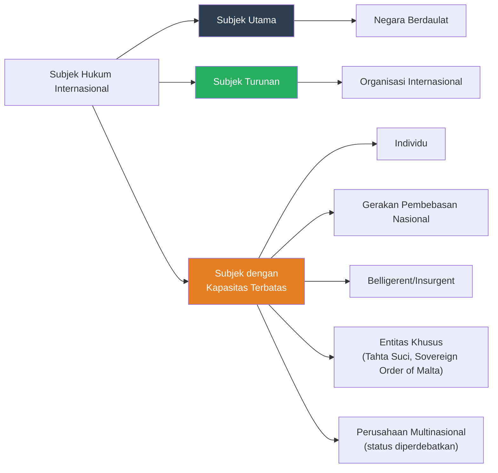
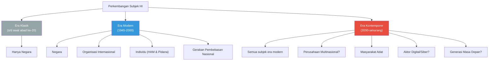

# Bab 3: Subjek Hukum Internasional

## Tujuan Pembelajaran

Setelah mempelajari bab ini, mahasiswa diharapkan mampu:

1. Menjelaskan konsep subjek hukum internasional dan perkembangannya dari masa klasik ke era modern.
2. Menganalisis kriteria kenegaraan berdasarkan Konvensi Montevideo 1933 dan perkembangan selanjutnya.
3. Membedakan teori pengakuan deklaratif dan konstitutif serta implikasinya dalam praktik.
4. Menguraikan kedudukan organisasi internasional sebagai subjek hukum internasional.
5. Memahami perkembangan status individu sebagai subjek hukum internasional.
6. Mengidentifikasi entitas lain yang memiliki kapasitas hukum internasional.
7. Menganalisis prinsip hak penentuan nasib sendiri dan penerapannya.
8. Mengevaluasi posisi Indonesia dalam isu pengakuan negara dan subjek hukum internasional.

---

## 3.1 Konsep Subjek Hukum Internasional

### 3.1.1 Pengertian

Subjek hukum internasional (*subjects of international law*) adalah entitas yang memiliki kapasitas hukum internasional — yaitu kemampuan untuk memiliki hak dan kewajiban di bawah hukum internasional, serta kemampuan untuk menegakkan hak-hak tersebut melalui mekanisme internasional.

Mahkamah Internasional (ICJ) dalam *Advisory Opinion* tentang *Reparation for Injuries Suffered in the Service of the United Nations* (1949) mendefinisikan subjek hukum internasional sebagai entitas yang "capable of possessing international rights and duties, and [...] has capacity to maintain its rights by bringing international claims" — entitas yang mampu memiliki hak dan kewajiban internasional serta memiliki kapasitas untuk mempertahankan hak-haknya melalui tuntutan internasional.

Definisi ini mengandung dua elemen utama: kepemilikan hak dan kewajiban internasional (*international legal personality*), dan kapasitas untuk bertindak di tingkat internasional (*international legal capacity*), termasuk mengajukan klaim, membuat perjanjian, dan berpartisipasi dalam proses hukum internasional.

### 3.1.2 Perkembangan Historis

Dalam hukum internasional klasik (abad ke-17 hingga awal abad ke-20), negara merupakan satu-satunya subjek hukum internasional. Pandangan ini, yang dikenal sebagai doktrin eksklusivitas negara, dianut oleh para positivis seperti Lassa Oppenheim, yang menulis: "Since the Law of Nations is based on the common consent of individual States, and not of individual human beings, States solely and exclusively are the subjects of International Law."

Pandangan ini mulai bergeser pada abad ke-20. Beberapa faktor mendorong perluasan konsep subjek hukum internasional:

Pertama, pendirian organisasi internasional — dimulai dari Liga Bangsa-Bangsa (1919) dan dilanjutkan oleh PBB (1945) — menimbulkan pertanyaan tentang status hukum entitas non-negara ini dalam hukum internasional. ICJ menjawab pertanyaan ini secara afirmatif dalam *Advisory Opinion* tentang *Reparation for Injuries* (1949).

Kedua, perkembangan hukum hak asasi manusia internasional sejak 1948 memberikan hak-hak langsung kepada individu di bawah hukum internasional, meskipun mekanisme penegakannya masih terbatas.

Ketiga, pendirian tribunal pidana internasional — dimulai dari Nuremberg (1945-1946) hingga ICC (2002) — menetapkan kewajiban hukum internasional langsung bagi individu, khususnya tanggung jawab pidana atas kejahatan internasional.

Keempat, munculnya gerakan pembebasan nasional, entitas *de facto*, dan aktor non-negara lainnya dalam hubungan internasional mendorong pengakuan terhadap pluralitas subjek hukum internasional.

### 3.1.3 Spektrum Subjek Hukum Internasional

Subjek hukum internasional saat ini tidak lagi terbatas pada negara, melainkan mencakup spektrum entitas dengan tingkat kapasitas hukum yang berbeda-beda.

ICJ dalam *Reparation for Injuries* (1949) menegaskan bahwa "the subjects of law in any legal system are not necessarily identical in their nature or in the extent of their rights" — subjek hukum dalam suatu sistem hukum tidak harus identik dalam sifat maupun jangkauan hak-haknya. Dengan kata lain, pengakuan sebagai subjek hukum internasional tidak berarti bahwa suatu entitas memiliki hak dan kewajiban yang setara dengan negara.

---

## 3.2 Negara sebagai Subjek Utama

### 3.2.1 Kriteria Kenegaraan: Konvensi Montevideo 1933

Negara merupakan subjek hukum internasional utama (*primary subject*). Kriteria kenegaraan yang paling sering dirujuk berasal dari Pasal 1 Konvensi Montevideo tentang Hak dan Kewajiban Negara (*Convention on the Rights and Duties of States*, 1933):

> "The State as a person of international law should possess the following qualifications: (a) a permanent population; (b) a defined territory; (c) government; and (d) capacity to enter into relations with other States."

Meskipun Konvensi Montevideo secara formal hanya merupakan perjanjian regional Amerika (diadopsi pada Konferensi Ketujuh Negara-Negara Amerika di Montevideo, Uruguay), kriteria ini secara luas diterima sebagai pernyataan hukum kebiasaan internasional tentang syarat-syarat kenegaraan.

### 3.2.2 Penduduk Tetap (*Permanent Population*)

Syarat pertama adalah adanya penduduk tetap — yaitu suatu komunitas manusia yang secara stabil mendiami suatu wilayah. Tidak ada persyaratan jumlah minimum penduduk; negara-negara seperti Nauru (sekitar 10.000 penduduk), Tuvalu (sekitar 12.000), dan Liechtenstein (sekitar 39.000) diakui sebagai negara meskipun penduduknya sangat sedikit.

Yang diperlukan adalah adanya komunitas yang stabil yang dihubungkan dengan wilayah tertentu, meskipun tidak semua anggota komunitas harus tinggal secara permanen di wilayah tersebut. Penduduk nomaden pun memenuhi syarat ini sepanjang mereka memiliki keterkaitan yang stabil dengan suatu wilayah.

Pertanyaan yang lebih sulit muncul dalam konteks entitas seperti Sovereign Order of Malta, yang memiliki "penduduk" berupa anggota ordo yang tersebar di berbagai negara tetapi tidak memiliki penduduk tetap di suatu wilayah. Meskipun Sovereign Order of Malta diakui oleh banyak negara dan memiliki hubungan diplomatik dengan lebih dari 100 negara, statusnya sebagai negara sangat diperdebatkan.

### 3.2.3 Wilayah Tertentu (*Defined Territory*)

Syarat kedua adalah adanya wilayah tertentu yang berada di bawah kendali pemerintah. Penting untuk dipahami bahwa yang diperlukan bukanlah batas wilayah yang ditetapkan secara pasti dan definitif, melainkan adanya suatu wilayah inti yang secara efektif berada di bawah kendali pemerintah.

ICJ dalam kasus *North Sea Continental Shelf* (1969) menyatakan bahwa "there is for instance no rule that the land frontiers of a State must be fully delimited and defined" — tidak ada aturan bahwa batas darat suatu negara harus sepenuhnya didelimitasi dan didefinisikan. Hal ini ditegaskan oleh praktik: Israel diterima sebagai anggota PBB pada tahun 1949 meskipun batas wilayahnya tidak pernah ditetapkan secara definitif.

Sengketa perbatasan dengan negara tetangga tidak menghalangi kenegaraan. Banyak negara yang diakui sah memiliki sengketa perbatasan yang belum terselesaikan — termasuk Indonesia, yang memiliki sengketa delimitasi maritim dengan beberapa negara tetangga.

### 3.2.4 Pemerintahan (*Government*)

Syarat ketiga adalah adanya pemerintahan yang efektif — yaitu otoritas yang menjalankan fungsi-fungsi pemerintahan atas wilayah dan penduduk. Dalam konteks kenegaraan, "pemerintahan" merujuk pada kemampuan untuk menjaga ketertiban internal, melaksanakan fungsi legislatif, eksekutif, dan yudikatif, serta menegakkan hukum.

Prinsip efektivitas (*principle of effectiveness*) menentukan bahwa pemerintah harus memiliki kendali efektif atas wilayah dan penduduknya. Namun, prinsip ini tidak bersifat absolut. Dalam konteks dekolonisasi, kenegaraan sering diakui meskipun pemerintahan yang efektif belum sepenuhnya terbentuk — seperti dalam kasus Kongo (1960), Guinea-Bissau (1973), dan Namibia (1990). Prinsip ini menunjukkan bahwa dalam situasi dekolonisasi, hak penentuan nasib sendiri dapat mengesampingkan persyaratan efektivitas.

Demikian pula, negara yang pemerintahannya runtuh atau sangat lemah (*failed state*) tidak kehilangan kenegaraannya. Somalia, misalnya, tetap dianggap sebagai negara meskipun selama bertahun-tahun tidak memiliki pemerintahan pusat yang efektif. Hal ini menunjukkan bahwa setelah kenegaraan tercapai, ia memiliki semacam "kelembaman" (*inertia*) yang membuatnya bertahan meskipun salah satu kriteria Montevideo tidak lagi terpenuhi sepenuhnya.

### 3.2.5 Kapasitas untuk Berhubungan dengan Negara Lain

Syarat keempat — kapasitas untuk berhubungan dengan negara lain (*capacity to enter into relations with other States*) — sering dipahami sebagai kemampuan untuk melakukan hubungan diplomatik dan terlibat dalam hubungan internasional secara mandiri.

Beberapa sarjana mengkritik syarat ini sebagai tidak jelas dan berpotensi sirkular: suatu entitas perlu diakui sebagai negara agar dapat berhubungan dengan negara lain, tetapi kemampuan berhubungan dengan negara lain justru merupakan syarat untuk diakui sebagai negara.

James Crawford menafsirkan syarat ini bukan sebagai pengakuan oleh negara lain (yang akan membuat kenegaraan bergantung pada pengakuan), melainkan sebagai kemerdekaan (*independence*) — yaitu bahwa pemerintah menjalankan otoritasnya atas dasar haknya sendiri, bukan atas mandat atau delegasi dari negara lain. Dengan kata lain, entitas tersebut harus memiliki kedaulatan yang mandiri, bukan merupakan bagian dari atau tunduk pada negara lain.

### 3.2.6 Kriteria Tambahan?

Dalam praktik kontemporer, terdapat perdebatan tentang apakah kriteria Montevideo masih memadai atau perlu dilengkapi dengan kriteria tambahan. Beberapa kriteria yang diusulkan atau diterapkan dalam praktik meliputi:

**Kepatuhan terhadap hak penentuan nasib sendiri**: Kenegaraan yang diperoleh melalui pelanggaran hak penentuan nasib sendiri mungkin tidak diakui. Contoh: Rhodesia Selatan (1965), yang mendeklarasikan kemerdekaan secara sepihak dari Inggris untuk mempertahankan kekuasaan minoritas kulit putih, tidak diakui oleh masyarakat internasional.

**Larangan penggunaan kekerasan**: Kenegaraan yang diperoleh melalui penggunaan kekerasan yang melanggar hukum internasional mungkin tidak diakui. Contoh: Dewan Keamanan PBB menolak mengakui kemerdekaan "Republik Turki Siprus Utara" yang dideklarasikan setelah invasi militer Turki ke Siprus pada tahun 1974.

**Penghormatan terhadap HAM dan demokrasi**: Pedoman Masyarakat Eropa tentang Pengakuan Negara-Negara Baru di Eropa Timur dan Uni Soviet (1991) mensyaratkan, antara lain, penghormatan terhadap Piagam PBB, HAM, hak-hak minoritas, tidak dapat diganggu-gugatnya batas wilayah, dan komitmen terhadap penyelesaian sengketa secara damai.

**Kepatuhan terhadap hukum internasional secara umum**: Beberapa sarjana berpendapat bahwa entitas yang didirikan melalui pelanggaran serius terhadap hukum internasional — seperti genosida atau agresi — tidak seharusnya diakui sebagai negara, sesuai dengan doktrin kewajiban untuk tidak mengakui (*obligation of non-recognition* atau doktrin *ex iniuria ius non oritur*).

| Kriteria | Montevideo (1933) | Praktik Kontemporer |
|----------|-------------------|---------------------|
| Penduduk tetap | Ya | Ya |
| Wilayah tertentu | Ya | Ya |
| Pemerintahan | Ya | Ya, tetapi fleksibel dalam konteks dekolonisasi |
| Kapasitas hubungan luar negeri | Ya | Ya, ditafsirkan sebagai kemerdekaan |
| Hak penentuan nasib sendiri | Tidak | Ya, semakin penting |
| Larangan penggunaan kekerasan | Tidak | Ya |
| HAM dan demokrasi | Tidak | Kadang diterapkan (terutama Eropa pasca-1991) |
| Legalitas pembentukan | Tidak | Ya, melalui doktrin non-pengakuan |

---

## 3.3 Pengakuan Negara (*Recognition of States*)

### 3.3.1 Pengertian

Pengakuan negara (*recognition of states*) adalah tindakan di mana suatu negara yang ada mengakui bahwa suatu entitas memenuhi syarat-syarat kenegaraan dan berhak atas hak-hak serta kewajiban-kewajiban sebagai negara di bawah hukum internasional.

Pengakuan merupakan salah satu topik paling kontroversial dalam hukum internasional. Pertanyaan sentral yang diperdebatkan adalah: apakah pengakuan merupakan syarat bagi kenegaraan, atau sekadar pernyataan bahwa syarat-syarat kenegaraan telah terpenuhi? Dua teori utama yang saling bersaing dalam menjawab pertanyaan ini adalah teori konstitutif dan teori deklaratif.

### 3.3.2 Teori Konstitutif

Teori konstitutif (*constitutive theory*) berpandangan bahwa pengakuan oleh negara-negara lain merupakan syarat yang diperlukan (*constitutive requirement*) bagi kenegaraan. Menurut teori ini, suatu entitas baru menjadi negara dan memperoleh personalitas hukum internasional setelah diakui oleh negara-negara lain.

Tokoh-tokoh yang mendukung teori konstitutif antara lain Lassa Oppenheim, yang menulis bahwa "a State is, and becomes, an International Person through recognition only and exclusively" — suatu negara ada dan menjadi pribadi hukum internasional hanya dan semata-mata melalui pengakuan. Juga Hersch Lauterpacht, yang meskipun menganut teori konstitutif, berpendapat bahwa pengakuan seharusnya merupakan kewajiban hukum (bukan diskresi politik) apabila syarat-syarat kenegaraan telah terpenuhi.

**Kelemahan teori konstitutif**:

Pertama, teori ini menimbulkan masalah relativitas kenegaraan: jika pengakuan bersifat konstitutif, maka suatu entitas mungkin menjadi negara vis-à-vis negara yang mengakuinya tetapi bukan negara vis-à-vis negara yang belum mengakuinya. Ini menciptakan situasi yang tidak logis dan tidak praktis.

Kedua, teori ini tidak menjawab pertanyaan tentang berapa banyak pengakuan yang diperlukan untuk membentuk kenegaraan. Apakah cukup satu pengakuan? Apakah perlu mayoritas negara? Atau harus seluruh negara?

Ketiga, teori ini dapat digunakan secara politis untuk menolak pengakuan terhadap entitas yang jelas-jelas memenuhi syarat kenegaraan, atau sebaliknya memberikan pengakuan prematur untuk tujuan politik.

### 3.3.3 Teori Deklaratif

Teori deklaratif (*declaratory theory*) berpandangan bahwa pengakuan hanya bersifat deklaratif — ia mengonfirmasi atau mengakui fakta kenegaraan yang telah ada secara objektif. Menurut teori ini, suatu entitas menjadi negara begitu memenuhi kriteria kenegaraan (penduduk tetap, wilayah tertentu, pemerintahan, dan kapasitas hubungan luar negeri), tanpa memerlukan pengakuan dari negara lain.

Teori deklaratif secara eksplisit diadopsi dalam Pasal 3 Konvensi Montevideo: "The political existence of the state is independent of recognition by the other states." Keberadaan politik negara tidak bergantung pada pengakuan oleh negara lain.

Pasal 6 Konvensi Montevideo lebih lanjut menyatakan: "The recognition of a state merely signifies that the state which recognizes it accepts the personality of the other with all the rights and duties determined by international law."

**Kelemahan teori deklaratif**: meskipun secara teoritis lebih konsisten, teori deklaratif juga memiliki kelemahan. Dalam praktiknya, suatu entitas yang memenuhi kriteria Montevideo tetapi tidak diakui oleh negara mana pun akan sangat kesulitan untuk menjalankan fungsi-fungsinya sebagai negara. Pengakuan tetap diperlukan untuk hubungan diplomatik, partisipasi dalam organisasi internasional, dan berbagai aspek praktis lainnya.

### 3.3.4 Praktik Pengakuan Kontemporer

Dalam praktik kontemporer, pengakuan negara merupakan tindakan politik yang dipengaruhi oleh pertimbangan hukum dan politik sekaligus. Tidak ada kewajiban hukum untuk memberikan atau menolak pengakuan, meskipun terdapat kewajiban untuk tidak mengakui (*obligation of non-recognition*) entitas yang dibentuk melalui pelanggaran serius terhadap hukum internasional.

Praktik pengakuan kontemporer menunjukkan bahwa sebagian besar negara mengadopsi pendekatan yang menggabungkan elemen dari kedua teori. Mereka mengakui bahwa kenegaraan pada dasarnya bersifat objektif (sesuai dengan teori deklaratif), tetapi juga mengakui bahwa pengakuan memiliki dampak praktis yang sangat signifikan (sesuai dengan aspek tertentu dari teori konstitutif).

### 3.3.5 Pengakuan Pemerintah (*Recognition of Governments*)

Selain pengakuan negara, terdapat pula masalah pengakuan pemerintah — yaitu pengakuan terhadap legitimasi pemerintah baru yang berkuasa di suatu negara, terutama jika perubahan pemerintahan terjadi melalui cara-cara inkonstitusional (seperti kudeta atau revolusi).

Dalam praktik tradisional, negara-negara memberikan atau menolak pengakuan terhadap pemerintah baru berdasarkan berbagai kriteria, terutama efektivitas (apakah pemerintah baru memiliki kendali efektif atas wilayah dan penduduk?) dan legitimasi (apakah pemerintah baru memiliki dukungan rakyat?).

Namun, sejak tahun 1970-an, sejumlah negara — dimulai dengan Inggris pada tahun 1980, diikuti oleh AS dan banyak negara lainnya — mengadopsi kebijakan untuk tidak memberikan pengakuan terhadap pemerintah sama sekali (hanya mengakui negara). Alasannya adalah bahwa pengakuan pemerintah sering disalahgunakan sebagai instrumen politik dan dapat diartikan sebagai dukungan terhadap pemerintah tertentu.

### 3.3.6 Kasus Kosovo

Kosovo merupakan salah satu contoh paling kontroversial dalam masalah pengakuan negara kontemporer. Kosovo mendeklarasikan kemerdekaan dari Serbia pada 17 Februari 2008, setelah bertahun-tahun di bawah administrasi PBB berdasarkan Resolusi Dewan Keamanan 1244 (1999).

Deklarasi kemerdekaan Kosovo segera diakui oleh sejumlah negara, termasuk AS, Inggris, Prancis, dan Jerman, tetapi ditolak oleh Serbia, Rusia, Cina, dan banyak negara lainnya. Hingga tahun 2024, lebih dari 100 negara telah mengakui Kosovo, tetapi Kosovo belum menjadi anggota PBB karena dua anggota tetap Dewan Keamanan (Rusia dan Cina) menentang keanggotaannya.

Pada tahun 2010, ICJ memberikan *Advisory Opinion* tentang *Accordance with International Law of the Unilateral Declaration of Independence in Respect of Kosovo*. Mahkamah memutuskan bahwa deklarasi kemerdekaan Kosovo tidak melanggar hukum internasional umum, Resolusi Dewan Keamanan 1244 (1999), atau Kerangka Konstitusional yang berlaku di Kosovo. Namun, ICJ secara hati-hati membatasi pendapatnya pada pertanyaan yang diajukan dan tidak memutuskan apakah Kosovo telah menjadi negara atau apakah negara-negara berkewajiban untuk mengakuinya.

### 3.3.7 Kasus Timor Leste

Kasus Timor Leste memberikan contoh penting tentang hubungan antara hak penentuan nasib sendiri, pengakuan negara, dan peran organisasi internasional. Timor Leste — bekas koloni Portugis yang diinvasi dan dianeksasi oleh Indonesia pada tahun 1975 — memperoleh kemerdekaannya melalui referendum pada tahun 1999 yang diselenggarakan di bawah pengawasan PBB (UNAMET).

Aneksasi Timor Leste oleh Indonesia tidak pernah diakui oleh Majelis Umum PBB, meskipun beberapa negara (termasuk Australia) secara *de iure* atau *de facto* mengakui kedaulatan Indonesia atas Timor Leste. PBB tetap menganggap Timor Leste sebagai wilayah yang belum berpemerintahan sendiri (*non-self-governing territory*) di bawah Bab XI Piagam PBB, dengan Portugis sebagai penguasa administrasinya (*administering power*).

ICJ dalam kasus *East Timor (Portugal v. Australia)* (1995) mengakui bahwa hak rakyat Timor Leste untuk menentukan nasib sendiri memiliki karakter *erga omnes*, meskipun Mahkamah memutuskan bahwa ia tidak dapat mengadili kasus tersebut karena Indonesia (yang kepentingannya terdampak langsung) bukan pihak dalam sengketa.

Setelah referendum 1999 yang menghasilkan kemenangan bagi kemerdekaan, PBB mendirikan UNTAET (*United Nations Transitional Administration in East Timor*) yang menjalankan fungsi pemerintahan transisi hingga Timor Leste resmi merdeka pada 20 Mei 2002. Timor Leste kemudian diterima sebagai anggota PBB pada 27 September 2002.

### 3.3.8 Kasus Palestina

Status Palestina dalam hukum internasional merupakan salah satu persoalan yang paling kompleks dan kontroversial. Organisasi Pembebasan Palestina (PLO) telah lama diakui sebagai wakil sah rakyat Palestina dan memiliki status pengamat di PBB.

Pada 29 November 2012, Majelis Umum PBB mengadopsi Resolusi 67/19 yang meningkatkan status Palestina dari "entitas pengamat" menjadi "negara pengamat bukan anggota" (*non-member observer State*) di PBB. Resolusi ini diadopsi dengan 138 suara mendukung, 9 menolak, dan 41 abstain. Indonesia termasuk negara yang mendukung resolusi ini.

Pada 10 Mei 2024, Majelis Umum PBB mengadopsi Resolusi ES-10/23 yang mendukung keanggotaan penuh Palestina di PBB, dengan 143 suara mendukung, 9 menolak, dan 25 abstain. Namun, upaya sebelumnya di Dewan Keamanan gagal karena veto AS.

Status Palestina sebagai "negara" dalam pengertian hukum internasional masih diperdebatkan. Pendukung kenegaraan Palestina berargumen bahwa Palestina memenuhi kriteria Montevideo (penduduk, wilayah — meskipun diperdebatkan, pemerintah — Otoritas Nasional Palestina, dan kapasitas hubungan luar negeri) dan telah diakui oleh lebih dari 140 negara. Penentang berpendapat bahwa Palestina tidak memiliki kendali efektif atas wilayahnya karena pendudukan Israel, dan bahwa batas wilayahnya belum ditetapkan secara definitif.

Terlepas dari perdebatan tentang kenegaraannya, Palestina telah menjadi pihak pada berbagai perjanjian internasional, termasuk Konvensi Jenewa Keempat dan Statuta Roma (yang memungkinkan ICC untuk mengadili kejahatan yang dilakukan di wilayah Palestina).

---

## 3.4 Organisasi Internasional sebagai Subjek Hukum

### 3.4.1 Pengertian dan Latar Belakang

Organisasi internasional (*international organizations*) merupakan subjek hukum internasional yang kedua terpenting setelah negara. Mereka didirikan oleh negara-negara melalui perjanjian internasional dan memiliki struktur kelembagaan, tujuan, serta fungsi yang ditentukan oleh instrumen pendiriannya (*constituent instrument*).

Jumlah organisasi internasional telah bertumbuh secara dramatis sejak pertengahan abad ke-20. Dari beberapa organisasi teknis pada abad ke-19 (seperti International Telegraph Union dan Universal Postal Union), kini terdapat ratusan organisasi internasional yang mencakup hampir semua bidang kerja sama antarnegara.

### 3.4.2 *Advisory Opinion* tentang *Reparation for Injuries* (1949)

Putusan ICJ yang paling fundamental tentang status hukum organisasi internasional adalah *Advisory Opinion* tentang *Reparation for Injuries Suffered in the Service of the United Nations* (1949). Kasus ini bermula dari pembunuhan Count Folke Bernadotte, mediator PBB untuk Palestina, oleh kelompok militan Zionis di Yerusalem pada tahun 1948.

Majelis Umum PBB meminta ICJ untuk memberikan nasihat hukum tentang apakah PBB memiliki kapasitas untuk mengajukan klaim internasional terhadap negara yang bertanggung jawab atas kerugian yang diderita PBB atau agen-agennya.

ICJ menjawab secara afirmatif. Mahkamah menyatakan bahwa PBB memiliki personalitas hukum internasional (*international legal personality*) dan kapasitas untuk mengajukan klaim internasional. Beberapa poin penting dari nasihat hukum ini:

Pertama, ICJ menyatakan bahwa subjek hukum dalam suatu sistem hukum tidak harus identik dalam sifat maupun jangkauan hak-haknya. Pengakuan bahwa PBB memiliki personalitas hukum internasional tidak berarti bahwa PBB memiliki hak dan kewajiban yang sama dengan negara.

Kedua, ICJ menggunakan doktrin *implied powers* — bahwa organisasi internasional harus dianggap memiliki kekuasaan yang diperlukan untuk menjalankan fungsi-fungsinya, meskipun kekuasaan tersebut tidak secara eksplisit disebutkan dalam instrumen pendiriannya. Karena PBB ditugaskan untuk menjalankan fungsi-fungsi penting di bidang perdamaian dan keamanan internasional, ia harus memiliki kapasitas hukum yang diperlukan untuk menjalankan fungsi tersebut — termasuk kapasitas untuk mengajukan klaim internasional.

Ketiga, ICJ menyatakan bahwa personalitas hukum internasional PBB bersifat objektif — yaitu, berlaku tidak hanya terhadap negara-negara anggota PBB tetapi juga terhadap negara-negara non-anggota. Ini merupakan pernyataan yang sangat penting karena menyiratkan bahwa personalitas hukum PBB bukan sekadar produk kesepakatan di antara negara-negara anggotanya, melainkan merupakan realitas objektif dalam hukum internasional.

### 3.4.3 Ruang Lingkup Personalitas Hukum Organisasi Internasional

Personalitas hukum internasional organisasi internasional bersifat fungsional — yaitu, terbatas pada kapasitas yang diperlukan untuk menjalankan fungsi-fungsi yang diberikan kepadanya oleh negara-negara anggota melalui instrumen pendiriannya. Ini berbeda dari personalitas hukum negara yang bersifat penuh dan tidak terbatas.

Dalam praktiknya, kapasitas hukum organisasi internasional umumnya mencakup: kemampuan untuk membuat perjanjian internasional (diatur oleh Konvensi Wina tentang Hukum Perjanjian antara Negara dan Organisasi Internasional atau antara Organisasi Internasional, 1986); hak atas kekebalan dan hak istimewa (*privileges and immunities*); kemampuan untuk mengajukan klaim internasional; kapasitas untuk menjalankan fungsi legislatif, administratif, dan yudikatif sesuai dengan mandatnya; dan kemampuan untuk mengelola sumber daya dan merekrut staf.

### 3.4.4 Contoh Organisasi Internasional Utama

| Organisasi | Instrumen Pendirian | Anggota | Fungsi Utama |
|------------|---------------------|---------|--------------|
| PBB | Piagam PBB (1945) | 193 negara | Perdamaian, keamanan, pembangunan, HAM |
| Uni Eropa | Perjanjian tentang Uni Eropa (Maastricht, 1992; Lisbon, 2007) | 27 negara | Integrasi ekonomi dan politik Eropa |
| ASEAN | Deklarasi Bangkok (1967); Piagam ASEAN (2007) | 10 negara | Kerja sama regional Asia Tenggara |
| WTO | Persetujuan Marrakesh (1994) | 164 anggota | Regulasi perdagangan internasional |
| ICC | Statuta Roma (1998) | 124 pihak | Pengadilan kejahatan internasional |
| ITLOS | UNCLOS (1982) | 168 pihak | Penyelesaian sengketa hukum laut |
| NATO | Perjanjian Atlantik Utara (1949) | 32 anggota | Pertahanan kolektif |
| Uni Afrika | Akta Konstitutif (2000) | 55 negara | Kerja sama regional Afrika |
| ICRC | Konvensi Jenewa (1949) | — | Hukum humaniter, bantuan kemanusiaan |

### 3.4.5 Organisasi Internasional dan Tanggung Jawab Hukum

Pertanyaan tentang tanggung jawab organisasi internasional (*responsibility of international organizations*) dibahas secara komprehensif oleh Komisi Hukum Internasional PBB, yang mengadopsi Rancangan Pasal tentang Tanggung Jawab Organisasi Internasional pada tahun 2011 (*Draft Articles on the Responsibility of International Organizations*, DARIO). Rancangan Pasal ini menetapkan bahwa organisasi internasional dapat bertanggung jawab atas tindakan yang melanggar hukum internasional, serupa dengan tanggung jawab negara.

---

## 3.5 Individu sebagai Subjek Hukum Internasional

### 3.5.1 Perkembangan Historis

Status individu sebagai subjek hukum internasional telah mengalami perkembangan yang luar biasa selama satu abad terakhir. Dalam hukum internasional klasik, individu bukan merupakan subjek hukum internasional; mereka hanya dipandang sebagai objek perlindungan melalui mekanisme perlindungan diplomatik (*diplomatic protection*) yang dilaksanakan oleh negaranya.

Pergeseran besar dimulai setelah Perang Dunia I dengan pendirian sistem perlindungan minoritas di bawah Liga Bangsa-Bangsa dan berlanjut setelah Perang Dunia II dengan dua perkembangan utama: pengembangan hukum hak asasi manusia internasional (yang memberikan hak-hak langsung kepada individu) dan perkembangan hukum pidana internasional (yang membebankan kewajiban langsung dan tanggung jawab pidana kepada individu).

### 3.5.2 Individu sebagai Pemegang Hak

Perkembangan hukum HAM internasional sejak 1948 memberikan hak-hak yang semakin luas kepada individu di bawah hukum internasional. Instrumen-instrumen utama meliputi:

**Deklarasi Universal Hak Asasi Manusia (1948)**: Meskipun diadopsi sebagai resolusi Majelis Umum PBB yang tidak mengikat, DUHAM secara luas dianggap telah menjadi hukum kebiasaan internasional (setidaknya sebagian ketentuannya) dan memberikan kerangka normatif untuk hak-hak individu.

**Kovenan Internasional tentang Hak Sipil dan Politik (ICCPR, 1966)**: Perjanjian mengikat yang menjamin hak-hak sipil dan politik individu. Protokol Opsional Pertama ICCPR memungkinkan individu untuk mengajukan pengaduan langsung ke Komite HAM PBB — suatu mekanisme yang secara langsung memberikan kapasitas hukum kepada individu di tingkat internasional.

**Konvensi Eropa tentang Hak Asasi Manusia (1950)**: Di bawah Konvensi ini, individu memiliki hak untuk mengajukan pengaduan langsung ke Pengadilan Hak Asasi Manusia Eropa terhadap negara pihak yang dianggap melanggar hak-haknya. Ini merupakan salah satu mekanisme paling maju untuk perlindungan hak individu di tingkat internasional.

**Konvensi Amerika tentang Hak Asasi Manusia (1969)**: Memungkinkan individu untuk mengajukan pengaduan ke Komisi Hak Asasi Manusia Inter-Amerika, yang kemudian dapat mengajukan kasus ke Pengadilan Hak Asasi Manusia Inter-Amerika.

### 3.5.3 Individu sebagai Pemikul Kewajiban: Hukum Pidana Internasional

Perkembangan hukum pidana internasional menjadikan individu sebagai pemikul kewajiban langsung di bawah hukum internasional. Individu dapat dimintai pertanggungjawaban pidana atas kejahatan internasional tertentu, tanpa memerlukan perantaraan hukum nasional.

**Pengadilan Nuremberg (1945-1946)**: Menandai pertama kalinya individu diadili dan dihukum atas kejahatan di bawah hukum internasional. Piagam Nuremberg menetapkan tiga kategori kejahatan: kejahatan terhadap perdamaian (*crimes against peace*), kejahatan perang (*war crimes*), dan kejahatan terhadap kemanusiaan (*crimes against humanity*).

Prinsip paling revolusioner dari Nuremberg adalah bahwa individu — termasuk pejabat negara dan pemimpin militer — dapat dimintai pertanggungjawaban pidana secara langsung di bawah hukum internasional. Tribunal menyatakan: "Crimes against international law are committed by men, not by abstract entities, and only by punishing individuals who commit such crimes can the provisions of international law be enforced."

**Tribunal Pidana Internasional untuk bekas Yugoslavia (ICTY, 1993-2017)** dan **Tribunal Pidana Internasional untuk Rwanda (ICTR, 1994-2015)**: Tribunal-tribunal *ad hoc* ini didirikan oleh Dewan Keamanan PBB untuk mengadili individu yang bertanggung jawab atas kejahatan internasional yang dilakukan selama konflik di bekas Yugoslavia dan genosida Rwanda.

**Mahkamah Pidana Internasional (ICC, 2002-sekarang)**: ICC merupakan pengadilan pidana internasional permanen pertama, didirikan berdasarkan Statuta Roma (1998). ICC memiliki yurisdiksi atas empat jenis kejahatan: genosida (Pasal 6), kejahatan terhadap kemanusiaan (Pasal 7), kejahatan perang (Pasal 8), dan kejahatan agresi (Pasal 8bis, mulai berlaku 2018).

Yurisdiksi ICC bersifat komplementer — yaitu, ICC hanya menjalankan yurisdiksinya apabila negara yang memiliki yurisdiksi tidak mampu atau tidak bersedia (*unwilling or unable*) untuk mengadili kejahatan tersebut secara sungguh-sungguh.

Indonesia bukan pihak pada Statuta Roma dan belum bergabung dengan ICC. Salah satu alasan yang dikemukakan adalah kekhawatiran tentang kedaulatan dan potensi politisasi proses peradilan. Namun, Indonesia memiliki mekanisme nasional untuk mengadili pelanggaran HAM berat melalui UU No. 26 Tahun 2000 tentang Pengadilan Hak Asasi Manusia.

### 3.5.4 Hukum Investasi Internasional

Perkembangan lain yang memperkuat status individu (termasuk badan hukum privat) sebagai subjek hukum internasional adalah perkembangan hukum investasi internasional. Melalui perjanjian investasi bilateral (*bilateral investment treaties*/BIT) dan Konvensi ICSID, investor asing memiliki hak untuk mengajukan klaim langsung terhadap negara tuan rumah di hadapan tribunal arbitrase internasional, tanpa perlu melalui mekanisme perlindungan diplomatik negaranya.

---

## 3.6 Entitas Lain dengan Kapasitas Hukum Internasional

### 3.6.1 Pihak Berperang (*Belligerents*) dan Pemberontak (*Insurgents*)

Dalam hukum internasional, pihak yang terlibat dalam konflik bersenjata non-internasional (perang saudara) dapat memperoleh status hukum tertentu di bawah hukum internasional.

**Belligerents** (pihak berperang) adalah kelompok bersenjata yang terlibat dalam konflik bersenjata dan memenuhi kriteria tertentu, termasuk menguasai wilayah tertentu, memiliki organisasi militer yang terstruktur, dan mematuhi hukum perang. Jika diakui sebagai *belligerent* oleh negara pemerintah atau oleh negara ketiga, kelompok tersebut tunduk pada hak dan kewajiban hukum humaniter internasional. Pengakuan *belligerency* memberikan status subjek hukum internasional yang terbatas — terbatas pada konteks konflik bersenjata dan hukum humaniter.

**Insurgents** (pemberontak) adalah kelompok bersenjata yang memberontak terhadap pemerintah yang sah tetapi belum memenuhi kriteria *belligerency*. Status hukum mereka lebih terbatas dan kurang jelas.

Dalam praktik kontemporer, pengakuan *belligerency* secara formal telah jarang terjadi. Namun, Pasal 3 Bersama Konvensi Jenewa 1949 (*Common Article 3*) dan Protokol Tambahan II (1977) memberikan perlindungan minimum bagi korban konflik bersenjata non-internasional tanpa memerlukan pengakuan *belligerency* secara formal.

### 3.6.2 Gerakan Pembebasan Nasional (*National Liberation Movements*)

Gerakan pembebasan nasional memperoleh pengakuan sebagai subjek hukum internasional terutama dalam konteks dekolonisasi pada tahun 1960-an hingga 1980-an. PBB memberikan status pengamat kepada beberapa gerakan pembebasan nasional, termasuk PLO (Organisasi Pembebasan Palestina) dan SWAPO (South West Africa People's Organisation, untuk Namibia).

Protokol Tambahan I Konvensi Jenewa (1977) memberikan status khusus kepada gerakan pembebasan nasional yang berjuang melawan dominasi kolonial, pendudukan asing, atau rezim rasis, dengan menganggap konflik tersebut sebagai konflik bersenjata internasional (Pasal 1(4)). Namun, ketentuan ini kontroversial dan tidak diterima secara universal.

Dalam era pasca-dekolonisasi, relevansi kategori "gerakan pembebasan nasional" sebagai subjek hukum internasional telah menurun, meskipun beberapa entitas (seperti PLO/Palestina) terus mempertahankan status tersebut.

### 3.6.3 Tahta Suci (*Holy See*)

Tahta Suci (*Holy See*) atau Vatikan merupakan contoh unik dari entitas non-negara yang memiliki personalitas hukum internasional yang luas. Tahta Suci memiliki hubungan diplomatik dengan lebih dari 180 negara, menjadi pihak pada berbagai perjanjian internasional (termasuk Konvensi Jenewa), dan memiliki status pengamat tetap di PBB.

Status hukum Tahta Suci bersifat *sui generis* — unik dan tidak dapat dikategorikan secara tepat ke dalam kategori subjek hukum internasional yang ada. Setelah pendirian Negara Kota Vatikan (*Vatican City State*) melalui Pakta Lateran (1929), Tahta Suci juga memiliki basis teritorial, meskipun personalitas hukum internasionalnya dianggap berasal dari kedudukannya sebagai pimpinan Gereja Katolik Roma, bukan dari kenegaraan Vatikan.

### 3.6.4 Perusahaan Multinasional

Status perusahaan multinasional (*multinational corporations*/MNC) sebagai subjek hukum internasional merupakan salah satu pertanyaan paling kontroversial dalam hukum internasional kontemporer.

Dalam hukum internasional tradisional, perusahaan bukan merupakan subjek hukum internasional; mereka tunduk pada hukum nasional negara tempat mereka didirikan atau beroperasi. Namun, perkembangan hukum investasi internasional telah memberikan hak-hak tertentu kepada perusahaan di bawah hukum internasional, terutama hak untuk mengajukan klaim terhadap negara di hadapan tribunal arbitrase internasional.

Di sisi kewajiban, perkembangan terkini menunjukkan tren menuju pembebanan tanggung jawab langsung kepada perusahaan di bawah hukum internasional, terutama dalam bidang HAM dan lingkungan. Prinsip-Prinsip Panduan PBB tentang Bisnis dan Hak Asasi Manusia (*UN Guiding Principles on Business and Human Rights*, 2011) menetapkan bahwa perusahaan memiliki tanggung jawab untuk menghormati hak asasi manusia. Meskipun Prinsip-Prinsip Panduan ini bersifat *soft law*, mereka telah memberikan pengaruh yang signifikan terhadap praktik perusahaan dan regulasi nasional.

Proses menuju perjanjian mengikat (*binding treaty*) tentang bisnis dan HAM masih berlangsung di bawah kerangka Dewan HAM PBB, meskipun progresnya lambat.

---

## 3.7 Hak Penentuan Nasib Sendiri (*Self-Determination*)

### 3.7.1 Pengertian dan Perkembangan

Hak penentuan nasib sendiri (*right of self-determination*) merupakan prinsip fundamental dalam hukum internasional modern. Ia merujuk pada hak rakyat (*peoples*) untuk secara bebas menentukan status politik mereka dan secara bebas mengembangkan kehidupan ekonomi, sosial, dan budaya mereka.

Prinsip ini dikodifikasi dalam beberapa instrumen penting:

Pasal 1(2) Piagam PBB menyebutkan "penghormatan terhadap prinsip hak yang sama dan penentuan nasib sendiri bangsa-bangsa" sebagai salah satu tujuan PBB. Pasal 1 Bersama ICCPR dan ICESCR (1966) menyatakan: "All peoples have the right of self-determination. By virtue of that right they freely determine their political status and freely pursue their economic, social and cultural development."

Deklarasi tentang Pemberian Kemerdekaan kepada Negara-Negara dan Rakyat-Rakyat Jajahan (Resolusi Majelis Umum 1514(XV), 1960) menyatakan bahwa "subjection of peoples to alien subjugation, domination and exploitation constitutes a denial of fundamental human rights" dan bahwa "all peoples have the right to self-determination."

ICJ telah mengonfirmasi status hukum hak penentuan nasib sendiri dalam beberapa kasus, termasuk *Namibia Advisory Opinion* (1971), *Western Sahara Advisory Opinion* (1975), *East Timor (Portugal v. Australia)* (1995), dan *Legal Consequences of the Construction of a Wall in the Occupied Palestinian Territory* (2004). Dalam kasus *East Timor*, ICJ menyatakan bahwa hak penentuan nasib sendiri memiliki karakter *erga omnes*.

### 3.7.2 Dimensi Penentuan Nasib Sendiri

**Penentuan nasib sendiri eksternal** (*external self-determination*): Merujuk pada hak rakyat untuk menentukan status politik internasional mereka, termasuk hak untuk merdeka, berintegrasi dengan negara lain, atau berasosiasi secara bebas dengan negara lain. Dimensi ini terutama relevan dalam konteks dekolonisasi dan pendudukan asing.

**Penentuan nasib sendiri internal** (*internal self-determination*): Merujuk pada hak rakyat untuk berpartisipasi secara bermakna dalam pemerintahan negara mereka — yaitu, hak atas pemerintahan yang demokratis, perwakilan yang bermakna, dan otonomi budaya. Dimensi ini relevan untuk minoritas dan masyarakat adat dalam negara-negara yang telah merdeka.

### 3.7.3 Siapa yang Memiliki Hak Penentuan Nasib Sendiri?

Pertanyaan tentang siapa yang memenuhi kualifikasi sebagai "rakyat" (*peoples*) yang memiliki hak penentuan nasib sendiri merupakan salah satu pertanyaan paling sulit dalam hukum internasional. Beberapa konteks di mana hak ini diakui secara luas:

**Rakyat di wilayah jajahan**: Hak penentuan nasib sendiri pertama-tama dan terutama diterapkan dalam konteks dekolonisasi. Rakyat di wilayah yang belum berpemerintahan sendiri (*non-self-governing territories*) memiliki hak untuk menentukan status politik mereka.

**Rakyat di bawah pendudukan asing**: Rakyat yang wilayahnya diduduki oleh kekuatan asing memiliki hak penentuan nasib sendiri. Contoh: rakyat Palestina di bawah pendudukan Israel; rakyat Timor Leste di bawah pendudukan Indonesia.

**Rakyat di bawah rezim rasis**: Rakyat yang hidup di bawah rezim diskriminasi rasial sistematis juga diakui memiliki hak penentuan nasib sendiri. Contoh: rakyat Afrika Selatan di bawah *apartheid*.

**Masyarakat adat**: Deklarasi PBB tentang Hak-Hak Masyarakat Adat (2007) mengakui hak penentuan nasib sendiri masyarakat adat, tetapi dengan penekanan pada dimensi internal (otonomi, pemerintahan sendiri) dan bukan dimensi eksternal (pemisahan diri).

### 3.7.4 Penentuan Nasib Sendiri dan Integritas Wilayah

Salah satu ketegangan paling mendasar dalam hukum internasional modern adalah antara hak penentuan nasib sendiri dan prinsip integritas wilayah. Apakah suatu kelompok dalam negara yang telah merdeka memiliki hak untuk memisahkan diri (*secession*)?

Pandangan mayoritas adalah bahwa hak penentuan nasib sendiri pada umumnya tidak mencakup hak untuk memisahkan diri dari negara yang telah merdeka, kecuali dalam keadaan yang sangat luar biasa. Deklarasi tentang Prinsip-Prinsip Hukum Internasional (Resolusi 2625(XXV), 1970) menyatakan bahwa prinsip penentuan nasib sendiri tidak boleh ditafsirkan sebagai membenarkan tindakan yang merusak integritas wilayah negara yang berdaulat dan merdeka, "yang melaksanakan pemerintahannya dengan menghormati prinsip hak yang sama dan penentuan nasib sendiri rakyat."

Klausul ini mengisyaratkan bahwa pemisahan diri mungkin dapat dibenarkan jika suatu negara gagal menghormati hak penentuan nasib sendiri internal rakyatnya — misalnya, melalui diskriminasi sistematis, penindasan berat, atau penolakan akses yang bermakna terhadap pemerintahan. Konsep ini dikenal sebagai "pemisahan diri sebagai upaya terakhir" (*remedial secession*), meskipun statusnya dalam hukum internasional masih sangat diperdebatkan.

Mahkamah Agung Kanada, dalam *Reference re Secession of Quebec* (1998), membahas masalah ini secara komprehensif. Mahkamah menyimpulkan bahwa hukum internasional tidak memberikan hak sepihak kepada Quebec untuk memisahkan diri, tetapi juga tidak melarangnya secara absolut. Mahkamah mengidentifikasi tiga situasi di mana hak penentuan nasib sendiri eksternal (termasuk pemisahan diri) mungkin diakui: rakyat jajahan, rakyat di bawah pendudukan asing, dan kemungkinan dalam situasi di mana rakyat ditolak akses yang bermakna terhadap pemerintahan.

---

## 3.8 Posisi Indonesia dalam Pengakuan Negara

### 3.8.1 Kebijakan Pengakuan Indonesia

Indonesia pada umumnya mengadopsi kebijakan pengakuan yang didasarkan pada teori deklaratif, yaitu bahwa kenegaraan bersifat objektif dan tidak bergantung pada pengakuan. Namun, seperti kebanyakan negara, kebijakan pengakuan Indonesia juga dipengaruhi oleh pertimbangan politik.

Indonesia merupakan salah satu negara yang paling vokal dalam mendukung hak penentuan nasib sendiri, khususnya dalam konteks dekolonisasi dan perjuangan Palestina. Indonesia mengakui Palestina sebagai negara sejak tahun 1988 dan secara konsisten mendukung kemerdekaan Palestina di forum internasional.

Di sisi lain, Indonesia tidak mengakui Kosovo sebagai negara merdeka. Posisi ini mencerminkan kekhawatiran Indonesia bahwa pengakuan terhadap pemisahan diri sepihak Kosovo dapat dijadikan preseden oleh gerakan separatis di wilayah Indonesia. Posisi serupa diambil oleh beberapa negara lain yang menghadapi tantangan serupa, termasuk Spanyol (terkait Catalonia), Cina (terkait Taiwan dan Tibet), dan Rusia (meskipun posisi Rusia berubah setelah pengakuan terhadap Ossetia Selatan dan Abkhazia).

### 3.8.2 Indonesia dan ASEAN

Dalam konteks regional ASEAN, Indonesia berperan penting dalam pengembangan norma-norma tentang kenegaraan dan hubungan antarnegara. Piagam ASEAN (2007) menegaskan prinsip penghormatan terhadap kemerdekaan, kedaulatan, kesetaraan, integritas wilayah, dan identitas nasional semua negara anggota (Pasal 2(2)(a)), serta prinsip non-intervensi dalam urusan dalam negeri negara anggota (Pasal 2(2)(e)).

"ASEAN Way" — pendekatan khas ASEAN yang menekankan konsensus, non-intervensi, dan penyelesaian sengketa secara damai melalui musyawarah — mencerminkan nilai-nilai yang juga terdapat dalam tradisi diplomatik Indonesia.

---

## 3.9 Perkembangan Terkini: Subjek Hukum Internasional di Era Digital

### 3.9.1 Aktor Non-Negara dalam Ruang Siber

Era digital menghadirkan tantangan baru bagi konsep tradisional subjek hukum internasional. Ruang siber (*cyberspace*) bersifat transnasional dan tidak terikat pada batas wilayah negara. Aktor-aktor yang beroperasi di ruang siber — termasuk perusahaan teknologi raksasa, kelompok peretas, dan komunitas daring — memiliki kapasitas untuk memengaruhi hubungan internasional secara signifikan, meskipun status hukum mereka di bawah hukum internasional masih belum jelas.

Perusahaan teknologi seperti Google, Meta, Amazon, dan Microsoft mengelola infrastruktur digital yang digunakan oleh miliaran orang di seluruh dunia. Keputusan mereka tentang moderasi konten, privasi data, dan keamanan siber dapat berdampak pada hak asasi manusia, keamanan nasional, dan hubungan antarnegara. Meskipun mereka belum diakui secara formal sebagai subjek hukum internasional, peran mereka dalam tata kelola global (*global governance*) semakin sulit diabaikan.

### 3.9.2 Kecerdasan Buatan dan Entitas Otonom

Perkembangan kecerdasan buatan (*artificial intelligence*) menimbulkan pertanyaan baru tentang apakah entitas otonom yang berbasis AI dapat atau seharusnya memiliki personalitas hukum. Meskipun pertanyaan ini masih bersifat spekulatif, beberapa sarjana telah mulai membahas implikasinya bagi hukum internasional, terutama dalam konteks senjata otonom (*autonomous weapons systems*) dan kendaraan nirawak (*unmanned vehicles*).

Kelompok Ahli Pemerintah (*Group of Governmental Experts*/GGE) yang dibentuk di bawah Konvensi Senjata Konvensional Tertentu (*Convention on Certain Conventional Weapons*/CCW) telah membahas isu *Lethal Autonomous Weapons Systems* (LAWS), termasuk pertanyaan tentang tanggung jawab hukum atas keputusan yang diambil oleh sistem otonom. Hingga saat ini, belum ada konsensus internasional tentang aturan yang mengatur penggunaan LAWS.

### 3.9.3 Generasi Masa Depan dan Keadilan Antargenerasi

Konsep keadilan antargenerasi (*intergenerational justice*) dalam konteks perubahan iklim dan pelestarian lingkungan menimbulkan pertanyaan tentang apakah generasi masa depan (*future generations*) dapat dianggap sebagai subjek hukum internasional — atau setidaknya sebagai pemegang kepentingan (*stakeholders*) yang dilindungi oleh hukum internasional.

Beberapa perjanjian internasional sudah mengacu pada kepentingan generasi masa depan. Preambul Piagam PBB berbicara tentang "tekad untuk menyelamatkan generasi-generasi yang akan datang dari bencana peperangan." Konvensi UNESCO tentang Warisan Dunia (1972) dan Konvensi tentang Keanekaragaman Hayati (1992) secara implisit melindungi kepentingan generasi masa depan.

Pada tahun 2023, Mahkamah Internasional untuk Keadilan Iklim menjadi topik pembicaraan setelah Majelis Umum PBB meminta *Advisory Opinion* dari ICJ tentang kewajiban negara-negara terkait perubahan iklim (Resolusi 77/276, Maret 2023). Proses ini mencerminkan kesadaran yang semakin besar bahwa hukum internasional perlu mengakomodasi kepentingan generasi mendatang.

### 3.9.4 Masyarakat Adat (*Indigenous Peoples*)

Masyarakat adat memiliki status khusus dalam hukum internasional modern. Deklarasi PBB tentang Hak-Hak Masyarakat Adat (*United Nations Declaration on the Rights of Indigenous Peoples*, UNDRIP, 2007) mengakui berbagai hak masyarakat adat, termasuk hak atas penentuan nasib sendiri (Pasal 3), hak atas otonomi dan pemerintahan sendiri (Pasal 4), hak atas tanah, wilayah, dan sumber daya (Pasal 26), dan hak atas persetujuan atas dasar informasi awal tanpa paksaan (*free, prior and informed consent*/FPIC, Pasal 19 dan 32).

Konvensi ILO No. 169 tentang Masyarakat Adat dan Suku (*Indigenous and Tribal Peoples Convention*, 1989) merupakan satu-satunya perjanjian internasional yang mengikat yang secara khusus mengatur hak-hak masyarakat adat. Indonesia belum meratifikasi konvensi ini, meskipun UUD 1945 (Pasal 18B(2)) mengakui dan menghormati kesatuan-kesatuan masyarakat hukum adat beserta hak-hak tradisionalnya.

Dalam konteks Indonesia, masyarakat adat (*masyarakat hukum adat*) menghadapi berbagai tantangan terkait pengakuan hak atas tanah dan sumber daya alam, partisipasi dalam pengambilan keputusan yang memengaruhi kehidupan mereka, dan pelestarian budaya dan pengetahuan tradisional. Putusan Mahkamah Konstitusi No. 35/PUU-X/2012 tentang Hutan Adat merupakan tonggak penting yang menetapkan bahwa hutan adat bukan lagi hutan negara — sebuah keputusan yang memiliki implikasi signifikan bagi pengakuan hak masyarakat adat atas sumber daya alam.

---

## 3.10 Pertanyaan Refleksi

1. **Konseptual**: Apakah kriteria Montevideo masih memadai untuk menentukan kenegaraan di abad ke-21? Kriteria tambahan apa yang mungkin diperlukan?

2. **Analitis**: Bandingkan kasus Kosovo dan Timor Leste dalam konteks hak penentuan nasib sendiri. Apa persamaan dan perbedaan di antara keduanya? Mengapa masyarakat internasional merespons kedua kasus ini secara berbeda?

3. **Teoretis**: Manakah yang lebih meyakinkan — teori konstitutif atau deklaratif tentang pengakuan negara? Berikan alasan Anda berdasarkan kasus-kasus konkret.

4. **Praktis**: Apakah perusahaan multinasional seharusnya diakui sebagai subjek hukum internasional? Apa manfaat dan risikonya?

5. **Indonesia**: Mengapa Indonesia mengakui Palestina tetapi tidak mengakui Kosovo? Apakah posisi ini konsisten secara hukum?

6. **Kritis**: Apakah hukum internasional memberikan perlindungan yang memadai bagi hak penentuan nasib sendiri? Dalam situasi apa, jika ada, pemisahan diri seharusnya dibenarkan oleh hukum internasional?

7. **Kontemporer**: Bagaimana perkembangan kecerdasan buatan dan dunia maya (*cyberspace*) mungkin memengaruhi konsep kenegaraan dan subjek hukum internasional di masa depan?

---

## 3.10 Glosarium

| Istilah | Definisi |
|---------|---------|
| Subjek hukum internasional | Entitas yang memiliki hak dan kewajiban di bawah hukum internasional |
| Personalitas hukum internasional | Kemampuan untuk memiliki hak dan kewajiban serta bertindak di tingkat internasional |
| Konvensi Montevideo (1933) | Perjanjian yang menetapkan empat kriteria kenegaraan |
| Pengakuan negara | Tindakan negara yang mengakui kenegaraan suatu entitas |
| Teori konstitutif | Pengakuan sebagai syarat pembentukan kenegaraan |
| Teori deklaratif | Pengakuan hanya menyatakan fakta kenegaraan yang sudah ada |
| *Implied powers* | Kekuasaan yang secara tersirat dimiliki organisasi internasional untuk menjalankan fungsinya |
| Hak penentuan nasib sendiri | Hak rakyat untuk menentukan status politik dan pembangunannya secara bebas |
| *Belligerent* | Pihak berperang yang diakui memiliki status hukum tertentu |
| *Jus cogens* | Norma imperatif hukum internasional yang tidak boleh dilanggar |
| *Erga omnes* | Kewajiban yang berlaku terhadap seluruh masyarakat internasional |
| *Failed state* | Negara yang pemerintahannya runtuh atau sangat lemah |
| Pemisahan diri (*secession*) | Tindakan suatu bagian wilayah negara untuk memisahkan diri dan membentuk negara baru |

---

## Daftar Pustaka

### Sumber Utama

- Brownlie, Ian. *Principles of Public International Law*. Edisi ke-9, diedit oleh James Crawford. Oxford: Oxford University Press, 2019.
- Crawford, James. *The Creation of States in International Law*. Edisi ke-2. Oxford: Oxford University Press, 2006.
- Shaw, Malcolm N. *International Law*. Edisi ke-9. Cambridge: Cambridge University Press, 2021.

### Sumber Pendukung

- Aust, Anthony. *Handbook of International Law*. Edisi ke-3. Cambridge: Cambridge University Press, 2010.
- Cassese, Antonio. *Self-Determination of Peoples: A Legal Reappraisal*. Cambridge: Cambridge University Press, 1995.
- Crawford, James. "The Criteria for Statehood in International Law." *British Year Book of International Law* 48 (1976-1977): 93-182.
- Higgins, Rosalyn. *Problems and Process: International Law and How We Use It*. Oxford: Clarendon Press, 1994.
- International Law Commission. "Draft Articles on the Responsibility of International Organizations." (2011).
- Klabbers, Jan. *An Introduction to International Organizations Law*. Edisi ke-4. Cambridge: Cambridge University Press, 2022.
- Lauterpacht, Hersch. *Recognition in International Law*. Cambridge: Cambridge University Press, 1947.

### Kasus-Kasus Penting

- *Reparation for Injuries Suffered in the Service of the United Nations*, Advisory Opinion, ICJ Reports 1949, p. 174.
- *Accordance with International Law of the Unilateral Declaration of Independence in Respect of Kosovo*, Advisory Opinion, ICJ Reports 2010, p. 403.
- *East Timor (Portugal v. Australia)*, Judgment, ICJ Reports 1995, p. 90.
- *Legal Consequences of the Construction of a Wall in the Occupied Palestinian Territory*, Advisory Opinion, ICJ Reports 2004, p. 136.
- *Western Sahara*, Advisory Opinion, ICJ Reports 1975, p. 12.
- *Barcelona Traction, Light and Power Company, Limited (Belgium v. Spain)*, Judgment, ICJ Reports 1970, p. 3.
- *Reference re Secession of Quebec*, [1998] 2 SCR 217 (Supreme Court of Canada).

### Sumber tentang Indonesia

- Indonesia. Undang-Undang Dasar Negara Republik Indonesia Tahun 1945.
- Indonesia. Undang-Undang Nomor 26 Tahun 2000 tentang Pengadilan Hak Asasi Manusia.
- Djalal, Hasjim. *Indonesia and the Law of the Sea*. Jakarta: Centre for Strategic and International Studies, 1995.

---

*Bab ini merupakan bagian dari seri materi ajar Hukum Internasional. Lihat juga: [Bab 1: Pengertian dan Sejarah Hukum Internasional](01_Pengertian_Sejarah_HI.md), [Bab 2: Sumber Hukum Internasional](02_Sumber_Hukum_Internasional.md), [Bab 4: Hubungan Hukum Internasional dan Hukum Nasional](04_Hubungan_HI_Hukum_Nasional.md).*
