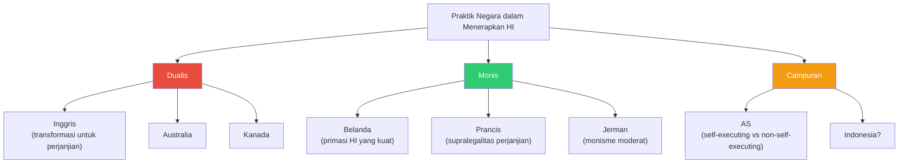

# Bab 4: Hubungan Hukum Internasional dan Hukum Nasional

## Tujuan Pembelajaran

Setelah mempelajari bab ini, mahasiswa diharapkan mampu:

1. Menjelaskan teori monisme dan dualisme serta implikasinya bagi hubungan hukum internasional dan hukum nasional.
2. Menganalisis perbedaan antara doktrin inkorporasi dan doktrin transformasi.
3. Menguraikan praktik berbagai negara (Inggris, Belanda, Amerika Serikat) dalam menerapkan hukum internasional dalam sistem hukum nasional mereka.
4. Menjelaskan posisi Indonesia berdasarkan UUD 1945 dan UU No. 24 Tahun 2000 tentang Perjanjian Internasional.
5. Membedakan perjanjian *self-executing* dan *non-self-executing* serta implikasi praktisnya.
6. Menganalisis hierarki norma: kedudukan perjanjian internasional vis-à-vis konstitusi dan undang-undang nasional.
7. Mengevaluasi kasus-kasus penting yang membahas hubungan hukum internasional dan hukum nasional.
8. Memahami implementasi hukum internasional dalam sistem hukum Indonesia melalui contoh konkret.

---

## 4.1 Pendahuluan: Mengapa Hubungan Ini Penting?

Hubungan antara hukum internasional dan hukum nasional merupakan salah satu pertanyaan paling fundamental dalam teori dan praktik hukum internasional. Pertanyaan ini tidak sekadar akademis; ia memiliki konsekuensi praktis yang sangat nyata.

Bayangkan seorang hakim di pengadilan nasional yang menghadapi kasus di mana hukum nasional bertentangan dengan kewajiban negara di bawah perjanjian internasional. Haruskah hakim tersebut menerapkan hukum nasional, atau harus mengutamakan perjanjian internasional? Jawabannya bergantung pada bagaimana sistem hukum nasional negara tersebut mengatur hubungannya dengan hukum internasional.

Atau bayangkan seorang individu yang ingin memohon perlindungan hak asasi manusia berdasarkan Kovenan Internasional tentang Hak Sipil dan Politik (ICCPR) di hadapan pengadilan nasional. Apakah ia dapat langsung merujuk pada ICCPR, atau harus menunggu sampai ICCPR diimplementasikan ke dalam undang-undang nasional? Jawabannya kembali bergantung pada pendekatan yang dianut oleh sistem hukum nasional.

Pertanyaan-pertanyaan ini diperumit oleh kenyataan bahwa hukum internasional sendiri tidak memberikan jawaban yang definitif tentang bagaimana ia harus diimplementasikan dalam hukum nasional. Seperti yang akan kita lihat, setiap negara mengembangkan pendekatannya sendiri, yang sering kali mencerminkan tradisi hukum, sejarah, dan kebutuhan praktis masing-masing negara.

---

## 4.2 Teori Monisme dan Dualisme

### 4.2.1 Teori Dualisme

Teori dualisme (*dualism*) — yang juga dikenal sebagai pluralisme (*pluralism*) — berpandangan bahwa hukum internasional dan hukum nasional merupakan dua sistem hukum yang terpisah dan independen. Menurut teori ini, kedua sistem hukum memiliki sumber yang berbeda, subjek yang berbeda, dan ruang lingkup yang berbeda.

Tokoh utama teori dualisme adalah **Heinrich Triepel** (1868-1946), seorang sarjana hukum Jerman. Dalam karyanya *Völkerrecht und Landesrecht* (1899), Triepel berargumen bahwa hukum internasional dan hukum nasional berbeda dalam hal: sumber hukumnya — hukum internasional bersumber dari kehendak bersama negara-negara (*Vereinbarung*), sedangkan hukum nasional bersumber dari kehendak negara tunggal; subjek hukumnya — hukum internasional mengatur hubungan antarnegara, sedangkan hukum nasional mengatur hubungan antara negara dan individu atau antarindividu; serta ruang lingkupnya — hukum internasional beroperasi di tingkat internasional, sedangkan hukum nasional beroperasi di tingkat nasional.

**Dionisio Anzilotti** (1867-1950), seorang sarjana hukum Italia yang juga menjadi Hakim dan Presiden PCIJ, mengembangkan teori dualisme lebih lanjut. Anzilotti berpendapat bahwa karena hukum internasional dan hukum nasional merupakan dua sistem yang terpisah, maka norma hukum internasional tidak dapat secara langsung berlaku dalam sistem hukum nasional. Agar hukum internasional dapat memiliki efek hukum di tingkat nasional, ia harus terlebih dahulu ditransformasikan (*transformed*) atau diresepsi (*received*) ke dalam hukum nasional melalui tindakan legislatif nasional.

**Implikasi praktis dualisme**:

Pertama, perjanjian internasional yang telah diratifikasi oleh suatu negara tidak secara otomatis menjadi bagian dari hukum nasional. Diperlukan tindakan legislatif tambahan — seperti pengesahan undang-undang implementasi — agar perjanjian tersebut dapat diterapkan oleh pengadilan nasional. Ini berarti ada kemungkinan *gap* waktu antara ratifikasi perjanjian dan implementasinya dalam hukum nasional.

Kedua, konflik antara hukum internasional dan hukum nasional tidak menimbulkan masalah validitas — karena keduanya beroperasi dalam sistem yang berbeda, norma dari satu sistem tidak dapat membatalkan norma dari sistem yang lain. Namun, jika suatu negara gagal mengimplementasikan kewajiban internasionalnya ke dalam hukum nasional, negara tersebut tetap bertanggung jawab secara internasional.

Ketiga, hukum kebiasaan internasional juga tidak secara otomatis menjadi bagian dari hukum nasional. Ia harus diresepsi ke dalam sistem hukum nasional melalui legislasi, keputusan pengadilan, atau mekanisme lainnya.

### 4.2.2 Teori Monisme

Teori monisme (*monism*) berpandangan bahwa hukum internasional dan hukum nasional merupakan bagian dari satu sistem hukum yang tunggal dan terpadu. Menurut teori ini, tidak ada pemisahan fundamental antara keduanya — keduanya merupakan komponen dari tatanan hukum universal yang mengatur perilaku manusia.

Tokoh utama teori monisme adalah **Hans Kelsen** (1881-1973), seorang ahli hukum Austria yang mengembangkan teori hukum murni (*reine Rechtslehre*). Kelsen berpandangan bahwa semua hukum — baik nasional maupun internasional — pada akhirnya berasal dari satu sumber, yaitu norma dasar (*Grundnorm*). Dalam sistem Kelsen, terdapat hierarki norma di mana norma yang lebih tinggi memberikan validitas kepada norma yang lebih rendah.

Kelsen mengidentifikasi dua kemungkinan dalam monisme: **monisme dengan primasi hukum internasional** (*monism with primacy of international law*), di mana hukum internasional berada di puncak hierarki dan memberikan validitas kepada hukum nasional; dan **monisme dengan primasi hukum nasional** (*monism with primacy of national law*), di mana hukum nasional berada di puncak hierarki.

Kelsen sendiri cenderung mendukung monisme dengan primasi hukum internasional. Ia berpendapat bahwa norma dasar (*Grundnorm*) dari seluruh sistem hukum — termasuk hukum nasional — adalah prinsip *pacta sunt servanda* dalam hukum internasional. Dengan kata lain, validitas hukum nasional pada akhirnya berasal dari hukum internasional.

**Georges Scelle** (1878-1961), seorang sarjana hukum Prancis, mengembangkan versi monisme yang lebih radikal. Scelle berpandangan bahwa hukum internasional pada dasarnya merupakan "hukum bangsa-bangsa" yang mengatur individu — bukan negara — dan bahwa pejabat negara (*agents of the state*) sebenarnya menjalankan fungsi ganda (*dédoublement fonctionnel*): sebagai pejabat nasional dan sekaligus sebagai pejabat masyarakat internasional.

**Hersch Lauterpacht** (1897-1960), meskipun seorang positivis, juga mendukung monisme dengan primasi hukum internasional. Lauterpacht berpendapat bahwa individu — bukan negara — merupakan subjek utama hukum, dan bahwa hukum internasional berfungsi sebagai jaminan terakhir terhadap penyalahgunaan kekuasaan negara.

**Implikasi praktis monisme**:

Pertama, perjanjian internasional yang telah diratifikasi secara otomatis menjadi bagian dari hukum nasional tanpa memerlukan tindakan legislatif tambahan. Pengadilan nasional dapat langsung menerapkan perjanjian internasional.

Kedua, dalam hal terjadi konflik antara hukum internasional dan hukum nasional, hukum internasional harus diutamakan (jika monisme dengan primasi hukum internasional dianut).

Ketiga, individu dapat langsung memperoleh hak dan kewajiban dari hukum internasional tanpa perlu perantaraan hukum nasional.

### 4.2.3 Perbandingan Monisme dan Dualisme

| Aspek | Dualisme | Monisme |
|-------|----------|---------|
| Hubungan HI dan HN | Dua sistem terpisah | Satu sistem terpadu |
| Sumber hukum | Berbeda untuk setiap sistem | Satu norma dasar (*Grundnorm*) |
| Tokoh utama | Triepel, Anzilotti | Kelsen, Scelle, Lauterpacht |
| Penerapan HI dalam HN | Perlu transformasi/legislasi | Otomatis (inkorporasi) |
| Konflik HI vs HN | Diselesaikan oleh masing-masing sistem | HI diutamakan (pada monisme dengan primasi HI) |
| Peran pengadilan nasional | Hanya menerapkan HN; HI hanya setelah transformasi | Dapat langsung menerapkan HI |
| Hak individu dari HI | Tidak langsung; perlu implementasi nasional | Langsung |

### 4.2.4 Kritik dan Evaluasi

Dalam praktiknya, baik monisme murni maupun dualisme murni jarang dianut secara konsisten oleh negara mana pun. Sebagian besar negara mengadopsi pendekatan yang menggabungkan elemen dari kedua teori, dengan variasi yang signifikan tergantung pada jenis hukum internasional yang dimaksud (perjanjian vs. kebiasaan), bidang hukum yang diatur, dan tradisi hukum nasional.

**Gerald Fitzmaurice**, mantan hakim ICJ, mengkritik bahwa perdebatan monisme-dualisme sebenarnya bersifat "unreal, artificial and strictly beside the point." Menurutnya, yang penting bukan teori abstrak tentang hubungan kedua sistem, melainkan mekanisme praktis yang digunakan untuk mengimplementasikan hukum internasional dalam sistem hukum nasional.

**Ian Brownlie** juga mencatat bahwa perdebatan ini "has not been profitable" — tidak menghasilkan manfaat yang berarti — karena kedua teori tidak mampu menjelaskan seluruh kompleksitas praktik negara.

Sebagian besar sarjana kontemporer cenderung menganggap bahwa pertanyaan tentang hubungan hukum internasional dan hukum nasional lebih baik didekati secara empiris — dengan menganalisis bagaimana negara-negara secara konkret mengatur hubungan ini — daripada secara teori abstrak.

---

## 4.3 Doktrin Inkorporasi dan Transformasi

### 4.3.1 Doktrin Inkorporasi

Doktrin inkorporasi (*incorporation doctrine*) menyatakan bahwa hukum internasional secara otomatis menjadi bagian dari hukum nasional tanpa memerlukan tindakan legislatif atau yudisial yang khusus. Dengan kata lain, hukum internasional diinkorporasi (*incorporated*) ke dalam hukum nasional secara langsung.

Dalam konteks hukum kebiasaan internasional, doktrin inkorporasi berarti bahwa pengadilan nasional dapat langsung menerapkan aturan hukum kebiasaan internasional tanpa memerlukan undang-undang implementasi. Doktrin ini memiliki akar sejarah yang panjang dalam sistem hukum Inggris, di mana dinyatakan bahwa "international law is part of the law of England" — hukum internasional adalah bagian dari hukum Inggris.

Dalam konteks perjanjian internasional, doktrin inkorporasi berarti bahwa perjanjian yang telah diratifikasi secara otomatis menjadi bagian dari hukum nasional dan dapat langsung diterapkan oleh pengadilan — tanpa memerlukan tindakan transformasi oleh legislatif.

### 4.3.2 Doktrin Transformasi

Doktrin transformasi (*transformation doctrine*) menyatakan bahwa hukum internasional hanya dapat menjadi bagian dari hukum nasional jika telah ditransformasikan ke dalam hukum nasional melalui tindakan legislatif yang khusus. Dengan kata lain, perjanjian internasional yang telah diratifikasi belum memiliki efek hukum di tingkat nasional sampai diimplementasikan melalui undang-undang nasional.

Doktrin ini erat kaitannya dengan teori dualisme dan diterapkan oleh banyak negara, terutama yang mengikuti tradisi *common law* (untuk perjanjian internasional, meskipun bukan untuk hukum kebiasaan). Alasan utama di balik doktrin transformasi adalah pemisahan kekuasaan (*separation of powers*): pembuatan undang-undang merupakan kewenangan legislatif, bukan eksekutif. Jika perjanjian yang diratifikasi oleh eksekutif secara otomatis memiliki kekuatan hukum tanpa persetujuan legislatif, maka eksekutif secara efektif menjalankan fungsi legislatif, yang melanggar prinsip pemisahan kekuasaan.

### 4.3.3 Hubungan dengan Monisme-Dualisme

| Doktrin | Keterkaitan Teori | Penerapan |
|---------|-------------------|-----------|
| Inkorporasi | Cenderung monis | HI otomatis menjadi bagian HN |
| Transformasi | Cenderung dualis | HI perlu dilegislasi untuk berlaku di HN |

Perlu ditekankan bahwa hubungan antara teori (monisme/dualisme) dan doktrin (inkorporasi/transformasi) tidaklah sempurna. Beberapa negara mungkin mengadopsi doktrin inkorporasi untuk hukum kebiasaan internasional tetapi doktrin transformasi untuk perjanjian internasional — suatu pendekatan yang tidak sepenuhnya konsisten dengan monisme atau dualisme murni.

---

## 4.4 Praktik Negara-Negara

### 4.4.1 Inggris: Pendekatan Dualis

Inggris merupakan contoh klasik dari negara yang mengadopsi pendekatan dualis, setidaknya untuk perjanjian internasional.

**Perjanjian internasional**: Dalam sistem hukum Inggris, perjanjian internasional yang telah diratifikasi oleh pemerintah (*Crown*) tidak secara otomatis menjadi bagian dari hukum nasional. Diperlukan tindakan legislatif — yaitu pengesahan undang-undang oleh Parlemen (*Act of Parliament*) — agar ketentuan perjanjian dapat diterapkan oleh pengadilan Inggris. Prinsip ini dikukuhkan dalam kasus *The Parlement Belge* (1879) dan *J.H. Rayner (Mincing Lane) Ltd v. Department of Trade and Industry* (1990), di mana House of Lords menegaskan bahwa perjanjian yang belum dilegislasi (*unincorporated treaties*) tidak memiliki efek hukum langsung dalam hukum Inggris.

Alasan utama di balik pendekatan ini adalah prinsip kedaulatan Parlemen (*parliamentary sovereignty*). Jika perjanjian yang diratifikasi oleh eksekutif secara otomatis menjadi hukum, maka eksekutif secara efektif dapat mengubah hukum domestik tanpa persetujuan Parlemen. Contoh implementasi: *Human Rights Act 1998* menginkorporasikan Konvensi Eropa tentang HAM ke dalam hukum Inggris; *Geneva Conventions Act 1957* mengimplementasikan Konvensi Jenewa 1949.

Namun, bahkan perjanjian yang belum diimplementasikan ke dalam undang-undang dapat memiliki pengaruh tidak langsung. Dalam kasus *R v Secretary of State for the Home Department, ex parte Brind* (1991), House of Lords menyatakan bahwa meskipun Konvensi Eropa tentang HAM (sebelum Human Rights Act 1998) tidak berlaku langsung dalam hukum Inggris, pengadilan dapat memperhitungkannya dalam menginterpretasikan undang-undang yang ambigu, dengan menerapkan presumsi bahwa Parlemen tidak bermaksud melegislasi secara bertentangan dengan kewajiban internasional Inggris.

**Hukum kebiasaan internasional**: Berbeda dengan perjanjian, hukum kebiasaan internasional secara tradisional dianggap sebagai bagian dari *common law* Inggris melalui doktrin inkorporasi. Prinsip ini dinyatakan oleh Lord Talbot dalam kasus *Barbuit's Case* (1737): "the law of nations in its full extent was part of the law of England."

Namun, doktrin ini mendapat tantangan dalam kasus *Trendtex Trading Corporation v. Central Bank of Nigeria* (1977). Dalam kasus ini, Court of Appeal membahas panjang lebar tentang apakah hukum kebiasaan internasional diinkorporasi secara otomatis ke dalam hukum Inggris (doktrin inkorporasi) atau memerlukan adopsi oleh pengadilan melalui preseden (doktrin transformasi).

Lord Denning, dalam pendapat mayoritas, mendukung doktrin inkorporasi: hukum kebiasaan internasional adalah bagian dari hukum Inggris secara otomatis, dan perubahan dalam hukum kebiasaan internasional secara otomatis tercermin dalam hukum Inggris — tanpa memerlukan keputusan pengadilan atau tindakan legislatif yang baru. Hal ini berarti bahwa jika kekebalan negara asing berubah dalam hukum kebiasaan internasional (misalnya, dari kekebalan absolut ke kekebalan terbatas), maka pengadilan Inggris harus menerapkan aturan baru tersebut, meskipun preseden Inggris yang ada masih mencerminkan aturan lama.

Pendapat Lord Denning ini secara luas diterima, meskipun terdapat kualifikasi penting: hukum kebiasaan internasional hanya dapat diterapkan oleh pengadilan Inggris sepanjang tidak bertentangan dengan undang-undang (*statute law*) yang berlaku. Jika terdapat konflik, undang-undang yang berlaku diutamakan.

### 4.4.2 Belanda: Pendekatan Monis

Belanda merupakan contoh paling menonjol dari negara yang mengadopsi pendekatan monis. Konstitusi Belanda secara eksplisit mengatur hubungan antara hukum internasional dan hukum nasional.

**Pasal 93 Konstitusi Belanda** menyatakan: "Provisions of treaties and of resolutions by international institutions which may be binding on all persons by virtue of their contents shall become binding after they have been published." Ketentuan perjanjian dan resolusi organisasi internasional yang berdasarkan isinya dapat mengikat semua orang menjadi mengikat setelah dipublikasikan.

**Pasal 94 Konstitusi Belanda** lebih lanjut menyatakan: "Statutory regulations in force within the Kingdom shall not be applicable if such application is in conflict with provisions of treaties or of resolutions by international institutions that are binding on all persons." Peraturan perundang-undangan yang berlaku tidak akan diterapkan jika penerapannya bertentangan dengan ketentuan perjanjian atau resolusi organisasi internasional yang mengikat semua orang.

Implikasi dari ketentuan ini sangat signifikan. Pertama, perjanjian internasional yang bersifat *self-executing* (*provisions which may be binding on all persons by virtue of their contents*) secara otomatis menjadi bagian dari hukum Belanda setelah dipublikasikan — tanpa memerlukan tindakan legislatif implementasi. Kedua, ketentuan perjanjian yang *self-executing* mengesampingkan hukum nasional yang bertentangan — termasuk undang-undang yang disahkan setelah ratifikasi perjanjian (*lex posterior*). Ini berarti bahwa hukum internasional memiliki kedudukan yang lebih tinggi daripada undang-undang biasa dalam hierarki norma Belanda.

Ketiga — dan ini yang paling luar biasa — banyak sarjana dan yurisprudensi Belanda menafsirkan Pasal 94 bahkan mengesampingkan Konstitusi itu sendiri jika bertentangan dengan perjanjian yang *self-executing*. Ini berarti bahwa dalam sistem Belanda, perjanjian internasional yang *self-executing* memiliki kedudukan yang lebih tinggi daripada Konstitusi — sebuah posisi yang sangat tidak biasa dalam perbandingan konstitusi.

Pengadilan Belanda secara rutin menerapkan perjanjian internasional secara langsung, termasuk ICCPR, Konvensi Eropa tentang HAM, dan Konvensi tentang Hak Anak. Hal ini menjadikan Belanda sebagai salah satu negara paling progresif dalam hal perlindungan hak-hak di bawah hukum internasional melalui pengadilan nasional.

### 4.4.3 Amerika Serikat: Pendekatan Campuran

Amerika Serikat mengadopsi pendekatan yang unik dan kompleks — sering disebut sebagai "campuran" (*mixed*) atau "modifikasi monis" — yang tidak sepenuhnya monis atau dualis.

**Konstitusi AS** memberikan kedudukan khusus kepada perjanjian internasional. Pasal VI, Ayat 2 (dikenal sebagai *Supremacy Clause*) menyatakan: "This Constitution, and the Laws of the United States which shall be made in Pursuance thereof; and all Treaties made, or which shall be made, under the Authority of the United States, shall be the supreme Law of the Land; and the Judges in every State shall be bound thereby, any Thing in the Constitution or Laws of any State to the Contrary notwithstanding."

Ketentuan ini secara eksplisit menjadikan perjanjian internasional sebagai "supreme law of the land" — hukum tertinggi negara — bersama dengan Konstitusi dan undang-undang federal. Ini berarti bahwa perjanjian internasional secara prinsip memiliki kedudukan yang setara dengan undang-undang federal (*federal statute*) dan mengatasi hukum negara bagian (*state law*).

**Doktrin *self-executing treaties***: Dalam kerangka hukum AS, perjanjian internasional dibedakan menjadi *self-executing* dan *non-self-executing*. Pembedaan ini pertama kali ditetapkan oleh Chief Justice John Marshall dalam kasus *Foster v. Neilson* (1829):

> "A treaty is [...] to be regarded in courts of justice as equivalent to an act of the legislature, whenever it operates of itself without the aid of any legislative provision. But when the terms of the stipulation import a contract, when either of the parties engages to perform a particular act, the treaty addresses itself to the political, not the judicial department; and the legislature must execute the contract before it can become a rule for the Court."

Dengan kata lain, perjanjian yang bersifat *self-executing* dapat langsung diterapkan oleh pengadilan tanpa memerlukan undang-undang implementasi, sedangkan perjanjian yang bersifat *non-self-executing* memerlukan tindakan legislatif sebelum dapat diterapkan.

Kriteria untuk menentukan apakah suatu perjanjian bersifat *self-executing* atau tidak telah dikembangkan oleh yurisprudensi AS. Dalam kasus *Medellín v. Texas* (2008), Mahkamah Agung AS memperjelas bahwa perjanjian bersifat *non-self-executing* jika tidak dimaksudkan untuk memiliki efek hukum domestik tanpa undang-undang implementasi. Mahkamah memeriksa teks perjanjian, konteks negosiasi, dan struktur perjanjian untuk menentukan apakah para pihak bermaksud agar perjanjian tersebut berlaku langsung dalam hukum nasional.

**Kasus *Medellín v. Texas* (2008)**: Kasus ini merupakan salah satu putusan terpenting Mahkamah Agung AS tentang hubungan hukum internasional dan hukum nasional. José Ernesto Medellín, warga negara Meksiko yang dihukum mati di Texas, berargumen bahwa putusan ICJ dalam kasus *Avena and Other Mexican Nationals (Mexico v. United States)* (2004) — yang memerintahkan AS untuk meninjau kembali vonis beberapa warga Meksiko karena pelanggaran hak konsuler berdasarkan Konvensi Wina tentang Hubungan Konsuler — harus dilaksanakan oleh pengadilan Texas.

Mahkamah Agung AS memutuskan (6-3) bahwa putusan ICJ tidak bersifat *self-executing* dan karenanya tidak langsung mengikat pengadilan AS. Mahkamah menyatakan bahwa meskipun Piagam PBB dan Statuta ICJ mewajibkan AS untuk melaksanakan putusan ICJ (Pasal 94 Piagam PBB), kewajiban ini bersifat internasional dan tidak secara otomatis menciptakan hukum domestik yang dapat ditegakkan oleh pengadilan. Diperlukan tindakan legislatif oleh Kongres AS untuk mengimplementasikan kewajiban tersebut ke dalam hukum nasional.

Putusan ini mendapat kritik keras dari banyak sarjana hukum internasional karena dianggap melemahkan otoritas ICJ dan kewajiban AS di bawah Piagam PBB. Namun, pendukungnya berpendapat bahwa putusan ini konsisten dengan prinsip pemisahan kekuasaan dalam konstitusi AS.

**Kedudukan hierarkis**: Dalam hierarki norma AS, kedudukan perjanjian internasional bersifat kompleks. Perjanjian berada di bawah Konstitusi — perjanjian yang bertentangan dengan Konstitusi tidak berlaku (*Reid v. Covert*, 1957). Perjanjian setara dengan undang-undang federal — dalam hal konflik, yang lebih baru berlaku (*last-in-time rule* atau *lex posterior derogat legi priori*). Ini berarti Kongres dapat mengesampingkan perjanjian melalui undang-undang yang lebih baru, meskipun AS tetap bertanggung jawab secara internasional jika melanggar perjanjian.

**Hukum kebiasaan internasional di AS**: Dalam yurisprudensi tradisional AS, hukum kebiasaan internasional dianggap sebagai bagian dari hukum federal. *The Paquete Habana* (1900) merupakan kasus penting di mana Mahkamah Agung AS menyatakan: "International law is part of our law, and must be ascertained and administered by the courts of justice of appropriate jurisdiction as often as questions of right depending upon it are duly presented for their determination."

Namun, status tepat hukum kebiasaan internasional dalam hierarki hukum AS masih diperdebatkan. Beberapa sarjana (seperti Louis Henkin) berpendapat bahwa hukum kebiasaan internasional memiliki kedudukan setara dengan undang-undang federal, sedangkan yang lain (seperti Curtis Bradley dan Jack Goldsmith) berpendapat bahwa kedudukannya lebih rendah.

### 4.4.4 Perancis: Monisme Konstitusional

Prancis mengadopsi pendekatan yang monis berdasarkan Konstitusi Republik Kelima (1958). Pasal 55 Konstitusi Prancis menyatakan:

> "Les traités ou accords régulièrement ratifiés ou approuvés ont, dès leur publication, une autorité supérieure à celle des lois, sous réserve, pour chaque accord ou traité, de son application par l'autre partie."

Perjanjian atau persetujuan yang telah diratifikasi atau disetujui secara sah memiliki, sejak publikasinya, otoritas yang lebih tinggi daripada undang-undang, dengan syarat bahwa perjanjian tersebut juga diterapkan oleh pihak lainnya (klausul resiprositas).

Ketentuan ini menempatkan perjanjian internasional di atas undang-undang biasa (*lois*) tetapi di bawah Konstitusi. *Conseil d'État* (Pengadilan Tata Usaha Negara tertinggi) dalam putusan *Nicolo* (1989) dan *Cour de Cassation* (Mahkamah Agung untuk perkara perdata dan pidana) dalam putusan *Société des Cafés Jacques Vabre* (1975) mengonfirmasi bahwa pengadilan Prancis akan mengesampingkan undang-undang nasional yang bertentangan dengan perjanjian internasional, bahkan jika undang-undang tersebut lebih baru daripada perjanjian.

Namun, *Conseil Constitutionnel* (Dewan Konstitusi) dalam putusan tahun 1998 menegaskan bahwa Konstitusi tetap berada di puncak hierarki hukum Prancis dan tidak dapat dikesampingkan oleh perjanjian internasional. Jika perjanjian internasional bertentangan dengan Konstitusi, maka Konstitusi harus diubah terlebih dahulu sebelum perjanjian tersebut dapat diratifikasi.

### 4.4.5 Jerman: Monisme Moderat

Hukum Dasar Jerman (*Grundgesetz*, 1949) mengadopsi pendekatan yang dapat disebut sebagai monisme moderat. Pasal 25 menyatakan:

> "Die allgemeinen Regeln des Völkerrechtes sind Bestandteil des Bundesrechtes. Sie gehen den Gesetzen vor und erzeugen Rechte und Pflichten unmittelbar für die Bewohner des Bundesgebietes."

Aturan-aturan umum hukum internasional merupakan bagian dari hukum federal. Mereka mendahului undang-undang dan secara langsung menciptakan hak dan kewajiban bagi penduduk wilayah federal.

"Aturan-aturan umum hukum internasional" (*allgemeine Regeln des Völkerrechtes*) umumnya ditafsirkan sebagai mencakup hukum kebiasaan internasional dan prinsip umum hukum. Ketentuan ini memberikan kedudukan yang sangat tinggi kepada hukum kebiasaan internasional — di atas undang-undang federal biasa tetapi di bawah Hukum Dasar (*Grundgesetz*).

Untuk perjanjian internasional, Pasal 59(2) Hukum Dasar mensyaratkan persetujuan legislatif (*Zustimmungsgesetz*) sebelum perjanjian yang mengatur hubungan politik atau berkaitan dengan bidang legislasi federal dapat diratifikasi. Setelah disetujui melalui undang-undang, perjanjian memiliki kedudukan setara dengan undang-undang federal biasa.

### 4.4.6 Perbandingan Praktik Negara

| Negara | Pendekatan | Perjanjian | Kebiasaan | Hierarki Perjanjian |
|--------|------------|------------|-----------|---------------------|
| Inggris | Dualis (perjanjian); inkorporasi (kebiasaan) | Transformasi diperlukan | Otomatis bagian dari *common law* | Di bawah undang-undang Parlemen |
| Belanda | Monis | *Self-executing*: otomatis; lainnya: perlu implementasi | Otomatis | Di atas undang-undang; bahkan mungkin di atas Konstitusi |
| AS | Campuran | *Self-executing*: langsung; *non-self-executing*: perlu implementasi | Bagian dari hukum federal | Setara undang-undang federal; di bawah Konstitusi |
| Prancis | Monis | Otomatis setelah ratifikasi dan publikasi | Otomatis | Di atas undang-undang; di bawah Konstitusi |
| Jerman | Monis moderat | Perlu persetujuan legislatif | Otomatis, di atas undang-undang | Setara undang-undang federal; di bawah *Grundgesetz* |

---

## 4.5 Posisi Indonesia

### 4.5.1 Kerangka Konstitusional

Posisi Indonesia dalam perdebatan monisme-dualisme tidak mudah dikategorikan secara tegas. UUD 1945 tidak secara eksplisit mengatur hubungan antara hukum internasional dan hukum nasional dengan cara yang sejelas Konstitusi Belanda atau Prancis.

Ketentuan konstitusional yang paling relevan adalah **Pasal 11 UUD 1945**:

> **Ayat (1)**: "Presiden dengan persetujuan Dewan Perwakilan Rakyat menyatakan perang, membuat perdamaian dan perjanjian dengan negara lain."
>
> **Ayat (2)**: "Presiden dalam membuat perjanjian internasional lainnya yang menimbulkan akibat yang luas dan mendasar bagi kehidupan rakyat yang terkait dengan beban keuangan negara, dan/atau mengharuskan perubahan atau pembentukan undang-undang harus dengan persetujuan Dewan Perwakilan Rakyat."
>
> **Ayat (3)**: "Ketentuan lebih lanjut tentang perjanjian internasional diatur dengan undang-undang."

Pasal 11 ayat (2), yang ditambahkan melalui amandemen ketiga UUD 1945 (2001), memberikan peran yang lebih besar kepada DPR dalam proses pembuatan perjanjian internasional, terutama untuk perjanjian yang memiliki dampak signifikan bagi rakyat.

### 4.5.2 UU No. 24 Tahun 2000 tentang Perjanjian Internasional

UU No. 24 Tahun 2000 mengatur secara lebih terperinci tentang pembuatan dan pengesahan perjanjian internasional. Beberapa ketentuan kunci:

**Pasal 9**: Pengesahan perjanjian internasional dilakukan dengan undang-undang atau keputusan presiden.

**Pasal 10**: Pengesahan perjanjian internasional dilakukan dengan undang-undang apabila berkenaan dengan: (a) masalah politik, perdamaian, pertahanan, dan keamanan negara; (b) perubahan wilayah atau penetapan batas wilayah negara Republik Indonesia; (c) kedaulatan atau hak berdaulat negara; (d) hak asasi manusia dan lingkungan hidup; (e) pembentukan kaidah hukum baru; dan (f) pinjaman dan/atau hibah luar negeri.

**Pasal 11**: Pengesahan perjanjian internasional yang materinya tidak termasuk dalam Pasal 10 dilakukan dengan keputusan presiden.

### 4.5.3 Perdebatan tentang Posisi Indonesia

Terdapat perdebatan yang berlangsung di kalangan sarjana hukum Indonesia tentang apakah Indonesia menganut monisme atau dualisme. Beberapa posisi yang dikemukakan:

**Pandangan bahwa Indonesia menganut dualisme**: Para pendukung pandangan ini menunjuk pada fakta bahwa perjanjian internasional harus "disahkan" (*ratified*) melalui undang-undang atau keputusan presiden sebelum berlaku di Indonesia. Mereka menafsirkan proses pengesahan ini sebagai "transformasi" — yaitu, perjanjian internasional ditransformasikan menjadi hukum nasional melalui undang-undang atau keputusan presiden. Dengan demikian, perjanjian internasional berlaku di Indonesia bukan sebagai hukum internasional, melainkan sebagai hukum nasional (undang-undang atau keputusan presiden).

Damos Dumoli Agusman, mantan Direktur Jenderal Hukum dan Perjanjian Internasional Kementerian Luar Negeri, berargumen bahwa Indonesia pada dasarnya mengadopsi praktik yang bersifat dualis, meskipun tidak secara eksplisit. Ia menunjuk bahwa dalam praktik Indonesia, undang-undang pengesahan (*ratification law*) diperlakukan sebagai instrumen yang mengintegrasikan perjanjian ke dalam hukum nasional.

**Pandangan bahwa Indonesia menganut monisme**: Sebagian sarjana berpendapat bahwa undang-undang pengesahan bukanlah "transformasi" dalam pengertian dualis, melainkan merupakan persetujuan DPR terhadap tindakan presiden untuk mengikatkan negara pada perjanjian — mirip dengan *advice and consent* Senat AS. Menurut pandangan ini, perjanjian berlaku di Indonesia sebagai hukum internasional, bukan karena ditransformasikan menjadi undang-undang.

**Pandangan pragmatis**: Beberapa sarjana berpendapat bahwa Indonesia tidak secara konsisten menganut salah satu teori, melainkan mengadopsi pendekatan pragmatis yang bervariasi tergantung pada konteks. Dalam beberapa kasus, perjanjian diterapkan langsung; dalam kasus lain, diperlukan undang-undang implementasi yang terpisah.

Mahkamah Konstitusi Republik Indonesia telah beberapa kali menyinggung masalah ini, meskipun belum memberikan jawaban yang definitif. Dalam beberapa putusannya, MK tampaknya mengadopsi pendekatan yang pragmatis, mengakui bahwa perjanjian internasional memiliki relevansi hukum dalam sistem hukum Indonesia tetapi tidak selalu memberikan efek langsung.

### 4.5.4 Putusan MK yang Relevan

**Putusan MK No. 33/PUU-IX/2011** — Uji materiil UU No. 38 Tahun 2008 tentang Pengesahan Piagam ASEAN. Dalam putusan ini, MK menyatakan bahwa undang-undang pengesahan perjanjian internasional bersifat *einmalig* (satu kali) — yaitu, undang-undang tersebut hanya berfungsi sebagai persetujuan DPR terhadap tindakan presiden untuk meratifikasi perjanjian, dan setelah ratifikasi selesai, undang-undang tersebut tidak lagi memiliki fungsi normatif yang mandiri. MK membedakan antara undang-undang pengesahan (*ratification law*) dan undang-undang implementasi (*implementing legislation*) — yang terakhir mungkin diperlukan untuk menerjemahkan kewajiban dalam perjanjian ke dalam aturan hukum nasional yang lebih terperinci.

Implikasi dari putusan ini penting karena mengisyaratkan bahwa perjanjian internasional yang telah disahkan mungkin memerlukan undang-undang implementasi terpisah agar ketentuan-ketentuannya dapat diterapkan secara konkret di tingkat nasional — suatu pendekatan yang lebih mendekati dualisme.

**Putusan MK No. 13/PUU-XVI/2018** — terkait pengujian UU Perjanjian Internasional. Dalam putusan ini, MK kembali membahas hubungan antara perjanjian internasional dan hukum nasional, dan menegaskan bahwa perjanjian internasional yang telah disahkan menjadi bagian dari hukum nasional Indonesia. Namun, MK tidak secara eksplisit menentukan kedudukan hierarkis perjanjian internasional vis-à-vis undang-undang biasa.

### 4.5.5 Praktik Implementasi di Indonesia

Dalam praktiknya, Indonesia menggunakan beberapa pendekatan untuk mengimplementasikan perjanjian internasional:

**Implementasi langsung melalui undang-undang pengesahan**: Beberapa perjanjian dianggap cukup terperinci sehingga undang-undang pengesahan saja sudah cukup untuk memungkinkan penerapannya. Contoh: Konvensi Jenewa 1949 yang disahkan melalui UU No. 59 Tahun 1958 — meskipun dalam praktiknya implementasinya memerlukan berbagai peraturan pelengkap.

**Implementasi melalui undang-undang terpisah**: Banyak perjanjian yang memerlukan undang-undang implementasi terpisah yang menerjemahkan kewajiban internasional ke dalam aturan hukum nasional yang lebih terperinci. Contoh: ICCPR dan ICESCR disahkan melalui UU No. 12/2005 dan UU No. 11/2005, tetapi implementasinya bergantung pada berbagai undang-undang sektoral seperti UU No. 39 Tahun 1999 tentang HAM.

**Integrasi ke dalam peraturan perundang-undangan sektoral**: Beberapa kewajiban internasional diintegrasikan ke dalam undang-undang sektoral tanpa merujuk secara eksplisit pada perjanjian internasional yang mendasarinya. Contoh: UU No. 32 Tahun 2009 tentang Perlindungan dan Pengelolaan Lingkungan Hidup mengimplementasikan berbagai kewajiban Indonesia di bawah perjanjian lingkungan internasional.

---

## 4.6 Perjanjian *Self-Executing* dan *Non-Self-Executing*

### 4.6.1 Pengertian

Pembedaan antara perjanjian *self-executing* dan *non-self-executing* merupakan konsep kunci dalam memahami bagaimana perjanjian internasional diterapkan dalam hukum nasional.

**Perjanjian *self-executing*** adalah perjanjian yang, karena sifat dan isinya, dapat diterapkan langsung oleh pengadilan nasional tanpa memerlukan undang-undang implementasi tambahan. Ketentuan perjanjian ini cukup jelas, terperinci, dan lengkap sehingga dapat berfungsi sebagai norma hukum yang operasional.

**Perjanjian *non-self-executing*** adalah perjanjian yang memerlukan tindakan legislatif atau administratif tambahan di tingkat nasional sebelum ketentuan-ketentuannya dapat diterapkan oleh pengadilan. Perjanjian ini mungkin bersifat terlalu umum, memerlukan pengaturan lebih lanjut, atau secara eksplisit mengharuskan para pihak untuk mengadopsi undang-undang implementasi.

### 4.6.2 Kriteria Pembedaan

Beberapa kriteria yang digunakan untuk menentukan apakah suatu ketentuan perjanjian bersifat *self-executing*:

**Kejelasan dan kepastian**: Ketentuan yang cukup jelas dan terperinci sehingga dapat diterapkan tanpa interpretasi lebih lanjut atau peraturan pelengkap cenderung bersifat *self-executing*. Contoh: Pasal 36 Konvensi Wina tentang Hubungan Konsuler, yang menjamin hak individu yang ditahan untuk memberitahu konsulatnya, sering dianggap *self-executing*.

**Objek dan sifat kewajiban**: Ketentuan yang langsung memberikan hak kepada individu atau membebankan kewajiban spesifik kepada negara cenderung lebih *self-executing* daripada ketentuan yang hanya menetapkan kerangka umum atau tujuan kebijakan.

**Niat para pihak**: Apakah para pihak pada perjanjian bermaksud agar ketentuan tersebut berlaku langsung, atau apakah mereka bermaksud agar ketentuan tersebut diimplementasikan melalui undang-undang nasional? Niat ini dapat dilihat dari teks perjanjian, *travaux préparatoires*, dan praktik para pihak.

**Bahasa perjanjian**: Ketentuan yang menggunakan bahasa imperatif dan langsung ("setiap individu berhak atas...") cenderung lebih *self-executing* daripada ketentuan yang menggunakan bahasa programatis ("negara-negara pihak berjanji untuk mengambil langkah-langkah...").

### 4.6.3 Contoh dalam Praktik

| Contoh Ketentuan | Cenderung *Self-Executing* | Cenderung *Non-Self-Executing* |
|------------------|-----------------------------|--------------------------------|
| "Setiap orang berhak atas kehidupan" (Pasal 6 ICCPR) | Ya — hak langsung dan jelas | — |
| "Negara Pihak mengakui hak setiap orang atas standar kehidupan yang layak" (Pasal 11 ICESCR) | — | Ya — memerlukan implementasi kebijakan |
| "Petugas konsuler berhak mengunjungi warga negaranya yang ditahan" (Pasal 36 VCCR) | Ya — kewajiban spesifik dan operasional | — |
| "Negara Pihak berjanji mengambil langkah-langkah legislatif" | — | Ya — secara eksplisit mensyaratkan legislasi |
| Pengaturan tarif bea masuk dalam perjanjian WTO | — | Ya — memerlukan implementasi domestik |

---

## 4.7 Hierarki Norma: Konstitusi versus Perjanjian Internasional

### 4.7.1 Pertanyaan Fundamental

Salah satu pertanyaan paling mendasar dalam hubungan hukum internasional dan hukum nasional adalah: apa yang terjadi jika perjanjian internasional bertentangan dengan konstitusi? Haruskah konstitusi diutamakan (supremasi konstitusi), atau haruskah perjanjian internasional diutamakan (supremasi hukum internasional)?

Jawaban terhadap pertanyaan ini bervariasi tergantung pada perspektif: dari perspektif hukum internasional atau dari perspektif hukum nasional.

### 4.7.2 Perspektif Hukum Internasional

Dari perspektif hukum internasional, jawabannya jelas: hukum internasional diutamakan. Pasal 27 Konvensi Wina tentang Hukum Perjanjian menyatakan: "A party may not invoke the provisions of its internal law as justification for its failure to perform a treaty." Suatu pihak tidak boleh menggunakan ketentuan hukum internalnya sebagai pembenaran atas kegagalannya melaksanakan perjanjian.

Prinsip ini berlaku tanpa kecuali — termasuk untuk ketentuan konstitusional. Dengan kata lain, suatu negara tidak dapat berargumen di hadapan pengadilan internasional bahwa konstitusinya melarang pelaksanaan kewajiban perjanjian tertentu. Jika hukum nasional (termasuk konstitusi) bertentangan dengan kewajiban internasional, negara tersebut wajib mengubah hukum nasionalnya atau menerima konsekuensi tanggung jawab internasional.

PCIJ dalam *Advisory Opinion* tentang *Treatment of Polish Nationals and Other Persons of Polish Origin or Speech in the Danzig Territory* (1932) menegaskan: "a State cannot adduce as against another State its own Constitution with a view to evading obligations incumbent upon it under international law or treaties in force."

### 4.7.3 Perspektif Hukum Nasional

Dari perspektif hukum nasional, jawabannya lebih bervariasi. Sebagian besar negara menempatkan konstitusi di puncak hierarki norma nasional, yang berarti bahwa perjanjian internasional tidak dapat mengesampingkan konstitusi.

| Negara | Kedudukan Perjanjian vs. Konstitusi |
|--------|-------------------------------------|
| AS | Di bawah Konstitusi (*Reid v. Covert*) |
| Prancis | Di bawah Konstitusi; di atas undang-undang |
| Jerman | Di bawah *Grundgesetz*; kebiasaan di atas undang-undang |
| Belanda | Kemungkinan di atas Konstitusi (perdebatan) |
| Indonesia | Tidak jelas; MK belum memutuskan secara definitif |

---

## 4.8 Kasus-Kasus Penting

### 4.8.1 *Medellín v. Texas* (2008) — Mahkamah Agung AS

Kasus ini telah dibahas secara detail di atas (bagian 4.4.3). Pokok-pokok penting:

ICJ dalam kasus *Avena* (2004) memutuskan bahwa AS melanggar Konvensi Wina tentang Hubungan Konsuler dan memerintahkan peninjauan kembali (*review and reconsideration*) vonis terhadap 51 warga Meksiko. Mahkamah Agung AS memutuskan bahwa putusan ICJ tidak bersifat *self-executing* dan tidak dapat ditegakkan langsung oleh pengadilan AS tanpa undang-undang implementasi. Presiden Bush mengeluarkan memorandum yang memerintahkan pengadilan negara bagian untuk meninjau kembali kasus-kasus tersebut, tetapi Mahkamah Agung memutuskan bahwa Presiden juga tidak memiliki kewenangan untuk memerintahkan hal tersebut tanpa otorisasi dari Kongres.

Kasus ini menunjukkan bahwa bahkan dalam sistem yang memberikan kedudukan tinggi kepada perjanjian internasional (seperti AS dengan *Supremacy Clause*), penerapan praktis hukum internasional dalam hukum nasional dapat menghadapi hambatan yang signifikan.

### 4.8.2 *Trendtex Trading Corporation v. Central Bank of Nigeria* (1977) — Court of Appeal Inggris

Kasus ini membahas apakah hukum kebiasaan internasional tentang kekebalan negara diinkorporasi secara otomatis ke dalam hukum Inggris atau memerlukan adopsi melalui preseden.

Lord Denning menyatakan bahwa doktrin inkorporasi berlaku — hukum kebiasaan internasional adalah bagian dari hukum Inggris secara otomatis, dan perubahan dalam hukum kebiasaan internasional secara otomatis tercermin dalam hukum Inggris. Dalam kasus ini, Lord Denning menerapkan doktrin kekebalan terbatas (*restrictive immunity*) — yang sudah menjadi hukum kebiasaan internasional — meskipun preseden Inggris sebelumnya masih menganut doktrin kekebalan absolut.

### 4.8.3 *Sei Fujii v. State of California* (1952) — Mahkamah Agung California

Kasus klasik dalam yurisprudensi AS tentang pembedaan *self-executing* dan *non-self-executing treaties*. Sei Fujii, warga negara Jepang yang tinggal di California, menantang undang-undang California yang melarang orang asing yang tidak memenuhi syarat kewarganegaraan untuk memiliki tanah pertanian (*Alien Land Law*).

Pengadilan banding awalnya memutuskan bahwa undang-undang tersebut tidak sah karena bertentangan dengan Piagam PBB (khususnya ketentuan tentang HAM). Namun, Mahkamah Agung California membatalkan putusan tersebut dan menyatakan bahwa ketentuan HAM dalam Piagam PBB bersifat *non-self-executing* — terlalu umum dan programatis untuk diterapkan langsung oleh pengadilan. Meskipun demikian, Mahkamah Agung California tetap membatalkan *Alien Land Law* berdasarkan Amandemen ke-14 Konstitusi AS (*Equal Protection Clause*).

### 4.8.4 *Minister of State for Immigration and Ethnic Affairs v. Teoh* (1995) — Pengadilan Tinggi Australia

Kasus Australia yang membahas efek hukum dari perjanjian internasional yang belum diimplementasikan. Pengadilan Tinggi Australia memutuskan bahwa ratifikasi Konvensi tentang Hak Anak oleh Australia — meskipun belum diimplementasikan ke dalam undang-undang — menimbulkan "harapan yang sah" (*legitimate expectation*) bahwa pemerintah akan mempertimbangkan kepentingan terbaik anak dalam pengambilan keputusan administratif. Dengan demikian, meskipun perjanjian yang belum diimplementasikan tidak memiliki efek hukum langsung, ia dapat memengaruhi prosedur administratif melalui doktrin harapan yang sah.

### 4.8.5 Kasus *Danzig Railway Officials* (1928) — PCIJ

PCIJ dalam *Advisory Opinion* tentang *Jurisdiction of the Courts of Danzig* (1928) menyatakan bahwa perjanjian internasional dapat secara langsung menciptakan hak dan kewajiban bagi individu jika para pihak bermaksud demikian. Ini merupakan pengakuan awal bahwa individu dapat menjadi penerima langsung hak-hak di bawah perjanjian internasional — suatu gagasan yang kemudian berkembang pesat melalui hukum HAM internasional.

---

## 4.9 Implementasi Hukum Internasional dalam Sistem Hukum Indonesia

### 4.9.1 Implementasi melalui Legislasi

Indonesia telah mengimplementasikan berbagai kewajiban internasional melalui undang-undang sektoral. Beberapa contoh penting:

**Hak Asasi Manusia**: UU No. 39 Tahun 1999 tentang Hak Asasi Manusia mengimplementasikan prinsip-prinsip dari DUHAM, ICCPR, dan ICESCR. UU No. 26 Tahun 2000 tentang Pengadilan Hak Asasi Manusia mengadopsi konsep kejahatan terhadap kemanusiaan dan genosida dari Statuta Roma, meskipun Indonesia bukan pihak pada Statuta tersebut.

**Lingkungan Hidup**: UU No. 32 Tahun 2009 tentang Perlindungan dan Pengelolaan Lingkungan Hidup mengimplementasikan berbagai prinsip hukum lingkungan internasional, termasuk prinsip pembangunan berkelanjutan, prinsip kehati-hatian, dan prinsip pencemar membayar (*polluter pays principle*).

**Hukum Laut**: UU No. 6 Tahun 1996 tentang Perairan Indonesia mengimplementasikan UNCLOS 1982, termasuk konsep perairan kepulauan, laut teritorial, zona ekonomi eksklusif, dan landas kontinen. UU No. 17 Tahun 1985 tentang Pengesahan UNCLOS menjadi dasar hukum ratifikasi.

**Hukum Humaniter**: Indonesia meratifikasi Konvensi Jenewa 1949 melalui UU No. 59 Tahun 1958. Namun, implementasi domestik yang komprehensif masih terbatas. Indonesia belum memiliki undang-undang khusus yang mengatur kejahatan perang, meskipun beberapa aspek hukum humaniter diakomodasi dalam UU No. 26 Tahun 2000 tentang Pengadilan HAM dan KUHP.

**Hukum Perjanjian**: UU No. 24 Tahun 2000 tentang Perjanjian Internasional mengatur prosedur domestik untuk pembuatan dan pengesahan perjanjian, meskipun tidak secara komprehensif mengatur status hukum perjanjian dalam hierarki norma Indonesia.

### 4.9.2 Penerapan oleh Pengadilan Indonesia

Pengadilan Indonesia — baik pengadilan umum, pengadilan tata usaha negara, maupun Mahkamah Konstitusi — secara relatif jarang merujuk secara eksplisit pada hukum internasional dalam putusan-putusannya. Namun, terdapat beberapa contoh penting di mana hukum internasional dirujuk:

Mahkamah Konstitusi dalam beberapa putusannya merujuk pada instrumen HAM internasional (terutama ICCPR dan ICESCR) sebagai acuan interpretatif dalam menafsirkan hak-hak konstitusional. Meskipun MK tidak secara langsung menerapkan ICCPR sebagai norma yang mengikat, MK menggunakannya sebagai panduan untuk memahami cakupan hak-hak yang dijamin oleh UUD 1945.

Pengadilan HAM yang dibentuk berdasarkan UU No. 26 Tahun 2000 menerapkan konsep-konsep dari hukum pidana internasional, termasuk definisi kejahatan terhadap kemanusiaan dan genosida yang diadopsi dari Statuta Roma.

### 4.9.3 Tantangan Implementasi

Beberapa tantangan utama dalam implementasi hukum internasional di Indonesia meliputi:

**Kekosongan legislasi implementasi**: Beberapa perjanjian yang telah diratifikasi belum sepenuhnya diimplementasikan melalui undang-undang sektoral yang memadai. Misalnya, meskipun Indonesia telah meratifikasi ICCPR sejak 2005, belum semua hak yang dijamin oleh Kovenan tersebut diimplementasikan secara penuh dalam undang-undang nasional.

**Kurangnya kesadaran yudisial**: Banyak hakim di Indonesia yang kurang terbiasa dengan hukum internasional dan tidak terlatih untuk menerapkannya dalam putusan mereka. Program pendidikan dan pelatihan tentang hukum internasional bagi hakim dan praktisi hukum perlu diperkuat.

**Ketidakjelasan hierarki**: Ketidakjelasan tentang kedudukan perjanjian internasional dalam hierarki norma Indonesia menciptakan ketidakpastian tentang bagaimana pengadilan seharusnya menyelesaikan konflik antara perjanjian internasional dan undang-undang nasional.

**Koordinasi kelembagaan**: Implementasi hukum internasional sering memerlukan koordinasi antara berbagai kementerian dan lembaga pemerintah, yang dalam praktiknya dapat berjalan lambat dan tidak efisien.

---

## 4.10 Pertanyaan Refleksi

1. **Konseptual**: Apakah perdebatan monisme-dualisme masih relevan di abad ke-21, ataukah pertanyaan tentang hubungan hukum internasional dan hukum nasional lebih baik didekati secara pragmatis?

2. **Komparatif**: Bandingkan pendekatan Belanda (monis kuat) dan Inggris (dualis) terhadap implementasi hukum internasional. Pendekatan mana yang lebih baik melindungi hak-hak individu di bawah hukum internasional?

3. **Analitis**: Dalam kasus *Medellín v. Texas*, apakah Mahkamah Agung AS benar dalam memutuskan bahwa putusan ICJ tidak bersifat *self-executing*? Apa implikasi putusan ini bagi otoritas ICJ?

4. **Indonesia**: Apakah Indonesia menganut monisme atau dualisme? Berikan argumen untuk kedua posisi, dengan merujuk pada UUD 1945, UU No. 24 Tahun 2000, dan putusan MK.

5. **Praktis**: Jika Anda seorang hakim di Indonesia yang menghadapi kasus di mana undang-undang nasional bertentangan dengan ICCPR (yang telah diratifikasi oleh Indonesia), apa yang akan Anda lakukan? Jelaskan penalaran hukum Anda.

6. **Kritis**: Apakah Pasal 27 Konvensi Wina (yang melarang negara menggunakan hukum nasional sebagai pembenaran untuk tidak melaksanakan perjanjian) konsisten dengan prinsip kedaulatan negara?

7. **Kebijakan**: Apakah Indonesia perlu mengamendemen UUD 1945 untuk secara eksplisit mengatur kedudukan hukum internasional dalam hierarki norma nasional? Apa manfaat dan risikonya?

---

## 4.11 Glosarium

| Istilah | Definisi |
|---------|---------|
| Monisme | Teori bahwa hukum internasional dan hukum nasional merupakan satu sistem terpadu |
| Dualisme | Teori bahwa hukum internasional dan hukum nasional merupakan dua sistem terpisah |
| Inkorporasi | Doktrin di mana hukum internasional otomatis menjadi bagian dari hukum nasional |
| Transformasi | Doktrin di mana hukum internasional memerlukan tindakan legislatif untuk berlaku di tingkat nasional |
| *Self-executing treaty* | Perjanjian yang dapat diterapkan langsung tanpa undang-undang implementasi |
| *Non-self-executing treaty* | Perjanjian yang memerlukan undang-undang implementasi |
| *Supremacy Clause* | Pasal VI(2) Konstitusi AS yang menjadikan perjanjian sebagai *supreme law of the land* |
| *Grundnorm* | Norma dasar dalam teori Kelsen yang memberikan validitas pada seluruh sistem hukum |
| *Pacta sunt servanda* | Prinsip bahwa perjanjian mengikat dan harus dilaksanakan dengan iktikad baik |
| *Lex posterior* | Prinsip bahwa aturan yang lebih baru mengesampingkan yang lebih lama |
| *Einmalig* | Istilah yang digunakan MK untuk menjelaskan bahwa UU ratifikasi bersifat satu kali |
| Ratifikasi | Tindakan formal negara untuk mengikatkan diri pada perjanjian internasional |

---

## Daftar Pustaka

### Sumber Utama

- Brownlie, Ian. *Principles of Public International Law*. Edisi ke-9, diedit oleh James Crawford. Oxford: Oxford University Press, 2019.
- Crawford, James. *Brownlie's Principles of Public International Law*. Edisi ke-9. Oxford: Oxford University Press, 2019.
- Shaw, Malcolm N. *International Law*. Edisi ke-9. Cambridge: Cambridge University Press, 2021.

### Sumber Pendukung

- Agusman, Damos Dumoli. *Hukum Perjanjian Internasional: Kajian Teori dan Praktik Indonesia*. Bandung: Refika Aditama, 2010.
- Bradley, Curtis A., dan Jack L. Goldsmith. "Customary International Law as Federal Common Law: A Critique of the Modern Position." *Harvard Law Review* 110 (1997): 815-876.
- Fitzmaurice, Gerald. "The General Principles of International Law Considered from the Standpoint of the Rule of Law." *Recueil des Cours* 92 (1957): 1-227.
- Henkin, Louis. "International Law as Law in the United States." *Michigan Law Review* 82 (1984): 1555-1569.
- Kelsen, Hans. *Principles of International Law*. Edisi ke-2, diedit oleh Robert W. Tucker. New York: Holt, Rinehart and Winston, 1966.
- Kusumaatmadja, Mochtar. *Pengantar Hukum Internasional*. Bandung: Binacipta, 1982.
- Triepel, Heinrich. *Völkerrecht und Landesrecht*. Leipzig: Hirschfeld, 1899.

### Kasus-Kasus Penting

- *Foster v. Neilson*, 27 U.S. (2 Pet.) 253 (1829).
- *The Paquete Habana*, 175 U.S. 677 (1900).
- *Sei Fujii v. State of California*, 38 Cal.2d 718, 242 P.2d 617 (1952).
- *Reid v. Covert*, 354 U.S. 1 (1957).
- *Trendtex Trading Corporation v. Central Bank of Nigeria* [1977] QB 529.
- *R v Secretary of State for the Home Department, ex parte Brind* [1991] 1 AC 696.
- *J.H. Rayner (Mincing Lane) Ltd v. Department of Trade and Industry* [1990] 2 AC 418.
- *Medellín v. Texas*, 552 U.S. 491 (2008).
- *Minister of State for Immigration and Ethnic Affairs v. Teoh* (1995) 183 CLR 273.
- *Avena and Other Mexican Nationals (Mexico v. United States of America)*, Judgment, ICJ Reports 2004, p. 12.
- *Treatment of Polish Nationals and Other Persons of Polish Origin or Speech in the Danzig Territory*, Advisory Opinion, PCIJ Series A/B, No. 44 (1932).
- *Jurisdiction of the Courts of Danzig*, Advisory Opinion, PCIJ Series B, No. 15 (1928).
- Putusan MK No. 33/PUU-IX/2011 tentang Pengujian UU Pengesahan Piagam ASEAN.

### Sumber tentang Indonesia

- Indonesia. Undang-Undang Dasar Negara Republik Indonesia Tahun 1945.
- Indonesia. Undang-Undang Nomor 24 Tahun 2000 tentang Perjanjian Internasional.
- Indonesia. Undang-Undang Nomor 39 Tahun 1999 tentang Hak Asasi Manusia.
- Indonesia. Undang-Undang Nomor 32 Tahun 2009 tentang Perlindungan dan Pengelolaan Lingkungan Hidup.
- Indonesia. Undang-Undang Nomor 6 Tahun 1996 tentang Perairan Indonesia.
- Agusman, Damos Dumoli. "Status Hukum Perjanjian Internasional dalam Hukum Nasional RI." *Indonesian Journal of International Law* 5, no. 3 (2008).

---

*Bab ini merupakan bagian dari seri materi ajar Hukum Internasional. Lihat juga: [Bab 1: Pengertian dan Sejarah Hukum Internasional](01_Pengertian_Sejarah_HI.md), [Bab 2: Sumber Hukum Internasional](02_Sumber_Hukum_Internasional.md), [Bab 3: Subjek Hukum Internasional](03_Subjek_Hukum_Internasional.md).*
