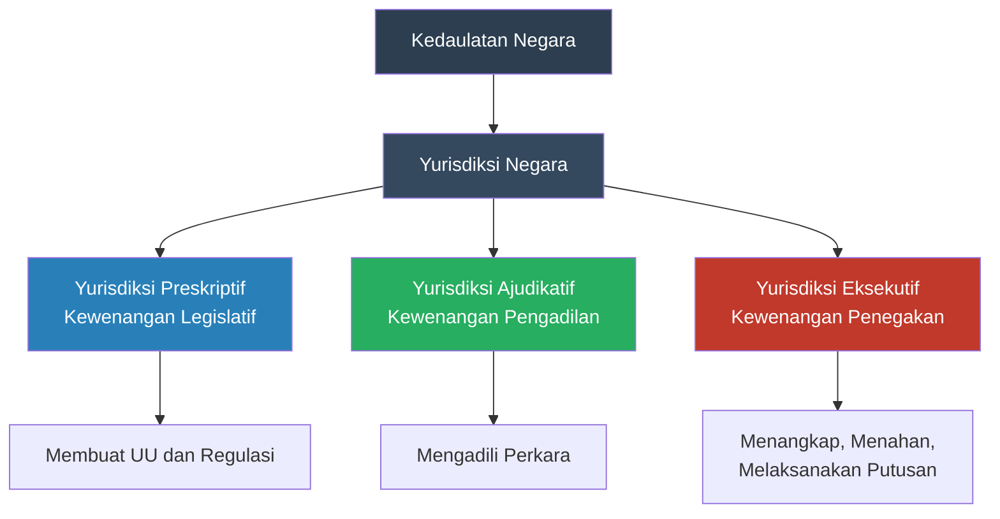
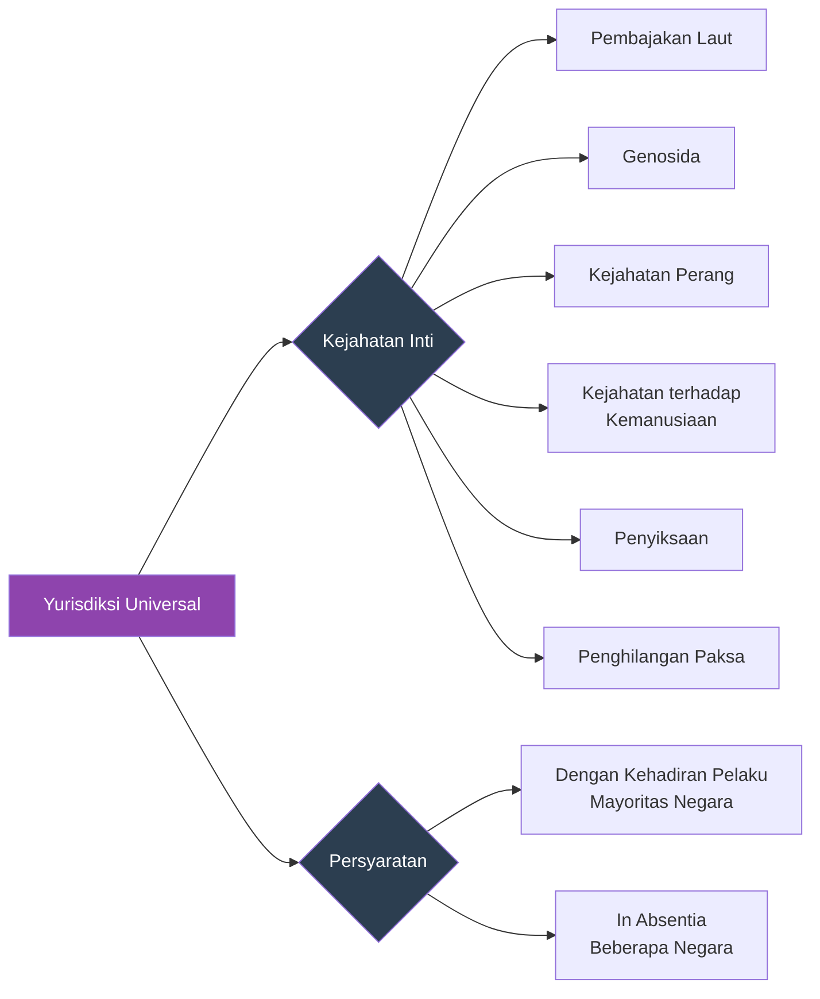
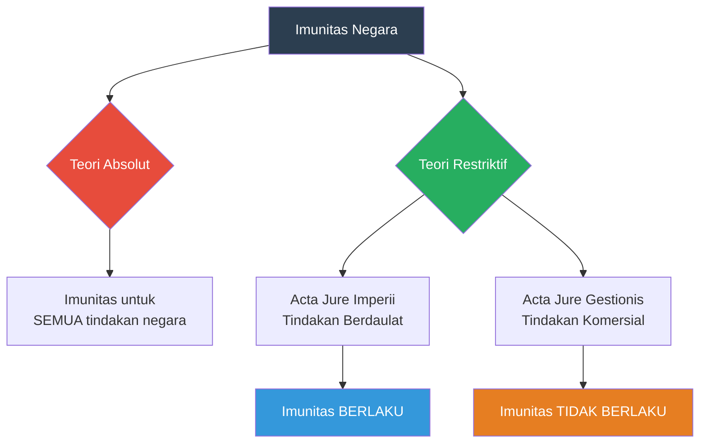
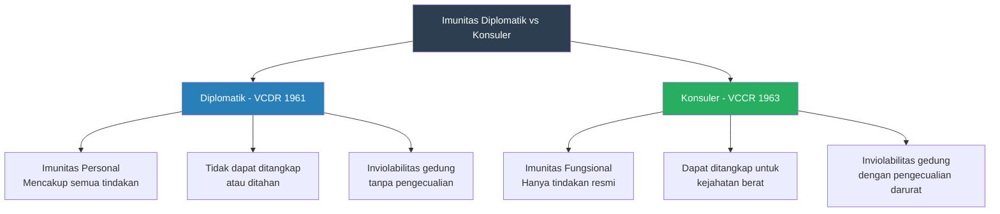

---
title: "Yurisdiksi Negara dalam Hukum Internasional"
tags:
  - hukum-internasional
  - yurisdiksi
  - imunitas-negara
  - imunitas-diplomatik
  - ekstradisi
  - teaching-materials
publish: true
---

# Bab 5: Yurisdiksi Negara dalam Hukum Internasional

## Tujuan Pembelajaran

Setelah mempelajari bab ini, mahasiswa diharapkan mampu:

1. Menjelaskan konsep yurisdiksi negara dalam hukum internasional dan dasar-dasar teoritisnya
2. Mengidentifikasi dan menganalisis berbagai jenis yurisdiksi: teritorial, personal, universal, dan protektif
3. Memahami perbedaan antara yurisdiksi preskriptif, yurisdiksi ajudikatif, dan yurisdiksi eksekutif
4. Menganalisis doktrin imunitas negara, baik teori absolut maupun restriktif
5. Menjelaskan kerangka hukum imunitas diplomatik dan konsuler berdasarkan Konvensi Wina 1961 dan 1963
6. Memahami mekanisme ekstradisi dan bantuan hukum timbal balik (*mutual legal assistance*)
7. Mengevaluasi praktik Indonesia dalam penerapan yurisdiksi dan imunitas melalui peraturan perundang-undangan nasional
8. Menganalisis putusan-putusan pengadilan internasional terkait yurisdiksi dan imunitas negara

---

## 5.1 Pengertian dan Konsep Dasar Yurisdiksi

### 5.1.1 Definisi Yurisdiksi

Yurisdiksi (*jurisdiction*) dalam hukum internasional merujuk pada kewenangan negara untuk mengatur perilaku orang, benda, dan peristiwa melalui hukum domestiknya. Istilah ini berasal dari bahasa Latin *juris dictio*, yang secara harfiah berarti "pernyataan hukum" atau "kekuasaan untuk menyatakan hukum." Dalam konteks hukum internasional publik, yurisdiksi merupakan manifestasi konkret dari kedaulatan negara—ia menentukan sejauh mana suatu negara dapat menjangkau individu, peristiwa, dan hubungan hukum melalui perangkat legislatif, yudikatif, dan eksekutifnya.

Malcolm N. Shaw mendefinisikan yurisdiksi sebagai "the power of a state to affect people, property and circumstances and reflects the basic principles of state sovereignty, equality of states and non-interference in domestic affairs." Definisi ini menegaskan bahwa yurisdiksi bukan sekadar kekuasaan teknis, melainkan cerminan dari prinsip-prinsip fundamental hubungan antarnegara.

James Crawford dalam bukunya *Brownlie's Principles of Public International Law* menekankan bahwa yurisdiksi berkaitan dengan "the right of a state to exercise certain of its powers." Hak ini tidak tak terbatas; ia dibatasi oleh hukum internasional, khususnya oleh prinsip kedaulatan negara lain dan kewajiban-kewajiban internasional yang telah disepakati.

### 5.1.2 Tiga Dimensi Yurisdiksi

Hukum internasional membedakan tiga dimensi yurisdiksi yang saling berkaitan namun berbeda secara konseptual:

**Yurisdiksi Preskriptif (*Prescriptive/Legislative Jurisdiction*)**

Yurisdiksi preskriptif adalah kewenangan negara untuk membuat aturan hukum yang berlaku terhadap orang, benda, atau peristiwa tertentu. Dimensi ini mencakup kekuasaan legislatif untuk mengeluarkan undang-undang, peraturan pemerintah, dan berbagai instrumen normatif lainnya. Sebagai contoh, ketika Indonesia mengundangkan Undang-Undang Nomor 35 Tahun 2009 tentang Narkotika yang menetapkan ancaman pidana bagi peredaran narkotika di wilayah Indonesia, negara sedang menjalankan yurisdiksi preskriptifnya.

Batas yurisdiksi preskriptif ditentukan oleh adanya *nexus* atau hubungan yang cukup erat antara negara yang membuat aturan dengan subjek, objek, atau peristiwa yang diatur. Tanpa nexus yang memadai, pelaksanaan yurisdiksi preskriptif dapat dianggap sebagai pelanggaran kedaulatan negara lain.

**Yurisdiksi Ajudikatif (*Adjudicative/Judicial Jurisdiction*)**

Yurisdiksi ajudikatif merujuk pada kewenangan pengadilan suatu negara untuk mengadili perkara yang melibatkan subjek hukum atau peristiwa tertentu. Dimensi ini menentukan apakah suatu pengadilan berwenang memeriksa dan memutus suatu sengketa. Dalam praktik, yurisdiksi ajudikatif seringkali mengikuti yurisdiksi preskriptif, namun keduanya tidak selalu berjalan seiring. Suatu negara mungkin memiliki kewenangan untuk membuat aturan hukum terhadap peristiwa tertentu, namun pengadilannya tidak berwenang mengadili perkara terkait karena ketiadaan akses terhadap terdakwa atau bukti.

**Yurisdiksi Eksekutif (*Executive/Enforcement Jurisdiction*)**

Yurisdiksi eksekutif adalah kewenangan negara untuk memaksakan ketaatan terhadap aturan hukumnya, termasuk melalui penangkapan, penahanan, penyitaan, dan pelaksanaan putusan pengadilan. Dimensi ini paling terbatas jangkauannya karena secara prinsip, yurisdiksi eksekutif hanya dapat dilaksanakan di dalam wilayah negara bersangkutan. Sebagaimana ditegaskan dalam kasus *SS Lotus* (1927), suatu negara tidak boleh melaksanakan kekuasaan penegakan hukum di wilayah negara lain tanpa persetujuan negara tersebut.

Perbedaan antara ketiga dimensi yurisdiksi ini sangat penting dalam praktik. Suatu negara dapat memiliki yurisdiksi preskriptif yang luas—misalnya, memberlakukan undang-undang antimonopoli yang mencakup perilaku di luar negeri—namun kemampuannya untuk menegakkan aturan tersebut (*enforcement*) terbatas pada apa yang dapat dilakukan di dalam wilayahnya sendiri.

### 5.1.3 Yurisdiksi dalam Hukum Internasional dan Hukum Domestik

Penting untuk membedakan penggunaan istilah "yurisdiksi" dalam hukum internasional dan hukum domestik. Dalam hukum domestik, yurisdiksi umumnya merujuk pada kewenangan pengadilan tertentu untuk mengadili perkara—misalnya, yurisdiksi Pengadilan Negeri Jakarta Pusat atas suatu perkara perdata. Dalam hukum internasional, yurisdiksi memiliki makna lebih luas yang mencakup seluruh kekuasaan publik negara untuk mengatur kehidupan masyarakat.

Hubungan antara yurisdiksi dalam hukum internasional dan hukum domestik bersifat komplementer. Hukum internasional menentukan batas-batas luar kewenangan negara, sementara hukum domestik mengatur tata cara pelaksanaan kewenangan tersebut di dalam kerangka konstitusional masing-masing negara.

---

## 5.2 Yurisdiksi Teritorial

### 5.2.1 Prinsip Dasar Teritorialitas

Yurisdiksi teritorial merupakan dasar yurisdiksi yang paling utama dan paling banyak diterima dalam hukum internasional. Prinsip ini menyatakan bahwa setiap negara memiliki kewenangan penuh dan eksklusif atas segala orang, benda, dan peristiwa yang berada di dalam wilayahnya. Prinsip teritorialitas berakar pada konsep kedaulatan Westphalia yang memandang negara sebagai entitas berdaulat di dalam batas wilayahnya.

Mahkamah Internasional (ICJ) dalam kasus *SS Lotus* (Prancis v. Turki, 1927) menyatakan: "Now the first and foremost restriction imposed by international law upon a State is that—failing the existence of a permissive rule to the contrary—it may not exercise its power in any form in the territory of another State." Pernyataan ini menegaskan bahwa yurisdiksi teritorial adalah titik tolak sekaligus batas bagi pelaksanaan kekuasaan negara.

Wilayah negara yang menjadi dasar yurisdiksi teritorial mencakup:

1. **Daratan (*land territory*)**: seluruh daratan di dalam batas negara, termasuk tanah di bawah permukaan
2. **Perairan pedalaman (*internal waters*)**: sungai, danau, dan perairan di sisi darat garis pangkal
3. **Laut teritorial (*territorial sea*)**: perairan hingga 12 mil laut dari garis pangkal, dengan tunduk pada hak lintas damai
4. **Ruang udara (*airspace*)**: kolom udara di atas daratan dan perairan yang termasuk wilayah negara
5. **Dasar laut dan tanah di bawahnya (*subsoil*): di bawah wilayah daratan dan perairan negara

### 5.2.2 Prinsip Teritorialitas Subjektif dan Objektif

Perkembangan hukum internasional menghasilkan perluasan prinsip teritorialitas menjadi dua varian:

**Prinsip Teritorialitas Subjektif (*Subjective Territorial Principle*)**

Prinsip ini memberikan yurisdiksi kepada negara tempat suatu perbuatan dimulai (*initiated*), meskipun perbuatan tersebut diselesaikan atau akibatnya dirasakan di negara lain. Misalnya, jika seseorang merencanakan dan memulai tindak pidana penipuan di Indonesia namun korbannya berada di Singapura, Indonesia memiliki yurisdiksi berdasarkan prinsip teritorialitas subjektif karena perbuatan dimulai di wilayahnya.

**Prinsip Teritorialitas Objektif (*Objective Territorial Principle*)**

Prinsip ini memberikan yurisdiksi kepada negara tempat suatu perbuatan diselesaikan atau tempat akibat perbuatan tersebut dirasakan, meskipun perbuatan dimulai di negara lain. Prinsip ini telah diterapkan secara luas, khususnya dalam perkara pidana lintas batas dan hukum persaingan usaha.

Kasus *SS Lotus* merupakan tonggak penting dalam pengembangan prinsip teritorialitas objektif. Dalam kasus ini, Mahkamah Tetap Keadilan Internasional (PCIJ) memutuskan bahwa Turki berhak mengadili seorang perwira kapal Prancis yang kapalnya bertabrakan dengan kapal Turki di laut lepas, dengan alasan bahwa akibat tabrakan tersebut (kematian awak kapal Turki) dirasakan di atas kapal berbendera Turki, yang dianggap sebagai perpanjangan wilayah Turki.

Perlu dicatat bahwa keputusan *Lotus* kini sering dikritik karena pendekatannya yang sangat permisif terhadap pelaksanaan yurisdiksi. Pendekatan kontemporer cenderung mensyaratkan adanya hubungan yang substansial (*genuine link*) antara negara dan peristiwa yang hendak diatur, bukan sekadar efek yang dirasakan di wilayah negara.

### 5.2.3 Doktrin Efek (*Effects Doctrine*)

Doktrin efek merupakan perluasan paling kontroversial dari prinsip teritorialitas objektif. Berdasarkan doktrin ini, suatu negara mengklaim yurisdiksi atas perilaku yang terjadi sepenuhnya di luar wilayahnya, dengan dasar bahwa perilaku tersebut menghasilkan efek di dalam wilayahnya.

Doktrin efek paling intensif diterapkan oleh Amerika Serikat dalam bidang hukum persaingan usaha (*antitrust law*). Dalam kasus *United States v. Aluminium Co. of America (Alcoa)* (1945), Pengadilan Banding Amerika Serikat (Second Circuit) menyatakan bahwa Sherman Antitrust Act berlaku terhadap kartel yang dibentuk di luar negeri sepanjang kartel tersebut ditujukan untuk dan menghasilkan efek substansial terhadap perdagangan di Amerika Serikat.

Penerapan doktrin efek ini memicu kontroversi besar dalam hubungan internasional. Banyak negara, termasuk negara-negara Eropa, menentang penerapan ekstrateritorial hukum persaingan usaha Amerika Serikat sebagai pelanggaran kedaulatan mereka. Beberapa negara bahkan mengeluarkan undang-undang pemblokiran (*blocking statutes*) untuk menangkal penerapan ekstrateritorial tersebut—misalnya, Inggris mengeluarkan Protection of Trading Interests Act 1980.

Meskipun kontroversial, doktrin efek kini telah diterima secara lebih luas. Uni Eropa sendiri menerapkan doktrin serupa dalam kasus *Wood Pulp* (1988), di mana Pengadilan Eropa menyatakan bahwa hukum persaingan Uni Eropa berlaku terhadap perusahaan asing yang mengimplementasikan perjanjian kartel di dalam wilayah Uni Eropa.

### 5.2.4 Pengecualian terhadap Yurisdiksi Teritorial

Prinsip teritorialitas tidak bersifat mutlak. Beberapa pengecualian penting terhadap yurisdiksi teritorial meliputi:

1. **Imunitas diplomatik dan konsuler**: Perwakilan diplomatik dan konsuler asing kebal dari yurisdiksi negara penerima berdasarkan Konvensi Wina 1961 dan 1963 (dibahas lebih rinci di Bagian 5.6)
2. **Imunitas negara asing (*state immunity*)**: Negara asing dan organnya tidak dapat diadili oleh pengadilan negara lain berdasarkan prinsip *par in parem non habet imperium* (dibahas di Bagian 5.5)
3. **Imunitas organisasi internasional**: Organisasi internasional menikmati imunitas dari yurisdiksi negara tuan rumah berdasarkan perjanjian kantor pusat dan hukum kebiasaan internasional
4. **Imunitas kepala negara dan pejabat tinggi**: Kepala negara yang sedang menjabat menikmati imunitas dari yurisdiksi pidana negara asing, sebagaimana ditegaskan dalam kasus *Arrest Warrant* (2002)
5. **Pangkalan militer asing**: Berdasarkan perjanjian *Status of Forces Agreement* (SOFA), pasukan militer asing yang ditempatkan di wilayah suatu negara dapat menikmati imunitas tertentu dari yurisdiksi negara penerima

---

## 5.3 Yurisdiksi Personal (Nasionalitas)

### 5.3.1 Prinsip Nasionalitas Aktif (*Active Nationality Principle*)

Prinsip nasionalitas aktif, juga dikenal sebagai prinsip personalitas aktif, memberikan yurisdiksi kepada suatu negara atas tindakan warga negaranya di mana pun tindakan tersebut dilakukan. Dasar pemikirannya adalah bahwa hubungan kewarganegaraan menciptakan ikatan hukum yang berkelanjutan antara negara dan warganya, sehingga negara berhak—dan dalam beberapa hal berkewajiban—mengatur perilaku warganya, termasuk ketika mereka berada di luar negeri.

Prinsip ini diterima secara luas dalam hukum internasional, meskipun ruang lingkup penerapannya bervariasi antarnegara. Negara-negara dengan tradisi hukum sipil (*civil law*), seperti Prancis dan Jerman, menerapkan prinsip nasionalitas aktif secara luas, sedangkan negara-negara *common law*, seperti Inggris dan Amerika Serikat, cenderung lebih berhati-hati dan membatasi penerapannya pada tindak pidana tertentu yang dianggap serius.

**Contoh penerapan prinsip nasionalitas aktif:**

Indonesia menerapkan prinsip ini melalui Pasal 5 ayat (1) KUHP, yang menyatakan bahwa ketentuan pidana dalam perundang-undangan Indonesia berlaku bagi warga negara Indonesia yang melakukan tindak pidana di luar Indonesia, dengan syarat bahwa perbuatan tersebut juga merupakan tindak pidana menurut hukum negara tempat perbuatan dilakukan (*double criminality*). Dalam KUHP baru (UU Nomor 1 Tahun 2023), prinsip ini diatur dalam Pasal 4 yang mengakui berlakunya hukum pidana Indonesia terhadap warga negara Indonesia yang melakukan tindak pidana di luar wilayah Negara Kesatuan Republik Indonesia.

Prancis menerapkan prinsip nasionalitas aktif secara lebih luas. Pasal 113-6 Code pénal Prancis menyatakan bahwa hukum pidana Prancis berlaku terhadap setiap kejahatan (*crime*) yang dilakukan oleh warga negara Prancis di luar wilayah Prancis, dan untuk pelanggaran ringan (*délit*) dengan syarat *double criminality*.

### 5.3.2 Prinsip Nasionalitas Pasif (*Passive Nationality Principle*)

Prinsip nasionalitas pasif memberikan yurisdiksi kepada suatu negara atas tindakan yang dilakukan terhadap warga negaranya di luar negeri, tanpa memandang kewarganegaraan pelaku atau tempat terjadinya perbuatan. Prinsip ini lebih kontroversial dibandingkan nasionalitas aktif karena hubungan antara negara dan peristiwa yang diatur lebih renggang—satu-satunya titik taut adalah bahwa korban merupakan warga negara dari negara yang mengklaim yurisdiksi.

Dalam kasus *SS Lotus*, PCIJ mengakui adanya praktik negara yang menerapkan prinsip nasionalitas pasif, meskipun tidak secara tegas menyatakan bahwa prinsip ini diterima secara universal. Opini Terpisah Hakim Moore justru menolak prinsip ini sebagai dasar yurisdiksi yang sah.

Pada era kontemporer, prinsip nasionalitas pasif telah mendapat penerimaan yang lebih luas, khususnya dalam konteks pemberantasan terorisme. Konvensi-konvensi antiterorisme PBB, seperti International Convention against the Taking of Hostages (1979) dan Convention for the Suppression of Terrorist Bombings (1997), secara eksplisit mengakui yurisdiksi berdasarkan nasionalitas pasif.

**Kasus penting: United States v. Yunis (1991)**

Fawaz Yunis, warga negara Lebanon, membajak pesawat Royal Jordanian Airlines di Bandara Beirut pada tahun 1985. Di antara penumpang yang disandera terdapat beberapa warga negara Amerika Serikat. Amerika Serikat mengklaim yurisdiksi atas Yunis berdasarkan prinsip nasionalitas pasif (karena adanya korban warga negara AS) dan prinsip universalitas (karena pembajakan pesawat merupakan kejahatan internasional).

Pengadilan Distrik Amerika Serikat untuk District of Columbia mengakui kedua dasar yurisdiksi tersebut dan memutuskan bersalah terhadap Yunis. Kasus ini menjadi preseden penting bagi penerapan prinsip nasionalitas pasif dalam konteks pemberantasan terorisme.

### 5.3.3 Nasionalitas Badan Hukum

Penentuan nasionalitas badan hukum (korporasi) untuk tujuan yurisdiksi merupakan persoalan yang lebih kompleks dibandingkan nasionalitas orang perseorangan. Terdapat beberapa kriteria yang digunakan:

1. **Tempat pendirian (*place of incorporation*)**: Badan hukum memiliki nasionalitas negara tempat ia didirikan. Kriteria ini dominan dalam tradisi *common law*.
2. **Tempat kedudukan sesungguhnya (*siège réel/real seat*)**: Badan hukum memiliki nasionalitas negara tempat kegiatan manajemen efektifnya berada. Kriteria ini dominan dalam tradisi *civil law* Eropa.
3. **Kontrol efektif (*effective control*)**: Nasionalitas ditentukan berdasarkan siapa yang secara efektif mengendalikan badan hukum tersebut.

ICJ dalam kasus *Barcelona Traction* (Belgia v. Spanyol, 1970) memutuskan bahwa negara yang berhak memberikan perlindungan diplomatik bagi suatu perusahaan adalah negara tempat perusahaan tersebut didirikan (*incorporation*), bukan negara dari para pemegang sahamnya. Keputusan ini menegaskan prinsip tempat pendirian sebagai kriteria utama penentuan nasionalitas badan hukum dalam hukum internasional.

---

## 5.4 Yurisdiksi Universal

### 5.4.1 Konsep dan Dasar Filosofis

Yurisdiksi universal merupakan prinsip yang paling luas jangkauannya sekaligus paling kontroversial di antara semua dasar yurisdiksi. Berdasarkan prinsip ini, setiap negara berwenang untuk mengadili pelaku kejahatan tertentu yang dianggap sangat serius oleh masyarakat internasional, tanpa memandang tempat kejahatan dilakukan, kewarganegaraan pelaku, atau kewarganegaraan korban. Satu-satunya syarat adalah bahwa pelaku berada di wilayah negara yang hendak mengadili (*custody requirement*), meskipun beberapa negara menerapkan yurisdiksi universal secara *in absentia* (tanpa kehadiran pelaku).

Dasar filosofis yurisdiksi universal terletak pada konsep bahwa kejahatan tertentu begitu keji dan mengancam ketertiban internasional sehingga setiap negara berkepentingan untuk mengadili pelakunya. Pelaku kejahatan semacam itu dianggap sebagai *hostis humani generis* (musuh seluruh umat manusia), dan setiap negara bertindak atas nama masyarakat internasional ketika mengadili mereka.

### 5.4.2 Kejahatan yang Tunduk pada Yurisdiksi Universal

Terdapat konsensus luas bahwa yurisdiksi universal berlaku terhadap kejahatan-kejahatan berikut:

**Pembajakan di Laut Lepas (*Piracy*)**

Pembajakan merupakan kejahatan pertama yang secara historis tunduk pada yurisdiksi universal. Sejak abad ke-17, hukum kebiasaan internasional mengakui bahwa setiap negara berhak menangkap dan mengadili perompak di laut lepas. Prinsip ini dikodifikasi dalam Pasal 105 UNCLOS (1982): "On the high seas, or in any other place outside the jurisdiction of any State, every State may seize a pirate ship or aircraft... and arrest the persons and seize the property on board."

Penerapan yurisdiksi universal terhadap pembajakan relatif tidak kontroversial karena pembajakan terjadi di laut lepas yang tidak berada di bawah yurisdiksi negara mana pun, sehingga tanpa yurisdiksi universal, akan terjadi kekosongan hukum (*lacuna*). Pembajakan modern di perairan Somalia (sejak 2008) menghidupkan kembali praktik penerapan yurisdiksi universal terhadap perompak oleh berbagai negara, termasuk Kenya, Seychelles, dan negara-negara Eropa.

**Kejahatan Perang (*War Crimes*)**

Konvensi-Konvensi Jenewa 1949 memuat ketentuan tentang "pelanggaran berat" (*grave breaches*) yang mewajibkan setiap negara pihak untuk mencari dan mengadili atau mengekstradisi pelaku pelanggaran berat tersebut (*aut dedere aut judicare*). Ketentuan ini merupakan bentuk yurisdiksi universal wajib (*obligatory universal jurisdiction*).

Pasal 146 Konvensi Jenewa IV menyatakan: "Each High Contracting Party shall be under the obligation to search for persons alleged to have committed, or to have ordered to be committed, such grave breaches, and shall bring such persons, regardless of their nationality, before its own courts."

**Genosida (*Genocide*)**

Meskipun Konvensi Genosida 1948 tidak secara eksplisit mengatur yurisdiksi universal—Pasal VI hanya menyebut pengadilan negara teritorial atau pengadilan pidana internasional—praktik negara dan putusan pengadilan internasional telah mengembangkan yurisdiksi universal atas genosida. Pengadilan-pengadilan Spanyol, Belgia, dan Jerman telah mengadili atau menginvestigasi pelaku genosida berdasarkan yurisdiksi universal.

**Kejahatan terhadap Kemanusiaan (*Crimes against Humanity*)**

Kejahatan terhadap kemanusiaan, yang mencakup pembunuhan sistematis, perbudakan, deportasi, penyiksaan, dan tindakan tidak manusiawi lainnya yang dilakukan sebagai bagian dari serangan meluas dan sistematis terhadap penduduk sipil, tunduk pada yurisdiksi universal berdasarkan hukum kebiasaan internasional.

**Penyiksaan (*Torture*)**

Konvensi Menentang Penyiksaan (CAT) 1984, khususnya Pasal 5 ayat (2), mewajibkan setiap negara pihak untuk menetapkan yurisdiksinya atas tindak penyiksaan ketika pelaku berada di wilayahnya dan negara tersebut tidak mengekstradisinya. Ketentuan ini menciptakan yurisdiksi universal wajib yang bersifat *aut dedere aut judicare*.

**Penghilangan Paksa (*Enforced Disappearance*)**

International Convention for the Protection of All Persons from Enforced Disappearance (2006) memuat ketentuan yurisdiksi universal serupa dengan CAT.

### 5.4.3 Yurisdiksi Universal: Perdebatan Kontemporer

Penerapan yurisdiksi universal menimbulkan beberapa perdebatan fundamental:

**Persyaratan Kehadiran Pelaku (*Custody Requirement*)**

Apakah yurisdiksi universal dapat dilaksanakan secara *in absentia*, atau apakah diperlukan kehadiran pelaku di wilayah negara yang mengadili? Praktik negara bervariasi dalam hal ini.

Belgia pernah memiliki undang-undang yurisdiksi universal yang paling luas di dunia—Loi relative à la répression des violations graves du droit international humanitaire (1993/1999)—yang memungkinkan penuntutan *in absentia* tanpa persyaratan kehadiran pelaku. Undang-undang ini memicu serangkaian kontroversi, termasuk ancaman pemindahan markas besar NATO dari Brussels oleh Amerika Serikat, dan akhirnya diamendemen pada tahun 2003 untuk mensyaratkan adanya hubungan (*link*) dengan Belgia.

Jerman menerapkan pendekatan berbeda melalui Völkerstrafgesetzbuch (VStGB) tahun 2002, yang memungkinkan penuntutan berdasarkan yurisdiksi universal dengan persyaratan kehadiran pelaku di wilayah Jerman, namun penyelidikan awal dapat dimulai tanpa kehadiran pelaku.

**Hubungan dengan Imunitas Pejabat Negara**

Kasus *Arrest Warrant of 11 April 2000* (Republik Demokratik Kongo v. Belgia, 2002) merupakan putusan ICJ yang paling penting terkait hubungan antara yurisdiksi universal dan imunitas pejabat negara. Dalam kasus ini, Belgia mengeluarkan surat perintah penangkapan internasional terhadap Abdulaye Yerodia Ndombasi, Menteri Luar Negeri Kongo, atas tuduhan menghasut genosida dan kejahatan terhadap kemanusiaan.

ICJ memutuskan bahwa pengeluaran surat perintah penangkapan tersebut melanggar imunitas yang dinikmati Yerodia sebagai Menteri Luar Negeri yang sedang menjabat. Putusan ini menegaskan bahwa imunitas pejabat tinggi negara tetap berlaku bahkan dalam konteks yurisdiksi universal atas kejahatan internasional yang paling serius, selama pejabat tersebut masih menjabat.

Namun, ICJ juga menyatakan dalam *obiter dictum* bahwa imunitas tidak berarti impunitas. Terdapat empat kemungkinan penuntutan:

1. Penuntutan oleh pengadilan negara asal pejabat tersebut
2. Pencabutan imunitas oleh negara asal
3. Penuntutan setelah pejabat tersebut tidak lagi menjabat (untuk tindakan yang dilakukan dalam kapasitas pribadi)
4. Penuntutan oleh pengadilan pidana internasional yang berwenang

### 5.4.4 Kasus Pinochet (1998-2000)

Kasus ekstradisi Augusto Pinochet merupakan tonggak bersejarah dalam perkembangan yurisdiksi universal. Pada tahun 1998, Hakim Baltasar Garzón dari Spanyol mengeluarkan surat perintah penangkapan internasional terhadap mantan diktator Chile, Augusto Pinochet, yang sedang berada di London untuk perawatan medis. Penangkapan didasarkan pada tuduhan penyiksaan dan penghilangan paksa terhadap warga negara Spanyol selama rezim militer Pinochet (1973-1990).

Kasus ini sampai ke House of Lords (kini Supreme Court) Inggris dalam dua putaran:

**Putusan Pertama (*Pinochet No. 1*, November 1998)**: House of Lords memutuskan 3-2 bahwa Pinochet tidak kebal dari yurisdiksi Inggris untuk tuduhan penyiksaan. Namun, putusan ini kemudian dibatalkan karena salah satu hakim (Lord Hoffmann) memiliki hubungan dengan Amnesty International, yang merupakan pihak intervensi dalam perkara tersebut.

**Putusan Kedua (*Pinochet No. 3*, Maret 1999)**: Setelah persidangan ulang, House of Lords memutuskan 6-1 bahwa Pinochet tidak menikmati imunitas untuk tuduhan penyiksaan yang dilakukan setelah berlakunya Konvensi Menentang Penyiksaan (CAT) bagi semua negara terkait (Inggris, Spanyol, dan Chile). Mayoritas hakim berpendapat bahwa penyiksaan tidak dapat dianggap sebagai fungsi resmi kepala negara karena CAT mendefinisikan penyiksaan sebagai tindakan yang dilakukan oleh pejabat publik, sehingga mengakui imunitas akan membuat konvensi tersebut kehilangan maknanya.

Meskipun Pinochet pada akhirnya tidak diekstradisi ke Spanyol karena alasan kesehatan—ia dikembalikan ke Chile pada Maret 2000—kasus ini memiliki dampak transformatif:

- Menegaskan bahwa mantan kepala negara tidak kebal dari yurisdiksi asing untuk kejahatan internasional tertentu
- Mendorong penerapan yurisdiksi universal di berbagai negara Eropa
- Memicu proses hukum terhadap Pinochet di Chile sendiri
- Memperkuat gerakan global melawan impunitas atas kejahatan hak asasi manusia yang serius

---

## 5.5 Prinsip Perlindungan (*Protective Principle*)

### 5.5.1 Konsep Dasar

Prinsip perlindungan memberikan yurisdiksi kepada negara atas perbuatan yang dilakukan di luar wilayahnya oleh warga negara asing, jika perbuatan tersebut mengancam keamanan, integritas, atau kepentingan vital negara tersebut. Prinsip ini berbeda dari prinsip nasionalitas karena pelaku bukan warga negara dari negara yang mengklaim yurisdiksi, dan berbeda dari prinsip teritorialitas karena perbuatan terjadi di luar wilayah negara.

Dasar pemikirannya adalah bahwa negara berhak melindungi diri dari ancaman yang berasal dari luar wilayahnya. Tanpa prinsip perlindungan, negara tidak akan mampu menjangkau pelaku pemalsu mata uang, pelaku spionase, atau pelaku kejahatan lain yang secara langsung mengancam keamanan negara tetapi beroperasi dari luar wilayah negara.

### 5.5.2 Ruang Lingkup Penerapan

Prinsip perlindungan diterapkan secara terbatas pada kategori kejahatan tertentu yang berkaitan langsung dengan kepentingan vital negara:

1. **Pemalsuan mata uang dan dokumen negara**: Pemalsuan uang kertas, paspor, atau segel negara yang dilakukan di luar negeri
2. **Spionase dan pengkhianatan**: Kegiatan intelijen yang mengancam keamanan nasional
3. **Imigrasi ilegal**: Penyelundupan manusia yang ditujukan ke negara bersangkutan
4. **Pelanggaran keamanan nasional**: Konspirasi untuk menggulingkan pemerintah yang sah
5. **Pelanggaran ekonomi yang mengancam stabilitas keuangan negara**

Pasal 4 KUHP Indonesia mengatur penerapan prinsip perlindungan dengan menyatakan berlakunya hukum pidana Indonesia terhadap setiap orang yang di luar wilayah Indonesia melakukan perbuatan yang termasuk dalam kategori kejahatan terhadap keamanan negara, pemalsuan meterai dan merek, pemalsuan surat utang dan sertifikat utang atas tanggungan Indonesia, serta kejahatan jabatan yang dilakukan oleh pegawai negeri Indonesia di luar negeri. KUHP baru 2023 mempertahankan dan memperbarui ketentuan serupa.

### 5.5.3 Batasan Prinsip Perlindungan

Penerapan prinsip perlindungan harus dilakukan secara hati-hati dan proporsional. Beberapa batasan penting meliputi:

- Kepentingan yang dilindungi harus bersifat vital bagi negara, bukan sekadar kepentingan biasa
- Prinsip ini tidak boleh digunakan untuk menuntut pelaku atas perbuatan yang merupakan pelaksanaan hak-hak fundamental, seperti kebebasan berpendapat
- Penerapan harus proporsional: ancaman terhadap kepentingan negara harus nyata, bukan spekulatif
- Prinsip ini tidak boleh menjadi alat untuk memperluas yurisdiksi secara sewenang-wenang

---

## 5.6 Imunitas Negara (*State Immunity*)

### 5.6.1 Dasar Hukum dan Prinsip Umum

Imunitas negara adalah doktrin hukum internasional yang menyatakan bahwa suatu negara tidak dapat diadili oleh pengadilan negara lain tanpa persetujuannya. Prinsip ini berakar pada adagium Latin *par in parem non habet imperium* (yang setara tidak memiliki kekuasaan atas yang setara), yang mencerminkan prinsip persamaan kedaulatan antarnegara.

Dasar hukum imunitas negara bersumber dari hukum kebiasaan internasional yang telah berkembang sejak abad ke-19. Upaya kodifikasi dilakukan melalui United Nations Convention on Jurisdictional Immunities of States and Their Property (2004), yang meskipun belum berlaku karena belum memenuhi jumlah ratifikasi minimum, mencerminkan keadaan hukum kebiasaan internasional terkini.

### 5.6.2 Teori Imunitas Absolut

Teori imunitas absolut menyatakan bahwa negara menikmati imunitas dari yurisdiksi asing tanpa pengecualian, apa pun sifat tindakan yang dilakukan. Berdasarkan teori ini, tidak ada pengadilan domestik yang berwenang mengadili negara asing, baik untuk tindakan yang bersifat publik (*acta jure imperii*) maupun tindakan yang bersifat komersial (*acta jure gestionis*).

Teori ini dominan pada abad ke-19 dan paruh pertama abad ke-20. Kasus *The Schooner Exchange v. McFaddon* (1812) dari Mahkamah Agung Amerika Serikat sering disebut sebagai dasar doktrin imunitas absolut, meskipun putusan Chief Justice Marshall dalam kasus tersebut sebenarnya lebih bernuansa dan tidak secara tegas menganut teori absolut.

Pada era kontemporer, teori imunitas absolut hanya diterapkan oleh beberapa negara, termasuk Republik Rakyat Tiongkok dan beberapa negara di Timur Tengah. Mayoritas negara telah beralih ke teori imunitas restriktif.

### 5.6.3 Teori Imunitas Restriktif

Teori imunitas restriktif membedakan antara dua jenis tindakan negara:

**Tindakan berdaulat (*acta jure imperii*)**: Tindakan yang dilakukan negara dalam kapasitas publiknya, seperti legislasi, pertahanan, diplomasi, dan penegakan hukum. Untuk tindakan jenis ini, negara tetap menikmati imunitas.

**Tindakan komersial (*acta jure gestionis*)**: Tindakan yang dilakukan negara sebagai pelaku komersial, seperti pembelian barang, kontrak komersial, dan kegiatan investasi. Untuk tindakan jenis ini, negara tidak menikmati imunitas dan dapat digugat di pengadilan asing.

Pergeseran dari teori absolut ke restriktif didorong oleh meningkatnya keterlibatan negara dalam kegiatan ekonomi dan perdagangan internasional. Ketika negara bertindak sebagai pelaku komersial, tidak adil jika pihak swasta yang berkontrak dengan negara tidak memiliki upaya hukum ketika negara wanprestasi.

Tonggak penting dalam perkembangan teori restriktif meliputi:

- **Tate Letter (1952)**: Departemen Luar Negeri Amerika Serikat mengumumkan adopsi teori restriktif
- **European Convention on State Immunity (1972)**: Konvensi pertama yang mengodifikasi teori restriktif
- **US Foreign Sovereign Immunities Act (1976)**: Undang-undang komprehensif pertama yang mengatur imunitas negara berdasarkan teori restriktif
- **UK State Immunity Act (1978)**: Mengikuti model Amerika Serikat dengan beberapa perbedaan

### 5.6.4 Pengecualian terhadap Imunitas Negara

Berdasarkan teori restriktif dan sebagaimana dikodifikasi dalam UN Convention 2004, terdapat beberapa pengecualian utama terhadap imunitas negara:

| Pengecualian | Dasar Hukum (UN Convention 2004) | Penjelasan |
|---|---|---|
| Transaksi komersial | Pasal 10 | Negara yang terlibat dalam transaksi komersial dengan pihak asing tidak menikmati imunitas |
| Kontrak kerja | Pasal 11 | Sengketa ketenagakerjaan antara negara dan pegawai setempat |
| Cedera personal dan kerusakan properti | Pasal 12 | Klaim ganti rugi atas cedera fisik atau kerusakan properti di wilayah negara forum |
| Kepemilikan properti | Pasal 13 | Sengketa terkait kepemilikan atau penggunaan properti |
| Kekayaan intelektual | Pasal 14 | Sengketa hak paten, merek dagang, dan hak cipta |
| Partisipasi dalam badan hukum | Pasal 15 | Sengketa terkait kepemilikan saham dalam perusahaan |
| Kapal milik negara | Pasal 16 | Kapal yang digunakan untuk kegiatan komersial |
| Perjanjian arbitrase | Pasal 17 | Negara yang menyetujui arbitrase dianggap melepaskan imunitasnya |

### 5.6.5 Kasus Jurisdictional Immunities of the State (Jerman v. Italia, 2012)

Kasus ini merupakan putusan ICJ terpenting terkait imunitas negara dalam konteks pelanggaran hak asasi manusia yang serius. Italia mengizinkan warga negaranya (dan warga negara Yunani) untuk menggugat Jerman di pengadilan Italia atas kejahatan perang yang dilakukan tentara Jerman selama Perang Dunia II, termasuk pembantaian dan kerja paksa.

ICJ memutuskan bahwa Italia melanggar imunitas Jerman dengan mengizinkan gugatan tersebut. Pengadilan menekankan bahwa imunitas negara bersifat prosedural, bukan substantif—imunitas tidak menghapus tanggung jawab negara atas perbuatan melawan hukum internasional, tetapi menghalangi pengadilan domestik negara lain untuk mengadili klaim tersebut.

Putusan ini kontroversial karena mengutamakan imunitas prosedural di atas akses korban terhadap keadilan. Pengadilan Konstitusi Italia (Corte Costituzionale) kemudian dalam Putusan No. 238/2014 menolak menerapkan putusan ICJ dengan alasan bahwa putusan tersebut bertentangan dengan prinsip-prinsip konstitusional Italia tentang perlindungan hak-hak fundamental. Sikap Italia ini menimbulkan pertanyaan besar tentang hubungan antara hukum internasional dan hukum konstitusional.

---

## 5.7 Imunitas Diplomatik dan Konsuler

### 5.7.1 Kerangka Hukum

Imunitas diplomatik merupakan salah satu institusi tertua dalam hukum internasional, dengan akar yang dapat ditelusuri hingga peradaban kuno. Kerangka hukum modern imunitas diplomatik dan konsuler diatur dalam dua instrumen utama:

1. **Vienna Convention on Diplomatic Relations 1961 (VCDR)**: Mengatur status dan keistimewaan misi diplomatik dan personelnya
2. **Vienna Convention on Consular Relations 1963 (VCCR)**: Mengatur status dan keistimewaan pos konsuler dan personelnya

Kedua konvensi ini merupakan perjanjian internasional yang paling banyak diratifikasi. Indonesia meratifikasi VCDR melalui UU Nomor 1 Tahun 1982 dan VCCR melalui UU Nomor 2 Tahun 1982.

### 5.7.2 Teori-Teori yang Mendasari Imunitas Diplomatik

Terdapat tiga teori utama yang menjelaskan mengapa diplomat menikmati imunitas:

**Teori Ekstrateritorialitas (*Extraterritoriality Theory*)**: Teori klasik yang menganggap gedung misi diplomatik sebagai bagian dari wilayah negara pengirim. Teori ini sudah ditinggalkan karena secara faktual tidak benar—gedung kedutaan tetap merupakan bagian dari wilayah negara penerima.

**Teori Representasi (*Representative Character Theory*)**: Diplomat menikmati imunitas karena ia merupakan representasi personifikasi dari negaranya. Menghukum seorang diplomat sama dengan menghina negara pengirimnya. Teori ini masih relevan tetapi tidak cukup menjelaskan mengapa anggota keluarga diplomat juga menikmati imunitas.

**Teori Kebutuhan Fungsional (*Functional Necessity Theory*)**: Teori yang paling diterima saat ini. Diplomat menikmati imunitas agar dapat menjalankan fungsinya secara efektif tanpa tekanan atau gangguan dari negara penerima. Pembukaan VCDR secara eksplisit mengadopsi teori ini: "the purpose of such privileges and immunities is not to benefit individuals but to ensure the efficient performance of the functions of diplomatic missions."

### 5.7.3 Imunitas Diplomatik berdasarkan VCDR 1961

**Inviolabilitas Misi Diplomatik (Pasal 22)**

Gedung misi diplomatik bersifat tidak dapat diganggu-gugat (*inviolable*). Pejabat negara penerima tidak boleh memasuki gedung misi tanpa persetujuan kepala misi. Negara penerima berkewajiban melindungi gedung misi dari gangguan, kerusakan, atau tindakan yang merendahkan martabat misi.

Prinsip inviolabilitas diuji dalam krisis penyanderaan Kedutaan Besar Amerika Serikat di Teheran (1979-1981). Dalam kasus *United States Diplomatic and Consular Staff in Tehran* (1980), ICJ dengan tegas menyatakan bahwa pendudukan kedutaan besar dan penyanderaan personel diplomatik oleh mahasiswa militan Iran, yang kemudian didukung oleh pemerintah Iran, merupakan pelanggaran berat terhadap Konvensi Wina 1961.

**Imunitas Agen Diplomatik (Pasal 31)**

Agen diplomatik menikmati imunitas dari yurisdiksi pidana, perdata, dan administratif negara penerima. Imunitas pidana bersifat absolut—tidak ada pengecualian. Imunitas perdata memiliki tiga pengecualian:

1. Gugatan terkait properti pribadi yang terletak di wilayah negara penerima
2. Gugatan di mana diplomat bertindak sebagai pelaksana wasiat, administrator, atau ahli waris dalam kapasitas pribadi
3. Gugatan terkait kegiatan profesional atau komersial yang dilakukan di luar fungsi resminya

**Kewajiban Diplomat (Pasal 41)**

Meskipun menikmati imunitas, diplomat memiliki kewajiban untuk menghormati hukum dan peraturan negara penerima. Imunitas bukan berarti kebebasan untuk melanggar hukum; imunitas hanya berarti bahwa negara penerima tidak dapat menegakkan hukumnya terhadap diplomat. Negara pengirim tetap dapat menarik imunitas diplomatnya dan negara penerima dapat menyatakan diplomat sebagai *persona non grata* dan menuntut penarikannya.

**Hierarki Imunitas Diplomatik**

| Kategori Personel | Imunitas Pidana | Imunitas Perdata | Imunitas Administratif |
|---|---|---|---|
| Agen diplomatik (Pasal 31) | Penuh | Penuh (dengan 3 pengecualian) | Penuh (dengan 3 pengecualian) |
| Anggota keluarga agen diplomatik (Pasal 37.1) | Penuh | Penuh (dengan 3 pengecualian) | Penuh (dengan 3 pengecualian) |
| Staf administratif dan teknis (Pasal 37.2) | Penuh | Hanya untuk tindakan dalam fungsi resmi | Hanya untuk tindakan dalam fungsi resmi |
| Staf pelayanan (Pasal 37.3) | Tidak ada | Hanya untuk tindakan dalam fungsi resmi | Hanya untuk tindakan dalam fungsi resmi |

### 5.7.4 Imunitas Konsuler berdasarkan VCCR 1963

Imunitas konsuler lebih terbatas dibandingkan imunitas diplomatik, mencerminkan perbedaan fungsi antara keduanya. Perbedaan utama meliputi:

**Inviolabilitas Kantor Konsuler (Pasal 31)**

Kantor konsuler bersifat *inviolable*, tetapi VCCR memberikan pengecualian penting: dalam keadaan darurat seperti kebakaran, pejabat negara penerima dapat memasuki kantor konsuler tanpa persetujuan kepala pos konsuler, dengan asumsi persetujuan dianggap telah diberikan.

**Imunitas Pejabat Konsuler (Pasal 43)**

Pejabat konsuler hanya menikmati imunitas untuk tindakan yang dilakukan dalam pelaksanaan fungsi konsulernya (*functional immunity*). Di luar fungsi resminya, pejabat konsuler tunduk pada yurisdiksi negara penerima. Ini berbeda secara fundamental dari agen diplomatik yang menikmati imunitas penuh.

Pejabat konsuler dapat ditangkap dan ditahan untuk kejahatan serius (*grave crime*) berdasarkan keputusan otoritas yudisial yang berwenang (Pasal 41).

**Kasus LaGrand (Jerman v. Amerika Serikat, 2001) dan Avena (Meksiko v. Amerika Serikat, 2004)**

Kedua kasus ini berkaitan dengan pelanggaran Pasal 36 VCCR tentang hak pemberitahuan konsuler. Dalam kasus LaGrand, dua warga negara Jerman dijatuhi hukuman mati di Arizona tanpa diberitahu tentang hak mereka untuk menghubungi konsulat Jerman. Dalam kasus Avena, 51 warga negara Meksiko menghadapi situasi serupa di berbagai negara bagian AS.

ICJ memutuskan bahwa Pasal 36 VCCR memberikan hak individual kepada warga negara asing yang ditahan, bukan sekadar hak negara. Amerika Serikat dinyatakan melanggar kewajiban internasionalnya, dan ICJ memerintahkan peninjauan kembali perkara-perkara tersebut.

### 5.7.5 Perbandingan Imunitas Diplomatik dan Konsuler

---

## 5.8 Ekstradisi dan Bantuan Hukum Timbal Balik

### 5.8.1 Pengertian Ekstradisi

Ekstradisi adalah proses hukum formal di mana suatu negara menyerahkan seseorang yang berada di wilayahnya kepada negara lain yang memintanya, untuk diadili atau menjalani hukuman atas tindak pidana yang dilakukan di negara peminta. Ekstradisi merupakan bentuk kerja sama internasional dalam penegakan hukum pidana yang bertujuan mencegah pelaku kejahatan melarikan diri dari pertanggungjawaban hukum dengan berpindah ke negara lain.

Dalam hukum internasional, tidak ada kewajiban umum untuk mengekstradisi. Kewajiban ekstradisi timbul hanya dari perjanjian bilateral atau multilateral, atau dari hukum domestik negara yang diminta. Prinsip ini berbeda dari prinsip *aut dedere aut judicare* yang mewajibkan negara untuk mengekstradisi atau mengadili sendiri pelaku kejahatan tertentu berdasarkan konvensi-konvensi internasional.

### 5.8.2 Prinsip-Prinsip Utama Ekstradisi

**Prinsip Kejahatan Ganda (*Double Criminality*)**

Perbuatan yang mendasari permintaan ekstradisi harus merupakan tindak pidana menurut hukum kedua negara—baik negara peminta maupun negara yang diminta. Prinsip ini memastikan bahwa seseorang tidak diekstradisi untuk perbuatan yang bukan merupakan kejahatan di negara tempatnya berada.

Penerapan prinsip kejahatan ganda dapat bersifat:
- *In abstracto*: Cukup bahwa perbuatan tersebut secara substansi merupakan tindak pidana di kedua negara, tanpa harus memiliki kualifikasi hukum yang sama
- *In concreto*: Perbuatan harus memenuhi semua unsur tindak pidana menurut hukum kedua negara

**Prinsip Kekhususan (*Specialty/Speciality Principle*)**

Orang yang diekstradisi hanya boleh diadili untuk tindak pidana yang menjadi dasar ekstradisi, bukan untuk tindak pidana lain yang dilakukan sebelum penyerahan. Prinsip ini melindungi individu dari penyalahgunaan proses ekstradisi dan menjamin kepercayaan antara negara-negara yang terlibat.

**Pengecualian Kejahatan Politik (*Political Offence Exception*)**

Sebagian besar perjanjian ekstradisi mengecualikan kejahatan politik dari kewajiban ekstradisi. Prinsip ini berakar pada tradisi suaka politik dan bertujuan melindungi individu yang dikejar oleh negaranya karena keyakinan politik. Namun, definisi "kejahatan politik" telah menyempit secara signifikan seiring waktu. Terorisme, pembajakan pesawat, dan kejahatan terhadap orang yang dilindungi secara internasional (diplomat, kepala negara) umumnya dikecualikan dari pengecualian kejahatan politik.

**Larangan Ekstradisi untuk Kejahatan Militer dan Fiskal**

Beberapa perjanjian ekstradisi mengecualikan kejahatan militer murni (desersi, insubordinasi) dan kejahatan fiskal (penggelapan pajak), meskipun tren kontemporer menunjukkan pengecualian fiskal semakin ditinggalkan.

**Prinsip Non-Refoulement dalam Konteks Ekstradisi**

Suatu negara tidak boleh mengekstradisi seseorang ke negara tempat ia akan menghadapi risiko penyiksaan, perlakuan tidak manusiawi, atau hukuman mati (jika negara yang diminta telah menghapus hukuman mati). Prinsip ini berasal dari hukum pengungsi (Pasal 33 Konvensi Pengungsi 1951) dan hukum hak asasi manusia (Pasal 3 ECHR, sebagaimana ditafsirkan dalam kasus *Soering v. United Kingdom*, 1989).

Dalam kasus *Soering*, Pengadilan HAM Eropa memutuskan bahwa ekstradisi Jens Soering ke Amerika Serikat, di mana ia dapat dijatuhi hukuman mati dan mengalami "death row phenomenon," akan melanggar Pasal 3 ECHR yang melarang penyiksaan dan perlakuan tidak manusiawi. Kasus ini menjadi preseden penting bahwa kewajiban hak asasi manusia dapat membatasi pelaksanaan ekstradisi.

### 5.8.3 Prosedur Ekstradisi

Prosedur ekstradisi umumnya melibatkan tahapan berikut:

1. **Permintaan formal**: Negara peminta mengajukan permintaan melalui saluran diplomatik, disertai dokumen pendukung (surat perintah penangkapan, uraian fakta, ketentuan pidana yang dilanggar)
2. **Pemeriksaan administratif**: Otoritas eksekutif negara yang diminta memeriksa kelengkapan dan keabsahan permintaan
3. **Pemeriksaan yudisial**: Pengadilan negara yang diminta memeriksa apakah syarat-syarat ekstradisi terpenuhi
4. **Keputusan eksekutif**: Pejabat eksekutif (biasanya menteri kehakiman atau kepala negara) mengambil keputusan akhir
5. **Penyerahan**: Fisik orang yang diekstradisi diserahkan kepada pejabat negara peminta

### 5.8.4 Praktik Indonesia: Hukum Ekstradisi

Indonesia mengatur ekstradisi melalui Undang-Undang Nomor 1 Tahun 1979 tentang Ekstradisi. UU ini mengatur prinsip-prinsip dasar, syarat-syarat, dan prosedur ekstradisi. Indonesia telah menutup perjanjian ekstradisi bilateral dengan sejumlah negara, antara lain:

| Negara | Dasar Hukum | Tahun |
|---|---|---|
| Malaysia | UU No. 9 Tahun 1974 | 1974 |
| Filipina | UU No. 10 Tahun 1976 | 1976 |
| Thailand | UU No. 2 Tahun 1978 | 1978 |
| Australia | UU No. 8 Tahun 1994 | 1994 |
| Korea Selatan | UU No. 42 Tahun 2007 | 2007 |
| Tiongkok | UU No. 13 Tahun 2009 | 2009 |
| India | UU No. 8 Tahun 2014 | 2014 |
| Uni Emirat Arab | UU No. 6 Tahun 2015 | 2015 |

Salah satu isu penting dalam praktik ekstradisi Indonesia adalah ketiadaan perjanjian ekstradisi dengan Singapura, meskipun negosiasi telah berlangsung selama bertahun-tahun. Hal ini menjadi kendala dalam upaya penegakan hukum terhadap pelaku tindak pidana korupsi Indonesia yang melarikan diri ke Singapura. Pada tahun 2022, Indonesia dan Singapura akhirnya menandatangani perjanjian ekstradisi yang telah diupayakan selama puluhan tahun, meskipun proses ratifikasi masih berjalan.

### 5.8.5 Bantuan Hukum Timbal Balik (*Mutual Legal Assistance*)

Bantuan hukum timbal balik (MLA) adalah kerja sama antarnegara dalam memperoleh bukti dan bantuan lain untuk proses pidana. Berbeda dari ekstradisi yang menyangkut penyerahan orang, MLA berkaitan dengan penyerahan bukti, pendengaran saksi, penyitaan dan perampasan aset, dan bentuk bantuan lainnya.

Indonesia mengatur MLA melalui Undang-Undang Nomor 1 Tahun 2006 tentang Bantuan Timbal Balik dalam Masalah Pidana. UU ini menjadi landasan bagi kerja sama Indonesia dengan negara-negara lain dalam hal:

- Pengambilan alat bukti berupa keterangan dari orang
- Penyerahan barang bukti
- Pemblokiran dan penyitaan aset hasil kejahatan
- Penggeledahan dan penyitaan
- Penyampaian dokumen
- Pemeriksaan benda dan tempat

Indonesia juga merupakan pihak pada Treaty on Mutual Legal Assistance in Criminal Matters among ASEAN Countries (2004) yang memberikan kerangka kerja sama hukum regional.

---

## 5.9 Kasus-Kasus Penting

### 5.9.1 Kasus SS Lotus (Prancis v. Turki, 1927)

**Fakta Kasus:**
Pada tanggal 2 Agustus 1926, kapal uap Prancis SS Lotus bertabrakan dengan kapal Turki SS Boz-Kourt di laut lepas. Akibat tabrakan tersebut, kapal Turki tenggelam dan delapan warga negara Turki tewas. Setelah SS Lotus tiba di pelabuhan Istanbul, otoritas Turki menuntut perwira jaga Prancis, Letnan Demons, di pengadilan Turki atas dakwaan pembunuhan karena kelalaian.

**Pertanyaan Hukum:**
Apakah Turki melanggar hukum internasional dengan mengadili warga negara Prancis atas perbuatan yang terjadi di laut lepas?

**Putusan:**
PCIJ memutuskan dengan suara 6-6 (diputuskan oleh suara Presiden Huber) bahwa Turki tidak melanggar hukum internasional. Pengadilan menyatakan bahwa hukum internasional memberikan kebebasan luas kepada negara-negara untuk melaksanakan yurisdiksi; pembatasan terhadap kebebasan ini tidak boleh diasumsikan (*presumed*) tetapi harus dibuktikan secara positif.

**Prinsip Lotus:**
"Restrictions upon the independence of States cannot... be presumed." Prinsip ini berarti bahwa dalam hal tidak adanya aturan hukum internasional yang melarang, negara bebas untuk mengklaim yurisdiksi.

**Relevansi Kontemporer:**
Prinsip Lotus kini sering dipandang sebagai terlalu permisif. Perkembangan kontemporer mensyaratkan adanya *reasonable link* antara negara dan peristiwa yang hendak diatur, bukan sekadar ketiadaan larangan. Pasal 11 UNCLOS 1958 dan ketentuan terkait dalam UNCLOS 1982 secara khusus menolak pendekatan Lotus untuk tabrakan kapal di laut lepas, dengan menetapkan yurisdiksi eksklusif negara bendera.

### 5.9.2 Kasus Arrest Warrant (Republik Demokratik Kongo v. Belgia, 2002)

**Fakta Kasus:**
Pada April 2000, hakim investigasi Belgia mengeluarkan surat perintah penangkapan internasional terhadap Abdulaye Yerodia Ndombasi, yang pada saat itu menjabat sebagai Menteri Luar Negeri Republik Demokratik Kongo (RDK), atas tuduhan pelanggaran berat Konvensi Jenewa dan kejahatan terhadap kemanusiaan berupa hasutan kebencian rasial. Surat perintah didasarkan pada Loi relative à la répression des violations graves du droit international humanitaire (1993/1999) Belgia yang memberikan yurisdiksi universal.

RDK mengajukan perkara ke ICJ, berargumen bahwa Belgia melanggar imunitas Menteri Luar Negeri yang sedang menjabat.

**Putusan:**
ICJ memutuskan bahwa Belgia melanggar hukum internasional dengan mengeluarkan dan menyebarluaskan surat perintah penangkapan terhadap Yerodia. Pengadilan menegaskan bahwa Menteri Luar Negeri yang sedang menjabat menikmati imunitas penuh dari yurisdiksi pidana asing, termasuk untuk kejahatan internasional.

**Pentingnya Putusan:**
Putusan ini menetapkan bahwa:
1. Imunitas pejabat tinggi negara yang sedang menjabat tidak memiliki pengecualian untuk kejahatan internasional
2. Yurisdiksi universal tidak mengesampingkan imunitas
3. Namun, imunitas tidak berarti impunitas—ada mekanisme alternatif untuk penuntutan

**Opini Terpisah dan Dissenting:**
Beberapa hakim menulis opini terpisah yang kaya secara hukum. Opini bersama Hakim Higgins, Kooijmans, dan Buergenthal berpendapat bahwa ICJ seharusnya juga membahas legalitas yurisdiksi universal secara lebih mendalam. Mereka membedakan antara yurisdiksi universal yang memerlukan kehadiran pelaku (*universal jurisdiction requiring presence*) dan yang tidak (*universal jurisdiction in absentia*), dan berpendapat bahwa bentuk pertama didukung oleh hukum internasional.

### 5.9.3 Kasus United States v. Yunis (1991)

**Fakta Kasus:**
Fawaz Yunis, warga negara Lebanon, memimpin pembajakan pesawat Royal Jordanian Airlines di Bandara Beirut pada Juni 1985. Pesawat tersebut mengangkut beberapa warga negara Amerika Serikat. Setelah penumpang dibebaskan dan pesawat diledakkan, Yunis kembali ke Lebanon. Pada tahun 1987, agen FBI berhasil memancing Yunis ke kapal di perairan internasional dan menangkapnya.

**Pertanyaan Hukum:**
Apakah pengadilan Amerika Serikat memiliki yurisdiksi atas Yunis?

**Putusan:**
Pengadilan menegaskan yurisdiksi berdasarkan dua prinsip:
1. **Yurisdiksi universal**: Pembajakan pesawat merupakan kejahatan internasional yang tunduk pada yurisdiksi universal berdasarkan Konvensi Den Haag 1970 dan Konvensi Montreal 1971
2. **Nasionalitas pasif**: Adanya korban warga negara AS memberikan dasar yurisdiksi tambahan

Yunis dijatuhi hukuman 30 tahun penjara.

### 5.9.4 Kasus Sipadan-Ligitan dan Implikasi Yurisdiksi Indonesia

Meskipun kasus Kedaulatan atas Pulau Ligitan dan Pulau Sipadan (Indonesia/Malaysia, 2002) pada dasarnya merupakan sengketa kedaulatan teritorial (yang akan dibahas lebih mendalam di Bab 8), kasus ini memiliki implikasi penting bagi yurisdiksi Indonesia. ICJ memutuskan bahwa Malaysia memiliki kedaulatan atas kedua pulau tersebut berdasarkan *effectivités*—tindakan nyata pelaksanaan kewenangan oleh British North Borneo Company dan kemudian Malaysia.

Kasus ini menunjukkan bahwa yurisdiksi teritorial tidak hanya memerlukan klaim formal tetapi juga pelaksanaan efektif kewenangan negara. Indonesia kehilangan kedua pulau karena gagal menunjukkan pelaksanaan yurisdiksi yang efektif dan berkelanjutan atas pulau-pulau tersebut.

---

## 5.10 Praktik Indonesia

### 5.10.1 Kerangka Hukum Nasional

Indonesia memiliki beberapa peraturan perundang-undangan yang berkaitan dengan yurisdiksi dan imunitas:

**UU Nomor 37 Tahun 1999 tentang Hubungan Luar Negeri**

UU ini mengatur prinsip-prinsip dasar hubungan luar negeri Indonesia, termasuk ketentuan mengenai perlindungan warga negara Indonesia di luar negeri dan pemberian suaka. Pasal 25 mengatur bahwa kewenangan pemberian suaka kepada orang asing berada pada Presiden dengan memperhatikan pertimbangan Menteri.

**UU Nomor 24 Tahun 2000 tentang Perjanjian Internasional**

UU ini mengatur prosedur pembuatan dan pengesahan perjanjian internasional oleh Indonesia, yang berkaitan erat dengan yurisdiksi Indonesia dalam kerangka perjanjian bilateral dan multilateral.

**KUHP dan KUHP Baru (UU No. 1 Tahun 2023)**

KUHP mengatur ruang lingkup berlakunya hukum pidana Indonesia, yang mencerminkan berbagai prinsip yurisdiksi:

| Pasal KUHP Lama | Pasal KUHP Baru | Prinsip Yurisdiksi |
|---|---|---|
| Pasal 2 | Pasal 3 | Teritorialitas: berlaku di seluruh wilayah RI |
| Pasal 3 | Pasal 3 | Bendera kapal/pesawat: perluasan teritorial |
| Pasal 4 | Pasal 4 | Perlindungan: kejahatan terhadap keamanan negara |
| Pasal 5 | Pasal 4 | Nasionalitas aktif: WNI di luar negeri |
| Pasal 7 | Pasal 4 | Nasionalitas aktif: pegawai negeri di luar negeri |
| Pasal 8 | Pasal 5 | Universal: berdasarkan perjanjian internasional |

### 5.10.2 Penerapan Imunitas Diplomatik di Indonesia

Indonesia menerapkan imunitas diplomatik secara konsisten sesuai dengan Konvensi Wina 1961 dan 1963. Beberapa insiden yang menguji penerapan imunitas diplomatik di Indonesia meliputi pelanggaran lalu lintas oleh kendaraan berpelat diplomatik, kasus kekerasan dalam rumah tangga yang melibatkan diplomat asing, dan penyalahgunaan kantor diplomatik.

Dalam praktik, ketika diplomat asing melakukan pelanggaran di Indonesia, langkah yang diambil umumnya adalah:
1. Menyampaikan nota protes melalui Kementerian Luar Negeri
2. Meminta negara pengirim untuk mencabut imunitas diplomatnya
3. Jika pencabutan imunitas ditolak, menyatakan diplomat sebagai *persona non grata*
4. Meminta negara pengirim untuk mengadili diplomat tersebut di negara asal

### 5.10.3 Zona Ekonomi Eksklusif dan Yurisdiksi Indonesia

Sebagai negara kepulauan terbesar di dunia, Indonesia memiliki wilayah perairan yang sangat luas. Yurisdiksi Indonesia di laut diatur berdasarkan UNCLOS 1982 yang diratifikasi melalui UU Nomor 17 Tahun 1985 dan UU Nomor 6 Tahun 1996 tentang Perairan Indonesia. Indonesia mengklaim:

- Perairan pedalaman dan perairan kepulauan: yurisdiksi penuh
- Laut teritorial (12 mil laut): yurisdiksi penuh dengan hak lintas damai
- Zona tambahan (24 mil laut): yurisdiksi terbatas untuk kepabeanan, fiskal, imigrasi, dan sanitasi
- ZEE (200 mil laut): hak berdaulat atas sumber daya alam
- Landas kontinen: hak berdaulat atas sumber daya mineral dan hayati dasar laut

---

## 5.11 Perkembangan Kontemporer

### 5.11.1 Yurisdiksi di Ruang Siber

Perkembangan teknologi informasi dan komunikasi menimbulkan tantangan baru bagi konsep yurisdiksi tradisional. Kejahatan siber (*cybercrime*) bersifat lintas batas, sulit dilacak, dan seringkali tidak memiliki lokasi fisik yang jelas. Pertanyaan tentang negara mana yang berwenang mengadili kejahatan siber menjadi semakin relevan.

Budapest Convention on Cybercrime (2001) merupakan instrumen internasional pertama yang membahas yurisdiksi atas kejahatan siber. Konvensi ini mengakui beberapa dasar yurisdiksi, termasuk teritorial (tempat sistem komputer berada), nasionalitas (pelaku), dan memberikan ruang bagi yurisdiksi berdasarkan hukum domestik.

Indonesia mengatur yurisdiksi atas kejahatan siber melalui UU Nomor 11 Tahun 2008 tentang Informasi dan Transaksi Elektronik (sebagaimana diubah oleh UU No. 19 Tahun 2016 dan UU No. 1 Tahun 2024). Pasal 2 UU ITE menyatakan bahwa UU berlaku terhadap setiap orang yang melakukan perbuatan hukum di wilayah hukum Indonesia, maupun di luar wilayah hukum Indonesia, yang memiliki akibat hukum di wilayah Indonesia dan/atau merugikan kepentingan Indonesia.

### 5.11.2 Yurisdiksi atas Kejahatan Transnasional

Kejahatan transnasional terorganisasi—termasuk perdagangan narkotika, perdagangan manusia, penyelundupan migran, dan pencucian uang—menuntut pendekatan yurisdiksi yang kooperatif. United Nations Convention against Transnational Organized Crime (UNTOC) 2000, yang diratifikasi Indonesia melalui UU Nomor 5 Tahun 2009, menetapkan kerangka yurisdiksi yang komprehensif dan mendorong kerja sama internasional.

### 5.11.3 Yurisdiksi dan Hak Asasi Manusia

Terdapat ketegangan yang berkembang antara yurisdiksi ekstrateritorial untuk penegakan hak asasi manusia dan prinsip kedaulatan negara. Alien Tort Statute (ATS) Amerika Serikat memungkinkan warga negara asing untuk menggugat di pengadilan AS atas pelanggaran hukum bangsa-bangsa (*law of nations*). Namun, Mahkamah Agung AS dalam kasus *Kiobel v. Royal Dutch Petroleum* (2013) membatasi jangkauan ATS dengan menerapkan "presumption against extraterritoriality."

Di Eropa, beberapa negara mengadopsi legislasi yang memungkinkan penuntutan atas pelanggaran HAM berat berdasarkan yurisdiksi universal. Jerman, melalui Völkerstrafgesetzbuch (2002), telah menjadi pemimpin dalam penerapan yurisdiksi universal, termasuk menuntut pelaku kejahatan perang di Suriah (kasus Al-Khatib dan lainnya).

---

## Ringkasan

Yurisdiksi negara merupakan konsep sentral dalam hukum internasional yang menentukan batas kewenangan negara untuk mengatur kehidupan masyarakat. Tiga dimensi yurisdiksi—preskriptif, ajudikatif, dan eksekutif—memberikan kerangka analitis untuk memahami berbagai bentuk pelaksanaan kekuasaan negara.

Prinsip teritorialitas tetap menjadi dasar yurisdiksi yang paling utama, namun perkembangan hukum internasional menghasilkan dasar-dasar yurisdiksi tambahan: nasionalitas (aktif dan pasif), universalitas, dan perlindungan. Masing-masing memiliki ruang lingkup dan batas yang berbeda.

Imunitas—baik imunitas negara, diplomatik, maupun konsuler—merupakan pengecualian penting terhadap yurisdiksi yang didasarkan pada prinsip kedaulatan dan kebutuhan fungsional. Perkembangan dari teori imunitas absolut ke restriktif mencerminkan kebutuhan untuk menyeimbangkan kedaulatan negara dengan keadilan bagi pihak-pihak yang berkepentingan.

Ekstradisi dan bantuan hukum timbal balik menjadi mekanisme penting kerja sama internasional dalam penegakan hukum, sementara perkembangan kontemporer di bidang kejahatan siber, kejahatan transnasional, dan penegakan hak asasi manusia terus menantang dan membentuk kembali konsep yurisdiksi.

---

## Pertanyaan Refleksi

1. Bandingkan pendekatan prinsip Lotus (kebebasan negara dalam hal ketiadaan larangan) dengan pendekatan kontemporer yang mensyaratkan adanya *reasonable link*. Pendekatan mana yang lebih sesuai dengan tatanan hukum internasional saat ini? Mengapa?

2. Dalam kasus *Arrest Warrant*, ICJ menyatakan bahwa imunitas Menteri Luar Negeri yang sedang menjabat bersifat absolut, bahkan untuk kejahatan internasional. Apakah pendekatan ini tepat? Bagaimana menyeimbangkan antara kebutuhan mencegah impunitas dan kebutuhan menjaga hubungan diplomatik?

3. Evaluasi efektivitas yurisdiksi universal sebagai mekanisme penegakan hukum internasional. Apakah kekhawatiran tentang penyalahgunaan yurisdiksi universal untuk tujuan politik bersifat legitimate? Berikan contoh.

4. Indonesia belum memiliki undang-undang khusus tentang imunitas negara asing (*state immunity act*). Apakah Indonesia memerlukan undang-undang semacam itu? Apa implikasinya bagi hubungan dagang dan investasi Indonesia?

5. Bagaimana perkembangan teknologi digital dan kejahatan siber menantang konsep yurisdiksi tradisional yang berbasis teritorialitas? Apakah diperlukan kerangka yurisdiksi baru untuk dunia digital?

6. Analisis kasus *Soering v. United Kingdom* dan implikasinya bagi hubungan antara kewajiban hak asasi manusia dan kewajiban ekstradisi. Bagaimana Indonesia seharusnya menangani permintaan ekstradisi ke negara yang masih menerapkan hukuman mati?

7. Diskusikan implikasi kasus *Jurisdictional Immunities of the State* (Jerman v. Italia) bagi perkembangan hukum imunitas negara. Apakah keputusan Pengadilan Konstitusi Italia yang menolak putusan ICJ dapat dibenarkan?

8. Evaluasi keefektifan perjanjian ekstradisi bilateral Indonesia. Mengapa beberapa negara yang menjadi tujuan pelarian koruptor Indonesia belum memiliki perjanjian ekstradisi dengan Indonesia, dan apa yang dapat dilakukan untuk memperbaiki situasi ini?

---

## Daftar Pustaka

### Buku Teks Utama

- Shaw, Malcolm N. *International Law*. 9th ed. Cambridge: Cambridge University Press, 2021. Chapters 12-14.
- Crawford, James. *Brownlie's Principles of Public International Law*. 9th ed. Oxford: Oxford University Press, 2019.
- Cassese, Antonio. *International Law*. 2nd ed. Oxford: Oxford University Press, 2005.
- Akehurst, Michael. "Jurisdiction in International Law." *British Year Book of International Law* 46 (1972-73): 145-257.

### Monograf Khusus

- Bantekas, Ilias dan Susan Nash. *International Criminal Law*. 4th ed. London: Routledge, 2010.
- Denza, Eileen. *Diplomatic Law: Commentary on the Vienna Convention on Diplomatic Relations*. 4th ed. Oxford: Oxford University Press, 2016.
- Fox, Hazel dan Philippa Webb. *The Law of State Immunity*. 3rd ed. Oxford: Oxford University Press, 2013.
- Lee, Luke T. dan John Quigley. *Consular Law and Practice*. 3rd ed. Oxford: Oxford University Press, 2008.
- Aust, Anthony. *Handbook of International Law*. 2nd ed. Cambridge: Cambridge University Press, 2010.
- Lowe, Vaughan dan Christopher Staker. "Jurisdiction" dalam Malcolm D. Evans, ed. *International Law*. 5th ed. Oxford: Oxford University Press, 2018.

### Putusan Pengadilan Internasional

- *SS Lotus* (France v. Turkey), PCIJ Series A No. 10, 1927.
- *Barcelona Traction, Light and Power Company, Limited* (Belgium v. Spain), ICJ Reports 1970.
- *United States Diplomatic and Consular Staff in Tehran* (United States v. Iran), ICJ Reports 1980.
- *Arrest Warrant of 11 April 2000* (Democratic Republic of the Congo v. Belgium), ICJ Reports 2002.
- *Certain Questions of Mutual Assistance in Criminal Matters* (Djibouti v. France), ICJ Reports 2008.
- *Jurisdictional Immunities of the State* (Germany v. Italy: Greece Intervening), ICJ Reports 2012.
- *LaGrand* (Germany v. United States of America), ICJ Reports 2001.
- *Avena and Other Mexican Nationals* (Mexico v. United States of America), ICJ Reports 2004.

### Putusan Pengadilan Nasional

- *The Schooner Exchange v. McFaddon*, 11 U.S. (7 Cranch) 116 (1812).
- *United States v. Aluminium Co. of America (Alcoa)*, 148 F.2d 416 (2d Cir. 1945).
- *R v. Bow Street Metropolitan Stipendiary Magistrate, ex parte Pinochet Ugarte (No. 3)* [2000] 1 AC 147.
- *United States v. Yunis*, 924 F.2d 1086 (D.C. Cir. 1991).
- *Kiobel v. Royal Dutch Petroleum Co.*, 569 U.S. 108 (2013).
- Corte Costituzionale (Italy), Judgment No. 238/2014.

### Peraturan Perundang-undangan Indonesia

- Undang-Undang Nomor 1 Tahun 1979 tentang Ekstradisi.
- Undang-Undang Nomor 1 Tahun 1982 tentang Pengesahan Konvensi Wina mengenai Hubungan Diplomatik Beserta Protokol Opsionalnya (Lembaran Negara Tahun 1982 Nomor 2).
- Undang-Undang Nomor 2 Tahun 1982 tentang Pengesahan Konvensi mengenai Misi Khusus (Lembaran Negara Tahun 1982 Nomor 3).
- Undang-Undang Nomor 17 Tahun 1985 tentang Pengesahan UNCLOS 1982.
- Undang-Undang Nomor 37 Tahun 1999 tentang Hubungan Luar Negeri.
- Undang-Undang Nomor 24 Tahun 2000 tentang Perjanjian Internasional.
- Undang-Undang Nomor 1 Tahun 2006 tentang Bantuan Timbal Balik dalam Masalah Pidana.
- Undang-Undang Nomor 1 Tahun 2023 tentang Kitab Undang-Undang Hukum Pidana (KUHP Baru).

### Instrumen Internasional

- Vienna Convention on Diplomatic Relations 1961.
- Vienna Convention on Consular Relations 1963.
- Vienna Convention on the Law of Treaties 1969.
- United Nations Convention on the Law of the Sea 1982.
- Convention against Torture and Other Cruel, Inhuman or Degrading Treatment or Punishment 1984.
- United Nations Convention on Jurisdictional Immunities of States and Their Property 2004.
- Convention on Cybercrime (Budapest Convention) 2001.
- United Nations Convention against Transnational Organized Crime 2000.

---

*Bab ini merupakan bagian dari seri materi ajar Hukum Internasional. Lihat juga [[04-HI-Nasional]] untuk pembahasan tentang kedaulatan teritorial dan [[06-Perjanjian]] untuk pembahasan tentang perjanjian internasional yang menjadi dasar bagi banyak perjanjian ekstradisi dan bantuan hukum timbal balik.*

