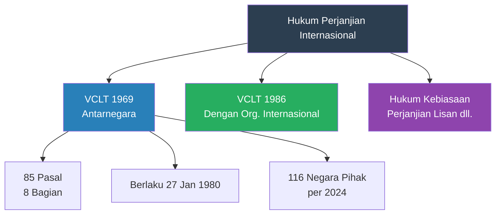
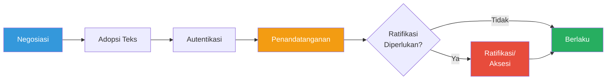
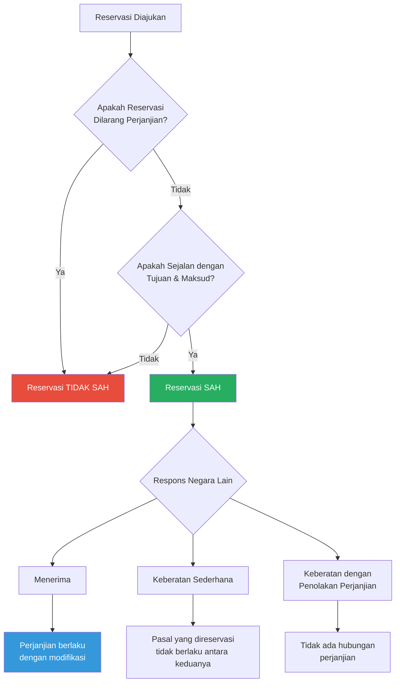
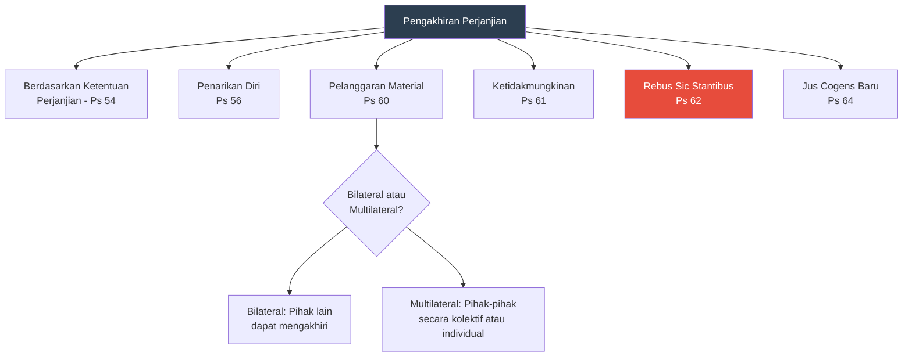

# Bab 6: Hukum Perjanjian Internasional

## Tujuan Pembelajaran

Setelah mempelajari bab ini, mahasiswa diharapkan mampu:

1. Menjelaskan pengertian dan klasifikasi perjanjian internasional berdasarkan Vienna Convention on the Law of Treaties 1969 (VCLT)
2. Menganalisis tahapan pembuatan perjanjian internasional: negosiasi, adopsi teks, penandatanganan, dan ratifikasi
3. Memahami hukum reservasi dan akibat-akibat hukumnya
4. Menerapkan aturan interpretasi perjanjian sebagaimana diatur dalam Pasal 31-33 VCLT
5. Menjelaskan ketentuan tentang berlakunya, perubahan, dan berakhirnya perjanjian internasional
6. Menganalisis dasar-dasar ketidakabsahan (*invalidity*) perjanjian internasional
7. Memahami doktrin *rebus sic stantibus* dan penerapannya
8. Menganalisis praktik Indonesia dalam pembuatan dan pengesahan perjanjian internasional berdasarkan UU Nomor 24 Tahun 2000
9. Mengevaluasi hubungan antara perjanjian internasional dan hukum nasional Indonesia

---

## 6.1 Pendahuluan: Perjanjian sebagai Sumber Hukum Internasional

### 6.1.1 Kedudukan Perjanjian dalam Sistem Hukum Internasional

Perjanjian internasional (*treaties*) merupakan sumber hukum internasional yang paling penting dalam praktik kontemporer. Meskipun Pasal 38 ayat (1) Statuta ICJ menempatkan "international conventions" dan "international custom" secara berurutan tanpa hierarki, dalam kenyataannya perjanjian internasional mendominasi pembentukan dan perkembangan hukum internasional modern.

Alasan dominasi perjanjian internasional sebagai sumber hukum meliputi beberapa hal fundamental. Pertama, perjanjian memberikan kepastian hukum yang lebih tinggi karena isinya tertulis dan disepakati secara eksplisit, berbeda dari hukum kebiasaan yang seringkali ambigu. Kedua, perjanjian memungkinkan negara-negara untuk menciptakan aturan baru dengan cepat, tanpa harus menunggu terbentuknya praktik negara yang konsisten dan *opinio juris* yang diperlukan untuk pembentukan hukum kebiasaan. Ketiga, perjanjian multilateral memungkinkan harmonisasi hukum internasional dalam skala global yang tidak mungkin dicapai melalui hukum kebiasaan.

Pada awal abad ke-21, terdapat lebih dari 60.000 perjanjian internasional yang terdaftar di Sekretariat PBB berdasarkan Pasal 102 Piagam PBB, dan jumlah ini terus bertambah setiap tahun. Perjanjian-perjanjian ini mengatur hampir setiap aspek hubungan internasional, dari perdagangan dan investasi hingga hak asasi manusia, lingkungan hidup, hukum humaniter, dan pelucutan senjata.

### 6.1.2 Evolusi Hukum Perjanjian Internasional

Hukum perjanjian internasional berkembang dari praktik diplomatik yang sudah ada sejak peradaban kuno. Perjanjian tertua yang diketahui adalah perjanjian damai antara Ramses II dari Mesir dan Hattusili III dari Kerajaan Hittite sekitar tahun 1259 SM, yang diukir pada tablet tanah liat dan masih bertahan hingga kini.

Pada abad ke-17 dan ke-18, karya-karya Hugo Grotius (*De Jure Belli ac Pacis*, 1625), Emer de Vattel (*Le Droit des Gens*, 1758), dan para bapak pendiri hukum internasional lainnya mulai meletakkan dasar-dasar teoretis hukum perjanjian. Prinsip *pacta sunt servanda* (perjanjian harus ditepati) diakui sebagai norma fundamental yang mengikat negara-negara.

Kodifikasi modern hukum perjanjian dimulai dengan karya Harvard Research in International Law pada tahun 1935, yang menyusun rancangan konvensi tentang hukum perjanjian. Upaya kodifikasi resmi dilakukan oleh Komisi Hukum Internasional (*International Law Commission*/ILC) PBB sejak tahun 1949, dengan Sir Humphrey Waldock sebagai Pelapor Khusus terakhir yang menghasilkan rancangan yang menjadi dasar negosiasi pada Konferensi Wina 1968-1969.

### 6.1.3 Vienna Convention on the Law of Treaties 1969

VCLT diadopsi pada 22 Mei 1969 dan mulai berlaku pada 27 Januari 1980. Konvensi ini sering disebut sebagai "treaty on treaties"—perjanjian tentang perjanjian—karena mengatur aturan-aturan yang berlaku bagi perjanjian internasional itu sendiri.

VCLT terdiri dari 85 pasal yang dikelompokkan dalam delapan bagian:

| Bagian | Judul | Pasal | Materi Pokok |
|---|---|---|---|
| I | Introduction | 1-5 | Ruang lingkup, definisi, prinsip-prinsip umum |
| II | Conclusion and Entry into Force | 6-25 | Pembuatan, reservasi, berlakunya perjanjian |
| III | Observance, Application and Interpretation | 26-38 | Pacta sunt servanda, aplikasi, interpretasi, perjanjian dan pihak ketiga |
| IV | Amendment and Modification | 39-41 | Perubahan perjanjian |
| V | Invalidity, Termination and Suspension | 42-72 | Ketidakabsahan, pengakhiran, penangguhan |
| VI | Miscellaneous Provisions | 73-75 | Suksesi negara, putusnya hubungan diplomatik, agresi |
| VII | Depositaries, Notifications, Corrections and Registration | 76-80 | Hal-hal teknis |
| VIII | Final Provisions | 81-85 | Ketentuan penutup |

Perlu dicatat bahwa VCLT hanya berlaku terhadap perjanjian antarnegara yang tertulis. Perjanjian yang melibatkan organisasi internasional diatur dalam Vienna Convention on the Law of Treaties between States and International Organizations or between International Organizations (1986), yang belum berlaku. Perjanjian lisan dan perjanjian yang tidak tertulis tidak diatur oleh VCLT, meskipun dapat mengikat berdasarkan hukum kebiasaan internasional.

Indonesia belum meratifikasi VCLT, namun ketentuan-ketentuan substantif konvensi ini dianggap mencerminkan hukum kebiasaan internasional dan karenanya mengikat semua negara, termasuk Indonesia.

---

## 6.2 Definisi dan Klasifikasi Perjanjian Internasional

### 6.2.1 Definisi Perjanjian menurut VCLT

Pasal 2 ayat (1) huruf (a) VCLT mendefinisikan "treaty" sebagai:

> "An international agreement concluded between States in written form and governed by international law, whether embodied in a single instrument or in two or more related instruments and whatever its particular designation."

Definisi ini mengandung beberapa unsur esensial:

**Kesepakatan internasional (*international agreement*)**: Harus ada pertemuan kehendak (*meeting of minds*) antara para pihak. Deklarasi sepihak, meskipun dapat menimbulkan kewajiban hukum (sebagaimana ditegaskan ICJ dalam kasus *Nuclear Tests*, 1974), bukan merupakan perjanjian internasional.

**Antarnegara (*between States*)**: VCLT hanya mengatur perjanjian antarnegara. Perjanjian antara negara dan entitas non-negara (misalnya, perusahaan multinasional atau gerakan pembebasan nasional) tidak termasuk dalam lingkup VCLT, meskipun dapat memiliki dampak hukum internasional.

**Dalam bentuk tertulis (*in written form*)**: VCLT hanya mengatur perjanjian tertulis. Namun, Pasal 3 VCLT menegaskan bahwa perjanjian yang tidak tertulis tidak kehilangan kekuatan hukumnya—hanya saja tidak diatur oleh konvensi ini.

**Diatur oleh hukum internasional (*governed by international law*)**: Unsur ini membedakan perjanjian internasional dari kontrak internasional yang diatur oleh hukum nasional tertentu. Perjanjian jual beli antara pemerintah suatu negara dan perusahaan asing yang tunduk pada hukum nasional tertentu bukan merupakan perjanjian internasional dalam pengertian VCLT.

**Tanpa memandang penamaan khusus (*whatever its particular designation*)**: Suatu perjanjian internasional tidak kehilangan sifatnya hanya karena diberi nama tertentu. Dalam praktik, perjanjian internasional dapat disebut dengan berbagai nama.

### 6.2.2 Nomenklatur Perjanjian Internasional

Perjanjian internasional dikenal dengan berbagai penamaan yang mencerminkan tradisi diplomatik, tingkat formalitas, atau materi yang diatur:

| Penamaan | Karakteristik Umum | Contoh |
|---|---|---|
| Treaty / Traktat | Perjanjian formal tingkat tinggi, biasanya memerlukan ratifikasi | Treaty of Westphalia (1648), Treaty on Non-Proliferation of Nuclear Weapons (NPT) |
| Convention / Konvensi | Perjanjian multilateral formal, sering dihasilkan konferensi internasional | VCLT 1969, UNCLOS 1982, Konvensi Jenewa 1949 |
| Agreement / Persetujuan | Perjanjian yang kurang formal atau bersifat teknis | Agreement on Trade-Related Aspects of Intellectual Property Rights (TRIPS) |
| Protocol / Protokol | Instrumen tambahan atau pelengkap perjanjian utama | Protocol Additional to the Geneva Conventions (1977), Kyoto Protocol (1997) |
| Charter / Piagam | Instrumen konstitutif organisasi internasional | Charter of the United Nations, ASEAN Charter |
| Covenant / Kovenan | Perjanjian dengan nuansa komitmen moral yang kuat | International Covenant on Civil and Political Rights (ICCPR) |
| Statute / Statuta | Instrumen yang membentuk lembaga atau mengatur prosedur | Statute of the ICJ, Rome Statute of the ICC |
| Pact / Pakta | Perjanjian, terutama di bidang keamanan atau pertahanan | Kellogg-Briand Pact (1928), North Atlantic Treaty (NATO) |
| Exchange of Notes / Pertukaran Nota | Bentuk perjanjian bilateral yang terdiri dari dua atau lebih nota | Banyak perjanjian bilateral Indonesia |
| Memorandum of Understanding (MoU) | Perjanjian yang kurang formal, seringkali bersifat teknis | Berbagai MoU kerja sama bilateral |
| Modus Vivendi | Pengaturan sementara sambil menunggu perjanjian definitif | Jarang digunakan dalam praktik modern |
| Concordat / Konkordat | Perjanjian antara Takhta Suci (Vatikan) dan negara | Concordat between Holy See and Italy (1984) |

Penting untuk ditekankan bahwa penamaan tidak menentukan status hukum suatu perjanjian. Suatu MoU dapat mengikat secara hukum jika memenuhi unsur-unsur perjanjian internasional, dan sebaliknya, suatu dokumen berjudul "Treaty" mungkin tidak mengikat jika para pihak tidak bermaksud menciptakan kewajiban hukum.

ICJ dalam kasus *Maritime Delimitation and Territorial Questions between Qatar and Bahrain* (1994) menegaskan bahwa suatu dokumen yang berjudul "Minutes" dan ditandatangani oleh Menteri Luar Negeri kedua negara merupakan perjanjian internasional yang mengikat, terlepas dari penamaannya.

### 6.2.3 Klasifikasi Perjanjian Internasional

Perjanjian internasional dapat diklasifikasikan berdasarkan berbagai kriteria:

**Berdasarkan Jumlah Pihak:**
- *Bilateral*: Perjanjian antara dua negara (misalnya, perjanjian ekstradisi Indonesia-Australia)
- *Multilateral*: Perjanjian antara tiga negara atau lebih (misalnya, UNCLOS, Piagam PBB)
- *Plurilateral*: Perjanjian multilateral yang terbatas pada kelompok negara tertentu (misalnya, perjanjian dalam kerangka WTO yang tidak wajib bagi semua anggota)

**Berdasarkan Sifat Norma:**
- *Treaty-contract* (perjanjian kontrak): Menciptakan hak dan kewajiban khusus bagi para pihak, mirip kontrak (misalnya, perjanjian batas wilayah)
- *Law-making treaty* (perjanjian pembuat hukum): Menetapkan norma umum yang berlaku bagi semua pihak, mirip legislasi (misalnya, VCLT, Konvensi Jenewa)

**Berdasarkan Aksesibilitas:**
- *Open treaty*: Terbuka untuk diikuti oleh semua negara (misalnya, Piagam PBB, UNCLOS)
- *Closed/restricted treaty*: Hanya terbuka bagi negara-negara tertentu (misalnya, perjanjian regional ASEAN)

**Berdasarkan Prosedur Persetujuan:**
- Perjanjian yang memerlukan ratifikasi (*treaties in solemn form*)
- Perjanjian yang berlaku tanpa ratifikasi, cukup dengan penandatanganan (*simplified agreements*)

---

## 6.3 Pembuatan Perjanjian Internasional

### 6.3.1 Kapasitas untuk Membuat Perjanjian

Pasal 6 VCLT menyatakan bahwa setiap negara memiliki kapasitas untuk membuat perjanjian internasional (*treaty-making capacity*). Kapasitas ini merupakan atribut kedaulatan negara.

Selain negara, entitas lain yang memiliki kapasitas terbatas untuk membuat perjanjian meliputi organisasi internasional (sesuai dengan instrumen konstitutifnya), Takhta Suci (Vatikan), dan dalam beberapa konteks historis, entitas seperti Hong Kong dan Taiwan.

Dalam federasi, kapasitas membuat perjanjian umumnya merupakan kewenangan pemerintah federal. Namun, beberapa konstitusi federal memberikan kewenangan terbatas kepada unit federasi untuk membuat perjanjian internasional—misalnya, konstitusi Belgia, Jerman (dalam batas-batas tertentu), dan Swiss.

### 6.3.2 Full Powers (*Surat Kuasa Penuh*)

Pasal 7 VCLT mengatur tentang *full powers* (surat kuasa penuh), yaitu dokumen yang diterbitkan oleh otoritas berwenang suatu negara yang menunjuk seseorang untuk mewakili negara dalam negosiasi, adopsi, atau autentikasi teks perjanjian, atau untuk menyatakan persetujuan negara untuk terikat pada perjanjian.

Beberapa pejabat dianggap mewakili negara tanpa memerlukan *full powers*:

- **Kepala Negara, Kepala Pemerintahan, dan Menteri Luar Negeri**: Untuk semua tindakan terkait pembuatan perjanjian (Pasal 7 ayat 2(a))
- **Kepala Misi Diplomatik**: Untuk adopsi teks perjanjian dengan negara penerima (Pasal 7 ayat 2(b))
- **Perwakilan Negara pada Konferensi Internasional atau Organisasi Internasional**: Untuk adopsi teks perjanjian pada konferensi atau organisasi tersebut (Pasal 7 ayat 2(c))

### 6.3.3 Tahapan Pembuatan Perjanjian

Pembuatan perjanjian internasional melalui beberapa tahapan:

**Tahap Negosiasi (*Negotiation*)**

Negosiasi merupakan tahap awal di mana para pihak membahas substansi dan rumusan perjanjian. Untuk perjanjian bilateral, negosiasi dilakukan antara delegasi kedua negara. Untuk perjanjian multilateral, negosiasi biasanya dilakukan dalam konferensi diplomatik yang diselenggarakan secara khusus atau dalam forum organisasi internasional.

Proses negosiasi perjanjian multilateral besar dapat memakan waktu bertahun-tahun. UNCLOS 1982, misalnya, dinegosiasikan selama sembilan tahun (1973-1982) dalam serangkaian sesi Konferensi PBB tentang Hukum Laut. Statuta Roma tentang ICC dinegosiasikan dalam konferensi diplomatik di Roma pada tahun 1998, tetapi persiapannya sudah dimulai sejak awal 1990-an.

**Tahap Adopsi Teks (*Adoption of the Text*)**

Adopsi teks adalah persetujuan terhadap rumusan akhir perjanjian. Untuk perjanjian bilateral, adopsi dilakukan dengan persetujuan kedua negara. Untuk perjanjian multilateral yang dinegosiasikan dalam konferensi internasional, Pasal 9 ayat (2) VCLT menetapkan bahwa adopsi dilakukan dengan suara dua pertiga negara yang hadir dan memberikan suara, kecuali jika aturan yang sama ditetapkan lain dengan suara dua pertiga.

**Tahap Autentikasi (*Authentication*)**

Autentikasi adalah prosedur untuk menetapkan teks definitif perjanjian. Setelah teks diautentikasi, ia tidak dapat diubah lagi kecuali melalui prosedur amandemen. Autentikasi dilakukan melalui prosedur yang ditetapkan dalam teks perjanjian atau oleh konferensi, atau jika tidak ada ketentuan, melalui penandatanganan, penandatanganan *ad referendum*, atau paraf (*initialling*) (Pasal 10 VCLT).

**Tahap Persetujuan untuk Terikat (*Consent to be Bound*)**

Ini merupakan tahap krusial di mana negara menyatakan persetujuannya untuk terikat pada perjanjian. Pasal 11 VCLT menyebutkan beberapa cara persetujuan dapat dinyatakan:

1. **Penandatanganan (*signature*)**: Untuk perjanjian tertentu, penandatanganan sudah cukup untuk menyatakan persetujuan terikat, tanpa memerlukan ratifikasi (Pasal 12)
2. **Pertukaran instrumen (*exchange of instruments*)**: Umum untuk perjanjian bilateral dalam bentuk pertukaran nota (Pasal 13)
3. **Ratifikasi (*ratification*)**: Persetujuan formal yang diberikan setelah penandatanganan, biasanya setelah mendapat persetujuan parlemen (Pasal 14)
4. **Penerimaan (*acceptance*)** dan **persetujuan (*approval*)**: Prosedur yang setara dengan ratifikasi (Pasal 14)
5. **Aksesi (*accession*)**: Persetujuan untuk terikat pada perjanjian oleh negara yang tidak turut serta dalam negosiasi (Pasal 15)

**Penandatanganan dan Kewajiban Antara (*Interim Obligations*)**

Penandatanganan perjanjian yang memerlukan ratifikasi tidak serta-merta mengikat negara pada perjanjian tersebut. Namun, Pasal 18 VCLT menetapkan bahwa negara penandatangan memiliki kewajiban untuk tidak menggagalkan tujuan dan maksud perjanjian (*obligation not to defeat the object and purpose*) sebelum negara tersebut memutuskan apakah akan meratifikasi atau tidak.

Contoh terkenal penerapan Pasal 18 VCLT adalah keputusan Amerika Serikat pada tahun 2002 untuk "unsigned" Statuta Roma tentang ICC. Melalui surat kepada Sekretaris Jenderal PBB, Amerika Serikat menyatakan bahwa ia tidak bermaksud meratifikasi Statuta Roma dan karenanya tidak lagi terikat kewajiban Pasal 18. Tindakan ini menimbulkan perdebatan hukum tentang apakah suatu negara dapat menarik kembali penandatangannya.

### 6.3.4 Ratifikasi dalam Hukum Internasional dan Hukum Domestik

Penting untuk membedakan antara ratifikasi dalam hukum internasional dan ratifikasi dalam hukum domestik:

**Ratifikasi internasional** adalah tindakan di tingkat internasional di mana negara secara formal menyatakan persetujuannya untuk terikat pada perjanjian. Ratifikasi dinyatakan melalui penyerahan instrumen ratifikasi kepada depositari perjanjian.

**Ratifikasi domestik/internal** adalah proses di tingkat nasional di mana organ-organ negara yang berwenang (biasanya parlemen) memberikan persetujuan untuk meratifikasi perjanjian. Setiap negara memiliki prosedur domestik sendiri yang ditentukan oleh konstitusinya.

Di Indonesia, proses ratifikasi domestik diatur oleh UU Nomor 24 Tahun 2000 tentang Perjanjian Internasional. Pengesahan (*ratification*) perjanjian internasional dilakukan melalui undang-undang atau keputusan presiden, bergantung pada materi perjanjian (dibahas lebih lanjut di Bagian 6.10).

---

## 6.4 Reservasi (*Reservations*)

### 6.4.1 Pengertian Reservasi

Pasal 2 ayat (1) huruf (d) VCLT mendefinisikan reservasi sebagai:

> "A unilateral statement, however phrased or named, made by a State, when signing, ratifying, accepting, approving or acceding to a treaty, whereby it purports to exclude or to modify the legal effect of certain provisions of the treaty in their application to that State."

Reservasi merupakan instrumen yang memungkinkan negara untuk menjadi pihak pada perjanjian multilateral sambil mengecualikan atau memodifikasi penerapan ketentuan tertentu terhadap dirinya. Mekanisme ini mencerminkan kompromi antara dua kepentingan yang saling bertentangan: di satu sisi, keinginan untuk memaksimalkan partisipasi dalam perjanjian multilateral; di sisi lain, kebutuhan untuk menjaga integritas normatif perjanjian.

### 6.4.2 Sejarah Hukum Reservasi

Pada abad ke-19 dan paruh pertama abad ke-20, hukum reservasi didasarkan pada "aturan kebulatan suara" (*unanimity rule*): reservasi hanya sah jika disetujui oleh semua negara pihak lainnya. Aturan ini melindungi integritas perjanjian tetapi membatasi partisipasi.

Titik balik terjadi dengan Advisory Opinion ICJ dalam kasus *Reservations to the Convention on the Prevention and Punishment of the Crime of Genocide* (1951). PBB meminta pendapat ICJ mengenai hukum reservasi terhadap Konvensi Genosida, setelah beberapa negara—khususnya negara-negara blok Soviet—mengajukan reservasi yang ditolak oleh negara-negara lain.

ICJ memutuskan bahwa suatu negara dapat menjadi pihak pada Konvensi Genosida meskipun reservasinya ditolak oleh negara lain, asalkan reservasi tersebut sejalan dengan tujuan dan maksud konvensi (*compatible with the object and purpose of the convention*). Pendapat ini merevolusi hukum reservasi dan menjadi dasar bagi rezim reservasi dalam VCLT.

### 6.4.3 Rezim Reservasi dalam VCLT

VCLT mengatur reservasi dalam Pasal 19-23. Kerangka hukumnya dapat diringkas sebagai berikut:

**Hak untuk Mengajukan Reservasi (Pasal 19)**

Suatu negara dapat mengajukan reservasi saat menandatangani, meratifikasi, menerima, menyetujui, atau mengaksesi perjanjian, kecuali:
- Reservasi dilarang oleh perjanjian (Pasal 19(a))
- Perjanjian hanya mengizinkan reservasi tertentu, dan reservasi yang diajukan bukan termasuk yang diizinkan (Pasal 19(b))
- Reservasi tidak sejalan dengan tujuan dan maksud perjanjian (Pasal 19(c))

**Penerimaan dan Keberatan terhadap Reservasi (Pasal 20)**

Negara-negara pihak lainnya dapat menerima atau menolak reservasi:
- Reservasi yang secara eksplisit diizinkan oleh perjanjian tidak memerlukan penerimaan dari negara lain (Pasal 20 ayat 1)
- Jika dari jumlah pihak yang terbatas dan tujuan perjanjian mengharuskan penerapan utuh, reservasi memerlukan penerimaan semua pihak (Pasal 20 ayat 2)
- Reservasi terhadap instrumen konstitutif organisasi internasional memerlukan penerimaan organ organisasi yang berwenang (Pasal 20 ayat 3)
- Dalam hal lain, penerimaan oleh satu negara pihak sudah cukup untuk menjadikan negara yang merevervasi sebagai pihak terhadap perjanjian (Pasal 20 ayat 4)
- Jika suatu negara tidak keberatan dalam waktu 12 bulan setelah diberitahu tentang reservasi, reservasi dianggap diterima (Pasal 20 ayat 5)

**Akibat Hukum Reservasi (Pasal 21)**

Reservasi yang sah dan diterima menghasilkan hubungan hukum tripartit:
1. Antara negara yang mereservasi dan negara yang menerima: ketentuan yang direservasi dimodifikasi sesuai reservasi (*mutatis mutandis*)
2. Antara negara yang mereservasi dan negara yang keberatan (tetapi tidak menolak berlakunya perjanjian): ketentuan yang direservasi tidak berlaku di antara keduanya
3. Antara negara-negara pihak lainnya yang tidak terkait reservasi: perjanjian berlaku sepenuhnya

### 6.4.4 Permasalahan Kontemporer terkait Reservasi

**Reservasi terhadap Perjanjian HAM**

Reservasi terhadap perjanjian hak asasi manusia menimbulkan persoalan khusus. Beberapa negara mengajukan reservasi luas terhadap CEDAW (Convention on the Elimination of All Forms of Discrimination against Women), khususnya terkait ketentuan tentang kesetaraan dalam perkawinan dan hubungan keluarga (Pasal 16), dengan alasan bahwa ketentuan tersebut bertentangan dengan hukum agama atau adat istiadat mereka.

Human Rights Committee dalam General Comment No. 24 (1994) menyatakan bahwa uji "tujuan dan maksud" harus diterapkan secara ketat terhadap reservasi atas ICCPR, dan bahwa Komite sendiri berwenang menilai keabsahan reservasi. Posisi ini ditentang oleh beberapa negara (Amerika Serikat, Inggris, Prancis) yang berargumen bahwa Komite tidak memiliki kewenangan tersebut.

Indonesia sendiri mengajukan reservasi terhadap ICCPR terkait Pasal 1 tentang hak menentukan nasib sendiri (*self-determination*), menyatakan bahwa Indonesia menafsirkan hak tersebut sesuai dengan Deklarasi tentang Pemberian Kemerdekaan kepada Negara-Negara dan Bangsa-Bangsa Terjajah dan prinsip integritas teritorial.

**Deklarasi Interpretatif (*Interpretive Declarations*)**

Terdapat perbedaan penting antara reservasi dan deklarasi interpretatif. Deklarasi interpretatif hanya menjelaskan penafsiran negara terhadap ketentuan tertentu tanpa mengecualikan atau memodifikasi efek hukumnya. Namun, dalam praktik, batas antara keduanya seringkali kabur. ILC dalam Guide to Practice on Reservations to Treaties (2011) memberikan panduan komprehensif untuk membedakan keduanya.

---

## 6.5 Interpretasi Perjanjian Internasional

### 6.5.1 Pendekatan-Pendekatan Interpretasi

Terdapat tiga pendekatan utama dalam interpretasi perjanjian internasional:

**Pendekatan Tekstual (*Textual/Ordinary Meaning Approach*)**

Pendekatan ini menekankan makna biasa (*ordinary meaning*) dari teks perjanjian sebagai titik tolak interpretasi. Kehendak para pihak dianggap paling baik tercermin dalam kata-kata yang mereka gunakan. Pendekatan ini memberikan kepastian hukum karena teks adalah satu-satunya hal yang telah disepakati secara formal oleh semua pihak.

**Pendekatan Intensionalis (*Intentions of the Parties Approach*)**

Pendekatan ini menekankan kehendak subjektif para pihak pada saat perjanjian dibuat. Teks hanyalah bukti kehendak tersebut, dan penafsir harus melampaui teks untuk menemukan kehendak sesungguhnya. Pendekatan ini dominan dalam tradisi *common law* untuk interpretasi kontrak.

**Pendekatan Teleologis (*Object and Purpose/Teleological Approach*)**

Pendekatan ini menekankan tujuan dan maksud perjanjian sebagai panduan interpretasi. Teks harus ditafsirkan sedemikian rupa sehingga mencapai tujuan perjanjian secara efektif. Pendekatan ini sering diterapkan oleh pengadilan hak asasi manusia (misalnya, Pengadilan HAM Eropa) yang menafsirkan perjanjian HAM sebagai "living instrument."

### 6.5.2 Aturan Umum Interpretasi: Pasal 31 VCLT

VCLT mengadopsi pendekatan yang mengintegrasikan ketiga pendekatan di atas, dengan penekanan pada pendekatan tekstual. Pasal 31 ayat (1) menetapkan aturan umum:

> "A treaty shall be interpreted in good faith in accordance with the ordinary meaning to be given to the terms of the treaty in their context and in the light of its object and purpose."

Ketentuan ini memuat empat elemen yang saling berkaitan dan harus diterapkan secara bersama-sama (*holistic interpretation*):

**Itikad Baik (*Good Faith*)**

Itikad baik merupakan prinsip umum hukum internasional yang mensyaratkan agar perjanjian ditafsirkan secara jujur, wajar, dan tidak menyimpang dari maksud sebenarnya. Prinsip ini berfungsi sebagai pedoman umum yang membatasi penafsiran yang tidak wajar atau menyesatkan.

**Makna Biasa (*Ordinary Meaning*)**

Kata-kata dalam perjanjian harus diberi makna biasa atau alaminya, bukan makna khusus atau teknis, kecuali jika Pasal 31 ayat (4) berlaku (lihat di bawah). Namun, "makna biasa" bukan berarti makna kamus secara sempit—makna harus ditentukan dalam konteks dan dengan mempertimbangkan tujuan perjanjian.

ICJ dalam kasus *Territorial Dispute (Libya/Chad)* (1994) menyatakan: "Interpretation must be based above all upon the text of the treaty." Namun dalam kasus *LaGrand* (2001), ICJ memberi makna yang lebih luas pada kata "indicate" dalam Pasal 41 Statuta ICJ, menyimpulkan bahwa tindakan sementara (*provisional measures*) bersifat mengikat—penafsiran yang melampaui makna harfiah kata tersebut.

**Konteks (*Context*)**

Pasal 31 ayat (2) mendefinisikan "konteks" perjanjian mencakup:
- Teks perjanjian, termasuk pembukaan (*preamble*) dan lampiran (*annexes*) (Pasal 31(2))
- Persetujuan terkait pembuatan perjanjian yang dibuat antara semua pihak (Pasal 31(2)(a))
- Instrumen yang dibuat oleh satu atau lebih pihak dan diterima oleh pihak lainnya sebagai instrumen terkait perjanjian (Pasal 31(2)(b))

Selain konteks, Pasal 31 ayat (3) menambahkan elemen yang harus dipertimbangkan bersama konteks:
- Persetujuan selanjutnya antara para pihak mengenai interpretasi (*subsequent agreement*) (Pasal 31(3)(a))
- Praktik selanjutnya yang menunjukkan kesepakatan interpretasi (*subsequent practice*) (Pasal 31(3)(b))
- Aturan hukum internasional lain yang relevan dan berlaku antara para pihak (Pasal 31(3)(c))

**Tujuan dan Maksud (*Object and Purpose*)**

Tujuan dan maksud perjanjian berfungsi sebagai panduan interpretatif yang membantu penafsir memilih di antara beberapa makna yang mungkin. Tujuan biasanya dapat diidentifikasi dari pembukaan, judul, dan ketentuan-ketentuan substantif perjanjian.

### 6.5.3 Makna Khusus: Pasal 31 ayat (4)

Pasal 31 ayat (4) VCLT menyatakan bahwa suatu istilah harus diberi makna khusus (*special meaning*) jika terbukti bahwa para pihak memang bermaksud demikian. Beban pembuktian terletak pada pihak yang mengklaim adanya makna khusus.

### 6.5.4 Sarana Pelengkap Interpretasi: Pasal 32 VCLT

Pasal 32 VCLT mengatur sarana pelengkap (*supplementary means*) interpretasi, termasuk travaux préparatoires (catatan persiapan) dan keadaan-keadaan saat perjanjian dibuat. Sarana pelengkap dapat digunakan untuk:
- Memastikan (*confirm*) makna yang dihasilkan dari penerapan Pasal 31
- Menentukan makna jika penerapan Pasal 31 menghasilkan makna yang ambigu, kabur, atau nyata-nyata absurd atau tidak masuk akal

Hubungan antara Pasal 31 dan 32 bersifat hierarkis: sarana pelengkap hanya bersifat sekunder dan tidak dapat mengesampingkan hasil interpretasi berdasarkan Pasal 31. Dalam praktik, pengadilan internasional sering merujuk *travaux préparatoires* untuk memastikan hasil interpretasinya, bahkan ketika teks sudah jelas.

### 6.5.5 Interpretasi Perjanjian dalam Berbagai Bahasa: Pasal 33 VCLT

Banyak perjanjian multilateral diadopsi dalam beberapa bahasa resmi. Piagam PBB, misalnya, memiliki enam bahasa resmi (Arab, Tionghoa, Inggris, Prancis, Rusia, Spanyol), dan semua versi sama otentiknya.

Pasal 33 VCLT mengatur interpretasi perjanjian yang diautentikasi dalam dua bahasa atau lebih:
- Teks perjanjian sama otentiknya dalam setiap bahasa, kecuali jika perjanjian menentukan lain (Pasal 33(1))
- Versi dalam bahasa selain bahasa autentik hanya dianggap autentik jika perjanjian menyatakannya (Pasal 33(2))
- Istilah-istilah dalam perjanjian dianggap memiliki makna yang sama dalam setiap teks autentik (Pasal 33(3))
- Jika terdapat perbedaan makna antara teks-teks autentik, makna yang paling mendamaikan teks-teks tersebut dan paling sesuai dengan tujuan perjanjian yang harus dipilih (Pasal 33(4))

Kasus *LaGrand* (2001) merupakan contoh penting penerapan Pasal 33. ICJ membandingkan versi Inggris dan Prancis Pasal 41 Statuta ICJ—kata "indicate" (Inggris) dan "indiquer" (Prancis)—dan menyimpulkan bahwa tindakan sementara bersifat mengikat, sebuah interpretasi yang diperkuat oleh konteks dan tujuan Statuta.

---

## 6.6 Berlakunya dan Penerapan Perjanjian

### 6.6.1 Berlakunya Perjanjian (*Entry into Force*)

Perjanjian mulai berlaku sesuai dengan ketentuan yang ditetapkan dalam perjanjian itu sendiri atau sebagaimana disepakati oleh para pihak (Pasal 24 VCLT). Perjanjian multilateral biasanya menetapkan jumlah minimum ratifikasi atau aksesi yang diperlukan sebelum perjanjian berlaku.

Contoh persyaratan berlakunya beberapa perjanjian penting:

| Perjanjian | Persyaratan Berlaku | Tanggal Berlaku |
|---|---|---|
| VCLT 1969 | 35 ratifikasi | 27 Januari 1980 |
| UNCLOS 1982 | 60 ratifikasi | 16 November 1994 |
| Statuta Roma ICC | 60 ratifikasi | 1 Juli 2002 |
| Perjanjian Paris 2015 | 55 pihak yang mewakili 55% emisi global | 4 November 2016 |
| TPNW 2017 | 50 ratifikasi | 22 Januari 2021 |

### 6.6.2 Penerapan Perjanjian: Prinsip Non-Retroaktivitas

Pasal 28 VCLT menetapkan prinsip non-retroaktivitas: ketentuan perjanjian tidak mengikat negara pihak terkait perbuatan atau fakta yang terjadi sebelum perjanjian mulai berlaku bagi negara tersebut, kecuali jika perjanjian menentukan lain atau maksud tersebut jelas dari perjanjian.

### 6.6.3 Pacta Sunt Servanda

Pasal 26 VCLT mengodifikasi prinsip *pacta sunt servanda*:

> "Every treaty in force is binding upon the parties to it and must be performed by them in good faith."

Prinsip ini merupakan fondasi seluruh hukum perjanjian. Tanpa prinsip ini, perjanjian akan kehilangan maknanya karena negara dapat mengabaikan kewajibannya secara sewenang-wenang. Pasal 27 VCLT menambahkan bahwa suatu negara tidak boleh menggunakan hukum domestiknya sebagai pembenaran untuk tidak melaksanakan perjanjian.

### 6.6.4 Penerapan Perjanjian Berturutan tentang Pokok yang Sama

Pasal 30 VCLT mengatur situasi di mana dua atau lebih perjanjian berturutan mengatur pokok yang sama. Aturan umumnya adalah *lex posterior derogat legi priori* (hukum yang kemudian mengesampingkan yang sebelumnya), dengan beberapa nuansa penting:

- Jika perjanjian menyatakan bahwa ia tunduk pada atau tidak boleh bertentangan dengan perjanjian sebelumnya atau kemudian, perjanjian itu berlaku (Pasal 30(2))
- Jika semua pihak pada perjanjian sebelumnya juga merupakan pihak pada perjanjian kemudian, perjanjian sebelumnya hanya berlaku sejauh tidak bertentangan dengan perjanjian kemudian (Pasal 30(3))
- Jika pihak-pihak pada kedua perjanjian tidak identik, situasinya lebih kompleks dan diselesaikan berdasarkan prinsip *lex posterior* dan *lex specialis* (Pasal 30(4))

### 6.6.5 Perjanjian dan Pihak Ketiga (*Pacta Tertiis*)

Pasal 34 VCLT mengodifikasi prinsip *pacta tertiis nec nocent nec prosunt*: perjanjian tidak menciptakan kewajiban atau hak bagi negara ketiga tanpa persetujuannya. Prinsip ini merupakan konsekuensi logis dari kedaulatan negara—suatu negara tidak dapat dipaksa tunduk pada kewajiban yang tidak disepakatinya.

Namun, VCLT mengakui dua pengecualian:

**Kewajiban bagi Pihak Ketiga (Pasal 35)**: Perjanjian dapat menciptakan kewajiban bagi negara ketiga jika para pihak bermaksud demikian dan negara ketiga secara tegas menerima kewajiban tersebut secara tertulis.

**Hak bagi Pihak Ketiga (Pasal 36)**: Perjanjian dapat memberikan hak kepada negara ketiga jika para pihak bermaksud demikian. Persetujuan negara ketiga diasumsikan selama tidak ada indikasi sebaliknya. Contoh klasik adalah Pasal 35 Piagam PBB yang memberikan hak kepada non-anggota PBB untuk mengajukan sengketa ke Dewan Keamanan.

Perlu dicatat bahwa beberapa perjanjian—khususnya yang menciptakan rezim objektif (*objective regimes*)—diperdebatkan apakah mengikat negara ketiga. Perjanjian yang menetapkan status wilayah tertentu (misalnya, demiliterisasi Kepulauan Åland, internasionalisasi Terusan Suez) atau yang mengodifikasi hukum kebiasaan internasional dipandang oleh beberapa sarjana sebagai mengikat *erga omnes*.

---

## 6.7 Ketidakabsahan Perjanjian (*Invalidity*)

### 6.7.1 Prinsip Umum

Bagian V VCLT mengatur dasar-dasar ketidakabsahan perjanjian. Pasal 42 ayat (1) menegaskan bahwa keabsahan perjanjian hanya dapat digugat berdasarkan penerapan VCLT. Daftar dasar ketidakabsahan dalam VCLT bersifat tertutup (*exhaustive*).

Pasal 44 mengatur pemisahan (*separability*): ketidakabsahan dapat menyangkut seluruh perjanjian atau hanya ketentuan tertentu, dengan syarat-syarat yang ditetapkan dalam pasal tersebut.

### 6.7.2 Dasar-Dasar Ketidakabsahan Relatif

**Pelanggaran Ketentuan Hukum Domestik tentang Kompetensi Membuat Perjanjian (Pasal 46)**

Suatu negara dapat membatalkan persetujuannya untuk terikat jika persetujuan tersebut diberikan dengan melanggar ketentuan hukum domestiknya tentang kompetensi membuat perjanjian, asalkan pelanggaran tersebut nyata (*manifest*) dan menyangkut aturan hukum domestik yang fundamental. Pelanggaran "nyata" berarti bahwa pelanggaran tersebut akan tampak jelas (*objectively evident*) bagi negara manapun yang bertindak sesuai dengan praktik biasa dan itikad baik.

**Pembatasan Khusus atas Kewenangan Perwakilan (Pasal 47)**

Jika kewenangan perwakilan untuk menyatakan persetujuan telah dibatasi secara khusus dan perwakilan tersebut bertindak melampaui batasannya, persetujuan dapat dibatalkan, asalkan pembatasan tersebut telah diberitahukan kepada negara-negara lain sebelum persetujuan dinyatakan.

**Kekeliruan (*Error*) (Pasal 48)**

Suatu negara dapat membatalkan perjanjian jika persetujuannya didasarkan pada kekeliruan tentang fakta atau situasi yang diasumsikannya ada pada saat perjanjian dibuat, asalkan fakta atau situasi tersebut merupakan dasar penting (*essential basis*) bagi persetujuannya. Kekeliruan tidak dapat diajukan jika negara tersebut turut menyebabkan kekeliruan atau jika keadaan-keadaan memberikan peringatan yang cukup.

Kasus *Temple of Preah Vihear* (Kamboja v. Thailand, 1962) menggambarkan penerapan prinsip kekeliruan. Thailand berargumen bahwa peta yang digunakan dalam perjanjian batas 1904-1908 mengandung kekeliruan. ICJ menolak argumen ini karena Thailand telah menerima dan menggunakan peta tersebut selama bertahun-tahun tanpa protes.

**Penipuan (*Fraud*) (Pasal 49)**

Jika suatu negara dibujuk untuk menyetujui perjanjian melalui perilaku penipuan negara lain, negara yang ditipu dapat membatalkan perjanjian. Dalam praktik, kasus penipuan dalam pembuatan perjanjian sangat jarang terjadi.

**Penyuapan Perwakilan (*Corruption*) (Pasal 50)**

Jika persetujuan negara diperoleh melalui penyuapan perwakilannya oleh negara lain, negara yang perwakilannya disuap dapat membatalkan perjanjian.

### 6.7.3 Dasar-Dasar Ketidakabsahan Absolut

**Paksaan terhadap Perwakilan Negara (*Coercion of a Representative*) (Pasal 51)**

Persetujuan yang diperoleh melalui paksaan terhadap perwakilan negara—berupa ancaman atau tindakan yang ditujukan langsung kepada perwakilan tersebut—tidak memiliki akibat hukum apa pun. Ketidakabsahan bersifat absolut: perjanjian batal demi hukum (*void ab initio*).

**Paksaan terhadap Negara (*Coercion of a State*) (Pasal 52)**

Perjanjian yang dibuat melalui ancaman atau penggunaan kekerasan yang melanggar prinsip-prinsip hukum internasional yang tercantum dalam Piagam PBB batal demi hukum. Pasal ini mengodifikasi prinsip bahwa perjanjian yang dipaksakan melalui agresi militer tidak sah.

Pasal 52 menimbulkan perdebatan historis tentang apakah "paksaan" mencakup tekanan ekonomi dan politik, bukan hanya kekerasan militer. Negara-negara berkembang dalam Konferensi Wina 1968-1969 mendorong interpretasi luas yang mencakup tekanan ekonomi, namun negara-negara maju menolak. Kompromi dicapai melalui Deklarasi yang dilampirkan pada Final Act Konferensi yang mengutuk ancaman atau penggunaan tekanan dalam bentuk apa pun.

**Bertentangan dengan Jus Cogens (Pasal 53)**

Perjanjian yang pada saat pembuatannya bertentangan dengan norma *jus cogens* (norma imperatif hukum internasional umum) batal demi hukum. Pasal 53 mendefinisikan *jus cogens* sebagai:

> "A peremptory norm of general international law... accepted and recognized by the international community of States as a whole as a norm from which no derogation is permitted and which can be modified only by a subsequent norm of general international law having the same character."

Contoh norma *jus cogens* yang diakui secara luas: larangan genosida, larangan penyiksaan, larangan perbudakan, larangan penggunaan kekerasan, hak menentukan nasib sendiri. ILC dalam Report on Peremptory Norms of General International Law (2022) mengidentifikasi dan menganalisis norma-norma *jus cogens* secara lebih sistematis.

Pasal 64 VCLT menambahkan bahwa jika suatu norma *jus cogens* baru muncul setelah perjanjian dibuat, perjanjian yang bertentangan dengan norma tersebut menjadi batal dan berakhir (*supervening jus cogens*).

| Dasar Ketidakabsahan | Pasal VCLT | Sifat | Akibat |
|---|---|---|---|
| Pelanggaran hukum domestik | 46 | Relatif | Dapat dibatalkan (*voidable*) |
| Pembatasan kewenangan | 47 | Relatif | Dapat dibatalkan |
| Kekeliruan (*error*) | 48 | Relatif | Dapat dibatalkan |
| Penipuan (*fraud*) | 49 | Relatif | Dapat dibatalkan |
| Penyuapan (*corruption*) | 50 | Relatif | Dapat dibatalkan |
| Paksaan terhadap perwakilan | 51 | Absolut | Batal demi hukum (*void*) |
| Paksaan terhadap negara | 52 | Absolut | Batal demi hukum |
| Bertentangan dengan *jus cogens* | 53, 64 | Absolut | Batal demi hukum |

---

## 6.8 Pengakhiran dan Penangguhan Perjanjian

### 6.8.1 Pengakhiran berdasarkan Ketentuan Perjanjian

Perjanjian dapat berakhir sesuai dengan ketentuannya sendiri—misalnya, setelah jangka waktu tertentu berakhir atau setelah tujuan perjanjian tercapai (Pasal 54(a) VCLT). Perjanjian juga dapat berakhir kapan pun dengan persetujuan semua pihak (Pasal 54(b)).

### 6.8.2 Penarikan Diri (*Withdrawal/Denunciation*)

Jika perjanjian tidak memuat ketentuan tentang penarikan diri, Pasal 56 VCLT menyatakan bahwa perjanjian tidak dapat diakhiri atau ditarik kecuali:
- Para pihak bermaksud mengizinkan penarikan diri, atau
- Hak penarikan diri dapat disimpulkan dari sifat perjanjian

Contoh penarikan diri yang menarik perhatian internasional:
- Penarikan diri Inggris dari Uni Eropa (*Brexit*, 2017-2020) berdasarkan Pasal 50 Treaty on European Union
- Pemberitahuan penarikan diri Amerika Serikat dari Perjanjian Paris tentang Perubahan Iklim (2017, dibatalkan 2021)
- Penarikan diri Burundi, Afrika Selatan (kemudian dibatalkan), dan Filipina dari Statuta Roma ICC

### 6.8.3 Pelanggaran Material (*Material Breach*) (Pasal 60)

Pelanggaran material terhadap perjanjian bilateral memberikan hak kepada pihak lain untuk mengakhiri perjanjian atau menangguhkan pelaksanaannya. Untuk perjanjian multilateral, pelanggaran material memberikan hak kepada pihak-pihak lain secara bersama-sama, atau kepada pihak yang secara khusus terkena dampak, untuk menangguhkan atau mengakhiri perjanjian.

Pasal 60 ayat (3) mendefinisikan "pelanggaran material" sebagai:
- Penolakan perjanjian yang tidak diizinkan oleh VCLT, atau
- Pelanggaran ketentuan yang penting untuk mencapai tujuan dan maksud perjanjian

Penting: Pasal 60 ayat (5) mengecualikan perjanjian yang bersifat humaniter—khususnya ketentuan-ketentuan yang melindungi individu—dari penerapan aturan pelanggaran material. Ini berarti pelanggaran Konvensi Jenewa oleh satu pihak tidak membenarkan pihak lain untuk menghentikan perlindungan terhadap tawanan perang atau penduduk sipil.

### 6.8.4 Ketidakmungkinan Pelaksanaan (*Impossibility of Performance*) (Pasal 61)

Suatu negara dapat mengajukan ketidakmungkinan pelaksanaan sebagai dasar pengakhiran atau penarikan diri jika ketidakmungkinan tersebut disebabkan oleh musnahnya atau hilangnya objek yang sangat diperlukan untuk pelaksanaan perjanjian. Ketidakmungkinan harus bersifat permanen; jika bersifat sementara, ia hanya dapat menjadi dasar penangguhan.

### 6.8.5 Perubahan Keadaan yang Fundamental (*Rebus Sic Stantibus*) (Pasal 62)

Doktrin *rebus sic stantibus* merupakan salah satu doktrin paling kontroversial dalam hukum perjanjian. Pasal 62 VCLT mengodifikasi doktrin ini secara sangat restriktif:

Perubahan keadaan yang fundamental hanya dapat dijadikan dasar pengakhiran atau penarikan diri jika:
1. Keadaan yang berubah merupakan dasar penting (*essential basis*) bagi persetujuan para pihak untuk terikat, **dan**
2. Perubahan tersebut secara radikal mengubah lingkup kewajiban yang masih harus dilaksanakan

Pasal 62 juga menetapkan dua pengecualian penting: doktrin *rebus sic stantibus* tidak berlaku terhadap perjanjian batas wilayah, dan tidak dapat diajukan oleh pihak yang menyebabkan perubahan keadaan tersebut.

ICJ dalam kasus *Gabčíkovo-Nagymaros Project* (Hungaria/Slovakia, 1997) menolak argumen Hungaria yang mendalilkan perubahan keadaan fundamental sebagai pembenaran untuk menghentikan proyek bendungan bersama di Sungai Danube. Pengadilan menyatakan bahwa perubahan kondisi politik dan ekonomi setelah berakhirnya Perang Dingin, meskipun signifikan, tidak memenuhi ambang batas tinggi Pasal 62 VCLT.

Kasus *Fisheries Jurisdiction* (Inggris v. Islandia, 1973) merupakan contoh lain di mana ICJ menolak argumen *rebus sic stantibus*. Islandia berargumen bahwa perubahan dalam teknologi perikanan dan kondisi ekonominya merupakan perubahan keadaan fundamental yang membenarkan perluasan yurisdiksi perikanannya secara sepihak. ICJ menolak argumen ini, meskipun mengakui bahwa perubahan keadaan dapat relevan dalam konteks negosiasi ulang.

---

## 6.9 Perubahan (*Amendment*) dan Modifikasi Perjanjian

### 6.9.1 Amandemen Perjanjian Multilateral (Pasal 39-40)

Perjanjian dapat diamandemen dengan persetujuan para pihak (Pasal 39). Untuk perjanjian multilateral, Pasal 40 mengatur prosedur amandemen:

- Setiap pihak berhak berpartisipasi dalam negosiasi dan keputusan amandemen (Pasal 40(2))
- Setiap negara yang berhak menjadi pihak pada perjanjian asli juga berhak menjadi pihak pada perjanjian yang diamandemen (Pasal 40(3))
- Amandemen tidak mengikat negara yang tidak menerimanya; hubungan antara negara yang menerima dan yang tidak menerima amandemen diatur oleh perjanjian asli (Pasal 40(4)-(5))

### 6.9.2 Modifikasi antara Beberapa Pihak (Pasal 41)

Dua atau lebih pihak pada perjanjian multilateral dapat membuat persetujuan untuk memodifikasi perjanjian di antara mereka saja, asalkan modifikasi diizinkan oleh perjanjian, atau modifikasi tidak mempengaruhi hak-hak dan kewajiban pihak lain dan tidak bertentangan dengan tujuan perjanjian.

---

## 6.10 Praktik Indonesia: UU Nomor 24 Tahun 2000

### 6.10.1 Kerangka Hukum Nasional

Pembuatan dan pengesahan perjanjian internasional oleh Indonesia diatur oleh UU Nomor 24 Tahun 2000 tentang Perjanjian Internasional. UU ini merupakan pelaksanaan Pasal 11 UUD 1945 yang menyatakan:

> "(1) Presiden dengan persetujuan Dewan Perwakilan Rakyat menyatakan perang, membuat perdamaian dan perjanjian dengan negara lain.
> (2) Presiden dalam membuat perjanjian internasional lainnya yang menimbulkan akibat yang luas dan mendasar bagi kehidupan rakyat yang terkait dengan beban keuangan negara, dan/atau mengharuskan perubahan atau pembentukan undang-undang harus dengan persetujuan Dewan Perwakilan Rakyat.
> (3) Ketentuan lebih lanjut tentang perjanjian internasional diatur dengan undang-undang."

### 6.10.2 Mekanisme Pengesahan

UU 24/2000 membedakan dua jalur pengesahan perjanjian internasional:

**Pengesahan dengan Undang-Undang (Pasal 10)**

Perjanjian yang memerlukan pengesahan dengan UU meliputi perjanjian yang berkenaan dengan:
1. Masalah politik, perdamaian, pertahanan, dan keamanan negara
2. Perubahan wilayah atau penetapan batas wilayah negara
3. Kedaulatan atau hak berdaulat negara
4. Hak asasi manusia dan lingkungan hidup
5. Pembentukan kaidah hukum baru
6. Pinjaman dan/atau hibah luar negeri

**Pengesahan dengan Keputusan Presiden (Pasal 11)**

Perjanjian yang tidak termasuk dalam kategori Pasal 10 disahkan melalui Keputusan Presiden, yaitu perjanjian yang bersifat teknis, prosedural, atau operasional.

### 6.10.3 Proses Pembuatan Perjanjian

UU 24/2000 mengatur tahapan pembuatan perjanjian internasional oleh Indonesia:

1. **Penjajakan (*preliminary discussion*)**: Kementerian/lembaga terkait melakukan penjajakan tentang kemungkinan membuat perjanjian
2. **Perundingan (*negotiation*)**: Delegasi Indonesia berunding berdasarkan pedoman yang ditetapkan
3. **Perumusan naskah (*drafting*)**: Penyusunan teks perjanjian
4. **Penerimaan (*acceptance*)**: Persetujuan terhadap rumusan akhir
5. **Penandatanganan (*signature*)**: Oleh pejabat yang berwenang atau yang diberi surat kuasa penuh
6. **Pengesahan (*ratification*)**: Melalui UU atau Keppres

### 6.10.4 Surat Kuasa (*Full Powers*) dan Persetujuan

Pasal 7 UU 24/2000 menetapkan bahwa surat kuasa untuk penandatanganan perjanjian internasional diberikan oleh Menteri (Menteri Luar Negeri) atas nama Pemerintah Republik Indonesia. Presiden, Menteri Luar Negeri, dan pejabat diplomatik Indonesia tidak memerlukan surat kuasa.

### 6.10.5 Contoh Ratifikasi Indonesia

Indonesia telah meratifikasi sejumlah besar perjanjian internasional. Beberapa contoh penting:

| Perjanjian | Instrumen Pengesahan | Tahun |
|---|---|---|
| UNCLOS 1982 | UU No. 17/1985 | 1985 |
| Konvensi Jenewa 1949 | UU No. 59/1958 | 1958 |
| ICCPR | UU No. 12/2005 | 2005 |
| ICESCR | UU No. 11/2005 | 2005 |
| CEDAW | UU No. 7/1984 | 1984 |
| CRC | Keppres No. 36/1990 | 1990 |
| CAT | UU No. 5/1998 | 1998 |
| Perjanjian Paris 2015 | UU No. 16/2016 | 2016 |
| ASEAN Charter | UU No. 38/2008 | 2008 |
| ICSID Convention | UU No. 5/1968 | 1968 |

### 6.10.6 Status Perjanjian dalam Hukum Nasional Indonesia

Hubungan antara perjanjian internasional dan hukum nasional Indonesia belum diatur secara jelas dalam UUD 1945 atau peraturan perundang-undangan lainnya. Indonesia tidak menganut model monisme murni (di mana perjanjian internasional secara otomatis menjadi bagian hukum domestik) maupun dualisme murni (di mana perjanjian internasional memerlukan transformasi legislatif untuk berlaku di dalam negeri).

Dalam praktik, terdapat inkonsistensi. Beberapa perjanjian diterapkan langsung (*self-executing*) oleh pengadilan Indonesia, sementara yang lain memerlukan legislasi implementasi. Mahkamah Konstitusi dalam beberapa putusannya telah menyentuh persoalan ini, namun belum memberikan panduan yang komprehensif.

Perdebatan tentang kedudukan hukum internasional dalam sistem hukum Indonesia tetap relevan, khususnya dalam konteks penegakan perjanjian hak asasi manusia dan kewajiban Indonesia berdasarkan perjanjian investasi bilateral.

---

## 6.11 Perkembangan Kontemporer

### 6.11.1 Proliferasi Perjanjian dan Fragmentasi Hukum Internasional

Pertumbuhan eksponensial jumlah perjanjian internasional menimbulkan persoalan fragmentasi hukum internasional. Rezim-rezim perjanjian yang berbeda (perdagangan, lingkungan, hak asasi manusia, investasi) terkadang menghasilkan norma-norma yang saling bertentangan. ILC dalam laporan *Fragmentation of International Law* (2006) membahas persoalan ini secara mendalam.

### 6.11.2 Perjanjian Investasi dan Arbitrase

Perjanjian investasi bilateral (*Bilateral Investment Treaties*/BIT) dan perjanjian perdagangan bebas (*Free Trade Agreements*/FTA) yang memuat ketentuan perlindungan investasi telah berkembang pesat sejak 1990-an. Indonesia memiliki lebih dari 60 BIT yang aktif, meskipun pada tahun 2014-2015, pemerintah Indonesia memutuskan untuk mengakhiri sejumlah BIT dan merundingkan ulang yang lainnya.

Keputusan ini dipicu oleh kasus-kasus arbitrase investasi yang dihadapi Indonesia, termasuk kasus *Churchill Mining v. Indonesia* di ICSID, di mana investor asing menggugat Indonesia atas pencabutan izin pertambangan. Kasus ini memiliki implikasi penting bagi hubungan antara kewajiban perjanjian investasi dan kebijakan domestik Indonesia.

### 6.11.3 Perjanjian Lingkungan Hidup Multilateral

Perjanjian lingkungan hidup multilateral (*Multilateral Environmental Agreements*/MEA) merupakan bidang yang berkembang pesat. Indonesia merupakan pihak pada berbagai MEA penting, termasuk UNFCCC, Konvensi Keanekaragaman Hayati, Perjanjian Paris, dan Konvensi Basel. Tantangan utama bagi Indonesia adalah implementasi domestik yang efektif terhadap kewajiban-kewajiban yang timbul dari MEA ini.

### 6.11.4 Pembuatan Perjanjian di Era Digital

Perkembangan teknologi menimbulkan pertanyaan baru tentang prosedur pembuatan perjanjian. Negosiasi secara daring (*virtual negotiations*), penggunaan tanda tangan elektronik, dan pertukaran instrumen digital menjadi semakin umum, terutama setelah pandemi COVID-19. Meskipun VCLT tidak secara eksplisit mengatur hal-hal ini, prinsip-prinsip umum VCLT cukup fleksibel untuk mengakomodasi perkembangan teknologi.

---

## Ringkasan

Hukum perjanjian internasional merupakan tulang punggung sistem hukum internasional kontemporer. VCLT 1969 menyediakan kerangka hukum komprehensif yang mengatur seluruh siklus kehidupan perjanjian: dari pembuatan hingga berakhirnya, termasuk interpretasi, ketidakabsahan, dan perubahan.

Prinsip-prinsip fundamental hukum perjanjian—*pacta sunt servanda*, itikad baik, dan *pacta tertiis nec nocent nec prosunt*—mencerminkan keseimbangan antara kebutuhan akan kepastian hukum dan penghormatan terhadap kedaulatan negara. Aturan interpretasi dalam Pasal 31-33 VCLT memberikan kerangka metodologis yang digunakan secara universal oleh pengadilan internasional dan domestik.

Praktik Indonesia dalam pembuatan perjanjian internasional diatur oleh UU 24/2000, yang membedakan antara perjanjian yang memerlukan pengesahan UU dan yang cukup dengan Keppres. Namun, beberapa persoalan—khususnya kedudukan perjanjian dalam hierarki hukum nasional—masih memerlukan kejelasan.

---

## Pertanyaan Refleksi

1. Apakah prinsip *pacta sunt servanda* bersifat absolut? Diskusikan situasi-situasi di mana negara dapat dibenarkan untuk tidak mematuhi perjanjian yang telah diratifikasinya.

2. Evaluasi rezim reservasi dalam VCLT. Apakah pendekatan VCLT berhasil menyeimbangkan antara universalitas partisipasi dan integritas normatif perjanjian? Bagaimana seharusnya komunitas internasional menyikapi reservasi luas terhadap perjanjian HAM?

3. Bandingkan pendekatan tekstual dan teleologis dalam interpretasi perjanjian. Dalam konteks apa masing-masing pendekatan lebih tepat diterapkan?

4. Analisis implikasi keputusan Indonesia untuk mengakhiri beberapa BIT. Apakah keputusan ini sesuai dengan hukum perjanjian internasional? Apa konsekuensinya bagi iklim investasi Indonesia?

5. Pasal 27 VCLT menyatakan bahwa hukum domestik tidak dapat dijadikan pembenaran untuk tidak melaksanakan perjanjian. Bagaimana prinsip ini berinteraksi dengan konstitusionalisme di Indonesia?

6. Diskusikan konsep *jus cogens* dalam konteks ketidakabsahan perjanjian. Siapa yang berwenang menentukan suatu norma sebagai *jus cogens*? Apakah mekanisme penentuan ini memadai?

7. Evaluasi efektivitas Pasal 62 VCLT tentang *rebus sic stantibus*. Apakah ambang batas yang ditetapkan terlalu tinggi? Bagaimana doktrin ini dapat diterapkan dalam konteks perubahan iklim?

8. Indonesia belum meratifikasi VCLT 1969. Apakah hal ini mempengaruhi keterikatan Indonesia pada ketentuan-ketentuan VCLT? Jelaskan berdasarkan konsep hukum kebiasaan internasional.

---

## Daftar Pustaka

### Buku Teks Utama

- Shaw, Malcolm N. *International Law*. 9th ed. Cambridge: Cambridge University Press, 2021. Chapter 16.
- Crawford, James. *Brownlie's Principles of Public International Law*. 9th ed. Oxford: Oxford University Press, 2019. Chapters 23-25.
- Aust, Anthony. *Modern Treaty Law and Practice*. 3rd ed. Cambridge: Cambridge University Press, 2013.
- Villiger, Mark E. *Commentary on the 1969 Vienna Convention on the Law of Treaties*. Leiden: Martinus Nijhoff, 2009.

### Monograf Khusus

- Corten, Olivier dan Pierre Klein, eds. *The Vienna Conventions on the Law of Treaties: A Commentary*. Oxford: Oxford University Press, 2011.
- Gardiner, Richard. *Treaty Interpretation*. 2nd ed. Oxford: Oxford University Press, 2015.
- Pellet, Alain dan Daniel Müller. "Reservations to Treaties: An Objection to a Reservation is Definitely Not an Acceptance." In *The Law of Treaties Beyond the Vienna Convention*, ed. Enzo Cannizzaro. Oxford: Oxford University Press, 2011.
- Klabbers, Jan. *The Concept of Treaty in International Law*. The Hague: Kluwer, 1996.
- Dörr, Oliver dan Kirsten Schmalenbach, eds. *Vienna Convention on the Law of Treaties: A Commentary*. 2nd ed. Berlin: Springer, 2018.

### Artikel Ilmiah

- Fitzmaurice, Malgosia. "The Practical Working of the Law of Treaties." In *International Law*, ed. Malcolm D. Evans. 5th ed. Oxford: Oxford University Press, 2018.
- Koskenniemi, Martti. "Fragmentation of International Law: Difficulties Arising from the Diversification and Expansion of International Law." Report of the Study Group of the International Law Commission. A/CN.4/L.682, 2006.
- Pellet, Alain. "Article 38." In *The Statute of the International Court of Justice: A Commentary*, ed. Andreas Zimmermann et al. 3rd ed. Oxford: Oxford University Press, 2019.

### Putusan Pengadilan Internasional

- *Reservations to the Convention on Genocide*, Advisory Opinion, ICJ Reports 1951.
- *Temple of Preah Vihear* (Cambodia v. Thailand), Merits, ICJ Reports 1962.
- *North Sea Continental Shelf* (Federal Republic of Germany/Denmark; Federal Republic of Germany/Netherlands), ICJ Reports 1969.
- *Fisheries Jurisdiction* (United Kingdom v. Iceland), Merits, ICJ Reports 1974.
- *Nuclear Tests* (Australia v. France; New Zealand v. France), ICJ Reports 1974.
- *Gabčíkovo-Nagymaros Project* (Hungary/Slovakia), ICJ Reports 1997.
- *Maritime Delimitation and Territorial Questions between Qatar and Bahrain*, Jurisdiction and Admissibility, ICJ Reports 1994.
- *LaGrand* (Germany v. United States of America), ICJ Reports 2001.
- *Territorial Dispute* (Libyan Arab Jamahiriya/Chad), ICJ Reports 1994.

### Instrumen Hukum

- Vienna Convention on the Law of Treaties 1969.
- Vienna Convention on the Law of Treaties between States and International Organizations or between International Organizations 1986.
- United Nations Charter 1945.
- ILC Guide to Practice on Reservations to Treaties (2011).
- ILC Draft Conclusions on Subsequent Agreements and Subsequent Practice in Relation to the Interpretation of Treaties (2018).

### Peraturan Perundang-undangan Indonesia

- Undang-Undang Dasar Negara Republik Indonesia Tahun 1945 (Pasal 11).
- Undang-Undang Nomor 24 Tahun 2000 tentang Perjanjian Internasional.
- Berbagai Undang-Undang Ratifikasi sebagaimana tercantum dalam tabel di Bagian 6.10.5.

---

*Bab ini merupakan bagian dari seri materi ajar Hukum Internasional. Lihat juga [[05_Yurisdiksi_Negara]] untuk pembahasan tentang yurisdiksi dan [[07_Tanggung_Jawab_Negara]] untuk pembahasan tentang tanggung jawab negara atas pelanggaran kewajiban internasional, termasuk kewajiban yang bersumber dari perjanjian.*
