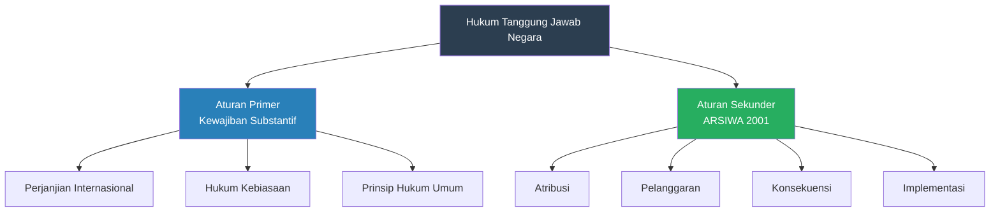
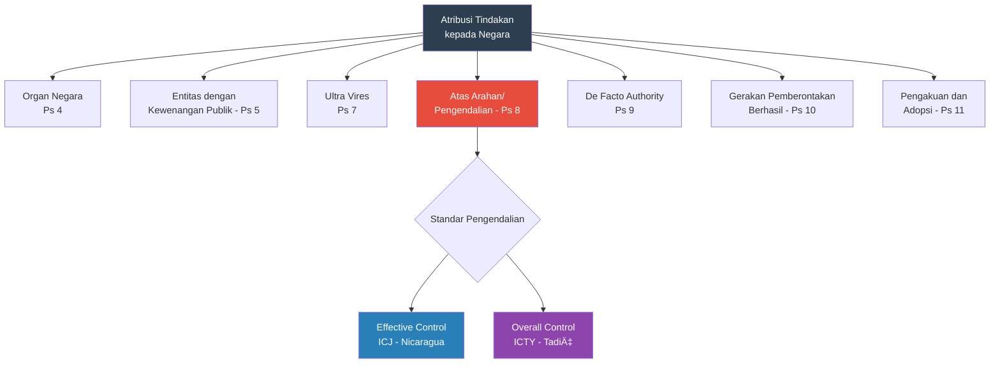
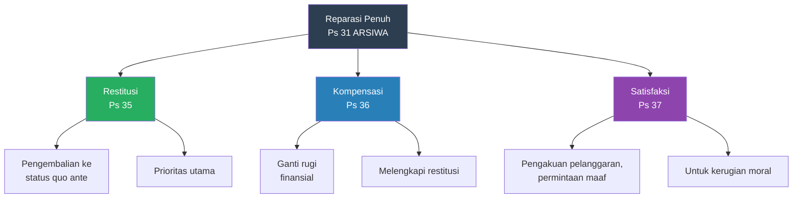
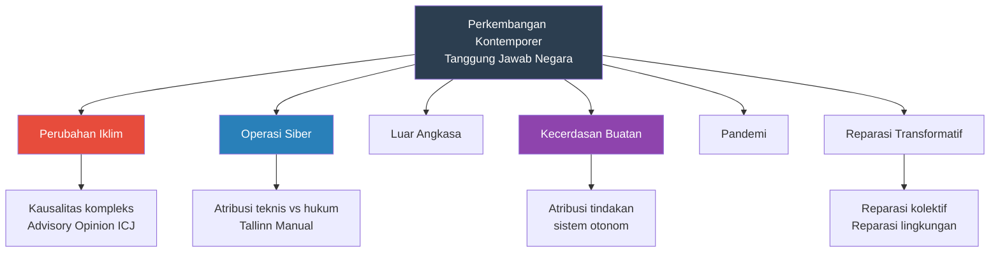

---
title: "Tanggung Jawab Negara dalam Hukum Internasional"
tags:
  - hukum-internasional
  - tanggung-jawab-negara
  - state-responsibility
  - ilc-articles
  - reparasi
  - teaching-materials
publish: true
---

# Bab 7: Tanggung Jawab Negara dalam Hukum Internasional

## Tujuan Pembelajaran

Setelah mempelajari bab ini, mahasiswa diharapkan mampu:

1. Menjelaskan konsep dan perkembangan hukum tanggung jawab negara (*state responsibility*) dalam hukum internasional
2. Menganalisis elemen-elemen tanggung jawab negara berdasarkan ILC Articles on Responsibility of States for Internationally Wrongful Acts (2001)
3. Memahami aturan tentang atribusi (*attribution*) tindakan kepada negara
4. Mengidentifikasi keadaan-keadaan yang menghapuskan sifat melawan hukum (*circumstances precluding wrongfulness*)
5. Menjelaskan bentuk-bentuk reparasi: restitusi, kompensasi, dan satisfaksi
6. Menganalisis konsep perlindungan diplomatik dan persyaratan nasionalitas klaim
7. Memahami kewajiban *erga omnes* dan kepentingan komunitas internasional
8. Mengevaluasi praktik Indonesia terkait tanggung jawab negara dan arbitrase investasi

---

## 7.1 Pendahuluan: Konsep Tanggung Jawab Negara

### 7.1.1 Pengertian dan Arti Penting

Tanggung jawab negara (*state responsibility*) merupakan prinsip fundamental hukum internasional yang menyatakan bahwa setiap negara yang melakukan tindakan yang melawan hukum internasional wajib memikul konsekuensi hukum atas tindakannya tersebut. Prinsip ini telah ditegaskan oleh PCIJ dalam kasus *Chorzów Factory* (1928):

> "It is a principle of international law that the breach of an engagement involves an obligation to make reparation in an adequate form."

Tanggung jawab negara berfungsi sebagai mekanisme penegakan (*enforcement mechanism*) dalam sistem hukum internasional yang pada dasarnya bersifat desentralisasi—tidak ada polisi internasional atau kejaksaan internasional yang secara otomatis menegakkan hukum internasional. Melalui hukum tanggung jawab negara, negara yang dirugikan memiliki hak untuk menuntut reparasi dan, dalam keadaan tertentu, mengambil tindakan balasan (*countermeasures*).

### 7.1.2 Perkembangan Historis

Perkembangan hukum tanggung jawab negara dapat dibagi menjadi beberapa fase:

**Fase Klasik (Abad ke-19 hingga Perang Dunia I)**

Pada fase ini, tanggung jawab negara terutama berkaitan dengan perlindungan warga negara asing dan propertinya di luar negeri. Standar perlakuan terhadap orang asing (*standard of treatment of aliens*) menjadi isu utama, dengan ketegangan antara negara-negara Barat yang menuntut standar minimum internasional (*international minimum standard*) dan negara-negara Amerika Latin yang berpandangan bahwa orang asing hanya berhak atas perlakuan yang sama dengan warga negara setempat (*national treatment* atau *Calvo Doctrine*).

**Fase Kodifikasi (1949-2001)**

Komisi Hukum Internasional (ILC) memulai proyek kodifikasi hukum tanggung jawab negara pada tahun 1949. Proyek ini merupakan salah satu yang paling panjang dalam sejarah ILC, melibatkan lima Pelapor Khusus selama lebih dari lima dekade:

1. F.V. García Amador (1955-1961): Berfokus pada tanggung jawab terhadap orang asing
2. Roberto Ago (1963-1979): Memisahkan aturan primer dan sekunder, mengembangkan kerangka dasar
3. Willem Riphagen (1980-1986): Mengembangkan konsekuensi tanggung jawab
4. Gaetano Arangio-Ruiz (1988-1996): Mengerjakan bagian tentang implementasi
5. James Crawford (1997-2001): Menyelesaikan dan merevisi secara menyeluruh

**Adopsi Articles on State Responsibility (2001)**

Pada tahun 2001, ILC mengadopsi *Articles on Responsibility of States for Internationally Wrongful Acts* (selanjutnya disebut "ARSIWA" atau "ILC Articles") dan merekomendasikan kepada Majelis Umum PBB untuk memperhatikan (*take note*) rancangan tersebut. Majelis Umum melalui Resolusi 56/83 (2001) menyambut baik rancangan tersebut dan merekomendasikannya kepada perhatian pemerintah-pemerintah.

ARSIWA terdiri dari 59 pasal yang dikelompokkan dalam empat bagian:

| Bagian | Judul | Pasal | Materi Pokok |
|---|---|---|---|
| Satu | The Internationally Wrongful Act of a State | 1-27 | Elemen tanggung jawab, atribusi, keadaan penghapusan |
| Dua | Content of the International Responsibility of a State | 28-41 | Kewajiban dan hak yang timbul |
| Tiga | The Implementation of the International Responsibility of a State | 42-54 | Invokasi, tindakan balasan |
| Empat | General Provisions | 55-59 | Lex specialis, pertanggungjawaban individu |

ARSIWA bukan merupakan perjanjian internasional yang mengikat, tetapi sebagian besar ketentuannya dianggap mencerminkan hukum kebiasaan internasional. ICJ dan pengadilan internasional lainnya secara konsisten merujuk ARSIWA sebagai pernyataan otoritatif tentang hukum tanggung jawab negara.

### 7.1.3 Perbedaan Aturan Primer dan Sekunder

Roberto Ago memperkenalkan pembedaan fundamental antara *aturan primer* dan *aturan sekunder* yang menjadi landasan metodologis seluruh proyek kodifikasi:

**Aturan Primer (*Primary Rules*)**: Norma-norma hukum internasional substantif yang menetapkan kewajiban negara—misalnya, kewajiban untuk tidak menggunakan kekerasan, kewajiban menghormati kedaulatan teritorial, kewajiban berdasarkan perjanjian. ARSIWA tidak mengatur aturan primer.

**Aturan Sekunder (*Secondary Rules*)**: Aturan-aturan yang menentukan konsekuensi hukum ketika aturan primer dilanggar—kapan suatu tindakan dapat diatribusikan kepada negara, kapan pelanggaran terjadi, apa konsekuensinya, dan siapa yang berhak menuntut pertanggungjawaban. ARSIWA mengatur aturan sekunder ini.

Pembedaan ini sangat penting karena memungkinkan ARSIWA berlaku secara universal terhadap pelanggaran kewajiban internasional apa pun, tanpa perlu menentukan isi kewajiban tersebut.

---

## 7.2 Elemen-Elemen Tanggung Jawab Negara

### 7.2.1 Dua Elemen Konstitutif

Pasal 2 ARSIWA menetapkan dua elemen yang harus dipenuhi agar suatu tindakan negara menimbulkan tanggung jawab internasional:

> "There is an internationally wrongful act of a State when conduct consisting of an action or omission:
> (a) is attributable to the State under international law; and
> (b) constitutes a breach of an international obligation of the State."

Kedua elemen ini—*atribusi* (*attribution*) dan *pelanggaran kewajiban* (*breach*)—bersifat kumulatif: keduanya harus terpenuhi secara bersamaan.

Perlu dicatat bahwa ARSIWA tidak memasukkan *kerugian* (*damage/injury*) sebagai elemen tersendiri dari tanggung jawab negara, meskipun dalam praktik, kerugian hampir selalu ada dan menjadi pertimbangan penting dalam penentuan reparasi. Posisi ini mencerminkan pandangan bahwa pelanggaran kewajiban internasional sudah dengan sendirinya menimbulkan tanggung jawab, terlepas dari apakah kerugian material terjadi.

ARSIWA juga tidak memasukkan elemen *kesalahan* (*fault*) sebagai persyaratan umum. Apakah kesalahan diperlukan bergantung pada aturan primer yang dilanggar—beberapa kewajiban bersifat *strict liability* (tanggung jawab mutlak), sementara yang lain mensyaratkan adanya kesengajaan atau kelalaian.

### 7.2.2 Atribusi Tindakan kepada Negara

Negara adalah entitas abstrak yang hanya dapat bertindak melalui individu-individu. Hukum atribusi menentukan tindakan individu mana yang dapat dianggap sebagai tindakan negara untuk tujuan tanggung jawab internasional.

**Organ Negara (Pasal 4)**

Tindakan organ negara—eksekutif, legislatif, yudikatif, atau organ lainnya—diatribusikan kepada negara, apa pun posisi organ tersebut dalam struktur pemerintahan dan apa pun sifat fungsinya (pemerintahan pusat atau daerah). Konsep "organ" ditentukan oleh hukum domestik negara bersangkutan.

Pasal 4 mencerminkan prinsip *kesatuan negara* (*unity of the state*): di mata hukum internasional, negara merupakan satu entitas tunggal, dan tindakan setiap organ pemerintah—dari presiden hingga pegawai desa, dari hakim agung hingga polisi lalu lintas—diatribusikan kepada negara.

**Entitas yang Melaksanakan Kewenangan Pemerintahan (Pasal 5)**

Tindakan entitas yang bukan organ negara tetapi diberi kewenangan oleh hukum domestik untuk melaksanakan kewenangan pemerintahan (*governmental authority*) juga diatribusikan kepada negara, sejauh entitas tersebut bertindak dalam kapasitas tersebut. Contohnya meliputi perusahaan negara, organisasi paramiliter, badan regulasi independen, dan perusahaan keamanan swasta yang diberi kewenangan publik.

**Organ yang Ditempatkan di bawah Perintah Negara Lain (Pasal 6)**

Tindakan organ yang ditempatkan di bawah perintah negara lain diatribusikan kepada negara yang mengarahkan dan mengendalikan organ tersebut. Ketentuan ini relevan, misalnya, dalam konteks pasukan perdamaian PBB yang ditempatkan di bawah komando operasional PBB tetapi tetap merupakan organ negara pengirim.

**Melampaui Kewenangan atau Bertentangan dengan Instruksi (*Ultra Vires*) (Pasal 7)**

Tindakan organ negara atau entitas yang melaksanakan kewenangan pemerintahan tetap diatribusikan kepada negara bahkan jika organ tersebut melampaui kewenangannya atau bertentangan dengan instruksi. Prinsip *ultra vires* ini sangat penting karena mencegah negara mengelak dari tanggung jawab dengan berdalih bahwa organ yang melanggar bertindak di luar kewenangannya.

ICJ dalam kasus *Caire* (1929) dan kemudian dalam *Velásquez Rodríguez* (Pengadilan HAM Inter-Amerika, 1988) menegaskan bahwa negara bertanggung jawab atas tindakan agennya yang melampaui kewenangan, asalkan agen tersebut bertindak dalam kapasitas resminya (*official capacity*).

**Tindakan atas Arahan atau Pengendalian Negara (Pasal 8)**

Tindakan seseorang atau kelompok orang diatribusikan kepada negara jika orang atau kelompok tersebut bertindak atas instruksi, arahan, atau pengendalian (*instruction, direction or control*) negara. Pasal ini berkaitan dengan situasi di mana negara menggunakan aktor-aktor non-negara untuk melakukan tindakan tertentu.

Standar pengendalian yang diperlukan menjadi perdebatan besar. Terdapat dua standar yang bersaing:

**Standar Pengendalian Efektif (*Effective Control Test*) — ICJ**

Dalam kasus *Military and Paramilitary Activities in and against Nicaragua* (Nikaragua v. Amerika Serikat, 1986), ICJ menetapkan standar "pengendalian efektif" (*effective control*) untuk mengaitkan tindakan kelompok Contras di Nikaragua kepada Amerika Serikat. Meskipun AS memberikan pendanaan, pelatihan, dan dukungan substansial kepada Contras, ICJ memutuskan bahwa dukungan ini tidak cukup untuk mengatribusikan setiap tindakan Contras kepada AS. Diperlukan bukti bahwa AS secara efektif mengendalikan operasi spesifik di mana pelanggaran terjadi.

ICJ kembali menerapkan standar ini dalam kasus *Genocide Convention (Bosnia-Herzegovina v. Serbia and Montenegro)* (2007), memutuskan bahwa Serbia tidak memiliki pengendalian efektif atas pasukan Republika Srpska yang melakukan genosida di Srebrenica, meskipun Serbia memberikan dukungan substansial.

**Standar Pengendalian Keseluruhan (*Overall Control Test*) — ICTY**

Sebaliknya, Pengadilan Pidana Internasional untuk bekas Yugoslavia (ICTY) dalam kasus *Tadić* (1999) menerapkan standar yang lebih rendah—"pengendalian keseluruhan" (*overall control*)—untuk menentukan bahwa konflik di Bosnia merupakan konflik bersenjata internasional karena keterlibatan Serbia. Berdasarkan standar ini, cukup jika negara memberikan dukungan umum (pendanaan, peralatan, pelatihan, koordinasi) dan berpartisipasi dalam perencanaan umum operasi militer, tanpa harus mengendalikan setiap operasi spesifik.

ARSIWA, melalui Komentar Pasal 8, mengadopsi standar pengendalian efektif ICJ, bukan standar pengendalian keseluruhan ICTY.

**Tindakan dalam Kekosongan atau Ketiadaan Otoritas Resmi (Pasal 9)**

Tindakan seseorang atau kelompok orang diatribusikan kepada negara jika orang atau kelompok tersebut secara de facto melaksanakan kewenangan pemerintahan dalam keadaan tidak adanya atau gagalnya otoritas resmi. Pasal ini berkaitan dengan situasi *failed states* atau situasi di mana otoritas pemerintah runtuh.

**Tindakan Gerakan Pemberontakan yang Berhasil (Pasal 10)**

Tindakan gerakan pemberontakan (*insurrectional movement*) yang berhasil menjadi pemerintah baru diatribusikan kepada negara tersebut. Prinsip ini mencerminkan kesinambungan: jika pemberontak berhasil merebut kekuasaan, segala tindakan mereka selama pemberontakan menjadi tanggung jawab negara yang kini mereka pimpin.

**Tindakan yang Diakui dan Diadopsi oleh Negara (Pasal 11)**

Tindakan yang awalnya tidak dapat diatribusikan kepada negara tetap dapat diatribusikan jika negara mengakui dan mengadopsinya sebagai tindakannya sendiri. Contoh paling terkenal adalah kasus *United States Diplomatic and Consular Staff in Tehran* (1980), di mana ICJ memutuskan bahwa tindakan mahasiswa militan yang menduduki kedutaan AS di Teheran—yang awalnya bukan tindakan negara Iran—menjadi tindakan negara Iran setelah Ayatollah Khomeini dan organ-organ negara Iran secara resmi mendukung dan mengadopsi tindakan tersebut.

### 7.2.3 Pelanggaran Kewajiban Internasional (*Breach*)

**Prinsip Umum (Pasal 12)**

Suatu tindakan negara merupakan pelanggaran kewajiban internasional jika tindakan tersebut tidak sesuai dengan apa yang dituntut oleh kewajiban, apa pun asal-usul atau sifat kewajiban tersebut. Prinsip ini menegaskan bahwa aturan sekunder ARSIWA berlaku terhadap pelanggaran kewajiban apa pun—baik yang bersumber dari perjanjian, hukum kebiasaan, maupun prinsip hukum umum.

**Kewajiban Berlaku pada Saat Tindakan (Pasal 13)**

Tindakan negara hanya merupakan pelanggaran jika negara tersebut terikat pada kewajiban pada saat tindakan dilakukan. Prinsip non-retroaktivitas ini sejalan dengan prinsip umum hukum internasional, termasuk Pasal 28 VCLT.

**Pelanggaran Berkelanjutan (*Continuing Wrongful Act*) (Pasal 14)**

ARSIWA membedakan antara pelanggaran yang terjadi seketika (*instantaneous act*) dan pelanggaran yang bersifat berkelanjutan (*continuing act*):

- Pelanggaran seketika terjadi pada saat tindakan dilakukan, meskipun efeknya berlanjut (misalnya, pengambilalihan ilegal atas properti asing)
- Pelanggaran berkelanjutan berlangsung selama seluruh periode di mana tindakan berlanjut dan tetap tidak sesuai dengan kewajiban (misalnya, penahanan sewenang-wenang, pendudukan wilayah asing)

Perbedaan ini penting untuk menentukan kapan tanggung jawab dimulai, berapa lama pelanggaran berlangsung, dan kapan kewajiban reparasi muncul.

**Pelanggaran yang Terdiri dari Tindakan Komposit (*Composite Act*) (Pasal 15)**

Beberapa kewajiban internasional—khususnya larangan genosida, diskriminasi sistematis, atau kejahatan terhadap kemanusiaan—dilanggar bukan oleh satu tindakan tunggal, tetapi oleh serangkaian tindakan yang secara agregat membentuk pelanggaran. Pelanggaran dianggap terjadi ketika tindakan pertama dari rangkaian tersebut dilakukan dan berlangsung selama seluruh rangkaian tindakan.

---

## 7.3 Keadaan yang Menghapuskan Sifat Melawan Hukum

### 7.3.1 Prinsip Umum

Bab V ARSIWA (Pasal 20-27) mengatur *circumstances precluding wrongfulness*—keadaan-keadaan yang menghapuskan sifat melawan hukum suatu tindakan yang pada situasi normal akan merupakan pelanggaran kewajiban internasional. Keadaan ini tidak menghapuskan kewajiban itu sendiri, tetapi memberikan pembenaran (*justification*) atau alasan pemaaf (*excuse*) bagi tindakan negara.

Pasal 27 menegaskan dua hal penting:
1. Keadaan-keadaan ini tidak mengesampingkan kewajiban kompensasi atas kerugian material yang disebabkan oleh tindakan tersebut
2. Keadaan-keadaan ini tidak mempengaruhi kewajiban yang timbul dari norma *jus cogens*

### 7.3.2 Persetujuan (*Consent*) (Pasal 20)

Persetujuan sah yang diberikan oleh suatu negara atas tindakan negara lain menghapuskan sifat melawan hukum tindakan tersebut, sejauh tindakan tersebut tetap berada dalam batas persetujuan yang diberikan.

Contoh: Kehadiran pasukan militer asing di wilayah suatu negara biasanya merupakan pelanggaran kedaulatan teritorial. Namun, jika negara tuan rumah memberikan persetujuan (misalnya, melalui *Status of Forces Agreement*), kehadiran tersebut tidak melawan hukum.

Persetujuan harus bersifat:
- Sah dan tidak diperoleh melalui paksaan
- Diberikan sebelum atau bersamaan dengan tindakan (bukan sekadar *ex post facto*)
- Diberikan oleh organ yang berwenang
- Jelas dan tidak ambigu

### 7.3.3 Pembelaan Diri (*Self-Defence*) (Pasal 21)

Tindakan yang diambil sesuai dengan Pasal 51 Piagam PBB (pembelaan diri individual atau kolektif) menghapuskan sifat melawan hukum tindakan tersebut terhadap negara agresor.

Hubungan antara Pasal 21 ARSIWA dan Pasal 51 Piagam PBB bersifat referensial: ARSIWA tidak mendefinisikan sendiri syarat-syarat pembelaan diri, tetapi merujuk pada ketentuan Piagam PBB dan hukum kebiasaan internasional yang berlaku. Dengan demikian, pembelaan diri hanya menghapuskan sifat melawan hukum jika memenuhi syarat-syarat yang ditetapkan oleh hukum tentang penggunaan kekerasan (*jus ad bellum*), termasuk syarat kebutuhan (*necessity*) dan proporsionalitas (*proportionality*).

### 7.3.4 Tindakan Balasan (*Countermeasures*) (Pasal 22)

Tindakan balasan yang diambil oleh negara yang dirugikan terhadap negara yang bertanggung jawab untuk memaksanya mematuhi kewajiban reparasi menghapuskan sifat melawan hukum tindakan tersebut, asalkan tindakan balasan memenuhi syarat-syarat yang ditetapkan dalam Bab Tiga ARSIWA (Pasal 49-54).

Tindakan balasan (*countermeasures*) berbeda dari retorsi (*retorsion*):
- **Retorsi**: Tindakan yang tidak ramah tetapi tidak melawan hukum (misalnya, penarikan duta besar, penghentian bantuan ekonomi). Retorsi tidak memerlukan pembenaran berdasarkan ARSIWA.
- **Tindakan balasan**: Tindakan yang pada kondisi normal akan melawan hukum (misalnya, penangguhan kewajiban perjanjian) tetapi dibenarkan sebagai respons terhadap pelanggaran oleh negara lain.

### 7.3.5 Daya Paksa (*Force Majeure*) (Pasal 23)

Daya paksa menghapuskan sifat melawan hukum jika tindakan negara disebabkan oleh kekuatan yang tak teratasi (*irresistible force*) atau kejadian yang tak terduga (*unforeseen event*) di luar kendali negara, yang menjadikan pelaksanaan kewajiban secara material tidak mungkin.

Daya paksa tidak dapat dijadikan dasar jika:
- Situasi tersebut disebabkan oleh negara yang menginvokasinya, atau
- Negara telah menanggung risiko terjadinya situasi tersebut

Contoh: Kapal perang yang dipaksa memasuki perairan teritorial negara lain karena badai dapat menggunakan daya paksa sebagai pembenaran atas pelanggaran kedaulatan teritorial.

### 7.3.6 Keadaan Bahaya (*Distress*) (Pasal 24)

Keadaan bahaya menghapuskan sifat melawan hukum jika pelaku tindakan tidak memiliki cara lain yang wajar untuk menyelamatkan nyawanya atau nyawa orang-orang yang berada di bawah perlindungannya.

Perbedaan utama antara *force majeure* dan *distress*: dalam *force majeure*, tindakan bersifat tidak sukarela (dipaksa oleh keadaan), sedangkan dalam *distress*, pelaku membuat pilihan sadar tetapi tidak memiliki alternatif yang wajar.

### 7.3.7 Keadaan Darurat (*Necessity*) (Pasal 25)

Keadaan darurat merupakan dasar yang paling kontroversial dan paling ketat syaratnya. Pasal 25 menetapkan bahwa keadaan darurat hanya dapat diajukan jika tindakan tersebut merupakan satu-satunya cara bagi negara untuk melindungi kepentingan esensialnya dari bahaya yang berat dan segera (*grave and imminent peril*), dan tindakan tersebut tidak secara serius mengganggu kepentingan esensial negara terhadap mana kewajiban berlaku atau kepentingan masyarakat internasional secara keseluruhan.

Keadaan darurat tidak dapat dijadikan dasar jika:
- Kewajiban internasional yang bersangkutan mengecualikan kemungkinan invokasi keadaan darurat
- Negara telah berkontribusi pada terjadinya keadaan darurat tersebut

ICJ dalam kasus *Gabčíkovo-Nagymaros Project* (1997) memberikan analisis mendalam tentang keadaan darurat. Hungaria berargumen bahwa kekhawatiran lingkungan hidup membenarkan penghentian proyek bendungan berdasarkan keadaan darurat. ICJ menerima bahwa kepentingan lingkungan dapat menjadi "kepentingan esensial" tetapi menolak klaim Hungaria karena bahaya tidak bersifat segera (*imminent*) dan Hungaria memiliki alternatif lain.

Dalam konteks krisis ekonomi, beberapa pengadilan arbitrase investasi membahas apakah krisis ekonomi dapat dijadikan dasar keadaan darurat. Dalam kasus-kasus terkait krisis ekonomi Argentina 2001-2002, tribunal arbitrase ICSID memberikan putusan yang berbeda-beda—beberapa menerima, yang lain menolak argumen keadaan darurat Argentina.

| Keadaan | Pasal | Persyaratan Utama | Contoh |
|---|---|---|---|
| Persetujuan | 20 | Persetujuan sah dari negara yang dirugikan | Izin penempatan pasukan asing |
| Pembelaan diri | 21 | Sesuai Pasal 51 Piagam PBB | Respons terhadap serangan bersenjata |
| Tindakan balasan | 22 | Sesuai Pasal 49-54 ARSIWA | Penangguhan kewajiban perjanjian |
| Daya paksa | 23 | Kekuatan tak teratasi atau kejadian tak terduga | Badai memaksa kapal masuk perairan asing |
| Keadaan bahaya | 24 | Tidak ada cara lain menyelamatkan nyawa | Pendaratan darurat pesawat |
| Keadaan darurat | 25 | Satu-satunya cara melindungi kepentingan esensial | Krisis lingkungan atau ekonomi berat |

---

## 7.4 Reparasi

### 7.4.1 Prinsip Umum Reparasi

Pasal 31 ARSIWA menetapkan kewajiban reparasi penuh (*full reparation*) atas kerugian yang ditimbulkan oleh tindakan melawan hukum internasional:

> "The responsible State is under an obligation to make full reparation for the injury caused by the internationally wrongful act."

Prinsip reparasi penuh berasal dari putusan PCIJ dalam kasus *Chorzów Factory* (1928), yang merupakan salah satu putusan paling berpengaruh dalam hukum internasional:

> "Reparation must, as far as possible, wipe out all the consequences of the illegal act and reestablish the situation which would, in all probability, have existed if that act had not been committed."

"Kerugian" (*injury*) mencakup kerugian material (*material damage*) dan kerugian moral (*moral damage*), termasuk kerugian terhadap negara itu sendiri dan terhadap warga negaranya (Pasal 31 ayat 2).

### 7.4.2 Restitusi (*Restitution*) (Pasal 35)

Restitusi merupakan bentuk reparasi yang paling sempurna karena bertujuan mengembalikan keadaan ke kondisi semula (*status quo ante*) sebelum pelanggaran terjadi. Restitusi dapat berupa pengembalian wilayah yang diduduki, pembebasan orang yang ditahan secara tidak sah, pencabutan peraturan yang melanggar kewajiban internasional, atau pengembalian properti yang disita.

Restitusi wajib dilakukan kecuali jika:
- Secara material tidak mungkin dilakukan
- Membebani secara tidak proporsional dibandingkan dengan manfaat dari kompensasi

### 7.4.3 Kompensasi (*Compensation*) (Pasal 36)

Kompensasi mencakup kerugian yang dapat dinilai secara finansial yang tidak tercakup oleh restitusi. Kompensasi bertujuan mengisi kesenjangan antara kondisi setelah restitusi (jika diberikan) dan kondisi yang seharusnya ada jika pelanggaran tidak terjadi.

Kompensasi meliputi:
- Kerugian langsung (*direct damage*): kerugian yang secara langsung disebabkan oleh pelanggaran
- Keuntungan yang hilang (*lost profits/lucrum cessans*): pendapatan yang seharusnya diperoleh jika pelanggaran tidak terjadi
- Kerugian insidental (*incidental damages*): biaya yang timbul akibat pelanggaran
- Bunga (*interest*): kompensasi atas keterlambatan pembayaran

Penentuan besaran kompensasi merupakan persoalan yang kompleks dan sering diperdebatkan. Dalam konteks pengambilalihan properti asing, terdapat perbedaan antara standar kompensasi "penuh, segera, dan efektif" (*prompt, adequate and effective*, atau *Hull formula*) yang dikemukakan negara-negara maju, dan standar "kompensasi yang layak" (*appropriate compensation*) yang dikemukakan negara-negara berkembang.

### 7.4.4 Satisfaksi (*Satisfaction*) (Pasal 37)

Satisfaksi merupakan bentuk reparasi untuk kerugian moral atau non-material yang tidak dapat diperbaiki melalui restitusi atau kompensasi. Bentuk satisfaksi meliputi:

- Pengakuan pelanggaran (*acknowledgment of the breach*)
- Pernyataan penyesalan (*expression of regret*)
- Permintaan maaf resmi (*formal apology*)
- Pernyataan pengadilan yang mengakui adanya pelanggaran (*judicial declaration*)

Pasal 37 ayat (3) menegaskan bahwa satisfaksi tidak boleh tidak proporsional dengan kerugian dan tidak boleh berupa bentuk yang merendahkan (*humiliating*) bagi negara yang bertanggung jawab.

ICJ dalam kasus *Corfu Channel* (Inggris v. Albania, 1949)—yang memiliki signifikansi historis sebagai kasus pertama yang diputus ICJ—menyatakan bahwa putusan Pengadilan yang mengakui pelanggaran Albania sudah merupakan satisfaksi yang memadai.

Dalam kasus *Rainbow Warrior* (Selandia Baru v. Prancis, 1990), Tribunal Arbitrase memerintahkan Prancis untuk menyampaikan permintaan maaf resmi kepada Selandia Baru atas pelanggaran perjanjian antara kedua negara terkait penahanan agen-agen Prancis yang bertanggung jawab atas pengeboman kapal Rainbow Warrior.

---

## 7.5 Perlindungan Diplomatik

### 7.5.1 Konsep Perlindungan Diplomatik

Perlindungan diplomatik (*diplomatic protection*) adalah mekanisme yang memungkinkan negara mengajukan klaim internasional atas nama warga negaranya yang dirugikan oleh tindakan melawan hukum negara lain. Dalam hukum internasional klasik, klaim individu terhadap negara asing tidak dapat diajukan secara langsung di tingkat internasional; hanya negara yang dapat menjadi pihak dalam sengketa internasional. Perlindungan diplomatik menjembatani kesenjangan ini.

ILC mengadopsi *Draft Articles on Diplomatic Protection* pada tahun 2006, yang memberikan kerangka hukum komprehensif untuk mekanisme ini.

### 7.5.2 Persyaratan Nasionalitas Klaim (*Nationality of Claims*)

Negara hanya dapat menjalankan perlindungan diplomatik atas individu yang memiliki kewarganegaraan negara tersebut. Persyaratan ini dikenal sebagai "aturan nasionalitas klaim" (*nationality of claims rule*).

**Nasionalitas pada Tanggal Kerugian dan Tanggal Klaim**

Individu harus memiliki kewarganegaraan negara pelindung baik pada tanggal kerugian (*date of injury*) maupun pada tanggal klaim diajukan (*date of presentation of claim*). Aturan "nasionalitas berkelanjutan" (*continuous nationality*) ini bertujuan mencegah individu mengalihkan klaimnya ke negara yang lebih kuat dengan cara mengubah kewarganegaraan setelah kerugian terjadi.

**Kewarganegaraan Ganda**

Dalam kasus kewarganegaraan ganda, negara dapat menjalankan perlindungan diplomatik terhadap negara di mana individu juga berkewarganegaraan, asalkan kewarganegaraan yang bersangkutan bersifat dominan dan efektif. Prinsip ini berasal dari kasus *Nottebohm* (Liechtenstein v. Guatemala, 1955), di mana ICJ memutuskan bahwa Liechtenstein tidak dapat menjalankan perlindungan diplomatik atas Friedrich Nottebohm karena kewarganegaraan Liechtenstein yang diberikan kepadanya tidak bersifat *genuine link*—Nottebohm memiliki hubungan yang jauh lebih erat dengan Guatemala tempat ia tinggal dan bekerja selama puluhan tahun.

### 7.5.3 Persyaratan Penyelesaian Upaya Hukum Domestik (*Exhaustion of Local Remedies*)

Sebelum suatu negara dapat menjalankan perlindungan diplomatik, individu yang dirugikan harus terlebih dahulu menempuh semua upaya hukum yang tersedia di negara pelanggar (*exhaustion of local remedies rule*). Prinsip ini diakui sebagai hukum kebiasaan internasional dan ditegaskan dalam banyak putusan pengadilan internasional.

Pengecualian terhadap aturan ini berlaku jika:
- Upaya hukum domestik jelas tidak tersedia atau tidak efektif
- Tidak ada hubungan sukarela antara individu dan negara pelanggar (misalnya, kasus penyanderaan)
- Terdapat penundaan yang tidak wajar dalam proses hukum domestik
- Negara pelanggar telah menyatakan tidak akan memberikan upaya hukum

### 7.5.4 Perlindungan Diplomatik atas Badan Hukum

Sebagaimana dibahas dalam kasus *Barcelona Traction* (1970), negara yang berhak memberikan perlindungan diplomatik bagi perusahaan adalah negara tempat perusahaan tersebut didirikan, bukan negara dari para pemegang sahamnya. Pengecualian berlaku jika perusahaan telah bubar atau jika negara tempat pendirian tidak mampu atau tidak mau memberikan perlindungan.

---

## 7.6 Invokasi Tanggung Jawab

### 7.6.1 Negara yang Dirugikan (*Injured State*) (Pasal 42)

Pasal 42 ARSIWA mengidentifikasi negara-negara yang berhak menginvokasi tanggung jawab sebagai "negara yang dirugikan" (*injured state*). Suatu negara berhak menginvokasi tanggung jawab jika kewajiban yang dilanggar dimiliki:
- Secara individual terhadap negara tersebut
- Terhadap sekelompok negara atau masyarakat internasional secara keseluruhan, dan pelanggaran tersebut secara khusus mempengaruhi negara tersebut atau secara radikal mengubah posisi semua negara yang berkewajiban

### 7.6.2 Negara Selain Negara yang Dirugikan (Pasal 48)

Pasal 48 ARSIWA memberikan hak kepada negara yang bukan "negara yang dirugikan" untuk menginvokasi tanggung jawab jika kewajiban yang dilanggar dimiliki terhadap sekelompok negara dan ditetapkan untuk melindungi kepentingan kolektif kelompok, atau dimiliki terhadap masyarakat internasional secara keseluruhan (*erga omnes*).

Ketentuan ini mencerminkan perkembangan konsep *erga omnes obligations* yang diperkenalkan ICJ dalam kasus *Barcelona Traction* (1970):

> "An essential distinction should be drawn between the obligations of a State towards the international community as a whole, and those arising vis-à-vis another State... By their very nature the former are the concern of all States. In view of the importance of the rights involved, all States can be held to have a legal interest in their protection; they are obligations erga omnes."

ICJ memberikan contoh kewajiban *erga omnes*: larangan agresi, genosida, perbudakan, dan diskriminasi rasial. Daftar ini tidak tertutup dan dapat berkembang.

Negara yang menginvokasi tanggung jawab berdasarkan Pasal 48 dapat menuntut:
- Penghentian tindakan melawan hukum dan jaminan non-pengulangan
- Reparasi untuk kepentingan negara yang dirugikan atau penerima manfaat kewajiban yang dilanggar

### 7.6.3 Tindakan Balasan (*Countermeasures*) (Pasal 49-54)

ARSIWA mengatur secara detail syarat-syarat dan batasan-batasan tindakan balasan:

**Tujuan dan Sifat (Pasal 49)**
Tindakan balasan hanya boleh diambil terhadap negara yang bertanggung jawab dan hanya bertujuan untuk mendorong negara tersebut memenuhi kewajiban reparasinya. Tindakan balasan bersifat sementara dan harus dihentikan setelah negara yang bertanggung jawab mematuhi kewajibannya.

**Kewajiban yang Tidak Boleh Dilanggar melalui Tindakan Balasan (Pasal 50)**
Tindakan balasan tidak boleh mempengaruhi:
- Kewajiban untuk tidak menggunakan kekerasan (Pasal 2(4) Piagam PBB)
- Kewajiban melindungi hak asasi manusia fundamental
- Kewajiban di bawah hukum humaniter internasional
- Kewajiban *jus cogens*
- Inviolabilitas agen, kantor, arsip, dan dokumen diplomatik dan konsuler

**Proporsionalitas (Pasal 51)**
Tindakan balasan harus proporsional terhadap kerugian yang diderita, dengan mempertimbangkan bobot pelanggaran dan hak-hak yang terpengaruh.

**Prosedur (Pasal 52)**
Sebelum mengambil tindakan balasan, negara yang dirugikan harus:
1. Meminta negara yang bertanggung jawab untuk memenuhi kewajibannya
2. Memberitahukan keputusan untuk mengambil tindakan balasan
3. Menawarkan negosiasi

---

## 7.7 Kasus-Kasus Penting

### 7.7.1 Kasus Corfu Channel (Inggris v. Albania, 1949)

**Fakta:**
Pada Oktober 1946, kapal perang Inggris yang melintasi Selat Corfu (antara Albania dan Yunani) mengenai ranjau laut. Dua kapal rusak berat dan 44 pelaut Inggris tewas. Inggris kemudian melakukan operasi penyapuan ranjau di perairan Albania tanpa izin Albania.

**Putusan:**
ICJ memutuskan bahwa:
1. Albania bertanggung jawab atas kerugian karena mengetahui atau seharusnya mengetahui adanya ranjau dan gagal memperingatkan kapal-kapal yang melintas
2. Operasi penyapuan ranjau Inggris melanggar kedaulatan Albania
3. Pernyataan Pengadilan tentang pelanggaran Inggris sudah merupakan satisfaksi yang memadai bagi Albania

**Signifikansi:**
Kasus ini menetapkan prinsip bahwa negara bertanggung jawab atas penggunaan wilayahnya yang merugikan negara lain (*sic utere tuo*), dan bahwa negara tidak boleh melaksanakan yurisdiksi eksekutif di wilayah negara lain tanpa persetujuan.

### 7.7.2 Kasus Rainbow Warrior (Selandia Baru v. Prancis, 1986-1990)

**Fakta:**
Pada Juli 1985, agen dinas rahasia Prancis (DGSE) menenggelamkan kapal Rainbow Warrior milik Greenpeace di pelabuhan Auckland, Selandia Baru. Satu anggota awak kapal tewas. Dua agen Prancis ditangkap dan dihukum oleh pengadilan Selandia Baru.

**Penyelesaian:**
Kasus ini diselesaikan melalui mediasi Sekretaris Jenderal PBB, yang menghasilkan perjanjian antara Prancis dan Selandia Baru: Prancis membayar kompensasi dan menyampaikan permintaan maaf; kedua agen dipindahkan ke pulau Hao di Polinesia Prancis untuk menjalani penahanan selama tiga tahun. Ketika Prancis memulangkan kedua agen sebelum waktunya, Selandia Baru mengajukan kasus ke tribunal arbitrase.

**Putusan Arbitrase (1990):**
Tribunal memutuskan bahwa Prancis melanggar perjanjian dan memerintahkan pernyataan penyesalan serta kontribusi ke dana yang diusulkan Selandia Baru.

**Signifikansi:**
Kasus ini mengilustrasikan penerapan prinsip-prinsip tanggung jawab negara (atribusi tindakan agen kepada negara, reparasi) dan juga membahas keadaan darurat medis sebagai kemungkinan pembenaran.

### 7.7.3 Kasus Gabčíkovo-Nagymaros (Hungaria/Slovakia, 1997)

**Fakta:**
Pada tahun 1977, Hungaria dan Cekoslowakia menandatangani perjanjian untuk membangun sistem bendungan di Sungai Danube. Pada akhir 1980-an, Hungaria menghentikan pekerjaannya dengan alasan kekhawatiran lingkungan. Cekoslowakia (kemudian Slovakia) melanjutkan pembangunan secara sepihak dengan solusi alternatif yang mengalihkan aliran sungai.

**Putusan:**
ICJ memutuskan bahwa:
1. Hungaria tidak berhak menangguhkan dan menghentikan pekerjaannya—kekhawatiran lingkungan tidak memenuhi syarat keadaan darurat (*necessity*)
2. Cekoslowakia/Slovakia tidak berhak mengoperasikan solusi alternatif secara sepihak—tindakan ini merupakan tindakan balasan yang tidak proporsional
3. Kedua pihak melanggar kewajiban mereka dan harus bernegosiasi dengan itikad baik

**Signifikansi:**
Kasus ini memberikan analisis ICJ yang paling mendalam tentang keadaan darurat (*necessity*) dan menegaskan bahwa standar Pasal 25 ARSIWA sangat tinggi.

### 7.7.4 Kasus Genocide Convention (Bosnia v. Serbia, 2007)

**Fakta dan Putusan:**
ICJ memutuskan bahwa Serbia tidak melakukan genosida di Srebrenica tetapi melanggar kewajiban mencegah genosida dan kewajiban kerja sama dengan ICTY. Dalam konteks tanggung jawab negara, ICJ menerapkan standar "pengendalian efektif" untuk atribusi dan menolak mengatribusikan tindakan pasukan Republika Srpska kepada Serbia.

---

## 7.8 Tanggung Jawab Organisasi Internasional

### 7.8.1 ARIO (2011)

Pada tahun 2011, ILC mengadopsi *Draft Articles on the Responsibility of International Organizations* (ARIO), yang memperluas kerangka tanggung jawab negara ke organisasi internasional. ARIO terdiri dari 67 pasal yang secara struktural mengikuti ARSIWA, dengan penyesuaian untuk karakteristik khusus organisasi internasional.

ARIO menetapkan bahwa organisasi internasional bertanggung jawab atas tindakan melawan hukum internasional yang diatribusikan kepadanya, termasuk tindakan organ dan agennya. Persoalan atribusi menjadi lebih kompleks dalam konteks organisasi internasional karena organisasi seringkali beroperasi melalui organ yang "dipinjam" dari negara anggota—misalnya, pasukan perdamaian PBB yang merupakan kontingen nasional tetapi berada di bawah komando PBB.

### 7.8.2 Tanggung Jawab PBB dalam Operasi Perdamaian

Tanggung jawab PBB atas tindakan pasukan perdamaian merupakan persoalan praktis yang penting. Dalam beberapa kasus, termasuk kegagalan melindungi penduduk sipil di Srebrenica (1995) dan kolera yang disebarkan oleh pasukan PBB di Haiti (2010), muncul pertanyaan tentang siapa yang bertanggung jawab: PBB, negara pengirim pasukan, atau keduanya.

Pengadilan Belanda dalam kasus *Mothers of Srebrenica* (2019) memutuskan bahwa baik PBB maupun Belanda (negara pengirim) dapat bertanggung jawab secara bersama-sama, bergantung pada siapa yang memiliki pengendalian efektif pada saat peristiwa terjadi.

---

## 7.9 Praktik Indonesia

### 7.9.1 Kasus Timor Leste

Setelah referendum 1999 dan kemerdekaan Timor Leste pada tahun 2002, muncul pertanyaan tentang tanggung jawab Indonesia atas pelanggaran hak asasi manusia yang terjadi selama pendudukan (1975-1999) dan kekerasan pasca-referendum (1999).

Indonesia menyelesaikan persoalan ini melalui berbagai mekanisme:
- Pembentukan Pengadilan HAM Ad Hoc berdasarkan UU Nomor 26 Tahun 2000 dan Keppres, meskipun hasilnya banyak dikritik karena sebagian besar terdakwa dibebaskan
- Pembentukan Commission of Truth and Friendship (CTF) bersama Timor Leste pada tahun 2005, yang melaporkan temuannya pada tahun 2008
- Negosiasi bilateral mengenai perbatasan darat dan laut

Kasus Timor Leste mengilustrasikan kompleksitas penerapan hukum tanggung jawab negara dalam konteks transisi politik, di mana pertimbangan politik dan rekonsiliasi seringkali berinteraksi dengan tuntutan keadilan dan akuntabilitas.

### 7.9.2 Arbitrase Investasi: Churchill Mining v. Indonesia

Kasus *Churchill Mining PLC and Planet Mining Pty Ltd v. Republic of Indonesia* (ICSID Case No. ARB/12/14 dan ARB/12/40) merupakan salah satu sengketa arbitrase investasi terbesar yang melibatkan Indonesia.

**Fakta:**
Churchill Mining, perusahaan Inggris, dan Planet Mining, perusahaan Australia, mengklaim kerugian sekitar 1,3 miliar USD akibat pencabutan izin pertambangan mereka di Kalimantan Timur. Klaim didasarkan pada BIT Indonesia-Inggris dan BIT Indonesia-Australia.

**Putusan (2016):**
Tribunal ICSID memutuskan bahwa klaim tidak dapat diterima karena didasarkan pada dokumen-dokumen palsu (*forgery*). Izin pertambangan yang menjadi dasar investasi terbukti merupakan pemalsuan. Tribunal tidak memutuskan bahwa Indonesia bertanggung jawab dan justru memerintahkan penggugat membayar biaya arbitrase.

**Signifikansi:**
Kasus ini menunjukkan bahwa hukum tanggung jawab negara dan arbitrase investasi memberikan perlindungan tidak hanya kepada investor tetapi juga kepada negara tuan rumah dari klaim yang tidak berdasar.

### 7.9.3 Kasus Cemex dan Sengketa Investasi Lainnya

Indonesia telah menghadapi beberapa sengketa arbitrase investasi lainnya, termasuk kasus yang berkaitan dengan kebijakan lingkungan dan regulasi sektor tambang. Kasus-kasus ini mengilustrasikan ketegangan antara hak negara untuk mengatur (regulatory sovereignty) dan kewajiban perlindungan investasi berdasarkan BIT.

Indonesia merespons dengan mengkaji ulang kebijakan BIT-nya. Pada tahun 2014-2015, Indonesia mengumumkan rencana untuk mengakhiri dan merundingkan ulang sejumlah BIT, dengan tujuan menyeimbangkan antara perlindungan investasi dan ruang kebijakan (*policy space*) bagi pemerintah.

---

## 7.10 Perkembangan Kontemporer

### 7.10.1 Tanggung Jawab atas Perubahan Iklim

Apakah negara-negara penghasil emisi besar dapat dimintai pertanggungjawaban atas dampak perubahan iklim terhadap negara-negara yang paling rentan—khususnya negara-negara kepulauan kecil (*Small Island Developing States*/SIDS)? Pertanyaan ini semakin relevan seiring meningkatnya dampak perubahan iklim.

Persoalan hukum utama meliputi:
- **Atribusi kausal**: Dapatkah perubahan iklim diatribusikan kepada negara tertentu?
- **Pelanggaran kewajiban**: Kewajiban apa yang dilanggar—kewajiban perjanjian (UNFCCC, Perjanjian Paris) atau kewajiban kebiasaan (*due diligence*)?
- **Kerugian**: Bagaimana menghitung kerugian akibat perubahan iklim?

Pada tahun 2023, Majelis Umum PBB meminta Advisory Opinion ICJ tentang kewajiban negara terkait perubahan iklim, yang pembahasannya masih berlangsung.

### 7.10.2 Tanggung Jawab atas Aktivitas Siber

Penerapan hukum tanggung jawab negara terhadap operasi siber (*cyber operations*) merupakan bidang yang berkembang pesat. Persoalan utama meliputi:
- Atribusi teknis vs atribusi hukum: Mengidentifikasi pelaku serangan siber secara teknis tidak sama dengan mengatribusikan tindakan tersebut kepada negara secara hukum
- Standar *due diligence*: Apakah negara bertanggung jawab jika aktor non-negara melancarkan serangan siber dari wilayahnya?
- Tindakan balasan di ruang siber: Apakah tindakan balasan siber (*cyber countermeasures*) diizinkan?

Tallinn Manual on the International Law Applicable to Cyber Operations (2013, edisi revisi 2017) memberikan panduan akademis tentang penerapan hukum internasional—termasuk hukum tanggung jawab negara—terhadap operasi siber.

### 7.10.3 Tanggung Jawab atas Tindakan di Luar Angkasa

Space Liability Convention (1972) menetapkan rezim tanggung jawab khusus untuk kerugian yang disebabkan oleh objek antariksa. Konvensi ini menerapkan tanggung jawab absolut (*absolute liability*) untuk kerugian di permukaan bumi dan tanggung jawab berdasarkan kesalahan (*fault-based liability*) untuk kerugian di luar angkasa.

Satu-satunya klaim yang pernah diajukan berdasarkan konvensi ini adalah kasus Cosmos 954 (1978), ketika satelit nuklir Uni Soviet jatuh di wilayah Kanada. Kanada mengajukan klaim ganti rugi kepada Uni Soviet sebesar 6 juta dolar Kanada untuk biaya pembersihan. Kasus ini diselesaikan melalui negosiasi diplomatik dengan pembayaran 3 juta dolar Kanada oleh Uni Soviet pada tahun 1981.

### 7.10.4 Tanggung Jawab dan Kecerdasan Buatan

Perkembangan kecerdasan buatan (*artificial intelligence*) menimbulkan pertanyaan baru tentang atribusi. Ketika sistem AI otonom yang dioperasikan oleh negara menyebabkan kerugian—misalnya, sistem senjata otonom yang menyerang target sipil—siapa yang bertanggung jawab? Kerangka ARSIWA, yang dibangun atas asumsi bahwa tindakan dilakukan oleh manusia yang bertindak sebagai organ atau agen negara, mungkin memerlukan penyesuaian untuk mengakomodasi skenario di mana keputusan dibuat oleh algoritma.

Beberapa pendekatan yang diusulkan meliputi:
- **Atribusi melalui pengoperasian**: Negara yang mengoperasikan sistem AI bertanggung jawab atas tindakan sistem tersebut, karena sistem merupakan "instrumen" negara
- **Atribusi melalui pengembangan**: Negara yang mengembangkan dan menyebarkan sistem AI bertanggung jawab atas cacat desain yang menyebabkan kerugian
- **Standar *due diligence***: Negara bertanggung jawab jika gagal melakukan pengawasan yang memadai terhadap sistem AI yang dioperasikannya

### 7.10.5 Tanggung Jawab Negara dan Pandemi

Pandemi COVID-19 memunculkan perdebatan tentang apakah negara asal virus dapat dimintai pertanggungjawaban atas penyebaran pandemi. Persoalan hukum yang muncul meliputi:

- **Kewajiban primer**: International Health Regulations (IHR) 2005 mewajibkan negara untuk memberitahukan WHO tentang peristiwa kesehatan yang dapat merupakan *Public Health Emergency of International Concern* (PHEIC). Kegagalan memberitahukan secara tepat waktu dapat merupakan pelanggaran kewajiban primer.
- **Atribusi**: Tindakan (atau kelalaian) pejabat kesehatan daerah yang gagal melaporkan wabah dapat diatribusikan kepada negara berdasarkan Pasal 4 ARSIWA.
- **Kausalitas**: Membuktikan hubungan kausal antara kegagalan negara dan kerugian spesifik yang diderita negara lain merupakan tantangan besar, mengingat sifat pandemi yang multifaktorial.
- **Keadaan darurat**: Negara mungkin menginvokasi keadaan darurat (*necessity*) untuk membenarkan tindakan-tindakan darurat yang melanggar kewajiban internasional lainnya, seperti pembatasan ekspor alat kesehatan.

Hingga saat ini, belum ada klaim tanggung jawab negara yang berhasil diajukan secara formal terkait COVID-19, meskipun wacana tentang hal ini telah mendorong pembahasan tentang reformasi sistem kesehatan global dan penguatan mekanisme akuntabilitas.

### 7.10.6 Perkembangan dalam Reparasi: Keadilan Transisional dan Reparasi Kolektif

Konsep reparasi dalam hukum tanggung jawab negara kontemporer telah berkembang melampaui model tradisional yang berfokus pada ganti rugi finansial antarnegara. Perkembangan penting meliputi:

**Reparasi untuk Pelanggaran HAM Massal**: Pengadilan dan badan hak asasi manusia regional telah mengembangkan konsep reparasi yang lebih luas, mencakup langkah-langkah jaminan non-pengulangan (*guarantees of non-repetition*), reformasi kelembagaan, program pendidikan hak asasi manusia, dan pencarian kebenaran.

**Reparasi atas Kolonialisme dan Perbudakan**: Tuntutan reparasi atas kolonialisme dan perbudakan transatlantik semakin menguat. Pada tahun 2013, CARICOM (Caribbean Community) mendirikan Reparations Commission yang mengajukan tuntutan reparasi kepada bekas negara-negara kolonial Eropa. Meskipun tuntutan ini belum menghasilkan reparasi formal, wacana ini mempengaruhi perkembangan hukum tanggung jawab negara.

**Reparasi Lingkungan**: Konsep reparasi untuk kerusakan lingkungan lintas batas berkembang melalui praktik pengadilan dan tribunal internasional. ICJ dalam kasus *Certain Activities Carried Out by Nicaragua in the Border Area* (Costa Rica v. Nicaragua, 2018) memerintahkan kompensasi untuk kerusakan lingkungan, termasuk kompensasi untuk kerugian terhadap jasa ekosistem (*ecosystem services*).

---

## Ringkasan

Hukum tanggung jawab negara merupakan pilar fundamental sistem hukum internasional yang mengatur konsekuensi hukum ketika negara melanggar kewajibannya. ARSIWA 2001 menyediakan kerangka hukum komprehensif yang mencakup elemen-elemen tanggung jawab (atribusi dan pelanggaran), keadaan yang menghapuskan sifat melawan hukum, reparasi, dan implementasi tanggung jawab.

Aturan atribusi memastikan bahwa tindakan individu-individu tertentu—organ negara, entitas publik, dan dalam kondisi tertentu, aktor non-negara—dapat dikaitkan dengan negara. Keadaan penghapusan sifat melawan hukum memberikan fleksibilitas yang diperlukan dalam situasi luar biasa, sementara tetap menjaga integritas sistem pertanggungjawaban.

Prinsip reparasi penuh—melalui restitusi, kompensasi, dan satisfaksi—memastikan bahwa pelanggaran tidak berlalu tanpa konsekuensi. Perlindungan diplomatik dan konsep kewajiban *erga omnes* memperluas lingkaran pihak yang dapat menginvokasi tanggung jawab, mencerminkan kepentingan masyarakat internasional dalam penegakan norma-norma fundamental.

---

## Pertanyaan Refleksi

1. Bandingkan standar "pengendalian efektif" ICJ dan standar "pengendalian keseluruhan" ICTY untuk atribusi. Dalam konteks apa masing-masing standar lebih tepat diterapkan?

2. Evaluasi apakah keadaan darurat (*necessity*) dapat dijadikan pembenaran bagi negara yang gagal memenuhi kewajiban lingkungan hidup internasional demi kepentingan pembangunan ekonomi.

3. Analisis implikasi kasus *Genocide Convention* (Bosnia v. Serbia) bagi tanggung jawab negara atas tindakan kelompok bersenjata yang didukungnya.

4. Bagaimana kerangka ARSIWA berlaku terhadap pelanggaran kewajiban yang bersumber dari perjanjian investasi bilateral? Apakah ada ketegangan antara hukum investasi internasional dan hukum tanggung jawab negara umum?

5. Evaluasi efektivitas tindakan balasan sebagai mekanisme penegakan hukum internasional. Apakah ada risiko penyalahgunaan oleh negara-negara besar terhadap negara-negara kecil?

6. Diskusikan prospek penerapan hukum tanggung jawab negara terhadap perubahan iklim. Apakah kerangka ARSIWA memadai untuk menangani persoalan ini?

7. Analisis praktik Indonesia dalam arbitrase investasi internasional. Apakah keputusan Indonesia untuk mengakhiri beberapa BIT merupakan langkah yang tepat?

8. Bagaimana perkembangan teknologi (siber, kecerdasan buatan) menantang kerangka atribusi dalam hukum tanggung jawab negara?

---

## Daftar Pustaka

### Buku Teks Utama

- Shaw, Malcolm N. *International Law*. 9th ed. Cambridge: Cambridge University Press, 2021. Chapter 14.
- Crawford, James. *Brownlie's Principles of Public International Law*. 9th ed. Oxford: Oxford University Press, 2019. Chapters 16-18.
- Crawford, James. *State Responsibility: The General Part*. Cambridge: Cambridge University Press, 2013.
- Crawford, James, Alain Pellet, dan Simon Olleson, eds. *The Law of International Responsibility*. Oxford: Oxford University Press, 2010.

### Komentar ARSIWA

- Crawford, James. *The International Law Commission's Articles on State Responsibility: Introduction, Text and Commentaries*. Cambridge: Cambridge University Press, 2002.
- Caron, David D. dan Matti Pellonpää. "Choice of Law, State Responsibility, and the Law of Treaties." In *The Law of International Responsibility*, ed. Crawford et al. Oxford: Oxford University Press, 2010.

### Monograf Khusus

- Ago, Roberto. "Le Délit international." *Recueil des cours* 68 (1939): 415-554.
- Brownlie, Ian. *System of the Law of Nations: State Responsibility, Part I*. Oxford: Clarendon Press, 1983.
- Dupuy, Pierre-Marie. "Reviewing the Difficulties of Codification: On Ago's Classification of Obligations of Means and Obligations of Result in Relation to State Responsibility." *European Journal of International Law* 10 (1999): 371-385.
- Nollkaemper, André. "Concurrence between Individual Responsibility and State Responsibility in International Law." *International and Comparative Law Quarterly* 52 (2003): 615-640.

### Putusan Pengadilan Internasional

- *Chorzów Factory* (Germany v. Poland), Jurisdiction, PCIJ Series A No. 9, 1927; Merits, PCIJ Series A No. 17, 1928.
- *Corfu Channel* (United Kingdom v. Albania), Merits, ICJ Reports 1949.
- *Barcelona Traction, Light and Power Company, Limited* (Belgium v. Spain), ICJ Reports 1970.
- *United States Diplomatic and Consular Staff in Tehran* (United States v. Iran), ICJ Reports 1980.
- *Military and Paramilitary Activities in and against Nicaragua* (Nicaragua v. United States), Merits, ICJ Reports 1986.
- *Gabčíkovo-Nagymaros Project* (Hungary/Slovakia), ICJ Reports 1997.
- *Application of the Convention on the Prevention and Punishment of the Crime of Genocide* (Bosnia-Herzegovina v. Serbia and Montenegro), ICJ Reports 2007.
- *Jurisdictional Immunities of the State* (Germany v. Italy: Greece Intervening), ICJ Reports 2012.

### Putusan Arbitrase

- *Rainbow Warrior* (New Zealand v. France), RIAA, vol. XX, 1990.
- *Churchill Mining PLC v. Republic of Indonesia*, ICSID Case No. ARB/12/14, Award, 6 December 2016.

### Instrumen Hukum

- ILC Articles on Responsibility of States for Internationally Wrongful Acts (2001).
- ILC Draft Articles on Responsibility of International Organizations (2011).
- ILC Draft Articles on Diplomatic Protection (2006).
- UN General Assembly Resolution 56/83 (2001).

### Peraturan Perundang-undangan Indonesia

- Undang-Undang Nomor 26 Tahun 2000 tentang Pengadilan Hak Asasi Manusia.
- Undang-Undang Nomor 25 Tahun 2007 tentang Penanaman Modal.
- Berbagai BIT Indonesia yang relevan.

---

*Bab ini merupakan bagian dari seri materi ajar Hukum Internasional. Lihat juga [[06-Perjanjian]] untuk pembahasan tentang kewajiban perjanjian yang pelanggarannya dapat menimbulkan tanggung jawab negara, dan [[08-Sengketa]] untuk pembahasan tentang mekanisme penyelesaian sengketa yang digunakan untuk mengajukan klaim tanggung jawab negara.*

