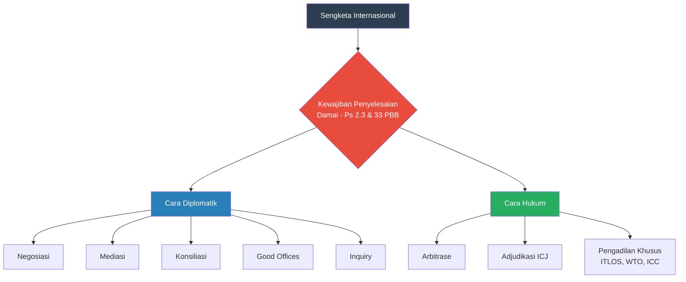
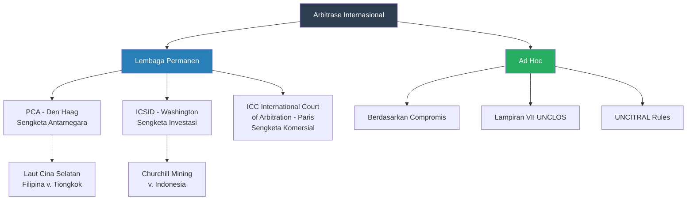
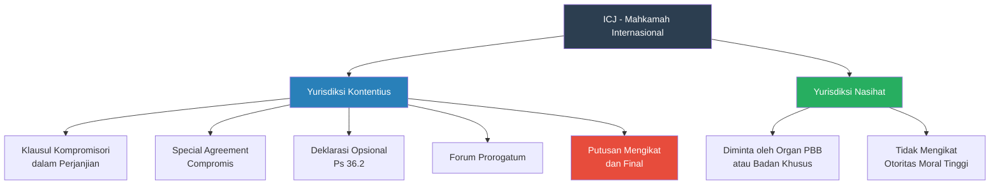

---
title: "Penyelesaian Sengketa Internasional"
tags:
  - hukum-internasional
  - penyelesaian-sengketa
  - icj
  - arbitrase
  - mediasi
  - wto
  - teaching-materials
publish: true
---

# Bab 8: Penyelesaian Sengketa Internasional

## Tujuan Pembelajaran

Setelah mempelajari bab ini, mahasiswa diharapkan mampu:

1. Menjelaskan kewajiban penyelesaian sengketa secara damai berdasarkan Pasal 2(3) dan 33 Piagam PBB
2. Mengidentifikasi dan menganalisis berbagai cara diplomatik penyelesaian sengketa: negosiasi, mediasi, konsiliasi, *good offices*, dan *inquiry*
3. Memahami mekanisme arbitrase internasional, termasuk PCA, ICSID, dan tribunal *ad hoc*
4. Menganalisis yurisdiksi, prosedur, dan pelaksanaan putusan ICJ
5. Mengevaluasi peran pengadilan internasional khusus: ITLOS, WTO DSB, dan ICC
6. Memahami mekanisme penyelesaian sengketa regional, khususnya dalam kerangka ASEAN
7. Menganalisis praktik Indonesia dalam penyelesaian sengketa internasional, termasuk kasus Sipadan-Ligitan dan arbitrase investasi
8. Mengevaluasi tantangan penegakan putusan internasional

---

## 8.1 Pendahuluan: Kewajiban Penyelesaian Damai

### 8.1.1 Dasar Hukum

Kewajiban penyelesaian sengketa secara damai merupakan salah satu prinsip fundamental hukum internasional kontemporer. Prinsip ini dirumuskan dalam dua ketentuan utama Piagam PBB:

**Pasal 2(3) Piagam PBB:**
> "All Members shall settle their international disputes by peaceful means in such a manner that international peace and security, and justice, are not endangered."

**Pasal 33(1) Piagam PBB:**
> "The parties to any dispute, the continuance of which is likely to endanger the maintenance of international peace and security, shall, first of all, seek a solution by negotiation, enquiry, mediation, conciliation, arbitration, judicial settlement, resort to regional agencies or arrangements, or other peaceful means of their own choice."

Kedua pasal ini menetapkan dua hal penting. Pertama, kewajiban menyelesaikan sengketa secara damai bersifat mutlak—negara-negara anggota PBB tidak boleh menggunakan kekerasan atau ancaman kekerasan untuk menyelesaikan sengketa mereka (berkorelasi dengan Pasal 2(4) yang melarang penggunaan kekerasan). Kedua, pilihan cara penyelesaian damai diserahkan kepada para pihak—Pasal 33 menyebutkan berbagai cara tetapi tidak memaksakan cara tertentu.

### 8.1.2 Definisi "Sengketa" dalam Hukum Internasional

PCIJ dalam kasus *Mavrommatis Palestine Concessions* (1924) mendefinisikan sengketa sebagai:

> "A disagreement on a point of law or fact, a conflict of legal views or of interests between two persons."

ICJ memperhalus definisi ini dalam beberapa putusan berikutnya. Dalam kasus *South West Africa* (1962), ICJ menyatakan bahwa untuk adanya sengketa, harus terbukti bahwa klaim salah satu pihak ditentang secara positif (*positively opposed*) oleh pihak lainnya. Ketidaksetujuan (*disagreement*) harus bersifat nyata, bukan hipotetis.

Dalam kasus *Marshall Islands* (2016), ICJ mempersempit kriteria ini dengan menyatakan bahwa sengketa harus ada pada saat perkara diajukan (*at the date of the application*) dan pihak lawan harus menyadari (*aware*) adanya klaim terhadapnya. Putusan ini kontroversial karena dianggap terlalu membatasi akses ke pengadilan.

### 8.1.3 Klasifikasi Sengketa

Secara tradisional, sengketa internasional diklasifikasikan menjadi:

**Sengketa Hukum (*Legal/Justiciable Disputes*)**: Sengketa yang menyangkut perselisihan tentang hak dan kewajiban hukum yang ada, interpretasi perjanjian, atau pertanyaan hukum lainnya. Sengketa hukum cocok untuk penyelesaian melalui adjudikasi (pengadilan atau arbitrase).

**Sengketa Politik (*Political/Non-Justiciable Disputes*)**: Sengketa yang menyangkut keinginan untuk mengubah hukum yang berlaku atau kepentingan politik yang tidak dapat diselesaikan hanya dengan penerapan hukum yang ada. Sengketa politik lebih cocok untuk penyelesaian diplomatik.

Dalam praktik, pembedaan ini tidak selalu jelas karena banyak sengketa memiliki dimensi hukum dan politik sekaligus. ICJ sendiri telah menyatakan bahwa pengadilan tidak boleh menolak yurisdiksi hanya karena sengketa memiliki dimensi politik—*"the fact that a question also has political aspects does not deprive it of its character as a legal question"* (kasus *Hostages*, 1980).

---

## 8.2 Cara Diplomatik Penyelesaian Sengketa

### 8.2.1 Negosiasi (*Negotiation*)

Negosiasi merupakan cara penyelesaian sengketa yang paling dasar, paling banyak digunakan, dan paling fleksibel. Negosiasi melibatkan komunikasi langsung antara para pihak yang bersengketa untuk mencapai kesepakatan yang saling diterima.

**Karakteristik Negosiasi:**
- Bersifat langsung antara para pihak tanpa keterlibatan pihak ketiga
- Tidak ada prosedur formal yang mengikat
- Hasil sepenuhnya bergantung pada kesepakatan para pihak
- Dapat dilakukan secara bilateral atau multilateral
- Bersifat rahasia (kecuali para pihak sepakat sebaliknya)

**Kewajiban untuk Bernegosiasi:**

Beberapa perjanjian internasional mewajibkan para pihak untuk bernegosiasi sebelum menggunakan mekanisme penyelesaian sengketa lainnya. ICJ dalam kasus *North Sea Continental Shelf* (1969) menyatakan bahwa kewajiban bernegosiasi bukan sekadar formalitas—para pihak harus bernegosiasi dengan itikad baik (*good faith*) dan berupaya sungguh-sungguh untuk mencapai kesepakatan:

> "The parties are under an obligation to enter into negotiations with a view to arriving at an agreement, and not merely to go through a formal process of negotiation as a sort of prior condition for the automatic application of a certain method of delimitation in the absence of agreement."

Dalam kasus *Pulp Mills on the River Uruguay* (Argentina v. Uruguay, 2010), ICJ menegaskan bahwa kewajiban bernegosiasi adalah kewajiban perilaku (*obligation of conduct*), bukan kewajiban hasil (*obligation of result*)—para pihak wajib bernegosiasi dengan itikad baik tetapi tidak wajib mencapai kesepakatan.

### 8.2.2 Jasa Baik (*Good Offices*) dan Mediasi (*Mediation*)

Jasa baik dan mediasi melibatkan pihak ketiga dalam proses penyelesaian sengketa, tetapi dengan tingkat keterlibatan yang berbeda.

**Jasa Baik (*Good Offices*):**

Dalam jasa baik, pihak ketiga berperan sebagai fasilitator yang mempertemukan para pihak yang bersengketa dan mendorong mereka untuk memulai atau melanjutkan negosiasi. Pihak ketiga tidak berpartisipasi dalam substansi negosiasi dan tidak mengajukan proposal penyelesaian. Perannya terbatas pada menyediakan saluran komunikasi dan menciptakan suasana yang kondusif bagi negosiasi.

Contoh penting: Sekretaris Jenderal PBB sering menjalankan jasa baik dalam konflik internasional. Pada tahun 1999, Sekretaris Jenderal PBB Kofi Annan menjalankan jasa baik dalam proses menuju referendum Timor Leste. Dalam konteks Indonesia, Norwegia memainkan peran jasa baik dalam proses perdamaian Aceh (2005), meskipun peran tersebut berkembang menjadi lebih aktif sebagai fasilitator.

**Mediasi (*Mediation*):**

Dalam mediasi, pihak ketiga berperan lebih aktif—tidak hanya memfasilitasi tetapi juga berpartisipasi dalam substansi negosiasi, mengajukan proposal, dan membantu para pihak merumuskan penyelesaian. Namun, mediator tidak memiliki kewenangan untuk memaksakan penyelesaian; keputusan tetap di tangan para pihak.

Mediasi dapat bersifat:
- **Evaluatif**: Mediator memberikan penilaian tentang posisi masing-masing pihak dan mengajukan rekomendasi penyelesaian
- **Fasilitatif**: Mediator membantu proses komunikasi dan perundingan tanpa memberikan penilaian substantif
- **Transformatif**: Mediator berusaha mengubah hubungan antarpihak dan mengatasi akar konflik

**Contoh Mediasi Berhasil:**
- Kesepakatan Camp David (1978): Presiden Jimmy Carter memediasi perjanjian damai antara Mesir dan Israel
- Kesepakatan Dayton (1995): Amerika Serikat memediasi perjanjian damai untuk mengakhiri perang Bosnia
- Kesepakatan Helsinki (MoU Helsinki, 2005): Mantan Presiden Finlandia Martti Ahtisaari memediasi kesepakatan damai antara Pemerintah Indonesia dan Gerakan Aceh Merdeka (GAM)

### 8.2.3 Penyelidikan (*Inquiry/Fact-Finding*)

Penyelidikan (*inquiry*) adalah prosedur di mana komisi independen ditugaskan untuk menyelidiki dan menetapkan fakta-fakta yang menjadi sumber sengketa. Mekanisme ini berguna ketika sengketa disebabkan oleh perbedaan persepsi tentang fakta, bukan perbedaan tentang hukum.

Komisi penyelidikan pertama kali diinstitusionalisasi melalui Konvensi Den Haag 1899 dan 1907 tentang Penyelesaian Damai Sengketa Internasional. Contoh klasik adalah Komisi Penyelidikan Dogger Bank (1905), yang menyelidiki insiden di mana armada Rusia menembaki kapal-kapal nelayan Inggris di Laut Utara karena salah mengira mereka sebagai kapal torpedo Jepang.

Dalam praktik kontemporer, komisi penyelidikan sering dibentuk oleh PBB atau organisasi internasional lainnya. Dewan HAM PBB, misalnya, telah membentuk berbagai komisi penyelidikan untuk menyelidiki pelanggaran hak asasi manusia di Suriah, Myanmar, Korea Utara, dan wilayah-wilayah lainnya.

### 8.2.4 Konsiliasi (*Conciliation*)

Konsiliasi merupakan prosedur semi-formal di mana komisi konsiliasi—biasanya terdiri dari tiga hingga lima anggota yang dipilih oleh para pihak—menyelidiki sengketa dan mengajukan proposal penyelesaian. Berbeda dari arbitrase, proposal konsiliasi tidak mengikat para pihak.

Konsiliasi menggabungkan elemen penyelidikan (penetapan fakta) dan mediasi (pengajuan solusi), tetapi lebih terstruktur dibandingkan mediasi. Komisi konsiliasi biasanya memiliki aturan prosedur yang jelas dan batas waktu tertentu.

Beberapa perjanjian internasional memasukkan konsiliasi sebagai mekanisme penyelesaian sengketa wajib. UNCLOS, misalnya, menyediakan konsiliasi wajib (*compulsory conciliation*) berdasarkan Bagian XV dan Lampiran V untuk sengketa-sengketa tertentu yang dikecualikan dari prosedur mengikat.

| Cara Diplomatik | Keterlibatan Pihak Ketiga | Hasil Mengikat? | Formalitas |
|---|---|---|---|
| Negosiasi | Tidak ada | Jika disepakati | Informal |
| Jasa baik | Fasilitator pasif | Tidak | Informal |
| Mediasi | Aktif mengajukan proposal | Tidak | Semi-formal |
| Penyelidikan | Menetapkan fakta | Tidak (biasanya) | Formal |
| Konsiliasi | Menyelidiki dan mengusulkan | Tidak | Formal |

---

## 8.3 Arbitrase Internasional

### 8.3.1 Pengertian dan Sejarah

Arbitrase internasional adalah prosedur penyelesaian sengketa antarnegara (atau antara negara dan pihak swasta) oleh arbitrator yang dipilih oleh para pihak, yang putusannya bersifat mengikat (*binding*) dan final.

Arbitrase internasional modern bermula dari Jay Treaty (1794) antara Amerika Serikat dan Inggris, yang membentuk komisi campuran untuk menyelesaikan berbagai sengketa yang timbul dari kemerdekaan Amerika. Kasus arbitrase paling terkenal pada abad ke-19 adalah Alabama Claims (1872) antara Amerika Serikat dan Inggris, yang berkaitan dengan klaim Amerika atas kerugian yang disebabkan oleh kapal-kapal Konfederasi yang dibangun di galangan kapal Inggris selama Perang Saudara.

Konferensi Perdamaian Den Haag 1899 dan 1907 menginstitusionalisasi arbitrase melalui pembentukan Permanent Court of Arbitration (PCA) dan penetapan aturan prosedur arbitrase yang menjadi model bagi banyak prosedur arbitrase selanjutnya.

### 8.3.2 Permanent Court of Arbitration (PCA)

PCA, yang berkedudukan di Den Haag, bukanlah "pengadilan" dalam pengertian konvensional, melainkan kerangka kelembagaan yang menyediakan layanan administrasi untuk arbitrase internasional. PCA menyediakan:

- Daftar arbitrator (*panel of arbitrators*) yang dapat dipilih oleh para pihak
- Aturan prosedur opsional untuk berbagai jenis sengketa
- Layanan registrasi dan administrasi tribunal arbitrase
- Fasilitas fisik untuk persidangan

PCA menangani sengketa antarnegara, sengketa antara negara dan pihak swasta, dan sengketa antara organisasi internasional. Dalam beberapa dekade terakhir, PCA semakin aktif menangani kasus-kasus besar, termasuk arbitrase Laut Cina Selatan (*South China Sea Arbitration*, Filipina v. Tiongkok, 2016).

### 8.3.3 Arbitrase Investasi: ICSID

International Centre for Settlement of Investment Disputes (ICSID), yang didirikan berdasarkan Convention on the Settlement of Investment Disputes between States and Nationals of Other States (1965), merupakan forum utama untuk arbitrase investasi internasional.

**Yurisdiksi ICSID:**

ICSID memiliki yurisdiksi atas sengketa hukum yang timbul langsung dari investasi antara negara pihak konvensi dan warga negara pihak konvensi lain, asalkan kedua pihak memberikan persetujuan tertulis untuk menundukkan sengketa pada ICSID (Pasal 25 Konvensi ICSID).

Persetujuan untuk arbitrase ICSID dapat diberikan melalui:
1. **Perjanjian investasi bilateral (BIT)**: Klausul arbitrase dalam BIT yang memberikan persetujuan negara secara umum (*standing offer*) untuk mengarbitrase sengketa investasi
2. **Kontrak investasi**: Klausul arbitrase dalam kontrak antara investor dan pemerintah
3. **Hukum domestik**: Undang-undang investasi yang memuat persetujuan untuk arbitrase ICSID

**Prosedur ICSID:**

Prosedur arbitrase ICSID meliputi tahap pendaftaran permohonan, pembentukan tribunal (biasanya tiga arbitrator), pertukaran memori, persidangan, dan putusan (*award*). Putusan ICSID bersifat final dan mengikat, dan setiap negara pihak konvensi wajib mengakui dan melaksanakan putusan tersebut seolah-olah putusan pengadilan tertinggi negara tersebut (Pasal 54 Konvensi ICSID).

**Kritik terhadap ICSID:**

Sistem arbitrase investasi internasional mendapat kritik tajam, antara lain:
- **Bias terhadap investor**: Statistik menunjukkan bahwa investor asing memenangkan sebagian besar kasus, meskipun tren ini berubah dalam dekade terakhir
- **Kurangnya transparansi**: Proses arbitrase tradisional bersifat tertutup, meskipun aturan transparansi UNCITRAL (2014) mulai mengubah hal ini
- **Inkonsistensi putusan**: Tribunal yang berbeda terkadang memberikan putusan yang bertentangan atas persoalan hukum yang sama
- **Pembatasan ruang kebijakan (*policy space*)**: Negara khawatir bahwa ancaman arbitrase akan membatasi kemampuan mereka mengatur untuk kepentingan publik
- **Biaya tinggi**: Proses arbitrase investasi sangat mahal, membebani negara-negara berkembang

Indonesia telah menjadi pihak pada beberapa sengketa ICSID, termasuk kasus *Churchill Mining* dan *Planet Mining* (dibahas di Bab 7), serta kasus-kasus terkait sektor pertambangan dan energi.

### 8.3.4 Tribunal Arbitrase Ad Hoc

Selain lembaga permanen seperti PCA dan ICSID, para pihak dapat membentuk tribunal arbitrase *ad hoc* untuk menyelesaikan sengketa tertentu. Tribunal *ad hoc* dibentuk berdasarkan kesepakatan para pihak (*compromis*) yang menentukan komposisi tribunal, aturan prosedur, dan hukum yang berlaku.

Contoh penting tribunal *ad hoc*:

**Arbitrase Laut Cina Selatan (2016):**
Filipina mengajukan arbitrase terhadap Tiongkok berdasarkan Lampiran VII UNCLOS, menggugat klaim historis Tiongkok atas Laut Cina Selatan (nine-dash line). Tribunal memutuskan bahwa klaim historis Tiongkok tidak memiliki dasar hukum berdasarkan UNCLOS, bahwa beberapa fitur maritim yang diklaim Tiongkok bukan "pulau" yang berhak atas ZEE, dan bahwa aktivitas reklamasi Tiongkok melanggar kewajiban lingkungan berdasarkan UNCLOS.

Tiongkok menolak berpartisipasi dalam arbitrase dan menolak putusan tribunal, menimbulkan pertanyaan serius tentang penegakan putusan arbitrase ketika salah satu pihak menolak mematuhinya.

**Arbitrase Pulau Palmas (1928):**
Sengketa antara Amerika Serikat dan Belanda atas kedaulatan Pulau Palmas (Pulau Miangas) diselesaikan melalui arbitrase oleh Max Huber. Putusan ini menetapkan prinsip-prinsip penting tentang kedaulatan teritorial dan *effectivités* yang masih berpengaruh hingga kini.

---

## 8.4 Mahkamah Internasional (ICJ)

### 8.4.1 Sejarah dan Kedudukan

Mahkamah Internasional (*International Court of Justice*/ICJ) merupakan organ yudisial utama PBB, berkedudukan di Peace Palace, Den Haag, Belanda. ICJ didirikan berdasarkan Piagam PBB dan Statuta ICJ pada tahun 1945, menggantikan Permanent Court of International Justice (PCIJ) yang didirikan di bawah Liga Bangsa-Bangsa.

ICJ terdiri dari 15 hakim yang dipilih oleh Majelis Umum dan Dewan Keamanan PBB untuk masa jabatan sembilan tahun, dengan pembaruan sepertiga setiap tiga tahun. Tidak boleh ada dua hakim dari negara yang sama. Jika salah satu pihak dalam sengketa tidak memiliki hakim berkewarganegaraan di ICJ, pihak tersebut berhak menunjuk hakim *ad hoc*.

### 8.4.2 Yurisdiksi Kontentius (*Contentious Jurisdiction*)

Hanya negara yang dapat menjadi pihak dalam perkara kontentius di ICJ (Pasal 34 Statuta). Individu, organisasi internasional, dan entitas non-negara lainnya tidak memiliki *locus standi*.

ICJ tidak memiliki yurisdiksi otomatis—negara harus menyatakan persetujuannya untuk tunduk pada yurisdiksi ICJ. Persetujuan dapat diberikan melalui:

**Klausul Kompromisori (*Compromissory Clause*) (Pasal 36(1)):**

Banyak perjanjian internasional memuat klausul yang menyerahkan sengketa tentang interpretasi atau penerapan perjanjian tersebut kepada ICJ. Contoh: Pasal IX Konvensi Genosida, yang menjadi dasar yurisdiksi dalam kasus *Bosnia v. Serbia* (2007) dan *Gambia v. Myanmar* (2019).

**Persetujuan Khusus (*Special Agreement/Compromis*) (Pasal 36(1)):**

Para pihak yang bersengketa dapat menyepakati secara khusus untuk menyerahkan sengketa mereka kepada ICJ. Contoh: kasus *Sovereignty over Pulau Ligitan and Pulau Sipadan* (Indonesia/Malaysia, 2002) diajukan berdasarkan *special agreement* antara Indonesia dan Malaysia.

**Deklarasi Opsional (*Optional Clause Declaration*) (Pasal 36(2)):**

Negara dapat menyatakan menerima yurisdiksi wajib (*compulsory jurisdiction*) ICJ secara umum untuk sengketa hukum tertentu, dengan atau tanpa syarat. Per 2024, sekitar 73 negara telah menerima yurisdiksi wajib, banyak di antaranya dengan reservasi substansial. Indonesia belum menerima yurisdiksi wajib ICJ berdasarkan Pasal 36(2).

**Forum Prorogatum:**

Yurisdiksi ICJ juga dapat timbul dari persetujuan tersirat (*implied consent*), di mana suatu negara menerima yurisdiksi setelah perkara diajukan terhadapnya, melalui tindakan yang menunjukkan pengakuan yurisdiksi (*forum prorogatum*).

### 8.4.3 Prosedur Kontentius

Prosedur perkara kontentius di ICJ meliputi tahapan-tahapan berikut:

**Tahap Tertulis (*Written Proceedings*):**
1. Memorial (*Memorial*): Dokumen tertulis pihak pemohon yang berisi fakta, argumentasi hukum, dan tuntutan
2. Kontra-memorial (*Counter-Memorial*): Jawaban pihak termohon
3. Replika (*Reply*) dan Duplik (*Rejoinder*): Tanggapan tambahan jika diizinkan pengadilan

**Tahap Lisan (*Oral Proceedings*):**
Persidangan terbuka untuk publik di mana agen, penasihat, dan pengacara masing-masing pihak menyampaikan argumentasi dan menjawab pertanyaan hakim.

**Putusan (*Judgment*):**
Putusan diadopsi dengan suara mayoritas hakim. Hakim yang tidak setuju dapat menulis *dissenting opinion* (pendapat berbeda), dan hakim yang setuju dengan hasilnya tetapi tidak dengan penalaran dapat menulis *separate opinion* (pendapat terpisah). Putusan bersifat final, mengikat, dan tidak dapat diajukan banding (Pasal 60 Statuta).

**Tindakan Sementara (*Provisional Measures*) (Pasal 41):**
ICJ dapat menunjukkan (*indicate*) tindakan sementara yang diperlukan untuk melindungi hak-hak para pihak menunggu putusan akhir. Sejak putusan *LaGrand* (2001), tindakan sementara ICJ bersifat mengikat.

### 8.4.4 Yurisdiksi Nasihat (*Advisory Jurisdiction*)

Selain perkara kontentius, ICJ berwenang memberikan pendapat nasihat (*advisory opinion*) atas permintaan organ-organ PBB dan badan-badan khusus yang diberi kewenangan oleh Majelis Umum (Pasal 65 Statuta). Pendapat nasihat tidak mengikat secara hukum, tetapi memiliki otoritas moral dan hukum yang sangat besar.

Beberapa pendapat nasihat ICJ yang paling berpengaruh:

| Pendapat Nasihat | Tahun | Substansi |
|---|---|---|
| *Reservations to the Genocide Convention* | 1951 | Hukum reservasi terhadap perjanjian |
| *Reparation for Injuries* | 1949 | Kepribadian hukum internasional PBB |
| *Namibia (Legal Consequences)* | 1971 | Ilegalitas kehadiran Afrika Selatan di Namibia |
| *Nuclear Weapons* | 1996 | Legalitas ancaman atau penggunaan senjata nuklir |
| *Wall in the Occupied Palestinian Territory* | 2004 | Ilegalitas tembok di Wilayah Palestina |
| *Kosovo Declaration of Independence* | 2010 | Legalitas deklarasi kemerdekaan Kosovo |
| *Chagos Archipelago* | 2019 | Proses dekolonisasi Mauritius |
| *Climate Change Obligations* | diminta 2023 | Kewajiban negara terkait perubahan iklim |

### 8.4.5 Pelaksanaan Putusan ICJ

Pasal 94 Piagam PBB mengatur pelaksanaan putusan ICJ:

> "(1) Each Member of the United Nations undertakes to comply with the decision of the International Court of Justice in any case to which it is a party.
> (2) If any party to a case fails to perform the obligations incumbent upon it under a judgment rendered by the Court, the other party may have recourse to the Security Council, which may, if it deems necessary, make recommendations or decide upon measures to be taken to give effect to the judgment."

Dalam praktik, tingkat kepatuhan terhadap putusan ICJ cukup tinggi, tetapi tidak absolut. Beberapa kasus ketidakpatuhan yang terkenal meliputi:

- **Nicaragua v. United States (1986)**: Amerika Serikat menolak mematuhi putusan ICJ yang menyatakan AS melanggar hukum internasional dengan mendukung Contras dan menambang pelabuhan Nikaragua. AS menggunakan hak veto di Dewan Keamanan untuk memblokir penegakan putusan.
- **Avena (Mexico v. United States, 2004)**: Meskipun ICJ memerintahkan peninjauan kembali kasus-kasus hukuman mati warga negara Meksiko, Mahkamah Agung AS dalam *Medellín v. Texas* (2008) memutuskan bahwa putusan ICJ tidak *self-executing* dan memerlukan tindakan legislatif untuk implementasi domestik.
- **Arbitrase Laut Cina Selatan (2016)**: Tiongkok menolak mengakui dan mematuhi putusan tribunal arbitrase yang dibentuk berdasarkan UNCLOS.

Mekanisme penegakan melalui Dewan Keamanan PBB (Pasal 94(2)) pada praktiknya sulit diterapkan karena setiap anggota tetap Dewan Keamanan dapat menggunakan hak veto.

---

## 8.5 Pengadilan Internasional Khusus

### 8.5.1 Tribunal Internasional untuk Hukum Laut (ITLOS)

ITLOS (*International Tribunal for the Law of the Sea*) didirikan berdasarkan UNCLOS 1982 dan berkedudukan di Hamburg, Jerman. ITLOS memiliki yurisdiksi atas sengketa yang berkaitan dengan interpretasi dan penerapan UNCLOS.

**Yurisdiksi:**
ITLOS berwenang mengadili sengketa antarnegara pihak UNCLOS tentang hukum laut, termasuk sengketa tentang batas maritim, hak atas sumber daya laut, perlindungan lingkungan laut, dan kegiatan di dasar laut internasional (*the Area*).

**Kamar Khusus:**
ITLOS memiliki beberapa kamar khusus, termasuk:
- Kamar Sengketa Dasar Laut (*Seabed Disputes Chamber*): Berwenang atas sengketa terkait kegiatan di dasar laut internasional
- Kamar khusus *ad hoc* yang dibentuk atas permintaan para pihak

**Tindakan Sementara:**
ITLOS terkenal karena kemampuannya mengeluarkan tindakan sementara dengan cepat. Dalam beberapa kasus penahanan kapal, ITLOS telah mengeluarkan perintah pembebasan segera (*prompt release*) berdasarkan Pasal 292 UNCLOS.

**Kasus Penting:**
- *M/V "SAIGA" (No. 2)* (Saint Vincent and the Grenadines v. Guinea, 1999): Kasus pertama yang diputus oleh ITLOS, menyangkut penahanan kapal tanker
- *Southern Bluefin Tuna* (New Zealand and Australia v. Japan, 1999): Tindakan sementara terkait penangkapan ikan berlebih
- *Advisory Opinion on Activities in the Area* (2011): Tanggung jawab negara atas kegiatan sponsor di dasar laut internasional
- *Advisory Opinion on Climate Change and the Ocean* (2024): Pendapat nasihat tentang kewajiban negara terkait perubahan iklim dan perlindungan lingkungan laut

### 8.5.2 Badan Penyelesaian Sengketa WTO (*Dispute Settlement Body*)

Sistem penyelesaian sengketa WTO merupakan salah satu mekanisme penyelesaian sengketa internasional yang paling aktif dan efektif. Sistem ini diatur oleh *Dispute Settlement Understanding* (DSU), Lampiran 2 Perjanjian WTO.

**Prosedur:**

1. **Konsultasi (*Consultations*)**: Tahap wajib di mana para pihak berunding selama 60 hari
2. **Panel (*Panel*)**: Jika konsultasi gagal, pihak pengadu dapat meminta pembentukan panel yang terdiri dari tiga pakar
3. **Banding (*Appellate Body*)**: Putusan panel dapat diajukan banding ke Appellate Body pada isu-isu hukum
4. **Adopsi (*Adoption*)**: Laporan panel/Appellate Body diadopsi oleh DSB kecuali ada konsensus untuk menolak (*negative consensus*)
5. **Implementasi (*Implementation*)**: Negara yang kalah harus menyesuaikan tindakannya dengan kewajiban WTO
6. **Retaliasi (*Retaliation*)**: Jika implementasi gagal, negara yang menang dapat meminta otorisasi untuk menangguhkan konsesi perdagangan

**Krisis Appellate Body:**

Sejak Desember 2019, Appellate Body WTO tidak dapat berfungsi karena Amerika Serikat memblokir penunjukan anggota baru. Krisis ini merupakan tantangan serius bagi sistem penyelesaian sengketa WTO, karena banding menjadi mustahil dan putusan panel tidak dapat menjadi final jika salah satu pihak "mengajukan banding ke ruang hampa" (*appeal into the void*).

Sebagai respons, beberapa anggota WTO—termasuk Uni Eropa dan Tiongkok—membentuk *Multi-Party Interim Appeal Arbitration Arrangement* (MPIA) sebagai mekanisme banding sementara berdasarkan Pasal 25 DSU. Indonesia belum bergabung dengan MPIA.

**Sengketa WTO yang Melibatkan Indonesia:**

Indonesia telah terlibat dalam beberapa sengketa WTO, baik sebagai penggugat maupun tergugat:

| Kasus | Peran Indonesia | Substansi | Hasil |
|---|---|---|---|
| DS406 (US — Clove Cigarettes) | Penggugat | AS melarang rokok kretek tetapi mengecualikan rokok mentol | Indonesia menang |
| DS484 (Indonesia — Chicken) | Tergugat | Hambatan impor daging ayam dari Brasil | Indonesia kalah |
| DS592 (Indonesia — Raw Materials) | Tergugat | Pembatasan ekspor bahan baku nikel | Indonesia kalah (panel 2022) |
| DS477/478 (Indonesia — Horticultural Products) | Tergugat | Pembatasan impor produk hortikultura | Indonesia kalah |

Kasus DS406 tentang rokok kretek merupakan kemenangan penting bagi Indonesia. Panel dan Appellate Body WTO memutuskan bahwa larangan rokok kretek oleh AS melanggar Pasal 2.1 Perjanjian TBT karena mendiskriminasikan produk serupa (*like products*)—rokok kretek (didominasi Indonesia) dilarang sementara rokok mentol (dominan AS) dikecualikan.

Kasus DS592 tentang pembatasan ekspor nikel sangat relevan dalam konteks kebijakan *downstreaming* Indonesia. Uni Eropa menggugat larangan ekspor bijih nikel oleh Indonesia yang bertujuan mendorong pengolahan dalam negeri. Panel WTO memutuskan bahwa larangan tersebut melanggar Pasal XI:1 GATT tentang larangan pembatasan kuantitatif. Indonesia mengajukan banding, namun mengingat krisis Appellate Body, penyelesaian kasus ini menjadi rumit.

### 8.5.3 Mahkamah Pidana Internasional (ICC)

ICC (*International Criminal Court*) didirikan berdasarkan Statuta Roma 1998 dan berkedudukan di Den Haag. Berbeda dari ICJ yang mengadili sengketa antarnegara, ICC mengadili individu atas kejahatan internasional yang paling serius: genosida, kejahatan terhadap kemanusiaan, kejahatan perang, dan kejahatan agresi.

**Yurisdiksi ICC:**

ICC memiliki yurisdiksi atas kejahatan yang dilakukan:
- Di wilayah negara pihak
- Oleh warga negara negara pihak
- Berdasarkan rujukan Dewan Keamanan PBB (tanpa persyaratan wilayah atau kewarganegaraan)
- Berdasarkan deklarasi *ad hoc* negara non-pihak

**Prinsip Komplementaritas:**

ICC menerapkan prinsip komplementaritas (*complementarity*): ICC hanya berwenang jika negara yang bersangkutan tidak mampu atau tidak mau (*unable or unwilling*) untuk menyelidiki dan menuntut kejahatan tersebut secara genuim. ICC merupakan pengadilan pelengkap, bukan pengganti, pengadilan nasional.

**Indonesia dan ICC:**

Indonesia bukan pihak pada Statuta Roma. Meskipun demikian, diskusi tentang ratifikasi telah berlangsung selama bertahun-tahun. Indonesia memiliki UU Nomor 26 Tahun 2000 tentang Pengadilan HAM yang memberikan yurisdiksi kepada pengadilan Indonesia atas genosida dan kejahatan terhadap kemanusiaan, sehingga sebagian mengisi kekosongan yang ditimbulkan oleh ketidakkeanggotaan pada ICC.

---

## 8.6 Penyelesaian Sengketa Regional: Mekanisme ASEAN

### 8.6.1 Kerangka Hukum ASEAN

ASEAN memiliki beberapa mekanisme penyelesaian sengketa:

**Treaty of Amity and Cooperation in Southeast Asia (TAC) 1976:**

TAC menetapkan prinsip-prinsip dasar hubungan antarnegara ASEAN, termasuk penyelesaian sengketa secara damai. Pasal 13-17 TAC mengatur pembentukan High Council yang berwenang memberikan rekomendasi untuk penyelesaian sengketa antarnegara ASEAN.

Dalam praktik, High Council TAC belum pernah diaktifkan karena negara-negara ASEAN lebih memilih menyelesaikan sengketa melalui negosiasi bilateral atau mekanisme lain di luar ASEAN (seperti ICJ untuk sengketa teritorial).

**ASEAN Charter (2007):**

Piagam ASEAN, khususnya Pasal 22-28, mengatur mekanisme penyelesaian sengketa yang lebih komprehensif:
- Pasal 22: Prinsip penyelesaian damai
- Pasal 23: Jasa baik, konsiliasi, dan mediasi
- Pasal 24: Mekanisme penyelesaian sengketa dalam instrumen ASEAN tertentu
- Pasal 25: Pembentukan mekanisme penyelesaian sengketa yang sesuai
- Pasal 26: Sengketa yang tidak terselesaikan dirujuk ke KTT ASEAN
- Pasal 27: Kepatuhan dan ketidakpatuhan

**ASEAN Protocol on Enhanced Dispute Settlement Mechanism (2004):**

Protokol ini mengatur penyelesaian sengketa ekonomi ASEAN dengan model yang mirip DSU WTO, meliputi konsultasi, panel, dan banding. Namun, protokol ini jarang digunakan karena negara-negara ASEAN lebih memilih negosiasi informal.

### 8.6.2 "ASEAN Way" dan Implikasinya

Penyelesaian sengketa di ASEAN sangat dipengaruhi oleh "ASEAN Way"—pendekatan yang menekankan konsultasi (*musyawarah*), konsensus (*mufakat*), non-intervensi dalam urusan dalam negeri, dan diplomasi informal. Meskipun pendekatan ini telah menjaga stabilitas regional, ia juga dikritik karena menghindari penyelesaian substantif atas sengketa yang kompleks, khususnya sengketa teritorial di Laut Cina Selatan.

Paradoksnya, beberapa sengketa antarnegara ASEAN justru diselesaikan di luar mekanisme ASEAN:
- Sengketa Sipadan-Ligitan (Indonesia-Malaysia) diselesaikan di ICJ (2002)
- Sengketa Pedra Branca (Malaysia-Singapura) diselesaikan di ICJ (2008)
- Sengketa Temple of Preah Vihear (Kamboja-Thailand) dibawa kembali ke ICJ (2011)

Hal ini menunjukkan bahwa mekanisme penyelesaian sengketa ASEAN belum mampu menangani sengketa antaranggota yang serius, dan negara-negara anggota masih merasa perlu menggunakan forum internasional yang lebih mapan.

---

## 8.7 Kasus-Kasus Penting bagi Indonesia

### 8.7.1 Kasus Sipadan-Ligitan (Indonesia/Malaysia, 2002)

**Latar Belakang:**

Pulau Sipadan dan Pulau Ligitan merupakan dua pulau kecil di Laut Sulawesi yang terletak di sebelah timur Kalimantan. Sengketa kedaulatan atas kedua pulau ini antara Indonesia dan Malaysia berlangsung selama beberapa dekade sebelum diajukan ke ICJ.

Indonesia mendasarkan klaimnya pada:
1. Konvensi 1891 antara Inggris dan Belanda yang menetapkan batas wilayah di Kalimantan
2. Interpretasi bahwa garis batas 4°10' Lintang Utara dalam konvensi tersebut berlanjut ke timur dan mencakup kedua pulau
3. Peta-peta yang menunjukkan kedua pulau sebagai bagian dari wilayah Hindia Belanda

Malaysia mendasarkan klaimnya pada:
1. Interpretasi berbeda atas Konvensi 1891
2. Rantai alas hak (*chain of title*) dari Sultan Sulu ke British North Borneo Company, lalu ke Inggris, dan akhirnya ke Malaysia
3. *Effectivités*: tindakan nyata pelaksanaan kedaulatan oleh British North Borneo Company dan Malaysia, termasuk regulasi penangkapan penyu, pembangunan mercusuar, dan pengembangan pariwisata

**Putusan ICJ (17 Desember 2002):**

ICJ memutuskan dengan suara 16-1 bahwa kedaulatan atas kedua pulau dimiliki oleh Malaysia. Pengadilan menolak argumen kedua belah pihak berdasarkan alas hak konvensional dan memutuskan berdasarkan *effectivités*—tindakan nyata pelaksanaan kedaulatan.

ICJ menemukan bahwa Malaysia (dan pendahulunya) melakukan berbagai tindakan administratif atas pulau-pulau tersebut, termasuk:
- Pengaturan penangkapan penyu sejak tahun 1917
- Pembangunan dan pemeliharaan mercusuar
- Pengelolaan cagar alam burung

Indonesia, sebaliknya, tidak dapat menunjukkan tindakan *effectivités* yang sebanding.

**Dampak dan Pelajaran:**

Kasus Sipadan-Ligitan memiliki dampak besar bagi kebijakan Indonesia:
1. Mendorong penguatan pengelolaan pulau-pulau terluar melalui Perpres Nomor 78 Tahun 2005 tentang Pengelolaan Pulau-Pulau Kecil Terluar
2. Meningkatkan kesadaran tentang pentingnya *effectivités* dalam sengketa kedaulatan
3. Memacu Indonesia untuk memperkuat kehadiran dan administrasi di wilayah perbatasan
4. Menjadi pelajaran berharga tentang pentingnya dokumentasi dan bukti pelaksanaan kedaulatan

### 8.7.2 Kasus Pulau Batu Puteh (Malaysia/Singapura, 2008)

Meskipun Indonesia bukan pihak langsung dalam kasus ini, keputusan ICJ dalam *Sovereignty over Pedra Branca/Pulau Batu Puteh, Middle Rocks and South Ledge* (Malaysia/Singapura, 2008) memiliki relevansi bagi Indonesia karena menyangkut prinsip-prinsip hukum yang serupa.

ICJ memutuskan bahwa kedaulatan atas Pedra Branca/Pulau Batu Puteh dimiliki oleh Singapura, bukan Malaysia, meskipun pulau tersebut secara historis merupakan bagian dari wilayah Kesultanan Johor. Pengadilan menemukan bahwa Malaysia (melalui Johor) secara implisit menyerahkan kedaulatan melalui perilakunya (*acquiescence*)—khususnya surat tahun 1953 di mana Johor menyatakan bahwa ia tidak mengklaim kepemilikan atas pulau tersebut.

Pada tahun 2017, Malaysia mengajukan permohonan revisi putusan berdasarkan Pasal 61 Statuta ICJ, mengklaim adanya bukti baru. Namun, pada tahun 2018, Malaysia menarik kembali permohonannya.

### 8.7.3 Arbitrase Investasi Indonesia

Selain kasus Churchill Mining yang telah dibahas di Bab 7, Indonesia telah menghadapi beberapa sengketa arbitrase investasi penting:

**Kasus Amco Asia v. Indonesia (ICSID, 1984-1990):**

Ini merupakan salah satu kasus ICSID awal yang melibatkan Indonesia. Amco Asia Corporation menggugat Indonesia atas pencabutan izin pengelolaan hotel di Jakarta. Kasus ini melalui dua putaran arbitrase dan pembatalan, menghasilkan preseden penting tentang standar perlakuan adil dan setara (*fair and equitable treatment*) serta ekspropriasi.

**Kasus Rafat Ali Rizvi v. Indonesia (ICSID, 2011):**

Kasus ini berkaitan dengan pencabutan izin Bank Century (kemudian Bank Mutiara). Tribunal ICSID menolak klaim investor karena ketiadaan yurisdiksi—investor tidak memenuhi persyaratan nasionalitas berdasarkan BIT Indonesia-Inggris.

**Kasus Indian Metals & Ferro Alloys v. Indonesia (PCA, 2019):**

Kasus ini berkaitan dengan pencabutan izin penambangan di Odisha dan kebijakan larangan ekspor mineral mentah Indonesia. Tribunal PCA memutuskan melawan investor.

**Implikasi bagi Kebijakan Indonesia:**

Pengalaman Indonesia dalam arbitrase investasi telah mendorong beberapa perubahan kebijakan:
1. Peninjauan ulang dan pengakhiran sejumlah BIT lama
2. Pengembangan model BIT baru yang lebih menyeimbangkan perlindungan investor dan ruang kebijakan negara
3. Penguatan kapasitas kelembagaan dalam menangani arbitrase investasi (melalui Badan Pembinaan Hukum Nasional dan Kementerian Hukum dan HAM)
4. Pembentukan Indonesia Investment Authority (INA) yang juga mempertimbangkan kerangka hukum investasi internasional

---

## 8.8 Penegakan Putusan Internasional (*Enforcement*)

### 8.8.1 Tantangan Penegakan

Penegakan putusan pengadilan dan tribunal internasional merupakan salah satu kelemahan struktural sistem hukum internasional. Berbeda dari sistem hukum domestik yang memiliki aparatur penegak hukum (polisi, kejaksaan, juru sita), sistem internasional tidak memiliki mekanisme penegakan terpusat yang dapat memaksa negara mematuhi putusan.

Faktor-faktor yang mempengaruhi kepatuhan terhadap putusan internasional:
- **Legitimasi proses**: Putusan yang dihasilkan oleh proses yang dianggap adil dan transparan cenderung dipatuhi
- **Tekanan internasional**: Reputasi negara di mata masyarakat internasional
- **Kepentingan timbal balik**: Negara yang menginginkan manfaat dari sistem berbasis aturan akan mematuhi putusan
- **Mekanisme retaliasi**: Kemungkinan tindakan balasan oleh negara lain atau komunitas internasional

### 8.8.2 Mekanisme Penegakan Berdasarkan Piagam PBB

Pasal 94(2) Piagam PBB memberikan kewenangan kepada Dewan Keamanan untuk mengambil tindakan guna melaksanakan putusan ICJ. Namun, mekanisme ini jarang berhasil karena:
- Negara yang diperintahkan untuk mematuhi putusan mungkin merupakan anggota tetap Dewan Keamanan dengan hak veto
- Pertimbangan politik seringkali mengalahkan pertimbangan hukum di Dewan Keamanan
- Dewan Keamanan memiliki diskresi ("may...make recommendations or decide upon measures")—tidak wajib bertindak

Dalam kasus *Nicaragua v. United States*, Nikaragua mengajukan permintaan kepada Dewan Keamanan untuk menegakkan putusan ICJ, tetapi Amerika Serikat menggunakan hak vetonya untuk memblokir resolusi.

### 8.8.3 Penegakan Putusan Arbitrase Investasi

Penegakan putusan arbitrase investasi memiliki kerangka hukum yang lebih kuat:

**Konvensi ICSID (Pasal 54):** Setiap negara pihak wajib mengakui putusan ICSID sebagai mengikat dan melaksanakan kewajiban keuangan yang ditetapkan dalam putusan seolah-olah putusan pengadilan tertinggi negara tersebut.

**Konvensi New York 1958:** Untuk putusan arbitrase non-ICSID, penegakan dilakukan berdasarkan Convention on the Recognition and Enforcement of Foreign Arbitral Awards (1958), yang memiliki 172 negara pihak per 2024.

Meskipun kerangka hukum tersedia, dalam praktik penegakan masih dapat menghadapi kendala:
- Imunitas negara dari eksekusi (*immunity from execution*): Properti negara di luar negeri umumnya menikmati imunitas dari penyitaan
- Ketersediaan aset: Negara mungkin tidak memiliki aset komersial di luar negeri yang dapat disita
- Tekanan politik: Negara yang menang mungkin enggan memaksa penegakan karena pertimbangan hubungan diplomatik

### 8.8.4 Penegakan Putusan WTO

Sistem penegakan WTO unik karena memiliki mekanisme retaliasi yang terinstitusionalisasi. Jika negara yang kalah tidak mengimplementasikan putusan dalam "periode waktu yang wajar" (*reasonable period of time*), negara yang menang dapat meminta otorisasi DSB untuk menangguhkan konsesi perdagangan (*retaliation*) hingga negara yang kalah mematuhi putusan.

Sistem ini relatif efektif karena ancaman retaliasi perdagangan merupakan insentif yang kuat bagi kepatuhan. Namun, sistem ini juga memiliki kelemahan:
- Negara berkembang kecil memiliki kapasitas retaliasi yang terbatas terhadap negara-negara besar
- Retaliasi bersifat merugikan kedua belah pihak (*mutually harmful*)
- Krisis Appellate Body melemahkan seluruh sistem

---

## 8.9 Perkembangan Kontemporer

### 8.9.1 Reformasi Penyelesaian Sengketa Investasi

Sistem arbitrase investasi internasional sedang mengalami reformasi besar. UNCITRAL Working Group III membahas reformasi komprehensif yang mencakup:
- Pembentukan pengadilan investasi multilateral permanen (*multilateral investment court*)
- Mekanisme banding (*appellate mechanism*)
- Peningkatan transparansi dan partisipasi publik
- Penguatan standar etik bagi arbitrator
- Pembiayaan pihak ketiga (*third-party funding*)

Uni Eropa mempromosikan model Investment Court System (ICS) yang menggantikan arbitrase *ad hoc* dengan pengadilan permanen yang dilengkapi mekanisme banding. Model ini telah dimasukkan dalam beberapa perjanjian perdagangan Uni Eropa, termasuk CETA (EU-Kanada).

### 8.9.2 Pengadilan Regional dan Fragmentasi

Proliferasi pengadilan dan tribunal internasional menimbulkan persoalan fragmentasi yurisdiksi. Sengketa yang sama dapat diajukan ke forum yang berbeda—ICJ, ITLOS, WTO, tribunal investasi—dengan risiko putusan yang bertentangan.

Meskipun ICJ dalam beberapa putusan mengklaim posisinya sebagai pengadilan internasional utama, dalam praktik tidak ada hierarki formal antara pengadilan-pengadilan internasional. Setiap pengadilan independen dan menerapkan hukumnya sendiri.

### 8.9.3 Penyelesaian Sengketa di Era Digital

Perkembangan teknologi membuka kemungkinan penyelesaian sengketa secara daring (*online dispute resolution*/ODR). Pandemi COVID-19 mempercepat adopsi persidangan virtual oleh pengadilan dan tribunal internasional. ICJ, ITLOS, dan berbagai tribunal arbitrase telah menyelenggarakan persidangan secara daring atau hibrida.

Tantangan ODR meliputi: keamanan siber dan kerahasiaan, akses terhadap teknologi yang tidak merata, kesulitan menilai kredibilitas saksi melalui layar, dan persoalan yurisdiksi terkait lokasi fisik peserta.

### 8.9.4 Litigasi Iklim Internasional

Tren litigasi iklim di tingkat internasional semakin kuat. Beberapa perkembangan penting:
- **Advisory Opinion ICJ**: Majelis Umum PBB pada Maret 2023 meminta Advisory Opinion ICJ tentang kewajiban negara terkait perubahan iklim
- **Advisory Opinion ITLOS (2024)**: ITLOS memberikan pendapat nasihat tentang kewajiban negara untuk melindungi lingkungan laut dari dampak perubahan iklim
- **Advisory Opinion IACtHR**: Pengadilan HAM Inter-Amerika juga memberikan pendapat nasihat tentang kewajiban HAM terkait iklim
- **Kasus Vanuatu v. ...**: Negara-negara kepulauan kecil mempertimbangkan untuk mengajukan kasus kontentius terhadap negara-negara penghasil emisi besar

Perkembangan ini menunjukkan bahwa penyelesaian sengketa internasional semakin digunakan untuk mengatasi tantangan global kontemporer, melampaui sengketa bilateral tradisional.

---

## Ringkasan

Penyelesaian sengketa secara damai merupakan kewajiban fundamental dalam hukum internasional yang tercermin dalam Pasal 2(3) dan 33 Piagam PBB. Sistem penyelesaian sengketa internasional menawarkan spektrum mekanisme yang luas, dari cara diplomatik informal (negosiasi, mediasi) hingga adjudikasi formal (ICJ, ITLOS) dan arbitrase (PCA, ICSID).

ICJ sebagai organ yudisial utama PBB memiliki dua yurisdiksi: kontentius (mengikat) dan nasihat (tidak mengikat). Yurisdiksi kontentius ICJ bergantung pada persetujuan negara, dan kepatuhan terhadap putusannya bergantung pada mekanisme Pasal 94 Piagam PBB yang efektivitasnya terbatas.

Pengadilan dan tribunal khusus—ITLOS, WTO DSB, ICC—melengkapi ICJ dengan yurisdiksi atas bidang-bidang tertentu. Sistem arbitrase investasi melalui ICSID memberikan mekanisme penyelesaian sengketa yang unik antara negara dan investor asing, meskipun sistem ini menghadapi kritik dan sedang mengalami reformasi.

Praktik Indonesia dalam penyelesaian sengketa internasional sangat beragam, dari kasus Sipadan-Ligitan di ICJ hingga berbagai sengketa di WTO dan ICSID. Pengalaman ini memberikan pelajaran berharga tentang pentingnya penguatan kapasitas hukum internasional Indonesia.

---

## Pertanyaan Refleksi

1. Evaluasi efektivitas kewajiban penyelesaian damai berdasarkan Pasal 2(3) dan 33 Piagam PBB. Apakah kewajiban ini berhasil mencegah penggunaan kekerasan?

2. Bandingkan kelebihan dan kekurangan adjudikasi (ICJ) dan arbitrase sebagai mekanisme penyelesaian sengketa. Dalam konteks apa masing-masing lebih tepat?

3. Analisis dampak kasus Sipadan-Ligitan terhadap kebijakan Indonesia dalam pengelolaan wilayah perbatasan dan pulau-pulau terluar. Apakah respons Indonesia memadai?

4. Diskusikan krisis Appellate Body WTO dan implikasinya bagi sistem perdagangan multilateral. Apa yang dapat dilakukan untuk mengatasi krisis ini?

5. Evaluasi "ASEAN Way" sebagai pendekatan penyelesaian sengketa regional. Apakah pendekatan ini masih relevan dalam menghadapi sengketa Laut Cina Selatan?

6. Apakah Indonesia seharusnya meratifikasi Statuta Roma dan menerima yurisdiksi ICC? Pertimbangkan argumen untuk dan melawan.

7. Analisis putusan arbitrase Laut Cina Selatan dan penolakan Tiongkok untuk mematuhinya. Apa implikasinya bagi sistem hukum internasional berbasis aturan?

8. Diskusikan bagaimana perkembangan litigasi iklim internasional dapat mempengaruhi hukum penyelesaian sengketa. Apakah mekanisme yang ada memadai untuk menangani sengketa terkait perubahan iklim?

9. Evaluasi keputusan Indonesia untuk mengakhiri beberapa BIT dalam konteks reformasi global sistem arbitrase investasi. Apakah strategi Indonesia sejalan dengan tren internasional?

---

## Daftar Pustaka

### Buku Teks Utama

- Shaw, Malcolm N. *International Law*. 9th ed. Cambridge: Cambridge University Press, 2021. Chapters 18-19.
- Crawford, James. *Brownlie's Principles of Public International Law*. 9th ed. Oxford: Oxford University Press, 2019. Chapters 29-33.
- Merrills, J.G. *International Dispute Settlement*. 6th ed. Cambridge: Cambridge University Press, 2017.
- Collier, John dan Vaughan Lowe. *The Settlement of Disputes in International Law*. Oxford: Oxford University Press, 1999.

### Monograf tentang ICJ

- Rosenne, Shabtai. *The Law and Practice of the International Court, 1920-2015*. 5th ed. Leiden: Brill, 2016.
- Zimmermann, Andreas, Christian Tomuschat, dan Karin Oellers-Frahm, eds. *The Statute of the International Court of Justice: A Commentary*. 3rd ed. Oxford: Oxford University Press, 2019.
- Thirlway, Hugh. *The International Court of Justice*. Oxford: Oxford University Press, 2016.
- Kolb, Robert. *The International Court of Justice*. Oxford: Hart Publishing, 2013.

### Monograf tentang Arbitrase

- Schreuer, Christoph H., et al. *The ICSID Convention: A Commentary*. 2nd ed. Cambridge: Cambridge University Press, 2009.
- Born, Gary. *International Arbitration: Law and Practice*. 3rd ed. Alphen aan den Rijn: Kluwer Law International, 2021.
- Dolzer, Rudolf dan Christoph Schreuer. *Principles of International Investment Law*. 3rd ed. Oxford: Oxford University Press, 2022.
- Sornarajah, M. *The International Law on Foreign Investment*. 4th ed. Cambridge: Cambridge University Press, 2017.

### Monograf tentang WTO

- Van den Bossche, Peter dan Werner Zdouc. *The Law and Policy of the World Trade Organization*. 4th ed. Cambridge: Cambridge University Press, 2017.
- Palmeter, David dan Petros C. Mavroidis. *Dispute Settlement in the World Trade Organization: Practice and Procedure*. 3rd ed. Cambridge: Cambridge University Press, 2021.

### Putusan Pengadilan Internasional

- *Mavrommatis Palestine Concessions*, PCIJ Series A No. 2, 1924.
- *North Sea Continental Shelf* (Federal Republic of Germany/Denmark; Federal Republic of Germany/Netherlands), ICJ Reports 1969.
- *Nuclear Tests* (Australia v. France; New Zealand v. France), ICJ Reports 1974.
- *United States Diplomatic and Consular Staff in Tehran* (United States v. Iran), ICJ Reports 1980.
- *Military and Paramilitary Activities in and against Nicaragua* (Nicaragua v. United States), ICJ Reports 1986.
- *Sovereignty over Pulau Ligitan and Pulau Sipadan* (Indonesia/Malaysia), ICJ Reports 2002.
- *Avena and Other Mexican Nationals* (Mexico v. United States), ICJ Reports 2004.
- *Sovereignty over Pedra Branca/Pulau Batu Puteh, Middle Rocks and South Ledge* (Malaysia/Singapore), ICJ Reports 2008.
- *Pulp Mills on the River Uruguay* (Argentina v. Uruguay), ICJ Reports 2010.
- *South China Sea Arbitration* (Philippines v. China), PCA Case No. 2013-19, Award, 12 July 2016.

### Putusan Arbitrase Investasi

- *Amco Asia Corporation v. Republic of Indonesia*, ICSID Case No. ARB/81/1.
- *Churchill Mining PLC v. Republic of Indonesia*, ICSID Case No. ARB/12/14 and 12/40.
- *Rafat Ali Rizvi v. Republic of Indonesia*, ICSID Case No. ARB/11/13.

### Putusan WTO

- *United States — Measures Affecting the Production and Sale of Clove Cigarettes* (DS406), Panel Report and Appellate Body Report, 2012.
- *Indonesia — Measures Relating to Raw Materials* (DS592), Panel Report, 2022.

### Instrumen Hukum

- Charter of the United Nations 1945.
- Statute of the International Court of Justice 1945.
- Convention on the Settlement of Investment Disputes between States and Nationals of Other States (ICSID Convention) 1965.
- United Nations Convention on the Law of the Sea 1982.
- Understanding on Rules and Procedures Governing the Settlement of Disputes (DSU) 1994.
- Rome Statute of the International Criminal Court 1998.
- ASEAN Charter 2007.

### Peraturan Perundang-undangan Indonesia

- Undang-Undang Nomor 17 Tahun 1985 tentang Pengesahan UNCLOS 1982.
- Undang-Undang Nomor 24 Tahun 2000 tentang Perjanjian Internasional.
- Undang-Undang Nomor 26 Tahun 2000 tentang Pengadilan Hak Asasi Manusia.
- Peraturan Presiden Nomor 78 Tahun 2005 tentang Pengelolaan Pulau-Pulau Kecil Terluar.
- Undang-Undang Nomor 38 Tahun 2008 tentang Pengesahan Piagam ASEAN.

---

*Bab ini merupakan bagian dari seri materi ajar Hukum Internasional. Lihat juga [[07-Tanggung-Jawab]] untuk pembahasan tentang tanggung jawab negara yang dapat menjadi dasar sengketa internasional, dan [[05-Yurisdiksi]] untuk pembahasan tentang yurisdiksi yang berkaitan erat dengan kompetensi pengadilan internasional.*

