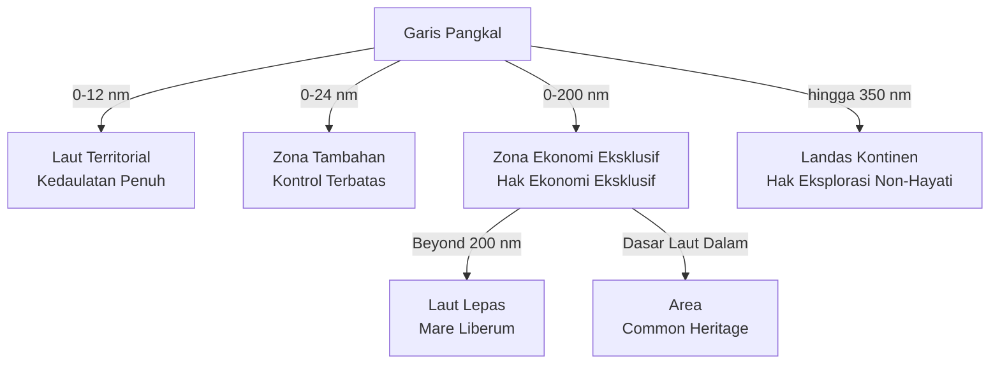
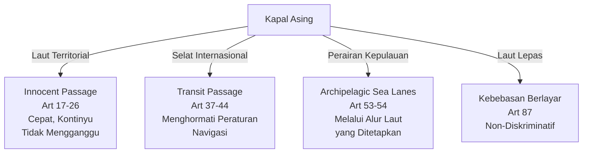

# Hukum Laut Internasional

## Tujuan Pembelajaran

Setelah menyelesaikan bab ini, mahasiswa diharapkan mampu untuk: (1) Memahami secara komprehensif evolusi historis hukum laut internasional dari konsep mare liberum dan mare clausum menuju sistem UNCLOS yang terstruktur, serta menganalisis implikasi pergeseran paradigma ini terhadap kepentingan negara pantai dan negara pengguna laut; (2) Menjelaskan dengan detail struktur dan substansi Konvensi Perserikatan Bangsa-Bangsa tentang Hukum Laut (UNCLOS) 1982, termasuk 320 pasal dan 9 lampiran, serta memahami mekanisme implementasi melalui perjanjian implementasi 1994; (3) Menguasai sistem zona maritim yang diatur dalam UNCLOS, meliputi penentuan garis pangkal, perhitungan laut territorial, zona tambahan, zona ekonomi eksklusif, landas kontinen, dan laut lepas, termasuk kemampuan untuk menerapkan ketentuan teknis dalam konteks kasus nyata; (4) Menganalisis hak-hak dan kewajiban negara dalam setiap zona maritim serta keterbatasan berdaulat di setiap zona dengan pemahaman nuansa terhadap kepentingan yang saling bertentangan; (5) Memahami posisi Indonesia sebagai negara kepulauan terbesar di dunia, termasuk asas Deklarasi Djuanda 1957, kerangka hukum nasional (UU Nomor 6 Tahun 1996, UU Nomor 32 Tahun 2014), dan penerapan alur laut kepulauan Indonesia (ALKI); (6) Menguasai mekanisme penyelesaian sengketa laut menurut UNCLOS, termasuk pengadilan dan arbiter yang berwenang, serta kemampuan menganalisis putusan-putusan penting seperti kasus Laut China Selatan dan delimitasi maritim Indonesia; (7) Mengembangkan pemahaman kritis terhadap isu-isu kontemporer dalam hukum laut, khususnya pengelolaan sumber daya laut, perlindungan lingkungan laut, keamanan maritim, dan implikasi geopolitik dalam konteks Indonesia dan Asia Tenggara.

## Pendahuluan: Evolusi Historis Hukum Laut dari Mare Liberum ke Mare Clausum

Sebelum abad ke-17, laut dianggap sebagai domain eksklusif yang dapat dikuasai oleh negara-negara yang memiliki kekuatan maritim. Konsep mare clausum (laut tertutup) mendominasi, di mana setiap negara pantai memiliki hak untuk mengontrol dan memanfaatkan laut yang terletak di depan pantainya secara penuh. Pandangan ini mencerminkan realitas geopolitik pada periode mercantilisme, ketika negara-negara Eropa bersaing untuk menguasai rute perdagangan dan sumber daya maritim. Spanyol, Portugal, dan kemudian Inggris menerapkan sistem mare clausum untuk melindungi monopoli dagang mereka di laut. Sistem ini menciptakan fragmentasi dan ketidakpastian hukum yang signifikan, menghambat perkembangan perdagangan internasional dan pencarian ilmiah.

Pada tahun 1609, Hugo Grotius menerbitkan karya revolusionernya "Mare Liberum" yang mengusulkan konsep fundamental bahwa laut, berbeda dengan daratan, tidak dapat dimiliki oleh siapa pun dan harus terbuka untuk penggunaan semua bangsa secara bebas. Konsep mare liberum ini didasarkan pada prinsip bahwa laut adalah common property yang fungsinya untuk jalur pelayaran dan tidak terbatas pada satu negara. Grotius berargumen bahwa karena tidak mungkin menguasai laut seperti halnya menguasai tanah, maka laut harus tetap bebas untuk navigasi oleh semua negara. Ide-ide Grotius ini secara perlahan diakui oleh komunitas internasional, meskipun negara-negara masih menuntut batas laut territorial tertentu untuk keperluan pertahanan dan keamanan.

Pada abad ke-18 dan awal abad ke-19, komunitas internasional mulai mengembangkan standar yang lebih jelas mengenai batas laut territorial negara pantai. Konsep "cannon-shot rule" muncul, yang menyatakan bahwa yurisdiksi negara pantai hanya meluas sejauh jangkauan meriam mereka dari pantai, diperkirakan sekitar 3 mil laut. Prinsip ini kemudian berkembang menjadi penerimaan umum terhadap laut territorial selebar 3 mil laut. Akan tetapi, beberapa negara seperti Skandinavia menolak standar ini dan menuntut batas yang lebih luas. Inkonsistensi ini menunjukkan bahwa meskipun konsep mare liberum telah diterima secara umum, masih terdapat kesulitan dalam menentukan batas-batas praktis antara laut territorial dan laut lepas yang bebas.

Pada pertengahan abad ke-20, khususnya setelah Perang Dunia II, negara-negara mulai menyadari pentingnya pengelolaan sumber daya laut secara lebih teratur dan transparan. Peningkatan teknologi penambangan dan eksplorasi laut membuat banyak negara menginginkan kontrol yang lebih besar atas sumber daya laut yang berdekatan dengan pantai mereka. Deklarasi Truman 1945 dari Amerika Serikat menjadi pelopor dalam hal ini, mengumumkan bahwa sumber daya alam di landas kontinen Amerika Serikat adalah bagian dari domain Amerika Serikat. Deklarasi ini membuka jalan bagi negara-negara lain untuk menuntut kontrol serupa atas sumber daya laut mereka.

Indonesia memainkan peran kunci melalui Deklarasi Djuanda 1957, yang menyatakan bahwa seluruh kepulauan Indonesia, dari Sabang sampai Merauke, harus dianggap sebagai suatu kesatuan wilayah yang homogen dan tidak dapat dibagi-bagi. Deklarasi ini menantang pandangan hukum laut internasional yang berlaku saat itu, yang mengakui hanya 3 mil laut territorial. Konsep ini didasarkan pada realitas geografis Indonesia sebagai negara kepulauan dengan ribuan pulau dan masyarakat yang secara historis dan budaya terhubung melalui laut. Deklarasi Djuanda menjadi landasan bagi "archipelago doctrine" dalam hukum laut internasional, yang kemudian diadopsi oleh UNCLOS 1982.

## UNCLOS 1982: Sejarah, Struktur, dan Negosiasi Multilateral

UNCLOS 1982 adalah hasil dari negosiasi internasional yang panjang dan kompleks. Proses negosiasi dimulai dengan UNCLOS I (1958) dan UNCLOS II (1960), yang keduanya menghasilkan empat konvensi terpisah tentang hukum laut, tetapi tidak berhasil menetapkan consensus mengenai batas-batas maritim yang dapat diterima secara universal. UNCLOS III (1973-1982) adalah negosiasi yang paling ambisius dan komprehensif dalam sejarah hukum internasional, dihadiri oleh lebih dari 150 negara dan menghasilkan UNCLOS 1982, yang terdiri dari 320 pasal dalam 17 bagian utama, serta 9 lampiran yang mengandung ketentuan teknis dan prosedural.

Salah satu pendekatan inovatif dalam UNCLOS III adalah penggunaan metode "package deal" atau "paket kesepakatan", di mana berbagai isu-isu yang dapat bertentangan dikelompokkan sedemikian rupa sehingga setiap kelompok negara mendapatkan keuntungan yang sebanding. Sistem ini memungkinkan negara-negara dengan kepentingan berbeda untuk mencapai kompromi yang dapat diterima oleh semua pihak. Misalnya, negara-negara pantai mendapatkan hak untuk menetapkan ZEE seluas 200 mil laut dan kontrol atas sumber daya laut di dalamnya, sementara negara-negara maritim mempertahankan hak kebebasan berlayar dan hak transit melalui selat internasional.

UNCLOS 1982 mulai berlaku pada tanggal 16 November 1994, setelah 60 negara meratifikasinya. Awalnya, UNCLOS ditolak oleh beberapa negara industri maju, khususnya Amerika Serikat, yang menolak provisions mengenai International Seabed Authority dan pembagian sumber daya laut. Namun, pada tahun 1994, suatu perjanjian implementasi diadopsi yang memodifikasi provisions mengenai ISA, membuat UNCLOS menjadi dapat diterima oleh lebih banyak negara. Saat ini, 168 negara telah meratifikasi UNCLOS 1982, menjadikannya salah satu perjanjian internasional yang paling diterima secara universal.

## Zona Maritim: Sistem Zonasi dalam UNCLOS 1982

UNCLOS 1982 memperkenalkan sistem zonasi maritim yang sangat terstruktur dan komprehensif, mengorganisir laut menjadi beberapa zona dengan hak dan kewajiban yang berbeda untuk negara pantai dan negara lain. Sistem ini dimulai dengan penentuan garis pangkal (baseline), yang merupakan garis referensi dasar dari mana semua pengukuran zona maritim dilakukan. Garis pangkal secara normal mengikuti garis pantai yang ditunjukkan pada peta resmi yang diakui oleh negara pantai dengan skala besar.

Zona pertama adalah laut territorial, yang merupakan bagian dari wilayah negara pantai di mana negara ini memiliki kedaulatan penuh. Lebar laut territorial ditetapkan tidak lebih dari 12 mil laut dari garis pangkal yang telah ditentukan. Laut territorial memberikan negara pantai kontrol penuh atas segala kegiatan di dalamnya, namun negara pantai harus mengizinkan "innocent passage" oleh kapal-kapal asing yang tidak menimbulkan ancaman terhadap keamanan, ketertiban, atau kepentingan negara pantai.

Di luar laut territorial, UNCLOS mengakui zona tambahan (contiguous zone) yang merupakan zona buffer dengan lebar tidak lebih dari 24 mil laut dari garis pangkal. Dalam zona tambahan, negara pantai dapat menjalankan kontrol yang diperlukan untuk mencegah pelanggaran hukum, peraturan bea cukai, fiskal, imigrasi, atau sanitasi.

Zona Ekonomi Eksklusif (ZEE) merupakan salah satu konsep paling penting yang diperkenalkan oleh UNCLOS 1982. ZEE ditetapkan dengan lebar hingga 200 mil laut dari garis pangkal. Dalam ZEE, negara pantai memiliki hak-hak ekonomi eksklusif untuk mengeksplorasi, mengeksplorasi, dan mengelola sumber daya alam hayati dan non-hayati. ZEE juga memberikan negara pantai yurisdiksi atas pembangunan energi terbarukan, pemeliharaan fasilitas buatan, penelitian ilmiah, dan perlindungan lingkungan.

Landas kontinen merupakan zona maritim yang berbeda dari ZEE dalam beberapa hal penting. Landas kontinen didefinisikan sebagai perpanjangan alami dari wilayah darat negara pantai, terdiri dari dasar laut dan substrat laut. Garis tepi luar landas kontinen ditentukan berdasarkan kriteria geologis dan geografis. Secara umum, landas kontinen tidak boleh melampaui 350 mil laut dari garis pangkal.

Laut lepas merupakan zona maritim yang terletak di luar ZEE dan area lain yang berada di bawah yurisdiksi nasional. Dalam laut lepas, tidak ada negara yang memiliki yurisdiksi, dan semua negara memiliki hak yang sama untuk memanfaatkan laut untuk berbagai keperluan, termasuk navigasi, penangkapan ikan, penelitian ilmiah, dan pemanfaatan ekonomi lainnya.

Area merupakan zona maritim khusus yang terdiri dari dasar laut dan substrat laut, di luar batas-batas yurisdiksi nasional. Area didefinisikan sebagai "common heritage of mankind". Pengelolaan Area dilakukan oleh International Seabed Authority (ISA), yang merupakan organisasi internasional independen yang didirikan oleh UNCLOS.

## Hak Lintas: Innocent Passage, Transit Passage, dan Archipelagic Sea Lanes

UNCLOS 1982 mengatur berbagai bentuk hak lintas yang memungkinkan kapal dan pesawat asing untuk melewati perairan negara pantai tanpa memerlukan izin sebelumnya. Innocent passage adalah hak fundamental yang diberikan kepada kapal asing untuk berlayar melalui laut territorial negara pantai dengan cara yang cepat, kontinyu, dan tidak mengganggu perdamaian, ketertiban, atau keamanan negara pantai.

Transit passage adalah hak lintas khusus yang diberikan kepada kapal dan pesawat asing untuk melewati selat internasional yang menghubungkan laut lepas atau ZEE dengan laut territorial atau ZEE negara lain. Transit passage berbeda dari innocent passage dalam beberapa aspek penting. Pertama, transit passage tidak memerlukan kapal untuk berlayar dengan cara yang cepat dan kontinyu. Kedua, transit passage tidak dapat dihentikan atau dinilai sesuai dengan kriteria innocent passage.

Archipelagic sea lanes passage adalah bentuk lintas khusus yang diberikan kepada kapal dan pesawat asing untuk melewati alur-alur laut kepulauan yang telah ditetapkan oleh negara kepulauan. Negara kepulauan memiliki hak untuk menetapkan alur-alur laut kepulauan melalui perairan kepulauan mereka yang memfasilitasi lalu lintas maritim dan penerbangan internasional.

## Indonesia sebagai Negara Kepulauan: Deklarasi Djuanda dan UNCLOS Part IV

Indonesia memainkan peran yang sangat signifikan dalam pembentukan konsep negara kepulauan dalam hukum laut internasional. Pada tanggal 13 Desember 1957, Perdana Menteri Indonesia, Ir. Soekarno, mengumumkan Deklarasi Djuanda yang menyatakan bahwa seluruh kepulauan Indonesia, dari Sabang sampai Merauke, dengan segala pulau-pulau di antara pulau-pulau tersebut, merupakan suatu kesatuan wilayah yang merupakan bagian dari kekuasaan nasional Indonesia yang tidak dapat dibagi-bagi. Deklarasi ini menantang norma-norma hukum laut internasional yang berlaku saat itu.

Deklarasi Djuanda didasarkan pada realitas geografis dan historis Indonesia sebagai negara kepulauan dengan ribuan pulau yang tersebar di wilayah yang sangat luas, dengan luas sekitar 5 juta kilometer persegi. Pulau-pulau Indonesia tidak hanya tersebar secara geografis, tetapi juga terhubung oleh laut yang secara historis, budaya, dan ekonomi menjadi satu kesatuan. Masyarakat Indonesia memiliki tradisi berlayar dan perdagangan maritim yang panjang, dengan jalur perdagangan yang menghubungkan berbagai pulau.

Deklarasi Djuanda menjadi fondasi bagi apa yang kemudian dikenal sebagai "archipelago doctrine" dalam hukum laut internasional. Doktrin ini mulai diadopsi oleh negara-negara kepulauan lainnya, khususnya Filipina, dan menjadi isu yang sangat kontroversial dalam negosiasi UNCLOS III. Awalnya, negara-negara maritim maju menolak archipelago doctrine, namun melalui negosiasi yang panjang dan dengan kompromi yang diambil dari berbagai pihak, archipelago doctrine akhirnya diadopsi dalam UNCLOS 1982 dalam Bagian IV (Pasal 46-54).

Definisi archipelagic state dalam UNCLOS Pasal 46 adalah "negara pantai yang terdiri atas satu atau lebih kepulauan serta mungkin pulau-pulau lain yang membentuk suatu kesatuan geografis, ekonomis, dan politis, atau yang secara historis telah diperlakukan sebagai suatu kesatuan". Negara kepulauan memiliki hak untuk menarik garis pangkal lurus menghubungkan titik-titik terluar dari pulau-pulau terluarnya, dengan syarat bahwa garis-garis ini tidak boleh menyimpang jauh dari garis pantai umum pulau-pulau tersebut.

Indonesia mengimplementasikan archipelago doctrine melalui berbagai instrumen hukum nasional. Undang-Undang Nomor 6 Tahun 1996 tentang Perairan Indonesia mengatur tentang definisi perairan Indonesia, penentuan garis pangkal, dan garis pangkal lurus kepulauan Indonesia. Undang-Undang Nomor 32 Tahun 2014 tentang Pengelolaan Wilayah Pesisir dan Pulau-Pulau Kecil merupakan undang-undang yang lebih komprehensif yang mengatur tentang pengelolaan wilayah pesisir Indonesia.

## ALKI (Alur Laut Kepulauan Indonesia): Struktur dan Signifikansi

Alur Laut Kepulauan Indonesia (ALKI) merupakan alur-alur laut yang telah ditetapkan oleh Indonesia untuk memfasilitasi pelayaran internasional melalui perairan kepulauan Indonesia. Indonesia telah menetapkan tiga ALKI, yang menghubungkan berbagai selat internasional dan laut lepas melalui perairan kepulauan Indonesia. ALKI I menghubungkan Selat Malacca dengan laut lepas sebelah utara Filipina; ALKI II menghubungkan Samudera Hindia dengan Samudra Pasifik melalui Selat Makasar dan Selat Banda; dan ALKI III menghubungkan Samudera Hindia dengan Samudra Pasifik melalui jalur selatan Indonesia.

| ALKI | Lokasi | Panjang Approx | Negara Transit | Kepentingan Strategis |
|------|--------|---|---|---|
| ALKI I | Selat Malacca - Laut Sulawesi - Laut Flores | 1.000 nm | Malaysia, Singapura | Rute pelayaran internasional utama Asia |
| ALKI II | Samudera Hindia - Selat Makasar - Laut Banda - Laut Ceram | 1.100 nm | Australia (sebagian) | Rute alternatif ke Terusan Suez |
| ALKI III | Samudera Hindia (Selatan) - Laut Timor - Laut Sawu | 1.500 nm | Australia | Rute alternatif menghubungkan Afrika ke Asia |

Penetapan ALKI telah melalui proses yang panjang dan kompleks, melibatkan survei hidrografi, koordinasi dengan Organisasi Maritim Internasional (IMO), dan notifikasi kepada komunitas maritim internasional. Indonesia telah mengumumkan ALKI kepada IMO dan telah menerbitkan peraturan-peraturan mengenai navigasi, keselamatan, dan pencegahan polusi dalam ALKI. ALKI memiliki implikasi keamanan maritim yang signifikan bagi Indonesia karena dengan menetapkan ALKI, Indonesia dapat mengatur dan mengawasi lalu lintas maritim melalui perairan kepulauan Indonesia dengan lebih efektif.

## Penyelesaian Sengketa: ITLOS, ICJ, dan Arbitrase

UNCLOS 1982 menyediakan mekanisme yang komprehensif untuk penyelesaian sengketa yang mungkin timbul dari interpretasi atau penerapan UNCLOS. Mekanisme penyelesaian sengketa UNCLOS diatur dalam Bagian XV (Pasal 279-299) UNCLOS. UNCLOS mengakui empat forum yang dapat menangani sengketa laut internasional: International Court of Justice (ICJ), International Tribunal for the Law of the Sea (ITLOS), Arbitrase (Annex VII), dan Arbitrase Khusus (Annex VIII).

International Tribunal for the Law of the Sea (ITLOS) didirikan oleh UNCLOS 1982 dan mulai beroperasi pada tahun 1996. ITLOS adalah pengadilan internasional yang khusus dirancang untuk menangani sengketa-sengketa yang berkaitan dengan hukum laut internasional. ITLOS memiliki 21 hakim yang dipilih berdasarkan representasi geografis dan keahlian dalam hukum laut. ITLOS memiliki yurisdiksi untuk menangani sengketa-sengketa mengenai interpretasi atau penerapan UNCLOS dan sengketa-sengketa mengenai perlindungan dan pelestarian lingkungan laut.

International Court of Justice (ICJ) adalah pengadilan internasional utama PBB yang dapat menangani sengketa laut internasional. Meskipun ICJ bukan pengadilan khusus untuk hukum laut seperti ITLOS, ICJ memiliki pengalaman dalam menangani sengketa-sengketa laut internasional yang kompleks, termasuk sengketa delimitasi maritim.

Arbitrase merupakan forum penyelesaian sengketa lainnya yang dapat digunakan oleh negara-negara pihak dalam UNCLOS untuk menyelesaikan sengketa laut mereka. Arbitrase diatur dalam Annex VII UNCLOS dan melibatkan penunjukan arbiter yang dipilih oleh pihak-pihak yang bersengketa.

## Sengketa Laut China Selatan: Phillips v. China (PCA 2016)

Sengketa Laut China Selatan merupakan salah satu sengketa geopolitik yang paling kompleks dan serius di Asia Tenggara, melibatkan klaim territorial yang tumpang tindih dari beberapa negara. Cina mengklaim hampir seluruh Laut China Selatan berdasarkan "nine-dash line", yang merupakan garis perbatasan yang ditetapkan oleh Cina dalam peta resmi mereka. Cina belum pernah secara resmi menjelaskan dasar hukum dari nine-dash line ini atau sifat dari klaim mereka.

Filipina mengajukan kasus melawan Cina ke Permanent Court of Arbitration (PCA) pada tahun 2013. Pada tanggal 12 Juli 2016, PCA mengeluarkan keputusan yang merupakan putusan yang sangat signifikan. PCA memutuskan bahwa nine-dash line tidak memiliki landasan dalam hukum internasional dan tidak konsisten dengan UNCLOS. PCA juga memutuskan bahwa berbagai fitur geografis di Laut China Selatan, termasuk Scarborough Shoal dan Spratly Islands, tidak memiliki status pulau sesuai dengan Pasal 121 UNCLOS.

Putusan PCA telah mengubah lanskap hukum Laut China Selatan, meskipun implementasi putusan ini tetap menjadi tantangan. Cina menolak untuk mengakui keabsahan PCA sebagai badan arbitrase yang berwenang dalam kasus ini. Indonesia, meskipun bukan pihak langsung dalam sengketa Laut China Selatan, memiliki kepentingan yang signifikan dalam hasil sengketa ini.

## Delimitasi Batas Maritim Indonesia

Indonesia sebagai negara kepulauan terbesar di dunia memiliki perbatasan maritim dengan banyak negara tetangga. Indonesia telah menandatangani berbagai perjanjian bilateral dan regional untuk menentukan batas-batas maritim dengan negara-negara tetangga, termasuk delimitasi laut territorial, ZEE, dan landas kontinen.

| Negara Tetangga | Jenis Delimitasi | Perjanjian Utama | Tahun Penandatanganan | Status |
|---|---|---|---|---|
| Malaysia | Laut Territorial, ZEE, Landas Kontinen | Multiple Agreements | 1970-2009 | Sebagian Selesai |
| Australia | Laut Territorial, ZEE, Landas Kontinen | Timor Sea Treaty, 1997 Agreement | 1974, 1997, 2018 | Berlaku |
| Filipina | Laut Territorial, Garis Pangkal | Baseline Agreement | 1974 | Berlaku |
| Vietnam | ZEE, Landas Kontinen | ZEE & Continental Shelf | 2017, 2020 | Berlaku |
| Singapura | Laut Territorial | Baseline Agreement | 1973 | Berlaku |
| Palau | Garis Pangkal | Baseline Demarcation | 2009 | Berlaku |
| Thailand | ZEE, Landas Kontinen | Negosiasi Berlangsung | - | Dalam Proses |

Perjanjian delimitasi antara Indonesia dan Malaysia merupakan salah satu perjanjian yang paling penting dan komprehensif. Indonesia dan Malaysia telah menandatangani beberapa perjanjian untuk menentukan garis pangkal, laut territorial, dan ZEE. Perjanjian pertama ditandatangani pada tahun 1970 mengenai garis pangkal di Selat Malacca.

Delimitasi antara Indonesia dan Australia merupakan delimitasi yang juga sangat penting. Indonesia dan Australia memiliki wilayah maritim yang berdekatan di Laut Timor dan di sebelah selatan Indonesia. Perjanjian pertama antara Indonesia dan Australia ditandatangani pada tahun 1974 mengenai delimitasi laut territorial dan zona kecekungan kontinen di Laut Timor. Kemudian, pada tahun 1997, Indonesia dan Australia menandatangani perjanjian baru mengenai delimitasi ZEE dan landas kontinen di sebelah selatan Indonesia.

Delimitasi antara Indonesia dan Filipina telah difokuskan terutama pada penentuan garis pangkal lurus. Indonesia dan Filipina menandatangani perjanjian mengenai garis pangkal lurus pada tahun 1974. Delimitasi antara Indonesia dan Vietnam telah melalui proses negosiasi yang cukup panjang. Pada tahun 2017, Indonesia dan Vietnam menandatangani perjanjian mengenai delimitasi ZEE, yang menyelesaikan salah satu isu delimitasi yang telah ditunda selama beberapa dekade.

Proses delimitasi maritim Indonesia menunjukkan bahwa Indonesia telah mengambil pendekatan yang konstruktif dan bilateral dalam menyelesaikan sengketa perbatasan maritim. Indonesia lebih suka menyelesaikan perbatasan maritim melalui negosiasi bilateral dan dialog yang damai, daripada melalui litigasi internasional.

## Studi Kasus: MOX Plant, Enrica Lexie, ARA Libertad, dan MV Saiga

Kasus MOX Plant melibatkan Irlandia yang mengajukan gugatan terhadap Inggris ke ITLOS mengenai pengoperasian fasilitas MOX di Sellafield, Inggris. ITLOS memutuskan bahwa meskipun kasus ini berkaitan dengan perlindungan lingkungan laut, yurisdiksi untuk mengadili kasus ini sebaiknya diberikan kepada arbitrase daripada kepada ITLOS.

Kasus Enrica Lexie melibatkan sengketa antara Italia dan India mengenai kapal kargo Italia yang ditembaki oleh kapal pengawal India di laut territorial India. Penembakan ini menyebabkan kematian dua nelayan India. ICJ memutuskan bahwa India memiliki yurisdiksi dalam kasus ini, tetapi juga menyatakan bahwa Italia memiliki hak untuk melindungi kapal dan awaknya dari penggunaan senjata yang tidak proporsional.

Kasus ARA Libertad melibatkan pengadilan kapal pelatihan militer Argentina di pelabuhan Ghana. ITLOS memutuskan bahwa kapal militer memiliki kekebalan dari pengadilan nasional, tetapi Argentina harus mencari penyelesaian sengketa melalui cara-cara diplomatik dan hukum internasional.

Kasus MV Saiga melibatkan kapal tanker yang ditangkap oleh armada laut Guinea di zona tambahan Guinea. ITLOS memutuskan bahwa Guinea memiliki hak untuk menangkap kapal di zona tambahan untuk tujuan mencegah pelanggaran hukum pabean dan fiskal. Akan tetapi, ITLOS juga memutuskan bahwa perlakuan terhadap kapal dan awaknya oleh Guinea tidak sesuai dengan standar-standar hukum internasional.

## Pertanyaan Refleksi

1. Bagaimana konsep mare liberum dan mare clausum telah membentuk perkembangan hukum laut internasional modern?
2. Jelaskan bagaimana sistem zonasi maritim dalam UNCLOS menciptakan keseimbangan antara kedaulatan negara pantai dan kebebasan navigasi internasional.
3. Diskusikan peranan Indonesia dalam pembentukan konsep archipelago doctrine.
4. Bagaimana Deklarasi Djuanda 1957 menjadi pelopor dalam pengakuan international law terhadap rights negara kepulauan?
5. Analisis mekanisme penyelesaian sengketa UNCLOS, terutama peranan ITLOS dan arbitrase.
6. Diskusikan implikasi hukum dan geopolitik dari putusan Permanent Court of Arbitration dalam kasus Philippines v. China (2016).
7. Analisis tantangan-tantangan yang dihadapi oleh International Seabed Authority.
8. Jelaskan bagaimana ALKI mencerminkan keseimbangan antara kedaulatan maritim Indonesia dan kebebasan navigasi internasional.
9. Analisis perjanjian-perjanjian delimitasi maritim Indonesia dengan negara-negara tetangganya.
10. Diskusikan isu-isu kontemporer dalam hukum laut internasional yang relevan dengan Indonesia.

## Referensi Silang

Untuk pemahaman yang lebih lengkap, silakan merujuk ke:
- [[01_Pengertian_Sejarah_HI]] - Konteks sejarah hukum internasional modern
- [[05_Sumber_Hukum_Internasional]] - Sumber-sumber hukum internasional termasuk perjanjian internasional
- [[07_Penyelesaian_Sengketa]] - Mekanisme penyelesaian sengketa internasional secara umum

## Daftar Pustaka

Churchill, R. R., & Lowe, A. V. (2017). *The Law of the Sea* (3rd ed.). Manchester University Press.

Tanaka, Y. (2015). *The International Law of the Sea* (2nd ed.). Cambridge University Press.

Shaw, M. N. (2017). *International Law* (8th ed.). Cambridge University Press.

Proelss, A. (Ed.). (2017). *United Nations Convention on the Law of the Sea: A Commentary*. C.H. Beck, Hart Publishing, Nomos.

United Nations. (1982). *United Nations Convention on the Law of the Sea*. United Nations.

Soons, A. H. A. (1990). *Artificial Islands*. Martinus Nijhoff Publishers.

Brownlie, I. (2012). *Principles of Public International Law* (8th ed.). Oxford University Press.

Oppenheim, L. (2017). *International Law: A Treatise* (10th ed.). Oxford University Press.

Arsana, I. M. (2007). *International Law Governing Islands: An Analysis of the Law of the Sea Convention*. Penerbit Universitas Indonesia.

Wiryawan, I. B. (2010). *Kebijakan Hukum Laut Indonesia: Perspektif Historis dan Kontemporer*. Citra Aditya Bakti.

Madu, B. C. (2012). *Indonesia's Archipelago Doctrine and the Law of the Sea*. Penerbit Bumi Aksara.

Hadiwinata, B. S. (2013). *Pemerintahan Indonesia dan Tata Kelola Maritim*. Universitas Parahyangan.

Sempowich, S. (Ed.). (2019). *International Tribunal for the Law of the Sea: Challenges and Perspectives*. Brill Nijhoff.

Epitropaki, E. (2018). *The International Court of Justice and the Law of the Sea*. Cambridge University Press.

Kramer, A. R. (2016). *Continental Shelf Delimitation in the Arctic: A Legal Analysis*. Routledge.

Hadiwinata, B. S. (2012). *Kebijakan Maritim Negara-Negara Asia Tenggara*. ISEAS-Yusof Ishak Institute.

Beckman, R. C. (2011). *UNCLOS and the Extended Continental Shelf: The Regional Implications*. ICS Press.

Bateman, S. (Ed.). (2014). *Maritime Security and the Law of the Sea*. Routledge.

Karlas, J. (2016). The South China Sea Dispute and China's Hegemonic Intentions. *Contemporary Southeast Asia*, 38(2), 195-220.

Nodland, V. (2017). The PCA Award in the Philippines v. China Case: Implications for the Law of the Sea. *German Yearbook of International Law*, 60(1), 51-98.

## Lampiran Tambahan: Isu-Isu Kontemporer dalam Hukum Laut

### Perlindungan Lingkungan Laut dan Berkelanjutan

Perlindungan lingkungan laut menjadi semakin penting seiring dengan meningkatnya aktivitas maritim dan eksploitasi sumber daya laut. UNCLOS mengandung berbagai provisions mengenai perlindungan lingkungan laut, termasuk pencegahan polusi, konservasi sumber daya hayati laut, dan penelitian ilmiah. Bagian XII UNCLOS secara khusus mengatur tentang "Protection and Preservation of the Marine Environment", yang mencakup berbagai aspek perlindungan lingkungan laut.

Pencegahan polusi laut merupakan salah satu isu terpenting dalam perlindungan lingkungan laut. Polusi laut dapat berasal dari berbagai sumber, termasuk limbah industri, limbah domestik, minyak dan bahan kimia berbahaya dari kapal, dan plastik. Organisasi Maritim Internasional (IMO) telah mengembangkan berbagai konvensi dan protokol untuk mencegah polusi laut, termasuk MARPOL (Marine Pollution) Convention dan SOLAS (Safety of Life at Sea) Convention. Konvensi-konvensi ini mengatur standar-standar bagi kapal-kapal untuk mencegah dan mengurangi polusi laut.

Konservasi sumber daya hayati laut juga merupakan isu penting. Perikanan laut yang berlebihan (overfishing) telah menyebabkan penurunan yang signifikan dalam stok ikan di banyak wilayah laut. UNCLOS mengakui bahwa negara pantai memiliki tanggung jawab untuk mengelola sumber daya hayati laut mereka secara berkelanjutan dan untuk berkontribusi pada konservasi sumber daya laut bersama. Berbagai organisasi regional telah dibentuk untuk mengelola perikanan laut secara bersama-sama, termasuk Regional Fisheries Management Organizations (RFMOs).

Penelitian ilmiah laut adalah aktivitas penting untuk memahami ekosistem laut dan mengembangkan pengetahuan tentang laut. Bagian XIII UNCLOS mengatur tentang "Marine Scientific Research", yang memberikan negara pantai kontrol atas penelitian ilmiah laut di ZEE dan landas kontinen mereka. Negara pantai dapat mengontrol dan mengarahkan penelitian ilmiah laut untuk memastikan bahwa penelitian tersebut tidak merugikan lingkungan laut dan sumber daya laut mereka.

### Keamanan Maritim dan Pencegahan Terorisme

Keamanan maritim telah menjadi isu yang semakin penting setelah serangan teroris pada kapal-kapal di laut. Piracy dan armed robbery terhadap kapal-kapal di laut merupakan ancaman serius terhadap keamanan maritim dan perdagangan maritim internasional. IMO telah mengembangkan berbagai standar keamanan maritim, termasuk International Ships and Port Facility Security (ISPS) Code, yang mengatur standar-standar keamanan bagi kapal-kapal dan fasilitas pelabuhan.

Keamanan maritim juga meliputi pencegahan perdagangan manusia, penyelundupan narkoba, dan aktivitas-aktivitas ilegal lainnya di laut. Banyak negara telah meningkatkan upaya penegakan hukum maritim mereka untuk mencegah aktivitas-aktivitas ilegal di laut. Kerja sama multilateral dan regional juga penting untuk mengatasi ancaman keamanan maritim, karena banyak ancaman keamanan maritim melintasi batas-batas negara dan memerlukan koordinasi internasional yang efektif.

### Implikasi Perubahan Iklim terhadap Hukum Laut

Perubahan iklim global memiliki implikasi yang signifikan terhadap hukum laut internasional. Peningkatan level air laut yang disebabkan oleh pemanasan global dapat mempengaruhi garis pangkal dan batas-batas maritim negara-negara, khususnya negara-negara pulau kecil dan negara-negara rendah. Negara-negara seperti Kiribati, Tuvalu, dan Maldives menghadapi ancaman eksistensi karena peningkatan level air laut yang dapat menyebabkan hilangnya wilayah darat mereka.

Perubahan iklim juga mempengaruhi sumber daya hayati laut. Perubahan suhu air laut dan pola arus laut dapat mempengaruhi distribusi dan migrasi spesies ikan, yang pada gilirannya mempengaruhi penangkapan ikan dan ekonomi perikanan di berbagai wilayah. Proses delimitasi maritim juga dapat dipengaruhi oleh perubahan iklim, karena perubahan tingkat laut dapat mempengaruhi posisi garis pangkal dan batas-batas maritim.

### Penangkapan Ikan Ilegal dan Pengelolaan Perikanan

Penangkapan ikan ilegal (Illegal, Unreported, and Unregulated Fishing - IUU) merupakan salah satu ancaman terbesar terhadap keberlanjutan sumber daya hayati laut. IUU fishing menyebabkan kerugian ekonomi yang signifikan bagi negara-negara pantai dan merugikan nelayan lokal yang melakukan penangkapan ikan secara legal. IUU fishing juga merusak ekosistem laut dan mengurangi stok ikan yang tersedia untuk generasi mendatang.

Indonesia, sebagai negara dengan sumber daya ikan yang melimpah, telah menghadapi masalah serius dengan IUU fishing. Kapal-kapal penangkap ikan asing yang tidak memiliki izin telah beroperasi di perairan Indonesia dan mengambil sumber daya ikan Indonesia secara ilegal. Indonesia telah meningkatkan upaya penegakan hukum maritim untuk mencegah IUU fishing, termasuk penyisihan kapal-kapal penangkap ikan ilegal. Upaya ini telah berhasil dalam mengurangi aktivitas IUU fishing di perairan Indonesia, meskipun tantangan masih tetap ada.

### Teknologi Maritim dan Inovasi dalam Industri Maritim

Perkembangan teknologi maritim dan inovasi dalam industri maritim juga memiliki implikasi penting terhadap hukum laut internasional. Teknologi autonomous vessels (kapal tanpa awak) sedang dikembangkan dan dapat mengubah cara kapal-kapal beroperasi di laut. Autonomous vessels memiliki implikasi penting terhadap pertanggungjawaban hukum, karena sistem hukum maritim internasional saat ini banyak didasarkan pada tanggung jawab awak kapal dan pemilik kapal yang dapat membuat keputusan.

Teknologi renewable energy di laut, seperti wind farms di laut dan tidal energy, juga sedang dikembangkan sebagai sumber energi alternatif yang berkelanjutan. Teknologi-teknologi baru ini memerlukan pengaturan hukum yang jelas dalam UNCLOS dan hukum maritim internasional, untuk memastikan bahwa pengembangan teknologi-teknologi baru tersebut dilakukan dengan cara yang berkelanjutan dan tidak merugikan lingkungan laut dan hak-hak negara lain.

### Kesimpulan

Hukum laut internasional, sebagaimana diatur dalam UNCLOS 1982, merupakan kerangka hukum yang komprehensif dan penting untuk mengelola penggunaan laut secara berkelanjutan dan adil. Sistem zonasi maritim yang diatur dalam UNCLOS memberikan keseimbangan antara kedaulatan negara pantai dan kebebasan navigasi internasional, meskipun dalam praktik masih terdapat banyak tantangan dalam implementasinya. Peranan Indonesia sebagai negara kepulauan terbesar di dunia sangat penting dalam pembentukan dan pengembangan hukum laut internasional, khususnya melalui Deklarasi Djuanda dan archipelago doctrine yang kemudian diadopsi oleh UNCLOS.

Mekanisme penyelesaian sengketa yang disediakan oleh UNCLOS, termasuk ITLOS, ICJ, dan arbitrase, telah terbukti efektif dalam menyelesaikan berbagai sengketa laut internasional. Namun, sengketa Laut China Selatan menunjukkan bahwa masih terdapat tantangan-tantangan dalam implementasi dan penegakan keputusan-keputusan pengadilan internasional.

Isu-isu kontemporer dalam hukum laut, seperti perlindungan lingkungan laut, keamanan maritim, implikasi perubahan iklim, dan penangkapan ikan ilegal, memerlukan perhatian dan upaya yang lebih serius dari komunitas internasional. Pengembangan hukum laut internasional yang lebih responsif terhadap isu-isu kontemporer ini akan sangat penting untuk memastikan keberlanjutan dan keadilan dalam penggunaan laut untuk generasi mendatang.

## Analisis Mendalam: Aspek-Aspek Khusus Hukum Laut Internasional

### Sistem Flag State dan Tanggung Jawab Internasional

Sistem flag state merupakan salah satu prinsip fundamental dalam hukum laut internasional modern. Setiap kapal yang berlayar di laut lepas harus berdaftar di suatu negara dan berkibar bendera negara tersebut. Negara yang bendera kapal berkibar (flag state) bertanggung jawab untuk mengawasi dan mengendalikan kapal-kapal yang berkibar benderanya, serta memastikan bahwa kapal-kapal tersebut mematuhi standar-standar internasional yang berlaku.

Sistem flag state ini memiliki keuntungan dan kelemahan yang signifikan. Keuntaannya adalah bahwa sistem ini memberikan fleksibilitas kepada negara-negara untuk mengelola kapal-kapal mereka sesuai dengan kepentingan mereka, tanpa campur tangan negara lain. Akan tetapi, kelemahan sistem ini adalah bahwa negara-negara dengan standar regulasi yang rendah dapat memberikan "flag of convenience" kepada kapal-kapal asing, yang memungkinkan pemilik kapal untuk menghindari standar-standar yang lebih ketat dari negara asal mereka.

Sistem flag state juga menciptakan tantangan dalam penegakan hukum maritim. Negara-negara yang bukan flag state dari kapal yang melanggar hukum maritim memiliki kewenangan yang terbatas untuk mengambil tindakan terhadap kapal tersebut, kecuali dalam kasus-kasus khusus seperti piracy atau pencemaran lingkungan yang signifikan. Hal ini dapat mengakibatkan ketidakpatuhan terhadap standar-standar maritim internasional dan aktivitas-aktivitas ilegal di laut.

### Delimitasi Maritim: Prinsip-Prinsip dan Praktik

Delimitasi maritim adalah proses penentuan garis batas antara wilayah maritim dua negara atau lebih yang memiliki garis pantai yang saling berdekatan. Delimitasi maritim merupakan isu yang kompleks karena melibatkan pertanyaan tentang bagaimana harus membagi sumber daya laut yang terbatas di antara negara-negara yang memiliki kepentingan yang bertentangan.

UNCLOS menetapkan prinsip-prinsip untuk delimitasi maritim dalam Pasal 74 (untuk ZEE) dan Pasal 83 (untuk landas kontinen). Kedua pasal ini menyatakan bahwa delimitasi harus dilakukan berdasarkan hukum internasional dengan tujuan mencapai solusi yang adil. Akan tetapi, UNCLOS tidak memberikan formula yang jelas untuk menentukan garis delimitasi, sehingga negara-negara harus bernegosiasi untuk mencapai perjanjian delimitasi yang dapat diterima oleh kedua belah pihak.

Dalam praktik, delimitasi maritim sering didasarkan pada prinsip garis tengah (median line principle) atau prinsip ekuikdistan (equidistance principle), yang membagi wilayah maritim menjadi dua bagian yang sama dengan cara menarik garis yang setiap titiknya berjarak sama dari garis pangkal kedua negara. Akan tetapi, prinsip ini dapat dimodifikasi apabila terdapat keadaan-keadaan khusus (special circumstances) yang mengharuskan penyimpangan dari prinsip garis tengah, seperti pulau-pulau yang memiliki proporsi wilayah maritim yang tidak seimbang atau keadaan geologis dan geografis yang khusus.

### Perjanjian Internasional Terkait Hukum Laut

Selain UNCLOS, terdapat berbagai perjanjian internasional lainnya yang berkaitan dengan hukum laut dan aspek-aspek khusus dari penggunaan laut. Perjanjian-perjanjian ini mencakup berbagai isu, dari keselamatan maritim hingga perlindungan lingkungan laut. Beberapa perjanjian internasional penting yang berkaitan dengan hukum laut termasuk:

1. International Convention for the Safety of Life at Sea (SOLAS), yang mengatur standar-standar keselamatan bagi kapal-kapal dan penumpang mereka.
2. International Convention for the Prevention of Pollution from Ships (MARPOL), yang mengatur pencegahan dan pengendalian polusi dari kapal-kapal.
3. International Labour Organization (ILO) Maritime Labour Convention, yang mengatur kondisi kerja bagi pekerja maritim.
4. Convention on Biological Diversity dan protokol-protokolnya, yang mengatur konservasi keanekaragaman hayati laut.
5. Regional Seas Conventions dan protokol-protokolnya, yang mengatur perlindungan lingkungan laut di wilayah-wilayah tertentu.

Perjanjian-perjanjian internasional ini saling melengkapi dan membentuk kerangka hukum yang komprehensif untuk mengelola penggunaan laut secara berkelanjutan dan adil.

### Peran Indonesia dalam Forum-Forum Laut Internasional

Indonesia memainkan peran yang aktif dan signifikan dalam berbagai forum-forum laut internasional, di mana Indonesia berpartisipasi dalam pengembangan hukum laut internasional dan penyelesaian sengketa-sengketa laut. Indonesia adalah anggota dari berbagai organisasi internasional yang berkaitan dengan laut, termasuk:

1. International Maritime Organization (IMO), yang merupakan agensi khusus dari PBB yang bertanggung jawab untuk mengatur keselamatan maritim dan pencegahan polusi laut.
2. Permanent Court of Arbitration (PCA), di mana Indonesia dapat mengajukan dan menanggapi kasus-kasus arbitrase terkait sengketa maritim.
3. International Tribunal for the Law of the Sea (ITLOS), di mana Indonesia dapat mengajukan dan menanggapi kasus-kasus terkait interpretasi dan penerapan UNCLOS.
4. Commission on the Limits of the Continental Shelf (CLCS), di mana Indonesia berpartisipasi dalam proses pengajuan dan evaluasi data-data mengenai landas kontinennya.
5. International Seabed Authority (ISA), di mana Indonesia berpartisipasi dalam pengelolaan sumber daya laut dalam.

Melalui partisipasi aktif dalam forum-forum internasional ini, Indonesia dapat mempengaruhi pengembangan hukum laut internasional dan memastikan bahwa kepentingan Indonesia dilindungi dalam proses pengembangan norma-norma dan kebijakan-kebijakan laut internasional.

### Tantangan-Tantangan dalam Implementasi UNCLOS

Meskipun UNCLOS telah diterima secara luas oleh komunitas internasional dan telah memberikan kerangka hukum yang komprehensif untuk mengelola penggunaan laut, masih terdapat berbagai tantangan dalam implementasi UNCLOS. Beberapa tantangan utama dalam implementasi UNCLOS termasuk:

1. Kurangnya kapasitas teknis dan finansial di negara-negara berkembang untuk mengimplementasikan dan menegakkan ketentuan-ketentuan UNCLOS.
2. Kurangnya koordinasi internasional dalam mengatasi isu-isu maritim global, seperti piracy, IUU fishing, dan pencemaran laut.
3. Ketegangan geopolitik antara negara-negara yang memiliki kepentingan maritim yang bertentangan, seperti sengketa Laut China Selatan.
4. Perkembangan teknologi maritim baru yang tidak diatur secara eksplisit dalam UNCLOS, seperti autonomous vessels dan renewable energy di laut.
5. Pengaruh perubahan iklim global terhadap batas-batas maritim dan sumber daya laut, yang memerlukan pembaruan atau penyesuaian norma-norma hukum laut internasional.

Mengatasi tantangan-tantangan ini memerlukan komitmen dari komunitas internasional untuk mengembangkan hukum laut internasional yang lebih responsif terhadap isu-isu kontemporer dan untuk meningkatkan kapasitas negara-negara dalam mengimplementasikan dan menegakkan norma-norma hukum laut internasional.

### Kontribusi Indonesia terhadap Pengembangan Hukum Laut Internasional

Indonesia telah memberikan kontribusi yang signifikan terhadap pengembangan hukum laut internasional modern. Selain Deklarasi Djuanda 1957 yang menjadi fondasi archipelago doctrine, Indonesia juga telah berkontribusi dalam berbagai aspek pengembangan hukum laut internasional:

1. Indonesia telah menjadi pendorong utama dalam pengakuan hak-hak negara kepulauan dalam forum-forum internasional, termasuk dalam negosiasi UNCLOS III.
2. Indonesia telah mengambil inisiatif dalam penyelesaian sengketa maritim melalui cara-cara damai, melalui negosiasi bilateral dan dialog multilateral.
3. Indonesia telah memimpin upaya-upaya untuk melindungi dan mengelola sumber daya laut secara berkelanjutan, termasuk melalui program-program konservasi laut dan pengelolaan perikanan yang berkelanjutan.
4. Indonesia telah menjadi suara negara-negara berkembang dalam forum-forum internasional laut, mengadvokasikan prinsip-prinsip keadilan dan keberlanjutan dalam penggunaan laut.

Kontribusi-kontribusi ini menunjukkan komitmen Indonesia terhadap pengembangan hukum laut internasional yang adil dan berkelanjutan, serta peranan Indonesia sebagai negara kepulauan terkemuka dalam dunia modern.

## Eksplorasi Mendalam: Studi Komparatif Sistem Hukum Laut Regional

### Sistem Hukum Laut di Asia Tenggara

Asia Tenggara memiliki karakteristik geografis yang unik, dengan banyak negara kepulauan dan jalur-jalur maritim internasional yang sangat penting bagi perdagangan global. Sistem hukum laut di Asia Tenggara mencerminkan dinamika kompleks antara negara-negara dengan kepentingan maritim yang berbeda-beda, dari negara-negara kepulauan seperti Indonesia dan Filipina hingga negara-negara pantai seperti Thailand dan Vietnam.

Selat Malacca, yang menghubungkan Samudera Hindia dengan Samudra Pasifik, merupakan salah satu jalur maritim paling penting di dunia, melalui mana jutaan ton kargo melewati setiap tahunnya. Pengelolaan bersama dari Selat Malacca melibatkan Indonesia, Malaysia, dan Singapura, yang harus mencapai keseimbangan antara kepentingan keselamatan maritim, pencegahan polusi, dan kebebasan navigasi internasional. Berbagai perjanjian multilateral dan bilateral telah dirancang untuk mengelola Selat Malacca secara berkelanjutan dan aman.

Selat Sunda dan Selat Lombok juga merupakan jalur-jalur maritim strategis yang melewati perairan Indonesia dan memerlukan manajemen yang cermat untuk memastikan keselamatan navigasi dan perlindungan lingkungan laut. Berbagai insiden maritim, termasuk kapal-kapal yang mengalami kecelakaan atau menumpahkan muatan beracun, telah menunjukkan pentingnya sistem manajemen lalu lintas maritim yang efektif di selat-selat ini.

### Mekanisme Pengelolaan Bersama Sumber Daya Laut

Dalam konteks UNCLOS dan hukum laut internasional, pengelolaan bersama sumber daya laut yang berada di perbatasan antara dua negara atau lebih memerlukan mekanisme kerja sama bilateral atau multilateral yang efektif. Berbagai mekanisme pengelolaan bersama telah dikembangkan, termasuk:

1. Joint Development Agreements (JDAs), yang memungkinkan dua negara untuk melakukan eksplorasi dan eksploitasi sumber daya alam (khususnya minyak dan gas) di wilayah yang masih dalam proses penyelesaian delimitasi, tanpa menunggu penyelesaian delimitasi itu sendiri.
2. Bilateral atau Regional Fisheries Commissions, yang mengelola penangkapan ikan di wilayah-wilayah yang digunakan secara bersama oleh beberapa negara.
3. Marine Protected Areas (MPAs), yang melibatkan koordinasi antara beberapa negara untuk melindungi ekosistem laut tertentu.
4. Shipping Lanes dan Traffic Separation Schemes, yang membantu mengatur lalu lintas maritim dan mencegah kecelakaan kapal di jalur-jalur maritim yang ramai.

Mekanisme-mekanisme pengelolaan bersama ini menunjukkan bahwa meskipun UNCLOS memberikan kerangka hukum yang jelas, implementasi praktis dari norma-norma hukum laut sering memerlukan tingkat kerja sama dan koordinasi yang tinggi antara negara-negara yang terlibat.

### Penyelesaian Sengketa Perbatasan Maritim Bilateral Indonesia

Selain sengketa internasional yang melibatkan pengadilan internasional, Indonesia juga telah menyelesaikan berbagai sengketa perbatasan maritim melalui negosiasi bilateral langsung dengan negara-negara tetangga. Pendekatan bilateral ini telah terbukti lebih efisien dalam banyak kasus, karena memungkinkan negara-negara untuk mencapai solusi yang dapat diterima oleh kedua belah pihak tanpa harus bergantung pada pengadilan internasional.

Proses negosiasi bilateral sering melibatkan beberapa tahap, dimulai dari fase persiapan di mana masing-masing negara mengumpulkan data-data geologis, hidrografis, dan geografis yang relevan, diikuti dengan fase negosiasi formal di mana delegasi dari masing-masing negara melakukan diskusi mengenai posisi-posisi mereka masing-masing. Dalam banyak kasus, proses negosiasi dapat berlangsung selama bertahun-tahun sebelum kedua belah pihak dapat mencapai perjanjian yang final.

Pengalaman Indonesia dalam menyelesaikan delimitasi maritim dengan berbagai negara tetangga memberikan pelajaran-pelajaran penting tentang pentingnya komitmen diplomatik yang kuat, kesediaan untuk berkompromi, dan pemahaman yang mendalam tentang posisi dan kepentingan negara lain. Indonesia telah berhasil menunjukkan bahwa pendekatan bilateral yang didasarkan pada dialog yang terbuka dan saling menghormati dapat menghasilkan solusi yang adil dan berkelanjutan bagi semua pihak.

### Implikasi Geopolitik Hukum Laut Internasional

Hukum laut internasional, seperti halnya hukum internasional secara umum, tidak terlepas dari konteks geopolitik global dan regional. Perubahan-perubahan dalam konfigurasi kekuatan geopolitik global dapat mempengaruhi cara negara-negara melihat dan mengimplementasikan norma-norma hukum laut internasional. Contohnya, kemunculan Cina sebagai kekuatan maritim besar telah mengubah dinamika geopolitik di Asia Pasifik dan memiliki implikasi yang signifikan terhadap interpretasi dan implementasi norma-norma hukum laut internasional di wilayah ini.

Sengketa Laut China Selatan memberikan contoh yang jelas tentang bagaimana hukum laut internasional dapat menjadi arena kompetisi geopolitik antara negara-negara dengan kepentingan yang bertentangan. Meskipun Pengadilan Arbitrase telah memberikan putusan yang jelas dalam kasus Philippines v. China, implementasi putusan tersebut masih menghadapi tantangan karena Cina menolak untuk mengakui keabsahan pengadilan dan terus mempertahankan aktivitasnya di Laut China Selatan.

Indonesia, sebagai negara yang memiliki kepentingan maritim yang signifikan di berbagai wilayah, harus tetap waspada terhadap perkembangan geopolitik dan memastikan bahwa kepentingan maritim Indonesia dilindungi. Pada saat yang sama, Indonesia juga harus tetap berkomitmen terhadap prinsip-prinsip hukum internasional dan berkontribusi pada pengembangan hukum laut internasional yang adil dan berkelanjutan.

### Prospek Pengembangan Hukum Laut Internasional di Masa Depan

Menghadapi tantangan-tantangan global yang semakin kompleks, hukum laut internasional perlu terus berkembang dan beradaptasi dengan perkembangan teknologi, perubahan iklim, dan dinamika geopolitik global. Beberapa area pengembangan hukum laut internasional yang penting untuk masa depan termasuk:

1. Pengaturan yang lebih komprehensif mengenai perlindungan keanekaragaman hayati laut (marine biodiversity) di luar yurisdiksi nasional (beyond national jurisdiction).
2. Pengembangan norma-norma hukum yang mengatur aktivitas-aktivitas laut baru, seperti renewable energy, autonomous vessels, dan deep-sea mining.
3. Penguatan mekanisme penyelesaian sengketa laut untuk memastikan bahwa putusan-putusan pengadilan internasional dapat diimplementasikan dengan efektif.
4. Pengembangan kerangka hukum yang mengintegrasikan perlindungan lingkungan laut dengan pengelolaan sumber daya laut yang berkelanjutan.
5. Peningkatan kapasitas negara-negara berkembang dalam mengimplementasikan norma-norma hukum laut internasional.

Pengembangan hukum laut internasional di masa depan akan memerlukan komitmen dari komunitas internasional untuk terus berdialog dan bernegosiasi, serta kesediaan untuk mengadaptasi norma-norma hukum laut terhadap kebutuhan-kebutuhan global yang terus berubah.

