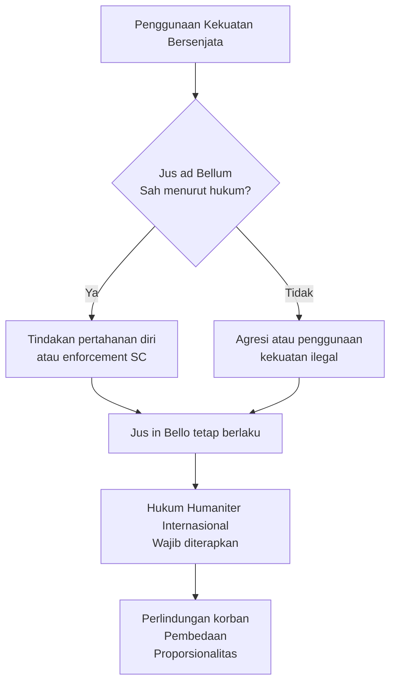
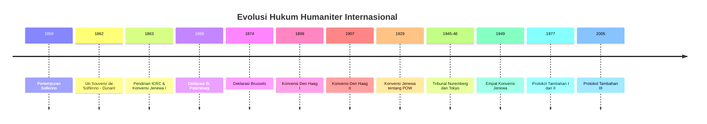

# Hukum Humaniter Internasional

## Tujuan Pembelajaran

Setelah menyelesaikan modul ini, mahasiswa diharapkan mampu: (1) mengidentifikasi dan menjelaskan definisi, ruang lingkup, serta perkembangan historis hukum humaniter internasional sebagai cabang khusus dari hukum internasional publik yang mengatur perlindungan korban konflik bersenjata; (2) membedakan dengan jelas antara konsep jus ad bellum (keabsahan ketika negara dapat melakukan perang) dan jus in bello (tatacara melakukan perang sesuai dengan hukum), serta memahami bahwa hukum humaniter internasional berlaku terlepas dari keabsahan penggunaan kekuatan bersenjata dalam hukum internasional; (3) menganalisis keempat Konvensi Jenewa 1949 dan Protokol Tambahannya secara mendetail, termasuk mekanisme implementasi, perbedaan dalam cakupan, dan tanggung jawab negara-negara dalam pengesahan dan pelaksanaannya; (4) menerapkan prinsip-prinsip fundamental hukum humaniter internasional seperti prinsip pembedaan, proporsionalitas, kemanusiaan, dan kebutuhan militer ke dalam studi kasus konflik kontemporer dan menganalisis pelanggaran-pelanggaran yang mungkin terjadi; (5) mengevaluasi peran dan fungsi Komite Internasional Palang Merah (ICRC) sebagai organisasi kemanusiaan yang mandiri dan berperan penting dalam penegakan norma-norma hukum humaniter internasional di lapangan; (6) mengidentifikasi kategori senjata yang dilarang berdasarkan perjanjian internasional dan prinsip-prinsip kemanusiaan, serta memahami mekanisme pengawasan dan penegakan larangan tersebut; (7) menganalisis tantangan-tantangan kontemporer dalam penerapan hukum humaniter internasional termasuk peperangan siber, senjata otonom, peperangan asimetris, dan keterlibatan perusahaan militer swasta dalam konflik bersenjata modern.

## Pendahuluan

Hukum humaniter internasional adalah cabang khusus dari hukum internasional yang berkembang secara gradual melalui pengalaman tragis kemanusiaan dalam berbagai konflik bersenjata sepanjang sejarah. Asal-usul modern dari hukum humaniter internasional dapat dilacak ke pertempuran Solferino yang terjadi pada tanggal 24 Juni 1859, merupakan pertempuran paling mengerikan yang pernah disaksikan Eropa pada waktu itu. Pertempuran ini melibatkan pasukan Prancis dan Italia di satu pihak melawan pasukan Austria di pihak lain dalam konteks perjuangan untuk penyatuan Italia. Dalam pertempuran ini, lebih dari 40.000 tentara tewas atau terluka dalam satu hari saja, dan kondisi-kondisi paling mengerikan menanti para korban yang tidak mendapatkan perawatan medis yang memadai.

Seorang saksi mata dari pertempuran Solferino adalah Henri Dunant, seorang pengusaha Swiss berjiwa sosial tinggi yang kebetulan melintas di daerah pertempuran. Dunant sangat terguncang menyaksikan penderitaan luar biasa dari korban-korban perang yang terlantar tanpa pertolongan medis. Dia kemudian mengorganisir penduduk lokal untuk memberikan bantuan kepada para korban, tanpa membedakan pihak mana yang mereka dukung sebelumnya. Pengalaman traumatis ini mendorong Dunant untuk menulis sebuah buku berjudul "Un Souvenir de Solférino" (Kenang-kenangan tentang Solferino) yang diterbitkan pada tahun 1862. Dalam karya monumental ini, Dunant mengusulkan gagasan revolusioner bahwa ada kebutuhan mendesak untuk membentuk organisasi-organisasi nasional yang dapat memberikan bantuan kemanusiaan kepada korban perang tanpa memandang kebangsaan atau afiliasi militer mereka.

Publikasi buku Dunant tersebut menginspirasi sejumlah tokoh menonjol termasuk Gustave Moynier dan Dr. Louis Appia untuk membentuk suatu komite kecil yang berguna untuk mempromosikan gagasan-gagasan Dunant. Pada tanggal 17 Februari 1863, sebuah pertemuan diselenggarakan di Jenewa yang memutuskan untuk mendirikan suatu organisasi internasional yang berdedikasi untuk mempromosikan kemanusiaan dalam perang. Organisasi ini kemudian dikenal sebagai Komite Internasional Palang Merah (International Committee of the Red Cross/ICRC), yang menerima status sebagai organisasi de facto pertama pada tahun 1863. Komite ini dibentuk dengan misi khusus untuk mendesak pemerintah-pemerintah agar mengadopsi perjanjian-perjanjian internasional yang melindungi para korban perang, dan untuk memastikan bahwa norma-norma kemanusiaan dihormati dalam setiap konflik bersenjata.

Sebagai hasil langsung dari upaya-upaya ICRC yang terus-menerus, pada tanggal 22 Agustus 1864, delegasi dari dua belas negara berkumpul kembali di Jenewa untuk mengadopsi Konvensi Jenewa pertama (Convention for the Amelioration of the Condition of the Wounded and Sick of Armies in the Field). Konvensi ini merupakan pencapaian luar biasa karena merupakan perjanjian internasional pertama yang secara tegas menetapkan perlindungan hukum untuk tentara yang terluka dan sakit di medan perang. Konvensi Jenewa 1864 menetapkan prinsip-prinsip fundamental termasuk perlakuan manusiawi terhadap para korban, penghormatan terhadap petugas medis dan fasilitas kesehatan, dan penggunaan lambang netral (salib merah) untuk menandakan perlindungan khusus. Meskipun teks asli Konvensi 1864 relatif singkat dan sederhana, dokumen ini menjadi fondasi bagi pengembangan seluruh sistem hukum humaniter internasional modern yang kemudian berkembang melalui berbagai konvensi dan protokol internasional.

## Jus ad Bellum vs Jus in Bello

Adalah penting untuk membedakan antara dua konsep berbeda namun saling terkait yang mengatur penggunaan kekuatan bersenjata dalam hukum internasional. Konsep pertama adalah jus ad bellum, yang berasal dari tradisi hukum dan filosofi Eropa abad pertengahan, mengacu pada pertanyaan hukum dan moral tentang kapan suatu negara boleh secara sah menggunakan kekuatan bersenjata terhadap negara lain. Pertanyaan-pertanyaan yang dijawab oleh jus ad bellum mencakup: apakah negara memiliki alasan yang sah untuk menggunakan kekuatan bersenjata? Apakah penggunaan kekuatan tersebut merupakan tindakan pertahanan diri yang diizinkan? Apakah penggunaan kekuatan telah disetujui oleh Dewan Keamanan PBB sebagai tindakan penegakan perdamaian internasional? Dalam konteks hukum internasional kontemporer, Piagam PBB 1945 merupakan dokumen yang menentukan standar-standar jus ad bellum melalui berbagai pasal-pasalnya.

Pasal 2 ayat (4) Piagam PBB secara tegas melarang semua anggota dari organisasi internasional tersebut untuk mengggunakan atau mengancam penggunaan kekuatan dalam cara apa pun yang bertentangan dengan tujuan-tujuan Perserikatan Bangsa-Bangsa. Larangan ini berlaku universal terhadap semua bentuk penggunaan kekuatan bersenjata terhadap integritas teritorial atau kemerdekaanpolitik negara mana pun. Namun demikian, Pasal 51 Piagam PBB mengakui hak inheren dari setiap negara untuk melakukan pertahanan diri apabila terjadi serangan bersenjata terhadapnya, baik pertahanan diri individual maupun pertahanan diri kolektif dalam kerangka aliansi internasional. Selanjutnya, Bab VII Piagam PBB memberikan otoritas kepada Dewan Keamanan untuk mengambil tindakan-tindakan enforcement termasuk penggunaan kekuatan bersenjata apabila Dewan Keamanan menentukan bahwa terdapat ancaman terhadap perdamaian, pelanggaran perdamaian, atau tindakan agresi yang memerlukan tindakan koersif internasional.

Konsep kedua adalah jus in bello, yang mengacu pada pertanyaan tentang bagaimana perang harus dilakukan sesuai dengan standar-standar hukum dan kemanusiaan, terlepas dari apakah perang itu sendiri sah atau tidak sah menurut hukum internasional. Dengan kata lain, jus in bello adalah tatacara—bagaimana cara melakukan operasi militer—sedangkan jus ad bellum adalah pertanyaan tentang substansi—apakah negara boleh memulai konflik bersenjata. Prinsip-prinsip jus in bello mencakup: pembedaan antara target militer dan target sipil, kewajiban untuk meminimalkan kerugian sipil yang tidak perlu, penglarangan penggunaan metode peperangan yang menyebabkan penderitaan yang berlebihan, dan kewajiban untuk memberikan perlakuan manusiawi kepada mereka yang tidak lagi mengambil bagian aktif dalam pertempuran termasuk tentara yang terluka, sakit, atau tertangkap.

Aspek yang sangat penting dari hukum humaniter internasional adalah bahwa hukum ini berlaku terlepas sepenuhnya dari masalah jus ad bellum. Ini berarti bahwa bahkan apabila suatu negara dianggap telah melanggar Pasal 2(4) Piagam PBB dengan menginisiasi penggunaan kekuatan bersenjata yang tidak sah, negara tersebut tetap terikat oleh kewajiban-kewajiban hukum humaniter internasional dalam cara mereka melakukan operasi militer mereka. Sebaliknya, negara yang melakukan pertahanan diri yang sah juga tetap terikat oleh standar-standar hukum humaniter internasional yang sama. Prinsip ini dikenal sebagai prinsip "netralitas" dari hukum humaniter internasional—norma-norma kemanusiaan dalam peperangan bersifat netral dan tidak mengutamakan satu pihak daripada pihak lain dalam hal keabsahan penggunaan kekuatan. Hal ini memastikan bahwa standar-standar minimum perlindungan kemanusiaan selalu berlaku dalam setiap konflik bersenjata, terlepas dari konteks hukum internasional publik yang lebih luas mengenai keabsahan konflik tersebut.

## Sejarah Perkembangan Hukum Humaniter Internasional

Perkembangan hukum humaniter internasional adalah hasil dari serangkaian panjang upaya yang dilakukan oleh negara-negara, organisasi-organisasi internasional, dan berbagai aktor lainnya untuk menetapkan norma-norma universal yang melindungi mereka yang terkena dampak negatif dari konflik bersenjata. Awalnya, sebelum zaman modern, tidak terdapat sistem hukum yang komprehensif mengatur perilaku dalam perang, meskipun berbagai tradisi keagamaan dan budaya memiliki prinsip-prinsip tentang perilaku yang dapat diterima dalam pertempuran. Namun, revolusi industri dan perkembangan teknologi militer yang menyertai periode ini menghasilkan tingkat kekerasan dan kehancuran yang belum pernah terjadi sebelumnya dalam sejarah perang manusia.

Salah satu dokumen awal yang sangat berpengaruh dalam perkembangan hukum humaniter adalah Lieber Code (Instructions for the Government of Armies of the United States in the Field), yang diterbitkan pada tahun 1863 sebagai himpunan instruksi komprehensif yang mengatur perilaku tentara Amerika Serikat selama Perang Saudara Amerika. Lieber Code, yang dikodifikasi oleh Francis Lieber atas permintaan Presiden Abraham Lincoln, mengandung prinsip-prinsip penting mengenai perlakuan terhadap penduduk sipil, tawanan perang, prajurit yang terluka, dan penggunaan senjata. Meskipun Lieber Code awalnya hanya merupakan regulasi militer nasional dari Amerika Serikat, dokumen ini kemudian menjadi pengaruh besar pada pengembangan hukum internasional karena prinsip-prinsipnya yang masuk akal dan manusiawi. Lieber Code merupakan pengakuan pertama dalam bentuk yang terstruktur bahwa peperangan harus mengikuti batasan-batasan hukum dan kemanusiaan tertentu.

Pada tahun 1868, setelah Perang Austro-Prusia, delegasi dari negara-negara Eropa berkumpul di St. Petersburg untuk mengadopsi Deklarasi St. Petersburg (Declaration Renouncing the Use, in Time of War, of Explosive Projectiles under 400 Grammes Weight). Deklarasi ini merupakan perjanjian internasional pertama yang secara tegas melarang penggunaan jenis-jenis senjata tertentu yang dianggap menyebabkan penderitaan yang tidak perlu kepada tentara. Khususnya, Deklarasi St. Petersburg melarang penggunaan peluru yang meledak (exploding bullets) dengan berat di bawah 400 gram dalam peperangan. Meskipun pembatasan spesifik ini mungkin tampak teknis, makna filosofis dari deklarasi ini jauh lebih dalam—ini adalah pengakuan internasional pertama bahwa ada batas-batas moral dan hukum terhadap metode-metode peperangan, bahkan ketika hal-hal tersebut secara teknis efektif dalam tujuan militer mereka.

Kemajuan selanjutnya terjadi pada tahun 1874 ketika delegasi dari berbagai negara berkumpul di Brussels (Brussels Conference of 1874) untuk merumuskan suatu proyeksi komprehensif tentang hukum peperangan yang lebih lengkap dibandingkan upaya-upaya sebelumnya. Meskipun Brussels Declaration ini tidak pernah secara resmi diratifikasi oleh negara-negara peserta, dokumen ini menjadi sangat berpengaruh dalam membentuk praktik-praktik internasional dan menjadi landasan bagi pengembangan konvensi-konvensi internasional berikutnya. Brussels Declaration berisi aturan-aturan rinci mengenai pembedaan antara kombatan dan penduduk sipil, perlakuan terhadap tawanan perang, penggunaan bendera putih, dan berbagai aspek lainnya dari apa yang kemudian dikenal sebagai "hukum Jenewa" dan "hukum Den Haag."

Konvensi-Konvensi Den Haag 1899 dan 1907 merepresentasikan langkah maju yang sangat signifikan dalam kodifikasi hukum peperangan internasional. Konvensi Den Haag 1899 diselenggarakan setelah Perang Boer dan mempertimbangkan pelajaran-pelajaran yang diperoleh dari konflik-konflik terbaru. Konvensi ini menghasilkan beberapa perjanjian penting termasuk yang menggatur peluncuran proyektil dan bahan peledak dari balon udara, penggunaan meriam yang menembakkan gas berbahaya, dan berbagai aspek hukum peperangan lainnya. Konvensi Den Haag 1907 kemudian memperluas dan memperbaharui kerangka kerja hukum peperangan dengan menambahkan rincian yang lebih besar dan cakupan yang lebih luas. Konvensi Den Haag 1907 terdiri dari beberapa teks termasuk Regulasi Hukum dan Kebiasaan Perang di Darat (Regulations Respecting the Laws and Customs of War on Land), yang menjadi fondasi dari hukum peperangan darat modern.

Upaya untuk memperkuat perlindungan bagi tawanan perang berlanjut, dan pada tahun 1929, suatu Konvensi Jenewa diselenggarakan khusus untuk menetapkan standar-standar yang lebih ketat untuk perlakuan terhadap tawanan perang. Konvensi Jenewa 1929 tentang Perlakuan Tawanan Perang melengkapi Konvensi Jenewa 1864 tentang luka dan sakit dan menetapkan standar-standar yang lebih komprehensif. Namun, semua usaha-usaha sebelumnya untuk membatasi kekerasan dalam peperangan terbukti tidak cukup untuk mengatasi kekejaman-kekejaman luar biasa yang terjadi selama Perang Dunia Kedua (1939-1945).

Setelah Perang Dunia Kedua berakhir, komunitas internasional mengakui kebutuhan mendesak untuk menetapkan sistem hukum internasional yang lebih kuat untuk mencegah pengulangan atrositas-atrositas yang telah dilakukan. Tribunal Nuremberg (International Military Tribunal untuk Jerman) dan Tribunal Tokyo (International Military Tribunal untuk Jepang) didirikan untuk mengadili para pemimpin militer dan sipil yang dianggap bertanggung jawab atas kejahatan-kejahatan perang dan kejahatan terhadap kemanusiaan. Kedua tribunal ini memainkan peran historis yang sangat penting dalam menetapkan preseden-preseden hukum penting dan dalam menunjukkan bahwa individu-individu, termasuk pemimpin negara, dapat dimintai pertanggungjawaban atas pelanggaran-pelanggaran serius terhadap hukum perang. Jurisprudensi dari Tribunal Nuremberg dan Tribunal Tokyo menjadi landasan konseptual bagi pengembangan konsep modern tentang kejahatan perang dan pertanggungjawaban individu dalam hukum internasional.

Dalam upaya untuk menghadapi kelemahan-kelemahan yang diidentifikasi dari sistem perlindungan sebelumnya, para delegasi dari berbagai negara berkumpul di Jenewa pada tahun 1949 untuk mengadopsi empat Konvensi Jenewa yang komprehensif yang menggantikan dan memperluas perjanjian-perjanjian sebelumnya. Keempat Konvensi Jenewa 1949 ini menjadi tulang punggung dari sistem hukum humaniter internasional modern dan tetap menjadi instrumen-instrumen hukum internasional yang paling penting dan paling banyak diratifikasi dalam sejarah hubungan internasional. Konvensi-konvensi ini mencakup perlindungan bagi luka dan sakit di darat, luka dan sakit di laut, tawanan perang, dan penduduk sipil dalam waktu perang.

Namun, pengalaman dari berbagai konflik bersenjata yang terjadi setelah 1949 menunjukkan kebutuhan untuk lebih lanjut memperkuat dan memperluas sistem perlindungan yang telah ditetapkan dalam Konvensi-Konvensi Jenewa 1949. Hal ini menyebabkan diselenggarakannya Konferensi Diplomatik Internasional pada tahun 1977 yang menghasilkan dua Protokol Tambahan (Additional Protocols) untuk melengkapi Konvensi-Konvensi Jenewa 1949. Protokol Tambahan I pada tahun 1977 memperkuat perlindungan bagi korban-korban konflik bersenjata internasional (International Armed Conflicts/IAC), sementara Protokol Tambahan II tahun 1977 memperluas perlindungan kepada korban-korban konflik bersenjata non-internasional (Non-International Armed Conflicts/NIAC) seperti perang saudara dan pemberontakan bersenjata. Pada tahun 2005, suatu Protokol Tambahan III disahkan untuk menambahkan lambang kemanusiaan ketiga (kristal merah) sebagai alternatif dari salib merah dan bulan merah yang sebelumnya digunakan.

## Konvensi Jenewa 1949

Keempat Konvensi Jenewa yang diadopsi pada tahun 1949 merepresentasikan pencapaian luar biasa dalam kodifikasi hukum internasional humaniter dan menjadi instrumen-instrumen hukum paling universal dan paling penting dalam sejarah perjanjian internasional. Setiap dari keempat konvensi ini dirancang untuk memberikan perlindungan kepada kategori-kategori tertentu dari para korban konflik bersenjata, dan bersama-sama mereka membentuk suatu sistem komprehensif yang mencakup hampir semua aspek dari perlindungan kemanusiaan dalam peperangan.

Konvensi Jenewa Pertama tentang Peningkatan Nasib Tentara yang Terluka dan Sakit di Lapangan (Convention for the Amelioration of the Condition of the Wounded and Sick Members of Armed Forces in the Field) terdiri dari 64 pasal dan membangun atas fondasi yang diletakkan oleh Konvensi Jenewa pertama tahun 1864. Konvensi ini mengatur perlindungan bagi tentara yang terluka atau sakit di medan perang, memastikan bahwa mereka menerima perawatan medis dan perlakuan manusiawi terlepas dari kebangsaan atau afiliasi mereka. Konvensi Jenewa I menetapkan bahwa petugas medis, fasilitas kesehatan, dan angkutan medis dilindungi secara khusus dan tidak boleh menjadi target serangan, dengan kondisi bahwa fasilitas-fasilitas ini menampilkan lambang salib merah putih sebagai tanda netralan mereka. Konvensi ini juga menetapkan kewajiban bagi pihak-pihak yang bertikai untuk mengumpulkan dan merawat luka dan sakit tanpa membedakan pihak, dan untuk memfasilitasi kegiatan-kegiatan kemanusiaan organisasi-organisasi netral seperti Komite Internasional Palang Merah.

Konvensi Jenewa Kedua tentang Peningkatan Nasib Tentara yang Terluka, Sakit dan Kapal Karam di Laut (Convention for the Amelioration of the Condition of Wounded, Sick and Shipwrecked Members of Armed Forces at Sea) terdiri dari 63 pasal dan merupakan perpanjangan dari Konvensi Jenewa Pertama tetapi diterapkan pada konteks peperangan maritim. Konvensi ini memberikan perlindungan yang sama kepada tentara yang terluka, sakit, atau selamat dari kapal yang tenggelam di laut seperti yang diberikan oleh Konvensi Jenewa I kepada tentara yang terluka di darat. Konvensi Jenewa II mengakui tantangan-tantangan unik dari peperangan maritim dan menetapkan kewajiban-kewajiban khusus bagi kapal-kapal pihak yang bertikai untuk mencari, mengumpulkan, dan merawat tentara yang terluka atau sakit di laut. Konvensi ini juga memperluas perlindungan kepada tentara-tentara yang selamat dari kapal yang tenggelam atau ditenggelamkan, memastikan bahwa mereka dilindungi dan dirawat sesuai dengan standar-standar kemanusiaan.

Konvensi Jenewa Ketiga tentang Perlakuan Tawanan Perang (Convention Relative to the Treatment of Prisoners of War) adalah yang paling panjang dan paling komprehensif dari keempat konvensi, terdiri dari 143 pasal yang mengatur hampir setiap aspek dari penangkapan, penahanan, dan perlakuan tawanan perang. Konvensi ini menetapkan bahwa tawanan perang harus diperlakukan dengan hormat terhadap martabat mereka sebagai manusia dan tidak boleh dikenakan kekerasan, ancaman, penghinaan, atau tindakan koersif apapun. Konvensi Jenewa III memerlukan bahwa tawanan perang disediakan dengan makanan, pakaian, tempat tinggal, dan perawatan medis yang cukup, dan bahwa mereka tidak boleh digunakan untuk pekerjaan-pekerjaan yang dianggap membahayakan atau merendahkan. Konvensi ini juga menetapkan hak-hak tawanan perang untuk berkomunikasi dengan keluarga mereka, menerima bantuan kemanusiaan, dan di akhir perang, untuk dikembalikan ke negara mereka sendiri.

Konvensi Jenewa Keempat tentang Perlindungan Penduduk Sipil dalam Waktu Perang (Convention Relative to the Protection of Civilian Persons in Time of War) terdiri dari 159 pasal dan merupakan konvensi paling kompleks dari keempatnya karena harus mempertimbangkan berbagai situasi yang dihadapi oleh penduduk sipil dalam konflik bersenjata yang intensif. Konvensi Jenewa IV memberikan perlindungan kepada semua orang yang tidak berpartisipasi atau telah menghentikan partisipasi aktif dalam pertempuran, termasuk penduduk sipil dari negara musuh yang berada di wilayah negara musuh. Konvensi ini membahas berbagai situasi termasuk perlakuan terhadap penduduk sipil yang ditahan, perlindungan penduduk sipil dalam wilayah yang diduduki, kewajiban-kewajiban dari otoritas pendudukan, pembatasan terhadap tindakan-tindakan pembalasan terhadap penduduk sipil, dan pembatasan terhadap pergerakan penduduk sipil. Konvensi Jenewa IV juga menetapkan perlindungan khusus untuk anak-anak, perempuan hamil, ibu menyusui, dan orang-orang yang memerlukan perawatan medis khusus.

Dari keempat konvensi ini, ada beberapa pasal yang sama dalam semua empat—yang dikenal sebagai "Pasal Umum" (Common Articles)—yang menerapkan standar-standar minimum untuk semua situasi konflik bersenjata. Pasal Umum 1 dalam semua keempat konvensi mewajibkan negara-negara untuk "menghormati dan memastikan penghormatan" terhadap konvensi-konvensi ini dalam segala keadaan. Ini berarti bahwa negara-negara tidak hanya wajib untuk mematuhi konvensi-konvensi dalam tindakan-tindakan mereka sendiri tetapi juga memiliki tanggung jawab untuk memastikan bahwa negara-negara lain dan bahkan kelompok-kelompok bersenjata non-negara yang berada di bawah kendali mereka juga mematuhi konvensi-konvensi tersebut. Pasal Umum 2 dalam semua keempat konvensi menyatakan bahwa konvensi-konvensi ini berlaku dalam semua kasus konflik bersenjata internasional, bahkan apabila salah satu pihak yang bertikai tidak mengakui keadaan perang atau tidak mengakui pihak-pihak lain sebagai belligerent yang sah.

Pasal Umum 3 adalah pasal yang paling penting karena memberikan standar-standar minimum untuk situasi konflik bersenjata non-internasional. Pasal Umum 3 yang terdapat dalam semua keempat konvensi menetapkan bahwa dalam hal konflik bersenjata yang tidak bersifat internasional (seperti perang saudara atau pemberontakan bersenjata), setiap pihak yang terlibat dalam konflik berkewajiban untuk memperlakukan mereka yang tidak berpartisipasi aktif dalam pertempuran dengan manusiawi. Khususnya, Pasal Umum 3 melarang pembunuhan, penyiksaan, penghambatan kesehatan, penghinaan pribadi, hukuman tanpa pengadilan, dan perampasan harta benda yang dilakukan untuk alasan pribadi. Pasal Umum 3 juga menetapkan bahwa tentara yang terluka dan sakit harus dikumpulkan dan dirawat, bahwa pihak-pihak yang bertikai harus berusaha untuk mengakhiri musibah dengan memberikan kesempatan kepada Komite Internasional Palang Merah untuk melakukan kunjungan kemanusiaan, dan bahwa pengiriman bantuan kemanusiaan tidak boleh ditolak.

| Aspek | Konvensi I | Konvensi II | Konvensi III | Konvensi IV |
|-------|-----------|-----------|-------------|-----------|
| **Fokus Utama** | Luka/sakit darat | Luka/sakit laut | Tawanan perang | Penduduk sipil |
| **Jumlah Pasal** | 64 | 63 | 143 | 159 |
| **Tahun Diadopsi** | 1949 | 1949 | 1949 | 1949 |
| **Kategori Perlindungan** | Tentara luka/sakit | Tentara luka/sakit/korban kapal | POW (tawanan perang) | Semua sipil |
| **Lambang Utama** | Salib Merah | Salib Merah | Salib Merah | Salib Merah |
| **Lingkup Geografis** | Darat | Laut | Seluruh wilayah | Seluruh wilayah |
| **Ratifikasi Global** | Universal | Universal | Universal | Universal |

## Protokol Tambahan

Meskipun Konvensi-Konvensi Jenewa 1949 merupakan pencapaian yang luar biasa, pengalaman-pengalaman dari berbagai konflik bersenjata yang terjadi setelah 1949 mengungkapkan bahwa terdapat celah-celah penting dalam perlindungan yang mereka sediakan, khususnya sehubungan dengan konflik-konflik bersenjata yang tidak bersifat internasional (non-international armed conflicts). Banyak konflik yang terjadi di sepanjang periode Perang Dingin dan sesudahnya merupakan konflik-konflik internal, termasuk perang-perang saudara, pemberontakan, dan perjuangan untuk kemerdekaan, yang memiliki karakteristik-karakteristik berbeda dari konflik-konflik internasional tradisional antara negara-negara.

Protokol Tambahan I yang diadopsi pada tahun 1977 dirancang untuk melengkapi dan memperkuat Konvensi-Konvensi Jenewa 1949 dalam konteks konflik-konflik bersenjata internasional. Protokol Tambahan I mengandung 102 pasal dan mencakup berbagai topik termasuk penentuan sifat dari konflik bersenjata internasional, perluasan definisi dari "tawanan perang," perlindungan yang ditingkatkan untuk tentara yang terluka dan sakit, dan perlindungan terhadap penduduk sipil. Protokol Tambahan I juga memperkenalkan konsep-konsep penting seperti prinsip pembedaan (distinction) antara target militer dan target sipil, prinsip proporsionalitas yang mengharuskan bahwa kerugian sipil yang diharapkan tidak harus berlebihan dibandingkan dengan keuntungan militer yang konkret yang diantisipasi, dan prinsip pengambilan tindakan pencegahan untuk meminimalkan kerugian sivil. Protokol Tambahan I juga memperluas perlindungan kepada individu-individu yang dianggap tidak lagi berpartisipasi dalam pertempuran tetapi belum secara resmi ditangkap atau diseret ke dalam status tawanan perang yang formal, kategori yang dikenal sebagai "orang-orang yang jatuh ke tangan musuh" (persons hors de combat).

Protokol Tambahan II yang juga diadopsi pada tahun 1977 mengandung 28 pasal dan dirancang khusus untuk memberikan perlindungan kepada korban-korban konflik bersenjata non-internasional. Protokol Tambahan II memperluasan standar-standar minimum yang ditetapkan dalam Pasal Umum 3 dari Konvensi-Konvensi Jenewa 1949 dan memberikan perlindungan yang lebih rinci kepada berbagai kategori korban dalam situasi perang saudara dan pemberontakan bersenjata. Protokol Tambahan II menetapkan kewajiban-kewajiban yang lebih spesifik bagi pihak-pihak yang terlibat dalam NIAC, termasuk perlakuan manusiawi terhadap mereka yang tidak lagi berpartisipasi dalam pertempuran atau telah ditangkap, perlindungan bagi anak-anak yang memerlukan bantuan khusus, dan jaminan-jaminan minimum untuk individu-individu yang ditangani oleh otoritas pemerintah. Protokol Tambahan II juga membahas masalah-masalah internal keamanan negara dan pembedaan antara combatan dan non-combatan dalam konteks NIAC, yang jauh lebih rumit dibandingkan dalam konteks konflik-konflik internasional tradisional.

Pada tahun 2005, lebih dari dua puluh tahun setelah diadopsinya Protokol Tambahan I dan II, komunitas internasional mengadopsi Protokol Tambahan III (Additional Protocol III to the Geneva Conventions). Protokol ini merupakan instrumen yang relatif singkat yang mengaitkan pengenalan lambang kemanusiaan ketiga—Kristal Merah—yang dapat digunakan sebagai alternatif dari Salib Merah (yang menjadi simbol dominan dari organisasi-organisasi kemanusiaan Eropa dan Amerika) dan Bulan Merah (yang digunakan oleh organisasi-organisasi di negara-negara Muslim). Kristal Merah diakui sebagai lambang yang netral dari perspektif budaya dan agama dan memungkinkan organisasi-organisasi kemanusiaan di negara-negara di mana Salib Merah atau Bulan Merah memiliki konnotasi-konnotasi keagamaan atau militer untuk menggunakan lambang alternatif.

Komplementer dengan Protokol-Protokol Tambahan, Komite Internasional Palang Merah pada tahun 2005 menyelesaikan Studi Kebiasaan Hukum Humaniter Internasional yang komprehensif, yang dikenal sebagai Studi ICRC tentang Hukum Humaniter Kebiasaan (ICRC Customary International Humanitarian Law Study). Studi ini, yang disusun oleh Jean-Marie Henckaerts dan Louise Doswald-Beck, mengidentifikasi 161 aturan hukum humaniter internasional yang bersifat kebiasaan, artinya aturan-aturan ini diterima dan diterapkan oleh negara-negara di seluruh dunia sebagai bagian dari hukum internasional kebiasaan meskipun tidak semua negara secara formal telah meratifikasi perjanjian-perjanjian internasional yang mencakup aturan-aturan tersebut. Penelitian ICRC ini sangat penting karena menunjukkan bahwa banyak dari standar-standar paling penting dalam hukum humaniter internasional memiliki status kebiasaan dan oleh karena itu mengikat semua negara, bahkan mereka yang belum meratifikasi Konvensi-Konvensi Jenewa atau Protokol-Protokol Tambahan.

## Prinsip-Prinsip Dasar Hukum Humaniter Internasional

Hukum humaniter internasional dibangun atas serangkaian prinsip-prinsip fundamental yang memberikan kerangka kerja konseptual dan praktis untuk penerapannya dalam berbagai situasi konflik bersenjata. Prinsip-prinsip ini dikembangkan secara gradual melalui pengalaman dari berbagai konflik bersenjata, perundingan diplomatik, dan refleksi para ahli hukum internasional atas apa yang diperlukan untuk menjaga standar-standar kemanusiaan minimum dalam peperangan. Pemahaman yang mendalam tentang prinsip-prinsip dasar ini adalah penting bagi setiap individu yang terlibat dalam operasi-operasi militer, penegakan hukum, atau pekerjaan kemanusiaan dalam konteks konflik bersenjata.

Prinsip pembedaan (principle of distinction) adalah salah satu prinsip paling fundamental dalam hukum humaniter internasional dan diartikulasikan secara eksplisit dalam Pasal 48 dari Protokol Tambahan I. Prinsip ini memerlukan bahwa dalam setiap operasi militer, pihak-pihak yang bertikai harus membedakan antara orang-orang dan benda-benda yang digunakan oleh pihak lawan, di satu pihak, dan penduduk sipil dan benda-benda sipil, di pihak lain. Prinsip pembedaan mengharuskan bahwa serangan-serangan militer hanya boleh ditujukan kepada target-target militer yang jelas dan dapat diidentifikasi, seperti tentara-tentara yang secara aktif terlibat dalam pertempuran, instalasi-instalasi militer yang digunakan untuk operasi-operasi militer, atau benda-benda sipil yang memberikan kontribusi efektif terhadap aksi militer. Penduduk sipil, di sisi lain, tidak boleh menjadi target dari serangan militer, dan benda-benda sipil seperti rumah-rumah tempat tinggal, sekolah-sekolah, rumah sakit, dan infrastruktur sipil lainnya tidak boleh ditargetkan kecuali jika benda-benda tersebut menjadi target-target militer yang sah karena fungsi mereka dalam membuat kontribusi efektif terhadap aksi militer.

Prinsip pembedaan memiliki dua dimensi yang saling berhubungan: pembedaan antara kombatan dan non-kombatan, dan pembedaan antara target-target militer dan benda-benda sipil. Pembedaan antara kombatan dan non-kombatan memerlukan bahwa tentara dan anggota-anggota kelompok bersenjata yang secara aktif terlibat dalam pertempuran dapat menjadi target dari serangan-serangan militer, tetapi penduduk sipil tidak boleh ditargetkan secara sengaja. Hal ini bermakna bahwa apabila penduduk sipil berada di lokasi target-target militer, mereka tidak boleh ditargetkan secara sengaja, meskipun beberapa kerugian sipil yang tidak disengaja mungkin terjadi sebagai hasil sampingan dari serangan yang ditujukan terhadap target-target militer yang sah. Pembedaan antara target-target militer dan benda-benda sipil memerlukan bahwa tentara harus menahan diri dari mengarahkan serangan mereka terhadap benda-benda sipil, bahkan apabila benda-benda tersebut dapat memberikan beberapa manfaat militer yang kecil. Misalnya, meskipun suatu rumah mungkin secara potensial dapat digunakan oleh tentara musuh, rumah tersebut tetap dianggap sebagai benda sipil yang tidak dapat ditargetkan kecuali jika telah secara nyata memberikan kontribusi efektif terhadap aksi militer musuh.

Prinsip proporsionalitas (principle of proportionality) adalah prinsip penting lainnya dalam hukum humaniter internasional, yang diartikulasikan secara eksplisit dalam Pasal 51 ayat (5) huruf (b) dari Protokol Tambahan I. Prinsip proporsionalitas memerlukan bahwa kerugian sipil yang diharapkan dari suatu operasi militer tidak boleh berlebihan dalam hal bentuk dibandingkan dengan keuntungan militer yang konkret yang diantisipasi. Dengan kata lain, bahkan apabila suatu operasi militer ditujukan kepada target-target militer yang sah, operasi tersebut tetap dapat dianggap sebagai serangan yang tidak proporsional dan oleh karena itu ilegal menurut hukum humaniter internasional apabila kerugian sipil yang diharapkan jauh melebihi keuntungan militer yang dapat diperoleh dari serangan tersebut.

Menerapkan prinsip proporsionalitas memerlukan suatu penilaian yang cermat dan kehati-hatian yang tinggi dari komandan-komandan militer. Komandan-komandan harus mempertimbangkan berbagai faktor termasuk: apakah target yang ditargetkan merupakan kontribusi efektif yang jelas terhadap aksi militer musuh; berapa banyak penduduk sipil yang mungkin berada di lokasi target; apakah ada metode-metode alternatif dari serangan yang akan menghasilkan kerugian sipil yang lebih rendah sambil tetap memperoleh keuntungan militer yang sama; dan tingkat derajat keuntungan militer yang diantisipasi. Penilaian proporsionalitas bukan merupakan perhitungan matematis yang murni tetapi lebih merupakan penilaian kualitatif yang mempertimbangkan konteks keseluruhan dari situasi militer.

Contoh dari penerapan prinsip proporsionalitas dapat dilihat dalam berbagai studi kasus dari konflik-konflik kontemporer. Dalam Konflik Gaza 2014 (Operation Protective Edge), berbagai laporan internasional termasuk laporan dari Perserikatan Bangsa-Bangsa menginvestigasi apakah serangan-serangan Israel terhadap lokasi-lokasi yang dianggap mengandung target-target militer Hamas telah mematuhi prinsip proporsionalitas. Dalam beberapa kasus, laporan-laporan tersebut menemukan bahwa kerugian sipil yang terjadi mungkin telah berlebihan dibandingkan dengan keuntungan militer yang diperoleh, khususnya dalam hal serangan-serangan terhadap bangunan-bangunan perumahan yang dianggap mengandung pejabat-pejabat atau instalasi-instalasi Hamas.

Prinsip kebutuhan militer (principle of military necessity) adalah konsep yang bermakna ganda dalam hukum humaniter internasional dan memerlukan pemahaman yang hati-hati. Di satu pihak, prinsip kebutuhan militer mengakui bahwa dalam konteks peperangan, pihak-pihak yang bertikai memiliki hak untuk menggunakan kekerasan bersenjata untuk mencapai tujuan-tujuan militer mereka, termasuk menghancurkan kekuatan militer musuh. Namun, di pihak lain, prinsip ini juga menetapkan batasan-batasan: kekerasan bersenjata hanya boleh digunakan dalam jumlah yang diperlukan untuk mencapai tujuan-tujuan militer tersebut, dan metode-metode peperangan yang menyebabkan penderitaan yang tidak perlu atau yang tidak memberikan manfaat militer yang jelas tidak boleh digunakan. Lieber Code, dokumen awal yang sangat berpengaruh dalam perkembangan hukum humaniter, merumuskan prinsip ini dengan menyatakan bahwa "penderitaan yang tidak perlu tidak boleh ditimbulkan bahkan dalam pemaksaan kepatuhan terhadap hukum perang."

Prinsip kemanusiaan (principle of humanity) adalah prinsip yang paling fundamental dan umum dalam hukum humaniter internasional, mendasari semua prinsip-prinsip lainnya. Prinsip kemanusiaan merefleksikan keyakinan dasar bahwa semua manusia, terlepas dari afiliasi militer mereka atau status mereka dalam konflik bersenjata, memiliki martabat yang inheren dan berhak untuk menerima perlakuan yang manusiawi. Prinsip kemanusiaan diartikulasikan dalam formulasi yang indah dalam Klausul Martens (Martens Clause), yang pertama kali muncul dalam Preambul dari Regulasi Hukum dan Kebiasaan Perang di Darat (Hague Regulations) tahun 1907. Klausul Martens menyatakan bahwa: "dalam kasus-kasus yang tidak disertakan dalam pengaturan-pengaturan sebelumnya, penduduk dan kombatan tetap di bawah perlindungan dan penguasaan prinsip-prinsip hukum bangsa-bangsa, seperti yang berasal dari kebiasaan yang telah didirikan, dari prinsip-prinsip kemanusiaan, dan dari persyaratan-persyaratan nurani publik."

Klausul Martens adalah signifikan karena mengakui bahwa hukum humaniter internasional tidak dapat mengantisipasi setiap situasi yang mungkin timbul dalam peperangan, dan oleh karena itu, ketika situasi-situasi baru timbul yang tidak secara eksplisit diatur oleh perjanjian-perjanjian internasional, prinsip-prinsip kemanusiaan yang lebih umum tetap berlaku. Klausul Martens telah disebut sebagai "jantung" dari hukum humaniter internasional karena mengakui dimensi etis fundamental yang mendasari semua norma-norma hukum humaniter. Klausul ini juga memberikan fleksibilitas untuk perkembangan hukum humaniter seiring waktu, memungkinkan norma-norma baru untuk berkembang melalui praktik internasional dan perkembangan hukum kebiasaan tanpa memerlukan perubahan formal pada perjanjian-perjanjian internasional.

Prinsip pengambilan tindakan pencegahan dalam serangan (principle of precaution in attack) adalah prinsip penting lainnya yang diartikulasikan dalam Pasal 57 dari Protokol Tambahan I. Prinsip ini memerlukan bahwa dalam melakukan operasi-operasi militer, pihak-pihak yang bertikai harus mengambil tindakan-tindakan yang layak untuk memverifikasi bahwa target-target yang akan diserang adalah target-target militer yang sah dan bukan penduduk sipil atau benda-benda sipil. Prinsip pencegahan juga memerlukan bahwa pihak-pihak yang bertikai harus memilih metode-metode dan sarana-sarana peperangan yang akan meminimalkan kerugian-kerugian sipil yang tidak perlu. Apabila terdapat pilihan antara beberapa metode-metode militer yang akan menghasilkan keuntungan militer yang serupa, pihak-pihak yang bertikai diwajibkan untuk memilih metode yang akan menghasilkan kerugian sipil yang paling rendah.

Penerapan prinsip pencegahan dalam praktik memerlukan bahwa komandan-komandan militer menggunakan intelijen terbaik yang tersedia bagi mereka untuk mengidentifikasi target-target, bahwa mereka menggunakan teknologi pengamatan terbaik yang tersedia untuk membedakan antara kombinat dan non-kombinat, dan bahwa mereka menerima pelatihan yang memadai tentang kewajiban-kewajiban hukum humaniter. Dalam era modern, prinsip pencegahan telah menjadi lebih kompleks karena penggunaan dari operasi-operasi militer yang dilakukan dari jarak jauh, seperti serangan udara dari drone atau helikopter pertempuran, yang memerlukan identifikasi target berdasarkan intelijen video dan lainnya dari jarak jauh.

Prinsip larangan penderitaan yang tidak perlu (prohibition of unnecessary suffering) adalah prinsip yang diartikulasikan dalam Pasal 35 dari Protokol Tambahan I dan melarang penggunaan senjata, proyektil, materi, atau metode-metode peperangan yang menyebabkan penderitaan yang berlebihan atau luka-luka yang tidak perlu. Prinsip ini memiliki akar yang dalam dalam sejarah hukum humaniter dan dapat dilacak kembali ke Lieber Code dan berbagai perjanjian-perjanjian awal tentang hukum peperangan. Prinsip ini didasarkan pada pengakuan bahwa tujuan militer dari peperangan dapat dicapai tanpa menimbulkan penderitaan yang berlebihan kepada tentara-tentara musuh, dan bahwa penggunaan senjata-senjata yang menyebabkan penderitaan yang tidak perlu tidak memberikan keuntungan militer yang kompensatif.

## Perlindungan Korban Konflik Bersenjata

Perlindungan yang komprehensif terhadap berbagai kategori korban dari konflik bersenjata adalah inti dari hukum humaniter internasional, dan Konvensi-Konvensi Jenewa 1949 beserta Protokol-Protokol Tambahannya menetapkan standar-standar rinci untuk perlindungan setiap kategori. Kategori-kategori utama dari korban-korban yang paling memerlukan perlindungan khusus termasuk tawanan perang, penduduk sipil dalam situasi-situasi berbagai, dan mereka yang terluka atau sakit dari semua pihak yang bertikai.

Tawanan perang (prisoners of war/POWs) menerima perlindungan yang sangat komprehensif menurut Konvensi Jenewa Ketiga, yang mencakup 143 pasal yang menggatur hampir setiap aspek dari penangkapan, penahan, dan perlakuan mereka selama masa penahanan mereka. Pasal 4 dari Konvensi Jenewa III mendefinisikan siapa yang berhak untuk mendapatkan status sebagai tawanan perang, menetapkan bahwa anggota-anggota dari angkatan bersenjata pihak yang bertikai yang jatuh ke tangan musuh berhak untuk mendapatkan status POW dan semua perlindungan yang menyertai status tersebut. Definisi ini sangat penting karena individu-individu yang diberikan status POW mendapatkan perlakuan yang jauh lebih tinggi dibandingkan dengan individu-individu yang dianggap sebagai "fighter ilegal" atau "unlawful combatant" yang tidak memenuhi kriteria-kriteria untuk status POW.

Perlakuan tawanan perang diatur oleh Pasal 13 hingga Pasal 16 dari Konvensi Jenewa III, yang menetapkan bahwa tawanan perang harus diperlakukan dengan hormat terhadap martabat mereka sebagai manusia dan tidak boleh dikenakan kekerasan, ancaman, penghinaan, atau tindakan koersif apapun. Khususnya, tawanan perang tidak boleh disiksa, tidak boleh dipaksa memberikan informasi melampaui nama, pangkat, nomor identitas militer, dan tanggal kelahiran mereka, tidak boleh dijatuhi hukuman yang berlapis (double punishment), dan tidak boleh dikenakan represali atau tindakan pembalasan. Perlakuan manusiawi ini adalah prinsip fundamental yang dirancang untuk melindungi martabat dan kesejahteraan fisik dan mental dari tawanan perang, terlepas dari sifat musuh mereka atau seriusnya pelanggaran yang mungkin telah mereka lakukan.

Konvensi Jenewa III juga menetapkan hak-hak tawanan perang mengenai tempat tinggal, makanan, pakaian, dan perawatan medis. Pasal 25 menetapkan bahwa tawanan perang harus disediakan dengan makanan yang cukup dalam hal kualitas dan kuantitas untuk memelihara kesehatan mereka, dan bahwa isi kalori dari ransum makanan harus cukup untuk memelihara tentara dari pihak yang menangkap mereka. Tawanan perang juga harus disediakan dengan perlengkapan tidur dan tempat tinggal yang cukup, pakaian yang cocok untuk iklim, dan akses kepada fasilitas-fasilitas kebersihan. Pasal-pasal tentang perawatan medis menetapkan bahwa tawanan perang yang terluka atau sakit harus menerima perawatan medis yang sama seperti yang diberikan kepada tentara-tentara dari pihak yang menangkap mereka.

Konvensi Jenewa III juga mengatur penggunaan kerja tawanan perang dalam Pasal 49 hingga Pasal 57. Meskipun tawanan perang dapat diajak bekerja, kerja yang mereka lakukan harus tidak membahayakan kesehatan mereka, tidak boleh berhubungan langsung dengan operasi-operasi militer, dan mereka harus menerima pembayaran untuk kerja mereka. Kerja tawanan perang tidak boleh menjadi bentuk dari hukuman atau penghinaan, dan tawanan perang tidak boleh dipaksa bekerja dalam kondisi-kondisi yang berbahaya atau merendahkan.

Pasal-pasal mengenai repatriasi (pengiriman kembali ke negara asal) dalam Pasal 109 hingga Pasal 119 menetapkan bahwa tawanan pewar harus di-repatriasi dengan cepat dan tanpa penundaan yang tidak perlu setelah berakhirnya operasi-operasi militer. Repatriasi harus dilakukan sesuai dengan status kesehatan fisik dan mental dari individu, dengan prioritas diberikan kepada mereka yang terluka paling parah, paling sakit, atau yang memiliki masa penahanan paling lama. Prinsip repatriasi adalah penting karena mengakui bahwa penahanan dalam perang adalah situasi yang tidak normal dan tidak dapat diperpanjang secara tidak terbatas setelah berakhirnya konflik bersenjata.

Perlindungan penduduk sipil dalam Konvensi Jenewa IV adalah jauh lebih kompleks dibandingkan dengan perlindungan kategori-kategori lainnya karena penduduk sipil berada dalam berbagai situasi yang berbeda-beda dalam konflik bersenjata. Pasal 4 dari Konvensi Jenewa IV mendefinisikan "orang-orang yang dilindungi" (protected persons) sebagai mereka yang berada di tangan pihak musuh atau di tangan pihak yang penduduknya bukan pihak dari perjanjian, dengan beberapa pengecualian termasuk para diplomat dan anggota-anggota militer dari negara netral. Definisi ini dirancang untuk memastikan bahwa semua penduduk sipil, terlepas dari kebangsaan mereka, menerima perlindungan fundamental menurut konvensi, bahkan apabila kebangsaan mereka adalah kebangsaan dari negara musuh.

Konvensi Jenewa IV mengatur berbagai situasi berbeda yang dihadapi oleh penduduk sipil termasuk perlakuan terhadap penduduk sipil yang ditahan atau internirkan di wilayah musuh, perlindungan penduduk sipil dalam wilayah yang diduduki, perlindungan khusus untuk anak-anak dan perempuan hamil, dan larangan-larangan terhadap tindakan-tindakan tertentu yang menargetkan penduduk sipil. Pasal 27 menetapkan prinsip fundamental bahwa semua orang yang dilindungi harus diperlakukan dengan hormat terhadap martabat mereka, dan bahwa mereka tidak boleh dikenakan kekerasan, pelecehan, atau tindakan koersif apapun. Pasal 29 secara tegas melarang pembunuhan, tortur, hukuman yang berlapis, pembunuhan anak-anak sebagai tawanan, pengambilan sandera, mutilasi, percobaan medis, dan perawatan yang menyakitkan apabila diterapkan kepada penduduk sipil.

Ketika negara menduduki wilayah musuh atau ketika wilayah teritori mereka diduduki oleh musuh, terjadi situasi-situasi khusus yang mengharuskan perlakuan yang berbeda kepada penduduk sipil. Konvensi Jenewa IV, dalam Pasal 47 hingga Pasal 78, mengatur perlindungan penduduk sipil dalam wilayah yang diduduki. Pasal-pasal ini menetapkan bahwa otoritas pendudukan memiliki kewajiban untuk mempertahankan ketertiban publik dengan seminiimal mungkin gangguan kepada kehidupan normal dari penduduk sipil, bahwa otoritas pendudukan tidak boleh melakukan transfer penduduk sipil dari wilayah yang diduduki ke dalam wilayah pihak pendudukan, dan bahwa otoritas pendudukan harus memastikan bahwa makanan, bahan obat-obatan, dan pasokan-pasokan kesehatan yang cukup tersedia bagi penduduk sipil.

Larangan terhadap tindakan-tindakan pembalasan terhadap penduduk sipil adalah penting untuk memastikan bahwa penduduk sipil tidak menjadi korban dari tindakan-tindakan punitif yang dilakukan oleh pihak-pihak yang bertikai sebagai balasan terhadap tindakan-tindakan yang dilakukan oleh musuh. Pasal 33 dari Konvensi Jenewa IV dengan tegas melarang pembunuhan kolektif, pengancaman kolektif, pengambilan sandera, hukuman kolektif, dan represali terhadap penduduk sipil. Larangan ini mengakui bahwa penduduk sipil tidak seharusnya dimintai pertanggungjawaban atas tindakan-tindakan individu atau kelompok-kelompok tertentu, dan bahwa mereka tidak boleh dikenakan hukuman sebagai tindakan pembalasan atau cara untuk memaksa kepatuhan kepada hukum.

Perlindungan khusus diberikan kepada anak-anak dalam situasi-situasi konflik bersenjata. Pasal 24 dari Konvensi Jenewa IV menetapkan bahwa anak-anak, dengan pengecualian mereka yang kecil, harus dipisahkan dari orang-orang dewasa dan dirawat dengan cara yang sesuai dengan usia dan jenis kelamin mereka. Anak-anak harus terutama dilindungi terhadap kekerasan seksual, dan mereka harus diindoktrinasi dengan nilai-nilai dari pihak mereka saat ini dilarang. Protokol Tambahan I dan II memberikan perlindungan tambahan kepada anak-anak termasuk larangan pengrekrutan anak-anak di bawah usia lima belas tahun ke dalam angkatan bersenjata, meskipun usia ini telah ditingkatkan menjadi delapan belas tahun dalam Konvensi Hak-Hak Anak Protokol Opsional.

Perlindungan korban-korban yang terluka dan sakit dari semua pihak yang bertikai adalah fokus utama dari Konvensi Jenewa I dan II. Konvensi ini menetapkan bahwa tentara yang terluka atau sakit harus dikumpulkan dan dirawat segera setelah pertempuran berakhir, dan bahwa penyediaan perawatan medis tidak boleh dibedakan berdasarkan afiliasi pihak mereka. Pasal 19 dari Konvensi Jenewa I menetapkan bahwa fasilitas-fasilitas medis yang tetap dan mobile harus dilindungi dan tidak boleh menjadi target dari serangan-serangan militer, dengan kondisi bahwa fasilitas-fasilitas ini hanya digunakan untuk tujuan-tujuan medis dan bahwa mereka menampilkan lambang salib merah putih.

| Kategori Korban | Sumber Perlindungan | Perlindungan Utama | Status Hukum |
|-----------------|-------------------|-------------------|-------------|
| **Tawanan Perang** | GC III (143 pasal) | Perlakuan manusiawi, makanan, perawatan medis, repatriasi | Combatan hukum |
| **Penduduk Sipil** | GC IV (159 pasal) | Perlindungan dari kekerasan, akses pangan/medis, tidak ada represali | Non-combatan |
| **Luka/Sakit Darat** | GC I (64 pasal) | Perawatan medis, perlindungan fasilitas kesehatan | Terlepas status |
| **Luka/Sakit Laut** | GC II (63 pasal) | Perawatan medis maritim, penyelamatan | Terlepas status |
| **Personel Medis** | GC I-II, AP I | Status khusus, perlindungan dari target | Non-combatan |
| **Kapelain & Anggota Medis** | GC III-IV | Perlindungan dari penangkapan | Non-combatan |

## Senjata Terlarang

Hukum humaniter internasional menetapkan batasan-batasan yang sangat penting terhadap jenis-jenis senjata yang dapat digunakan dalam peperangan, berdasarkan prinsip-prinsip yang dikembangkan selama berabad-abad tentang perlindungan kemanusiaan dan larangan penderitaan yang tidak perlu. Prinsip fundamental yang mendasari larangan-larangan terhadap senjata tertentu adalah prinsip bahwa penderitaan yang tidak perlu tidak boleh ditimbulkan bahkan dalam pemaksaan kepatuhan terhadap tujuan-tujuan militer. Pasal 35 ayat (2) dari Protokol Tambahan I dengan tegas menyatakan bahwa adalah dilarang untuk menggunakan metode-metode atau sarana-sarana peperangan yang dimaksudkan untuk menyebabkan, atau yang dapat diperkirakan akan menyebabkan, penderitaan yang berlebihan atau yang tidak dapat diperbaiki.

Larangan terhadap berbagai jenis senjata memiliki sejarah yang panjang dalam hukum humaniter internasional. Regulasi Hukum dan Kebiasaan Perang di Darat (Hague Regulations) tahun 1907, yang merupakan salah satu dokumen paling penting dalam perkembangan hukum peperangan darat, menetapkan dalam Pasal 23 bahwa adalah dilarang untuk menggunakan hulu ledak yang meledak atau meluas dengan mudah dalam tubuh manusia, penggunaan bahan-bahan beracun, dan penggunaan proyektil-proyektil yang tidak dapat terdeteksi dengan sinar-X. Meskipun beberapa ketentuan ini telah diperbarui melalui perjanjian-perjanjian internasional yang lebih baru, prinsip fundamental dari pembatasan-pembatasan ini tetap berlaku dalam hukum humaniter kontemporer.

Konvensi tentang Senjata Tertentu (Convention on Certain Conventional Weapons) yang diadopsi pada tahun 1980 dan yang telah diubah beberapa kali sejak itu menetapkan kerangka kerja komprehensif untuk pembatasan-pembatasan terhadap berbagai kategori dari senjata konvensional. Konvensi ini mencakup lima protokol yang berlainan yang mengatur senjata-senjata spesifik dan metode-metode peperangan. Protokol I dari Konvensi tentang Senjata Tertentu mengatur penggunaan fragmen-fragmen yang tidak dapat dideteksi, yang dirancang untuk melarang penggunaan fragmen-fragmen dalam senjata yang tidak dapat diperhitungkan dengan sinar-X setelah tertanam dalam tubuh manusia, membuat pengangkatan fragmen-fragmen tersebut sangat sulit dalam situasi-situasi perawatan medis di lapangan. Protokol II mengatur pembatasan-pembatasan terhadap ranjau-ranjau darat dan ranjau-ranjau yang disesuaikan dengan ranjau anti-personel, dirancang untuk mengurangi penggunaan dari senjata-senjata ini yang menyebabkan penderitaan jangka panjang kepada penduduk sipil bahkan setelah berakhirnya konflik bersenjata. Protokol III mengatur penggunaan senjata-senjata api fosfor dan iluminasi. Protokol IV mengatur penggunaan senjata-senjata laser buta, yang dirancang untuk melarang penggunaan senjata-senjata laser yang dimaksudkan untuk menyebabkan kebutaan permanen. Protokol V, yang ditambahkan pada tahun 2003, menangani sisa-sisa perang yang meledak dan mengatur upaya-upaya untuk membersihkan ranjau-ranjau pasca-konflik.

Konvensi tentang Larangan Ranjau Anti-Personel (Convention on the Prohibition of Anti-Personnel Mines), juga dikenal sebagai Perjanjian Ottawa (Ottawa Treaty), yang diadopsi pada tahun 1997 merupakan salah satu pencapaian paling signifikan dalam upaya-upaya komunitas internasional untuk melarang senjata-senjata tertentu. Konvensi ini melarang penggunaan, penyimpanan, produksi, dan transfer dari ranjau-ranjau anti-personel, yang telah terbukti menyebabkan penderitaan jangka panjang yang luas kepada populasi sipil setelah berakhirnya konflik bersenjata. Ranjau-ranjau anti-personel adalah senjata-senjata yang sangat membedakan dari senjata-senjata lainnya karena kemampuan mereka untuk tetap aktif dan berbahaya selama beberapa dekade setelah ditempatkan, menyebabkan puluhan ribu korban di antara populasi sipil di berbagai negara tahun-tahun setelah berakhirnya konflik bersenjata.

Konvensi tentang Muatan Kluster (Convention on Cluster Munitions) yang diadopsi pada tahun 2008 melarang penggunaan, penyimpanan, produksi, dan transfer dari muatan-muatan kluster, yang merupakan senjata-senjata yang mengelepaskan sejumlah besar submunisi (bomblet kecil) di atas suatu area yang luas. Seperti ranjau-ranjau anti-personel, muatan-muatan kluster telah terbukti meninggalkan sejumlah besar submunisi yang tidak meledak setelah pertempuran berakhir, yang kemudian berfungsi secara efektif seperti ranjau-ranjau darat dalam mengganggu penggunaan sipil dari tanah dan menyebabkan cedera kepada penduduk sipil.

Konvensi tentang Senjata Kimia (Chemical Weapons Convention) yang diadopsi pada tahun 1993 melarang pengembangan, produksi, penyimpanan, dan penggunaan dari senjata-senjata kimia. Konvensi ini adalah salah satu instrumen disarmamen paling sukses dalam sejarah hubungan internasional, dengan hampir semua negara di dunia menjadi peserta. Larangan terhadap senjata-senjata kimia berdasarkan pada pengakuan universal bahwa penderitaan yang disebabkan oleh senjata-senjata kimia tidak dapat dibenarkan oleh keuntungan-keuntungan militer apapun.

Konvensi tentang Senjata Biologi (Biological Weapons Convention) yang diadopsi pada tahun 1972 melarang pengembangan, produksi, penyimpanan, dan penggunaan dari senjata-senjata biologi. Seperti senjata-senjata kimia, senjata-senjata biologi menyebabkan penderitaan yang tidak dapat dikendalikan dan tidak dapat dibedakan antara target-target militer dan penduduk sipil, dan oleh karena itu telah secara universal dilarang.

Masalah dari senjata-senjata nuklir adalah lebih kompleks dibandingkan dengan masalah-masalah senjata-senjata lainnya yang telah dilarang. Tidak ada perjanjian internasional komprehensif yang secara tegas melarang pengembangan atau penggunaan senjata-senjata nuklir, meskipun ada perjanjian-perjanjian yang membatasi penyebaran senjata-senjata nuklir (Non-Proliferation Treaty, 1970). Namun, dalam suatu Pendapat Nasihat (Advisory Opinion) pada tahun 1996, Mahkamah Internasional diajukan pertanyaan tentang legalitas menurut hukum internasional dari penggunaan atau ancaman penggunaan senjata-senjata nuklir. Dalam opininya, Mahkamah menyatakan bahwa senjata-senjata nuklir secara umum akan dianggap sebagai melanggar prinsip-prinsip hukum humaniter internasional karena perbedaan dan proporsionalitas, tetapi Mahkamah tidak dapat menyatakan secara definitif bahwa penggunaan senjata-senjata nuklir dalam keadaan-keadaan ekstrem dari pertahanan diri atas dasar kelangsungan hidup negara akan ilegal. Pendapat Nasihat Mahkamah Internasional ini mencerminkan ketegangan-ketegangan yang ada antara doktrin-doktrin pengalamanan deterrence nuklir dengan prinsip-prinsip hukum humaniter internasional.

Isu-isu yang muncul berkaitan dengan senjata-senjata otonom yang dapat mematikan (autonomous lethal weapons systems/LAWS) adalah salah satu tantangan-tantangan paling penting yang dihadapi oleh hukum humaniter internasional kontemporer. Senjata-senjata otonom adalah senjata-senjata yang dapat memilih dan mengejar target-target tanpa intervensi manusia, dan mereka menimbulkan pertanyaan-pertanyaan hukum dan etis yang mendalam. Apakah senjata-senjata otonom dapat memenuhi persyaratan-persyaratan untuk pembedaan antara target-target militer dan sipil? Apakah mereka dapat menerapkan prinsip-prinsip proporsionalitas? Apakah ada tanggung jawab yang jelas untuk cedera yang disebabkan oleh senjata-senjata otonom? Grup Ahli Pemerintah Internasional tentang Senjata-senjata Lethal Otonom (Group of Governmental Experts on Lethal Autonomous Weapons Systems) yang dibentuk di bawah kerangka kerja Konvensi tentang Senjata Tertentu telah mengadakan pertemuan-pertemuan yang berfokus pada isu-isu ini, meskipun hingga saat ini, tidak ada kesepakatan internasional tentang pembatasan-pembatasan spesifik terhadap LAWS.

| Jenis Senjata | Perjanjian/Konvensi | Tahun | Status |
|---------------|-------------------|------|--------|
| **Ranjau Anti-Personel** | Ottawa Treaty | 1997 | Larangan penuh |
| **Muatan Kluster** | CCM | 2008 | Larangan penuh |
| **Senjata Kimia** | CWC | 1993 | Larangan penuh |
| **Senjata Biologi** | BWC | 1972 | Larangan penuh |
| **Senjata Nuklir** | NPT | 1970 | Pembatasan penyebaran |
| **Fragmentasi Detektor** | CCW Protocol I | 1980 | Pembatasan |
| **Ranjau Teradaptasi** | CCW Protocol II | 1980 | Pembatasan |
| **Senjata Laser Buta** | CCW Protocol IV | 1995 | Larangan penuh |
| **Senjata Otonom** | CCW LAWS | Proses | Negosiasi berlangsung |

---

*Dokumen berlanjut pada bagian berikutnya: Konflik Bersenjata Internasional vs Non-Internasional, Pelanggaran Berat dan Penegakan, dan seterusnya...*

## Konflik Bersenjata Internasional vs Non-Internasional

Perbedaan antara konflik bersenjata internasional (International Armed Conflicts/IAC) dan konflik bersenjata non-internasional (Non-International Armed Conflicts/NIAC) adalah fundamental dalam hukum humaniter internasional karena penentuan sifat dari konflik bersenjata secara langsung menentukan standar-standar perlindungan yang berlaku dan instrumen-instrumen hukum yang dapat diterapkan. Pasal Umum 2 dalam Konvensi-Konvensi Jenewa 1949 mendefinisikan konflik bersenjata internasional sebagai "setiap perbedaan yang timbul antara dua atau lebih negara tinggi kontrak, bahkan apabila negara-negara tersebut tidak mengakui keadaan perang atau pihak-pihak lain sebagai belligerent yang sah."

Definisi ini signifikan karena memiliki implikasi-implikasi hukum yang penting: apabila konflik diklasifikasikan sebagai IAC, maka seluruh rezim dari Konvensi-Konvensi Jenewa 1949, Protokol Tambahan I, dan standar-standar hukum humaniter internasional yang paling komprehensif berlaku. Ini termasuk perlindungan penuh bagi tawanan perang menurut Konvensi Jenewa III, perlindungan lengkap bagi penduduk sipil menurut Konvensi Jenewa IV, dan penerapan semua prinsip-prinsip hukum humaniter yang telah dibahas di atas.

Sebaliknya, konflik bersenjata non-internasional didefinisikan secara berbeda dan melibatkan konflik-konflik antara pemerintah dan kelompok-kelompok bersenjata terorganisir atau antara kelompok-kelompok bersenjata terorganisir yang berbeda di dalam wilayah territorial suatu negara. Pasal Umum 3 dalam Konvensi-Konvensi Jenewa 1949 adalah instrumen hukum yang mengatur NIAC, dan pasal ini telah disebut sebagai "mini-konvensi" karena ia menetapkan standar-standar perlindungan minimum yang berlaku dalam semua NIAC tanpa tergantung pada apakah salah satu pihak yang bertikai mengakui keadaan perang atau tidak.

Dalam situasi NIAC, Pasal Umum 3 menetapkan bahwa setiap pihak yang terlibat dalam konflik berkewajiban untuk memperlakukan mereka yang tidak lagi berpartisipasi aktif dalam pertempuran dengan kemanusiaan. Pasal Umum 3 melarang pembunuhan, penyiksaan, penghambatan kesehatan, penghinaan pribadi, hukuman tanpa pengadilan, dan perampasan harta benda yang dilakukan untuk alasan pribadi. Pasal ini juga menetapkan bahwa tentara yang terluka dan sakit harus dikumpulkan dan dirawat, bahwa pihak-pihak yang bertikai harus berusaha untuk mengakhiri musibah dengan memberikan kesempatan kepada Komite Internasional Palang Merah untuk melakukan kunjungan kemanusiaan, dan bahwa pengiriman bantuan kemanusiaan yang imparcial tidak boleh ditolak.

Namun, perlindungan-perlindungan yang diatur dalam Pasal Umum 3 jauh lebih terbatas dibandingkan dengan perlindungan-perlindungan yang diatur dalam Konvensi-Konvensi Jenewa 1949 secara keseluruhan. Misalnya, Pasal Umum 3 tidak menetapkan status hukum khusus bagi tawanan perang NIAC yang setara dengan status POW dalam IAC, meskipun hal ini telah diubah sebagian oleh Protokol Tambahan II. Namun, Protokol Tambahan II, yang diadopsi pada tahun 1977 khusus untuk melengkapi Pasal Umum 3 dalam konteks NIAC, menetapkan standar-standar perlindungan yang lebih komprehensif.

Pertanyaan tentang bagaimana mengklasifikasikan konflik-konflik tertentu sebagai IAC atau NIAC telah menjadi salah satu masalah hukum yang paling kontroversial dalam praktik internasional kontemporer. Putusan yang sangat berpengaruh dalam hal ini adalah Putusan Ruang Banding dari Tribunal Pidana Internasional untuk Mantan Yugoslavia (ICTY Appeals Chamber Decision), terutama dalam kasus Prosecutor v. Tadić (1995), yang menetapkan kriteria-kriteria untuk menentukan kapan konflik bersenjata internal dapat diklasifikasikan sebagai IAC.

Dalam Putusan Tadić, ICTY menetapkan bahwa dua elemen-elemen harus ada untuk keberadaan dari suatu konflik bersenjata non-internasional: (1) intensitas pertempuran, dan (2) organisasi dari para pihak yang bertikai. Pengadilan menemukan bahwa intensitas dapat dievaluasi berdasarkan berbagai faktor termasuk intensitas dari konflik bersenjata, durasi dari pertempuran, jumlah korban, mobilisasi dari ketertiban militer, dan kerusakan-kerusakan yang dilakukan. Organisasi dapat dievaluasi berdasarkan ada atau tidaknya dari struktur-struktur komando, pembagian-pembagian wilayah, kehadiran dari regulasi internal, dan kapasitas untuk negosiasi. Standar Tadić ini telah menjadi acuan utama dalam mengevaluasi sifat dari konflik-konflik bersenjata modern.

Penerapan kriteria Tadić telah menghasilkan klasifikasi-klasifikasi yang menarik dalam konflik-konflik kontemporer. Dalam kasus konflik di Suriah, misalnya, Pemerintah Suriah dan berbagai kelompok pemberontak bersenjata telah bertikai sejak tahun 2011. Pertanyaan-pertanyaan tentang klasifikasi konflik ini telah muncul: apakah itu adalah NIAC antara pemerintah Suriah dan berbagai kelompok pemberontak? Atau apakah itu menjadi IAC ketika kekuatan-kekuatan internasional seperti Amerika Serikat, Rusia, dan kekuatan-kekuatan lainnya terlibat secara langsung dalam operasi-operasi militer di Suriah? Beberapa analisis telah menyimpulkan bahwa konflik Suriah mungkin mencakup elemen-elemen dari baik IAC maupun NIAC, dengan NIAC antara pemerintah dan kelompok-kelompok pemberontak berlangsung secara bersamaan dengan keterlibatan-keterlibatan IAC dari kekuatan-kekuatan internasional.

Situasi serupa telah timbul dalam konflik di Libya, di mana pemerintah internasional yang diakui dan berbagai milisi bersenjata telah bertikai untuk kontrol pemerintahan negara. Ketika negara-negara internasional seperti Prancis dan Amerika Serikat melakukan serangan udara atas nama pemerintah internasional yang diakui, pertanyaan-pertanyaan telah muncul tentang apakah keterlibatan-keterlibatan ini mengubah sifat dari konflik menjadi IAC.

| Aspek | Konflik Bersenjata Internasional (IAC) | Konflik Bersenjata Non-Internasional (NIAC) |
|-------|----------------------------------------|-------------------------------------------|
| **Definisi** | Antara dua atau lebih negara | Dalam satu negara antara pemerintah & kelompok/kelompok |
| **Sumber Hukum** | Pasal Umum 2 GC | Pasal Umum 3 GC & AP II |
| **Cakupan Perlindungan** | Penuh (4 GC, AP I) | Minimal (Pasal 3) atau lanjutan (AP II) |
| **Status POW** | Ya, formal dalam GC III | Tidak dalam Pasal 3; sebagian dalam AP II |
| **Pembedaan Belligerent** | Belligerent status resmi | Combatant vs non-combatant tidak jelas |
| **Peran Negara Ketiga** | IAC jika keterlibatan langsung | Dapat mengubah IAC jika keterlibatan resmi |
| **Komitmen Minimum** | Lengkap | Parsial (sering ditolak NIAC parties) |

## Pelanggaran Berat dan Penegakan

Pelanggaran-pelanggaran terhadap hukum humaniter internasional dapat diklasifikasikan ke dalam berbagai kategori, dengan "pelanggaran berat" (grave breaches) mewakili kategori yang paling serius karena dampaknya yang mengguncang dan karena kewajiban-kewajiban penegakan yang ketat yang melekat padanya. Pasal 50 dari Konvensi Jenewa I, Pasal 51 dari Konvensi Jenewa II, Pasal 130 dari Konvensi Jenewa III, dan Pasal 147 dari Konvensi Jenewa IV semuanya mendefinisikan "pelanggaran berat" dan membebankan kewajiban-kewajiban penegakan yang sama.

Menurut Pasal 50 dari Konvensi Jenewa I, pelanggaran-pelanggaran berat terhadap konvensi mencakup "pembunuhan yang disengaja, penyiksaan atau perlakuan yang inhuman termasuk percobaan-percobaan biologis, menyebabkan kesengsaraan yang besar atau cedera serius pada integritas tubuh atau kesehatan, pengrusakan dan pengambilan properti yang tidak dibenarkan oleh kebutuhan-kebutuhan militer dan dilakukan secara besar-besaran, secara ilegal, dan secara sewenang-wenang." Definisi-definisi ini berlaku serupa dalam pasal-pasal yang sesuai dari ketiga konvensi lainnya, dengan perbedaan-perbedaan kecil dalam rumusan tetapi dengan substansi yang sama.

Yang signifikan adalah bahwa Pasal-Pasal Berat mengandung kewajiban-kewajiban penegakan yang wajib yang dikenal sebagai "kewajiban untuk menyelidiki atau mengadili" (obligation to prosecute or extradite). Pasal 49 dari Konvensi Jenewa I, Pasal 50 dari Konvensi Jenewa II, Pasal 129 dari Konvensi Jenewa III, dan Pasal 146 dari Konvensi Jenewa IV semuanya menetapkan dengan bahasa yang identik bahwa: "Setiap Pihak Kontrahir akan mengambil tindakan-tindakan yang diperlukan untuk menekan tindakan-tindakan berikut ini, apabila tidak dilarang oleh konvensi ini: pelanggaran-pelanggaran berat yang direferensikan dalam Pasal 49, 50, 129 dan 146 masing-masing." Kewajiban-kewajiban ini secara eksplisit mewajibkan setiap negara untuk membawa mereka yang dicurigai melakukan pelanggaran-pelanggaran berat ke hadapan pengadilan mereka sendiri, terlepas dari kebangsaan pelaku, atau untuk menyerahkan mereka kepada negara-negara lain yang bersedia untuk mengadili mereka.

Tanggung jawab komando (command responsibility) adalah teori hukum kunci yang telah berkembang dalam hukum humaniter internasional modern untuk memastikan bahwa mereka yang memiliki otoritas atas orang-orang yang melakukan pelanggaran-pelanggaran dapat dimintai pertanggungjawaban atas pelanggaran-pelanggaran yang dilakukan di bawah perintah mereka. Pasal 86 dan Pasal 87 dari Protokol Tambahan I mengatur tanggung jawab komando dalam konteks IAC, menetapkan bahwa seorang komandan bertanggung jawab atas pelanggaran-pelanggaran yang dilakukan oleh orang-orang di bawah kendali mereka apabila komandan tersebut mengetahui atau seharusnya mengetahui bahwa mereka melakukan atau akan melakukan pelanggaran-pelanggaran, dan apabila komandan tersebut gagal mengambil semua tindakan-tindakan yang diperlukan dan masuk akal dalam kekuasaannya untuk mencegah atau menekan pelanggaran-pelanggaran tersebut dan untuk menghukum mereka yang melakukan pelanggaran-pelanggaran.

Pasal 28 dari Statute Roma yang mendirikan Mahkamah Pidana Internasional (International Criminal Court/ICC) menetapkan standar tanggung jawab komando yang sama, menyatakan bahwa seorang pemimpin militer atau seseorang yang secara efektif bertindak sebagai pemimpin militer bertanggung jawab atas pelanggaran-pelanggaran kejahatan perang yang dilakukan oleh pasukan atau anggota-anggota yang berada di bawah kendali efektifnya sebagai akibat dari kegagalannya untuk menjalankan kontrol dengan tepat atas pasukan atau anggota-anggota tersebut. Demikian juga, tanggung jawab komando dapat juga diatribusikan kepada pemimpin sipil atau otoritas yang bertindak sesuai dengan pola-pola serupa, meskipun standar-standar mungkin sedikit berbeda tergantung pada konteks sipil versus militer.

Tribunal Internasional untuk Bekas Yugoslavia (International Criminal Tribunal for the Former Yugoslavia/ICTY) dan Tribunal Internasional untuk Rwanda (International Criminal Tribunal for Rwanda/ICTR) yang didirikan oleh Dewan Keamanan PBB setelah konflik-konflik yang terjadi di daerah-daerah tersebut telah memainkan peran yang sangat signifikan dalam pengembangan hukum internasional tentang kejahatan-kejahatan perang dan tanggung jawab komando. Kedua tribunal ini telah mengeluarkan puluhan putusan yang telah menetapkan preseden-preseden hukum penting tentang apa yang menjadi kejahatan perang, bagaimana tanggung jawab komando dapat ditetapkan, dan bagaimana hukuman-hukuman dapat ditentukan untuk pelaku-pelaku kejahatan serius.

Mahkamah Pidana Internasional yang didirikan oleh Statute Roma tahun 1998 memiliki yurisdiksi atas berbagai "kejahatan internasional" termasuk kejahatan-kejahatan perang. Pasal 8 dari Statute Roma menetapkan definisi yang komprehensif dari kejahatan-kejahatan perang yang mencakup pelanggaran-pelanggaran berat dari Konvensi-Konvensi Jenewa, pelanggaran-pelanggaran lainnya dari hukum dan kebiasaan-kebiasaan perang, dalam IAC, dan berbagai pelanggaran-pelanggaran dari Pasal 3 Umum dan Protokol Tambahan II dalam konteks NIAC.

Prinsip "komplementaritas" (complementarity) adalah prinsip fundamental yang mendasari Statute Roma dan yang menetapkan bahwa ICC hanya akan menjalankan yurisdiksi atas individu-individu apabila pengadilan-pengadilan nasional negara-negara yang terkait tidak bersedia atau tidak mampu untuk menyelidiki dan mengadili pelaku-pelaku kejahatan-kejahatan serius. Prinsip ini dirancang untuk menghormati kedaulatan nasional negara-negara sambil pada saat yang sama memastikan bahwa mereka yang melakukan kejahatan-kejahatan paling serius tidak lolos tanpa hukuman.

## Peran ICRC (Komite Internasional Palang Merah)

Komite Internasional Palang Merah (International Committee of the Red Cross/ICRC) yang didirikan pada tahun 1863, seperti yang telah disebutkan, memainkan peran yang unik dan sangat penting dalam sistem hukum humaniter internasional modern. Status dan peran dari ICRC adalah istimewa dibandingkan dengan organisasi-organisasi internasional lainnya karena karakteristik-karakteristik yang sangat khusus yang diberikan kepadanya oleh Konvensi-Konvensi Jenewa dan pengakuan internasional.

Mandat dari ICRC berasal langsung dari Konvensi-Konvensi Jenewa 1949. Pasal 9 dari Konvensi Jenewa I, Pasal 9 dari Konvensi Jenewa II, Pasal 9 dari Konvensi Jenewa III, dan Pasal 10 dari Konvensi Jenewa IV semuanya mengakui ICRC sebagai organisasi yang dapat melakukan kegiatan-kegiatan kemanusiaan dalam konteks konflik-konflik bersenjata. Pasal-pasal ini menetapkan bahwa organisasi-organisasi kemanusiaan yang imparcial seperti ICRC dapat menawarkan jasa-jasa mereka kepada pihak-pihak yang bertikai, dan bahwa pihak-pihak yang bertikai harus memberikan kesempatan kepada organisasi-organisasi tersebut untuk melakukan kunjungan kepada tawanan perang dan penduduk sipil yang ditahan.

Pasal 126 dari Konvensi Jenewa III dan Pasal 143 dari Konvensi Jenewa IV secara spesifik menetapkan bahwa ICRC memiliki hak untuk mengunjungi tawanan perang dan penduduk sipil yang ditahan, dan bahwa mereka dapat melakukan kunjungan-kunjungan ini secara confidential tanpa kehadiran perwakilan-perwakilan dari otoritas penahan. Hak untuk melakukan kunjungan yang confidential adalah sangat penting bagi kapabilitas ICRC untuk menilai kondisi-kondisi dari penangkapan dan untuk melaporkan kepada otoritas penahan tentang kekhawatiran-kekhawatiran mereka mengenai perlakuan dari tawanan.

Kegiatan-kegiatan operasional utama dari ICRC mencakup: (1) kunjungan kepada tawanan dan penduduk sipil yang ditahan untuk memantau perlakuan dan kondisi-kondisi pengawasan; (2) kegiatan-kegiatan dari Agensi Tracing Pusat (Central Tracing Agency) yang membantu mendapatkan informasi tentang nasib dari orang-orang yang hilang dan untuk memfasilitasi hubungan-hubungan antara keluarga-keluarga dan mereka yang ditahan; (3) distribusi dari bantuan-bantuan kemanusiaan termasuk makanan, air, bahan-bahan medis, dan perlengkapan pertolongan pertama; (4) penyediaan dari layanan-layanan kesehatan darurat dalam situasi-situasi di mana fasilitas-fasilitas kesehatan telah rusak atau tidak dapat berfungsi; dan (5) kegiatan-kegiatan promosi dari hukum humaniter internasional termasuk pelatihan bagi anggota-anggota dari angkatan bersenjata tentang kewajiban-kewajiban mereka menurut hukum humaniter.

Kredibilitas dan efektivitas dari ICRC sangat bergantung pada kemampuannya untuk mempertahankan neutralitas dan confidentiality dalam operasi-operasinya. ICRC tidak mengambil pihak dalam konflik-konflik dan tidak membuat pernyataan-pernyataan publik tentang keabsahan dari penggunaan kekuatan oleh pihak-pihak manapun. Sebaliknya, ICRC menggunakan "strategi diam" (silent strategy) di mana kekhawatiran-kekhawatiran mereka tentang pelanggaran-pelanggaran dari hukum humaniter dikomunikasikan secara private kepada otoritas-otoritas yang relevan. Pendekatan ini dirancang untuk memaksimalkan kesempatan-kesempatan dari negosiasi-negosiasi yang konstruktif dan untuk mempertahankan akses-akses kepada daerah-daerah konflik.

Studi ICRC tentang Hukum Humaniter Kebiasaan yang diselesaikan pada tahun 2005 merupakan kontribusi yang sangat signifikan terhadap perkembangan dan pengkodifikasian dari hukum humaniter internasional. Studi ini mengidentifikasi 161 aturan-aturan dari hukum humaniter yang dianggap sebagai hukum kebiasaan internasional berdasarkan pada analisis dari praktik-praktik negara dan opini-opini hukum. Pentingnya dari Studi ICRC terletak pada fakta bahwa banyak dari aturan-aturan yang diidentifikasikan berlaku terhadap semua negara, bahkan mereka yang belum meratifikasi Konvensi-Konvensi Jenewa atau Protokol-Protokol Tambahan. Studi ini telah menjadi referensi-referensi yang sangat penting dalam litigasi-litigasi di pengadilan-pengadilan nasional dan internasional mengenai pertanyaan-pertanyaan dari apa yang merupakan hukum humaniter yang mengikat.

Status yang unik dari ICRC dalam hukum internasional dijelaskan dengan sering disebut sebagai organisasi yang "sui generis," yang berarti "dari jenis yang unik." ICRC adalah organisasi yang awalnya didirikan sebagai organisasi swasta oleh individu-individu pribadi tetapi yang telah diberikan status dan fungsi-fungsi yang hampir mirip dengan organisasi-organisasi pemerintah internasional. ICRC memiliki status khusus di bawah protokol-protokol tambahan dan perjanjian-perjanjian internasional lainnya yang memberikan kepadanya hak-hak dan tanggung jawab-tanggung jawab yang unik.

## Indonesia dan Hukum Humaniter Internasional

Indonesia, sebagai negara yang besar dengan populasi yang beragam dan sejarah yang kompleks, memiliki komitmen yang penting terhadap hukum humaniter internasional. Komitmen ini tercermin dalam berbagai instrumen hukum nasional, kelembagaan, dan praktik-praktik yang telah dikembangkan untuk menerapkan standar-standar hukum humaniter internasional.

Indonesia meratifikasi seluruh empat Konvensi Jenewa 1949 melalui Undang-Undang Nomor 59 Tahun 1958 tentang Ratifikasi Konvensi Jenewa tahun 1949. Ratifikasi ini menunjukkan komitmen resmi dari pemerintah Indonesia terhadap perlindungan-perlindungan kemanusiaan yang ditetapkan dalam konvensi-konvensi tersebut. Namun, Indonesia baru meratifikasi Protokol Tambahan I dan II pada tahun 1992 melalui Undang-Undang Nomor 2 Tahun 1992, hampir lima belas tahun setelah protokol-protokol tersebut diadopsi. Keterlambatan ini adalah tipikal untuk banyak negara-negara non-Eropa, yang merefleksikan kekhawatiran-kekhawatiran terhadap beberapa aspek dari Protokol-Protokol Tambahan dan prosesus ratifikasi yang lambat.

Dalam rangka untuk memastikan implementasi yang efektif dari hukum humaniter internasional di tingkat nasional, Indonesia membentuk Komite Nasional Hukum Humaniter (National Committee for International Humanitarian Law) melalui Keputusan Presiden Nomor 125 Tahun 1999. Komite ini terdiri dari wakil-wakil dari berbagai departemen pemerintah, organisasi-organisasi kemanusiaan, dan pakar-pakar hukum internasional yang berfokus pada promosi-promosi dari hukum humaniter internasional dan pada memastikan kepatuhan-kepatuhan terhadap standar-standar hukum humaniter oleh negara dan organisasi-organisasi non-pemerintah.

Keputusan Presiden Nomor 125 Tahun 1999 telah diperbarui dan diperkuat melalui Peraturan Presiden Nomor 20 Tahun 2020 yang menetapkan komposisi yang lebih jelas dan fungsi-fungsi yang lebih spesifik untuk Komite Nasional Hukum Humaniter. Komite ini memiliki berbagai tanggung jawab termasuk: promosi-promosi dari hukum humaniter internasional melalui pendidikan-pendidikan dan pelatihan-pelatihan; koordinasi-koordinasi dengan berbagai badan-badan pemerintah dan organisasi-organisasi non-pemerintah dalam implementasi-implementasi dari perjanjian-perjanjian internasional yang berkaitan dengan hukum humaniter; dan memberikan nasihat-nasihat kepada pemerintah tentang isu-isu yang berkaitan dengan hukum humaniter internasional.

Palang Merah Indonesia (Indonesian Red Cross/PMI) adalah organisasi kemanusiaan yang besar yang didirikan pada tahun 1945, beberapa tahun sebelum ICRC mengakui organisasi-organisasi palang merah nasional secara formal. PMI melakukan berbagai kegiatan-kegiatan kemanusiaan termasuk penyediaan dari layanan-layanan kesehatan darurat, pencarian dan identifikasi dari orang-orang yang hilang, pemberian pelatihan tentang pertolongan pertama, dan promosi dari prinsip-prinsip kemanusiaan dalam masyarakat Indonesia.

Implementasi dari hukum humaniter internasional di tingkat militer Indonesia dilakukan melalui berbagai instrumen hukum nasional. Kitab Undang-Undang Hukum Pidana Militer (KUHP Militer) mengandung berbagai pasal-pasal yang menjerat pelanggaran-pelanggaran dari hukum humaniter, termasuk pembunuhan, penyiksaan, dan pelanggaran-pelanggaran lainnya. Disamping itu, Tentara Nasional Indonesia (TNI) telah mengembangkan "Buku Petunjuk Pelaksanaan Hukum Humaniter Internasional" (Bujuklap TNI tentang HHI) yang memberikan arahan-arahan rinci kepada anggota-anggota TNI tentang bagaimana menerapkan prinsip-prinsip dan norma-norma dari hukum humaniter internasional dalam operasi-operasi militer mereka.

Undang-Undang Nomor 26 Tahun 2000 tentang Pengadilan Hak Asasi Manusia (Law Concerning the Establishment of the Court of Human Rights) adalah instrumen-instrumen legislatif penting yang memberikan kerangka-kerangka kerja untuk penuntutan terhadap pelaku-pelaku kejahatan-kejahatan kemanusiaan yang serius termasuk kejahatan-kejahatan perang. Undang-undang ini mendirikan Pengadilan Hak Asasi Manusia Indonesia yang memiliki yurisdiksi atas kejahatan-kejahatan terhadap kemanusiaan (crimes against humanity) dan kejahatan-kejahatan genosida (genocide crimes). Meskipun secara teknis pengadilan ini tidak memiliki yurisdiksi formal atas kejahatan-kejahatan perang, prinsip-prinsip dari hukum humaniter internasional tentang penuntutan dari pelaku-pelaku dari pelanggaran-pelanggaran serius telah mempengaruhi pengembangan dari pengadilan ini.

## Studi Kasus Kontemporer

Pemahaman tentang cara-cara di mana prinsip-prinsip dan norma-norma dari hukum humaniter internasional diterapkan dalam situasi-situasi dunia nyata adalah sangat penting bagi pengembangan suatu pemahaman yang praktis tentang subjek ini. Tiga studi kasus kontemporer—konflik di Suriah, konflik di Gaza, dan konflik di Ukraina—menyediakan ilustrasi-ilustrasi yang berharga tentang berbagai cara di mana hukum humaniter internasional ditantang dan diterapkan dalam konteks-konteks modern.

Dalam Konflik Suriah yang telah berlangsung sejak tahun 2011, berbagai pelanggaran-pelanggaran dari hukum humaniter internasional telah dilaporkan oleh berbagai organisasi-organisasi kemanusiaan internasional dan oleh Dewan Hak-Hak Asasi Manusia PBB. Salah satu kategori pelanggaran-pelanggaran yang paling mengerikan adalah penggunaan dari senjata-senjata kimia. Pada tanggal 21 Agustus 2013, suatu serangan dengan gas saraf sarin dilaporkan telah terjadi di Ghouta, dekat Damaskus, yang mengakibatkan kematian-kematian dari ratusan penduduk sipil, terutama anak-anak dan perempuan. Serangan ini dipercaya telah dilakukan oleh pasukan pemerintah Suriah, meskipun pemerintah Suriah telah membantah keterlibatan-keterlibatan mereka.

Pada tanggal 7 April 2018, serangan dengan senjata kimia dilaporkan lagi terjadi di Douma, sebuah daerah perkotaan di pinggiran Damaskus yang dikendalikan oleh kelompok-kelompok pemberontak. Serangan ini mengakibatkan kematian-kematian dari puluhan orang, banyak di antaranya adalah anak-anak. Serangan ini juga dipercaya telah dilakukan oleh pasukan pemerintah Suriah. Penggunaan dari senjata-senjata kimia dalam kedua insiden-insiden ini merupakan pelanggaran yang jelas dari Konvensi tentang Senjata Kimia yang melarang penggunaan senjata-senjata kimia dalam setiap keadaan.

Organisasi untuk Pelarangan Senjata Kimia (Organisation for the Prohibition of Chemical Weapons/OPCW) dan Perserikatan Bangsa-Bangsa telah menunjuk suatu Mekanisme Investigasi Gabungan (Joint Investigative Mechanism/JIM) yang terdiri dari pakar-pakar internasional untuk menginvestigasi penggunaan-penggunaan senjata-senjata kimia dalam Konflik Suriah. Penyelidikan-penyelidikan ini telah mengidentifikasi bukti-bukti yang kuat bahwa pasukan-pasukan pemerintah Suriah telah melakukan serangan-serangan dengan senjata-senjata kimia terhadap penduduk-penduduk sipil dan kelompok-kelompok pemberontak yang tidak memiliki senjata-senjata kimia.

Konflik Palestina-Israel, khususnya operasi-operasi militer Israel di Gaza yang dimulai pada tahun 2008 (Operasi Cast Lead) dan dilanjutkan dalam operasi-operasi berikutnya termasuk Operasi Protective Edge tahun 2014, telah menjadi subjek dari kekhawatiran-kekhawatiran hukum humaniter yang serius. Berbagai laporan-laporan dari organisasi-organisasi kemanusiaan internasional, organisasi-organisasi hak asasi manusia, dan badan-badan PBB telah mengidentifikasi kemungkinan-kemungkinan dari pelanggaran-pelanggaran dari prinsip proporsionalitas dalam berbagai serangan-serangan militer yang dilakukan oleh Israel.

Laporan Goldstone, yang dirilis pada tahun 2009 oleh Panel Investigasi PBB yang dipimpin oleh Hakim Richard Goldstone, menyelidiki pelanggaran-pelanggaran dugaan dari hukum humaniter internasional dan hukum hak asasi manusia yang dilakukan oleh kedua-dua pihak (Israel dan Hamas) dalam Operasi Cast Lead tahun 2008-2009. Laporan ini mengidentifikasi berbagai insiden-insiden yang mungkin merupakan pelanggaran-pelanggaran berat dari hukum humaniter termasuk serangan-serangan terhadap lokasi-lokasi sipil yang dianggap mengandung target-target militer, penggunaan dari rumah-rumah penduduk sipil sebagai perisai-perisai manusia, dan penolakan akses kepada bantuan-bantuan kemanusiaan.

Dalam Operasi Protective Edge tahun 2014, berbagai laporan-laporan internasional lainnya termasuk laporan dari Komisi Investigasi PBB telah mengangkat pertanyaan-pertanyaan tentang kepatuhan-kepatuhan Israel terhadap prinsip-prinsip pembedaan dan proporsionalitas. Pertanyaan-pertanyaan khusus telah diangkat mengenai: apakah Israel telah mengambil semua tindakan-tindakan yang layak untuk membedakan antara target-target militer dan objek-objek sipil; apakah serangan-serangan terhadap bangunan-bangunan perumahan yang diyakini mengandung pejabat-pejabat atau instalasi-instalasi Hamas telah proporsional; dan apakah penggunaan dari senjata-senjata tertentu mungkin telah melanggar larangan-larangan terhadap senjata yang menyebabkan penderitaan yang tidak perlu.

Konflik di Ukraina yang dimulai pada tahun 2014 dengan aneksasi Crimea oleh Rusia dan dilanjutkan dengan peperangan di Donetsk dan Luhansk telah dipandang secara luas sebagai konflik bersenjata internasional setidaknya dari periode sesudah Rusia secara terbuka melibatkan diri dalam operasi-operasi militer dengan pasukan-pasukan reguler. Berbagai organisasi-organisasi kemanusiaan internasional termasuk ICRC telah melaporkan pelanggaran-pelanggaran dari hukum humaniter internasional yang dilakukan oleh pihak-pihak yang berbeda.

Kekhawatiran-kekhawatiran khusus telah diangkat mengenai perlakuan dari tawanan-tawanan perang, dengan laporan-laporan dari penyiksaan-penyiksaan dan perlakuan-perlakuan yang tidak manusiawi terhadap tawanan-tawanan yang ditahan oleh Rusia dan pasukan-pasukan yang didukung Rusia. Sebaliknya, kekhawatiran-kekhawatiran juga telah diangkat tentang perlakuan dari tawanan-tawanan yang ditahan oleh pasukan-pasukan Ukraina. Serangan-serangan terhadap infrastruktur sipil termasuk pembangkit-pembangkit listrik dan sistem-sistem penyediaan air telah menjadi subjek dari kekhawatiran-kekhawatiran tentang kepatuhan-kepatuhan terhadap prinsip-prinsip pembedaan dan proporsionalitas.

Serangan-serangan terhadap kota Bucha dan kota-kota lainnya di wilayah yang diduduki secara singkat oleh pasukan-pasukan Rusia telah menghasilkan temuan-temuan dari pembunuhan-pembunuhan penduduk sipil yang masif. Penyelidikan-penyelidikan internasional termasuk dari Pengadilan Pidana Internasional dan dari berbagai organisasi-organisasi kemanusiaan internasional telah membuka penyelidikan-penyelidikan ke dalam apakah pembunuhan-pembunuhan ini merupakan kejahatan-kejahatan perang atau kejahatan-kejahatan terhadap kemanusiaan.

## Tantangan-Tantangan Kontemporer

Perkembangan-perkembangan teknologi dan perubahan-perubahan dalam karakteristik-karakteristik dari konflik-konflik bersenjata modern telah menciptakan tantangan-tantangan baru bagi penerapan dari hukum humaniter internasional. Tantangan-tantangan ini berkisar dari pertanyaan-pertanyaan tentang aplikabilitas dari norma-norma tradisional terhadap situasi-situasi baru hingga pertanyaan-pertanyaan tentang bagaimana memastikan kepatuhan-kepatuhan dalam konteks-konteks di mana aktor-aktor non-negara memainkan peran-peran yang semakin penting.

Peperangan siber (cyber warfare) adalah salah satu tantangan-tantangan terbesar yang dihadapi oleh hukum humaniter internasional kontemporer. Serangan-serangan siber dapat menargetkan infrastruktur-infrastruktur sipil yang penting termasuk sistem-sistem penyediaan air, pembangkit-pembangkit listrik, sistem-sistem komunikasi, dan fasilitas-fasilitas kesehatan. Pertanyaan-pertanyaan hukum yang menggantung termasuk: dalam kondisi-kondisi apa serangan-serangan siber dapat dianggap sebagai "serangan" di bawah hukum humaniter internasional? Bagaimana prinsip-prinsip pembedaan dan proporsionalitas diterapkan kepada serangan-serangan siber? Apakah ada perbedaan antara serangan-serangan siber yang dilakukan oleh pemerintah-pemerintah dan serangan-serangan siber yang dilakukan oleh aktor-aktor non-pemerintah?

Buku Petunjuk Tallinn (Tallinn Manual) yang pertama kali diterbitkan pada tahun 2013 dan yang diperbarui dalam edisi 2.0 pada tahun 2017 adalah upaya-upaya komprehensif untuk menerapkan hukum internasional yang ada kepada operasi-operasi siber. Manual ini dipersiapkan oleh para ahli internasional yang diundang oleh Pusat Keunggulan Pertahanan Siber NATO dan memberikan analisis-analisis terperinci tentang bagaimana hukum internasional, termasuk hukum humaniter internasional, berlaku pada serangan-serangan siber.

Senjata-senjata otonom yang dapat mematikan (autonomous lethal weapons systems/LAWS) adalah tantangan lainnya yang telah menghasilkan perdebatan-perdebatan yang intens dalam komunitas-komunitas internasional. Teknologi-teknologi untuk mengembangkan senjata-senjata yang dapat memilih dan mengejar target-target tanpa intervensi manusia yang berkelanjutan telah berkembang dengan cepat, mengangkat pertanyaan-pertanyaan penting tentang apakah senjata-senjata tersebut dapat memenuhi persyaratan-persyaratan dari hukum humaniter internasional.

Kekhawatiran-kekhawatiran utama terhadap LAWS termasuk: apakah senjata-senjata otonom dapat secara konsisten membedakan antara target-target militer yang sah dan penduduk-penduduk sipil? Apakah mereka dapat menerapkan prinsip-prinsip proporsionalitas? Siapa yang bertanggung jawab secara hukum untuk kerusakan-kerusakan yang disebabkan oleh senjata-senjata otonom?

Peperangan asimetris dan keterlibatan-keterlibatan dari kelompok-kelompok bersenjata non-pemerintah telah menjadi karakteristik yang menentukan dari banyak konflik-konflik kontemporer. Kelompok-kelompok seperti ISIS, Al-Qaeda, dan berbagai kelompok-kelompok terroistik lainnya telah terbukti melakukan pelanggaran-pelanggaran yang sangat serius dari hukum humaniter internasional termasuk pembunuhan-pembunuhan massal, penyiksaan, pemerkosaan sebagai senjata perang, dan penggunaan dari sandera-sandera manusia. Pertanyaan-pertanyaan tentang bagaimana menerapkan hukum humaniter kepada kelompok-kelompok tersebut telah menjadi subjek dari perdebatan-perdebatan hukum yang signifikan.

Perusahaan-perusahaan militer swasta (private military companies/PMCs) adalah aktor-aktor lainnya yang telah meningkat jumlahnya dalam konflik-konflik internasional kontemporer. Perusahaan-perusahaan seperti Blackwater (sekarang dikenal sebagai Academi) dan perusahaan-perusahaan lainnya telah menyediakan layanan-layanan keamanan dan dukungan militer bagi pemerintah-pemerintah dan kelompok-kelompok bukan-pemerintah. Masalah yang muncul termasuk: apakah personel-personel dari PMC memiliki status sebagai kombatan atau sebagai sipil? Apakah mereka terikat oleh hukum humaniter internasional? Siapa yang bertanggung jawab untuk pelanggaran-pelanggaran hukum humaniter yang diperbuat oleh personel-personel PMC?

Dokumen Montreux (Montreux Document) yang dikeluarkan pada tahun 2008 adalah upaya-upaya untuk mengatasi beberapa dari pertanyaan-pertanyaan ini melalui penulisan-penulisan dari prinsip-prinsip-prinsip dan praktik-praktik yang baik mengenai kegiatan-kegiatan keamanan yang disediakan oleh perusahaan-perusahaan militer swasta.

Perubahan-perubahan iklim dan degradasi-degradasi lingkungan telah menjadi tantangan-tantangan yang berkembang yang terkait dengan hukum humaniter internasional. Ketika sumber-sumber daya alam menjadi langka dan ketika perubahan-perubahan iklim menciptakan tekanan-tekanan pada populasi-populasi, potensi untuk konflik-konflik bersenjata meningkat. Pertanyaan-pertanyaan tentang bagaimana hukum humaniter internasional melindungi lingkungan dan orang-orang dari kerusakan-kerusakan lingkungan dalam peperangan telah menjadi isu-isu yang semakin penting.

## Pertanyaan-Pertanyaan Refleksi

1. Jelaskan perbedaan fundamental antara jus ad bellum dan jus in bello, dan analisis mengapa hukum humaniter internasional berlaku terlepas dari keabsahan penggunaan kekuatan bersenjata dalam hukum internasional publik.

2. Bandingkan dan kontraskan perlindungan-perlindungan yang diberikan kepada tawanan perang menurut Konvensi Jenewa III dengan perlindungan-perlindungan yang diberikan kepada penduduk sipil menurut Konvensi Jenewa IV, dan identifikasi alasan-alasan mengapa kategori-kategori yang berbeda ini memerlukan perlindungan-perlindungan yang berbeda.

3. Analisis Pasal Umum 3 dari Konvensi-Konvensi Jenewa 1949 dan jelaskan mengapa pasal ini sangat penting untuk situasi-situasi konflik bersenjata non-internasional, serta evaluasi kecukupan-kecukupannya sebagai "mini-konvensi" dalam konteks-konteks modern.

4. Diskusikan prinsip pembedaan dalam hukum humaniter internasional dan analisis bagaimana prinsip ini diterapkan dalam praktik dalam situasi-situasi di mana kombatan-kombatan menyamar sebagai penduduk-penduduk sipil atau ketika penduduk-penduduk sipil secara sadar atau tidak sadar berada di lokasi-lokasi target-target militer.

5. Evaluasi legitimasi dari penggunaan drones dalam operasi-operasi militer dari perspektif prinsip-prinsip hukum humaniter internasional, khususnya dalam hal identifikasi target dan perlindungan penduduk sipil.

6. Analisis Putusan Tadić dari ICTY dan jelaskan bagaimana kriteria-kriteria yang ditetapkan dalam keputusan ini telah diterapkan dalam mengklasifikasikan konflik-konflik kontemporer sebagai konflik-konflik internasional atau non-internasional.

7. Diskusikan peran dari Mahkamah Pidana Internasional dalam penegakan dari hukum humaniter internasional, dan evaluasi tantangan-tantangan yang dihadapi oleh ICC dalam menjalankan yurisdiksi-yurisdiksi atasnya.

8. Analisis tanggung jawab komando dalam hukum humaniter internasional dan jelaskan bagaimana teori-teori tanggung jawab komando telah diterapkan dalam berbagai pengadilan-pengadilan internasional.

9. Evaluasi peran dari ICRC dalam sistem hukum humaniter internasional dan diskusikan tantangan-tantangan yang dihadapi oleh ICRC dalam mempertahankan netralitas-netralitas dan credibility-nya dalam konteks-konteks konflik-konflik kontemporer.

10. Proyeksikan bagaimana hukum humaniter internasional mungkin harus berkembang untuk mengatasi tantangan-tantangan yang diposkan oleh teknologi-teknologi baru seperti senjata-senjata otonom, peperangan siber, dan perubahan-perubahan karakteristik dari konflik-konflik bersenjata modern.

## Daftar Pustaka

Dinstein, Yoram. "The Conduct of Hostilities under the Law of International Armed Conflict." Cambridge University Press, 2004.

Doswald-Beck, Louise, & Henckaerts, Jean-Marie. "Customary International Humanitarian Law." International Committee of the Red Cross, 2005.

Fleck, Dieter (ed.). "The Handbook of International Humanitarian Law." Oxford University Press, 2013.

Greenwood, Christopher. "International Humanitarian Law and the Tadi Case." European Journal of International Law, vol. 7, no. 2, 1996.

Henckaerts, Jean-Marie. "Study on Customary International Humanitarian Law: A Contribution to the Understanding and Respect for the Rule of Law in Armed Conflict." International Committee of the Red Cross, 2005.

Heintze, Hans-Joachim (ed.). "Terrorism and International Law." Report to the Parliamentary Assembly of the Council of Europe, 2001.

ICRC. "International Humanitarian Law: Answers to Your Questions." International Committee of the Red Cross, 2014.

International Committee of the Red Cross. "Geneva Conventions: The Core of International Humanitarian Law." ICRC Publications, 2019.

International Criminal Court. "Elements of Crimes." International Criminal Court, 2018.

Jinks, Derek. "The Rules of War: The Geneva Conventions in the Age of Terror." Oxford University Press, 2016.

Kadish, Mark E. "International Legal Norms and Compliance Behavior." Journal of Legal Studies, vol. 24, 1995.

Kittichaisaree, Kriangsak. "International Criminal Law." Oxford University Press, 2001.

Meron, Theodor. "War Crimes Law Comes of Age." Oxford University Press, 1998.

Paust, Jordan J. "International Law as Law of the United States." Carolina Academic Press, 2003.

Roberts, Adam, & Guelff, Richard (eds.). "Documents on the Laws of War." Oxford University Press, 2000.

Rome Statute of the International Criminal Court. "Statute of the International Criminal Court." UN Treaty Series, vol. 2187, 1998.

Sassoli, Marco. "International Humanitarian Law: Rules, Controversies, and Solutions." Edward Elgar Publishing, 2019.

Schmitz, Sandra, & Doroudi, Yasmin. "Women and the Laws of War: Remaking Combat Zones." University of Pennsylvania Press, 2013.

Singh, Nagendra. "International Convictions and the Future of Humanitarian Law." Martinus Nijhoff Publishers, 1985.

Sunga, Lyal S. "Individual Responsibility in International Law for Violations of Human Rights." Martinus Nijhoff Publishers, 1992.

Tallinn Manual 2.0. "International Law Applicable to Cyber Warfare." Cambridge University Press, 2017.

United Nations Office of the High Commissioner for Human Rights. "Special Rapporteur on the Right to Health." UNODC Publications, 2012.

Warrick, Richard. "The Laws of War: Constraints on Warfare in the Western World." Lexis Nexis, 1994.

Ysebrant, Lucas P. "Proportionality in International Humanitarian Law." Oxford Journal of Legal Studies, vol. 38, no. 2, 2018.

---

### Pranala Silang

- [[01_Pengertian_Sejarah_HI|Pengertian dan Sejarah Hukum Internasional]]
- [[06_Subjek_Hukum_Internasional|Subjek-Subjek Hukum Internasional]]
- [[11_Hukum_HAM_Internasional|Hukum Hak Asasi Manusia Internasional]]

---

*Dokumen ini merupakan materi pembelajaran komprehensif untuk kursus tingkat universitas tentang Hukum Humaniter Internasional dalam Bahasa Indonesia. Dokumen ini dirancang untuk memberikan pemahaman mendalam tentang sejarah, prinsip-prinsip, dan penerapan praktis dari hukum humaniter internasional dalam konteks-konteks konflik-konflik bersenjata kontemporer.*
