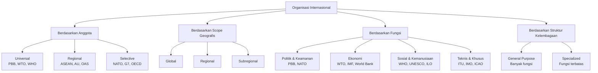
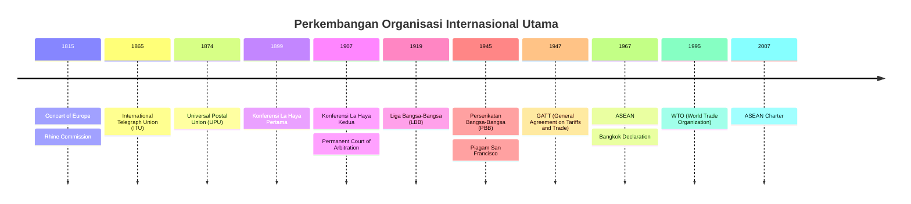
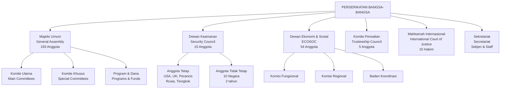

---
title: "Organisasi Internasional"
tags:
  - hukum-internasional
  - organisasi-internasional
  - PBB
  - ASEAN
  - teaching-materials
publish: true
---

# Organisasi Internasional

## 1. Tujuan Pembelajaran

Setelah mempelajari bab ini, mahasiswa diharapkan mampu:

1. **Memahami Konsep Dasar**: Menjelaskan definisi, karakteristik, dan perbedaan antara organisasi internasional pemerintah (IGO) dengan organisasi internasional non-pemerintah (NGO), serta mampu mengidentifikasi elemen-elemen konstituif yang membedakan organisasi internasional dari entitas hukum internasional lainnya.

2. **Menganalisis Perkembangan Historis**: Menguraikan evolusi organisasi internasional dari periode Kongres Wina 1815 hingga pendirian Perserikatan Bangsa-Bangsa pada 1945, termasuk peran Concert of Europe, Konferensi La Haya, Liga Bangsa-Bangsa, dan faktor-faktor yang mempengaruhi transformasi paradigma organisasi internasional.

3. **Menguasai Struktur dan Fungsi PBB**: Menjelaskan secara terperinci struktur organisasi Perserikatan Bangsa-Bangsa, fungsi masing-masing organ utama, proses pengambilan keputusan, dan mekanisme pertanggungjawaban dalam konteks Piagam PBB serta praktik internasional kontemporer.

4. **Mengkritisi Sistem Keamanan Kolektif**: Menganalisis keefektifan Dewan Keamanan PBB dalam memelihara perdamaian dan keamanan internasional, mengevaluasi kekuatan veto, dinamika keanggotaan permanen dan tidak tetap, serta tantangan reformasi lembaga keamanan.

5. **Menerapkan Hukum Organisasi Internasional**: Mengidentifikasi dan menerapkan prinsip-prinsip hukum organisasi internasional dalam kasus-kasus konkret, termasuk pertanggungjawaban organisasi internasional (ARIO), imunitas dan privilese, serta perlindungan pejabat organisasi internasional.

6. **Mengevaluasi Organisasi Regional**: Membandingkan peran dan fungsi organisasi regional seperti ASEAN, Uni Eropa, Afrika Uni, dan OAS dalam sistem hukum internasional, serta menganalisis keterkaitan antara organisasi regional dengan sistem PBB.

7. **Menganalisis Peran Indonesia**: Menjelaskan kontribusi, hak, dan tanggung jawab Indonesia sebagai anggota PBB dan ASEAN, serta mengkritisi posisi Indonesia dalam isu-isu kontemporer seperti keamanan regional, perubahan iklim, dan tata kelola global.

## 2. Pendahuluan: Sejarah Awal Organisasi Internasional

### Concert of Europe dan Perkembangan Awal

Pengakuan formal terhadap organisasi internasional secara sistematis dimulai pada awal abad ke-19, khususnya setelah Kongres Wina tahun 1815. Concert of Europe, meskipun bukan organisasi formal dalam pengertian modern, merepresentasikan upaya pertama untuk menciptakan mekanisme permanen bagi negara-negara Eropa Besar (Austria, Inggris, Prusia, Rusia, dan Perancis) guna menjaga keseimbangan kekuatan dan mencegah konflik berskala besar. Sistem ini mengandalkan konferensi diplomatik reguler, konvensi multilateral, dan perjanjian bilateral yang saling terkait. Meskipun Concert of Europe akhirnya runtuh pada pertengahan abad ke-19, warisan politiknya terletak pada pengakuan bahwa masalah-masalah internasional memerlukan dialog multilateral dan penyelesaian bersama, bukan hanya kepentingan individual negara-negara besar.

Pada saat bersamaan, muncul kebutuhan praktis untuk koordinasi internasional dalam berbagai bidang teknis dan administratif. Perkembangan revolusioner dalam transportasi, komunikasi, dan perdagangan internasional menciptakan tantangan transnasional yang tidak dapat dikelola melalui mekanisme bilateral tradisional. Respons terhadap kebutuhan ini menghasilkan gelombang pertama organisasi internasional yang bersifat teknis dan administratif.

### Komisi Rhen (Rhine Commission) 1815

Komisi Rhen didirikan sebagai bagian dari Akta Final Kongres Wina dan merupakan organisasi internasional tertua yang masih ada hingga hari ini. Organisasi ini didirikan untuk mengatur navigasi di Sungai Rhen, yang merupakan jalur perdagangan vital bagi beberapa negara Eropa. Komisi Rhen menetapkan prinsip-prinsip fundamental yang kemudian menjadi dasar hukum internasional maritim, termasuk konsep kebebasan navigasi, nondiskriminasi, dan pembagian tanggung jawab pengelolaan sumber daya bersama. Struktur organisasinya yang sederhana—terdiri dari representan dari negara-negara riparian—mendemonstrasikan bahwa koordinasi internasional dapat dicapai melalui mekanisme institusional yang relatif minimal namun efektif.

### Serikat Administratif Internasional: ITU (1865) dan UPU (1874)

Pertumbuhan yang signifikan dalam pengorganisasian internasional terjadi pada akhir abad ke-19 dengan pendirian International Telegraph Union (ITU) pada tahun 1865 dan Universal Postal Union (UPU) pada tahun 1874. Kedua organisasi ini lahir dari kebutuhan praktis untuk menstandarisasi sistem komunikasi dan pengiriman di tingkat global. International Telegraph Union, yang kemudian menjadi International Telecommunication Union, adalah organisasi internasional pertama yang memiliki struktur permanen dengan sekretariat, badan perwakilan, dan mekanisme pengambilan keputusan yang teratur. UPU, di sisi lain, menciptakan sistem yang memungkinkan pengiriman surat lintas batas dengan tarif yang terstandardisasi dan perlakuan yang setara.

Kedua organisasi ini menunjukkan pola yang akan menjadi ciri organisasi internasional modern: pembentukan melalui perjanjian multilateral, kehadiran sekretariat permanen, badan pengambilan keputusan yang terdiri dari perwakilan negara anggota, dan fokus pada isu-isu teknis yang memerlukan koordinasi internasional. Meskipun ITU dan UPU awalnya fokus pada masalah transportasi dan komunikasi, keberhasilan mereka membuktikan bahwa organisasi internasional dapat menjadi instrumen efektif untuk mengelola interdependensi global.

### Konferensi La Haya dan Hukum Perang Internasional

Dua Konferensi Perdamaian internasional yang diadakan di La Haya, Belanda (1899 dan 1907), menandai titik balik dalam pengembangan organisasi internasional dalam konteks perdamaian dan keamanan. Konferensi La Haya 1899, yang diinisiasikan oleh Tsar Rusia, membawa bersama negara-negara dari seluruh dunia untuk membahas pembatasan persenjataan dan humanisasi perang. Konferensi ini menghasilkan beberapa konvensi penting mengenai arbitrase, hukum perang, dan penyelesaian sengketa, serta mendirikan Pengadilan Arbitrase Internasional Permanen (Permanent Court of Arbitration).

Konferensi La Haya 1907 memperluas cakupan Konferensi sebelumnya dan menghasilkan dua belas konvensi yang berurusan dengan berbagai aspek hukum perang dan hubungan internasional damai. Pentingnya Konferensi La Haya terletak pada: (1) pengakuan bahwa komunitas internasional dapat berkumpul untuk mengusahakan solusi bersama terhadap masalah global; (2) pengembangan mekanisme arbitrase dan penyelesaian sengketa alternatif; (3) penetapan norma-norma hukum internasional yang mengatur perilaku negara-negara dalam waktu perang dan damai.

### Transisi ke Liga Bangsa-Bangsa

Pengalaman Perang Dunia I dan kebutuhan untuk mencegah terulangnya konflik global mendorong penciptaan organisasi internasional yang lebih komprehensif dan bermandaat lebih luas. Liga Bangsa-Bangsa, didirikan melalui Perjanjian Versailles tahun 1919, merepresentasikan upaya pertama untuk menciptakan organisasi universal yang berkomitmen pada pemeliharaan perdamaian internasional. Meskipun pada akhirnya gagal mencegah Perang Dunia II, Liga Bangsa-Bangsa membentuk fondasi konseptual dan institusional yang akan dibangun kembali dalam bentuk Perserikatan Bangsa-Bangsa.

## 3. Definisi dan Karakteristik Organisasi Internasional

### Definisi dan Elemen Konstitutif

Organisasi internasional adalah asosiasi sukarela dari negara-negara yang didirikan melalui perjanjian internasional (charter, piagam, atau konstitusi) dengan tujuan untuk mencapai kepentingan bersama, dengan struktur yang permanen mencakup organ-organ yang mandiri, prosedur pengambilan keputusan, dan sekretariat. Dalam pengertian yang lebih luas, organisasi internasional dapat juga mencakup entitas yang didirikan oleh negara-negara dan organisasi internasional lainnya untuk tujuan-tujuan spesifik.

Definisi ini mengandung beberapa elemen kritis yang membedakan organisasi internasional dari bentuk-bentuk lain dari kerjasama internasional:

**Pertama, Pembentukan Melalui Perjanjian Multilateral**: Organisasi internasional dibentuk melalui instrumen hukum formal yang mengandung kesepakatan dari dua atau lebih negara. Perjanjian ini menentukan tujuan organisasi, struktur internal, fungsi organ-organ, prosedur pengambilan keputusan, dan hubungan dengan negara anggota serta dengan organisasi internasional lainnya.

**Kedua, Personalitas Hukum Internasional**: Organisasi internasional memiliki personalitas hukum internasional yang mandiri, artinya organisasi dapat menjadi subjek hukum internasional dengan hak-hak dan tanggung jawab sendiri yang terpisah dari hak dan tanggung jawab negara anggotanya. Personalitas hukum ini diakui melalui kemampuan organisasi untuk memasuki perjanjian internasional, menjalankan fungsi diplomatik, dan mempertahanggung jawabkan tindakan-tindakannya di hadapan hukum internasional.

**Ketiga, Permanensi dan Kelembagaan**: Organisasi internasional memiliki struktur permanen dengan organ-organ yang dirancang untuk berfungsi secara terus-menerus, bukan hanya untuk acara-acara khusus atau sementara. Kelembagaan ini mencakup badan pengambilan keputusan (yang terdiri dari perwakilan negara anggota), sekretariat atau biro administratif, dan kemungkinan lembaga-lembaga spesialis atau badan-badan pendukung lainnya.

**Keempat, Kemandirian Relatif**: Meskipun didirikan oleh negara-negara, organisasi internasional memiliki kemandirian relatif dalam pengambilan keputusan dan pelaksanaan fungsinya. Organisasi dapat mengeluarkan keputusan dan rekomendasi yang mungkin tidak sepenuhnya sesuai dengan kepentingan individual setiap anggota, dan dapat mengambil tindakan independen dalam batas-batas yang ditentukan oleh piagamnya.

### Karakteristik Organisasi Internasional

Organisasi internasional dapat dicirikan oleh beberapa karakteristik utama yang membedakannya dari bentuk-bentuk lain dari entitas internasional:

**Subjektivitas Hukum Internasional**: Organisasi internasional adalah subjek hukum internasional yang dapat memiliki hak dan kewajiban di bawah hukum internasional. Hal ini diakui oleh Mahkamah Internasional dalam Kasus Reparation for Injuries Suffered in the Service of the United Nations (1949), di mana Mahkamah menyatakan bahwa Organisasi Perserikatan Bangsa-Bangsa memiliki personalitas hukum internasional yang cukup untuk membuat klaim kepada negara-negara atas dasar tanggung jawab hukum internasional.

**Keanggotaan Terbatas**: Organisasi internasional memiliki keanggotaan yang terbatas pada negara-negara (atau entitas lain yang diakui sebagai subjek hukum internasional) yang memenuhi syarat-syarat tertentu dan secara eksplisit menerima piagam organisasi. Tidak semua negara di dunia dapat menjadi anggota organisasi tertentu; beberapa organisasi hanya terbuka bagi negara-negara dari region tertentu, atau organisasi dapat mensyaratkan kriteria lain seperti standar demokrasi atau sistem ekonomi.

**Struktur Internal yang Formal**: Organisasi internasional memiliki struktur internal yang formal yang mencakup organ-organ pengambilan keputusan (seperti Majelis Umum atau Dewan Eksekutif), sekretariat atau biro administratif, dan mungkin badan-badan spesialis atau komisi-komisi. Struktur ini dirancang untuk memungkinkan partisipasi semua anggota dalam pengambilan keputusan sambil memastikan efisiensi administratif.

**Tujuan Bersama**: Organisasi internasional didirikan untuk mencapai tujuan-tujuan yang dianggap bersama oleh negara-negara anggota. Tujuan-tujuan ini dapat beragam, mulai dari pemeliharaan perdamaian dan keamanan internasional, perlindungan hak asasi manusia, pengembangan ekonomi, hingga koordinasi dalam berbagai bidang teknis dan profesional.

### Perbedaan antara IGO dan NGO

Penting untuk membedakan antara organisasi internasional pemerintah (Intergovernmental Organizations - IGO) dengan organisasi internasional non-pemerintah (International Non-Governmental Organizations - INGO atau NGO):

**Organisasi Internasional Pemerintah (IGO)** adalah organisasi yang dibentuk oleh perjanjian internasional antara negara-negara, dengan anggota-anggotanya adalah negara-negara atau entitas yang diakui sebagai subjek hukum internasional. IGO memiliki status yang lebih tinggi dalam hierarki hukum internasional dan keputusan-keputusannya dapat memiliki dampak langsung pada negara-negara anggota. Contoh IGO termasuk Perserikatan Bangsa-Bangsa, Organisasi Perdagangan Dunia, dan Organisasi Negara-Negara Afrika.

**Organisasi Internasional Non-Pemerintah (NGO)** adalah organisasi yang dibentuk oleh individu-individu atau kelompok-kelompok yang bukan negara. Meskipun NGO dapat bermitra dengan organisasi pemerintah atau antar negara, mereka secara fundamental adalah entitas privat atau masyarakat sipil. NGO tidak memiliki status subjektivitas hukum internasional yang sama dengan IGO, meskipun mereka dapat memiliki beberapa peran yang diakui dalam sistem hukum internasional modern. Contoh NGO termasuk Amnesty International, Médecins Sans Frontières, dan Greenpeace.

### Kepribadian Hukum Internasional Organisasi: Kasus Reparation for Injuries (1949)

Perkembangan doktrin mengenai kepribadian hukum internasional organisasi internasional mengalami titik balik penting dengan putusan Mahkamah Internasional dalam Kasus Reparation for Injuries Suffered in the Service of the United Nations (1949). Dalam kasus ini, Mahkamah Internasional diminta untuk memberikan pendapat nasihat mengenai apakah Organisasi Perserikatan Bangsa-Bangsa memiliki personalitas hukum internasional yang memungkinkannya untuk mengajukan klaim kepada negara-negara atas nama pasukannya yang terbunuh dalam menjalankan tugas perdamaian.

Mahkamah Internasional menyatakan bahwa, meskipun Piagam PBB tidak secara eksplisit mengakui personalitas hukum internasional PBB, organisasi ini dengan keharusan harus memiliki tingkat minimal dari personalitas hukum internasional untuk menjalankan fungsi-fungsinya yang dimaksudkan. Mahkamah menyimpulkan bahwa PBB memiliki kapasitas untuk membuat klaim internasional dan dapat mengajukan tuntutan kepada negara-negara untuk mengkompensasi kerugian yang diderita oleh personel PBB yang bertugas. Putusan ini membuka jalan bagi pengakuan bahwa organisasi internasional dapat memiliki hak dan kewajiban yang terpisah dari anggota-anggotanya, dan dapat menjalankan peran dalam hukum internasional yang lebih kompleks dan luas.

### Klasifikasi Organisasi Internasional

## 4. Sejarah Organisasi Internasional Modern

### Periode Serikat Administratif (1815-1919)

Seperti telah dijelaskan sebelumnya, periode ini ditandai dengan berkembangnya organisasi-organisasi internasional yang bersifat teknis dan administratif untuk menangani masalah-masalah transnasional. Organisasi-organisasi ini, meskipun sederhana dalam struktur dan terbatas dalam mandatnya, menunjukkan potensi kerjasama internasional yang terorganisir dan berkelanjutan. Mereka juga menetapkan preseden untuk cara-cara yang akan diadopsi oleh organisasi-organisasi internasional modern dalam menjalankan fungsi-fungsi administratif, legislatif, dan koordinatif.

### Liga Bangsa-Bangsa (1919-1946)

Liga Bangsa-Bangsa, didirikan melalui Perjanjian Versailles pada tahun 1919, merepresentasikan upaya pertama untuk menciptakan organisasi universal yang didedikasikan untuk pemeliharaan perdamaian dan keamanan internasional. Piagam Liga Bangsa-Bangsa mencerminkan semangat idealisme liberal yang mendominasi pemikiran tentang hubungan internasional pasca-Perang Dunia I, dengan penekanan pada arbitrase, pengurangan senjata, dan penyelesaian damai sengketa internasional.

Struktur Liga Bangsa-Bangsa mencakup: (1) Asosiasi Umum, di mana semua anggota memiliki suara yang sama; (2) Dewan, yang terdiri dari anggota permanen (Inggris, Perancis, Italia, dan Jepang) dan anggota non-permanen yang dipilih; dan (3) Sekretariat. Struktur ini menjadi model untuk banyak organisasi internasional yang menyusul.

Namun, Liga Bangsa-Bangsa mengalami sejumlah kelemahan fundamental yang akhirnya menyebabkan kegandalannya tidak efektif: (1) Amerika Serikat, yang merupakan kekuatan besar, tidak pernah menjadi anggota karena penolakan Senat Amerika; (2) organisasi ini tidak memiliki mekanisme yang efektif untuk menerapkan keputusan-keputusannya atau untuk menghadapi agresi militer; (3) ketiadaan kesepakatan di antara anggota permanen membuat organisasi ini lumpuh dalam situasi-situasi kritis; dan (4) pendekatan Liga Bangsa-Bangsa yang menekankan moral dan hukum terbukti tidak cukup untuk menghadapi ancaman militer dari negara-negara agresif pada tahun 1930-an.

### Persiapan PBB: Dumbarton Oaks dan San Francisco

Ketika Perang Dunia II menjelang akhirnya, negara-negara Sekutu (khususnya Amerika Serikat, Inggris, Uni Soviet, dan Tiongkok) mulai merencanakan organisasi internasional pasca-perang yang akan lebih efektif daripada Liga Bangsa-Bangsa. Proses ini dimulai dengan Konferensi Dumbarton Oaks, yang diadakan di Washington, DC dari Agustus hingga Oktober 1944, di mana perwakilan dari Amerika Serikat, Inggris, Uni Soviet, dan Tiongkok merancang kerangka organisasi internasional baru.

Konferensi Dumbarton Oaks menghasilkan Prinsip-Prinsip Dumbarton Oaks, yang membentuk dasar untuk Piagam Perserikatan Bangsa-Bangsa. Dokumen ini menetapkan struktur dasar, fungsi-fungsi, dan prosedur yang akan diadopsi oleh PBB, termasuk kehadiran Dewan Keamanan dengan keanggotaan permanen lima kekuatan besar dan kemampuan untuk mengambil tindakan paksa.

Persiapan lebih lanjut dilakukan melalui Konferensi Yalta (Februari 1945), di mana Franklin D. Roosevelt, Winston Churchill, dan Joseph Stalin berdiskusi tentang penetapan organisasi internasional dan peran yang akan dimainkan oleh negara-negara besar dalam menjaga keamanan dunia pasca-perang. Kesepakatan Yalta menegaskan prinsip pentaachir (lima kekuatan besar: Amerika Serikat, Inggris, Uni Soviet, Tiongkok, dan Perancis) akan menjadi anggota permanen Dewan Keamanan dengan kekuatan veto.

Konferensi San Francisco, yang diadakan dari April hingga Juni 1945, merupakan pertemuan final yang membawa bersama 50 negara untuk menyelesaikan dan menandatangani Piagam Perserikatan Bangsa-Bangsa. Konferensi ini menghasilkan dokumen akhir yang mencerminkan negosiasi kompleks antara negara-negara besar (yang menginginkan organisasi yang kuat dan di bawah kontrol mereka) dan negara-negara kecil (yang menginginkan organisasi yang lebih demokratis dan responsif terhadap kepentingan semua negara). Hasil kompromi adalah Piagam yang menyeimbangkan kekuatan dengan tanggung jawab, meskipun struktur yang diadopsi jelas memberikan pengaruh signifikan kepada lima kekuatan besar melalui mekanisme veto di Dewan Keamanan.

### Timeline Sejarah Organisasi Internasional

## 5. Perserikatan Bangsa-Bangsa: Struktur dan Fungsi

### Piagam PBB: Prinsip-Prinsip Fundamental

Piagam Perserikatan Bangsa-Bangsa, yang ditandatangani di San Francisco pada tanggal 26 Juni 1945 dan mulai berlaku pada 24 Oktober 1945, merupakan perjanjian internasional yang mengikat semua anggota PBB dan membentuk dasar hukum untuk organisasi ini. Piagam terdiri dari Pembukaan (Preamble), 19 bab, dan 111 pasal yang menguraikan tujuan, prinsip-prinsip, struktur, fungsi-fungsi, dan prosedur organisasi.

**Pasal 1 Piagam PBB** menetapkan tujuan-tujuan PBB:

(1) Untuk mempertahankan perdamaian dan keamanan internasional melalui tindakan kolektif yang efektif untuk mencegah dan menghilangkan ancaman terhadap perdamaian, dan untuk menekan tindakan-tindakan agresif atau pelanggaran lainnya terhadap perdamaian;

(2) Untuk mengembangkan hubungan-hubungan bersahabat di antara bangsa-bangsa atas dasar persamaan hak dan penentuan nasib sendiri, dan untuk mengambil tindakan-tindakan lain yang sesuai untuk memperkuat perdamaian universal;

(3) Untuk mencapai kerjasama internasional untuk menyelesaikan masalah-masalah ekonomi, sosial, budaya, dan kemanusiaan, dan untuk mendorong penghormatan universal terhadap hak asasi manusia dan kebebasan fundamental bagi semua tanpa membedakan ras, jenis kelamin, bahasa, atau agama;

(4) Untuk menjadi pusat bagi negara-negara dalam mencapai tujuan-tujuan umum tersebut.

**Pasal 2 Piagam PBB** menetapkan prinsip-prinsip yang harus dijunjung tinggi oleh anggota-anggota:

(1) Organisasi didasarkan atas prinsip persamaan hak semua negara anggotanya;

(2) Semua anggota, untuk memelihara perdamaian dan keamanan internasional, berkewajiban untuk menyelesaikan sengketa-sengketa internasional mereka dengan cara-cara damai sedemikian rupa sehingga perdamaian dan keamanan internasional, serta keadilan, tidak membahayakan;

(3) Semua anggota harus menahan diri dari ancaman atau penggunaan kekuatan yang ditujukan terhadap integritas wilayah atau kemerdekaan politik dari negara mana pun, atau dengan cara-cara lain yang tidak sesuai dengan tujuan-tujuan Perserikatan Bangsa-Bangsa;

(4) Semua anggota akan memberikan setiap bantuan kepada Perserikatan Bangsa-Bangsa dalam setiap tindakan yang diambil sesuai dengan Piagam ini, dan akan menahan diri untuk memberikan bantuan kepada negara-negara apa pun terhadap mana Perserikatan Bangsa-Bangsa melakukan tindakan pencegahan atau penegakan;

(5) Organisasi akan memastikan bahwa negara-negara yang bukan anggota bertindak sesuai dengan prinsip-prinsip ini sejauh yang diperlukan untuk memelihara perdamaian dan keamanan internasional;

(6) Tidak ada yang dalam Piagam ini memberi wewenang kepada Perserikatan Bangsa-Bangsa untuk melakukan intervensi dalam hal-hal yang pada dasarnya merupakan tanggung jawab dalam negeri dari negara-negara mana pun, dan juga tidak ada yang mengharuskan anggota-anggota untuk menyerahkan hal-hal demikian untuk penyelesaian menurut Piagam ini.

### Keanggotaan PBB

**Pasal 4 hingga 6 Piagam PBB** mengatur masalah keanggotaan dalam organisasi. Menurut Pasal 4, Pasal 3 ayat (1), keanggotaan dalam Perserikatan Bangsa-Bangsa terbuka bagi semua negara pecinta perdamaian yang menerima kewajiban-kewajiban yang tertera dalam Piagam dan, dalam pendapat Organisasi, bersedia dan mampu menunaikan kewajiban-kewajiban ini. Penerimaan anggota baru dilakukan oleh Majelis Umum berdasarkan rekomendasi Dewan Keamanan.

**Pasal 5** memungkinkan Majelis Umum untuk menangguhkan dari latihan hak-hak dan privilese-privilese keanggotaan negara anggota yang telah mengalami tindakan preventif atau penegakan oleh Dewan Keamanan. **Pasal 6** memperbolehkan Majelis Umum untuk mengeluarkan dari Organisasi negara anggota yang terus-menerus melanggar prinsip-prinsip yang tercantum dalam Piagam, meskipun ketentuan ini sangat jarang digunakan.

### Enam Organ Utama PBB

Piagam PBB memosisikan enam organ utama yang membentuk struktur dasar organisasi:

**1. Majelis Umum (General Assembly)**: Terdiri dari semua anggota PBB, Majelis Umum adalah badan pembuat keputusan utama yang paling representatif. Majelis Umum memiliki tanggung jawab untuk membahas masalah-masalah apa pun dalam lingkup Piagam, merekomendasikan tindakan kepada anggota-anggota, menerima anggota baru, meninjau aktivitas-aktivitas organisasi, dan memilih anggota Dewan Keamanan yang tidak tetap dan anggota badan-badan lain.

**2. Dewan Keamanan (Security Council)**: Terdiri dari 15 anggota (5 tetap dan 10 tidak tetap), Dewan Keamanan bertanggung jawab atas pemeliharaan perdamaian dan keamanan internasional. Dewan ini memiliki kewenangan untuk menyelidiki sengketa internasional, merekomendasikan penyelesaian, dan mengambil tindakan paksa jika diperlukan. Keputusan Dewan Keamanan mengikat semua anggota PBB.

**3. Dewan Ekonomi dan Sosial (Economic and Social Council - ECOSOC)**: Organ ini bertugas mengkoordinasikan kerja organisasi-organisasi spesialis PBB dalam bidang ekonomi, sosial, budaya, pendidikan, dan kesehatan. ECOSOC terdiri dari 54 anggota yang dipilih oleh Majelis Umum untuk periode tiga tahun.

**4. Komite Perwalian (Trusteeship Council)**: Didirikan untuk mengawasi wilayah-wilayah perwalian dan memastikan bahwa wilayah-wilayah ini dikelola untuk kepentingan penduduk mereka dan perdamaian internasional. Sebagian besar fungsi Komite Perwalian telah menjadi tidak relevan setelah dekolonisasi, meskipun Komite secara teknis tetap ada.

**5. Mahkamah Internasional (International Court of Justice - ICJ)**: Adalah organ judisial utama PBB yang menyelesaikan sengketa hukum antar negara dan memberikan pendapat nasihat kepada organ-organ PBB dan badan-badan spesialis mengenai pertanyaan-pertanyaan hukum.

**6. Sekretariat (Secretariat)**: Organ administratif yang dipimpin oleh Sekretaris-Jenderal, Sekretariat menjalankan fungsi-fungsi administratif, memberikan dukungan kepada organ-organ lain, dan dapat membawa masalah-masalah ke Dewan Keamanan menurut Pasal 99 Piagam.

### Bagan Organisasi Struktur PBB

## 6. Majelis Umum: Representasi Demokratis dan Pengambilan Keputusan

### Struktur dan Fungsi Majelis Umum

Majelis Umum adalah badan paling representatif dari Perserikatan Bangsa-Bangsa, terdiri dari semua 193 anggota negara (sejak bergabungnya Timor Leste sebagai anggota 193 pada 2002). Setiap negara anggota memiliki satu suara dalam Majelis Umum, terlepas dari ukuran, kekuatan ekonomi, atau populasinya, mencerminkan prinsip persamaan hak semua negara yang ditetapkan dalam Pasal 2 ayat (1) Piagam PBB.

**Pasal 9 hingga 22 Piagam PBB** mengatur masalah-masalah yang berkaitan dengan Majelis Umum. Menurut ketentuan-ketentuan ini, Majelis Umum memiliki otoritas untuk:

(1) Mendiskusikan masalah-masalah apa pun dalam lingkup Piagam atau yang berkaitan dengan kekuasaan dan fungsi-fungsi dari organ-organ mana pun yang disebutkan dalam Piagam;

(2) Merekomendasikan tindakan-tindakan kepada anggota-anggota PBB atau Dewan Keamanan sehubungan dengan masalah-masalah tersebut;

(3) Memulai studi-studi dan membuat rekomendasi-rekomendasi untuk tujuan-tujuan mempromosikan kerjasama internasional dalam bidang-bidang politik, ekonomi, sosial, budaya, pendidikan, dan kesehatan;

(4) Memajukan langkah-langkah untuk pengembangan lebih lanjut dari hukum internasional dan kodifikasi dan pengembangan hukum internasional yang progresif;

(5) Menerima dan mempertimbangkan laporan-laporan dari Dewan Keamanan dan organ-organ lain;

(6) Memilih anggota-anggota tidak tetap dari Dewan Keamanan;

(7) Memilih anggota-anggota dari Dewan Ekonomi dan Sosial dan Komite Perwalian;

(8) Memilih, bersama dengan Dewan Keamanan, 15 hakim-hakim Mahkamah Internasional;

(9) Menerima anggota-anggota baru atas rekomendasi Dewan Keamanan.

### Pemungutan Suara dan Pengambilan Keputusan

Menurut **Pasal 18 Piagam PBB**, keputusan-keputusan mengenai masalah-masalah penting disahkan oleh mayoritas dua pertiga dari anggota-anggota yang hadir dan memberikan suara. Masalah-masalah penting meliputi: rekomendasi-rekomendasi sehubungan dengan pemeliharaan perdamaian dan keamanan internasional, pemilihan anggota-anggota tidak tetap Dewan Keamanan, pemilihan anggota-anggota ECOSOC dan Komite Perwalian, penerimaan anggota-anggota baru, penangguhan dan pengeluaran anggota-anggota, pertanyaan-pertanyaan mengenai operasi Komite Perwalian, dan pengesahan anggaran biaya.

Keputusan-keputusan Majelis Umum mengenai masalah-masalah lain disahkan oleh mayoritas sederhana. Penting untuk dicatat bahwa keputusan-keputusan Majelis Umum, dengan pengecualian atas anggaran PBB dan beberapa masalah administratif, bersifat rekomendasi dan tidak mengikat anggota-anggota dengan cara yang sama seperti keputusan-keputusan Dewan Keamanan.

### Resolusi Penting Majelis Umum

**Resolusi 377(V) - "Uniting for Peace" (1950)**: Resolusi ini dikeluarkan pada saat Dewan Keamanan terlumpuh oleh konflik antara Uni Soviet dan negara-negara Barat mengenai Perang Korea. Resolusi 377(V) menetapkan bahwa jika Dewan Keamanan gagal melakukan tugasnya untuk mempertahankan perdamaian dan keamanan internasional karena ketidaksepakatan anggota-anggota permanen, Majelis Umum dapat mengambil alih dan merekomendasikan tindakan-tindakan, termasuk, jika diperlukan, penggunaan kekuatan bersenjata. Resolusi ini memperkuat peran Majelis Umum dalam situasi-situasi di mana Dewan Keamanan tidak dapat bertindak.

**Resolusi 1514 (1960) - Declaration on the Granting of Independence to Colonial Countries and Peoples**: Resolusi ini mengecam kolonialisme dan menetapkan prinsip bahwa semua orang memiliki hak untuk penentuan nasib sendiri. Resolusi ini menjadi dasar hukum untuk proses dekolonisasi yang besar-besaran pada tahun 1960-an dan 1970-an.

**Resolusi 2625 (1970) - Declaration on Principles of International Law**: Resolusi ini menguraikan prinsip-prinsip fundamental hukum internasional, termasuk prinsip kedaulatan negara, larangan penggunaan kekuatan, penyelesaian damai sengketa, ketiadaan intervensi dalam urusan dalam negeri, dan persamaan hak.

**Resolusi 3314 (1974) - Definition of Aggression**: Resolusi ini memberikan definisi yang ditunggu-tunggu tentang apa yang merupakan agresi dalam hukum internasional. Definisi ini penting karena membantu mengklarifikasi tanggung jawab negara-negara di bawah hukum internasional dan membimbing Dewan Keamanan dalam menentukan apakah agresi telah terjadi.

## 7. Dewan Keamanan: Pemeliharaan Perdamaian dan Keamanan Internasional

### Komposisi dan Struktur Dewan Keamanan

Dewan Keamanan terdiri dari 15 anggota: lima anggota tetap (permanent members) dan sepuluh anggota tidak tetap (non-permanent members). **Anggota-anggota tetap** adalah Amerika Serikat, Inggris Raya, Perancis, Uni Soviet (sekarang Rusia), dan Tiongkok (awalnya Republik Tiongkok, kemudian berganti menjadi Republik Rakyat Tiongkok pada 1971). Anggota-anggota tetap ini dipilih untuk mewakili kekuatan-kekuatan besar yang memenangkan Perang Dunia II dan dianggap sebagai kekuatan-kekuatan yang dapat memainkan peran utama dalam pemeliharaan perdamaian dan keamanan internasional.

**Anggota-anggota tidak tetap** dipilih oleh Majelis Umum untuk periode dua tahun, dengan pemilihan sebagian dari mereka setiap tahun. Dalam memilih anggota-anggota tidak tetap, perhatian khusus diberikan kepada kontribusi anggota-anggota PBB kepada pemeliharaan perdamaian dan keamanan internasional dan tujuan-tujuan Perserikatan Bangsa-Bangsa yang lain, serta distribusi geografis yang adil.

### Kekuatan Veto dan Pengambilan Keputusan

Salah satu fitur paling kontroversial dan penting dari Dewan Keamanan adalah hak veto yang dimiliki oleh anggota-anggota tetap. **Pasal 27 ayat (3) Piagam PBB** menyatakan bahwa keputusan-keputusan Dewan Keamanan mengenai masalah-masalah substansial disahkan oleh suara affirmative dari sembilan anggota termasuk suara concurring dari semua anggota tetap. Ini berarti bahwa setiap anggota tetap memiliki kekuatan untuk memblokir keputusan-keputusan substantif dengan mengeluarkan suara negatif (veto). Anggota-anggota tidak tetap dapat memblokir keputusan-keputusan hanya dengan membentuk aliansi dengan anggota-anggota lain untuk mencapai enam suara negatif.

Hak veto ini dirancang untuk memastikan bahwa kekuatan-kekuatan besar tidak akan dipaksa oleh Dewan Keamanan untuk melakukan tindakan yang bertentangan dengan kepentingan fundamental mereka, dengan teori bahwa kepatuhan oleh kekuatan-kekuatan besar adalah penting untuk efektivitas Dewan. Namun, hak veto ini juga sering dikritik karena telah menjadi sumber kelumpuhan Dewan dalam situasi-situasi di mana kekuatan-kekuatan besar berbeda pendapat mengenai masalah-masalah keamanan. Pada berbagai kesempatan, anggota-anggota tetap telah menggunakan veto mereka untuk memblokir keputusan-keputusan yang mereka anggap merugikan kepentingan mereka, bahkan ketika keputusan-keputusan tersebut didukung oleh mayoritas besar anggota-anggota lain.

### Otoritas Dewan Keamanan: Chapter VI dan Chapter VII

**Bab VI Piagam PBB** berjudul "Penyelesaian Damai dari Sengketa" menguraikan mekanisme yang dapat digunakan Dewan Keamanan untuk membantu dalam penyelesaian sengketa-sengketa internasional yang dapat mengancam perdamaian dan keamanan internasional. Mekanisme-mekanisme ini termasuk negosiasi, mediasi, konsiliasi, arbitrase, dan judicial settlement. Dewan Keamanan dapat merekomendasikan prosedur-prosedur atau syarat-syarat penyelesaian, dan dapat menentukan sendiri prosedur-prosedur untuk menyelesaikan sengketa. Keputusan-keputusan di bawah Bab VI bersifat rekomendasi dan tidak mengikat.

**Bab VII Piagam PBB** berjudul "Tindakan-Tindakan yang Berkaitan dengan Ancaman terhadap Perdamaian, Pelanggaran Perdamaian, dan Tindakan-Tindakan Agresif" memberikan kepada Dewan Keamanan kewenangan untuk mengambil tindakan-tindakan paksa, termasuk tindakan-tindakan ekonomi (seperti embargo dan penghentian hubungan ekonomi), tindakan-tindakan militer, dan tindakan-tindakan lainnya yang diperlukan untuk mempertahankan atau memulihkan perdamaian dan keamanan internasional. Keputusan-keputusan di bawah Bab VII mengikat semua anggota PBB, dan anggota-anggota berkewajiban untuk mematuhi dan memberikan dukungan kepada tindakan-tindakan yang diperintahkan oleh Dewan.

### Operasi Pemeliharaan Perdamaian (Peacekeeping Operations)

Meskipun istilah "peacekeeping" tidak muncul dalam Piagam PBB, operasi-operasi pemeliharaan perdamaian telah menjadi salah satu alat paling penting yang digunakan oleh PBB untuk membantu dalam penyelesaian sengketa dan stabilisasi situasi-situasi yang bergejolak. Operasi-operasi pemeliharaan perdamaian melibatkan penempatan personel militer dan sipil PBB (yang sering disebut "blue berets" atau "peace keepers") di wilayah-wilayah di mana konflik telah terjadi atau sedang terjadi, dengan tujuan untuk memantau perjanjian-perjanjian gencatan senjata, memisahkan pihak-pihak yang bertentangan, dan membantu dalam proses perdamaian.

Operasi pemeliharaan perdamaian pertama didirikan pada tahun 1956 dalam konteks krisis Suez di Timur Tengah, dan sejak itu PBB telah melaksanakan lebih dari 70 operasi pemeliharaan perdamaian di berbagai belahan dunia. Operasi-operasi ini bervariasi dalam ukuran, durasi, dan mandat. Beberapa operasi berfokus pada pemantauan gencatan senjata (operasi "observer" missions), sementara operasi-operasi lainnya lebih aktif dalam memisahkan pihak-pihak yang bertentangan dan melindungi populasi sipil.

### Tanggung Jawab untuk Melindungi (Responsibility to Protect - R2P)

Pada awal 2000-an, muncul konsep "Tanggung Jawab untuk Melindungi" (Responsibility to Protect atau R2P) yang mengusulkan bahwa negara-negara memiliki tanggung jawab untuk melindungi penduduk mereka dari kejahatan-kejahatan serius (seperti pembantaian, pembersihan etnis, dan kejahatan terhadap kemanusiaan), dan bahwa komunitas internasional memiliki tanggung jawab untuk melakukan intervensi jika negara-negara tidak melakukan atau tidak mampu melindungi penduduk mereka. Konsep R2P diadopsi oleh komunitas internasional pada Dokumen Hasil Pertemuan Puncak Dunia tahun 2005 dan dipertahankan dalam berbagai resolusi Majelis Umum dan Dewan Keamanan.

Namun, implementasi R2P tetap kontroversial. Beberapa negara khawatir bahwa R2P dapat digunakan untuk membenarkan intervensi yang tidak diminta dalam urusan dalam negeri negara-negara lain, sementara yang lain berpendapat bahwa R2P belum diimplementasikan secara konsisten dan efektif dalam mencegah atrocitas-atrocitas serius.

### Reformasi Dewan Keamanan

Selama bertahun-tahun, telah ada upaya berkelanjutan untuk mereformasi Dewan Keamanan guna membuat lembaga ini lebih representatif, responsif, dan efektif. Usulan-usulan reformasi mencakup:

(1) **Perluasan keanggotaan**: Berbagai proposal telah diajukan untuk menambah jumlah anggota tetap dan/atau tidak tetap Dewan Keamanan. Beberapa usulan menyarankan untuk menambah lima anggota tetap tambahan dari negara-negara besar yang berkembang seperti India, Brasil, dan Afrika Selatan, sementara usulan-usulan lainnya lebih konservatif dalam pendekatan mereka.

(2) **Reformasi hak veto**: Beberapa negara dan akademisi telah mengusulkan untuk membatasi penggunaan hak veto, misalnya dengan memerlukan suara affirmative dari beberapa anggota tetap untuk memblokir keputusan, atau dengan mengecualikan penggunaan veto dalam situasi-situasi tertentu seperti pencegahan pembantaian atau kejahatan terhadap kemanusiaan.

(3) **Peningkatan transparansi dan akuntabilitas**: Ada permintaan untuk meningkatkan transparansi dalam operasi-operasi Dewan Keamanan dan meningkatkan akuntabilitas kepada anggota-anggota PBB secara keseluruhan.

Meskipun ada kesepakatan umum bahwa reformasi diperlukan, mencapai kesepakatan mengenai bentuk dan derajat reformasi telah terbukti sangat sulit, sebagian besar karena anggota-anggota tetap keberatan dengan usulan-usulan yang dapat mengurangi pengaruh mereka.

### Tabel Penggunaan Veto Dewan Keamanan (1945-2024)

| Anggota Tetap | Total Veto | Periode Puncak | Veto Terakhir |
|---|---|---|---|
| Uni Soviet/Rusia | 122+ | 1960-1980s | 2023 |
| Amerika Serikat | 82+ | 1970-2000s | 2020 |
| Tiongkok | 10+ | 1990-2000s | 2020 |
| Inggris | 31+ | 1950-1970s | 2012 |
| Perancis | 16+ | 1950-1960s | 2013 |

## 8. Mahkamah Internasional: Organ Judisial Utama PBB

### Struktur dan Komposisi Mahkamah Internasional

Mahkamah Internasional (International Court of Justice - ICJ) adalah organ judisial utama Perserikatan Bangsa-Bangsa, yang bekerja dalam ketentuan Pasal 92 dan seterusnya Piagam PBB. Mahkamah Internasional terdiri dari 15 hakim yang dipilih oleh Majelis Umum dan Dewan Keamanan untuk periode sembilan tahun, dengan pemilihan sebagian dari hakim-hakim ini setiap tiga tahun. Hakim-hakim ini harus dipilih dari orang-orang dengan kualifikasi tinggi dalam hukum internasional atau yurisprudensi nasional, dan harus mewakili berbagai sistem hukum utama dunia serta memastikan representasi geografis yang adil.

### Yurisdiksi Mahkamah Internasional

**Pasal 36 Piagam PBB** menguraikan yurisdiksi Mahkamah Internasional. Mahkamah memiliki yurisdiksi untuk menyelesaikan sengketa-sengketa hukum yang diajukan oleh negara-negara anggota PBB, tetapi tidak memiliki yurisdiksi wajib (compulsory jurisdiction) kecuali jika negara-negara yang bersengketa telah setuju sebelumnya untuk menerima yurisdiksi Mahkamah. Cara-cara dalam mana negara-negara dapat menerima yurisdiksi Mahkamah termasuk:

(1) **Perjanjian khusus (special agreement)**: Ketika negara-negara yang bersengketa setuju untuk menyerahkan sengketa mereka kepada Mahkamah.

(2) **Klausul kompromi dalam perjanjian multilateral**: Perjanjian internasional dapat mengandung klausul yang menyatakan bahwa sengketa-sengketa yang timbul dari interpretasi atau aplikasi perjanjian akan diputuskan oleh Mahkamah Internasional.

(3) **Deklarasi yang diterima menurut Pasal 36 ayat (2)**: Negara-negara dapat membuat deklarasi yang menerima yurisdiksi wajib Mahkamah Internasional secara sepihak. Lebih dari seratus negara telah membuat deklarasi semacam itu, meskipun banyak di antaranya mengandung reservasi-reservasi yang membatasi cakupan penerimaan mereka.

### Pendapat Nasihat (Advisory Opinions)

Selain menyelesaikan sengketa antara negara-negara, Mahkamah Internasional juga dapat memberikan pendapat nasihat mengenai pertanyaan-pertanyaan hukum yang diajukan oleh Majelis Umum, Dewan Keamanan, atau organ-organ dan badan-badan spesialis PBB lainnya yang berhak mengajukan pertanyaan. Pendapat-pendapat nasihat ini tidak mengikat secara hukum, tetapi mereka sering memiliki pengaruh signifikan dalam pembentukan hukum internasional dan dalam membimbing operasi-operasi organ-organ PBB.

### Kasus-Kasus Penting Mahkamah Internasional

**Kasus Nicaragua melawan Amerika Serikat (1986)**: Dalam kasus ini, Mahkamah Internasional menemukan bahwa Amerika Serikat telah melanggar hukum internasional dengan membiayai dan mendukung operasi-operasi militer dan paramiliter oleh kelompok-kelompok Contra yang berupaya menggulingkan pemerintah Sandinista yang berkuasa di Nikaragua. Putusan ini penting karena menunjukkan bahwa Mahkamah Internasional bersedia untuk menilai tindakan-tindakan kekuatan-kekuatan besar dan menemukan bahwa mereka telah melanggar hukum internasional, meskipun Amerika Serikat adalah salah satu dari lima anggota tetap Dewan Keamanan.

**Kasus Konvensi Genosida (Bosnian dan Herzegovina melawan Serbia dan Montenegro, 2007)**: Dalam kasus ini, Mahkamah Internasional memutuskan bahwa Serbia dan Montenegro tidak bertanggung jawab atas genosida yang dilakukan oleh pasukan Bosniak Serb selama Perang Bosnia, tetapi menemukan bahwa Uni Soviet telah melanggar Konvensi Pencegahan dan Penghukuman Kejahatan Genosida. Kasus ini menekankan kompleksitas hukum tanggung jawab internasional dalam konteks konflik bersenjata internal.

**Kasus Pertanyaan Legalitas Penggunaan Senjata Nuklir (Pendapat Nasihat, 1996)**: Dalam pendapat nasihatnya, Mahkamah Internasional menyatakan bahwa penggunaan atau ancaman penggunaan senjata nuklir umumnya akan melanggar hukum humaniter internasional dan hukum lingkungan internasional, tetapi tidak dapat secara jelas menyatakan bahwa penggunaan senjata nuklir dalam situasi-situasi kelangsungan hidup nasional akan selalu melanggar hukum internasional. Pendapat ini mencerminkan kesulitan dalam menerapkan hukum humaniter internasional pada konteks senjata pemusnah massal.

**Kasus Kosovo (Konsultasi Nasihat tentang Legalitas Deklarasi Kemerdekaan Unilateral oleh Kosovo, 2010)**: Dalam pendapat nasihatnya, Mahkamah Internasional menyatakan bahwa deklarasi kemerdekaan unilateral Kosovo tidak melanggar hukum internasional yang berlaku. Pendapat ini penting karena menyentuh pertanyaan-pertanyaan fundamental mengenai hak untuk penentuan nasib sendiri, kedaulatan, dan integritas wilayah.

## 9. Sekretariat dan Peran Sekretaris-Jenderal PBB

### Struktur Sekretariat dan Fungsi Administratif

Sekretariat adalah organ administratif PBB yang dipimpin oleh seorang Sekretaris-Jenderal dan terdiri dari staf internasional yang bekerja di kantor pusat PBB di New York dan di kantor-kantor regional di seluruh dunia. Sekretariat bertanggung jawab untuk melaksanakan keputusan-keputusan organ-organ PBB, menyediakan dukungan administratif dan teknis kepada organ-organ lain, memelihara arsip-arsip dan dokumen-dokumen PBB, dan melaksanakan fungsi-fungsi administratif lainnya yang diperlukan untuk operasi organisasi.

Struktur Sekretariat adalah hierarkis, dengan Sekretaris-Jenderal di puncak, dibantu oleh seorang Wakil Sekretaris-Jenderal dan sejumlah pejabat pimpinan senior yang bertanggung jawab atas departemen-departemen atau kantor-kantor utama. Departemen-departemen utama dalam Sekretariat mencakup:

(1) Departemen Operasi Perdamaian (Department of Peace Operations) - bertanggung jawab atas perencanaan, penyusunan, dan dukungan operasi-operasi pemeliharaan perdamaian PBB.

(2) Departemen Pertanyaan Politik dan Peacebuilding (Department of Political and Peacebuilding Affairs) - berurusan dengan pencegahan konflik, mediasi, dan peacebuilding.

(3) Departemen Koordinasi dan Respons Kemanusiaan (Department of Operational Support) - memberikan dukungan administratif, logistik, dan finansial kepada berbagai operasi PBB.

(4) Departemen Komunikasi Umum (Department of Global Communications) - bertanggung jawab atas komunikasi publik dan diseminasi informasi mengenai pekerjaan PBB.

### Peran Sekretaris-Jenderal

**Pasal 97 dan 99 Piagam PBB** menguraikan peran dan tanggung jawab Sekretaris-Jenderal. Menurut Pasal 97, Sekretaris-Jenderal adalah pejabat administrasi utama Organisasi. Menurut Pasal 99, Sekretaris-Jenderal dapat menarik perhatian Dewan Keamanan kepada masalah-masalah mana pun yang menurut pendapatnya dapat mengancam pemeliharaan perdamaian dan keamanan internasional. Pasal 99 ini memberikan kepada Sekretaris-Jenderal kekuatan potensial yang signifikan untuk membawa isu-isu kepada perhatian Dewan Keamanan.

Peran Sekretaris-Jenderal telah berkembang jauh melampaui peran administratif murni yang ditakdirkan oleh Piagam. Sekretaris-Jenderal modern sering bertindak sebagai mediator dalam sengketa internasional, advokat untuk isu-isu kemanusiaan dan pembangunan berkelanjutan, dan diplomat yang melakukan perjalanan ke berbagai negara untuk mempromosikan tujuan-tujuan PBB. Sekretaris-Jenderal juga menyampaikan laporan tahunan kepada Majelis Umum mengenai pekerjaan organisasi dan sering menggunakan platform ini untuk meningkatkan kesadaran tentang isu-isu yang mereka anggap penting.

### Daftar Sekretaris-Jenderal PBB

| Nomor | Nama | Negara | Periode |
|---|---|---|---|
| 1 | Trygve Lie | Norwegia | 1946-1953 |
| 2 | Dag Hammarskjöld | Swedia | 1953-1961 |
| 3 | U Thant | Myanmar | 1961-1971 |
| 4 | Kurt Waldheim | Austria | 1971-1981 |
| 5 | Javier Pérez de Cuéllar | Peru | 1982-1991 |
| 6 | Boutros Boutros-Ghali | Mesir | 1992-1996 |
| 7 | Kofi Annan | Ghana | 1997-2006 |
| 8 | Ban Ki-moon | Korea Selatan | 2007-2016 |
| 9 | António Guterres | Portugal | 2017-Sekarang |

## 10. Badan-Badan Khusus (Specialized Agencies) PBB

PBB memiliki hubungan dengan berbagai badan-badan khusus yang bertanggung jawab atas berbagai aspek kehidupan internasional. Badan-badan khusus ini adalah organisasi internasional yang terpisah yang dihubungkan dengan PBB melalui perjanjian koordinasi yang dinegosiasikan dengan Dewan Ekonomi dan Sosial. Badan-badan khusus ini memiliki ketentuan-ketentuan konstitusional mereka sendiri, struktur organisasi, dan proses pengambilan keputusan, tetapi mereka bekerja dalam kerangka sistem PBB yang lebih luas.

### Tabel Badan-Badan Khusus Utama PBB

| Badan Khusus | Singkatan | Didirikan | Fokus Utama |
|---|---|---|---|
| World Health Organization | WHO | 1948 | Kesehatan Publik Global |
| United Nations Educational, Scientific and Cultural Organization | UNESCO | 1945 | Pendidikan, Sains, Budaya |
| International Labour Organization | ILO | 1919* | Standar Ketenagakerjaan |
| Food and Agriculture Organization | FAO | 1945 | Pertanian dan Ketahanan Pangan |
| International Monetary Fund | IMF | 1944 | Stabilitas Moneter Internasional |
| International Bank for Reconstruction and Development | World Bank | 1944 | Pembangunan Ekonomi |
| International Civil Aviation Organization | ICAO | 1944 | Penerbangan Sipil |
| International Maritime Organization | IMO | 1948 | Navigasi dan Keselamatan Maritim |
| International Telecommunication Union | ITU | 1865 | Telekomunikasi |
| Universal Postal Union | UPU | 1874 | Layanan Pos Internasional |

*ILO didirikan pada 1919 sebagai bagian dari Perjanjian Versailles dan kemudian menjadi agensi khusus pertama PBB.

## 11. Organisasi-Organisasi Regional dan Sistem Hukum Internasional

### Uni Eropa (European Union)

Uni Eropa adalah organisasi regional paling maju dan terintegrasi di dunia. Akar-akarnya terletak pada Komunitas Batu Bara dan Baja Eropa (European Coal and Steel Community) yang didirikan pada 1951 dengan tujuan untuk mengintegrasikan ekonomi-ekonomi Eropa pasca-Perang Dunia II. Organisasi ini telah berkembang menjadi entitas supranasional yang kompleks dengan kewenangan legislatif, eksekutif, dan judisial yang signifikan.

Struktur Uni Eropa mencakup Komisi Eropa (badan eksekutif), Parlemen Eropa (badan legislatif), Dewan Eropa (forum kebijakan), Pengadilan Keadilan Uni Eropa (badan judisial utama), dan berbagai organ-organ lainnya. Uni Eropa mempunyai otoritas untuk membuat keputusan-keputusan yang mengikat anggota-anggotanya dalam berbagai bidang, mulai dari hukum perdagangan hingga hak asasi manusia.

### Uni Afrika (African Union)

Uni Afrika menggantikan Organisasi Persatuan Afrika (Organization of African Unity - OAU) pada tahun 2002. AU didirikan dengan tujuan untuk mempromosikan integrasi ekonomi, keamanan kolektif, dan kebangunan sosial di seluruh benua Afrika. AU memiliki struktur yang mirip dengan PBB, dengan Majelis Kepala Negara dan Pemerintah, Dewan Eksekutif, Parlemen Pan-Afrika, dan Komisi.

AU telah mengadopsi Protokol tentang Penghapusan Pengadilan Kriminal Internasional Afrika (International Criminal Court) dan memiliki mandat untuk intervensi dalam isu-isu keamanan regional ketika ada ancaman terhadap perdamaian dan keamanan anggota-anggotanya.

### Organisasi Negara-Negara Amerika (Organization of American States - OAS)

OAS adalah organisasi regional untuk negara-negara Amerika, mencakup Amerika Utara, Amerika Tengah, Amerika Selatan, dan Karibia. OAS didirikan pada 1948 dan memiliki struktur yang mencakup Sidang Umum, Pertemuan Konsultasi Menteri-Menteri Luar Negeri, Dewan Permanen, Sekretariat Umum, dan berbagai komisi dan badan-badan lain.

OAS telah memainkan peran penting dalam promosi demokrasi, hak asasi manusia, dan penyelesaian sengketa di regio Benua Amerika. Organisasi ini memiliki Komisi Interamerika untuk Hak Asasi Manusia dan Pengadilan Interamerika untuk Hak Asasi Manusia, yang memberikan perlindungan bagi individu-individu yang hak-haknya telah dilanggar oleh negara-negara anggota.

### Liga Arab (Arab League)

Liga Arab didirikan pada tahun 1945 oleh enam negara Arab (Mesir, Irak, Yordania, Lebanon, Arab Saudi, dan Suriah) dengan tujuan untuk mempromosikan koordinasi dan kerjasama di antara negara-negara Arab. Organisasi ini telah berkembang menjadi organisasi yang mencakup 22 negara-negara Arab.

Struktur Liga Arab mencakup Dewan Liga (tertinggi), Dewan Menteri-Menteri Luar Negeri, Dewan Menteri-Menteri Ekonomi, dan Sekretariat Umum. Organisasi ini telah memainkan peran penting dalam koordinasi posisi-posisi Arab dalam isu-isu internasional, meskipun organisasi ini juga telah sering terlibat dalam perselisihan internal mengenai berbagai isu kebijakan.

## 12. ASEAN: Organisasi Kerjasama Kawasan Asia Tenggara

### Sejarah dan Pendirian ASEAN

Asosiasi Negara-Negara Asia Tenggara (Association of Southeast Asian Nations - ASEAN) didirikan dengan ditandatanganinya Deklarasi Bangkok (Bangkok Declaration) pada tanggal 8 Agustus 1967 oleh lima negara-negara pendiri: Indonesia, Filipina, Singapura, Thailand, dan Malaysia. Deklarasi Bangkok, yang juga dikenal sebagai ASEAN Declaration, menetapkan tujuan-tujuan dan prinsip-prinsip ASEAN serta menyatakan komitmen negara-negara pendiri terhadap pembangunan regional yang damai dan berkelanjutan.

Konteks historis pembentukan ASEAN adalah ketegangan geopolitik yang tinggi di Asia Tenggara selama Perang Dingin. Region ini mengalami berbagai konflik internasional dan internal, termasuk Perang Vietnam, konflik antara Malaysia dan Singapura, dan ketegangan antara Indonesia dan Filipina mengenai Sabah (sebuah wilayah di Malaysia Timur yang diklaim oleh Filipina). Dalam konteks ini, Deklarasi Bangkok diposisikan sebagai piagam perdamaian regional yang berkomitmen pada penyelesaian damai sengketa, non-agresi, dan kerjasama untuk pembangunan ekonomi dan sosial.

### Prinsip-Prinsip ASEAN dan "The ASEAN Way"

**Deklarasi Bangkok** menetapkan lima pilar prinsip-prinsip ASEAN:

(1) Menghormati kedaulatan dan integritas wilayah setiap negara;

(2) Hak setiap negara untuk memimpin kehidupannya sendiri terlepas dari campur tangan eksternal, subversi, atau paksaan;

(3) Non-interferensi dalam urusan-urusan dalam negeri satu sama lain;

(4) Penyelesaian sengketa-sengketa dengan cara-cara damai; dan

(5) Peningkatan kerjasama regional.

Prinsip-prinsip ini telah menjadi fondasi dari apa yang dikenal sebagai "The ASEAN Way" - pendekatan unik ASEAN terhadap hubungan regional yang menekankan konsensus, dialog, dan ketiadaan interferensi formal dalam urusan-urusan dalam negeri negara-negara anggota. The ASEAN Way lebih suka untuk menyelesaikan masalah-masalah melalui diskusi pribadi, pertemuan bilateral, dan mekanisme-mekanisme informal daripada melalui mekanisme-mekanisme formalisasi dengan keterlibatan publik yang luas.

### ASEAN Charter 2007

Meskipun ASEAN beroperasi selama empat puluh tahun tanpa konstitusi formal, pada tahun 2007 negara-negara anggota meratifikasi ASEAN Charter (Piagam ASEAN) yang memberikan landasan hukum yang lebih formal untuk organisasi. ASEAN Charter menciptakan kesadaran hukum yang lebih jelas mengenai struktur ASEAN, fungsi-fungsi, prosedur pengambilan keputusan, dan komitmen-komitmen anggota-anggota terhadap nilai-nilai universal seperti demokrasi, hak asasi manusia, dan pemerintahan yang baik.

Piagam ASEAN menetapkan bahwa ASEAN adalah organisasi internasional dengan kepribadian hukum internasional. Piagam juga menetapkan tujuan-tujuan ASEAN sebagai: (1) menjaga dan memperkuat perdamaian, stabilitas, dan pembangunan berkelanjutan di regio; (2) mempromosikan kerjasama regional yang efektif; (3) mempromosikan pembangunan ekonomi, sosial, budaya, dan lingkungan di regio; dan (4) mempromosikan hukum internasional dan mekanisme-mekanisme multilateral yang efektif.

### Tiga Pilar ASEAN (ASEAN Regionalism Framework)

Kerangka kerja kerjasama ASEAN modern didasarkan pada "Tiga Pilar ASEAN" yang ditetapkan dalam berbagai pertemuan puncak ASEAN:

**Pilar Pertama: ASEAN Political-Security Community (APSC)**: Pilar ini berfokus pada pemeliharaan perdamaian, stabilitas, dan demokrasi di kawasan. APSC berkomitmen pada rule of law, good governance, hak asasi manusia, dan perlindungan lingkungan. Dalam kerangka APSC, negara-negara ASEAN telah mendirikan ASEAN Commission on Human Rights (AICHR) untuk mempromosikan dan melindungi hak asasi manusia di kawasan.

**Pilar Kedua: ASEAN Economic Community (AEC)**: Pilar ini bertujuan untuk menciptakan pasar tunggal dan basis produksi di antara negara-negara ASEAN untuk meningkatkan daya saing ekonomi kawasan. AEC menargetkan liberalisasi perdagangan barang, layanan, investasi, tenaga kerja terampil, dan modal. Pilar ini diluncurkan secara resmi pada 31 Desember 2015.

**Pilar Ketiga: ASEAN Socio-Cultural Community (ASCC)**: Pilar ini berfokus pada pembangunan sosial dan budaya yang berkelanjutan, promosi sumber daya manusia, perlindungan lingkungan, dan pembangunan berkelanjutan. ASCC menekankan pada promosi kesejahteraan masyarakat, pelestarian budaya dan warisan, serta perlindungan lingkungan.

### ASEAN Commission on Human Rights dan Tanggung Jawab Indonesia

ASEAN Commission on Human Rights (AICHR) didirikan pada tahun 2009 dengan tujuan untuk mempromosikan dan melindungi hak asasi manusia dan kebebasan fundamental di kawasan ASEAN. Meskipun AICHR memiliki mandat yang penting, organisasi ini sering dikritik karena memiliki kekuatan dan mekanisme penegakan yang terbatas, dan karena negara-negara ASEAN sering bersikap defensif mengenai kritik terhadap catatan hak asasi manusia mereka.

Indonesia, sebagai negara pendiri ASEAN dan salah satu ekonomi terbesar di kawasan, memiliki peran kepemimpinan yang signifikan dalam AICHR dan forum-forum hak asasi manusia ASEAN lainnya. Indonesia telah berkomitmen pada promosi hak asasi manusia di dalam kawasan, meskipun Indonesia sendiri sering dikritik oleh kelompok-kelompok hak asasi manusia internasional mengenai berbagai isu-isu domestik.

### Treaty of Amity and Cooperation (TAC) dan Peran Indonesia

Treaty of Amity and Cooperation in Southeast Asia (TAC), yang ditandatangani pada 24 Februari 1976, adalah dokumen fundamental dalam hukum internasional ASEAN yang menetapkan prinsip-prinsip dasar untuk hubungan-hubungan intra-ASEAN. TAC menekankan mutual respect untuk kedaulatan, integritas wilayah, dan independence; abstention dari threats atau use of force; peaceful settlement of differences; non-interference dalam urusan-urusan dalam negeri; dan kerjasama.

Indonesia, sebagai negara pendiri, telah memainkan peran penting dalam negosiasi dan ratifikasi TAC serta dalam memastikan kepatuhan terhadap prinsip-prinsip TAC oleh anggota-anggota ASEAN.

### Krisis Myanmar dan Tantangan bagi Kebulatan ASEAN

Sejak kudeta militer di Myanmar pada Februari 2021, ASEAN menghadapi tantangan signifikan terhadap prinsip-prinsipnya tentang non-interferensi dan konsensus. Krisis Myanmar telah mengungkapkan ketegangan antara komitmen ASEAN terhadap non-interferensi dalam urusan dalam negeri dan kekhawatiran-kekhawatiran kemanusiaan serta kepentingan-kepentingan strategis negara-negara ASEAN.

Indonesia, sebagai ketua ASEAN pada tahun 2023, telah memainkan peran kepemimpinan dalam upaya untuk mendorong dialog dan perdamaian di Myanmar. Presiden Joko Widodo telah melakukan perjalanan ke Myanmar dan bertemu dengan pemimpin militer dan pemimpin oposisi sipil untuk menekan pentingnya penyelesaian damai krisis.

### Laut Tiongkok Selatan dan Kepentingan-Kepentingan Strategis ASEAN

Laut Tiongkok Selatan (South China Sea - SCS) adalah salah satu jalur perdagangan paling penting di dunia, dengan nilai perdagangan tahunan lebih dari $5 triliun. Kawasan ini juga kaya dalam sumber daya alam, termasuk minyak dan gas alam. Namun, wilayah ini juga menjadi sumber ketegangan geopolitik yang signifikan.

Tiongkok telah membuat klaim-klaim yang sangat luas atas wilayah-wilayah di Laut Tiongkok Selatan, sering digambarkan sebagai "nine-dash line", yang tumpang-tindih dengan klaim-klaim dari beberapa negara ASEAN, termasuk Vietnam, Filipina, dan Malaysia. Tiongkok juga telah melakukan program ekspansi maritim yang agresif, termasuk reklamasi lahan dan konstruksi fasilitas-fasilitas militer di pulau-pulau artificial yang dibangun oleh Tiongkok di Laut Tiongkok Selatan.

Indonesia memiliki kepentingan strategis yang signifikan dalam Laut Tiongkok Selatan karena jalur perdagangan penting Indonesia melewati kawasan ini. Indonesia juga memiliki pulau-pulau di bagian utara wilayah Laut Tiongkok Selatan, meskipun Indonesia tidak memiliki klaim-klaim yang sama menonjolnya terhadap wilayah-wilayah tertentu seperti Vietnam atau Filipina.

ASEAN telah berupaya untuk mengelola ketegangan di Laut Tiongkok Selatan melalui berbagai mekanisme, termasuk Code of Conduct for the South China Sea (COC) yang sedang dinegosiasikan dengan Tiongkok. Namun, negosiasi-negosiasi ini telah berlangsung selama bertahun-tahun dengan kemajuan yang lambat, dan ketegangan terus berlanjut di kawasan.

## 13. Articles on the Responsibility of International Organizations (ARIO)

### Latar Belakang dan Proses Pengembangan ARIO

Articles on the Responsibility of International Organizations (ARIO) adalah kumpulan prinsip-prinsip hukum internasional yang dikembangkan oleh International Law Commission (ILC) pada tahun 2011 untuk mengatur pertanggungjawaban organisasi internasional atas tindakan-tindakan yang melanggar hukum internasional. ARIO dikembangkan sebagai paralel dengan Articles on State Responsibility (ASR) yang dikembangkan oleh ILC pada tahun 2001 dan mencerminkan pengakuan bahwa organisasi internasional, seperti negara-negara, dapat melakukan tindakan-tindakan yang melanggar hukum internasional dan harus dapat dimintai pertanggungjawaban.

Proses pengembangan ARIO memakan waktu lebih dari sepuluh tahun dan melibatkan konsultasi ekstensif dengan ahli-ahli hukum internasional, pemerintah, dan organisasi-organisasi internasional. ARIO didasarkan pada yurisprudensi, praktik negara-negara, dan prinsip-prinsip umum hukum internasional, dan dirancang untuk memiliki tingkat generalisasi yang cukup tinggi untuk berlaku pada berbagai jenis organisasi internasional.

### Prinsip-Prinsip Utama ARIO

ARIO menetapkan bahwa organisasi internasional memiliki tanggung jawab internasional untuk tindakan-tindakan yang melanggar kewajiban-kewajiban mereka di bawah hukum internasional. Tanggung jawab ini mungkin timbul dari tindakan-tindakan yang dilakukan oleh organ-organ organisasi atau oleh pejabat-pejabat, atau dari kelalaian untuk melakukan tindakan yang diperlukan.

Prinsip-prinsip utama dalam ARIO mencakup:

**Attribution (Penggolongan)**: ARIO menetapkan berbagai cara dalam mana tindakan-tindakan dapat dikaitkan dengan organisasi internasional. Secara umum, tindakan-tindakan yang dilakukan oleh organ-organ atau pejabat-pejabat organisasi internasional ketika bertindak dalam kapasitas mereka sebagai organ atau pejabat organisasi dapat dikaitkan dengan organisasi.

**Breach (Pelanggaran)**: Terjadi ketika organisasi internasional gagal untuk melaksanakan kewajiban-kewajiban yang diharuskan oleh hukum internasional.

**Wrongfulness (Karakterisasi Sebagai Pelanggaran)**: Tindakan-tindakan yang melanggar kewajiban-kewajiban internasional adalah "wrongful" kecuali tindakan-tindakan tersebut dapat dijustifikasi oleh pengecualian-pengecualian tertentu.

**Circumstances Precluding Wrongfulness (Keadaan-Keadaan yang Menghilangkan Kesalahan)**: ARIO mengakui bahwa dalam keadaan-keadaan tertentu, tindakan-tindakan yang jika tidak demikian akan melanggar hukum internasional dapat dibenarkan. Keadaan-keadaan ini mencakup consent (persetujuan dari pihak yang dipengaruhi), countermeasures (tindakan balas), force majeure (keadaan di luar kontrol), distress (keadaan darurat), dan necessity (kebutuhan).

**Remedies (Ganti Rugi)**: Organisasi internasional yang bertanggung jawab atas pelanggaran kewajiban-kewajiban internasionalnya harus memberikan ganti rugi yang sesuai, yang dapat mencakup restitution (pengembalian status quo), compensation (kompensasi finansial), dan satisfaction (kepuasan).

## 14. Immunitas dan Privilese Organisasi Internasional

### Convention on the Privileges and Immunities of the United Nations (1946)

Organisasi internasional, terutama PBB, diberikan immunitas dan privilese tertentu untuk memungkinkan mereka menjalankan fungsi-fungsi mereka secara independen dari pengaruh-pengaruh pemerintah nasional. Convention on the Privileges and Immunities of the United Nations (1946) adalah perjanjian internasional yang menetapkan imunitas dan privilese PBB, organ-organ PBB, pejabat-pejabat PBB, dan duta-duta negara-negara untuk PBB.

Menurut Konvensi ini, PBB diberikan immunitas dari proses hukum untuk semua tindakan-tindakan dalam melaksanakan fungsi-fungsinya. Imunitas ini berarti bahwa PBB tidak dapat digugat di pengadilan nasional negara-negara mana pun, bahkan jika organisasi melakukan tindakan-tindakan yang mungkin melanggar hukum nasional. Demikian pula, pejabat-pejabat PBB diberikan imunitas dari penuntutan hukum untuk tindakan-tindakan yang dilakukan mereka dalam kapasitas resmi mereka sebagai pejabat PBB.

### Convention on the Privileges and Immunities of the Specialized Agencies (1947)

Sebagai tambahan terhadap Konvensi 1946, Konvensi tentang Privilese dan Imunitas Badan-Badan Khusus (1947) memberikan imunitas dan privilese yang serupa kepada badan-badan khusus PBB seperti WHO, UNESCO, dan organisasi-organisasi lain yang memiliki hubungan dengan PBB.

### Imunitas Fungsional

Penting untuk dicatat bahwa imunitas yang diberikan kepada organisasi internasional dan pejabat-pejabatnya bersifat "fungsional" - artinya, imunitas diberikan untuk tujuan memungkinkan organisasi dan pejabat-pejabatnya untuk melaksanakan fungsi-fungsi mereka dengan efektif, bukan untuk memberikan perlindungan pribadi kepada pejabat-pejabat. Oleh karena itu, organisasi internasional dapat secara wajar melepaskan imunitas dalam kasus-kasus tertentu jika organisasi melihat bahwa imunitas tidak lagi diperlukan untuk melaksanakan fungsi-fungsi organisasi.

Demikian pula, meskipun pejabat-pejabat internasional diberikan imunitas untuk tindakan-tindakan dalam kapasitas resmi mereka, mereka mungkin masih dapat dimintai pertanggungjawaban untuk tindakan-tindakan pribadi yang tidak terkait dengan fungsi-fungsi resmi mereka.

## 15. Indonesia dalam Sistem Perserikatan Bangsa-Bangsa

### Keanggotaan dan Peran Indonesia di PBB

Indonesia menjadi anggota PBB pada tanggal 28 September 1950, setelah memenangkan kemerdekaannya dari Belanda. Sebagai salah satu negara penggerak di dalam PBB, Indonesia telah memainkan peran penting dalam membentuk kebijakan-kebijakan PBB dan dalam mempromosikan kepentingan-kepentingan negara-negara berkembang dan non-blok.

Selama Perang Dingin, Indonesia adalah anggota aktif dalam Gerakan Non-Blok, organisasi yang mencakup negara-negara yang tidak menyelaraskan diri dengan Amerika Serikat atau Uni Soviet. Indonesia menggunakan platform ini untuk mempromosikan dekolonisasi, penolakan imperialisme, dan pembangunan ekonomi yang adil di antara negara-negara berkembang.

Pada tahun 1965, Indonesia secara dramatis menarik diri dari PBB dalam respons terhadap keputusan-keputusan yang Indonesia anggap tidak menguntungkan kepada kepentingan-kepentingan Indonesia. Keputusan untuk mundur dari PBB mencerminkan ketegangan antara Indonesia dan negara-negara Barat selama pemerintahan Presiden Sukarno. Namun, pada tahun 1966, Indonesia kembali menjadi anggota PBB di bawah pemerintahan Presiden Suharto yang baru.

### Keanggotaan Indonesia di Dewan Keamanan

Indonesia telah menjadi anggota tidak tetap dari Dewan Keamanan PBB dalam beberapa kesempatan. Sebagai anggota Dewan Keamanan, Indonesia memiliki suara dalam pengambilan keputusan-keputusan Dewan mengenai masalah-masalah keamanan internasional. Indonesia, melalui posisinya di Dewan Keamanan dan di forum-forum internasional lainnya, telah mempromosikan pendekatan multilateral terhadap penyelesaian sengketa internasional dan telah menekankan pentingnya keterlibatan negara-negara berkembang dalam pengambilan keputusan internasional.

### Kontribusi Indonesia terhadap Operasi Pemeliharaan Perdamaian PBB

Indonesia telah memberikan kontribusi signifikan terhadap operasi-operasi pemeliharaan perdamaian PBB, terutama melalui penyediaan pasukan-pasukan militer dan personel-personel sipil untuk berpartisipasi dalam operasi-operasi ini. Pasukan-pasukan Indonesia yang berpartisipasi dalam operasi pemeliharaan perdamaian PBB sering disebut sebagai "Kontingen Garuda" (Garuda Contingent), dengan "Garuda" merujuk pada simbol nasional Indonesia.

Indonesia telah berpartisipasi dalam operasi-operasi pemeliharaan perdamaian di berbagai belahan dunia, termasuk di Timor Timur (sekarang Timor Leste), Lebanon, Mozambik, Somalia, Kamboja, dan banyak lokasi lainnya. Partisipasi Indonesia dalam operasi-operasi pemeliharaan perdamaian ini mencerminkan komitmen negara terhadap pemeliharaan perdamaian dan keamanan internasional.

### Tabel: Kontribusi Indonesia terhadap Operasi Pemeliharaan Perdamaian PBB

| Operasi | Periode | Jumlah Personel | Status |
|---|---|---|---|
| UNTAET (Timor Leste) | 1999-2002 | Hingga 1,000+ | Selesai |
| UNIFIL (Lebanon) | 1978-Sekarang | 1,200+ | Aktif |
| UNMIK (Kosovo) | 1999-2008 | Beberapa ratus | Selesai |
| UNMISS (South Sudan) | 2011-Sekarang | 300+ | Aktif |
| UNAMA (Afghanistan) | 2001-2014 | Beberapa ratus | Selesai |

## 16. Studi Kasus: Penerapan Hukum Organisasi Internasional

### Kasus 1: Reparation for Injuries Suffered in the Service of the United Nations (1949)

Seperti telah disebutkan sebelumnya, kasus ini adalah putusan penting yang menetapkan bahwa organisasi internasional memiliki kepribadian hukum internasional yang mandiri. Kasus ini melibatkan kematian Jenderal Folke Bernadotte, seorang mediator PBB yang terbunuh oleh anggota-anggota dari kelompok ekstremis Yahudi selama mediasi PBB atas sengketa Palestina-Israel.

PBB meminta Mahkamah Internasional untuk memberikan pendapat nasihat mengenai apakah organisasi memiliki kapasitas untuk mengajukan klaim-klaim internasional kepada negara-negara atas nama pejabat-pejabatnya yang terbunuh dalam menjalankan tugas-tugas PBB. Mahkamah Internasional menjawab dengan afirmatif, menyatakan bahwa PBB, sebagai organisasi internasional dengan fungsi-fungsi dan tujuan-tujuan yang didefinisikan dalam Piagamnya, memiliki personalitas hukum internasional yang cukup untuk membuat klaim-klaim internasional.

Putusan ini adalah milestone penting dalam pengembangan hukum organisasi internasional karena memvalidasi perlakuan organisasi internasional sebagai subjek hukum internasional yang mandiri, bukan hanya sebagai forum bagi negara-negara anggotanya.

### Kasus 2: Legality of the Threat or Use of Nuclear Weapons (1996)

Dalam kasus advisory opinion ini, Mahkamah Internasional diinstruksikan oleh Majelis Umum untuk memberikan pendapat mengenai legalitas ancaman atau penggunaan senjata nuklir di bawah hukum internasional. Mahkamah menyatakan bahwa penggunaan atau ancaman penggunaan senjata nuklir umumnya akan melanggar prinsip-prinsip humanitarian law, termasuk prinsip pembedaan dan prinsip proporsionalitas, tetapi Mahkamah juga menyatakan bahwa tidak dapat sampai pada kesimpulan yang pasti mengenai legalitas penggunaan senjata nuklir dalam situasi-situasi self-defence di mana kelangsungan hidup negara mungkin berada dalam pertaruhan.

Pendapat ini mencerminkan kesulitan menerapkan humanitarian law pada konteks senjata pemusnah massal dan telah menjadi subjek kritik baik dari mereka yang menginginkan larangan total senjata nuklir maupun dari mereka yang percaya bahwa senjata nuklir dapat digunakan secara sah dalam situasi-situasi tertentu.

### Kasus 3: Kosovo (2010) dan Hak atas Penentuan Nasib Sendiri

Dalam advisory opinion mengenai konsistensi deklarasi kemerdekaan Kosovo unilateral dengan hukum internasional, Mahkamah Internasional menyatakan bahwa deklarasi kemerdekaan unilateral Kosovo tidak melanggar hukum internasional yang berlaku. Meskipun hukum internasional tidak secara umum membolehkan deklarasi-deklarasi kemerdekaan unilateral (karena ini dapat merupakan pelanggaran terhadap prinsip integritas wilayah), Mahkamah menemukan bahwa dalam kasus-kasus spesifik di mana wilayah telah mengalami pelanggaran-pelanggaran serius dari hak asasi manusia dan diakses oleh komunitas internasional, deklarasi kemerdekaan unilateral mungkin dapat dibenarkan.

Kasus Kosovo menunjukkan bagaimana Mahkamah Internasional dapat menyeimbangkan prinsip-prinsip yang bertentangan dalam hukum internasional, seperti hak atas penentuan nasib sendiri versus prinsip integritas wilayah, dalam konteks situasi-situasi nyata yang kompleks.

### Kasus 4: WHO dan COVID-19 (2020-2021)

Pada tahun 2020, ketika pandemi COVID-19 menjadi krisis global, World Health Organization memainkan peran sentral dalam koordinasi respons kesehatan global. Namun, WHO juga menjadi target kritik dari berbagai pihak, termasuk Amerika Serikat yang mengkritik respons awal WHO terhadap pandemi sebagai kurang tegas dan terlalu mempercayai informasi yang diberikan oleh Tiongkok.

Krisis COVID-19 menunjukkan pentingnya organisasi-organisasi internasional dalam mengatasi krisis global tetapi juga menyoroti keterbatasan organisasi-organisasi ini, termasuk ketergantungan mereka pada negara-negara anggota untuk sumber daya dan dukungan, serta tantangan dalam memastikan independensi profesional ketika kepentingan-kepentingan geopolitik besar sedang dimainkan.

## 17. Tantangan-Tantangan Kontemporer untuk Organisasi Internasional

### Reformasi PBB dan Relevansi Kontemporer

PBB menghadapi tantangan-tantangan signifikan dalam abad ke-21 berkaitan dengan relevansi dan efektivitasnya. Struktur Dewan Keamanan yang dirancang pada tahun 1945 telah menjadi semakin ketidakseimbangan dalam mencerminkan distribusi kekuatan global yang sebenarnya. Kekuatan-kekuatan yang muncul seperti India, Brasil, Jerman, dan Afrika Selatan merasa bahwa mereka tidak diberikan representasi yang tepat dalam struktur pengambilan keputusan PBB.

Reforma yang paling mendesak adalah perluasan Dewan Keamanan untuk mencakup lebih banyak anggota tetap dari negara-negara berkembang. Namun, upaya-upaya reformasi ini telah tersandung pada keengganan anggota-anggota tetap yang sudah ada untuk berbagi kekuatan mereka, serta kesulitan dalam mencapai konsensus mengenai bentuk dan derajat dari reformasi.

### Krisis Pendanaan dan Keberlanjutan Operasional

PBB juga menghadapi krisis-krisis pendanaan yang serius, dengan kontribusi sukarela dari negara-negara sering kali tidak mencukupi untuk mendanai semua operasi dan program yang direncanakan. Operasi-operasi pemeliharaan perdamaian, yang merupakan komponen utama dari pekerjaan PBB, memerlukan pendanaan yang signifikan, dan ketidakcukupan pendanaan ini telah menghambat kemampuan PBB untuk merespons krisis-krisis kemanusiaan baru atau membesar.

### Multilateralisme dan Penolakan Terhadap Lembaga-Lembaga Internasional

Pada tahun-tahun terakhir, telah ada penolakan yang meningkat terhadap multilateralisme dan lembaga-lembaga internasional yang dirasakan oleh beberapa pemerintah nasional sebagai membatasi kedaulatan nasional atau tidak responsif terhadap kepentingan-kepentingan nasional. Pemerintah-pemerintah tertentu telah mengurangi kontribusi mereka kepada organisasi-organisasi internasional atau secara terbuka menyanggah keputusan-keputusan organisasi-organisasi ini.

Penolakan terhadap multilateralisme ini merepresentasikan tantangan fundamental bagi sistem organisasi-organisasi internasional, yang bergantung pada partisipasi sukarela dan keterlibatan dari negara-negara anggota.

### Aktor-Aktor Non-Negara dan Tata Kelola Global

Dunia kontemporer ditandai oleh meningkatnya pentingnya aktor-aktor non-negara, termasuk perusahaan-perusahaan multinasional, organisasi-organisasi non-pemerintah, kelompok-kelompok teroris, dan bahkan individu-individu yang berpengaruh dengan platform media sosial mereka. Organisasi-organisasi internasional yang dirancang terutama untuk menangani hubungan-hubungan antar negara berjuang untuk mengintegrasikan aktor-aktor ini ke dalam proses-proses tata kelola global mereka.

### Digitalisasi dan Tata Kelola Internet

Munculnya teknologi digital dan tumbuhnya internet telah menciptakan domain baru untuk interaksi internasional yang tidak sepenuhnya tertakluk kepada hukum internasional tradisional. Isu-isu seperti cyber warfare, privacy data internasional, dan regulasi media sosial merupakan area-area di mana hukum internasional masih berkembang dan di mana organisasi-organisasi internasional berusaha menemukan pendekatan yang tepat.

### Perubahan Iklim dan Masalah-Masalah Lingkungan Global

Perubahan iklim dan masalah-masalah lingkungan global lainnya merepresentasikan tantangan-tantangan yang memerlukan koordinasi internasional yang belum pernah terjadi sebelumnya. Organisasi-organisasi internasional seperti UNEP (United Nations Environment Programme) dan forum-forum perubahan iklim seperti UNFCCC (United Nations Framework Convention on Climate Change) bekerja untuk mengkoordinasikan respons global, tetapi kemajuan sering kali terhambat oleh perbedaan-perbedaan kepentingan nasional dan ketidaksepakatannya mengenai siapa yang harus memikul tanggung jawab untuk mengatasi masalah-masalah ini.

## 18. Pertanyaan-Pertanyaan Refleksi untuk Pembelajaran Mendalam

1. Jelaskan mengapa Concert of Europe dianggap sebagai pendahulu organisasi internasional modern, meskipun bukan organisasi formal dalam pengertian kontemporer.

2. Analisis keputusan Mahkamah Internasional dalam Kasus Reparation for Injuries (1949) dan jelaskan implikasi dari pengakuan kepribadian hukum internasional organisasi internasional.

3. Bandingkan prinsip-prinsip yang ditetapkan dalam Deklarasi Bangkok 1967 dengan prinsip-prinsip yang ditetapkan dalam ASEAN Charter 2007. Bagaimana Anda mengevaluasi perkembangan konsepsi ASEAN atas waktu?

4. Evalualsi efektivitas Dewan Keamanan PBB dalam menjaga perdamaian dan keamanan internasional dengan mengacu pada contoh-contoh spesifik di mana Dewan telah berhasil atau gagal untuk memainkan perannya.

5. Jelaskan hak veto di Dewan Keamanan dan analisis argumen-argumen yang mendukung dan menentang pemeliharaan hak veto dalam bentuknya yang sekarang.

6. Diskusikan konsep Tanggung Jawab untuk Melindungi (R2P) dan analisis bagaimana konsep ini dapat diseimbangkan dengan prinsip non-interferensi dalam urusan dalam negeri yang ditegaskan dalam Piagam PBB.

7. Jelaskan bagaimana imunitas dan privilese organisasi internasional dapat dijustifikasi dari perspektif fungsi organisasi internasional, dan diskusikan batasan-batasan yang tepat untuk imunitas tersebut.

8. Analisis kontribusi Indonesia terhadap operasi-operasi pemeliharaan perdamaian PBB dan diskusikan bagaimana pengalaman Indonesia dapat menginformasikan pendekatan-pendekatan terhadap operasi-operasi sejenis di masa depan.

9. Diskusikan tantangan-tantangan utama yang dihadapi oleh sistem Perserikatan Bangsa-Bangsa dalam abad ke-21 dan evaluasi kemungkinan-kemungkinan reformasi yang dapat membuat sistem ini lebih efektif.

10. Jelaskan bagaimana Articles on the Responsibility of International Organizations (ARIO) menetapkan standar-standar akuntabilitas organisasi internasional, dan analisis bagaimana standar-standar ini dapat diterapkan dalam praktik.

## 19. Daftar Pustaka

### Sumber Dalam Bahasa Inggris

Blokker, N., & Schermers, H. G. (2003). *International Institutional Law: Unity Within Diversity* (5th ed.). The Hague: Kluwer Law International.

Klabbers, J. (2009). *An Introduction to International Institutional Law* (2nd ed.). Cambridge: Cambridge University Press.

Schermers, H. G., & Blokker, N. M. (2011). *International Institutional Law: Unity within Diversity* (5th ed.). Leiden: Brill.

Shaw, M. N. (2014). *International Law* (7th ed.). Cambridge: Cambridge University Press.

Simma, B. (Ed.). (2012). *The Charter of the United Nations: A Commentary* (3rd ed.). Oxford: Oxford University Press.

### Sumber Dalam Bahasa Indonesia

Mochtar Kusumaatmadja. (1999). *Pengantar Hukum Internasional*. Bandung: Binacipta.

Boer Mauna. (2011). *Hukum Internasional: Pengertian, Peranan, dan Fungsi dalam Era Dinamika Global*. Bandung: Alumni.

Jawahir Thontowi & Pranoto. (2006). *Hukum Internasional: Suatu Pengantar*. Bandung: Refika Aditama.

Sefriani. (2016). *Hukum Internasional: Suatu Pengantar* (3rd ed.). Jakarta: RajaGrafindo Persada.

Huala Adolf. (2017). *Hukum Internasional dan Hukum Investasi Internasional*. Jakarta: Sinar Grafika.

Haryomataram. (2012). *Hukum Organisasi Internasional*. Jakarta: Universitas Terbuka.

---

**Cross-References:**
- [[01-Pengertian|Pengertian dan Sejarah Hukum Internasional]]
- [[02-Sumber|Sumber-Sumber Hukum Internasional]]
- [[09-Hukum-Laut|Hukum Laut Internasional]]
- [[11-HAM|Hukum Hak Asasi Manusia Internasional]]

**Catatan Pengajaran:** Materi ini dirancang untuk memberikan pemahaman komprehensif mengenai organisasi-organisasi internasional dari perspektif hukum internasional publik. Mahasiswa disarankan untuk melengkapi pembelajaran ini dengan membaca sumber-sumber primer seperti Piagam PBB, ASEAN Charter, dan putusan-putusan penting dari Mahkamah Internasional. Diskusi kelas dapat difokuskan pada analisis kritis terhadap efektivitas organisasi-organisasi internasional dalam mengatasi tantangan-tantangan kontemporer seperti perubahan iklim, keamanan siber, dan krisis kemanusiaan.

