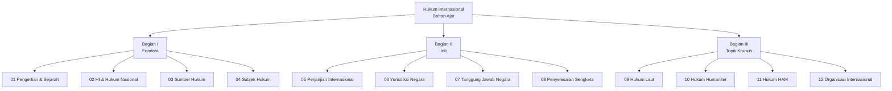
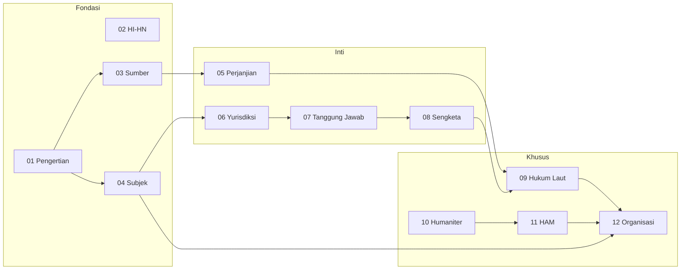

# Panduan Navigasi — Hukum Internasional

Halaman ini menyediakan indeks navigasi terstruktur untuk seluruh bahan ajar mata kuliah Hukum Internasional. Dua belas bab dikelompokkan ke dalam tiga bagian tematik yang mencerminkan struktur pembelajaran dari konsep dasar menuju topik khusus.

---

## Bagian I: Fondasi Hukum Internasional (Bab 01–04)

Bagian pertama membahas landasan konseptual hukum internasional. Keempat bab ini memberikan fondasi yang diperlukan untuk memahami seluruh materi selanjutnya, meliputi pengertian dan sejarah, hubungan dengan hukum nasional, sumber-sumber hukum, serta subjek hukum internasional.

### [[01_Pengertian_Sejarah_HI]]
**Pengertian, Hakikat, dan Sejarah Hukum Internasional**

Bab pembuka ini menguraikan definisi hukum internasional dari berbagai perspektif ahli, hakikat hukum internasional sebagai sistem hukum yang mengikat, serta sejarah perkembangannya dari masa kuno (Yunani, Romawi, tradisi hukum Islam) hingga era kontemporer. Dibahas pula perdebatan mengenai apakah hukum internasional merupakan "hukum" dalam arti sesungguhnya, termasuk pandangan John Austin, H.L.A. Hart, dan aliran-aliran pemikiran hukum internasional.

**Kata kunci:** definisi hukum internasional, *jus gentium*, Grotius, positivisme, naturalisme, sejarah hukum internasional

---

### [[02_Hubungan_HI_HN]]
**Hubungan Hukum Internasional dan Hukum Nasional**

Bab ini membahas teori monisme dan dualisme dalam hubungan antara hukum internasional dan hukum nasional. Dikaji pula praktik berbagai negara dalam menginkorporasi hukum internasional ke dalam sistem hukum domestik, termasuk praktik Indonesia dalam transformasi perjanjian internasional melalui mekanisme ratifikasi dan undang-undang pengesahan.

**Kata kunci:** monisme, dualisme, inkorporasi, transformasi, *self-executing treaty*, UU 24/2000

---

### [[03_Sumber_Hukum_Internasional]]
**Sumber-Sumber Hukum Internasional**

Pembahasan mendalam mengenai sumber-sumber hukum internasional sebagaimana tercantum dalam Pasal 38(1) Statuta Mahkamah Internasional: perjanjian internasional (*treaties*), hukum kebiasaan internasional (*customary international law*), prinsip-prinsip umum hukum (*general principles of law*), serta sumber-sumber tambahan berupa putusan pengadilan dan doktrin. Dibahas pula konsep *jus cogens* dan kewajiban *erga omnes*.

**Kata kunci:** Pasal 38 Statuta ICJ, perjanjian internasional, kebiasaan internasional, *opinio juris*, *jus cogens*, *erga omnes*

---

### [[04_Subjek_Hukum_Internasional]]
**Subjek-Subjek Hukum Internasional**

Bab ini mengidentifikasi dan menganalisis berbagai entitas yang memiliki personalitas hukum dalam hukum internasional. Dimulai dari negara sebagai subjek utama (kriteria Konvensi Montevideo 1933), organisasi internasional, individu, gerakan pembebasan nasional, Tahta Suci, ICRC, hingga perdebatan mengenai status perusahaan multinasional dan aktor non-negara lainnya.

**Kata kunci:** personalitas hukum, Konvensi Montevideo, pengakuan negara, organisasi internasional, individu, *Reparation for Injuries*

---

## Bagian II: Inti Hukum Internasional (Bab 05–08)

Bagian kedua membahas norma-norma dan mekanisme inti yang membentuk kerangka operasional hukum internasional. Keempat bab ini mengkaji hukum perjanjian, yurisdiksi negara, tanggung jawab negara, dan penyelesaian sengketa—topik-topik yang menjadi tulang punggung praktik hukum internasional.

### [[05_Perjanjian_Internasional]]
**Hukum Perjanjian Internasional**

Analisis komprehensif mengenai hukum perjanjian internasional berdasarkan Konvensi Wina tentang Hukum Perjanjian 1969. Mencakup pembentukan perjanjian (negosiasi, adopsi, autentikasi, persetujuan untuk terikat), reservasi, pemberlakuan dan penerapan, interpretasi (Pasal 31-33), amandemen dan modifikasi, ketidakabsahan, pengakhiran dan penangguhan, serta praktik Indonesia dalam pembuatan perjanjian internasional (UU 24/2000).

**Kata kunci:** Konvensi Wina 1969, *pacta sunt servanda*, reservasi, interpretasi, ratifikasi, UU 24/2000

---

### [[06_Yurisdiksi_Negara]]
**Yurisdiksi Negara**

Pembahasan mengenai konsep yurisdiksi negara dalam hukum internasional, meliputi yurisdiksi legislatif, eksekutif, dan yudikatif. Dikaji berbagai prinsip yurisdiksi: teritorial, nasionalitas (aktif dan pasif), perlindungan, dan universalitas. Termasuk pembahasan mengenai imunitas negara (*sovereign immunity*), imunitas diplomatik dan konsuler (Konvensi Wina 1961 dan 1963), serta kasus-kasus penting seperti *Lotus* (1927) dan *Arrest Warrant* (2002).

**Kata kunci:** yurisdiksi teritorial, yurisdiksi universal, imunitas negara, imunitas diplomatik, kasus *Lotus*, kasus *Arrest Warrant*

---

### [[07_Tanggung_Jawab_Negara]]
**Tanggung Jawab Negara**

Bab ini mengkaji doktrin tanggung jawab negara berdasarkan Artikel-Artikel ILC tentang Tanggung Jawab Negara atas Perbuatan yang Salah secara Internasional (2001). Pembahasan meliputi atribusi perbuatan kepada negara, pelanggaran kewajiban internasional, keadaan-keadaan yang menghapuskan sifat melawan hukum, konsekuensi hukum pelanggaran, invokasi tanggung jawab, serta mekanisme pemulihan (*reparation*: restitusi, kompensasi, satisfaksi).

**Kata kunci:** Artikel ILC 2001, atribusi, pelanggaran, *force majeure*, *countermeasures*, reparasi, kompensasi

---

### [[08_Penyelesaian_Sengketa]]
**Penyelesaian Sengketa Internasional**

Pembahasan komprehensif mengenai mekanisme penyelesaian sengketa internasional secara damai sebagaimana diwajibkan oleh Pasal 2(3) dan Pasal 33 Piagam PBB. Mencakup metode diplomatik (negosiasi, jasa-jasa baik, mediasi, konsiliasi, penyelidikan), metode hukum (arbitrase dan ajudikasi), peran ICJ, tribunal-tribunal khusus, dan perkembangan mekanisme penyelesaian sengketa dalam kerangka organisasi internasional seperti WTO DSB.

**Kata kunci:** Pasal 33 Piagam PBB, negosiasi, mediasi, arbitrase, ICJ, WTO DSB

---

## Bagian III: Topik Khusus (Bab 09–12)

Bagian ketiga mengeksplorasi bidang-bidang khusus hukum internasional yang memiliki signifikansi praktis tinggi. Keempat bab ini membahas rezim hukum laut, hukum humaniter, hukum hak asasi manusia, dan organisasi internasional—topik-topik yang relevan dengan tantangan global kontemporer.

### [[09_Hukum_Laut_Internasional]]
**Hukum Laut Internasional**

Analisis mendalam mengenai rezim hukum laut internasional berdasarkan UNCLOS 1982. Bab ini membahas sejarah kodifikasi hukum laut, zona-zona maritim (laut teritorial, zona tambahan, ZEE, landas kontinen, laut lepas, Kawasan), hak lintas (*innocent passage*, *transit passage*, *archipelagic sea lanes passage*), serta kedudukan Indonesia sebagai negara kepulauan terbesar di dunia. Dibahas pula sengketa Laut China Selatan, Putusan PCA dalam *Philippines v. China* (2016), delimitasi batas maritim Indonesia, dan ALKI.

**Kata kunci:** UNCLOS, zona maritim, ZEE, negara kepulauan, Deklarasi Djuanda, ALKI, *Philippines v. China*, ITLOS

---

### [[10_Hukum_Humaniter_Internasional]]
**Hukum Humaniter Internasional**

Bab ini membahas hukum humaniter internasional (*jus in bello*) yang mengatur pelaksanaan konflik bersenjata. Mencakup sejarah perkembangan dari Pertempuran Solferino 1859 hingga Statuta Roma 1998, Konvensi Jenewa 1949 dan Protokol Tambahan 1977, prinsip-prinsip dasar (pembedaan, proporsionalitas, kebutuhan militer, kemanusiaan), perlindungan korban, senjata terlarang, klasifikasi konflik bersenjata, pelanggaran berat, peran ICRC, serta implementasi di Indonesia.

**Kata kunci:** Konvensi Jenewa, Protokol Tambahan, *jus in bello*, pembedaan, proporsionalitas, ICRC, kejahatan perang, ICC

---

### [[11_Hukum_HAM_Internasional]]
**Hukum Hak Asasi Manusia Internasional**

Pembahasan komprehensif mengenai sistem perlindungan hak asasi manusia internasional. Bab ini mengkaji sejarah perkembangan HAM, UDHR 1948, ICCPR, ICESCR, *International Bill of Rights*, mekanisme penegakan PBB (*treaty bodies*, UPR, Prosedur Khusus), sistem HAM regional (Eropa, Inter-Amerika, Afrika, ASEAN), konvensi-konvensi khusus (CEDAW, CRC, CRPD), derogasi dan pembatasan HAM, serta implementasi di Indonesia termasuk UU 39/1999, Komnas HAM, dan *Business and Human Rights*.

**Kata kunci:** UDHR, ICCPR, ICESCR, HAM, Komnas HAM, UPR, CEDAW, *Ruggie Principles*, derogasi

---

### [[12_Organisasi_Internasional]]
**Organisasi Internasional**

Bab penutup ini membahas peran dan fungsi organisasi internasional dalam tata kelola global. Mencakup sejarah perkembangan dari abad ke-19, definisi dan karakteristik organisasi internasional, Perserikatan Bangsa-Bangsa (Majelis Umum, Dewan Keamanan, ICJ, Sekretariat), badan-badan khusus (WHO, UNESCO, ILO, FAO), organisasi regional (EU, AU, OAS), ASEAN (Piagam 2007, *ASEAN Way*, tiga pilar), tanggung jawab organisasi internasional (ARIO), imunitas, serta peran Indonesia di PBB dan organisasi internasional.

**Kata kunci:** PBB, Majelis Umum, Dewan Keamanan, veto, ICJ, ASEAN, *ASEAN Way*, ARIO, *peacekeeping*

---

## Diagram Struktur Bahan Ajar

## Peta Keterkaitan Antarbab

## Petunjuk Navigasi

Setiap bab dalam bahan ajar ini menggunakan format Markdown dengan fitur-fitur berikut yang memudahkan navigasi:

**Tautan silang (*cross-references*):** Setiap bab menyertakan tautan ke bab-bab lain yang relevan menggunakan format `[[nama_bab]]`. Tautan ini memungkinkan pembaca untuk melompat langsung ke materi terkait tanpa harus mencari secara manual.

**Daftar isi internal:** Setiap bab memiliki struktur heading yang konsisten, memungkinkan pembaca untuk menggunakan fitur daftar isi otomatis pada platform Quartz untuk menavigasi antar bagian dalam satu bab.

**Diagram dan tabel:** Diagram mermaid dan tabel perbandingan dalam setiap bab berfungsi sebagai alat bantu visual untuk memahami hubungan antarkonsep dan mempercepat pemahaman materi.

Untuk kembali ke halaman utama, gunakan tautan [[README|Halaman Utama]].

---

*Panduan navigasi ini diperbarui secara otomatis seiring dengan penambahan materi baru ke dalam bahan ajar.*
