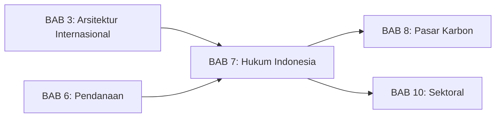
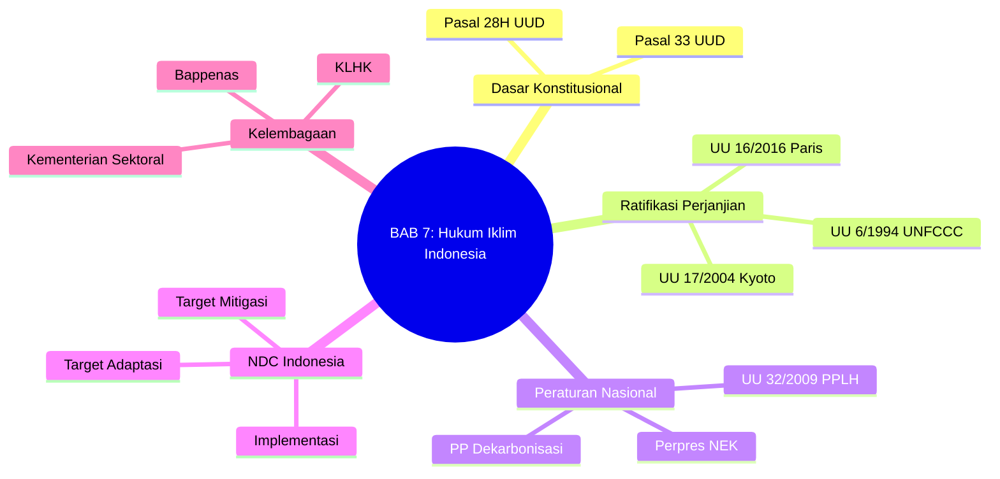
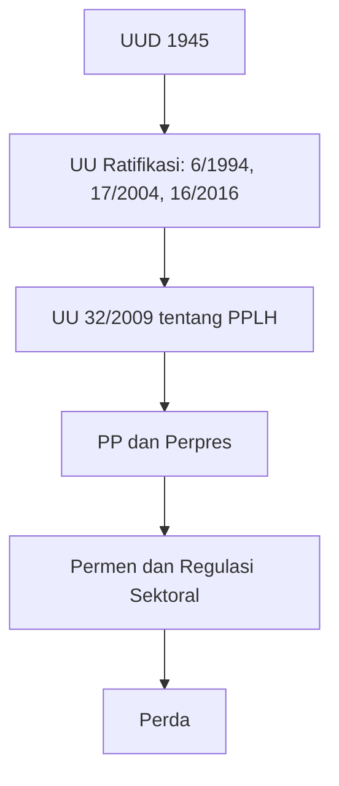
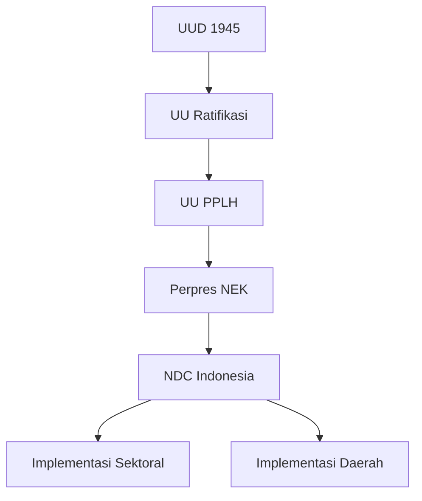

# BAB 7: Kerangka Hukum Iklim Indonesia

---

## A. PENDAHULUAN

### 1. Capaian Pembelajaran (Sub-CPMK)

Setelah mempelajari bab ini, mahasiswa mampu:

1. **Menjelaskan** hierarki peraturan perundang-undangan terkait iklim di Indonesia
2. **Menganalisis** internalisasi kewajiban internasional ke dalam hukum nasional
3. **Mengevaluasi** kelembagaan dan koordinasi aksi iklim nasional
4. **Mengidentifikasi** tantangan dan peluang penguatan hukum iklim Indonesia

### 2. Indikator Pencapaian

- [ ] Mahasiswa dapat menyebutkan peraturan utama terkait iklim di Indonesia
- [ ] Mahasiswa dapat menjelaskan substansi NDC Indonesia dan implementasinya
- [ ] Mahasiswa dapat menguraikan peran berbagai kementerian/lembaga dalam aksi iklim
- [ ] Mahasiswa dapat menganalisis kesenjangan dalam kerangka hukum iklim nasional

### 3. Deskripsi Singkat

Bagaimana Indonesia menerjemahkan komitmen internasional ke dalam hukum dan kebijakan nasional? Bab ini akan mengajak Anda menelusuri kerangka hukum iklim Indonesia—dari UUD 1945 hingga peraturan teknis sektoral, dari ratifikasi perjanjian internasional hingga implementasi NDC di tingkat daerah.

### 4. Hubungan dengan Bab Lain

Bab ini menghubungkan kerangka internasional (BAB 3, 4, 5, 6) dengan konteks Indonesia, dan menjadi dasar untuk BAB 8 (Pasar Karbon Indonesia) dan BAB 10 (Hukum Iklim Sektoral).

### 5. Peta Konsep Bab

---

## B. PENYAJIAN MATERI

### 1. Dasar Konstitusional Hukum Iklim

Hukum iklim Indonesia bersumber dari konstitusi negara—UUD 1945—yang menyediakan landasan fundamental bagi perlindungan lingkungan hidup dan pembangunan berkelanjutan. Berbeda dengan beberapa negara yang memiliki konstitusi lebih tua, Indonesia beruntung memiliki amandemen konstitusi pasca-reformasi yang secara eksplisit mengakui hak atas lingkungan sebagai hak asasi manusia.[^1]

Dalam konteks perubahan iklim, landasan konstitusional ini memiliki implikasi ganda: di satu sisi, memberikan dasar legitimasi bagi negara untuk mengambil tindakan mitigasi dan adaptasi; di sisi lain, menciptakan kewajiban konstitusional negara untuk melindungi warga negara dari dampak iklim dan menjadi dasar potensial bagi litigasi iklim berbasis hak konstitusional.

[^1]: Wibisana AG, 'Three Principles of Environmental Law: the Polluter-Pays Principle, the Principle of Prevention, and the Precautionary Principle' in Mahy P dan Crosby M (eds), *The Rule of Law in Indonesia: Rhetoric and Emerging Reality* (Brill 2019) 295.

#### 1.1 Hak Konstitusional atas Lingkungan: Pasal 28H ayat (1) UUD 1945

Pasal 28H ayat (1) UUD 1945, hasil Amandemen Kedua (2000), menjamin bahwa:

> [!quote] **Kutipan**
> "Setiap orang berhak hidup sejahtera lahir dan batin, bertempat tinggal, dan mendapatkan **lingkungan hidup yang baik dan sehat** serta berhak memperoleh pelayanan kesehatan."
> — *Pasal 28H ayat (1), UUD 1945*

Ketentuan ini menempatkan Indonesia dalam kelompok negara-negara yang secara konstitusional mengakui **hak atas lingkungan yang sehat** (*right to a healthy environment*). Pengakuan ini bukan sekadar deklarasi—ia menciptakan hak subjektif yang dapat dituntut pemenuhannya oleh warga negara melalui mekanisme judicial review maupun gugatan perdata.[^2]

Dalam konteks iklim, Pasal 28H dapat ditafsirkan secara progresif untuk mencakup perlindungan dari dampak perubahan iklim. Argumentasinya sebagai berikut: perubahan iklim menyebabkan peningkatan suhu, perubahan pola curah hujan, kenaikan muka laut, dan peningkatan kejadian ekstrem—semuanya berdampak negatif pada kualitas lingkungan hidup. Dengan demikian, kegagalan negara mengambil langkah mitigasi dan adaptasi yang memadai dapat dianggap sebagai pelanggaran hak konstitusional warga atas lingkungan yang sehat.[^3]

Beberapa kasus di pengadilan Indonesia telah menggunakan Pasal 28H sebagai dasar gugatan lingkungan. Kasus polusi udara Jakarta (2021), misalnya, menggunakan hak konstitusional ini sebagai salah satu dasar gugatan terhadap pemerintah atas kualitas udara yang buruk.[^4] Meskipun bukan kasus iklim murni, preseden ini membuka jalan bagi litigasi iklim berbasis konstitusi di masa depan.

[^2]: Mahkamah Konstitusi RI, 'Putusan No. 001-021-022/PUU-I/2003' (2004) 38-42.
[^3]: Peel J and Osofsky HM, *Climate Change Litigation: Regulatory Pathways to Cleaner Energy* (Cambridge University Press 2015) 35-40.
[^4]: Pengadilan Negeri Jakarta Pusat, Putusan No. 374/Pdt.G/LH/2019/PN Jkt.Pst (16 September 2021).

#### 1.2 Pembangunan Berkelanjutan: Pasal 33 ayat (3) dan (4) UUD 1945

Dimensi konstitusional kedua yang relevan dengan hukum iklim adalah Pasal 33 tentang perekonomian nasional, khususnya ayat (3) dan (4):

> [!quote] **Kutipan**
> "(3) Bumi dan air dan kekayaan alam yang terkandung di dalamnya dikuasai oleh negara dan dipergunakan untuk sebesar-besar kemakmuran rakyat.
>
> (4) Perekonomian nasional diselenggarakan berdasar atas demokrasi ekonomi dengan prinsip kebersamaan, efisiensi berkeadilan, berkelanjutan, **berwawasan lingkungan**, kemandirian, serta dengan menjaga keseimbangan kemajuan dan kesatuan ekonomi nasional."
> — *Pasal 33 ayat (3) dan (4), UUD 1945*

Pasal 33 ayat (4)—ditambahkan melalui Amandemen Keempat (2002)—secara eksplisit memasukkan prinsip **"berkelanjutan"** dan **"berwawasan lingkungan"** sebagai bagian dari demokrasi ekonomi Indonesia. Ini merupakan konstitusionalisasi prinsip pembangunan berkelanjutan (*sustainable development*) yang diakui dalam hukum lingkungan internasional sejak Deklarasi Rio 1992.[^5]

Makna normatif dari ketentuan ini adalah bahwa pengelolaan sumber daya alam dan perekonomian nasional **harus** mempertimbangkan keberlanjutan lingkungan—bukan sekadar "dapat" atau "sebaiknya." Ini memberikan landasan konstitusional bagi kebijakan pembangunan rendah karbon dan transisi energi. Ketika pemerintah mengambil kebijakan untuk membatasi emisi gas rumah kaca—yang mungkin berdampak pada kegiatan ekonomi tertentu—Pasal 33 ayat (4) dapat dijadikan justifikasi konstitusional bahwa pembangunan berkelanjutan adalah amanat konstitusi, bukan sekadar pilihan kebijakan.[^6]

Kaitan antara Pasal 33 ayat (3) tentang penguasaan negara atas sumber daya alam dengan ayat (4) tentang keberlanjutan juga memiliki implikasi pada pengelolaan sumber daya energi fosil. Mahkamah Konstitusi dalam berbagai putusannya telah menafsirkan bahwa "penguasaan negara" mencakup kewenangan untuk mengatur (*regelendaad*), mengurus (*bestuursdaad*), mengelola (*beheersdaad*), dan mengawasi (*toezichthoudensdaad*) pemanfaatan sumber daya alam "untuk sebesar-besar kemakmuran rakyat."[^7] Kemakmuran rakyat yang berkelanjutan dan berwawasan lingkungan mensyaratkan transisi dari ekonomi berbasis fosil—sebuah implikasi yang semakin relevan dalam konteks komitmen iklim Indonesia.

[^5]: Wibisana AG, 'Campur Tangan Pemerintah dalam Pengelolaan Lingkungan: Sebuah Penelusuran Teoretis Berdasarkan Analisis Ekonomi atas Hukum' (2017) 47 Jurnal Hukum & Pembangunan 151, 160-165.
[^6]: Santosa MA, *Good Governance dan Hukum Lingkungan* (ICEL 2001) 85-90.
[^7]: Mahkamah Konstitusi RI, 'Putusan No. 36/PUU-X/2012' (2012) 99-100.

---

### 2. Ratifikasi Perjanjian Iklim Internasional

Indonesia telah menjadi bagian dari rezim iklim internasional sejak awal pembentukannya. Sebagai negara kepulauan terbesar di dunia dengan kerentanan tinggi terhadap dampak iklim, Indonesia memiliki kepentingan strategis dalam arsitektur hukum iklim global. Pada saat yang sama, sebagai negara berkembang dengan emisi signifikan (terutama dari sektor kehutanan), Indonesia juga menjadi aktor penting dalam upaya mitigasi global.[^8]

[^8]: Tacconi L, Jotzo F and Grafton RQ (eds), *Green Growth and Tipping Points: Modelling Sustainability in Tropical Forests and Biodiversity Conservation* (Taylor & Francis 2021) 145-160.

#### 2.1 Kronologi dan Substansi Ratifikasi

Indonesia telah meratifikasi ketiga perjanjian utama dalam rezim iklim internasional melalui instrumen undang-undang:

| Perjanjian | Instrumen Ratifikasi | Kewajiban Utama |
|------------|---------------------|-----------------|
| UNFCCC 1992 | UU No. 6 Tahun 1994 | National communication, inventarisasi GRK |
| Protokol Kyoto 1997 | UU No. 17 Tahun 2004 | Host country CDM, tidak ada target emisi |
| Persetujuan Paris 2015 | UU No. 16 Tahun 2016 | NDC, MRV, kontribusi pendanaan |

**Tabel 7.1.** Ratifikasi perjanjian iklim oleh Indonesia

**UNFCCC (1994)**: Indonesia termasuk negara-negara yang relatif cepat meratifikasi UNFCCC—hanya dua tahun setelah Rio Earth Summit. UU No. 6 Tahun 1994 tentang Pengesahan UNFCCC menjadikan Indonesia sebagai Pihak Konvensi dengan kewajiban sesuai status Non-Annex I: menyiapkan National Communication secara berkala, melakukan inventarisasi emisi, dan mengintegrasikan iklim dalam perencanaan pembangunan.[^9]

**Protokol Kyoto (2004)**: Ratifikasi Protokol Kyoto melalui UU No. 17 Tahun 2004 menempatkan Indonesia sebagai host country potensial untuk proyek Clean Development Mechanism (CDM). Sebagai negara Non-Annex I, Indonesia tidak memiliki target pengurangan emisi yang mengikat, namun dapat menjadi lokasi proyek CDM yang menghasilkan Certified Emission Reductions (CERs) untuk negara maju.[^10]

**Persetujuan Paris (2016)**: Indonesia meratifikasi Persetujuan Paris melalui UU No. 16 Tahun 2016 pada 24 Oktober 2016—tepat pada saat *entry into force* Persetujuan ini. Berbeda dengan Protokol Kyoto, Persetujuan Paris mewajibkan semua Pihak—termasuk Indonesia—untuk mengkomunikasikan dan mengimplementasikan NDC, serta berpartisipasi dalam kerangka transparansi yang diperkuat.[^11]

[^9]: Undang-Undang Nomor 6 Tahun 1994 tentang Pengesahan United Nations Framework Convention on Climate Change (Konvensi Kerangka Kerja Perserikatan Bangsa-Bangsa mengenai Perubahan Iklim), Penjelasan Umum.
[^10]: Undang-Undang Nomor 17 Tahun 2004 tentang Pengesahan Kyoto Protocol to the United Nations Framework Convention on Climate Change, Penjelasan Umum.
[^11]: Undang-Undang Nomor 16 Tahun 2016 tentang Pengesahan Paris Agreement to the United Nations Framework Convention on Climate Change (Persetujuan Paris atas Konvensi Kerangka Kerja Perserikatan Bangsa-Bangsa mengenai Perubahan Iklim), ps 1.

#### 2.2 Status Hukum dan Implikasi Ratifikasi

Pemahaman tentang status hukum perjanjian internasional yang diratifikasi adalah krusial dalam sistem hukum Indonesia. UU No. 24 Tahun 2000 tentang Perjanjian Internasional mengatur bahwa perjanjian internasional yang menyangkut kepentingan luas rakyat—seperti perjanjian iklim—harus diratifikasi dengan undang-undang.[^12]

Terdapat perdebatan akademik mengenai apakah Indonesia menganut sistem **monisme** (perjanjian internasional otomatis menjadi hukum nasional) atau **dualisme** (memerlukan transformasi terpisah). Pandangan dominan menyatakan bahwa Indonesia menganut **dualisme moderat**: perjanjian yang diratifikasi dengan UU menjadi bagian dari hukum nasional, namun implementasi substansifnya masih memerlukan peraturan domestik yang lebih operasional.[^13]

Implikasi praktis dari pendekatan ini:

**Pertama**, ketentuan-ketentuan dalam Persetujuan Paris yang bersifat umum—seperti kewajiban menyampaikan NDC atau berpartisipasi dalam Global Stocktake—secara langsung mengikat Indonesia sebagai Pihak.

**Kedua**, ketentuan yang memerlukan implementasi teknis—seperti sistem MRV, kerangka transparansi, atau mekanisme Pasal 6—memerlukan pengaturan lebih lanjut dalam peraturan domestik. Ini menjelaskan mengapa diperlukan berbagai Perpres dan PP untuk mengimplementasikan Persetujuan Paris.

**Ketiga**, dari perspektif litigasi, penggugat tidak dapat langsung menggunakan ketentuan Persetujuan Paris sebagai dasar gugatan di pengadilan Indonesia kecuali ketentuan tersebut bersifat *self-executing* atau sudah diimplementasikan dalam peraturan domestik.[^14]

> [!warning] **Perhatian: Dualisme Hukum Indonesia**
> Sistem dualisme moderat Indonesia mengharuskan komitmen internasional diterjemahkan ke dalam hierarki peraturan domestik: UU, PP, Perpres, Permen, hingga Perda. Kesenjangan antara ratifikasi dan implementasi—yang disebut *implementation gap*—menjadi tantangan serius dalam efektivitas hukum iklim nasional.

[^12]: Undang-Undang Nomor 24 Tahun 2000 tentang Perjanjian Internasional, ps 10 ayat (1).
[^13]: Kusumaatmadja M dan Sidharta BA, *Pengantar Hukum Internasional* (Alumni 2012) 85-90.
[^14]: Agusman DH, 'Praktik Indonesia dalam Pemberlakuan Perjanjian Internasional' (2015) 12 Jurnal Hukum Internasional 449, 460-465.

---

### 3. Peraturan Perundang-undangan Terkait Iklim

Berbeda dengan beberapa negara maju yang telah memiliki undang-undang iklim tersendiri—seperti UK Climate Change Act (2008) atau German Federal Climate Protection Act (2019)—Indonesia belum memiliki UU khusus tentang perubahan iklim. Regulasi iklim tersebar dalam berbagai peraturan sektoral, menciptakan lanskap hukum yang kompleks namun juga fleksibel.[^15]

Pendekatan Indonesia ini memiliki kelebihan dan kekurangan. Di satu sisi, fragmentasi memungkinkan penyesuaian dengan karakteristik masing-masing sektor. Di sisi lain, ia menciptakan tantangan koordinasi dan potensi inkonsistensi antar-regulasi.

[^15]: Widjaja I dan Subekti R, 'Climate Change Governance in Indonesia: Fragmented Authority, Policy Incoherence, and the Need for Integration' (2023) 53 Environmental Policy and Governance 165, 170-175.

#### 3.1 Hierarki dan Landscape Peraturan Iklim

Memahami hierarki peraturan perundang-undangan Indonesia adalah langkah awal memahami arsitektur hukum iklim nasional. Berdasarkan UU No. 12 Tahun 2011 tentang Pembentukan Peraturan Perundang-undangan (sebagaimana diubah dengan UU No. 13 Tahun 2022), hierarki yang relevan untuk hukum iklim adalah:[^16]

Setiap tingkatan memiliki fungsi berbeda: UU menetapkan norma pokok, PP/Perpres mengatur pelaksanaan, Permen memberikan aturan teknis, dan Perda mengimplementasikan di tingkat daerah. Dalam konteks iklim, keterkaitan vertikal ini menjadi krusial karena kebijakan nasional harus dapat dioperasionalkan hingga tingkat daerah.

[^16]: Undang-Undang Nomor 12 Tahun 2011 tentang Pembentukan Peraturan Perundang-undangan, ps 7 ayat (1) sebagaimana diubah dengan Undang-Undang Nomor 13 Tahun 2022.

#### 3.2 UU No. 32 Tahun 2009 tentang PPLH sebagai Payung Hukum

**Undang-Undang Nomor 32 Tahun 2009 tentang Perlindungan dan Pengelolaan Lingkungan Hidup** (UU PPLH) adalah undang-undang pokok lingkungan hidup Indonesia yang menjadi payung bagi berbagai pengaturan iklim. Meskipun bukan UU iklim per se, UU PPLH menyediakan fondasi normatif, prinsip, dan instrumen yang relevan.[^17]

**Asas-asas yang relevan** (Pasal 2) meliputi: asas tanggung jawab negara, kelestarian dan keberlanjutan, keserasian dan keseimbangan, keterpaduan, manfaat, **kehati-hatian** (*precautionary principle*), keadilan, ekoregion, keanekaragaman hayati, **pencemar membayar** (*polluter pays principle*), partisipatif, kearifan lokal, tata kelola pemerintahan yang baik, dan otonomi daerah. Prinsip kehati-hatian dan pencemar membayar adalah dua pilar yang sangat relevan untuk kebijakan iklim.[^18]

**Tujuan** (Pasal 3) mencakup perlindungan wilayah Indonesia dari pencemaran dan kerusakan lingkungan, menjamin keselamatan, kesehatan, dan kehidupan manusia, serta menjamin **kelangsungan kehidupan makhluk hidup dan kelestarian ekosistem**, menjaga kelestarian fungsi lingkungan, mencapai **keadilan antargenerasi**, dan menjamin pemenuhan dan perlindungan hak atas lingkungan hidup. Keadilan antargenerasi (*intergenerational equity*)—konsep bahwa generasi sekarang bertanggung jawab melestarikan lingkungan untuk generasi mendatang—adalah prinsip fundamental dalam hukum iklim.[^19]

**Instrumen KLHS** (Pasal 15-17) adalah alat penting dalam konteks iklim. Kajian Lingkungan Hidup Strategis wajib dilakukan oleh pemerintah dan pemerintah daerah dalam penyusunan atau evaluasi Rencana Tata Ruang Wilayah (RTRW), Rencana Pembangunan Jangka Panjang/Menengah (RPJP/RPJM), dan kebijakan, rencana, dan/atau program yang berpotensi berdampak atau berisiko lingkungan.[^20] KLHS yang dilakukan dengan benar seharusnya mempertimbangkan dampak iklim dari kebijakan yang diusulkan.

**Instrumen AMDAL** (Pasal 22-33) mengatur kajian dampak lingkungan untuk kegiatan yang berpotensi menimbulkan dampak penting. Dalam konteks iklim, AMDAL seharusnya mencakup analisis emisi GRK yang dihasilkan proyek dan ketahanan proyek terhadap dampak iklim. Namun, integrasi aspek iklim dalam AMDAL masih memerlukan penguatan.[^21]

[^17]: Undang-Undang Nomor 32 Tahun 2009 tentang Perlindungan dan Pengelolaan Lingkungan Hidup, Penjelasan Umum.
[^18]: ibid ps 2.
[^19]: ibid ps 3.
[^20]: ibid ps 15-17.
[^21]: Diantoro TD, 'Integrasi Perubahan Iklim dalam AMDAL: Kebutuhan dan Tantangan' (2022) 52 Jurnal Hukum Lingkungan Indonesia 25, 30-35.

#### 3.3 Peraturan Pelaksana Utama

Di bawah payung UU PPLH dan UU ratifikasi, berbagai PP dan Perpres mengatur implementasi kebijakan iklim secara lebih operasional:

| Peraturan | Substansi | Relevansi Iklim |
|-----------|-----------|-----------------|
| **Perpres 98/2021** | Nilai Ekonomi Karbon (NEK) | Kerangka pasar karbon, perdagangan emisi, pajak karbon |
| **PP 46/2017 jo. PP 14/2021** | Instrumen Ekonomi LH | Dasar hukum BPDLH, instrumen ekonomi |
| **Perpres 22/2017** | RUEN | Roadmap energi nasional, bauran EBT |
| **Perpres 112/2022** | Percepatan Pengembangan EBT | Insentif energi terbarukan, transisi energi |
| **PP 40/2025** | Dekarbonisasi Ketenagalistrikan | Pensiun dini PLTU, cap emisi sektor listrik |
| **PP 98/2023** | Penyelenggaraan NEK | Aturan teknis bursa karbon |

**Tabel 7.2.** Peraturan pelaksana utama terkait iklim

**Perpres 98/2021 tentang Penyelenggaraan Nilai Ekonomi Karbon** menjadi peraturan paling signifikan dalam arsitektur hukum iklim Indonesia pasca-Persetujuan Paris. Perpres ini menetapkan kerangka hukum untuk berbagai instrumen ekonomi karbon: perdagangan emisi dalam negeri (*cap and trade* dan *offset*), pungutan atas karbon (pajak karbon), pembayaran berbasis kinerja (*Results-Based Payment*/RBP), dan kontribusi berbasis hasil untuk mekanisme internasional seperti REDD+.[^22]

Perpres NEK juga mengatur tata kelola kelembagaan pasar karbon, termasuk pembentukan sistem registri nasional, penunjukan lembaga verifikasi, dan mekanisme pelaporan. Pembahasan mendalam tentang Perpres NEK tersedia di [[08-Nilai-Ekonomi-Karbon/BAB-08|BAB 8]].

**PP 40/2025 tentang Dekarbonisasi Sektor Ketenagalistrikan** adalah regulasi terbaru yang mengatur transisi energi di sektor listrik—sektor dengan emisi terbesar setelah FOLU. PP ini menetapkan roadmap pensiun dini PLTU batubara, cap emisi untuk sektor listrik, dan integrasi dengan sistem perdagangan emisi.[^23]

[^22]: Peraturan Presiden Nomor 98 Tahun 2021 tentang Penyelenggaraan Nilai Ekonomi Karbon untuk Pencapaian Target Kontribusi yang Ditetapkan Secara Nasional dan Pengendalian Emisi Gas Rumah Kaca dalam Pembangunan Nasional, ps 4-20.
[^23]: Peraturan Pemerintah Nomor 40 Tahun 2025 tentang Dekarbonisasi Sektor Ketenagalistrikan untuk Pencapaian Target Kontribusi yang Ditetapkan Secara Nasional dan Pengendalian Emisi Gas Rumah Kaca.

---

### 4. NDC Indonesia: Komitmen dan Implementasi

**Nationally Determined Contribution** (NDC) Indonesia merupakan dokumen resmi yang menjabarkan komitmen iklim nasional di bawah Persetujuan Paris. Sebagai instrumen utama implementasi Paris Agreement, NDC memuat target-target kuantitatif mitigasi dan adaptasi yang akan dicapai Indonesia hingga 2030. Dokumen ini bersifat dinamis—Persetujuan Paris mewajibkan negara-negara untuk menyampaikan NDC yang semakin ambisius setiap lima tahun.[^24]

Status hukum NDC dalam sistem Indonesia perlu dipahami dengan tepat. NDC adalah komitmen internasional yang dikomunikasikan ke UNFCCC, namun bukan perjanjian internasional yang memerlukan ratifikasi tersendiri. Implementasinya dilakukan melalui berbagai peraturan perundang-undangan domestik yang mengoperasionalkan target-target NDC ke tingkat sektoral dan daerah.[^25]

[^24]: Paris Agreement (adopted 12 December 2015, entered into force 4 November 2016) art 4.
[^25]: KLHK, *Indonesia: Enhanced Nationally Determined Contribution* (September 2022) 5-8.

#### 4.1 Evolusi dan Peningkatan Ambisi NDC

Indonesia telah menyampaikan beberapa versi NDC yang mencerminkan peningkatan ambisi secara bertahap:

| Versi | Tahun | Target Unconditional | Target Conditional | Catatan |
|-------|-------|---------------------|-------------------|---------|
| INDC | 2015 | 29% | 41% | Disampaikan sebelum Paris Agreement |
| First NDC | 2016 | 29% | 41% | Konfirmasi INDC pasca-ratifikasi |
| Updated NDC | 2021 | 29% | 41% | Penegasan komitmen |
| Enhanced NDC | 2022 | 31,89% | 43,20% | Peningkatan ambisi |

**Tabel 7.3.** Evolusi target NDC Indonesia

Target **unconditional** adalah pengurangan emisi yang akan dicapai Indonesia dengan upaya sendiri, tanpa syarat dukungan internasional. Target **conditional** adalah pengurangan yang dapat dicapai jika tersedia dukungan internasional berupa pendanaan, transfer teknologi, dan pengembangan kapasitas.[^26]

Enhanced NDC (2022) menunjukkan peningkatan ambisi dari 29%/41% menjadi 31,89%/43,20%. Persentase ini dihitung terhadap skenario *business as usual* (BAU) 2030. Dalam angka absolut, target unconditional berarti pengurangan emisi sebesar 912 juta ton CO₂e dari proyeksi BAU 2.869 juta ton pada 2030.[^27]

[^26]: ibid 10-12.
[^27]: ibid 15.

#### 4.2 Komponen Mitigasi NDC

NDC Indonesia mengidentifikasi lima sektor prioritas mitigasi dengan kontribusi berbeda terhadap target keseluruhan:

**FOLU (Kehutanan dan Penggunaan Lahan)** menyumbang kontribusi terbesar—sekitar 60% dari total target mitigasi. Ini mencerminkan realitas profil emisi Indonesia di mana sektor lahan (termasuk kebakaran hutan dan gambut serta konversi lahan) secara historis menjadi sumber emisi dominan. Target ambisius **FOLU Net Sink 2030** bermakna bahwa sektor kehutanan akan menjadi penyerap netto karbon—artinya penyerapan CO₂ oleh hutan dan lahan harus melebihi emisi dari deforestasi, degradasi, dan kebakaran.[^28]

Pencapaian FOLU Net Sink memerlukan intervensi masif: moratorium permanen hutan primer dan gambut, rehabilitasi 12 juta hektar lahan kritis, perlindungan 10 juta hektar hutan primer, restorasi 2 juta hektar gambut, dan penegakan hukum terhadap pembalakan dan pembakaran lahan ilegal.[^29]

**Sektor Energi** berkontribusi signifikan dengan target transisi dari bauran energi berbasis fosil ke energi terbarukan. Target Enhanced NDC menetapkan bauran energi baru terbarukan (EBT) sebesar 23% pada 2025 dan minimal 31% pada 2050, dengan ambisi peningkatan lebih lanjut. Pencapaian ini memerlukan pembatasan pembangkit baru berbasis batubara dan percepatan pengembangan PLTS, PLTB, dan geotermal.[^30]

**Sektor Limbah**, **IPPU** (Industri dan Penggunaan Produk), dan **Pertanian** masing-masing berkontribusi lebih kecil namun tetap penting. Limbah mencakup pengelolaan sampah dan air limbah perkotaan; IPPU mencakup efisiensi proses industri; dan pertanian mencakup praktik pertanian rendah emisi seperti *System of Rice Intensification* (SRI).[^31]

> [!tip] **Kotak Pengayaan: FOLU Net Sink 2030**
> Target FOLU Net Sink 2030 adalah komitmen ambisius Indonesia untuk menjadikan sektor kehutanan dan lahan sebagai **penyerap bersih karbon** (*net sink*) pada 2030. Ini berarti agregat penyerapan CO₂ oleh fotosintesis hutan dan vegetasi harus melebihi emisi dari deforestasi, degradasi, dan kebakaran.
>
> Target ini memerlukan:
> - **Penghentian deforestasi bersih** (*zero net deforestation*)
> - **Rehabilitasi** 12 juta hektar lahan kritis
> - **Perlindungan** 10 juta hektar hutan primer
> - **Restorasi** 2 juta hektar lahan gambut
> - **Perhutanan sosial** untuk 12,7 juta hektar
>
> Pencapaian target ini akan menempatkan Indonesia sebagai kontributor signifikan pada upaya mitigasi global melalui penyerapan karbon alami.

[^28]: ibid 20-25.
[^29]: KLHK, *Indonesia Long-Term Strategy for Low Carbon and Climate Resilience 2050 (LTS-LCCR 2050)* (2021) 35-40.
[^30]: Enhanced NDC (n 25) 30-35.
[^31]: ibid 36-42.

#### 4.3 Komponen Adaptasi NDC

Berbeda dengan mitigasi yang bersifat kuantitatif, komponen adaptasi NDC bersifat lebih kualitatif dan programatik. Indonesia mengadopsi pendekatan **empat klaster ketahanan** (*resilience clusters*):

**Ketahanan Ekonomi** mencakup sektor-sektor produktif yang rentan terhadap dampak iklim: pertanian, perikanan, pariwisata, dan infrastruktur ekonomi. Intervensi meliputi pengembangan varietas tanaman tahan iklim, diversifikasi mata pencaharian nelayan, dan penguatan rantai pasok pangan.[^32]

**Ketahanan Sosial dan Penghidupan** fokus pada kelompok masyarakat rentan: masyarakat pesisir, petani kecil, masyarakat adat, dan penduduk perkotaan miskin. Program mencakup sistem peringatan dini berbasis komunitas, asuransi pertanian (AUTP), dan penguatan kapasitas adaptif masyarakat.[^33]

**Ketahanan Ekosistem** mengakui bahwa ekosistem yang sehat adalah fondasi adaptasi. Intervensi mencakup restorasi mangrove dan terumbu karang, pengelolaan DAS terpadu, dan perlindungan ekosistem kritis.

**Ketahanan Wilayah Khusus** mengidentifikasi wilayah dengan kerentanan tinggi yang memerlukan perhatian khusus: wilayah pesisir dan pulau-pulau kecil, wilayah rawan bencana hidrometeorologi, dan perkotaan padat.

[^32]: ibid 50-55.
[^33]: Bappenas, *National Adaptation Plan (RAN-API): Synthesis Report* (2020) 25-30.

#### 4.4 Kerangka Implementasi NDC

Implementasi NDC bukan sekadar dokumen komitmen—ia memerlukan penerjemahan ke dalam sistem perencanaan, penganggaran, dan monitoring nasional. Kerangka implementasi NDC Indonesia mencakup:

**Integrasi dalam Perencanaan Pembangunan**: Target NDC diintegrasikan ke dalam RPJMN (Rencana Pembangunan Jangka Menengah Nasional) dan RPJMD (Rencana Pembangunan Jangka Menengah Daerah). RPJMN 2020-2024 secara eksplisit memuat target-target iklim dan menerjemahkannya ke dalam program prioritas kementerian/lembaga.[^34]

**RAN-GRK dan RAD-GRK**: Rencana Aksi Nasional dan Daerah untuk Pengurangan Emisi Gas Rumah Kaca menjadi dokumen operasional yang menjabarkan aksi mitigasi per sektor dan per provinsi. RAD-GRK di 34 provinsi menerjemahkan target nasional ke konteks daerah dengan mempertimbangkan karakteristik emisi dan kapasitas masing-masing.[^35]

**Sistem MRV** (Monitoring, Reporting, and Verification): Indonesia telah membangun sistem inventarisasi GRK nasional yang dilaporkan secara berkala melalui National Communication dan Biennial Update Report ke UNFCCC. Di bawah Persetujuan Paris, sistem ini akan ditingkatkan menjadi Biennial Transparency Report (BTR) dengan standar yang lebih ketat.[^36]

**Climate Budget Tagging**: Kementerian Keuangan telah mengimplementasikan sistem pelabelan anggaran iklim untuk melacak alokasi APBN yang berkontribusi pada mitigasi dan adaptasi. Sistem ini meningkatkan transparansi dan akuntabilitas pendanaan iklim domestik.

[^34]: Bappenas, *RPJMN 2020-2024: Rencana Pembangunan Jangka Menengah Nasional* (Perpres 18/2020) Lampiran Bidang Lingkungan Hidup.
[^35]: Peraturan Presiden Nomor 61 Tahun 2011 tentang Rencana Aksi Nasional Penurunan Emisi Gas Rumah Kaca, sebagaimana diubah dengan Perpres 98/2021.
[^36]: KLHK, *Indonesia Third Biennial Update Report Under the UNFCCC* (2021) 10-15.

---

### 5. Kelembagaan Aksi Iklim Nasional

Perubahan iklim adalah masalah yang bersifat lintas-sektor (*cross-cutting*) dan lintas-tingkat pemerintahan (*multi-level*). Emisi gas rumah kaca berasal dari hampir semua sektor ekonomi—energi, industri, transportasi, pertanian, kehutanan, dan limbah. Dampaknya menyentuh berbagai aspek kehidupan—kesehatan, ketahanan pangan, infrastruktur, dan ekosistem. Dengan demikian, tata kelola iklim yang efektif memerlukan koordinasi kelembagaan yang kompleks—suatu tantangan yang tidak mudah dalam sistem pemerintahan yang terdesentralisasi seperti Indonesia.[^37]

[^37]: Jagers SC dan Stripple J, 'Climate Governance Beyond the State' (2003) 3 Global Governance 385, 390-395.

#### 5.1 Arsitektur Kelembagaan Nasional

Berbagai kementerian dan lembaga memiliki peran dalam aksi iklim Indonesia, dengan Kementerian Lingkungan Hidup dan Kehutanan (KLHK) sebagai koordinator utama:

| Institusi | Mandat Utama | Instrumen Kunci |
|-----------|--------------|-----------------|
| **KLHK** | Koordinasi kebijakan iklim, kehutanan, inventarisasi GRK | NDC, inventarisasi GRK, National Communication |
| **Bappenas** | Integrasi iklim dalam perencanaan pembangunan | RPJMN/D, RAN-API, climate resilience mainstreaming |
| **Kemenkeu** | Pendanaan iklim, fiskal hijau | Climate Budget Tagging, BPDLH, pajak karbon |
| **Kemen ESDM** | Transisi energi, dekarbonisasi listrik | RUEN, Perpres EBT, PP Dekarbonisasi |
| **Kemenperin** | Dekarbonisasi industri | Industri hijau, efisiensi energi industri |
| **Kemen PUPR** | Infrastruktur tahan iklim | Standar bangunan, pengelolaan air |
| **Kemenhub** | Transportasi rendah karbon | Elektrifikasi transportasi, TOD |
| **Kementan** | Pertanian berkelanjutan | SRI, kalender tanam, varietas adaptif |
| **BMKG** | Informasi iklim | Proyeksi iklim, sistem peringatan dini |

**Tabel 7.4.** Kementerian/lembaga utama dalam aksi iklim

Direktorat Jenderal Pengendalian Perubahan Iklim (Ditjen PPI) di bawah KLHK adalah unit yang secara khusus menangani kebijakan iklim. Ditjen PPI bertanggung jawab atas penyusunan kebijakan mitigasi dan adaptasi, koordinasi antar-sektor, inventarisasi GRK, dan pelaporan internasional ke UNFCCC. Direktur Jenderal PPI juga berfungsi sebagai **National Focal Point UNFCCC** yang mewakili Indonesia dalam negosiasi internasional.[^38]

[^38]: Peraturan Menteri Lingkungan Hidup dan Kehutanan Nomor 18 Tahun 2015 tentang Organisasi dan Tata Kerja Kementerian Lingkungan Hidup dan Kehutanan, Bagian Keempat.

#### 5.2 Mekanisme Koordinasi Nasional

Mengingat sifat lintas-sektor dari kebijakan iklim, berbagai mekanisme koordinasi telah dibentuk:

**Tim Pengarah Perubahan Iklim** di tingkat menteri berfungsi sebagai forum pengambilan keputusan strategis. Tim ini dikoordinasikan oleh Menteri Koordinator Bidang Kemaritiman dan Investasi dan melibatkan menteri-menteri terkait untuk memastikan koherensi kebijakan antar-sektor.[^39]

**Tim Pelaksana** di tingkat Eselon I kementerian/lembaga mengoperasionalkan keputusan Tim Pengarah. Tim ini melakukan koordinasi teknis, pemantauan implementasi, dan pelaporan kemajuan.

**Working Groups Sektoral** fokus pada isu-isu spesifik: energi, kehutanan dan lahan, pertanian, industri, dan limbah. Working groups ini menjadi wadah koordinasi teknis antarunit di berbagai K/L yang menangani sektor yang sama.

**Sekretariat** menyediakan dukungan administratif dan teknis untuk seluruh struktur koordinasi, termasuk penyiapan dokumen, fasilitasi pertemuan, dan dokumentasi keputusan.

[^39]: Peraturan Presiden Nomor 16 Tahun 2015 tentang Kementerian Lingkungan Hidup dan Kehutanan jo. Perpres terkait pembagian tugas kabinet.

#### 5.3 Peran Pemerintah Daerah dalam Tata Kelola Iklim

Dalam sistem desentralisasi Indonesia, pemerintah daerah memiliki kewenangan signifikan yang berdampak pada aksi iklim. UU No. 23 Tahun 2014 tentang Pemerintahan Daerah menetapkan bahwa lingkungan hidup dan kehutanan adalah urusan pemerintahan konkuren yang dibagi antara pusat, provinsi, dan kabupaten/kota.[^40]

Implikasi praktisnya, keberhasilan pencapaian target NDC sangat bergantung pada implementasi di tingkat daerah. Perizinan yang berdampak pada emisi—seperti izin usaha pertambangan, izin lokasi perkebunan, atau izin pembangunan—banyak yang berada di kewenangan daerah. Tanpa komitmen dan kapasitas daerah, target nasional sulit tercapai.

**RAD-GRK** (Rencana Aksi Daerah untuk Pengurangan Emisi Gas Rumah Kaca) adalah instrumen utama untuk menerjemahkan target nasional ke tingkat daerah. Setiap provinsi telah menyusun RAD-GRK yang memuat target pengurangan emisi dan aksi-aksi spesifik sesuai karakteristik daerah masing-masing. RAD-GRK ditetapkan melalui Peraturan Gubernur dan terintegrasi dalam RPJMD.[^41]

**RAD-API** (Rencana Aksi Daerah Adaptasi Perubahan Iklim) melengkapi RAD-GRK dengan fokus pada adaptasi. RAD-API mengidentifikasi kerentanan daerah terhadap dampak iklim dan menetapkan program-program penguatan ketahanan.

> [!warning] **Perhatian: Tantangan Koordinasi Pusat-Daerah**
> Fragmentasi kewenangan antara pusat dan daerah menjadi tantangan serius dalam implementasi NDC. Beberapa masalah yang sering muncul:
>
> - **Inkonsistensi kebijakan**: RTRW daerah yang mengakomodasi ekspansi perkebunan di kawasan hutan, bertentangan dengan target FOLU nasional
> - **Kapasitas tidak merata**: Kapasitas teknis dan pendanaan daerah untuk aksi iklim sangat bervariasi
> - **Insentif berbeda**: Daerah memiliki insentif ekonomi jangka pendek (PAD dari tambang/perkebunan) yang dapat bertentangan dengan target iklim jangka panjang
> - **Koordinasi lemah**: Mekanisme koordinasi vertikal dan horizontal belum optimal

[^40]: Undang-Undang Nomor 23 Tahun 2014 tentang Pemerintahan Daerah, Lampiran Pembagian Urusan Pemerintahan.
[^41]: Peraturan Presiden Nomor 61 Tahun 2011 (n 35) ps 7-9.

---

### 6. Kesenjangan dan Tantangan Hukum Iklim Indonesia

Meskipun Indonesia telah membangun kerangka hukum iklim yang cukup komprehensif dalam dua dekade terakhir, berbagai kesenjangan (*gaps*) masih perlu diatasi untuk memastikan efektivitas aksi iklim nasional. Identifikasi kesenjangan ini penting tidak hanya untuk akademisi, tetapi juga untuk praktisi hukum dan pembuat kebijakan yang bertugas memperkuat kerangka hukum iklim Indonesia.[^42]

[^42]: Wiener JB, 'Climate Change Policy and Policy Change in China' (2008) 55 UCLA Law Review 1805, 1810-1815 (menganalisis kesenjangan antara kebijakan dan implementasi dalam konteks negara berkembang).

#### 6.1 Kesenjangan Regulasi Utama

**Pertama, ketiadaan UU khusus perubahan iklim.** Indonesia belum memiliki undang-undang yang secara khusus dan komprehensif mengatur perubahan iklim—berbeda dengan negara-negara seperti Inggris (*UK Climate Change Act 2008*), Jerman (*Federal Climate Protection Act 2019*), Korea Selatan (*Carbon Neutral Green Growth Act 2021*), dan bahkan Filipina (*Climate Change Act 2009*).[^43]

Ketiadaan UU iklim berdampak pada beberapa hal: target iklim nasional tidak memiliki kekuatan hukum setingkat undang-undang; tidak ada mekanisme akuntabilitas yang jelas jika target tidak tercapai; dan tidak ada kepastian hukum jangka panjang yang dapat mendorong investasi hijau. Target NDC, misalnya, adalah komitmen internasional yang tidak otomatis mengikat secara domestik tanpa implementasi dalam peraturan nasional.

**Kedua, fragmentasi regulasi sektoral.** Regulasi iklim tersebar di berbagai peraturan yang dikeluarkan oleh kementerian/lembaga berbeda: KLHK untuk kehutanan, Kemen ESDM untuk energi, Kementan untuk pertanian, OJK untuk keuangan berkelanjutan, dan seterusnya. Fragmentasi ini menciptakan risiko inkonsistensi, tumpang tindih, dan kesenjangan pengaturan.[^44]

Contoh konkret: pembangunan PLTU batubara baru mungkin masih dimungkinkan oleh regulasi energi meskipun bertentangan dengan target NDC; izin perkebunan masih dapat diterbitkan di kawasan yang seharusnya dilindungi untuk target FOLU. Tanpa kerangka hukum yang terintegrasi, sektor-sektor dapat bergerak ke arah yang berbeda.

**Ketiga, inkonsistensi kebijakan (*policy incoherence*).** Berbagai kebijakan pemerintah bertentangan dengan target iklim. Subsidi energi fosil—baik langsung maupun tidak langsung—masih sangat besar, menciptakan disinsentif untuk transisi energi. DMO (Domestic Market Obligation) untuk batubara dalam negeri menjaga harga batubara tetap murah untuk pembangkit listrik, bertentangan dengan upaya internalisasi eksternalitas karbon.[^45]

**Keempat, kapasitas penegakan hukum yang terbatas.** Indonesia memiliki masalah kronis dalam penegakan hukum lingkungan. Kasus pembakaran hutan dan lahan, misalnya, jarang berujung pada penuntutan yang berhasil meskipun bukti dan dampaknya jelas. Kapasitas pengawasan, investigasi, dan penuntutan masih terbatas, terutama di tingkat daerah.[^46]

[^43]: Nachmany M and Setzer J, *Global Trends in Climate Change Legislation and Litigation: 2021 Snapshot* (Grantham Research Institute 2021) 5-10.
[^44]: Widjaja dan Subekti (n 15) 175-180.
[^45]: Coady D and others, 'Global Fossil Fuel Subsidies Remain Large: An Update Based on Country-Level Estimates' (2019) IMF Working Paper 19/89, 25-30.
[^46]: Sembiring R dan Fatimah I, 'Penegakan Hukum Lingkungan di Indonesia: Tantangan dan Solusi' (2021) 51 Jurnal Hukum Lingkungan Indonesia 115, 125-130.

#### 6.2 Perdebatan RUU Perubahan Iklim

Untuk mengatasi kesenjangan di atas, wacana penyusunan **RUU Perubahan Iklim** telah bergulir sejak beberapa tahun lalu. Berbagai organisasi masyarakat sipil dan akademisi mendorong DPR untuk memasukkan RUU ini dalam Program Legislasi Nasional (Prolegnas).

Muatan pokok yang diharapkan dalam RUU Perubahan Iklim meliputi:
- **Target iklim yang mengikat secara hukum** (*legally binding targets*) dengan milestone berkala
- **Kelembagaan koordinasi** yang lebih kuat dengan mandat yang jelas
- **Mekanisme akuntabilitas** termasuk pelaporan berkala ke DPR dan kemungkinan judicial review jika target tidak tercapai
- **Kerangka pendanaan iklim** yang terintegrasi
- **Hak dan perlindungan** komunitas rentan dan terdampak
- **Keadilan transisi** untuk pekerja dan komunitas yang bergantung pada ekonomi karbon tinggi[^47]

**Argumen pendukung RUU Perubahan Iklim** menekankan bahwa undang-undang akan memberikan kepastian hukum jangka panjang, sinyal kebijakan yang kredibel untuk investasi, kerangka koordinasi yang lebih kuat, dan mekanisme akuntabilitas yang independen dari pergantian pemerintahan. Pengalaman UK Climate Change Act menunjukkan bahwa UU iklim dapat mendorong aksi yang lebih ambisius dan konsisten.[^48]

**Argumen yang mempertanyakan urgensi RUU** berpendapat bahwa kerangka hukum yang ada—terutama Perpres 98/2021—sudah cukup memadai dan yang diperlukan adalah implementasi yang lebih baik, bukan legislasi baru. Ada pula kekhawatiran tentang risiko *over-regulation*, potensi penundaan aksi sambil menunggu legislasi, dan kemungkinan bahwa proses legislasi yang panjang akan menghasilkan kompromi yang justru melemahkan ambisi.[^49]

Terlepas dari perdebatan ini, tren global menunjukkan bahwa negara-negara semakin banyak yang mengadopsi UU iklim khusus. Database Grantham Institute mencatat lebih dari 100 negara yang sudah memiliki framework legislation untuk perubahan iklim pada 2023.[^50] Indonesia, sebagai emitter besar dan host COP-31 (?) di masa depan, akan menghadapi tekanan untuk memperkuat kerangka hukum iklimnya.

[^47]: ICEL, *Policy Brief: Urgensi RUU Perubahan Iklim Indonesia* (2022) 5-10.
[^48]: Fankhauser S and others, 'The Effectiveness of the UK Climate Change Act' (2020) 18 Climate Policy 1240, 1245-1250.
[^49]: Kompas, 'Pro Kontra RUU Perubahan Iklim: Perlu atau Tidak?' (Kompas, 15 Oktober 2023).
[^50]: Nachmany dan Setzer (n 43) 12.

---

## C. STUDI KASUS

### Kasus: Konflik Perizinan Tambang Batubara dan Target NDC

**Latar Belakang:**

Pada tahun 2024, pemerintah daerah Provinsi X menerbitkan izin usaha pertambangan (IUP) batubara baru di kawasan hutan produksi seluas 50.000 ha. Beberapa LSM lingkungan menggugat izin tersebut dengan argumen bahwa:
1. Izin bertentangan dengan target NDC Indonesia
2. Tidak dilakukan KLHS sesuai UU PPLH
3. Melanggar hak konstitusional atas lingkungan sehat

**Fakta Kunci:**
1. Target NDC FOLU memerlukan perlindungan hutan
2. AMDAL sudah disetujui, tetapi KLHS tidak dilakukan
3. Provinsi X memiliki RAD-GRK dengan target mitigasi
4. Potensi emisi dari tambang: 5 juta ton CO₂e/tahun
5. Dampak ekonomi: 10.000 lapangan kerja, PNBP signifikan

**Isu Hukum:**
- Apakah target NDC dapat dijadikan dasar pembatalan izin?
- Bagaimana hubungan antara KLHS dan AMDAL?
- Apakah pemerintah daerah terikat oleh target nasional?

---

**Pertanyaan Pemantik:**

1. **Analisis:** Identifikasi dasar hukum yang dapat digunakan penggugat untuk menggugat izin tambang batubara!

2. **Evaluasi:** Bandingkan kekuatan hukum NDC dengan IUP yang sudah diterbitkan. Mana yang lebih kuat secara yuridis?

3. **Sintesis:** Jika Anda adalah hakim PTUN, bagaimana Anda akan memutus kasus ini? Pertimbangkan aspek hukum, ekonomi, dan lingkungan!

4. **Aplikasi:** Apa implikasi kasus ini untuk kebijakan transisi energi Indonesia?

> [!note] **Petunjuk Diskusi**
> Kasus ini dapat didiskusikan dalam format *moot court* (60-90 menit). Bagi kelas menjadi penggugat (LSM), tergugat (pemerintah daerah), tergugat II intervensi (perusahaan tambang), dan majelis hakim.

---

## D. PENUTUP

### 1. Rangkuman

Pada bab ini, kita telah mempelajari:

- **Dasar Konstitusional:** Pasal 28H dan 33 UUD 1945 memberikan landasan hak atas lingkungan dan pembangunan berkelanjutan.

- **Ratifikasi:** Indonesia telah meratifikasi UNFCCC, Protokol Kyoto, dan Persetujuan Paris melalui undang-undang.

- **Regulasi Nasional:** UU PPLH dan berbagai Perpres/PP mengatur implementasi kebijakan iklim, meskipun belum ada UU khusus iklim.

- **NDC:** Komitmen Indonesia mencakup target mitigasi 31,89%/43,20% dan adaptasi melalui empat klaster ketahanan.

- **Kelembagaan:** KLHK sebagai koordinator, dengan berbagai kementerian sektoral dan pemerintah daerah berperan dalam implementasi.

- **Tantangan:** Fragmentasi regulasi, inkonsistensi kebijakan, dan penegakan lemah menjadi kesenjangan utama.

---

### 2. Latihan

Kerjakan latihan berikut untuk memperdalam pemahaman Anda:

1. Jelaskan dengan kata-kata Anda sendiri bagaimana Pasal 28H UUD 1945 dapat menjadi dasar gugatan iklim!

2. Bandingkan hierarki peraturan iklim Indonesia dengan kerangka hukum iklim di satu negara lain!

3. Berikan 3 contoh inkonsistensi antara kebijakan sektoral dengan target NDC Indonesia!

4. Analisis kelebihan dan kekurangan pendekatan Indonesia yang tidak memiliki UU khusus perubahan iklim!

5. Cari satu peraturan daerah terkait iklim dan evaluasi kesesuaiannya dengan kebijakan nasional!

---

### 3. Tes Formatif

Jawablah pertanyaan-pertanyaan berikut untuk mengukur pemahaman Anda:

**Pilihan Ganda:**

1. Pasal UUD 1945 yang menjamin hak atas lingkungan hidup yang sehat adalah:
   - a. Pasal 27
   - b. Pasal 28H
   - c. Pasal 33
   - d. Pasal 34

2. Indonesia meratifikasi Persetujuan Paris melalui:
   - a. UU No. 6 Tahun 1994
   - b. UU No. 17 Tahun 2004
   - c. UU No. 16 Tahun 2016
   - d. Perpres No. 98 Tahun 2021

3. Sektor yang menyumbang kontribusi terbesar dalam NDC Indonesia adalah:
   - a. Energi
   - b. FOLU (Kehutanan dan Lahan)
   - c. Industri
   - d. Transportasi

4. Target unconditional Enhanced NDC Indonesia adalah:
   - a. 29%
   - b. 31,89%
   - c. 41%
   - d. 43,20%

5. Kementerian yang menjadi koordinator aksi iklim nasional adalah:
   - a. Bappenas
   - b. Kemenkeu
   - c. KLHK
   - d. Sekretariat Negara

**Benar atau Salah:**

6. Indonesia sudah memiliki undang-undang khusus tentang perubahan iklim. (B/S)

7. Perjanjian internasional yang diratifikasi Indonesia otomatis berlaku tanpa perlu regulasi tambahan. (B/S)

8. Pemerintah daerah memiliki kewenangan menyusun RAD-GRK. (B/S)

9. KLHS adalah instrumen yang diatur dalam UU PPLH. (B/S)

10. Enhanced NDC Indonesia diterbitkan pada tahun 2016. (B/S)

---

### 4. Umpan Balik dan Tindak Lanjut

Cocokkan jawaban Anda dengan **Kunci Jawaban** di [[Back-Matter/Lampiran/Lampiran-04-Kunci-Jawaban|Lampiran 4]].

**Kunci Jawaban Singkat:** 1-b, 2-c, 3-b, 4-b, 5-c, 6-S, 7-S, 8-B, 9-B, 10-S

**Rumus Penilaian:**

$$Tingkat\ Penguasaan = \frac{Jumlah\ Jawaban\ Benar}{10} \times 100\%$$

---

### 5. Senarai Istilah Kunci

| Istilah | Bahasa Inggris | Definisi |
|---------|----------------|----------|
| NDC | *Nationally Determined Contribution* | Komitmen nasional di bawah Persetujuan Paris |
| PPLH | *Environmental Protection and Management* | Perlindungan dan Pengelolaan Lingkungan Hidup |
| KLHS | *Strategic Environmental Assessment* | Kajian Lingkungan Hidup Strategis |
| RAD-GRK | *Regional Action Plan for GHG Reduction* | Rencana Aksi Daerah Pengurangan Emisi |
| FOLU | *Forestry and Other Land Use* | Kehutanan dan Penggunaan Lahan Lainnya |
| NEK | *Carbon Economic Value* | Nilai Ekonomi Karbon |

---

### 6. Daftar Pustaka Bab

**Sumber Primer:**
- UUD Negara Republik Indonesia Tahun 1945
- UU No. 32 Tahun 2009 tentang PPLH [[03-Peraturan/Indonesia/UU_32_2009_PPLH]]
- Perpres No. 98 Tahun 2021 tentang NEK [[03-Peraturan/Indonesia/Perpres_98_2021_NEK]]
- Enhanced NDC Indonesia, 2022 [[03-Peraturan/Indonesia/NDC_Indonesia]]

**Sumber Sekunder:**
- KLHK. (2022). *Laporan Inventarisasi GRK Nasional*.
- Bappenas. (2020). *Peta Jalan NDC Menuju LTS-LCCR 2050*.

---

### 7. Tautan Terkait

**Sumber dalam Vault:**
- [[03-Peraturan/Indonesia/NDC_Indonesia]] - NDC Indonesia
- [[03-Peraturan/Indonesia/UU_32_2009_PPLH]] - UU PPLH
- [[03-Peraturan/Indonesia/Perpres_98_2021_NEK]] - Perpres NEK
- [[01-Traktat/Paris_Agreement_2015]] - Persetujuan Paris

**Navigasi Buku:**
- ← [[06-Pendanaan-Mekanisme-Iklim/BAB-06|BAB 6: Pendanaan dan Mekanisme Iklim]]
- → [[08-Nilai-Ekonomi-Karbon/BAB-08|BAB 8: Nilai Ekonomi Karbon dan Bursa Karbon]]
- ↑ [[00-Front-Matter/09-Tinjauan-Mata-Kuliah|Kembali ke Tinjauan Mata Kuliah]]

---

*Buku Ajar Hukum Perubahan Iklim | BAB 7*
