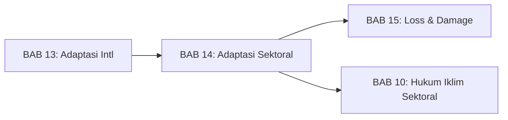
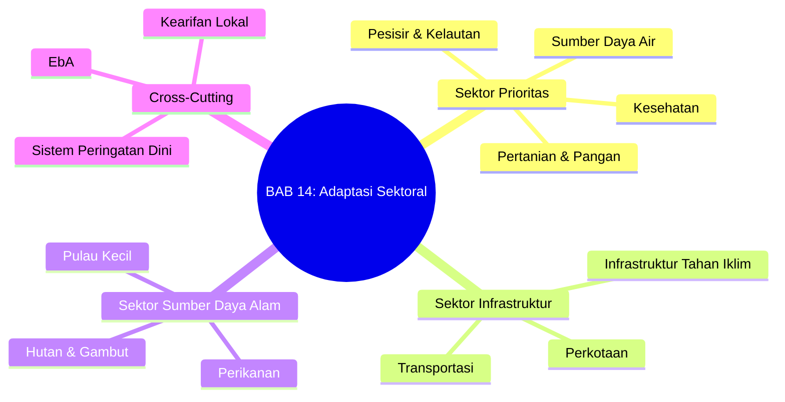
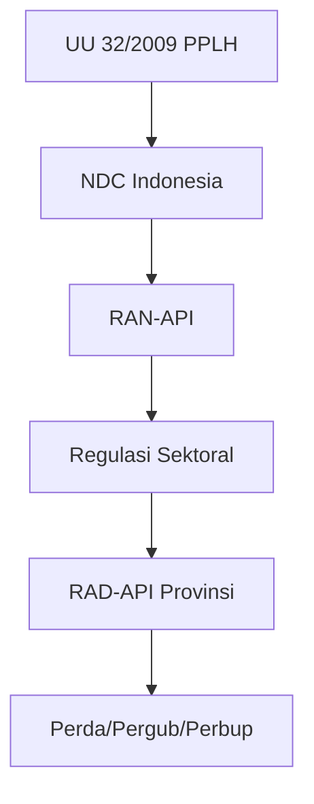
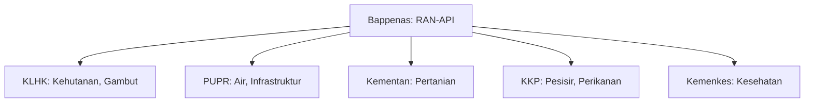

# BAB 14: Hukum Adaptasi Sektoral Indonesia

---

## A. PENDAHULUAN

### 1. Capaian Pembelajaran (Sub-CPMK)

Setelah mempelajari bab ini, mahasiswa mampu:

1. **Mengidentifikasi** kerangka hukum adaptasi di sektor-sektor prioritas Indonesia (pesisir, air, pertanian, kesehatan, infrastruktur)
2. **Menganalisis** regulasi sektoral untuk implementasi adaptasi perubahan iklim
3. **Mengevaluasi** koherensi regulasi sektoral dengan RAN-API dan target NDC
4. **Merumuskan** rekomendasi penguatan regulasi adaptasi sektoral

### 2. Indikator Pencapaian

- [ ] Mahasiswa dapat menyebutkan regulasi utama di masing-masing sektor prioritas adaptasi
- [ ] Mahasiswa dapat menganalisis strategi adaptasi (protect/retreat/accommodate) dalam regulasi
- [ ] Mahasiswa dapat menjelaskan konsep Adaptasi Berbasis Ekosistem (EbA) dan penerapannya
- [ ] Mahasiswa dapat mengidentifikasi kesenjangan regulasi dan kebutuhan harmonisasi

### 3. Deskripsi Singkat

Indonesia adalah negara kepulauan dengan kerentanan tinggi terhadap dampak perubahan iklim: 108.000 km garis pantai terancam kenaikan muka laut, 150 juta penduduk menghadapi kelangkaan air, dan 25% tenaga kerja di sektor pertanian yang sangat sensitif iklim. Respons adaptasi tidak dapat dilakukan secara generik—setiap sektor memerlukan pendekatan hukum yang spesifik. Bab ini akan memandu Anda menelusuri lanskap regulasi adaptasi di berbagai sektor prioritas Indonesia dan mengidentifikasi bagaimana kerangka hukum dapat diperkuat.

### 4. Hubungan dengan Bab Lain

Bab ini menerapkan prinsip-prinsip kerangka internasional dari [[13-Kerangka-Hukum-Adaptasi-Intl/BAB-13|BAB 13]] ke dalam konteks regulasi sektoral Indonesia. Pemahaman ini menjadi fondasi untuk memahami [[15-Loss-and-Damage/BAB-15|BAB 15]] tentang kerugian dan kerusakan yang terjadi ketika adaptasi tidak memadai, dan melengkapi [[10-Hukum-Iklim-Sektoral/BAB-10|BAB 10]] yang lebih fokus pada mitigasi sektoral.

### 5. Peta Konsep Bab

---

## B. PENYAJIAN MATERI

### 1. Kerangka Umum Adaptasi Sektoral Indonesia

#### 1.1 Rencana Aksi Nasional Adaptasi Perubahan Iklim (RAN-API)

> [!info] **Definisi**
> **RAN-API** (*National Adaptation Action Plan*): Dokumen perencanaan nasional yang menetapkan strategi, target, dan program adaptasi perubahan iklim Indonesia di berbagai sektor, disusun oleh Bappenas dan ditetapkan melalui Peraturan Menteri PPN/Bappenas.[^1]

RAN-API mengidentifikasi empat sektor prioritas dan dua lintas sektor:

| Klaster | Sektor Prioritas | Fokus Utama |
|---------|------------------|-------------|
| **Ketahanan Ekonomi** | Pertanian, Perikanan | Produktivitas, ketahanan pangan |
| **Ketahanan Wilayah** | Pesisir, Perkotaan | Infrastruktur, tata ruang |
| **Ketahanan Sosial** | Kesehatan, Perumahan | Layanan dasar, kerentanan |
| **Ekosistem** | Hutan, Lahan Basah | Jasa ekosistem, konservasi |

**Tabel 14.1.** Klaster dan sektor prioritas RAN-API

#### 1.2 Hierarki Regulasi Adaptasi Sektoral

**Gambar 14.1.** Hierarki regulasi adaptasi di Indonesia

Tidak seperti beberapa negara yang memiliki undang-undang khusus tentang adaptasi perubahan iklim, Indonesia mengandalkan:
- Pengaturan dalam UU 32/2009 tentang PPLH yang bersifat umum[^8]
- Regulasi sektoral yang terpisah-pisah
- RAN-API sebagai dokumen perencanaan (bukan regulasi mengikat)

> [!warning] **Perhatian**
> Ketiadaan undang-undang khusus tentang adaptasi perubahan iklim menyebabkan fragmentasi regulasi dan lemahnya kekuatan hukum dokumen perencanaan adaptasi.

---

### 2. Sektor Pesisir dan Kelautan

#### 2.1 Profil Kerentanan

Indonesia memiliki kerentanan pesisir yang sangat tinggi:

| Indikator | Data | Signifikansi |
|-----------|------|--------------|
| Panjang garis pantai | 108.000 km | Terpanjang ke-2 di dunia |
| Penduduk pesisir | 42 juta | 16% populasi nasional |
| Pulau terancam tenggelam | ~2.000 | Pada 2100 jika SLR 1 meter |
| Kerugian bencana pesisir | USD 1,5 miliar/tahun | Abrasi, banjir rob, badai |
| Penduduk dalam 100 km dari pantai | 60% | Eksposur sangat tinggi |

**Tabel 14.2.** Indikator kerentanan pesisir Indonesia[^2]

#### 2.2 Kerangka Regulasi

**Regulasi Utama:**

| Regulasi | Ketentuan Adaptasi | Kekuatan |
|----------|-------------------|----------|
| **UU 27/2007 jo. UU 1/2014** | Pengelolaan Wilayah Pesisir dan Pulau-Pulau Kecil | Komprehensif, tetapi adaptasi iklim belum eksplisit |
| **PP 32/2019** | Rencana Tata Ruang Laut | Mengintegrasikan mitigasi bencana[^9] |
| **Permen KP 23/2016** | Perencanaan Pengelolaan Pesisir | Zonasi dan perencanaan |
| **Perpres 73/2012** | Strategi Nasional Pengelolaan Ekosistem Mangrove | Perlindungan mangrove[^10] |

**Tabel 14.3.** Regulasi utama sektor pesisir

**Pasal Kunci UU 27/2007:**

> [!quote] **Kutipan**
> "Pengelolaan Wilayah Pesisir dan Pulau-Pulau Kecil dilaksanakan dengan tujuan: ... (c) menjamin kepastian hukum dan keadilan bagi Masyarakat di Wilayah Pesisir dan Pulau-Pulau Kecil."
> — *UU 27/2007, Pasal 4*[^3]

#### 2.3 Tiga Model Respons Adaptasi Pesisir

Seperti dibahas dalam BAB 13, tiga model respons adaptasi diterapkan berbeda di konteks pesisir Indonesia:

**a. Bertahan (*Protect/Defend*):**
- Pembangunan tembok laut, *revetment*, *breakwater*
- Regulasi: SNI konstruksi pantai, standar PUPR
- Contoh: Tanggul Laut Raksasa Jakarta (*Giant Sea Wall*)

**b. Mundur (*Retreat*):**
- Relokasi permukiman dan infrastruktur vital
- Regulasi: Revisi RTRW, zona larangan
- Contoh: Rencana relokasi masyarakat pesisir Semarang

**c. Mengakomodasi (*Accommodate*):**
- Rumah panggung, *floating architecture*
- Regulasi: Building codes adaptif, SNI bangunan pesisir
- Contoh: Kampung bahari terapung

> [!example] **Contoh: Dilema Jakarta Bay**
> Proyek *Giant Sea Wall* Jakarta (NCICD) menggambarkan kompleksitas pilihan adaptasi:
> - **Opsi Protect:** Tanggul laut seharga USD 40 miliar
> - **Opsi Retreat:** Memindahkan ibukota (dilaksanakan melalui IKN)
> - **Opsi Accommodate:** Polder system seperti Belanda
>
> Keputusan akhir—membangun IKN di Kalimantan—adalah kombinasi *retreat* (memindahkan pusat pemerintahan) dan *protect* (tetap mempertahankan Jakarta dengan infrastruktur).

#### 2.4 Adaptasi Berbasis Ekosistem: Mangrove

Mangrove adalah *nature-based solution* paling efektif untuk adaptasi pesisir:

**Kerangka Regulasi Mangrove:**
- UU 41/1999 jo. UU 6/2023: Perlindungan hutan mangrove
- Perpres 73/2012: Strategi nasional mangrove
- PERMENLHK 70/2017: Tata cara pemulihan ekosistem

**Target Rehabilitasi:**
- 600.000 hektar mangrove direstorasi hingga 2030[^11]
- Program Rehabilitasi Mangrove Nasional (RMN)
- Integrasi dengan FOLU Net Sink 2030

---

### 3. Sektor Sumber Daya Air

#### 3.1 Profil Kerentanan

| Indikator | Data | Signifikansi |
|-----------|------|--------------|
| Penduduk tanpa akses air aman | 150 juta | Krisis air bersih |
| Bencana hidrometeorologi | 82% dari total | Banjir, kekeringan, longsor |
| Kerugian ekonomi | USD 2,5 miliar/tahun | Bencana terkait air |
| DAS kritis | 40% dari 133 DAS | Degradasi fungsi hidrologi |
| Proyeksi stres air 2050 | +25% | Peningkatan kelangkaan |

**Tabel 14.4.** Indikator kerentanan sektor air Indonesia

#### 3.2 Kerangka Regulasi

**Regulasi Utama:**

| Regulasi | Ketentuan Adaptasi |
|----------|-------------------|
| **UU 17/2019** | Sumber Daya Air—pengelolaan terpadu, konservasi[^12] |
| **PP 22/2021** | Penyelenggaraan Perlindungan dan Pengelolaan LH[^13] |
| **Permen PUPR** | Standar teknis infrastruktur air |
| **RAN-API Klaster Ketahanan Ekonomi** | Strategi adaptasi sektor air |

**Pasal Kunci UU 17/2019:**

Pasal 3 menetapkan asas pengelolaan sumber daya air yang relevan dengan adaptasi:
- Kelestarian
- Keseimbangan
- Kemanfaatan umum
- Keberlanjutan
- Keadilan
- Kemandirian

#### 3.3 Instrumen Hukum Adaptasi Air

**a. Pola dan Rencana Pengelolaan Sumber Daya Air:**
- Pola Pengelolaan SDA: Kerangka dasar 20 tahun
- Rencana Pengelolaan SDA: Implementasi 5 tahun
- Kewajiban mengintegrasikan proyeksi iklim

**b. Perizinan Air:**
- Izin penggunaan air
- Izin pengusahaan air
- Integrasi adaptasi dalam persyaratan izin

**c. Konservasi dan Perlindungan:**
- Perlindungan sumber air
- Pengawetan air
- Pengelolaan kualitas air

**d. Pengendalian Daya Rusak Air:**
- Pencegahan banjir dan kekeringan
- Sistem peringatan dini
- Infrastruktur pengendali banjir

> [!tip] **Kotak Pengayaan: Model Australia**
> Murray-Darling Basin Plan Australia menetapkan model pengelolaan air berbasis proyeksi iklim dengan:
> - Alokasi air adaptif berdasarkan ketersediaan aktual
> - Cadangan air lingkungan (*environmental flows*)
> - Cap ekstraksi dengan mekanisme penyesuaian iklim
>
> Indonesia dapat belajar dari model ini untuk pengelolaan DAS lintas provinsi seperti Citarum, Brantas, dan Solo.

---

### 4. Sektor Pertanian dan Pangan

#### 4.1 Profil Kerentanan

| Indikator | Data | Signifikansi |
|-----------|------|--------------|
| Tenaga kerja pertanian | 25% (30 juta) | Sektor terbesar kedua |
| Penduduk miskin di pertanian | 70% | Kerentanan ekonomi tinggi |
| Penurunan produktivitas padi | -0,15%/tahun | Akibat perubahan iklim |
| Area rentan iklim | 40% lahan pertanian | Eksposur tinggi |
| Penduduk rawan pangan | 17,7 juta | Food insecurity |

**Tabel 14.5.** Indikator kerentanan sektor pertanian Indonesia[^4]

#### 4.2 Kerangka Regulasi

**Regulasi Utama:**

| Regulasi | Ketentuan Adaptasi |
|----------|-------------------|
| **UU 22/2019** | Sistem Budidaya Pertanian Berkelanjutan |
| **UU 18/2012** | Pangan—ketahanan dan kedaulatan pangan |
| **UU 19/2013** | Perlindungan dan Pemberdayaan Petani |
| **Permentan** | Kalender tanam, varietas adaptif |

**Pasal Kunci UU 22/2019:**

> [!quote] **Kutipan**
> "Sistem Budi Daya Pertanian Berkelanjutan ... bertujuan untuk: (a) meningkatkan produktivitas; (b) meningkatkan pendapatan; (c) meningkatkan kesejahteraan Petani; (d) melindungi sumber daya alam..."
> — *UU 22/2019, Pasal 3*[^5]

#### 4.3 Strategi Hukum Adaptasi Pertanian

**a. Varietas Tahan Iklim:**
- Perlindungan varietas tanaman (UU 29/2000)
- Sertifikasi benih tahan kekeringan/banjir
- BALITBANGTAN: pengembangan varietas adaptif

**b. Asuransi Usaha Tani Padi (AUTP):**
- Dasar hukum: Peraturan Menteri Pertanian tentang AUTP[^14]
- Cakupan: Gagal panen akibat banjir, kekeringan, OPT
- Premi bersubsidi 80% dari pemerintah

**c. Kalender Tanam dan Informasi Iklim:**
- Sistem informasi katam terpadu
- Kerjasama BMKG-Kementan
- Rekomendasi tanam berbasis proyeksi iklim

**d. Irigasi Adaptif:**
- Modernisasi irigasi
- Hemat air
- Integrasi dengan pengelolaan DAS

> [!example] **Contoh: AUTP di Indramayu**
> Kabupaten Indramayu sebagai lumbung padi nasional mengalami kerugian besar akibat kekeringan 2015. Setelah AUTP diperkenalkan:
> - Cakupan: 80% petani padi terdaftar
> - Klaim 2019-2023: IDR 200 miliar untuk gagal panen akibat iklim
> - Tantangan: Verifikasi klaim, batas pertanggungan

---

### 5. Sektor Kesehatan

#### 5.1 Profil Kerentanan

Perubahan iklim mempengaruhi kesehatan melalui berbagai jalur:

| Dampak Iklim | Efek Kesehatan | Populasi Rentan |
|--------------|----------------|-----------------|
| Peningkatan suhu | Heat stress, mortalitas | Lansia, pekerja outdoor |
| Perubahan curah hujan | Penyakit vektor (DBD, malaria) | Anak-anak, daerah endemik |
| Banjir | Waterborne diseases, cedera | Penduduk pesisir dan bantaran |
| Kekeringan | Malnutrisi, stunting | Anak-anak, daerah terisolasi |
| Polusi udara | ISPA, kardiovaskular | Penduduk perkotaan |

**Tabel 14.6.** Jalur dampak iklim terhadap kesehatan

**Statistik Kunci:**
- Kasus DBD: 140.000 kasus/tahun dengan tren meningkat
- Ekspansi habitat nyamuk ke dataran tinggi
- Heat-related mortality meningkat 68% (2000-2019)[^6]

#### 5.2 Kerangka Regulasi

| Regulasi | Ketentuan Adaptasi |
|----------|-------------------|
| **UU 36/2009** | Kesehatan—termasuk kesehatan lingkungan[^15] |
| **UU 6/2018** | Kekarantinaan Kesehatan |
| **Permenkes 1501/2010** | Jenis penyakit yang dapat menimbulkan wabah |
| **Permenkes tentang Surveilans** | Sistem surveilans penyakit |

#### 5.3 Strategi Hukum Adaptasi Kesehatan

**a. Climate-Sensitive Disease Surveillance:**
- Integrasi data iklim dalam sistem surveilans
- Early warning untuk DBD, malaria, leptospirosis
- Peta kerentanan kesehatan iklim

**b. Standar Fasilitas Kesehatan Tahan Iklim:**
- Pedoman bangunan puskesmas dan RS
- Kontinuitas layanan saat bencana
- Manajemen limbah medis

**c. Kapasitas Sistem Kesehatan:**
- Pelatihan tenaga kesehatan tentang penyakit sensitif iklim
- Protokol respons heat wave
- Stok obat dan vaksin strategis

---

### 6. Sektor Infrastruktur

#### 6.1 Infrastruktur Tahan Iklim

> [!info] **Definisi**
> **Infrastruktur tahan iklim** (*climate-resilient infrastructure*): Infrastruktur yang direncanakan, didesain, dibangun, dan dioperasikan dengan mempertimbangkan proyeksi perubahan iklim sepanjang umur layannya.

**Kerangka Regulasi:**

| Regulasi | Ketentuan |
|----------|-----------|
| **UU 28/2002** | Bangunan Gedung[^16] |
| **PP 16/2021** | Peraturan Pelaksanaan UU Bangunan Gedung |
| **SNI** | Standar teknis konstruksi |
| **Permen PUPR** | Pedoman teknis infrastruktur |

#### 6.2 Integrasi Iklim dalam Standar Desain

**Prinsip Non-Stasioneritas dalam Standar:**

Standar desain infrastruktur Indonesia perlu diperbarui untuk mengakomodasi:

| Komponen | Pendekatan Historis | Pendekatan Adaptif |
|----------|--------------------|--------------------|
| Periode ulang banjir | Data historis 50 tahun | Data historis + proyeksi iklim |
| Desain drainase | Curah hujan historis | Proyeksi intensitas hujan masa depan |
| Beban angin | Data angin historis | Proyeksi frekuensi siklon |
| Fondasi pesisir | Muka laut statis | Proyeksi kenaikan muka laut |

**Tabel 14.7.** Pergeseran pendekatan standar desain infrastruktur

**Contoh Regulasi:**
- SNI 2847:2019 (beton bertulang) belum mengintegrasikan proyeksi iklim
- SNI drainase perkotaan perlu revisi untuk intensitas hujan yang meningkat

---

### 7. Sektor Perkotaan

#### 7.1 Profil Kerentanan Perkotaan

| Indikator | Data |
|-----------|------|
| Tingkat urbanisasi | 56% (2020), proyeksi 70% (2045) |
| Penurunan tanah Jakarta | 25 cm/tahun di beberapa area |
| Urban heat island | +2-3°C dibanding rural |
| Kerugian banjir perkotaan | IDR 10+ triliun/tahun |

**Tabel 14.8.** Indikator kerentanan perkotaan Indonesia

#### 7.2 Kerangka Regulasi

| Regulasi | Ketentuan Adaptasi |
|----------|-------------------|
| **UU 26/2007** | Penataan Ruang[^17] |
| **PP 21/2021** | Penyelenggaraan Penataan Ruang |
| **Perda/Pergub** | RTRW dan RAD-API tingkat daerah |
| **Permendagri 86/2017** | Perencanaan Pembangunan Daerah |

#### 7.3 Strategi Adaptasi Perkotaan

**a. Green Infrastructure:**
- Ruang Terbuka Hijau (RTH) minimal 30%
- Taman kota, jalur hijau
- Urban forest untuk pendinginan

**b. Urban Drainage Resilience:**
- Sistem polder
- Retention pond
- Sustainable Urban Drainage Systems (SUDS)

**c. Transit-Oriented Development (TOD):**
- Pengurangan emisi dan peningkatan resiliensi
- Integrasi dengan MRT, LRT, BRT

**d. Heat Action Plans:**
- Peringatan gelombang panas
- Cool centers untuk kelompok rentan
- Reflective surfaces dan urban greening

> [!example] **Contoh: RAD-API DKI Jakarta**
> DKI Jakarta telah menyusun Rencana Aksi Daerah Adaptasi Perubahan Iklim yang mencakup:
> - 5 klaster: pantai, air, kesehatan, infrastruktur, ekosistem
> - Target RTH 30% pada 2030
> - Sistem polder untuk pengendalian banjir
> - Integrasi dengan RTRW Jakarta 2030

---

### 8. Sektor Hutan dan Gambut

#### 8.1 Peran Hutan dan Gambut dalam Adaptasi

Hutan dan gambut berfungsi ganda sebagai:
- **Penyerap karbon** (mitigasi)
- **Pengatur hidrologi** (adaptasi)—mencegah banjir dan kekeringan
- **Penyedia jasa ekosistem**—air bersih, pengaturan iklim mikro

**Data Kunci:**
- Tutupan hutan: 92 juta ha (60% daratan)
- Luas gambut: 15 juta ha (terbesar di tropika)
- Deforestasi: 0,4-0,8 juta ha/tahun (menurun dari 1,5 juta ha)

#### 8.2 Kerangka Regulasi

| Regulasi | Ketentuan |
|----------|-----------|
| **UU 41/1999 jo. UU 6/2023** | Kehutanan[^18] |
| **PP 71/2014 jo. PP 57/2016** | Perlindungan dan Pengelolaan Ekosistem Gambut[^19] |
| **Perpres 98/2021** | NEK termasuk FOLU |
| **Inpres Moratorium** | Penghentian izin hutan primer dan gambut |
| **PERMENLHK** | Restorasi, rehabilitasi, moratorium |

#### 8.3 FOLU Net Sink 2030

Target ambisius Indonesia: sektor kehutanan dan penggunaan lahan menjadi penyerap bersih karbon (*net sink*) pada 2030.

**Implikasi untuk Adaptasi:**
- Penghentian deforestasi bersih
- Rehabilitasi 12 juta ha lahan kritis
- Pengelolaan gambut berkelanjutan
- Mangrove sebagai pertahanan pesisir

**Kerangka Hukum Pendukung:**
- REDD+ dan pembayaran berbasis hasil
- Perhutanan sosial (PS)—12,7 juta ha untuk masyarakat
- Moratorium hutan primer dan gambut

---

### 9. Sektor Kelautan dan Perikanan

#### 9.1 Profil Kerentanan

| Dampak Iklim | Efek pada Perikanan |
|--------------|---------------------|
| Pemanasan laut | Pergeseran distribusi stok ikan |
| Pengasaman laut | Kerusakan karang dan kerang |
| Perubahan arus | Perubahan zona penangkapan |
| Badai intensif | Kerusakan infrastruktur nelayan |
| Kenaikan muka laut | Kerusakan tambak dan pesisir |

**Tabel 14.9.** Dampak perubahan iklim pada sektor perikanan

**Data Kunci:**
- Nelayan: 2,5 juta rumah tangga
- Kontribusi perikanan: 2,8% PDB, USD 4 miliar ekspor
- Pemutihan karang: 30% terumbu terdampak parah (2015-2016)

#### 9.2 Kerangka Regulasi

| Regulasi | Ketentuan Adaptasi |
|----------|-------------------|
| **UU 31/2004 jo. UU 45/2009** | Perikanan[^20] |
| **Permen KP** | Kawasan Konservasi Perairan |
| **Permen KP 12/2020** | Pengelolaan Lobster dan Kepiting |
| **Rencana Pengelolaan Perikanan** | WPPNRI berbasis ekosistem |

#### 9.3 Strategi Adaptasi Perikanan

- Penyesuaian zonasi penangkapan ikan
- Diversifikasi mata pencaharian nelayan
- Aquaculture adaptif
- Konservasi terumbu karang dan padang lamun
- Infrastruktur pelabuhan tahan iklim

---

### 10. Sektor Pulau-Pulau Kecil

#### 10.1 Kerentanan Unik

Pulau-pulau kecil menghadapi kerentanan ekstra:
- Keterbatasan sumber daya air tawar
- Eksposur tinggi terhadap kenaikan muka laut
- Ketergantungan pada ekosistem laut
- Isolasi dan keterbatasan akses

**Data Kunci:**
- Pulau-pulau kecil Indonesia: ~10.000 (dari 17.000+)
- Pulau terluar: 92 pulau (strategis untuk kedaulatan)
- Proyeksi pulau tenggelam: 2.000 pada 2100

#### 10.2 Kerangka Regulasi Khusus

- UU 27/2007: Bab khusus tentang pulau-pulau kecil
- Perpres 78/2005: Pengelolaan pulau-pulau kecil terluar[^21]
- Permen KP: Zonasi perairan pulau kecil

#### 10.3 Pendekatan Adaptasi

- Rainwater harvesting
- Desalinasi skala kecil
- Perlindungan ekosistem pesisir
- Relokasi terencana jika diperlukan

---

### 11. Adaptasi Berbasis Ekosistem (EbA)

#### 11.1 Konsep dan Prinsip

> [!info] **Definisi**
> **Adaptasi Berbasis Ekosistem** (*Ecosystem-based Adaptation*/EbA): Pendekatan adaptasi yang menggunakan keanekaragaman hayati dan jasa ekosistem sebagai bagian dari strategi adaptasi keseluruhan, untuk membantu masyarakat beradaptasi terhadap dampak perubahan iklim.[^7]

**Keunggulan EbA:**
- Biaya lebih rendah dibanding infrastruktur keras
- Manfaat ganda (adaptasi, mitigasi, biodiversitas, penghidupan)
- Berkelanjutan jangka panjang
- Partisipatif dan berbasis masyarakat

#### 11.2 Contoh EbA di Indonesia

| Ekosistem | Fungsi Adaptasi | Regulasi Pendukung |
|-----------|-----------------|-------------------|
| **Mangrove** | Perlindungan pesisir, nursery ikan | Perpres 73/2012, Program RMN |
| **Terumbu karang** | Penghalang gelombang, perikanan | Permen KP tentang konservasi |
| **Hutan** | Pengaturan hidrologi, iklim mikro | UU Kehutanan, REDD+ |
| **Lahan basah** | Penyimpanan air, pencegahan banjir | PP Gambut |
| **Agroforestri** | Ketahanan pertanian, keanekaragaman | UU Budidaya Pertanian |

**Tabel 14.10.** EbA dan regulasi pendukung di Indonesia

#### 11.3 Integrasi EbA dalam Regulasi Sektoral

EbA seharusnya menjadi pendekatan *cross-cutting* yang terintegrasi dalam semua regulasi sektoral:

- **Pesisir:** Mangrove restoration sebagai alternatif tembok laut
- **Air:** Watershed restoration untuk pengaturan hidrologi
- **Pertanian:** Agroforestry untuk ketahanan pangan
- **Perkotaan:** Urban forests untuk pendinginan
- **Infrastruktur:** Green-gray infrastructure

---

### 12. Tantangan Harmonisasi Regulasi

#### 12.1 Fragmentasi Sektoral

Regulasi adaptasi Indonesia tersebar di berbagai kementerian/lembaga tanpa koordinasi memadai:

**Gambar 14.2.** Fragmentasi kelembagaan adaptasi

#### 12.2 Kesenjangan Regulasi

| Kesenjangan | Kebutuhan |
|-------------|-----------|
| Tidak ada UU khusus adaptasi | RUU Perubahan Iklim dengan bab adaptasi kuat |
| RAN-API tidak mengikat secara hukum | Perpres atau bahkan UU untuk RAN-API |
| Standar teknis belum adaptif | Revisi SNI dengan proyeksi iklim |
| Koordinasi lintas sektor lemah | Kelembagaan koordinasi yang kuat |
| Pendanaan tidak memadai | Instrumen pendanaan adaptasi domestik |

**Tabel 14.11.** Kesenjangan regulasi adaptasi dan kebutuhan penguatan

#### 12.3 Kebutuhan RUU Perubahan Iklim

Indonesia membutuhkan undang-undang khusus perubahan iklim yang mencakup:
1. **Target adaptasi** yang terukur dan mengikat
2. **Kewajiban sektoral** yang jelas
3. **Kelembagaan** koordinasi lintas sektor
4. **Pendanaan** domestik untuk adaptasi
5. **Akuntabilitas** dan penegakan

---

## C. STUDI KASUS

### Kasus: Harmonisasi Regulasi Adaptasi Multi-Sektor di Jakarta

**Latar Belakang:**

Jakarta menghadapi tantangan adaptasi multi-sektor yang sangat kompleks: penurunan tanah, banjir pesisir dan fluvial, kelangkaan air bersih, urban heat island, dan polusi udara. Berbagai regulasi sektoral perlu diharmonisasikan untuk respons adaptasi yang koheren.

**Fakta Hukum:**

1. RTRW Jakarta 2030 telah ditetapkan dengan Perda DKI Jakarta
2. RAD-API DKI Jakarta disusun oleh BPLHD (sekarang DLHK)
3. Regulasi tata air mengikuti UU 17/2019 dan peraturan pelaksanaannya
4. Regulasi pesisir mengikuti UU 27/2007 dan peraturan KKP
5. Standar bangunan mengikuti UU 28/2002 dan PP pelaksanaannya
6. Proyek tanggul laut raksasa (*Giant Sea Wall*) diatur Perpres tersendiri

**Isu Hukum:**

Bagaimana mengharmonisasikan berbagai regulasi sektoral tersebut untuk mencapai Jakarta yang tahan iklim? Siapa yang bertanggung jawab untuk koordinasi? Bagaimana menyelesaikan konflik antar-regulasi?

---

**Pertanyaan Pemantik:**

1. **Analisis:** Identifikasi regulasi yang relevan untuk penanganan banjir di Jakarta. Di mana terjadi tumpang tindih atau konflik antar-regulasi?

2. **Evaluasi:** Bandingkan pendekatan "protect" (tanggul laut) dengan "retreat" (pemindahan ke IKN) untuk adaptasi Jakarta. Apa kelebihan dan kelemahan masing-masing dari perspektif hukum?

3. **Sintesis:** Rancang kerangka koordinasi kelembagaan untuk adaptasi multi-sektor di Jakarta, dengan mempertimbangkan pembagian kewenangan pusat-daerah.

4. **Aplikasi:** Bagaimana konsep EbA dapat diintegrasikan dalam regulasi tata ruang Jakarta? Berikan contoh konkret!

> [!note] **Petunjuk Diskusi**
> Diskusikan dalam kelompok dengan masing-masing kelompok menganalisis satu sektor (pesisir, air, infrastruktur, kesehatan). Kemudian simulasikan koordinasi antar-kelompok untuk mengidentifikasi titik-titik konflik dan sinergi.

---

## D. PENUTUP

### 1. Rangkuman

Pada bab ini, kita telah mempelajari:

- **Kerangka Umum:** RAN-API sebagai dokumen perencanaan adaptasi nasional dengan empat klaster prioritas, namun tidak memiliki kekuatan hukum mengikat.

- **Sektor Pesisir:** UU 27/2007 sebagai kerangka utama dengan tiga model respons (protect, retreat, accommodate); mangrove sebagai EbA kunci.

- **Sektor Air:** UU 17/2019 menyediakan kerangka pengelolaan terpadu; tantangan integrasi proyeksi iklim dalam perencanaan DAS.

- **Sektor Pertanian:** UU 22/2019 dan AUTP sebagai instrumen kunci; kebutuhan varietas adaptif dan sistem informasi iklim pertanian.

- **Sektor Kesehatan:** Surveilans penyakit sensitif iklim dan kapasitas sistem kesehatan menjadi fokus adaptasi.

- **Sektor Infrastruktur dan Perkotaan:** Kebutuhan revisi standar desain dengan proyeksi iklim; green infrastructure sebagai solusi.

- **Sektor Hutan dan Gambut:** FOLU Net Sink 2030 mengintegrasikan mitigasi dan adaptasi; perhutanan sosial sebagai pendekatan partisipatif.

- **EbA:** Pendekatan cross-cutting yang efektif biaya dan berkelanjutan, namun belum terintegrasi memadai dalam regulasi.

- **Harmonisasi:** Fragmentasi regulasi sektoral memerlukan UU khusus perubahan iklim dan kelembagaan koordinasi yang kuat.

---

### 2. Latihan

Kerjakan latihan berikut untuk memperdalam pemahaman Anda:

1. Pilih satu sektor (pesisir, air, pertanian, kesehatan) dan identifikasi minimal 3 regulasi yang relevan untuk adaptasi. Analisis bagaimana regulasi tersebut mengintegrasikan (atau tidak) pertimbangan perubahan iklim.

2. Bandingkan pendekatan adaptasi "protect" dan "retreat" untuk penanganan kenaikan muka laut di pantai utara Jawa. Apa implikasi hukum dari masing-masing pilihan?

3. Analisis satu contoh EbA di Indonesia (misalnya rehabilitasi mangrove, restorasi DAS) dan identifikasi kerangka hukum yang mendukung dan menghambatnya.

4. Identifikasi satu kesenjangan regulasi adaptasi di sektor pilihan Anda dan rumuskan rekomendasi penguatan.

5. Bandingkan kekuatan hukum RAN-API Indonesia dengan National Adaptation Plan negara lain (misalnya UK Climate Change Act, German Climate Protection Act). Apa yang bisa dipelajari?

---

### 3. Tes Formatif

Jawablah pertanyaan-pertanyaan berikut untuk mengukur pemahaman Anda:

**Pilihan Ganda:**

1. Dokumen perencanaan adaptasi nasional Indonesia yang mengidentifikasi sektor-sektor prioritas adalah:
   - a. NDC
   - b. RPJMN
   - c. RAN-API
   - d. RTRWN

2. UU yang mengatur pengelolaan wilayah pesisir dan pulau-pulau kecil adalah:
   - a. UU 32/2009
   - b. UU 27/2007
   - c. UU 17/2019
   - d. UU 26/2007

3. Model respons adaptasi yang melibatkan relokasi penduduk dan aset dari zona berisiko disebut:
   - a. Protect
   - b. Accommodate
   - c. Retreat
   - d. Defend

4. Instrumen perlindungan petani dari gagal panen akibat bencana iklim adalah:
   - a. BPJS Ketenagakerjaan
   - b. AUTP
   - c. KUR
   - d. Kartu Tani

5. Pendekatan adaptasi yang menggunakan ekosistem dan jasa ekosistem disebut:
   - a. Adaptasi teknologi
   - b. Adaptasi infrastruktur
   - c. EbA (Ecosystem-based Adaptation)
   - d. Adaptasi institusional

**Benar atau Salah:**

6. RAN-API memiliki kekuatan hukum yang sama dengan undang-undang. (B/S)

7. Target FOLU Net Sink 2030 Indonesia mengintegrasikan mitigasi dan adaptasi. (B/S)

8. UU 17/2019 tentang Sumber Daya Air secara eksplisit mewajibkan integrasi proyeksi perubahan iklim dalam perencanaan. (B/S)

9. Mangrove restoration termasuk dalam pendekatan Adaptasi Berbasis Ekosistem (EbA). (B/S)

10. Indonesia sudah memiliki undang-undang khusus tentang adaptasi perubahan iklim. (B/S)

---

### 4. Umpan Balik dan Tindak Lanjut

Cocokkan jawaban Anda dengan **Kunci Jawaban** di [[Back-Matter/Lampiran/Lampiran-04-Kunci-Jawaban|Lampiran 4]].

**Kunci Jawaban Singkat:** 1-c, 2-b, 3-c, 4-b, 5-c, 6-S, 7-B, 8-S, 9-B, 10-S

**Rumus Penilaian:**

$$Tingkat\ Penguasaan = \frac{Jumlah\ Jawaban\ Benar}{10} \times 100\%$$

**Interpretasi dan Tindak Lanjut:**

| Tingkat Penguasaan | Kategori | Tindak Lanjut |
|--------------------|----------|---------------|
| **90 - 100%** | Baik Sekali | Selamat! Anda dapat melanjutkan ke [[15-Loss-and-Damage/BAB-15\|BAB 15]] |
| **80 - 89%** | Baik | Anda dapat melanjutkan, namun pelajari kembali bagian yang masih ragu |
| **70 - 79%** | Cukup | **Ulangi** materi bab ini, terutama bagian yang belum dikuasai |
| **< 70%** | Kurang | **Wajib mengulangi** seluruh materi bab ini sebelum melanjutkan |

---

### 5. Senarai Istilah Kunci

| Istilah | Bahasa Inggris | Definisi |
|---------|----------------|----------|
| RAN-API | *National Adaptation Action Plan* | Rencana Aksi Nasional Adaptasi Perubahan Iklim |
| EbA | *Ecosystem-based Adaptation* | Adaptasi berbasis ekosistem |
| FOLU | *Forestry and Other Land Use* | Kehutanan dan penggunaan lahan lainnya |
| RTH | *Urban Green Space* | Ruang Terbuka Hijau |
| AUTP | *Agricultural Insurance* | Asuransi Usaha Tani Padi |
| DAS | *Watershed* | Daerah Aliran Sungai |
| RAD-API | *Regional Adaptation Action Plan* | Rencana Aksi Daerah Adaptasi Perubahan Iklim |

---

### 6. Daftar Pustaka Bab

**Sumber Primer:**

- Undang-Undang Nomor 27 Tahun 2007 tentang Pengelolaan Wilayah Pesisir dan Pulau-Pulau Kecil.
- Undang-Undang Nomor 17 Tahun 2019 tentang Sumber Daya Air.
- Undang-Undang Nomor 22 Tahun 2019 tentang Sistem Budidaya Pertanian Berkelanjutan.
- Undang-Undang Nomor 36 Tahun 2009 tentang Kesehatan.
- Peraturan Presiden Nomor 98 Tahun 2021 tentang Penyelenggaraan Nilai Ekonomi Karbon.

**Sumber Sekunder:**

- Bappenas. (2014). *Rencana Aksi Nasional Adaptasi Perubahan Iklim (RAN-API)*. Jakarta: Bappenas.
- KLHK. (2022). *Indonesia Third Biennial Update Report*. Jakarta: KLHK.
- World Bank. (2022). *Indonesia Climate Risk Country Profile*. Washington DC: World Bank.

**Sumber Pendukung:**

- IPCC. (2022). *Climate Change 2022: Impacts, Adaptation and Vulnerability*. Chapter 10: Asia.
- ADB. (2021). *Climate Risk Country Profile: Indonesia*. Manila: ADB.

---

### 7. Catatan Kaki

[^1]: Bappenas. (2014). *Rencana Aksi Nasional Adaptasi Perubahan Iklim (RAN-API)*. Jakarta.

[^2]: World Bank. (2022). *Indonesia Climate Risk Country Profile*. Washington DC.

[^3]: Undang-Undang Nomor 27 Tahun 2007 tentang Pengelolaan Wilayah Pesisir dan Pulau-Pulau Kecil, Pasal 4.

[^4]: BPS. (2023). *Statistik Indonesia 2023*. Jakarta: Badan Pusat Statistik.

[^5]: Undang-Undang Nomor 22 Tahun 2019 tentang Sistem Budidaya Pertanian Berkelanjutan, Pasal 3.

[^6]: Lancet Countdown. (2022). *Health and Climate Change: Country Profile Indonesia*.

[^7]: CBD. (2009). *Connecting Biodiversity and Climate Change Mitigation and Adaptation: Report of the Second Ad Hoc Technical Expert Group on Biodiversity and Climate Change*. Technical Series No. 41.

[^8]: Undang-Undang Nomor 32 Tahun 2009 tentang Perlindungan dan Pengelolaan Lingkungan Hidup (Lembaran Negara Republik Indonesia Tahun 2009 Nomor 140, Tambahan Lembaran Negara Republik Indonesia Nomor 5059).

[^9]: Peraturan Pemerintah Nomor 32 Tahun 2019 tentang Rencana Tata Ruang Laut (Lembaran Negara Republik Indonesia Tahun 2019 Nomor 89, Tambahan Lembaran Negara Republik Indonesia Nomor 6344).

[^10]: Peraturan Presiden Nomor 73 Tahun 2012 tentang Strategi Nasional Pengelolaan Ekosistem Mangrove.

[^11]: KLHK. (2021). *Peta Jalan Rehabilitasi Mangrove Nasional 2021-2024*. Jakarta: Kementerian Lingkungan Hidup dan Kehutanan.

[^12]: Undang-Undang Nomor 17 Tahun 2019 tentang Sumber Daya Air (Lembaran Negara Republik Indonesia Tahun 2019 Nomor 190, Tambahan Lembaran Negara Republik Indonesia Nomor 6405).

[^13]: Peraturan Pemerintah Nomor 22 Tahun 2021 tentang Penyelenggaraan Perlindungan dan Pengelolaan Lingkungan Hidup (Lembaran Negara Republik Indonesia Tahun 2021 Nomor 32, Tambahan Lembaran Negara Republik Indonesia Nomor 6634).

[^14]: Peraturan Menteri Pertanian Nomor 40 Tahun 2015 tentang Fasilitasi Asuransi Pertanian sebagaimana telah diubah beberapa kali.

[^15]: Undang-Undang Nomor 36 Tahun 2009 tentang Kesehatan (Lembaran Negara Republik Indonesia Tahun 2009 Nomor 144, Tambahan Lembaran Negara Republik Indonesia Nomor 5063).

[^16]: Undang-Undang Nomor 28 Tahun 2002 tentang Bangunan Gedung (Lembaran Negara Republik Indonesia Tahun 2002 Nomor 134, Tambahan Lembaran Negara Republik Indonesia Nomor 4247).

[^17]: Undang-Undang Nomor 26 Tahun 2007 tentang Penataan Ruang (Lembaran Negara Republik Indonesia Tahun 2007 Nomor 68, Tambahan Lembaran Negara Republik Indonesia Nomor 4725).

[^18]: Undang-Undang Nomor 41 Tahun 1999 tentang Kehutanan sebagaimana telah diubah dengan Undang-Undang Nomor 6 Tahun 2023 tentang Penetapan Peraturan Pemerintah Pengganti Undang-Undang Nomor 2 Tahun 2022 tentang Cipta Kerja Menjadi Undang-Undang.

[^19]: Peraturan Pemerintah Nomor 71 Tahun 2014 tentang Perlindungan dan Pengelolaan Ekosistem Gambut sebagaimana telah diubah dengan Peraturan Pemerintah Nomor 57 Tahun 2016.

[^20]: Undang-Undang Nomor 31 Tahun 2004 tentang Perikanan sebagaimana telah diubah dengan Undang-Undang Nomor 45 Tahun 2009 (Lembaran Negara Republik Indonesia Tahun 2009 Nomor 154, Tambahan Lembaran Negara Republik Indonesia Nomor 5073).

[^21]: Peraturan Presiden Nomor 78 Tahun 2005 tentang Pengelolaan Pulau-Pulau Kecil Terluar.

---

**Navigasi Buku:**
- ← [[13-Kerangka-Hukum-Adaptasi-Intl/BAB-13|BAB 13: Kerangka Hukum Adaptasi Internasional]]
- → [[15-Loss-and-Damage/BAB-15|BAB 15: Loss and Damage dalam Hukum Iklim]]
- ↑ [[00-Front-Matter/09-Tinjauan-Mata-Kuliah|Kembali ke Tinjauan Mata Kuliah]]

---

*Buku Ajar Hukum Perubahan Iklim | BAB 14*
