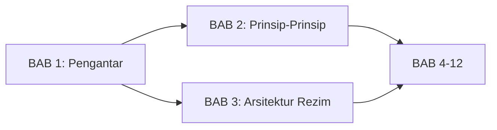
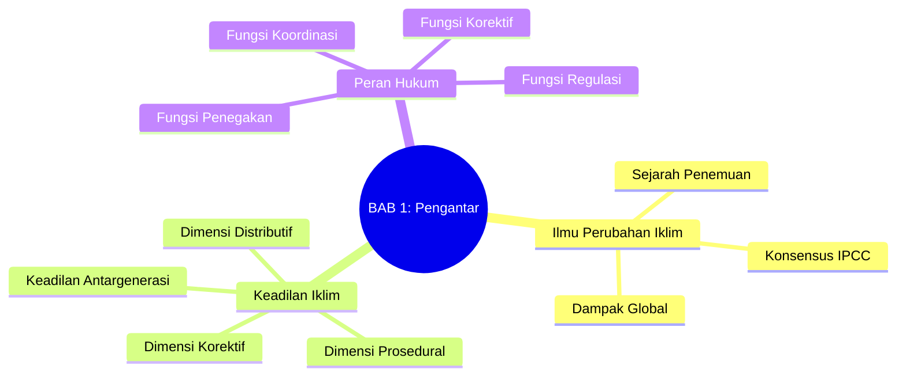
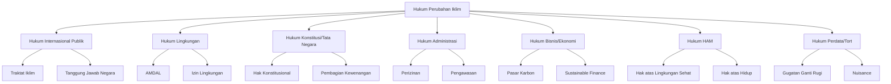

# BAB 1: Pengantar Hukum Perubahan Iklim

---

## A. PENDAHULUAN

### 1. Capaian Pembelajaran (Sub-CPMK)

Setelah mempelajari bab ini, mahasiswa mampu:

1. **Menjelaskan** dasar ilmiah perubahan iklim dan hubungannya dengan perkembangan hukum iklim
2. **Mengidentifikasi** konsep-konsep kunci dalam keadilan iklim (*climate justice*)
3. **Menganalisis** peran hukum dalam merespons krisis iklim global
4. **Mengevaluasi** mengapa diperlukan cabang hukum khusus yang mengatur perubahan iklim

### 2. Indikator Pencapaian

- [ ] Mahasiswa dapat menjelaskan hubungan antara penemuan ilmiah tentang perubahan iklim dan respons hukum internasional
- [ ] Mahasiswa dapat mendefinisikan keadilan iklim dan dimensi-dimensinya
- [ ] Mahasiswa dapat mengidentifikasi fungsi-fungsi hukum dalam penanganan perubahan iklim
- [ ] Mahasiswa dapat menjelaskan ruang lingkup hukum perubahan iklim sebagai cabang hukum

### 3. Deskripsi Singkat

Perubahan iklim merupakan tantangan eksistensial terbesar yang dihadapi umat manusia pada abad ke-21. Dampaknya tidak mengenal batas negara dan mempengaruhi seluruh aspek kehidupan—dari ketahanan pangan hingga keamanan nasional. Bab ini akan mengajak Anda memahami bagaimana ilmu pengetahuan tentang perubahan iklim berkembang, mengapa keadilan iklim menjadi isu sentral, dan bagaimana hukum berperan dalam upaya global mengatasi krisis ini.

### 4. Hubungan dengan Bab Lain



Bab ini merupakan fondasi untuk seluruh materi dalam buku ini. Pemahaman tentang basis ilmiah dan keadilan iklim akan mempermudah Anda memahami [[BAB 2 -- Prinsip-Prinsip Hukum Lingkungan Internasional --|prinsip-prinsip hukum lingkungan]] dan [[BAB 3 -- Arsitektur Rezim Iklim Internasional --|arsitektur rezim iklim internasional]] di bab-bab selanjutnya.

### 5. Peta Konsep Bab



---

## B. PENYAJIAN MATERI

### 1. Ilmu Perubahan Iklim: Dari Laboratorium ke Ruang Sidang

Apakah Anda pernah bertanya-tanya kapan manusia pertama kali menyadari bahwa aktivitas mereka dapat mengubah iklim bumi? Jawabannya mungkin akan mengejutkan Anda—pengetahuan ini sudah ada sejak lebih dari satu abad yang lalu. Pemahaman ilmiah tentang perubahan iklim telah berkembang secara bertahap selama hampir dua abad, dimulai dari eksperimen laboratorium sederhana hingga menjadi konsensus ilmiah global yang tak terbantahkan.[^1] Perjalanan dari penemuan ilmiah menuju pembentukan rezim hukum internasional merupakan salah satu contoh paling dramatis tentang bagaimana sains dapat mempengaruhi tata kelola global.[^2]

#### 1.1 Sejarah Penemuan Efek Rumah Kaca

Pada tahun 1896, ilmuwan Swedia Svante Arrhenius pertama kali menghitung bahwa pembakaran bahan bakar fosil dapat meningkatkan suhu bumi.[^3] Arrhenius, yang kemudian meraih Nobel Kimia pada 1903, mengestimasi bahwa pelipatgandaan konsentrasi CO₂ akan menyebabkan kenaikan suhu global sekitar 5-6 derajat Celsius—estimasi yang terbukti cukup mendekati proyeksi modern.[^4] Namun, baru pada pertengahan abad ke-20, komunitas ilmiah mulai serius meneliti fenomena ini. Roger Revelle dan Hans Suess pada tahun 1957 mempublikasikan penelitian mereka yang menunjukkan bahwa lautan tidak mampu menyerap seluruh CO₂ yang dilepaskan manusia, sehingga gas tersebut akan terakumulasi di atmosfer.[^5]

> [!info] **Definisi**
> **Efek rumah kaca** (*greenhouse effect*): Proses alami di mana gas-gas tertentu di atmosfer (CO₂, CH₄, N₂O, dan lainnya) menyerap dan memancarkan kembali radiasi inframerah, sehingga menghangatkan permukaan bumi.

Tahun 1958 menjadi titik balik ketika Charles David Keeling mulai mengukur konsentrasi CO₂ di atmosfer dari Observatorium Mauna Loa, Hawaii.[^6] Data yang dikumpulkannya—kini dikenal sebagai "Kurva Keeling"—menunjukkan peningkatan konsentrasi CO₂ yang konsisten dari tahun ke tahun. Pengukuran Keeling memberikan bukti empiris pertama yang tak terbantahkan bahwa konsentrasi CO₂ atmosfer terus meningkat sebagai akibat langsung dari aktivitas manusia, khususnya pembakaran bahan bakar fosil.[^7] Kurva Keeling telah menjadi salah satu ikon terpenting dalam sejarah ilmu iklim dan kerap dijadikan bukti dalam berbagai litigasi iklim di seluruh dunia.[^8]

```
Konsentrasi CO₂ Atmosfer (ppm):
- 1958: 315 ppm
- 1990: 354 ppm
- 2015: 400 ppm
- 2024: 424 ppm
```

> [!tip] **Kotak Pengayaan: Industri Fosil Sudah Tahu Sejak 1982**
> Dokumen internal Exxon Corporation yang bocor ke publik menunjukkan bahwa perusahaan minyak terbesar di dunia telah mengetahui dampak perubahan iklim sejak awal 1980-an. Para ilmuwan Exxon bahkan membuat proyeksi pemanasan global yang terbukti sangat akurat. Namun, alih-alih mengambil tindakan, industri fosil justru mendanai kampanye penyangkalan iklim selama puluhan tahun. Dokumen ini kini menjadi bukti kunci dalam berbagai [[BAB 11 -- Litigasi Perubahan Iklim --|litigasi iklim]] di seluruh dunia.
>
> Lihat: [[Exxon_Climate_Report_1982]] dan [[Shell_Greenhouse_Report]]

#### 1.2 Konsensus Ilmiah: IPCC dan AR6

Untuk menyediakan basis ilmiah yang kredibel bagi pembuat kebijakan, Organisasi Meteorologi Dunia (WMO) dan Program Lingkungan PBB (UNEP) membentuk **Intergovernmental Panel on Climate Change (IPCC)** pada tahun 1988.[^9] Pembentukan IPCC merupakan respons terhadap meningkatnya kekhawatiran tentang perubahan iklim dan kebutuhan akan penilaian ilmiah yang komprehensif serta independen sebagai landasan pengambilan kebijakan.[^10]

IPCC tidak melakukan penelitian sendiri, melainkan mengkompilasi dan mengevaluasi ribuan studi ilmiah yang ada melalui proses *peer review* yang ketat dan melibatkan ratusan ilmuwan dari seluruh dunia. Laporan-laporan IPCC menjadi "kitab suci" dalam negosiasi iklim internasional dan telah diakui oleh pengadilan-pengadilan di berbagai yurisdiksi sebagai sumber otoritatif tentang ilmu perubahan iklim.[^11] Dalam kasus *Urgenda Foundation v. State of the Netherlands*, misalnya, Mahkamah Agung Belanda secara eksplisit merujuk pada temuan-temuan IPCC sebagai dasar untuk mewajibkan pemerintah mengurangi emisi gas rumah kaca.[^12]

| Laporan | Tahun | Temuan Kunci |
|---------|-------|--------------|
| FAR (First) | 1990 | Aktivitas manusia *kemungkinan* mempengaruhi iklim |
| SAR (Second) | 1995 | Ada "pengaruh manusia yang dapat dideteksi" |
| TAR (Third) | 2001 | Sebagian besar pemanasan *kemungkinan* akibat manusia |
| AR4 | 2007 | Pemanasan *sangat mungkin* (>90%) akibat manusia |
| AR5 | 2014 | Pemanasan *amat sangat mungkin* (>95%) akibat manusia |
| **AR6** | 2021-2023 | Pemanasan **tidak diragukan lagi** akibat manusia |

**Tabel 1.1.** Evolusi kepastian ilmiah dalam laporan-laporan IPCC

Laporan Sintesis AR6 yang dirilis pada 2023 menyimpulkan beberapa temuan yang memiliki implikasi hukum sangat signifikan. Pertama, pemanasan global telah mencapai 1,1 derajat Celsius di atas tingkat pra-industri, menandakan bahwa separuh dari "anggaran karbon" untuk membatasi pemanasan pada 1,5 derajat Celsius sudah terpakai. Kedua, aktivitas manusia secara "tidak dapat disangkal" (*unequivocally*) menjadi penyebab utama pemanasan tersebut—sebuah pernyataan dengan tingkat kepastian ilmiah tertinggi yang pernah dikeluarkan IPCC.[^13] Ketiga, batas 1,5 derajat Celsius kemungkinan akan terlampaui pada dekade 2030-an kecuali ada pengurangan emisi yang drastis dan segera. Keempat, pengurangan emisi sebesar 43 persen pada tahun 2030 diperlukan untuk tetap berada pada jalur 1,5 derajat Celsius, yang berarti transformasi fundamental terhadap sistem energi, transportasi, dan industri global harus terjadi dalam waktu yang sangat singkat.[^14]

> [!quote] **Kutipan**
> "It is unequivocal that human influence has warmed the atmosphere, ocean and land."
> — *IPCC AR6 Synthesis Report, 2023*

#### 1.3 Dampak dan Risiko Global

Perubahan iklim bukan lagi ancaman masa depan—dampaknya sudah terasa di seluruh dunia saat ini dan akan semakin intensif seiring dengan meningkatnya suhu global. IPCC telah mengidentifikasi bahwa setiap kenaikan suhu tambahan akan mengakibatkan peningkatan frekuensi dan intensitas peristiwa cuaca ekstrem, termasuk gelombang panas, banjir, kekeringan, dan siklon tropis.[^15] Indonesia, sebagai negara kepulauan tropis dengan garis pantai sepanjang lebih dari 80.000 kilometer, sangat rentan terhadap berbagai dampak ini. Studi Bank Dunia memproyeksikan bahwa tanpa tindakan adaptasi yang memadai, Indonesia dapat mengalami kerugian ekonomi mencapai 2,5 persen dari PDB per tahun pada pertengahan abad ini akibat dampak perubahan iklim.[^16]

| Dampak | Manifestasi di Indonesia | Risiko Hukum |
|--------|--------------------------|--------------|
| Kenaikan muka laut | Abrasi pesisir, intrusi air laut | Pengungsi iklim, sengketa wilayah |
| Cuaca ekstrem | Banjir, kekeringan, siklon | Tanggung jawab negara, asuransi |
| Perubahan pola hujan | Gagal panen, krisis air | Ketahanan pangan, hak atas air |
| Pemanasan laut | Pemutihan karang, migrasi ikan | Kedaulatan maritim, perikanan |
| Kebakaran hutan | Kabut asap lintas batas | Pencemaran udara, diplomasi |

**Tabel 1.2.** Dampak perubahan iklim dan implikasi hukumnya di Indonesia

---

### 2. Keadilan Iklim (*Climate Justice*)

Perubahan iklim bukan sekadar masalah lingkungan—ia adalah masalah keadilan yang mendalam dan multidimensional. Negara-negara dan kelompok masyarakat yang paling sedikit menyumbang emisi gas rumah kaca justru yang paling menderita akibat dampaknya, menciptakan apa yang oleh para sarjana disebut sebagai "ketidakadilan iklim ganda" (*double climate injustice*).[^17] Konsep **keadilan iklim** (*climate justice*) berupaya mengatasi ketidakadilan struktural ini dengan memadukan perspektif hak asasi manusia, keadilan sosial, dan keadilan lingkungan dalam penanganan perubahan iklim. Gerakan keadilan iklim, yang dimulai dari organisasi-organisasi akar rumput di negara-negara Selatan Global pada awal 2000-an, kini telah menjadi kerangka analitis yang diadopsi secara luas dalam wacana akademis dan kebijakan internasional.[^18]

#### 2.1 Dimensi-Dimensi Keadilan Iklim

> [!info] **Definisi**
> **Keadilan iklim** (*climate justice*): Pendekatan yang memandang perubahan iklim tidak hanya sebagai masalah lingkungan atau teknis, tetapi sebagai masalah etis dan politis yang menyangkut keadilan distributif, prosedural, dan korektif—baik antarnegara, antargenerasi, maupun antarkelompok dalam masyarakat.

**a. Keadilan Distributif (*Distributive Justice*)**

Keadilan distributif mempertanyakan bagaimana beban dan manfaat dari perubahan iklim serta respons terhadapnya didistribusikan di antara berbagai aktor, baik negara maupun kelompok masyarakat. Dalam teori keadilan John Rawls, prinsip keadilan distributif mengharuskan bahwa ketidaksetaraan hanya dapat dibenarkan jika menguntungkan pihak yang paling tidak beruntung dalam masyarakat.[^19] Dalam konteks iklim, pertanyaan-pertanyaan kunci yang muncul dari perspektif ini sangat fundamental: siapa yang menanggung beban mitigasi, siapa yang menanggung biaya adaptasi, dan siapa yang bertanggung jawab atas kerugian dan kerusakan (*loss and damage*) yang sudah terjadi maupun yang tidak dapat dihindari di masa depan?

Prinsip **Common But Differentiated Responsibilities and Respective Capabilities (CBDR-RC)** yang dianut dalam rezim iklim internasional sejak UNFCCC 1992 merupakan perwujudan langsung dari keadilan distributif dalam konteks hukum internasional.[^20] Prinsip ini mengakui bahwa meskipun semua negara memiliki tanggung jawab bersama untuk melindungi sistem iklim global, negara-negara maju yang secara historis paling banyak menyumbang emisi harus memikul tanggung jawab lebih besar dalam memimpin upaya mitigasi dan menyediakan dukungan finansial serta teknologi bagi negara berkembang.[^21]

**b. Keadilan Prosedural (*Procedural Justice*)**

Keadilan prosedural menekankan pentingnya partisipasi yang adil dalam pengambilan keputusan terkait iklim. Dimensi ini berakar pada prinsip-prinsip hukum lingkungan yang tertuang dalam Deklarasi Rio 1992, khususnya Prinsip 10 yang menekankan partisipasi publik, akses informasi, dan akses keadilan dalam masalah-masalah lingkungan.[^22] Semua pihak yang terdampak oleh perubahan iklim maupun kebijakan penanganannya harus memiliki suara yang bermakna dalam proses pengambilan keputusan. Hal ini mencakup partisipasi masyarakat adat (*indigenous peoples*) yang pengetahuan tradisionalnya tentang pengelolaan lingkungan semakin diakui sebagai kontribusi penting dalam adaptasi dan mitigasi iklim, keterlibatan perempuan dan kelompok rentan yang seringkali menanggung beban tidak proporsional dari dampak iklim, serta jaminan akses informasi dan keadilan lingkungan bagi semua warga negara. Persetujuan Paris 2015 telah mengakui pentingnya keadilan prosedural melalui ketentuan-ketentuan tentang transparansi dan partisipasi publik dalam penyusunan dan implementasi Nationally Determined Contributions (NDC).[^23]

**c. Keadilan Korektif (*Corrective Justice*)**

Keadilan korektif fokus pada perbaikan atas kerugian yang telah terjadi akibat perubahan iklim. Dimensi ini berakar pada tradisi Aristotelian tentang keadilan yang mengharuskan pemulihan keseimbangan ketika satu pihak telah menyebabkan kerugian bagi pihak lain. Dalam konteks iklim, keadilan korektif mencakup kompensasi atas kerugian dan kerusakan (*loss and damage*) yang telah dan akan dialami oleh negara-negara dan komunitas rentan, pemulihan lingkungan yang rusak akibat dampak iklim maupun kegiatan ekstraksi bahan bakar fosil, serta pertanggungjawaban pencemar sesuai dengan *polluter pays principle* yang telah diakui sebagai prinsip fundamental hukum lingkungan internasional.[^24] Pembentukan Loss and Damage Fund pada COP27 di Sharm el-Sheikh tahun 2022 merupakan terobosan bersejarah dalam pengakuan dimensi keadilan korektif dalam rezim iklim internasional, meskipun mekanisme operasionalnya masih terus dikembangkan.[^25]

**d. Keadilan Antargenerasi (*Intergenerational Justice*)**

Dimensi keadilan antargenerasi mungkin merupakan aspek paling fundamental dan filosofis dari keadilan iklim. Sebagaimana dikemukakan oleh Edith Brown Weiss dalam konsep *intergenerational equity*, generasi saat ini mewarisi planet dari generasi sebelumnya dan memiliki kewajiban fidusia untuk mewariskannya dalam kondisi yang tidak lebih buruk kepada generasi mendatang.[^26] Perubahan iklim menimbulkan tantangan etis yang unik karena keputusan yang diambil hari ini—atau kegagalan untuk mengambil tindakan—akan berdampak pada generasi yang belum lahir dan tidak memiliki suara dalam proses pengambilan keputusan kontemporer. Konsep ini telah memperoleh pengakuan dalam berbagai instrumen hukum internasional, termasuk Preambul UNFCCC yang menyatakan pentingnya melindungi sistem iklim "for present and future generations."

> [!example] **Contoh: Litigasi Pemuda untuk Keadilan Antargenerasi**
> Kasus *Neubauer et al. v. Germany* (2021) di Mahkamah Konstitusi Jerman mengabulkan gugatan sekelompok pemuda yang menuntut pemerintah memperkuat target iklim. Mahkamah menyatakan bahwa undang-undang iklim Jerman melanggar kebebasan generasi muda karena membebankan pengurangan emisi yang tidak proporsional ke masa depan.
>
> Lihat juga: [[02-Yurisprudensi/Domestik/Children_v_Austria_2023]]

#### 2.2 Keadilan Iklim dalam Konteks Indonesia

Indonesia menghadapi dilema keadilan iklim yang sangat kompleks dan berlapis-lapis, yang mencerminkan posisi uniknya dalam tata kelola iklim global. Sebagai negara berkembang dengan sejarah kolonialisme yang panjang, Indonesia memiliki klaim yang sah untuk menuntut keadilan historis—bahwa negara-negara maju yang telah memanfaatkan ruang atmosfer selama era industrialisasi harus memimpin upaya mitigasi dan menyediakan pendanaan yang memadai bagi negara berkembang untuk transisi menuju ekonomi rendah karbon.[^27]

Namun di sisi lain, Indonesia juga merupakan salah satu emitter gas rumah kaca terbesar di dunia, terutama dari sektor kehutanan dan lahan gambut. Data menunjukkan bahwa emisi dari perubahan penggunaan lahan dan kebakaran hutan dapat menempatkan Indonesia dalam sepuluh besar negara penghasil emisi global pada tahun-tahun tertentu. Kondisi ini menciptakan ketegangan internal antara tuntutan untuk keadilan global dan tanggung jawab domestik untuk mengurangi emisi.

Sebagai negara kepulauan tropis, Indonesia juga sangat rentan terhadap dampak perubahan iklim. Studi menunjukkan bahwa pulau-pulau kecil dan kawasan pesisir Indonesia sangat terancam oleh kenaikan muka laut, dengan potensi perpindahan jutaan penduduk dalam beberapa dekade mendatang. Lebih dari 42 juta penduduk Indonesia tinggal di wilayah pesisir yang rawan terhadap dampak iklim.[^28]

Dimensi keadilan domestik juga tidak kalah pentingnya. Dalam negeri, kelompok miskin, masyarakat adat, dan perempuan seringkali menanggung beban tidak proporsional dari dampak iklim maupun proyek-proyek "hijau" yang tidak partisipatif. Proyek-proyek energi terbarukan dan konservasi hutan yang tidak memperhatikan hak-hak masyarakat lokal dapat menciptakan ketidakadilan baru dalam upaya mengatasi perubahan iklim.

---

### 3. Peran Hukum dalam Mengatasi Perubahan Iklim

Mengapa kita memerlukan hukum untuk mengatasi perubahan iklim? Bukankah cukup dengan teknologi, ekonomi, atau kesadaran masyarakat? Bagian ini akan menjelaskan mengapa hukum sangat esensial dan tidak tergantikan dalam upaya global mengatasi krisis iklim. Sebagaimana dikemukakan oleh Daniel Bodansky dan koleganya, hukum memiliki kapasitas unik untuk menciptakan kewajiban yang mengikat, menetapkan standar yang dapat ditegakkan, dan membangun kerangka kelembagaan yang memungkinkan kerjasama jangka panjang antar aktor yang memiliki kepentingan berbeda.[^29]

#### 3.1 Karakteristik Perubahan Iklim sebagai Masalah Hukum

Perubahan iklim memiliki karakteristik unik yang menjadikannya tantangan hukum yang luar biasa kompleks. Para ahli hukum lingkungan internasional sering menyebut perubahan iklim sebagai "super wicked problem"—masalah yang tidak hanya rumit secara teknis, tetapi juga melibatkan dinamika politik, ekonomi, dan sosial yang saling bertautan dan sulit diurai.[^30] Karakteristik-karakteristik ini memiliki implikasi langsung terhadap desain dan efektivitas respons hukum:

| Karakteristik | Implikasi Hukum |
|---------------|-----------------|
| **Lintas batas** | Tidak bisa diselesaikan satu negara, memerlukan kerjasama internasional |
| **Lintas generasi** | Keputusan hari ini berdampak pada generasi yang belum lahir |
| **Kompleksitas kausal** | Sulit menarik garis langsung antara emisi spesifik dan kerusakan spesifik |
| **Ketidakpastian ilmiah** | Meski konsensus kuat, detail masih berkembang |
| **Insentif free-rider** | Godaan untuk menikmati manfaat tanpa berkontribusi |
| **Path dependency** | Infrastruktur karbon tinggi sudah terlanjur dibangun |

**Tabel 1.3.** Karakteristik perubahan iklim dan implikasi hukumnya

#### 3.2 Fungsi Hukum dalam Penanganan Perubahan Iklim

Hukum menjalankan beberapa fungsi krusial:

**a. Fungsi Regulasi dan Pembatasan**

Hukum menetapkan batasan-batasan yang mengikat dan memaksa: target emisi nasional dan sektoral, standar efisiensi energi untuk bangunan dan kendaraan, serta larangan terhadap zat-zat perusak ozon dan gas rumah kaca tertentu. Tanpa kekuatan hukum yang memaksa, komitmen politik hanya menjadi janji kosong yang dapat dengan mudah diabaikan ketika kepentingan jangka pendek berbenturan dengan tujuan perlindungan iklim jangka panjang. Pengalaman dari Protokol Montreal 1987 tentang zat perusak ozon menunjukkan bahwa regulasi yang mengikat secara hukum dapat secara efektif mengubah perilaku industri dan konsumen dalam skala global.[^31]

> [!example] **Contoh**
> Perpres No. 98 Tahun 2021 tentang Nilai Ekonomi Karbon ([[03-Peraturan/Indonesia/Perpres_98_2021_NEK]]) menetapkan kerangka hukum untuk perdagangan karbon di Indonesia—sesuatu yang tidak mungkin berjalan tanpa dasar hukum yang jelas.

**b. Fungsi Koordinasi**

Hukum internasional menciptakan forum dan mekanisme untuk koordinasi antarnegara yang sangat diperlukan mengingat sifat global dari masalah perubahan iklim. United Nations Framework Convention on Climate Change (UNFCCC) yang diadopsi pada 1992 dan Persetujuan Paris 2015 menyediakan arsitektur kelembagaan di mana 198 negara dapat bernegosiasi, melaporkan, dan mengevaluasi kemajuan masing-masing secara berkala.[^32] Tanpa kerangka hukum multilateral ini, koordinasi kebijakan iklim antarnegara akan sangat sulit, jika bukan mustahil, mengingat setiap negara memiliki kepentingan dan kapasitas yang berbeda-beda.

**c. Fungsi Insentif dan Disinsentif**

Hukum dapat menciptakan instrumen ekonomi yang mengarahkan perilaku ke arah yang dikehendaki. Di sisi insentif, peraturan dapat memberikan subsidi untuk energi terbarukan, kredit pajak untuk investasi hijau, dan kemudahan perizinan untuk proyek-proyek rendah karbon. Di sisi disinsentif, hukum dapat menetapkan pajak karbon, perdagangan emisi, atau denda bagi pelanggar standar lingkungan. Pendekatan berbasis pasar ini, yang didukung oleh kerangka hukum yang jelas, telah terbukti efektif di berbagai yurisdiksi termasuk Uni Eropa dengan sistem EU Emissions Trading System-nya.[^33]

**d. Fungsi Penegakan dan Akuntabilitas**

Hukum menyediakan mekanisme untuk meminta pertanggungjawaban—baik melalui litigasi di pengadilan nasional dan internasional, mekanisme kepatuhan (*compliance*) dalam perjanjian internasional, maupun pengawasan publik melalui ketentuan transparansi dan pelaporan. Gelombang litigasi iklim yang melanda dunia dalam dekade terakhir menunjukkan bahwa pengadilan semakin berperan sebagai arena penting untuk akuntabilitas iklim, melengkapi proses legislatif dan eksekutif yang seringkali terhambat oleh kepentingan politik jangka pendek.[^34]

> [!warning] **Perhatian: Keterbatasan Hukum**
> Hukum bukanlah obat mujarab. Tanpa kemauan politik, kapasitas kelembagaan, dan dukungan masyarakat, undang-undang terbaik pun akan menjadi "macan kertas". Implementasi dan penegakan sama pentingnya dengan substansi norma itu sendiri.

#### 3.3 Cabang-Cabang Hukum yang Relevan

Hukum perubahan iklim bersifat interdisipliner, menyentuh berbagai cabang hukum:



**Gambar 1.1.** Hubungan hukum perubahan iklim dengan cabang-cabang hukum lain

---

### 4. Ruang Lingkup Hukum Perubahan Iklim

Setelah memahami basis ilmiah, dimensi keadilan, dan peran hukum, kini saatnya mendefinisikan apa itu **hukum perubahan iklim** sebagai suatu bidang kajian yang mandiri. Hukum perubahan iklim telah berkembang pesat dalam tiga dekade terakhir, dari sekadar cabang hukum lingkungan internasional menjadi bidang yang kompleks dan multidimensional dengan karakteristik yang khas.[^35]

#### 4.1 Definisi dan Batasan

> [!info] **Definisi**
> **Hukum perubahan iklim** (*climate change law*): Cabang hukum yang mengkaji dan mengatur upaya pencegahan, mitigasi, adaptasi, dan penanganan dampak perubahan iklim, baik pada tingkat internasional, regional, nasional, maupun lokal, dengan memanfaatkan instrumen hukum publik dan privat.

Ruang lingkup hukum perubahan iklim mencakup lima area utama yang saling berkaitan. Pertama, hukum iklim internasional yang meliputi traktat-traktat di bawah UNFCCC, keputusan-keputusan Conference of the Parties (COP), dan yurisprudensi pengadilan internasional termasuk International Court of Justice dan International Tribunal for the Law of the Sea yang semakin aktif mempertimbangkan isu-isu iklim dalam putusannya.[^36] Kedua, hukum iklim nasional yang mencakup peraturan perundang-undangan domestik tentang iklim, mulai dari undang-undang kerangka (*framework laws*) hingga peraturan teknis sektoral. Ketiga, hukum iklim sektoral yang mengatur dimensi iklim dalam sektor-sektor spesifik seperti energi, kehutanan, pertanian, transportasi, dan konstruksi. Keempat, litigasi iklim yang merupakan fenomena global yang berkembang pesat dengan lebih dari 2.000 kasus di seluruh dunia, mencakup gugatan terhadap pemerintah maupun korporasi.[^37] Kelima, hubungan antara perubahan iklim dan hak asasi manusia yang semakin diakui baik dalam yurisprudensi pengadilan HAM regional maupun dalam mekanisme HAM PBB.

#### 4.2 Mengapa Mempelajari Hukum Perubahan Iklim?

Bagi mahasiswa hukum Indonesia, ada beberapa alasan mendasar mengapa hukum perubahan iklim menjadi semakin penting dan relevan untuk dipelajari secara mendalam.

Pertama, dari segi relevansi nasional, Indonesia menempati posisi unik sebagai negara yang rentan terhadap dampak iklim sekaligus kontributor emisi yang signifikan. Kebijakan iklim, baik internasional maupun domestik, secara langsung mempengaruhi kehidupan rakyat Indonesia—dari petani yang menghadapi perubahan pola musim hingga nelayan yang bergantung pada ekosistem laut yang sehat.

Kedua, Indonesia tengah membangun kerangka hukum iklim yang semakin komprehensif, mulai dari komitmen Nationally Determined Contribution (NDC) hingga pembangunan bursa karbon nasional. Perkembangan ini membuka peluang karir baru bagi lulusan hukum yang memahami dimensi teknis dan normatif dari regulasi iklim.

Ketiga, tren litigasi iklim yang meningkat pesat di seluruh dunia mulai merambah Asia Tenggara dan Indonesia. Pemahaman tentang strategi, argumen, dan preseden litigasi iklim akan menjadi kompetensi penting bagi praktisi hukum masa depan.

Keempat, transisi energi dan transformasi menuju ekonomi hijau memerlukan kerangka hukum yang solid untuk menjamin kepastian investasi, melindungi hak-hak pekerja dalam sektor yang terdampak, dan memastikan bahwa transisi berjalan secara adil dan inklusif.

Kelima, hukum iklim merupakan arena strategis untuk memperjuangkan keadilan bagi kelompok rentan yang paling terdampak oleh perubahan iklim maupun kebijakan penanganannya. Advokasi berbasis hukum dapat menjadi instrumen pemberdayaan bagi komunitas yang selama ini terpinggirkan dalam proses pengambilan keputusan.[^38]

---

## C. STUDI KASUS

### Kasus: Mengenal Industri Fosil yang "Sudah Tahu"

**Latar Belakang:**

Pada tahun 2015, jurnalis dari *InsideClimate News* dan *Los Angeles Times* mengungkapkan dokumen-dokumen internal Exxon Corporation dari tahun 1977-1982. Dokumen-dokumen ini menunjukkan bahwa para ilmuwan Exxon telah memahami dengan baik mekanisme perubahan iklim dan dampaknya—puluhan tahun sebelum isu ini menjadi perhatian publik.

**Fakta Kunci:**
1. Para ilmuwan Exxon membuat proyeksi pemanasan global yang sangat akurat
2. Perusahaan menginvestasikan jutaan dolar untuk riset iklim internal
3. Namun, Exxon dan industri fosil lainnya kemudian mendanai kampanye penyangkalan iklim
4. Kampanye ini berhasil menunda aksi iklim global selama puluhan tahun

**Isu Hukum:**
- Apakah perusahaan fosil dapat dimintai pertanggungjawaban atas penyangkalan iklim?
- Dasar hukum apa yang dapat digunakan?
- Bagaimana hubungannya dengan konsep keadilan iklim?

---

**Pertanyaan Pemantik:**

1. **Analisis:** Identifikasi berbagai dimensi keadilan iklim yang relevan dengan kasus Exxon!
2. **Evaluasi:** Menurut Anda, apakah etis bagi perusahaan yang mengetahui dampak produknya untuk tetap menyangkal di ruang publik? Jelaskan dengan menggunakan perspektif hukum dan etika!
3. **Sintesis:** Jika Anda adalah pengacara yang mewakili korban perubahan iklim, argumen hukum apa yang akan Anda gunakan untuk menggugat perusahaan fosil? Pertimbangkan sistem hukum Indonesia!
4. **Aplikasi:** Bagaimana kasus ini relevan dengan situasi di Indonesia, mengingat Indonesia juga memiliki industri batubara yang signifikan?

> [!note] **Petunjuk Diskusi**
> Kasus ini dapat didiskusikan dalam kelompok kecil selama 30-45 menit. Setiap kelompok dapat mengambil perspektif berbeda: penggugat, tergugat, atau hakim.

---

## D. PENUTUP

### 1. Rangkuman

Pada bab ini, kita telah mempelajari:

- **Ilmu perubahan iklim:** Pemahaman ilmiah tentang perubahan iklim telah berkembang sejak abad ke-19. IPCC AR6 menyimpulkan bahwa pemanasan global "tidak dapat disangkal" disebabkan oleh aktivitas manusia, dengan konsekuensi serius jika emisi tidak segera dikurangi.

- **Keadilan iklim:** Perubahan iklim adalah masalah keadilan yang memiliki dimensi distributif, prosedural, korektif, dan antargenerasi. Kelompok yang paling sedikit menyumbang emisi seringkali yang paling menderita.

- **Peran hukum:** Hukum berfungsi untuk meregulasi, mengkoordinasi, memberikan insentif/disinsentif, dan menegakkan akuntabilitas dalam penanganan perubahan iklim.

- **Ruang lingkup hukum perubahan iklim:** Cabang hukum interdisipliner yang mengkaji pengaturan mitigasi, adaptasi, dan penanganan dampak perubahan iklim di berbagai tingkatan.

---

### 2. Latihan

Kerjakan latihan berikut untuk memperdalam pemahaman Anda:

1. Jelaskan dengan kata-kata Anda sendiri mengapa IPCC penting dalam konteks hukum perubahan iklim!

2. Berikan 3 contoh konkret ketidakadilan iklim yang terjadi di Indonesia!

3. Bandingkan peran hukum internasional dan hukum nasional dalam mengatasi perubahan iklim!

4. Cari satu berita terbaru tentang perubahan iklim di Indonesia dan identifikasi aspek hukumnya!

5. Menurut Anda, apakah Indonesia sudah memiliki kerangka hukum iklim yang memadai? Berikan alasan!

---

### 3. Tes Formatif

Jawablah pertanyaan-pertanyaan berikut untuk mengukur pemahaman Anda:

**Pilihan Ganda:**

1. Ilmuwan yang pertama kali menghitung pengaruh CO₂ terhadap suhu bumi adalah:
   - a. Charles Keeling
   - b. Svante Arrhenius
   - c. James Hansen
   - d. Rajendra Pachauri

2. Laporan IPCC yang menyatakan bahwa pemanasan global "tidak dapat disangkal" (*unequivocally*) disebabkan aktivitas manusia adalah:
   - a. AR4 (2007)
   - b. AR5 (2014)
   - c. AR6 (2021-2023)
   - d. TAR (2001)

3. Prinsip CBDR-RC merupakan perwujudan dari dimensi keadilan iklim yang mana?
   - a. Keadilan prosedural
   - b. Keadilan distributif
   - c. Keadilan korektif
   - d. Keadilan restoratif

4. Berikut yang BUKAN merupakan fungsi hukum dalam penanganan perubahan iklim adalah:
   - a. Fungsi regulasi
   - b. Fungsi koordinasi
   - c. Fungsi eliminasi emisi total
   - d. Fungsi penegakan

5. Konsentrasi CO₂ di atmosfer saat ini (2024) telah mencapai sekitar:
   - a. 315 ppm
   - b. 350 ppm
   - c. 400 ppm
   - d. 424 ppm

**Benar atau Salah:**

6. IPCC melakukan penelitian ilmiah sendiri tentang perubahan iklim. (B/S)

7. Keadilan antargenerasi berkaitan dengan hak generasi yang belum lahir. (B/S)

8. Indonesia hanya merupakan korban perubahan iklim, bukan kontributor. (B/S)

9. Hukum perubahan iklim hanya mencakup hukum internasional publik. (B/S)

10. Industri fosil baru mengetahui dampak perubahan iklim setelah IPCC dibentuk pada 1988. (B/S)

---

### 4. Umpan Balik dan Tindak Lanjut

Cocokkan jawaban Anda dengan **Kunci Jawaban** di [[Lampiran-04-Kunci-Jawaban|Lampiran 4]].

**Kunci Jawaban Singkat:** 1-b, 2-c, 3-b, 4-c, 5-d, 6-S, 7-B, 8-S, 9-S, 10-S

**Rumus Penilaian:**

$$Tingkat\ Penguasaan = \frac{Jumlah\ Jawaban\ Benar}{10} \times 100\%$$

**Interpretasi dan Tindak Lanjut:**

| Tingkat Penguasaan | Kategori | Tindak Lanjut |
|--------------------|----------|---------------|
| **90 - 100%** | Baik Sekali | Selamat! Anda dapat melanjutkan ke [[BAB-02\|BAB 2]] |
| **80 - 89%** | Baik | Anda dapat melanjutkan, namun pelajari kembali bagian yang masih ragu |
| **70 - 79%** | Cukup | **Ulangi** materi bab ini, terutama bagian yang belum dikuasai |
| **< 70%** | Kurang | **Wajib mengulangi** seluruh materi bab ini sebelum melanjutkan |

---

### 5. Senarai Istilah Kunci

| Istilah | Bahasa Inggris | Definisi |
|---------|----------------|----------|
| Efek rumah kaca | *Greenhouse effect* | Proses atmosferik yang menghangatkan bumi |
| Keadilan iklim | *Climate justice* | Pendekatan etis-politis terhadap perubahan iklim |
| IPCC | *Intergovernmental Panel on Climate Change* | Panel ilmuwan PBB untuk penilaian iklim |
| Mitigasi | *Mitigation* | Upaya mengurangi emisi gas rumah kaca |
| Adaptasi | *Adaptation* | Upaya menyesuaikan diri dengan dampak iklim |
| CBDR-RC | *Common But Differentiated Responsibilities* | Prinsip tanggung jawab bersama yang berbeda |

---

### 6. Daftar Pustaka Bab

**Sumber Primer:**
- IPCC. (2023). *AR6 Synthesis Report: Climate Change 2023*. Geneva: IPCC. [[IPCC_AR6_2023]]

**Sumber Sekunder:**
- Bodansky, D., Brunnée, J., & Rajamani, L. (2017). *International Climate Change Law*. Oxford: OUP. [[Bodansky_2017_IntlClimateLaw]]
- Coplan, K. S. et al. (2021). *Climate Change Law: An Introduction*. Cheltenham: Edward Elgar. [[Coplan_2021_ClimateChangeLaw]]

**Sumber Pendukung:**
- Exxon Corporation. (1982). *CO₂ Greenhouse Effect*. Internal Report. [[Exxon_Climate_Report_1982]]
- Ekwurzel, B. et al. (2017). "The rise in global atmospheric CO₂, surface temperature, and sea level from emissions traced to major carbon producers." *Climatic Change*. [[Ekwurzel_2017_CarbonProducers]]

---

### 7. Tautan Terkait

**Sumber dalam Vault:**
- [[01-Traktat/UNFCCC_1992]] - Konvensi kerangka yang memulai rezim iklim internasional
- [[01-Traktat/Paris_Agreement_2015]] - Perjanjian iklim terkini
- [[05-Laporan/IPCC_AR6_2023]] - Laporan ilmiah komprehensif
- [[04-Akademik/Buku/Coplan_2021_ClimateChangeLaw]] - Buku teks referensi

**Navigasi Buku:**
- → [[BAB 2 -- Prinsip-Prinsip Hukum Lingkungan Internasional --|BAB 2: Prinsip-Prinsip Hukum Lingkungan Internasional]]
- ↑ [[Tinjauan-Mata-Kuliah|Kembali ke Tinjauan Mata Kuliah]]

---

## Catatan Kaki

[^1]: Spencer Weart, *The Discovery of Global Warming* (2nd edn, Harvard University Press 2008) 1-15.

[^2]: Daniel Bodansky, Jutta Brunnee and Lavanya Rajamani, *International Climate Change Law* (Oxford University Press 2017) 1-3.

[^3]: Svante Arrhenius, 'On the Influence of Carbonic Acid in the Air upon the Temperature of the Ground' (1896) 41 Philosophical Magazine and Journal of Science 237.

[^4]: Weart (n 1) 3-5.

[^5]: Roger Revelle and Hans E Suess, 'Carbon Dioxide Exchange Between Atmosphere and Ocean and the Question of an Increase of Atmospheric CO2 during the Past Decades' (1957) 9 Tellus 18.

[^6]: Charles D Keeling, 'The Concentration and Isotopic Abundances of Carbon Dioxide in the Atmosphere' (1960) 12 Tellus 200.

[^7]: Ralph Keeling and Charles D Keeling, 'Scripps CO2 Program' (Scripps Institution of Oceanography 2017) <https://scrippsco2.ucsd.edu>.

[^8]: Jacqueline Peel and Hari M Osofsky, *Climate Change Litigation: Regulatory Pathways to Cleaner Energy* (Cambridge University Press 2015) 45-48.

[^9]: United Nations General Assembly Resolution 43/53, 'Protection of Global Climate for Present and Future Generations of Mankind' (6 December 1988) UN Doc A/RES/43/53.

[^10]: Bert Bolin, *A History of the Science and Politics of Climate Change: The Role of the Intergovernmental Panel on Climate Change* (Cambridge University Press 2007) 35-60.

[^11]: Joana Setzer and Catherine Higham, 'Global Trends in Climate Change Litigation: 2023 Snapshot' (Grantham Research Institute on Climate Change and the Environment 2023) 15.

[^12]: *Urgenda Foundation v State of the Netherlands* [2019] Supreme Court of the Netherlands 19/00135 (ECLI:NL:HR:2019:2007).

[^13]: IPCC, *Climate Change 2023: Synthesis Report. Contribution of Working Groups I, II and III to the Sixth Assessment Report of the Intergovernmental Panel on Climate Change* (IPCC 2023) 4.

[^14]: ibid 20-24.

[^15]: IPCC, *Climate Change 2021: The Physical Science Basis. Contribution of Working Group I to the Sixth Assessment Report of the Intergovernmental Panel on Climate Change* (Cambridge University Press 2021) SPM-8 to SPM-11.

[^16]: World Bank, *Indonesia: Climate Change Development Policy Loan* (World Bank 2019) 8-12.

[^17]: Henry Shue, *Climate Justice: Vulnerability and Protection* (Oxford University Press 2014) 1-25.

[^18]: Mary Robinson, *Climate Justice: Hope, Resilience, and the Fight for a Sustainable Future* (Bloomsbury Publishing 2018) 15-40.

[^19]: John Rawls, *A Theory of Justice* (revised edn, Harvard University Press 1999) 52-93.

[^20]: United Nations Framework Convention on Climate Change (adopted 9 May 1992, entered into force 21 March 1994) 1771 UNTS 107 (UNFCCC) art 3(1).

[^21]: Lavanya Rajamani, 'The Principle of Common but Differentiated Responsibility and the Balance of Commitments under the Climate Regime' (2000) 9 Review of European Community and International Environmental Law 120.

[^22]: Rio Declaration on Environment and Development (14 June 1992) UN Doc A/CONF.151/26 (vol I) principle 10.

[^23]: Paris Agreement (adopted 12 December 2015, entered into force 4 November 2016) TIAS 16-1104 art 13.

[^24]: Philippe Sands and Jacqueline Peel, *Principles of International Environmental Law* (4th edn, Cambridge University Press 2018) 228-241.

[^25]: UNFCCC, 'Sharm el-Sheikh Implementation Plan' (Decision 1/CP.27, 20 November 2022) FCCC/CP/2022/10/Add.1.

[^26]: Edith Brown Weiss, *In Fairness to Future Generations: International Law, Common Patrimony, and Intergenerational Equity* (Transnational Publishers 1989) 17-46.

[^27]: Navroz K Dubash, 'Climate Politics in India: Three Narratives' in Navroz K Dubash (ed), *Handbook of Climate Change and India: Development, Politics and Governance* (Oxford University Press 2012) 197-207.

[^28]: Badan Nasional Penanggulangan Bencana, *Rencana Nasional Penanggulangan Bencana 2020-2024* (BNPB 2020) 45-52.

[^29]: Bodansky, Brunnee and Rajamani (n 2) 8-15.

[^30]: Kelly Levin and others, 'Overcoming the Tragedy of Super Wicked Problems: Constraining Our Future Selves to Ameliorate Global Climate Change' (2012) 45 Policy Sciences 123.

[^31]: Montreal Protocol on Substances that Deplete the Ozone Layer (adopted 16 September 1987, entered into force 1 January 1989) 1522 UNTS 3.

[^32]: Paris Agreement (n 23) arts 4 and 13.

[^33]: Jos Delbeke and Peter Vis (eds), *EU Climate Policy Explained* (Routledge 2016) 29-48.

[^34]: Setzer and Higham (n 11) 5-8.

[^35]: Christina Voigt (ed), *Research Handbook on REDD-Plus and International Law* (Edward Elgar 2016) 1-15.

[^36]: International Tribunal for the Law of the Sea, *Request for Advisory Opinion Submitted by the Commission of Small Island States on Climate Change and International Law* (Case No 31, pending).

[^37]: Grantham Research Institute, 'Climate Change Laws of the World Database' (London School of Economics 2024) <https://climate-laws.org>.

[^38]: Margaretha Wewerinke-Singh, *State Responsibility, Climate Change and Human Rights under International Law* (Hart Publishing 2019) 185-210.

---

*Buku Ajar Hukum Perubahan Iklim | BAB 1*
