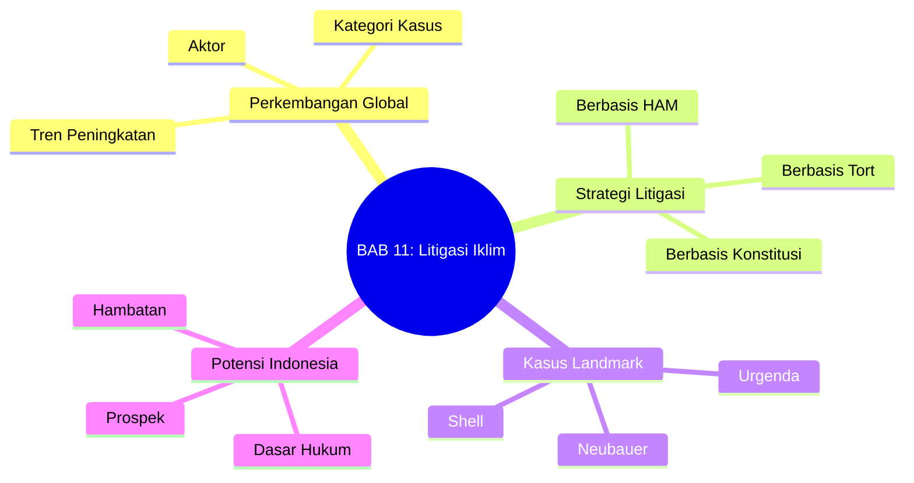

# BAB 11: Litigasi Perubahan Iklim

---

## A. PENDAHULUAN

### 1. Capaian Pembelajaran (Sub-CPMK)

Setelah mempelajari bab ini, mahasiswa mampu:

1. **Menjelaskan** perkembangan global litigasi perubahan iklim
2. **Menganalisis** berbagai strategi dan dasar hukum litigasi iklim
3. **Mengevaluasi** putusan-putusan landmark dan implikasinya
4. **Mengidentifikasi** potensi dan tantangan litigasi iklim di Indonesia

> [!tip] **Pembahasan Komprehensif**
> Bab ini memberikan pengantar tentang litigasi iklim. Untuk pembahasan komprehensif dengan analisis Advisory Opinions (ICJ, ITLOS, IACtHR), kasus-kasus terbaru 2024-2025, dan detail litigasi Indonesia, lihat [[BAB 16 -- Litigasi Perubahan Iklim --|BAB 16: Litigasi Perubahan Iklim (Komprehensif)]].

### 2. Peta Konsep Bab

---

## B. PENYAJIAN MATERI

### 1. Perkembangan Global Litigasi Iklim

Litigasi perubahan iklim—penggunaan pengadilan untuk memaksa aksi iklim—telah berkembang dari fenomena marjinal menjadi gerakan global yang membentuk kebijakan iklim. Berbeda dengan negosiasi internasional yang bergerak lambat atau proses legislatif yang sering terhambat kepentingan politik, pengadilan menawarkan forum alternatif di mana warga negara dapat secara langsung menuntut akuntabilitas dari pemerintah dan korporasi.[^1]

Signifikansi litigasi iklim melampaui hasil kasus individual. Setiap putusan—baik yang mengabulkan maupun menolak—berkontribusi pada pengembangan jurisprudensi iklim: mengklarifikasi kewajiban hukum, mendefinisikan *standing* penggugat, dan menetapkan standar pembuktian. Litigasi juga berfungsi sebagai mekanisme *accountability* dan alat kampanye yang menarik perhatian publik pada urgensi krisis iklim.[^2]

[^1]: Peel J dan Osofsky HM, *Climate Change Litigation: Regulatory Pathways to Cleaner Energy* (Cambridge University Press 2015) 1-25.
[^2]: Setzer J dan Higham C, *Global Trends in Climate Change Litigation: 2023 Snapshot* (Grantham Research Institute, LSE 2023) 4-8.

#### 1.1 Tren Peningkatan

Pertumbuhan litigasi iklim dalam dekade terakhir sangat pesat. Data dari Sabin Center for Climate Change Law dan Grantham Research Institute menunjukkan peningkatan eksponensial:

| Tahun | Jumlah Kasus Kumulatif | Pertumbuhan |
|-------|------------------------|-------------|
| 2015 | ~900 kasus | - |
| 2019 | ~1.500 kasus | +67% |
| 2023 | ~2.400 kasus | +60% |
| 2024 | ~2.600 kasus | +8% (proyeksi) |

**Tabel 11.1.** Pertumbuhan litigasi iklim global[^3]

Distribusi geografis juga mengalami diversifikasi signifikan. Pada dekade pertama, mayoritas kasus (lebih dari 80%) diajukan di Amerika Serikat—mencerminkan tradisi litigasi kepentingan publik dan sistem hukum yang mendukung. Namun sejak 2015, litigasi menyebar ke Eropa, Amerika Latin, Asia, dan Afrika. Belanda, Jerman, Prancis, Inggris, dan Australia menjadi arena utama di luar AS.[^4]

Faktor pendorong pertumbuhan meliputi: (1) kesadaran publik yang meningkat tentang krisis iklim; (2) putusan landmark seperti Urgenda yang memberikan preseden; (3) perkembangan ilmu atribusi yang memungkinkan pembuktian kausalitas; dan (4) jaringan organisasi litigasi yang semakin terkoordinasi secara global.[^5]

[^3]: Data dikompilasi dari Sabin Center, Climate Change Litigation Databases <http://climatecasechart.com/> diakses 1 November 2025.
[^4]: Setzer dan Higham (n 2) 10-15.
[^5]: Ganguly G, Setzer J dan Heyvaert V, 'If at First You Don't Succeed: Suing Corporations for Climate Change' (2018) 38 Oxford Journal of Legal Studies 841, 843-850.

#### 1.2 Kategori Kasus

Litigasi iklim dapat dikategorikan berdasarkan tergugat, dasar hukum, atau tujuan yang ingin dicapai. Kategorisasi berdasarkan tergugat memberikan kerangka yang paling praktis:

**Litigasi terhadap pemerintah**: Kategori ini menuntut agar pemerintah memperkuat kebijakan iklim—baik melalui penetapan target yang lebih ambisius, implementasi yang lebih ketat, atau penarikan izin proyek emisi tinggi. Dasar hukum meliputi hak asasi manusia, kewajiban konstitusional, atau hukum administrasi. Kasus landmark seperti *Urgenda v. Netherlands* dan *Neubauer v. Germany* menunjukkan potensi kategori ini untuk mendorong perubahan kebijakan fundamental.[^6]

**Litigasi terhadap korporasi**: Kategori yang berkembang pesat, menuntut perusahaan—terutama industri fosil—atas kontribusi mereka terhadap perubahan iklim. Teori hukum meliputi *tort* (perbuatan melawan hukum), *public nuisance*, kegagalan memperingatkan (*failure to warn*), dan penipuan konsumen. Kasus *Milieudefensie v. Shell* (2021) menunjukkan bahwa pengadilan dapat mewajibkan korporasi mengurangi emisi.[^7]

**Litigasi terhadap proyek tertentu**: Menentang izin atau persetujuan untuk proyek infrastruktur emisi tinggi—pembangkit listrik batubara, kilang minyak, atau tambang. Dasar hukum biasanya berupa hukum lingkungan dan administrasi: apakah dampak iklim telah dipertimbangkan memadai dalam proses AMDAL?[^8]

**Litigasi greenwashing**: Kategori terbaru yang menyerang klaim lingkungan yang menyesatkan oleh korporasi. Dengan meningkatnya komitmen "net zero" dan ESG, gugatan greenwashing menantang apakah klaim tersebut substantif atau sekadar *public relations*.[^9]

| Kategori | Dasar Hukum Utama | Contoh Kasus |
|----------|-------------------|--------------|
| **Terhadap pemerintah** | HAM, Konstitusi, Administrasi | Urgenda, Neubauer, Leghari |
| **Terhadap korporasi** | Tort, Public Nuisance, Fraud | Shell, Exxon, RWE |
| **Terhadap proyek** | AMDAL, Izin Lingkungan | Gloucester Resources, Heathrow |
| **Greenwashing** | Consumer Protection, Securities | ClientEarth v. Shell, ASIC v. Vanguard |

**Tabel 11.2.** Kategorisasi litigasi iklim berdasarkan tergugat

[^6]: van Zeben J dan Rowell A (eds), *A Guide to EU Environmental Law* (University of California Press 2021) 350-370.
[^7]: Milieudefensie et al v Royal Dutch Shell plc, ECLI:NL:RBDHA:2021:5339 (Rechtbank Den Haag, 26 May 2021).
[^8]: Preston BJ, 'The Contribution of the Courts in Tackling Climate Change' (2016) 28 Journal of Environmental Law 11, 15-25.
[^9]: Setzer dan Higham (n 2) 25-30.

---

### 2. Strategi dan Dasar Hukum

Keberhasilan litigasi iklim bergantung pada pemilihan strategi hukum yang tepat. Tiga pendekatan utama telah berkembang: berbasis hak asasi manusia, berbasis hukum perdata (*tort*), dan berbasis konstitusi. Masing-masing memiliki kelebihan dan keterbatasan, dan sering dikombinasikan dalam satu kasus.[^10]

[^10]: Peel dan Osofsky (n 1) 85-120.

#### 2.1 Litigasi Berbasis Hak Asasi Manusia

Pendekatan berbasis HAM berpijak pada argumen bahwa perubahan iklim mengancam hak-hak fundamental yang dilindungi oleh hukum internasional dan konstitusi nasional—termasuk hak atas hidup, kesehatan, pangan, air, dan lingkungan yang sehat. Jika negara gagal mengambil langkah memadai untuk mencegah ancaman ini, ia melanggar kewajibannya melindungi hak warganya.[^11]

Kerangka HAM memberikan kekuatan normatif: alih-alih sekadar masalah kebijakan, perubahan iklim dibingkai sebagai pelanggaran hak yang memerlukan *remedy*. Pendekatan ini juga membuka akses ke mekanisme HAM internasional—seperti *treaty bodies* PBB dan pengadilan HAM regional—yang dapat memberikan tekanan pada negara.

**Kasus Landmark: *Urgenda v. Netherlands* (2019)**

*Urgenda* adalah putusan paling berpengaruh dalam sejarah litigasi iklim. Mahkamah Agung Belanda (Hoge Raad) dalam putusan 20 Desember 2019 menolak kasasi pemerintah dan menegaskan bahwa Belanda wajib mengurangi emisi GRK minimal 25% pada akhir 2020 dibandingkan tingkat 1990.[^12]

> [!quote] **Kutipan Putusan**
> "The State has a duty of care to protect the right to life and the right to private and family life... There is a legal obligation on the State to reduce greenhouse gas emissions from Dutch territory."
> — *Hoge Raad der Nederlanden, 20 Desember 2019*

**Dasar hukum Urgenda:**
- **Pasal 2 ECHR** (hak atas hidup): Negara wajib mengambil langkah preventif untuk melindungi warga dari ancaman yang diketahui
- **Pasal 8 ECHR** (hak atas kehidupan pribadi dan keluarga): Mencakup perlindungan dari degradasi lingkungan yang serius
- **Kewajiban *due care*** dalam hukum Belanda: Dikombinasikan dengan standar internasional (Paris Agreement, laporan IPCC)[^13]

Signifikansi *Urgenda* meliputi: (1) pertama kalinya negara diwajibkan pengadilan mengurangi emisi; (2) penggunaan kreatif hukum HAM untuk kewajiban iklim; (3) penetapan target numerik spesifik oleh pengadilan; dan (4) pengaruh pada litigasi serupa di negara lain (Irlandia, Prancis, Belgia).

[^11]: Knox JH, 'Climate Change and Human Rights' (2019) 50 Virginia Journal of International Law 163.
[^12]: Staat der Nederlanden v Stichting Urgenda, ECLI:NL:HR:2019:2007 (Hoge Raad, 20 December 2019).
[^13]: ibid paras 5.3.2-5.8.

#### 2.2 Litigasi Berbasis Hukum Perdata (Tort)

Pendekatan *tort* atau perbuatan melawan hukum menuntut pertanggungjawaban pencemar—terutama perusahaan fosil—atas kerugian yang ditimbulkan oleh emisi mereka. Berbeda dengan litigasi terhadap pemerintah, pendekatan ini menargetkan aktor swasta yang secara langsung memproduksi atau mendistribusikan bahan bakar fosil.[^14]

Tantangan utama dalam litigasi *tort* iklim adalah **kausalitas**: bagaimana membuktikan bahwa emisi dari satu perusahaan menyebabkan kerugian spesifik pada penggugat? Perkembangan **ilmu atribusi** (*attribution science*) mulai menjawab tantangan ini. Studi atribusi dapat mengkuantifikasi kontribusi emisi historis terhadap pemanasan global dan probabilitas bahwa peristiwa cuaca ekstrem tertentu disebabkan oleh perubahan iklim.[^15]

**Kasus Landmark: *Milieudefensie v. Shell* (2021)**

Putusan Pengadilan Den Haag pada 26 Mei 2021 mengejutkan dunia: pengadilan mewajibkan Shell mengurangi emisi CO₂ **45% pada 2030** (dibandingkan 2019), mencakup emisi dari operasi sendiri (Scope 1 & 2) maupun emisi dari penggunaan produknya oleh konsumen (Scope 3).[^16]

Pengadilan menetapkan bahwa Shell memiliki kewajiban *unwritten standard of care* berdasarkan hukum perdata Belanda untuk mengurangi emisi sejalan dengan Paris Agreement. Meskipun Shell bukan pemerintah yang terikat Paris Agreement, perusahaan memiliki tanggung jawab independen untuk tidak berkontribusi pada pelanggaran hak asasi manusia.

**Implikasi kasus Shell:**
- Pertama kalinya korporasi diperintahkan mengurangi emisi oleh pengadilan
- Kewajiban mencakup seluruh rantai nilai (Scope 3)
- Target berbasis Paris Agreement diterapkan ke aktor swasta
- Saat ini dalam proses banding[^17]

[^14]: Ganguly, Setzer dan Heyvaert (n 5) 860-870.
[^15]: Stuart-Smith RF et al, 'Filling the evidentiary gap in climate litigation' (2021) 11 Nature Climate Change 651.
[^16]: Milieudefensie v Shell (n 7).
[^17]: Shell mengajukan banding pada Juni 2021; putusan banding diharapkan 2024-2025.

#### 2.3 Litigasi Berbasis Konstitusi

Pendekatan konstitusional menggunakan hak-hak yang dijamin konstitusi nasional—termasuk hak atas lingkungan sehat, kebebasan, atau keadilan antargenerasi—untuk menantang kecukupan kebijakan iklim. Berbeda dengan ECHR yang berlaku regional, konstitusi nasional menyediakan dasar hukum di yurisdiksi masing-masing.[^18]

**Kasus Landmark: *Neubauer v. Germany* (2021)**

Putusan Mahkamah Konstitusi Federal Jerman (*Bundesverfassungsgericht*) pada 24 Maret 2021 menyatakan bahwa Undang-Undang Iklim Jerman 2019 (*Klimaschutzgesetz*) **sebagian inkonstitusional**.[^19]

Argumen yang diterima pengadilan sangat inovatif: meskipun target 2030 (pengurangan 55%) mungkin memadai, undang-undang tidak menetapkan jalur (*trajectory*) yang jelas untuk periode pasca-2030. Ketidakpastian ini melanggar hak kebebasan (*Freiheitsrechte*) generasi muda—karena mereka akan dipaksa menanggung beban pengurangan emisi yang tidak proporsional di masa depan jika aksi tidak dipercepat sekarang.[^20]

> [!quote] **Kutipan Putusan**
> "One generation must not be allowed to consume large portions of the CO₂ budget while bearing a relatively minor share of the reduction effort, if this would involve leaving subsequent generations with a drastic reduction burden."
> — *Bundesverfassungsgericht, 24 Maret 2021*

Konsep **keadilan antargenerasi** (*intergenerational equity*) yang dirumuskan pengadilan ini sangat berpengaruh. Pemerintah Jerman merespons cepat: dalam hitungan minggu, undang-undang baru disahkan dengan target 2030 yang lebih ambisius (65% dibandingkan 55%) dan target interim yang jelas.[^21]

[^18]: Savaresi A, 'Climate Change and Human Rights: Fragmentation, Interplay and Institutional Linkages' in Duyck S, Jodoin S dan Johl A (eds), *Routledge Handbook of Human Rights and Climate Governance* (Routledge 2018) 31-45.
[^19]: Neubauer et al v Germany, BVerfG, 1 BvR 2656/18 (24 March 2021).
[^20]: ibid paras 183-198.
[^21]: Klimaschutzgesetz 2021 (Bundes-Klimaschutzgesetz as amended 24 June 2021).

---

### 3. Kasus-Kasus Landmark Global

Di luar tiga kasus landmark yang telah dibahas—*Urgenda*, *Shell*, dan *Neubauer*—sejumlah putusan lain membentuk lanskap litigasi iklim global. Tabel berikut merangkum kasus-kasus yang paling berpengaruh:

| Kasus | Yurisdiksi | Tahun | Putusan/Status |
|-------|------------|-------|----------------|
| **Urgenda v. Netherlands** | Belanda | 2019 | Dikabulkan: 25% reduksi pada 2020 |
| **Neubauer v. Germany** | Jerman | 2021 | Dikabulkan: UU Iklim inkonstitusional |
| **Milieudefensie v. Shell** | Belanda | 2021 | Dikabulkan: Shell wajib kurangi 45% (banding) |
| **Juliana v. USA** | AS | 2020 | Ditolak prosedural (*standing*) |
| **Leghari v. Pakistan** | Pakistan | 2015 | Dikabulkan: Pemerintah wajib implementasi |
| **Commune de Grande-Synthe** | Prancis | 2021 | Dikabulkan: Target Prancis tidak memadai |
| **Klimaatzaak v. Belgium** | Belgia | 2021 | Dikabulkan: Pelanggaran kewajiban *due care* |
| **Sharma v. Minister** | Australia | 2022 | Dibatalkan banding: Tidak ada *duty of care* |

**Tabel 11.3.** Ringkasan kasus landmark litigasi iklim global

#### 3.1 Kasus dari Global South

Litigasi iklim tidak terbatas pada negara maju. Kasus-kasus dari Global South menunjukkan adaptasi kreatif terhadap konteks lokal:

**Leghari v. Pakistan (2015)**: Seorang petani menggugat pemerintah Pakistan atas kegagalan mengimplementasikan kebijakan adaptasi iklim. Lahore High Court mengabulkan gugatan dan memerintahkan pembentukan Climate Change Commission untuk mengawasi implementasi. Kasus ini menjadi model litigasi iklim di Asia Selatan.[^22]

**Friends of the Irish Environment v. Ireland (2020)**: Mahkamah Agung Irlandia membatalkan rencana mitigasi nasional karena tidak cukup spesifik. Putusan ini menunjukkan bahwa pengadilan dapat menuntut detail implementasi, bukan sekadar target ambisius di atas kertas.[^23]

**Neubauer-style cases di Eropa**: Diinspirasi oleh putusan Jerman, kasus serupa diajukan di Belgia, Prancis, Polandia, dan negara-negara lain. *Commune de Grande-Synthe* di Prancis (2021) mewajibkan pemerintah mengambil langkah tambahan untuk mencapai target 40% pada 2030.[^24]

[^22]: Asghar Leghari v Federation of Pakistan, WP No 25501/2015 (Lahore High Court, 4 September 2015).
[^23]: Friends of the Irish Environment v Ireland [2020] IESC 49.
[^24]: Conseil d'État, Grande-Synthe, No 427301 (19 November 2020).

#### 3.2 Perkembangan Terbaru 2024-2025

Tahun 2024-2025 menyaksikan dua perkembangan penting: **Advisory Opinions** dari pengadilan internasional tentang perubahan iklim.

**ICJ Advisory Opinion on Climate Change**: Atas permintaan Vanuatu dan koalisi Pacific Island States, Majelis Umum PBB meminta Advisory Opinion dari Mahkamah Internasional tentang kewajiban negara terkait perubahan iklim. Meskipun tidak mengikat, putusan ICJ akan sangat berpengaruh dalam mengklarifikasi kewajiban hukum internasional.[^25]

**ITLOS Advisory Opinion (2024)**: International Tribunal for the Law of the Sea menerbitkan Advisory Opinion tentang kewajiban negara pihak UNCLOS terkait emisi GRK dan dampaknya pada lingkungan laut. Putusan ini menegaskan bahwa polusi atmosfer yang berujung pada pengasaman laut termasuk dalam cakupan UNCLOS.[^26]

Untuk pembahasan komprehensif tentang Advisory Opinions dan kasus-kasus terbaru, lihat [[BAB 16 -- Litigasi Perubahan Iklim --|BAB 16]].

[^25]: UN General Assembly Resolution A/RES/77/276 (29 March 2023) 'Request for an advisory opinion of the International Court of Justice on the obligations of States in respect of climate change'.
[^26]: Request for an Advisory Opinion Submitted by the Commission of Small Island States on Climate Change and International Law, Case No 31, ITLOS (21 May 2024).

---

### 4. Potensi Litigasi Iklim di Indonesia

Meskipun belum ada kasus "Urgenda Indonesia"—gugatan yang secara eksplisit menuntut pengurangan emisi GRK nasional—Indonesia memiliki landasan hukum yang memadai untuk pengembangan litigasi iklim. Pengalaman litigasi lingkungan yang sudah ada, termasuk kasus-kasus polusi udara dan kebakaran hutan, memberikan fondasi untuk kasus-kasus iklim di masa depan.[^27]

[^27]: ICEL, *Litigasi Lingkungan di Indonesia: Perkembangan dan Tantangan* (ICEL 2023) 80-95.

#### 4.1 Dasar Hukum yang Tersedia

Sistem hukum Indonesia menyediakan beberapa jalur potensial untuk litigasi iklim:

**Jalur Konstitusional (UUD 1945)**

**Pasal 28H ayat (1)** menjamin hak setiap orang untuk "hidup sejahtera lahir dan batin, bertempat tinggal, dan mendapatkan lingkungan hidup yang baik dan sehat." Hak konstitusional ini dapat menjadi dasar gugatan terhadap kebijakan yang berkontribusi pada degradasi lingkungan akibat perubahan iklim.[^28]

**Pasal 33 ayat (4)** menyatakan bahwa perekonomian nasional diselenggarakan berdasarkan prinsip "berwawasan lingkungan." Kombinasi dengan konsep pembangunan berkelanjutan dapat mendukung argumen bahwa kebijakan yang mengabaikan dampak iklim melanggar konstitusi.

Jalur pengujian undang-undang (*judicial review*) ke Mahkamah Konstitusi memungkinkan tantangan terhadap undang-undang yang inkonsisten dengan hak atas lingkungan sehat—misalnya, undang-undang yang memberikan insentif untuk energi fosil.[^29]

**Jalur UU PPLH (UU 32/2009)**

Undang-Undang Perlindungan dan Pengelolaan Lingkungan Hidup memberikan landasan komprehensif untuk litigasi lingkungan:

- **Pasal 91**: Hak gugat masyarakat (*citizen lawsuit*) atas nama kepentingan publik
- **Pasal 92**: Hak gugat organisasi lingkungan (*legal standing* WALHI, ICEL, dll.)
- **Pasal 87**: Tanggung jawab mutlak (*strict liability*) untuk kegiatan berisiko tinggi
- **Pasal 84**: Penyelesaian sengketa lingkungan melalui pengadilan

Meskipun UU PPLH tidak secara eksplisit menyebut "perubahan iklim," argumen dapat dibangun bahwa emisi GRK adalah bentuk "pencemaran" yang tercakup dalam definisi undang-undang.[^30]

**Jalur Hukum Perdata**

**Pasal 1365 KUH Perdata** tentang perbuatan melawan hukum (*onrechtmatige daad*) dapat digunakan untuk menuntut ganti rugi dari pencemar. Tantangannya adalah membuktikan kausalitas antara emisi dari tergugat tertentu dengan kerugian penggugat—hambatan yang sama dihadapi di yurisdiksi lain.

**Jalur Hukum Administrasi (PTUN)**

Gugatan ke Pengadilan Tata Usaha Negara dapat menyerang keputusan administrasi—seperti izin lingkungan, izin tambang, atau izin PLTU—dengan argumen bahwa dampak iklim tidak dipertimbangkan memadai dalam proses perizinan.

| Jalur Hukum | Dasar | Contoh Argumen | Forum |
|-------------|-------|----------------|-------|
| Konstitusional | UUD Pasal 28H | Pelanggaran hak atas lingkungan sehat | Mahkamah Konstitusi |
| UU PPLH | Pasal 91, 92 | Citizen lawsuit, legal standing LSM | Pengadilan Negeri |
| Perdata | KUH Perdata 1365 | PMH, ganti rugi | Pengadilan Negeri |
| Administrasi | UU PTUN | Izin tidak mempertimbangkan iklim | PTUN |

**Tabel 11.4.** Jalur hukum untuk litigasi iklim di Indonesia

[^28]: UUD 1945 ps 28H(1).
[^29]: Mahkamah Konstitusi telah mengakui justiciability hak atas lingkungan dalam beberapa putusan, termasuk Putusan MK No 91/PUU-XVIII/2020.
[^30]: UU 32/2009 tentang PPLH, ps 1 angka 14 mendefinisikan pencemaran sebagai "masuknya... makhluk hidup, zat, energi, dan/atau komponen lain ke dalam lingkungan hidup..."

#### 4.2 Hambatan dan Tantangan

Pengembangan litigasi iklim di Indonesia menghadapi sejumlah hambatan struktural:

**Budaya litigasi**: Berbeda dengan AS yang memiliki tradisi *public interest litigation* yang kuat, budaya penyelesaian sengketa di Indonesia masih lebih mengedepankan musyawarah dan jalur non-litigasi. Organisasi masyarakat sipil yang berkapasitas untuk litigasi strategis jumlahnya terbatas.[^31]

**Kapasitas hakim**: Kompleksitas ilmiah perubahan iklim—termasuk model iklim, studi atribusi, dan proyeksi dampak—memerlukan pemahaman khusus. Pelatihan hakim tentang isu-isu lingkungan dan iklim perlu diperkuat, meskipun telah ada inisiatif melalui Pusdiklat Mahkamah Agung.[^32]

**Akses keadilan**: Biaya litigasi yang tinggi, lokasi pengadilan yang terpusat di kota besar, dan prosedur yang kompleks membatasi akses masyarakat terdampak—yang sering kali berada di daerah pedesaan atau pesisir.

**Risiko SLAPP**: *Strategic Lawsuit Against Public Participation* (SLAPP)—gugatan balik terhadap aktivis oleh korporasi—menjadi ancaman nyata. Indonesia belum memiliki perlindungan anti-SLAPP yang memadai, berbeda dengan beberapa negara bagian AS dan negara lain.[^33]

**Penegakan putusan**: Bahkan ketika penggugat menang, penegakan putusan (*enforcement*) sering menjadi tantangan. Kasus polusi udara Jakarta menunjukkan bahwa putusan pengadilan tidak selalu diikuti implementasi yang memadai oleh eksekutif.

[^31]: Nicholson D dan Puteri SM, 'Environmental Public Interest Litigation in Indonesia' (2018) 4 Asian Journal of Law and Society 369.
[^32]: Mahkamah Agung RI, *Pedoman Penanganan Perkara Lingkungan Hidup* (MA 2023).
[^33]: ICEL (n 27) 150-165.

#### 4.3 Kasus-Kasus Relevan yang Sudah Ada

Beberapa kasus Indonesia memberikan preseden yang dapat dikembangkan untuk litigasi iklim:

**Gugatan Polusi Udara Jakarta (2021)**: Koalisi warga menggugat pemerintah (Presiden, berbagai menteri, dan Gubernur DKI) atas kegagalan menangani polusi udara Jakarta. Pengadilan Negeri Jakarta Pusat mengabulkan sebagian gugatan, mewajibkan pemerintah mengambil langkah-langkah tertentu. Meskipun bukan kasus iklim *stricto sensu*, putusan ini menunjukkan bahwa pengadilan dapat mewajibkan pemerintah mengambil aksi lingkungan.[^34]

**Gugatan Kebakaran Hutan**: Berbagai gugatan terkait kebakaran hutan dan lahan—baik terhadap korporasi maupun pemerintah—mengembangkan jurisprudensi tentang tanggung jawab lingkungan. Beberapa putusan menetapkan ganti rugi signifikan terhadap perusahaan perkebunan.

**Gugatan Izin Tambang**: WALHI dan organisasi lokal telah menggugat izin-izin pertambangan batubara dengan argumen dampak lingkungan. Pengembangan argumen iklim dalam kasus serupa di masa depan sangat mungkin dilakukan.

**Menuju "Urgenda Indonesia"?**: Dengan dasar hukum yang tersedia dan preseden yang sudah ada, Indonesia siap untuk kasus iklim strategis pertamanya. Koalisi organisasi lingkungan dapat mempertimbangkan gugatan terhadap pemerintah atas kegagalan mencapai target NDC atau atas kebijakan yang inkonsisten dengan komitmen Paris Agreement.[^35]

[^34]: Meliani et al v Presiden RI et al, Putusan PN Jakarta Pusat No 374/Pdt.G/LH/2019/PN Jkt Pst (16 September 2021).
[^35]: Untuk pembahasan komprehensif tentang litigasi iklim Indonesia dan strategi ke depan, lihat [[BAB 16 -- Litigasi Perubahan Iklim --|BAB 16]].

---

## C. STUDI KASUS

### Kasus: Merancang Gugatan Iklim Indonesia

**Skenario:**
Koalisi LSM ingin menggugat pemerintah Indonesia atas kegagalan mencapai target NDC dan melindungi warga dari dampak iklim.

**Pertanyaan:**
1. Apa dasar hukum yang dapat digunakan?
2. Di forum mana gugatan diajukan?
3. Apa remedy yang diminta?
4. Apa tantangan yang akan dihadapi?

---

## D. PENUTUP

### Rangkuman

- **Litigasi iklim** meningkat pesat secara global dengan lebih dari 2.300 kasus
- **Strategi** meliputi pendekatan HAM, tort, dan konstitusional
- **Putusan landmark** seperti Urgenda dan Shell menunjukkan potensi pengadilan sebagai arena aksi iklim
- **Indonesia** memiliki potensi litigasi dengan UUD Pasal 28H dan UU PPLH, meski menghadapi berbagai hambatan

### Tes Formatif

1. Kasus Urgenda v. Netherlands menggunakan dasar hukum utama:
   - a. Hukum kontrak
   - b. Hak asasi manusia (ECHR)
   - c. Hukum administrasi
   - d. Hukum lingkungan saja

2. Pengadilan yang mewajibkan Shell mengurangi emisi adalah:
   - a. ICJ
   - b. Pengadilan Den Haag
   - c. Mahkamah Konstitusi Jerman
   - d. Supreme Court AS

**Kunci:** 1-b, 2-b

---

**Navigasi:**
- ← [[BAB 10 -- Hukum Iklim Sektoral --|BAB 10]]
- → [[BAB 12 -- Masa Depan Hukum Perubahan Iklim --|BAB 12]]

---

*Buku Ajar Hukum Perubahan Iklim | BAB 11*
