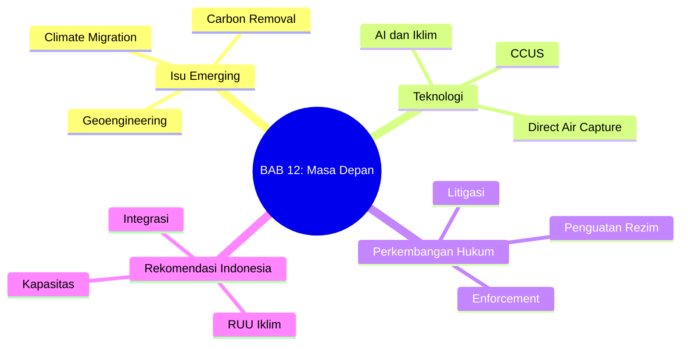

# BAB 12: Masa Depan Hukum Perubahan Iklim

---

## A. PENDAHULUAN

### 1. Capaian Pembelajaran (Sub-CPMK)

Setelah mempelajari bab ini, mahasiswa mampu:

1. **Mengidentifikasi** isu-isu emerging dalam hukum perubahan iklim
2. **Menganalisis** tantangan regulasi teknologi baru (geoengineering, AI, CCUS)
3. **Mengevaluasi** arah perkembangan hukum iklim global dan domestik
4. **Merumuskan** rekomendasi penguatan hukum iklim Indonesia

### 2. Peta Konsep Bab

---

## B. PENYAJIAN MATERI

### 1. Isu-Isu Emerging

#### 1.1 Geoengineering

> [!info] **Definisi**
> **Geoengineering** (*climate intervention*): Intervensi teknologi skala besar yang sengaja dilakukan untuk memodifikasi sistem iklim, termasuk *solar radiation management* dan *carbon dioxide removal*.

Geoengineering telah muncul sebagai salah satu isu paling kontroversial dalam diskursus hukum perubahan iklim kontemporer. Istilah ini merujuk pada intervensi teknologi berskala besar yang secara sengaja dirancang untuk memodifikasi sistem iklim global, baik melalui pengurangan radiasi matahari yang masuk ke bumi (*solar radiation management*/SRM) maupun penghilangan karbon dioksida dari atmosfer (*carbon dioxide removal*/CDR).[^1] Royal Society dalam laporannya yang berpengaruh mendefinisikan geoengineering sebagai "deliberate large-scale manipulation of the planetary environment to counteract anthropogenic climate change."[^2]

Tantangan hukum yang dihadapi geoengineering bersifat multidimensional dan kompleks. Pertama, hingga saat ini tidak terdapat kerangka regulasi internasional yang komprehensif untuk mengatur aktivitas geoengineering, meskipun beberapa instrumen seperti London Protocol telah mengadopsi amandemen terkait fertilisasi laut.[^3] Kedua, risiko dampak lintas batas dari aktivitas geoengineering menimbulkan pertanyaan serius tentang tanggung jawab negara berdasarkan hukum internasional, khususnya prinsip *sic utere tuo ut alienum non laedas*. Ketiga, isu keadilan dan persetujuan (*consent*) menjadi sangat krusial mengingat efek geoengineering tidak dapat dibatasi pada wilayah negara pelaku saja. Keempat, terdapat kekhawatiran tentang *moral hazard* di mana ketersediaan opsi geoengineering dapat mengurangi insentif untuk melakukan mitigasi emisi yang sesungguhnya.[^4]

#### 1.2 Migrasi dan Pengungsi Iklim

Fenomena migrasi akibat perubahan iklim telah berkembang menjadi salah satu isu kemanusiaan dan hukum paling mendesak di abad ke-21. Internal Displacement Monitoring Centre memperkirakan bahwa antara tahun 2008-2022, rata-rata 21,5 juta orang per tahun terpaksa mengungsi akibat bencana terkait cuaca.[^5] Proyeksi World Bank menunjukkan bahwa tanpa tindakan iklim dan pembangunan yang konkret, perubahan iklim dapat memaksa 216 juta orang bermigrasi internal pada tahun 2050.[^6]

Secara hukum, tantangan utama terletak pada ketiadaan definisi yang diakui secara internasional untuk "pengungsi iklim" atau "climate refugee." Konvensi tentang Status Pengungsi 1951 secara eksplisit membatasi definisi pengungsi pada mereka yang melarikan diri karena persekusi berdasarkan ras, agama, kebangsaan, keanggotaan kelompok sosial tertentu, atau opini politik—tidak mencakup faktor lingkungan.[^7] Meskipun terdapat perkembangan signifikan seperti putusan Human Rights Committee dalam kasus *Teitiota v New Zealand* yang mengakui bahwa deportasi ke negara yang terdampak perubahan iklim dapat melanggar hak atas hidup dalam kondisi tertentu, perlindungan hukum yang komprehensif masih absen.[^8] Kebutuhan akan instrumen hukum baru semakin mendesak, dengan beberapa proposal mencakup protokol tambahan pada Konvensi Pengungsi, konvensi tersendiri tentang pengungsi iklim, atau penguatan kerangka regional seperti yang dilakukan oleh Uni Afrika melalui Konvensi Kampala.

#### 1.3 Carbon Dioxide Removal (CDR)

Teknologi penghilangan karbon dioksida dari atmosfer (*Carbon Dioxide Removal*/CDR) telah menjadi komponen integral dalam hampir seluruh skenario pembatasan pemanasan global pada 1,5°C sebagaimana digariskan oleh IPCC.[^9] CDR mencakup spektrum luas pendekatan, mulai dari solusi berbasis alam hingga teknologi tinggi. Reforestasi dan afforestasi merupakan metode CDR paling konvensional yang memanfaatkan kemampuan alami pohon dalam menyerap karbon. BECCS (*Bioenergy with Carbon Capture and Storage*) mengkombinasikan produksi energi dari biomassa dengan penangkapan dan penyimpanan karbon yang dihasilkan. Direct Air Capture (DAC) menggunakan proses kimiawi untuk mengekstrak CO₂ langsung dari udara ambien. Sementara itu, *enhanced weathering* mempercepat proses geologis alami pelapukan mineral yang menyerap karbon.

---

### 2. Teknologi dan Hukum Iklim

#### 2.1 AI dan Machine Learning

Kecerdasan buatan (*Artificial Intelligence*/AI) dan *machine learning* telah membuka horizon baru dalam upaya mitigasi dan adaptasi perubahan iklim. Teknologi ini menawarkan kapabilitas transformatif dalam berbagai aspek aksi iklim. Dalam optimasi sistem energi, algoritma AI dapat memprediksi permintaan listrik dengan presisi tinggi dan mengoptimalkan distribusi energi terbarukan yang bersifat intermiten. Pemantauan emisi gas rumah kaca telah mengalami revolusi dengan penggunaan AI untuk menganalisis data satelit, memungkinkan deteksi dan kuantifikasi emisi dari fasilitas individual dengan akurasi yang sebelumnya tidak mungkin dicapai.[^10] Model prediksi iklim berbasis *machine learning* semakin mampu memberikan proyeksi yang lebih akurat dan resolusi spasial yang lebih tinggi. Sementara itu, konsep *smart grid* yang ditenagai AI memungkinkan integrasi energi terbarukan ke dalam jaringan listrik secara lebih efisien dan responsif.

Namun demikian, penggunaan AI dalam konteks iklim juga menghadirkan tantangan hukum yang signifikan. Regulasi AI masih dalam tahap perkembangan di sebagian besar yurisdiksi, dengan Uni Eropa menjadi pionir melalui EU AI Act yang mulai berlaku secara bertahap.[^11] Isu akuntabilitas algoritmik menjadi krusial ketika keputusan yang dihasilkan AI memiliki implikasi signifikan bagi masyarakat dan lingkungan—pertanyaan tentang siapa yang bertanggung jawab ketika algoritma menghasilkan keputusan yang keliru atau diskriminatif memerlukan jawaban hukum yang jelas. Perlindungan data pribadi (*data privacy*) juga menjadi perhatian serius mengingat sistem AI iklim seringkali memerlukan akses ke data dalam jumlah besar, termasuk data yang berpotensi sensitif.

#### 2.2 Carbon Capture, Utilization, and Storage (CCUS)

Carbon Capture, Utilization, and Storage (CCUS) merepresentasikan serangkaian teknologi yang menangkap emisi CO₂ dari sumber titik seperti pembangkit listrik atau fasilitas industri, kemudian memanfaatkannya untuk berbagai keperluan atau menyimpannya secara permanen di formasi geologis bawah tanah. IEA memproyeksikan bahwa CCUS perlu menangkap sekitar 7,6 Gt CO₂ per tahun pada 2050 untuk mencapai skenario net-zero global.[^12]

Kompleksitas hukum CCUS mencakup beberapa dimensi kritis. Perizinan penyimpanan bawah tanah memerlukan kerangka regulasi yang mengatur hak akses, standar keamanan, dan prosedur pemantauan—aspek yang di banyak negara masih memerlukan pengembangan lebih lanjut. Tanggung jawab jangka panjang (*long-term liability*) menjadi isu fundamental mengingat CO₂ harus tersimpan secara permanen selama ribuan tahun, menimbulkan pertanyaan tentang siapa yang menanggung risiko kebocoran setelah operator berhenti beroperasi.[^13] Integrasi CCUS dengan pasar karbon memerlukan aturan yang jelas tentang bagaimana kredit karbon dapat diklaim dan diverifikasi untuk karbon yang ditangkap dan disimpan. Regulasi lintas batas menjadi relevan terutama untuk penyimpanan di bawah laut (*offshore storage*) yang mungkin melintasi yurisdiksi nasional atau berlokasi di area di luar yurisdiksi nasional

---

### 3. Arah Perkembangan Hukum Iklim

#### 3.1 Penguatan Rezim Internasional

Rezim hukum iklim internasional terus mengalami evolusi dan penguatan melalui berbagai mekanisme. Global Stocktake (GST) yang diamanatkan Pasal 14 Perjanjian Paris telah menjadi instrumen sentral untuk mengevaluasi kemajuan kolektif dan mendorong peningkatan ambisi secara berkala. Hasil GST pertama yang diselesaikan pada COP28 di Dubai mengkonfirmasi kesenjangan signifikan antara komitmen saat ini dengan trajektori yang diperlukan untuk membatasi pemanasan pada 1,5°C, sekaligus menghasilkan kesepakatan bersejarah tentang transisi menjauh dari bahan bakar fosil.[^14]

Penguatan transparansi dan akuntabilitas melalui *Enhanced Transparency Framework* (ETF) yang mulai berlaku penuh pada 2024 menandai era baru dalam pelaporan iklim, dengan standar pelaporan yang lebih ketat dan seragam untuk semua pihak. Implementasi Pasal 6 Perjanjian Paris tentang mekanisme pasar dan non-pasar terus berkembang dengan diadopsinya aturan operasional yang lebih rinci, membuka jalan bagi transfer hasil mitigasi internasional yang terstandarisasi. Pencapaian monumental berupa operasionalisasi Loss and Damage Fund yang disepakati di COP27 dan menjadi operasional di COP28 menandai pengakuan formal terhadap kebutuhan dukungan finansial bagi negara-negara rentan yang menghadapi dampak iklim yang tidak dapat dimitigasi atau diadaptasi.

#### 3.2 Peran Pengadilan

Litigasi perubahan iklim telah mengalami pertumbuhan eksponensial dan diproyeksikan akan terus meningkat dalam dekade mendatang. Grantham Research Institute mencatat lebih dari 2.500 kasus litigasi iklim di seluruh dunia hingga 2023, dengan lebih dari separuhnya diajukan sejak 2015.[^15] Advisory Opinion yang dimintakan kepada International Court of Justice (ICJ) oleh Majelis Umum PBB atas inisiatif negara-negara pulau kecil akan menjadi referensi otoritatif tentang kewajiban negara berdasarkan hukum internasional terkait perubahan iklim—sebuah perkembangan yang berpotensi mendefinisikan ulang lanskap hukum iklim internasional.

Ekspansi yurisprudensi nasional terlihat dari putusan-putusan landmark di berbagai yurisdiksi. Kasus *Urgenda v. Netherlands* yang mewajibkan pemerintah Belanda meningkatkan target reduksi emisinya telah menjadi preseden yang diikuti di banyak negara. Litigasi terhadap korporasi juga meningkat tajam, termasuk kasus bersejarah *Milieudefensie v. Shell* yang memerintahkan perusahaan minyak raksasa untuk mengurangi emisi sebesar 45% pada 2030.[^16] Penegakan NDC melalui pengadilan menjadi tren yang muncul di mana warga negara dan organisasi masyarakat sipil menggunakan jalur yudisial untuk memaksa pemerintah memenuhi komitmen iklim yang telah dideklarasikan.

#### 3.3 Konvergensi dengan Isu Lain

Hukum perubahan iklim tidak berkembang dalam isolasi melainkan semakin terkonvergensi dengan berbagai bidang hukum lainnya. Hubungan dengan hukum biodiversitas menjadi semakin erat dengan diadopsinya Kunming-Montreal Global Biodiversity Framework pada 2022 yang mengakui keterkaitan tak terpisahkan antara krisis iklim dan krisis keanekaragaman hayati.[^17] Pendekatan berbasis alam (*nature-based solutions*) menjadi jembatan kebijakan antara agenda iklim dan biodiversitas.

Konvergensi dengan hak asasi manusia telah mentransformasi cara pandang terhadap perubahan iklim—dari isu teknis-lingkungan menjadi isu keadilan dan hak fundamental. Pengadilan HAM regional seperti European Court of Human Rights dan Inter-American Court of Human Rights kini secara aktif menangani kasus-kasus iklim. Dalam ranah perdagangan internasional, Carbon Border Adjustment Mechanism (CBAM) Uni Eropa yang mulai berlaku secara bertahap sejak 2023 menandai era baru di mana kebijakan iklim dan perdagangan internasional saling berinteraksi, menimbulkan pertanyaan kompleks tentang konsistensi dengan aturan WTO. Sektor keuangan juga mengalami transformasi melalui perkembangan *sustainable finance* dengan standar pelaporan keberlanjutan yang semakin ketat dan proliferasi taksonomi hijau di berbagai yurisdiksi

---

### 4. Rekomendasi untuk Indonesia

#### 4.1 Penguatan Kerangka Hukum

Indonesia memerlukan penguatan substansial dalam kerangka hukum iklimnya untuk menghadapi tantangan dekade mendatang. Prioritas utama adalah pengesahan Rancangan Undang-Undang Perubahan Iklim yang telah lama diwacanakan. Undang-undang iklim yang komprehensif diperlukan untuk menetapkan target pengurangan emisi yang mengikat secara hukum (*legally binding*), membangun arsitektur kelembagaan yang jelas dengan mandat dan kewenangan yang tegas, serta menciptakan mekanisme akuntabilitas yang efektif. Pengalaman negara-negara yang telah memiliki undang-undang iklim seperti Inggris dengan Climate Change Act 2008 dan Jerman dengan Federal Climate Change Act 2019 menunjukkan bahwa kerangka hukum yang kuat berkontribusi signifikan terhadap pencapaian target iklim.[^18]

Harmonisasi sektoral merupakan kebutuhan mendesak mengingat fragmentasi regulasi iklim Indonesia saat ini tersebar di berbagai kementerian dan sektor. Konsistensi antara regulasi sektoral dengan target Nationally Determined Contribution (NDC) harus dipastikan melalui mekanisme koordinasi yang efektif dan, jika perlu, revisi regulasi yang tidak sejalan. Penguatan penegakan hukum memerlukan peningkatan kapasitas aparat penegak hukum dalam memahami kompleksitas isu iklim, reformulasi sanksi yang lebih efektif dan proporsional, serta penguatan mekanisme pengawasan dan pelaporan.

#### 4.2 Pengembangan Kapasitas

Pengembangan kapasitas sumber daya manusia merupakan prasyarat bagi efektivitas hukum iklim di Indonesia. Integrasi hukum perubahan iklim dalam kurikulum pendidikan hukum di perguruan tinggi menjadi langkah fundamental untuk mempersiapkan generasi praktisi hukum yang memahami kompleksitas isu iklim. Saat ini, hukum perubahan iklim belum menjadi mata kuliah standar di sebagian besar fakultas hukum di Indonesia, sebuah kesenjangan yang perlu segera diatasi.

Peningkatan kapasitas hakim dalam menangani kasus-kasus terkait iklim menjadi semakin penting seiring meningkatnya litigasi iklim global yang berpotensi berdampak ke Indonesia. Program pelatihan berkelanjutan bagi hakim tentang ilmu iklim, hukum lingkungan internasional, dan yurisprudensi iklim komparatif perlu dikembangkan secara sistematis. Dukungan terhadap penelitian hukum iklim di Indonesia juga memerlukan penguatan, termasuk pembentukan pusat-pusat kajian hukum iklim di universitas-universitas terkemuka dan alokasi pendanaan riset yang memadai.

#### 4.3 Kepemimpinan Regional

Indonesia memiliki potensi besar untuk memainkan peran kepemimpinan dalam isu iklim di tingkat regional dan global. Sebagai negara dengan ekonomi terbesar di Asia Tenggara dan emitter terbesar di kawasan, Indonesia dapat menjadi pemimpin dalam agenda iklim ASEAN, mendorong penguatan komitmen kolektif kawasan dan harmonisasi kebijakan regional.[^19] Pengalaman Indonesia dalam mengembangkan pasar karbon melalui Bursa Karbon Indonesia dan regulasi pendukungnya dapat menjadi model bagi negara-negara berkembang lainnya yang sedang merancang sistem serupa.

Dalam konteks REDD+ dan sektor penggunaan lahan (*Forestry and Other Land Use*/FOLU), Indonesia memiliki pengalaman puluhan tahun yang dapat dibagikan dengan negara-negara hutan tropis lainnya. Meskipun menghadapi tantangan signifikan, kemajuan Indonesia dalam mengurangi deforestasi dan mengembangkan kerangka kelembagaan REDD+ menawarkan pelajaran berharga. Kepemimpinan regional ini tidak hanya meningkatkan posisi Indonesia dalam diplomasi iklim internasional tetapi juga berkontribusi pada upaya kolektif global dalam mengatasi krisis iklim

---

## C. STUDI KASUS

### Kasus: Regulasi Geoengineering

**Skenario:**
Sebuah perusahaan teknologi ingin melakukan eksperimen *stratospheric aerosol injection* (SAI) di perairan internasional dekat Indonesia. Apa respons hukum yang seharusnya?

---

## D. PENUTUP

### 1. Rangkuman

Pada bab ini, kita telah mempelajari:

- **Isu Emerging:** Geoengineering, migrasi iklim, dan carbon removal memerlukan kerangka hukum baru
- **Teknologi:** AI, CCUS, dan DAC membuka peluang sekaligus tantangan regulasi
- **Perkembangan:** Hukum iklim akan semakin kuat dengan penguatan rezim, litigasi, dan konvergensi dengan isu lain
- **Indonesia:** Perlu penguatan melalui RUU Iklim, harmonisasi, kapasitas, dan kepemimpinan regional

### 2. Refleksi Akhir

Hukum perubahan iklim adalah bidang yang dinamis dan terus berkembang. Sebagai calon profesional hukum, Anda akan menjadi bagian dari upaya global mengatasi krisis iklim—baik sebagai pembuat kebijakan, praktisi, akademisi, atau warga negara yang aktif.

> [!quote] **Penutup**
> "The law is not an end in itself, but a means to an end. In climate change, that end is nothing less than the survival and flourishing of human civilization and the natural world."

---

### Tes Formatif Akhir

1. Geoengineering merujuk pada:
   - a. Energi terbarukan saja
   - b. Intervensi teknologi skala besar pada sistem iklim
   - c. Adaptasi berbasis ekosistem
   - d. Litigasi iklim

2. Carbon Capture and Storage (CCS) termasuk kategori:
   - a. Mitigasi
   - b. Adaptasi
   - c. Loss and Damage
   - d. Geoengineering saja

**Kunci:** 1-b, 2-a

---

## Catatan Kaki

[^1]: IPCC, 'Climate Change 2021: The Physical Science Basis. Contribution of Working Group I to the Sixth Assessment Report of the Intergovernmental Panel on Climate Change' (Cambridge University Press 2021) Annex VII: Glossary.

[^2]: The Royal Society, 'Geoengineering the Climate: Science, Governance and Uncertainty' (The Royal Society 2009) 1.

[^3]: Resolution LP.4(8) on the Amendment to the London Protocol to Regulate the Placement of Matter for Ocean Fertilization and Other Marine Geoengineering Activities (adopted 18 October 2013).

[^4]: Jesse L Reynolds, 'The Governance of Solar Geoengineering: Managing Climate Change in the Anthropocene' (Cambridge University Press 2019) 45-78.

[^5]: Internal Displacement Monitoring Centre, 'Global Report on Internal Displacement 2023' (IDMC 2023) 7.

[^6]: Viviane Clement and others, 'Groundswell Part 2: Acting on Internal Climate Migration' (World Bank 2021) xxi.

[^7]: Convention Relating to the Status of Refugees (adopted 28 July 1951, entered into force 22 April 1954) 189 UNTS 137, art 1A(2).

[^8]: Ioane Teitiota v New Zealand, Communication No 2728/2016, UN Doc CCPR/C/127/D/2728/2016 (Human Rights Committee, 7 January 2020).

[^9]: IPCC, 'Global Warming of 1.5°C: An IPCC Special Report on the Impacts of Global Warming of 1.5°C above Pre-industrial Levels' (Cambridge University Press 2018) ch 4.

[^10]: Daniel Huppmann and others, 'The Role of Artificial Intelligence in Achieving the Sustainable Development Goals' (2019) 10 Nature Communications 4308.

[^11]: Regulation (EU) 2024/1689 of the European Parliament and of the Council of 13 June 2024 laying down harmonised rules on artificial intelligence (Artificial Intelligence Act) [2024] OJ L1689/1.

[^12]: IEA, 'Net Zero by 2050: A Roadmap for the Global Energy Sector' (IEA 2021) 79.

[^13]: Alexandra B Klass and Elizabeth J Wilson, 'Climate Change and Carbon Sequestration: Assessing a Liability Regime for Long-Term Storage of Carbon Dioxide' (2008) 58 Emory Law Journal 103.

[^14]: UNFCCC, 'Outcome of the First Global Stocktake' Decision 1/CMA.5, UN Doc FCCC/PA/CMA/2023/16/Add.1 (15 March 2024).

[^15]: Joana Setzer and Catherine Higham, 'Global Trends in Climate Change Litigation: 2023 Snapshot' (Grantham Research Institute on Climate Change and the Environment 2023) 3.

[^16]: Rechtbank Den Haag (District Court of The Hague), Milieudefensie et al v Royal Dutch Shell plc, Case No C/09/571932 / HA ZA 19-379 (26 May 2021).

[^17]: Decision 15/4, Kunming-Montreal Global Biodiversity Framework, UN Doc CBD/COP/DEC/15/4 (19 December 2022).

[^18]: Michal Nachmany and Joana Setzer, 'Policy Brief: Global Trends in Climate Change Legislation and Litigation: 2018 Snapshot' (Grantham Research Institute 2018) 4-5.

[^19]: ASEAN Secretariat, 'ASEAN State of Climate Change Report' (ASEAN Secretariat 2021) 89-95.

---

**Navigasi:**
- ← [[Buku-Ajar-Hukum-Perubahan-Iklim-11-Litigasi-Perubahan-Iklim_BAB-11|BAB 11]]
- → [[Buku-Ajar-Hukum-Perubahan-Iklim-13-Kerangka-Hukum-Adaptasi-Intl_BAB-13|BAB 13]]

---

*Buku Ajar Hukum Perubahan Iklim | BAB 12*
