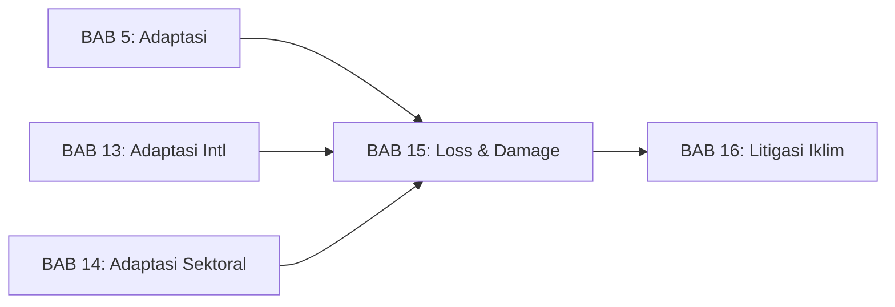
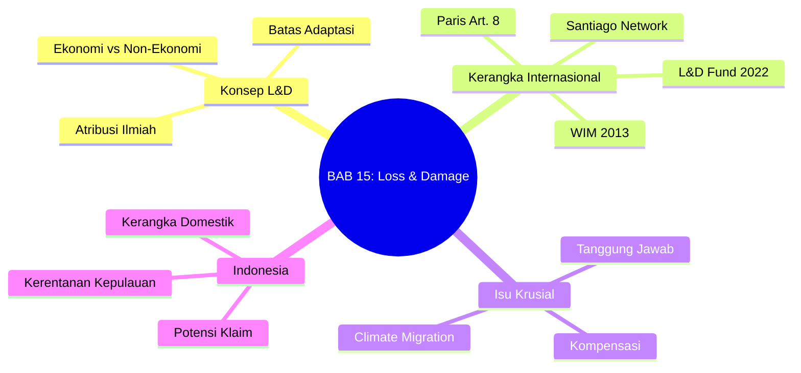

# BAB 15: Loss and Damage dalam Hukum Iklim

---

## A. PENDAHULUAN

### 1. Capaian Pembelajaran (Sub-CPMK)

Setelah mempelajari bab ini, mahasiswa mampu:

1. **Menjelaskan** konsep *loss and damage* dan perbedaannya dengan adaptasi
2. **Menganalisis** kerangka hukum internasional untuk *loss and damage* (WIM, Pasal 8, L&D Fund)
3. **Mengevaluasi** tantangan kompensasi dan isu tanggung jawab negara
4. **Mengidentifikasi** implikasi *loss and damage* bagi Indonesia sebagai negara kepulauan rentan

### 2. Indikator Pencapaian

- [ ] Mahasiswa dapat membedakan *loss and damage* dari adaptasi
- [ ] Mahasiswa dapat menjelaskan fungsi Warsaw International Mechanism (WIM)
- [ ] Mahasiswa dapat menganalisis makna dan implikasi Paragraf 51 Paris Agreement
- [ ] Mahasiswa dapat mengidentifikasi potensi klaim *loss and damage* Indonesia

### 3. Deskripsi Singkat

Ada batas untuk adaptasi. Ketika kenaikan muka laut menenggelamkan pulau-pulau kecil, ketika kekeringan berkepanjangan merusak pertanian secara permanen, ketika badai menghancurkan infrastruktur vital—kerugian dan kerusakan (*loss and damage*) terjadi melampaui apa yang dapat diatasi oleh adaptasi. Bab ini akan membahas konsep *loss and damage*, kerangka hukum internasional yang sedang berkembang, dan implikasinya bagi Indonesia sebagai salah satu negara paling rentan terhadap dampak perubahan iklim.

### 4. Hubungan dengan Bab Lain

Bab ini melengkapi pembahasan adaptasi di [[BAB 5 -- Hukum Adaptasi Perubahan Iklim --|BAB 5]], [[BAB 13 -- Kerangka Hukum Adaptasi Internasional --|BAB 13]], dan [[BAB 14 -- Hukum Adaptasi Sektoral Indonesia --|BAB 14]] dengan membahas apa yang terjadi ketika adaptasi mencapai batasnya. Konsep *loss and damage* juga terkait erat dengan [[BAB 16 -- Litigasi Perubahan Iklim --|BAB 16]] tentang litigasi iklim, karena sebagian kasus litigasi bertujuan untuk menuntut kompensasi atas kerugian dan kerusakan.

### 5. Peta Konsep Bab

---

## B. PENYAJIAN MATERI

### 1. Konsep Loss and Damage

#### 1.1 Definisi dan Batasan

> [!info] **Definisi**
> **Loss and Damage** (kerugian dan kerusakan): Dampak negatif perubahan iklim yang tidak dapat dihindari melalui mitigasi maupun adaptasi, baik akibat keterbatasan fisik (*hard limits*) maupun keterbatasan kapasitas (*soft limits*).[^1]

Konsep *loss and damage* pertama kali diperkenalkan secara formal dalam negosiasi iklim oleh Alliance of Small Island States (AOSIS) pada 1991, yang mengusulkan mekanisme asuransi internasional untuk mengkompensasi negara-negara pulau kecil atas dampak kenaikan muka laut.[^2]

Konsep ini mengakui bahwa ada dampak perubahan iklim yang:
1. **Tidak dapat dimitigasi:** Karena emisi historis yang sudah terjadi
2. **Tidak dapat diadaptasi:** Karena melampaui kapasitas adaptasi

**Batas Keras (*Hard Limits*):**
Keterbatasan fisik di mana adaptasi tidak mungkin dilakukan, misalnya:
- Kenaikan muka laut yang menenggelamkan pulau
- Peningkatan suhu yang melampaui toleransi fisiologis tanaman
- Pengasaman laut yang merusak karang secara permanen

**Batas Lunak (*Soft Limits*):**
Keterbatasan yang dapat diatasi dengan sumber daya tambahan, misalnya:
- Kurangnya pendanaan untuk infrastruktur adaptasi
- Keterbatasan teknologi yang tersedia
- Kapasitas kelembagaan yang terbatas

#### 1.2 Kategori Loss and Damage

| Kategori | Contoh | Kuantifikasi | Kompensasi |
|----------|--------|--------------|------------|
| **Kerugian Ekonomi** | Infrastruktur rusak, produktivitas menurun, GDP hilang | Relatif mudah dihitung dalam nilai moneter | Monetizable |
| **Kerugian Non-Ekonomi** | Nyawa, kesehatan, warisan budaya, ekosistem, identitas | Sulit/tidak mungkin diukur secara moneter | Non-monetizable |

**Tabel 15.1.** Kategori *loss and damage*

> [!example] **Contoh: Kerugian Non-Ekonomi**
> Ketika pulau-pulau kecil di Pasifik tenggelam, kerugian yang dialami bukan hanya ekonomi:
> - **Hilangnya tanah air:** Identitas nasional dan kedaulatan
> - **Hilangnya budaya:** Tradisi, bahasa, pengetahuan tradisional
> - **Hilangnya koneksi spiritual:** Hubungan dengan tanah leluhur
> - **Trauma psikologis:** Dampak kesehatan mental akibat pengungsian
>
> Bagaimana mengkompensasi kerugian seperti ini?

#### 1.3 Atribusi Ilmiah

Untuk menuntut kompensasi atas *loss and damage*, diperlukan bukti kausalitas antara emisi GRK dan kerugian spesifik. **Ilmu atribusi iklim** (*climate attribution science*) telah berkembang pesat:

**Kemajuan Atribusi:**
- Event attribution: Menghubungkan kejadian cuaca ekstrem dengan perubahan iklim
- Source attribution: Menghubungkan emisi dari entitas tertentu dengan dampak tertentu
- Impact attribution: Menghubungkan dampak spesifik dengan perubahan iklim

> [!quote] **Kutipan**
> "For 70% of the days when data are available, the probability of the observed daily maximum temperature can be attributed to human influence."
> — *World Weather Attribution, 2022*[^3]

**Implikasi Hukum:**
Kemajuan ilmu atribusi memperkuat dasar ilmiah untuk klaim kompensasi dan litigasi iklim. Semakin jelas hubungan kausal antara emisi dan dampak, semakin kuat pula dasar hukum untuk menuntut pertanggungjawaban.

---

### 2. Warsaw International Mechanism (WIM)

#### 2.1 Pembentukan (COP19 Warsaw 2013)

Setelah puluhan tahun perjuangan oleh negara-negara kepulauan kecil (dimulai dari proposal AOSIS pada 1991), COP19 di Warsaw akhirnya membentuk mekanisme khusus untuk menangani *loss and damage*:

> [!info] **Definisi**
> **Warsaw International Mechanism for Loss and Damage** (WIM): Mekanisme di bawah UNFCCC yang dibentuk untuk menangani *loss and damage* terkait dampak perubahan iklim di negara-negara berkembang yang sangat rentan.[^4]

**Konteks Pembentukan:**
- Typhoon Haiyan (2013) menghantam Filipina beberapa hari sebelum COP19
- 6.300 korban jiwa, USD 13 miliar kerugian
- Momentum politik untuk pengakuan *loss and damage*

Pidato emosional Yeb Sano, delegasi Filipina, di pembukaan COP19 menjadi momen bersejarah yang mendorong kesepakatan pembentukan WIM. Sano menyatakan kesiapannya untuk berpuasa hingga tercapai kesepakatan yang bermakna.[^5]

#### 2.2 Fungsi WIM

WIM memiliki tiga fungsi utama:

| Fungsi | Deskripsi | Kegiatan |
|--------|-----------|----------|
| **Enhancing Knowledge** | Meningkatkan pengetahuan dan pemahaman | Riset, database, knowledge portal |
| **Strengthening Dialogue** | Memperkuat dialog dan koordinasi | Forum, konsultasi, engagement |
| **Enhancing Action** | Meningkatkan aksi dan dukungan | Panduan, capacity building, dukungan teknis |

**Tabel 15.2.** Tiga fungsi Warsaw International Mechanism

Decision 2/CP.19 menetapkan bahwa WIM harus ditinjau pada COP22 untuk menilai struktur, mandat, dan efektivitasnya. Peninjauan ini menghasilkan penguatan WIM melalui rencana kerja lima tahunan (*five-year rolling workplan*).[^6]

#### 2.3 Executive Committee (ExCom)

WIM dijalankan oleh Executive Committee yang terdiri dari:
- 10 anggota dari negara-negara Annex I (maju)
- 10 anggota dari negara-negara non-Annex I (berkembang)

**Lima Area Kerja ExCom:**
1. **Slow Onset Events:** Kenaikan muka laut, penggurunan, hilangnya biodiversitas
2. **Non-economic Losses:** Nyawa, kesehatan, mobilitas, wilayah, warisan budaya
3. **Comprehensive Risk Management:** Pendekatan holistik terhadap risiko iklim
4. **Human Mobility:** Migrasi, pengungsian, relokasi terencana
5. **Action and Support:** Dukungan keuangan, teknologi, kapasitas

---

### 3. Paris Agreement Pasal 8

#### 3.1 Ketentuan Pasal 8

Pasal 8 Paris Agreement mengkonsolidasikan *loss and damage* sebagai pilar ketiga rezim iklim (setelah mitigasi dan adaptasi):

**Pasal 8.1:**
> "Parties recognize the importance of averting, minimizing and addressing loss and damage associated with the adverse effects of climate change..."[^7]

Ketentuan ini menggunakan tiga kata kerja kunci: *averting* (menghindari), *minimizing* (meminimalkan), dan *addressing* (menangani), yang mencerminkan spektrum respons terhadap *loss and damage* dari pencegahan hingga penanganan pasca-kejadian.[^8]

**Elemen-Elemen Pasal 8:**

| Paragraf | Substansi |
|----------|-----------|
| 8.1 | Pengakuan pentingnya menghindari, meminimalkan, dan menangani L&D |
| 8.2 | WIM ditempatkan di bawah otoritas CMA |
| 8.3 | Kerja sama dan fasilitasi untuk pemahaman, aksi, dan dukungan |
| 8.4 | Area kerja sama: early warning, emergency preparedness, risk assessment, risk insurance, non-economic losses, resilience |

**Tabel 15.3.** Elemen-elemen Pasal 8 Paris Agreement

#### 3.2 Paragraf 51: Pengecualian Tanggung Jawab

> [!warning] **Perhatian: Paragraf Krusial**
> Paragraf 51 dari keputusan adopsi Paris Agreement adalah salah satu ketentuan paling kontroversial dalam hukum iklim internasional.

**Bunyi Paragraf 51:**
> "The Conference of the Parties... agrees that Article 8 of the Agreement does not involve or provide a basis for any liability or compensation."[^9]

**Analisis:**

| Perspektif | Interpretasi |
|------------|--------------|
| **Negara Maju** | Paragraf ini mengecualikan tanggung jawab hukum dan kewajiban kompensasi |
| **Negara Berkembang** | Paragraf ini hanya berlaku untuk Pasal 8, bukan prinsip hukum umum |
| **Akademis** | Paragraf ini tidak menghilangkan tanggung jawab berdasarkan hukum internasional umum |

**Implikasi Hukum:**
1. Paragraf 51 bukan bagian dari Paris Agreement itu sendiri, melainkan keputusan adopsi
2. Tidak menghilangkan kewajiban berdasarkan *customary international law*
3. Tidak menghalangi litigasi domestik atau klaim berdasarkan hukum lain

Para ahli hukum internasional seperti Benoit Mayer berpendapat bahwa Paragraf 51 hanya membatasi klaim berdasarkan Pasal 8, namun tidak menutup jalur hukum lain termasuk prinsip *no-harm* dalam hukum kebiasaan internasional.[^10]

---

### 4. Loss and Damage Fund (COP27-28)

#### 4.1 Terobosan Sharm el-Sheikh 2022

COP27 di Mesir menghasilkan terobosan bersejarah: persetujuan untuk membentuk **dana khusus untuk *loss and damage***—setelah 30 tahun perjuangan sejak proposal AOSIS 1991.

**Konteks:**
- Banjir Pakistan 2022: 1.700 korban jiwa, USD 30 miliar kerugian
- Momentum politik yang kuat
- Koalisi negara-negara rentan yang solid

#### 4.2 Operasionalisasi (COP28 Dubai 2023)

COP28 mengoperasionalisasikan fund tersebut dengan keputusan-keputusan kunci:

| Aspek | Keputusan |
|-------|-----------|
| **Nama** | Fund for Responding to Loss and Damage |
| **Hosting** | World Bank (interim, 4 tahun) |
| **Governance** | Board dengan 26 anggota (representasi regional) |
| **Eligibility** | Negara berkembang yang sangat rentan |
| **Komitmen Awal** | ~USD 700 juta |

**Tabel 15.4.** Operasionalisasi Loss and Damage Fund[^11]

**Kontributor Awal:**
- UAE: USD 100 juta
- Jerman: USD 100 juta
- UK: USD 75 juta
- Jepang: USD 10 juta
- AS: USD 17,5 juta (sangat rendah mengingat tanggung jawab historis)

Keputusan untuk menempatkan fund di bawah World Bank secara interim menuai kritik dari sejumlah negara berkembang dan organisasi masyarakat sipil, yang mempertanyakan akses dan tata kelola dana tersebut.[^12]

#### 4.3 Kesenjangan Pendanaan

> [!warning] **Perhatian: Gap Masif**
> Kesenjangan antara kebutuhan dan ketersediaan pendanaan *loss and damage* sangat besar.

| Aspek | Nilai |
|-------|-------|
| **Kebutuhan tahunan (estimasi)** | USD 400+ miliar |
| **Komitmen L&D Fund** | ~USD 700 juta (total, bukan tahunan) |
| **Rasio** | <0,2% dari kebutuhan |

**Tabel 15.5.** Kesenjangan pendanaan *loss and damage*

---

### 5. Santiago Network for Loss and Damage

#### 5.1 Pembentukan dan Fungsi

Santiago Network dibentuk di COP25 (2019) sebagai mekanisme dukungan teknis untuk *loss and damage*.[^13] Pembentukan jaringan ini merupakan respons terhadap kebutuhan negara-negara berkembang akan dukungan teknis yang lebih terstruktur dalam menangani dampak perubahan iklim.

**Fungsi:**
1. Menghubungkan negara-negara berkembang dengan penyedia bantuan teknis
2. Memfasilitasi akses ke pengetahuan dan keahlian
3. Memperkuat kapasitas untuk menangani *loss and damage*

#### 5.2 Operasionalisasi (COP27)

COP27 menetapkan struktur kelembagaan Santiago Network:[^14]
- Sekretariat dengan hosting arrangement (UNOPS dan UNDRR sebagai host)
- Advisory Board dengan perwakilan regional
- Jaringan organisasi mitra
- Modalitas kerja dan prosedur operasional

---

### 6. Migrasi dan Pengungsian Iklim

#### 6.1 Konsep Climate Mobility

*Loss and damage* seringkali menghasilkan mobilitas manusia—baik sukarela maupun terpaksa:

| Jenis | Deskripsi | Kerangka Hukum |
|-------|-----------|----------------|
| **Migrasi** | Perpindahan sukarela sebagai strategi adaptasi | Hukum migrasi umum |
| **Pengungsian** | Perpindahan paksa akibat dampak iklim | Gap: tidak tercakup Konvensi 1951 |
| **Relokasi Terencana** | Perpindahan terorganisir oleh pemerintah | Hukum domestik, HAM |

**Tabel 15.6.** Spektrum mobilitas iklim

#### 6.2 Kekosongan Hukum Internasional

> [!warning] **Perhatian**
> Tidak ada definisi hukum internasional untuk "pengungsi iklim" (*climate refugee*). Konvensi Pengungsi 1951 hanya mencakup penganiayaan, bukan bencana lingkungan.[^15]

**Upaya Mengisi Kekosongan:**
1. **Nansen Initiative (2012-2015):** Konsultasi global tentang pengungsian lintas batas akibat bencana
2. **Protection Agenda (2015):** Rekomendasi untuk perlindungan orang yang mengungsi lintas batas
3. **Platform on Disaster Displacement (PDD):** Kelanjutan Nansen Initiative
4. **Global Compact on Migration (2018):** Mengakui faktor lingkungan dalam migrasi

#### 6.3 Indonesia: Risiko Mobilitas Iklim

Indonesia menghadapi risiko mobilitas iklim yang signifikan:

**Skenario Risiko:**
- Pulau-pulau kecil yang terancam tenggelam
- Komunitas pesisir yang terdampak abrasi dan banjir rob
- Petani yang kehilangan mata pencaharian akibat kekeringan/banjir
- Korban kebakaran hutan dan lahan

**Kebutuhan Kerangka Hukum:**
1. Definisi pengungsi iklim dalam hukum domestik
2. Mekanisme relokasi terencana
3. Kompensasi untuk komunitas yang harus pindah
4. Perlindungan hak-hak masyarakat yang mengungsi

---

### 7. Tanggung Jawab dan Kompensasi

#### 7.1 Perdebatan Tanggung Jawab Historis

Inti perdebatan *loss and damage* adalah pertanyaan: **Siapa yang bertanggung jawab atas kerugian akibat perubahan iklim?**

**Argumen Negara Berkembang:**
- Negara-negara maju yang secara historis paling banyak menyumbang emisi
- Prinsip *polluter pays* harus berlaku
- CBDR-RC mengharuskan negara maju memikul tanggung jawab lebih besar

**Posisi Negara Maju:**
- Menolak pengakuan tanggung jawab hukum
- Lebih memilih kerangka "solidaritas" daripada "kompensasi"
- Paragraf 51 sebagai perlindungan dari klaim

#### 7.2 Jalur Hukum Potensial

Meski Paragraf 51 membatasi klaim berdasarkan Pasal 8, jalur hukum lain tetap terbuka:

| Jalur | Basis | Status |
|-------|-------|--------|
| **State Responsibility** | ILC Articles on State Responsibility | Belum teruji untuk iklim |
| **No-harm Principle** | Customary international law | Diperkuat oleh ICJ AO 2025 |
| **Polluter Pays** | Prinsip hukum lingkungan | Aplikasi untuk iklim debatable |
| **Human Rights** | ICCPR, ICESCR, regional HR treaties | Berkembang melalui litigasi |
| **Tort/Delict** | Hukum nasional | Beberapa putusan mendukung |

**Tabel 15.7.** Jalur hukum potensial untuk kompensasi *loss and damage*

#### 7.3 ICJ Advisory Opinion 2025

> [!tip] **Kotak Pengayaan: ICJ Advisory Opinion**
> Pada 23 Juli 2025, Mahkamah Internasional (ICJ) mengeluarkan Advisory Opinion tentang kewajiban negara terkait perubahan iklim. Meski tidak mengikat, pendapat ini memperkuat argumen *loss and damage*:
>
> - Negara memiliki kewajiban *due diligence* untuk mencegah kerusakan lintas batas
> - Kegagalan memenuhi kewajiban ini dapat menimbulkan tanggung jawab negara
> - Paris Agreement menciptakan kewajiban hukum yang mengikat
>
> Lihat pembahasan lengkap di [[BAB 16 -- Litigasi Perubahan Iklim --|BAB 16]].

---

### 8. Implikasi untuk Indonesia

#### 8.1 Profil Kerentanan

Indonesia adalah salah satu negara paling rentan terhadap *loss and damage*:

| Indikator | Data | Implikasi |
|-----------|------|-----------|
| Garis pantai | 108.000 km | Eksposur kenaikan muka laut |
| Pulau-pulau | 17.000+ | Ribuan terancam tenggelam |
| Populasi pesisir | 42 juta | Risiko pengungsian massal |
| Kerugian bencana | USD 15+ miliar/tahun | Beban ekonomi besar |
| Ekosistem terancam | Karang, mangrove, gambut | Kerugian non-ekonomi masif |

**Tabel 15.8.** Profil kerentanan Indonesia terhadap *loss and damage*

#### 8.2 Potensi Klaim Indonesia

Sebagai negara yang sangat rentan namun kontribusi historis emisi relatif kecil, Indonesia memiliki posisi kuat untuk:

**1. Akses ke L&D Fund:**
- Memenuhi kriteria eligibility
- Prioritas untuk negara kepulauan rentan
- Kebutuhan untuk pulau-pulau kecil dan pesisir

**2. Negosiasi Internasional:**
- Memperkuat posisi dalam UNFCCC
- Mendorong peningkatan komitmen pendanaan
- Memimpin koalisi negara rentan

**3. Dokumentasi Kerugian:**
- Sistem pendataan kerugian ekonomi dan non-ekonomi
- Atribusi ilmiah dampak iklim
- Evidence base untuk klaim

#### 8.3 Kerangka Domestik yang Dibutuhkan

Indonesia memerlukan kerangka hukum domestik untuk *loss and damage*:

| Kebutuhan | Status | Rekomendasi |
|-----------|--------|-------------|
| Definisi L&D dalam hukum | Belum ada | RUU Perubahan Iklim |
| Sistem pendataan kerugian | Parsial (BNPB) | Integrasi data iklim |
| Mekanisme klaim domestik | Belum ada | Regulasi baru |
| Relokasi terencana | Ad hoc | Kerangka komprehensif |
| Pendanaan L&D | Terbatas | Alokasi APBN khusus |

**Tabel 15.9.** Kebutuhan kerangka domestik *loss and damage*

---

## C. STUDI KASUS

### Kasus: Tenggelamnya Pulau-Pulau Kecil Indonesia

**Latar Belakang:**

Berdasarkan proyeksi IPCC, kenaikan muka laut global diperkirakan mencapai 0,5-1 meter pada 2100. Bagi Indonesia, ini berarti ribuan pulau kecil terancam tenggelam—sebagian mungkin sudah tidak dapat dihuni pada 2050.

Pulau Pari di Kepulauan Seribu, Jakarta, menjadi simbol ancaman ini. Beberapa warga Pulau Pari telah mengajukan gugatan terhadap Holcim, perusahaan semen Swiss, di pengadilan Swiss, menuntut kompensasi atas kerugian akibat perubahan iklim yang disebabkan emisi perusahaan tersebut.

**Fakta Hukum:**

1. Kenaikan muka laut di perairan Indonesia: ~3-4 mm/tahun (lebih tinggi dari rata-rata global)
2. Erosi pantai Pulau Pari: signifikan dalam beberapa dekade terakhir
3. Tidak ada kerangka hukum domestik Indonesia untuk kompensasi *loss and damage* dari perubahan iklim
4. Gugatan Pari v. Holcim diajukan di Swiss dengan hearing September 2025
5. Indonesia tidak memiliki definisi hukum untuk "pengungsi iklim"

**Isu Hukum:**

1. Bagaimana membuktikan kausalitas antara emisi Holcim dan kerusakan di Pulau Pari?
2. Jalur hukum mana yang dapat digunakan—domestik atau internasional?
3. Apa kewajiban pemerintah Indonesia terhadap warganya yang terdampak?
4. Bagaimana mengkompensasi kerugian non-ekonomi (hilangnya tanah air, budaya)?

---

**Pertanyaan Pemantik:**

1. **Analisis:** Identifikasi perbedaan antara kerugian ekonomi dan non-ekonomi dalam kasus Pulau Pari. Bagaimana masing-masing dapat dikuantifikasi (atau tidak)?

2. **Evaluasi:** Bandingkan jalur hukum domestik (gugatan di Indonesia) dengan jalur internasional (gugatan di Swiss atau forum internasional). Apa kelebihan dan kelemahan masing-masing?

3. **Sintesis:** Rancang kerangka hukum domestik Indonesia untuk menangani *loss and damage*, termasuk mekanisme kompensasi dan relokasi terencana.

4. **Aplikasi:** Jika Anda adalah pengacara yang mewakili warga Pulau Pari, argumen hukum apa yang akan Anda gunakan? Pertimbangkan baik hukum nasional maupun internasional.

> [!note] **Petunjuk Diskusi**
> Diskusi dapat dilakukan dengan role-play: satu kelompok mewakili warga Pulau Pari, satu kelompok mewakili pemerintah Indonesia, satu kelompok mewakili perusahaan tergugat. Masing-masing menyusun argumen hukum.

---

## D. PENUTUP

### 1. Rangkuman

Pada bab ini, kita telah mempelajari:

- **Konsep L&D:** *Loss and damage* mengakui bahwa ada dampak perubahan iklim yang melampaui kapasitas adaptasi, baik kerugian ekonomi maupun non-ekonomi, yang dibatasi oleh *hard limits* dan *soft limits*.

- **Evolusi Kerangka:** Dari perjuangan AOSIS 1991, WIM (2013), Pasal 8 Paris (2015), hingga terobosan L&D Fund di COP27-28 (2022-2023).

- **Paragraf 51:** Mengecualikan tanggung jawab dan kompensasi berdasarkan Pasal 8, namun tidak menutup jalur hukum lain.

- **L&D Fund:** Terobosan bersejarah namun dengan kesenjangan pendanaan masif—komitmen <0,2% dari kebutuhan.

- **Climate Mobility:** Kekosongan hukum internasional untuk "pengungsi iklim" memerlukan pengembangan kerangka baru.

- **Implikasi Indonesia:** Sebagai negara kepulauan rentan, Indonesia berpotensi mengakses L&D Fund dan perlu mengembangkan kerangka domestik.

**Gambar 15.1.** Evolusi kerangka *loss and damage* internasional

---

### 2. Latihan

Kerjakan latihan berikut untuk memperdalam pemahaman Anda:

1. Jelaskan perbedaan antara adaptasi dan *loss and damage* dengan contoh konkret dari Indonesia!

2. Analisis makna dan implikasi Paragraf 51 Paris Agreement. Apakah paragraf ini menutup sepenuhnya kemungkinan kompensasi? Mengapa?

3. Identifikasi tiga contoh kerugian ekonomi dan tiga contoh kerugian non-ekonomi yang mungkin dialami Indonesia akibat perubahan iklim.

4. Bandingkan mekanisme L&D Fund dengan Adaptation Fund. Apa perbedaan fokus dan eligibility-nya?

5. Rancang sistem pendataan kerugian iklim untuk Indonesia yang dapat mendukung klaim *loss and damage* di tingkat internasional.

---

### 3. Tes Formatif

Jawablah pertanyaan-pertanyaan berikut untuk mengukur pemahaman Anda:

**Pilihan Ganda:**

1. Warsaw International Mechanism for Loss and Damage dibentuk pada:
   - a. COP15 Copenhagen 2009
   - b. COP16 Cancun 2010
   - c. COP19 Warsaw 2013
   - d. COP21 Paris 2015

2. Paragraf 51 Paris Agreement menyatakan bahwa Pasal 8:
   - a. Mewajibkan kompensasi penuh
   - b. Tidak melibatkan tanggung jawab atau kompensasi
   - c. Hanya berlaku untuk negara Annex I
   - d. Mengharuskan pembentukan dana khusus

3. Contoh kerugian non-ekonomi (*non-economic loss*) adalah:
   - a. Kerusakan infrastruktur
   - b. Penurunan produktivitas pertanian
   - c. Hilangnya warisan budaya
   - d. Kerugian sektor pariwisata

4. Kerangka hukum internasional untuk "pengungsi iklim" saat ini:
   - a. Diatur dalam Konvensi Pengungsi 1951
   - b. Diatur dalam Paris Agreement Pasal 8
   - c. Tidak ada definisi hukum yang berlaku
   - d. Diatur dalam UNFCCC Pasal 4

5. Loss and Damage Fund dioperasionalisasikan pada:
   - a. COP26 Glasgow 2021
   - b. COP27 Sharm el-Sheikh 2022
   - c. COP28 Dubai 2023
   - d. COP29 Baku 2024

**Benar atau Salah:**

6. Paragraf 51 adalah bagian dari Paris Agreement itu sendiri. (B/S)

7. Ilmu atribusi iklim dapat menghubungkan kejadian cuaca ekstrem dengan perubahan iklim. (B/S)

8. Indonesia termasuk negara yang eligible untuk mengakses Loss and Damage Fund. (B/S)

9. Konvensi Pengungsi 1951 mencakup pengungsian akibat perubahan iklim. (B/S)

10. Santiago Network berfungsi untuk memberikan dukungan teknis terkait *loss and damage*. (B/S)

---

### 4. Umpan Balik dan Tindak Lanjut

Cocokkan jawaban Anda dengan **Kunci Jawaban** di [[Lampiran-04-Kunci-Jawaban|Lampiran 4]].

**Kunci Jawaban Singkat:** 1-c, 2-b, 3-c, 4-c, 5-c, 6-S, 7-B, 8-B, 9-S, 10-B

**Rumus Penilaian:**

$$Tingkat\ Penguasaan = \frac{Jumlah\ Jawaban\ Benar}{10} \times 100\%$$

**Interpretasi dan Tindak Lanjut:**

| Tingkat Penguasaan | Kategori | Tindak Lanjut |
|--------------------|----------|---------------|
| **90 - 100%** | Baik Sekali | Selamat! Anda dapat melanjutkan ke [[BAB-16\|BAB 16]] |
| **80 - 89%** | Baik | Anda dapat melanjutkan, namun pelajari kembali bagian yang masih ragu |
| **70 - 79%** | Cukup | **Ulangi** materi bab ini, terutama bagian yang belum dikuasai |
| **< 70%** | Kurang | **Wajib mengulangi** seluruh materi bab ini sebelum melanjutkan |

---

### 5. Senarai Istilah Kunci

| Istilah | Bahasa Inggris | Definisi |
|---------|----------------|----------|
| L&D | *Loss and Damage* | Kerugian dan kerusakan akibat perubahan iklim |
| WIM | *Warsaw International Mechanism* | Mekanisme internasional untuk L&D |
| ExCom | *Executive Committee* | Komite eksekutif WIM |
| Slow onset | *Slow onset events* | Dampak lambat (kenaikan muka laut, desertifikasi) |
| Hard limits | *Hard limits to adaptation* | Batas fisik adaptasi |
| Soft limits | *Soft limits to adaptation* | Batas kapasitas adaptasi |
| Climate migration | *Climate migration* | Migrasi akibat faktor iklim |
| Attribution science | *Climate attribution science* | Ilmu atribusi iklim |

---

### 6. Daftar Pustaka Bab

**Sumber Primer:**

- Paris Agreement, 2015, Pasal 8.
- Decision 1/CP.19 (Warsaw International Mechanism), 2013.
- Decision 2/CP.27 (Establishment of L&D Fund), 2022.
- Decision 5/CMA.5 (Operationalization of L&D Fund), 2023.

**Sumber Sekunder:**

- Doelle, M. (2021). "The Climate Change Regime and the Emergence of Loss and Damage." In *Research Handbook on Climate Change Law and Loss & Damage*. Edward Elgar.
- Mayer, B. (2021). "Loss and Damage in Climate Litigation." *Journal of Climate Policy*.
- UNEP. (2023). *Adaptation Gap Report 2023*. Nairobi: UNEP.

**Sumber Pendukung:**

- IPCC. (2022). *Climate Change 2022: Impacts, Adaptation and Vulnerability*. Chapter 8: Poverty, Livelihoods and Sustainable Development.
- World Weather Attribution. (2022-2024). Various rapid attribution studies.

---

### 7. Catatan Kaki

[^1]: IPCC, *Climate Change 2022: Impacts, Adaptation and Vulnerability - Annex II: Glossary* (Cambridge University Press 2022) 2899.

[^2]: Alliance of Small Island States, 'Proposal for an Insurance Mechanism' (Submission to the Intergovernmental Negotiating Committee, Fourth Session, Geneva, 1991).

[^3]: Friederike EL Otto and others, 'Climate Change Increased Extreme Monsoon Rainfall, Flooding Highly Vulnerable Communities in Pakistan' (2022) World Weather Attribution <https://www.worldweatherattribution.org> accessed 15 December 2024.

[^4]: Decision 2/CP.19, 'Warsaw International Mechanism for Loss and Damage associated with Climate Change Impacts' (11-23 November 2013) FCCC/CP/2013/10/Add.1.

[^5]: Yeb Sano, 'Statement of the Philippines at the Opening Session of COP19' (Warsaw, 11 November 2013) <https://unfccc.int> accessed 15 December 2024.

[^6]: Decision 3/CP.22, 'Warsaw International Mechanism for Loss and Damage associated with Climate Change Impacts' (7-18 November 2016) FCCC/CP/2016/10/Add.1.

[^7]: Paris Agreement (adopted 12 December 2015, entered into force 4 November 2016) UNTS 3156 (Paris Agreement) art 8(1).

[^8]: Meinhard Doelle, 'The Climate Change Regime and the Emergence of Loss and Damage' in Meinhard Doelle and Sara L Seck (eds), *Research Handbook on Climate Change Law and Loss & Damage* (Edward Elgar 2021) 3-25.

[^9]: Decision 1/CP.21, 'Adoption of the Paris Agreement' (30 November - 13 December 2015) FCCC/CP/2015/10/Add.1, para 51.

[^10]: Benoit Mayer, 'Climate Change Reparations and the Law and Practice of State Responsibility' (2017) 7 Asian Journal of International Law 185, 192-195.

[^11]: Decision 5/CMA.5, 'Operationalization of the New Funding Arrangements, Including the Fund, for Responding to Loss and Damage' (30 November - 12 December 2023) FCCC/PA/CMA/2023/16/Add.1.

[^12]: Liane Schalatek, 'The Loss and Damage Fund: First Lessons from COP28' (Heinrich Boll Foundation, Climate Finance Policy Brief, January 2024).

[^13]: Decision 2/CMA.2, 'Warsaw International Mechanism for Loss and Damage associated with Climate Change Impacts and its 2019 Review' (2-13 December 2019) FCCC/PA/CMA/2019/6/Add.1.

[^14]: Decision 12/CMA.4, 'Santiago Network for Averting, Minimizing and Addressing Loss and Damage associated with the Adverse Effects of Climate Change' (6-18 November 2022) FCCC/PA/CMA/2022/10/Add.2.

[^15]: UNHCR, 'Legal Considerations Regarding Claims for International Protection Made in the Context of the Adverse Effects of Climate Change and Disasters' (1 October 2020) para 6.

---

**Navigasi Buku:**
- ← [[BAB 14 -- Hukum Adaptasi Sektoral Indonesia --|BAB 14: Hukum Adaptasi Sektoral Indonesia]]
- → [[BAB 16 -- Litigasi Perubahan Iklim --|BAB 16: Litigasi Perubahan Iklim]]
- ↑ [[Tinjauan-Mata-Kuliah|Kembali ke Tinjauan Mata Kuliah]]

---

*Buku Ajar Hukum Perubahan Iklim | BAB 15*
