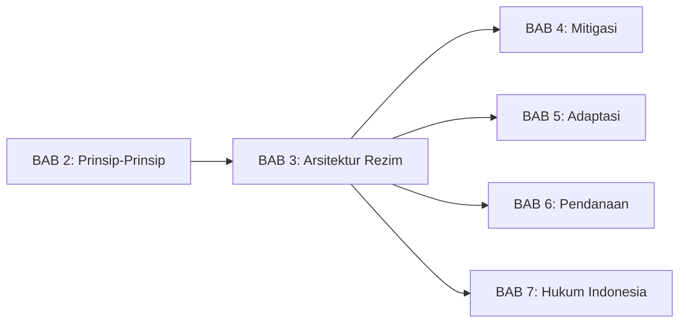
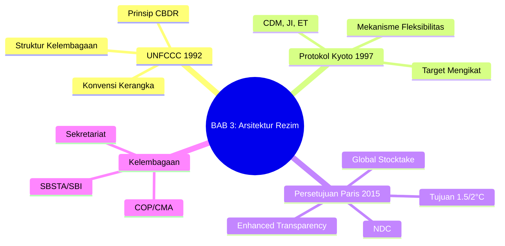
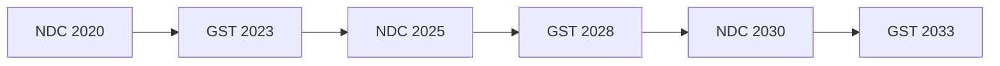
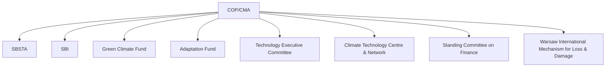
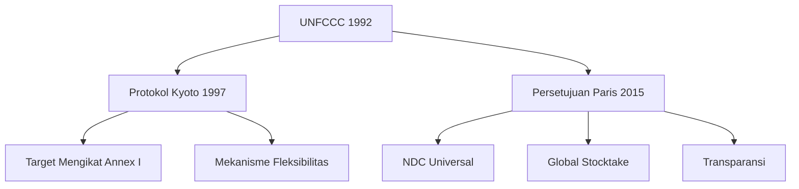

# BAB 3: Arsitektur Rezim Iklim Internasional

---

## A. PENDAHULUAN

### 1. Capaian Pembelajaran (Sub-CPMK)

Setelah mempelajari bab ini, mahasiswa mampu:

1. **Menjelaskan** evolusi rezim iklim internasional dari UNFCCC hingga Persetujuan Paris
2. **Menganalisis** struktur kelembagaan dan mekanisme pengambilan keputusan dalam rezim iklim
3. **Membandingkan** pendekatan *top-down* (Kyoto) dengan *bottom-up* (Paris)
4. **Mengevaluasi** kekuatan dan kelemahan arsitektur iklim saat ini

### 2. Indikator Pencapaian

- [ ] Mahasiswa dapat menjelaskan tiga pilar utama rezim iklim: UNFCCC, Protokol Kyoto, dan Persetujuan Paris
- [ ] Mahasiswa dapat mengidentifikasi fungsi COP, SBSTA, SBI, dan badan-badan lain dalam rezim
- [ ] Mahasiswa dapat menguraikan mekanisme NDC dan Global Stocktake
- [ ] Mahasiswa dapat menganalisis posisi Indonesia dalam negosiasi iklim internasional

### 3. Deskripsi Singkat

Bagaimana hampir 200 negara dengan kepentingan berbeda bisa bekerja sama mengatasi perubahan iklim? Jawabannya terletak pada arsitektur rezim iklim internasional yang telah dibangun selama lebih dari tiga dekade. Bab ini akan membawa Anda memahami bangunan hukum internasional iklim—dari konvensi kerangka hingga protokol dan persetujuan, dari COP tahunan hingga mekanisme NDC. Pemahaman arsitektur ini sangat penting untuk memahami hak dan kewajiban Indonesia sebagai Pihak dalam rezim iklim.

### 4. Hubungan dengan Bab Lain

Bab ini merupakan kelanjutan dari [[BAB 2 -- Prinsip-Prinsip Hukum Lingkungan Internasional --|BAB 2 tentang Prinsip-Prinsip]] dan menjadi fondasi untuk memahami kewajiban spesifik dalam [[BAB 4 -- Kewajiban Mitigasi dalam Hukum Internasional --|BAB 4 (Mitigasi)]], [[BAB 5 -- Hukum Adaptasi Perubahan Iklim --|BAB 5 (Adaptasi)]], dan [[BAB 6 -- Pendanaan dan Mekanisme Iklim --|BAB 6 (Pendanaan)]].

### 5. Peta Konsep Bab

---

## B. PENYAJIAN MATERI

### 1. UNFCCC 1992: Konvensi Kerangka

Perjalanan hukum iklim internasional dimulai secara resmi pada tahun 1992. Pada KTT Bumi di Rio de Janeiro, negara-negara mengadopsi **United Nations Framework Convention on Climate Change (UNFCCC)**—konvensi kerangka yang meletakkan fondasi bagi seluruh rezim iklim.[^1] Konvensi ini merupakan hasil negosiasi intensif yang dimulai sejak Majelis Umum PBB membentuk Intergovernmental Negotiating Committee (INC) pada tahun 1990, merespons temuan-temuan ilmiah dari Intergovernmental Panel on Climate Change (IPCC) tentang ancaman perubahan iklim global.[^2]

#### 1.1 Sifat Konvensi Kerangka

Mengapa disebut "konvensi kerangka" (*framework convention*)? Istilah ini merujuk pada teknik pembuatan perjanjian internasional yang sengaja dirancang bersifat umum dan fleksibel, yang kemudian dapat dikembangkan melalui protokol-protokol atau instrumen hukum tambahan.[^3] Bodansky menjelaskan bahwa pendekatan konvensi kerangka memungkinkan negara-negara untuk membangun konsensus awal tanpa harus langsung menyepakati kewajiban-kewajiban spesifik yang kontroversial.[^4] UNFCCC tidak menetapkan kewajiban emisi spesifik, melainkan menyediakan fondasi normatif dan kelembagaan yang terdiri dari beberapa elemen kunci.

Pertama, Pasal 2 UNFCCC menetapkan tujuan umum konvensi yaitu stabilisasi konsentrasi gas rumah kaca. Kedua, Pasal 3 mengkodifikasi prinsip-prinsip fundamental termasuk *common but differentiated responsibilities* dan prinsip kehati-hatian. Ketiga, Pasal 4 memuat komitmen umum yang dibedakan berdasarkan kategori negara. Keempat, Pasal 7 hingga 10 membangun struktur kelembagaan termasuk Conference of the Parties (COP) dan badan-badan subsidier. Kelima, konvensi menyediakan mekanisme untuk pengembangan lebih lanjut melalui protokol dan keputusan COP.[^5]

> [!info] **Definisi**
> **UNFCCC** (*United Nations Framework Convention on Climate Change*): Konvensi kerangka yang diadopsi pada 1992 sebagai fondasi rezim iklim internasional, dengan tujuan menstabilkan konsentrasi gas rumah kaca pada tingkat yang mencegah interferensi berbahaya dengan sistem iklim.

#### 1.2 Tujuan Akhir (Pasal 2)

> [!quote] **Kutipan**
> "The ultimate objective of this Convention... is to achieve... stabilization of greenhouse gas concentrations in the atmosphere at a level that would prevent dangerous anthropogenic interference with the climate system."
> — *Pasal 2, UNFCCC 1992*

Pasal 2 UNFCCC menetapkan tujuan akhir (*ultimate objective*) yang bersifat aspirasional namun secara hukum mengikat sebagai panduan bagi seluruh implementasi konvensi.[^6] Frasa "dangerous anthropogenic interference" sengaja tidak didefinisikan secara kuantitatif dalam konvensi, memberikan fleksibilitas bagi perkembangan pemahaman ilmiah di masa depan.[^7] Sands dan Peel mencatat bahwa ketidakjelasan ini mencerminkan kesulitan negosiator pada saat itu untuk mencapai konsensus tentang ambang batas yang dapat diterima secara politik.[^8]

Penentuan tingkat berbahaya (*dangerous level*) ini menjadi perdebatan politik dan ilmiah yang terus berlanjut selama lebih dari dua dekade. IPCC dalam berbagai laporannya berupaya memberikan panduan ilmiah, namun penerjemahan ke dalam target hukum tetap merupakan keputusan politik.[^9] Perdebatan ini akhirnya menemukan resolusi pada Persetujuan Paris 2015 yang menetapkan batas 1,5°C dan 2°C di atas tingkat pra-industri sebagai operasionalisasi dari konsep "dangerous interference" tersebut.

#### 1.3 Prinsip-Prinsip (Pasal 3)

Pasal 3 UNFCCC mengkodifikasi lima prinsip fundamental yang menjadi panduan dalam implementasi konvensi dan pengembangan rezim iklim selanjutnya. Prinsip-prinsip ini bukan sekadar retorika, melainkan memiliki implikasi hukum yang nyata dalam menafsirkan kewajiban-kewajiban substantif para Pihak.[^10]

Prinsip pertama dan paling berpengaruh adalah *Common but Differentiated Responsibilities and Respective Capabilities* (CBDR-RC) yang tercantum dalam Pasal 3.1. Prinsip ini menegaskan bahwa meskipun perubahan iklim adalah masalah bersama, negara-negara maju harus memimpin upaya penanganan mengingat kontribusi historis mereka terhadap akumulasi emisi di atmosfer.[^11] Rajamani mencatat bahwa prinsip CBDR menjadi fondasi bagi diferensiasi yang kemudian diadopsi dalam Protokol Kyoto dan Persetujuan Paris, meskipun dengan interpretasi yang berbeda.[^12]

| Prinsip | Pasal | Substansi |
|---------|-------|-----------|
| CBDR-RC | 3.1 | Negara maju memimpin |
| Kebutuhan khusus negara rentan | 3.2 | Perhatian khusus untuk negara berkembang rentan |
| Kehati-hatian | 3.3 | Ketidakpastian bukan alasan menunda |
| Pembangunan berkelanjutan | 3.4 | Hak untuk pembangunan |
| Sistem ekonomi terbuka | 3.5 | Tindakan iklim tidak boleh menjadi hambatan perdagangan |

**Tabel 3.1.** Prinsip-prinsip dalam UNFCCC Pasal 3

#### 1.4 Komitmen (Pasal 4)

Pasal 4 UNFCCC merupakan jantung dari struktur kewajiban konvensi, yang secara inovatif membedakan komitmen berdasarkan kategori negara sebagai implementasi konkret prinsip CBDR.[^13] Bodansky, Brunnee, dan Rajamani menjelaskan bahwa struktur ini menciptakan sistem kewajiban berlapis (*tiered obligations*) yang menjadi ciri khas rezim iklim internasional.

Pertama, Pasal 4.1 menetapkan kewajiban yang berlaku bagi semua Pihak tanpa pengecualian. Setiap negara wajib menyusun dan mempublikasikan inventarisasi emisi nasional menggunakan metodologi yang disepakati, mengembangkan program-program nasional untuk mitigasi dan adaptasi perubahan iklim, melakukan kerjasama dalam pengembangan dan transfer teknologi, serta menyelenggarakan pendidikan dan peningkatan kesadaran publik tentang isu iklim.

Kedua, Pasal 4.2 membebankan kewajiban tambahan kepada negara-negara maju yang terdaftar dalam Annex I Konvensi. Negara-negara ini harus mengadopsi kebijakan dan langkah-langkah nasional untuk membatasi emisi gas rumah kaca antropogenik, melaporkan kemajuan secara berkala, dan berupaya mengembalikan tingkat emisi ke level tahun 1990 pada tahun 2000. Target tahun 1990 ini, meskipun bersifat tidak mengikat, menjadi preseden penting bagi penetapan tahun dasar (*baseline year*) dalam negosiasi iklim selanjutnya.[^14]

Ketiga, Pasal 4.3 hingga 4.5 membebankan kewajiban pendanaan dan transfer teknologi kepada subset negara maju dalam Annex II. Negara-negara ini berkewajiban menyediakan sumber daya keuangan baru dan tambahan (*new and additional*) untuk membantu negara berkembang memenuhi kewajibannya, serta memfasilitasi akses terhadap teknologi ramah lingkungan.[^15]

> [!tip] **Kotak Pengayaan: Annex I, Annex II, dan Non-Annex I**
> UNFCCC membagi negara ke dalam kategori:
> - **Annex I:** Negara maju dan ekonomi transisi (40 negara + EU)
> - **Annex II:** Subset Annex I yang wajib menyediakan pendanaan (24 negara + EU)
> - **Non-Annex I:** Negara berkembang, termasuk Indonesia
>
> Pembagian ini mencerminkan prinsip CBDR, namun menjadi sumber perdebatan karena beberapa negara "berkembang" (seperti China, Korea Selatan, Singapura) kini memiliki ekonomi besar.

---

### 2. Protokol Kyoto 1997: Eksperimen *Top-Down*

Lima tahun setelah UNFCCC diadopsi, komunitas internasional menyadari bahwa komitmen "lunak" dalam konvensi kerangka tidak memadai untuk mencapai stabilisasi emisi yang diharapkan. Berlin Mandate yang dihasilkan COP1 pada tahun 1995 secara tegas menyatakan bahwa komitmen Pasal 4.2 UNFCCC "tidak memadai" dan memandatkan negosiasi protokol dengan target yang lebih tegas.[^16] Pada COP3 di Kyoto, Jepang, tanggal 11 Desember 1997, negara-negara mengadopsi **Protokol Kyoto**—instrumen hukum pertama dalam rezim iklim yang menetapkan target emisi mengikat secara kuantitatif.

#### 2.1 Target Mengikat untuk Negara Maju

> [!info] **Definisi**
> **Protokol Kyoto** (*Kyoto Protocol*): Protokol di bawah UNFCCC yang diadopsi pada 1997 dan berlaku sejak 2005, menetapkan target pengurangan emisi yang mengikat secara hukum bagi negara-negara maju (Annex I).

Protokol Kyoto memperkenalkan sistem target mengikat (*legally binding targets*) yang dirundingkan secara multilateral, mencerminkan pendekatan *top-down* dalam tata kelola iklim global.[^17] Pasal 3 Protokol menetapkan target kolektif pengurangan emisi sebesar 5,2% di bawah tingkat tahun 1990 untuk periode komitmen pertama (2008-2012). Target ini kemudian dioperasionalkan melalui target individual yang berbeda untuk setiap negara Annex I, tercantum dalam Annex B Protokol: Uni Eropa berkomitmen mengurangi 8%, Amerika Serikat 7%, dan Jepang 6%.[^18]

Setelah periode komitmen pertama berakhir, Amandemen Doha yang diadopsi pada COP18 tahun 2012 menetapkan periode komitmen kedua (2013-2020) dengan target yang lebih ambisius. Namun, Amandemen Doha baru berlaku pada tahun 2020 setelah mencapai ratifikasi yang diperlukan, sehingga efektivitasnya sangat terbatas.[^19]

#### 2.2 Mekanisme Fleksibilitas

Salah satu inovasi terpenting Protokol Kyoto adalah **mekanisme fleksibilitas** (*flexibility mechanisms*) yang tercantum dalam Pasal 6, 12, dan 17. Mekanisme ini dirancang untuk memberikan fleksibilitas kepada negara-negara Annex I dalam memenuhi target emisi mereka dengan cara yang paling efisien dari segi biaya, sekaligus mendorong investasi rendah karbon di negara berkembang.[^20] Freestone dan Streck mencatat bahwa mekanisme ini merupakan kompromi politik antara negara-negara yang menginginkan target domestik murni dengan mereka yang mengutamakan efisiensi ekonomi.[^21]

| Mekanisme | Deskripsi | Contoh |
|-----------|-----------|--------|
| **Emissions Trading (ET)** | Perdagangan kuota emisi antar negara Annex I | Jepang membeli kuota dari Rusia |
| **Clean Development Mechanism (CDM)** | Negara maju membiayai proyek di negara berkembang dan memperoleh kredit | Proyek pembangkit geotermal di Indonesia |
| **Joint Implementation (JI)** | Proyek bersama antar negara Annex I | Proyek energi terbarukan di Eropa Timur |

**Tabel 3.2.** Tiga mekanisme fleksibilitas Protokol Kyoto

*Emissions Trading* (Pasal 17) memungkinkan negara Annex I yang emisinya di bawah target untuk menjual kelebihan kuota kepada negara lain yang kesulitan memenuhi target. *Clean Development Mechanism* (Pasal 12) merupakan mekanisme yang paling relevan bagi negara berkembang seperti Indonesia, karena memungkinkan proyek-proyek pengurangan emisi di negara Non-Annex I menghasilkan *Certified Emission Reductions* (CERs) yang dapat dibeli oleh negara maju. *Joint Implementation* (Pasal 6) memfasilitasi proyek bersama antar negara Annex I, terutama antara negara Eropa Barat dengan negara ekonomi transisi.[^22]

> [!example] **Contoh: CDM di Indonesia**
> Indonesia adalah salah satu negara host CDM terbesar di Asia Tenggara. Contoh proyek CDM Indonesia:
> - Proyek pembangkit listrik geotermal Kamojang
> - Proyek penangkapan metana dari TPA Bantar Gebang
> - Proyek pembangkit listrik tenaga air mini
>
> Proyek-proyek ini menghasilkan Certified Emission Reductions (CERs) yang dapat dijual ke negara maju untuk membantu mereka memenuhi target Kyoto.

#### 2.3 Kelebihan dan Kelemahan Kyoto

Evaluasi terhadap Protokol Kyoto menghasilkan pandangan yang beragam di kalangan akademisi dan praktisi hukum iklim internasional. Di satu sisi, Protokol berhasil meletakkan fondasi penting bagi tata kelola iklim global. Target yang mengikat secara hukum (*legally binding*) menciptakan preseden bahwa kewajiban iklim dapat dikuantifikasi dan ditegakkan. Mekanisme fleksibilitas, khususnya CDM, merintis pengembangan pasar karbon yang kemudian menginspirasi berbagai skema perdagangan emisi regional dan nasional seperti EU Emissions Trading System.[^23] Kerangka pelaporan dan verifikasi yang dikembangkan dalam Protokol juga menjadi model bagi sistem transparansi yang lebih komprehensif dalam Persetujuan Paris.

Di sisi lain, Protokol Kyoto menghadapi keterbatasan struktural yang serius. Keputusan Amerika Serikat untuk tidak meratifikasi Protokol pada tahun 2001 merupakan pukulan signifikan mengingat AS adalah emitter terbesar saat itu.[^24] Lebih fundamental lagi, pembebasan negara berkembang besar seperti China, India, dan Brasil dari kewajiban pengurangan emisi berarti Protokol hanya mencakup sekitar 15% emisi global. Falkner menilai bahwa diferensiasi "kaku" antara negara Annex I dan Non-Annex I menjadi kelemahan fatal yang tidak dapat diatasi dalam kerangka Kyoto.[^25]

> [!warning] **Perhatian**
> Protokol Kyoto sering dianggap "gagal" karena emisi global terus meningkat selama periode komitmennya. Namun, protokol ini berhasil membangun infrastruktur kelembagaan dan pengalaman yang menjadi dasar bagi Persetujuan Paris.

---

### 3. Persetujuan Paris 2015: Paradigma Baru

Kegagalan COP15 di Kopenhagen pada tahun 2009 untuk menghasilkan perjanjian yang mengikat secara hukum menjadi titik balik penting dalam sejarah diplomasi iklim. Copenhagen Accord yang dihasilkan, meskipun mencantumkan target 2°C untuk pertama kalinya, hanya bersifat politis dan tidak diadopsi secara formal oleh COP.[^26] Pengalaman Kopenhagen mendorong komunitas internasional untuk merancang ulang arsitektur negosiasi iklim, bergerak dari pendekatan *top-down* yang telah gagal menuju model hibrida yang lebih fleksibel. Proses ini memuncak pada COP21 di Paris, 12 Desember 2015, ketika 196 Pihak mengadopsi **Persetujuan Paris**—sebuah tonggak bersejarah dalam tata kelola iklim global yang berhasil menyatukan hampir seluruh negara di dunia dalam satu kerangka hukum iklim.[^27]

#### 3.1 Tujuan Jangka Panjang (Pasal 2)

> [!quote] **Kutipan**
> "Holding the increase in the global average temperature to **well below 2°C** above pre-industrial levels and pursuing efforts to limit the temperature increase to **1.5°C** above pre-industrial levels..."
> — *Pasal 2.1(a), Persetujuan Paris 2015*

Pasal 2 Persetujuan Paris merupakan ketentuan yang paling signifikan karena untuk pertama kalinya menerjemahkan tujuan abstrak "mencegah interferensi berbahaya" dalam UNFCCC menjadi batas suhu yang konkret dan terukur. Penyertaan target 1,5°C, yang diperjuangkan keras oleh negara-negara kepulauan kecil dan kelompok negara rentan, merupakan kemenangan diplomatik yang mencerminkan realitas ilmiah bahwa dampak perubahan iklim pada kenaikan 2°C akan jauh lebih parah dari yang dipahami sebelumnya.[^28]

Persetujuan Paris menetapkan tiga tujuan utama yang saling terkait dan tidak dapat dipisahkan. Tujuan pertama adalah tujuan mitigasi berupa pembatasan kenaikan suhu global. Tujuan kedua adalah tujuan adaptasi berupa peningkatan kapasitas adaptif, penguatan ketahanan, dan pengurangan kerentanan terhadap dampak perubahan iklim. Tujuan ketiga adalah tujuan keuangan berupa pengarahan aliran keuangan ke arah pembangunan rendah emisi dan berketahanan iklim.[^29] Ketiga tujuan ini mencerminkan pemahaman bahwa penanganan perubahan iklim memerlukan pendekatan komprehensif yang mengintegrasikan mitigasi, adaptasi, dan dukungan finansial.

> [!info] **Definisi**
> **Persetujuan Paris** (*Paris Agreement*): Perjanjian iklim yang diadopsi pada 2015 dan berlaku sejak 2016, menyatukan hampir seluruh negara dalam komitmen iklim melalui sistem NDC dan mekanisme peninjauan berkala.

#### 3.2 Nationally Determined Contributions (NDC)

Berbeda dengan Protokol Kyoto yang menetapkan target secara *top-down* melalui negosiasi multilateral, Persetujuan Paris mengadopsi pendekatan *bottom-up* yang revolusioner melalui sistem Nationally Determined Contributions (NDC). Pendekatan ini lahir dari kesadaran bahwa target yang dinegosiasikan secara terpusat tidak dapat memperoleh partisipasi universal yang diperlukan untuk mengatasi perubahan iklim secara efektif.[^30]

> [!info] **Definisi**
> **NDC** (*Nationally Determined Contribution*): Kontribusi nasional yang ditentukan sendiri oleh setiap negara, memuat target dan langkah-langkah untuk mitigasi, serta informasi tentang adaptasi dan pendanaan.

Pasal 4 Persetujuan Paris mengatur sistem NDC dengan karakteristik yang mencerminkan keseimbangan antara kedaulatan nasional dan tanggung jawab global. Pertama, sifat *self-determined* berarti setiap negara bebas menentukan bentuk, cakupan, dan tingkat ambisi kontribusinya sesuai dengan keadaan nasional. Kedua, prinsip *progression* atau *ratchet mechanism* mewajibkan setiap NDC berikutnya untuk lebih ambisius dari sebelumnya, sehingga mencegah kemunduran dan mendorong peningkatan ambisi secara bertahap.[^31] Ketiga, kewajiban *highest possible ambition* mengharuskan NDC mencerminkan tingkat ambisi tertinggi yang mungkin dicapai negara tersebut, dengan mempertimbangkan prinsip CBDR-RC. Keempat, siklus 5 tahunan menciptakan momentum politik berkala untuk meninjau dan meningkatkan komitmen.

| Aspek | Deskripsi |
|-------|-----------|
| **Self-determined** | Negara menentukan sendiri kontribusinya |
| **Progression** | NDC berikutnya harus lebih ambisius |
| **Highest possible ambition** | Sesuai kapasitas nasional |
| **Siklus 5 tahunan** | Diperbarui setiap 5 tahun |
| **Tidak mengikat secara hukum** | Target NDC sendiri bersifat sukarela |

**Tabel 3.3.** Karakteristik sistem NDC

Penting untuk dipahami bahwa meskipun kewajiban prosedural dalam Persetujuan Paris (seperti menyampaikan, mempertahankan, dan mengkomunikasikan NDC) bersifat mengikat secara hukum, substansi target NDC itu sendiri tidak mengikat.[^32] Struktur hukum hibrida ini merupakan hasil kompromi diplomatik yang memungkinkan partisipasi universal sambil tetap memberikan tekanan untuk ambisi yang lebih tinggi melalui transparansi dan akuntabilitas.

> [!example] **Contoh: NDC Indonesia**
> Indonesia menyampaikan Enhanced NDC pada 2022 dengan target:
> - **Unconditional:** Pengurangan 31,89% dari BAU pada 2030
> - **Conditional:** Pengurangan 43,20% dengan dukungan internasional
>
> Target ini mencakup sektor-sektor: energi, limbah, IPPU, pertanian, dan kehutanan (FOLU).
>
> Lihat: [[03-Peraturan/Indonesia/NDC_Indonesia]]

#### 3.3 Global Stocktake (GST)

Salah satu inovasi kelembagaan terpenting dalam Persetujuan Paris adalah mekanisme **Global Stocktake** (GST) yang diatur dalam Pasal 14. GST dirancang untuk mengatasi kelemahan inheren pendekatan *bottom-up*, yaitu risiko bahwa agregasi NDC yang ditentukan secara nasional tidak akan cukup untuk mencapai tujuan suhu global.[^33]

> [!info] **Definisi**
> **Global Stocktake** (*GST*): Proses evaluasi kolektif setiap 5 tahun untuk menilai kemajuan dunia dalam mencapai tujuan Persetujuan Paris, meliputi mitigasi, adaptasi, dan pendanaan.

GST beroperasi sebagai mekanisme *ambition ratchet* yang menghubungkan siklus NDC dengan evaluasi kemajuan global. Proses ini menilai kemajuan kolektif dalam tiga area tematik: mitigasi, adaptasi, dan means of implementation (pendanaan, transfer teknologi, dan capacity building). Hasil GST kemudian menjadi masukan (*input*) bagi negara-negara dalam mempersiapkan NDC berikutnya yang lebih ambisius.[^34]

GST pertama dilaksanakan pada tahun 2023 dan diselesaikan di COP28 Dubai. Hasil GST pertama ini menegaskan kesenjangan yang signifikan antara trayektori emisi saat ini dengan jalur yang diperlukan untuk membatasi pemanasan pada 1,5°C. Keputusan GST menyerukan transisi yang adil dan teratur dari bahan bakar fosil dalam sistem energi, pengurangan emisi global sebesar 43% pada 2030 dibandingkan tingkat 2019, dan pencapaian net-zero emisi CO2 pada pertengahan abad.[^35]

#### 3.4 Kerangka Transparansi yang Ditingkatkan (Pasal 13)

Mengingat sifat *self-determined* dari NDC, Persetujuan Paris mengkompensasi potensi kelemahan ini dengan membangun kerangka transparansi yang jauh lebih kuat dibandingkan rezim sebelumnya. Pasal 13 menetapkan *Enhanced Transparency Framework* (ETF) yang bertujuan membangun kepercayaan mutual dan mempromosikan implementasi efektif melalui akuntabilitas.[^36]

ETF mewajibkan semua Pihak untuk menyampaikan laporan *biennial transparency report* yang memuat inventarisasi emisi gas rumah kaca menggunakan metodologi IPCC, informasi untuk melacak kemajuan implementasi NDC, dan informasi tentang dampak perubahan iklim serta adaptasi. Laporan ini kemudian menjalani proses *technical expert review* yang bersifat non-intrusive dan non-punitive, diikuti oleh *facilitative multilateral consideration of progress* yang memberikan kesempatan bagi negara lain untuk mengajukan pertanyaan.[^37]

Aspek penting dari ETF adalah fleksibilitas yang diberikan kepada negara berkembang dengan kapasitas terbatas. Persetujuan Paris mengakui bahwa tidak semua negara memiliki kapasitas teknis dan kelembagaan yang sama, sehingga menyediakan fleksibilitas dalam cakupan, frekuensi, dan tingkat detail pelaporan bagi negara-negara yang membutuhkan.[^38]

> [!tip] **Kotak Pengayaan: Dari Kyoto ke Paris—Pergeseran Paradigma**
> | Aspek | Protokol Kyoto | Persetujuan Paris |
> |-------|----------------|-------------------|
> | Pendekatan | Top-down | Bottom-up + ratchet |
> | Partisipasi | Negara maju saja | Universal |
> | Target | Ditentukan negosiasi | Self-determined (NDC) |
> | Diferensiasi | Kategori kaku | Spektrum fleksibel |
> | Penegakan | Sanksi | Transparansi + tekanan |
> | Cakupan emisi | ~15% | ~97% |

---

### 4. Struktur Kelembagaan Rezim Iklim

Rezim iklim internasional didukung oleh struktur kelembagaan yang kompleks dan berkembang secara organik sejak UNFCCC berlaku pada tahun 1994. Memahami struktur ini sangat penting untuk memahami bagaimana keputusan diambil, norma-norma hukum berkembang, dan bagaimana Indonesia dapat berpartisipasi secara efektif dalam proses tersebut.[^39]

#### 4.1 Conference of the Parties (COP)

> [!info] **Definisi**
> **COP** (*Conference of the Parties*): Badan pengambil keputusan tertinggi dalam UNFCCC, bertemu setiap tahun untuk meninjau implementasi dan mengadopsi keputusan baru.

Conference of the Parties (COP) merupakan organ tertinggi dalam struktur UNFCCC sebagaimana ditetapkan dalam Pasal 7 Konvensi. COP bertemu setiap tahun dalam sesi reguler, meskipun sesi luar biasa dapat diselenggarakan jika diperlukan. Sebagai badan supremasi, COP memiliki mandat luas untuk meninjau implementasi Konvensi dan instrumen hukum terkait, mengadopsi keputusan yang diperlukan untuk mempromosikan implementasi efektif, menerima dan meninjau laporan nasional dari negara Pihak, serta memobilisasi sumber daya keuangan untuk membantu negara berkembang.[^40]

Keputusan COP umumnya diambil melalui konsensus, meskipun aturan prosedur memungkinkan pemungutan suara sebagai pilihan terakhir. Dalam praktiknya, konsensus hampir selalu diupayakan, yang mencerminkan pentingnya legitimasi politik dalam tata kelola iklim multilateral.[^41] Untuk Persetujuan Paris, fungsi COP dilaksanakan oleh **CMA** (*Conference of the Parties serving as the meeting of the Parties to the Paris Agreement*), yang merupakan badan paralel khusus untuk mengawasi implementasi Persetujuan Paris.

#### 4.2 Badan-Badan Subsidier

UNFCCC mendirikan dua badan subsidier permanen yang berfungsi memberikan dukungan teknis dan substansif kepada COP. Kedua badan ini bertemu secara paralel dengan COP dan juga mengadakan sesi intersessional di Bonn, Jerman.

| Badan | Fungsi |
|-------|--------|
| **SBSTA** (*Subsidiary Body for Scientific and Technological Advice*) | Nasihat ilmiah dan teknis, metodologi, transfer teknologi |
| **SBI** (*Subsidiary Body for Implementation*) | Implementasi, pelaporan, pendanaan, capacity building |

**Tabel 3.4.** Dua badan subsidier utama UNFCCC

*Subsidiary Body for Scientific and Technological Advice* (SBSTA) berfungsi sebagai penghubung antara komunitas ilmiah, khususnya IPCC, dengan proses pengambilan keputusan politik di COP. SBSTA menangani isu-isu metodologis seperti pedoman inventarisasi emisi, aspek teknis transfer teknologi, dan pengembangan panduan ilmiah untuk implementasi konvensi.[^42] *Subsidiary Body for Implementation* (SBI) berfokus pada aspek-aspek praktis implementasi, termasuk peninjauan laporan nasional, isu pendanaan dan capacity building, serta prosedur administratif dan kelembagaan.

#### 4.3 Sekretariat UNFCCC

Sekretariat UNFCCC yang berbasis di Bonn, Jerman, berfungsi sebagai tulang punggung administratif seluruh rezim iklim. Dipimpin oleh seorang Executive Secretary yang ditunjuk oleh Sekretaris Jenderal PBB dengan persetujuan COP, Sekretariat menjalankan berbagai fungsi esensial. Sekretariat mengorganisasi sesi-sesi COP, CMA, dan badan-badan subsidier yang melibatkan ribuan delegasi dari hampir 200 negara. Sekretariat juga menyiapkan dokumen-dokumen resmi, laporan sintesis, dan materi teknis yang menjadi dasar negosiasi. Dalam konteks Persetujuan Paris, Sekretariat mengelola registri NDC publik dan portal transparansi, serta memberikan dukungan teknis kepada negara berkembang dalam memenuhi kewajiban pelaporan mereka.[^43]

#### 4.4 Badan-Badan Lain

Seiring berkembangnya rezim iklim, berbagai badan spesialis telah didirikan untuk menangani aspek-aspek tertentu dari implementasi. Badan-badan ini beroperasi di bawah panduan COP/CMA dan memainkan peran penting dalam operasionalisasi komitmen-komitmen iklim.[^44]

**Gambar 3.1.** Struktur kelembagaan rezim iklim internasional

Di bidang pendanaan, *Green Climate Fund* (GCF) yang berbasis di Incheon, Korea Selatan, merupakan mekanisme pendanaan utama di bawah UNFCCC dengan target mobilisasi USD 100 miliar per tahun. *Adaptation Fund* yang awalnya didirikan di bawah Protokol Kyoto kini juga melayani Persetujuan Paris, fokus pada proyek-proyek adaptasi di negara berkembang rentan. *Standing Committee on Finance* (SCF) memberikan panduan kepada COP tentang isu-isu keuangan iklim. Di bidang teknologi, *Technology Executive Committee* (TEC) memberikan analisis kebijakan, sementara *Climate Technology Centre and Network* (CTCN) menyediakan bantuan teknis langsung kepada negara berkembang. *Warsaw International Mechanism for Loss and Damage* (WIM) menangani isu loss and damage yang semakin penting dalam negosiasi iklim, termasuk pengoperasian dana loss and damage yang baru didirikan di COP28.[^45]

---

### 5. Indonesia dalam Rezim Iklim Internasional

Indonesia menempati posisi yang unik dan strategis dalam arsitektur iklim internasional. Sebagai negara kepulauan terbesar di dunia dengan lebih dari 17.000 pulau, Indonesia sangat rentan terhadap dampak perubahan iklim seperti kenaikan permukaan air laut, perubahan pola curah hujan, dan peningkatan frekuensi bencana hidrometeorologi. Namun pada saat yang sama, Indonesia juga merupakan salah satu penghasil emisi gas rumah kaca terbesar di dunia, terutama dari sektor kehutanan dan penggunaan lahan, serta sektor energi yang masih bergantung pada bahan bakar fosil.[^46]

#### 5.1 Status Indonesia

Indonesia telah secara konsisten menunjukkan komitmennya terhadap rezim iklim internasional melalui ratifikasi seluruh instrumen hukum utama. Indonesia meratifikasi UNFCCC melalui Undang-Undang Nomor 6 Tahun 1994, menjadikannya salah satu negara yang relatif awal mengaksesi konvensi kerangka ini. Satu dekade kemudian, Indonesia meratifikasi Protokol Kyoto melalui Undang-Undang Nomor 17 Tahun 2004, yang membuka jalan bagi partisipasi Indonesia dalam mekanisme CDM. Terakhir, Indonesia meratifikasi Persetujuan Paris melalui Undang-Undang Nomor 16 Tahun 2016, hanya beberapa bulan setelah penandatanganan perjanjian tersebut.[^47]

Sebagai negara Non-Annex I dalam klasifikasi UNFCCC, Indonesia tidak memiliki kewajiban pengurangan emisi yang mengikat di bawah Protokol Kyoto. Namun di bawah Persetujuan Paris, Indonesia—seperti seluruh negara Pihak—wajib menyampaikan NDC dan melaporkan kemajuan implementasinya secara berkala.

#### 5.2 Posisi Negosiasi Indonesia

Dalam negosiasi iklim multilateral, posisi Indonesia dibentuk oleh identitasnya sebagai negara berkembang, negara kepulauan, dan negara dengan hutan tropis yang luas. Indonesia tergabung dalam beberapa koalisi negosiasi yang mencerminkan berbagai aspek kepentingan nasionalnya.[^48]

| Kelompok | Deskripsi | Fokus |
|----------|-----------|-------|
| **G77 + China** | Kelompok negara berkembang | CBDR, pendanaan, transfer teknologi |
| **Like-Minded Developing Countries (LMDC)** | Negara berkembang dengan posisi serupa | Diferensiasi, hak pembangunan |
| **Rainforest Coalition** | Negara dengan hutan hujan tropis | REDD+, pendanaan kehutanan |

**Tabel 3.5.** Keanggotaan Indonesia dalam kelompok negosiasi

Sebagai anggota G77 + China, Indonesia secara konsisten memperjuangkan prinsip CBDR dan tanggung jawab negara maju untuk menyediakan pendanaan serta transfer teknologi. Dalam Like-Minded Developing Countries (LMDC), Indonesia bersama dengan negara-negara seperti China, India, dan Arab Saudi menekankan pentingnya menjaga diferensiasi antara negara maju dan berkembang. Melalui Coalition for Rainforest Nations, Indonesia aktif dalam negosiasi REDD+ (*Reducing Emissions from Deforestation and Forest Degradation*) yang sangat relevan mengingat luas hutan tropis Indonesia.[^49]

#### 5.3 Kontribusi Indonesia

Indonesia telah menunjukkan komitmen iklimnya melalui berbagai kontribusi substantif dalam rezim iklim internasional. Enhanced NDC Indonesia yang disampaikan pada tahun 2022 menetapkan target pengurangan emisi 31,89% secara unconditional dan 43,20% secara conditional terhadap skenario *business as usual* pada tahun 2030. Target ini mencakup seluruh sektor perekonomian utama termasuk energi, limbah, proses industri dan penggunaan produk (IPPU), pertanian, dan kehutanan.[^50]

Lebih ambisius lagi, Indonesia berkomitmen untuk mencapai FOLU Net Sink pada tahun 2030, yang berarti sektor kehutanan dan penggunaan lahan akan menjadi penyerap karbon bersih. Indonesia juga tengah mengembangkan pasar karbon domestik melalui Peraturan Presiden Nomor 98 Tahun 2021 tentang Penyelenggaraan Nilai Ekonomi Karbon, yang diharapkan dapat menjadi instrumen penting dalam mencapai target NDC. Dalam diplomasi iklim, Indonesia memainkan peran aktif di forum ASEAN dan G20, termasuk mempromosikan Energy Transition Mechanism selama kepresidenan G20 Indonesia tahun 2022.

> [!example] **Contoh: Indonesia di COP**
> Indonesia secara aktif berpartisipasi dalam negosiasi COP. Beberapa momen penting:
> - **COP13 Bali (2007):** Indonesia menjadi tuan rumah, menghasilkan *Bali Action Plan*
> - **COP21 Paris (2015):** Indonesia berkontribusi aktif dalam negosiasi Persetujuan Paris
> - **COP26 Glasgow (2021):** Indonesia menandatangani *Glasgow Leaders' Declaration on Forests*
> - **G20 Bali (2022):** Indonesia mempromosikan *Energy Transition Mechanism*

---

## C. STUDI KASUS

### Kasus: Menafsirkan "Highest Possible Ambition" dalam NDC Indonesia

**Latar Belakang:**

Pasal 4.3 Persetujuan Paris menyatakan bahwa NDC setiap Pihak harus mencerminkan "highest possible ambition" sesuai dengan prinsip CBDR dan "in the light of different national circumstances." Indonesia menyampaikan Enhanced NDC pada 2022 dengan target unconditional 31,89% dan conditional 43,20%.

**Fakta Kunci:**
1. Indonesia adalah emitter ke-8 terbesar di dunia (termasuk LULUCF)
2. Target NDC Indonesia dinilai "insufficient" oleh Climate Action Tracker
3. Indonesia berpendapat targetnya sudah ambisius mengingat status sebagai negara berkembang
4. Beberapa LSM dan akademisi menuntut target yang lebih tinggi
5. Laporan IPCC menyatakan perlu pengurangan 43% pada 2030 untuk jalur 1,5°C

**Isu Hukum:**
- Bagaimana menafsirkan "highest possible ambition" dalam konteks Indonesia?
- Apakah Indonesia dapat digugat jika target NDC-nya dianggap tidak cukup ambisius?
- Bagaimana menyeimbangkan hak pembangunan dengan tanggung jawab iklim?

---

**Pertanyaan Pemantik:**

1. **Analisis:** Identifikasi argumen hukum yang dapat digunakan untuk menilai apakah NDC Indonesia mencerminkan "highest possible ambition"!

2. **Evaluasi:** Bandingkan pendekatan Protokol Kyoto (target ditentukan negosiasi) dengan Persetujuan Paris (self-determined). Mana yang lebih efektif untuk mencapai tujuan iklim? Jelaskan kelebihan dan kekurangan masing-masing!

3. **Sintesis:** Jika Anda adalah negosiator Indonesia di COP, bagaimana Anda akan mempertahankan posisi bahwa NDC Indonesia sudah mencerminkan "highest possible ambition"?

4. **Aplikasi:** Menurut Anda, bagaimana Global Stocktake 2023 dapat mempengaruhi NDC Indonesia berikutnya? Langkah apa yang harus diambil pemerintah?

> [!note] **Petunjuk Diskusi**
> Kasus ini dapat didiskusikan dalam format simulasi negosiasi (45-60 menit). Bagi kelas menjadi delegasi berbagai negara (Indonesia, EU, Small Island States, AS, China) dan simulasikan diskusi tentang ambisi NDC.

---

## D. PENUTUP

### 1. Rangkuman

Pada bab ini, kita telah mempelajari:

- **UNFCCC 1992:** Konvensi kerangka yang meletakkan fondasi rezim iklim dengan prinsip CBDR, tujuan stabilisasi, dan struktur kelembagaan dasar.

- **Protokol Kyoto 1997:** Protokol pertama dengan target emisi mengikat untuk negara maju, memperkenalkan mekanisme fleksibilitas (CDM, JI, ET).

- **Persetujuan Paris 2015:** Paradigma baru dengan pendekatan *bottom-up* melalui NDC, universal participation, dan mekanisme *ratchet* melalui Global Stocktake.

- **Struktur Kelembagaan:** COP sebagai badan tertinggi, didukung SBSTA, SBI, dan berbagai badan pendanaan dan teknologi.

- **Indonesia:** Posisi sebagai negara berkembang dengan emisi signifikan, berpartisipasi aktif dalam berbagai kelompok negosiasi.

---

### 2. Latihan

Kerjakan latihan berikut untuk memperdalam pemahaman Anda:

1. Jelaskan dengan kata-kata Anda sendiri mengapa UNFCCC disebut "konvensi kerangka" dan apa implikasinya!

2. Bandingkan dan kontraskan mekanisme CDM dalam Protokol Kyoto dengan Pasal 6 Persetujuan Paris!

3. Berikan 3 contoh bagaimana Global Stocktake dapat mempengaruhi kebijakan iklim nasional!

4. Analisis kelebihan dan kekurangan sistem NDC dibandingkan target yang dinegosiasikan!

5. Cari informasi tentang hasil COP terbaru dan identifikasi keputusan penting yang relevan dengan Indonesia!

---

### 3. Tes Formatif

Jawablah pertanyaan-pertanyaan berikut untuk mengukur pemahaman Anda:

**Pilihan Ganda:**

1. UNFCCC diadopsi pada konferensi berikut:
   - a. Konferensi Stockholm 1972
   - b. KTT Bumi Rio 1992
   - c. COP3 Kyoto 1997
   - d. COP21 Paris 2015

2. Mekanisme fleksibilitas Protokol Kyoto yang memungkinkan proyek di negara berkembang adalah:
   - a. Emissions Trading
   - b. Joint Implementation
   - c. Clean Development Mechanism
   - d. Removal Units

3. Batas suhu yang menjadi tujuan Persetujuan Paris adalah:
   - a. Di bawah 3°C, upaya ke 2°C
   - b. Di bawah 2°C, upaya ke 1,5°C
   - c. Di bawah 1,5°C, upaya ke 1°C
   - d. Tidak ada batas spesifik

4. Global Stocktake dilakukan setiap:
   - a. 1 tahun
   - b. 3 tahun
   - c. 5 tahun
   - d. 10 tahun

5. Indonesia meratifikasi Persetujuan Paris melalui:
   - a. UU No. 6 Tahun 1994
   - b. UU No. 17 Tahun 2004
   - c. UU No. 16 Tahun 2016
   - d. UU No. 32 Tahun 2009

**Benar atau Salah:**

6. Protokol Kyoto menetapkan target mengikat untuk semua negara. (B/S)

7. NDC bersifat self-determined sehingga negara bebas menentukan targetnya sendiri. (B/S)

8. Indonesia termasuk kategori negara Annex I dalam UNFCCC. (B/S)

9. COP adalah singkatan dari Conference of the Parties. (B/S)

10. Persetujuan Paris menggunakan pendekatan top-down seperti Protokol Kyoto. (B/S)

---

### 4. Umpan Balik dan Tindak Lanjut

Cocokkan jawaban Anda dengan **Kunci Jawaban** di [[Lampiran-04-Kunci-Jawaban|Lampiran 4]].

**Kunci Jawaban Singkat:** 1-b, 2-c, 3-b, 4-c, 5-c, 6-S, 7-B, 8-S, 9-B, 10-S

**Rumus Penilaian:**

$$Tingkat\ Penguasaan = \frac{Jumlah\ Jawaban\ Benar}{10} \times 100\%$$

**Interpretasi dan Tindak Lanjut:**

| Tingkat Penguasaan | Kategori | Tindak Lanjut |
|--------------------|----------|---------------|
| **90 - 100%** | Baik Sekali | Selamat! Anda dapat melanjutkan ke [[BAB-04\|BAB 4]] |
| **80 - 89%** | Baik | Anda dapat melanjutkan, namun pelajari kembali bagian yang masih ragu |
| **70 - 79%** | Cukup | **Ulangi** materi bab ini, terutama bagian yang belum dikuasai |
| **< 70%** | Kurang | **Wajib mengulangi** seluruh materi bab ini sebelum melanjutkan |

> [!tip] **Saran Belajar**
> Jika tingkat penguasaan Anda belum mencapai 80%, cobalah:
> 1. Baca ulang rangkuman dan peta konsep
> 2. Kunjungi website UNFCCC (unfccc.int) untuk informasi terkini
> 3. Diskusikan materi dengan teman sejawat
> 4. Konsultasikan dengan dosen pada sesi tatap muka

---

### 5. Senarai Istilah Kunci

| Istilah | Bahasa Inggris | Definisi |
|---------|----------------|----------|
| UNFCCC | *United Nations Framework Convention on Climate Change* | Konvensi kerangka iklim PBB 1992 |
| Protokol Kyoto | *Kyoto Protocol* | Protokol dengan target emisi mengikat untuk negara maju |
| Persetujuan Paris | *Paris Agreement* | Perjanjian iklim universal dengan sistem NDC |
| NDC | *Nationally Determined Contribution* | Kontribusi nasional yang ditentukan sendiri |
| COP | *Conference of the Parties* | Badan pengambil keputusan tertinggi |
| Global Stocktake | *Global Stocktake* | Evaluasi kolektif kemajuan global setiap 5 tahun |
| CDM | *Clean Development Mechanism* | Mekanisme proyek emisi di negara berkembang |

---

### 6. Daftar Pustaka Bab

**Sumber Primer:**
- United Nations Framework Convention on Climate Change, 1992. [[01-Traktat/UNFCCC_1992]]
- Kyoto Protocol, 1997. [[01-Traktat/Kyoto_Protocol_1997]]
- Paris Agreement, 2015. [[01-Traktat/Paris_Agreement_2015]]

**Sumber Sekunder:**
- Bodansky, D., Brunnée, J., & Rajamani, L. (2017). *International Climate Change Law*. Oxford: OUP.
- Falkner, R. (2016). "The Paris Agreement and the new logic of international climate politics." *International Affairs*.
- Rajamani, L. (2016). "Ambition and differentiation in the 2015 Paris Agreement." *International & Comparative Law Quarterly*.

**Sumber Pendukung:**
- UNFCCC. (2023). *Technical dialogue of the first global stocktake: Synthesis report*.
- Indonesia Enhanced NDC, 2022. [[03-Peraturan/Indonesia/NDC_Indonesia]]

---

### 7. Tautan Terkait

**Sumber dalam Vault:**
- [[01-Traktat/UNFCCC_1992]] - Teks konvensi kerangka
- [[01-Traktat/Kyoto_Protocol_1997]] - Teks protokol pertama
- [[01-Traktat/Paris_Agreement_2015]] - Teks persetujuan terkini
- [[03-Peraturan/Indonesia/NDC_Indonesia]] - Kontribusi nasional Indonesia

**Navigasi Buku:**
- ← [[BAB 2 -- Prinsip-Prinsip Hukum Lingkungan Internasional --|BAB 2: Prinsip-Prinsip Hukum Lingkungan Internasional]]
- → [[BAB 4 -- Kewajiban Mitigasi dalam Hukum Internasional --|BAB 4: Kewajiban Mitigasi dalam Hukum Internasional]]
- ↑ [[Tinjauan-Mata-Kuliah|Kembali ke Tinjauan Mata Kuliah]]

---

## Catatan Kaki

[^1]: United Nations Framework Convention on Climate Change (adopted 9 May 1992, entered into force 21 March 1994) 1771 UNTS 107 (UNFCCC).

[^2]: Daniel Bodansky, 'The United Nations Framework Convention on Climate Change: A Commentary' (1993) 18 Yale Journal of International Law 451, 453-458.

[^3]: Patricia Birnie, Alan Boyle and Catherine Redgwell, *International Law and the Environment* (3rd edn, OUP 2009) 336-337.

[^4]: Daniel Bodansky, Jutta Brunnee and Lavanya Rajamani, *International Climate Change Law* (OUP 2017) 118-120.

[^5]: UNFCCC (n 1) arts 2-10.

[^6]: Bodansky, Brunnee and Rajamani (n 4) 126-128.

[^7]: Philippe Sands and Jacqueline Peel, *Principles of International Environmental Law* (4th edn, CUP 2018) 298-299.

[^8]: ibid 299.

[^9]: IPCC, *Climate Change 2014: Synthesis Report* (CUP 2014) 17-21.

[^10]: UNFCCC (n 1) art 3.

[^11]: Lavanya Rajamani, 'The Principle of Common but Differentiated Responsibility and the Balance of Commitments under the Climate Regime' (2000) 9 Review of European Community and International Environmental Law 120, 121-125.

[^12]: Lavanya Rajamani, 'Ambition and Differentiation in the 2015 Paris Agreement: Interpretative Possibilities and Underlying Politics' (2016) 65 International and Comparative Law Quarterly 493, 495-500.

[^13]: UNFCCC (n 1) art 4.

[^14]: Bodansky, Brunnee and Rajamani (n 4) 135-138.

[^15]: UNFCCC (n 1) arts 4.3-4.5.

[^16]: Decision 1/CP.1, 'The Berlin Mandate: Review of the Adequacy of Article 4, Paragraph 2(a) and (b), of the Convention' FCCC/CP/1995/7/Add.1 (6 June 1995).

[^17]: Kyoto Protocol to the United Nations Framework Convention on Climate Change (adopted 11 December 1997, entered into force 16 February 2005) 2303 UNTS 162 (Kyoto Protocol) art 3.

[^18]: ibid Annex B.

[^19]: Doha Amendment to the Kyoto Protocol (adopted 8 December 2012, entered into force 31 December 2020) C.N.718.2012.TREATIES-XXVII.7.c.

[^20]: Kyoto Protocol (n 17) arts 6, 12, 17.

[^21]: David Freestone and Charlotte Streck (eds), *Legal Aspects of Carbon Trading: Kyoto, Copenhagen, and Beyond* (OUP 2009) 3-15.

[^22]: Bodansky, Brunnee and Rajamani (n 4) 156-165.

[^23]: A Denny Ellerman, Frank J Convery and Christian de Perthuis, *Pricing Carbon: The European Union Emissions Trading Scheme* (CUP 2010) 25-30.

[^24]: Michael Grubb, Christiaan Vrolijk and Duncan Brack, *The Kyoto Protocol: A Guide and Assessment* (Royal Institute of International Affairs 1999) 141-145.

[^25]: Robert Falkner, 'The Paris Agreement and the New Logic of International Climate Politics' (2016) 92 International Affairs 1107, 1110-1112.

[^26]: Decision 2/CP.15, 'Copenhagen Accord' FCCC/CP/2009/11/Add.1 (30 March 2010).

[^27]: Paris Agreement (adopted 12 December 2015, entered into force 4 November 2016) 55 ILM 740 (Paris Agreement).

[^28]: Falkner (n 25) 1118-1120.

[^29]: Paris Agreement (n 27) art 2.

[^30]: Bodansky, Brunnee and Rajamani (n 4) 209-215.

[^31]: Paris Agreement (n 27) art 4.3.

[^32]: Rajamani, 'Ambition and Differentiation' (n 12) 510-515.

[^33]: Paris Agreement (n 27) art 14.

[^34]: Christina Voigt and Felipe Ferreira, 'Dynamic Differentiation: The Principles of CBDR-RC, Progression and Highest Possible Ambition in the Paris Agreement' (2016) 5 Transnational Environmental Law 285, 295-300.

[^35]: Decision 1/CMA.5, 'Outcome of the First Global Stocktake' FCCC/PA/CMA/2023/16/Add.1 (15 March 2024).

[^36]: Paris Agreement (n 27) art 13.

[^37]: Decision 18/CMA.1, 'Modalities, Procedures and Guidelines for the Transparency Framework for Action and Support Referred to in Article 13 of the Paris Agreement' FCCC/PA/CMA/2018/3/Add.2 (19 March 2019).

[^38]: Paris Agreement (n 27) art 13.2.

[^39]: Bodansky, Brunnee and Rajamani (n 4) 72-85.

[^40]: UNFCCC (n 1) art 7.

[^41]: Joanna Depledge, *The Organization of Global Negotiations: Constructing the Climate Change Regime* (Earthscan 2005) 45-60.

[^42]: UNFCCC (n 1) arts 9-10.

[^43]: ibid art 8.

[^44]: Bodansky, Brunnee and Rajamani (n 4) 85-95.

[^45]: Decision 2/CP.27, 'Funding Arrangements for Responding to Loss and Damage Associated with the Adverse Effects of Climate Change' FCCC/CP/2022/10/Add.1 (17 March 2023); Decision 5/CMA.5, 'Operationalization of the New Funding Arrangements for Responding to Loss and Damage' FCCC/PA/CMA/2023/16/Add.2 (15 March 2024).

[^46]: World Resources Institute, 'Climate Watch: Indonesia Country Profile' (2023) <https://www.climatewatchdata.org/countries/IDN> accessed 15 October 2024.

[^47]: Undang-Undang Nomor 6 Tahun 1994 tentang Pengesahan United Nations Framework Convention on Climate Change (Konvensi Kerangka Kerja Perserikatan Bangsa-Bangsa mengenai Perubahan Iklim); Undang-Undang Nomor 17 Tahun 2004 tentang Pengesahan Kyoto Protocol to the United Nations Framework Convention on Climate Change (Protokol Kyoto atas Konvensi Kerangka Kerja Perserikatan Bangsa-Bangsa tentang Perubahan Iklim); Undang-Undang Nomor 16 Tahun 2016 tentang Pengesahan Paris Agreement to the United Nations Framework Convention on Climate Change (Persetujuan Paris atas Konvensi Kerangka Kerja Perserikatan Bangsa-Bangsa mengenai Perubahan Iklim).

[^48]: Daniel Compagnon and Adil Najam, 'The Politics of Climate Negotiations: An Introduction' in Daniel Compagnon and Adil Najam (eds), *The Political Economy of Climate Change* (Routledge 2019) 1-15.

[^49]: Fitrian Ardiansyah, 'Indonesia's Climate Politics: Navigating Between Forests and Fossil Fuels' in Paul G Harris (ed), *Routledge Handbook of Global Environmental Politics* (2nd edn, Routledge 2022) 380-395.

[^50]: Government of Indonesia, *Enhanced Nationally Determined Contribution* (2022) submitted to UNFCCC NDC Registry.

---

*Buku Ajar Hukum Perubahan Iklim | BAB 3*
