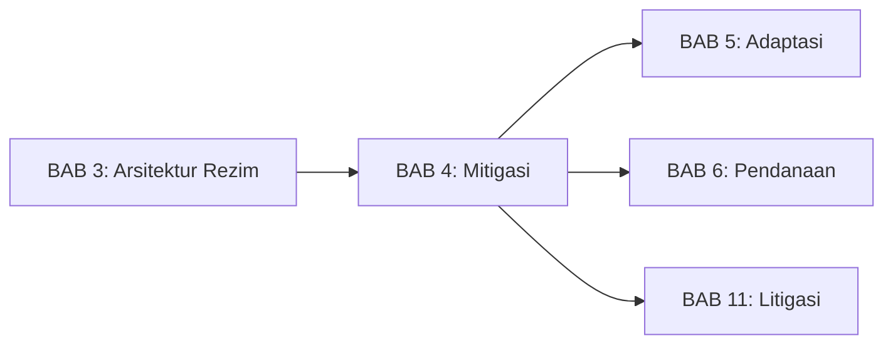
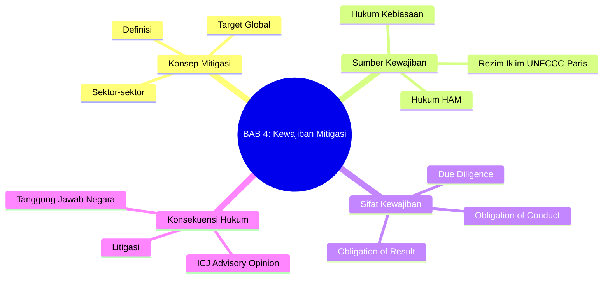
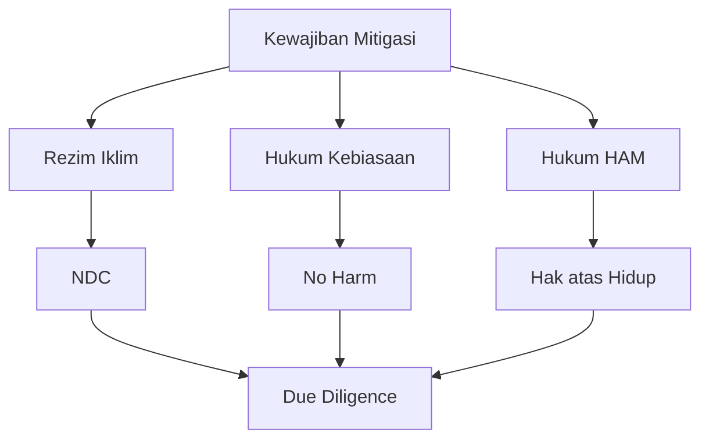

# BAB 4: Kewajiban Mitigasi dalam Hukum Internasional

---

## A. PENDAHULUAN

### 1. Capaian Pembelajaran (Sub-CPMK)

Setelah mempelajari bab ini, mahasiswa mampu:

1. **Menjelaskan** konsep mitigasi dan berbagai sumber kewajiban hukum internasional untuk mitigasi
2. **Menganalisis** sifat hukum kewajiban mitigasi dalam UNFCCC dan Persetujuan Paris
3. **Mengevaluasi** standar *due diligence* dalam konteks kewajiban mitigasi
4. **Mengidentifikasi** implikasi hukum bagi negara yang gagal memenuhi kewajiban mitigasi

### 2. Indikator Pencapaian

- [ ] Mahasiswa dapat membedakan antara kewajiban hasil (*obligation of result*) dan kewajiban upaya (*obligation of conduct*)
- [ ] Mahasiswa dapat menguraikan sumber-sumber kewajiban mitigasi: traktat, kebiasaan, dan HAM
- [ ] Mahasiswa dapat menjelaskan konsep *due diligence* dalam konteks iklim
- [ ] Mahasiswa dapat menganalisis implikasi *ICJ Advisory Opinion* 2025 untuk kewajiban negara

### 3. Deskripsi Singkat

Mitigasi—upaya mengurangi emisi gas rumah kaca—adalah pilar utama respons terhadap perubahan iklim. Namun, apakah negara benar-benar memiliki kewajiban hukum untuk mengurangi emisi? Jika ya, seberapa besar dan dari mana kewajiban itu berasal? Bab ini akan mengajak Anda menelusuri berbagai sumber kewajiban mitigasi dalam hukum internasional, mulai dari traktat iklim hingga hukum kebiasaan dan hak asasi manusia.

### 4. Hubungan dengan Bab Lain

Bab ini merupakan kelanjutan dari [[Buku-Ajar-Hukum-Perubahan-Iklim-03-Arsitektur-Rezim-Iklim_BAB-03|BAB 3 tentang Arsitektur Rezim]] dan menjadi fondasi untuk memahami [[Buku-Ajar-Hukum-Perubahan-Iklim-05-Hukum-Adaptasi_BAB-05|Adaptasi]], [[Buku-Ajar-Hukum-Perubahan-Iklim-06-Pendanaan-Mekanisme-Iklim_BAB-06|Pendanaan]], dan [[Buku-Ajar-Hukum-Perubahan-Iklim-11-Litigasi-Perubahan-Iklim_BAB-11|Litigasi Iklim]].

### 5. Peta Konsep Bab

---

## B. PENYAJIAN MATERI

### 1. Konsep Mitigasi Perubahan Iklim

Sebelum membahas kewajiban hukum, penting untuk memahami apa yang dimaksud dengan mitigasi dalam konteks perubahan iklim. Konsep ini telah berkembang secara signifikan sejak pertama kali diperkenalkan dalam diskursus internasional pada akhir 1980-an.[^1]

#### 1.1 Definisi Mitigasi

> [!info] **Definisi**
> **Mitigasi** (*mitigation*): Intervensi manusia untuk mengurangi sumber atau meningkatkan penyerap (*sink*) gas rumah kaca. Mitigasi mencakup pengurangan emisi dari berbagai sektor dan peningkatan penyerapan karbon oleh hutan dan lahan.

Dalam kerangka hukum internasional, mitigasi dipahami sebagai seperangkat tindakan yang bertujuan untuk membatasi laju dan skala perubahan iklim melalui pengurangan emisi gas rumah kaca antropogenik.[^2] Definisi ini mencakup dua dimensi utama: pertama, pengurangan emisi dari sumber-sumber seperti pembangkit listrik, transportasi, dan industri; kedua, peningkatan kapasitas penyerapan karbon melalui hutan, lahan, dan lautan. Intergovernmental Panel on Climate Change (IPCC) mendefinisikan mitigasi secara lebih teknis sebagai "a human intervention to reduce emissions or enhance the sinks of greenhouse gases."[^3]

Mitigasi berbeda secara fundamental dari **adaptasi** yang berfokus pada penyesuaian terhadap dampak iklim yang sudah atau akan terjadi. Keduanya saling melengkapi dalam arsitektur respons terhadap perubahan iklim—mitigasi mengatasi penyebab dengan mengurangi konsentrasi gas rumah kaca di atmosfer, sementara adaptasi mengatasi akibat dengan meningkatkan ketahanan sistem manusia dan alam terhadap dampak yang tidak dapat dihindari.[^4] Sebagaimana dikemukakan oleh Bodansky, hubungan antara mitigasi dan adaptasi bersifat dinamis: semakin berhasil upaya mitigasi global, semakin sedikit kebutuhan adaptasi, dan sebaliknya.[^5]

#### 1.2 Target Global Mitigasi dan Carbon Budget

Pemahaman ilmiah tentang sistem iklim telah memungkinkan para peneliti untuk menghitung "carbon budget" atau anggaran karbon—jumlah total emisi karbon dioksida yang masih dapat dilepaskan ke atmosfer sambil mempertahankan peluang tertentu untuk membatasi pemanasan pada tingkat tertentu.[^6] Konsep ini memiliki implikasi hukum yang mendalam karena mentransformasikan target temperatur abstrak menjadi batas kuantitatif yang konkret.

Laporan IPCC AR6 menetapkan bahwa untuk memiliki peluang 50% membatasi pemanasan pada 1,5°C, sisa carbon budget global sejak awal 2020 adalah sekitar 500 GtCO₂.[^7] Dengan tingkat emisi saat ini sekitar 40 GtCO₂ per tahun, anggaran ini akan habis dalam waktu sekitar 12-13 tahun. Implikasi dari kalkulasi ini adalah kebutuhan pengurangan emisi yang sangat drastis dalam waktu singkat:

| Skenario | Target 2030 | Target 2035 | Target 2050 |
|----------|-------------|-------------|-------------|
| 1,5°C | -43% dari 2019 | -60% dari 2019 | Net zero CO₂ |
| 2°C | -27% dari 2019 | -40% dari 2019 | Net zero CO₂ (2070) |

**Tabel 4.1.** Target pengurangan emisi global menurut IPCC AR6

Target 1,5°C dan 2°C yang tercantum dalam Persetujuan Paris memiliki dasar ilmiah yang kuat. Penelitian menunjukkan bahwa setiap tambahan 0,5°C pemanasan akan meningkatkan frekuensi dan intensitas gelombang panas, hujan ekstrem, dan kekeringan secara signifikan.[^8] Dengan demikian, target temperatur ini bukan angka arbitrer melainkan ambang batas yang memiliki konsekuensi nyata bagi kelangsungan hidup manusia dan ekosistem.

#### 1.3 Sektor-Sektor Mitigasi

Upaya mitigasi harus mencakup seluruh sektor ekonomi karena emisi gas rumah kaca berasal dari berbagai sumber yang saling terkait. Pendekatan sektoral memungkinkan identifikasi potensi pengurangan emisi yang spesifik dan pengembangan kebijakan yang tepat sasaran.[^9]

Sektor **energi** merupakan kontributor terbesar emisi global, menyumbang sekitar 73% dari total emisi gas rumah kaca.[^10] Transisi dari bahan bakar fosil ke sumber energi terbarukan seperti tenaga surya, angin, dan hidro menjadi kunci utama mitigasi. Kemajuan teknologi telah menurunkan biaya energi terbarukan secara dramatis—biaya listrik tenaga surya turun 89% antara 2010 dan 2020.[^11]

Sektor **transportasi** menyumbang sekitar 16% emisi global dan merupakan salah satu sektor dengan pertumbuhan emisi tercepat.[^12] Elektrifikasi kendaraan, pengembangan transportasi publik massal, dan perencanaan kota yang berorientasi pada pengurangan kebutuhan perjalanan merupakan strategi mitigasi utama di sektor ini.

Sektor **industri**, termasuk produksi baja, semen, dan bahan kimia, menyumbang sekitar 21% emisi global.[^13] Mitigasi di sektor ini melibatkan peningkatan efisiensi energi, elektrifikasi proses industri, penggunaan bahan baku alternatif, dan teknologi carbon capture and storage (CCS).

Sektor **bangunan** bertanggung jawab atas sekitar 18% emisi global ketika emisi langsung dan tidak langsung diperhitungkan.[^14] Standar efisiensi energi untuk bangunan baru, retrofit bangunan eksisting, dan penggunaan bahan konstruksi rendah karbon merupakan langkah mitigasi penting.

Sektor **Agriculture, Forestry and Other Land Use (AFOLU)** memiliki karakteristik unik karena dapat berfungsi baik sebagai sumber maupun penyerap emisi. Penghentian deforestasi, reforestasi, dan praktik pertanian berkelanjutan dapat memberikan kontribusi signifikan terhadap mitigasi.[^15]

Sektor **limbah**, meskipun kontribusinya relatif kecil (sekitar 3% emisi global), menawarkan peluang mitigasi yang cost-effective melalui penangkapan metana dari tempat pembuangan sampah dan pengolahan air limbah.[^16]

> [!example] **Contoh: Mitigasi di Indonesia**
> NDC Indonesia mencakup target mitigasi per sektor:
> - **Energi:** Bauran energi terbarukan 23% pada 2025
> - **FOLU:** Net sink 140 MtCO₂e pada 2030
> - **Limbah:** Pengurangan 10,4% dari baseline
>
> Sektor kehutanan dan lahan (FOLU) menyumbang porsi terbesar dalam target Indonesia karena potensi besar dari penghentian deforestasi.

---

### 2. Kewajiban Mitigasi dalam Rezim Iklim

Sumber pertama dan paling jelas untuk kewajiban mitigasi adalah rezim iklim itu sendiri—UNFCCC, Protokol Kyoto, dan Persetujuan Paris. Ketiga instrumen ini membentuk suatu continuum normatif yang secara progresif mengembangkan dan memperkuat kewajiban negara dalam mengurangi emisi gas rumah kaca.

#### 2.1 UNFCCC: Kewajiban Umum

United Nations Framework Convention on Climate Change (UNFCCC), yang diadopsi pada tahun 1992 dan mulai berlaku pada tahun 1994, merupakan fondasi hukum bagi seluruh arsitektur rezim iklim internasional.[^17] Konvensi ini menetapkan tujuan ultimat untuk "stabilization of greenhouse gas concentrations in the atmosphere at a level that would prevent dangerous anthropogenic interference with the climate system."[^18]

UNFCCC Pasal 4 menetapkan komitmen untuk semua Pihak, meskipun dengan tingkat kewajiban yang berbeda sesuai dengan prinsip common but differentiated responsibilities:

> [!quote] **Kutipan**
> "All Parties... shall: (a) Develop, periodically update, publish and make available... national inventories of anthropogenic emissions by sources and removals by sinks..."
> — *Pasal 4.1(a), UNFCCC 1992*

Untuk negara maju yang tercantum dalam Annex I, Pasal 4.2 menambahkan kewajiban yang lebih spesifik:

> [!quote] **Kutipan**
> "Each of these Parties shall adopt national policies and take corresponding measures on the mitigation of climate change..."
> — *Pasal 4.2(a), UNFCCC 1992*

Namun, sebagaimana dianalisis oleh Rajamani, kewajiban dalam UNFCCC pada dasarnya bersifat **prosedural**—negara wajib menyusun kebijakan dan melaporkan kemajuan—bukan **substantif** dalam arti mencapai target pengurangan emisi tertentu.[^19] Ketiadaan target kuantitatif yang mengikat ini merupakan kelemahan struktural yang kemudian dicoba diatasi melalui Protokol Kyoto.

#### 2.2 Persetujuan Paris: NDC dan Arsitektur Kewajiban

Persetujuan Paris yang diadopsi pada tahun 2015 memperkenalkan pendekatan baru yang berbeda secara fundamental dari model top-down Protokol Kyoto. Sistem Nationally Determined Contributions (NDC) memungkinkan setiap negara untuk menentukan sendiri kontribusi mitigasinya, namun dalam kerangka kewajiban prosedural yang mengikat secara hukum.[^20]

Arsitektur kewajiban dalam Persetujuan Paris dapat dipahami sebagai campuran antara elemen yang mengikat keras (*hard law*) dan yang lebih lunak (*soft law*). Pada sisi yang mengikat keras terdapat kewajiban prosedural: negara wajib menyampaikan NDC sesuai Pasal 4.2, memperbarui NDC setiap lima tahun sesuai Pasal 4.9, melaporkan kemajuan melalui Enhanced Transparency Framework berdasarkan Pasal 13, dan berpartisipasi dalam Global Stocktake berdasarkan Pasal 14.[^21]

Di sisi lain, kewajiban substantif dalam Persetujuan Paris dirumuskan dengan bahasa yang lebih lunak. Pasal 4.2 menggunakan frasa "shall pursue domestic mitigation measures" yang menunjukkan kewajiban upaya (*obligation of conduct*) bukan kewajiban hasil (*obligation of result*).[^22] Demikian pula, Pasal 4.3 mensyaratkan bahwa NDC berikutnya harus mencerminkan "highest possible ambition" dan menunjukkan "progression"—namun standar ini tidak didefinisikan secara kuantitatif dan penilaiannya bersifat self-determined.

> [!warning] **Perhatian: Apakah NDC Mengikat?**
> Ini adalah pertanyaan hukum yang krusial. **Target dalam NDC sendiri tidak mengikat secara hukum**—negara tidak dapat dituntut jika gagal mencapai targetnya. Yang mengikat adalah:
> - Kewajiban menyampaikan NDC
> - Kewajiban *pursue* (mengupayakan) langkah-langkah domestik
> - Kewajiban melaporkan secara transparan
>
> Ini adalah kompromi politik yang memungkinkan partisipasi universal.

Meskipun demikian, pandangan bahwa NDC sepenuhnya tidak mengikat mulai ditantang oleh perkembangan dalam litigasi iklim dan opini penasehat badan-badan internasional. Beberapa sarjana berpendapat bahwa prinsip good faith dalam hukum perjanjian internasional mengharuskan negara untuk benar-benar berupaya mencapai target yang telah mereka tentukan sendiri.[^23]

#### 2.3 Pasal 6: Mekanisme Pasar dan Transfer Teknologi

Persetujuan Paris Pasal 6 menyediakan kerangka hukum untuk kerjasama internasional dalam mitigasi, termasuk mekanisme pasar karbon dan transfer teknologi. Ketentuan ini memiliki potensi signifikan untuk meningkatkan efektivitas dan efisiensi mitigasi global.[^24]

| Pasal | Mekanisme | Deskripsi |
|-------|-----------|-----------|
| 6.2 | *Cooperative approaches* | Transfer hasil mitigasi antar negara |
| 6.4 | *Sustainable Development Mechanism* | Pengganti CDM dengan standar lebih tinggi |
| 6.8 | *Non-market approaches* | Kerjasama non-pasar |

**Tabel 4.2.** Mekanisme Pasal 6 Persetujuan Paris

Pasal 6.2 mengatur pendekatan kooperatif bilateral atau plurilateral yang memungkinkan transfer "internationally transferred mitigation outcomes" (ITMOs) antar negara. Mekanisme ini menuntut penerapan "corresponding adjustments" untuk menghindari penghitungan ganda (*double counting*)—suatu negara yang mentransfer hasil mitigasi harus mengurangi klaim pengurangan emisinya, sementara negara penerima dapat menambahkannya.[^25]

Pasal 6.4 membentuk mekanisme baru yang menggantikan Clean Development Mechanism (CDM) Protokol Kyoto dengan standar integritas lingkungan yang lebih tinggi. Mekanisme ini mensyaratkan kontribusi terhadap "overall mitigation in global emissions" yang berarti sebagian kredit karbon harus dibatalkan dan tidak digunakan untuk memenuhi NDC siapa pun.[^26]

Aspek transfer teknologi dalam Pasal 6 sangat penting bagi negara berkembang. Pasal 10 Persetujuan Paris secara eksplisit mengakui pentingnya pengembangan dan transfer teknologi untuk mitigasi, dengan Technology Mechanism yang terdiri dari Technology Executive Committee dan Climate Technology Centre and Network (CTCN) berperan sebagai penghubung antara kebutuhan negara berkembang dan kapasitas negara maju.[^27]

---

### 3. Kewajiban Mitigasi dalam Hukum Kebiasaan Internasional

Di luar rezim iklim berbasis perjanjian, kewajiban mitigasi juga dapat bersumber dari hukum kebiasaan internasional. Argumen ini memiliki signifikansi praktis yang besar karena hukum kebiasaan mengikat semua negara terlepas dari apakah mereka meratifikasi perjanjian tertentu, dan karena hukum kebiasaan dapat memberikan standar substantif yang lebih kuat dibandingkan dengan kewajiban prosedural dalam rezim iklim.

#### 3.1 Prinsip *No Harm* dan Perubahan Iklim

Prinsip *no harm* atau prinsip pencegahan kerusakan lintas batas merupakan salah satu norma tertua dan paling fundamental dalam hukum lingkungan internasional. Prinsip ini pertama kali diartikulasikan dalam sengketa *Trail Smelter* (1941) antara Amerika Serikat dan Kanada, di mana tribunal arbitrase menyatakan bahwa "no State has the right to use or permit the use of its territory in such a manner as to cause injury... to the territory of another."[^28]

Prinsip ini kemudian dikodifikasi dalam Prinsip 21 Deklarasi Stockholm (1972) dan Prinsip 2 Deklarasi Rio (1992), serta ditegaskan oleh Mahkamah Internasional dalam berbagai putusan termasuk *Nuclear Weapons Advisory Opinion* (1996) dan *Pulp Mills* (2010).[^29] Sebagaimana dibahas di BAB 2, prinsip ini menyatakan bahwa negara memiliki kedaulatan untuk mengeksploitasi sumber daya alamnya namun berkewajiban untuk memastikan aktivitas dalam yurisdiksinya tidak menyebabkan kerusakan lingkungan yang signifikan di wilayah negara lain atau kawasan di luar yurisdiksi nasional.

> [!info] **Definisi**
> **Prinsip *no harm*** (*no harm principle/principle of prevention*): Kewajiban negara di bawah hukum kebiasaan internasional untuk tidak menyebabkan kerusakan lingkungan yang signifikan di wilayah negara lain atau kawasan di luar yurisdiksi nasional.

Pertanyaan krusialnya adalah apakah prinsip ini berlaku untuk emisi gas rumah kaca. Argumentasi untuk penerapannya cukup jelas: emisi GRK dari satu negara berkontribusi terhadap perubahan iklim global; perubahan iklim menyebabkan kerusakan di seluruh dunia termasuk kenaikan muka laut, cuaca ekstrem, dan hilangnya keanekaragaman hayati; oleh karena itu, emisi GRK yang berlebihan melanggar prinsip *no harm*.

Namun penerapan prinsip *no harm* dalam konteks perubahan iklim menghadapi tantangan konseptual dan praktis yang signifikan. Pertama, kausalitas bersifat kompleks dan terdifusi—tidak mungkin mengaitkan kerusakan spesifik di satu lokasi dengan emisi dari satu negara tertentu. Kedua, emisi satu negara secara individual mungkin tidak cukup untuk menyebabkan kerusakan "signifikan" sebagaimana disyaratkan oleh prinsip ini. Ketiga, terdapat ketidakjelasan mengenai tingkat emisi yang "diperbolehkan" mengingat semua aktivitas ekonomi modern menghasilkan emisi.[^30]

#### 3.2 ICJ Advisory Opinion 2025: Klarifikasi Otoritatif

Ketidakpastian hukum mengenai penerapan prinsip *no harm* terhadap perubahan iklim secara substansial diklarifikasi oleh Mahkamah Internasional (ICJ) melalui *advisory opinion* yang dikeluarkan pada Juli 2025. Pendapat penasehat ini memberikan interpretasi otoritatif mengenai kewajiban negara di bawah hukum internasional sehubungan dengan perubahan iklim.

> [!quote] **Kutipan**
> "States have an obligation under customary international law to ensure that activities within their jurisdiction or control do not cause significant harm to the climate system..."
> — *ICJ Advisory Opinion on Climate Change, 2025*

ICJ menegaskan bahwa prinsip *no harm* memang berlaku untuk emisi gas rumah kaca, dengan beberapa klarifikasi penting. Pertama, Mahkamah mengakui bahwa sistem iklim merupakan *global commons* yang dilindungi oleh hukum internasional, sehingga kerusakan terhadap sistem iklim dapat memicu tanggung jawab negara terlepas dari apakah kerusakan tersebut terjadi di wilayah negara tertentu.[^31] Kedua, Mahkamah menerapkan pendekatan kontribusi kumulatif—bahwa setiap negara bertanggung jawab atas bagiannya dalam kerusakan kolektif, bukan hanya untuk kerusakan yang dapat diatribusikan secara langsung dan eksklusif kepada emisinya.

Temuan kunci ICJ mencakup empat elemen fundamental. Pertama, prinsip *no harm* berlaku untuk emisi GRK dan negara tidak dapat berlindung di balik argumen bahwa emisi mereka "tidak cukup signifikan" secara individual. Kedua, negara memiliki kewajiban *due diligence* untuk mencegah kerusakan iklim dengan mengambil langkah-langkah yang wajar sesuai dengan kapasitas mereka. Ketiga, kewajiban ini bersumber dari hukum kebiasaan internasional dan diperkuat oleh rezim iklim berbasis perjanjian. Keempat, negara dapat bertanggung jawab atas kontribusi mereka terhadap perubahan iklim meskipun mekanisme spesifik pertanggungjawaban memerlukan elaborasi lebih lanjut.

> [!tip] **Kotak Pengayaan: Dari Vanuatu ke Den Haag**
> Inisiatif untuk meminta *advisory opinion* ICJ dimulai oleh Vanuatu, negara kepulauan kecil di Pasifik yang sangat rentan terhadap kenaikan muka laut. Dengan populasi hanya 300.000 orang, Vanuatu menghadapi ancaman eksistensial dari perubahan iklim yang sebagian besar disebabkan oleh emisi negara lain.
>
> Kampanye ini dipimpin oleh mahasiswa hukum Pasifik dan didukung oleh koalisi global. Resolusi Majelis Umum PBB A/RES/77/276 (2023) diadopsi dengan dukungan 105 negara.

---

### 4. Kewajiban Mitigasi dan Hak Asasi Manusia

Sumber ketiga kewajiban mitigasi adalah hukum hak asasi manusia internasional. Pendekatan berbasis HAM terhadap perubahan iklim telah berkembang pesat dalam dua dekade terakhir, didorong oleh pengakuan bahwa dampak perubahan iklim secara langsung mengancam penikmatan berbagai hak fundamental yang dijamin oleh instrumen HAM internasional dan regional.[^32]

#### 4.1 Hak yang Terancam oleh Perubahan Iklim

Hubungan antara perubahan iklim dan hak asasi manusia bersifat multidimensional. Perubahan iklim tidak hanya mengancam satu atau dua hak, melainkan berpotensi mengganggu penikmatan hampir seluruh spektrum hak asasi manusia—baik hak sipil dan politik maupun hak ekonomi, sosial, dan budaya. Human Rights Council telah secara eksplisit mengakui bahwa perubahan iklim "poses an immediate and far-reaching threat to people and communities around the world and has adverse implications for the full enjoyment of human rights."[^33]

| Hak | Instrumen | Ancaman dari Perubahan Iklim |
|-----|-----------|------------------------------|
| Hak atas hidup | ICCPR Pasal 6 | Bencana ekstrem, kelaparan, penyakit |
| Hak atas kesehatan | ICESCR Pasal 12 | Penyakit tropis, polusi udara, malnutrisi |
| Hak atas pangan | ICESCR Pasal 11 | Gagal panen, kerawanan pangan |
| Hak atas air | ICESCR, CEDAW | Kekeringan, intrusi air laut |
| Hak atas perumahan | ICESCR Pasal 11 | Pengungsi iklim, banjir, kenaikan muka laut |

**Tabel 4.3.** Hak asasi manusia yang terancam oleh perubahan iklim

Hak atas hidup, sebagaimana dijamin oleh Pasal 6 International Covenant on Civil and Political Rights (ICCPR), terancam secara langsung oleh peningkatan frekuensi dan intensitas bencana terkait iklim seperti gelombang panas, banjir, dan badai. Human Rights Committee dalam General Comment No. 36 menegaskan bahwa ancaman terhadap hidup yang berasal dari degradasi lingkungan termasuk dalam cakupan perlindungan Pasal 6.[^34]

#### 4.2 Kewajiban Positif Negara

Di bawah hukum HAM internasional, negara tidak hanya memiliki kewajiban negatif untuk tidak melanggar hak secara langsung, tetapi juga kewajiban positif untuk melindungi hak dari ancaman yang berasal dari pihak ketiga atau dari fenomena alam. Dalam konteks perubahan iklim, kewajiban positif ini diterjemahkan menjadi kewajiban untuk mengambil langkah-langkah mitigasi yang memadai untuk mencegah pelanggaran hak di masa depan.[^35]

Konstruksi hukum ini memiliki konsekuensi praktis yang signifikan. Jika negara mengetahui bahwa emisi gas rumah kaca akan menyebabkan kerusakan iklim yang mengancam hak-hak warganya (dan warga negara lain), maka kewajiban positif mengharuskan negara untuk mengambil langkah yang wajar untuk mencegah kerusakan tersebut. Kegagalan untuk bertindak, atau bertindak secara tidak memadai, dapat merupakan pelanggaran HAM yang dapat dituntut di pengadilan.

> [!example] **Contoh: Urgenda v. Netherlands**
> Dalam kasus *Urgenda v. Netherlands* (2019), Mahkamah Agung Belanda memutuskan bahwa pemerintah melanggar kewajiban HAM (ECHR Pasal 2 dan 8) dengan tidak mengambil langkah mitigasi yang cukup. Pengadilan mewajibkan pengurangan emisi minimal 25% pada 2020.
>
> Kasus ini menunjukkan bagaimana kewajiban HAM dapat diterjemahkan menjadi kewajiban mitigasi yang spesifik dan dapat dipaksakan (*justiciable*).

Putusan *Urgenda* memiliki signifikansi yang melampaui Belanda. Untuk pertama kalinya, sebuah pengadilan tertinggi nasional mewajibkan pemerintahnya untuk meningkatkan ambisi mitigasi berdasarkan kewajiban HAM internasional. Mahkamah Agung Belanda menerapkan doktrin kewajiban positif dari yurisprudensi European Court of Human Rights dan menyimpulkan bahwa mengingat bahaya serius yang ditimbulkan oleh perubahan iklim, negara berkewajiban untuk melakukan "bagiannya" dalam upaya mitigasi global.[^36]

#### 4.3 Badan-Badan HAM PBB dan Perkembangan Terkini

Badan-badan HAM PBB semakin aktif dalam mengembangkan kerangka normatif yang menghubungkan iklim dengan HAM. Human Rights Council telah mengeluarkan serangkaian resolusi tentang perubahan iklim dan HAM sejak tahun 2008, yang secara progresif memperkuat pengakuan atas hubungan antara keduanya. Resolusi terbaru bahkan mengakui hak atas lingkungan yang bersih, sehat, dan berkelanjutan sebagai hak asasi manusia tersendiri.[^37]

Committee on the Rights of the Child melalui General Comment No. 26 (2023) memberikan interpretasi komprehensif tentang bagaimana Konvensi Hak Anak harus diterapkan dalam konteks perubahan iklim. Dokumen ini menegaskan bahwa negara memiliki kewajiban untuk mengambil langkah mitigasi yang memadai sebagai bagian dari kewajiban mereka terhadap anak-anak, dan bahwa prinsip kepentingan terbaik anak harus dipertimbangkan dalam pembuatan kebijakan iklim.[^38]

Office of the High Commissioner for Human Rights (OHCHR) secara konsisten menerbitkan laporan dan panduan tentang iklim dan HAM, yang semakin memperkuat legitimasi pendekatan berbasis hak dalam tata kelola iklim global.

---

### 5. Sifat Kewajiban: *Due Diligence* dan Standar Kehati-hatian

Setelah memahami berbagai sumber kewajiban mitigasi, pertanyaan fundamental berikutnya adalah: seberapa besar upaya yang harus dilakukan negara untuk memenuhi kewajibannya? Jawaban atas pertanyaan ini terletak pada konsep ***due diligence*** atau uji tuntas—suatu standar perilaku yang telah lama dikenal dalam hukum internasional dan semakin penting dalam konteks perubahan iklim.

#### 5.1 Konsep *Due Diligence*

> [!info] **Definisi**
> **Due diligence** (*uji tuntas*): Standar perilaku yang mensyaratkan negara untuk mengambil semua langkah yang wajar dan layak untuk mencegah kerusakan, sesuai dengan kapasitas dan keadaan masing-masing.

Dalam hukum internasional, *due diligence* merupakan standar yang fleksibel namun mengikat yang mengharuskan negara untuk bertindak dengan tingkat kehati-hatian tertentu dalam mencegah kerusakan. Konsep ini berbeda secara fundamental dari tanggung jawab mutlak (*strict liability*) di mana negara akan bertanggung jawab atas setiap kerusakan terlepas dari upaya pencegahannya. Di bawah standar *due diligence*, negara bertanggung jawab hanya jika mereka gagal mengambil langkah-langkah yang dianggap wajar dan layak dalam keadaan tertentu.[^39]

International Tribunal for the Law of the Sea (ITLOS) dalam *Advisory Opinion on Climate Change and the Law of the Sea* (2024) memberikan elaborasi penting tentang penerapan *due diligence* dalam konteks perubahan iklim. Tribunal menegaskan bahwa negara memiliki kewajiban *due diligence* untuk mencegah, mengurangi, dan mengendalikan polusi laut dari emisi gas rumah kaca, dan bahwa standar ini harus diterapkan dengan mempertimbangkan "best available science" dan "best environmental practices."[^40]

#### 5.2 Faktor-Faktor *Due Diligence* dalam Konteks Iklim

Standar *due diligence* bukan standar tunggal yang berlaku sama untuk semua negara. Sebagaimana ditegaskan oleh ICJ dalam *Pulp Mills* dan dikembangkan lebih lanjut dalam konteks iklim, standar ini bersifat relatif dan bergantung pada berbagai faktor yang relevan dengan keadaan masing-masing negara.[^41]

| Faktor | Implikasi |
|--------|-----------|
| **Kapasitas** | Negara maju dengan kapasitas lebih tinggi diharapkan berbuat lebih |
| **Kontribusi historis** | Negara dengan emisi kumulatif tinggi memiliki tanggung jawab lebih besar |
| **Ketersediaan teknologi** | Negara harus memanfaatkan teknologi terbaik yang tersedia |
| **Pengetahuan ilmiah** | Standar meningkat seiring berkembangnya pemahaman ilmiah |
| **Tingkat risiko** | Semakin tinggi risiko, semakin tinggi standar kehati-hatian |

**Tabel 4.4.** Faktor-faktor yang mempengaruhi standar *due diligence*

Faktor kapasitas memiliki relevansi khusus dalam konteks prinsip CBDR-RC. Negara maju dengan sumber daya ekonomi dan teknologi yang lebih besar diharapkan untuk mengambil langkah mitigasi yang lebih ambisius dibandingkan negara berkembang. Hal ini mencerminkan pemahaman bahwa "kewajaran" tindakan harus dinilai dalam konteks kemampuan aktual negara untuk bertindak.[^42]

Kontribusi historis terhadap akumulasi gas rumah kaca di atmosfer juga merupakan faktor yang semakin diakui relevansinya. Negara-negara yang telah melepaskan emisi dalam jumlah besar selama era industrialisasi memiliki tanggung jawab yang lebih besar untuk mengurangi emisi mereka saat ini dan untuk mendukung upaya mitigasi negara lain.

> [!warning] **Perhatian**
> *Due diligence* bukan standar yang statis. Seiring berkembangnya ilmu pengetahuan dan teknologi, apa yang dianggap "wajar" juga berubah. Apa yang dianggap cukup pada 2015 mungkin tidak lagi cukup pada 2025.

#### 5.3 Penerapan dalam Litigasi

Pengadilan di berbagai yurisdiksi telah mulai menerapkan standar *due diligence* dalam menilai kecukupan tindakan iklim pemerintah. Pendekatan ini memungkinkan pengadilan untuk mengevaluasi kebijakan iklim tanpa harus menentukan target emisi spesifik, melainkan dengan menilai apakah pemerintah telah mengambil langkah-langkah yang wajar mengingat pengetahuan ilmiah dan kapasitas yang tersedia.[^43]

> [!example] **Contoh: Neubauer v. Germany**
> Mahkamah Konstitusi Jerman (2021) menilai bahwa undang-undang iklim Jerman tidak memenuhi standar *due diligence* karena membebankan sebagian besar pengurangan emisi ke periode pasca-2030, melanggar hak generasi muda. Pengadilan mewajibkan target interim yang lebih jelas.

Putusan *Neubauer* memperkenalkan konsep penting tentang keadilan antar generasi dalam konteks *due diligence*. Mahkamah Konstitusi Jerman berpendapat bahwa dengan menunda sebagian besar upaya mitigasi ke masa depan, pemerintah pada dasarnya mengalihkan beban yang tidak proporsional kepada generasi mendatang yang harus melakukan pengurangan emisi yang lebih drastis dalam waktu yang lebih singkat. Hal ini dianggap melanggar kewajiban konstitusional untuk melindungi kebebasan warga negara di masa depan.[^44]

---

### 6. Konsekuensi Pelanggaran Kewajiban Mitigasi

Setelah menetapkan bahwa negara memiliki kewajiban mitigasi dari berbagai sumber hukum internasional, pertanyaan penting berikutnya adalah: apa konsekuensi hukum jika negara gagal memenuhi kewajiban tersebut? Bagian ini mengeksplorasi mekanisme pertanggungjawaban negara dan implikasinya dalam konteks perubahan iklim.

#### 6.1 Tanggung Jawab Negara (*State Responsibility*)

Hukum tanggung jawab negara internasional, sebagaimana dikodifikasi dalam Articles on Responsibility of States for Internationally Wrongful Acts yang diadopsi oleh International Law Commission (ILC) pada tahun 2001, menetapkan bahwa setiap pelanggaran kewajiban internasional oleh negara menimbulkan tanggung jawab internasional.[^45] Ketika negara melanggar kewajiban mitigasi—baik yang bersumber dari rezim iklim, hukum kebiasaan, maupun hukum HAM—konsekuensi hukum dapat timbul.

Berdasarkan Articles on State Responsibility, negara yang bertanggung jawab atas internationally wrongful act berkewajiban untuk: pertama, menghentikan pelanggaran (*cessation*) jika tindakan tersebut masih berlangsung; kedua, memberikan jaminan dan assurances yang layak bahwa pelanggaran tidak akan terulang (*non-repetition*); ketiga, memberikan reparasi penuh atas kerugian yang ditimbulkan, baik dalam bentuk restitusi, kompensasi, maupun satisfaksi.[^46]

Namun penerapan kerangka tanggung jawab negara klasik dalam konteks perubahan iklim menghadapi tantangan konseptual dan praktis yang signifikan. Pertama, terdapat kesulitan dalam menghitung "kontribusi" satu negara terhadap kerusakan iklim global mengingat sifat kumulatif dan terdifusi dari emisi gas rumah kaca. Kedua, muncul pertanyaan tentang kepada siapa kompensasi harus diberikan dan dalam jumlah berapa, mengingat kerusakan iklim bersifat global dan mempengaruhi hampir semua negara. Ketiga, mekanisme penegakan yang tersedia dalam hukum internasional pada umumnya lemah dan bergantung pada consent negara.[^47]

#### 6.2 Forum Penyelesaian Sengketa

Berbagai forum tersedia untuk menyelesaikan sengketa terkait kewajiban mitigasi, masing-masing dengan yurisdiksi dan karakteristik yang berbeda:

| Forum | Yurisdiksi | Contoh/Potensi |
|-------|------------|----------------|
| **ICJ** | Antar negara, dengan consent | Advisory Opinion 2025 |
| **ITLOS** | Hukum laut, termasuk iklim | Case No. 31 (2024) |
| **Pengadilan HAM regional** | HAM di wilayah tertentu | ECtHR, IACtHR |
| **Pengadilan domestik** | Hukum nasional | Urgenda, Neubauer |
| **Arbitrase** | Dengan perjanjian khusus | Investor-state disputes |

**Tabel 4.5.** Forum penyelesaian sengketa iklim

Mahkamah Internasional (ICJ) memiliki yurisdiksi untuk menyelesaikan sengketa antar negara, namun yurisdiksinya bergantung pada consent para pihak. Advisory opinion ICJ 2025 tentang perubahan iklim, meskipun tidak mengikat secara hukum, memberikan interpretasi otoritatif yang kemungkinan akan mempengaruhi perkembangan hukum di berbagai forum.

ITLOS melalui Advisory Opinion 2024 telah menunjukkan kesediaan untuk menafsirkan kewajiban lingkungan dalam UNCLOS secara luas untuk mencakup perubahan iklim. Pengadilan HAM regional seperti European Court of Human Rights dan Inter-American Court of Human Rights memiliki potensi signifikan untuk mengembangkan yurisprudensi tentang kewajiban iklim berbasis HAM—beberapa kasus penting sedang menunggu putusan.[^48]

Pengadilan domestik telah menjadi forum yang paling aktif untuk litigasi iklim, dengan ratusan kasus yang diajukan di berbagai yurisdiksi. Forum ini menawarkan keuntungan dalam hal aksesibilitas bagi penggugat individu dan organisasi masyarakat sipil, serta potensi untuk putusan yang mengikat dan dapat dipaksakan.

#### 6.3 *Loss and Damage* sebagai Konsekuensi

Persetujuan Paris Pasal 8 mengakui pentingnya mengatasi *loss and damage* (kerugian dan kerusakan) akibat perubahan iklim. Pengakuan ini diperkuat dengan keputusan bersejarah pada COP27 di Sharm el-Sheikh (2022) yang menyepakati pembentukan fund khusus untuk membantu negara-negara rentan mengatasi loss and damage dari dampak iklim yang tidak dapat diadaptasi.[^49]

Dari perspektif hukum, loss and damage fund dapat dilihat sebagai bentuk "reparasi" kolektif untuk kerusakan yang ditimbulkan oleh emisi historis negara-negara maju. Namun formulasinya dengan hati-hati menghindari istilah tanggung jawab (*liability*) atau kompensasi (*compensation*) secara eksplisit—suatu kompromi politik yang diperlukan untuk mencapai kesepakatan namun yang juga membatasi potensi preseden hukum dari mekanisme ini.[^50]

---

## C. STUDI KASUS

### Kasus: Menilai Kecukupan NDC di Pengadilan

**Latar Belakang:**

Bayangkan sebuah negara "N" yang menyampaikan NDC dengan target pengurangan emisi 20% pada 2030 dari tingkat 2020. Sebuah koalisi LSM dan pemuda menggugat pemerintah N di pengadilan domestik, berpendapat bahwa target ini tidak mencerminkan "highest possible ambition" sebagaimana disyaratkan Persetujuan Paris dan tidak memadai untuk melindungi hak-hak konstitusional warga negara.

**Fakta Kunci:**
1. Negara N adalah ekonomi menengah dengan GDP per kapita USD 15.000
2. Emisi per kapita N adalah 8 ton CO₂/tahun (rata-rata global: 4,7 ton)
3. N memiliki potensi energi terbarukan yang besar namun belum dimanfaatkan optimal
4. Konstitusi N menjamin hak atas lingkungan yang sehat
5. Studi menunjukkan N mampu mencapai target 35% dengan investasi moderat

**Isu Hukum:**
- Apakah pengadilan dapat meninjau kecukupan target NDC?
- Standar apa yang digunakan untuk menilai "highest possible ambition"?
- Apakah kewajiban internasional dapat dipaksakan melalui pengadilan domestik?

---

**Pertanyaan Pemantik:**

1. **Analisis:** Identifikasi sumber-sumber kewajiban hukum yang dapat digunakan penggugat untuk mendukung gugatannya!

2. **Evaluasi:** Bagaimana pengadilan seharusnya menerapkan standar *due diligence* dalam menilai target NDC? Faktor apa yang harus dipertimbangkan?

3. **Sintesis:** Jika Anda adalah hakim, bagaimana Anda akan memutus kasus ini? Jelaskan pertimbangan hukum dan kebijakan Anda!

4. **Aplikasi:** Bagaimana implikasi kasus seperti ini jika terjadi di Indonesia? Apakah ada dasar hukum untuk gugatan serupa?

> [!note] **Petunjuk Diskusi**
> Kasus ini dapat didiskusikan dalam format moot court (60-90 menit). Bagi kelas menjadi tim penggugat, tim tergugat (pemerintah), dan majelis hakim.

---

## D. PENUTUP

### 1. Rangkuman

Pada bab ini, kita telah mempelajari:

- **Konsep Mitigasi:** Upaya mengurangi emisi GRK dan meningkatkan penyerapan, mencakup berbagai sektor dengan target global yang ambisius.

- **Kewajiban dalam Rezim Iklim:** UNFCCC dan Persetujuan Paris menetapkan kewajiban prosedural (menyampaikan NDC, melaporkan) dan substantif yang lebih lunak (mengupayakan pencapaian NDC).

- **Kewajiban dalam Hukum Kebiasaan:** Prinsip *no harm* berlaku untuk emisi GRK, sebagaimana ditegaskan ICJ Advisory Opinion 2025.

- **Kewajiban HAM:** Perubahan iklim mengancam berbagai hak fundamental, menciptakan kewajiban positif bagi negara untuk bertindak.

- **Standar *Due Diligence*:** Negara wajib mengambil langkah yang wajar sesuai kapasitas dan keadaannya, dengan standar yang meningkat seiring waktu.

---

### 2. Latihan

Kerjakan latihan berikut untuk memperdalam pemahaman Anda:

1. Jelaskan dengan kata-kata Anda sendiri perbedaan antara *obligation of result* dan *obligation of conduct* dalam konteks mitigasi!

2. Bandingkan dan kontraskan kewajiban mitigasi dalam Protokol Kyoto dan Persetujuan Paris!

3. Berikan 3 contoh bagaimana perubahan iklim dapat mengancam hak asasi manusia di Indonesia!

4. Analisis bagaimana standar *due diligence* dapat berbeda antara Indonesia dan Jerman!

5. Cari satu putusan litigasi iklim dan identifikasi sumber kewajiban yang digunakan pengadilan!

---

### 3. Tes Formatif

Jawablah pertanyaan-pertanyaan berikut untuk mengukur pemahaman Anda:

**Pilihan Ganda:**

1. Mitigasi perubahan iklim merujuk pada:
   - a. Penyesuaian terhadap dampak iklim
   - b. Pengurangan emisi gas rumah kaca
   - c. Kompensasi atas kerugian iklim
   - d. Pendanaan untuk negara berkembang

2. Dalam Persetujuan Paris, aspek NDC yang mengikat secara hukum adalah:
   - a. Target emisi spesifik dalam NDC
   - b. Kewajiban menyampaikan dan memperbarui NDC
   - c. Pencapaian 100% target NDC
   - d. Tidak ada yang mengikat

3. ICJ Advisory Opinion 2025 menegaskan bahwa:
   - a. Negara tidak memiliki kewajiban terkait iklim
   - b. Prinsip no harm berlaku untuk emisi GRK
   - c. Hanya negara maju yang memiliki kewajiban
   - d. Persetujuan Paris adalah satu-satunya sumber kewajiban

4. *Due diligence* dalam konteks iklim berarti:
   - a. Tanggung jawab mutlak atas setiap emisi
   - b. Mengambil langkah yang wajar sesuai kapasitas
   - c. Tidak ada kewajiban sama sekali
   - d. Hanya kewajiban moral, bukan hukum

5. Kasus Urgenda v. Netherlands menggunakan dasar hukum utama:
   - a. UNFCCC
   - b. Persetujuan Paris
   - c. Hak asasi manusia (ECHR)
   - d. Prinsip kehati-hatian saja

**Benar atau Salah:**

6. Target dalam NDC bersifat mengikat secara hukum internasional. (B/S)

7. Prinsip *no harm* awalnya dikembangkan untuk polusi tradisional, bukan perubahan iklim. (B/S)

8. Semua negara memiliki standar *due diligence* yang sama. (B/S)

9. Perubahan iklim dapat mengancam hak atas hidup. (B/S)

10. Negara berkembang tidak memiliki kewajiban mitigasi sama sekali. (B/S)

---

### 4. Umpan Balik dan Tindak Lanjut

Cocokkan jawaban Anda dengan **Kunci Jawaban** di [[Buku-Ajar-Hukum-Perubahan-Iklim-Back-Matter-Lampiran_Lampiran-04-Kunci-Jawaban|Lampiran 4]].

**Kunci Jawaban Singkat:** 1-b, 2-b, 3-b, 4-b, 5-c, 6-S, 7-B, 8-S, 9-B, 10-S

**Rumus Penilaian:**

$$Tingkat\ Penguasaan = \frac{Jumlah\ Jawaban\ Benar}{10} \times 100\%$$

**Interpretasi dan Tindak Lanjut:**

| Tingkat Penguasaan | Kategori | Tindak Lanjut |
|--------------------|----------|---------------|
| **90 - 100%** | Baik Sekali | Selamat! Anda dapat melanjutkan ke [[Buku-Ajar-Hukum-Perubahan-Iklim-05-Hukum-Adaptasi_BAB-05|BAB 5]] |
| **80 - 89%** | Baik | Anda dapat melanjutkan, namun pelajari kembali bagian yang masih ragu |
| **70 - 79%** | Cukup | **Ulangi** materi bab ini, terutama bagian yang belum dikuasai |
| **< 70%** | Kurang | **Wajib mengulangi** seluruh materi bab ini sebelum melanjutkan |

> [!tip] **Saran Belajar**
> Jika tingkat penguasaan Anda belum mencapai 80%, cobalah:
> 1. Baca ulang rangkuman dan peta konsep
> 2. Pelajari putusan-putusan litigasi iklim di BAB 11
> 3. Diskusikan materi dengan teman sejawat
> 4. Konsultasikan dengan dosen pada sesi tatap muka

---

### 5. Senarai Istilah Kunci

| Istilah | Bahasa Inggris | Definisi |
|---------|----------------|----------|
| Mitigasi | *Mitigation* | Upaya mengurangi emisi dan meningkatkan penyerapan GRK |
| NDC | *Nationally Determined Contribution* | Kontribusi nasional untuk mitigasi dan adaptasi |
| *Due diligence* | *Due diligence* | Standar upaya yang wajar sesuai kapasitas |
| *No harm* | *No harm principle* | Kewajiban tidak menyebabkan kerusakan lintas batas |
| Tanggung jawab negara | *State responsibility* | Konsekuensi hukum atas pelanggaran kewajiban internasional |
| *Advisory opinion* | *Advisory opinion* | Pendapat hukum ICJ atas permintaan organ PBB |

---

### 6. Daftar Pustaka Bab

**Sumber Primer:**
- Paris Agreement, 2015. [[01-Traktat_Paris_Agreement_2015]]
- ICJ Advisory Opinion on Climate Change, 2025. [[02-Yurisprudensi-Internasional_ICJ_Climate_AO_2025]]
- Urgenda v. State of the Netherlands, Hoge Raad, 2019. [[02-Yurisprudensi-Domestik_Urgenda_v_Netherlands_2019]]

**Sumber Sekunder:**
- Mayer, B. (2022). *International Law Obligations on Climate Change Mitigation*. Oxford: OUP. [[04-Akademik-Buku_Mayer_2022_Mitigation]]
- Bodansky, D. et al. (2017). *International Climate Change Law*. Oxford: OUP.
- Savaresi, A. & Setzer, J. (2022). "Climate litigation and human rights." *Annual Review of Law and Social Science*.

**Sumber Pendukung:**
- IPCC. (2023). *AR6 Synthesis Report*. Geneva: IPCC.
- OHCHR. (2021). *Frequently Asked Questions on Human Rights and Climate Change*.

---

### 7. Tautan Terkait

**Sumber dalam Vault:**
- [[01-Traktat_Paris_Agreement_2015]] - Persetujuan Paris dengan kewajiban mitigasi
- [[02-Yurisprudensi-Internasional_ICJ_Climate_AO_2025]] - Pendapat hukum ICJ
- [[02-Yurisprudensi-Domestik_Urgenda_v_Netherlands_2019]] - Kasus landmark litigasi iklim
- [[04-Akademik-Buku_Mayer_2022_Mitigation]] - Referensi akademis utama

**Navigasi Buku:**
- ← [[Buku-Ajar-Hukum-Perubahan-Iklim-03-Arsitektur-Rezim-Iklim_BAB-03|BAB 3: Arsitektur Rezim Iklim Internasional]]
- → [[Buku-Ajar-Hukum-Perubahan-Iklim-05-Hukum-Adaptasi_BAB-05|BAB 5: Hukum Adaptasi Perubahan Iklim]]
- ↑ [[Buku-Ajar-Hukum-Perubahan-Iklim-00-Front-Matter_09-Tinjauan-Mata-Kuliah|Kembali ke Tinjauan Mata Kuliah]]

---

## Catatan Kaki

[^1]: Daniel Bodansky, Jutta Brunnée and Lavanya Rajamani, *International Climate Change Law* (OUP 2017) 1-15.

[^2]: Benoit Mayer, *International Law Obligations on Climate Change Mitigation* (OUP 2022) 23-45.

[^3]: IPCC, 'Annex I: Glossary' in *Climate Change 2023: Synthesis Report* (IPCC 2023) 1793.

[^4]: Bodansky, Brunnée and Rajamani (n 1) 18-22.

[^5]: Daniel Bodansky, 'The Paris Climate Change Agreement: A New Hope?' (2016) 110 AJIL 288, 295.

[^6]: Joeri Rogelj and others, 'Estimating and Tracking the Remaining Carbon Budget for Stringent Climate Targets' (2019) 571 Nature 335.

[^7]: IPCC, 'Summary for Policymakers' in *Climate Change 2021: The Physical Science Basis* (CUP 2021) SPM-36.

[^8]: IPCC, 'Summary for Policymakers' in *Global Warming of 1.5°C* (IPCC 2018) 7-12.

[^9]: Mayer (n 2) 156-178.

[^10]: IEA, *World Energy Outlook 2023* (IEA 2023) 89.

[^11]: IRENA, *Renewable Power Generation Costs in 2020* (IRENA 2021) 15.

[^12]: IEA, *Transport Sector CO2 Emissions by Mode* (IEA 2023).

[^13]: IPCC, 'Industry' in *Climate Change 2022: Mitigation of Climate Change* (CUP 2022) 1153.

[^14]: IPCC, 'Buildings' in *Climate Change 2022: Mitigation of Climate Change* (CUP 2022) 953.

[^15]: IPCC, 'Agriculture, Forestry and Other Land Use (AFOLU)' in *Climate Change 2022: Mitigation of Climate Change* (CUP 2022) 747.

[^16]: IPCC, 'Waste' in *Climate Change 2022: Mitigation of Climate Change* (CUP 2022) 1285.

[^17]: United Nations Framework Convention on Climate Change (adopted 9 May 1992, entered into force 21 March 1994) 1771 UNTS 107.

[^18]: UNFCCC, art 2.

[^19]: Lavanya Rajamani, 'The 2015 Paris Agreement: Interplay Between Hard, Soft and Non-Obligations' (2016) 28 JEL 337, 340-345.

[^20]: Paris Agreement (adopted 12 December 2015, entered into force 4 November 2016) UNTS 3156.

[^21]: Christina Voigt and Felipe Ferreira, 'Dynamic Differentiation: The Principles of CBDR-RC, Progression and Highest Possible Ambition in the Paris Agreement' (2016) 5 TEL 285.

[^22]: Rajamani (n 19) 350-355.

[^23]: Annalisa Savaresi and Joana Setzer, 'Rights-Based Litigation in the Climate Emergency: Mapping the Landscape and New Knowledge Frontiers' (2022) 13 JHRE 7, 12-15.

[^24]: Michael Mehling and others, 'Designing Border Carbon Adjustments for Enhanced Climate Action' (2019) 113 AJIL 433.

[^25]: Harro van Asselt, 'Governing Fossil Fuel Production in the Age of Climate Disruption' in Kati Kulovesi and Meinhard Doelle (eds), *The International Climate Regime* (CUP 2021) 155.

[^26]: Axel Michaelowa, Aglaja Espelage and Benito Müller, 'Negotiating Cooperation under Article 6 of the Paris Agreement' (2019) 13 Carbon & Climate Law Review 15.

[^27]: Paris Agreement, art 10; UNFCCC Decision 1/CP.21 para 66-71.

[^28]: Trail Smelter Case (United States v Canada) (1941) 3 RIAA 1905, 1965.

[^29]: *Legality of the Threat or Use of Nuclear Weapons* (Advisory Opinion) [1996] ICJ Rep 226 [29]; *Pulp Mills on the River Uruguay (Argentina v Uruguay)* [2010] ICJ Rep 14 [101].

[^30]: Mayer (n 2) 89-112.

[^31]: *Request for Advisory Opinion on Climate Change* (ICJ, 2025) para 45-52.

[^32]: John H Knox, 'Human Rights Principles and Climate Change' in Cinnamon P Carlarne, Kevin R Gray and Richard Tarasofsky (eds), *The Oxford Handbook of International Climate Change Law* (OUP 2016) 213.

[^33]: UNHRC Res 41/21 (12 July 2019) UN Doc A/HRC/RES/41/21 preamble.

[^34]: UNHRC, 'General Comment No 36: Article 6 (Right to Life)' (3 September 2019) UN Doc CCPR/C/GC/36 para 62.

[^35]: Savaresi and Setzer (n 23) 18-22.

[^36]: *Urgenda Foundation v State of the Netherlands* [2019] Hoge Raad 19/00135 paras 5.7.1-5.7.9.

[^37]: UNGA Res 76/300 (28 July 2022) UN Doc A/RES/76/300.

[^38]: Committee on the Rights of the Child, 'General Comment No 26 on Children's Rights and the Environment with a Special Focus on Climate Change' (22 August 2023) UN Doc CRC/C/GC/26.

[^39]: Robert P Barnidge Jr, 'The Due Diligence Principle under International Law' (2006) 8 ICLR 81.

[^40]: ITLOS, *Request for an Advisory Opinion Submitted by the Commission of Small Island States on Climate Change and International Law* (Advisory Opinion, 21 May 2024) ITLOS Case No 31 paras 135-156.

[^41]: *Pulp Mills* (n 29) para 197.

[^42]: Mayer (n 2) 234-256.

[^43]: Joana Setzer and Lisa Benjamin, 'Climate Litigation in the Global South: Constraints and Innovations' (2020) 9 TEL 77.

[^44]: *Neubauer and Others v Germany* (Bundesverfassungsgericht, 24 March 2021) 1 BvR 2656/18 paras 183-198.

[^45]: ILC, 'Articles on Responsibility of States for Internationally Wrongful Acts' (2001) UN Doc A/56/10 art 1.

[^46]: ibid arts 30-31.

[^47]: Christina Voigt, 'State Responsibility for Climate Change Damages' (2008) 77 Nordic JIL 1.

[^48]: See eg *Verein KlimaSeniorinnen Schweiz and Others v Switzerland* App no 53600/20 (ECtHR, pending); *Advisory Opinion OC-23/17* (IACtHR, 15 November 2017).

[^49]: UNFCCC Decision 2/CP.27 'Funding Arrangements for Responding to Loss and Damage Associated with the Adverse Effects of Climate Change' (20 November 2022) FCCC/CP/2022/10/Add.1.

[^50]: Paris Agreement, art 8(3) (explicitly stating that art 8 'does not involve or provide a basis for any liability or compensation').

---

*Buku Ajar Hukum Perubahan Iklim | BAB 4*
