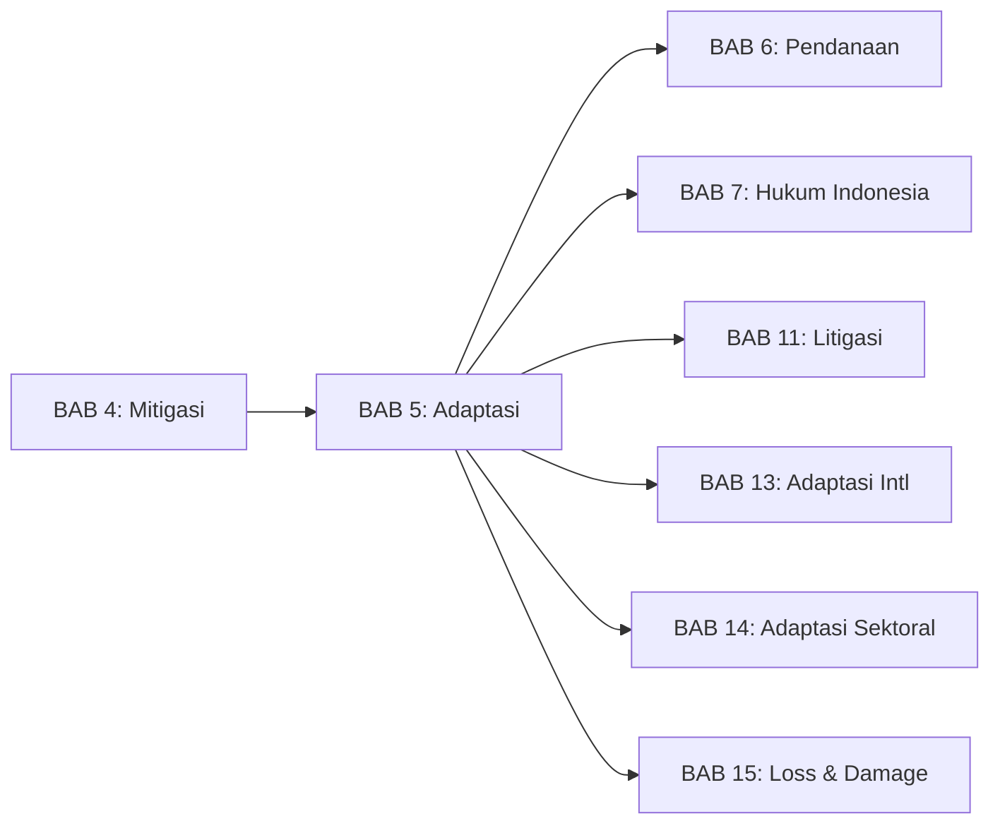
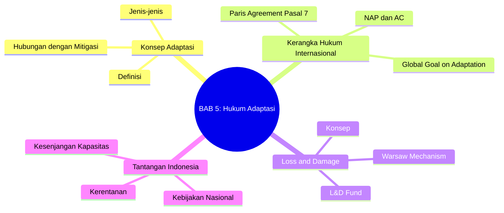
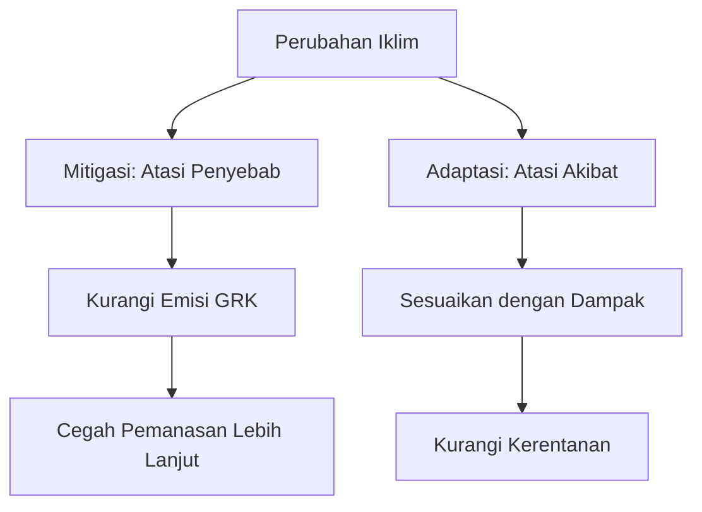
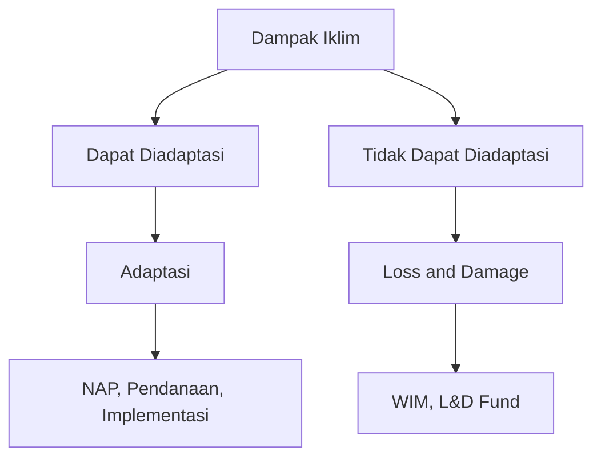

# BAB 5: Hukum Adaptasi Perubahan Iklim

---

## A. PENDAHULUAN

### 1. Capaian Pembelajaran (Sub-CPMK)

Setelah mempelajari bab ini, mahasiswa mampu:

1. **Menjelaskan** konsep adaptasi perubahan iklim dan perbedaannya dengan mitigasi
2. **Menganalisis** kerangka hukum internasional untuk adaptasi dalam Persetujuan Paris
3. **Mengevaluasi** hubungan antara adaptasi, kerugian dan kerusakan (*loss and damage*), dan keadilan iklim
4. **Mengidentifikasi** tantangan hukum adaptasi di Indonesia sebagai negara rentan

### 2. Indikator Pencapaian

- [ ] Mahasiswa dapat mendefinisikan adaptasi dan membedakannya dari mitigasi
- [ ] Mahasiswa dapat menguraikan Global Goal on Adaptation dan mekanisme terkait
- [ ] Mahasiswa dapat menjelaskan konsep *loss and damage* dan perkembangan terbarunya
- [ ] Mahasiswa dapat mengidentifikasi kebijakan adaptasi Indonesia

### 3. Deskripsi Singkat

Meskipun mitigasi sangat penting, realitasnya perubahan iklim sudah terjadi dan dampaknya tidak terelakkan. Adaptasi—penyesuaian terhadap dampak iklim—menjadi semakin krusial. Bab ini akan mengajak Anda memahami bagaimana hukum internasional mengatur adaptasi, kesenjangan yang masih ada, dan tantangan khusus yang dihadapi Indonesia sebagai negara kepulauan yang sangat rentan.

### 4. Hubungan dengan Bab Lain

Bab ini melengkapi [[BAB 4 -- Kewajiban Mitigasi dalam Hukum Internasional --|BAB 4 tentang Mitigasi]] dan terkait erat dengan [[BAB 6 -- Pendanaan dan Mekanisme Iklim --|BAB 6 tentang Pendanaan]] karena adaptasi memerlukan sumber daya yang signifikan.

> [!tip] **Bab Lanjutan tentang Adaptasi**
> Untuk pembahasan lebih mendalam, lihat:
> - [[BAB 13 -- Kerangka Hukum Adaptasi Internasional --|BAB 13: Kerangka Hukum Adaptasi Internasional]] - GGA, NAP, dan kelembagaan internasional
> - [[BAB 14 -- Hukum Adaptasi Sektoral Indonesia --|BAB 14: Hukum Adaptasi Sektoral Indonesia]] - Regulasi adaptasi per sektor
> - [[BAB 15 -- Loss and Damage dalam Hukum Iklim --|BAB 15: Loss and Damage dalam Hukum Iklim]] - Pembahasan mendalam L&D

### 5. Peta Konsep Bab

---

## B. PENYAJIAN MATERI

### 1. Konsep Adaptasi Perubahan Iklim

Perubahan iklim sudah terjadi dan dampaknya sudah dirasakan di seluruh dunia. Menurut Panel Antarpemerintah tentang Perubahan Iklim (IPCC), pemanasan global telah mencapai sekitar 1,1 derajat Celsius di atas tingkat pra-industri, dan dampaknya semakin nyata dalam bentuk peristiwa cuaca ekstrem, kenaikan muka laut, dan perubahan pola presipitasi.[^1] Bahkan jika semua emisi berhenti hari ini, efek dari emisi historis akan terus berlanjut selama beberapa dekade karena inersia sistem iklim global.[^2] Oleh karena itu, adaptasi---penyesuaian terhadap realitas iklim yang berubah---bukan lagi pilihan tetapi menjadi keharusan yang mendesak bagi seluruh masyarakat global.

#### 1.1 Definisi Adaptasi

> [!info] **Definisi**
> **Adaptasi** (*adaptation*): Proses penyesuaian terhadap iklim aktual atau yang diproyeksikan dan dampak-dampaknya. Dalam sistem manusia, adaptasi berupaya mengurangi kerentanan atau memanfaatkan peluang yang menguntungkan. Dalam sistem alam, intervensi manusia dapat memfasilitasi penyesuaian.

Secara konseptual, adaptasi perubahan iklim dapat dipahami sebagai respons terhadap rangsangan iklim aktual maupun yang diperkirakan akan terjadi di masa depan, dengan tujuan mengurangi kerentanan atau memanfaatkan peluang yang muncul.[^3] Definisi ini mencakup spektrum tindakan yang luas, mulai dari penyesuaian reaktif terhadap dampak yang sudah terjadi hingga perencanaan antisipatif untuk menghadapi proyeksi perubahan iklim di masa depan. Penting untuk dipahami bahwa adaptasi tidak hanya bersifat teknis, tetapi juga melibatkan dimensi sosial, ekonomi, dan kelembagaan yang saling terkait.

IPCC dalam laporan-laporannya membedakan antara dua bentuk utama adaptasi. Pertama, **adaptasi inkremental** merujuk pada tindakan-tindakan yang bertujuan mempertahankan esensi dan integritas sistem atau proses yang ada, melalui penyesuaian bertahap tanpa mengubah struktur fundamental sistem tersebut.[^4] Contohnya termasuk peningkatan kapasitas sistem drainase perkotaan atau penyesuaian kalender tanam petani. Kedua, **adaptasi transformatif** merupakan tindakan yang mengubah atribut fundamental suatu sistem sebagai respons terhadap perubahan iklim dan dampaknya. Adaptasi jenis ini diperlukan ketika batas-batas adaptasi inkremental telah tercapai atau ketika perubahan iklim begitu signifikan sehingga memerlukan perubahan paradigmatik dalam cara masyarakat berinteraksi dengan lingkungan mereka.[^5]

#### 1.2 Jenis-Jenis Adaptasi

Klasifikasi jenis-jenis adaptasi membantu pemangku kebijakan dan praktisi dalam merancang strategi yang komprehensif. Literatur akademis mengidentifikasi beberapa kategori utama adaptasi berdasarkan karakteristik dan pendekatan yang digunakan.[^6]

| Jenis | Deskripsi | Contoh |
|-------|-----------|--------|
| **Struktural/fisik** | Infrastruktur dan rekayasa | Tanggul laut, irigasi |
| **Sosial** | Pendidikan, kesadaran, perilaku | Peringatan dini, relokasi |
| **Kelembagaan** | Kebijakan, regulasi, tata kelola | Zonasi pesisir, asuransi |
| **Berbasis ekosistem** | Menggunakan jasa ekosistem | Mangrove, hutan kota |

**Tabel 5.1.** Jenis-jenis adaptasi perubahan iklim

Adaptasi struktural atau fisik melibatkan pembangunan infrastruktur yang dirancang untuk menahan atau mengurangi dampak iklim, seperti tanggul laut, bendungan, dan sistem irigasi yang lebih efisien. Meskipun efektif dalam banyak konteks, pendekatan ini sering kali memerlukan investasi modal yang besar dan dapat menimbulkan dampak lingkungan tersendiri.[^7] Adaptasi sosial berfokus pada peningkatan kesadaran masyarakat, perubahan perilaku, dan penguatan kapasitas komunitas untuk merespons perubahan iklim. Pendekatan ini mencakup program pendidikan, sistem peringatan dini, dan dalam kasus ekstrem, relokasi penduduk dari zona berisiko tinggi. Adaptasi kelembagaan melibatkan perubahan dalam kebijakan, regulasi, dan tata kelola untuk menciptakan lingkungan yang kondusif bagi adaptasi, termasuk zonasi pesisir, standar bangunan tahan iklim, dan skema asuransi risiko iklim. Terakhir, adaptasi berbasis ekosistem (*ecosystem-based adaptation* atau EbA) memanfaatkan keanekaragaman hayati dan jasa ekosistem sebagai bagian dari strategi adaptasi holistik, seperti rehabilitasi mangrove untuk perlindungan pantai atau penghijauan kota untuk mengurangi efek *heat island*.[^8]

> [!example] **Contoh: Adaptasi di Indonesia**
> - **Struktural:** Pembangunan *sea wall* di pesisir Jakarta
> - **Sosial:** Sistem peringatan dini banjir Jakarta (*early warning system*)
> - **Kelembagaan:** Peraturan zonasi kawasan rawan bencana
> - **Berbasis ekosistem:** Rehabilitasi mangrove di pesisir utara Jawa

#### 1.3 Hubungan Mitigasi dan Adaptasi

Mitigasi dan adaptasi bukanlah pilihan yang saling menggantikan---keduanya merupakan respons komplementer yang sama-sama diperlukan dalam menghadapi perubahan iklim. Mitigasi menangani akar penyebab masalah dengan mengurangi emisi gas rumah kaca, sementara adaptasi menangani konsekuensi yang tidak terhindarkan dari perubahan iklim yang sudah terjadi dan yang akan datang.[^9] Tanpa mitigasi yang ambisius, kebutuhan adaptasi akan terus meningkat hingga mencapai titik di mana adaptasi tidak lagi memungkinkan. Sebaliknya, tanpa adaptasi, masyarakat akan terus menderita akibat dampak iklim yang sudah tidak terhindarkan, bahkan dalam skenario mitigasi paling optimistis sekalipun.

Hubungan antara mitigasi dan adaptasi juga dapat bersifat sinergis atau konfliktual. Beberapa tindakan dapat memberikan manfaat ganda (*co-benefits*), seperti penghijauan kota yang menyerap karbon sekaligus mengurangi suhu perkotaan. Namun, ada pula potensi pertukaran (*trade-offs*), misalnya pembangkit listrik tenaga air yang mengurangi emisi tetapi dapat meningkatkan kerentanan terhadap perubahan pola curah hujan.[^10]

> [!warning] **Perhatian: *Maladaptation***
> Tidak semua tindakan yang bermaksud baik adalah adaptasi yang efektif. **Maladaptasi** adalah tindakan yang mungkin mengurangi kerentanan jangka pendek tetapi meningkatkan kerentanan jangka panjang atau kerentanan pihak lain.
>
> Contoh: Membangun tanggul yang mendorong pemukiman di zona rawan, yang kemudian lebih rentan jika tanggul jebol.

Konsep maladaptasi menjadi perhatian khusus dalam perencanaan adaptasi. IPCC mendefinisikan maladaptasi sebagai tindakan yang dapat meningkatkan risiko dampak buruk terkait iklim, termasuk melalui peningkatan emisi gas rumah kaca, peningkatan kerentanan terhadap perubahan iklim, atau pengurangan kesejahteraan saat ini atau masa depan.[^11] Contoh klasik maladaptasi termasuk penggunaan berlebihan air tanah untuk irigasi yang menyebabkan penurunan permukaan tanah (*land subsidence*), atau pembangunan infrastruktur pesisir yang mendorong pembangunan lebih lanjut di zona berisiko tinggi.

---

### 2. Adaptasi dalam UNFCCC dan Persetujuan Paris

Secara historis, rezim hukum iklim internasional memberikan perhatian yang tidak seimbang antara mitigasi dan adaptasi, dengan mitigasi mendominasi agenda negosiasi dan alokasi sumber daya. Ketidakseimbangan ini mencerminkan dinamika politik di mana negara-negara maju yang menjadi penyumbang emisi terbesar lebih nyaman membahas pengurangan emisi daripada mengakui tanggung jawab mereka atas dampak yang dialami negara-negara berkembang.[^12] Baru dalam Persetujuan Paris 2015, adaptasi akhirnya mendapat pengakuan yang relatif setara dengan mitigasi sebagai pilar fundamental respons global terhadap perubahan iklim.

#### 2.1 Perkembangan Adaptasi dalam Rezim Iklim

Evolusi pengaturan adaptasi dalam rezim iklim internasional mencerminkan pergeseran paradigma dari fokus ekslusif pada mitigasi menuju pendekatan yang lebih seimbang. Konvensi Kerangka Kerja PBB tentang Perubahan Iklim (UNFCCC) 1992 memuat ketentuan tentang adaptasi dalam Pasal 4.1(b), yang mewajibkan semua pihak untuk merumuskan dan melaksanakan program-program yang memuat langkah-langkah untuk memfasilitasi adaptasi yang memadai terhadap perubahan iklim.[^13] Namun, ketentuan ini bersifat sangat umum dan tidak disertai mekanisme implementasi yang konkret.

| Tahun | Perkembangan |
|-------|--------------|
| 1992 | UNFCCC Pasal 4.1(b): kewajiban umum adaptasi |
| 2001 | COP7 Marrakech: dana adaptasi, NAPA untuk LDCs |
| 2010 | COP16 Cancun: Cancun Adaptation Framework, NAP |
| 2013 | COP19 Warsaw: Warsaw International Mechanism for L&D |
| 2015 | Paris Agreement: Pasal 7 (adaptasi), Pasal 8 (L&D) |
| 2021 | COP26 Glasgow: Dialog Glasgow-Sharm el-Sheikh |
| 2022 | COP27: Loss and Damage Fund |
| 2023 | COP28: Global Stocktake mencakup adaptasi |

**Tabel 5.2.** Perkembangan adaptasi dalam rezim iklim

Momentum penting terjadi pada COP7 di Marrakech (2001), yang menghasilkan pembentukan tiga dana baru termasuk dana adaptasi, serta mewajibkan negara-negara kurang berkembang (*Least Developed Countries*/LDCs) untuk menyusun Program Aksi Adaptasi Nasional (*National Adaptation Programmes of Action*/NAPAs).[^14] COP16 di Cancun (2010) memperkuat arsitektur adaptasi melalui Cancun Adaptation Framework yang menetapkan proses National Adaptation Plans (NAPs) dan membentuk Adaptation Committee sebagai badan penasehat teknis.[^15] Perkembangan ini merefleksikan tekanan yang semakin kuat dari negara-negara berkembang yang menuntut kesetaraan perhatian terhadap adaptasi.

#### 2.2 Persetujuan Paris Pasal 7: Global Goal on Adaptation

Persetujuan Paris 2015 merupakan titik balik dalam pengaturan adaptasi internasional. Untuk pertama kalinya dalam sejarah rezim iklim, sebuah perjanjian internasional yang mengikat secara hukum memberikan tempat yang setara bagi adaptasi melalui Pasal 7 yang komprehensif.

> [!quote] **Kutipan**
> "Parties hereby establish the global goal on adaptation of enhancing adaptive capacity, strengthening resilience and reducing vulnerability to climate change, with a view to contributing to sustainable development..."
> — *Pasal 7.1, Persetujuan Paris 2015*

Pasal 7.1 menetapkan *Global Goal on Adaptation* (GGA) yang bertujuan meningkatkan kapasitas adaptif, memperkuat ketahanan, dan mengurangi kerentanan terhadap perubahan iklim, dengan maksud berkontribusi pada pembangunan berkelanjutan dan memastikan respons adaptasi yang memadai dalam konteks target suhu yang disebutkan dalam Pasal 2.[^16] Berbeda dengan target mitigasi yang dapat dikuantifikasi (misalnya 1,5 atau 2 derajat Celsius), GGA bersifat lebih kualitatif, yang mencerminkan sifat kontekstual adaptasi yang sangat bergantung pada kondisi lokal masing-masing negara.

Pasal 7 memuat beberapa elemen kunci yang membentuk kerangka adaptasi global. Pertama, pengakuan bahwa adaptasi merupakan tantangan global dengan dimensi lokal, subnasional, nasional, regional, dan internasional.[^17] Kedua, penetapan siklus proses adaptasi yang mencakup penilaian dampak dan kerentanan, perencanaan, implementasi, serta pemantauan dan evaluasi. Ketiga, kewajiban bagi setiap pihak untuk menyampaikan dan memperbarui secara berkala komunikasi adaptasi (*adaptation communication*) yang dapat diintegrasikan dalam NDC atau disampaikan sebagai dokumen terpisah. Keempat, pengakuan bahwa upaya adaptasi negara-negara berkembang harus diakui dan didukung oleh negara-negara maju.[^18]

#### 2.3 National Adaptation Plans (NAPs)

> [!info] **Definisi**
> **NAP** (*National Adaptation Plan*): Proses perencanaan strategis yang memungkinkan negara untuk mengidentifikasi kebutuhan adaptasi jangka menengah dan panjang serta mengintegrasikan adaptasi ke dalam perencanaan pembangunan.

National Adaptation Plans (NAPs) merupakan instrumen perencanaan strategis yang diperkenalkan melalui Cancun Adaptation Framework dan diperkuat dalam Persetujuan Paris. Proses NAP dirancang untuk memungkinkan negara-negara, khususnya negara berkembang, mengidentifikasi kebutuhan adaptasi jangka menengah dan panjang serta mengembangkan dan mengimplementasikan strategi untuk mengatasi kebutuhan tersebut.[^19] Berbeda dengan NAPAs yang bersifat reaktif dan berfokus pada kebutuhan mendesak LDCs, NAPs mengambil pendekatan yang lebih strategis dan jangka panjang.

Pedoman teknis yang dikembangkan oleh Least Developed Countries Expert Group (LEG) mengidentifikasi empat elemen utama proses NAP. Pertama, meletakkan dasar dan mengatasi kesenjangan (*laying the groundwork and addressing gaps*), yang mencakup pembentukan mandat nasional, penilaian kapasitas, dan identifikasi kebutuhan informasi. Kedua, elemen persiapan (*preparatory elements*), termasuk sintesis informasi yang tersedia, penilaian kerentanan, dan identifikasi opsi adaptasi. Ketiga, strategi implementasi (*implementation strategies*), yang meliputi prioritisasi tindakan, pengembangan rencana implementasi, dan mobilisasi sumber daya. Keempat, pelaporan, pemantauan, dan peninjauan (*reporting, monitoring and review*) untuk memastikan pembelajaran berkelanjutan dan penyesuaian strategi.[^20]

> [!example] **Contoh: NAP Indonesia**
> Indonesia telah menyusun Rencana Aksi Nasional Adaptasi Perubahan Iklim (RAN-API) yang mencakup:
> - Sektor ketahanan pangan dan energi
> - Sektor kesehatan
> - Sektor permukiman dan infrastruktur
> - Sektor ekosistem
>
> RAN-API diintegrasikan ke dalam RPJMN dan RPJMD.

Hingga akhir 2023, lebih dari 50 negara telah menyampaikan NAP mereka ke UNFCCC, meskipun banyak negara berkembang masih menghadapi kendala kapasitas dan pendanaan dalam proses penyusunan dan implementasi NAP mereka.[^21]

#### 2.4 Adaptation Committee (AC)

Adaptation Committee (AC) dibentuk berdasarkan keputusan COP16 di Cancun sebagai badan di bawah UNFCCC yang bertugas mempromosikan implementasi aksi adaptasi secara koheren. Komite ini terdiri dari 16 anggota yang mewakili berbagai kelompok regional dan konstituen, dengan mandat yang mencakup pemberian bimbingan teknis dan dukungan kepada para pihak, berbagi informasi dan praktik baik, promosi sinergi dan penguatan keterlibatan dengan organisasi dan badan relevan, serta penyampaian rekomendasi kepada COP.[^22]

Dalam praktiknya, AC telah menghasilkan berbagai produk pengetahuan dan panduan teknis, termasuk kompilasi praktik baik adaptasi, analisis kesenjangan dan kebutuhan, serta rekomendasi tentang isu-isu spesifik seperti adaptasi berbasis ekosistem dan mobilitas manusia terkait iklim. AC juga memainkan peran penting dalam mendukung proses NAP dan memfasilitasi pertukaran pengalaman antar negara.[^23]

---

### 3. Kerugian dan Kerusakan (*Loss and Damage*)

Di luar cakupan adaptasi, terdapat dimensi dampak perubahan iklim yang tidak dapat diatasi melalui penyesuaian---kerugian dan kerusakan (*loss and damage*) yang sudah terjadi atau akan terjadi meskipun dengan upaya adaptasi terbaik sekalipun. Konsep ini mengakui bahwa ada batas-batas fundamental adaptasi, baik karena keterbatasan fisik maupun karena ketidakmampuan untuk bertindak tepat waktu atau dengan sumber daya yang memadai. Isu *loss and damage* telah menjadi salah satu arena negosiasi paling kontroversial dalam rezim iklim internasional, karena menyentuh pertanyaan mendasar tentang tanggung jawab historis dan keadilan iklim.[^24]

#### 3.1 Konsep *Loss and Damage*

> [!info] **Definisi**
> **Kerugian dan kerusakan** (*loss and damage*): Dampak negatif perubahan iklim yang tidak dapat dihindari melalui adaptasi, baik karena batas adaptasi telah terlampaui (*hard limits*) maupun karena kendala kapasitas (*soft limits*).

Secara konseptual, *loss and damage* merujuk pada dampak perubahan iklim yang melampaui kemampuan manusia untuk beradaptasi. IPCC membedakan antara dua jenis batas adaptasi: *hard limits* yang bersifat absolut dan tidak dapat diatasi dengan upaya apapun (misalnya, pulau yang tenggelam karena kenaikan muka laut), dan *soft limits* yang dapat diatasi jika ada sumber daya, teknologi, atau kapasitas kelembagaan yang memadai.[^25] Dalam konteks hukum internasional, konsep ini menjadi penting karena menandai wilayah di mana adaptasi tidak lagi menjadi solusi yang memadai, sehingga memerlukan pendekatan dan mekanisme yang berbeda.

*Loss and damage* dapat diklasifikasikan menjadi dua kategori utama berdasarkan sifatnya:

| Kategori | *Economic losses* | *Non-economic losses* |
|----------|-------------------|----------------------|
| Contoh | Kerusakan infrastruktur, gagal panen, penurunan GDP | Hilangnya nyawa, budaya, identitas, ekosistem |
| Kuantifikasi | Relatif mudah dihitung | Sulit atau tidak mungkin dikuantifikasi |

**Tabel 5.3.** Kategori kerugian dan kerusakan

Kerugian ekonomi (*economic losses*) mencakup dampak yang dapat dikuantifikasi dalam nilai moneter, seperti kerusakan infrastruktur, penurunan produktivitas pertanian, atau biaya pemulihan pasca-bencana. Sebaliknya, kerugian non-ekonomi (*non-economic losses* atau NELs) meliputi dampak yang sulit atau tidak mungkin dinilai secara finansial, termasuk hilangnya nyawa manusia, pengetahuan tradisional, warisan budaya, ikatan sosial, dan layanan ekosistem yang tidak dapat dipulihkan.[^26] Pengakuan terhadap NELs merupakan aspek penting dalam evolusi konsep *loss and damage*, meskipun menimbulkan tantangan signifikan dalam hal pengukuran dan kompensasi.

#### 3.2 Warsaw International Mechanism (WIM)

Mekanisme kelembagaan pertama yang secara khusus menangani *loss and damage* dibentuk pada COP19 di Warsawa (2013). Warsaw International Mechanism for Loss and Damage associated with Climate Change Impacts (WIM) didirikan dengan tiga fungsi utama: meningkatkan pengetahuan dan pemahaman tentang pendekatan manajemen risiko komprehensif, memperkuat dialog, koordinasi, koherensi dan sinergi di antara pemangku kepentingan yang relevan, serta meningkatkan aksi dan dukungan termasuk pendanaan, teknologi, dan pengembangan kapasitas.[^27]

WIM dioperasikan oleh Executive Committee (ExCom) yang terdiri dari 20 anggota yang mewakili negara maju dan berkembang secara seimbang. ExCom telah mengembangkan program kerja yang mencakup beberapa area strategis. Area pertama adalah peristiwa cuaca ekstrem (*extreme weather events*), yang membahas bagaimana mengelola risiko dan merespons dampak badai, banjir, dan kekeringan yang semakin intens. Area kedua adalah proses lambat (*slow onset events*), yang mencakup fenomena seperti kenaikan muka laut, penggurunan, salinisasi, dan hilangnya keanekaragaman hayati yang berkembang secara gradual tetapi berdampak signifikan.[^28] Area ketiga adalah kerugian non-ekonomi yang memerlukan pendekatan khusus mengingat sifatnya yang tidak dapat dikuantifikasi secara moneter. Area keempat adalah mobilitas manusia (*human mobility*), yang mencakup migrasi, pengungsian, dan relokasi terencana akibat perubahan iklim. Area kelima adalah manajemen risiko komprehensif yang mengintegrasikan berbagai pendekatan untuk mengurangi dan menangani *loss and damage*.

#### 3.3 Persetujuan Paris Pasal 8

Persetujuan Paris memberikan pengakuan hukum tertinggi terhadap *loss and damage* melalui Pasal 8 yang berdiri sendiri, terpisah dari ketentuan tentang adaptasi. Ini merupakan pencapaian signifikan bagi negara-negara berkembang yang telah lama memperjuangkan pengakuan bahwa *loss and damage* berbeda secara fundamental dari adaptasi.

> [!quote] **Kutipan**
> "Parties recognize the importance of averting, minimizing and addressing loss and damage associated with the adverse effects of climate change..."
> — *Pasal 8.1, Persetujuan Paris 2015*

Pasal 8 menetapkan pendekatan tiga lapis terhadap *loss and damage*: *averting* (mencegah), *minimizing* (meminimalkan), dan *addressing* (menangani). Pasal ini juga mengidentifikasi berbagai area kerja sama termasuk sistem peringatan dini, kesiapsiagaan darurat, peristiwa lambat, peristiwa yang mungkin melibatkan kerugian permanen dan tidak dapat dipulihkan, penilaian dan manajemen risiko komprehensif, fasilitas asuransi risiko, kerugian non-ekonomi, serta ketahanan komunitas.[^29]

Namun, pencapaian Pasal 8 dibatasi oleh paragraf 51 dalam keputusan adopsi Persetujuan Paris:

> [!warning] **Perhatian**
> Paragraf 51 keputusan adopsi Persetujuan Paris menyatakan bahwa Pasal 8 "tidak melibatkan atau memberikan dasar untuk tanggung jawab atau kompensasi apapun" (*does not involve or provide a basis for any liability or compensation*).
>
> Ini adalah hasil kompromi politik---negara maju menolak mengakui tanggung jawab hukum atas *loss and damage*.

Pembatasan ini mencerminkan kekhawatiran mendalam negara-negara maju, khususnya Amerika Serikat, bahwa pengakuan terhadap *loss and damage* dapat membuka pintu bagi tuntutan hukum dan klaim kompensasi bernilai triliunan dolar atas emisi historis mereka.[^30] Meskipun demikian, paragraf 51 hanya terdapat dalam keputusan COP dan bukan dalam teks Persetujuan Paris itu sendiri, sehingga status hukumnya masih diperdebatkan oleh para ahli.

#### 3.4 Loss and Damage Fund (COP27)

Terobosan bersejarah terjadi di COP27 Sharm el-Sheikh (2022) dengan kesepakatan untuk membentuk dana khusus yang merespons *loss and damage*. Setelah lebih dari tiga dekade perjuangan, negara-negara akhirnya menyetujui pembentukan mekanisme pendanaan yang secara eksplisit ditujukan untuk membantu negara-negara berkembang yang paling rentan dalam menghadapi kerugian dan kerusakan akibat perubahan iklim.[^31]

Arsitektur dana ini dikembangkan oleh Transitional Committee yang bekerja sepanjang 2023 dan difinalisasi pada COP28 di Dubai. Elemen-elemen kunci dari dana ini meliputi:

- **Nama resmi:** Fund for responding to loss and damage
- **Tujuan:** Membantu negara berkembang rentan, khususnya yang paling terdampak
- **Hosting:** World Bank (interim, untuk periode awal 4 tahun)
- **Komitmen awal:** ~USD 700 juta dari berbagai negara donor
- **Cakupan:** Baik kerugian ekonomi maupun non-ekonomi

> [!tip] **Kotak Pengayaan: Perjuangan Panjang untuk L&D Fund**
> Usulan dana untuk *loss and damage* pertama kali diajukan oleh Aliansi Negara Kepulauan Kecil (AOSIS) pada 1991---lebih dari 30 tahun sebelum akhirnya diadopsi. Negara maju menolak karena khawatir ini membuka pintu untuk tanggung jawab hukum dan kompensasi.
>
> COP27 berhasil karena kepresidenan Mesir, tekanan dari negara berkembang, dan momen bencana banjir Pakistan 2022 yang menelan korban 1.700 jiwa dan kerugian USD 30 miliar.

Meskipun pembentukan dana ini merupakan pencapaian simbolis yang sangat penting, tantangan substansial tetap ada. Komitmen awal sekitar USD 700 juta jauh di bawah perkiraan kebutuhan yang mencapai ratusan miliar dolar per tahun untuk negara-negara berkembang.[^32] Pertanyaan tentang siapa yang berkontribusi, bagaimana mengakses dana, dan kriteria alokasi masih terus dinegosiasikan dan akan menentukan efektivitas mekanisme ini dalam praktik.

---

### 4. Keadilan Iklim dan Adaptasi

Adaptasi perubahan iklim tidak dapat dipisahkan dari pertanyaan mendasar tentang keadilan. Mereka yang paling sedikit berkontribusi terhadap perubahan iklim---negara-negara miskin, komunitas marjinal, dan generasi mendatang---justru menanggung beban dampak yang paling berat dan memiliki kapasitas paling terbatas untuk beradaptasi.[^33] Paradoks ketidakadilan ini menjadikan adaptasi bukan sekadar masalah teknis atau ekonomi, tetapi fundamentalnya adalah masalah moral dan etis yang memerlukan respons yang berlandaskan prinsip-prinsip keadilan distributif dan korektif.

#### 4.1 Ketidakadilan Beban Adaptasi

Ketidakadilan dalam beban adaptasi bermanifestasi dalam berbagai dimensi yang saling terkait. Pada tingkat antarnegara, terdapat kesenjangan mencolok antara tanggung jawab historis atas emisi dan kerentanan terhadap dampak iklim. Negara-negara maju yang bertanggung jawab atas sebagian besar emisi historis umumnya memiliki kapasitas adaptasi yang lebih tinggi, sementara negara-negara berkembang yang kontribusi emisinya minimal justru menghadapi dampak yang lebih parah dengan sumber daya yang lebih terbatas.[^34]

| Dimensi | Ketidakadilan |
|---------|---------------|
| **Antarnegara** | Negara miskin dan rentan menanggung beban lebih besar meski emisi historis kecil |
| **Intranegara** | Kelompok miskin, perempuan, lansia, disabilitas lebih rentan |
| **Antargenerasi** | Generasi muda mewarisi dampak iklim dari emisi generasi sebelumnya |
| **Antarsektor** | Petani dan nelayan lebih rentan dibanding sektor lain |

**Tabel 5.4.** Dimensi ketidakadilan dalam beban adaptasi

Pada tingkat intranegara, kerentanan tidak terdistribusi secara merata di dalam populasi. Kelompok-kelompok marjinal seperti masyarakat miskin, perempuan, anak-anak, lansia, penyandang disabilitas, dan masyarakat adat sering kali lebih rentan terhadap dampak iklim karena keterbatasan akses terhadap sumber daya, informasi, dan pengambilan keputusan.[^35] Dimensi antargenerasi menambah kompleksitas moral, di mana generasi muda dan yang belum lahir akan mewarisi dampak kumulatif dari emisi yang dihasilkan oleh generasi sebelumnya, tanpa kemampuan untuk mempengaruhi keputusan yang menentukan nasib mereka. Pada tingkat sektoral, mereka yang mata pencahariannya bergantung langsung pada sumber daya alam---petani, nelayan, penggembala---menghadapi risiko yang tidak proporsional dibandingkan sektor-sektor yang lebih terlindung dari variabilitas iklim.

#### 4.2 Kesenjangan Adaptasi (*Adaptation Gap*)

Kesenjangan adaptasi (*adaptation gap*) merujuk pada perbedaan antara kebutuhan adaptasi aktual dan tingkat adaptasi yang telah dicapai atau direncanakan. UNEP Adaptation Gap Report 2023 memberikan gambaran yang mengkhawatirkan tentang kondisi saat ini.[^36] Laporan tersebut mengidentifikasi tiga jenis kesenjangan utama yang saling terkait.

Pertama, **kesenjangan pendanaan** merupakan yang paling terukur dan mencolok. Perkiraan terbaru menunjukkan bahwa kebutuhan pendanaan adaptasi untuk negara-negara berkembang mencapai USD 215-387 miliar per tahun hingga 2030, sementara pendanaan adaptasi yang mengalir ke negara-negara ini hanya sekitar USD 21 miliar per tahun---menciptakan kesenjangan 10-18 kali lipat.[^37] Kedua, **kesenjangan implementasi** menunjukkan bahwa bahkan ketika rencana adaptasi telah disusun, terdapat hambatan signifikan dalam mengubah rencana menjadi aksi nyata di lapangan. Ketiga, **kesenjangan pengetahuan** mencerminkan keterbatasan data dan informasi tentang kerentanan lokal, proyeksi iklim skala halus, dan efektivitas berbagai opsi adaptasi.

> [!warning] **Perhatian**
> Kesenjangan adaptasi terus melebar seiring meningkatnya dampak iklim. Tanpa peningkatan drastis pendanaan dan aksi, banyak komunitas---terutama di negara berkembang---akan menghadapi dampak yang tidak dapat diatasi.

Prinsip *Common but Differentiated Responsibilities and Respective Capabilities* (CBDR-RC) yang menjadi fondasi rezim iklim internasional mewajibkan negara-negara maju untuk menyediakan dukungan finansial dan teknis bagi upaya adaptasi negara berkembang.[^38] Namun, implementasi prinsip ini masih jauh dari memadai, sebagaimana tercermin dalam kesenjangan pendanaan yang terus melebar.

#### 4.3 Hak atas Adaptasi?

Dalam diskursus akademis dan praktik hukum internasional, pertanyaan tentang eksistensi "hak atas adaptasi" (*right to adaptation*) semakin mendapat perhatian. Meskipun tidak ada instrumen hukum internasional yang secara eksplisit mengakui hak ini, berbagai argumen dikembangkan untuk mendukung konstruksi normatifnya.

Argumen pendukung menekankan bahwa adaptasi merupakan prasyarat untuk penikmatan hak-hak asasi manusia fundamental. Tanpa adaptasi yang memadai, hak atas hidup, kesehatan, pangan, air, dan perumahan yang layak tidak dapat terpenuhi dalam konteks perubahan iklim.[^39] Prinsip CBDR-RC dalam hukum iklim internasional, dikombinasikan dengan kewajiban kerjasama internasional dalam hukum hak asasi manusia, menciptakan fondasi normatif bagi kewajiban negara maju untuk mendukung adaptasi di negara berkembang. Persetujuan Paris sendiri mengakui adaptasi sebagai "tantangan global yang dihadapi oleh semua pihak dengan dimensi lokal, subnasional, nasional, regional dan internasional," yang mengimplikasikan tanggung jawab kolektif.

Di sisi lain, argumen skeptis menunjukkan bahwa tidak ada instrumen HAM yang secara eksplisit mengakui hak atas adaptasi sebagai hak mandiri. Berbeda dengan hak-hak konvensional, hak atas adaptasi sulit dikuantifikasi, dipantau, dan dipaksakan melalui mekanisme yudisial.[^40] Implementasinya juga akan sangat bervariasi antar konteks geografis, sosial, dan ekonomi, sehingga menimbulkan tantangan dalam standardisasi dan penegakan. Terlepas dari perdebatan ini, tren litigasi iklim yang berkembang menunjukkan bahwa pengadilan di berbagai yurisdiksi semakin bersedia menginterpretasikan hak-hak yang ada untuk mencakup dimensi adaptasi.[^41]

---

### 5. Tantangan Adaptasi di Indonesia

Indonesia menghadapi tantangan adaptasi yang sangat besar dan kompleks sebagai negara kepulauan tropis dengan populasi terbesar keempat di dunia dan profil kerentanan yang multidimensi. Kombinasi faktor geografis, demografis, ekonomis, dan ekologis menempatkan Indonesia sebagai salah satu negara yang paling rentan terhadap dampak perubahan iklim, sekaligus menghadapi tantangan terbesar dalam upaya adaptasi.[^42] Pemahaman mendalam tentang profil kerentanan ini menjadi landasan esensial bagi perancangan kebijakan dan program adaptasi yang efektif.

#### 5.1 Profil Kerentanan Indonesia

Kerentanan Indonesia terhadap perubahan iklim merupakan fungsi dari paparan (*exposure*), sensitivitas (*sensitivity*), dan kapasitas adaptif (*adaptive capacity*) yang saling berinteraksi. Dari segi geografis, Indonesia merupakan negara kepulauan terbesar di dunia dengan lebih dari 17.000 pulau dan garis pantai sepanjang lebih dari 95.000 kilometer---terpanjang kedua di dunia setelah Kanada.[^43] Konfigurasi geografis ini menciptakan paparan yang luas terhadap berbagai bahaya terkait iklim, termasuk kenaikan muka laut, gelombang badai, dan erosi pantai.

| Aspek | Kerentanan |
|-------|------------|
| **Geografis** | 17.000+ pulau, garis pantai terpanjang ke-2 di dunia |
| **Demografis** | 270+ juta penduduk, 60% tinggal di pesisir |
| **Ekonomis** | Ketergantungan pada pertanian dan perikanan |
| **Ekologis** | Terumbu karang, mangrove, hutan hujan tropis |

**Tabel 5.5.** Profil kerentanan Indonesia

Dari perspektif demografis, lebih dari 270 juta penduduk Indonesia tersebar tidak merata di seluruh nusantara, dengan sekitar 60 persen tinggal di wilayah pesisir. Konsentrasi penduduk di zona pesisir yang rendah, termasuk kota-kota besar seperti Jakarta, Semarang, dan Surabaya, meningkatkan sensitivitas terhadap bahaya pesisir.[^44] Dari segi ekonomi, ketergantungan sebagian besar masyarakat pada sektor-sektor sensitif iklim seperti pertanian, perikanan, dan pariwisata berbasis alam menambah dimensi kerentanan ekonomi. Secara ekologis, Indonesia memiliki kekayaan hayati yang luar biasa---terumbu karang, hutan mangrove, dan hutan hujan tropis---yang sekaligus menyediakan jasa ekosistem vital bagi ketahanan iklim tetapi juga terancam oleh perubahan iklim itu sendiri.

Proyeksi dampak iklim untuk Indonesia sangat mengkhawatirkan. Skenario menunjukkan potensi kenaikan muka laut sebesar 0,5-1 meter pada akhir abad ini, yang dapat mengancam jutaan penduduk pesisir dan infrastruktur bernilai triliunan rupiah.[^45] Peningkatan intensitas dan frekuensi peristiwa cuaca ekstrem seperti banjir, kekeringan, dan siklon tropis diproyeksikan akan semakin memperparah risiko bencana. Perubahan pola musim hujan mengancam produktivitas pertanian dan ketersediaan air, sementara pemanasan dan pengasaman laut mengancam ekosistem laut yang menjadi tumpuan jutaan nelayan dan industri pariwisata.

#### 5.2 Kebijakan Adaptasi Nasional

Indonesia telah mengembangkan kerangka kebijakan adaptasi yang cukup komprehensif, meskipun implementasinya masih menghadapi berbagai tantangan. Arsitektur kebijakan adaptasi nasional dibangun melalui berbagai instrumen hukum dan perencanaan yang saling terkait.

Rencana Aksi Nasional Adaptasi Perubahan Iklim (RAN-API) merupakan dokumen strategis utama yang mengidentifikasi prioritas adaptasi nasional dan menetapkan target serta indikator untuk berbagai sektor.[^46] RAN-API mencakup empat klaster utama: ketahanan ekonomi (pertanian, perikanan, energi), ketahanan sistem kehidupan (kesehatan, permukiman, infrastruktur), ketahanan ekosistem (hutan, pesisir, lautan), dan ketahanan wilayah khusus (perkotaan, pesisir, pulau kecil). Dokumen ini menjadi acuan bagi kementerian/lembaga dan pemerintah daerah dalam menyusun program adaptasi sektoral dan spasial.

Integrasi iklim dalam perencanaan pembangunan nasional dilakukan melalui Rencana Pembangunan Jangka Menengah Nasional (RPJMN). RPJMN 2020-2024 memasukkan isu perubahan iklim sebagai salah satu agenda prioritas dengan target-target spesifik untuk adaptasi.[^47] Undang-Undang Nomor 32 Tahun 2009 tentang Perlindungan dan Pengelolaan Lingkungan Hidup menyediakan kerangka hukum umum yang mencakup prinsip-prinsip yang relevan dengan adaptasi, meskipun tidak secara spesifik mengatur adaptasi perubahan iklim. Di tingkat daerah, berbagai provinsi telah menyusun Rencana Aksi Daerah Adaptasi Perubahan Iklim (RAD-API) yang mengoperasionalkan RAN-API sesuai konteks lokal.

> [!example] **Contoh: Program Adaptasi Indonesia**
> - **Kampung Iklim (ProKlim):** Program komunitas adaptasi dan mitigasi
> - **SIDIK (Sistem Informasi Data Indeks Kerentanan):** Database kerentanan iklim
> - **Program rehabilitasi mangrove:** Target 600.000 ha mangrove
> - **Relokasi ibu kota ke IKN Nusantara:** Menjauhi Jakarta yang terancam kenaikan muka laut

#### 5.3 Kesenjangan dan Tantangan

Meskipun kemajuan kelembagaan dan kebijakan telah dicapai, Indonesia masih menghadapi tantangan struktural yang signifikan dalam implementasi adaptasi. Kesenjangan-kesenjangan ini perlu diatasi untuk memastikan bahwa kerangka kebijakan yang telah dibangun dapat diterjemahkan menjadi pengurangan kerentanan nyata di lapangan.

Kesenjangan pendanaan merupakan tantangan paling mendasar. Perkiraan kebutuhan pendanaan adaptasi Indonesia mencapai puluhan miliar dolar per tahun, sementara alokasi anggaran yang tersedia---baik dari sumber domestik maupun internasional---jauh di bawah kebutuhan tersebut.[^48] Koordinasi lintas sektor menjadi tantangan berikutnya, mengingat adaptasi bersifat *cross-cutting* dan memerlukan kerja sama antara berbagai kementerian/lembaga yang memiliki mandat, budaya organisasi, dan kepentingan yang berbeda. Kapasitas pemerintah daerah sangat bervariasi, dengan banyak kabupaten/kota yang belum memiliki kapasitas teknis, finansial, dan kelembagaan yang memadai untuk merancang dan mengimplementasikan program adaptasi.

Keterbatasan data dan informasi juga menjadi hambatan serius. Proyeksi iklim skala halus (*downscaled projections*) yang diperlukan untuk perencanaan adaptasi lokal masih sangat terbatas, dan data kerentanan di tingkat komunitas sering kali tidak tersedia atau tidak mutakhir.[^49] Terakhir, partisipasi masyarakat dalam proses perencanaan dan implementasi adaptasi belum optimal, padahal pengetahuan lokal dan kepemilikan komunitas sangat krusial bagi keberhasilan dan keberlanjutan program adaptasi. Mengintegrasikan kearifan lokal dengan pengetahuan ilmiah modern menjadi tantangan tersendiri yang memerlukan pendekatan yang lebih inklusif dan partisipatif.[^50]

---

## C. STUDI KASUS

### Kasus: Relokasi Paksa Akibat Kenaikan Muka Laut

**Latar Belakang:**

Desa Pantai Harapan di pesisir utara Pulau X telah mengalami kenaikan muka laut yang signifikan. Dalam 20 tahun terakhir, garis pantai mundur 200 meter dan puluhan rumah terendam saat pasang. Pemerintah kabupaten berencana merelokasi seluruh penduduk (500 KK) ke lokasi 5 km dari pantai.

**Fakta Kunci:**
1. Penduduk adalah nelayan tradisional yang bergantung pada laut
2. Banyak penduduk menolak relokasi karena akan kehilangan mata pencaharian
3. Lokasi relokasi adalah bekas lahan pertanian dengan fasilitas terbatas
4. Pemerintah hanya menawarkan kompensasi Rp 50 juta per KK
5. Tidak ada konsultasi bermakna dengan masyarakat sebelum keputusan

**Isu Hukum:**
- Apakah pemerintah berwenang merelokasi penduduk tanpa persetujuan?
- Standar apa yang harus dipenuhi dalam relokasi terkait iklim?
- Hak-hak apa yang harus dilindungi?

---

**Pertanyaan Pemantik:**

1. **Analisis:** Identifikasi hak-hak asasi manusia yang relevan dengan kasus relokasi ini!

2. **Evaluasi:** Bandingkan pendekatan relokasi paksa dengan relokasi berbasis persetujuan. Mana yang lebih sesuai dengan prinsip keadilan iklim?

3. **Sintesis:** Susun standar minimum (*minimum safeguards*) yang harus dipenuhi dalam relokasi terkait perubahan iklim!

4. **Aplikasi:** Bagaimana Indonesia seharusnya mengatur relokasi terkait iklim secara hukum? Apa yang dapat dipelajari dari praktik internasional?

> [!note] **Petunjuk Diskusi**
> Kasus ini dapat didiskusikan dalam kelompok kecil (3-4 orang) selama 45 menit, dengan setiap kelompok mengambil perspektif berbeda: pemerintah, masyarakat, LSM, atau ahli HAM.

---

## D. PENUTUP

### 1. Rangkuman

Pada bab ini, kita telah mempelajari:

- **Konsep Adaptasi:** Penyesuaian terhadap dampak iklim aktual dan proyeksi, mencakup berbagai jenis (struktural, sosial, kelembagaan, berbasis ekosistem).

- **Kerangka Hukum:** Persetujuan Paris Pasal 7 menetapkan Global Goal on Adaptation dan proses perencanaan melalui NAPs.

- **Loss and Damage:** Konsep yang mengakui kerugian di luar kemampuan adaptasi, dengan dana khusus yang disepakati di COP27.

- **Keadilan Iklim:** Adaptasi terkait erat dengan keadilan karena beban tidak terdistribusi merata.

- **Tantangan Indonesia:** Kerentanan tinggi sebagai negara kepulauan dengan kesenjangan kapasitas dan pendanaan.

---

### 2. Latihan

Kerjakan latihan berikut untuk memperdalam pemahaman Anda:

1. Jelaskan dengan kata-kata Anda sendiri perbedaan antara adaptasi dan mitigasi serta mengapa keduanya diperlukan!

2. Bandingkan Global Goal on Adaptation dengan target mitigasi dalam Persetujuan Paris. Mana yang lebih terukur?

3. Berikan 3 contoh *loss and damage* yang mungkin terjadi di Indonesia dan identifikasi apakah termasuk ekonomi atau non-ekonomi!

4. Analisis mengapa negara maju menolak penggunaan istilah "kompensasi" dalam konteks *loss and damage*!

5. Cari informasi tentang satu program adaptasi di daerah Anda dan evaluasi efektivitasnya!

---

### 3. Tes Formatif

Jawablah pertanyaan-pertanyaan berikut untuk mengukur pemahaman Anda:

**Pilihan Ganda:**

1. Adaptasi perubahan iklim merujuk pada:
   - a. Pengurangan emisi gas rumah kaca
   - b. Penyesuaian terhadap dampak iklim
   - c. Perdagangan karbon internasional
   - d. Pendanaan untuk negara maju

2. Global Goal on Adaptation ditetapkan dalam:
   - a. UNFCCC Pasal 4
   - b. Protokol Kyoto Pasal 12
   - c. Persetujuan Paris Pasal 7
   - d. Deklarasi Rio Prinsip 15

3. Warsaw International Mechanism berkaitan dengan:
   - a. Mitigasi
   - b. Pendanaan
   - c. Kerugian dan kerusakan
   - d. Transfer teknologi

4. Loss and Damage Fund disepakati pada:
   - a. COP21 Paris
   - b. COP26 Glasgow
   - c. COP27 Sharm el-Sheikh
   - d. COP28 Dubai

5. Kesenjangan pendanaan adaptasi menurut UNEP adalah:
   - a. 2-3x lipat
   - b. 5-7x lipat
   - c. 10-18x lipat
   - d. 20-30x lipat

**Benar atau Salah:**

6. Adaptasi hanya diperlukan di negara berkembang. (B/S)

7. Persetujuan Paris Pasal 8 secara eksplisit mengakui tanggung jawab negara maju atas *loss and damage*. (B/S)

8. NAP adalah singkatan dari National Adaptation Plan. (B/S)

9. *Maladaptation* adalah adaptasi yang meningkatkan kerentanan jangka panjang. (B/S)

10. Indonesia termasuk negara dengan kerentanan rendah terhadap perubahan iklim. (B/S)

---

### 4. Umpan Balik dan Tindak Lanjut

Cocokkan jawaban Anda dengan **Kunci Jawaban** di [[Lampiran-04-Kunci-Jawaban|Lampiran 4]].

**Kunci Jawaban Singkat:** 1-b, 2-c, 3-c, 4-c, 5-c, 6-S, 7-S, 8-B, 9-B, 10-S

**Rumus Penilaian:**

$$Tingkat\ Penguasaan = \frac{Jumlah\ Jawaban\ Benar}{10} \times 100\%$$

**Interpretasi dan Tindak Lanjut:**

| Tingkat Penguasaan | Kategori | Tindak Lanjut |
|--------------------|----------|---------------|
| **90 - 100%** | Baik Sekali | Selamat! Anda dapat melanjutkan ke [[BAB-06\|BAB 6]] |
| **80 - 89%** | Baik | Anda dapat melanjutkan, namun pelajari kembali bagian yang masih ragu |
| **70 - 79%** | Cukup | **Ulangi** materi bab ini, terutama bagian yang belum dikuasai |
| **< 70%** | Kurang | **Wajib mengulangi** seluruh materi bab ini sebelum melanjutkan |

---

### 5. Senarai Istilah Kunci

| Istilah | Bahasa Inggris | Definisi |
|---------|----------------|----------|
| Adaptasi | *Adaptation* | Penyesuaian terhadap dampak iklim |
| Kerugian dan kerusakan | *Loss and damage* | Dampak yang tidak dapat diadaptasi |
| NAP | *National Adaptation Plan* | Rencana adaptasi nasional |
| GGA | *Global Goal on Adaptation* | Tujuan global adaptasi |
| *Maladaptation* | *Maladaptation* | Adaptasi yang kontraproduktif |
| Kesenjangan adaptasi | *Adaptation gap* | Kesenjangan antara kebutuhan dan aksi |

---

### 6. Daftar Pustaka Bab

**Sumber Primer:**
- Paris Agreement, Pasal 7 dan 8. [[01-Traktat/Paris_Agreement_2015]]
- COP27 Decision on Loss and Damage Fund, 2022.

**Sumber Sekunder:**
- Verschuuren, J. (Ed.). (2022). *Research Handbook on Climate Change Adaptation Law*. Edward Elgar. [[04-Akademik/Buku/Verschuuren_2022_Adaptation]]
- Mechler, R. et al. (Eds.). (2019). *Loss and Damage from Climate Change*. Springer.

**Sumber Pendukung:**
- UNEP. (2023). *Adaptation Gap Report 2023*. [[05-Laporan/UNEP_Adaptation_Gap]]
- Indonesia RAN-API (Rencana Aksi Nasional Adaptasi Perubahan Iklim).

---

### 7. Tautan Terkait

**Sumber dalam Vault:**
- [[01-Traktat/Paris_Agreement_2015]] - Pasal 7 dan 8 tentang adaptasi dan L&D
- [[04-Akademik/Buku/Verschuuren_2022_Adaptation]] - Handbook adaptasi
- [[05-Laporan/UNEP_Adaptation_Gap]] - Laporan kesenjangan adaptasi
- [[03-Peraturan/Indonesia/NDC_Indonesia]] - Komponen adaptasi NDC Indonesia

**Navigasi Buku:**
- ← [[BAB 4 -- Kewajiban Mitigasi dalam Hukum Internasional --|BAB 4: Kewajiban Mitigasi dalam Hukum Internasional]]
- → [[BAB 6 -- Pendanaan dan Mekanisme Iklim --|BAB 6: Pendanaan dan Mekanisme Iklim]]
- ↑ [[Tinjauan-Mata-Kuliah|Kembali ke Tinjauan Mata Kuliah]]

---

### 8. Catatan Kaki

[^1]: IPCC, *Climate Change 2023: Synthesis Report. Contribution of Working Groups I, II and III to the Sixth Assessment Report of the Intergovernmental Panel on Climate Change* (IPCC 2023) 4-5.

[^2]: Myles R Allen and others, 'Warming Caused by Cumulative Carbon Emissions towards the Trillionth Tonne' (2009) 458 Nature 1163, 1165.

[^3]: IPCC, *Climate Change 2014: Impacts, Adaptation, and Vulnerability. Part A: Global and Sectoral Aspects. Contribution of Working Group II to the Fifth Assessment Report* (CUP 2014) 1758.

[^4]: W Neil Adger and others, 'Assessment of Adaptation Practices, Options, Constraints and Capacity' in Martin Parry and others (eds), *Climate Change 2007: Impacts, Adaptation and Vulnerability* (CUP 2007) 719-720.

[^5]: Karen L O'Brien, 'Global Environmental Change II: From Adaptation to Deliberate Transformation' (2012) 36 Progress in Human Geography 667, 670-672.

[^6]: Jonathan Verschuuren (ed), *Research Handbook on Climate Change Adaptation Law* (Edward Elgar 2013) 3-15.

[^7]: Saleemul Huq and others, 'Mainstreaming Adaptation to Climate Change in Least Developed Countries (LDCs)' (2003) 3 Climate Policy 81, 85.

[^8]: CBD, *Connecting Biodiversity and Climate Change Mitigation and Adaptation: Report of the Second Ad Hoc Technical Expert Group on Biodiversity and Climate Change* (CBD Technical Series No 41, 2009) 25-30.

[^9]: Jouni Paavola and W Neil Adger, 'Fair Adaptation to Climate Change' (2006) 56 Ecological Economics 594, 596.

[^10]: Rob Gillard and others, 'Transformational Responses to Climate Change: Beyond a Systems Perspective of Social Change in Mitigation and Adaptation' (2016) 7 WIREs Climate Change 251, 255.

[^11]: IPCC, *Climate Change 2022: Impacts, Adaptation and Vulnerability. Contribution of Working Group II to the Sixth Assessment Report* (CUP 2022) 2915.

[^12]: Benoit Mayer, *The International Law on Climate Change* (CUP 2018) 178-180.

[^13]: United Nations Framework Convention on Climate Change (adopted 9 May 1992, entered into force 21 March 1994) 1771 UNTS 107 (UNFCCC) art 4.1(b).

[^14]: UNFCCC, 'Report of the Conference of the Parties on its Seventh Session, Held at Marrakesh from 29 October to 10 November 2001' (21 January 2002) UN Doc FCCC/CP/2001/13/Add.1, Decision 5/CP.7.

[^15]: UNFCCC, 'Report of the Conference of the Parties on its Sixteenth Session, Held in Cancun from 29 November to 10 December 2010' (15 March 2011) UN Doc FCCC/CP/2010/7/Add.1, Decision 1/CP.16, paras 11-35.

[^16]: Paris Agreement (adopted 12 December 2015, entered into force 4 November 2016) 55 ILM 740 (Paris Agreement) art 7.1.

[^17]: Paris Agreement, art 7.2.

[^18]: Paris Agreement, arts 7.9-7.14; Daniel Bodansky, Jutta Brunnée and Lavanya Rajamani, *International Climate Change Law* (OUP 2017) 231-235.

[^19]: UNFCCC, 'National Adaptation Plans: Technical Guidelines for the National Adaptation Plan Process' (LDC Expert Group, December 2012) 11-15.

[^20]: ibid 16-85.

[^21]: UNFCCC, 'Progress in the Process to Formulate and Implement National Adaptation Plans: Synthesis Report by the Secretariat' (25 October 2023) UN Doc FCCC/SBI/2023/INF.8, para 12.

[^22]: UNFCCC, Decision 1/CP.16 (n 15) paras 20-29.

[^23]: Adaptation Committee, 'Report of the Adaptation Committee' (25 October 2023) UN Doc FCCC/SB/2023/5, paras 15-45.

[^24]: Reinhard Mechler and others (eds), *Loss and Damage from Climate Change: Concepts, Methods and Policy Options* (Springer 2019) 4-8.

[^25]: IPCC (2022) (n 11) 2546-2548.

[^26]: Kees van der Geest and Koko Warner, 'What the IPCC 5th Assessment Report Has to Say about Loss and Damage' (UNU-EHS Working Paper No 21, 2015) 5-7.

[^27]: UNFCCC, 'Report of the Conference of the Parties on its Nineteenth Session, Held in Warsaw from 11 to 23 November 2013' (31 January 2014) UN Doc FCCC/CP/2013/10/Add.1, Decision 2/CP.19.

[^28]: WIM Executive Committee, 'Five-Year Rolling Workplan of the Executive Committee of the Warsaw International Mechanism for Loss and Damage' (2017) 3-8.

[^29]: Paris Agreement, art 8.4.

[^30]: Maxine Burkett, 'Loss and Damage' (2014) 4 Climate Law 119, 127-130.

[^31]: UNFCCC, 'Report of the Conference of the Parties on its Twenty-Seventh Session, Held in Sharm el-Sheikh from 6 to 20 November 2022' (17 March 2023) UN Doc FCCC/CP/2022/10/Add.1, Decision 2/CP.27.

[^32]: UNEP, *Adaptation Gap Report 2023: Underfinanced. Underprepared. Inadequate Investment and Planning on Climate Adaptation Leaves World Exposed* (UNEP 2023) xii.

[^33]: Henry Shue, *Climate Justice: Vulnerability and Protection* (OUP 2014) 15-35.

[^34]: Stephen Humphreys (ed), *Human Rights and Climate Change* (CUP 2010) 3-25.

[^35]: IPCC (2022) (n 11) 1047-1050.

[^36]: UNEP (n 32) 4-8.

[^37]: ibid 25.

[^38]: UNFCCC, art 3.1; Paris Agreement, art 2.2.

[^39]: John H Knox, 'Human Rights Principles and Climate Change' in Kevin R Gray, Richard Tarasofsky and Cinnamon Carlarne (eds), *The Oxford Handbook of International Climate Change Law* (OUP 2016) 213-235.

[^40]: Sumudu Atapattu, *Human Rights Approaches to Climate Change: Challenges and Opportunities* (Routledge 2016) 145-150.

[^41]: Joana Setzer and Catherine Higham, *Global Trends in Climate Change Litigation: 2023 Snapshot* (Grantham Research Institute on Climate Change and the Environment 2023) 8-12.

[^42]: Republic of Indonesia, *Indonesia Third National Communication under the UNFCCC* (Ministry of Environment and Forestry 2017) 149-165.

[^43]: Badan Informasi Geospasial, *Data dan Informasi Geospasial Indonesia* (BIG 2023).

[^44]: Asian Development Bank, *A Region at Risk: The Human Dimensions of Climate Change in Asia and the Pacific* (ADB 2017) 45-50.

[^45]: IPCC, *Special Report on the Ocean and Cryosphere in a Changing Climate* (IPCC 2019) 346-348.

[^46]: Badan Perencanaan Pembangunan Nasional, *Rencana Aksi Nasional Adaptasi Perubahan Iklim (RAN-API)* (Bappenas 2014).

[^47]: Peraturan Presiden Nomor 18 Tahun 2020 tentang Rencana Pembangunan Jangka Menengah Nasional Tahun 2020-2024.

[^48]: Republic of Indonesia, *Indonesia Long-Term Strategy for Low Carbon and Climate Resilience 2050* (LTS-LCCR 2050) (Government of Indonesia 2021) 85-90.

[^49]: World Bank, *Building Indonesia's Resilience to Disaster: Experiences from Mainstreaming Disaster Risk Reduction in Indonesia Program* (World Bank 2012) 25-28.

[^50]: Ameyali Ramos-Castillo, Edward T Huerta and Ben Orlove, 'Indigenous Peoples, Local Communities and Climate Change Mitigation' (2017) 140 Climatic Change 1, 5-8.

---

*Buku Ajar Hukum Perubahan Iklim | BAB 5*
