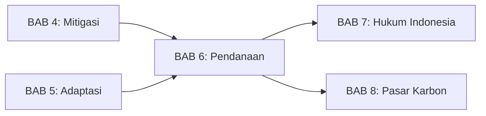
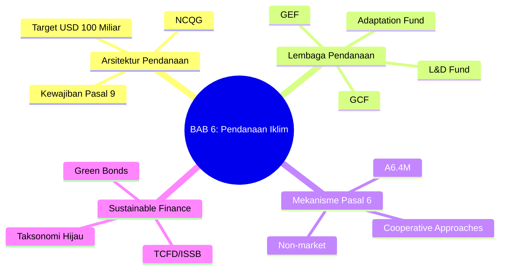
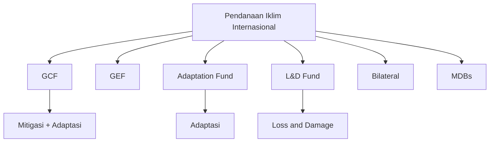
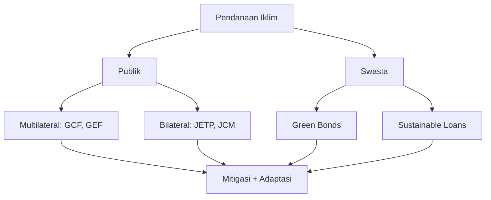

# BAB 6: Pendanaan dan Mekanisme Iklim

---

## A. PENDAHULUAN

### 1. Capaian Pembelajaran (Sub-CPMK)

Setelah mempelajari bab ini, mahasiswa mampu:

1. **Menjelaskan** arsitektur pendanaan iklim internasional dan sumber-sumber pendanaan
2. **Menganalisis** mekanisme kerjasama Pasal 6 Persetujuan Paris
3. **Mengevaluasi** perkembangan keuangan berkelanjutan (*sustainable finance*) dan implikasinya
4. **Mengidentifikasi** tantangan dan peluang pendanaan iklim untuk Indonesia

### 2. Indikator Pencapaian

- [ ] Mahasiswa dapat mengidentifikasi lembaga-lembaga pendanaan iklim internasional utama
- [ ] Mahasiswa dapat membedakan mekanisme Pasal 6.2 dan 6.4
- [ ] Mahasiswa dapat menjelaskan konsep taksonomi hijau dan *green bonds*
- [ ] Mahasiswa dapat menganalisis akses Indonesia terhadap pendanaan iklim

### 3. Deskripsi Singkat

Aksi iklim memerlukan investasi triliunan dolar. Dari mana uang ini berasal dan bagaimana mengalirkannya ke tempat yang tepat? Bab ini akan mengajak Anda memahami arsitektur pendanaan iklim internasional, mekanisme pasar karbon di bawah Pasal 6, dan perkembangan keuangan berkelanjutan yang semakin penting dalam ekonomi global.

### 4. Hubungan dengan Bab Lain

Bab ini terkait erat dengan [[BAB 4 -- Kewajiban Mitigasi dalam Hukum Internasional --|BAB 4 (Mitigasi)]] dan [[BAB 5 -- Hukum Adaptasi Perubahan Iklim --|BAB 5 (Adaptasi)]] karena pendanaan diperlukan untuk kedua upaya tersebut, serta menjadi fondasi untuk [[BAB 8 -- Nilai Ekonomi Karbon dan Bursa Karbon --|BAB 8 tentang Pasar Karbon Indonesia]].

### 5. Peta Konsep Bab

---

## B. PENYAJIAN MATERI

### 1. Pendanaan Iklim dalam Rezim Internasional

Pendanaan iklim (*climate finance*) adalah pilar krusial dalam rezim iklim internasional. Transisi ke ekonomi rendah karbon memerlukan investasi dalam skala yang belum pernah terjadi sebelumnya: Badan Energi Internasional (IEA) memperkirakan bahwa investasi tahunan dalam energi bersih harus mencapai USD 4 triliun pada 2030 untuk mencapai *net zero* pada 2050.[^1] Sementara itu, IPCC mengestimasi kebutuhan adaptasi negara berkembang berkisar USD 127-295 miliar per tahun pada 2030.[^2] Tanpa mobilisasi sumber daya yang memadai, komitmen mitigasi dan adaptasi dalam Persetujuan Paris tidak akan dapat direalisasikan.

[^1]: IEA, *World Energy Outlook 2023* (IEA 2023) 145.
[^2]: IPCC, *Climate Change 2022: Impacts, Adaptation and Vulnerability* (Cambridge University Press 2022) Ch 17, 2489.

#### 1.1 Kewajiban Pendanaan dalam Persetujuan Paris

Pasal 9 Persetujuan Paris menegaskan kewajiban pendanaan negara maju kepada negara berkembang, meskipun dengan bahasa yang lebih fleksibel dibandingkan Protokol Kyoto. Paragraf pertama menyatakan:

> "Developed country Parties shall provide financial resources to assist developing country Parties with respect to both mitigation and adaptation in continuation of their existing obligations under the Convention."[^3]

Kata "*shall*" menunjukkan sifat wajib, namun tidak ada angka target yang mengikat secara hukum dalam teks Pasal 9 itu sendiri. Berbeda dengan UNFCCC yang menetapkan kewajiban spesifik bagi negara Annex II, Persetujuan Paris menggunakan pendekatan yang lebih nuansa.[^4]

Beberapa elemen penting dalam arsitektur pendanaan Pasal 9 meliputi:

**Pertama, prinsip diferensiasi**: Negara maju memiliki kewajiban hukum (*shall*) untuk menyediakan pendanaan, sementara negara lain hanya "didorong" (*encouraged*) untuk berkontribusi secara sukarela. Ini mencerminkan prinsip CBDR-RC yang mengakui tanggung jawab historis negara maju.[^5]

**Kedua, keseimbangan mitigasi-adaptasi**: Pasal 9.4 menekankan kebutuhan keseimbangan antara pendanaan mitigasi dan adaptasi, merespons kritik bahwa pendanaan iklim historis sangat condong ke mitigasi (80% vs 20% untuk adaptasi).[^6]

**Ketiga, prinsip progresi**: Pasal 9.3 mewajibkan upaya pendanaan "represent a progression beyond previous efforts," artinya pendanaan harus terus meningkat dari waktu ke waktu—tidak boleh stagnasi atau menurun.[^7]

**Keempat, transparansi**: Negara maju wajib melaporkan informasi kuantitatif dan kualitatif tentang pendanaan yang disediakan dan dimobilisasi melalui *biennial communications* (Pasal 9.5).[^8]

[^3]: Paris Agreement (adopted 12 December 2015, entered into force 4 November 2016) art 9.1.
[^4]: Bodansky D, Brunnée J and Rajamani L, *International Climate Change Law* (Oxford University Press 2017) 229-235.
[^5]: ibid 230.
[^6]: Adaptation Gap Report 2023 (UNEP 2023) 18.
[^7]: Paris Agreement (n 3) art 9.3.
[^8]: ibid art 9.5.

#### 1.2 Target USD 100 Miliar: Janji dan Realitas

Pada COP15 Kopenhagen (2009), negara maju berkomitmen untuk "memobilisasi bersama USD 100 miliar per tahun pada 2020" untuk mendukung aksi iklim negara berkembang.[^9] Angka ini bukan berasal dari analisis kebutuhan yang sistematis, melainkan hasil negosiasi politik yang mencerminkan apa yang dipandang "realistis" oleh negara maju pada saat itu.

Target ini menjadi simbol politik penting dalam negosiasi iklim. Bagi negara berkembang, USD 100 miliar adalah batas minimum komitmen serius; bagi negara maju, ini adalah ceiling yang merefleksikan kemampuan fiskal. Persetujuan Paris kemudian memperpanjang target ini hingga 2025 dan mengamanatkan penetapan target baru untuk periode selanjutnya.[^10]

Pencapaian target ini menjadi kontroversi berkelanjutan. Menurut OECD, target USD 100 miliar baru tercapai pada 2022—dua tahun lebih lambat dari komitmen.[^11] Namun, angka OECD ini diperdebatkan tajam oleh negara berkembang dan organisasi masyarakat sipil.

Kritik utama berkaitan dengan metodologi penghitungan: sebagian besar pendanaan yang dilaporkan berbentuk **pinjaman** (70%), bukan hibah yang sesungguhnya mentransfer sumber daya tanpa beban utang.[^12] Lebih problematik lagi, banyak pinjaman diberikan dengan suku bunga mendekati pasar (*near-market rate*), sehingga "pendanaan iklim" sebenarnya menambah beban utang negara berkembang. Studi Oxfam menyebutkan bahwa nilai riil bantuan iklim ("climate-specific net assistance") mungkin hanya USD 21-24,5 miliar per tahun—jauh di bawah angka yang dilaporkan.[^13]

[^9]: Copenhagen Accord (18 December 2009) FCCC/CP/2009/L.7, para 8.
[^10]: Paris Agreement (n 3) art 9.3 dan Decision 1/CP.21, para 53.
[^11]: OECD, *Climate Finance Provided and Mobilised by Developed Countries in 2013-2022* (OECD 2023) 3.
[^12]: ibid 22.
[^13]: Oxfam, *Climate Finance Shadow Report 2023* (Oxfam International 2023) 4.

#### 1.3 New Collective Quantified Goal (NCQG)

Persetujuan Paris mengamanatkan bahwa sebelum 2025, COP harus menetapkan target pendanaan baru yang lebih ambisius, dikenal sebagai *New Collective Quantified Goal* (NCQG).[^14] Negosiasi NCQG berlangsung alot selama beberapa tahun karena perbedaan fundamental antara negara maju dan berkembang mengenai: (1) besaran target, (2) definisi pendanaan iklim, (3) basis kontributor, dan (4) keseimbangan mitigasi-adaptasi.

COP29 di Baku (2024) akhirnya menyepakati NCQG dengan target USD 300 miliar per tahun pada 2035.[^15] Keputusan ini disambut dengan kekecewaan oleh banyak negara berkembang yang mengharapkan target USD 1 triliun atau lebih, sesuai dengan estimasi kebutuhan riil dari berbagai studi ilmiah.

Beberapa elemen kunci NCQG Baku:

- **Kuantitas**: USD 300 miliar per tahun pada 2035, meningkat dari baseline USD 100 miliar
- **Kontributor**: Tetap fokus pada negara maju sebagai sumber utama, dengan "dorongan" bagi negara lain untuk berkontribusi sukarela
- **Kualitas**: Penekanan pada peningkatan hibah dan pinjaman konsesional, serta keseimbangan mitigasi-adaptasi
- **Review**: Evaluasi berkala untuk mempertimbangkan peningkatan target

Kritik utama terhadap NCQG Baku adalah kesenjangan dengan kebutuhan riil. Berbagai studi menunjukkan bahwa negara berkembang membutuhkan USD 1-2,4 triliun per tahun untuk transisi rendah karbon dan adaptasi yang memadai.[^16] Dengan demikian, NCQG USD 300 miliar hanya memenuhi 12-30% dari kebutuhan—menimbulkan pertanyaan serius tentang keseriusan negara maju dalam memenuhi tanggung jawab historisnya.

[^14]: Paris Agreement (n 3) art 9.3.
[^15]: Decision -/CMA.6, *New collective quantified goal on climate finance* (COP29 Baku, November 2024).
[^16]: Standing Committee on Finance, *First Report on the Determination of the Needs of Developing Country Parties* (UNFCCC 2021) Executive Summary

---

### 2. Arsitektur Kelembagaan Pendanaan Iklim

Pendanaan iklim internasional disalurkan melalui serangkaian lembaga multilateral dengan mandat, struktur tata kelola, dan fokus yang berbeda-beda. Arsitektur ini telah berkembang sejak 1990-an dan terus bertransformasi seiring dinamika negosiasi iklim. Memahami landscape kelembagaan ini penting bagi praktisi hukum dan pembuat kebijakan untuk mengidentifikasi sumber pendanaan yang tepat dan memenuhi persyaratan akses masing-masing lembaga.[^17]

[^17]: Buchner B and others, *Global Landscape of Climate Finance 2023* (Climate Policy Initiative 2023) 10-15.

#### 2.1 Green Climate Fund (GCF)

**Green Climate Fund** (GCF) adalah mekanisme pendanaan iklim multilateral terbesar yang beroperasi di bawah kerangka UNFCCC. Didirikan pada COP16 Cancún (2010) dan mulai beroperasi penuh pada 2015, GCF berbasis di Incheon, Korea Selatan.[^18] Kehadirannya menjawab kebutuhan negara berkembang akan mekanisme pendanaan yang lebih besar dan lebih inklusif dibandingkan GEF yang ada sebelumnya.

Mandat GCF mencakup pendanaan baik mitigasi maupun adaptasi, dengan komitmen unik untuk mengalokasikan setidaknya 50% sumber daya ke adaptasi—merespons kritik bahwa pendanaan iklim historis terlalu condong ke mitigasi.[^19] GCF juga berkomitmen mengalokasikan minimal 50% dana adaptasinya untuk negara-negara paling rentan: negara kurang berkembang (LDCs), negara pulau kecil (SIDS), dan negara-negara Afrika.

Struktur tata kelola GCF dirancang untuk keseimbangan antara negara maju dan berkembang. Dewan GCF terdiri dari 24 anggota: 12 dari negara maju dan 12 dari negara berkembang, dengan pengambilan keputusan berbasis konsensus.[^20] Ini berbeda dari lembaga Bretton Woods dimana kekuatan suara ditentukan oleh kontribusi finansial.

Akses pendanaan GCF dapat melalui dua jalur. Pertama, **akses tidak langsung** melalui entitas internasional terakreditasi seperti UNDP, World Bank, atau ADB. Kedua, **akses langsung** (*direct access*) melalui entitas nasional atau regional yang terakreditasi. Indonesia memiliki PT Sarana Multi Infrastruktur (SMI) sebagai entitas akreditasi nasional, memungkinkan pengajuan proposal langsung tanpa perantara internasional.[^21]

Hingga 2024, GCF telah mengapprove lebih dari USD 13 miliar untuk 243 proyek di seluruh dunia. Di Indonesia, proyek-proyek yang didanai GCF meliputi pengembangan geotermal Rantau Dedap, program REDD+ dan restorasi gambut Kalimantan, serta pembangunan ketahanan pesisir di Jawa Tengah—mencerminkan keragaman pendekatan mitigasi dan adaptasi.[^22]

[^18]: Decision 1/CP.16, *The Cancun Agreements* (UNFCCC 2010) para 102.
[^19]: GCF, *Governing Instrument for the Green Climate Fund* (2011) para 50.
[^20]: ibid para 9-11.
[^21]: GCF, *Accredited Entities: Direct Access* <https://www.greenclimate.fund/accredited-entities/direct-access> diakses 15 November 2025.
[^22]: GCF, *Indonesia Country Profile* (GCF 2024) 1-5.

#### 2.2 Global Environment Facility (GEF)

**Global Environment Facility** (GEF) adalah mekanisme pendanaan lingkungan tertua dalam sistem PBB, didirikan bersamaan dengan KTT Bumi Rio 1992. GEF berfungsi sebagai mekanisme keuangan operasional untuk beberapa konvensi lingkungan multilateral, termasuk UNFCCC, Konvensi Keanekaragaman Hayati, dan Konvensi Desertifikasi.[^23]

Berbeda dengan GCF yang fokus pada iklim, GEF memiliki mandat lintas-isu yang memungkinkan pendanaan proyek dengan *co-benefits* berganda. Misalnya, proyek restorasi mangrove dapat memenuhi tujuan iklim (sekuestrasi karbon, adaptasi pesisir), biodiversitas (habitat), dan degradasi lahan sekaligus. Pendekatan terintegrasi ini menjadi nilai tambah GEF dalam lanskap pendanaan.[^24]

GEF beroperasi melalui siklus replenishment empat tahunan, dengan GEF-8 (2022-2026) mengamanatkan USD 5,33 miliar untuk berbagai fokus area termasuk perubahan iklim.[^25] Struktur tata kelola GEF melibatkan Dewan yang merepresentasikan 32 konstituen, dengan World Bank sebagai trustee.

Untuk Indonesia, GEF telah mendanai berbagai proyek strategis termasuk National Communications ke UNFCCC, peningkatan kapasitas inventarisasi GRK, dan program konservasi dengan dimensi iklim.

[^23]: GEF, *Instrument for the Establishment of the Restructured Global Environment Facility* (2019) para 2.
[^24]: Streck C, 'Financing REDD+: Linking Climate Finance to Forest Conservation' (2021) 11 Climate Law 180, 185.
[^25]: GEF, *Summary of Negotiations of the Eighth Replenishment of the GEF Trust Fund* (2022) 3.

#### 2.3 Adaptation Fund

**Adaptation Fund** (AF) adalah lembaga pertama dalam rezim iklim yang secara eksklusif mendanai adaptasi—mengisi kesenjangan penting mengingat bias historis pendanaan ke mitigasi. Dibentuk di bawah Protokol Kyoto pada 2001 dan mulai beroperasi 2008, AF memiliki dua inovasi signifikan.

Pertama, **sumber pendanaan inovatif**: AF awalnya didanai dari 2% *share of proceeds* setiap transaksi di bawah Clean Development Mechanism (CDM)—menciptakan mekanisme pendanaan otomatis yang tidak bergantung pada keputusan penganggaran tahunan negara maju.[^26] Di bawah Paris Agreement, mekanisme serupa diterapkan pada Article 6.4 Mechanism dengan kontribusi lebih besar (5%).

Kedua, **akses langsung pionir**: AF adalah lembaga pertama yang memperkenalkan modalitas *direct access*, memungkinkan entitas nasional di negara berkembang mengakses pendanaan tanpa perantara internasional. Model ini kemudian diadopsi oleh GCF.[^27]

Dengan skala lebih kecil dibanding GCF (total kumulatif sekitar USD 1 miliar), AF berfokus pada proyek adaptasi berbasis komunitas di negara-negara rentan.

[^26]: Kyoto Protocol to the United Nations Framework Convention on Climate Change (adopted 11 December 1997, entered into force 16 February 2005) 2303 UNTS 162, art 12.8.
[^27]: Adaptation Fund, *Results and Lessons from the Pilot Programme for National Implementing Entities* (AF 2017) 5-8.

#### 2.4 Loss and Damage Fund

Lembaga terbaru dalam arsitektur pendanaan iklim adalah **Fund for responding to Loss and Damage**, yang disepakati pada COP27 Sharm el-Sheikh (2022) dan dioperasionalisasikan pada COP28 Dubai (2023). Pembentukan dana ini adalah pencapaian bersejarah bagi negara-negara rentan yang selama tiga dekade memperjuangkan pengakuan atas kerugian dan kerusakan akibat dampak iklim yang melampaui kapasitas adaptasi.[^28]

Fund ini dihosting sementara oleh World Bank dengan pengaturan tata kelola yang masih berkembang. Pledges awal dari berbagai negara mencapai sekitar USD 700 juta—jauh dari estimasi kebutuhan USD 100-580 miliar per tahun untuk loss and damage.[^29] Namun demikian, keberadaan fund ini menandai pergeseran paradigma penting: pengakuan formal bahwa negara-negara berkontributor emisi historis memiliki tanggung jawab atas dampak yang tidak dapat dimitigasi atau diadaptasi.

[^28]: Decision 2/CMA.4, *Funding arrangements for responding to loss and damage* (COP27 2022).
[^29]: L&D Collaboration, *The Loss and Damage Finance Landscape* (2023) 12.

**Gambar 6.1.** Arsitektur kelembagaan pendanaan iklim

---

### 3. Mekanisme Pasal 6 Persetujuan Paris

Pasal 6 Persetujuan Paris adalah salah satu ketentuan paling kompleks dan diperdebatkan dalam negosiasi iklim. Finalisasi aturan implementasinya memerlukan enam tahun—dari adopsi Paris Agreement (2015) hingga kesepakatan "rulebook" di Glasgow (2021).[^30] Ketentuan ini menyediakan kerangka untuk kerjasama internasional dalam mitigasi, memungkinkan negara-negara mencapai target NDC secara lebih efisien biaya melalui berbagai mekanisme kerjasama.

Filosofi di balik Pasal 6 adalah bahwa gas rumah kaca bersifat global—pengurangan emisi di satu lokasi memiliki manfaat iklim yang sama dengan pengurangan di tempat lain. Dengan demikian, mekanisme fleksibel memungkinkan modal mengalir ke tempat pengurangan emisi paling murah, meningkatkan efisiensi agregat aksi iklim global.[^31]

[^30]: Decision 3/CMA.3, *Rules, modalities and procedures for the mechanism established by Article 6, paragraph 4, of the Paris Agreement* (COP26 Glasgow 2021).
[^31]: Marcu A, 'Governance of Article 6 of the Paris Agreement and Lessons Learned' (2021) 11 Climate Law 203, 205-210.

#### 3.1 Pasal 6.2: *Cooperative Approaches*

Pasal 6.2 menetapkan kerangka untuk **kerjasama bilateral atau plurilateral** antara negara-negara dalam pencapaian NDC. Berbeda dengan mekanisme terpusat seperti CDM, Pasal 6.2 memberikan fleksibilitas tinggi kepada negara untuk merancang modalitas kerjasama sesuai kebutuhan masing-masing.

Konsep inti dalam Pasal 6.2 adalah **Internationally Transferred Mitigation Outcomes** (ITMOs)—hasil mitigasi yang dapat ditransfer antarnegara untuk digunakan dalam pencapaian NDC.[^32] ITMOs tidak harus dalam bentuk "kredit karbon" tradisional; bisa berupa unit pengurangan emisi, energi terbarukan yang dihasilkan, atau metrik lain yang disepakati para pihak.

Karakteristik fundamental Pasal 6.2 meliputi:

**Desentralisasi**: Tidak ada badan pengawas sentral yang mengotorisasi proyek atau menetapkan metodologi. Para pihak yang terlibat menentukan sendiri persyaratan teknis dan prosedural, dengan UNFCCC Secretariat hanya berfungsi sebagai *registry* sentral untuk mencatat transaksi.[^33]

**Corresponding Adjustments**: Untuk menjaga integritas lingkungan dan mencegah *double counting*, setiap transfer ITMO **wajib** disertai penyesuaian koresponding. Jika Indonesia mentransfer 1 juta ton CO₂e ke Jepang, Indonesia harus menambahkan jumlah yang sama ke emisi yang dilaporkan (atau mengurangi kredit dari target NDC), sementara Jepang dapat mengklaim pengurangan tersebut.[^34] Tanpa mekanisme ini, pengurangan emisi yang sama akan dihitung dua kali, menggagalkan tujuan Paris Agreement.

**Pelaporan dan Transparansi**: Para pihak wajib melaporkan transaksi ITMOs secara berkala melalui kerangka transparansi yang diperkuat (Enhanced Transparency Framework) di bawah Pasal 13.[^35]

Indonesia dan Jepang memiliki pengalaman panjang kerjasama bilateral melalui **Joint Crediting Mechanism** (JCM) yang telah beroperasi sejak 2013. JCM menyediakan kerangka untuk proyek-proyek pengurangan emisi di Indonesia yang hasilnya dapat diklaim Jepang untuk NDC-nya. Dengan finalisasi aturan Pasal 6.2, JCM dapat diintegrasikan ke dalam kerangka Paris Agreement dengan penerapan corresponding adjustments.[^36]

[^32]: Paris Agreement (n 3) art 6.2.
[^33]: Decision 2/CMA.3, *Guidance on cooperative approaches referred to in Article 6, paragraph 2* (COP26 Glasgow 2021) para 4.
[^34]: ibid paras 7-12.
[^35]: ibid para 18.
[^36]: Ministry of Environment Japan, *Joint Crediting Mechanism (JCM): For decarbonization of the world and sustainable development* (2023) 8-12.

#### 3.2 Pasal 6.4: Mekanisme Pasar Multilateral (A6.4M)

Jika Pasal 6.2 menyediakan kerangka desentralisasi, Pasal 6.4 membangun **mekanisme pasar terpusat** di bawah otoritas Conference of the Parties serving as the meeting of the Parties to the Paris Agreement (CMA). Mekanisme ini—sering disebut **Article 6.4 Mechanism** (A6.4M) atau "Sustainable Development Mechanism"—adalah penerus spiritual Clean Development Mechanism (CDM), namun dengan arsitektur dan standar yang berbeda secara signifikan.[^37]

**Supervisory Body**: A6.4M diawasi oleh badan pengawas tersendiri (*Supervisory Body*) yang bertanggung jawab menetapkan metodologi, mengakreditasi entitas operasional, mendaftarkan proyek, dan menerbitkan kredit. Ini menciptakan infrastruktur pasar karbon yang terstandarisasi secara global.[^38]

**Partisipan Universal**: Berbeda dengan CDM yang hanya memungkinkan proyek di negara Non-Annex I dengan kredit digunakan negara Annex I, A6.4M terbuka untuk semua Pihak Paris Agreement. Ini merefleksikan pergeseran paradigma dari dikotomi maju-berkembang ke pendekatan universal dengan diferensiasi berbasis kapasitas.[^39]

**Overall Mitigation in Global Emissions (OMGE)**: Inovasi penting A6.4M adalah kewajiban kontribusi pada **mitigasi keseluruhan emisi global**. Minimal 2% kredit yang diterbitkan harus dibatalkan (*cancelled*) dan tidak digunakan oleh pihak manapun—memastikan bahwa mekanisme ini memberikan benefit lingkungan netto, bukan sekadar memindahkan emisi.[^40]

**Share of Proceeds**: A6.4M mewajibkan 5% dari kredit yang diterbitkan dialokasikan ke Adaptation Fund—lebih tinggi dari 2% di bawah CDM—menciptakan sumber pendanaan adaptasi yang otomatis dan berkelanjutan.[^41]

| Aspek | CDM (Kyoto) | A6.4M (Paris) |
|-------|-------------|---------------|
| Pengawasan | CDM Executive Board | Article 6.4 Supervisory Body |
| Partisipan | Annex I ↔ Non-Annex I | Semua Pihak Paris |
| Baseline | Proyek-spesifik | Lebih ketat, di bawah BAU |
| *Share of proceeds* | 2% ke Adaptation Fund | 5% ke Adaptation Fund |
| *Overall mitigation* | Tidak ada | Wajib 2% pembatalan kredit |
| Transisi CDM | — | Aktivitas CDM dapat transisi dengan persyaratan |

**Tabel 6.2.** Perbandingan CDM dan A6.4 Mechanism

Status implementasi A6.4M masih dalam tahap pengembangan. Supervisory Body baru mulai mengadopsi metodologi dan prosedur pada 2023-2024, dengan ekspektasi transaksi pertama pada 2025-2026.[^42]

[^37]: Paris Agreement (n 3) art 6.4.
[^38]: Decision 3/CMA.3 (n 30) paras 20-26.
[^39]: ibid para 1(d).
[^40]: ibid para 36.
[^41]: ibid para 37.
[^42]: Article 6.4 Supervisory Body, *Annual Report 2023* (UNFCCC 2024) 5-8.

#### 3.3 Pasal 6.8: *Non-Market Approaches*

Tidak semua kerjasama iklim harus berbasis pasar. Pasal 6.8 mengakui pentingnya **pendekatan non-pasar** (*non-market approaches*) untuk mempromosikan ambisi mitigasi dan adaptasi secara holistik dan terintegrasi.[^43]

Framework UNFCCC untuk pendekatan non-pasar mencakup berbagai modalitas kerjasama yang tidak melibatkan perdagangan kredit karbon: transfer teknologi, peningkatan kapasitas (*capacity building*), pendanaan hibah, dan berbagi pengetahuan. Pendekatan ini menekankan kerjasama berbasis solidaritas daripada transaksi komersial.

Para pendukung pendekatan non-pasar—terutama dari koalisi ALBA dan negara-negara berkembang tertentu—berpendapat bahwa mekanisme pasar memiliki keterbatasan inheren: mereka dapat mengalihkan tanggung jawab mitigasi dari negara maju ke negara berkembang, menciptakan masalah integritas lingkungan, dan mekomodifikasi alam dengan cara yang bermasalah secara etis.[^44]

Dalam praktik, pendekatan non-pasar beroperasi melalui berbagai kerangka yang sudah ada: South-South cooperation, transfer teknologi di bawah Technology Mechanism UNFCCC, dan program capacity building multilateral dan bilateral. Pasal 6.8 memberikan pengakuan formal dan potensi untuk memperkuat modalitas-modalitas ini dalam arsitektur Paris Agreement.

[^43]: Paris Agreement (n 3) art 6.8.
[^44]: Lövbrand E and others, 'Contesting Carbon Markets: A Critical Review' (2015) 6 Wiley Interdisciplinary Reviews: Climate Change 219, 225-230.

> [!tip] **Kotak Pengayaan: *Corresponding Adjustments* dan Integritas Lingkungan**
> *Corresponding adjustments* adalah mekanisme akuntansi krusial untuk mencegah *double counting*—situasi di mana hasil mitigasi yang sama diklaim oleh dua negara berbeda.
>
> **Contoh**: Jika Indonesia menjual 1 juta ton CO₂e ke Jepang melalui proyek solar panel, Indonesia harus menambahkan 1 juta ton ke emisi yang dilaporkan (atau mengurangi klaim pengurangan dari target NDC-nya), sementara Jepang dapat mengklaim pengurangan tersebut.
>
> Tanpa mekanisme ini, kedua negara akan mengklaim pengurangan yang sama—menciptakan ilusi bahwa 2 juta ton dikurangi padahal hanya 1 juta ton. Target global Paris Agreement akan gagal tercapai karena akuntansi yang tidak akurat.

---

### 4. Keuangan Berkelanjutan (*Sustainable Finance*)

Pendanaan publik—meskipun penting—tidak akan pernah cukup untuk memenuhi kebutuhan transisi iklim global. Dengan estimasi kebutuhan triliunan dolar per tahun, sektor keuangan swasta harus memainkan peran sentral. Inilah mengapa **keuangan berkelanjutan** (*sustainable finance*) muncul sebagai pilar kritis dalam arsitektur pendanaan iklim, dengan perkembangan regulasi yang pesat di berbagai yurisdiksi.[^45]

Keuangan berkelanjutan mengintegrasikan pertimbangan lingkungan, sosial, dan tata kelola (ESG) ke dalam keputusan investasi dan pembiayaan. Ini bukan sekadar "berbuat baik"—ada bukti bahwa perusahaan dengan kinerja ESG kuat cenderung memiliki risiko lebih rendah dan kinerja keuangan jangka panjang lebih baik.[^46] Dengan demikian, keuangan berkelanjutan selaras dengan kepentingan fiduciary investor.

[^45]: Smits R (ed), *Sustainable Finance and Climate Change: Law and Regulation* (Edward Elgar 2024) 1-15.
[^46]: Friede G, Busch T and Bassen A, 'ESG and Financial Performance: Aggregated Evidence from More than 2000 Empirical Studies' (2015) 5 Journal of Sustainable Finance & Investment 210, 222.

#### 4.1 Taksonomi Hijau (*Green Taxonomy*)

Tantangan fundamental dalam keuangan berkelanjutan adalah mendefinisikan apa yang memenuhi syarat sebagai "hijau" atau "berkelanjutan." Tanpa definisi yang jelas, klaim keberlanjutan dapat menjadi arbitrer, membuka ruang untuk *greenwashing*—praktik membuat klaim lingkungan yang menyesatkan. Di sinilah **taksonomi hijau** menjadi krusial: sistem klasifikasi yang mendefinisikan aktivitas ekonomi mana yang dapat dianggap berkelanjutan secara lingkungan.[^47]

**EU Taxonomy** adalah standar taksonomi paling komprehensif saat ini. Ditetapkan melalui Regulation (EU) 2020/852, EU Taxonomy menetapkan kriteria teknis per sektor untuk menentukan apakah suatu aktivitas: (a) memberikan kontribusi substansial pada minimal satu tujuan lingkungan; (b) tidak merugikan tujuan lingkungan lainnya (*do no significant harm*); dan (c) memenuhi jaminan sosial minimum.[^48]

Enam tujuan lingkungan EU Taxonomy meliputi: mitigasi perubahan iklim, adaptasi perubahan iklim, penggunaan air berkelanjutan, ekonomi sirkular, pencegahan polusi, dan perlindungan ekosistem. Aktivitas ekonomi dinilai terhadap kriteria teknis spesifik—misalnya, pembangkit listrik dianggap "hijau" untuk mitigasi hanya jika emisinya di bawah 100 gCO₂e/kWh.[^49]

**ASEAN Taxonomy for Sustainable Finance** mengambil pendekatan berbeda yang lebih sesuai dengan kondisi Asia Tenggara. Alih-alih kategorisasi biner (hijau/tidak hijau), ASEAN Taxonomy menggunakan sistem "traffic light" dengan lima kategori: hijau, hijau muda, kuning, merah, dan merah tua—memungkinkan pengakuan atas aktivitas transisi yang penting bagi negara-negara berkembang.[^50]

Indonesia mengembangkan **Taksonomi Keuangan Berkelanjutan Indonesia** (TKBI) melalui OJK pada 2022. TKBI mengadopsi pendekatan tiga-warna: **Hijau** (aktivitas yang berkontribusi substansial pada tujuan lingkungan), **Kuning** (aktivitas transisi yang bergerak menuju keberlanjutan), dan **Merah** (aktivitas yang tidak sesuai dengan tujuan lingkungan).[^51] Klasifikasi ini memberikan panduan bagi lembaga keuangan dalam mengalokasikan pembiayaan dan melaporkan portofolio berkelanjutan mereka.

Implikasi hukum taksonomi sangat signifikan. Di EU, lembaga keuangan besar wajib melaporkan proporsi aset yang *taxonomy-aligned*. Investor institusi wajib mengungkapkan bagaimana pertimbangan ESG diintegrasikan dalam keputusan investasi. Ketidakpatuhan dapat mengakibatkan sanksi regulatori dan risiko reputasi.[^52]

[^47]: Regulation (EU) 2020/852 on the establishment of a framework to facilitate sustainable investment [2020] OJ L198/13, art 3.
[^48]: ibid arts 3-9.
[^49]: Commission Delegated Regulation (EU) 2021/2139 supplementing Regulation (EU) 2020/852 [2021] OJ L442/1, Annex I.
[^50]: ASEAN Taxonomy Board, *ASEAN Taxonomy for Sustainable Finance: Version 2* (2023) 15-20.
[^51]: OJK, *Taksonomi Keuangan Berkelanjutan Indonesia* (Edisi 1.0, 2022) 8-12.
[^52]: Armour J and others, 'ESG Disclosure and Corporate Governance' in Gordon JN and Ringe W-G (eds), *The Oxford Handbook of Corporate Law and Governance* (2nd edn, Oxford University Press 2024) 892.

#### 4.2 *Green Bonds* dan Instrumen Keuangan Berkelanjutan

Pertumbuhan instrumen keuangan berkelanjutan dalam dekade terakhir sangat pesat. Pasar **green bonds** global—yang hampir tidak ada pada 2010—telah mencapai penerbitan kumulatif lebih dari USD 2 triliun pada 2023.[^53] Instrumen-instrumen ini menjadi jembatan antara kebutuhan pendanaan proyek iklim dan modal investor yang mencari return finansial sekaligus dampak lingkungan positif.

| Instrumen | Deskripsi | Karakteristik Kunci |
|-----------|-----------|---------------------|
| **Green bonds** | Obligasi dengan dana untuk proyek lingkungan | *Use of proceeds* terikat pada proyek hijau spesifik |
| **Sustainability bonds** | Kombinasi tujuan lingkungan dan sosial | Fleksibilitas lebih besar dalam penggunaan dana |
| **Transition bonds** | Untuk sektor "kotor" yang bertransisi | Mengakui pathway dekarbonisasi sektor high-emitting |
| **Sustainability-linked bonds/loans** | Kupon/suku bunga terkait kinerja ESG | *Use of proceeds* tidak terikat; kinerja yang diikat |

**Tabel 6.3.** Instrumen keuangan berkelanjutan

Pembeda utama adalah antara instrumen ***use of proceeds*** (green bonds, sustainability bonds) dan ***sustainability-linked*** instruments. Yang pertama mengikat penggunaan dana pada proyek-proyek spesifik—misalnya pembangunan solar farm. Yang kedua memberikan fleksibilitas penggunaan dana namun mengikat struktur keuangan (kupon, suku bunga) pada pencapaian target ESG terukur—misalnya pengurangan emisi perusahaan 30% pada 2030.[^54]

Indonesia menjadi pionir dalam **sovereign green sukuk**—obligasi syariah negara untuk proyek lingkungan. Penerbitan pertama pada 2018 sebesar USD 1,25 miliar menjadikan Indonesia negara pertama di dunia yang menerbitkan green sukuk sovereign.[^55] Dana tersebut dialokasikan untuk proyek energi terbarukan, transportasi berkelanjutan, pengelolaan limbah, dan bangunan hijau. Kerangka penerbitan mengacu pada Green Bond Principles ICMA dan Sustainability Awareness Bond Guidelines Indonesia.

Keberhasilan green sukuk Indonesia menunjukkan bahwa instrumen keuangan Islam dan keuangan berkelanjutan memiliki titik temu yang kuat. Prinsip syariah yang melarang gharar (ketidakpastian berlebihan) dan mengharuskan asset-backing selaras dengan transparansi dan akuntabilitas yang dituntut investor green bond.[^56]

[^53]: Climate Bonds Initiative, *Global State of the Market Report 2023* (CBI 2024) 3.
[^54]: International Capital Market Association, *Sustainability-Linked Bond Principles* (ICMA 2023) 2-5.
[^55]: Ministry of Finance Indonesia, *Green Bond and Green Sukuk Framework* (2018) 1.
[^56]: Tahiri Jouti A, 'Islamic Finance and Sustainable Development Goals' in Ali SN (ed), *Routledge Handbook of Islamic Finance and Investment* (Routledge 2023) 401.

#### 4.3 Disclosure dan Pelaporan Iklim

Transisi ke ekonomi rendah karbon membawa **risiko keuangan** yang material bagi investor dan perusahaan. Risiko fisik (*physical risks*) dari dampak iklim—banjir, kekeringan, badai—dapat merusak aset dan mengganggu operasi. Risiko transisi (*transition risks*) dari perubahan kebijakan, teknologi, atau preferensi konsumen dapat membuat aset tertentu *stranded*.[^57] Transparansi tentang eksposur terhadap risiko-risiko ini menjadi kebutuhan investor dan keharusan regulatori.

**Task Force on Climate-related Financial Disclosures** (TCFD), yang dibentuk oleh Financial Stability Board pada 2015, mengembangkan kerangka disclosure yang menjadi standar global de facto. TCFD merekomendasikan disclosure di empat area: (1) **Governance**—tata kelola risiko iklim di tingkat board dan manajemen; (2) **Strategy**—dampak risiko dan peluang iklim terhadap strategi bisnis; (3) **Risk Management**—proses identifikasi, penilaian, dan pengelolaan risiko iklim; dan (4) **Metrics and Targets**—metrik dan target yang digunakan untuk mengukur dan mengelola eksposur iklim.[^58]

Pada 2023, TCFD "diserap" ke dalam standar global baru yang diterbitkan oleh **International Sustainability Standards Board** (ISSB). IFRS S1 (Sustainability Disclosure) dan IFRS S2 (Climate-related Disclosures) menjadi standar global yang menggabungkan kerangka TCFD dengan konsistensi dan komparabilitas standar akuntansi IFRS.[^59] Standar ini mulai berlaku pada 2024 dan akan diadopsi secara mandatory di banyak yurisdiksi, termasuk—secara bertahap—di Indonesia.

Indonesia telah mengadopsi kerangka disclosure iklim melalui POJK 51/2017 tentang Keuangan Berkelanjutan, yang mewajibkan lembaga keuangan untuk menyusun rencana aksi keuangan berkelanjutan dan melaporkan implementasinya. OJK kemudian menerbitkan Pedoman Teknis TCFD untuk memandu implementasi disclosure risiko iklim.[^60]

> [!warning] **Perhatian: Risiko Greenwashing**
> Pertumbuhan pesat keuangan hijau membawa risiko *greenwashing*—praktik membuat klaim lingkungan yang menyesatkan atau berlebihan. Contoh termasuk: melebih-lebihkan dampak lingkungan produk investasi, menggunakan definisi "hijau" yang longgar, atau cherry-picking data positif.
>
> Regulasi seperti EU Taxonomy dan standar ISSB bertujuan mencegah greenwashing melalui definisi yang jelas, metodologi yang terstandarisasi, dan kewajiban verifikasi independen. Di Indonesia, OJK telah memperingatkan praktisi keuangan tentang potensi sanksi untuk klaim ESG yang menyesatkan.

[^57]: TCFD, *Recommendations of the Task Force on Climate-related Financial Disclosures* (FSB 2017) 5-8.
[^58]: ibid 14-24.
[^59]: ISSB, *IFRS S2: Climate-related Disclosures* (IFRS Foundation 2023) para 1.
[^60]: OJK, *Pedoman Teknis Task Force on Climate-related Financial Disclosures (TCFD)* (2023) 5-10.

---

### 5. Pendanaan Iklim untuk Indonesia

Indonesia menempati posisi unik dalam lanskap pendanaan iklim global. Sebagai negara berkembang dengan emisi terbesar keenam di dunia, Indonesia memiliki kebutuhan pendanaan iklim yang masif—sekaligus menjadi destinasi strategis bagi investor yang mencari *impact* pada skala material. Memahami arsitektur pendanaan iklim nasional dan tantangannya adalah krusial bagi praktisi hukum yang bergerak di bidang ini.[^61]

[^61]: Kementerian Keuangan dan Bappenas, *Indonesia's Needs Assessment for Climate Finance* (2023) 5-10.

#### 5.1 Kebutuhan dan Kesenjangan Pendanaan

Estimasi kebutuhan pendanaan iklim Indonesia sangat signifikan. Dokumen NDC Enhanced (2022) memperkirakan kebutuhan investasi **USD 285 miliar hingga 2030** untuk mencapai target mitigasi dengan dukungan internasional—rata-rata USD 35 miliar per tahun.[^62] Angka ini mencakup investasi di sektor energi, industri, transportasi, pertanian, dan kehutanan.

Di sisi adaptasi, kebutuhan tidak kalah besar. Studi Bappenas memperkirakan kebutuhan investasi adaptasi **USD 40-50 miliar per tahun** untuk membangun ketahanan terhadap dampak iklim—termasuk infrastruktur tahan iklim, sistem peringatan dini, dan adaptasi pertanian.[^63] Dengan 17.000 pulau dan 81.000 km garis pantai, kerentanan Indonesia terhadap kenaikan muka laut, perubahan pola hujan, dan kejadian ekstrem sangat tinggi.

Kesenjangan antara kebutuhan dan ketersediaan pendanaan sangat lebar. APBN hanya dapat menyediakan sekitar 10-15% dari kebutuhan total, menciptakan *financing gap* yang harus diisi oleh sumber internasional dan swasta.[^64] Ini menjadi konteks mengapa berbagai inisiatif pendanaan—JETP, JCM, green bonds—menjadi begitu penting.

[^62]: KLHK, *Indonesia: Enhanced Nationally Determined Contribution* (2022) para 4.
[^63]: Bappenas, *Climate Adaptation Investment Framework* (2021) 15-20.
[^64]: Climate Budget Tagging Indonesia, *Annual Report 2023* (Ministry of Finance 2024) 8.

#### 5.2 Arsitektur Pendanaan Iklim Nasional

Indonesia telah membangun arsitektur kelembagaan untuk mengelola dan menyalurkan pendanaan iklim dari berbagai sumber.

| Sumber | Contoh Mekanisme | Status & Tantangan |
|--------|------------------|---------------------|
| **APBN** | Climate Budget Tagging, Dana Perubahan Iklim | Terbatas; mainstreaming ke semua K/L masih dalam proses |
| **Multilateral** | GCF, GEF, World Bank, ADB | Aktif; prosedur kompleks, kapasitas absorpsi terbatas |
| **Bilateral** | JETP, JCM (Jepang), GIZ (Jerman) | Berkembang pesat; koordinasi menjadi tantangan |
| **Swasta domestik** | Green sukuk, sustainable loans perbankan | Tumbuh; kebutuhan taksonomi dan insentif lebih jelas |
| **Swasta asing** | FDI energi terbarukan, carbon credits | Potensial tinggi; hambatan regulatori masih ada |

**Tabel 6.4.** Sumber pendanaan iklim Indonesia

**Badan Pengelola Dana Lingkungan Hidup** (BPDLH) menjadi institusi kunci dalam arsitektur ini. Dibentuk berdasarkan PP 46/2017 dan diperkuat dengan PP 14/2021, BPDLH bertugas menghimpun, mengelola, dan menyalurkan dana lingkungan hidup dan kehutanan—termasuk dana perubahan iklim.[^65] BPDLH mengelola berbagai trust fund termasuk Indonesia Climate Change Trust Fund (ICCTF) dan dana REDD+ yang diterima dari Norway.

Konsep BPDLH sebagai **one-stop shop** untuk pendanaan lingkungan dimaksudkan untuk mengatasi fragmentasi yang selama ini menjadi kelemahan. Sebelumnya, dana iklim tersebar di berbagai kementerian dengan koordinasi minimal. Sentralisasi pengelolaan diharapkan meningkatkan efisiensi dan akuntabilitas.[^66]

Indonesia juga telah menerapkan **Climate Budget Tagging** (CBT) dalam APBN—sistem untuk mengidentifikasi dan melacak alokasi anggaran yang terkait iklim di seluruh kementerian/lembaga. CBT menjadi alat transparansi dan akuntabilitas sekaligus dasar untuk mengklaim *co-financing* domestik dalam proyek pendanaan internasional.[^67]

[^65]: Peraturan Pemerintah Nomor 14 Tahun 2021 tentang Perubahan atas Peraturan Pemerintah Nomor 46 Tahun 2017 tentang Instrumen Ekonomi Lingkungan Hidup, ps 35-40.
[^66]: BPDLH, *Strategic Plan 2020-2024* (2020) 8-12.
[^67]: Ministry of Finance, *Climate Budget Tagging: Indonesia's Experience* (2020) 3-8.

#### 5.3 Just Energy Transition Partnership (JETP)

Inisiatif pendanaan iklim paling signifikan untuk Indonesia dalam beberapa tahun terakhir adalah **Just Energy Transition Partnership** (JETP), yang diumumkan pada KTT G20 Bali pada November 2022. JETP merepresentasikan komitmen pendanaan sebesar **USD 20 miliar** dari International Partners Group (IPG)—koalisi negara maju termasuk AS, Jepang, Jerman, Prancis, dan UK—serta sektor swasta yang difasilitasi Glasgow Financial Alliance for Net Zero (GFANZ).[^68]

Tujuan JETP adalah mempercepat transisi energi Indonesia dengan target-target ambisius:
- **Peak emisi sektor ketenagalistrikan** pada 2030 (7 tahun lebih awal dari proyeksi BAU)
- **Pengurangan emisi sektor listrik** sebesar 290 juta ton CO₂e pada 2030
- **Peningkatan share energi terbarukan** menjadi 34% dalam bauran pembangkit pada 2030
- **Early retirement** PLTU batubara dengan pensiun dini dan penghentian pembangunan PLTU baru[^69]

Struktur pendanaan JETP mencakup kombinasi hibah, pinjaman konsesional, dan pembiayaan swasta. Dari komitmen USD 20 miliar, mayoritas berbentuk pembiayaan (*loans*) dengan berbagai tingkat konsesionalitas. Komponen hibah relatif kecil, menimbulkan pertanyaan tentang seberapa "baru" dan "tambahan" pendanaan ini dibandingkan aliran pendanaan yang sudah ada.[^70]

Implementasi JETP dikoordinasikan oleh Sekretariat yang melibatkan Kemenkeu, Kemen ESDM, dan Bappenas. Comprehensive Investment and Policy Plan (CIPP) yang diterbitkan November 2023 menjadi peta jalan implementasi dengan identifikasi proyek-proyek prioritas, kebutuhan kebijakan, dan timeline.[^71]

Tantangan JETP yang signifikan meliputi:

**Pertama, kapasitas absorpsi**: Menyerap USD 20 miliar dalam beberapa tahun memerlukan pipeline proyek yang bankable, kapasitas institusional untuk eksekusi, dan koordinasi antar-pemangku kepentingan yang kompleks.

**Kedua, ketegangan antara transisi dan keamanan energi**: Pensiun dini PLTU batubara harus diimbangi dengan kapasitas pengganti yang memadai. Tanpa itu, defisit listrik dapat menghambat pembangunan ekonomi.

**Ketiga, keadilan transisi**: PLTU batubara mempekerjakan ribuan pekerja dan menjadi sumber pendapatan daerah. Just transition memerlukan perlindungan sosial dan penciptaan mata pencaharian alternatif—aspek yang belum sepenuhnya dioperasionalisasikan.[^72]

[^68]: Joint Statement on Just Energy Transition Partnership (G20 Bali, 15 November 2022) para 3.
[^69]: Indonesia JETP Secretariat, *Comprehensive Investment and Policy Plan* (November 2023) 5-12.
[^70]: Global Energy Monitor, *Analysis of Indonesia JETP Financing* (2023) 8.
[^71]: CIPP (n 69) 15-30.
[^72]: Maulidia M and others, 'Just Transition in Indonesia's Coal Sector: Challenges and Pathways' (2024) 14 Climate Policy 312, 318-325.

> [!tip] **Kotak Pengayaan: Tantangan Akses dan Absorpsi Pendanaan**
> Indonesia menghadapi paradoks dalam pendanaan iklim: komitmen pendanaan tersedia, tetapi penyerapan (*disbursement*) sering terhambat. Faktor-faktor penyebab meliputi:
>
> 1. **Kapasitas proposal**: Menyiapkan proposal untuk GCF atau pendanaan multilateral memerlukan keahlian teknis tinggi dan biaya persiapan yang signifikan.
>
> 2. **Persyaratan fiduciary**: Standar akuntansi, pengadaan, dan safeguards lembaga internasional sering berbeda dengan sistem nasional.
>
> 3. **Koordinasi kelembagaan**: Fragmentasi kewenangan antar-kementerian menyulitkan program iklim yang bersifat lintas-sektoral.
>
> 4. **Pipeline proyek**: Kurangnya proyek yang *bankable* dan *shovel-ready* membatasi kemampuan menyerap dana yang tersedia.
>
> Mengatasi tantangan-tantangan ini memerlukan investasi dalam capacity building institusional dan reformasi tata kelola pendanaan iklim.

---

## C. STUDI KASUS

### Kasus: Dilema Pendanaan Transisi Batubara

**Latar Belakang:**

PT Listrik Nusantara mengoperasikan PLTU batubara berkapasitas 2.000 MW yang dibangun pada 2015 dengan pinjaman jangka panjang. PLTU ini seharusnya beroperasi hingga 2055. Namun, dalam rangka transisi energi dan komitmen NDC, pemerintah mendorong pensiun dini PLTU ini pada 2035.

**Fakta Kunci:**
1. Sisa utang PLTU: USD 500 juta (akan lunas 2040)
2. Biaya decommissioning: USD 100 juta
3. 2.000 pekerja akan terdampak
4. Daerah bergantung pada PNBP dan pajak dari PLTU
5. Tersedia tawaran pendanaan dari JETP untuk transisi

**Isu Hukum:**
- Siapa yang menanggung biaya *stranded assets*?
- Bagaimana kerangka hukum untuk *early retirement* pembangkit?
- Bagaimana melindungi pekerja dan komunitas terdampak (*just transition*)?

---

**Pertanyaan Pemantik:**

1. **Analisis:** Identifikasi pemangku kepentingan yang terlibat dan kepentingan masing-masing dalam kasus ini!

2. **Evaluasi:** Bandingkan pendekatan "market-based" (mekanisme pasar karbon mendorong pensiun dini) dengan pendekatan "regulatory" (mandat pemerintah untuk pensiun dini). Mana yang lebih efektif dan adil?

3. **Sintesis:** Rancang skema pendanaan yang dapat mengatasi masalah *stranded assets*, perlindungan pekerja, dan kompensasi daerah secara bersamaan!

4. **Aplikasi:** Bagaimana prinsip *just transition* seharusnya diintegrasikan dalam kebijakan transisi energi Indonesia?

> [!note] **Petunjuk Diskusi**
> Kasus ini dapat didiskusikan dalam format simulasi multi-stakeholder (60-90 menit). Bagi kelas menjadi kelompok: pemerintah pusat, pemerintah daerah, perusahaan, pekerja, masyarakat lokal, dan lembaga pendanaan.

---

## D. PENUTUP

### 1. Rangkuman

Pada bab ini, kita telah mempelajari:

- **Kewajiban Pendanaan:** Negara maju wajib menyediakan pendanaan untuk aksi iklim negara berkembang, dengan target baru NCQG USD 300 miliar pada 2035.

- **Arsitektur Kelembagaan:** GCF, GEF, Adaptation Fund, dan L&D Fund menyalurkan pendanaan dengan fokus berbeda.

- **Mekanisme Pasal 6:** *Cooperative approaches* (6.2) dan A6.4M (6.4) menyediakan kerangka untuk kerjasama dan pasar karbon internasional.

- **Keuangan Berkelanjutan:** Taksonomi hijau, green bonds, dan standar disclosure (TCFD, ISSB) mengintegrasikan iklim ke dalam sistem keuangan.

- **Indonesia:** Kebutuhan pendanaan besar, dengan berbagai sumber tersedia termasuk JETP dan mekanisme pasar karbon.

---

### 2. Latihan

Kerjakan latihan berikut untuk memperdalam pemahaman Anda:

1. Jelaskan dengan kata-kata Anda sendiri perbedaan antara Pasal 6.2 dan Pasal 6.4!

2. Bandingkan GCF dengan Adaptation Fund dalam hal tujuan, sumber dana, dan tata kelola!

3. Berikan 3 contoh instrumen keuangan berkelanjutan dan jelaskan kelebihan masing-masing!

4. Analisis tantangan Indonesia dalam mengakses dan menyerap pendanaan iklim internasional!

5. Cari informasi tentang satu proyek yang didanai GCF di Indonesia dan evaluasi dampaknya!

---

### 3. Tes Formatif

Jawablah pertanyaan-pertanyaan berikut untuk mengukur pemahaman Anda:

**Pilihan Ganda:**

1. Target pendanaan iklim USD 100 miliar per tahun pertama kali disepakati pada:
   - a. COP15 Kopenhagen 2009
   - b. COP21 Paris 2015
   - c. COP26 Glasgow 2021
   - d. COP27 Sharm el-Sheikh 2022

2. Green Climate Fund (GCF) berbasis di:
   - a. Bonn, Jerman
   - b. Nairobi, Kenya
   - c. Incheon, Korea Selatan
   - d. Washington D.C., AS

3. Mekanisme Pasal 6.4 Persetujuan Paris merupakan pengganti:
   - a. Joint Implementation
   - b. Clean Development Mechanism
   - c. Emissions Trading
   - d. REDD+

4. *Corresponding adjustments* bertujuan untuk:
   - a. Meningkatkan harga karbon
   - b. Mencegah *double counting*
   - c. Memudahkan transfer dana
   - d. Mengurangi biaya transaksi

5. TCFD adalah singkatan dari:
   - a. Task Force on Climate-related Financial Disclosures
   - b. Technical Committee for Financial Development
   - c. Transition Council for Finance and Development
   - d. Treaty on Climate Finance and Disclosure

**Benar atau Salah:**

6. Target NCQG USD 300 miliar sudah mencukupi kebutuhan pendanaan iklim global. (B/S)

7. Hanya negara maju yang dapat berpartisipasi dalam mekanisme Pasal 6.4. (B/S)

8. Taksonomi hijau bertujuan mencegah greenwashing. (B/S)

9. Indonesia telah menerbitkan sovereign green sukuk. (B/S)

10. JETP menyediakan pendanaan hibah 100% untuk Indonesia. (B/S)

---

### 4. Umpan Balik dan Tindak Lanjut

Cocokkan jawaban Anda dengan **Kunci Jawaban** di [[Lampiran-04-Kunci-Jawaban|Lampiran 4]].

**Kunci Jawaban Singkat:** 1-a, 2-c, 3-b, 4-b, 5-a, 6-S, 7-S, 8-B, 9-B, 10-S

**Rumus Penilaian:**

$$Tingkat\ Penguasaan = \frac{Jumlah\ Jawaban\ Benar}{10} \times 100\%$$

**Interpretasi dan Tindak Lanjut:**

| Tingkat Penguasaan | Kategori | Tindak Lanjut |
|--------------------|----------|---------------|
| **90 - 100%** | Baik Sekali | Selamat! Anda dapat melanjutkan ke [[BAB-07\|BAB 7]] |
| **80 - 89%** | Baik | Anda dapat melanjutkan, namun pelajari kembali bagian yang masih ragu |
| **70 - 79%** | Cukup | **Ulangi** materi bab ini, terutama bagian yang belum dikuasai |
| **< 70%** | Kurang | **Wajib mengulangi** seluruh materi bab ini sebelum melanjutkan |

---

### 5. Senarai Istilah Kunci

| Istilah | Bahasa Inggris | Definisi |
|---------|----------------|----------|
| GCF | *Green Climate Fund* | Dana iklim multilateral terbesar |
| ITMO | *Internationally Transferred Mitigation Outcome* | Hasil mitigasi yang ditransfer antar negara |
| NCQG | *New Collective Quantified Goal* | Target pendanaan pasca-2025 |
| Taksonomi hijau | *Green taxonomy* | Klasifikasi aktivitas ekonomi berkelanjutan |
| *Green bonds* | *Green bonds* | Obligasi untuk proyek lingkungan |
| TCFD | *Task Force on Climate-related Financial Disclosures* | Standar disclosure risiko iklim |

---

### 6. Daftar Pustaka Bab

**Sumber Primer:**
- Paris Agreement, Pasal 6 dan 9. [[01-Traktat/Paris_Agreement_2015]]
- COP decisions on climate finance and Article 6.

**Sumber Sekunder:**
- Doelle, M. & Seck, S. (Eds.). (2021). *Research Handbook on Climate Change Law and Loss & Damage*. Edward Elgar. [[04-Akademik/Buku/Doelle_2021_LossDamage]]
- Smits, R. (Ed.). (2024). *Sustainable Finance and Climate Change: Law and Regulation*. Edward Elgar. [[04-Akademik/Buku/Smits_2024_SustainableFinance]]

**Sumber Pendukung:**
- OECD. (2023). *Climate Finance Provided and Mobilised by Developed Countries*.
- OJK. (2022). *Taksonomi Keuangan Berkelanjutan Indonesia*.

---

### 7. Tautan Terkait

**Sumber dalam Vault:**
- [[01-Traktat/Paris_Agreement_2015]] - Pasal 6 dan 9
- [[04-Akademik/Buku/Doelle_2021_LossDamage]] - Handbook L&D dan pendanaan
- [[04-Akademik/Buku/Smits_2024_SustainableFinance]] - Sustainable finance
- [[03-Peraturan/Indonesia/Perpres_98_2021_NEK]] - Kerangka hukum karbon Indonesia

**Navigasi Buku:**
- ← [[BAB 5 -- Hukum Adaptasi Perubahan Iklim --|BAB 5: Hukum Adaptasi Perubahan Iklim]]
- → [[BAB 7 -- Kerangka Hukum Iklim Indonesia --|BAB 7: Kerangka Hukum Iklim Indonesia]]
- ↑ [[Tinjauan-Mata-Kuliah|Kembali ke Tinjauan Mata Kuliah]]

---

*Buku Ajar Hukum Perubahan Iklim | BAB 6*
