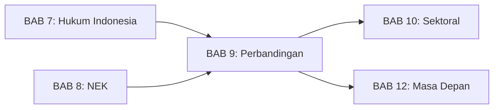
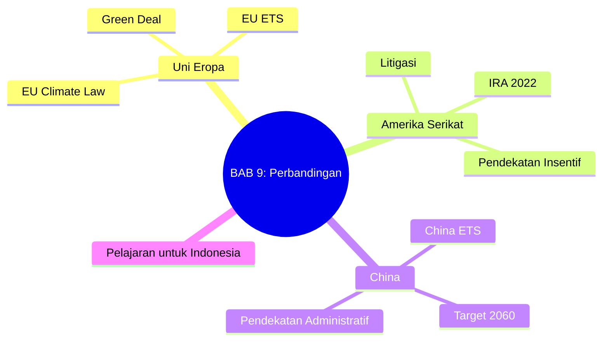
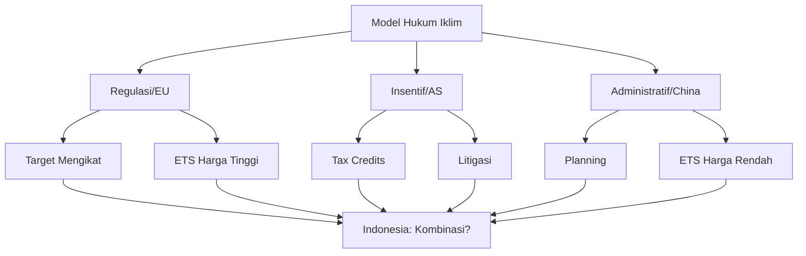

# BAB 9: Studi Perbandingan Hukum Iklim

---

## A. PENDAHULUAN

### 1. Capaian Pembelajaran (Sub-CPMK)

Setelah mempelajari bab ini, mahasiswa mampu:

1. **Membandingkan** pendekatan hukum iklim di berbagai yurisdiksi (EU, AS, China)
2. **Menganalisis** kelebihan dan kekurangan berbagai model regulasi iklim
3. **Mengevaluasi** relevansi pengalaman negara lain untuk Indonesia
4. **Mengidentifikasi** tren global dalam perkembangan hukum iklim

### 2. Indikator Pencapaian

- [ ] Mahasiswa dapat menjelaskan perbedaan pendekatan regulasi, insentif, dan administratif
- [ ] Mahasiswa dapat menganalisis kelebihan dan kelemahan EU ETS vs China ETS
- [ ] Mahasiswa dapat menjelaskan dampak CBAM terhadap ekspor Indonesia
- [ ] Mahasiswa dapat merumuskan rekomendasi untuk penguatan hukum iklim Indonesia

### 3. Deskripsi Singkat

Hukum iklim berkembang dengan berbagai model di seluruh dunia. EU memilih pendekatan regulasi komprehensif dengan target mengikat, AS mengandalkan insentif pasar dan litigasi, sementara China menggunakan perencanaan administratif. Bab ini mengkaji pendekatan-pendekatan tersebut dan relevansinya untuk Indonesia sebagai negara berkembang dengan profil emisi dan kapasitas yang berbeda.

### 4. Hubungan dengan Bab Lain

Bab ini melengkapi [[Buku-Ajar-Hukum-Perubahan-Iklim-07-Kerangka-Hukum-Indonesia_BAB-07|BAB 7]] dan [[Buku-Ajar-Hukum-Perubahan-Iklim-08-Nilai-Ekonomi-Karbon_BAB-08|BAB 8]] dengan perspektif komparatif dari yurisdiksi lain untuk memberikan konteks global bagi perkembangan hukum iklim Indonesia.

### 5. Peta Konsep Bab

---

## B. PENYAJIAN MATERI

### 1. Uni Eropa: Model Regulasi Komprehensif

Uni Eropa adalah yurisdiksi yang paling maju dalam pengembangan hukum iklim. Dengan populasi 450 juta jiwa dan PDB gabungan terbesar kedua di dunia, kebijakan iklim EU memiliki dampak global—baik sebagai contoh bagi negara lain maupun melalui mekanisme seperti Carbon Border Adjustment Mechanism yang secara langsung mempengaruhi mitra dagang termasuk Indonesia.[^1]

Pendekatan EU dapat dikarakterisasi sebagai **model regulasi komprehensif**: target-target yang mengikat secara hukum, dikombinasikan dengan berbagai instrumen ekonomi dan regulasi sektoral yang terintegrasi. Model ini mencerminkan tradisi hukum Eropa yang menekankan kepastian hukum dan peran aktif negara dalam mengarahkan ekonomi.

[^1]: Oberthür S dan Pallemaerts M (eds), *The New Climate Policies of the European Union* (VUB Press 2010) 15-30.

#### 1.1 European Climate Law (2021): Target Mengikat dalam Hukum

**Regulation (EU) 2021/1119** atau *European Climate Law* adalah regulasi landmark yang mengkodifikasi komitmen iklim EU dalam hukum yang mengikat. Diadopsi pada Juni 2021, regulasi ini menetapkan kerangka hukum untuk mencapai netralitas iklim EU pada 2050.[^2]

Elemen-elemen kunci European Climate Law:

**Target 2030**: Pengurangan emisi GRK netto minimal 55% dibandingkan tingkat 1990. Target ini merupakan peningkatan signifikan dari target sebelumnya (40%) dan mencerminkan ambisi yang diperlukan untuk jalur 1,5°C.[^3]

**Target 2050**: Netralitas iklim (*climate neutrality*)—yaitu keseimbangan antara emisi dan penyerapan GRK sehingga emisi netto menjadi nol. Setelah 2050, EU bertujuan mencapai emisi negatif.

**Mekanisme akuntabilitas**: European Climate Law mewajibkan Komisi Eropa mengevaluasi kemajuan setiap lima tahun dan, jika perlu, mengajukan langkah-langkah tambahan. European Scientific Advisory Board on Climate Change—badan independen—memberikan nasihat ilmiah tentang kecukupan kebijakan.

**Trajektori yang mengikat**: Tidak hanya target akhir, tetapi juga jalur (*trajectory*) menuju target tersebut bersifat mengikat. Ini mencegah penundaan aksi dengan harapan mencapai target di menit-menit terakhir.[^4]

Implikasi hukum European Climate Law sangat signifikan. Sebagai Regulation (bukan Directive), ia langsung berlaku di semua negara anggota tanpa perlu transposisi ke hukum nasional. Target-target yang ditetapkan dapat menjadi dasar judicial review terhadap kebijakan yang inkonsisten, sebagaimana terbukti dalam kasus-kasus litigasi iklim Eropa.[^5]

[^2]: Regulation (EU) 2021/1119 of the European Parliament and of the Council of 30 June 2021 establishing the framework for achieving climate neutrality [2021] OJ L243/1.
[^3]: ibid art 4(1).
[^4]: ibid art 4(3)-(5).
[^5]: Peeters M dan Stallworthy M, 'The European Climate Law: A Critical Analysis' (2022) 31 European Energy and Environmental Law Review 167, 175-180.

#### 1.2 EU Emissions Trading System (EU ETS): Pasar Karbon Tertua

**EU Emissions Trading System** (EU ETS) adalah sistem perdagangan emisi multinasional pertama dan tertua di dunia, diluncurkan pada 2005. Pengalaman hampir dua dekade EU ETS menyediakan pelajaran berharga tentang desain dan implementasi pasar karbon.[^6]

EU ETS beroperasi dengan prinsip *cap and trade*: total emisi yang diizinkan (*cap*) ditetapkan dan diturunkan setiap tahun; *allowances* (izin emisi) dialokasikan atau dilelang kepada instalasi yang tercakup; instalasi yang mengurangi emisi di bawah allowance-nya dapat menjual kelebihan, sementara yang melebihi harus membeli. Mekanisme ini menciptakan harga karbon yang mencerminkan kelangkaan hak emisi.[^7]

**Cakupan**: EU ETS mencakup sekitar 10.000 instalasi di sektor ketenagalistrikan, industri berat (baja, semen, kimia), dan penerbangan intra-EU—totalnya sekitar 40% emisi EU. Fase 4 (2021-2030) akan memperluas cakupan ke transportasi maritim.[^8]

**Evolusi harga karbon**: Harga karbon di EU ETS mengalami fluktuasi signifikan. Pada fase awal (2005-2012), oversupply allowances menyebabkan harga jatuh mendekati nol. Reformasi Market Stability Reserve (2019) berhasil menstabilkan pasar, dan harga naik tajam mencapai €80-100 per ton pada 2022-2024—level yang mulai memberikan sinyal investasi yang bermakna untuk dekarbonisasi.[^9]

**Pelajaran dari EU ETS**:
- **Pentingnya cap yang ketat**: Cap yang terlalu longgar menghasilkan harga rendah dan insentif lemah
- **Kebutuhan mekanisme stabilisasi**: Market Stability Reserve mencegah volatilitas berlebihan
- **Transisi dari alokasi gratis ke lelang**: Mengurangi windfall profits dan meningkatkan pendapatan untuk dana iklim
- **Perluasan cakupan bertahap**: Dimulai dari sektor-sektor dengan data emisi yang baik sebelum diperluas

[^6]: Ellerman AD, Convery FJ dan de Perthuis C, *Pricing Carbon: The European Union Emissions Trading Scheme* (Cambridge University Press 2010) 10-25.
[^7]: Directive 2003/87/EC establishing a scheme for greenhouse gas emission allowance trading [2003] OJ L275/32 (sebagaimana diubah).
[^8]: European Commission, 'EU Emissions Trading System (EU ETS)' <https://climate.ec.europa.eu/eu-action/eu-emissions-trading-system-eu-ets_en> diakses 15 November 2025.
[^9]: ICAP, *Emissions Trading Worldwide: Status Report 2024* (ICAP 2024) 45-50.

#### 1.3 European Green Deal dan Fit for 55

**European Green Deal**, yang diluncurkan Desember 2019, adalah strategi pertumbuhan komprehensif yang bertujuan mentransformasi EU menjadi ekonomi modern, efisien sumber daya, dan kompetitif tanpa emisi GRK netto pada 2050.[^10]

Green Deal bukan sekadar kebijakan iklim—ia adalah visi transformasi ekonomi dan sosial yang mencakup energi, transportasi, industri, pertanian, konstruksi, dan keuangan. Implementasinya dilakukan melalui paket legislatif **Fit for 55**—sekitar selusin proposal regulasi untuk mencapai target pengurangan 55% pada 2030.[^11]

Elemen kunci Fit for 55 yang relevan untuk Indonesia:

**Carbon Border Adjustment Mechanism (CBAM)**: Mulai berlaku penuh pada 2026, CBAM mengenakan biaya karbon pada impor produk tertentu (semen, baja, aluminium, pupuk, listrik, hidrogen) ke EU. Importir harus membeli sertifikat CBAM dengan harga setara harga karbon EU ETS. Tujuannya mencegah *carbon leakage*—perpindahan produksi ke yurisdiksi tanpa harga karbon—sekaligus mendorong mitra dagang untuk mengadopsi kebijakan iklim.[^12]

Dampak CBAM untuk Indonesia berpotensi signifikan. Ekspor baja, aluminium, dan pupuk Indonesia ke EU akan terkena CBAM. Tanpa harga karbon domestik yang setara, eksportir Indonesia akan menghadapi biaya tambahan yang mengurangi daya saing. Ini menjadi salah satu pendorong pengembangan pasar karbon Indonesia.[^13]

**EU Taxonomy for Sustainable Finance**: Sistem klasifikasi yang mendefinisikan aktivitas ekonomi "berkelanjutan" untuk tujuan investasi. Taxonomy menjadi dasar disclosure wajib bagi lembaga keuangan dan perusahaan besar. Indonesia telah mengadopsi pendekatan serupa melalui Taksonomi Keuangan Berkelanjutan Indonesia (TKBI).[^14]

[^10]: European Commission, 'The European Green Deal' COM(2019) 640 final.
[^11]: European Commission, 'Fit for 55: Delivering the EU's 2030 Climate Target' COM(2021) 550 final.
[^12]: Regulation (EU) 2023/956 establishing a carbon border adjustment mechanism [2023] OJ L130/52.
[^13]: IESR, *CBAM and Its Implications for Indonesia* (IESR 2023) 15-25.
[^14]: Regulation (EU) 2020/852 on the establishment of a framework to facilitate sustainable investment [2020] OJ L198/13.

---

### 2. Amerika Serikat: Pendekatan Berbasis Insentif

Amerika Serikat menempuh jalur yang berbeda dari Uni Eropa dalam kebijakan iklimnya. Alih-alih target yang mengikat secara hukum dan pasar karbon nasional, AS mengandalkan kombinasi insentif ekonomi, regulasi sektoral oleh badan eksekutif, dan—secara unik—litigasi sebagai mekanisme penegakan. Pendekatan ini mencerminkan realitas politik AS di mana legislasi iklim komprehensif sulit mendapat dukungan bipartisan di Kongres.[^15]

Meskipun AS tidak meratifikasi Protokol Kyoto dan sempat mundur dari Paris Agreement (2017-2021 di bawah pemerintahan Trump), negara ini tetap menjadi pemain kunci dalam kebijakan iklim global—baik melalui aksi tingkat negara bagian, inovasi teknologi, maupun litigasi yang memaksa aksi korporat.[^16]

[^15]: Carlarne CP, Gray KR dan Tarasofsky RG (eds), *The Oxford Handbook of International Climate Change Law* (Oxford University Press 2016) 637-658.
[^16]: Falkner R, 'The Paris Agreement and the new logic of international climate politics' (2016) 92 International Affairs 1107, 1115-1120.

#### 2.1 Inflation Reduction Act 2022 (IRA): Paradigma Baru Kebijakan Iklim

**Inflation Reduction Act** (IRA) yang ditandatangani Presiden Biden pada Agustus 2022 menandai pergeseran paradigma dalam kebijakan iklim AS. Dengan alokasi **USD 369 miliar** untuk energi dan iklim—investasi iklim terbesar dalam sejarah AS—IRA menunjukkan bahwa insentif dapat menggantikan regulasi ketat ketika yang terakhir tidak layak secara politik.[^17]

Pendekatan IRA sangat berbeda dari model Eropa. Alih-alih menetapkan *cap* emisi atau target yang mengikat, IRA menggunakan **insentif pajak** (*tax credits*) untuk mendorong transisi energi. Filosofinya: daripada menghukum emisi, berikan imbalan untuk aksi yang baik.[^18]

**Instrumen utama IRA:**

**Production Tax Credit (PTC)**: Kredit pajak untuk produksi energi bersih—sekitar USD 27.5 per MWh untuk energi angin dan surya. Kredit ini membuat energi terbarukan kompetitif secara ekonomi bahkan tanpa subsidi lain.[^19]

**Investment Tax Credit (ITC)**: Kredit pajak hingga 30% untuk investasi dalam energi bersih, termasuk penyimpanan baterai, hidrogen hijau, dan carbon capture. *Bonus credits* tersedia untuk proyek di komunitas energi (*energy communities*) dan yang memenuhi standar upah dan apprenticeship.[^20]

**Electric Vehicle Credits**: Kredit hingga USD 7,500 untuk pembelian kendaraan listrik yang diproduksi di Amerika Utara dengan komponen baterai yang memenuhi persyaratan domestik. Ini menciptakan insentif untuk onshoring rantai pasok EV.[^21]

**Implikasi IRA untuk Indonesia**: Model insentif IRA menawarkan alternatif bagi negara berkembang yang menghadapi kendala kapasitas untuk regulasi ketat. Namun, IRA juga menimbulkan kekhawatiran tentang *subsidy competition*—apakah negara berkembang mampu bersaing dengan insentif besar dari ekonomi maju? Indonesia perlu mempertimbangkan bagaimana IRA mempengaruhi daya tarik investasi energi bersih di kawasan.[^22]

[^17]: Inflation Reduction Act of 2022, Pub L No 117-169, 136 Stat 1818.
[^18]: Jenkins JD, Mayfield EN dan Farbes J, 'Preliminary Report: The Climate and Energy Impacts of the Inflation Reduction Act of 2022' (REPEAT Project, Princeton University 2022).
[^19]: IRA 2022 (n 17) s 13101 (amending 26 USC § 45).
[^20]: ibid s 13102 (amending 26 USC § 48).
[^21]: ibid s 13401 (amending 26 USC § 30D).
[^22]: IESR, *Green Investment Outlook: Indonesia's Pathways to a Low Carbon Economy* (IESR 2024) 45-50.

#### 2.2 Regulasi EPA: Clean Air Act sebagai Fondasi

Di samping legislasi Kongres, regulasi oleh **Environmental Protection Agency** (EPA) berdasarkan **Clean Air Act** (1970) menjadi instrumen penting kebijakan iklim AS. Penggunaan undang-undang lingkungan yang sudah ada untuk mengatur emisi GRK—bukan legislasi iklim khusus—adalah pendekatan khas AS yang dibentuk oleh preseden yudisial.[^23]

Titik balik datang dari putusan Mahkamah Agung dalam ***Massachusetts v. EPA*** (2007). Dalam kasus landmark ini, pengadilan memutuskan bahwa CO₂ dan GRK lainnya adalah "polutan" di bawah Clean Air Act, sehingga EPA berwenang—dan bahkan mungkin wajib—mengaturnya.[^24] Putusan ini membuka pintu bagi serangkaian regulasi iklim oleh EPA.

**Regulasi utama berdasarkan Clean Air Act:**

**Endangerment Finding (2009)**: EPA secara resmi menemukan bahwa emisi GRK membahayakan kesehatan dan kesejahteraan publik, memenuhi prasyarat untuk regulasi di bawah Clean Air Act.[^25]

**Clean Power Plan (2015) dan Affordable Clean Energy (2019)**: Upaya untuk mengatur emisi pembangkit listrik. Clean Power Plan era Obama berupaya mendorong peralihan dari batubara ke gas dan energi terbarukan, tetapi ditangguhkan oleh Mahkamah Agung dan digantikan oleh versi yang lebih lemah di era Trump.[^26]

**Pembatasan pasca-*West Virginia v. EPA* (2022)**: Mahkamah Agung dalam putusan ini menerapkan "major questions doctrine", membatasi kewenangan EPA untuk mewajibkan *generation shifting* (peralihan dari satu jenis pembangkit ke lainnya) tanpa otorisasi eksplisit dari Kongres. Putusan ini mempersempit ruang regulasi EPA tetapi tidak menghilangkannya sepenuhnya.[^27]

**Standar Kendaraan**: EPA dan NHTSA (National Highway Traffic Safety Administration) menetapkan standar emisi dan efisiensi bahan bakar untuk kendaraan. Standar era Biden yang diperketat bertujuan mendorong elektrifikasi armada kendaraan AS.[^28]

[^23]: Carlarne CP, 'Regulating Climate Change in the United States' in Carlarne, Gray dan Tarasofsky (n 15) 637-658.
[^24]: Massachusetts v Environmental Protection Agency, 549 US 497 (2007).
[^25]: EPA, 'Endangerment and Cause or Contribute Findings for Greenhouse Gases Under Section 202(a) of the Clean Air Act' 74 Fed Reg 66496 (2009).
[^26]: Clean Power Plan, 80 Fed Reg 64662 (2015); Affordable Clean Energy Rule, 84 Fed Reg 32520 (2019).
[^27]: West Virginia v Environmental Protection Agency, 597 US ___ (2022).
[^28]: EPA, 'Multi-Pollutant Emissions Standards for Model Years 2027 and Later Light-Duty and Medium-Duty Vehicles' 89 Fed Reg 27842 (2024).

#### 2.3 Peran Litigasi: Pengadilan sebagai Arena Kebijakan Iklim

Amerika Serikat memiliki tradisi litigasi iklim yang paling berkembang di dunia. Dengan lebih dari 1,500 kasus terkait iklim yang diajukan—sekitar separuh dari total kasus global—pengadilan AS berfungsi sebagai arena alternatif untuk kebijakan iklim ketika proses legislatif dan eksekutif terhambat.[^29]

**Kategori litigasi iklim AS:**

**Litigasi terhadap pemerintah federal dan negara bagian**: Tuntutan agar pemerintah mengambil aksi iklim yang lebih ambisius. Kasus seperti *Juliana v. United States* (2015-2020)—di mana pemuda menggugat pemerintah federal atas kegagalan menangani perubahan iklim—meskipun ditolak atas alasan prosedural, menarik perhatian publik dan membentuk diskursus.[^30]

**Litigasi terhadap korporasi fosil**: Berbagai negara bagian dan kota menggugat perusahaan minyak besar (ExxonMobil, Chevron, Shell, BP) dengan tuduhan telah mengetahui dampak iklim dari produk mereka sejak dekade 1970-an tetapi menyembunyikan informasi dan mendanai kampanye disinformasi. Teori hukum meliputi penipuan konsumen, *public nuisance*, dan kegagalan memperingatkan.[^31]

**Litigasi *greenwashing***: Gugatan terhadap klaim lingkungan yang menyesatkan oleh korporasi. SEC dan FTC juga meningkatkan penegakan terhadap klaim ESG yang tidak berdasar.[^32]

**Public trust doctrine**: Beberapa kasus mengandalkan doktrin bahwa negara memiliki kewajiban fidusiari untuk melindungi sumber daya alam bagi generasi mendatang. Meskipun belum berhasil di tingkat federal, doktrin ini mendapat penerimaan di beberapa yurisdiksi negara bagian.[^33]

**Pelajaran litigasi AS untuk Indonesia**: Meskipun tradisi hukum berbeda, litigasi iklim mulai muncul di Indonesia. Kasus [[02-Yurisprudensi-Domestik_Wahana_Lingkungan_Hidup|WALHI v. Pemerintah RI]] dan gugatan-gugatan terkait kebakaran hutan menunjukkan potensi pengadilan sebagai forum untuk akuntabilitas iklim. Penguatan akses keadilan dan *legal standing* organisasi lingkungan akan memperluas peran ini.[^34]

[^29]: Setzer J dan Higham C, *Global Trends in Climate Change Litigation: 2023 Snapshot* (Grantham Research Institute, LSE 2023) 5-10.
[^30]: Juliana v United States, 947 F 3d 1159 (9th Cir 2020).
[^31]: Ganguly G, Setzer J dan Heyvaert V, 'If at First You Don't Succeed: Suing Corporations for Climate Change' (2018) 38 Oxford Journal of Legal Studies 841.
[^32]: SEC, 'The Enhancement and Standardization of Climate-Related Disclosures for Investors' 89 Fed Reg 21668 (2024).
[^33]: Blumm MC dan Wood MC, *The Public Trust Doctrine in Environmental and Natural Resources Law* (2nd edn, Carolina Academic Press 2015) 301-330.
[^34]: ICEL, *Litigasi Lingkungan di Indonesia: Perkembangan dan Tantangan* (ICEL 2023) 78-95.

---

### 3. China: Pendekatan Administratif

China adalah emitter GRK terbesar di dunia, bertanggung jawab atas sekitar 30% emisi global—melebihi gabungan AS dan EU. Keputusan kebijakan iklim China memiliki implikasi eksistensial bagi pencapaian target Paris Agreement. Pendekatan China terhadap tata kelola iklim mencerminkan model pembangunannya yang lebih luas: perencanaan terpusat dengan implementasi terdesentralisasi, target administratif yang kuat, dan kontrol negara atas sektor-sektor strategis.[^35]

Berbeda dengan EU yang mengandalkan instrumen pasar dan AS yang menggabungkan insentif dengan litigasi, China menggunakan **pendekatan administratif**—target ditetapkan melalui rencana pembangunan lima tahunan (*Five-Year Plans*) dan diimplementasikan melalui sistem birokrasi dari pusat ke daerah. Kepatuhan dijamin melalui evaluasi kinerja pejabat yang dikaitkan dengan pencapaian target lingkungan.[^36]

[^35]: Teng F dan Wang P, 'The Evolution of Climate Governance in China: Drivers, Features, and Future Direction' (2021) 4 Environmental Science and Ecotechnology 100082.
[^36]: Kostka G, 'China's Campaign-Style Climate Governance' in Dubash NK (ed), *Handbook of Climate Change and India* (Oxford University Press 2021) 285-305.

#### 3.1 Target Iklim dan Rencana Pembangunan Nasional

Pada September 2020, Presiden Xi Jinping mengumumkan komitmen historis China dalam pidato di Sidang Umum PBB: **emisi puncak sebelum 2030** (*peak emissions*) dan **netralitas karbon pada 2060** (*carbon neutrality*). Pengumuman ini mengejutkan pengamat internasional karena melebihi ekspektasi dan memberikan momentum signifikan bagi diplomasi iklim global menjelang COP26.[^37]

Target-target ini kemudian diintegrasikan ke dalam dokumen perencanaan formal:

**Rencana Pembangunan Lima Tahun ke-14 (2021-2025)**: Menetapkan target penurunan intensitas karbon 18% dan intensitas energi 13,5% dibandingkan tingkat 2020. Porsi energi non-fosil dalam bauran energi primer ditargetkan mencapai 20% pada 2025.[^38]

**1+N Policy Framework**: Sistem kebijakan yang terdiri dari satu dokumen panduan utama (*guiding document*) dan berbagai kebijakan sektoral (*N policies*). Dokumen panduan yang diterbitkan Oktober 2021 menetapkan *roadmap* dekarbonisasi lintas sektor dari 2021 hingga 2060.[^39]

**Target sektoral spesifik**: Kapasitas tenaga surya dan angin gabungan 1,200 GW pada 2030; *peaking* emisi sektor industri berat sebelum 2030; elektrifikasi transportasi dengan 50% penjualan kendaraan baru adalah NEV (*new energy vehicles*) pada 2035.[^40]

**Keterbatasan komitmen**: Penting dicatat bahwa target China adalah *peaking* emisi, bukan pengurangan absolut, pada 2030. Emisi China masih dapat meningkat signifikan sebelum mencapai puncak. Kritik internasional menunjuk pada inkonsistensi antara target iklim dan pembangunan besar-besaran kapasitas batubara baru yang masih berlanjut hingga 2022.[^41]

[^37]: Xi J, 'Statement at the General Debate of the 75th Session of the United Nations General Assembly' (22 September 2020).
[^38]: National People's Congress, '14th Five-Year Plan for Economic and Social Development and Long-Range Objectives Through the Year 2035' (2021).
[^39]: CPC Central Committee dan State Council, 'Working Guidance for Carbon Dioxide Peaking and Carbon Neutrality in Full and Faithful Implementation of the New Development Philosophy' (24 October 2021).
[^40]: ibid.
[^41]: Global Energy Monitor, *Boom and Bust Coal 2023* (Global Energy Monitor 2023) 15-25.

#### 3.2 China ETS: Pasar Karbon Terbesar dengan Karakteristik Berbeda

**China National Emissions Trading Scheme** (China ETS) yang diluncurkan Juli 2021 adalah sistem perdagangan emisi terbesar di dunia berdasarkan cakupan emisi—mencakup sekitar 4,5 miliar ton CO₂, hampir dua kali lipat EU ETS. Namun, desain dan operasinya sangat berbeda dari model Eropa.[^42]

**Cakupan dan fase**: Berbeda dengan EU ETS yang mencakup berbagai sektor, China ETS saat ini **hanya mencakup sektor ketenagalistrikan**—sekitar 2,200 instalasi pembangkit listrik. Perluasan ke sektor lain (semen, baja, aluminium, petrokimia, kertas, penerbangan) direncanakan bertahap, dengan semen dan aluminium dijadwalkan masuk pada 2024-2025.[^43]

**Mekanisme berbasis intensitas**: China ETS menggunakan sistem **berbasis intensitas** (*intensity-based*), bukan *cap* absolut seperti EU ETS. Allowance dialokasikan berdasarkan intensitas karbon per unit output (ton CO₂/MWh), bukan batas emisi total. Ini berarti fasilitas yang efisien mendapat surplus, sementara yang tidak efisien harus membeli—tetapi total emisi sektor masih dapat meningkat jika output meningkat.[^44]

**Harga karbon rendah**: Harga karbon di China ETS berkisar **RMB 50-90 per ton** (USD 7-13), jauh di bawah harga EU ETS (€80-100). Harga rendah ini mencerminkan desain yang hati-hati untuk menghindari dampak ekonomi signifikan selama fase awal. Likuiditas pasar juga terbatas karena pembatasan pada spekulasi.[^45]

**Pelajaran China ETS**:
- **Mulai sederhana, perluas bertahap**: Memulai dengan satu sektor yang datanya baik sebelum perluasan
- **Alokasi gratis untuk transisi**: Alokasi gratis penuh mengurangi resistensi industri
- **Trade-off intensitas vs cap**: Sistem intensitas lebih *politically palatable* tetapi kurang efektif untuk pengurangan emisi absolut
- **Pentingnya MRV**: Sistem monitoring, reporting, dan verification yang ketat diperlukan untuk integritas pasar

[^42]: ICAP (n 9) 58-65.
[^43]: Ministry of Ecology and Environment, 'Interim Regulations on Carbon Emissions Trading Management' (2024).
[^44]: Zhang D, Karplus VJ dan Cassisa C, 'Emissions Trading in China: Progress and Prospects' (2014) 75 Energy Policy 9.
[^45]: ICAP (n 9) 60-62.

---

### 4. Pelajaran untuk Indonesia

Perbandingan tiga model utama hukum iklim global—regulasi komprehensif EU, insentif pasar AS, dan pendekatan administratif China—memberikan wawasan berharga bagi pengembangan kerangka hukum iklim Indonesia. Tidak ada model tunggal yang dapat diadopsi secara utuh; Indonesia perlu merancang pendekatan hibrida yang sesuai dengan konteks kelembagaan, kapasitas, dan prioritas pembangunan nasional.[^46]

#### 4.1 Matriks Perbandingan

Tabel berikut merangkum perbandingan karakteristik utama dari ketiga model:

| Aspek | Uni Eropa | Amerika Serikat | China | Indonesia (Saat Ini) |
|-------|-----------|-----------------|-------|---------------------|
| **Pendekatan utama** | Regulasi (*command-and-control*) | Insentif fiskal | Administratif (perencanaan) | Campuran |
| **Sifat target** | Mengikat secara hukum | Tidak mengikat (kebijakan) | Administratif (FYP) | Kebijakan (NDC) |
| **Pasar karbon** | Matang, €80-100/ton | Fragmentasi regional | Terbesar, USD 7-13/ton | Fase awal, USD 2-5/ton |
| **Mekanisme penegakan** | Pengadilan EU, sanksi | Litigasi, regulasi EPA | Evaluasi birokrasi | Masih berkembang |
| **Peran yudisial** | Signifikan (*Urgenda*-style) | Sangat kuat | Minimal | Terbatas |
| **Integrasi sektoral** | Tinggi (Green Deal) | Rendah (silo) | Tinggi (1+N) | Berkembang |

[^46]: Jotzo F dan Löschel A, 'Emissions Trading in China: Emerging Experiences and International Lessons' (2014) 75 Energy Policy 3.

#### 4.2 Elemen yang Dapat Diadaptasi untuk Indonesia

Dari masing-masing model, Indonesia dapat mengambil pelajaran spesifik:

**Dari Uni Eropa:**

**Target yang mengikat secara hukum**: Indonesia saat ini mengandalkan komitmen NDC yang bersifat kebijakan, bukan hukum. Penguatan status hukum target iklim—misalnya melalui undang-undang perubahan iklim yang komprehensif—akan meningkatkan kepastian hukum dan memberikan dasar bagi akuntabilitas.[^47]

**Taksonomi keuangan berkelanjutan**: EU Taxonomy telah menginspirasi Taksonomi Keuangan Berkelanjutan Indonesia (TKBI) yang diterbitkan OJK. Penguatan dan perluasan TKBI akan mengarahkan aliran modal ke investasi rendah karbon.[^48]

**Mekanisme perbatasan**: Meskipun Indonesia tidak dalam posisi untuk menerapkan CBAM, pemahaman tentang mekanisme ini penting untuk negosiasi perdagangan dan penyelarasan pasar karbon domestik agar ekspor Indonesia tidak terkena penalti tambahan di pasar Eropa.[^49]

**Dari Amerika Serikat:**

**Insentif fiskal untuk energi bersih**: Pendekatan tax credit IRA menawarkan model untuk mendorong investasi tanpa regulasi ketat. Indonesia dapat memperluas insentif pajak untuk energi terbarukan, kendaraan listrik, dan teknologi rendah karbon lainnya.[^50]

**Penguatan peran litigasi**: Meskipun tradisi hukum berbeda, Indonesia dapat memperluas akses keadilan untuk sengketa lingkungan dan iklim. Penguatan legal standing organisasi lingkungan dan class action akan meningkatkan akuntabilitas.[^51]

**Penggunaan undang-undang yang ada**: Seperti AS menggunakan Clean Air Act, Indonesia dapat lebih mengoptimalkan UU PPLH untuk mengatur emisi GRK tanpa menunggu legislasi iklim khusus.

**Dari China:**

**Integrasi dalam perencanaan pembangunan**: China mengintegrasikan target iklim dalam Rencana Lima Tahun—dokumen perencanaan utama negara. Indonesia dapat lebih eksplisit mengintegrasikan target iklim dalam RPJMN dan RPJPN.[^52]

**Pengembangan pasar karbon bertahap**: Pendekatan China yang memulai ETS dari satu sektor (ketenagalistrikan) sebelum perluasan sejalan dengan arah PP 12/2024 Indonesia yang memulai dengan sektor FOLU dan energi.[^53]

**Sistem MRV yang kuat**: Investasi dalam sistem monitoring, reporting, dan verification adalah prasyarat untuk pasar karbon yang kredibel. Indonesia perlu memperkuat infrastruktur MRV di semua sektor.

[^47]: IESR, *Towards a Climate Change Law for Indonesia* (IESR 2024) 5-15.
[^48]: OJK, *Taksonomi Keuangan Berkelanjutan Indonesia Edisi 2* (OJK 2024).
[^49]: Mehling M dan Ritz RA, 'Going Beyond Default Intensities in an EU Carbon Border Adjustment Mechanism' (2022) 7 Review of Environmental Economics and Policy 295.
[^50]: Inderst G dan Stewart F, *Institutional Investment in Infrastructure in Emerging Markets and Developing Economies* (World Bank 2014) 35-50.
[^51]: Putusan Mahkamah Konstitusi Nomor 91/PUU-XVIII/2020 tentang UU Cipta Kerja.
[^52]: Teng dan Wang (n 35).
[^53]: Peraturan Pemerintah Nomor 12 Tahun 2024 tentang Penyelenggaraan Nilai Ekonomi Karbon (PP NEK).

#### 4.3 Tantangan Implementasi di Indonesia

Adopsi elemen-elemen dari model internasional menghadapi tantangan spesifik konteks Indonesia:

**Kapasitas kelembagaan**: Regulasi komprehensif ala EU memerlukan kapasitas birokrasi yang kuat untuk penegakan. Fragmentasi kewenangan antara kementerian—KLHK, ESDM, Kemenperin, Kemenkeu—mempersulit koordinasi.[^54]

**Ruang fiskal terbatas**: Model insentif ala IRA memerlukan anggaran besar yang sulit disediakan mengingat prioritas pembangunan lain. Indonesia lebih mengandalkan pendanaan internasional dan private finance.

**Tradisi hukum**: Model litigasi AS berkembang dalam tradisi *common law* dengan *stare decisis*. Sistem hukum sipil Indonesia memberikan peran berbeda bagi yurisprudensi, meskipun putusan-putusan penting tetap berpengaruh.

**Prioritas pembangunan**: Berbeda dengan EU yang sudah *industrialized*, Indonesia masih dalam fase pembangunan dengan kebutuhan pertumbuhan ekonomi dan pengentasan kemiskinan. Kebijakan iklim harus seimbang dengan agenda pembangunan—*just transition* menjadi kata kunci.[^55]

**Konteks federal vs unitary**: Model China yang terpusat cocok dengan struktur negara kesatuan Indonesia, tetapi desentralisasi pasca-reformasi memberikan kewenangan signifikan kepada pemerintah daerah yang kapasitasnya bervariasi.

[^54]: BAPPENAS, *Kajian Kelembagaan Penanganan Perubahan Iklim di Indonesia* (BAPPENAS 2023).
[^55]: ILO, *Just Transition towards Environmentally Sustainable Economies and Societies for All* (ILO 2015).

#### 4.4 Rekomendasi Sintesis

Berdasarkan analisis komparatif, berikut rekomendasi untuk penguatan hukum iklim Indonesia:

1. **Rancang Undang-Undang Perubahan Iklim** yang komprehensif dengan target yang mengikat, mengadopsi elemen terbaik dari EU Climate Law tetapi disesuaikan dengan konteks Indonesia.[^56]

2. **Perkuat dan perluas Perpres 98/2021** menjadi kerangka NEK yang lebih komprehensif dengan trajectory penurunan emisi yang jelas dan mekanisme akuntabilitas.

3. **Kembangkan pasar karbon secara bertahap** mengikuti model China: mulai dari sektor dengan data baik, alokasi gratis di awal, dan perluasan cakupan seiring penguatan kapasitas MRV.

4. **Perluas insentif fiskal** untuk energi bersih dan teknologi rendah karbon, termasuk potensi *green sukuk* dan obligasi berdampak lingkungan.

5. **Perkuat akses keadilan** untuk litigasi iklim dengan memperjelas legal standing dan memperluas class action lingkungan.

6. **Integrasikan target iklim** secara eksplisit dalam RPJMN 2025-2029 dan RPJPN 2025-2045 dengan indikator yang terukur.

[^56]: Climate Policy Initiative, *Review of Indonesian Climate Change Policies* (CPI 2023) 45-60.

---

## C. STUDI KASUS

### Kasus: CBAM dan Dampaknya untuk Indonesia

EU CBAM akan mengenakan tarif karbon pada impor produk tertentu. Bagaimana dampaknya untuk ekspor Indonesia ke EU?

---

## D. PENUTUP

### 1. Rangkuman

Pada bab ini, kita telah mempelajari:

- **Uni Eropa:** Menerapkan pendekatan regulasi komprehensif melalui EU Climate Law (2021) dengan target mengikat 55% pengurangan pada 2030 dan netralitas iklim 2050. EU ETS sebagai sistem perdagangan karbon tertua (sejak 2005) dengan harga €80-100/ton, serta European Green Deal yang mencakup CBAM.

- **Amerika Serikat:** Menggunakan pendekatan berbasis insentif melalui Inflation Reduction Act 2022 (USD 369 miliar) dengan tax credits, bukan cap. Regulasi EPA berdasarkan Clean Air Act dan tradisi litigasi iklim yang kuat.

- **China:** Menerapkan pendekatan administratif melalui Five-Year Plans dengan target *peak* 2030 dan netralitas 2060. China ETS (2021) adalah yang terbesar di dunia berdasarkan cakupan, meskipun dengan harga rendah (~USD 8-10/ton).

- **Pelajaran untuk Indonesia:** Tidak ada model tunggal yang sempurna—Indonesia perlu mengombinasikan elemen regulasi, insentif, dan administratif sesuai konteks nasional, kapasitas kelembagaan, dan prioritas pembangunan.

---

### 2. Latihan

Kerjakan latihan berikut untuk memperdalam pemahaman Anda:

1. **Analisis Komparatif:** Bandingkan EU Climate Law dengan kerangka hukum iklim Indonesia saat ini. Apa kesenjangan utama yang perlu diatasi?

2. **Studi Dampak CBAM:** Identifikasi 5 produk ekspor utama Indonesia ke EU dan analisis potensi dampak CBAM terhadap masing-masing produk!

3. **Evaluasi IRA:** Apakah pendekatan insentif seperti IRA dapat diterapkan di Indonesia? Apa prasyarat yang diperlukan?

4. **Perbandingan ETS:** Mengapa harga karbon di EU jauh lebih tinggi dibanding China? Faktor apa yang menentukan efektivitas harga karbon?

5. **Rekomendasi Kebijakan:** Berdasarkan pelajaran dari EU, AS, dan China, rumuskan 3 rekomendasi konkret untuk penguatan hukum iklim Indonesia!

---

### 3. Tes Formatif

Jawablah pertanyaan-pertanyaan berikut untuk mengukur pemahaman Anda:

**Pilihan Ganda:**

1. EU Climate Law menetapkan target netralitas iklim pada:
   - a. 2040
   - b. 2050
   - c. 2060
   - d. 2070

2. Sistem perdagangan emisi (ETS) pertama dan tertua di dunia adalah:
   - a. China ETS
   - b. Korea ETS
   - c. EU ETS
   - d. California Cap-and-Trade

3. Inflation Reduction Act 2022 mengalokasikan dana untuk iklim dan energi sebesar:
   - a. USD 100 miliar
   - b. USD 369 miliar
   - c. USD 500 miliar
   - d. USD 1 triliun

4. Harga karbon di EU ETS pada 2024 berada pada kisaran:
   - a. USD 10-20/ton
   - b. USD 30-50/ton
   - c. €80-100/ton
   - d. €150-200/ton

5. China menargetkan pencapaian *carbon neutrality* pada:
   - a. 2050
   - b. 2055
   - c. 2060
   - d. 2070

**Benar atau Salah:**

6. CBAM adalah mekanisme EU untuk mengenakan tarif karbon pada impor. (B/S)

7. Pendekatan AS lebih mengandalkan regulasi ketat dibanding insentif pasar. (B/S)

8. China ETS mencakup semua sektor ekonomi. (B/S)

9. EU Green Deal mencakup Sustainable Finance Taxonomy. (B/S)

10. Litigasi iklim tidak berkembang di Amerika Serikat. (B/S)

---

### 4. Umpan Balik dan Tindak Lanjut

Cocokkan jawaban Anda dengan **Kunci Jawaban** di [[Buku-Ajar-Hukum-Perubahan-Iklim-Back-Matter-Lampiran_Lampiran-04-Kunci-Jawaban|Lampiran 4]].

**Kunci Jawaban Singkat:** 1-b, 2-c, 3-b, 4-c, 5-c, 6-B, 7-S, 8-S, 9-B, 10-S

**Rumus Penilaian:**

$$Tingkat\ Penguasaan = \frac{Jumlah\ Jawaban\ Benar}{10} \times 100\%$$

**Interpretasi dan Tindak Lanjut:**

| Tingkat Penguasaan | Kategori | Tindak Lanjut |
|--------------------|----------|---------------|
| **90 - 100%** | Baik Sekali | Selamat! Anda dapat melanjutkan ke [[Buku-Ajar-Hukum-Perubahan-Iklim-10-Hukum-Iklim-Sektoral_BAB-10|BAB 10]] |
| **80 - 89%** | Baik | Anda dapat melanjutkan, namun pelajari kembali bagian yang masih ragu |
| **70 - 79%** | Cukup | **Ulangi** materi bab ini, terutama bagian yang belum dikuasai |
| **< 70%** | Kurang | **Wajib mengulangi** seluruh materi bab ini sebelum melanjutkan |

---

### 5. Senarai Istilah Kunci

| Istilah | Bahasa Inggris | Definisi |
|---------|----------------|----------|
| EU ETS | *EU Emissions Trading System* | Sistem perdagangan emisi Uni Eropa |
| CBAM | *Carbon Border Adjustment Mechanism* | Tarif karbon untuk impor ke EU |
| IRA | *Inflation Reduction Act* | UU investasi iklim AS 2022 |
| Green Deal | *European Green Deal* | Paket kebijakan iklim komprehensif EU |
| *Tax credit* | *Tax credit* | Insentif pajak untuk investasi iklim |
| *Cap* | *Emissions cap* | Batasan emisi total dalam sistem ETS |
| *Peak emissions* | *Peak emissions* | Titik tertinggi emisi sebelum turun |
| EPA | *Environmental Protection Agency* | Badan Perlindungan Lingkungan AS |
| Fit for 55 | *Fit for 55 Package* | Paket kebijakan EU untuk target 55% |
| *Carbon neutrality* | *Carbon neutrality* | Netralitas karbon (emisi nol bersih) |

---

### 6. Daftar Pustaka Bab

**Sumber Primer:**

- Regulation (EU) 2021/1119 establishing the framework for achieving climate neutrality (*European Climate Law*).
- Inflation Reduction Act of 2022, Pub. L. No. 117-169, 136 Stat. 1818 (2022).
- Regulation (EU) 2023/956 on Carbon Border Adjustment Mechanism.

**Sumber Sekunder:**

- Dubash, N. K. (Ed.). (2021). *Handbook of Climate Change and India: Development, Politics, and Governance*. Oxford University Press.
- Falkner, R. (2016). "The Paris Agreement and the new logic of international climate politics." *International Affairs*, 92(5), 1107-1125.
- Jordan, A. et al. (2018). *Governing Climate Change: Polycentricity in Action?* Cambridge University Press.

**Sumber Pendukung:**

- European Commission. Climate Action. https://ec.europa.eu/clima/
- US EPA. Climate Change. https://www.epa.gov/climate-change
- ICAP. Emissions Trading Worldwide. https://icapcarbonaction.com/

---

### 7. Tautan Terkait

**Sumber dalam Vault:**
- [[03-Peraturan-Internasional_EU_Climate_Law_2021]] - Teks EU Climate Law
- [[03-Peraturan-Internasional_US_IRA_2022]] - Ringkasan Inflation Reduction Act
- [[01-Traktat_Paris_Agreement_2015]] - Konteks internasional

**Navigasi Buku:**
- ← [[Buku-Ajar-Hukum-Perubahan-Iklim-08-Nilai-Ekonomi-Karbon_BAB-08|BAB 8: Nilai Ekonomi Karbon dan Bursa Karbon]]
- → [[Buku-Ajar-Hukum-Perubahan-Iklim-10-Hukum-Iklim-Sektoral_BAB-10|BAB 10: Hukum Iklim Sektoral]]
- ↑ [[Buku-Ajar-Hukum-Perubahan-Iklim-00-Front-Matter_09-Tinjauan-Mata-Kuliah|Kembali ke Tinjauan Mata Kuliah]]

---

*Buku Ajar Hukum Perubahan Iklim | BAB 9*
